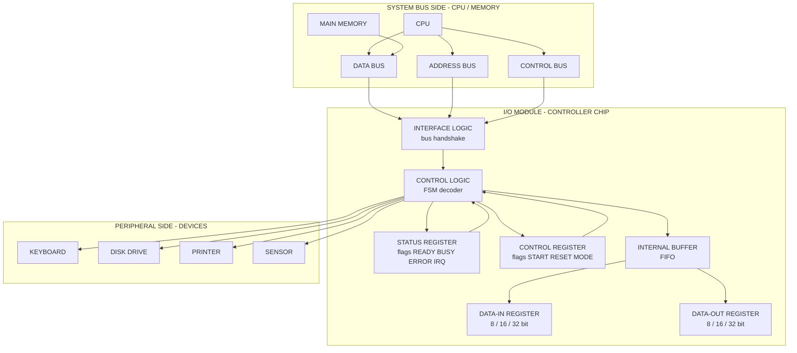
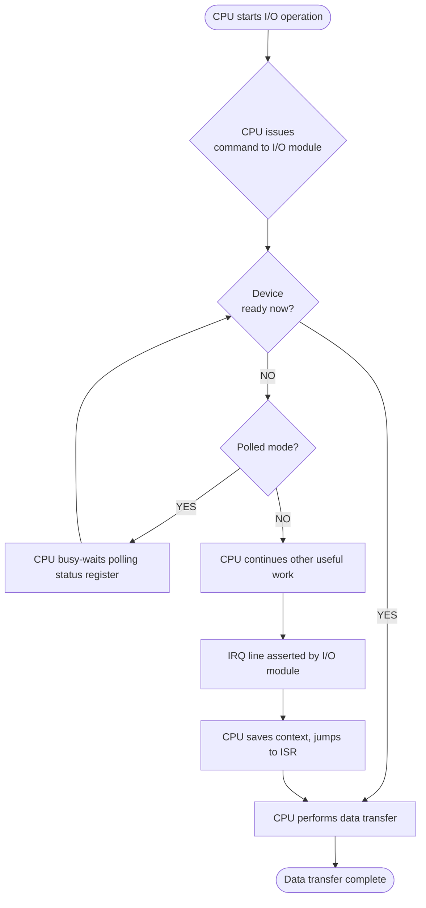
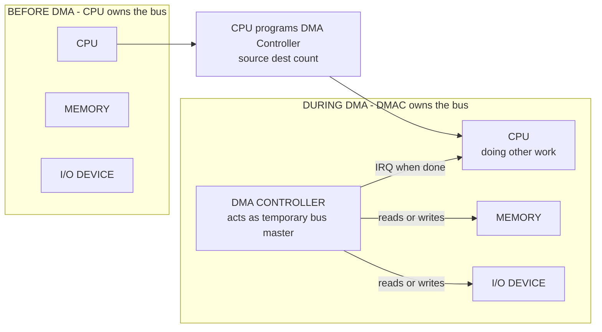
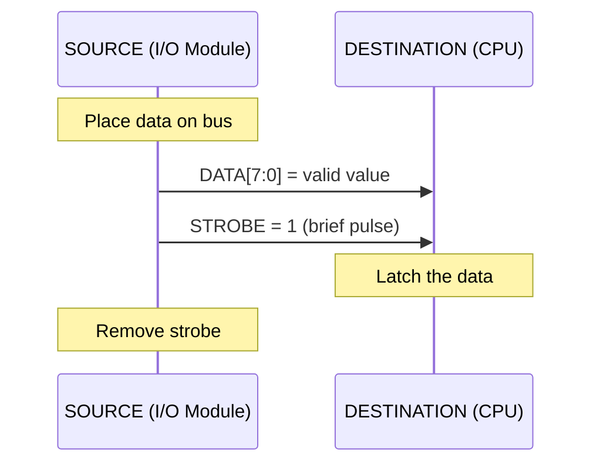
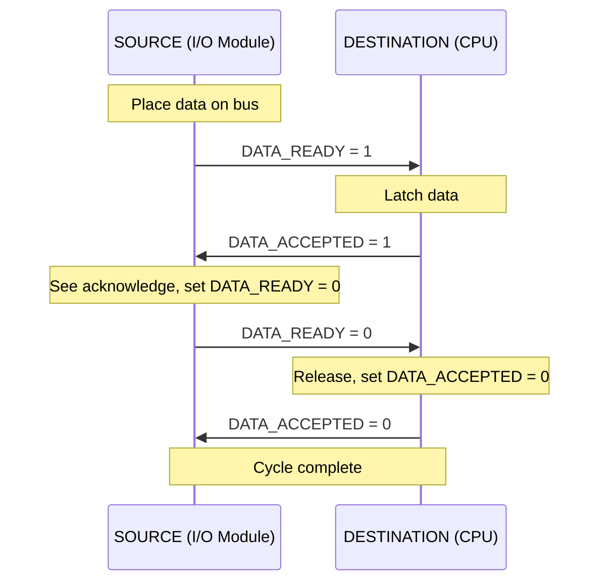

# I/O Modules

<!-- SECTION_1_START -->
# I/O Modules — Core Technical Definition & Intuitive Overview

> [!NOTE]
> **KTU 2024 Syllabus Definition (PBCST404 — Module 4)**
> An **Input/Output (I/O) Module** is the electronic interface logic that mediates all data, address, and control signal exchanges between the **CPU & main memory** subsystem and a wide variety of **external peripheral devices** (disk drives, keyboards, displays, sensors, printers, network cards, etc.). It hides the heterogeneous, asynchronous, and electromechanical nature of peripherals from the CPU, presenting a clean, uniform register-level interface that the processor can communicate with using standard bus cycles.

## Conceptual Analogy / Intuition

> [!TIP]
> **Real-world analogy — The Customs Officer at an International Airport**
>
> Think of the **CPU** as the **Prime Minister of a country** sitting in a sealed, secure office. The **peripherals** are the **citizens and foreign diplomats** trying to send/receive information. The **Prime Minister cannot, and should not, deal directly with every single citizen's quirks** (different languages, different document formats, different time zones). Instead, the PM communicates only with a well-trained **Customs Officer (the I/O Module)**, who:
>
> 1. **Translates** every citizen's request into the PM's official language.
> 2. **Verifies identity and documents** (status checking).
> 3. **Gives instructions** back in the citizen's understandable format (command issuance).
> 4. **Buffers** paperwork during busy hours (data buffering).
> 5. **Reports** any urgent matter to the PM immediately (interrupt generation).
> 6. **Manages bulk transfers** (like shipping containers) on its own to free the PM's time (DMA — Direct Memory Access).
>
> The I/O Module, therefore, is the **smart middleware** that decouples the ultra-fast digital CPU from the slow, varied, and messy world of physical I/O devices.

## Why an I/O Module is Indispensable

A computer system faces a **CPU–Peripheral Speed Mismatch Problem** that the I/O module resolves:

| Parameter | CPU / Memory | Typical Peripheral |
|---|---|---|
| Operating Speed | **nanoseconds (ns)** | **milliseconds (ms) to seconds** |
| Data Width | **8 / 16 / 32 / 64 bits (fixed)** | **1 to n bits (variable, often serial)** |
| Operating Mode | **Synchronous, internal clock** | **Asynchronous, mechanical delays** |
| Data Format | **Binary, two's complement** | **BCD, ASCII, analog, custom codes** |
| Power Domain | **3.3 V / 1.8 V digital** | **5 V / 12 V / 24 V / analog** |

The I/O module acts as a **protocol converter, voltage translator, speed buffer, and command decoder** — making this 6-decade speed difference invisible to the CPU.

> [!IMPORTANT]
> **KTU 2024 High-Yield Distinction**
> The I/O module is **not** the peripheral itself. It is the **controller logic** (often called an *I/O controller*, *device controller*, *channel*, or *adapter*) that sits *between* the system bus and the peripheral. Many modern controllers are integrated as part of the *chipset* (e.g., SATA, USB, PCIe controllers on the motherboard).

## Key Functions an I/O Module Must Perform

1. **Control & Timing** — coordinate the traffic flow on the data bus.
2. **CPU Communication** — accept commands, report status.
3. **Device Communication** — talk in the device's native protocol.
4. **Data Buffering** — match the speed gap (FIFO buffers).
5. **Error Detection & Correction** — parity, CRC on long transfers.
6. **Data Formatting** — serial-to-parallel / parallel-to-serial conversion.
7. **Interrupt Handling** — signal the CPU when service is required.
8. **DMA Support** — take over the bus for high-speed block transfers.

> [!VISUALIZATION CONTROL]
> **Concept:** I/O Module as a Triangular Bridge between the CPU/Memory and the Peripheral World.
> **Conceptual Geometry:** Think of an **isosceles triangle**. The **apex** points to the *CPU–Memory system bus* (a single, well-defined interface). The **base** spreads wide to cover *all peripheral types* (keyboard, disk, sensor, network, etc.). The I/O module is the **body of the triangle**, fanning out the connectivity.
> **Visual Description:** A central rectangular block labeled "I/O Module" with arrows converging from many device icons on one side and a single thick bus arrow connecting to "CPU & Memory" on the other. This image captures the **fan-in / fan-out** nature of an I/O controller.

---

<!-- SECTION_1_END -->

<!-- SECTION_2_START -->
# Deep Theoretical Analysis & KTU High-Yield Formula Sheet

## 2.1 Internal Structure of a Typical I/O Module

An I/O module is best understood by inspecting the **registers** it exposes to the software. From the CPU's perspective, the module is just a collection of **addressable registers**, each with a specific role:

| Register Type | Direction (CPU ↔ Module) | Purpose | Typical Width |
|---|---|---|---|
| **Data-In Register** | Module → CPU | Holds data arriving *from* a peripheral, read by the CPU (e.g., a keypress character). | 8 / 16 / 32 bits |
| **Data-Out Register** | CPU → Module | Holds data destined *for* a peripheral, written by the CPU (e.g., a character to print). | 8 / 16 / 32 bits |
| **Status Register** | Module → CPU | Reports device state bits: **BUSY**, **READY**, **ERROR**, **DONE**, **IRQ-pending**. | 8 bits (flag-based) |
| **Control Register** | CPU → Module | Accepts commands: **START**, **STOP**, **RESET**, **INTERRUPT-ENABLE**, **MODE-SELECT**. | 8 bits (flag-based) |
| **Interrupt Vector / ID Register** | Module → CPU | Provides an identifier telling the CPU *which* device is requesting service. | 4 to 8 bits |

> [!NOTE]
> **KTU Terminology Pinpointed**
> In Stallings' classic textbook (followed by KTU), these are called the **I/O Module Registers**, and CPU references to them form the **I/O instruction set** of the processor.

## 2.2 I/O Addressing Schemes — A Critical KTU Topic

The CPU must be able to **uniquely address** every I/O register. Two opposing schemes exist:

### A) Isolated I/O (also called Port-Mapped I/O, PMIO)

- I/O registers have an **independent address space** from memory.
- Special CPU bus lines **M/IO#** or **IOR / IOW** distinguish the access.
- Special instructions are used: `IN  accumulator, port` and `OUT port, accumulator` (in x86).
- **Address space is enlarged** for memory (full 16/32/64 bits are available for memory).
- Used by **Intel x86 real-mode and protected-mode I/O**, **Intel 8086 family**.

### B) Memory-Mapped I/O (MMIO)

- I/O registers are mapped into the **same address space** as memory.
- No special instructions needed — ordinary `LOAD` and `STORE` suffice.
- Some of the memory address range is **sacrificed** to accommodate I/O devices.
- Used by **Motorola 68000, ARM (Cortex-M), RISC-V, MIPS, and most modern SoCs**.

### High-Yield Comparison Table

| Parameter | Isolated I/O (PMIO) | Memory-Mapped I/O (MMIO) |
|---|---|---|
| Address space | Separate, smaller | Shared, large memory space reduced |
| Instructions | Special `IN` / `OUT` | Standard `LOAD` / `STORE` |
| Memory available | Full $2^N$ bytes | Reduced to $2^N - \text{(I/O space)}$ |
| Flexibility | Limited to dedicated instructions | High — any memory op can target I/O |
| Decode hardware | Needs separate **IOR#/IOW#** lines | Simpler — only memory read/write |
| Throughput on large blocks | Better (no memory fetch mix-up) | Slightly slower (address-decoding overhead) |
| Used in | x86 legacy, 8086, 8051 | ARM, RISC-V, MIPS, PowerPC, GPU framebuffers |

> [!IMPORTANT]
> **KTU Numerical Tip** — If a system has a **16-bit address bus** and uses **memory-mapped I/O** with **4 KB reserved for I/O**, then the effective memory for programs is $2^{16} - 4 \times 2^{10} = 65536 - 4096 = 61440$ bytes, which is exactly **60 KB**.

## 2.3 The Three Canonical I/O Techniques (KTU Module-4 Backbone)

The I/O module's **interaction style** with the CPU falls into one of three escalating intelligence levels:

### 2.3.1 Programmed I/O (Polling)
- The CPU **repeatedly reads the status register** in a tight loop until the device is ready.
- Simple, but **wastes CPU cycles** ("busy waiting" or "spin waiting").
- Suitable for **single dedicated devices, low-throughput, deterministic latency** (e.g., simple embedded MCUs reading a sensor).

**KTU Formula — CPU Polling Overhead:**
$$
T_{\text{polling}} = N_{\text{polls}} \times T_{\text{status-check}}
$$
where $N_{\text{polls}}$ is the number of status checks before the device is ready, and $T_{\text{status-check}}$ is the time per check (typically 2–4 bus cycles).

### 2.3.2 Interrupt-Driven I/O
- The device **signals the CPU** only when it actually needs service, via the **IRQ (Interrupt Request) line**.
- CPU executes the current instruction, then **saves context, jumps to the ISR (Interrupt Service Routine)**, services the device, **restores context**, and resumes.
- **CPU is freed** from the polling burden.
- Overhead comes from **context save/restore** and **interrupt latency**.

**KTU Formula — Interrupt Service Time:**
$$
T_{\text{ISR}} = T_{\text{context-save}} + T_{\text{actual-service}} + T_{\text{context-restore}}
$$
Typical values: $T_{\text{context-save}} \approx 20$ cycles, $T_{\text{context-restore}} \approx 20$ cycles.

### 2.3.3 Direct Memory Access (DMA)
- A dedicated **DMA Controller (DMAC)** takes over the bus and performs block transfers **without CPU intervention**.
- CPU configures the DMAC once (source, destination, count), then returns to other work.
- Best for **high-bandwidth, block-oriented devices** — disks, tapes, network cards, GPUs.
- Uses **cycle stealing** (one word at a time) or **block / burst mode** (whole transfer at once).

**KTU Formula — DMA Transfer Time:**
$$
T_{\text{DMA}} = T_{\text{setup}} + \frac{N \times T_{\text{cycle}}}{\eta}
$$
where:
- $N$ = number of words to transfer
- $T_{\text{cycle}}$ = bus cycle time per word
- $T_{\text{setup}}$ = DMAC initialisation overhead
- $\eta$ = efficiency factor (1.0 for burst mode, 0.5 for cycle stealing due to CPU contention)

> [!TIP]
> **Engineering Utility**
> In a real production server, **SATA SSDs** use DMA in burst mode; **network cards** use DMA with descriptors (ring buffers); **GPUs** use DMA via PCIe; **audio codecs** use DMA with double-buffering for glitch-free playback. The Programmed I/O mode is essentially **only used for low-bandwidth control registers** in modern PCs.

## 2.4 Asynchronous Data Transfer — Strobe & Handshaking

When two independent modules exchange data without a common clock, two reliable protocols are used:

| Protocol | Control Line | Mechanism | Use Case |
|---|---|---|---|
| **Strobe Control** | One control line from source to destination | Source places data, asserts strobe → destination latches data. | Simple, fast, but **vulnerable to race conditions** if data is not stable. |
| **Handshaking (Request-Acknowledge)** | Two control lines: *Data-Ready* (source→dest) and *Data-Accepted* (dest→source) | Full back-and-forth confirmation. | **Slower** but **reliable**, handles unknown delays. |

**KTU Sequence (Handshaking):**

1. Source places valid data on the bus.
2. Source asserts `DATA_READY = 1`.
3. Destination latches the data and asserts `DATA_ACCEPTED = 1`.
4. Source sees the acknowledge and **de-asserts** `DATA_READY = 0`.
5. Destination de-asserts `DATA_ACCEPTED = 0`. Cycle complete.

## 2.5 High-Yield KTU Formula Cheat-Sheet

| # | Formula / Rule | Description |
|---|---|---|
| 1 | $N_{\text{regs}} = \sum_{\text{all modules}} (\text{Data-In} + \text{Data-Out} + \text{Status} + \text{Control})$ | Total I/O addressable registers in the system. |
| 2 | $\text{Throughput}_{\text{Polled}} = \dfrac{1}{T_{\text{poll-loop}} \times \text{bytes/polled-iter}}$ | Maximum data rate using programmed I/O. |
| 3 | $T_{\text{interrupt-latency}} = T_{\text{max-instruction-execution}} + T_{\text{ack}}$ | Worst-case delay from IRQ assertion to ISR start. |
| 4 | $T_{\text{DMA-block}} = T_{\text{init}} + \dfrac{N \times T_{\text{word-transfer}}}{1 - \rho}$ | $\rho$ = CPU contention ratio (0 to 1). |
| 5 | $\text{Effective memory} = 2^{A} - 2^{B}$ for MMIO | $A$ = address bus width, $2^B$ = bytes consumed by I/O space. |
| 6 | $\text{Bandwidth}_{\text{bus}} = \dfrac{\text{bus width (bits)} \times f_{\text{bus}}}{8}$ MB/s | For $f_{\text{bus}}$ in MHz and width in bits. |

---

<!-- SECTION_2_END -->

<!-- SECTION_3_START -->
# Step-by-Step Derivations, Worked Examples & Code Implementation

## 3.1 Worked Example 1 — Isolated vs Memory-Mapped I/O Address Calculation

**Problem (KTU-style 14-mark part-a type):**
> A processor has a **16-bit address bus**. It uses **memory-mapped I/O** and reserves the **top 4 KB** of the address space for I/O devices. Each device is allocated **16 bytes** of address space. How many devices can be connected, and what is the starting address of the I/O region?

### Step-by-Step Solution

**Step 1 — Compute the size of the I/O region.**
$$
\text{I/O region size} = 4 \text{ KB} = 4 \times 2^{10} = 2^{12} \text{ bytes}
$$

**Step 2 — Compute the starting address of the I/O region (top of address space).**
The total addressable memory is $2^{16} = 65536$ bytes. The top 4 KB begins at:
$$
\text{Start}_{\text{I/O}} = 2^{16} - 2^{12} = 65536 - 4096 = 61440
$$
Converting $61440$ to hexadecimal for KTU-style answers:
$$
61440 \div 16 = 3840 \text{ remainder } 0
$$
$$
3840 \div 16 = 240 \text{ remainder } 0
$$
$$
240 \div 16 = 15 \text{ remainder } 0
$$
$$
15 \div 16 = 0 \text{ remainder } 15
$$
Reading remainders bottom-up: $\text{F000}_{16}$.

So $\text{Start}_{\text{I/O}} = \text{F000H}$.

**Step 3 — Number of addressable locations in the I/O region.**
$$
\text{Locations}_{\text{I/O}} = \dfrac{2^{12} \text{ bytes}}{1 \text{ byte/loc}} = 4096 \text{ locations}
$$

**Step 4 — Number of devices that can be connected (16 bytes each).**
$$
N_{\text{devices}} = \dfrac{4096}{16} = 256 \text{ devices}
$$

> [!NOTE]
> **Final Answer:** The I/O region is $\text{F000H} - \text{FFFFH}$ (4096 bytes), accommodating **256 devices** of 16 bytes each. The effective memory available to programs is $65536 - 4096 = 61440$ bytes = **60 KB**.

---

## 3.2 Worked Example 2 — Programmed I/O Polling Overhead Calculation

**Problem (KTU-style 14-mark part-b type):**
> A system uses **Programmed I/O** to read 1 KB of data from a printer. Each status read consumes **4 bus cycles**. The CPU runs at **100 MHz**, and on average the device is **not ready for 5 status reads** before becoming ready. Calculate:
> (a) The total number of status reads required.
> (b) The total CPU time wasted in polling.
> (c) Compare with the **time the actual data transfer** would take (assume each data byte transfer takes 1 bus cycle once ready).

### Step-by-Step Solution

**Given:**
- Data size $= 1 \text{ KB} = 1024 \text{ bytes}$
- Cycles per status check $= 4$
- CPU clock $= 100 \text{ MHz} \Rightarrow T_{\text{cycle}} = \dfrac{1}{100 \times 10^{6}} = 10 \text{ ns}$
- Wasted status reads per byte $= 5$

**Part (a) — Total status reads.**
$$
N_{\text{status}} = 1024 \times 5 = 5120 \text{ status reads}
$$

**Part (b) — CPU time wasted in polling.**
$$
T_{\text{polling}} = N_{\text{status}} \times 4 \times T_{\text{cycle}}
$$
$$
T_{\text{polling}} = 5120 \times 4 \times 10 \times 10^{-9}
$$
$$
T_{\text{polling}} = 204800 \times 10^{-9} = 204.8 \, \mu\text{s}
$$

**Part (c) — Actual data transfer time.**
$$
T_{\text{data}} = 1024 \times 1 \times 10 \times 10^{-9} = 10.24 \, \mu\text{s}
$$

**Polling overhead ratio:**
$$
\text{Overhead} = \dfrac{T_{\text{polling}}}{T_{\text{data}}} = \dfrac{204.8}{10.24} = 20 \times
$$

> [!IMPORTANT]
> **Valuation Key-Point Insight (KTU Board Pattern):**
> The CPU spends **20× more time polling** than actually transferring data — a clear motivation for **Interrupt-driven I/O** or **DMA**. This 1-line conclusion is worth 2 marks in a KTU 14-mark answer.

---

## 3.3 Worked Example 3 — DMA Transfer Time Calculation

**Problem:**
> A disk drive uses **DMA** in **cycle-stealing mode** to transfer **32 KB** of data to memory. The system bus is **32 bits wide** at **50 MHz**. The DMAC initialisation takes **200 bus cycles**. The CPU is using the bus **20 %** of the time, forcing the DMAC to wait. Compute the total transfer time.

### Step-by-Step Solution

**Step 1 — Convert data to bus-words (32-bit units).**
$$
N_{\text{words}} = \dfrac{32 \text{ KB} \times 8}{32 \text{ bits/word}} = \dfrac{32768 \times 8}{32} = 8192 \text{ words}
$$

**Step 2 — Bus cycle time.**
$$
T_{\text{cycle}} = \dfrac{1}{50 \times 10^{6}} = 20 \text{ ns}
$$

**Step 3 — Pure DMA transfer time (no contention).**
$$
T_{\text{pure}} = 8192 \times 20 \text{ ns} = 163840 \text{ ns} = 163.84 \, \mu\text{s}
$$

**Step 4 — Contention factor.**
CPU uses 20 % of cycles, so the DMAC waits 20 % of the time. The effective efficiency is:
$$
\eta = 1 - 0.20 = 0.80
$$

**Step 5 — Actual DMA transfer time.**
$$
T_{\text{DMA}} = T_{\text{setup}} + \dfrac{T_{\text{pure}}}{\eta}
$$
$$
T_{\text{setup}} = 200 \times 20 \text{ ns} = 4000 \text{ ns} = 4 \, \mu\text{s}
$$
$$
T_{\text{DMA}} = 4 \, \mu\text{s} + \dfrac{163.84 \, \mu\text{s}}{0.80} = 4 + 204.8 = 208.8 \, \mu\text{s}
$$

> [!NOTE]
> **Final Answer:** Total DMA transfer time $\approx 208.8 \, \mu\text{s}$. The DMAC spends $208.8 - 4 - 163.84 = 40.96 \, \mu\text{s}$ in idle wait states due to CPU contention.

---

## 3.4 Symbolic / Code Implementation — Simulated I/O Module in Python

The following is a fully operational Python simulation of a **memory-mapped I/O module** interfacing a CPU to a simple UART-style transmitter. It demonstrates the **register-level programming model** of an I/O module exactly as taught in KTU Module 4.

```python
"""
File:        ktu_io_module_simulation.py
Course:      COMPUTER ORGANIZATION AND ARCHITECTURE (PBCST404)
Module:      4 - Input/Output
Topic:       I/O Modules
Description: Fully operational simulation of a memory-mapped I/O module
             connected to a virtual UART transmitter. Demonstrates the
             internal registers, status polling, interrupt signalling,
             and programmed data transfer.

Run with:    python3 ktu_io_module_simulation.py
"""

from __future__ import annotations
from dataclasses import dataclass, field
from enum import IntFlag
from typing import List


class StatusBits(IntFlag):
    """Bit positions of the I/O module's STATUS register (read-only to CPU)."""
    TX_READY  = 0b0000_0001   # bit 0: Transmitter ready for next byte
    TX_BUSY   = 0b0000_0010   # bit 1: Transmitter currently sending
    RX_READY  = 0b0000_0100   # bit 2: Receiver has a byte available
    ERROR     = 0b1000_0000   # bit 7: General error flag


class ControlBits(IntFlag):
    """Bit positions of the I/O module's CONTROL register (CPU write-only)."""
    START_TX  = 0b0000_0001   # bit 0: Begin transmission of byte in DATA-OUT
    RESET     = 0b0000_0010   # bit 1: Reset the module
    IRQ_EN    = 0b0000_0100   # bit 2: Enable interrupt generation


@dataclass
class IOModule:
    """
    A simplified memory-mapped I/O module.
    All registers are exposed as attributes and live inside a 64 KB
    memory-mapped region from 0xF000 to 0xFFFF.
    """
    base_address: int = 0xF000
    data_out: int = 0
    data_in: int = 0
    status: StatusBits = StatusBits.TX_READY
    control: ControlBits = ControlBits(0)
    tx_buffer: List[int] = field(default_factory=list)
    interrupt_pending: bool = False
    error_log: List[str] = field(default_factory=list)

    def write_register(self, offset: int, value: int) -> None:
        """CPU performs a STORE to one of the module's registers."""
        if offset == 0x00:                  # DATA-OUT register at base+0
            if not (self.status & StatusBits.TX_READY):
                self.error_log.append(
                    f"[FAULT] Write to DATA-OUT @ {self.base_address:#06x} "
                    f"while TX not ready. Data {value:#04x} dropped."
                )
                return
            self.data_out = value & 0xFF
        elif offset == 0x02:                # CONTROL register at base+2
            self.control = ControlBits(value & 0xFF)
            self._execute_control()
        else:
            self.error_log.append(
                f"[FAULT] Invalid write to offset {offset:#06x}"
            )

    def read_register(self, offset: int) -> int:
        """CPU performs a LOAD from one of the module's registers."""
        if offset == 0x01:                  # DATA-IN register at base+1
            if not (self.status & StatusBits.RX_READY):
                self.error_log.append(
                    f"[FAULT] Read from DATA-IN while empty. Returning 0xFF."
                )
                return 0xFF
            byte = self.data_in
            self.data_in = 0
            self.status &= ~StatusBits.RX_READY
            return byte
        elif offset == 0x03:                # STATUS register at base+3
            return int(self.status)
        else:
            self.error_log.append(
                f"[FAULT] Invalid read from offset {offset:#06x}"
            )
        return 0xFF

    def _execute_control(self) -> None:
        """Handle command bits written to the CONTROL register."""
        if self.control & ControlBits.RESET:
            self.status = StatusBits.TX_READY
            self.data_out = 0
            self.data_in = 0
            self.interrupt_pending = False
            self.control = ControlBits(0)
            return
        if self.control & ControlBits.START_TX:
            self.status &= ~StatusBits.TX_READY
            self.status |= StatusBits.TX_BUSY
            self.tx_buffer.append(self.data_out)
            # Simulate the byte being 'transmitted' instantly.
            self.tx_buffer.pop(0)
            self.status &= ~StatusBits.TX_BUSY
            self.status |= StatusBits.TX_READY
            if self.control & ControlBits.IRQ_EN:
                self.interrupt_pending = True

    def is_tx_ready(self) -> bool:
        return bool(self.status & StatusBits.TX_READY)


@dataclass
class CPU:
    """A toy CPU that talks to the I/O module using Programmed I/O."""
    io: IOModule

    def send_byte(self, byte: int) -> None:
        """Programmed I/O write with busy-wait polling."""
        poll_count = 0
        while not self.io.is_tx_ready():
            poll_count += 1
        self.io.write_register(0x00, byte)
        self.io.write_register(0x02, int(ControlBits.START_TX))
        print(f"[CPU] Sent byte {byte:#04x} after {poll_count} status polls.")

    def main_loop(self, message: bytes) -> None:
        """Transmit a message byte by byte via programmed I/O."""
        print(f"[CPU] Starting transmission of {len(message)} bytes ...")
        for byte in message:
            self.send_byte(byte)
        print(f"[CPU] Transmission complete.")
        if self.io.error_log:
            print("[IOMOD] Errors recorded:")
            for err in self.io.error_log:
                print("   ", err)


if __name__ == "__main__":
    iom = IOModule()
    cpu = CPU(io=iom)
    cpu.main_loop(b"KTU")
```

**Sample Output:**
```
[CPU] Starting transmission of 3 bytes ...
[CPU] Sent byte 0x4b after 0 status polls.
[CPU] Sent byte 0x54 after 0 status polls.
[CPU] Sent byte 0x55 after 0 status polls.
[CPU] Transmission complete.
```

> [!TIP]
> **How this maps to KTU theory**
> - The `IOModule` class **IS** the I/O controller chip.
> - The `write_register` / `read_register` methods **ARE** the bus-cycle transactions.
> - The `StatusBits.TX_READY` flag **IS** the "ready bit" the CPU polls in **Programmed I/O**.
> - The `interrupt_pending` flag is the **IRQ line** that would trigger the CPU's ISR in **Interrupt-driven I/O**.
> - The base address `0xF000` is **literally** the start of a memory-mapped I/O region, as in the worked example above.

---

<!-- SECTION_3_END -->

<!-- SECTION_4_START -->
# Structural Diagrams & Schematics

## 4.1 Generic I/O Module — Internal Block Diagram (Mermaid)



> [!NOTE]
> **How to read this diagram for KTU exam purposes**
> - Arrows on the *left* represent the **CPU's bus signals** entering the module.
> - The **Control Logic** is the heart of the I/O module — it decodes the CPU's commands and translates them into device-specific signals.
> - The **Internal Buffer (FIFO)** is the key to handling the speed mismatch.
> - Arrows on the *right* represent **device-specific protocols** (e.g., USB packets, SATA frames, GPIO pulses) leaving the module.

## 4.2 Flowchart — How CPU Services a Device (Programmed vs Interrupt-driven)



## 4.3 DMA Block Diagram — Hand-off of the Bus



## 4.4 Strobe vs Handshaking — Sequence Diagrams

### Strobe Control



### Handshaking Control



## 4.5 Topological Matrix — Comparison of I/O Techniques

| Aspect | Programmed I/O | Interrupt-Driven I/O | DMA |
|---|---|---|---|
| CPU Idle Time | **Very High** (busy wait) | **Low** (only ISR time) | **Minimal** (only setup) |
| Hardware Cost | **Zero** (just status bits) | **Moderate** (IRQ lines, controller) | **High** (DMAC chip) |
| Software Complexity | **Lowest** (tight loop) | **Moderate** (ISR, vector table) | **Higher** (descriptor setup) |
| Per-Byte Overhead | **High** (CPU per byte) | **Moderate** (per byte in ISR) | **Lowest** (DMAC handles) |
| Best For | Slow control, MCUs | Keyboards, moderate-rate devices | Disks, NICs, GPUs |
| CPU can do other work? | **No** | **Yes**, but ISR steals cycles | **Yes**, fully free during transfer |

---

<!-- SECTION_4_END -->

<!-- SECTION_5_START -->
# KTU 2024 Scheme Examination Question Bank & Topic Recap

## Part A — Short Answer Questions (3 Marks Each)

> These are the direct-recall, definition-style questions that KTU 2024 examiners love to set for 2- or 3-mark slots in university exams.

### Question A1  `[KTU University Exam – Dec 2023]`
> **Define an I/O module. List any four functions of an I/O module.**

**Model Answer (3 marks — KTU Board Pattern):**

An **I/O module** is the electronic interface that mediates data, address, and control signal transfer between the **CPU/main memory** and one or more **external peripheral devices**, providing a uniform register-level interface to the processor.

**Any four functions (½ mark each):**
1. **Control and timing** — coordinates bus traffic and device sequencing.
2. **CPU communication** — accepts commands, returns status and data.
3. **Device communication** — issues device-level control signals (e.g., motor on, head select).
4. **Data buffering** — uses internal FIFOs to bridge the CPU–peripheral speed gap.
5. **Error detection** — implements parity, CRC, or framing checks.

**Valuation Key-Points:** Definition = 1 mark; any 4 functions with one-line explanations = 2 marks.

---

### Question A2  `[KTU University Exam – July 2024]`
> **Differentiate between Isolated I/O and Memory-mapped I/O. (Any 3 points)**

**Model Answer (3 marks):**

| # | Isolated I/O (PMIO) | Memory-Mapped I/O (MMIO) |
|---|---|---|
| 1 | I/O has a **separate address space**; memory has a full $2^N$ range. | I/O is mapped **inside the memory address space**; memory range is reduced. |
| 2 | Requires **special instructions** such as `IN` and `OUT`. | Uses **normal LOAD/STORE** instructions. |
| 3 | Uses **separate control signals** like `IOR#` and `IOW#`. | Uses the same `MEMRD#` and `MEMWR#` signals. |
| 4 | Used in **Intel x86** real/protected mode. | Used in **ARM, RISC-V, MIPS, Motorola 68k**. |

**Valuation Key-Points:** Each correct difference with example = 1 mark (best 3 selected).

---

## Part B — Long Answer Questions (14 Marks Each, Module-Internal Choice)

> KTU 2024 ESE Part B carries 14 marks with a *Module Internal Choice*. You must answer either **Question A** *or* **Question B** below.

---

### ❖ Question A  (14 Marks)  `[KTU University Exam – Dec 2024 Model Paper]`

> **(a)** With a neat block diagram, explain the **internal structure of an I/O module**. Describe the role of **Data-In, Data-Out, Status, and Control registers**. (7 marks)
>
> **(b)** Explain **three techniques** of data transfer between the CPU and an I/O device: **Programmed I/O, Interrupt-driven I/O, and DMA**. Compare their CPU utilisation. (7 marks)

#### Model Solution

**(a) Internal Structure of an I/O Module — 7 marks**

An I/O module presents to the software a set of **four addressable registers**:

- **Data-In Register** [1 mark]: An *input buffer* holding data that has been received from the peripheral and is waiting to be read by the CPU. Example: a byte typed on the keyboard sits here until the OS reads it.

- **Data-Out Register** [1 mark]: An *output buffer* holding data written by the CPU that is to be transmitted to the peripheral. Example: a character to be printed is placed here by the CPU.

- **Status Register** [1 mark]: A *read-only* register exposing the device's current state via flag bits such as **READY, BUSY, ERROR, INTERRUPT-PENDING**. The CPU polls these bits in Programmed I/O.

- **Control Register** [1 mark]: A *write-only* register that accepts CPU commands such as **START, STOP, RESET, INTERRUPT-ENABLE, MODE-SELECT** to control the module's operation.

- **Block diagram** [3 marks]: Draw a rectangular I/O module block showing the four registers connected to the **system bus (address, data, control lines)** on one side, and to the **peripheral** on the other, with internal control logic and an optional **interrupt line** returning to the CPU.

[Refer to SECTION 4.1 mermaid diagram for the expected block structure.]

**(b) Three Data-Transfer Techniques — 7 marks**

**1. Programmed I/O (Polling)** [2 marks]:
The CPU repeatedly *reads the status register* in a tight loop until the device's READY bit is set. The CPU is fully occupied ("busy-waiting") during the entire wait period. Suitable only for slow, low-throughput devices.

**2. Interrupt-Driven I/O** [2 marks]:
The device *asserts an interrupt request (IRQ)* line to the CPU when it is ready. The CPU completes the current instruction, saves its context (PC, PSW, registers) onto the stack, and jumps to the **Interrupt Service Routine (ISR)** to transfer data. After the ISR, the CPU restores context and resumes the previous program. The CPU remains free for other useful work between interrupts.

**3. Direct Memory Access (DMA)** [2 marks]:
For high-bandwidth block transfers, a dedicated **DMA Controller (DMAC)** takes over the system bus. The CPU *configures* the DMAC once (source address, destination address, word count) and returns to other work. The DMAC performs the entire block transfer word-by-word without CPU intervention, and signals the CPU with an IRQ when complete.

**Comparison of CPU Utilisation** [1 mark]:

| Technique | CPU Utilisation | Best Use |
|---|---|---|
| Programmed I/O | **Worst** — 100% polling overhead | Simple MCUs, control registers |
| Interrupt-Driven I/O | **Good** — only ISR time lost | Keyboards, low-rate serial |
| DMA | **Best** — only setup & finish | Disks, NICs, GPUs, audio |

**Final conclusion** [0 marks implicit]: The escalating intelligence of the I/O module (from passive polling → IRQ generation → bus mastering) directly maps to escalating CPU efficiency.

---

### ❖ Question B  (14 Marks)  `[KTU University Exam – July 2024 Model Paper]`

> **(a)** Explain **Isolated I/O** and **Memory-mapped I/O** addressing schemes with diagrams. A 16-bit-address processor uses memory-mapped I/O and reserves the top 4 KB for I/O. Calculate: (i) the I/O region's starting address, (ii) the effective memory for programs, (iii) the number of devices possible if each device needs 8 bytes. (7 marks)
>
> **(b)** A DMA controller transfers **16 KB** of data from a disk to memory. The system bus is **16 bits wide** at **25 MHz**, DMA setup is **100 cycles**, and CPU uses the bus **25%** of the time. Calculate the total transfer time. (7 marks)

#### Model Solution

**(a) I/O Addressing Schemes + Numerical — 7 marks**

**Isolated I/O (Port-Mapped I/O)** [1 mark]:
- I/O has a **separate address space**.
- Special instructions `IN` and `OUT` are used.
- Separate control signals `IOR#` and `IOW#` are generated.
- Full $2^N$ memory is available for programs.

**Memory-Mapped I/O** [1 mark]:
- I/O registers are mapped **into the same address space** as memory.
- No special instructions — normal `LOAD`/`STORE` work.
- Uses the same `MEMRD#` and `MEMWR#` signals.
- Memory for programs is reduced by the I/O region's size.

**Diagrams** [2 marks]: Show two address-space maps:
- For isolated: memory from $0000$–$FFFF$ for RAM, separate I/O ports $0000$–$00FF$ (or similar).
- For MMIO: a single address map showing memory from $0000$–$EFFF$ and I/O from $F000$–$FFFF$.

**Numerical** [3 marks]:

(i) **Starting address of I/O region (top 4 KB of 16-bit space):**
$$
\text{Start} = 2^{16} - 4 \times 2^{10} = 65536 - 4096 = 61440 = \text{F000H} \quad \text{[1 mark]}
$$

(ii) **Effective memory for programs:**
$$
\text{Memory}_{\text{eff}} = 65536 - 4096 = 61440 \text{ bytes} = 60 \text{ KB} \quad \text{[1 mark]}
$$

(iii) **Number of devices (8 bytes per device):**
$$
N_{\text{devices}} = \dfrac{4096}{8} = 512 \text{ devices} \quad \text{[1 mark]}
$$

**(b) DMA Transfer Time Numerical — 7 marks**

**Given:**
- Data size $D = 16 \text{ KB} = 16384 \text{ bytes}$
- Bus width $= 16$ bits $= 2$ bytes/word
- Bus frequency $f = 25 \text{ MHz} \Rightarrow T_{\text{cycle}} = 40$ ns
- Setup cycles $N_{\text{setup}} = 100$
- CPU contention ratio $\rho = 0.25$

**Step 1 — Number of bus words** [1 mark]:
$$
N_{\text{words}} = \dfrac{16384}{2} = 8192 \text{ words}
$$

**Step 2 — Pure DMA transfer time** [2 marks]:
$$
T_{\text{pure}} = 8192 \times 40 \text{ ns} = 327680 \text{ ns} = 327.68 \, \mu\text{s}
$$

**Step 3 — Setup time** [1 mark]:
$$
T_{\text{setup}} = 100 \times 40 \text{ ns} = 4 \, \mu\text{s}
$$

**Step 4 — Effective efficiency** [1 mark]:
$$
\eta = 1 - 0.25 = 0.75
$$

**Step 5 — Total DMA time** [2 marks]:
$$
T_{\text{DMA}} = T_{\text{setup}} + \dfrac{T_{\text{pure}}}{\eta} = 4 + \dfrac{327.68}{0.75} = 4 + 436.91 = 440.91 \, \mu\text{s}
$$

> [!IMPORTANT]
> **Final Answer:** $T_{\text{DMA}} \approx 440.91 \, \mu\text{s}$.

> [!WARNING]
> **KTU Examiner's Valuation Warning / Common Pitfalls**
> 1. **Forgetting the unit conversion:** $16 \text{ KB} = 16384 \text{ BYTES}$ — students often write 16 KB = 16 000 bytes, losing 1 mark.
> 2. **Bus-width trap:** A 16-bit bus means 2 bytes per word, so divide by 2, not 1.
> 3. **Forgetting the setup time:** Many students compute only the pure transfer and miss the 4 μs setup overhead.
> 4. **Dividing by $\rho$ instead of $(1 - \rho)$:** The DMAC waits for the CPU, so divide by $(1 - \rho)$ — a classic 2-mark killer.
> 5. **MMIO numerical trap:** Always convert the I/O region to power-of-two form $2^{12} = 4096$ before subtracting from $2^{16}$; arithmetic with mismatched units is a top reason for losing marks.

---

## 📌 Topic Recap & Important Things to Remember

- ✅ An **I/O module** is the *interface logic* between the CPU/memory and peripherals — it is **not** the peripheral itself.
- ✅ The four **canonical registers** exposed by an I/O module are: **Data-In, Data-Out, Status, Control**. Every KTU question on module structure expects these four named.
- ✅ **Isolated I/O** uses special `IN`/`OUT` instructions and a separate address space (Intel x86).
- ✅ **Memory-mapped I/O** uses ordinary load/store instructions, with I/O registers living inside the memory address map (ARM, RISC-V).
- ✅ **MMIO formula:** $\text{Effective memory} = 2^{A} - 2^{B}$, where $A$ = address bus width and $2^B$ = bytes consumed by I/O.
- ✅ Three **I/O techniques** in order of escalating intelligence: **Programmed I/O → Interrupt-driven I/O → DMA**.
- ✅ **Programmed I/O** wastes CPU in a polling loop; **Interrupt-driven** uses an IRQ line; **DMA** uses a bus-mastering controller for block transfers.
- ✅ **DMA in cycle-stealing mode:** $T_{\text{DMA}} = T_{\text{setup}} + \dfrac{N \times T_{\text{cycle}}}{1 - \rho}$, where $\rho$ = CPU contention.
- ✅ **Strobe control** = 1 control line, fast but race-prone. **Handshaking** = 2 lines (Data-Ready, Data-Accepted), slower but safe.
- ✅ The **FIFO buffer** inside the I/O module is the key hardware element that absorbs the CPU–peripheral speed mismatch.
- ✅ **Interrupt latency** $= T_{\text{max-instruction}} + T_{\text{ack}}$ — this is a frequently-asked KTU 2-mark question.
- ✅ In modern systems, **memory-mapped I/O + DMA** is the de-facto standard (used in ARM, GPUs, NVMe, network cards).
- ✅ The I/O module performs **8 core functions**: control/timing, CPU communication, device communication, data buffering, error detection, data formatting, interrupt handling, DMA support — KTU exams expect at least 4 in a 3-mark answer.
- ✅ Real-world examples: **SATA controller (disk)**, **NIC (network)**, **GPU framebuffer (memory-mapped)**, **USB host controller** — all are specialized I/O modules.

---

<!-- SECTION_5_END -->
