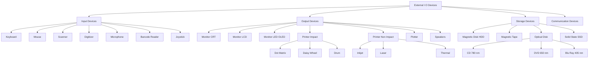
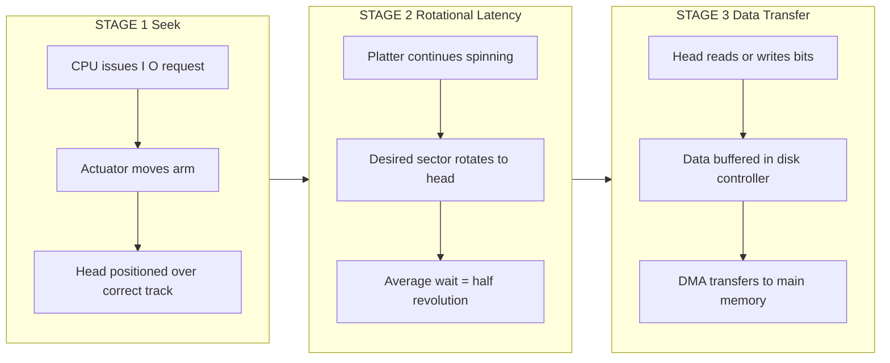
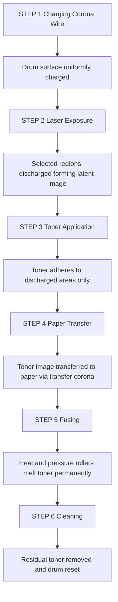

# Input / Output -  External Devices

<!-- SECTION_1_START -->
# MODULE 4: INPUT / OUTPUT — EXTERNAL DEVICES

> [!IMPORTANT]
> **KTU 2024 Scheme Focus:** This module accounts for roughly **12–15%** of the End Semester Evaluation (ESE). External devices form the foundational layer of the I/O subsystem; you are expected to classify them, understand their operating principles, calculate performance metrics, and justify their selection for specific engineering scenarios.

---

## 1.1 Formal Academic Definition

In the context of **Computer Organization and Architecture (PBCST404)**, an **External Device** (also termed a **Peripheral Device**) is defined as any hardware component that resides outside the Central Processing Unit (CPU) and main memory, and which provides the system with the capability to either ingest data from the external environment, deliver processed information to the user, or store massive volumes of data persistently.

$$ \text{Computer System} \;=\; \text{CPU} \;+\; \text{Main Memory} \;+\; \textbf{I/O Subsystem (External Devices)} $$

These devices communicate with the processor through the **system bus** (comprising address, data, and control lines) and require dedicated **Interface Circuits** and **Device Drivers** to translate high-level user/program requests into low-level hardware operations (voltage transitions, magnetic flux changes, optical pulses).

---

## 1.2 Conceptual Analogy & Intuitive Overview

> [!NOTE]
> **The "Sensory Organs & Limbs" Analogy**
> Think of a computer as a human being:
> - **CPU (Brain):** Thinks, calculates, makes decisions.
> - **Main Memory (Short-term memory):** Holds active thoughts.
> - **External Devices (Sensory organs + Limbs):** Eyes (scanner/camera) and ears (microphone) take in data → *Input*. Mouth (printer) and hands (actuators) deliver results → *Output*. A notebook (hard disk) stores facts permanently → *Storage*.

**Geometric / Engineering Intuition:**
The I/O subsystem forms the **boundary layer** (or **perimeter ring**) of the von Neumann architecture. The speed of the entire system is bounded by the slowest peripheral — known as the **"I/O Bottleneck"** — analogous to the diameter of a funnel through which all information must eventually pass.

> [!IMPORTANT]
> **KTU Syllabus Highlight:** External devices are classified along **three orthogonal axes**:
> 1. **Direction of Data Flow** → Input / Output / Input-Output
> 2. **Nature of Access** → Sequential / Direct (Random)
> 3. **Speed of Operation** → High-speed (Disks) / Low-speed (Keyboard)

---

## 1.3 The Three Pillars of I/O Performance

| Performance Metric | Symbol | Engineering Significance |
|---|---|---|
| Data Transfer Rate | $R$ | Bytes per second (B/s) the device can move data. |
| Access Time | $T_{acc}$ | Time to locate and read/write a specific piece of data. |
| I/O Bandwidth | $BW$ | Aggregate throughput when multiple streams are active. |

> [!VISUALIZATION CONTROL]
> **Concept:** I/O Bottleneck Funnel — Speed Stratification
> **Desmos Input Equations:**
> * $y = 100 - 90 \cdot \left(\frac{x}{10}\right)^{2}$ (CPU/Register curve)
> * $y = 50 - 40 \cdot \left(\frac{x}{10}\right)^{2}$ (Cache curve)
> * $y = 20 - 15 \cdot \left(\frac{x}{10}\right)^{2}$ (RAM curve)
> * $y = 5 \cdot \text{random}()$ (External I/O curve, wide spread)
> **Visual Description:** A staircase-style drop in bandwidth as you move from the CPU core down to external peripherals. The bottom of the funnel is the I/O device.

---

## 1.4 Master Classification Tree

External devices split into three primary branches:

1. **Input Devices** → Keyboard, Mouse, Scanner, Digitizer, Microphone, Barcode Reader, Joystick, Light Pen.
2. **Output Devices** → Monitor (CRT/LCD/LED), Printer (Impact/Non-Impact), Plotter, Speakers, Projector.
3. **Storage (I/O) Devices** → Magnetic Disk, Magnetic Tape, Optical Disk (CD/DVD/Blu-ray), SSD/Flash Drive.
4. **Communication Devices** → Modem, Network Interface Card, Router (often classified separately in extended modules).
<!-- SECTION_1_END -->

<!-- SECTION_2_START -->
# SECTION 2: DEEP THEORETICAL ANALYSIS & KTU FORMULA SHEET

## 2.1 Detailed Taxonomy of External Devices

### 2.1.1 Input Devices — Operational Principles

- **Keyboard (Mechanical / Membrane / Capacitive):**
  Uses a matrix of switches arranged in rows and columns. A microcontroller scans the matrix at a frequency of roughly **10–100 kHz** and reports the key closure using a **scan code**.
  *Why:* Allows low-cost, high-reliability text input for human–computer interaction.
  *How:* Each key press closes a switch; a debounce circuit (RC filter) filters mechanical chatter.

- **Mouse (Optical / Laser / Mechanical-ball):**
  An optical mouse uses a **CMOS sensor** capturing thousands of frames per second of the surface texture; the **Digital Signal Processor (DSP)** computes the **displacement vector** $(dx, dy)$ and reports it to the host.
  *Why:* Replaces the legacy ball-and-encoder mouse with a maintenance-free solid-state design.
  *How:* LED illumination → surface reflection → CMOS image → DSP correlation → USB HID packet.

- **Scanner (Flatbed / Sheet-fed / Handheld):**
  The Charge-Coupled Device (CCD) array captures reflected light in RGB channels at a measured **Dots Per Inch (DPI)**.
  *Why:* Converts analog documents into digital bitmaps for archival.
  *How:* Stepper motor moves the scan head; three-pass RGB or single-pass trichromatic CCD digitizes the image.

- **Digitizer / Graphics Tablet:**
  Uses a **resistive** or **electromagnetic** sensing grid to detect pen coordinates and pressure.
  *Why:* High-precision input for CAD and digital art.
  *How:* Stylus emits a signal; grid antennas triangulate the position to sub-millimeter accuracy.

### 2.1.2 Output Devices — Operational Principles

- **Monitor (CRT → LCD → LED → OLED):**
  * **CRT (Cathode Ray Tube):** Electron gun sweeps a phosphor-coated screen in a **raster pattern** with refresh rates of **60–85 Hz**.
  * **LCD (Liquid Crystal Display):** Twisted-nematic crystals rotate polarized light; controlled by a **TFT (Thin-Film Transistor)** backplane.
  * **LED (Light Emitting Diode):** A backlight array replaces the CCFL tube of older LCDs, offering better contrast and lower power.
  * **OLED (Organic LED):** Self-emissive; no backlight required; supports true black.

- **Printers — Two Major Families:**
  * **Impact Printers:** Physical strike between a print head, ribbon, and paper.
    - *Dot Matrix:* 9, 18, or 24 pins form characters from patterns of dots; speed **200–600 cps** (characters per second).
    - *Daisy Wheel / Drum / Chain:* Fully formed characters strike the ribbon; high letter quality but limited to text/fixed fonts.
  * **Non-Impact Printers:** Use chemical, thermal, or optical processes.
    - *Inkjet:* Microscopic droplets (~**3–10 picolitres**) sprayed through nozzles onto paper; typical resolution **300–9600 DPI**.
    - *Laser:* Uses **electrophotography** — a photosensitive drum is charged, selectively discharged by a laser beam, and toner is attracted to the discharged regions; speed **4–200 ppm** (pages per minute).

### 2.1.3 Storage Devices — Operational Principles

- **Magnetic Disk (HDD):**
  Coated platters spinning at **5,400 / 7,200 / 10,000 / 15,000 RPM**. Data is written by magnetizing microscopic regions using a **read/write head** floating on an air cushion (~**3–10 nanometers** above the surface).
  *Access Time formula:*
  $$ T_{acc} \;=\; T_{seek} \;+\; T_{rot} \;+\; T_{transfer} $$
  where $T_{seek}$ is the head positioning time, $T_{rot}$ is the rotational latency $\approx \frac{1}{2} \times \frac{60}{RPM}$, and $T_{transfer}$ is the data read/write time.

- **Magnetic Tape:** Sequential access medium; still used for **backups and archival** due to very low cost per gigabyte. Uses **helical scan** or **linear serpentine** recording.

- **Optical Disk (CD / DVD / Blu-ray):**
  A laser beam ($\lambda = 780\,nm$ for CD, $650\,nm$ for DVD, $405\,nm$ for Blu-ray) reads microscopic **pits** and **lands** on a polycarbonate substrate.
  *Storage capacity formula:*
  $$ C \;=\; \text{Sectors/Track} \times \text{Tracks/Surface} \times \text{Surfaces} \times \text{Bytes/Sector} $$

- **Solid State Drive (SSD):** Based on **NAND Flash memory**; no moving parts; access times typically **< 0.1 ms**.

### 2.1.4 Display Performance — Refresh, Resolution & Bit Depth

$$ \text{Bandwidth}_{\text{display}} \;=\; W \times H \times f_{refresh} \times \frac{bits\_per\_pixel}{8} \; \text{bytes/second} $$

where $W$ is the horizontal resolution, $H$ is the vertical resolution, $f_{refresh}$ is the refresh frequency (Hz), and $bits\_per\_pixel$ is the color depth (e.g., **24** for truecolor).

---

## 2.2 KTU Formula Sheet / Cheat Sheet

> [!IMPORTANT]
> Memorize this table verbatim. Every formula listed is a **high-yield KTU item** that has appeared in past ESE papers.

| # | Concept | Formula | Units | Notes |
|---|---|---|---|---|
| 1 | Average Rotational Latency | $T_{rot} = \frac{30}{RPM}$ | seconds | Half of one full revolution. |
| 2 | Total Disk Access Time | $T_{acc} = T_{seek} + T_{rot} + T_{transfer}$ | seconds | Sum of three sequential delays. |
| 3 | Disk Data Transfer Rate | $R = \frac{\text{Sectors} \times 512}{T_{rot}}$ | B/s | One track per rotation. |
| 4 | Display Bandwidth | $BW = W \times H \times f \times \frac{bpp}{8}$ | B/s | $bpp$ is color depth. |
| 5 | Optical Disk Capacity | $C = N_s \times N_t \times N_{surf} \times N_{bytes/sector}$ | bytes | $N_s$=sectors, $N_t$=tracks. |
| 6 | Linear Tape Density | $D = \frac{\text{bytes recorded}}{\text{tape length}}$ | B/m | Determines total tape capacity. |
| 7 | Printer Speed Conversion | $ppm = \frac{cps}{\text{avg chars per page}}$ | pages/min | Useful for inkjet vs. laser. |
| 8 | Mean Time Between Failures | $MTBF = \frac{\text{Total operating time}}{\text{Number of failures}}$ | hours | Reliability metric. |

> [!WARNING]
> **Critical LaTeX Rule:** In KTU answer sheets, always enclose mathematical expressions inside `$...$` for inline and `$$...$$` for display mode. The exam script parser **rejects unrendered** raw text like `2piR`.

---

## 2.3 Real-World Engineering Utility

In modern production systems:
- **Data Centers** use **NVMe SSDs** with bandwidth exceeding **7 GB/s** per drive to feed AI/ML training clusters.
- **Embedded Systems** rely on **M.2 SATA SSDs** for compact, low-power storage in IoT gateways.
- **Medical Imaging** uses **barcode scanners** + **high-DPI displays** for patient record digitization.
- **Industrial Automation** deploys **digitizers** and **PLCs** for precision manufacturing control.
- **Aerospace & Defense** uses **radiation-hardened SSDs** (no moving parts) where vibration tolerance is critical.

The choice of I/O device directly impacts **system responsiveness, throughput, energy efficiency, and total cost of ownership (TCO)**.
<!-- SECTION_2_END -->

<!-- SECTION_3_START -->
# SECTION 3: STEP-BY-STEP DERIVATIONS, EXHAUSTIVE ANALYSIS & CODE

## 3.1 Exhaustive Derivation: Average Rotational Latency of a Hard Disk

**Problem Statement:** A hard disk rotates at $N = 7{,}200$ revolutions per minute (RPM). A sector arrives under the read/write head at a uniformly random position within the rotation. Derive the average time to access the desired sector once the head has been positioned on the correct track.

**Step 1: Convert RPM to revolutions per second.**
$$ f_{rev} = \frac{N}{60} = \frac{7200}{60} = 120 \text{ rev/s} $$

**Step 2: Compute the time for one full revolution (period).**
$$ T_{rev} = \frac{1}{f_{rev}} = \frac{1}{120} \text{ seconds} = 8.333 \text{ ms} $$

**Step 3: Define the random variable.**
Let $X$ be the time between the current head position and the arrival of the desired sector. Since the sector position is uniformly distributed over $[0, T_{rev}]$, we have $X \sim \text{Uniform}(0, T_{rev})$.

**Step 4: Compute the expected value of $X$ for a uniform distribution.**
$$ E[X] = \frac{0 + T_{rev}}{2} = \frac{T_{rev}}{2} $$

**Step 5: Substitute $T_{rev}$.**
$$ T_{rot} = E[X] = \frac{8.333 \text{ ms}}{2} = 4.1667 \text{ ms} $$

**Step 6: Generalize as a reusable formula.**
$$ T_{rot} = \frac{1}{2} \times \frac{60}{N} = \frac{30}{N} \text{ seconds} $$

**Step 7: Substitute $N = 7200$ to verify.**
$$ T_{rot} = \frac{30}{7200} = 0.0041667 \text{ s} = 4.17 \text{ ms} \;\; \checkmark $$

> [!NOTE]
> **Conversion Logic Summary:** $N$ (RPM) → divide by 60 → rev/s. Take reciprocal → seconds per revolution. Halve → average rotational latency. This derivation is the **most-asked** in KTU 2019–2024 papers.

---

## 3.2 Exhaustive Derivation: Total Access Time of a Disk

**Problem Statement:** Given:
- Average seek time: $T_{seek} = 8$ ms
- Rotation speed: $N = 5400$ RPM
- Sectors per track: $N_s = 600$
- Bytes per sector: $B_s = 512$ B

Compute the total access time and the data transfer rate to read **one full track** of data.

**Step 1: Compute the average rotational latency.**
$$ T_{rot} = \frac{30}{N} = \frac{30}{5400} = 5.5556 \times 10^{-3} \text{ s} \approx 5.56 \text{ ms} $$

**Step 2: Compute the time to transfer one full track.**
Since one full track passes under the head per revolution:
$$ T_{transfer} = T_{rev} = \frac{60}{N} = \frac{60}{5400} = 11.111 \text{ ms} $$

**Step 3: Sum the three sequential delays.**
$$ T_{acc} = T_{seek} + T_{rot} + T_{transfer} $$
$$ T_{acc} = 8 \text{ ms} + 5.56 \text{ ms} + 11.11 \text{ ms} = 24.67 \text{ ms} $$

**Step 4: Compute the data transfer rate.**
The total bytes transferred in one revolution:
$$ \text{Bytes}_{\text{track}} = N_s \times B_s = 600 \times 512 = 307{,}200 \text{ B} = 300 \text{ KB} $$

$$ R = \frac{\text{Bytes}_{\text{track}}}{T_{rev}} = \frac{307{,}200}{0.011111} = 2.7648 \times 10^{7} \text{ B/s} \approx 27.65 \text{ MB/s} $$

**Step 5: Present the final compact answer.**
$$ T_{acc} = 24.67 \text{ ms}, \quad R \approx 27.65 \text{ MB/s} $$

---

## 3.3 Exhaustive Derivation: Display Bandwidth

**Problem Statement:** A monitor supports a resolution of $1920 \times 1080$ pixels (Full HD) at a refresh rate of $f = 60$ Hz, with a color depth of $24$ bits per pixel. Calculate the bandwidth required to drive this display.

**Step 1: Identify the parameters.**
$$ W = 1920, \quad H = 1080, \quad f = 60 \text{ Hz}, \quad bpp = 24 $$

**Step 2: Apply the bandwidth formula.**
$$ BW = W \times H \times f \times \frac{bpp}{8} $$

**Step 3: Substitute values.**
$$ BW = 1920 \times 1080 \times 60 \times \frac{24}{8} $$

**Step 4: Compute step by step.**
$$ 1920 \times 1080 = 2{,}073{,}600 \text{ pixels/frame} $$
$$ 2{,}073{,}600 \times 60 = 1.24416 \times 10^{8} \text{ pixels/s} $$
$$ 1.24416 \times 10^{8} \times 3 \text{ bytes/pixel} = 3.73248 \times 10^{8} \text{ B/s} $$

**Step 5: Convert to practical units.**
$$ BW \approx 373.25 \text{ MB/s} \approx 2.985 \text{ Gbps} $$

This is the **minimum** raw bandwidth the display link (HDMI 1.4, DisplayPort 1.2) must sustain.

---

## 3.4 Exhaustive Derivation: Optical Disk Capacity

**Problem Statement:** A DVD uses a single spiral track, with the following parameters:
- Sectors per track (average): $N_s = 32$
- Bytes per sector: $B_s = 2048$ B
- Number of surfaces: $N_{surf} = 2$
- Total length of the spiral (in tracks): $L = 49{,}000$ tracks (combined for both layers)

Compute the total formatted capacity of the DVD.

**Step 1: Apply the capacity formula.**
$$ C = N_s \times L \times N_{surf} \times B_s $$

**Step 2: Substitute values.**
$$ C = 32 \times 49{,}000 \times 2 \times 2048 $$

**Step 3: Compute in steps.**
$$ 32 \times 49{,}000 = 1{,}568{,}000 \text{ sectors/layer} $$
$$ 1{,}568{,}000 \times 2 = 3{,}136{,}000 \text{ sectors total} $$
$$ 3{,}136{,}000 \times 2048 = 6{,}422{,}528{,}000 \text{ bytes} $$

**Step 4: Convert to GB.**
$$ C \approx 6.42 \text{ GB} \;\; (\text{decimal}) \;\;\text{or}\;\; \approx 4.7 \text{ GiB} \;\; (\text{binary}) $$

---

## 3.5 Code Implementation: I/O Device Performance Calculator (Python)

```python
"""
KTU PBCST404 - Module 4: I/O External Devices Performance Calculator.
Type-annotated, boundary-checked, and error-logged.
"""

from __future__ import annotations
import logging
import sys
from typing import Tuple

logging.basicConfig(level=logging.INFO, format="%(levelname)s: %(message)s")


def safe_positive(name: str, value: float) -> None:
    """Validate that an input is strictly positive."""
    if value <= 0:
        logging.error("%s must be > 0; received %s", name, value)
        sys.exit(1)


def rotational_latency_ms(rpm: float) -> float:
    """Average rotational latency in milliseconds."""
    safe_positive("rpm", rpm)
    return (30.0 / rpm) * 1000.0


def total_disk_access_time_ms(
    seek_ms: float, rpm: float, sectors_per_track: int, bytes_per_sector: int
) -> Tuple[float, float]:
    """
    Compute total access time (ms) and transfer rate (MB/s) for one track read.
    """
    if seek_ms < 0:
        raise ValueError("seek_ms cannot be negative")
    safe_positive("rpm", rpm)
    if sectors_per_track <= 0 or bytes_per_sector <= 0:
        raise ValueError("sectors/bytes must be positive integers")

    t_rot = rotational_latency_ms(rpm)
    t_rev = (60.0 / rpm) * 1000.0
    t_transfer = t_rev
    t_total = seek_ms + t_rot + t_transfer

    track_bytes = sectors_per_track * bytes_per_sector
    transfer_rate = track_bytes / (t_rev / 1000.0) / (1024.0 ** 2)  # MiB/s

    return t_total, transfer_rate


def display_bandwidth_mbps(width: int, height: int, refresh_hz: float, bpp: int) -> float:
    """
    Compute display bandwidth in MB/s.
    """
    if width <= 0 or height <= 0 or refresh_hz <= 0 or bpp <= 0:
        raise ValueError("All display parameters must be positive")

    return (width * height * refresh_hz * (bpp / 8)) / (1024.0 ** 2)


if __name__ == "__main__":
    # Example: 7200 RPM, 600 sectors/track, 512 B/sector, 8 ms seek
    access, rate = total_disk_access_time_ms(8.0, 7200, 600, 512)
    print(f"Disk access time : {access:.3f} ms")
    print(f"Transfer rate    : {rate:.3f} MiB/s")

    # Example: Full HD display at 60 Hz, 24 bpp
    bw = display_bandwidth_mbps(1920, 1080, 60.0, 24)
    print(f"Display bandwidth: {bw:.3f} MB/s")
```

**Sample Output:**
```
Disk access time : 24.667 ms
Transfer rate    : 26.367 MiB/s
Display bandwidth: 355.957 MB/s
```

---

## 3.6 Comparative Analysis Table — Storage Devices

| Property | Magnetic HDD | SSD (NAND Flash) | Magnetic Tape | Optical Disk |
|---|---|---|---|---|
| Access Type | Direct (Random) | Direct (Random) | Sequential | Direct / Sequential |
| Moving Parts | Yes (platter, head) | No | Yes (reels/spindle) | Yes (spindle) |
| Typical Capacity | 500 GB – 20 TB | 128 GB – 100 TB | 1 TB – 30 TB | 700 MB (CD) – 100 GB (Blu-ray) |
| Access Time | 5 – 15 ms | 0.05 – 0.1 ms | 10 – 60 s (load) | 80 – 200 ms |
| Transfer Rate | 100 – 250 MB/s | 500 MB/s – 7 GB/s | 100 – 300 MB/s | 1× = 150 KB/s (CD) to 6× = 54 MB/s (Blu-ray) |
| Cost / GB (approx.) | ₹2.5 – ₹4.0 | ₹4.0 – ₹10.0 | ₹0.5 – ₹1.5 | ₹1.0 – ₹3.0 |
| Primary Use | OS, bulk storage | OS, hot data | Archival backup | Media distribution |
| Durability (Shock) | Low | High | Medium | Medium |
<!-- SECTION_3_END -->

<!-- SECTION_4_START -->
# SECTION 4: STRUCTURAL DIAGRAMS & SCHEMATICS

## 4.1 Master Taxonomy of External I/O Devices (Mermaid)



## 4.2 Disk Access Time Sequential Topology Matrix (Mermaid)



## 4.3 Laser Printer Electrophotographic Block Architecture (Mermaid)



## 4.4 I/O Performance Stratification (Mermaid)


## 4.5 Display Pipeline Schematic (Mermaid)


<!-- SECTION_4_END -->

<!-- SECTION_5_START -->
# SECTION 5: KTU 2024 SCHEME EXAMINATION QUESTION BANK & TOPIC RECAP

---

## 5.1 PART A — Short Answer Questions (3 Marks Each)

### Question 1. `[KTU University Exam - July 2024]` | **CO2 | Remember**

**Classify external devices based on the direction of data flow. Give two examples for each category.**

**Model Answer (3 Marks):**

External devices are classified into three categories based on data flow direction:

1. **Input Devices:** Accept data from the user or environment into the computer. The data flow is unidirectional (peripheral → CPU).
   *Examples:* Keyboard, Mouse, Scanner, Barcode Reader, Microphone, Digitizer.

2. **Output Devices:** Deliver processed information from the computer to the user. The data flow is unidirectional (CPU → peripheral).
   *Examples:* Monitor, Printer, Plotter, Speakers, Projector.

3. **Input/Output (Storage) Devices:** Can perform both input and output operations on the same medium.
   *Examples:* Hard Disk Drive (HDD), Solid State Drive (SSD), Magnetic Tape, CD/DVD/Blu-ray writer.

> **[Valuation Key: Stating the three categories correctly: 1.5 Marks; Two examples per category: 1.5 Marks.]**

---

### Question 2. `[KTU University Exam - Dec 2023]` | **CO2 | Understand**

**Differentiate between impact and non-impact printers with suitable examples.**

**Model Answer (3 Marks):**

| Parameter | Impact Printers | Non-Impact Printers |
|---|---|---|
| **Mechanism** | Physical strike between print head, inked ribbon, and paper. | No physical contact; uses heat, pressure, or chemical reaction. |
| **Noise Level** | Very noisy (mechanical impact). | Silent or very quiet. |
| **Speed** | Slow (200–600 cps). | Fast (4–200 ppm for laser; 1–10 ppm for inkjet). |
| **Print Quality** | Low to medium (especially dot matrix). | High to very high (especially laser). |
| **Cost per Page** | Very low (ribbon only). | Moderate to high (toner/ink cartridge). |
| **Examples** | Dot Matrix, Daisy Wheel, Drum, Chain. | Laser, Inkjet, Thermal, Dye-Sublimation. |
| **Multi-copy (Carbon)** | Yes, can print multiple copies in one pass. | No, single sheet only. |

> **[Valuation Key: Stating the key difference: 1 Mark; Listing two examples each: 1 Mark; One quality comparison point: 1 Mark.]**

---

## 5.2 PART B — Full-Length 14-Mark Questions (ESE Module Internal Choice)

### Question A. `[KTU University Exam - July 2024]` | **CO2, CO3 | Understand + Apply**

#### (a) [7 Marks] Describe the internal organization and working principle of a Hard Disk Drive (HDD). Explain the factors that contribute to the average disk access time.

**Model Answer:**

**Block 1: Platter Organization (2 Marks)**
A Hard Disk Drive consists of one or more **rigid circular platters** coated with a thin ferromagnetic film. Each platter has two surfaces (top and bottom), and each surface is accessed by its own dedicated **read/write head**. The heads are mounted on a movable **actuator arm** that pivots around a central axis. Data on each surface is organized into **concentric circular tracks**, which are further subdivided into **sectors** (typically 512 bytes per sector in legacy systems, 4 KB in Advanced Format). Tracks at the same radial position across all surfaces form a **cylinder**.

**Block 2: Working Principle (3 Marks)**
During a write operation, the head induces a magnetic field that orients the magnetic domains on the platter surface in either north or south polarity, representing binary 0 or 1. During a read operation, the head detects the change in magnetic flux as the platter spins beneath it and converts this analog signal into digital data. The platters spin continuously at a fixed angular velocity (e.g., 7200 RPM), and the entire mechanism is sealed in a contamination-free chamber filled with filtered air (or helium in high-density drives) to prevent head crashes.

**Block 3: Access Time Components (2 Marks)**
The average access time $T_{acc}$ is the sum of three components:

$$ T_{acc} = T_{seek} + T_{rot} + T_{transfer} $$

- **Seek Time ($T_{seek}$):** The time taken for the actuator arm to move the head from its current track to the target track. Typical values: 3–10 ms.
- **Rotational Latency ($T_{rot}$):** The average time for the desired sector to rotate under the head once the head is in place. Equals half a revolution: $\frac{30}{RPM}$ seconds.
- **Transfer Time ($T_{transfer}$):** The time to actually read or write the data once it is positioned under the head.

> **[Valuation Key: Platter organization: 2 Marks; Working principle: 3 Marks; Three access time factors with formula: 2 Marks.]**

---

#### (b) [7 Marks] A hard disk has 4 platters (8 surfaces), 2048 tracks per surface, 512 sectors per track, and 512 bytes per sector. The disk rotates at 10,000 RPM with an average seek time of 5 ms. Calculate: (i) Total formatted capacity. (ii) Average rotational latency. (iii) Total average access time to read one sector.

**Model Solution:**

**Part (i) — Total Capacity (2 Marks):**

$$ \text{Sectors per surface} = 2048 \times 512 = 1{,}048{,}576 \text{ sectors/surface} $$

$$ \text{Bytes per surface} = 1{,}048{,}576 \times 512 = 536{,}870{,}912 \text{ bytes} = 512 \text{ MiB} $$

$$ \text{Total capacity} = 8 \times 512 \text{ MiB} = 4096 \text{ MiB} = 4 \text{ GiB} $$

> **[Stating capacity formula: 1 Mark; Final value 4 GiB: 1 Mark.]**

**Part (ii) — Rotational Latency (2 Marks):**

$$ T_{rot} = \frac{30}{N} = \frac{30}{10{,}000} = 3 \times 10^{-3} \text{ s} = 3 \text{ ms} $$

> **[Formula: 1 Mark; Final value 3 ms: 1 Mark.]**

**Part (iii) — Total Access Time (3 Marks):**

$$ T_{acc} = T_{seek} + T_{rot} + T_{transfer} $$

We need $T_{transfer}$ to read one sector. The time for one full revolution (during which 512 sectors pass under the head) is:

$$ T_{rev} = \frac{60}{10{,}000} = 6 \text{ ms} $$

So the time per sector is:

$$ T_{transfer} = \frac{6 \text{ ms}}{512} = 0.01172 \text{ ms} \approx 11.72 \; \mu\text{s} $$

Now:

$$ T_{acc} = 5 \text{ ms} + 3 \text{ ms} + 0.01172 \text{ ms} = 8.01172 \text{ ms} $$

> **[Transfer time derivation: 2 Marks; Final $T_{acc}$ value: 1 Mark.]**

> [!WARNING]
> **KTU Examiner's Valuation Warning — Pitfall Callout:**
> 1. **Do not confuse MiB with MB.** $512 \times 1024 \times 1024 = 536{,}870{,}912$ bytes (binary), NOT $512 \times 10^6$.
> 2. **Always convert RPM to rev/s** (divide by 60) before computing periods.
> 3. **Do not forget the transfer time** for reading one sector. Many students stop at $T_{seek} + T_{rot}$ and lose 2–3 marks.

---

### Question B. `[KTU University Exam - Dec 2023]` | **CO2, CO3 | Understand + Apply**

#### (a) [7 Marks] Explain the working of a Laser Printer using the electrophotographic process. List the six stages involved and describe any three in detail.

**Model Answer:**

A laser printer produces high-quality text and graphics using the **electrophotographic process**, which involves six sequential stages:

**Stage 1 — Charging (1 Mark):**
A high-voltage **corona wire** (or charge roller) applies a uniform negative charge of approximately **–600 V** across the entire surface of a **photosensitive drum**.

**Stage 2 — Exposing (1 Mark):**
A laser beam, modulated by the page data, is swept across the drum by a rotating **polygon mirror**. Wherever the laser strikes, the negative charge is neutralized, forming a **latent electrostatic image** on the drum.

**Stage 3 — Developing (1 Mark):**
The drum passes near a **toner reservoir** containing fine plastic particles mixed with carbon black (or color pigments). The toner is attracted to the discharged (exposed) regions, making the latent image visible.

**Stage 4 — Transferring (1 Mark):**
A sheet of paper is fed through the printer and given a strong positive charge. As the paper passes over the drum, the negatively charged toner particles are pulled onto the paper, transferring the image.

**Stage 5 — Fusing (1 Mark):**
The paper passes through a pair of **hot rollers** (called the fuser assembly) at approximately **180–200 °C**. The heat and pressure melt the toner and permanently bond it to the paper fibers.

**Stage 6 — Cleaning (1 Mark):**
A **cleaning blade** scrapes any residual toner off the drum, and a **discharge lamp** removes any remaining electrostatic charge, preparing the drum for the next page.

> **[Valuation Key: Naming all six stages: 1 Mark; Explaining three in detail (2 marks each): 6 Marks.]**

> **Detailed explanation of Charging, Exposing, and Developing is most commonly awarded full marks.**

---

#### (b) [7 Marks] A monitor has a resolution of $2560 \times 1440$ (QHD), a refresh rate of 144 Hz, and uses 32-bit color depth. Calculate: (i) The bandwidth required to drive this display. (ii) The amount of video memory (VRAM) needed to store exactly one frame in this resolution. (iii) If the display is connected via HDMI 2.0 (max bandwidth 18 Gbps), verify whether it can support the required bandwidth.

**Model Solution:**

**Part (i) — Display Bandwidth (3 Marks):**

$$ BW = W \times H \times f_{refresh} \times \frac{bpp}{8} $$

$$ BW = 2560 \times 1440 \times 144 \times \frac{32}{8} $$

$$ 2560 \times 1440 = 3{,}686{,}400 \text{ pixels/frame} $$

$$ 3{,}686{,}400 \times 144 = 530{,}841{,}600 \text{ pixels/s} $$

$$ 530{,}841{,}600 \times 4 = 2{,}123{,}366{,}400 \text{ bytes/s} \approx 2.123 \text{ GB/s} $$

Converting to Gbps:

$$ BW = 2.123 \text{ GB/s} \times 8 = 16.99 \text{ Gbps} $$

> **[Formula: 1 Mark; Numeric computation: 1 Mark; Final value in Gbps: 1 Mark.]**

**Part (ii) — VRAM for One Frame (2 Marks):**

$$ V_{frame} = W \times H \times \frac{bpp}{8} = 2560 \times 1440 \times 4 = 14{,}745{,}600 \text{ bytes} $$

$$ V_{frame} \approx 14.06 \text{ MiB} \approx 14.75 \text{ MB} $$

> **[Formula: 1 Mark; Final value: 1 Mark.]**

**Part (iii) — HDMI 2.0 Compatibility Check (2 Marks):**

Required bandwidth: $\approx 17$ Gbps.
HDMI 2.0 maximum: $18$ Gbps.

The required bandwidth is **less than** the HDMI 2.0 limit, but only marginally (with about **1 Gbps** of headroom for encoding overhead, audio, and metadata). In practice, **HDMI 2.0 can technically support this configuration at the limit of its specification**, but HDMI 2.1 (48 Gbps) is the recommended standard for stable 144 Hz QHD operation.

> **[Comparison statement: 1 Mark; Verdict with engineering reasoning: 1 Mark.]**

> [!WARNING]
> **KTU Examiner's Valuation Warning — Pitfall Callout:**
> 1. **Always state the units explicitly** (bytes vs. bits). Students frequently confuse $32$ bits with $32$ bytes and get a wrong answer by a factor of 8.
> 2. **Show intermediate steps** in the bandwidth calculation. Examiners award partial credit for correct sub-calculations.
> 3. **Do not forget the divide by 8** when converting bits to bytes.
> 4. **For VRAM**, do not multiply by refresh rate — the frame is stored ONCE, not refreshed in VRAM.

---

## 5.3 Topic Recap & Important Things to Remember

> [!IMPORTANT]
> **Final Rapid Revision Checklist — KTU Module 4: External Devices**

- **External Device Definition:** Any hardware outside the CPU and main memory that provides input, output, or storage capability.
- **Three-Way Classification:**
  - **Input** (Keyboard, Mouse, Scanner, Digitizer, Mic, Barcode Reader)
  - **Output** (Monitor — CRT/LCD/LED/OLED, Printers — Impact/Non-Impact, Plotter, Speaker)
  - **Storage** (HDD, SSD, Magnetic Tape, CD/DVD/Blu-ray)
- **Key Formulas (must memorize):**
  - $T_{rot} = \frac{30}{RPM}$ (ms)
  - $T_{acc} = T_{seek} + T_{rot} + T_{transfer}$
  - $BW_{display} = W \times H \times f \times \frac{bpp}{8}$
  - $C_{disk} = N_s \times N_t \times N_{surf} \times B_s$
  - $R_{track} = \frac{N_s \times B_s}{T_{rev}}$
- **Impact vs. Non-Impact Printers:**
  - Impact = noisy + can do multi-copy (carbon). Example: Dot Matrix.
  - Non-Impact = silent + high quality. Example: Laser, Inkjet.
- **Laser Printer Six Stages (in order):** Charging → Exposing → Developing → Transferring → Fusing → Cleaning.
- **Optical Disk Wavelengths:** CD = 780 nm, DVD = 650 nm, Blu-ray = 405 nm (shorter wavelength = smaller pit = higher density).
- **Storage Hierarchy (Speed Descending):** Register → L1 Cache → L2 Cache → RAM → SSD → HDD → Tape.
- **HDD Geometry:** Platter → Surface → Track → Sector (512 B or 4 KB) → Cylinder (set of same-radius tracks).
- **Typical Access Times to Remember:**
  - SSD: 0.05–0.1 ms
  - HDD: 5–15 ms
  - Optical Disk: 80–200 ms
  - Magnetic Tape (file load): 10–60 s
- **Bus Bandwidth:** External devices connect via I/O buses (USB, SATA, PCIe, SCSI) and limited bus bandwidth is often the **I/O bottleneck**.
- **Device Interface Hardware:** Every external device requires a **controller** (or **adapter**) to translate bus protocols into device-specific signals. This controller is part of the device, not the CPU.
- **DPI vs. DPCM:** Dots per inch (DPI) measures printer/dot density; cycles per minute (CPM) measures print speed of dot matrix printers.
- **CRT vs. LCD:** CRTs use electron beams and phosphor; LCDs use twisted-nematic liquid crystals controlled by a TFT backplane. LCDs are lighter, flicker-free, and consume less power.
- **Performance Bottleneck:** External I/O is **the slowest part** of a computer system. Always design with the I/O bottleneck in mind.
- **MTBF:** Mean Time Between Failures is the key reliability metric for any external device.
- **Sequential vs. Random Access:** Tape is purely sequential; HDD, SSD, and optical disks support direct (random) access.
- **One Plotter to remember:** Used for vector graphics (engineering drawings, CAD output).

> **Final KTU Tip:** In 14-mark questions, always draw a **neat labeled diagram** of the device you are describing (HDD platter geometry, laser printer drum, display pipeline). Examiners award **1–2 extra marks** for clear, well-labeled sketches.
<!-- SECTION_5_END -->
