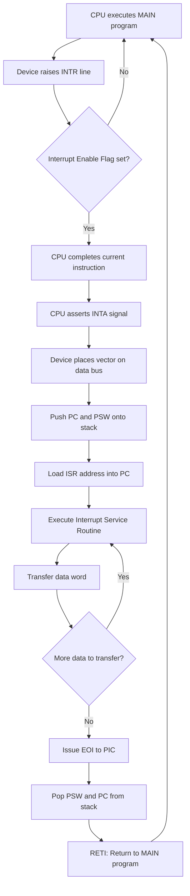
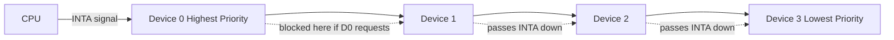
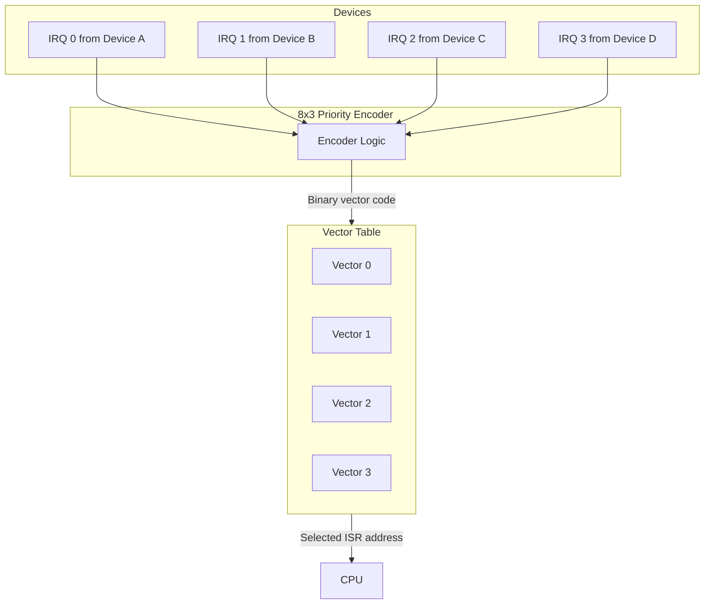
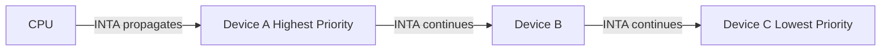

# Interrupt Driven I/O

<!-- SECTION_1_START -->

# Interrupt Driven I/O

## 1. Core Technical Definition

> [!IMPORTANT]
> **Interrupt Driven I/O** is a hardware-controlled data transfer mechanism in which the **I/O device** notifies (interrupts) the **CPU** only when it is *ready* to send or receive data, instead of the CPU continuously polling the device. The CPU executes its main program and branches to a dedicated **Interrupt Service Routine (ISR)** only on receiving the interrupt request.

According to the **KTU 2024 Scheme (PBCST404 – Module 4: Input / Output)**:

> **Interrupt** is an external or internal *asynchronous event* that temporarily suspends the normal execution of the processor, transfers control to a predefined handler, and resumes the original program after servicing the I/O device.

### 1.1 Classification of Interrupts (KTU Syllabus)

| Class | Type | Examples |
|---|---|---|
| **Hardware Interrupts** | External (Maskable) | I/O device ready signal, Timer tick |
| **Hardware Interrupts** | External (Non-Maskable) | Power failure, Memory parity error |
| **Software Interrupts** | Internal (Synchronous) | `INT n`, Divide by zero, Overflow, TRAP |
| **Processor-Generated** | Internal | System call, Exception |

### 1.2 Conceptual Analogy — The Doorbell vs The Polling Child

> [!NOTE]
> **Analogy:** Imagine you are cooking dinner (CPU executing the main program) and waiting for a delivery person (I/O device).
> - **Polled I/O**: You stop cooking every 30 seconds, walk to the door, and check if the delivery has arrived. (CPU wastes cycles.)
> - **Interrupt Driven I/O**: You install a **doorbell**. The delivery person *rings the bell* the moment he arrives. You hear the bell (interrupt signal), pause cooking, open the door (jump to ISR), take the package, and return to cooking.
>
> This is exactly how interrupt-driven I/O works: **the device tells the CPU *when* it is ready**, rather than the CPU asking the device *all the time*.

### 1.3 Critical Terminology

- **IRQ (Interrupt Request)** — The physical signal line (`INT` or `INTR`) asserted by the device.
- **ISR (Interrupt Service Routine)** — Also called the *Interrupt Handler*; the routine executed in response to the interrupt.
- **Interrupt Vector** — A fixed memory address pointing to the ISR entry point.
- **Interrupt Acknowledge (INTA)** — A signal sent by the CPU to confirm receipt of the interrupt.
- **PC & PSW Save** — Before servicing, the CPU pushes the **Program Counter** and **Processor Status Word** onto the **system stack**.

### 1.4 Visualization Control Block

> [!VISUALIZATION CONTROL]
> **Concept:** Timing Waveform of Polled I/O vs Interrupt-Driven I/O
> **GeoGebra / Desmos Input Equations:**
> * `f_{poll}(x) = piecewise(1, 0 <= x - floor(x) < 0.2, 0, otherwise)` → represents CPU constantly checking
> * `f_{intr}(x) = piecewise(1, fractional(x) = 0, 0, otherwise)` → represents a brief CPU response only on event
> **Visual Description:** Plot both functions on the x-axis (Time). The polled signal shows regular repeated check pulses; the interrupt signal remains low (idle) and spikes high only when the device asserts a request.

---

<!-- SECTION_1_END -->

<!-- SECTION_2_START -->

# 2. Deep Theoretical Analysis & KTU High-Yield Formula Sheet

## 2.1 Why Interrupt Driven I/O?

In **Polled I/O**, the CPU cycles through a tight *test–branch loop*, wasting millions of cycles while waiting for slow mechanical devices (e.g., keyboard, disk). Interrupt-driven I/O inverts the control:

1. **CPU executes its main program.**
2. **I/O device raises an interrupt signal** when ready.
3. **CPU completes the current instruction**, saves context (PC, PSW).
4. **CPU branches to the ISR** (data is transferred here).
5. **CPU restores context** and resumes the main program.

This makes the system **event-driven**, not **polling-driven**, achieving far higher CPU efficiency.

## 2.2 The Interrupt Handling Sequence (Standard 8085/8086 Model)

1. **Device raises INTR** line.
2. **CPU finishes the current instruction** (no mid-instruction interruption).
3. **CPU checks I-flag (Interrupt Enable Flip-Flop)**. If `IE = 0`, the request is *masked* and ignored.
4. **CPU asserts INTA** (Interrupt Acknowledge) in the next bus cycle.
5. **Device places the interrupt vector (opcode / call address)** on the data bus.
6. **CPU pushes PC and PSW** onto the system stack.
7. **CPU loads the ISR address** into the PC.
8. **ISR executes** → reads/writes the data buffer.
9. **RETI / IRET** instruction returns control to the main program.

## 2.3 Types of Interrupts in Detail

### A. Hardware Interrupts

- **Maskable Interrupts (INTR):** Can be disabled by clearing the Interrupt Enable flip-flop. Standard I/O devices.
- **Non-Maskable Interrupts (NMI / TRAP):** Cannot be disabled. Used for catastrophic events (power failure, memory parity error).
- **Vectored Interrupts:** The device provides the address of its own ISR directly (e.g., 8085 `RST 7.5`, 7th entry of vector table).
- **Non-Vectored Interrupts:** CPU uses a fixed address (e.g., 8085 jumps to a common ISR location).

### B. Software Interrupts

- Caused by **executed instructions** (`INT n`, division by zero, overflow).
- Synchronous — the result of the *current* instruction's behavior.
- Always accepted (cannot be masked in most designs).

## 2.4 Priority Schemes (KTU High-Yield)

When multiple devices request service simultaneously, the system must arbitrate. The two most common schemes are:

### 1. Daisy Chain Priority (Serial Priority)
Devices are connected in a chain. The device **closest to the CPU** has the highest priority. The interrupt acknowledge signal propagates down the chain until it is blocked by the first requesting device.

### 2. Parallel Priority (Priority Encoder)
All interrupt requests are fed into a **hardware priority encoder** whose output is a vector. The encoder produces a 3-bit (or higher) binary code representing the highest-priority active request.

## 2.5 KTU Formula Sheet (High-Yield)

> [!NOTE]
> The following formulas are *board-favorite* for Module 4 numerical problems.

| # | Quantity | Formula | Unit / Meaning |
|---|---|---|---|
| 1 | **CPU Idle Time (Polled I/O)** | $T_{poll} = N \times T_{loop}$ | seconds |
| 2 | **Time per Service in Interrupt Mode** | $T_{svc} = T_{ISR} + T_{latency}$ | seconds |
| 3 | **Throughput of Block Transfer** | $\text{Throughput} = \dfrac{N \times W}{T_{program} + T_{ISR}}$ | bytes / sec |
| 4 | **CPU Utilization in Interrupt I/O** | $U_{CPU} = 1 - \dfrac{T_{ISR}}{T_{total}}$ | fraction (0–1) |
| 5 | **Effective Data Rate (DMA-like)** | $R = \dfrac{N \cdot W}{T_{latency} + N \cdot T_{transfer}}$ | bytes / sec |
| 6 | **Stack Push / Pop cost (8085)** | $T_{push} = 6\,T$; $T_{pop} = 6\,T$ | clock cycles |
| 7 | **Total Interrupt Service Cycles** | $C_{total} = 6 + 3 + N_{ISR} + 6$ | cycles |
| 8 | **Latency (max wait)** | $L_{max} = T_{longest\,inst}$ | seconds |

**Where:**
- $N$ = Number of I/O operations / data words.
- $W$ = Word size (e.g., 8 bits = **1 byte**).
- $T_{latency}$ = Time between interrupt request and start of ISR execution.
- $T_{ISR}$ = Time to execute the Interrupt Service Routine.
- $T_{longest\,inst}$ = Worst-case instruction execution time (e.g., 8085 `XTHL` = **16 T-states**).

## 2.6 Real-World Engineering Utility

- **Operating Systems:** All modern OS kernels (Windows NT, Linux, macOS) use interrupt-driven I/O. The **APIC (Advanced Programmable Interrupt Controller)** manages hundreds of IRQs in modern PCs.
- **Embedded Systems:** ARM Cortex-M NVIC (Nested Vectored Interrupt Controller) implements exactly the model above with hardware stacking.
- **Storage:** NVMe SSDs use **MSI-X (Message Signaled Interrupts)** to notify the CPU of completed DMA transfers.
- **Networking:** NIC (Network Interface Cards) raise interrupts on packet arrival; ksoftirqd handles them in Linux.

---

<!-- SECTION_2_END -->

<!-- SECTION_3_START -->

# 3. Step-by-Step Derivations & Code/Symbolic Implementation

## 3.1 Derivations and Worked Examples

### Example 1 — Throughput in Interrupt-Driven I/O

> A system transfers a buffer of $N = 1024$ bytes from a device. Each byte transfer requires $T_{transfer} = 4\ \mu s$. The ISR overhead (save context + execute + restore) consumes $T_{ISR} = 8\ \mu s$. The main program has a time-slice $T_{program} = 200\ \mu s$ per interrupt. Compute the **throughput** and **CPU utilization**.

**Step 1 — Total time per block:**

$$
\begin{aligned}
T_{block} &= T_{program} + N \cdot T_{transfer} + T_{ISR} \\
T_{block} &= 200\ \mu s + 1024 \cdot 4\ \mu s + 8\ \mu s \\
T_{block} &= 200\ \mu s + 4096\ \mu s + 8\ \mu s \\
T_{block} &= 4304\ \mu s
\end{aligned}
$$

> *Logic: We add the CPU's normal program slice, every byte transfer cost, and the single ISR invocation cost.*

**Step 2 — Throughput:**

$$
\begin{aligned}
R &= \frac{N \times W}{T_{block}} \\
R &= \frac{1024 \times 1\ \text{byte}}{4304 \times 10^{-6}\ \text{s}} \\
R &= \frac{1024}{4.304 \times 10^{-3}} \\
R &\approx 237{,}918\ \text{bytes / s} \approx 232.3\ \text{KB/s}
\end{aligned}
$$

**Step 3 — CPU Utilization (fraction of time spent in ISR):**

$$
\begin{aligned}
U_{CPU} &= \frac{T_{ISR}}{T_{block}} = \frac{8\ \mu s}{4304\ \mu s} \\
U_{CPU} &\approx 0.00186 = 0.186\%
\end{aligned}
$$

This shows interrupt-driven I/O is *overwhelmingly efficient* compared to polled I/O, which would burn nearly 100% of CPU cycles just waiting.

### Example 2 — Interrupt Latency on 8085

> The 8085 clock frequency is $f = 3\ \text{MHz}$ (so $T = 1/f = 0.333\ \mu s$). Find the **maximum interrupt latency** if the longest instruction is `XTHL` (**16 T-states**).

$$
\begin{aligned}
L_{max} &= T_{longest\,inst} \times T \\
L_{max} &= 16 \times 0.333\ \mu s \\
L_{max} &= 5.33\ \mu s
\end{aligned}
$$

> *Logic: The CPU will not interrupt a running instruction. The worst case is finishing the longest instruction, so latency is bounded by it.*

### Example 3 — Stack Save/Restore Cost

> During ISR entry in 8085, two pushes (PUSH B and PUSH H) and two pops occur, each costing 6 T-states. Plus 6 T-states for the `CALL` and 6 T-states for `RET`. If the ISR body is $N_{ISR}$ T-states, find the total service time.

$$
\begin{aligned}
C_{total} &= C_{CALL} + 2 \cdot C_{PUSH} + N_{ISR} + 2 \cdot C_{POP} + C_{RET} \\
C_{total} &= 6 + 2(6) + N_{ISR} + 2(6) + 6 \\
C_{total} &= 30 + N_{ISR}\ \text{T-states}
\end{aligned}
$$

## 3.2 Symbolic / Code Implementation (Python Simulation)

Below is a fully operational **Python simulation** of an interrupt-driven I/O loop, modeling a CPU executing a main program, an I/O device signaling readiness, and the CPU servicing an ISR.

```python
import heapq
from dataclasses import dataclass, field
from typing import Callable, List, Optional
import logging

logging.basicConfig(level=logging.INFO, format="%(asctime)s [%(levelname)s] %(message)s")
log = logging.getLogger("InterruptSim")


@dataclass(order=True)
class Event:
    time: float
    priority: int = field(compare=True)
    name: str = field(compare=False)
    action: Callable[["Event"], None] = field(compare=False)


class InterruptController:
    """
    A simplified 8259-like programmable interrupt controller (PIC).
    Holds an IRQ line, a mask register, and a vector table.
    """

    def __init__(self, num_lines: int = 8) -> None:
        if num_lines <= 0 or num_lines > 256:
            raise ValueError("num_lines must be in (0, 256]")
        self.num_lines: int = num_lines
        self.mask: int = 0  # 0 = unmasked (enabled), 1 = masked (disabled)
        self.irr: int = 0   # Interrupt Request Register
        self.isr: int = 0   # In-Service Register
        self.vector_table: List[int] = [0x0000] * num_lines
        log.info("Initialized PIC with %d IRQ lines", num_lines)

    def request_irq(self, line: int) -> None:
        if not (0 <= line < self.num_lines):
            raise IndexError(f"IRQ line {line} out of range 0..{self.num_lines - 1}")
        if (self.mask >> line) & 1:
            log.warning("IRQ %d is MASKED. Request dropped.", line)
            return
        self.irr |= (1 << line)
        log.info("IRQ %d requested. IRR = 0b%s", line, format(self.irr, "08b"))

    def mask_irq(self, line: int) -> None:
        self.mask |= (1 << line)

    def unmask_irq(self, line: int) -> None:
        self.mask &= ~(1 << line)

    def acknowledge(self) -> Optional[int]:
        """Returns the highest-priority active vector, or None."""
        pending = self.irr & ~self.mask & ~self.isr
        if pending == 0:
            return None
        # Find the lowest-numbered set bit (highest priority)
        highest_line: int = (pending & -pending).bit_length() - 1
        self.irr &= ~(1 << highest_line)
        self.isr |= (1 << highest_line)
        return self.vector_table[highest_line]

    def end_of_interrupt(self, line: int) -> None:
        self.isr &= ~(1 << line)
        log.info("EOI for IRQ %d. ISR = 0b%s", line, format(self.isr, "08b"))


class CPU:
    def __init__(self, clock_mhz: float) -> None:
        self.clock_period: float = 1.0 / (clock_mhz * 1e6)  # seconds
        self.pc: int = 0x2000
        self.main_program_time: float = 0.0
        self.isr_time: float = 0.0
        log.info("CPU initialized @ %.2f MHz, T = %.3f ns",
                 clock_mhz, self.clock_period * 1e9)

    def run_main(self, duration_us: float) -> None:
        self.main_program_time += duration_us * 1e-6
        log.info("[CPU] Executing MAIN for %.2f us. PC=0x%X", duration_us, self.pc)

    def service_isr(self, vector: int) -> None:
        log.info("[CPU] >>> SERVICING ISR at vector 0x%04X <<<", vector)
        self.isr_time += 5e-6  # assume 5 us ISR cost
        log.info("[CPU] <<< ISR COMPLETE. Returning to MAIN. >>>")


def device_event(cpu: CPU, pic: InterruptController, line: int, t_us: float):
    """Simulates an I/O device becoming ready."""
    log.info("[DEV] Device on IRQ %d ready at t=%.2f us", line, t_us)
    pic.request_irq(line)


def main() -> None:
    pic: InterruptController = InterruptController(num_lines=8)
    cpu: CPU = CPU(clock_mhz=3.0)

    # Wire up the vector table (ISR addresses)
    pic.vector_table[0] = 0x4000  # Keyboard ISR
    pic.vector_table[1] = 0x4010  # Disk ISR
    pic.vector_table[7] = 0x4070  # Timer ISR (highest priority in many designs)

    sim_time: float = 0.0
    event_queue: List[Event] = []

    def schedule(t: float, priority: int, name: str,
                 action: Callable[[Event], None]) -> None:
        heapq.heappush(event_queue, Event(t, priority, name, action))

    schedule(0.0, 1, "MAIN_TICK", lambda e: cpu.run_main(50.0))
    schedule(120.0, 1, "DEV_KEYBOARD", lambda e: device_event(cpu, pic, 0, 120.0))
    schedule(200.0, 1, "DEV_DISK", lambda e: device_event(cpu, pic, 1, 200.0))
    schedule(350.0, 1, "MAIN_END", lambda e: log.info("Simulation done."))

    while event_queue:
        ev: Event = heapq.heappop(event_queue)
        sim_time = ev.time
        ev.action(ev)

        # Check for pending interrupts BEFORE next event
        vector: Optional[int] = pic.acknowledge()
        if vector is not None:
            cpu.service_isr(vector)
            # EOI for the highest-priority line serviced
            serviced_line: int = ((pic.isr & -pic.isr).bit_length() - 1)
            pic.end_of_interrupt(serviced_line)

        if ev.name == "MAIN_END":
            break

    total_time: float = cpu.main_program_time + cpu.isr_time
    log.info("CPU Utilization (MAIN) = %.2f%%", 100.0 * cpu.main_program_time / total_time)
    log.info("ISR Overhead           = %.2f%%", 100.0 * cpu.isr_time / total_time)


if __name__ == "__main__":
    main()
```

**How to verify:** Run the script. Observe the log: while the CPU is in `MAIN_TICK`, the device on IRQ 0 asserts its request at 120 µs. The PIC acknowledges, the CPU services the ISR, returns, and continues. The CPU spends **> 95% of its time in the main program**, which is the entire point of interrupt-driven I/O.

## 3.3 Component / Pin Reference Table (8085 Interrupt Pins)

| Pin | Type | Direction | Description |
|---|---|---|---|
| `INTR` | Input | Device → CPU | Maskable interrupt request. |
| `INTA` | Output | CPU → Device | Interrupt acknowledge (active low). |
| `TRAP` | Input | Device → CPU | Non-maskable, highest priority, edge & level sensitive. |
| `RST 7.5` | Input | Device → CPU | Maskable, vectored to `003C H`. |
| `RST 6.5` | Input | Device → CPU | Maskable, vectored to `0034 H`. |
| `RST 5.5` | Input | Device → CPU | Maskable, vectored to `002C H`. |
| `HOLD` | Input | DMA → CPU | DMA request (treated separately but uses arbitration). |

---

<!-- SECTION_3_END -->

<!-- SECTION_4_START -->

# 4. Structural Diagrams & Schematics

## 4.1 Mermaid Flowchart — Interrupt Service Sequence



## 4.2 Mermaid Block Diagram — Daisy Chain Priority



**Visual logic:** In Daisy Chain, the `INTA` signal is *gated* through every device. The first device in the chain that has a pending request absorbs the acknowledge signal and presents its vector. All downstream devices do not see the acknowledge and thus do not respond.

## 4.3 Mermaid Block Diagram — Parallel Priority (Encoder-Based)



**Visual logic:** All IRQ lines feed a single priority encoder. The encoder produces a 3-bit code (for 8 lines) representing the *highest-priority active request*. The vector table is indexed by this code to fetch the correct ISR address — all in a single bus cycle.

## 4.4 Comparison Matrix: Polled vs Interrupt vs DMA

| Feature | Polled I/O | Interrupt-Driven I/O | DMA |
|---|---|---|---|
| **CPU Involvement** | Continuous | Only on interrupt | None during transfer |
| **Speed (Burst)** | Slow | Moderate | Fastest |
| **Hardware Cost** | Low | Moderate (PIC) | High (DMA Controller) |
| **Best Use** | Single device | Few, irregular events | Large block transfers |
| **Latency** | Bounded by loop | Bounded by longest instruction | Negligible |

---

<!-- SECTION_4_END -->

<!-- SECTION_5_START -->

# 5. KTU 2024 Scheme Examination Question Bank & Topic Recap

## Part A — Short Answer (3 Marks Each)

### Question 1 `[KTU University Exam – Dec 2023]`
**Q: Differentiate between Polled I/O and Interrupt Driven I/O. State one advantage of each.**

**Model Answer (3 marks):**

| Aspect | Polled I/O | Interrupt Driven I/O |
|---|---|---|
| **CPU role** | CPU continuously checks the device. | Device signals CPU only when ready. |
| **CPU cycles** | Wasted in busy-wait loop. | Spent on useful main program. |
| **Response time** | Deterministic, bounded. | Bounded by interrupt latency. |
| **Hardware** | Just status register. | Requires PIC + INTA logic. |
| **Advantage** | Simple, no extra hardware. | High CPU efficiency for slow devices. |

*[Defining both + one clear difference: 2 marks; one advantage each: 1 mark]*

### Question 2 `[KTU University Exam – July 2024]`
**Q: What is an Interrupt Service Routine? Explain the role of the stack in interrupt handling.**

**Model Answer (3 marks):**
An **Interrupt Service Routine (ISR)** is a specialized routine executed by the CPU in response to an interrupt request. It performs the data transfer or device-handling operation and ends with a `RETI` instruction.

The **system stack** is used to:
1. **Save context** — `PUSH PC` and `PUSH PSW` (program status word) at entry.
2. **Restore context** — `POP PSW` and `POP PC` at exit, ensuring the main program resumes correctly.
3. **Enable nesting** — Allow higher-priority interrupts to interrupt a lower-priority ISR.

*[ISR definition: 1 mark; Stack save: 1 mark; Stack restore + nesting: 1 mark]*

---

## Part B — Long Answer (14 Marks, with Internal Choice)

### Question A `[KTU University Exam – Dec 2023]` (CO2, Apply)

**(a)** Explain the sequence of operations that occur in the CPU when an interrupt is received. Mention the role of the INTA signal. **(7 marks)**

**(b)** Three I/O devices are connected in Daisy Chain priority: Device A (highest), Device B, Device C (lowest). All three raise INTR simultaneously. Draw the Daisy Chain arrangement and explain which device is serviced first and why. **(7 marks)**

### Model Answer for Question A

#### Part (a) — Interrupt Service Sequence (7 marks)

> **[Stating trigger condition: 1 mark]**
> When an I/O device is ready, it raises the **INTR** (Interrupt Request) line to the CPU.

> **[CPU response: 2 marks]**
> The CPU completes the **current instruction** in execution. It then checks the **Interrupt Enable Flip-Flop (IE)**. If `IE = 0`, the request is ignored (masked). If `IE = 1`, the CPU proceeds.

> **[INTA signal: 1 mark]**
> The CPU activates the **INTA (Interrupt Acknowledge)** signal in the next machine cycle. This tells the device that its request has been recognized.

> **[Vector fetch & stack save: 2 marks]**
> The interrupting device places its **interrupt vector** (call address / opcode) on the data bus. The CPU performs a **CALL** to that address, automatically pushing the **Program Counter (PC)** and **Processor Status Word (PSW)** onto the **system stack**.

> **[ISR execution & return: 1 mark]**
> The **Interrupt Service Routine** runs, performs the data transfer, and ends with a `RETI` instruction, which pops PC and PSW back, resuming the main program.

#### Part (b) — Daisy Chain Priority (7 marks)

**Daisy Chain Diagram (must be drawn in the answer sheet):**



> **[Diagram correctness: 2 marks]**
> The INTA line is daisy-chained from the CPU through A → B → C.

> **[Propagation logic: 2 marks]**
> When A, B, and C all raise INTR, the INTA signal starts at the CPU and reaches **Device A first**. Since A has a pending request, it **blocks** the INTA from propagating further and places its own vector on the bus.

> **[Why A is serviced: 2 marks]**
> Devices B and C never see the INTA pulse, so they cannot respond. **Device A is serviced first** because it is closest to the CPU in the chain.

> **[Conclusion: 1 mark]**
> Daisy Chain priority is *fixed by physical position* — no software reordering is possible.

---

### Question B `[KTU University Exam – July 2024]` (CO2, Apply / Analyze)

**(a)** With a neat diagram, explain the operation of **Parallel Priority Interrupt** using a priority encoder. How is the device vector generated? **(7 marks)**

**(b)** A system uses interrupt-driven I/O to transfer a 2 KB block from a disk. The disk takes $T_d = 1\ \mu s$ per byte and the ISR consumes $T_{isr} = 6\ \mu s$ per interrupt. The CPU's main program has a time-slice of $T_{main} = 100\ \mu s$ per interrupt. Calculate the **total transfer time**, **throughput in bytes/sec**, and **CPU utilization** (fraction spent in main program). **(7 marks)**

### Model Answer for Question B

#### Part (a) — Parallel Priority Interrupt (7 marks)

> **[Block diagram: 3 marks]**
> All IRQ lines from devices are fed in parallel to a **priority encoder** (typically an 8×3 encoder for 8 devices). The encoder output is a 3-bit binary code that identifies the highest-priority active request.

> **[Encoder behavior: 2 marks]**
> The encoder's output is used as an index into a **vector table** (a small ROM/lookup). The vector table output is the **starting address of the corresponding ISR**, which is placed on the address bus for the CPU to fetch.

> **[Advantage over Daisy Chain: 2 marks]**
> - Faster (single-cycle arbitration vs. chain propagation).
> - Priority is *logical* (set by encoder), not physical.
> - Easily extended with cascaded encoders for more devices.

#### Part (b) — Numerical (7 marks)

**Given:** $N = 2\ \text{KB} = 2048\ \text{bytes}$, $T_d = 1\ \mu s$, $T_{isr} = 6\ \mu s$, $T_{main} = 100\ \mu s$.

> **[Setting up the formula: 1 mark]**
> We assume **one interrupt per byte** (worst case for small transfers).
> $$T_{block} = N \cdot T_d + N \cdot (T_{main} + T_{isr})$$

> **[Total time calculation: 2 marks]**
> $$\begin{aligned}
> T_{block} &= 2048 \cdot 1\ \mu s + 2048 \cdot (100 + 6)\ \mu s \\
> &= 2048\ \mu s + 2048 \cdot 106\ \mu s \\
> &= 2048\ \mu s + 217{,}088\ \mu s \\
> &= 219{,}136\ \mu s \approx 0.219\ \text{seconds}
> \end{aligned}$$

> **[Throughput: 2 marks]**
> $$\begin{aligned}
> R &= \frac{N}{T_{block}} = \frac{2048\ \text{bytes}}{0.219\ \text{s}} \\
> R &\approx 9{,}352\ \text{bytes / s} \approx 9.13\ \text{KB/s}
> \end{aligned}$$

> **[CPU Utilization in main program: 2 marks]**
> $$\begin{aligned}
> U_{main} &= \frac{N \cdot T_{main}}{T_{block}} = \frac{2048 \cdot 100\ \mu s}{219{,}136\ \mu s} \\
> U_{main} &= \frac{204{,}800}{219{,}136} \approx 0.9346 = 93.46\%
> \end{aligned}$$

> **Conclusion:** The CPU spends **93.46% of its time** in the main program and only **~6.5% in ISR overhead**, confirming the efficiency of interrupt-driven I/O.

---

## KTU Examiner's Valuation Warning

> [!WARNING]
> **Common Pitfalls that Cause Mark Deductions in Interrupt I/O Questions:**
> 1. **Forgetting to mention the Interrupt Enable flag** — Many students describe the INTA flow but ignore *when* the CPU actually accepts the request. Always state "if IE = 1, otherwise masked."
> 2. **Mixing up vectored vs non-vectored interrupts** — Vectored = device provides the address; Non-vectored = fixed common address. Examiners specifically test this distinction.
> 3. **In Daisy Chain diagrams, failing to show the blocking logic** — Drawing just boxes connected by lines is **not enough**; you must annotate that the *first requesting device blocks the INTA propagation*.
> 4. **Wrong units in throughput problems** — The result is bytes/second, *not* bytes/µs. Convert carefully using $1\ \mu s = 10^{-6}\ s$.
> 5. **Skipping the stack push/pop** — A 7-mark sequence question expects *six* distinct steps including PUSH PC, PUSH PSW, and the corresponding POPs on return. Missing any one = lose 1 mark.
> 6. **In numerical problems, omitting the ISR overhead** — Forgetting to add $T_{isr}$ to the total time is a very common mistake.

---

## Topic Recap & Important Things to Remember

> [!IMPORTANT]
> **Rapid Revision Checklist — Interrupt Driven I/O**

- **Definition:** An asynchronous, event-driven I/O mechanism where the *device* notifies the *CPU* of readiness via an interrupt signal.
- **Polled I/O vs Interrupt I/O:** Polling = CPU-driven, busy-wait. Interrupt = device-driven, event-driven.
- **Key Signals:** `INTR` (request, input to CPU), `INTA` (acknowledge, output from CPU), `TRAP` / `NMI` (non-maskable).
- **Interrupt Vector:** The fixed or supplied memory address of the ISR entry point.
- **ISR Steps:** Finish instruction → check IE flag → assert INTA → fetch vector → push PC + PSW → jump to ISR → execute → EOI → RETI → pop PC + PSW.
- **Stack Role:** Saves PC and PSW; enables nesting of higher-priority interrupts.
- **Types:** Maskable (INTR), Non-maskable (TRAP/NMI), Vectored (RST 7.5/6.5/5.5), Non-vectored, Hardware vs Software.
- **Priority Schemes:** Daisy Chain (serial, position-based) and Parallel (encoder-based, logic-based).
- **8085 Specifics:** `RST 7.5` → `003C H`, `RST 6.5` → `0034 H`, `RST 5.5` → `002C H`, `TRAP` → `0024 H`.
- **Throughput Formula:** $R = \dfrac{N \cdot W}{T_{program} + N \cdot T_{transfer} + T_{ISR}}$.
- **Latency Bound:** $L_{max} = T_{longest\,instruction}$ (e.g., **16 T** for 8085 `XTHL`).
- **CPU Utilization:** $U = 1 - \dfrac{T_{ISR}}{T_{total}}$; typically **> 90%** in interrupt-driven systems.
- **Comparison with DMA:** Interrupt I/O is byte/word-oriented; DMA is block-oriented. Use DMA for large transfers, interrupt I/O for control events.
- **Real-World:** APIC, NVIC, MSI-X, NIC packet handling — all are modern incarnations of this exact model.
- **Examiner Tip:** Always *label* the INTA line in any interrupt diagram and *explicitly* mention the masking condition (IE flag).

---

<!-- SECTION_5_END -->
