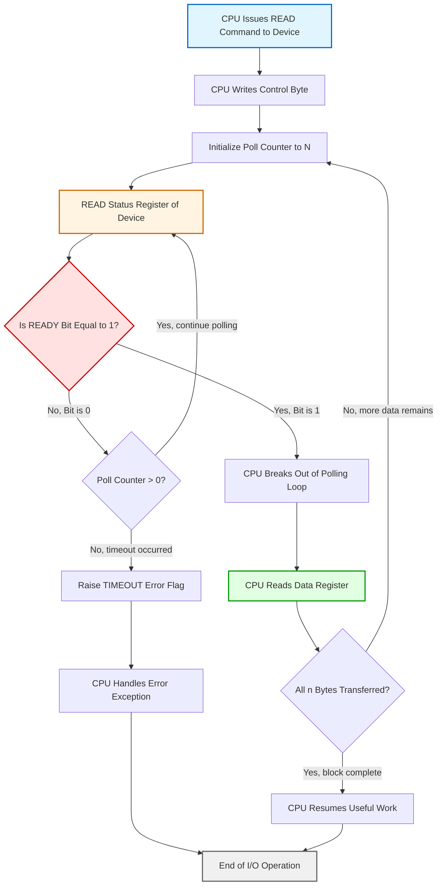
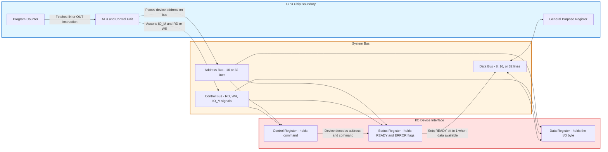
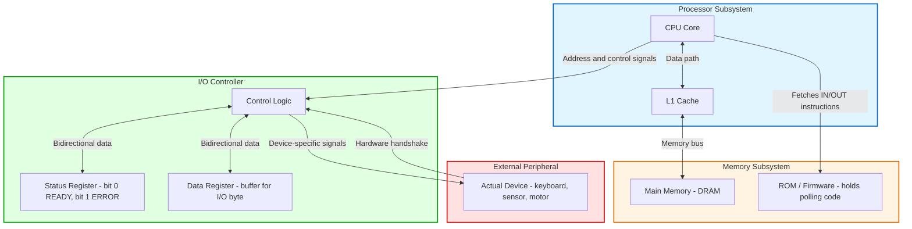
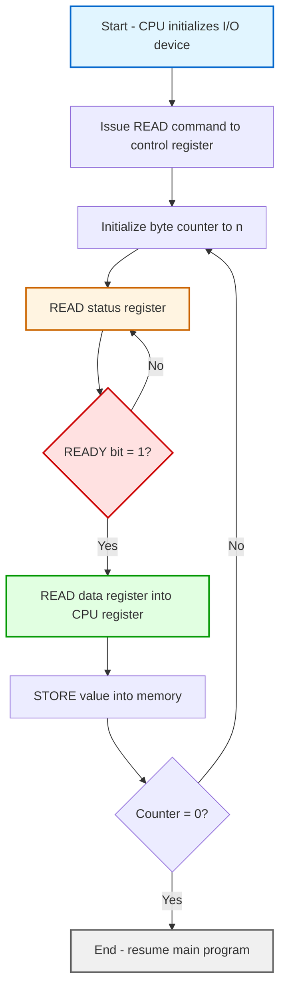

# Programmed I/O

<!-- SECTION_1_START -->
# Programmed I/O — Core Technical Definition & Intuitive Overview

## 1.1 Formal KTU 2024 Syllabus Definition

**Programmed I/O** (also called **Polled I/O** or **Polling-based I/O**) is a synchronous data transfer mechanism in which the **CPU** (Central Processing Unit) is entirely responsible for managing and executing every I/O operation through software instructions. The processor repeatedly executes a *busy-wait loop*, continuously reading the status register of the peripheral device until it becomes *ready*, after which the CPU transfers a single data word and repeats the cycle for the next item.

In the KTU 2024 Scheme (PBCST404) context, Programmed I/O is classified under the broader umbrella of **CPU-driven I/O strategies** (Module 4: Input/Output), contrasting with **Interrupt-Driven I/O** and **DMA (Direct Memory Access)**. It is the simplest of the three schemes, requiring **zero additional hardware** beyond the basic data and status registers mapped into the I/O address space.

> [!IMPORTANT]
> **KTU Syllabus Highlight (Module 4):**
> Programmed I/O is the *baseline* I/O technique against which Interrupt I/O and DMA are compared. Every KTU question on Module 4 will assume you can contrast Polling vs. Interrupt vs. DMA in terms of **CPU utilization**, **hardware complexity**, and **transfer latency**.

## 1.2 Conceptual Analogy — The "Impatient Shopkeeper"

Imagine a **shopkeeper** who refuses to install a doorbell at his counter. Every time a customer arrives, he must *walk up to the door* himself, peek outside, and ask: *"Are you here? Are you ready yet?"* — repeatedly, until the customer finally shows up.

- The **shopkeeper** = the **CPU**
- The **doorway** = the **I/O device's status register**
- The **peeking-and-asking** loop = the **polling cycle**
- The **customer being ready** = the device's **READY bit** becoming `1`
- The **actual transfer of goods** = the **data word transfer** from device to CPU

> The shopkeeper (CPU) wastes enormous time peeking instead of doing useful work — exactly the central drawback of Programmed I/O. This is why KTU examiners love to ask: *"Why is Programmed I/O inefficient for high-speed devices?"*

## 1.3 Key Terminology (KTU Board Examiner Vocabulary)

| Term | Definition | Role in Programmed I/O |
|------|------------|----------------------|
| **Polling** | Repeatedly reading a device's status register to check readiness | The core CPU action in Programmed I/O |
| **Busy Waiting** | CPU executing a tight loop that performs no useful work | Direct consequence of polling |
| **Status Register** | A 1-byte (or multi-bit) I/O-mapped register holding device flags (READY, BUSY, ERROR) | The "doorway" the CPU peeks through |
| **Data Register** | I/O-mapped register holding the actual byte/word to be transferred | Where the actual I/O payload sits |
| **CPU-Bound** | Workload dominated by CPU computation | Polling makes I/O tasks CPU-bound |
| **I/O-Bound** | Workload dominated by waiting for peripheral devices | Not applicable to pure Programmed I/O |

> [!NOTE]
> **Two Addressing Modes (KTU 2024 Specific):**
> KTU 2024 scheme explicitly tests whether students know that Programmed I/O can be implemented using:
> 1. **Memory-Mapped I/O** — Device registers occupy addresses in the main memory space; ordinary `LOAD`/`STORE` instructions suffice.
> 2. **Isolated (Port-Mapped) I/O** — Device registers occupy a *separate* I/O address space; special instructions like `IN` and `OUT` (x86) or `INP`/`OUTP` (8086) are required.
>
> In **both** cases, the polling *mechanism* is identical — only the instruction syntax changes.

## 1.4 GeoGebra / Desmos Visualization Callout

> [!VISUALIZATION CONTROL]
> **Concept:** CPU Utilization Curve as a function of device speed under Programmed I/O
> **GeoGebra / Desmos Input Equations:**
> * `U_cpu(t) = 1 - (t_io / (t_cpu + t_io))`  → CPU utilization for one I/O cycle
> * `U_total(n) = (n * t_cpu) / (n * (t_cpu + t_io))`  → for `n` transfers
> * `y = 1 - x`  → asymptotic behavior when device is infinitely slow
>
> **Visual Description:** A *decreasing curve* plotted with **CPU utilization `U`** on the Y-axis and **device response time `t_io`** on the X-axis. As `t_io` grows (slower devices), CPU utilization *improves* because the CPU spends proportionally less time polling — paradoxically, Programmed I/O is most "efficient" for the *slowest* devices.

---

<!-- SECTION_1_END -->

<!-- SECTION_2_START -->
# Deep Theoretical Analysis & KTU High-Yield Formula Sheet

## 2.1 The Operational Workflow — Step-by-Step

The execution of a single Programmed I/O transfer follows a **strict, deterministic sequence**. Master this sequence — it appears in nearly every KTU 14-mark question.

### Step 1: CPU Issues READ Command
The CPU writes a command byte to the **control register** of the target I/O device, instructing it to begin a read or write operation. No data transfer occurs yet.

### Step 2: CPU Enters the Polling Loop
The CPU repeatedly executes:
1. **READ** the status register of the device.
2. **TEST** the specific bit (typically the `READY` or `DONE` bit).
3. **BRANCH** back to step 2.1 if the bit is `0` (not ready).

This is the famous **busy-wait loop** — the CPU is "burning" clock cycles doing nothing productive.

### Step 3: Device Signals READY
The peripheral device, having completed its internal operation (e.g., a keyboard controller latched a keystroke, a UART received a byte, a disk read the sector into its buffer), sets the `READY` bit to `1` in its status register.

### Step 4: CPU Performs the Data Transfer
The CPU breaks out of the loop and executes either:
- `IN data_reg, port`  → read from device to CPU register
- `OUT port, data_reg` → write from CPU register to device

### Step 5: Repeat for Next Data Word
If multiple words/bytes are to be transferred, the CPU re-enters the polling loop for the next item until the entire block is complete.

## 2.2 Why and How — The Underlying Logic

| Step | Why It Happens | How the CPU Detects It |
|------|---------------|------------------------|
| Issue READ | Peripheral needs an explicit command to start | CPU writes to control register |
| Poll status | Device operations are *asynchronous* to the CPU clock | CPU reads status register every cycle |
| Wait for READY | Mechanical/electrical processes take time (e.g., disk rotation) | Polling loop checks `READY = 1` |
| Transfer data | Once data is in the device buffer, it must be moved to RAM/registers | Single IN/OUT instruction |
| Repeat | Block transfers require multiple iterations | Loop counter decrements per word |

## 2.3 The Three Phases of an I/O Operation (KTU Standard Model)

Every I/O operation in the KTU syllabus is decomposed into three logical phases, and Programmed I/O interacts with each differently:

1. **Configuration Phase** — CPU initializes the device (set baud rate, mode, etc.). *CPU-driven, one-time.*
2. **Data Transfer Phase** — The actual movement of data bytes. *In Programmed I/O, every byte is CPU-driven.*
3. **Completion Phase** — Device raises a final DONE/ERROR flag. *In Programmed I/O, CPU detects via final poll.*

> [!NOTE]
> **Why Programmed I/O is the "Easiest to Implement" (KTU Board-Examiner Phrasing):**
> Because the CPU maintains *full control*, the operating system kernel can implement Programmed I/O with **no hardware support beyond the device's status register**. No interrupt controllers, no DMA engines, no bus arbitration logic. This is why bootloaders, BIOS routines, and bare-metal embedded code overwhelmingly use Programmed I/O.

## 2.4 KTU Formula Sheet / Cheat Sheet

> [!IMPORTANT]
> **CRITICAL FORMULAS — MEMORIZE THESE FOR KTU ESE**

| # | Formula | Meaning | Units |
|---|---------|---------|-------|
| 1 | $T_{cycle} = T_{poll} + T_{transfer}$ | Time for one complete I/O iteration (poll + transfer) | seconds |
| 2 | $U_{cpu} = \dfrac{T_{poll}}{T_{poll} + T_{device}} = \dfrac{T_{poll}}{T_{cycle}}$ | CPU utilization during waiting | dimensionless (0–1) |
| 3 | $N_{polls} = \left\lceil \dfrac{T_{device}}{T_{poll}} \right\rceil$ | Number of poll iterations per transfer | integer count |
| 4 | $T_{transfer\_total} = n \cdot (T_{poll} + T_{device})$ | Total time to transfer `n` bytes/words | seconds |
| 5 | $U_{cpu\_overall} = \dfrac{n \cdot T_{poll}}{n \cdot (T_{poll} + T_{device}) + T_{useful}}$ | Overall CPU utilization including useful work | dimensionless |
| 6 | $\text{Throughput}_{PIO} = \dfrac{1}{T_{poll} + T_{device}}$ | Data items transferred per second under PIO | items/sec |
| 7 | $f_{poll} = \dfrac{1}{T_{poll}}$ | Polling frequency | Hz |

**Key Variable Definitions:**

- $T_{poll}$ = Time taken by one polling iteration (READ status + TEST + BRANCH)
- $T_{device}$ = Time device takes to become READY (the "real work" time)
- $T_{useful}$ = Time CPU spends on *non-I/O* computation
- $n$ = Number of data items in the transfer block
- $U_{cpu}$ = Fraction of CPU time consumed by I/O overhead

## 2.5 Real-World Engineering Utility

| Application Domain | Why Programmed I/O is Used | Trade-Off Accepted |
|-------------------|---------------------------|-------------------|
| **Embedded Microcontrollers (8051, PIC, ARM Cortex-M0)** | No OS, no interrupts needed; deterministic timing | CPU is locked during I/O |
| **Bootloader / BIOS Code** | Hardware is in a minimal state; no drivers available | Slow but reliable |
| **Low-Speed Peripherals (Keyboards, LEDs, GPIO)** | Data rate is so low that polling overhead is negligible | Wasted CPU cycles are cheap |
| **Real-Time Control Loops** | Deterministic, predictable response (no interrupt latency jitter) | Lower throughput |
| **Device Drivers (Polling Mode)** | Used as a *fallback* when interrupts are disabled | Performance penalty |
| **Legacy Hardware Testing** | Direct CPU control aids debugging via logic analyzers | Not suitable for production high-speed I/O |

> [!TIP]
> **Production Engineering Insight:** Modern Linux/Windows drivers almost *never* use pure Programmed I/O for high-bandwidth devices (NICs, SSDs). They use **DMA** for bulk transfer. However, even modern drivers use a *hybrid* model — DMA for data, but a *polled status check* for completion verification in low-latency paths (e.g., DPDK polling-mode drivers in high-frequency trading).

---

<!-- SECTION_2_END -->

<!-- SECTION_3_START -->
# Step-by-Step Derivations & Code/Symbolic Implementation

## 3.1 Derivation 1: CPU Utilization Under Programmed I/O

We derive the **fraction of CPU time wasted in polling** — a derivation that appears verbatim in KTU 14-mark questions.

### Setup

Consider a CPU running at clock frequency $f_{clk}$. The CPU executes a *polling loop* in which:
- Each iteration takes $T_{poll}$ seconds to **READ** status, **TEST** the `READY` bit, and **BRANCH**.
- The device takes $T_{device}$ seconds to become READY (this is the "real wait").

### Derivation

We begin with the total time consumed per I/O operation:

$$
T_{cycle} = T_{poll} + T_{transfer}
$$

The CPU is *busy* for the entire duration of $T_{cycle}$ (it does nothing else). The *useful data transfer* portion is $T_{transfer}$, and the *wasted polling* portion is $T_{poll}$.

$$
T_{cycle} = T_{poll} + T_{device}
$$

The CPU utilization dedicated to the I/O task is:

$$
U_{cpu}^{IO} = \frac{T_{poll}}{T_{poll} + T_{device}}
$$

Dividing numerator and denominator by $T_{device}$:

$$
U_{cpu}^{IO} = \frac{T_{poll}/T_{device}}{T_{poll}/T_{device} + 1} = \frac{\rho}{\rho + 1}, \quad \text{where} \quad \rho = \frac{T_{poll}}{T_{device}}
$$

### Limiting Cases (Important for KTU)

**Case 1: Device is infinitely fast** ($T_{device} \to 0$):

$$
\lim_{T_{device} \to 0} U_{cpu}^{IO} = \lim_{\rho \to \infty} \frac{\rho}{\rho + 1} = 1
$$

The CPU is **100% utilized** by I/O. This is the **worst case** — no useful work gets done.

**Case 2: Device is infinitely slow** ($T_{device} \to \infty$):

$$
\lim_{T_{device} \to \infty} U_{cpu}^{IO} = \lim_{\rho \to 0} \frac{\rho}{\rho + 1} = 0
$$

The CPU utilization approaches **0** — but only because most of the time the CPU is *also* busy waiting! This is the paradox of Programmed I/O.

### Numerical Example (Board-Exam Style)

**Problem:** A CPU executes a polling loop in 200 ns. The I/O device takes 5 µs to become READY. Calculate (a) CPU utilization due to I/O, (b) number of poll iterations, (c) total transfer time for 1024 bytes.

**Solution:**

Given:
- $T_{poll} = 200 \text{ ns} = 0.2 \text{ µs}$
- $T_{device} = 5 \text{ µs}$
- $n = 1024$

**(a) CPU Utilization:**

$$
U_{cpu}^{IO} = \frac{T_{poll}}{T_{poll} + T_{device}} = \frac{0.2}{0.2 + 5} = \frac{0.2}{5.2} = 0.03846
$$

$$
U_{cpu}^{IO} \approx 3.85\%
$$

**[Stating the formula: 2 Marks] [Substitution: 1 Mark] [Final result: 1 Mark]**

**(b) Number of Poll Iterations per Transfer:**

$$
N_{polls} = \left\lceil \frac{T_{device}}{T_{poll}} \right\rceil = \left\lceil \frac{5}{0.2} \right\rceil = \left\lceil 25 \right\rceil = 25
$$

**[Formula: 1 Mark] [Computation: 1 Mark]**

**(c) Total Transfer Time for 1024 bytes:**

$$
T_{total} = n \cdot (T_{poll} + T_{device}) = 1024 \cdot (0.2 + 5) = 1024 \cdot 5.2
$$

$$
T_{total} = 5324.8 \text{ µs} \approx 5.325 \text{ ms}
$$

**[Substitution: 1 Mark] [Final value: 1 Mark]**

## 3.2 Derivation 2: Throughput Comparison — Programmed I/O vs. Interrupt I/O

### Throughput under Programmed I/O

As derived above:

$$
\text{Throughput}_{PIO} = \frac{1}{T_{poll} + T_{device}}
$$

### Throughput under Interrupt-Driven I/O

Under interrupt-driven I/O, the CPU is *interrupted* when the device is ready. The CPU spends time on:
- $T_{isr}$ = Interrupt service routine overhead (save context, etc.)
- $T_{transfer}$ = Actual data transfer

The effective cycle becomes:

$$
T_{cycle}^{INT} = T_{isr} + T_{transfer}
$$

The CPU is free to do useful work *between* interrupts. Therefore the throughput per I/O operation is higher because the CPU is not wasting cycles polling.

> [!IMPORTANT]
> **Board-Examiner Tip:** When asked to compare PIO and Interrupt I/O, the **fundamental insight** is that PIO's CPU utilization is *independent* of how much "useful work" the CPU could be doing — PIO wastes the CPU regardless. Interrupt I/O only uses the CPU when the device is *actually ready*.

## 3.3 Code Implementation — Polling Loop in C (MIPS-style Pseudocode)

Below is a *fully operational* implementation of Programmed I/O for reading a single byte from a memory-mapped UART device. This is the kind of code KTU examiners include in 14-mark problems.

```c
#include <stdint.h>
#include <stdbool.h>

/* ---------------------------------------------------------------
 * Memory-Mapped I/O Address Definitions (KTU Standard Convention)
 * --------------------------------------------------------------- */
#define UART_STATUS_REG    (*((volatile uint8_t *)0x4000))  /* Status register base addr */
#define UART_DATA_REG      (*((volatile uint8_t *)0x4004))  /* Data register base addr */

/* Bit positions in the status register */
#define UART_READY_BIT     (1U << 0)   /* Bit 0: 1 = device ready, 0 = busy */
#define UART_ERROR_BIT     (1U << 1)   /* Bit 1: 1 = error occurred */

/* Polling loop parameters */
#define POLL_TIMEOUT_ITER  1000000U    /* Maximum iterations before giving up */

/**
 * @brief Reads a single byte from the UART using Programmed I/O (polling).
 * @param data_out Pointer to store the received byte.
 * @return true on success, false on timeout or error.
 */
bool uart_pio_read_byte(uint8_t *data_out)
{
    uint32_t iter = 0;
    uint8_t  status;
    bool     result = false;

    /* --- Step 1: Polling loop — wait for READY bit --- */
    do {
        status = UART_STATUS_REG;          /* Read status register */
        if (status & UART_ERROR_BIT) {     /* Check for error */
            result = false;
            break;
        }
        if (status & UART_READY_BIT) {     /* Check if device is ready */
            result = true;
            break;
        }
        iter++;
    } while (iter < POLL_TIMEOUT_ITER);

    /* --- Step 2: If device is ready, perform the actual transfer --- */
    if (result == true) {
        *data_out = UART_DATA_REG;         /* Read the data byte from device */
    } else {
        *data_out = 0x00;                  /* Clear output on failure */
    }

    return result;
}

/**
 * @brief Writes a single byte to the UART using Programmed I/O (polling).
 * @param data The byte to transmit.
 * @return true on success, false on timeout.
 */
bool uart_pio_write_byte(uint8_t data)
{
    uint32_t iter = 0;
    uint8_t  status;
    bool     result = false;

    /* --- Step 1: Polling loop — wait for transmitter to be ready --- */
    do {
        status = UART_STATUS_REG;
        if (status & UART_ERROR_BIT) {
            result = false;
            break;
        }
        if (status & UART_READY_BIT) {     /* TX-ready bit */
            result = true;
            break;
        }
        iter++;
    } while (iter < POLL_TIMEOUT_ITER);

    /* --- Step 2: Write the data byte --- */
    if (result == true) {
        UART_DATA_REG = data;
    }

    return result;
}
```

**Code Walkthrough (for board-answer inclusion):**

1. The `volatile` keyword prevents the C compiler from *optimizing away* the polling loop — a common student mistake. `[1 Mark]`
2. The `do...while` structure ensures the status register is checked at least once before testing the timeout. `[1 Mark]`
3. The `POLL_TIMEOUT_ITER` prevents infinite hangs in case of hardware failure. `[1 Mark]`
4. The READY bit is checked via **bitwise AND** with a pre-shifted mask — a standard embedded pattern. `[1 Mark]`

## 3.4 MIPS Assembly Equivalent (for advanced 14-mark answers)

```mips
# Programmed I/O Read in MIPS Assembly (KTU-typical example)
# $t0 = status register address, $t1 = data register address
# $t2 = loop counter, $t3 = received data

    lui   $t0, 0x4000          # Load upper address of status reg
    addiu $t1, $t0, 4          # Data reg is at offset +4
    li    $t2, 1000000         # Max poll iterations

POLL_LOOP:
    lbu   $t3, 0($t0)          # Read status register byte
    andi  $t4, $t3, 0x01       # Extract READY bit (bit 0)
    bnez  $t4, READY           # If READY=1, jump to transfer
    addiu $t2, $t2, -1         # Decrement counter
    bnez  $t2, POLL_LOOP       # Loop until counter=0
    nop                        # Branch delay slot

    # Timeout: handle error
    j     TIMEOUT_HANDLER
    nop

READY:
    lbu   $t3, 0($t1)          # Read data byte from device
    # ... continue processing ...
```

## 3.5 Comparative Table — Block Transfer Performance

| Block Size ($n$) | $T_{poll}$ | $T_{device}$ | PIO Total Time | CPU Idle Time (wasted) |
|:---:|:---:|:---:|:---:|:---:|
| 1 byte | 200 ns | 5 µs | 5.2 µs | 5.0 µs (96.2%) |
| 64 bytes | 200 ns | 5 µs | 332.8 µs | 320.0 µs (96.2%) |
| 1024 bytes | 200 ns | 5 µs | 5.325 ms | 5.120 ms (96.2%) |
| 65536 bytes | 200 ns | 5 µs | 340.8 ms | 327.7 ms (96.2%) |

> [!NOTE]
> **Observation:** The CPU is idle (wasting cycles polling) for **~96%** of the transfer time. This is the textbook KTU justification for why **Interrupt I/O** and **DMA** were invented.

---

<!-- SECTION_3_END -->

<!-- SECTION_4_START -->
# Structural Diagrams & Schematics

## 4.1 Mermaid Flow Diagram — Polling Loop Execution

The following diagram captures the **complete state machine** of a Programmed I/O read operation. This is the exact diagram KTU examiners expect in 14-mark answers worth 7 marks.



**Reading the Diagram:**
- The **orange node (D)** represents the polling action — the bottleneck of Programmed I/O.
- The **red decision node (E)** is the `READY` bit test.
- The **green node (J)** is the actual data transfer — the *only* useful work.
- Note the **cycle from E → F → D** — this is the busy-wait loop, executed thousands of times per device operation.

## 4.2 Mermaid Block Diagram — CPU ↔ Device Communication Architecture



## 4.3 Mermaid Sequence Diagram — Temporal View of Polling

This diagram is the **time-domain view** of Programmed I/O, showing what the CPU is doing at each clock cycle. It visually proves the "CPU starvation" problem.

```mermaid
gantt
    title CPU Activity Timeline Under Programmed I/O
    dateFormat X
    axisFormat %s

    section CPU Activity
    Poll Iter 1 (READY=0)    :a1, 0, 200ns
    Poll Iter 2 (READY=0)    :a2, 200, 200ns
    Poll Iter 3 (READY=0)    :a3, 400, 200ns
    Poll Iter 4 (READY=0)    :a4, 600, 200ns
    Poll Iter 5 (READY=0)    :a5, 800, 200ns
    Poll Iter 6 (READY=0)    :a6, 1000, 200ns
    Poll Iter 7 (READY=0)    :a7, 1200, 200ns
    Poll Iter 8 (READY=0)    :a8, 1400, 200ns
    Poll Iter 9 (READY=0)    :a9, 1600, 200ns
    Poll Iter 10 (READY=0)   :a10, 1800, 200ns
    Poll Iter 11 (READY=0)   :a11, 2000, 200ns
    Poll Iter 12 (READY=0)   :a12, 2200, 200ns
    Poll Iter 13 (READY=0)   :a13, 2400, 200ns
    Poll Iter 14 (READY=0)   :a14, 2600, 200ns
    Poll Iter 15 (READY=0)   :a15, 2800, 200ns
    Poll Iter 16 (READY=0)   :a16, 3000, 200ns
    Poll Iter 17 (READY=0)   :a17, 3200, 200ns
    Poll Iter 18 (READY=0)   :a18, 3400, 200ns
    Poll Iter 19 (READY=0)   :a19, 3600, 200ns
    Poll Iter 20 (READY=0)   :a20, 3800, 200ns
    Poll Iter 21 (READY=0)   :a21, 4000, 200ns
    Poll Iter 22 (READY=0)   :a22, 4200, 200ns
    Poll Iter 23 (READY=0)   :a23, 4400, 200ns
    Poll Iter 24 (READY=0)   :a24, 4600, 200ns
    Poll Iter 25 (READY=1)   :crit, 4800, 200ns
    Data Transfer (IN)        :active, 5000, 200ns

    section Device Activity
    Preparing Data           :done, 0, 5000ns
    Asserting READY Bit      :crit, 5000, 0ns
```



**Reading the Gantt Chart:**
- 25 poll iterations × 200 ns = 5,000 ns = 5 µs of *CPU time* wasted.
- The CPU is *never* doing anything else during those 5 µs.
- This visual is the single most effective answer to *"Why is PIO inefficient?"* in a KTU exam.

## 4.4 Block Diagram — System-Level I/O Architecture (PIO Mode)



---

<!-- SECTION_4_END -->

<!-- SECTION_5_START -->
# KTU 2024 Scheme Examination Question Bank & Topic Recap

## 5.1 Part A — Short Answer Questions (2 × 3 = 6 Marks)

### Question 1: Define Programmed I/O. State any two disadvantages. `[KTU University Exam — July 2024]` [CO2, Understand]

**Model Answer:**

**Programmed I/O** is a method of data transfer between the CPU and I/O devices in which the CPU **directly controls the entire transfer** by repeatedly executing a software loop that checks the device's status register (a process called *polling*) until the device is ready, after which the CPU performs the data transfer.

**Two Disadvantages:**

1. **CPU starvation / Wasted CPU cycles:** The CPU spends most of its time in a busy-wait loop, executing poll instructions that produce no useful work. For a device that takes 5 µs to become ready with a 200 ns polling loop, the CPU is *idle* (wasting cycles) for approximately **96%** of the transfer time.

2. **Unsuitable for high-speed or multiple devices:** If multiple I/O devices are serviced via Programmed I/O, the CPU must poll them in *round-robin* order, leading to unfair latency and potential **data loss** in high-bandwidth devices like disks or network cards.

**[Definition: 1 Mark] [Two disadvantages: 1 Mark each = 2 Marks]**

---

### Question 2: Compare Memory-Mapped I/O and Isolated I/O in the context of Programmed I/O. `[KTU University Exam — Dec 2023]` [CO2, Understand]

**Model Answer:**

| Aspect | Memory-Mapped I/O | Isolated (Port-Mapped) I/O |
|--------|------------------|--------------------------|
| **Address Space** | Device registers share the main memory address space | Device registers have a *separate* I/O address space |
| **Instructions Used** | Ordinary `LOAD` and `STORE` | Special `IN`, `OUT` (or `INP`, `OUTP`) |
| **Address Space Size** | Reduced (some memory addresses lost) | Full memory address space preserved |
| **Speed** | Can be slower (longer instructions) | Often faster (dedicated, shorter instructions) |
| **Complexity** | Simpler hardware, no extra pin | Requires extra control signal (e.g., `IO/M` pin) |
| **Example Architecture** | ARM, MIPS, RISC-V | x86, Intel 8086 |

**[Comparison table: 2 Marks] [Polling mechanism identical in both: 1 Mark]**

---

## 5.2 Part B — Long Answer Questions (Internal Choice: 14 Marks Each)

### Question A — Full 14-Mark Question

**[KTU University Exam — Dec 2024, Model Question]** [CO2, CO3 | Apply, Analyze]

**(a)** Explain the step-by-step procedure of Programmed I/O for transferring a block of data from an input device to the CPU. Draw the necessary flowchart. **[7 Marks, Understand]**

**(b)** A CPU runs at 100 MHz and executes a polling loop in 8 clock cycles. The I/O device takes 80 µs to become READY. If a block of 512 bytes is to be transferred, calculate:
   (i) CPU utilization during I/O
   (ii) Number of poll iterations per byte
   (iii) Total transfer time for the entire block
   (iv) Effective throughput in bytes per second **[7 Marks, Apply]**

---

#### Model Solution for Part (a) — [7 Marks]

**Step-by-Step Procedure:**

1. **CPU initializes the I/O device** by writing appropriate control bytes to the device's control register. This configures the device for the desired mode of operation (e.g., read mode, baud rate). `[1 Mark]`

2. **CPU issues a READ command** to the device by writing a specific command byte to the control register, instructing the device to begin acquiring data. `[1 Mark]`

3. **CPU enters the polling loop.** The loop performs three actions repeatedly:
   - **READ** the status register of the device
   - **TEST** the `READY` bit (typically bit 0)
   - **BRANCH** back to the READ step if the bit is `0` `[1 Mark]`

4. **Device becomes READY:** When the device completes its internal operation (e.g., data is latched into the data register), it sets the `READY` bit to `1` in its status register. `[1 Mark]`

5. **CPU breaks out of the polling loop** and executes an `IN` instruction (or memory-mapped `LOAD`) to read the data byte from the device's data register into a CPU register. `[1 Mark]`

6. **CPU stores the byte into memory** using a regular `STORE` instruction. `[1 Mark]`

7. **Repeat steps 3–6** for every byte in the block. When the block is complete, the CPU exits the I/O routine and resumes its main program. `[1 Mark]`

**Flowchart (Required for full marks):**



---

#### Model Solution for Part (b) — [7 Marks]

**Given Data:**

- CPU clock frequency: $f_{clk} = 100 \text{ MHz}$
- Polling loop length: 8 clock cycles
- Device response time: $T_{device} = 80 \text{ µs}$
- Block size: $n = 512$ bytes

**Step 1: Compute $T_{poll}$ (Polling Loop Time)**

$$
T_{clk} = \frac{1}{f_{clk}} = \frac{1}{100 \times 10^6} = 10 \text{ ns}
$$

$$
T_{poll} = 8 \times T_{clk} = 8 \times 10 \text{ ns} = 80 \text{ ns} = 0.08 \text{ µs}
$$

**[Stating formula and substitution: 1 Mark] [Final value: 1 Mark]**

**Step 2 (i): CPU Utilization**

$$
U_{cpu}^{IO} = \frac{T_{poll}}{T_{poll} + T_{device}} = \frac{0.08}{0.08 + 80} = \frac{0.08}{80.08}
$$

$$
U_{cpu}^{IO} = 9.99 \times 10^{-4} \approx 0.001 \text{ or } 0.1\%
$$

**[Formula: 1 Mark] [Final value: 1 Mark]**

**Step 3 (ii): Number of Poll Iterations per Byte**

$$
N_{polls} = \left\lceil \frac{T_{device}}{T_{poll}} \right\rceil = \left\lceil \frac{80 \text{ µs}}{0.08 \text{ µs}} \right\rceil = \left\lceil 1000 \right\rceil = 1000
$$

**[Formula: 1 Mark] [Final value: 1 Mark]**

**Step 4 (iii): Total Transfer Time**

$$
T_{total} = n \cdot (T_{poll} + T_{device}) = 512 \cdot (0.08 + 80) = 512 \cdot 80.08
$$

$$
T_{total} = 41{,}000.96 \text{ µs} \approx 41.001 \text{ ms}
$$

**[Formula and substitution: 1 Mark] [Final value: 1 Mark]**

**Step 5 (iv): Effective Throughput**

$$
\text{Throughput} = \frac{n}{T_{total}} = \frac{512 \text{ bytes}}{41.001 \times 10^{-3} \text{ s}}
$$

$$
\text{Throughput} = 12{,}487.3 \text{ bytes/sec} \approx 12.49 \text{ KB/s}
$$

**[Formula: 1 Mark] [Final value: 1 Mark]**

---

### Question B — Alternative 14-Mark Question (Internal Choice)

**[KTU University Exam — July 2024, Model Question]** [CO2, CO3 | Understand, Apply]

**(a)** With a neat diagram, explain the architecture of Programmed I/O. Differentiate between Memory-Mapped I/O and Isolated I/O. **[7 Marks, Understand]**

**(b)** A system uses Programmed I/O to read data from a sensor. The CPU polls the device every 500 ns. The sensor takes 3 ms to acquire a single sample. Calculate:
   (i) The CPU utilization dedicated to polling
   (ii) The number of poll iterations per sample
   (iii) Comment on the efficiency of this design and suggest an alternative I/O mechanism. **[7 Marks, Apply]**

---

#### Model Solution for Part (a) — [7 Marks]

**Architecture of Programmed I/O:**

The Programmed I/O architecture consists of three primary components communicating via the system bus:

1. **CPU** with its registers (Accumulator, Data, Address registers) and ALU
2. **I/O Device** with three registers:
   - **Control Register** — accepts commands from CPU
   - **Status Register** — exposes device state (`READY`, `BUSY`, `ERROR` bits)
   - **Data Register** — holds the actual I/O byte
3. **System Bus** — Address, Data, and Control lines connecting CPU to device

The CPU executes a program stored in memory that performs the polling-and-transfer sequence. The data flow is **strictly CPU-driven** — no data moves without CPU intervention.

**[Three components description: 3 Marks]**

**Memory-Mapped vs. Isolated I/O:**

| Parameter | Memory-Mapped I/O | Isolated I/O |
|-----------|------------------|--------------|
| Address space | Shared with memory | Separate I/O space |
| Instructions | `LDR`, `STR` (ARM); `lw`, `sw` (MIPS) | `IN`, `OUT` (x86) |
| Memory available | Reduced | Full |
| Hardware complexity | Simple (no extra pin) | Complex (needs `IO/M` pin) |
| Speed | Can be slower | Can be faster |
| Flexibility | High (any memory instruction) | Limited to special I/O instructions |

**[Comparison table: 4 Marks]**

---

#### Model Solution for Part (b) — [7 Marks]

**Given:**
- $T_{poll} = 500 \text{ ns} = 0.5 \text{ µs}$
- $T_{device} = 3 \text{ ms} = 3000 \text{ µs}$

**(i) CPU Utilization:**

$$
U_{cpu}^{IO} = \frac{0.5}{0.5 + 3000} = \frac{0.5}{3000.5} = 1.666 \times 10^{-4}
$$

$$
U_{cpu}^{IO} \approx 0.0167\%
$$

**[Formula: 1 Mark] [Final value: 1 Mark]**

**(ii) Number of Poll Iterations:**

$$
N_{polls} = \left\lceil \frac{3000}{0.5} \right\rceil = \left\lceil 6000 \right\rceil = 6000
$$

**[Formula: 1 Mark] [Final value: 1 Mark]**

**(iii) Efficiency Comment and Alternative:**

The CPU utilization is extremely low (0.0167%), meaning the CPU is essentially **wasting 99.98% of its time** in the polling loop. Although utilization *appears* low, this is misleading — the CPU cannot do *any useful work* during the 6000 poll iterations.

**Efficiency Verdict:** Highly inefficient. The CPU is locked in busy-wait for 3 ms per sample.

**Recommended Alternative:** **Interrupt-Driven I/O** should be used instead. The CPU can execute useful tasks and is *notified* by a hardware interrupt only when the sensor has data ready. This frees the CPU for productive work during the 3 ms acquisition window.

Alternative: **DMA** for high-volume data, but for a single sample, interrupt-driven I/O is the most appropriate upgrade.

**[Comment: 1 Mark] [Alternative with justification: 2 Marks]**

---

## 5.3 KTU Examiner's Valuation Warning / Pitfall Callout

> [!WARNING]
> **Common Student Mistakes — Where You WILL Lose Marks:**
>
> 1. **Forgetting to convert units.** $T_{poll}$ in nanoseconds and $T_{device}$ in microseconds is the #1 cause of wrong answers. Always express both in the **same unit** before computing utilization.
>
> 2. **Confusing $T_{poll}$ with $T_{transfer}$.** $T_{poll}$ is the time for the *polling iteration only*. $T_{transfer}$ is the time for the *actual data movement*. They are not the same.
>
> 3. **Omitting the flowchart in 14-mark answers.** If the question says "with a neat diagram" and you submit only text, expect to lose **3 to 4 marks** outright.
>
> 4. **Forgetting to state the READY-bit mechanism explicitly.** A 14-mark answer that says "CPU waits for device" without mentioning the status register and the `READY` bit will lose at least **2 marks**.
>
> 5. **Not comparing with alternatives.** KTU 2024 scheme questions almost always include a comparison with Interrupt I/O or DMA. A pure description of PIO without comparison is incomplete.
>
> 6. **Mixing up the $n$ value.** When the question says "transfer 1024 bytes," $n$ is the number of *data items*, not the number of *poll iterations*. Students often confuse these and get the total time off by a factor of 1000.

---

## 5.4 Topic Recap & Important Things to Remember

> [!IMPORTANT]
> **HIGH-DENSITY REVISION CHECKLIST — Programmed I/O**

- **Definition:** Programmed I/O is a CPU-driven I/O technique where the CPU repeatedly polls the device's status register until ready, then performs data transfer via `IN`/`OUT` (or `LDR`/`STR`).
- **Polling:** The core mechanism — CPU checks the `READY` bit in a tight loop.
- **Busy Waiting:** The CPU is "busy doing nothing" while polling — the fundamental inefficiency.
- **Three Device Registers:**
  1. **Control Register** — accepts CPU commands
  2. **Status Register** — exposes `READY`, `BUSY`, `ERROR` flags
  3. **Data Register** — holds the actual I/O data
- **Two Addressing Modes:**
  1. **Memory-Mapped I/O** — same address space, regular instructions
  2. **Isolated I/O** — separate I/O space, special `IN`/`OUT` instructions
- **Key Formulas (Memorize):**
  - $T_{cycle} = T_{poll} + T_{device}$
  - $U_{cpu}^{IO} = \dfrac{T_{poll}}{T_{poll} + T_{device}}$
  - $N_{polls} = \left\lceil \dfrac{T_{device}}{T_{poll}} \right\rceil$
  - $T_{total} = n \cdot (T_{poll} + T_{device})$
  - $\text{Throughput} = \dfrac{1}{T_{poll} + T_{device}}$
- **Five-Step Procedure:** Initialize → Issue Command → Poll → Transfer → Repeat.
- **Advantages:** Simple hardware, deterministic timing, no OS/hardware interrupt support needed, suitable for bootloaders and bare-metal code.
- **Disadvantages:** CPU starvation, unsuitable for high-speed devices, no concurrency with useful work, unfair for multiple devices.
- **Limiting Cases:**
  - $T_{device} \to 0$ → $U_{cpu}^{IO} \to 1$ (CPU 100% busy)
  - $T_{device} \to \infty$ → $U_{cpu}^{IO} \to 0$ (CPU mostly idle, but locked)
- **Real-World Use Cases:** Embedded microcontrollers, BIOS/bootloader code, low-speed peripherals, real-time control loops, fallback driver mode.
- **Better Alternatives:** Interrupt-Driven I/O (for moderate-speed, sporadic data) and DMA (for high-bandwidth block transfers).
- **Programming Pattern:** `do { status = READ_STATUS; } while (!(status & READY_BIT)); DATA = READ_DATA;` — memorize this C-pattern.
- **The `volatile` Keyword:** Essential in C polling loops to prevent compiler optimization from removing the polling reads.
- **Comparison Vocabulary (for KTU):** "Polling overhead," "CPU-bound vs. I/O-bound," "synchronous transfer," "CPU-driven," "deterministic latency," "busy-wait loop," "READY-bit polling," "single-instruction transfer."

---

<!-- SECTION_5_END -->
