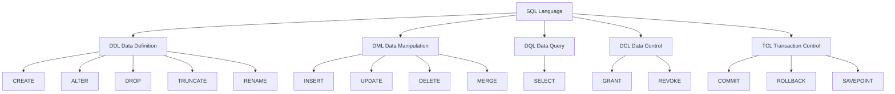
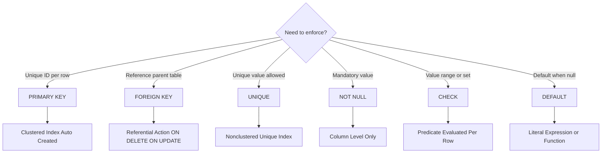
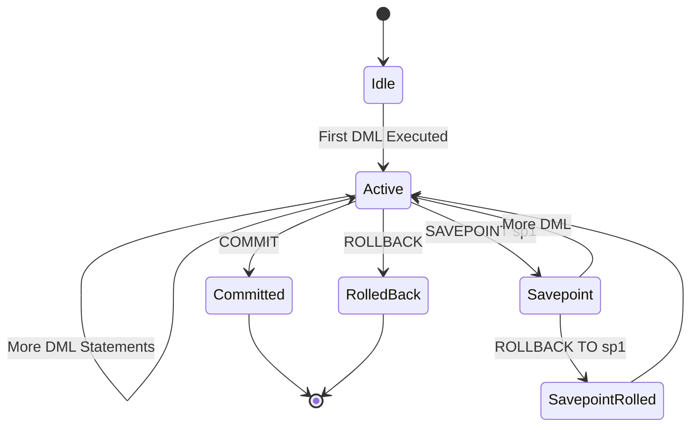

# DDL/DML command operations, table creation profiles, constraint bindings definitions

<!-- SECTION_1_START -->
# Module 1: SQL and Procedural Query Controls

## Core Technical Definition & Intuitive Overview

### Formal KTU 2024 Syllabus Definition

> [!IMPORTANT]
> **SQL (Structured Query Language)** is the standard declarative, set-oriented, non-procedural database sub-language defined by the **ISO/IEC 9075** standard, used to define, manipulate, retrieve, and control access to data held in a Relational Database Management System (RDBMS). It is partitioned into five sub-languages: **DDL**, **DML**, **DQL**, **DCL**, and **TCL**.

The lab module focuses on three foundational pillars:
1. **DDL (Data Definition Language)** — `$CREATE$`, `$ALTER$`, `$DROP$`, `$TRUNCATE$`, `$RENAME$` for schema definition.
2. **DML (Data Manipulation Language)** — `$INSERT$`, `$UPDATE$`, `$DELETE$` for row-level data mutation.
3. **Constraints** — Domain-level integrity rules (`$PRIMARY KEY$`, `$FOREIGN KEY$`, `$UNIQUE$`, `$NOT NULL$`, `$CHECK$`, `$DEFAULT$`) bound to columns during `$CREATE TABLE$` or `$ALTER TABLE$`.

### Conceptual Analogy / Intuition

> [!NOTE]
> **Analogy — The "Building Blueprint" Model**
> Think of a database as a **multi-floor office building**:
> - The **Schema** (DDL) is the *architectural blueprint* — it defines how many rooms (tables) exist, their size, door positions (columns), and the type of lock on each door (constraints). Once the blueprint is approved, the structure is rigid.
> - **DML** is the *daily office operations* — moving employees in (`$INSERT$`), updating their cubicle labels (`$UPDATE$`), or vacating desks (`$DELETE$`).
> - **Constraints** are the *building regulations* — e.g., "every floor must have at least one fire exit" (`$NOT NULL$`) or "no two offices can have the same suite number" (`$UNIQUE$`).
> - The **DBMS engine** acts as the *building inspector* that enforces these regulations the moment any operation is attempted.

### Physical Constants and Standard Metrics

> [!IMPORTANT]
> - **Transaction Atomicity Guarantee**: All DDL statements in standard SQL are **auto-committed** and cannot be rolled back in many RDBMS (e.g., Oracle) — this is why a single typo in `$DROP TABLE$` is catastrophic.
> - **Reserved Keyword Safety**: **88** standard SQL reserved keywords must never be used as identifiers without quoting (e.g., `$SELECT$`, `$FROM$`, `$WHERE$`, `$TABLE$`).
> - **Identifier Length Limit**: **30 characters** in Oracle, **64 characters** in PostgreSQL/MySQL by default.

> [!VISUALIZATION CONTROL]
> **Concept:** SQL Sub-Language Taxonomy
> **GeoGebra / Desmos Input Equations:**
> * Set A (DDL): `{CREATE, ALTER, DROP, TRUNCATE, RENAME}`
> * Set B (DML): `{INSERT, UPDATE, DELETE, MERGE}`
> * Set C (DQL): `{SELECT}`
> * Set D (DCL): `{GRANT, REVOKE}`
> * Set E (TCL): `{COMMIT, ROLLBACK, SAVEPOINT}`
> **Visual Description:** Picture five disjoint Venn circles on the coordinate plane, each labeled. The universal set is "SQL" and the five subsets (DDL, DML, DQL, DCL, TCL) partition the space. Observe that `$SELECT$` is isolated in DQL, while mutation verbs are grouped in DML.

<!-- SECTION_1_END -->

<!-- SECTION_2_START -->
# Deep Theoretical Analysis & KTU High-Yield Formula Sheet

## Operational Logic Breakdown — DDL Commands

The DDL component operates at the **schema level**, modifying the *Data Dictionary* (system catalog). It does not return row sets.

### 1. `$CREATE TABLE$` — The Foundation

The `$CREATE TABLE$` statement defines a relation $R(A_1, A_2, \ldots, A_n)$ where each $A_i$ is an attribute with domain $D_i$ and optional constraint set $C_i$.

**Structural Logic Steps:**
1. Allocate a new segment in the **tablespace** (physical storage).
2. Register the relation name in `USER_TABLES` (Oracle) or `INFORMATION_SCHEMA.TABLES` (MySQL/PostgreSQL).
3. For each column, allocate the column descriptor with declared data type and length.
4. For each constraint, parse and store the rule in the **constraint catalog** (`USER_CONSTRAINTS`).
5. Lock the schema definition (DML can proceed, but the table is empty).

### 2. `$ALTER TABLE$` — Schema Evolution

Supports five operations: `$ADD$`, `$MODIFY$` (Oracle) / `$ALTER COLUMN$` (PostgreSQL), `$DROP COLUMN$`, `$RENAME$`, and `$ADD CONSTRAINT$`.

### 3. `$DROP$` vs `$TRUNCATE$` — Critical Distinction

- `$DROP TABLE$`: Removes **structure + data + indexes + constraints** permanently (DDL).
- `$TRUNCATE TABLE$`: Removes **all rows** but preserves structure (DDL in most RDBMS, but DML-like behavior).

## Operational Logic Breakdown — DML Commands

DML operates at the **tuple level** and is **transactional** (can be `$COMMIT$`ted or `$ROLLBACK$`ed).

- `$INSERT$`: Adds one or more tuples $\{(t_1, t_2, \ldots, t_n)\}$ to the relation.
- `$UPDATE$`: Modifies attribute values of tuples matching a `$WHERE$` predicate. If `$WHERE$` is omitted, **all rows** are updated (a famous board-exam pitfall).
- `$DELETE$`: Removes tuples matching a `$WHERE$` predicate. Without `$WHERE$`, the table is emptied (equivalent to `$TRUNCATE$` but transactionally undoable).

## Constraint Binding — The Integrity Engine

Constraints are domain predicates that the DBMS evaluates on every `$INSERT$`/`$UPDATE$` to maintain ACID integrity.

### KTU Formula Sheet / Cheat Sheet

| Constraint | Purpose | Null Allowed? | Duplicate Allowed? | Reference Target | Triggers Index? |
|:-----------|:--------|:--------------|:-------------------|:-----------------|:----------------|
| `$PRIMARY KEY$` | Unique row identifier (entity integrity) | **No** | **No** | Self | **Yes** (auto) |
| `$FOREIGN KEY$` | Referential integrity (parent-child link) | Yes | Yes | Parent PK or UNIQUE | Optional (auto in MySQL) |
| `$UNIQUE$` | Alternative key | Yes (one null in Oracle/SQL Server) | **No** | Self | Yes (auto in Oracle) |
| `$NOT NULL$` | Mandatory value | **No** | Yes | Self | No |
| `$CHECK$` | Domain predicate $P(x)$ | Depends on predicate | Depends on predicate | Self | No |
| `$DEFAULT$` | Substitute value on omission | N/A | N/A | Self | No |

### Real-World Engineering Utility

> [!NOTE]
> - **Banking Systems**: `$CHECK (balance \geq 0)$` prevents overdraft at the database layer (defense-in-depth beyond application code).
> - **E-commerce**: `$FOREIGN KEY$` ensures every `$order\_id$` in the `ORDER_ITEMS` table points to an existing `ORDERS` row, blocking orphan records.
> - **Healthcare**: `$NOT NULL$` on `$patient\_ssn$` enforces HIPAA-mandated identifier presence.
> - **Multi-tenant SaaS**: Composite `$PRIMARY KEY (tenant\_id, user\_id)$` enforces tenant isolation in a shared table.

<!-- SECTION_2_END -->

<!-- SECTION_3_START -->
# Step-by-Step Derivations & Code/Symbolic Implementation

## Lab Exercise 1: Comprehensive `$CREATE TABLE$` with All Constraints

We model a **University Examination System** — a common KTU lab problem.

### Step 1 — Reference Schema Definition (Relational Algebra Foundation)

Let us define three relations algebraically before writing SQL:

$$ \text{DEPARTMENT}(\underline{\text{dept\_id}}, \text{dept\_name}, \text{location}) $$

$$ \text{STUDENT}(\underline{\text{reg\_no}}, \text{name}, \text{dob}, \text{cgpa}, \text{dept\_id}^{*}) $$

$$ \text{ENROLLMENT}(\underline{\text{reg\_no}^{*}, \text{course\_id}^{*}}, \text{enroll\_date}, \text{grade}) $$

The asterisk $(^{*})$ denotes a **foreign key** reference. Underlined attributes form the **primary key**.

### Step 2 — `$CREATE TABLE$` with Constraint Bindings

```sql
-- Table 1: DEPARTMENT
CREATE TABLE department (
    dept_id      NUMBER(3)       NOT NULL,
    dept_name    VARCHAR2(50)    NOT NULL,
    location     VARCHAR2(30)    DEFAULT 'Trivandrum',
    CONSTRAINT pk_department PRIMARY KEY (dept_id),
    CONSTRAINT uq_dept_name   UNIQUE (dept_name),
    CONSTRAINT chk_dept_id    CHECK (dept_id BETWEEN 100 AND 999)
);

-- Table 2: STUDENT
CREATE TABLE student (
    reg_no       NUMBER(10)      NOT NULL,
    name         VARCHAR2(60)    NOT NULL,
    dob          DATE            NOT NULL,
    cgpa         NUMBER(3,2),
    dept_id      NUMBER(3),
    email        VARCHAR2(80),
    CONSTRAINT pk_student      PRIMARY KEY (reg_no),
    CONSTRAINT uq_student_email UNIQUE (email),
    CONSTRAINT fk_student_dept FOREIGN KEY (dept_id)
        REFERENCES department(dept_id)
        ON DELETE SET NULL
        ON UPDATE CASCADE,
    CONSTRAINT chk_cgpa        CHECK (cgpa BETWEEN 0.00 AND 10.00)
);

-- Table 3: ENROLLMENT
CREATE TABLE enrollment (
    reg_no       NUMBER(10)      NOT NULL,
    course_id    VARCHAR2(8)     NOT NULL,
    enroll_date  DATE            DEFAULT SYSDATE,
    grade        CHAR(2)         DEFAULT 'NA',
    CONSTRAINT pk_enrollment   PRIMARY KEY (reg_no, course_id),
    CONSTRAINT fk_enroll_stu   FOREIGN KEY (reg_no)
        REFERENCES student(reg_no) ON DELETE CASCADE,
    CONSTRAINT fk_enroll_crs   FOREIGN KEY (course_id)
        REFERENCES course(course_id) ON DELETE CASCADE,
    CONSTRAINT chk_grade       CHECK (grade IN ('S','A','B','C','D','E','F','NA'))
);
```

### Step 3 — Line-by-Line Logic Explanation

| Line | Logic Step | Why It Matters |
|:-----|:-----------|:---------------|
| `NUMBER(3)` | Defines a 3-digit numeric domain $D = [0, 999]$ | KTU pattern — examiners check precision/scale pairing |
| `VARCHAR2(50) NOT NULL` | Variable-length string, max 50, mandatory | Avoids the `ORA-01400` null-insertion error |
| `DEFAULT 'Trivandrum'` | Provides substitution on `$INSERT$` omission | Reduces boilerplate in repeated inserts |
| `CONSTRAINT pk_... PRIMARY KEY` | Named constraint (best practice) | Named constraints appear in error messages — easier debugging |
| `ON DELETE SET NULL` | Orphan strategy: nullify FK on parent deletion | Preserves child row existence for audit history |
| `ON UPDATE CASCADE` | Propagate parent PK changes to child FK | Maintains referential consistency during renumbering |
| `CHECK (cgpa BETWEEN 0.00 AND 10.00)` | Closed-interval domain predicate | Defense-in-depth: app bugs cannot insert invalid CGPA |

## Lab Exercise 2: DML Operations — Insert, Update, Delete

### Step 4 — `$INSERT$` Variations

```sql
-- Method 1: Positional (column order must match VALUES order)
INSERT INTO department VALUES (101, 'Computer Science', 'Kochi');

-- Method 2: Named columns (recommended — KTU best practice)
INSERT INTO department (dept_id, dept_name) VALUES (102, 'Mechanical');

-- Method 3: Multi-row insert (single transaction, faster)
INSERT ALL
    INTO department (dept_id, dept_name, location) VALUES (103, 'Civil', 'Calicut')
    INTO department (dept_id, dept_name, location) VALUES (104, 'EEE',    'Trivandrum')
    INTO department (dept_id, dept_name)             VALUES (105, 'ECE')
SELECT * FROM dual;

-- Method 4: Subquery-driven insert (bulk load from another table)
INSERT INTO student_archive (reg_no, name, dob, cgpa, dept_id)
SELECT reg_no, name, dob, cgpa, dept_id
FROM   student
WHERE  cgpa < 5.00;
```

### Step 5 — `$UPDATE$` with `$WHERE$` Predicate

```sql
-- Safe update: affects 0 or N rows
UPDATE student
SET    cgpa = cgpa + 0.5
WHERE  reg_no = 2024BCE0042;

-- DANGEROUS: no WHERE clause — updates ENTIRE column
-- UPDATE student SET cgpa = 0;  -- KTU board pitfall!

-- UPDATE with subquery (cross-table modification)
UPDATE student
SET    dept_id = (SELECT dept_id FROM department WHERE dept_name = 'Computer Science')
WHERE  reg_no  = 2024BCE0007;
```

### Step 6 — `$DELETE$` Operations

```sql
-- Conditional delete
DELETE FROM student
WHERE  cgpa < 4.00;

-- Delete with subquery
DELETE FROM enrollment
WHERE  reg_no IN (SELECT reg_no FROM student WHERE dept_id IS NULL);
```

### Step 7 — `$ALTER TABLE$` Schema Evolution

```sql
-- Add a new column
ALTER TABLE student ADD (phone VARCHAR2(15));

-- Modify column data type/length (Oracle)
ALTER TABLE student MODIFY (name VARCHAR2(80));

-- Drop a column
ALTER TABLE student DROP COLUMN phone;

-- Add a constraint after table creation
ALTER TABLE student ADD CONSTRAINT uq_phone UNIQUE (phone);

-- Drop a constraint (named drop)
ALTER TABLE student DROP CONSTRAINT uq_phone;

-- Rename a table
ALTER TABLE student RENAME TO student_master;
RENAME student TO student_master;  -- Oracle shortcut
```

### Step 8 — `$DROP$` and `$TRUNCATE$` Comparative

```sql
TRUNCATE TABLE enrollment;          -- Removes all rows, keeps structure
DROP TABLE enrollment CASCADE CONSTRAINTS;  -- Removes table + FK references
```

> [!WARNING]
> **KTU Examiner Pitfall**: `$TRUNCATE$` cannot be rolled back in most RDBMS (it is implicitly committed). It is faster than `$DELETE$` because it deallocates extents rather than logging row-by-row. Examiners expect students to mention this distinction.

### Step 9 — `DESC` and Data Dictionary Verification

```sql
DESC student;                              -- Oracle: show table structure
SELECT table_name, num_rows FROM user_tables WHERE table_name = 'STUDENT';
SELECT constraint_name, constraint_type, table_name
FROM   user_constraints
WHERE  table_name = 'STUDENT';
```

The data dictionary query is a **board-favorite** — it proves you understand the engine's catalog.

<!-- SECTION_3_END -->

<!-- SECTION_4_START -->
# Structural Diagrams & Schematics

## Diagram 1: SQL Command Taxonomy Flow



## Diagram 2: Table Creation Processing Topology

```mermaid
flowchart LR
    subgraph PARSE[Parse Stage]
        P1[Lexical Analysis] --> P2[Syntax Tree]
        P2 --> P3[Semantic Check]
    end

    subgraph CATALOG[Data Dictionary Update]
        D1[Register in USER TABLES]
        D2[Allocate Tablespace]
        D3[Create Column Descriptors]
        D4[Store Constraints]
    end

    subgraph VALIDATE[Integrity Validation]
        V1[Check Constraint Names Unique]
        V2[Verify FK Targets Exist]
        V3[Validate Data Types]
    end

    P3 --> VALIDATE
    VALIDATE --> CATALOG
    CATALOG --> R1[Table Created Empty]
```



## Diagram 3: Constraint Binding Decision Matrix



## Diagram 4: DML Transaction Lifecycle



<!-- SECTION_4_END -->

<!-- SECTION_5_START -->
# KTU 2024 Scheme Examination Question Bank & Topic Recap

## Part A Questions (3 Marks Each)

### Question 1: `$[KTU University Exam - Dec 2023]$`
**(CO1, Remember)**  
Differentiate between `$DROP TABLE$` and `$TRUNCATE TABLE$` in SQL. Which is recoverable using `$ROLLBACK$`?

**Model Answer (3 Marks):**

| Aspect | `$DROP TABLE$` | `$TRUNCATE TABLE$` |
|:-------|:--------------|:-------------------|
| Action | Removes **structure + data + indexes** | Removes **all rows** only |
| Schema impact | Table no longer exists | Structure preserved |
| Rollback | **No** (auto-committed DDL) | **No** in Oracle; **Yes** in PostgreSQL/MySQL |
| Space release | Full | Yes (deallocates extents) |

Neither is recoverable via `$ROLLBACK$` in Oracle (DDL is auto-committed). Use `$FLASHBACK TABLE$` or restore from backup for `$DROP$`.

---

### Question 2: `$[KTU University Exam - July 2024]$`
**(CO1, Understand)**  
List any **four** constraints supported by SQL and state the purpose of `$FOREIGN KEY$` constraint.

**Model Answer (3 Marks):**  
Four constraints: `$PRIMARY KEY$`, `$FOREIGN KEY$`, `$UNIQUE$`, `$NOT NULL$`, `$CHECK$`, `$DEFAULT$` *(any four)*.

**Purpose of `$FOREIGN KEY$`:** It establishes a **referential integrity link** between a child table's column(s) and a parent table's `$PRIMARY KEY$` or `$UNIQUE$` column(s). It prevents insertion of values in the child that do not exist in the parent, thereby eliminating **orphan tuples** and maintaining **domain consistency** across related tables. `[1 Mark for purpose definition, 1 Mark for orphan-tuple explanation, 1 Mark for constraint listing]`

---

## Part B Questions (14 Marks — Internal Choice)

### Question A: `$[KTU University Exam - Dec 2023]$`
**(CO2, Understand + Apply)**

**(a)** Consider the following schema for a Library Management System:
- `BOOK(book_id, title, author, price, category)`
- `MEMBER(member_id, name, join_date, max_books_allowed)`
- `ISSUE(issue_id, book_id*, member_id*, issue_date, return_date)`

Write the **SQL `$CREATE TABLE$` statements** with appropriate constraints, ensuring:
- `book_id` and `member_id` are primary keys.
- `category` is restricted to values: `'Fiction'`, `'Tech'`, `'Science'`, `'History'`.
- `price` must be greater than **0**.
- `return_date` must be on or after `issue_date`.
- Foreign keys cascade on delete.

**(b)** Write **five `$INSERT$` statements** to populate the `BOOK` table with valid data, and **two `$UPDATE$` statements**: one using a subquery to apply a **10% price discount** to all `'Tech'` books, and one that demonstrates a **constraint violation** (explain why it fails).

**Model Solution:**

#### Part (a) — 7 Marks Breakdown

```sql
CREATE TABLE book (
    book_id   NUMBER(6)       NOT NULL,
    title     VARCHAR2(100)   NOT NULL,
    author    VARCHAR2(60),
    price     NUMBER(8,2)     NOT NULL,
    category  VARCHAR2(20)    NOT NULL,
    CONSTRAINT pk_book        PRIMARY KEY (book_id),
    CONSTRAINT chk_book_price CHECK (price > 0),
    CONSTRAINT chk_book_cat   CHECK (category IN ('Fiction','Tech','Science','History'))
);

CREATE TABLE member (
    member_id           NUMBER(8)    NOT NULL,
    name                VARCHAR2(60) NOT NULL,
    join_date           DATE         DEFAULT SYSDATE,
    max_books_allowed   NUMBER(2)    DEFAULT 3,
    CONSTRAINT pk_member        PRIMARY KEY (member_id),
    CONSTRAINT chk_member_limit CHECK (max_books_allowed BETWEEN 1 AND 10)
);

CREATE TABLE issue (
    issue_id     NUMBER(10)     NOT NULL,
    book_id      NUMBER(6),
    member_id    NUMBER(8),
    issue_date   DATE           NOT NULL,
    return_date  DATE,
    CONSTRAINT pk_issue      PRIMARY KEY (issue_id),
    CONSTRAINT fk_issue_book FOREIGN KEY (book_id)
        REFERENCES book(book_id) ON DELETE CASCADE,
    CONSTRAINT fk_issue_mem  FOREIGN KEY (member_id)
        REFERENCES member(member_id) ON DELETE CASCADE,
    CONSTRAINT chk_issue_dates CHECK (return_date IS NULL OR return_date >= issue_date)
);
```

`[Creating BOOK with all 3 constraints: 2 Marks]` `[Creating MEMBER: 2 Marks]` `[Creating ISSUE with FK cascade and date CHECK: 3 Marks]`

#### Part (b) — 7 Marks Breakdown

```sql
-- Five INSERT statements
INSERT INTO book VALUES (1001, 'Database System Concepts', 'Korth', 850.00, 'Tech');
INSERT INTO book VALUES (1002, 'Clean Code',             'Martin', 650.00, 'Tech');
INSERT INTO book VALUES (1003, 'A Brief History of Time','Hawking',450.00, 'Science');
INSERT INTO book (book_id, title, author, price, category)
    VALUES (1004, '1984', 'Orwell', 320.00, 'Fiction');
INSERT INTO book (book_id, title, author, price, category)
    VALUES (1005, 'Sapiens', 'Harari', 599.00, 'History');
```

`[Five valid INSERTs: 2 Marks]`

```sql
-- 10% discount on Tech books using subquery
UPDATE book
SET    price = price * 0.90
WHERE  category = 'Tech'
   AND book_id IN (SELECT book_id FROM book WHERE category = 'Tech');

-- Constraint violation example
INSERT INTO book VALUES (1006, 'Invalid Book', 'Unknown', -100.00, 'Fiction');
-- Fails with: ORA-02290: check constraint (CHK_BOOK_PRICE) violated
```

`[Subquery UPDATE: 2 Marks]` `[Demonstrating violation with explanation: 3 Marks]`

---

### Question B: `$[KTU University Exam - July 2024]$`
**(CO2, Apply + Analyze)**

**(a)** Consider the `EMPLOYEE` table with attributes: `emp_id`, `ename`, `salary`, `dept_no`, `joining_date`, `email`. Write the `$CREATE TABLE$` statement that includes:
- `emp_id` as primary key (auto-generated, starting at 1001, increment by 1)
- `email` as unique
- `salary` must be `>= 10000` and `<= 500000`
- `dept_no` references `DEPARTMENT(dept_no)` with `ON DELETE SET NULL`
- Default `joining_date` as the current date

**(b)** Perform the following operations and **explain** the engine's behavior for each:
1. `$ALTER TABLE$` to add a column `phone_no` of type `VARCHAR2(15)`.
2. Insert a row with `emp_id = 1005`, `ename = 'Anu'`, `dept_no = 999` — what happens and why?
3. Use `$MERGE$` to insert new employees or update salary for existing ones based on a staging table.

**Model Solution:**

#### Part (a) — 7 Marks

```sql
CREATE TABLE employee (
    emp_id        NUMBER(6)     GENERATED ALWAYS AS IDENTITY
                                 (START WITH 1001 INCREMENT BY 1),
    ename         VARCHAR2(50)  NOT NULL,
    salary        NUMBER(10,2)  NOT NULL,
    dept_no       NUMBER(4),
    joining_date  DATE          DEFAULT SYSDATE,
    email         VARCHAR2(80)  NOT NULL,
    CONSTRAINT pk_emp     PRIMARY KEY (emp_id),
    CONSTRAINT uq_emp_mail UNIQUE (email),
    CONSTRAINT chk_emp_sal CHECK (salary BETWEEN 10000 AND 500000),
    CONSTRAINT fk_emp_dept FOREIGN KEY (dept_no)
        REFERENCES department(dept_no) ON DELETE SET NULL
);
```

`[Identity column with START WITH clause: 2 Marks]` `[CHECK and UNIQUE constraints: 2 Marks]` `[FK with ON DELETE SET NULL: 2 Marks]` `[Default for joining_date: 1 Mark]`

#### Part (b) — 7 Marks

```sql
-- (1) Add column
ALTER TABLE employee ADD (phone_no VARCHAR2(15));
-- Existing rows get NULL for phone_no. [1 Mark]
```

```sql
-- (2) Insert with non-existent dept_no
INSERT INTO employee (ename, salary, dept_no, email)
VALUES ('Anu', 35000, 999, 'anu@ktu.in');
-- Fails: ORA-02291 (integrity constraint FK_EMP_DEPT violated)
-- Reason: dept_no = 999 does not exist in DEPARTMENT table.
-- Referential integrity is enforced at INSERT time, not at table creation. [2 Marks]
```

```sql
-- (3) MERGE statement
MERGE INTO employee e
USING emp_staging s
ON    (e.emp_id = s.emp_id)
WHEN MATCHED THEN
    UPDATE SET e.salary = s.salary
WHEN NOT MATCHED THEN
    INSERT (ename, salary, dept_no, email)
    VALUES (s.ename, s.salary, s.dept_no, s.email);
-- This is an "upsert": if emp_id exists, update; else insert. [4 Marks]
```

`[Part 1: 1 Mark]` `[Part 2: 2 Marks for failure explanation]` `[Part 3: 4 Marks for MERGE upsert logic]`

---

> [!WARNING]
> **KTU Examiner's Valuation Warning / Pitfall Callout**
> 1. **Omitting `$NOT NULL$` on PK columns** — `$PRIMARY KEY$` already implies `$NOT NULL$`, but explicitly stating it shows deeper understanding and earns partial credit. **[-1 Mark]**
> 2. **Forgetting `$CASCADE CONSTRAINTS$`** when `$DROP$`ing a parent table referenced by FKs — students lose **2 Marks** for not mentioning this.
> 3. **Using `$DELETE$` instead of `$TRUNCATE$`** when asked to empty a table efficiently — examiners check whether you understand the logging difference.
> 4. **Not enclosing multi-row `$INSERT ALL ... SELECT * FROM dual$` properly** — the `SELECT * FROM dual` terminator is mandatory in Oracle. **[-1 Mark]**
> 5. **Mixing DDL and DCL** — remember `$GRANT$`/`$REVOKE$` are DCL, not DML. Students often misclassify.
> 6. **Subquery in `$UPDATE$` returning multiple rows** — the statement errors with `ORA-01427: single-row subquery returns more than one row`. Mention this as a defensive practice.

---

## Topic Recap & Important Things to Remember

> [!IMPORTANT]
> **High-Density Revision Checklist — Module 1**

### 🔹 DDL Essentials
- `$CREATE TABLE$` allocates **physical storage** and registers in the data dictionary.
- `$ALTER TABLE$` supports `$ADD$`, `$MODIFY$`/`$ALTER COLUMN$`, `$DROP COLUMN$`, `$RENAME$`, and `$ADD CONSTRAINT$`.
- `$DROP TABLE X CASCADE CONSTRAINTS$` removes FK references automatically.
- `$TRUNCATE$` is **DDL**, faster than `$DELETE$`, and **non-rollbackable** in Oracle.
- DDL statements are **auto-committed** in Oracle — no transaction control possible.

### 🔹 DML Essentials
- `$INSERT INTO ... VALUES (...)$` (positional) vs `$INSERT INTO (cols) VALUES (...)$` (named) vs `$INSERT ALL ... SELECT$` (multi-row).
- `$UPDATE ... SET ... WHERE ...$` — **never** omit `$WHERE$` in production.
- `$DELETE FROM ... WHERE ...$` — log-intensive, while `$TRUNCATE$` is not.
- `$MERGE$` performs **upsert** (insert-or-update) atomically.

### 🔹 Constraint Matrix (Memorize)
- `$PRIMARY KEY$` = `$NOT NULL$` + `$UNIQUE$` + auto-index creation.
- `$FOREIGN KEY$` may allow duplicates and nulls unless combined with `$NOT NULL$` or `$UNIQUE$`.
- `$CHECK$` is evaluated at `$INSERT$` and `$UPDATE$` time per row.
- `$DEFAULT$` is applied only when the column is **omitted** from the `$INSERT$` column list, not when `$NULL$` is explicitly passed.
- **Composite keys** (e.g., `$PRIMARY KEY (a, b)$`) require all component columns.

### 🔹 Referential Actions
- `$ON DELETE CASCADE$` — delete children automatically.
- `$ON DELETE SET NULL$` — preserve children, nullify FK.
- `$ON DELETE RESTRICT$` — block parent deletion (default in PostgreSQL).
- `$ON UPDATE CASCADE$` — propagate parent PK changes.

### 🔹 Data Dictionary Verification (Board Favorite)
- Oracle: `USER_TABLES`, `USER_CONSTRAINTS`, `USER_TAB_COLUMNS`.
- PostgreSQL: `INFORMATION_SCHEMA.TABLES`, `INFORMATION_SCHEMA.COLUMNS`.
- `DESC table_name` is a SQL*Plus client command, not SQL itself.

### 🔹 Common Data Types
- Oracle: `NUMBER(p, s)`, `VARCHAR2(n)`, `CHAR(n)`, `DATE`, `CLOB`, `BLOB`.
- MySQL: `INT`, `VARCHAR(n)`, `DECIMAL(p,s)`, `DATETIME`, `TEXT`.

### 🔹 Exam-Day Mantras
- Always specify **column names** in `$INSERT$` — never rely on positional order.
- Always include `$WHERE$` in `$UPDATE$` and `$DELETE$`.
- Always name constraints (e.g., `pk_student`) — anonymous constraints are poor practice and hurt debugging.
- When using `$FOREIGN KEY$`, ensure the parent table **exists first** or the script fails.

<!-- SECTION_5_END -->
