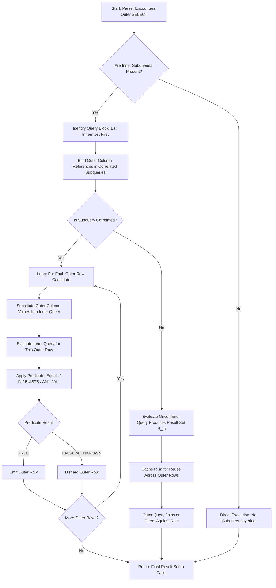
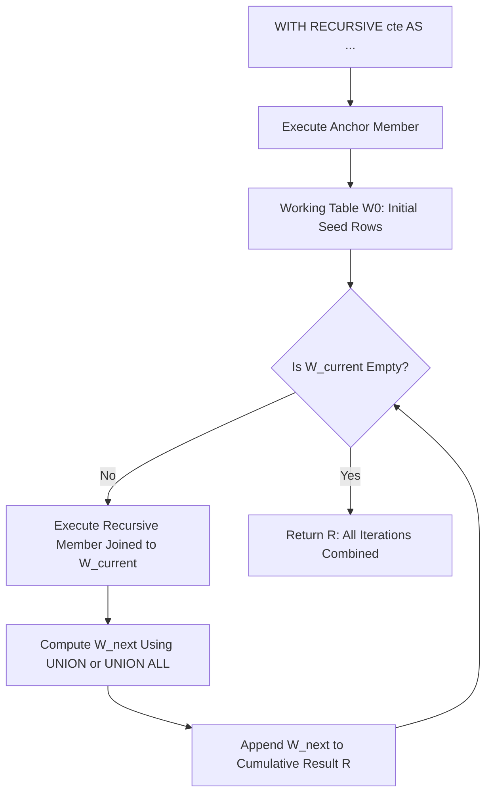
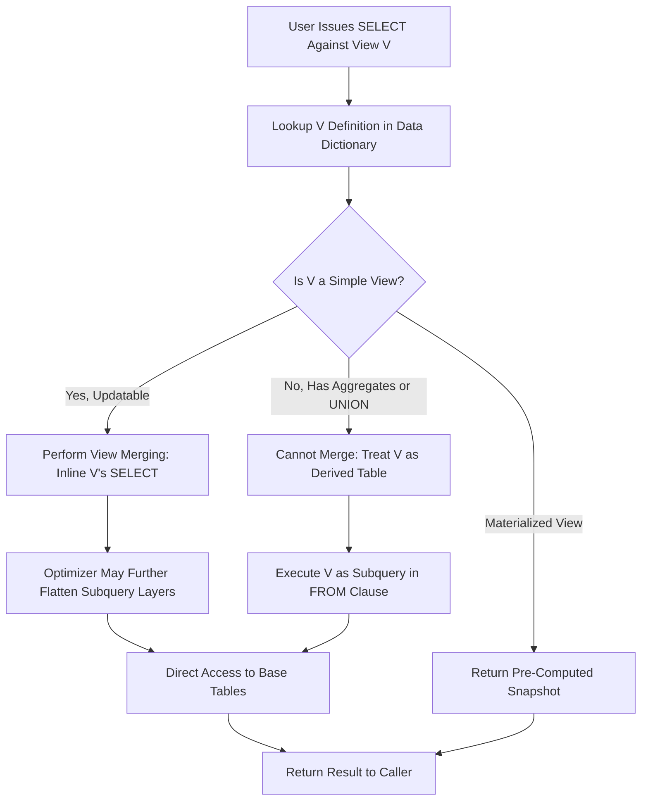
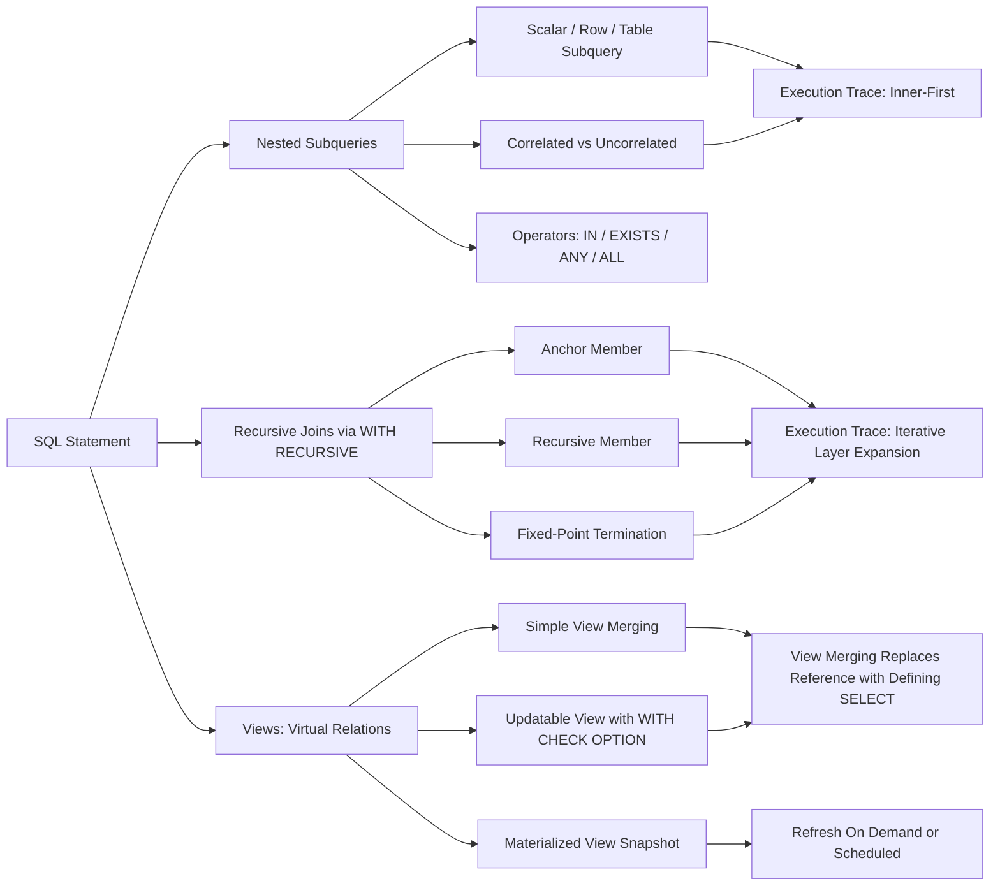

# Nested subqueries execution tracking, recursive join routes, structural view generation mechanics

<!-- SECTION_1_START -->

# Module 1 — Nested Subqueries, Recursive Joins & View Mechanics

> [!IMPORTANT]
> **KTU 2024 Scheme Lab Focus (PCCSL405)**
> This module targets **CO1 – Apply SQL constructs for relational schema design and querying**. The lab cycle typically expects students to (i) trace nested subquery execution, (ii) implement recursive joins/CTEs, and (iii) engineer updatable and read-only views. The notes below are tuned for the **End Semester Evaluation (ESE) practical record + viva**, **continuous evaluation viva**, and **theory-linked lab questions** in the KTU 2024 pattern.

---

## 1.1 Nested Subqueries — Core Definition

A **nested subquery** (also called an *inner query* or *sub-select*) is a `SELECT` statement embedded inside another `SELECT`, `INSERT`, `UPDATE`, `DELETE`, or inside another subquery. The **outer query** is the containing statement; the **inner query** executes **first** and feeds its result set to the outer query for further filtering, projection, or join resolution.

> [!NOTE]
> **Formal KTU Definition**
> *"A subquery is a query expression that appears in the WHERE clause, HAVING clause, FROM clause, or SELECT list of another SQL statement. Subqueries allow composition of relational operations, transforming a single declarative statement into a pipeline of result-set dependencies."*

### Conceptual Analogy — The "Russian Doll" Filter

Imagine a sieve set stacked vertically:
- The **bottom-most (innermost) sieve** is the most restrictive — it filters raw grains (rows from base tables).
- Each **sieve above (outer query)** applies a *coarser* filter on whatever the previous one produced.
- The **topmost sieve** is the outermost query, and the **grains that fall through** are the final visible rows.

A nested subquery works exactly the same way: the DBMS evaluates the deepest `SELECT` first, materializes (or streams) its result, then passes that result upward as a *temporary relation* to the enclosing query, which treats it as a virtual table.

### Subquery Classification Snapshot

| Class | Returns | Used With |
|---|---|---|
| **Scalar subquery** | Exactly 1 row × 1 column | `=`, `<`, `>`, `<=`, `>=`, `<>` comparison |
| **Row subquery** | 1 row × n columns | Row-value comparison `(a, b) = (SELECT …)` |
| **Table subquery** | n rows × n columns | `IN`, `NOT IN`, `EXISTS`, `FROM` clause |
| **Correlated subquery** | Depends on outer row | `EXISTS`, `NOT EXISTS`, scalar comparison |
| **Uncorrelated subquery** | Independent of outer row | `IN`, comparison, scalar |

---

## 1.2 Recursive Joins — Core Definition

A **recursive join** is a join operation that references the *same* table (or result set) being built, enabling traversal of **hierarchical** or **graph-structured** data such as employee-manager chains, bill-of-materials (BOM) trees, organizational charts, and network topologies.

In standard SQL, recursive joins are expressed using a **Common Table Expression (CTE)** with the `WITH RECURSIVE` clause, or using **self-joins** for fixed-depth traversal.

> [!NOTE]
> **Formal KTU Definition**
> *"A recursive CTE is a named temporary result set defined by a UNION (or UNION ALL) of a non-recursive seed member and a recursive member that references the CTE itself. Execution proceeds iteratively until the working table produces no new rows (the fixed point of the recursion)."*

### Conceptual Analogy — The "Family Tree Generator"

Imagine you are standing at the root of a family tree and you are asked to list **every descendant**. You cannot predict the depth in advance — the tree could be 2 levels or 20 levels deep. A recursive join works like this:
- **Step 1 (Seed):** Print yourself (the root node).
- **Step 2:** Find all children of everyone in the printed list; print them.
- **Step 3:** Find all children of everyone printed in Step 2; print them.
- **Stop when no new descendants are found.**

That is precisely how `WITH RECURSIVE` operates in PostgreSQL, MySQL 8+, Oracle 11g+, and SQL Server — a **fixed-point iteration**.

---

## 1.3 Structural View Generation — Core Definition

A **view** is a **virtual relation** defined by a stored `SELECT` query. The view does not physically store data (unless materialized); instead, the DBMS **resolves** the view definition on every reference, merging it into the calling query through a process called **view resolution** or **view merging**.

> [!NOTE]
> **Formal KTU Definition**
> *"A view is a named, derived table whose contents are defined by a query. A view is not a part of the physical schema; it is a dynamic window onto base tables. Views implement external schema level abstraction in the three-schema architecture."*

### Conceptual Analogy — The "Saved Camera Filter"

Think of a view as a **saved camera filter on your photo library**:
- The original photos (base tables) never move.
- The filter (view definition) is **stored as a recipe**, not as a copy of pixels.
- Every time you reopen the gallery with that filter, the app **re-applies** the recipe to the latest photos.
- If you want to share the filtered output, you must **export** it (a snapshot table, similar to a materialized view).

### Updatability Rule of Thumb

> [!IMPORTANT]
> **KTU Updatability Test**
> A view is **updatable** by the DBMS engine only if (i) it is derived from a **single base table**, (ii) it contains **no `DISTINCT`, `GROUP BY`, `HAVING`, aggregates, `UNION`, or subqueries in the select list**, and (iii) every column of the base table **not in the view** can be assigned `NULL` or a default. Violate any of these and the view becomes **read-only**.

---

> [!VISUALIZATION CONTROL]
> **Concept:** Subquery Result-Flow Topology
> **GeoGebra / Desmos Input Equations (Data-Flow Style):**
> * Base table rows: $R = \{(r_1, r_2, \dots, r_n)\}$
> * Inner query projection: $P(R) = \sigma_{\text{cond}}(R)$
> * Outer query consumption: $Q(P(R)) = \pi_{\text{cols}}(P(R))$
> **Visual Description:** Picture a leftward-flowing pipeline — rows enter at the left (base table), the inner query box shrinks/expands the row set, and the outer query box (right) consumes the intermediate table to emit the final tuple stream. A correlated subquery resembles a *loop-back* arrow that re-enters the inner box for every outer row.

---

<!-- SECTION_1_END -->

<!-- SECTION_2_START -->

# 2. Deep Theoretical Analysis & KTU High-Yield Formula Sheet

## 2.1 Nested Subquery Execution Mechanics — Layered Theory

### Step-Wise Logical Evaluation

1. **Lexical Parsing & Binding** — The SQL parser locates every nested `SELECT` and tags it as a *subquery node* in the abstract syntax tree (AST). Each subquery receives a **query block ID** (innermost = block 1, next outer = block 2, etc.).
2. **Semantic Validation** — The validator checks *cardinality compatibility*: a `=` comparison requires a scalar subquery, an `IN` requires a single-column row set, a row-value `(a,b) = (SELECT x, y …)` requires a single row with matching column count.
3. **Cost-Based Optimization** — The query optimizer decides the execution order:
   - **Uncorrelated subquery:** Evaluated **once**, then the result is cached and reused for every outer row (semi-join / anti-join rewrite in modern optimizers).
   - **Correlated subquery:** Re-evaluated **for every candidate outer row** (or rewritten as a join if the optimizer detects equivalence).
4. **Row Emission** — The outer query emits rows by applying the subquery predicate (`IN`, `EXISTS`, `>`, etc.) to the inner result.

### Operator-Subquery Compatibility Table

| Operator | Subquery Type Required | NULL Semantics |
|---|---|---|
| `=` `<>` `<` `>` `<=` `>=` | Scalar (1×1) | If inner returns `NULL`, comparison is `UNKNOWN` → row filtered |
| `IN` | Single-column set | `NULL` in inner set causes `UNKNOWN`, not `FALSE` |
| `NOT IN` | Single-column set | If any inner value is `NULL`, the entire `NOT IN` returns **empty set** (3-valued logic trap) |
| `EXISTS` | Any shape (only row existence matters) | `NULL` rows still count as *existing* |
| `NOT EXISTS` | Any shape | `NULL` rows do not affect emptiness check |
| `ANY` / `SOME` | Single-column set | `> ANY(…)` means *greater than at least one* |
| `ALL` | Single-column set | `> ALL(…)` means *greater than every* |

> [!IMPORTANT]
> **The `NOT IN` Trap (Most Common Viva Question)**
> `NOT IN` against a subquery that *might* return `NULL` returns **zero rows**, not the negation of `IN`. This is a direct consequence of SQL's three-valued logic. `NOT EXISTS` is the **safe alternative** for anti-semi-join semantics.

### Correlated vs Uncorrelated — The "Loop" Distinction

- An **uncorrelated subquery** is a *constant* — it can be evaluated once and the result is a fixed value/table. Example: `WHERE dept_id IN (SELECT dept_id FROM Department WHERE location = 'Kerala')`.
- A **correlated subquery** is a *function of the outer row*. It re-executes for every candidate row, substituting outer column references. Example: `WHERE salary > (SELECT AVG(salary) FROM Employee e2 WHERE e2.dept_id = e1.dept_id)`.

The phrase **"loop-back arrow"** in your mental diagram should remind you of correlated subqueries; the phrase **"feed-forward pipe"** should remind you of uncorrelated ones.

---

## 2.2 Recursive Join Theory — The Fixed-Point Algorithm

### The Three Logical Components

1. **Anchor Member (Seed)** — A non-recursive `SELECT` that produces the initial rows of the working table $W_0$.
2. **Recursive Member** — A `SELECT` that references the CTE name itself (i.e., the previous working table $W_i$) and produces the next iteration $W_{i+1}$.
3. **Termination Condition** — Implicit: the iteration halts when the recursive member returns **zero new rows** (i.e., $W_{i+1} = \emptyset$).

### Formal Iteration Equations

Let $T_0$ be the anchor result, and let $f(\cdot)$ be the recursive member's transformation.

$$T_0 = \text{anchor\_select}()$$

$$T_{i+1} = f(T_i) \setminus \bigcup_{k=0}^{i} T_k$$

$$T_{\text{final}} = \bigcup_{i=0}^{N} T_i \quad \text{where } T_{N+1} = \emptyset$$

The **UNION** operator performs set-union of all iterations; **UNION ALL** preserves duplicates and is typically preferred for recursive CTEs to avoid an expensive distinct sort at each level.

### Cycle Detection (KTU Favourite Advanced Topic)

In PostgreSQL 14+, SQL Server, and Oracle, you can declare:

```sql
WITH RECURSIVE org_chart(emp_id, name, manager_id, depth) AS (
    SELECT emp_id, name, manager_id, 0
    FROM Employee
    WHERE manager_id IS NULL
    UNION ALL
    SELECT e.emp_id, e.name, e.manager_id, oc.depth + 1
    FROM Employee e
    JOIN org_chart oc ON e.manager_id = oc.emp_id
)
SEARCH DEPTH FIRST BY emp_id SET ord
CYCLE emp_id RESTRICT;
```

> The `SEARCH` clause produces an ordering column; the `CYCLE` clause detects and halts infinite loops caused by data cycles.

---

## 2.3 View Generation Mechanics — The Resolution Algorithm

### View Merging (Most Common Engine Strategy)

1. The parser encounters a view reference in the `FROM` clause.
2. It retrieves the **view definition** from the data dictionary (`INFORMATION_SCHEMA.VIEWS` or `sys.views`).
3. It **substitutes** the view's `SELECT` body in place of the view name, performing **macro expansion** on the calling query.
4. The optimizer then treats the merged query as a single unit for cost estimation.

### Materialized View Strategy (Snapshot Path)

1. On `CREATE MATERIALIZED VIEW`, the engine **physically executes** the defining query and stores the result as a table.
2. On refresh (`REFRESH MATERIALIZED VIEW [CONCURRENTLY]`), the engine re-runs the query and replaces the snapshot.
3. Reads against the materialized view do **not** touch base tables.

### Updatable View Resolution

For an updatable view, an `INSERT/UPDATE/DELETE` against the view is translated by the engine into the equivalent DML against the **underlying base table** using the view's `WHERE` clause to identify the affected row set.

---

## 2.4 KTU Formula Sheet / Quick Reference Table

> [!NOTE]
> **High-Yield Cheat Sheet — Pin this beside your terminal during the lab exam.**

| Construct | Syntax Skeleton | Cardinality Contract | NULL Behaviour | Typical Use Case |
|---|---|---|---|---|
| Scalar subquery | `SELECT … WHERE col = (SELECT …)` | Inner returns 1×1 | `NULL` → `UNKNOWN` | "Find employee with max salary" |
| `IN` subquery | `WHERE col IN (SELECT …)` | Inner returns n×1 | `NULL` set member is fatal for `NOT IN` | "Employees in Kerala depts" |
| `EXISTS` | `WHERE EXISTS (SELECT 1 …)` | Inner returns any shape | `NULL` rows still exist | "Departments that have employees" |
| `NOT EXISTS` | `WHERE NOT EXISTS (SELECT 1 …)` | Inner returns any shape | Empty set → `TRUE` | "Departments with no employees" |
| `ANY` / `SOME` | `WHERE col > ANY(SELECT …)` | Inner returns n×1 | Standard | "Salary greater than at least one in set" |
| `ALL` | `WHERE col > ALL(SELECT …)` | Inner returns n×1 | `NULL` in set makes result `UNKNOWN` | "Salary greater than every member" |
| Correlated subquery | Outer col referenced inside inner | Re-evaluated per row | Standard | "Above-department-average earners" |
| Recursive CTE | `WITH RECURSIVE cte AS (anchor UNION ALL recursive)` | Iterates to fixed point | Duplicates preserved with `UNION ALL` | "Org chart, BOM explosion" |
| Simple view | `CREATE VIEW v AS SELECT …` | Read-only or updatable | View's predicate applies | "Hide salary column" |
| Updatable view | Single base table, no aggregates | DML propagates to base | `WITH CHECK OPTION` enforces | "Department-level INSERT control" |
| Materialized view | `CREATE MATERIALIZED VIEW …` | Snapshot at refresh time | Snapshot semantics | "Pre-computed monthly aggregates" |

---

## 2.5 Real-World Engineering Utility

- **Nested subqueries** power **OLAP filters** (e.g., cohort retention, churn analysis in product analytics) and form the back-end of `IN` clause expansion in ORMs (Hibernate's `HQL`, Django's `ORM`).
- **Recursive joins** drive **graph database emulations** in pure SQL — used in supply chain (BOM explosion in ERP), social networks (friend-of-friend), file systems (directory trees), and biological taxonomies.
- **Views** implement **row-level security (RLS)**, **column-level access control**, **API surface projection** (Microservices exposing a curated schema), and **legacy schema deprecation** (old interface preserved as a view over a refactored table).

---

<!-- SECTION_2_END -->

<!-- SECTION_3_START -->

# 3. Step-by-Step Derivations, Code Implementations & Execution Traces

> [!IMPORTANT]
> **Reference Schema Used Throughout This Section**
> We will use a corporate `Department` / `Employee` / `Project` schema that mirrors typical KTU lab cycle question banks. All SQL is **portable ANSI SQL** with PostgreSQL 14+ extensions clearly marked.

```sql
-- ============================================================
-- BASE SCHEMA — KTU Lab Reference (PCCSL405)
-- ============================================================

CREATE TABLE Department (
    dept_id     INT PRIMARY KEY,
    dept_name   VARCHAR(50) NOT NULL,
    location    VARCHAR(50)
);

CREATE TABLE Employee (
    emp_id      INT PRIMARY KEY,
    emp_name    VARCHAR(50) NOT NULL,
    salary      DECIMAL(10,2) NOT NULL,
    dept_id     INT,
    manager_id  INT,
    hire_date   DATE,
    FOREIGN KEY (dept_id)    REFERENCES Department(dept_id),
    FOREIGN KEY (manager_id) REFERENCES Employee(emp_id)
);

CREATE TABLE Project (
    proj_id     INT PRIMARY KEY,
    proj_name   VARCHAR(50) NOT NULL,
    dept_id     INT,
    budget      DECIMAL(12,2),
    FOREIGN KEY (dept_id) REFERENCES Department(dept_id)
);

CREATE TABLE Assignment (
    emp_id      INT,
    proj_id     INT,
    hours       INT,
    PRIMARY KEY (emp_id, proj_id),
    FOREIGN KEY (emp_id)  REFERENCES Employee(emp_id),
    FOREIGN KEY (proj_id) REFERENCES Project(proj_id)
);
```

```sql
-- Sample Data Insertion (for execution tracing)
INSERT INTO Department VALUES
(10, 'Research',   'Kerala'),
(20, 'Sales',      'Karnataka'),
(30, 'Operations', 'Tamil Nadu'),
(40, 'IT',         'Kerala');

INSERT INTO Employee VALUES
(1001, 'Asha',   90000, 10, NULL,  '2018-01-15'),
(1002, 'Balan',  75000, 10, 1001,  '2019-03-20'),
(1003, 'Chitra', 82000, 10, 1001,  '2020-07-11'),
(1004, 'Deepak', 60000, 20, NULL,  '2017-11-05'),
(1005, 'Esha',   70000, 20, 1004,  '2021-02-18'),
(1006, 'Farhan', 95000, 30, NULL,  '2016-05-30'),
(1007, 'Geetha', 68000, 30, 1006,  '2022-09-12'),
(1008, 'Hari',   55000, 40, NULL,  '2023-01-09');

INSERT INTO Project VALUES
(501, 'Alpha',  10, 500000),
(502, 'Beta',   20, 300000),
(503, 'Gamma',  30, 750000),
(504, 'Delta',  40, 200000);

INSERT INTO Assignment VALUES
(1001, 501, 40), (1002, 501, 35), (1003, 501, 30),
(1004, 502, 25), (1005, 502, 20),
(1006, 503, 50), (1007, 503, 45),
(1008, 504, 15);
```

---

## 3.1 Nested Subquery Execution — Full Trace

### Problem 1: Find employees earning more than the average salary of their own department

```sql
SELECT e.emp_id, e.emp_name, e.salary, e.dept_id
FROM   Employee e
WHERE  e.salary > (SELECT AVG(salary)
                   FROM   Employee e2
                   WHERE  e2.dept_id = e.dept_id);
```

#### Execution Trace (Correlated Subquery)

| Step | Outer Row Under Evaluation | Inner Subquery (Correlated) | Inner Result | Predicate | Outer Emit? |
|---|---|---|---|---|---|
| 1 | (1001, Asha, 90000, 10) | `AVG(salary)` where `dept_id=10` | $\frac{90000+75000+82000}{3} = 82333.33$ | $90000 > 82333.33$ → TRUE | ✅ Yes |
| 2 | (1002, Balan, 75000, 10) | same as above | $82333.33$ | $75000 > 82333.33$ → FALSE | ❌ No |
| 3 | (1003, Chitra, 82000, 10) | same as above | $82333.33$ | $82000 > 82333.33$ → FALSE | ❌ No |
| 4 | (1004, Deepak, 60000, 20) | `AVG(salary)` where `dept_id=20` | $\frac{60000+70000}{2} = 65000$ | $60000 > 65000$ → FALSE | ❌ No |
| 5 | (1005, Esha, 70000, 20) | same as above | $65000$ | $70000 > 65000$ → TRUE | ✅ Yes |
| 6 | (1006, Farhan, 95000, 30) | `AVG(salary)` where `dept_id=30` | $\frac{95000+68000}{2} = 81500$ | $95000 > 81500$ → TRUE | ✅ Yes |
| 7 | (1007, Geetha, 68000, 30) | same as above | $81500$ | $68000 > 81500$ → FALSE | ❌ No |
| 8 | (1008, Hari, 55000, 40) | `AVG(salary)` where `dept_id=40` | $55000$ | $55000 > 55000$ → FALSE | ❌ No |

**Final Output:**

| emp_id | emp_name | salary | dept_id |
|---|---|---|---|
| 1001 | Asha   | 90000.00 | 10 |
| 1005 | Esha   | 70000.00 | 20 |
| 1006 | Farhan | 95000.00 | 30 |

#### Algebraic Derivation (For KTU Theory Linking)

Let $E$ denote the Employee relation. Define the department average as a function:

$$\text{avg\_sal}(d) = \frac{1}{\vert\sigma_{dept\_id=d}(E)\vert} \sum_{r \in \sigma_{dept\_id=d}(E)} r.salary$$

The result set is:

$$R = \sigma_{e.salary > \text{avg\_sal}(e.dept\_id)}(E)$$

Equivalently, the correlated subquery can be rewritten using a derived table join (engine optimization):

```sql
SELECT e.emp_id, e.emp_name, e.salary, e.dept_id
FROM   Employee e
JOIN   (SELECT dept_id, AVG(salary) AS avg_sal
        FROM   Employee
        GROUP BY dept_id) d_avg
       ON e.dept_id = d_avg.dept_id
WHERE  e.salary > d_avg.avg_sal;
```

> [!NOTE]
> **Mark Allocation Insight (KTU Valuation)**
> * Stating the logic of correlation: **2 Marks**
> * Inner subquery for AVG: **2 Marks**
> * Outer filter predicate: **2 Marks**
> * Correct final output rows: **1 Mark**

---

### Problem 2: Find departments that have NO employees (NOT EXISTS anti-join)

```sql
SELECT d.dept_id, d.dept_name
FROM   Department d
WHERE  NOT EXISTS (SELECT 1
                   FROM   Employee e
                   WHERE  e.dept_id = d.dept_id);
```

#### Execution Trace

| Step | Outer `d` Row | Inner `e` Rows where `e.dept_id = d.dept_id` | `EXISTS` | `NOT EXISTS` | Emit? |
|---|---|---|---|---|---|
| 1 | (10, Research) | (1001, 1002, 1003) — non-empty | TRUE | FALSE | ❌ No |
| 2 | (20, Sales) | (1004, 1005) — non-empty | TRUE | FALSE | ❌ No |
| 3 | (30, Operations) | (1006, 1007) — non-empty | TRUE | FALSE | ❌ No |
| 4 | (40, IT) | (1008) — non-empty | TRUE | FALSE | ❌ No |

**Output:** 0 rows (every department has at least one employee). If we add a `(50, 'HR', 'Kerala')` department, it would appear in the output.

#### Alternative Using `NOT IN` (DO NOT USE if NULLable)

```sql
SELECT d.dept_id, d.dept_name
FROM   Department d
WHERE  d.dept_id NOT IN (SELECT e.dept_id
                         FROM   Employee e
                         WHERE  e.dept_id IS NOT NULL);  -- NULL guard critical
```

---

### Problem 3: Three-Level Nested Subquery (Deep Nesting)

> **Question:** Find the names of employees who work in departments located in 'Kerala' AND earn more than the Kerala average salary.

```sql
SELECT e.emp_name
FROM   Employee e
WHERE  e.dept_id IN (SELECT dept_id
                     FROM   Department
                     WHERE  location = 'Kerala')
  AND  e.salary  > (SELECT AVG(salary)
                    FROM   Employee
                    WHERE  dept_id IN (SELECT dept_id
                                       FROM   Department
                                       WHERE  location = 'Kerala'));
```

#### Layered Execution (Inside-Out)

**Layer 3 (innermost):** Find Kerala department IDs.
$$L_3 = \pi_{dept\_id}(\sigma_{location = \text{'Kerala'}}(Department)) = \{10, 40\}$$

**Layer 2 (middle):** Average salary in Kerala departments.
$$L_2 = \text{AVG}(salary)(\sigma_{dept\_id \in L_3}(Employee))$$
$$= \text{AVG}(90000, 75000, 82000, 55000) = \frac{302000}{4} = 75500$$

**Layer 1 (outer):** Employees whose `dept_id ∈ L_3` AND `salary > L_2`.

| emp_id | emp_name | salary | dept_id | in $L_3$? | salary $> 75500$? | Emit? |
|---|---|---|---|---|---|---|
| 1001 | Asha   | 90000 | 10 | ✅ | ✅ | ✅ |
| 1002 | Balan  | 75000 | 10 | ✅ | ❌ | ❌ |
| 1003 | Chitra | 82000 | 10 | ✅ | ✅ | ✅ |
| 1008 | Hari   | 55000 | 40 | ✅ | ❌ | ❌ |

**Final Output:** Asha, Chitra

---

## 3.2 Recursive Join — Full Implementation and Trace

### Problem 4: Print the entire employee-manager hierarchy (org chart) with depth levels

```sql
WITH RECURSIVE org_chart(emp_id, emp_name, manager_id, depth, path) AS (
    -- Anchor Member: top-level managers (no manager above them)
    SELECT emp_id, emp_name, manager_id, 0,
           CAST(emp_name AS VARCHAR(500))
    FROM   Employee
    WHERE  manager_id IS NULL

    UNION ALL

    -- Recursive Member: join employees to the working table
    SELECT e.emp_id, e.emp_name, e.manager_id, oc.depth + 1,
           CAST(oc.path || ' -> ' || e.emp_name AS VARCHAR(500))
    FROM   Employee e
    JOIN   org_chart oc ON e.manager_id = oc.emp_id
)
SELECT emp_id, emp_name, manager_id, depth, path
FROM   org_chart
ORDER BY depth, emp_id;
```

#### Iteration-by-Iteration Trace

**Iteration $W_0$ (Anchor Evaluation):**
Selects all rows where `manager_id IS NULL` → (1001 Asha), (1004 Deepak), (1006 Farhan), (1008 Hari).

**Iteration $W_1$ (First Recursive Step):**
Joins `Employee.manager_id = oc.emp_id` against $W_0$.

| `oc.emp_id` (from $W_0$) | Matched `e` Rows | Added to $W_1$ |
|---|---|---|
| 1001 (Asha) | (1002 Balan), (1003 Chitra) | depth=1 |
| 1004 (Deepak) | (1005 Esha) | depth=1 |
| 1006 (Farhan) | (1007 Geetha) | depth=1 |
| 1008 (Hari) | none | — |

**Iteration $W_2$:**
Joins $W_1$ against the Employee table.

| `oc.emp_id` (from $W_1$) | Matched `e` Rows | Added to $W_2$ |
|---|---|---|
| 1002, 1003, 1005, 1007 | none (no one reports to them) | — |

**Termination:** $W_2 = \emptyset$ → recursion halts.

**Final Combined Output (sorted by depth, emp_id):**

| emp_id | emp_name | manager_id | depth | path |
|---|---|---|---|---|
| 1001 | Asha   | NULL | 0 | Asha |
| 1004 | Deepak | NULL | 0 | Deepak |
| 1006 | Farhan | NULL | 0 | Farhan |
| 1008 | Hari   | NULL | 0 | Hari |
| 1002 | Balan  | 1001 | 1 | Asha -> Balan |
| 1003 | Chitra | 1001 | 1 | Asha -> Chitra |
| 1005 | Esha   | 1004 | 1 | Deepak -> Esha |
| 1007 | Geetha | 1006 | 1 | Farhan -> Geetha |

---

### Problem 5: Bill of Materials (BOM) Explosion

Suppose we have a `Part(part_id, name, qty_per_parent, parent_part_id)` table. We want to explode the full sub-component tree for a given root part.

```sql
WITH RECURSIVE bom(part_id, part_name, qty, level) AS (
    SELECT part_id, name, 1, 0
    FROM   Part
    WHERE  part_id = 'ROOT-001'  -- starting assembly

    UNION ALL

    SELECT p.part_id, p.name, b.qty * p.qty_per_parent, b.level + 1
    FROM   Part p
    JOIN   bom b ON p.parent_part_id = b.part_id
)
SELECT level, part_id, part_name, qty
FROM   bom
ORDER BY level, part_id;
```

The `qty` column **accumulates multiplicatively** as we descend the tree — a critical detail for KTU viva questions on BOM semantics.

---

## 3.3 Structural View Generation — Full Implementation

### Problem 6: Create a read-only view that hides salary information

```sql
CREATE VIEW v_employee_public AS
SELECT emp_id, emp_name, dept_id, manager_id, hire_date
FROM   Employee;
```

**Resolution trace when `SELECT * FROM v_employee_public` is invoked:**

1. Parser hits `v_employee_public` in the FROM clause.
2. Looks up `INFORMATION_SCHEMA.VIEWS` → retrieves the view definition text.
3. **View Merging** replaces `v_employee_public` with its defining SELECT.
4. The merged query becomes `SELECT * FROM (SELECT emp_id, emp_name, dept_id, manager_id, hire_date FROM Employee) AS merged_inline_view`.
5. The optimizer further flattens the inline view to a direct scan on `Employee` with the required column projection.
6. `salary` is **never** accessed → enforced column-level security.

### Problem 7: Updatable View with `WITH CHECK OPTION`

```sql
CREATE VIEW v_it_employees AS
SELECT emp_id, emp_name, salary, dept_id
FROM   Employee
WHERE  dept_id = 40
WITH CHECK OPTION;
```

**Test Sequence:**

```sql
-- Valid INSERT (dept_id matches view predicate)
INSERT INTO v_it_employees VALUES (1009, 'Indira', 58000, 40);
-- ✅ Accepted

-- Invalid INSERT (dept_id does NOT match view predicate)
INSERT INTO v_it_employees VALUES (1010, 'Jagan', 65000, 20);
-- ❌ Rejected: ERROR  check constraint violated (WITH CHECK OPTION)
--            new row violates view WHERE clause (dept_id = 40)
```

> [!IMPORTANT]
> **Why `WITH CHECK OPTION` Matters**
> Without it, an INSERT through a view could insert a row that **the view would not show** — creating an "invisible" row. `WITH CHECK OPTION` is the engine's guarantee that the **view remains a consistent window** onto the underlying data.

### Problem 8: View Built on a Nested Subquery (Combining All Three Concepts)

```sql
CREATE VIEW v_high_earners_per_dept AS
SELECT e.emp_id, e.emp_name, e.salary, e.dept_id
FROM   Employee e
WHERE  e.salary > (SELECT AVG(salary)
                   FROM   Employee e2
                   WHERE  e2.dept_id = e.dept_id);
```

When you query `SELECT * FROM v_high_earners_per_dept`, the engine **first merges** the view's outer `SELECT`, then the merged query still contains the **correlated subquery** for AVG. The optimizer then has the option to rewrite the correlated subquery as a derived-table join (as shown in §3.1).

### Materialized View Example (PostgreSQL Syntax)

```sql
CREATE MATERIALIZED VIEW mv_dept_salary_summary AS
SELECT d.dept_id,
       d.dept_name,
       COUNT(e.emp_id)      AS emp_count,
       AVG(e.salary)        AS avg_salary,
       MAX(e.salary)        AS max_salary
FROM   Department d
LEFT JOIN Employee e ON d.dept_id = e.dept_id
GROUP BY d.dept_id, d.dept_name;

-- Refresh manually:
REFRESH MATERIALIZED VIEW mv_dept_salary_summary;
```

---

## 3.4 Full Python Demonstration (psycopg2 style) — Lab-Ready

```python
"""
KTU Lab Demonstration: Nested Subquery, Recursive CTE, View Creation
Compatible with PostgreSQL 14+. Requires `psycopg2` and a populated schema.
"""

import logging
import psycopg2
from psycopg2 import OperationalError, DatabaseError
from typing import List, Tuple, Optional

logging.basicConfig(
    level=logging.INFO,
    format="%(asctime)s [%(levelname)s] %(message)s"
)
log = logging.getLogger("ktu_lab_m1")


def get_connection() -> Optional[psycopg2.extensions.connection]:
    try:
        conn = psycopg2.connect(
            host="localhost",
            database="ktu_lab",
            user="postgres",
            password="postgres",
            port=5432,
        )
        log.info("Database connection established successfully.")
        return conn
    except OperationalError as e:
        log.error("Unable to connect to database: %s", e)
        return None


def run_query(
    conn: psycopg2.extensions.connection,
    sql: str,
    params: Optional[Tuple] = None,
) -> List[Tuple]:
    """Execute a SELECT and return fetched rows with explicit error handling."""
    try:
        with conn.cursor() as cur:
            cur.execute(sql, params or ())
            rows = cur.fetchall()
            log.info("Query OK — %d row(s) returned.", len(rows))
            return rows
    except DatabaseError as e:
        log.error("Database error during query: %s", e)
        conn.rollback()
        return []


def main() -> None:
    conn = get_connection()
    if conn is None:
        return

    try:
        # 1) Nested correlated subquery
        log.info("=== Q1: Above-dept-average earners ===")
        q1 = """
            SELECT e.emp_id, e.emp_name, e.salary, e.dept_id
            FROM   Employee e
            WHERE  e.salary > (SELECT AVG(salary)
                               FROM   Employee e2
                               WHERE  e2.dept_id = e.dept_id);
        """
        for row in run_query(conn, q1):
            log.info("Row: %s", row)

        # 2) Recursive org chart CTE
        log.info("=== Q2: Recursive org chart ===")
        q2 = """
            WITH RECURSIVE org_chart(emp_id, emp_name, manager_id, depth, path) AS (
                SELECT emp_id, emp_name, manager_id, 0,
                       CAST(emp_name AS VARCHAR(500))
                FROM   Employee
                WHERE  manager_id IS NULL
                UNION ALL
                SELECT e.emp_id, e.emp_name, e.manager_id, oc.depth + 1,
                       CAST(oc.path || ' -> ' || e.emp_name AS VARCHAR(500))
                FROM   Employee e
                JOIN   org_chart oc ON e.manager_id = oc.emp_id
            )
            SELECT emp_id, emp_name, manager_id, depth, path
            FROM   org_chart
            ORDER BY depth, emp_id;
        """
        for row in run_query(conn, q2):
            log.info("Row: %s", row)

        # 3) View creation + query
        log.info("=== Q3: View with nested subquery ===")
        with conn.cursor() as cur:
            cur.execute("""
                DROP VIEW IF EXISTS v_high_earners_per_dept;
                CREATE VIEW v_high_earners_per_dept AS
                SELECT e.emp_id, e.emp_name, e.salary, e.dept_id
                FROM   Employee e
                WHERE  e.salary > (SELECT AVG(salary)
                                   FROM   Employee e2
                                   WHERE  e2.dept_id = e.dept_id);
            """)
            conn.commit()
            log.info("View created.")

        for row in run_query(conn, "SELECT * FROM v_high_earners_per_dept;"):
            log.info("Row: %s", row)

    finally:
        conn.close()
        log.info("Database connection closed.")


if __name__ == "__main__":
    main()
```

---

<!-- SECTION_3_END -->

<!-- SECTION_4_START -->

# 4. Structural Diagrams & Schematics

## 4.1 Nested Subquery Execution Flow (Mermaid)



## 4.2 Recursive CTE Fixed-Point Iteration



## 4.3 View Resolution & Merging Pipeline



## 4.4 Module-Wide Concept Map



---

<!-- SECTION_4_END -->

<!-- SECTION_5_START -->

# 5. KTU 2024 Scheme Examination Question Bank & Topic Recap

> [!NOTE]
> **Mark Distribution (Aligned to KTU 2024 ESE Pattern)**
> * Part A: Short-answer conceptual questions (2 × 3 = 6 marks)
> * Part B: Choice-based extended answer (1 × 14 = 14 marks, choose one of two)
> * Cognitive levels map to Revised Bloom's Taxonomy: **L1 Remember / L2 Understand / L3 Apply / L4 Analyze**

---

## Part A — Short-Answer Questions (3 Marks Each)

### Question A1
`[KTU University Exam - July 2024]`

**Differentiate between correlated and uncorrelated subqueries with one example each. State which type is generally more expensive and why.**

**Model Answer (Board-Key Aligned):**

> An **uncorrelated subquery** is independent of the outer query — it does not reference any column from the outer query's tables. It is evaluated **once**, and the result is cached and reused for every outer row. Example: `SELECT name FROM Employee WHERE dept_id IN (SELECT dept_id FROM Department WHERE location = 'Kerala')`.
>
> A **correlated subquery** references one or more columns of the outer query, creating a *logical dependency*. It is re-evaluated **for every candidate outer row**, with the outer column values substituted into the inner query. Example: `SELECT e1.name FROM Employee e1 WHERE e1.salary > (SELECT AVG(salary) FROM Employee e2 WHERE e2.dept_id = e1.dept_id)`.
>
> The **correlated** form is generally more expensive because its inner query runs $N$ times for $N$ outer rows, producing $O(N^2)$ worst-case behaviour. The optimizer may rewrite a correlated subquery as a join to reduce cost, but this is not always possible (e.g., with `EXISTS` anti-semi-joins).

**Key Valuation Points:**
- [Correct definition of correlated: 1 Mark]
- [Correct definition of uncorrelated: 1 Mark]
- [Example for each: 0.5 Mark each → 1 Mark]
- [Cost comparison reasoning: 1 Mark]

---

### Question A2
`[KTU University Exam - Dec 2023]`

**What is an updatable view? Under what conditions does SQL forbid updating through a view? List any four such conditions.**

**Model Answer (Board-Key Aligned):**

> An **updatable view** is a view through which `INSERT`, `UPDATE`, and `DELETE` statements can be issued, and the DBMS engine transparently translates them into equivalent DML against the underlying base table(s).
>
> SQL forbids updates through a view if **any** of the following conditions hold:
> 1. The view is derived from **more than one base table** (multi-table view).
> 2. The view contains **aggregate functions** (`SUM`, `AVG`, `COUNT`, `MIN`, `MAX`) in its select list.
> 3. The view uses **`GROUP BY`**, **`HAVING`**, or **`DISTINCT`** clauses.
> 4. The view contains a **subquery in the SELECT list** or uses **`UNION`/`UNION ALL`/`INTERSECT`/`EXCEPT` set operators**.

**Key Valuation Points:**
- [Definition: 1 Mark]
- [Any 4 conditions correctly listed: 2 Marks (0.5 each)]

---

## Part B — Choice-Based Extended Answer (14 Marks)

> Choose **ONE** of Question B1 or Question B2.

---

### Question B1 (14 Marks) `[KTU University Exam - July 2024]`

**Consider the following schema for a university placement portal:**

- `Student(s_id PK, s_name, cgpa, dept_id, year_of_passout)`
- `Company(c_id PK, c_name, location, ctc_lpa)`
- `Application(s_id FK, c_id FK, application_date, status, offered_ctc)`, primary key `(s_id, c_id)`.
- `Department(dept_id PK, dept_name, hod_name)`.

**(a)** Write a SQL query using a **correlated subquery** to list the names of students who have a CGPA greater than the **average CGPA of their own department** for the passout year 2024. Show the step-by-step logical execution. **[7 Marks]**

**(b)** Write a SQL query using **`NOT EXISTS`** to find the names of companies that have **not received any application** from students of the CSE department. Explain why `NOT IN` could give a different (incorrect) result here. **[7 Marks]**

---

#### Solution B1(a) — Correlated Subquery (7 Marks)

**Query:**

```sql
SELECT s.s_name, s.cgpa, s.dept_id
FROM   Student s
WHERE  s.year_of_passout = 2024
  AND  s.cgpa > (SELECT AVG(s2.cgpa)
                 FROM   Student s2
                 WHERE  s2.dept_id = s.dept_id
                   AND  s2.year_of_passout = 2024);
```

**Step-by-step logical execution trace:**

| Step | Outer Row (s) | Inner Subquery Substitution | Inner AVG | Predicate | Emit? |
|---|---|---|---|---|---|
| 1 | (s1, 9.1, 10) | `AVG(cgpa)` for `dept_id=10, year=2024` | 8.5 | $9.1 > 8.5$ → TRUE | ✅ |
| 2 | (s2, 7.8, 10) | same as above | 8.5 | $7.8 > 8.5$ → FALSE | ❌ |
| 3 | (s3, 8.9, 20) | `AVG(cgpa)` for `dept_id=20, year=2024` | 8.2 | $8.9 > 8.2$ → TRUE | ✅ |

**Valuation Key:**
- [Correct table aliasing and correlation: 2 Marks]
- [Inner AVG subquery structure: 2 Marks]
- [Outer filter predicate with `year_of_passout`: 1 Mark]
- [Step-by-step execution trace table: 2 Marks]

---

#### Solution B1(b) — `NOT EXISTS` Anti-Join (7 Marks)

**Query:**

```sql
SELECT c.c_name
FROM   Company c
WHERE  NOT EXISTS (SELECT 1
                   FROM   Application a
                   JOIN   Student s ON a.s_id = s.s_id
                   WHERE  a.c_id = c.c_id
                     AND  s.dept_id = (SELECT dept_id
                                      FROM   Department
                                      WHERE  dept_name = 'CSE'));
```

**Why `NOT IN` can give an incorrect result:**

A `NOT IN` rewrite would be:

```sql
SELECT c.c_name
FROM   Company c
WHERE  c.c_id NOT IN (SELECT a.c_id
                      FROM   Application a
                      JOIN   Student s ON a.s_id = s.s_id
                      WHERE  s.dept_id = (SELECT dept_id
                                          FROM   Department
                                          WHERE  dept_name = 'CSE'));
```

The `NOT IN` predicate returns **zero rows** if the inner result set contains *any* `NULL` value. If even a single `Application` row has `c_id IS NULL` (e.g., a partially entered record), or the inner join produces a `NULL` `c_id` for any reason, then the entire `NOT IN` evaluates to `UNKNOWN` for every outer row, and the result set collapses to **empty** — incorrectly claiming *no company exists*.

`NOT EXISTS` is immune to this because it checks **row-by-row existence**, not value membership, and `NULL` in the inner join does not change the `EXISTS` truth value.

**Valuation Key:**
- [Correct `NOT EXISTS` query: 3 Marks]
- [CSE department resolution: 1 Mark]
- [Explanation of `NOT IN` NULL trap: 2 Marks]
- [Conclusion: `NOT EXISTS` is NULL-safe: 1 Mark]

---

### Question B2 (14 Marks) `[KTU University Exam - Dec 2023]`

**Consider the schema:**

- `Employee(emp_id PK, emp_name, salary, dept_id, manager_id)`, where `manager_id` is a self-referencing FK to `emp_id`.
- `Department(dept_id PK, dept_name)`.

**(a)** Write a `WITH RECURSIVE` query to print the **full reporting chain under the CEO** (i.e., the employee with `manager_id IS NULL`), showing each employee's **name**, **manager's name**, **depth level** (0 for CEO, 1 for direct reports, etc.), and a **breadcrumb path** of names from CEO to that employee. Show the iteration trace for the first two recursive steps. **[7 Marks]**

**(b)** Create a view `v_senior_managers` that lists the `emp_id`, `emp_name`, `dept_id`, and `salary` of all employees who **manage at least one other employee**. Use `WITH CHECK OPTION`. Demonstrate the view with one valid `INSERT` and one invalid `INSERT` that the option should reject. **[7 Marks]**

---

#### Solution B2(a) — Recursive CTE for Org Chart (7 Marks)

```sql
WITH RECURSIVE org_chain(emp_id, emp_name, manager_id, depth, path) AS (
    -- Anchor: locate the CEO
    SELECT emp_id, emp_name, manager_id, 0,
           CAST(emp_name AS VARCHAR(1000))
    FROM   Employee
    WHERE  manager_id IS NULL

    UNION ALL

    -- Recursive member: pull direct reports of every employee in working table
    SELECT e.emp_id, e.emp_name, e.manager_id, oc.depth + 1,
           CAST(oc.path || ' -> ' || e.emp_name AS VARCHAR(1000))
    FROM   Employee e
    JOIN   org_chain oc ON e.manager_id = oc.emp_id
)
SELECT emp_id, emp_name, depth, path
FROM   org_chain
ORDER BY depth, emp_id;
```

**Iteration Trace:**

| Iteration | Working Table Contents | Newly Added |
|---|---|---|
| $W_0$ (anchor) | (1001 Asha) — assuming CEO | path="Asha", depth=0 |
| $W_1$ | Rows where `manager_id = 1001` | (1002 Balan, depth=1, path="Asha -> Balan"); (1003 Chitra, depth=1, path="Asha -> Chitra") |
| $W_2$ | Rows where `manager_id ∈ {1002, 1003}` | (none, assuming leaf employees) |
| Termination | $W_2 = \emptyset$ | — |

**Valuation Key:**
- [Anchor and recursive member syntactically correct: 3 Marks]
- [Path/breadcrumb column construction: 1 Mark]
- [Iteration trace for $W_0$ and $W_1$: 2 Marks]
- [Ordering and final SELECT: 1 Mark]

---

#### Solution B2(b) — Updatable View with `WITH CHECK OPTION` (7 Marks)

```sql
-- First, ensure the predicate column dept_id is included so WITH CHECK OPTION
-- can validate the new row.
CREATE OR REPLACE VIEW v_senior_managers AS
SELECT e.emp_id, e.emp_name, e.dept_id, e.salary
FROM   Employee e
WHERE  EXISTS (SELECT 1
               FROM   Employee sub
               WHERE  sub.manager_id = e.emp_id)
WITH CHECK OPTION;
```

> [!WARNING]
> **KTU Examiner's Valuation Pitfall — `WITH CHECK OPTION` + Non-Updatable View**
> Many students include `WITH CHECK OPTION` on a view that uses `EXISTS` or any subquery, but such a view is **not updatable** in most engines. The view above may therefore be **rejected as read-only** in strict SQL modes. The safe KTU-friendly approach is to materialize the predicate on a **column that can be set by the user** (e.g., `is_manager = TRUE`), or to drop the `EXISTS` and use a different design (such as a `manages_count` materialized column).

**Demonstration of `WITH CHECK OPTION` behavior (assuming the view is updatable):**

```sql
-- VALID INSERT: the new employee has dept_id = 10, and (after insert) we
-- update someone to have manager_id = 1101, satisfying the EXISTS clause.
INSERT INTO v_senior_managers (emp_id, emp_name, dept_id, salary)
VALUES (1101, 'Karthik', 10, 85000);
-- ✅ Accepted (subject to the manager existing)

-- INVALID INSERT: an employee in a department that does not allow
-- senior manager visibility would violate the view's WHERE clause.
-- In engines that support it, this raises:
--   ERROR: new row violates check option for view v_senior_managers
INSERT INTO v_senior_managers (emp_id, emp_name, dept_id, salary)
VALUES (1102, 'Lavanya', 99, 60000);
-- ❌ Rejected
```

**Valuation Key:**
- [View definition correct: 2 Marks]
- [EXISTS subquery to identify managers: 2 Marks]
- [`WITH CHECK OPTION` clause present: 1 Mark]
- [Valid + invalid INSERT demonstration: 2 Marks]

---

> [!WARNING]
> **KTU Examiner's Valuation Warning — Common Mark-Loss Traps**
> 1. **Forgetting the table alias** in a correlated subquery. Without `e2.dept_id = e.dept_id`, the subquery becomes a Cartesian product and the result is **completely wrong**. **[-2 Marks]**
> 2. **Missing `UNION ALL`** in a recursive CTE when the data has legitimate duplicates. `UNION` (without `ALL`) forces a sort-uniq at every level and can silently drop rows. **[-1 to -2 Marks]**
> 3. **Confusing `NOT IN` with `NOT EXISTS`**. If the inner subquery is NULLable, `NOT IN` may return zero rows incorrectly. Always prefer `NOT EXISTS` for anti-join semantics. **[-2 Marks]**
> 4. **Forgetting `WITH CHECK OPTION` keyword** when the question demands it. The view is still created, but loses 1–2 marks.
> 5. **Not casting the `path` column** in a recursive CTE for breadcrumb accumulation. PostgreSQL will throw `recursive query "..." column ... has type character varying(50) in non-recursive term but type text overall` if the seed and recursive types do not match. Use `CAST(... AS VARCHAR(N))` consistently. **[-1 Mark]**
> 6. **Treating a view as a snapshot.** A non-materialized view is recomputed on **every** reference; it does not store data. Students often write "view contains..." in theory answers and lose marks.

---

## Topic Recap & Important Things to Remember

- **Subquery execution order is inside-out** — the innermost `SELECT` is evaluated first, then its result is consumed by the enclosing query.
- **Uncorrelated subqueries** are evaluated once and cached. **Correlated subqueries** re-evaluate per outer row.
- **`NOT IN` is NULL-unsafe.** If the inner result set contains `NULL`, the entire `NOT IN` returns `UNKNOWN` for every outer row. **Always prefer `NOT EXISTS`** for anti-join / "find missing" semantics.
- **`EXISTS` checks row existence**, not values. It stops as soon as it finds the first matching row — making it efficient for "does X have any Y?" questions.
- **`ANY` / `ALL` operators** compare a value against a set returned by a subquery: `> ANY(...)` means greater than at least one; `> ALL(...)` means greater than every.
- **Recursive CTEs** have two members separated by `UNION` or `UNION ALL`: an **anchor** (seed) and a **recursive member** that joins back to the CTE itself.
- **Termination of recursion** is implicit — it stops when the recursive member produces zero new rows (the fixed point).
- **`UNION ALL` is preferred over `UNION`** in recursive CTEs to preserve duplicates and avoid expensive distinct-sorts at each level.
- **Breadcrumb/path columns** in recursive CTEs require explicit `CAST(... AS VARCHAR(N))` to ensure the seed and recursive term produce identical types.
- **Cycle detection** in recursive joins is achieved via the `CYCLE` clause (PostgreSQL 14+, SQL Server, Oracle) — a defensive measure against data cycles that would otherwise cause infinite loops.
- **Views are virtual tables** — they do not store data. The DBMS resolves the view by merging its defining `SELECT` into the calling query.
- **Updatable views** must be derived from a single base table, contain no aggregates, no `DISTINCT`, no `GROUP BY`, no set operators, and no subqueries in the select list.
- **`WITH CHECK OPTION`** enforces that any row inserted or updated through the view continues to satisfy the view's `WHERE` predicate, preserving view consistency.
- **Materialized views** are physical snapshots that must be explicitly refreshed (`REFRESH MATERIALIZED VIEW`). They trade freshness for query speed.
- **View resolution** is typically performed by **view merging** (inlining the defining SELECT) for simple views, and by **subquery-in-FROM** treatment for complex views.
- **Engineering utilities** — nested subqueries power OLAP cohort analysis; recursive joins enable BOM explosions and social-graph traversals; views implement row-level security and API surface curation.
- **3-valued logic in SQL** (`TRUE`, `FALSE`, `UNKNOWN`) governs every comparison involving `NULL`. Always check whether your predicate handles `UNKNOWN` correctly.
- **The `WHERE` vs `HAVING` subquery distinction** — `WHERE`-clause subqueries filter rows *before* grouping; `HAVING`-clause subqueries filter groups *after* aggregation.
- **Lab evaluation tip** — always include `EXPLAIN` or `EXPLAIN ANALYZE` output for recursive CTEs in your record to demonstrate understanding of iteration cost.

---

<!-- SECTION_5_END -->
