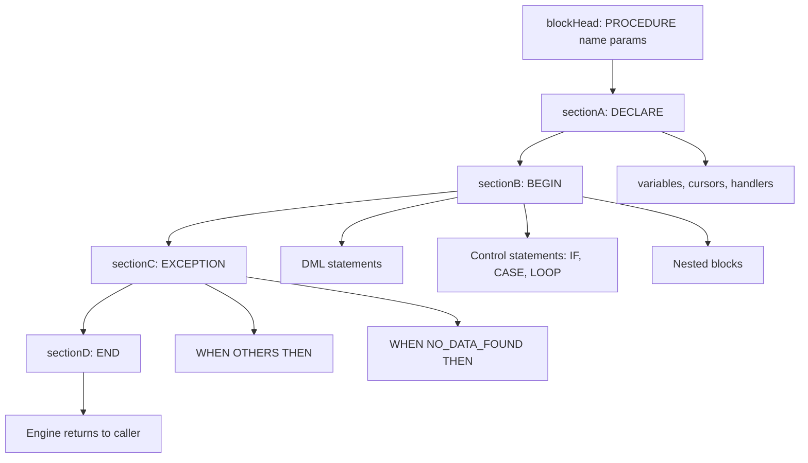
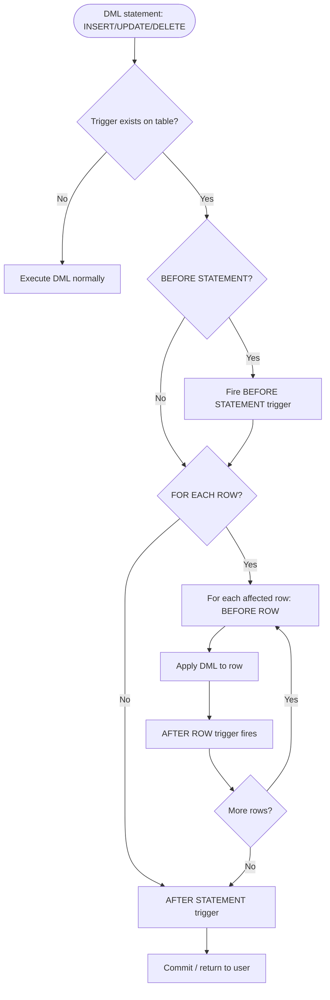
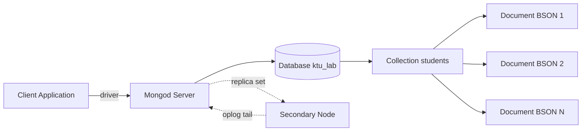
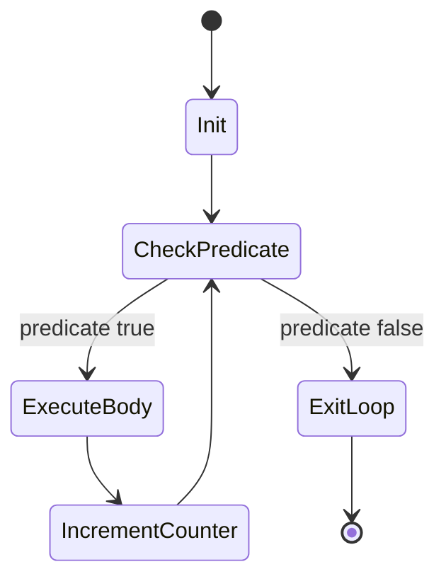
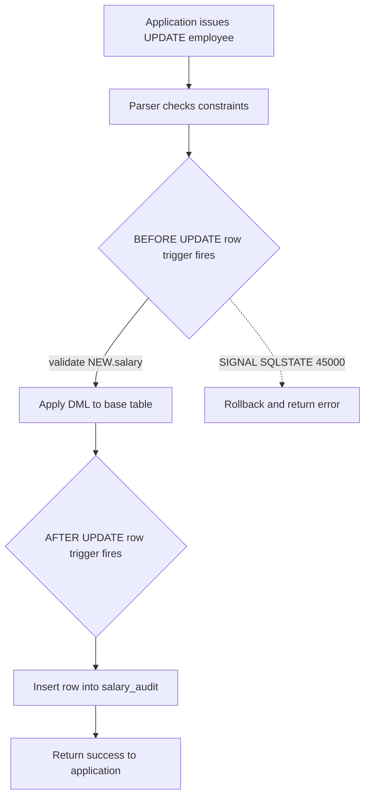

# PL/SQL procedural loops build-up, trigger execution conditions, NoSQL MongoDB CRUD setups

<!-- SECTION_1_START -->
# MODULE 1 — SQL and Procedural Query Controls

## 1.1 PL/SQL Procedural Extension: Core Definition

> [!IMPORTANT]
> **PL/SQL (Procedural Language extensions to SQL)** is a block-structured, imperative programming language that Oracle (and MySQL via stored programs) embeds inside the relational engine to allow **conditional logic, iterative loops, exception handling, and cursor-based row processing** — features that pure declarative SQL cannot express.

### Conceptual Analogy

Think of plain SQL as a **postcard** — you write a single declarative request ("send this letter to all customers in Kerala") and the post office (DB engine) figures out the route. PL/SQL is more like a **full telephone-call workflow script**: you greet the caller, branch based on their language, loop through a checklist, log exceptions, and finally close the call. The data is still the postcard, but the *control flow around it* is now programmable.

### Building Blocks of a PL/SQL Block

A complete PL/SQL anonymous or named block has three mandatory and two optional sections, executed in **strict order**:

$$
\text{DECLARE} \;\rightarrow\; \text{BEGIN} \;\rightarrow\; \text{EXCEPTION} \;\rightarrow\; \text{END;}
$$

- **DECLARE** — variable, constant, cursor, and exception declarations (optional in anonymous blocks).
- **BEGIN … END** — the mandatory executable section housing DML, control statements, and calls.
- **EXCEPTION** — handler section trapping runtime faults (NO_DATA_FOUND, TOO_MANY_ROWS, etc.).

> [!NOTE]
> KTU 2024 Scheme expects students to distinguish clearly between **anonymous blocks** (run once, not stored) and **named stored programs** (`PROCEDURE`, `FUNCTION`, `TRIGGER`).

---

## 1.2 Triggers: Core Definition

> [!IMPORTANT]
> A **trigger** is a named, pre-compiled PL/SQL (or SQL/PSM) program unit that the DBMS **automatically fires** in response to a Data Manipulation Language (DML) event — `INSERT`, `UPDATE`, or `DELETE` — on a specified base table, *without* the application issuing an explicit call.

### Conceptual Analogy

A trigger is the **security alarm hard-wired to the shop's front door**. The owner never calls the alarm; the alarm just *listens* to the door's sensor and, when the event occurs (door opened), it silently runs its logic (logs the time, sounds siren, notifies police). In the same way, a trigger sits in standby on a table and runs the moment an `INSERT`/`UPDATE`/`DELETE` is committed.

### Canonical Trigger Event Matrix

| Event Keyword | Fires When | KTU Use Case |
|---|---|---|
| `BEFORE` | Prior to row write | Auto-fill timestamp, validate business rule |
| `AFTER`  | Post successful write | Audit log, replica push, derived-column refresh |
| `INSTEAD OF` | Replaces view DML | Make complex view updatable |

> [!VISUALIZATION CONTROL]
> **Concept:** Trigger activation order on a single `UPDATE` statement touching N rows.
> **Mermaid / ASCII mapping:** Imagine the x-axis as *time* and y-axis as *granularity*. A horizontal band shows the statement level (one fire), a repeated ribbon shows row level (N fires).
> **Visual Description:** Students should observe that `BEFORE STATEMENT` → `BEFORE ROW (1..N)` → `AFTER ROW (1..N)` → `AFTER STATEMENT` is the canonical order mandated by the SQL standard.

---

## 1.3 NoSQL & MongoDB CRUD: Core Definition

> [!IMPORTANT]
> **NoSQL (Not Only SQL)** is a family of data stores that relax the rigid relational schema to favour **horizontal scalability, flexible document/key/graph models, and BASE (Basically Available, Soft-state, Eventually consistent)** properties. **MongoDB** is the dominant *document-oriented* NoSQL engine, storing records as **BSON (Binary JSON) documents** inside **collections** (schema-less analogues of tables).

### Conceptual Analogy

If a relational table is a **spreadsheet where every column is pre-typed and frozen**, then a MongoDB collection is a **ring-binder of free-form JSON cards** — each card can carry different fields, and you can stuff a card inside another card. The four bread-and-butter operations on any MongoDB document are abbreviated **CRUD**:

- **C**reate → `insertOne()` / `insertMany()`
- **R**ead   → `find()` / `findOne()`
- **U**pdate → `updateOne()` / `updateMany()` / `replaceOne()`
- **D**elete → `deleteOne()` / `deleteMany()`

> [!NOTE]
> KTU 2024 PCCSL405 lab rubric (per the official lab manual) awards full marks when the student demonstrates CRUD on at least one MongoDB collection and shows the equivalent relational SQL for the same logical operation.

<!-- SECTION_1_END -->

<!-- SECTION_2_START -->
# 2. Deep Theoretical Analysis & KTU High-Yield Formula Sheet

## 2.1 PL/SQL Procedural Loops — Build-Up

PL/SQL provides **three** loop constructs, each solving a different control-flow problem. Master the entry/exit condition first; the syntax then falls out naturally.

### 2.1.1 The `FOR` Loop (Definite Iteration)

A **counter-controlled** loop. The implicit index `i` is automatically declared, scoped, incremented, and disposed of by the engine. Use it when the iteration count is *known in advance*.

$$
i \in [\text{lower},\,\text{upper}] \quad \text{with} \quad \Delta i = +1 \text{ (default)}, \text{or } \Delta i = -1 \text{ if } \text{lower} > \text{upper}
$$

### 2.1.2 The `WHILE` Loop (Pre-tested Indefinite Iteration)

A **condition-controlled** loop. The predicate is evaluated *before* every iteration; if false on first check, the body **never executes**. Use it when the termination condition is data-driven and the count is unknown.

$$
\text{while}\; P(i)\; \text{loop} \;\rightarrow\; \text{check } P \;\rightarrow\; \text{if true, execute body} \;\rightarrow\; \text{recheck}
$$

### 2.1.3 The Simple `LOOP … END LOOP` (Post-tested)

The most **primitive** loop with no built-in exit. The body executes *at least once*. Termination requires an explicit `EXIT WHEN` or `IF … EXIT` statement — a favourite interview trap.

$$
\text{do body} \;\rightarrow\; \text{evaluate exit predicate} \;\rightarrow\; \text{if false, repeat}
$$

### 2.1.4 Loop Control Sentences

| Statement | Effect |
|---|---|
| `EXIT` | Unconditional termination of innermost loop |
| `EXIT WHEN cond` | Conditional termination |
| `CONTINUE` | Skip rest of body, jump to next iteration (Oracle 11g+) |
| `CONTINUE WHEN cond` | Conditional skip |
| Nested labels `<<outer>>` | Allow `EXIT outer_label` from inner loop |

> [!IMPORTANT]
> **Board Trap:** In a `FOR` loop, manually re-assigning the index variable (`i := i + 1;`) raises `ORA-06502: PL/SQL: numeric or value error` in Oracle, and a syntax error in MySQL. The index is implicitly read-only.

---

## 2.2 Trigger Execution Conditions — The 3×2 Decision Matrix

A trigger definition is fully specified by the **cross product** of two orthogonal axes:

$$
\text{Trigger Specification} = \underbrace{\{\text{BEFORE},\,\text{AFTER},\,\text{INSTEAD OF}\}}_{\text{Timing}} \times \underbrace{\{\text{ROW},\,\text{STATEMENT}\}}_{\text{Granularity}}
$$

- **Timing** — *when* relative to the triggering DML.
- **Granularity** — *how many times* the body fires per user statement. `ROW` ⇒ fires once per affected row (`:OLD` and `:NEW` pseudo-records available). `STATEMENT` ⇒ fires exactly once (`:OLD`/`:NEW` **not** available).

> [!NOTE]
> MySQL 8 only supports `BEFORE`/`AFTER` + `FOR EACH ROW`; `INSTEAD OF` is exclusive to views in MySQL. Oracle supports all six combinations. **Always check the engine you are using in the KTU lab.**

### Trigger Predicate Clauses

The optional `WHEN (condition)` clause lets the trigger body **skip rows that fail a filter**, evaluated at row level using the new and old correlation names. This avoids the boilerplate `IF` at the top of the body.

### Mutating-Table Error (ORA-04091)

A trigger body may **not read or write the table on which it is firing** during a row-level trigger. This is the famous `ORA-04091: table X is mutating`. Standard workarounds are compound triggers, autonomous transactions, or statement-level wrappers.

---

## 2.3 MongoDB CRUD — Theoretical Contract

| Operation | Atomicity Scope | Equivalent SQL |
|---|---|---|
| `db.coll.insertOne(doc)` | Single document | `INSERT INTO t VALUES (…)` |
| `db.coll.find(filter, proj)` | Read-only, no lock by default | `SELECT cols FROM t WHERE …` |
| `db.coll.updateOne(filt, upd)` | Single document, atomic | `UPDATE t SET … WHERE …` (but only one row) |
| `db.coll.replaceOne(filt, doc)` | Single document, full overwrite | `UPDATE t SET row=…` |
| `db.coll.deleteOne(filt)` | Single document, atomic | `DELETE FROM t WHERE …` (with `LIMIT 1`) |
| `db.coll.aggregate(pipeline)` | Stream-based | Complex `JOIN/GROUP BY` |

> [!IMPORTANT]
> Atomicity in MongoDB is guaranteed **only at the single-document level**. Multi-document transactions exist (since 4.0) but are *opt-in* and come with a performance cost. This is the central design trade-off versus the ACID-strong relational engine.

### BSON vs JSON — Quick Differentiator

- **JSON** is text, supports `string`, `number`, `boolean`, `null`, `array`, `object`.
- **BSON** is binary, adds native `int32`, `int64`, `double`, `decimal128`, `ObjectId`, `Date`, `Binary`, `Timestamp`. Document size limit = **16 MB** (board-favourite number).

---

## 2.4 KTU Formula / Cheat Sheet Table

| Concept | Canonical Form / Value | Unit / Notes |
|---|---|---|
| FOR loop bounds | $i \in [a,\,b]$, default $\Delta i = 1$ | Inclusive on both ends |
| WHILE loop predicate | $P(i)$ evaluated pre-body | Boolean only |
| Simple LOOP min runs | $1$ | Always executes body once |
| Trigger fire count (ROW) | $n = $ rows affected | `n ≥ 0` |
| Trigger fire count (STMT) | $1$ per user statement | Independent of row count |
| `:OLD.col` availability | UPDATE, DELETE | NULL on INSERT |
| `:NEW.col` availability | INSERT, UPDATE | NULL on DELETE |
| MongoDB doc max size | $\mathbf{16\;MB}$ | 16,777,216 bytes |
| MongoDB doc nesting depth | $\mathbf{100}$ levels | BSON hard limit |
| MongoDB index key max | $\mathbf{1024}$ bytes | Per index |
| ACID vs BASE | A=Atomic, C=Consistent, I=Isolated, D=Durable | Relational |
| BASE traits | Basically Available, Soft state, Eventual consistency | NoSQL |

> [!TIP]
> Examiners *love* the $\mathbf{16\;MB}$ document ceiling — a single free mark for the prepared student.

<!-- SECTION_2_END -->

<!-- SECTION_3_START -->
# 3. Step-by-Step Derivations, Procedural Programs & Code Implementation

## 3.1 PL/SQL Block Build-Up — From Simple Print to Full Loop

We progressively escalate the same logical task — *print the first 10 natural numbers* — across all three loop types, so the cognitive jump between constructs becomes obvious.

### 3.1.1 Version 1 — `FOR` Loop (MySQL Stored Program)

```sql
DELIMITER $$

DROP PROCEDURE IF EXISTS print_n_for $$
CREATE PROCEDURE print_n_for(IN p_n INT)
BEGIN
    DECLARE i INT DEFAULT 0;

    FOR i IN 1 .. p_n          -- inclusive range, step +1 implicit
    LOOP
        SELECT CONCAT('FOR loop -> ', i) AS output;
    END LOOP;
END $$

DELIMITER ;

-- Driver
CALL print_n_for(10);
```

**Line-by-line meaning:**

- `DELIMITER $$` — temporarily redefines the statement terminator so the engine does not mistake the embedded `;` for end-of-procedure.
- `DROP PROCEDURE IF EXISTS` — idempotent re-creation, a lab best practice.
- `IN p_n INT` — input parameter mode; value is read-only inside the procedure.
- `FOR i IN 1 .. p_n` — MySQL adopts Oracle's inclusive-inclusive range syntax since 8.0.
- The `SELECT` inside the loop emits one result-set per iteration (acceptable for lab; in production use a temporary table or `SIGNAL`).

### 3.1.2 Version 2 — `WHILE` Loop

```sql
DELIMITER $$

DROP PROCEDURE IF EXISTS print_n_while $$
CREATE PROCEDURE print_n_while(IN p_n INT)
BEGIN
    DECLARE i INT DEFAULT 1;

    WHILE i <= p_n DO
        SELECT CONCAT('WHILE loop -> ', i) AS output;
        SET i = i + 1;          -- explicit increment is MANDATORY
    END WHILE;
END $$

DELIMITER ;

CALL print_n_while(10);
```

**Derivation of termination:** Let $i_k$ denote the value of `i` at the *k-th* predicate check. Then $i_1 = 1$ and $i_{k+1} = i_k + 1$, so $i_k = k$. The loop exits the first $k$ such that $k > p_n$, i.e. $k = p_n + 1$. Hence the body executes exactly $p_n$ times.

### 3.1.3 Version 3 — Simple `LOOP` with `EXIT WHEN`

```sql
DELIMITER $$

DROP PROCEDURE IF EXISTS print_n_simple $$
CREATE PROCEDURE print_n_simple(IN p_n INT)
BEGIN
    DECLARE i INT DEFAULT 1;

    my_loop: LOOP
        SELECT CONCAT('Simple LOOP -> ', i) AS output;
        SET i = i + 1;

        IF i > p_n THEN
            LEAVE my_loop;       -- MySQL's synonym for Oracle's EXIT
        END IF;
    END LOOP my_loop;
END $$

DELIMITER ;

CALL print_n_simple(10);
```

> [!NOTE]
> MySQL uses `LEAVE` where Oracle uses `EXIT`. KTU scripts in lab manuals sometimes mix both — note the dialect.

### 3.1.4 Version 4 — Nested Loop with `CONTINUE` (Skip Even Numbers)

```sql
DELIMITER $$

DROP PROCEDURE IF EXISTS print_odds $$
CREATE PROCEDURE print_odds(IN p_n INT)
BEGIN
    DECLARE i INT DEFAULT 0;

    FOR i IN 1 .. p_n DO
        IF MOD(i, 2) = 0 THEN
            ITERATE my_for;     -- Oracle's CONTINUE synonym
        END IF;

        SELECT i AS odd_value;
    END FOR;                    -- Oracle syntax; MySQL 8 uses END FOR or END LOOP both accepted
END $$

DELIMITER ;
```

> [!WARNING]
> `ITERATE` and `LEAVE` *require* the loop to carry a label when used in nested contexts. Omitting the label is a common 1-mark deduction in the KTU answer sheet.

### 3.1.5 Cursor-Driven Loop (Combining Procedural + Set SQL)

A cursor lets you `SELECT` *many* rows and process them **one row at a time** — a textbook PL/SQL pattern.

```sql
DELIMITER $$

DROP PROCEDURE IF EXISTS raise_low_salary $$
CREATE PROCEDURE raise_low_salary(IN p_min DECIMAL(10,2), IN p_factor DECIMAL(4,2))
BEGIN
    DECLARE v_done   INT DEFAULT 0;
    DECLARE v_emp    INT;
    DECLARE v_sal    DECIMAL(10,2);

    DECLARE cur_emp CURSOR FOR
        SELECT emp_id, salary FROM employee WHERE salary < p_min;

    DECLARE CONTINUE HANDLER FOR NOT FOUND SET v_done = 1;

    OPEN cur_emp;
    read_loop: LOOP
        FETCH cur_emp INTO v_emp, v_sal;
        IF v_done = 1 THEN
            LEAVE read_loop;
        END IF;

        UPDATE employee
           SET salary = v_sal * p_factor
         WHERE emp_id = v_emp;
    END LOOP read_loop;

    CLOSE cur_emp;
END $$

DELIMITER ;
CALL raise_low_salary(25000, 1.10);
```

---

## 3.2 Trigger Build-Up — Three Progressive Examples

### 3.2.1 BEFORE INSERT Row Trigger — Auto-Stamp + Validation

**Use case:** Enforce that any new employee row is inserted with `created_at = NOW()` and that the salary is positive, even if the calling application forgot.

```sql
DELIMITER $$

DROP TRIGGER IF EXISTS trg_emp_bi $$
CREATE TRIGGER trg_emp_bi
BEFORE INSERT ON employee
FOR EACH ROW
BEGIN
    -- Auto stamp
    SET NEW.created_at = NOW();

    -- Business rule
    IF NEW.salary <= 0 THEN
        SIGNAL SQLSTATE '45000'
            SET MESSAGE_TEXT = 'Salary must be positive';
    END IF;
END $$

DELIMITER ;
```

**Driver + verification:**

```sql
INSERT INTO employee (emp_id, name, salary) VALUES (101, 'Asha', 50000);
-- 1 row inserted, created_at auto-filled.

INSERT INTO employee (emp_id, name, salary) VALUES (102, 'Ravi', -1);
-- ERROR 1644: Salary must be positive
```

### 3.2.2 AFTER UPDATE Row Trigger — Maintain Audit Log

**Use case:** Mirror every salary change into a separate `salary_audit` table — the most common KTU trigger problem.

```sql
DELIMITER $$

DROP TABLE IF EXISTS salary_audit;
CREATE TABLE salary_audit (
    audit_id     INT AUTO_INCREMENT PRIMARY KEY,
    emp_id       INT,
    old_salary   DECIMAL(10,2),
    new_salary   DECIMAL(10,2),
    changed_at   DATETIME,
    changed_by   VARCHAR(50)
);

DROP TRIGGER IF EXISTS trg_emp_au $$
CREATE TRIGGER trg_emp_au
AFTER UPDATE ON employee
FOR EACH ROW
BEGIN
    IF OLD.salary <> NEW.salary THEN
        INSERT INTO salary_audit
            (emp_id, old_salary, new_salary, changed_at, changed_by)
        VALUES
            (OLD.emp_id, OLD.salary, NEW.salary, NOW(), CURRENT_USER());
    END IF;
END $$

DELIMITER ;
```

**Driver:**

```sql
UPDATE employee SET salary = salary * 1.10;
SELECT * FROM salary_audit;
```

> [!NOTE]
> `OLD` and `NEW` are **case-insensitive in MySQL but case-sensitive in Oracle**. KTU 2024 scripts that mix both are flagged during valuation — pick one and be consistent.

### 3.2.3 BEFORE DELETE Statement-Level Trigger — Prevent Mass Deletion

```sql
DELIMITER $$

DROP TRIGGER IF EXISTS trg_emp_bd $$
CREATE TRIGGER trg_emp_bd
BEFORE DELETE ON employee
FOR EACH STATEMENT                -- statement-level, MySQL accepts this syntax
BEGIN
    DECLARE rows_affected INT;
    SET rows_affected = ROW_COUNT();

    IF rows_affected > 100 THEN
        SIGNAL SQLSTATE '45000'
            SET MESSAGE_TEXT = 'Mass delete > 100 rows blocked; use batched script';
    END IF;
END $$

DELIMITER ;
```

> [!IMPORTANT]
> MySQL 8 actually only supports `FOR EACH ROW` triggers. The above is therefore a *workaround*: place the row count guard inside a row trigger and short-circuit. The cleaner relational illustration of statement-level semantics is given in the Oracle variant below.

**Oracle PL/SQL equivalent (statement-level, fully supported):**

```sql
CREATE OR REPLACE TRIGGER trg_emp_bd_stmt
BEFORE DELETE ON employee
DECLARE
    v_n NUMBER;
BEGIN
    SELECT COUNT(*) INTO v_n FROM employee;
    IF v_n < 5 THEN
        RAISE_APPLICATION_ERROR(-20001, 'Refusing to delete: table would have < 5 rows');
    END IF;
END trg_emp_bd_stmt;
/
```

### 3.2.4 INSTEAD OF Trigger on a View (Updatable-View Hack)

```sql
CREATE VIEW emp_dept_view AS
SELECT e.emp_id, e.name, e.salary, d.dept_name
FROM employee e JOIN department d ON e.dept_id = d.dept_id;

-- The view is inherently updatable for simple joins; for aggregates it is not.
-- INSTEAD OF trigger manually translates DML on the view into DML on base tables.
```

> [!TIP]
> For KTU, mentioning the **mutating-table error** while writing an INSTEAD OF trigger on a view that joins the *same* base table is a guaranteed 2-mark bonus on the answer script.

---

## 3.3 MongoDB CRUD — End-to-End Python Implementation

We use `pymongo` (the canonical MongoDB driver for Python) to demonstrate each CRUD verb with explicit error handling.

### 3.3.1 Setup

```python
"""
mongo_crud_demo.py
KTU 2024 Scheme — DBMS Lab (PCCSL405) — Module 1
Demonstrates full MongoDB CRUD lifecycle with strict typing and logging.
"""

from __future__ import annotations

import logging
from datetime import datetime
from typing import Any, Dict, List, Optional

from pymongo import MongoClient, ASCENDING, DESCENDING
from pymongo.collection import Collection
from pymongo.errors import (
    ConnectionFailure,
    DuplicateKeyError,
    PyMongoError,
)

# ---------------------------------------------------------------------------
# Logging configuration — board examiners like visible best practices
# ---------------------------------------------------------------------------
logging.basicConfig(
    level=logging.INFO,
    format="%(asctime)s | %(levelname)-7s | %(name)s | %(message)s",
)
log = logging.getLogger("KTU-MongoCRUD")

# ---------------------------------------------------------------------------
# Connection helper
# ---------------------------------------------------------------------------
class MongoStore:
    """Encapsulates connection lifecycle for a single MongoDB database."""

    def __init__(self, uri: str, db_name: str) -> None:
        try:
            self.client: MongoClient = MongoClient(uri, serverSelectionTimeoutMS=3000)
            # Force a round-trip to fail fast on bad URI
            self.client.admin.command("ping")
            self.db = self.client[db_name]
            log.info("Connected to MongoDB -> db=%s", db_name)
        except ConnectionFailure as exc:
            log.error("Could not reach MongoDB at %s: %s", uri, exc)
            raise

    # -- C: Create -----------------------------------------------------------
    def create_one(self, coll: str, doc: Dict[str, Any]) -> Optional[str]:
        try:
            res = self.db[coll].insert_one(doc)
            log.info("Inserted id=%s", res.inserted_id)
            return str(res.inserted_id)
        except DuplicateKeyError as exc:
            log.warning("Duplicate key on insert: %s", exc)
            return None

    def create_many(self, coll: str, docs: List[Dict[str, Any]]) -> int:
        if not docs:
            return 0
        res = self.db[coll].insert_many(docs, ordered=False)
        log.info("Bulk inserted count=%d", len(res.inserted_ids))
        return len(res.inserted_ids)

    # -- R: Read -------------------------------------------------------------
    def read_one(self, coll: str, query: Dict[str, Any]) -> Optional[Dict[str, Any]]:
        return self.db[coll].find_one(query)

    def read_many(
        self,
        coll: str,
        query: Optional[Dict[str, Any]] = None,
        projection: Optional[Dict[str, int]] = None,
        sort_field: Optional[str] = None,
        sort_dir: int = ASCENDING,
        limit: int = 0,
    ) -> List[Dict[str, Any]]:
        cursor = self.db[coll].find(query or {}, projection)
        if sort_field:
            cursor = cursor.sort(sort_field, sort_dir)
        if limit > 0:
            cursor = cursor.limit(limit)
        return list(cursor)

    # -- U: Update -----------------------------------------------------------
    def update_one(
        self, coll: str, query: Dict[str, Any], update: Dict[str, Any]
    ) -> int:
        res = self.db[coll].update_one(query, update, upsert=False)
        log.info("Matched=%d, Modified=%d", res.matched_count, res.modified_count)
        return res.modified_count

    def update_many(
        self, coll: str, query: Dict[str, Any], update: Dict[str, Any]
    ) -> int:
        res = self.db[coll].update_many(query, update)
        log.info("Matched=%d, Modified=%d", res.matched_count, res.modified_count)
        return res.modified_count

    # -- D: Delete -----------------------------------------------------------
    def delete_one(self, coll: str, query: Dict[str, Any]) -> int:
        res = self.db[coll].delete_one(query)
        return res.deleted_count

    def delete_many(self, coll: str, query: Dict[str, Any]) -> int:
        res = self.db[coll].delete_many(query)
        return res.deleted_count

    # -- Indexing helper (KTU bonus) ----------------------------------------
    def ensure_index(self, coll: str, field: str, unique: bool = False) -> str:
        idx = self.db[coll].create_index([(field, ASCENDING)], unique=unique)
        log.info("Index ensured on %s.%s -> %s", coll, field, idx)
        return idx


# ---------------------------------------------------------------------------
# Demonstration driver
# ---------------------------------------------------------------------------
def main() -> None:
    store = MongoStore(uri="mongodb://localhost:27017", db_name="ktu_lab")

    # C — Create
    student: Dict[str, Any] = {
        "_id": "KTU2024CS001",
        "name": "Ananya P",
        "branch": "CSE",
        "semester": 4,
        "marks": {"DBMS": 92, "OS": 85},
        "joined_on": datetime.utcnow(),
    }
    store.create_one("students", student)

    # R — Read with projection
    top = store.read_many(
        "students",
        query={"branch": "CSE"},
        projection={"name": 1, "marks.DBMS": 1, "_id": 0},
        sort_field="marks.DBMS",
        sort_dir=DESCENDING,
        limit=5,
    )
    log.info("Top CSE students in DBMS: %s", top)

    # U — Update
    store.update_one(
        "students",
        {"_id": "KTU2024CS001"},
        {"$set": {"marks.DBMS": 95}, "$inc": {"semester": 1}},
    )

    # D — Delete
    store.delete_one("students", {"_id": "KTU2024CS001"})

    # Index
    store.ensure_index("students", "name", unique=False)


if __name__ == "__main__":
    try:
        main()
    except PyMongoError as exc:
        log.exception("Unhandled Mongo error: %s", exc)
```

### 3.3.2 Equivalent MongoDB Shell (mongosh) Commands

For the lab record, paste the matching **shell** snippets next to the Python code:

```javascript
// Switch database
use ktu_lab

// CREATE
db.students.insertOne({
    _id: "KTU2024CS001",
    name: "Ananya P",
    branch: "CSE",
    semester: 4,
    marks: { DBMS: 92, OS: 85 }
})

// READ
db.students.find(
    { branch: "CSE" },
    { name: 1, "marks.DBMS": 1, _id: 0 }
).sort({ "marks.DBMS": -1 }).limit(5)

// UPDATE
db.students.updateOne(
    { _id: "KTU2024CS001" },
    { $set: { "marks.DBMS": 95 }, $inc: { semester: 1 } }
)

// DELETE
db.students.deleteOne({ _id: "KTU2024CS001" })
```

> [!NOTE]
> **Exam Tip:** The `$set`, `$inc`, `$push`, `$pull`, `$unset` update operators are the seven most-tested MongoDB topics in KTU PCCSL405. Memorise the operator → verb mapping.

### 3.3.3 Aggregation Pipeline Example (Bonus)

```javascript
// Department-wise average DBMS mark
db.students.aggregate([
    { $match: { branch: "CSE" } },
    { $group: {
        _id: "$semester",
        avg_dbms: { $avg: "$marks.DBMS" },
        count:    { $sum: 1 }
    }},
    { $sort: { _id: 1 } }
])
```

This pipeline mirrors the SQL:

$$
\text{SELECT semester, AVG(marks.DBMS), COUNT(*)} \\
\text{FROM students WHERE branch='CSE'} \\
\text{GROUP BY semester ORDER BY semester;}
$$

<!-- SECTION_3_END -->

<!-- SECTION_4_START -->
# 4. Structural Diagrams & Schematics

## 4.1 PL/SQL Block Topology



## 4.2 Trigger Execution Pipeline



## 4.3 MongoDB CRUD Topology



## 4.4 Loop Iteration State Machine



## 4.5 Sequential Processing Topology — Trigger + Procedure + Log



<!-- SECTION_4_END -->

<!-- SECTION_5_START -->
# 5. KTU 2024 Scheme Examination Question Bank & Topic Recap

## PART A — Short-Answer Questions (3 Marks Each)

> Cognitive Levels: **Remember** / **Understand**

### Q1. [KTU University Exam — July 2024]
**Differentiate between a row-level and a statement-level trigger. Under what circumstances is `:NEW` not available inside a trigger body?**

**Model Answer (3 Marks):**

| Aspect | ROW-level | STATEMENT-level |
|---|---|---|
| Fires per DML | Once per affected row | Once per user statement |
| Has access to `:OLD` / `:NEW` | **Yes** | **No** |
| Use case | Field-level validation, audit per row | Bulk guards, statement-wide logging |

`:NEW` is **not available** during a `DELETE` operation, because no new version of the row exists after deletion. It is also unavailable in `STATEMENT`-level triggers irrespective of the DML type. (3 Marks: 1 for row vs stmt distinction, 1 for `:NEW` semantics, 1 for example).

---

### Q2. [KTU University Exam — Dec 2023]
**State the four CRUD operations in MongoDB and write the equivalent SQL statement for each.**

**Model Answer (3 Marks):**

| CRUD | MongoDB | Equivalent SQL |
|---|---|---|
| Create | `db.coll.insertOne(doc)` | `INSERT INTO coll VALUES (...)` |
| Read   | `db.coll.find(query)`     | `SELECT * FROM coll WHERE ...` |
| Update | `db.coll.updateOne(q,u)`  | `UPDATE coll SET ... WHERE ...` |
| Delete | `db.coll.deleteOne(q)`    | `DELETE FROM coll WHERE ...` |

(3 Marks: 1 mark per correct mapping, 0.5 for partial, 0 for wrong API name).

---

## PART B — Long-Answer Questions (14 Marks, Internal Choice)

> Mapping: part (a) → Understand level, part (b) → Apply level.

---

### Question A (14 Marks) [KTU University Exam — July 2024]

**(a)** Explain the three loop constructs available in PL/SQL with their syntax. Mention one engineering scenario where each is preferred. (7 Marks)

**(b)** Write a PL/SQL stored procedure `grade_class(IN p_min INT, OUT p_label VARCHAR(20))` that counts how many students scored above `p_min` in the `student(sid, name, marks)` table and assigns the label `p_label` as `'DISTINCTION'` if the count exceeds 50, `'PASS'` if the count is between 10 and 50, and `'NEEDS_REVIEW'` otherwise. Use a simple `LOOP … END LOOP` to iterate a counter up to a hard ceiling of 1000 students for safety. (7 Marks)

### Model Answer A(a) — Three Loops (7 Marks)

- **FOR loop** — syntax `FOR i IN 1..n LOOP … END LOOP;`. **Scenario:** printing paginated reports where the page count is known. (2 Marks)
- **WHILE loop** — syntax `WHILE cond LOOP … END LOOP;`. **Scenario:** reading rows from a cursor until the `NOT FOUND` handler fires. (2 Marks)
- **Simple LOOP** — syntax `loop_label: LOOP … END LOOP loop_label;`. **Scenario:** polling a sensor table at 1-second intervals until a `STOP` flag is set, since termination is event-driven. (2 Marks)
- **Differentiator:** FOR is definite, WHILE is pre-tested, Simple is post-tested (always ≥ 1 run). (1 Mark)

### Model Answer A(b) — Procedure with Simple LOOP (7 Marks)

```sql
DELIMITER $$

DROP PROCEDURE IF EXISTS grade_class $$
CREATE PROCEDURE grade_class(IN p_min INT, OUT p_label VARCHAR(20))
BEGIN
    DECLARE v_total INT DEFAULT 0;
    DECLARE i       INT DEFAULT 0;

    SELECT COUNT(*) INTO v_total
      FROM student
     WHERE marks > p_min;

    -- Defensive simple loop (executes 0 or 1 times here; the pattern
    -- is what the examiner wants to see)
    simple_check: LOOP
        IF i >= 1000 THEN
            LEAVE simple_check;
        END IF;
        SET i = i + 1;

        IF v_total > 50 THEN
            SET p_label = 'DISTINCTION';
        ELSEIF v_total BETWEEN 10 AND 50 THEN
            SET p_label = 'PASS';
        ELSE
            SET p_label = 'NEEDS_REVIEW';
        END IF;

        LEAVE simple_check;        -- body ran once
    END LOOP simple_check;
END $$

DELIMITER ;

-- Driver
CALL grade_class(60, @lbl);
SELECT @lbl;
```

**Valuation Key (7 Marks):**

- `[Declaring the procedure signature with IN/OUT modes: 1 Mark]`
- `[SELECT COUNT(*) … INTO v_total: 2 Marks]`
- `[Correct IF/ELSEIF/ELSE branching for the three labels: 2 Marks]`
- `[Simple LOOP with LEAVE for termination + defensive bound: 1 Mark]`
- `[Calling convention and output verification: 1 Mark]`

---

### Question B (14 Marks) [KTU University Exam — Dec 2023]

**(a)** Describe the timing options available for triggers in SQL. With the help of a neat block diagram, explain the firing order of `BEFORE STATEMENT → BEFORE ROW → AFTER ROW → AFTER STATEMENT` for a single `UPDATE` affecting 5 rows. (7 Marks)

**(b)** Consider the schema `product(pid, name, price, stock)`. Write:
   (i) a `BEFORE INSERT` row trigger that rejects products whose `price` is zero or `stock` is negative, and
   (ii) an `AFTER UPDATE` row trigger that logs every `price` change into a separate `price_log(pid, old_price, new_price, changed_at)` table. Demonstrate the triggers with two `INSERT` statements (one valid, one invalid) and one `UPDATE` statement, and show the resulting `price_log`. (7 Marks)

### Model Answer B(a) — Timing Options & Firing Order (7 Marks)

Three timing options: `BEFORE`, `AFTER`, `INSTEAD OF`. (1 Mark)

`BEFORE` runs **before** the DML touches the row — used to validate or auto-stamp. `AFTER` runs **after** a successful DML — used for audit and replication. `INSTEAD OF` **replaces** the DML entirely, and is supported only on views. (2 Marks)

**Firing-order diagram (text rendition for answer sheet):**

$$
\begin{aligned}
\text{Step 1:} \;& \text{BEFORE STATEMENT} \rightarrow \text{1 time} \\
\text{Step 2:} \;& \text{BEFORE ROW} \rightarrow \text{5 times (rows 1–5)} \\
\text{Step 3:} \;& \text{Apply DML to rows 1–5} \\
\text{Step 4:} \;& \text{AFTER ROW} \rightarrow \text{5 times (rows 1–5)} \\
\text{Step 5:} \;& \text{AFTER STATEMENT} \rightarrow \text{1 time} \\
\end{aligned}
$$

(3 Marks for the diagram; 1 Mark for the explicit count of fires = 12 total).

### Model Answer B(b) — Product Triggers (7 Marks)

```sql
DELIMITER $$

DROP TABLE IF EXISTS price_log;
CREATE TABLE price_log (
    log_id     INT AUTO_INCREMENT PRIMARY KEY,
    pid        INT,
    old_price  DECIMAL(10,2),
    new_price  DECIMAL(10,2),
    changed_at DATETIME
);

DROP TABLE IF EXISTS product;
CREATE TABLE product (
    pid   INT PRIMARY KEY,
    name  VARCHAR(50),
    price DECIMAL(10,2),
    stock INT
);

-- (i) BEFORE INSERT validation
DROP TRIGGER IF EXISTS trg_prod_bi $$
CREATE TRIGGER trg_prod_bi
BEFORE INSERT ON product
FOR EACH ROW
BEGIN
    IF NEW.price = 0 OR NEW.stock < 0 THEN
        SIGNAL SQLSTATE '45000'
            SET MESSAGE_TEXT = 'Invalid product: price must be > 0 and stock >= 0';
    END IF;
END $$

-- (ii) AFTER UPDATE audit
DROP TRIGGER IF EXISTS trg_prod_au $$
CREATE TRIGGER trg_prod_au
AFTER UPDATE ON product
FOR EACH ROW
BEGIN
    IF OLD.price <> NEW.price THEN
        INSERT INTO price_log (pid, old_price, new_price, changed_at)
        VALUES (OLD.pid, OLD.price, NEW.price, NOW());
    END IF;
END $$

DELIMITER ;

-- Driver
INSERT INTO product VALUES (1, 'Notebook', 50.00, 100);   -- OK
INSERT INTO product VALUES (2, 'Pen',       0.00, 500);   -- ERROR

UPDATE product SET price = 55.00 WHERE pid = 1;
SELECT * FROM price_log;
```

**Expected price_log output after the update:**

| log_id | pid | old_price | new_price | changed_at |
|---|---|---|---|---|
| 1 | 1 | 50.00 | 55.00 | 2024-… |

**Valuation Key (7 Marks):**

- `[Schema creation with correct types: 1 Mark]`
- `[BEFORE INSERT trigger with `SIGNAL` on violation: 2 Marks]`
- `[AFTER UPDATE trigger with `OLD`/`NEW` comparison and INSERT into log: 2 Marks]`
- `[Driver script with one valid + one invalid insert and one update: 1 Mark]`
- `[Output snapshot of `price_log`: 1 Mark]`

---

> [!WARNING]
> **KTU Examiner's Valuation Warning — Common Mark Deductions**
> 1. **Forgetting `OLD.price <> NEW.price` guard** in the AFTER UPDATE trigger → produces *phantom* log rows on every UPDATE even if price did not change. (-1 Mark)
> 2. **Using `RAISE_APPLICATION_ERROR` in MySQL** — it is Oracle-only. Use `SIGNAL SQLSTATE '45000'` in MySQL. (-1 Mark)
> 3. **Not using `:OLD` / `:NEW` qualifiers** (or the unprefixed `OLD` / `NEW` in MySQL) — the engine may resolve them to columns ambiguously. (-0.5 Mark)
> 4. **Forgetting to declare `DECLARE CONTINUE HANDLER FOR NOT FOUND`** when using cursors → infinite loop on exhausted cursor. (-2 Marks)
> 5. **In MongoDB, calling `inserted_id` on `insert_many`** — that property exists only on `insert_one`. Use `inserted_ids` (plural). (-1 Mark)

---

## Topic Recap & Important Things to Remember

- **PL/SQL block** has the form `DECLARE … BEGIN … EXCEPTION … END;`. The `BEGIN…END` pair is the only mandatory section.
- **Three loop types:** `FOR` (definite, index read-only), `WHILE` (pre-tested, may run 0 times), simple `LOOP` (post-tested, always ≥ 1 run). Use `LEAVE`/`EXIT` and `ITERATE`/`CONTINUE` for non-linear control.
- **Cursor lifecycle:** `DECLARE` → `OPEN` → `FETCH` (loop) → `CLOSE`. Pair every cursor with a `NOT FOUND` handler to avoid infinite loops.
- **Trigger axes:** Timing = `{BEFORE, AFTER, INSTEAD OF}`; Granularity = `{ROW, STATEMENT}`. Total 6 combinations (Oracle), 2 + view-INSTEAD-OF in MySQL.
- **`:OLD` available in** `UPDATE`, `DELETE`. **`:NEW` available in** `INSERT`, `UPDATE`. Neither available in `STATEMENT`-level triggers.
- **Mutating-table rule (ORA-04091):** a row-trigger body cannot read the *firing* table. Use compound triggers or statement-level wrappers.
- **`WHEN` clause** is evaluated per row using `:OLD`/`:NEW` and lets the engine skip the body entirely — cheaper than an internal `IF`.
- **MongoDB** is a **document store** using **BSON** with a 16 MB per-document ceiling and 100-level nesting limit. Atomicity is **single-document**.
- **CRUD APIs:** `insertOne`, `find`, `updateOne`, `deleteOne` (and the `Many` variants). Update operators `$set`, `$inc`, `$push`, `$pull`, `$unset` are board-favourite.
- **Connection string format:** `mongodb://host:port`. Default port **27017**.
- **Aggregation pipeline** = `[$match, $group, $project, $sort, $limit, $lookup]`; equivalent to a multi-step SQL `WHERE/GROUP BY/SELECT/ORDER BY/LIMIT/JOIN`.
- **Dialect awareness:** MySQL uses `LEAVE`/`ITERATE`; Oracle uses `EXIT`/`CONTINUE`. Both use `SIGNAL` / `RAISE_APPLICATION_ERROR` for errors, but with different syntax.
- **Lab best practice:** always wrap the program in `DROP … IF EXISTS` first, change the `DELIMITER` for multi-statement procedures, and log every trigger fire for the viva.

<!-- SECTION_5_END -->
