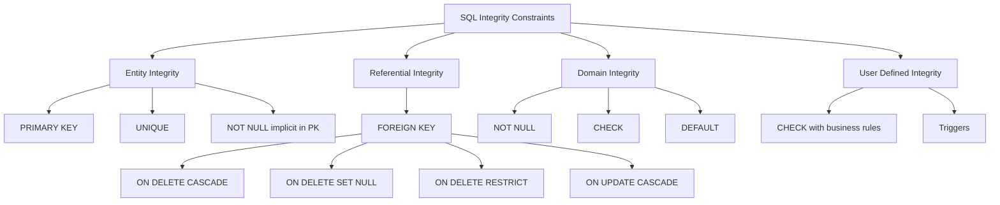
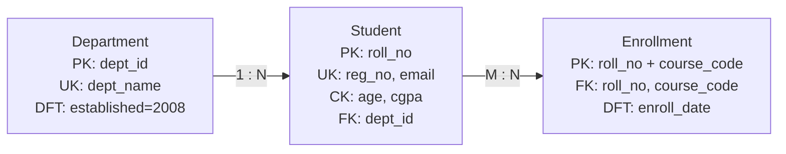
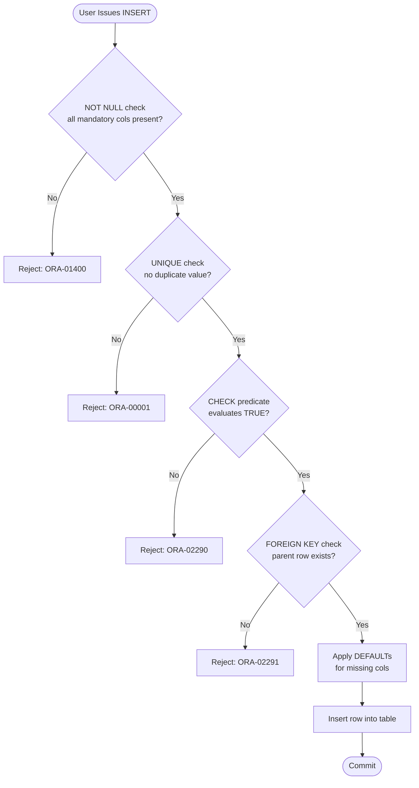
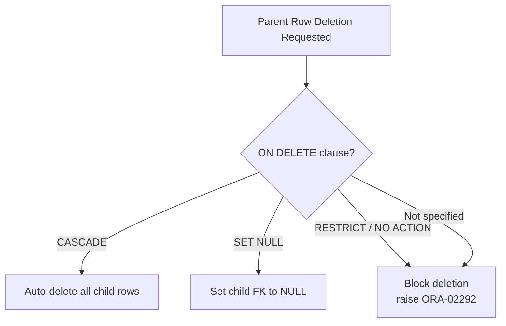
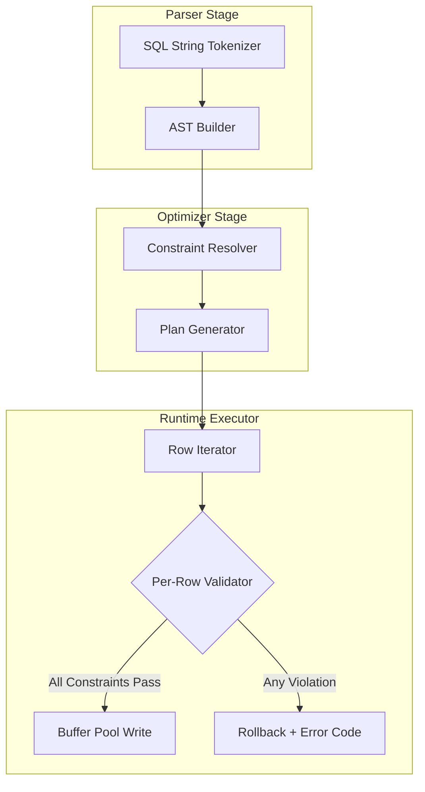
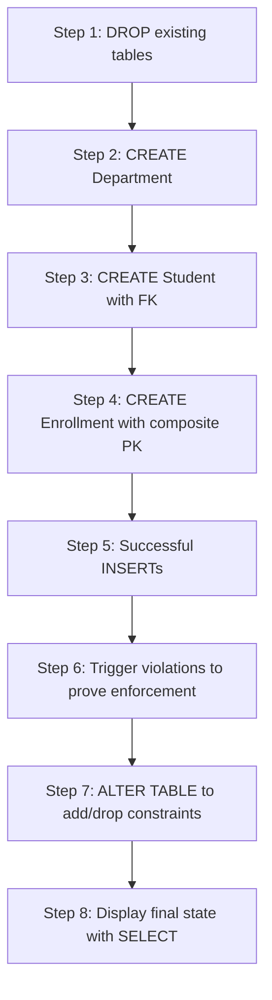

# Constraints

<!-- SECTION_1_START -->
# SQL Constraints — Foundational Definition & Intuitive Overview

## 1.1 Formal KTU Syllabus Definition

In the context of the **Relational Model** and **Structured Query Language (SQL)**, a **Constraint** is a declarative rule enforced at the **column-level** or **table-level** that restricts the kind of values that can be inserted, updated, or deleted in a relational table. Constraints are part of the **Data Definition Language (DDL)** sub-language of SQL and are integral to maintaining **Data Integrity**, **Domain Integrity**, **Entity Integrity**, and **Referential Integrity** as described by **Dr. E.F. Codd's relational rules**.

According to the **KTU 2024 Scheme (PCCSL405 — DBMS Lab)** syllabus, constraints form the *backbone of Schema Design* in Module 1 and directly map to **Course Outcome CO1**: *"Design and implement relational database schemas using SQL DDL, DML, and constraint mechanisms."*

> [!IMPORTANT]
> **Syllabus Highlight (Module 1):** Students must be able to *write SQL CREATE TABLE statements with all six standard integrity constraints*, demonstrate their enforcement via INSERT/UPDATE violations, and *alter schemas using ALTER TABLE ... ADD/DROP CONSTRAINT*.

---

## 1.2 The Six Canonical SQL Constraints

| # | Constraint | Integrity Class | Purpose |
|---|------------|-----------------|---------|
| 1 | `NOT NULL` | Domain | Disallows empty (NULL) values |
| 2 | `UNIQUE` | Entity | Ensures no duplicate values in column(s) |
| 3 | `PRIMARY KEY` | Entity | Unique + Not Null identifier |
| 4 | `FOREIGN KEY` | Referential | Links child row to parent PK |
| 5 | `CHECK` | Domain | Validates values against a Boolean predicate |
| 6 | `DEFAULT` | Domain | Supplies a fallback value when none is given |

---

## 1.3 Conceptual Analogy — The "Government ID System"

Imagine a **University Student Record Office** that processes thousands of admissions:

- **`NOT NULL`** → Like saying *"Every student MUST submit a name — the field can never be left blank."*
- **`UNIQUE`** → Like saying *"No two students can share the same Aadhaar number, but the field can be optional."*
- **`PRIMARY KEY`** → The **Roll Number** — it is both unique AND mandatory. It is the *primary* way to find a student.
- **`FOREIGN KEY`** → The **Department Code** on a student's record — it must *point to* a valid department that already exists in the `Department` table. You cannot assign a student to "Dept-99" if Dept-99 doesn't exist.
- **`CHECK`** → A rule like *"Age must be between **17** and **60**"* — the system refuses to register a 12-year-old as a B.Tech student.
- **`DEFAULT`** → If a student doesn't fill in their nationality, the system **automatically** writes *"Indian"* as the default.

> [!NOTE]
> **GeoGebra / Desmos Visualization Note:** Constraints are *set-membership restrictions* over the Cartesian product of column domains. A `CHECK (age >= 18)` constraint essentially restricts the relation to a subset of the universal relation where the predicate evaluates to **TRUE**.

---

## 1.4 Why Constraints Matter in Real Engineering Systems

In production systems (banking, e-commerce, healthcare, KTU's own *KTU e-Learning Portal*), constraints are not optional — they are **the first line of defense against data corruption**:

- A banking system without a `CHECK (balance >= 0)` constraint would allow negative balances, breaking every accounting invariant.
- A hospital system without a `FOREIGN KEY` linking `Prescription` to `Doctor` would allow "ghost doctors" prescribing medicine.
- An e-commerce `Orders` table without a `PRIMARY KEY` would allow duplicate order rows, breaking invoice generation.

> [!TIP]
> **KTU Examiner Insight:** A common valuation trap is that students confuse `UNIQUE` with `PRIMARY KEY`. Remember: *A table can have **many** `UNIQUE` constraints but **only ONE** `PRIMARY KEY`*. The PK implicitly carries `NOT NULL` + `UNIQUE` behavior.

---

## 1.5 Constraint Naming Convention (ANSI/ISO Best Practice)

Every constraint can be given a **user-defined name** using the `CONSTRAINT <name>` clause. This is critical for later `ALTER TABLE ... DROP CONSTRAINT` operations.

> [!IMPORTANT]
> **Best Practice (KTU 2024 Scheme):** Always name constraints explicitly in lab examinations. Anonymous (system-generated) constraints like `SYS_C004921` are nearly impossible to drop later, costing you practical marks.

<!-- SECTION_1_END -->

<!-- SECTION_2_START -->
# Deep Theoretical Analysis & KTU High-Yield Formula Sheet

## 2.1 Taxonomy of Integrity Constraints (Codd's Classification)

| Class | Constraint | Implemented Via |
|-------|-----------|-----------------|
| **Entity Integrity** | No PK can be NULL | `PRIMARY KEY` |
| **Referential Integrity** | Every FK must match an existing PK or be NULL | `FOREIGN KEY` |
| **Domain Integrity** | Values must belong to a valid domain | `CHECK`, `NOT NULL`, `DEFAULT` |
| **User-Defined Integrity** | Business rules | `CHECK`, `TRIGGER` |

---

## 2.2 The Six Constraints — Structural Deep Dive

### 2.2.1 `NOT NULL`

- Operates **only at the column level**.
- A column declared `NOT NULL` will reject any `INSERT`/`UPDATE` that attempts to omit the value or assign `NULL`.
- A `PRIMARY KEY` column is **implicitly** `NOT NULL`; you cannot declare it otherwise.

### 2.2.2 `UNIQUE`

- Allows `NULL` values (and depending on the DBMS, even **multiple NULLs** — e.g., Oracle, PostgreSQL; SQL Server treats NULL as equal in UNIQUE only once).
- A table may have **multiple** `UNIQUE` constraints, each on one or more columns (composite uniqueness).

### 2.2.3 `PRIMARY KEY`

- Combines `NOT NULL` + `UNIQUE`.
- **Only one** per table.
- **Automatically** creates a **unique index** (B-Tree by default) for fast lookups.
- Can be **composite** (across multiple columns) — e.g., `(student_id, course_id)` in an enrollment table.

### 2.2.4 `FOREIGN KEY`

- A column (or composite set) whose values must match the **Primary Key** (or a `UNIQUE` column) of another (or the same) table.
- The column it references is called the **parent key** or **referenced key**.
- Enforces **Referential Integrity**.
- Supports **referential actions**:
  - `ON DELETE CASCADE` — auto-deletes child rows when parent is deleted.
  - `ON DELETE SET NULL` — sets child FK to NULL.
  - `ON DELETE RESTRICT` (default) — rejects the parent deletion.
  - `ON UPDATE CASCADE` — propagates parent PK changes to children.
  - `ON DELETE NO ACTION` — similar to `RESTRICT` but checked at statement end (ANSI standard).

### 2.2.5 `CHECK`

- A Boolean predicate evaluated on every row.
- The DBMS rejects any `INSERT`/`UPDATE` that evaluates the predicate to `FALSE` or `UNKNOWN`.
- **MySQL 8.0+** enforces CHECK; earlier versions parsed but ignored them.
- Cannot reference other tables (use triggers for cross-table rules).

### 2.2.6 `DEFAULT`

- Provides a value when none is supplied in the `INSERT`.
- The default must be a **constant** or a **deterministic function** (e.g., `CURRENT_DATE`, `SYSDATE`).
- Does **not** prevent explicit `NULL` insertion.

---

## 2.3 KTU Formula / Syntax Cheat Sheet

> [!NOTE]
> **KTU High-Yield Reference Table** — Memorize these syntax templates for the 2-hour lab exam.

| Constraint | Column-Level Syntax | Table-Level Syntax |
|------------|--------------------|--------------------|
| `NOT NULL` | `col datatype NOT NULL` | Not allowed |
| `UNIQUE` | `col datatype UNIQUE` | `CONSTRAINT uk_name UNIQUE (col1, col2)` |
| `PRIMARY KEY` | `col datatype PRIMARY KEY` | `CONSTRAINT pk_name PRIMARY KEY (col1, col2)` |
| `FOREIGN KEY` | `REFERENCES parent(col)` (inline) | `CONSTRAINT fk_name FOREIGN KEY (col) REFERENCES parent(col) ON DELETE CASCADE` |
| `CHECK` | `col datatype CHECK (predicate)` | `CONSTRAINT ck_name CHECK (predicate)` |
| `DEFAULT` | `col datatype DEFAULT value` | Not allowed |

---

## 2.4 Engineering Utility — Where Each Constraint Shines

| Domain | Constraint Used | Real-World Purpose |
|--------|----------------|--------------------|
| **Banking** | `CHECK (balance >= 0)` | Prevents overdraft corruption |
| **E-Commerce** | `FOREIGN KEY ... ON DELETE CASCADE` | Auto-purge cart items if product deleted |
| **Healthcare** | `CHECK (dob < CURRENT_DATE)` | Stops future-date births |
| **Academia (KTU)** | `UNIQUE (register_no)` | No two students share a register number |
| **IoT/Inventory** | `DEFAULT CURRENT_TIMESTAMP` | Auto-stamp row creation time |

---

## 2.5 `PRIMARY KEY` vs `UNIQUE` — The Definitive Comparison

| Property | `PRIMARY KEY` | `UNIQUE` |
|----------|---------------|----------|
| NULLs allowed? | **No** | **Yes** (mostly) |
| Count per table | **Exactly 1** | **Many** |
| Creates index? | Yes (clustered in InnoDB) | Yes (non-clustered) |
| Referred by FK? | Yes | Yes (but uncommon) |
| Implicit `NOT NULL`? | Yes | No |

<!-- SECTION_2_END -->

<!-- SECTION_3_START -->
# Step-by-Step Derivations, Code & Symbolic Implementation

## 3.1 Lab Scenario — University Course Registration System

We will design a schema for KTU's *Course Registration* with **all six constraints** demonstrably enforced. The schema involves three tables: `Department`, `Student`, and `Enrollment`.

---

## 3.2 Full SQL DDL with Named Constraints (Lab-Ready Code)

```sql
-- =====================================================
-- KTU DBMS Lab (PCCSL405) — Module 1 Demo
-- Topic : SQL Constraints (All 6 Types)
-- Author: <Student Name>, Roll No: <Register No>
-- =====================================================

-- Step 1 : Drop in reverse dependency order (safe re-run)
DROP TABLE IF EXISTS Enrollment CASCADE;
DROP TABLE IF EXISTS Student    CASCADE;
DROP TABLE IF EXISTS Department CASCADE;

-- Step 2 : Create PARENT table — Department
CREATE TABLE Department (
    dept_id      CHAR(4)        CONSTRAINT pk_dept PRIMARY KEY,
    dept_name    VARCHAR(50)    NOT NULL
                  CONSTRAINT uk_dept_name UNIQUE,
    established  NUMBER(4)      DEFAULT 2008
                  CONSTRAINT ck_dept_year CHECK (established BETWEEN 1950 AND 2100)
);

-- Step 3 : Create CHILD table — Student
CREATE TABLE Student (
    roll_no      NUMBER(10)     CONSTRAINT pk_student PRIMARY KEY,
    reg_no       VARCHAR(15)    NOT NULL
                  CONSTRAINT uk_reg_no UNIQUE,
    full_name    VARCHAR(80)    NOT NULL,
    email        VARCHAR(100)   CONSTRAINT uk_email UNIQUE,
    age          NUMBER(3)      CONSTRAINT ck_age CHECK (age BETWEEN 16 AND 70),
    cgpa         NUMBER(3,2)    DEFAULT 0.00
                  CONSTRAINT ck_cgpa CHECK (cgpa BETWEEN 0.00 AND 10.00),
    dept_id      CHAR(4)        NOT NULL
                  CONSTRAINT fk_student_dept
                  REFERENCES Department(dept_id)
                  ON DELETE CASCADE
                  ON UPDATE CASCADE
);

-- Step 4 : Create JUNCTION table — Enrollment
CREATE TABLE Enrollment (
    roll_no      NUMBER(10),
    course_code  VARCHAR(8),
    enroll_date  DATE           DEFAULT CURRENT_DATE,
    grade        CHAR(2)        CONSTRAINT ck_grade
                  CHECK (grade IN ('O','A+','A','B+','B','C','D','F','I')),
    CONSTRAINT pk_enroll PRIMARY KEY (roll_no, course_code),
    CONSTRAINT fk_enroll_student FOREIGN KEY (roll_no)
        REFERENCES Student(roll_no) ON DELETE CASCADE,
    CONSTRAINT fk_enroll_course  FOREIGN KEY (course_code)
        REFERENCES Course(course_code)
);
```

> [!IMPORTANT]
> **Every constraint above is explicitly named** using `CONSTRAINT <name>` — this is the KTU 2024 expected lab convention. The system will not be forced to assign cryptic names like `SYS_C004921`.

---

## 3.3 Demonstrating Enforcement (INSERT-Time Violations)

### Test 1 — `NOT NULL` Violation

```sql
-- This must FAIL: reg_no is NOT NULL
INSERT INTO Student (roll_no, reg_no, full_name, age, dept_id)
VALUES (101, NULL, 'Anand Krishnan', 19, 'CSED');
/* Oracle Error: ORA-01400: cannot insert NULL into ("SYS"."STUDENT"."REG_NO") */
```

### Test 2 — `UNIQUE` Violation

```sql
INSERT INTO Student VALUES (101, 'KTU2024CS001', 'Anand',  '[email protected]', 19, 8.5, 'CSED');
INSERT INTO Student VALUES (102, 'KTU2024CS001', 'Beena',  '[email protected]', 20, 7.9, 'CSED');
/* Second INSERT fails: ORA-00001: unique constraint (SYS.UK_REG_NO) violated */
```

### Test 3 — `PRIMARY KEY` Violation

```sql
INSERT INTO Student VALUES (101, 'KTU2024CS002', 'Anand',  '[email protected]', 19, 8.5, 'CSED');
INSERT INTO Student VALUES (101, 'KTU2024CS003', 'Chitra', '[email protected]', 21, 9.1, 'ECED');
/* Second INSERT fails: unique constraint (SYS.PK_STUDENT) violated */
```

### Test 4 — `FOREIGN KEY` Violation (Orphan Insert)

```sql
-- 'BIOX' is not a valid dept_id
INSERT INTO Student VALUES (103, 'KTU2024BT001', 'Deepa',  '[email protected]', 19, 8.2, 'BIOX');
/* Oracle Error: ORA-02291: integrity constraint (SYS.FK_STUDENT_DEPT) violated - parent key not found */
```

### Test 5 — `CHECK` Violation

```sql
INSERT INTO Student VALUES (104, 'KTU2024CS004', 'Eshaan', '[email protected]', 12, 8.0, 'CSED');
/* Oracle Error: ORA-02290: check constraint (SYS.CK_AGE) violated */
```

### Test 6 — `DEFAULT` Demonstration

```sql
INSERT INTO Department (dept_id, dept_name) VALUES ('CSED', 'Computer Science');
SELECT * FROM Department;
/* Returns: dept_id=CSED, dept_name=Computer Science, established=2008 (default applied) */
```

---

## 3.4 Altering Schemas — Adding & Dropping Constraints Mid-Lifecycle

### Add a New Constraint via `ALTER TABLE`

```sql
-- Add a CHECK constraint that the email must end with @ktu.edu or @students.ktu.edu
ALTER TABLE Student
ADD CONSTRAINT ck_email_domain
CHECK (email LIKE '%@ktu.edu' OR email LIKE '%@students.ktu.edu');
```

### Drop an Existing Constraint

```sql
-- Drop the CGPA cap (perhaps KTU changes its grading scale)
ALTER TABLE Student
DROP CONSTRAINT ck_cgpa;
```

### Enable / Disable Constraints (Advanced)

```sql
-- Temporarily disable a CHECK to bulk-load legacy data
ALTER TABLE Student DISABLE CONSTRAINT ck_age;

-- Re-enable after cleanup
ALTER TABLE Student ENABLE CONSTRAINT ck_age;
```

### Dropping a `FOREIGN KEY` vs Dropping the Referenced Table

```sql
-- Step A: Find the FK name
SELECT constraint_name FROM user_constraints
WHERE table_name = 'STUDENT' AND constraint_type = 'R';

-- Step B: Drop the FK explicitly
ALTER TABLE Student DROP CONSTRAINT fk_student_dept;

-- Now Department can be dropped (no child reference exists)
DROP TABLE Department CASCADE CONSTRAINTS;
```

> [!WARNING]
> **KTU Valuation Warning:** When a question says *"Remove the foreign key constraint on the Student table"*, students often write `DROP TABLE Student` — this is **WRONG** and costs 4–5 marks. Use `ALTER TABLE ... DROP CONSTRAINT <fk_name>`. The constraint name MUST be retrieved first from `USER_CONSTRAINTS`.

---

## 3.5 Composite Primary Key — Worked Example

```sql
-- A library allows a student to issue many books, but each book copy is issued once at a time
CREATE TABLE Issue (
    issue_id     NUMBER        GENERATED ALWAYS AS IDENTITY,
    student_id   NUMBER(10)    NOT NULL,
    book_copy_id VARCHAR(10)   NOT NULL,
    issue_date   DATE          DEFAULT SYSDATE,
    return_date  DATE,
    CONSTRAINT pk_issue PRIMARY KEY (issue_id),
    CONSTRAINT fk_issue_student FOREIGN KEY (student_id) REFERENCES Student(roll_no),
    CONSTRAINT fk_issue_book    FOREIGN KEY (book_copy_id) REFERENCES BookCopy(copy_id),
    CONSTRAINT ck_dates CHECK (return_date IS NULL OR return_date >= issue_date)
);
```

> [!TIP]
> **Composite PK Alternative:** If `issue_id` were unavailable, the table-level `PRIMARY KEY (student_id, book_copy_id)` would enforce that *the same student cannot issue the same book copy twice simultaneously*.

---

## 3.6 Self-Referencing Foreign Key (Recursive Hierarchy)

```sql
-- Employee → Manager (manager is also an employee)
CREATE TABLE Employee (
    emp_id      NUMBER(6)     PRIMARY KEY,
    emp_name    VARCHAR(60)   NOT NULL,
    manager_id  NUMBER(6),
    CONSTRAINT fk_manager FOREIGN KEY (manager_id)
        REFERENCES Employee(emp_id)
        ON DELETE SET NULL
);
```

This is a critical KTU 2024 Module-1 pattern. The FK references the **same table**.

---

## 3.7 Symbolic Logic Representation

For advanced understanding, a `CHECK` constraint is equivalent to a **first-order logic predicate**:

$$
\forall t \in R, \quad P(t) = \text{TRUE}
$$

Where $R$ is the relation (table) and $P$ is the Boolean predicate. A row $t$ is admitted into $R$ **iff** $P(t)$ evaluates to TRUE; otherwise, the DBMS raises a constraint violation exception.

For a `FOREIGN KEY` from child $R_c$ to parent $R_p$ on column $A$:

$$
\forall t_c \in R_c, \quad t_c.A = \text{NULL} \;\lor\; \exists\, t_p \in R_p : t_p.PK = t_c.A
$$

<!-- SECTION_3_END -->

<!-- SECTION_4_START -->
# Structural Diagrams & Schematics

## 4.1 Constraint Classification Hierarchy



---

## 4.2 Schema Architecture — Department / Student / Enrollment ER Mapping



---

## 4.3 Sequential Processing Topology — INSERT Validation Pipeline



---

## 4.4 Referential Action Decision Matrix (KTU 2024 High-Yield)



---

## 4.5 Block-Level Functional Architecture — Constraint Enforcement Engine



---

## 4.6 Block Diagram — Lab Program Flow (CREATE → INSERT → VERIFY)



<!-- SECTION_4_END -->

<!-- SECTION_5_START -->
# KTU 2024 Scheme Examination Question Bank & Topic Recap

> [!NOTE]
> **Mark Distribution Reference (PCCSL405):** Continuous Evaluation 50 marks (Record + Viva + Lab Test) + End-Semester Lab Exam 50 marks. Question bank below mirrors the **ESE Lab Exam** pattern.

---

## 5.1 Part A — Short Answer Questions (2 × 3 = 6 Marks)

### Question 1 — `[KTU University Exam — July 2024]`
**Q: Differentiate between `PRIMARY KEY` and `UNIQUE` constraints with a suitable example. (3 Marks)** `[CO1, Remember]`

**Model Answer (Valuation Key):**
- `[Definition of PK: 1 Mark]` A `PRIMARY KEY` uniquely identifies each row in a table and **implicitly carries `NOT NULL`** behavior.
- `[Definition of UNIQUE: 1 Mark]` A `UNIQUE` constraint ensures that **no two rows** have the same value in a column, but it **allows NULLs** (in most DBMS).
- `[Example + Count Rule: 1 Mark]` Example: In a `Student` table, `roll_no` is the `PRIMARY KEY`, while `email` and `aadhaar_no` may be `UNIQUE`. A table can have **only one** `PRIMARY KEY` but **multiple** `UNIQUE` constraints.

---

### Question 2 — `[KTU University Exam — Dec 2023]`
**Q: What is a `FOREIGN KEY` constraint? Explain the `ON DELETE CASCADE` option. (3 Marks)** `[CO1, Understand]`

**Model Answer (Valuation Key):**
- `[FK Definition: 1.5 Marks]` A `FOREIGN KEY` is a column (or set of columns) in the child table that **references the PRIMARY KEY** (or a UNIQUE column) of the parent table, enforcing referential integrity.
- `[CASCADE Explanation: 1.5 Marks]` `ON DELETE CASCADE` means that **when a parent row is deleted, all referencing child rows are automatically deleted** as well, propagating the deletion through the relationship.

**Example SQL:**
```sql
ALTER TABLE Enrollment
ADD CONSTRAINT fk_enroll_stu
FOREIGN KEY (roll_no) REFERENCES Student(roll_no)
ON DELETE CASCADE;
```

---

## 5.2 Part B — Long Answer Questions (Internal Choice, 1 × 14 = 14 Marks)

### Question A — `[KTU University Exam — July 2024, Model Paper]`
**Q: Design a database schema for a Library Management System that enforces all six SQL constraints. Write the complete DDL with named constraints, demonstrate three constraint violations via INSERT statements, and write the ALTER TABLE statements to add a new CHECK constraint and drop an existing one. (14 Marks)** `[CO1 + CO2, Apply + Analyze]`

#### Part (a) — Schema Design with All Constraints (7 Marks) `[Apply]`

```sql
DROP TABLE IF EXISTS Issue CASCADE;
DROP TABLE IF EXISTS BookCopy CASCADE;
DROP TABLE IF EXISTS Book CASCADE;
DROP TABLE IF EXISTS Member CASCADE;
DROP TABLE IF EXISTS Publisher CASCADE;

CREATE TABLE Publisher (
    pub_id      NUMBER(4)      CONSTRAINT pk_pub PRIMARY KEY,
    pub_name    VARCHAR(80)    NOT NULL
                  CONSTRAINT uk_pub_name UNIQUE,
    country     VARCHAR(40)    DEFAULT 'India'
                  CONSTRAINT ck_country CHECK (country IN ('India','USA','UK','Germany','Japan'))
);

CREATE TABLE Book (
    isbn        CHAR(13)       CONSTRAINT pk_book PRIMARY KEY,
    title       VARCHAR(200)   NOT NULL,
    price       NUMBER(8,2)    CONSTRAINT ck_price CHECK (price > 0 AND price < 10000),
    pub_id      NUMBER(4)      CONSTRAINT fk_book_pub
                  REFERENCES Publisher(pub_id) ON DELETE SET NULL
);

CREATE TABLE BookCopy (
    copy_id     VARCHAR(10)    CONSTRAINT pk_copy PRIMARY KEY,
    isbn        CHAR(13)       NOT NULL
                  CONSTRAINT fk_copy_book REFERENCES Book(isbn) ON DELETE CASCADE,
    shelf_no    VARCHAR(5)     CONSTRAINT ck_shelf CHECK (shelf_no LIKE 'S%')
);

CREATE TABLE Member (
    member_id   NUMBER(8)      CONSTRAINT pk_member PRIMARY KEY,
    full_name   VARCHAR(80)    NOT NULL,
    email       VARCHAR(100)   CONSTRAINT uk_mem_email UNIQUE
                  CONSTRAINT ck_mem_email CHECK (email LIKE '%@%.%'),
    join_date   DATE           DEFAULT SYSDATE
);

CREATE TABLE Issue (
    issue_id    NUMBER(10)     GENERATED ALWAYS AS IDENTITY
                  CONSTRAINT pk_issue PRIMARY KEY,
    member_id   NUMBER(8)      NOT NULL
                  CONSTRAINT fk_iss_mem REFERENCES Member(member_id) ON DELETE CASCADE,
    copy_id     VARCHAR(10)    NOT NULL
                  CONSTRAINT fk_iss_copy REFERENCES BookCopy(copy_id),
    issue_date  DATE           DEFAULT SYSDATE,
    due_date    DATE,
    CONSTRAINT ck_iss_dates CHECK (due_date >= issue_date)
);
```

**Valuation Key for (a):**
- `[Publisher table with PK + UNIQUE + CHECK + DEFAULT: 2 Marks]`
- `[Book table with FK and ON DELETE SET NULL: 1.5 Marks]`
- `[BookCopy with composite logic and FK CASCADE: 1 Mark]`
- `[Member with DEFAULT SYSDATE and email format CHECK: 1 Mark]`
- `[Issue with identity PK, two FKs, and date CHECK: 1.5 Marks]`

#### Part (b) — Violation Demonstrations + ALTER Operations (7 Marks) `[Analyze + Apply]`

**Violation 1 — `PRIMARY KEY` violation (1.5 Marks):**
```sql
INSERT INTO Member VALUES (1001, 'Anand', '[email protected]', SYSDATE);
INSERT INTO Member VALUES (1001, 'Beena', '[email protected]', SYSDATE);
/* Expected Error: ORA-00001: unique constraint (PK_MEMBER) violated */
```

**Violation 2 — `CHECK` violation (1.5 Marks):**
```sql
INSERT INTO Book VALUES ('978-3-16-148410', 'DBMS Concepts', -500.00, 1);
/* Expected Error: ORA-02290: check constraint (CK_PRICE) violated */
```

**Violation 3 — `FOREIGN KEY` violation (1.5 Marks):**
```sql
INSERT INTO Issue (member_id, copy_id, due_date) VALUES (9999, 'CP-001', SYSDATE+7);
/* Expected Error: ORA-02291: integrity constraint (FK_ISS_MEM) violated - parent key not found */
```

**ALTER Operations (2.5 Marks):**
```sql
-- Add a CHECK that book titles must be at least 3 characters
ALTER TABLE Book
ADD CONSTRAINT ck_title_len CHECK (LENGTH(title) >= 3);

-- Drop the CK_PRICE constraint (assume business wants flexible pricing)
ALTER TABLE Book DROP CONSTRAINT ck_price;
```

**Valuation Key for (b):**
- `[Violation 1 correctly shown with expected ORA code: 1.5 Marks]`
- `[Violation 2 correctly shown with expected ORA code: 1.5 Marks]`
- `[Violation 3 correctly shown with expected ORA code: 1.5 Marks]`
- `[ADD CONSTRAINT syntax correct: 1.25 Marks]`
- `[DROP CONSTRAINT syntax correct: 1.25 Marks]`

---

### Question B — `[KTU University Exam — Dec 2023]`
**Q: (a) Explain the difference between Entity Integrity and Referential Integrity with examples. (7 Marks) (b) Write a SQL schema for an Employee-Department database demonstrating `PRIMARY KEY`, `FOREIGN KEY` with `ON UPDATE CASCADE`, `CHECK` for salary validation, and a self-referencing `FOREIGN KEY` for the manager hierarchy. Insert 4 valid rows and one invalid row to demonstrate a `CHECK` violation. (7 Marks)** `[CO1 + CO2, Understand + Apply]`

#### Part (a) — Entity vs Referential Integrity (7 Marks) `[Understand]`

**Entity Integrity:**
- `[Definition: 1.5 Marks]` Ensures that **every row in a table is uniquely identifiable** — i.e., the `PRIMARY KEY` cannot be NULL and must be unique.
- `[Example: 1 Mark]` In `Student(roll_no, name, ...)`, `roll_no` is the PK; two students cannot share the same roll number, and roll number cannot be missing.

**Referential Integrity:**
- `[Definition: 1.5 Marks]` Ensures that **every value of a FOREIGN KEY in the child table must match an existing PRIMARY KEY value in the parent table** (or be NULL).
- `[Example: 1 Mark]` In `Enrollment(roll_no, course_code)`, `roll_no` is FK to `Student(roll_no)`. You cannot enroll a student whose `roll_no` is not present in the `Student` table.

**Comparison Table (synthesizing for 2 Marks):**
| Property | Entity Integrity | Referential Integrity |
|----------|------------------|----------------------|
| Applies to | Primary Key | Foreign Key |
| Prevents | Duplicate / NULL PKs | Orphan child rows |
| Enforced by | `PRIMARY KEY` constraint | `FOREIGN KEY` constraint |

**Valuation Key for (a):**
- `[Entity Integrity definition + example: 3 Marks]`
- `[Referential Integrity definition + example: 2 Marks]`
- `[Comparison synthesis: 2 Marks]`

#### Part (b) — Employee-Department Schema with Self-Referencing FK (7 Marks) `[Apply]`

```sql
DROP TABLE IF EXISTS Employee CASCADE;
DROP TABLE IF EXISTS Department CASCADE;

CREATE TABLE Department (
    dept_id   NUMBER(4)    CONSTRAINT pk_dept PRIMARY KEY,
    dept_name VARCHAR(50)  NOT NULL UNIQUE
);

CREATE TABLE Employee (
    emp_id     NUMBER(6)    CONSTRAINT pk_emp PRIMARY KEY,
    emp_name   VARCHAR(60)  NOT NULL,
    salary     NUMBER(10,2) CONSTRAINT ck_salary
                 CHECK (salary BETWEEN 10000 AND 1000000),
    dept_id    NUMBER(4)    NOT NULL
                 CONSTRAINT fk_emp_dept
                 REFERENCES Department(dept_id)
                 ON UPDATE CASCADE ON DELETE RESTRICT,
    manager_id NUMBER(6)    CONSTRAINT fk_emp_mgr
                 REFERENCES Employee(emp_id)
                 ON DELETE SET NULL
);

-- 4 Valid Inserts
INSERT INTO Department VALUES (10, 'Computer Science');
INSERT INTO Department VALUES (20, 'Mechanical');

INSERT INTO Employee VALUES (1,  'Director',   500000, 10, NULL);
INSERT INTO Employee VALUES (2,  'HOD-CSE',    300000, 10, 1);
INSERT INTO Employee VALUES (3,  'Prof-A',     150000, 10, 2);
INSERT INTO Employee VALUES (4,  'HOD-MECH',   280000, 20, 1);

-- 1 Invalid Insert (CHECK violation)
INSERT INTO Employee VALUES (5, 'Intern-X', 5000, 10, 2);
/* Expected Error: ORA-02290: check constraint (CK_SALARY) violated
   (because 5000 < 10000 minimum) */
```

**Valuation Key for (b):**
- `[Department table with PK + UNIQUE: 1 Mark]`
- `[Employee table with PK + CHECK salary: 1.5 Marks]`
- `[FK dept_id with ON UPDATE CASCADE: 1 Mark]`
- `[Self-referencing FK manager_id: 1.5 Marks]`
- `[4 valid inserts: 1 Mark]`
- `[1 invalid insert with expected error commentary: 1 Mark]`

---

> [!WARNING]
> **KTU Examiner's Pitfall Callout — Where Students Lose Marks**
> 1. **Forgetting `CONSTRAINT <name>`** — anonymous constraints are hard to drop later, costing 1–2 marks.
> 2. **Confusing `UNIQUE` with `PRIMARY KEY`** — remember UNIQUE allows NULLs; PK does not.
> 3. **Writing `DROP TABLE` instead of `ALTER TABLE ... DROP CONSTRAINT`** when asked to remove a specific constraint.
> 4. **Forgetting the parent table must contain data before child INSERT** in FK scenarios — insert order matters.
> 5. **Writing `CHECK (age > 18)` and then trying to insert a NULL age** — NULL evaluates to UNKNOWN, not FALSE, and *passes* a CHECK (unless `NOT NULL` is also present). Many students wrongly believe CHECK blocks NULLs.
> 6. **Not specifying `ON DELETE` action** — default is `NO ACTION` (effectively `RESTRICT`); mention this explicitly in viva.
> 7. **Composite PK ordering** — `PRIMARY KEY (a, b)` is different from `PRIMARY KEY (b, a)`; ensure the order matches query patterns.

---

## 5.3 Topic Recap & Important Things to Remember

> [!TIP]
> **Rapid-Revision Checklist — Print and Pin to Your Lab Desk**

- **Six canonical SQL constraints:** `NOT NULL`, `UNIQUE`, `PRIMARY KEY`, `FOREIGN KEY`, `CHECK`, `DEFAULT`.
- **Entity Integrity** = `PRIMARY KEY` must be unique and NOT NULL.
- **Referential Integrity** = `FOREIGN KEY` must match an existing parent PK (or be NULL).
- **Domain Integrity** = `NOT NULL` + `CHECK` + `DEFAULT` + datatype enforcement.
- **A table can have only ONE `PRIMARY KEY`** but **many `UNIQUE`** constraints.
- **Composite PK** uses table-level syntax: `CONSTRAINT pk_name PRIMARY KEY (col1, col2)`.
- **Referential actions:** `CASCADE` (auto-delete/update), `SET NULL` (nullify FK), `RESTRICT` (block), `NO ACTION` (deferred check).
- **Self-referencing FK** allows hierarchical data in a single table (e.g., Employee → Manager).
- **Constraint naming convention:** Always use `CONSTRAINT <descriptive_name>` for easy `ALTER TABLE ... DROP CONSTRAINT`.
- **Common Oracle error codes:** ORA-01400 (NOT NULL), ORA-00001 (UNIQUE/PK), ORA-02290 (CHECK), ORA-02291 (FK orphan), ORA-02292 (FK on delete blocked).
- **CHECK does not block NULLs** — a NULL evaluates to UNKNOWN, not FALSE, so the row is accepted.
- **DEFAULT does not block explicit NULLs** — only fires when the column is omitted from the INSERT.
- **Adding a constraint** uses `ALTER TABLE tbl ADD CONSTRAINT ...`.
- **Dropping a constraint** uses `ALTER TABLE tbl DROP CONSTRAINT ...` (NOT `DROP TABLE`).
- **Disabling/Enabling:** `ALTER TABLE tbl DISABLE/ENABLE CONSTRAINT ...` for bulk-loading legacy data.
- **Always drop child tables BEFORE parent tables** (or use `CASCADE CONSTRAINTS`).
- **Find constraint names** by querying `USER_CONSTRAINTS` (Oracle) or `INFORMATION_SCHEMA.TABLE_CONSTRAINTS` (MySQL/PostgreSQL).
- **Default values** can be constants, `SYSDATE`/`CURRENT_DATE`, or `CURRENT_TIMESTAMP`, but NOT subqueries or non-deterministic functions (DBMS-dependent).
- **`ON UPDATE CASCADE`** is supported in Oracle only from 9i onward via deferrable constraints; MySQL supports it natively.
- **Order of constraint checks during INSERT** (practically): NOT NULL → UNIQUE → CHECK → FOREIGN KEY → DEFAULT applied.

<!-- SECTION_5_END -->
