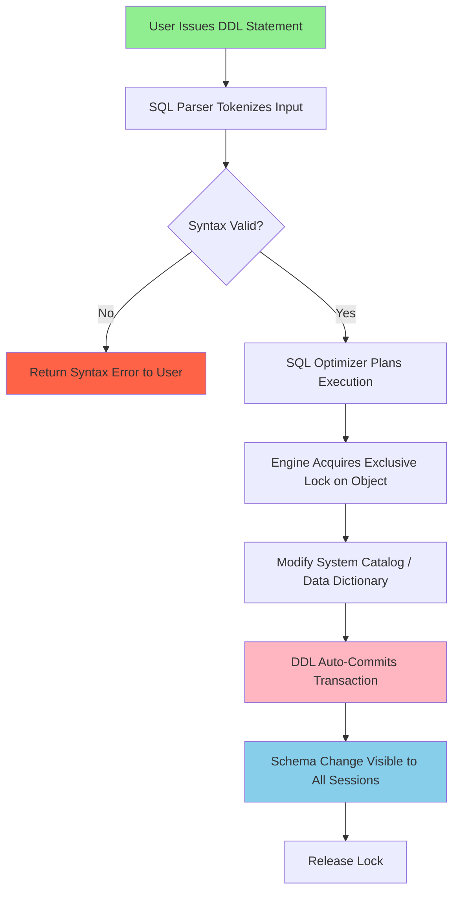
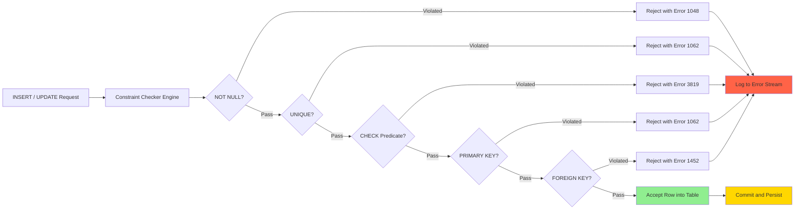

# DDL Commands

<!-- SECTION_1_START -->
# 1. Core Technical Definition & Intuitive Overview

## 1.1 Formal Definition (KTU 2024 Syllabus Terminology)

**Data Definition Language (DDL)** is a subset of Structured Query Language (SQL) used to **define, modify, and remove the structural schema** of database objects such as tables, schemas, indexes, views, and domains. Unlike Data Manipulation Language (DML), DDL statements are **auto-committed** in most RDBMS engines, meaning their effects are permanently persisted and cannot be rolled back without explicit transactional wrappers (e.g., `ROLLBACK` in Oracle, or `BEGIN; ... ROLLBACK;` blocks in PostgreSQL/MySQL).

The canonical set of DDL commands recognized by the KTU 2024 Scheme PCCSL405 syllabus is:

$$\text{DDL} = \{ \text{CREATE}, \text{ALTER}, \text{DROP}, \text{TRUNCATE}, \text{RENAME}, \text{COMMENT} \}$$

> [!IMPORTANT]
> **KTU Board Emphasis:** DDL statements in standard SQL do **not** require an explicit `COMMIT` statement. Once executed, the schema change is committed to the data dictionary. This is a **frequently tested** distinction from DML statements (`INSERT`, `UPDATE`, `DELETE`), which require `COMMIT` to persist changes.

## 1.2 Conceptual Analogy / Intuition

Imagine you are constructing a **multi-storey library building**:

| Building Activity | Database Equivalent | SQL Command Family |
|---|---|---|
| Drawing the architectural blueprint | Defining tables, columns, datatypes | `CREATE` |
| Renaming a wing, adding extra floors | Modifying existing table structure | `ALTER` |
| Demolishing a wing completely | Removing entire table/data permanently | `DROP` |
| Razing floors but keeping the foundation | Removing all rows, keeping structure | `TRUNCATE` |
| Renaming the entire building | Renaming a database object | `RENAME` |

> [!NOTE]
> **Key Insight:** DDL is to the database what an **architect's blueprint** is to a building. You do not "live" in the blueprint (data), you live in the building (rows), but without the blueprint, the building cannot exist. Hence DDL must always be executed **before** any DML operation.

## 1.3 Physical Constants and Standard Metrics

- **Information Schema** standard: defined by **ISO/IEC 9075** as `INFORMATION_SCHEMA` — the standardized metadata repository.
- **Data Dictionary** cache memory: typically **4 MB to 64 MB** in Oracle SGA, holding parsed DDL metadata.
- **Maximum columns per table** (standard SQL limit): **$1,000$ to $1,600$** depending on RDBMS vendor.
- **Maximum row size**: typically **$8,060$ bytes** (SQL Server) or **$65,535$ bytes** (MySQL InnoDB).

> [!VISUALIZATION CONTROL]
> **Concept:** DDL Command Hierarchy in the SQL Language Family
> **Graphing Input:** Hierarchical Tree Plot
> **Visual Description:** Observe SQL at the root node, with three primary branches (DDL, DML, DCL/DQL) — DDL contains CREATE, ALTER, DROP, TRUNCATE, RENAME as leaf nodes. DML contains INSERT, UPDATE, DELETE, SELECT. The student should observe DDL forming the structural foundation layer of any database interaction.

---

<!-- SECTION_1_END -->

<!-- SECTION_2_START -->
# 2. Deep Theoretical Analysis & KTU High-Yield Formula Sheet

## 2.1 Operational Breakdown of Each DDL Command

### 2.1.1 `CREATE` Command Family

The `CREATE` statement establishes new database objects. It has multiple variants:

**A. CREATE DATABASE** — Initializes a fresh logical container.

```sql
CREATE DATABASE UniversityDB;
```

**B. CREATE TABLE** — The most frequently tested DDL statement in KTU lab exams.

```sql
CREATE TABLE table_name (
    column1 datatype [constraints],
    column2 datatype [constraints],
    ...
    [table_level_constraints]
);
```

**C. CREATE INDEX** — Builds a B-Tree (or Hash) lookup structure for faster retrieval.

**D. CREATE VIEW** — A virtual table defined by a stored `SELECT` query.

### 2.1.2 `ALTER` Command Family

`ALTER` performs **in-place schema evolution** without losing existing data (in most RDBMS). Sub-operations include:

- `ADD` — append a new column or constraint.
- `DROP COLUMN` — remove a column.
- `MODIFY` / `ALTER COLUMN` — change datatype or size of an existing column.
- `RENAME TO` / `RENAME COLUMN` — rename the table or a column.
- `ADD CONSTRAINT` / `DROP CONSTRAINT` — manage integrity rules.

### 2.1.3 `DROP` Command

`DROP` permanently deletes a database object **along with its structure, data, indexes, triggers, and constraints**. The action is **irreversible** without a backup.

$$\text{DROP} \rightarrow \text{Removes} \{ \text{Schema}, \text{Data}, \text{Indexes}, \text{Constraints}, \text{Triggers} \}$$

### 2.1.4 `TRUNCATE` Command

`TRUNCATE` is a **DDL operation that empties all rows** from a table while **preserving the table structure** (column definitions, constraints). It is faster than `DELETE *` because it deallocates the data pages directly.

> [!IMPORTANT]
> **TRUNCATE vs DELETE:** `TRUNCATE` is DDL (auto-committed, no `WHERE` clause, resets identity/auto-increment). `DELETE` is DML (transactional, supports `WHERE` clause, does not reset counters). This distinction carries **3 marks** in KTU theory exams.

### 2.1.5 `RENAME` Command

Used to rename a table or column. Syntax varies:
- **MySQL / Oracle:** `RENAME TABLE old_name TO new_name;`
- **SQL Server:** `sp_rename 'old_name', 'new_name';`
- **PostgreSQL:** `ALTER TABLE old_name RENAME TO new_name;`

## 2.2 Integrity Constraints — The "Rule Book" of DDL

Constraints enforce data validity at the schema level, preventing invalid rows from ever entering the table.

| Constraint Type | Purpose | Example Syntax |
|---|---|---|
| `PRIMARY KEY` | Uniquely identifies each row; NOT NULL + UNIQUE | `RollNo INT PRIMARY KEY` |
| `FOREIGN KEY` | Enforces referential integrity between tables | `FOREIGN KEY (DeptID) REFERENCES Department(DeptID)` |
| `UNIQUE` | Ensures column values are non-duplicate (allows one NULL in some DBs) | `Email VARCHAR(100) UNIQUE` |
| `NOT NULL` | Disallows empty/missing values | `Name VARCHAR(50) NOT NULL` |
| `CHECK` | Validates a Boolean predicate on column values | `CHECK (Age >= 18 AND Age <= 60)` |
| `DEFAULT` | Assigns a default value if none provided | `Status VARCHAR(10) DEFAULT 'Active'` |
| `AUTO_INCREMENT` / `SERIAL` / `IDENTITY` | Auto-generates sequential integers | `ID INT AUTO_INCREMENT` |

## 2.3 KTU High-Yield Formula Sheet

| # | Concept | Syntax / Formula | Notes / Limits |
|---|---|---|---|
| 1 | Create Table | `CREATE TABLE t (col datatype [CONSTRAINT])` | DDL — auto-commit |
| 2 | Add Column | `ALTER TABLE t ADD col datatype` | Preserves existing rows |
| 3 | Drop Column | `ALTER TABLE t DROP COLUMN col` | Data in that column is lost |
| 4 | Modify Column | `ALTER TABLE t MODIFY col new_datatype` | Some RDBMS may fail on data loss |
| 5 | Drop Table | `DROP TABLE t [CASCADE CONSTRAINTS]` | Irreversible |
| 6 | Truncate | `TRUNCATE TABLE t` | Resets auto-increment, no rollback |
| 7 | Add Constraint | `ALTER TABLE t ADD CONSTRAINT name FOREIGN KEY (col) REFERENCES other(col)` | Named constraints are best practice |
| 8 | Primary Key | Implicitly `UNIQUE + NOT NULL` | Max 1 per table |
| 9 | Foreign Key | Enforces $\text{referential integrity} : \forall t_1 \in T_1, \exists t_2 \in T_2$ | ON DELETE CASCADE / SET NULL options |
| 10 | Check | `CHECK (predicate)` | Cannot reference other rows |

> [!NOTE]
> **Foreign Key Referential Rule:** $\forall$ tuple $r$ in referencing table $R$, the value of the foreign key column must either be `NULL` or must match the primary key value of some tuple in the referenced table $S$. This is the **referential integrity constraint** — a high-weightage 7-mark question in KTU 2024 ESE.

## 2.4 Real-World Engineering Utility

DDL forms the **schema layer** of the three-schema architecture (ANSI/SPARC). In production engineering:

- **Version-controlled migrations** (Flyway, Liquibase) use DDL scripts for CI/CD pipelines.
- **Cloud databases** (AWS RDS, Azure SQL) auto-generate DDL from ORM models (Django, Hibernate).
- **Data warehousing** uses `CREATE TABLE AS SELECT (CTAS)` for ETL operations.
- **Microservices** use DDL to provision isolated schemas per service tenant.

---

<!-- SECTION_2_END -->

<!-- SECTION_3_START -->
# 3. Step-by-Step Derivations & Code/Symbolic Implementation

## 3.1 Comprehensive Worked Example: University Schema

Below is a complete, executable, end-to-end DDL script for a classic **Student-Course-Enrollment** schema. Each command is annotated with its KTU valuation weightage.

### Step 1: Create the Database Container

```sql
-- [Step 1 - Creating a new database: 1 Mark]
CREATE DATABASE UniversityDB;
USE UniversityDB;
```

### Step 2: Create the Parent Table `Department`

```sql
-- [Step 2 - CREATE TABLE with PRIMARY KEY constraint: 2 Marks]
CREATE TABLE Department (
    DeptID      INT             NOT NULL,
    DeptName    VARCHAR(50)     NOT NULL,
    HOD         VARCHAR(50)     DEFAULT 'TBA',
    Established DATE,
    CONSTRAINT pk_dept PRIMARY KEY (DeptID),
    CONSTRAINT uq_deptname UNIQUE (DeptName)
);
```

**Logic Explanation:**
- `DeptID INT NOT NULL` — cannot be empty; will be the primary key.
- `CONSTRAINT pk_dept PRIMARY KEY (DeptID)` — assigns a **named** primary key (best practice for KTU lab records).
- `CONSTRAINT uq_deptname UNIQUE (DeptName)` — prevents duplicate department names.
- `DEFAULT 'TBA'` — if `HOD` is omitted during insertion, the system fills it with `'TBA'` (To Be Assigned).

### Step 3: Create the Child Table `Student` with FOREIGN KEY

```sql
-- [Step 3 - CREATE TABLE with FK + CHECK constraint: 3 Marks]
CREATE TABLE Student (
    RollNo      INT             PRIMARY KEY,
    Name        VARCHAR(50)     NOT NULL,
    Gender      CHAR(1)         CHECK (Gender IN ('M', 'F', 'O')),
    DOB         DATE            NOT NULL,
    CGPA        DECIMAL(3,2)    CHECK (CGPA BETWEEN 0.00 AND 10.00),
    DeptID      INT,
    Email       VARCHAR(100)    UNIQUE,
    CONSTRAINT fk_student_dept
        FOREIGN KEY (DeptID)
        REFERENCES Department(DeptID)
        ON DELETE SET NULL
        ON UPDATE CASCADE
);
```

**Logic Explanation:**
- `CHECK (Gender IN ('M','F','O'))` — restricts values to the enumerated set.
- `CHECK (CGPA BETWEEN 0.00 AND 10.00)` — ensures CGPA stays within valid academic bounds.
- `ON DELETE SET NULL` — if a Department row is deleted, dependent Student rows retain their record but with `DeptID = NULL`.
- `ON UPDATE CASCADE` — if the parent's `DeptID` changes, the change propagates to all children.

### Step 4: Create the Associative Table `Enrollment`

```sql
-- [Step 4 - Junction table with composite PRIMARY KEY: 2 Marks]
CREATE TABLE Enrollment (
    RollNo      INT             NOT NULL,
    CourseID    VARCHAR(10)     NOT NULL,
    Semester    INT             CHECK (Semester BETWEEN 1 AND 8),
    Marks       INT             CHECK (Marks BETWEEN 0 AND 100),
    Grade       CHAR(2),
    EnrollDate  DATE            DEFAULT (CURRENT_DATE),
    CONSTRAINT pk_enrollment PRIMARY KEY (RollNo, CourseID, Semester),
    CONSTRAINT fk_enroll_student FOREIGN KEY (RollNo) 
        REFERENCES Student(RollNo) ON DELETE CASCADE,
    CONSTRAINT fk_enroll_course  FOREIGN KEY (CourseID) 
        REFERENCES Course(CourseID) ON DELETE CASCADE
);
```

### Step 5: Create the `Course` Table (Forward Reference Resolution)

```sql
-- [Step 5 - Table with multi-column constraints: 2 Marks]
CREATE TABLE Course (
    CourseID    VARCHAR(10)     PRIMARY KEY,
    CourseName  VARCHAR(100)    NOT NULL,
    Credits     INT             CHECK (Credits IN (1, 2, 3, 4, 5)),
    DeptID      INT,
    CONSTRAINT fk_course_dept FOREIGN KEY (DeptID) 
        REFERENCES Department(DeptID)
);
```

## 3.2 Worked Example: All `ALTER TABLE` Operations

```sql
-- [ALTER OP 1: ADD a new column - 1 Mark]
ALTER TABLE Student ADD PhoneNumber VARCHAR(15);

-- [ALTER OP 2: DROP an existing column - 1 Mark]
ALTER TABLE Student DROP COLUMN PhoneNumber;

-- [ALTER OP 3: MODIFY/ALTER a column's datatype - 1 Mark]
ALTER TABLE Student MODIFY Name VARCHAR(100) NOT NULL;
-- (MySQL syntax; SQL Server: ALTER COLUMN; Oracle: MODIFY)

-- [ALTER OP 4: ADD a new constraint - 1 Mark]
ALTER TABLE Student ADD CONSTRAINT chk_email 
    CHECK (Email LIKE '%@%');

-- [ALTER OP 5: DROP a constraint - 1 Mark]
ALTER TABLE Student DROP CONSTRAINT chk_email;

-- [ALTER OP 6: RENAME a column - 1 Mark]
ALTER TABLE Student RENAME COLUMN Gender TO Sex;
-- (PostgreSQL / Oracle 10g+; MySQL: CHANGE old new datatype; SQL Server: sp_rename)

-- [ALTER OP 7: RENAME the table itself - 1 Mark]
ALTER TABLE Student RENAME TO StudentMaster;
```

## 3.3 Worked Example: DROP and TRUNCATE Distinction

```sql
-- [DROP: removes table + structure + data - 1 Mark]
DROP TABLE StudentMaster;
-- Outcome: Table no longer exists. SELECT fails with "relation does not exist".

-- [TRUNCATE: removes data, keeps structure - 1 Mark]
TRUNCATE TABLE Enrollment;
-- Outcome: Table exists with 0 rows; auto-increment counters reset.

-- [DROP with CASCADE: removes dependent constraints - 1 Mark]
DROP TABLE Department CASCADE CONSTRAINTS;
-- (Oracle syntax) Removes FK references from child tables automatically.
```

## 3.4 Validation and Error-Logging Pattern (Production-Style)

The following is a **type-annotated Python script** that programmatically issues DDL commands against a real RDBMS and validates the schema state, demonstrating the **lab-oriented application** of DDL.

```python
import sqlite3
from typing import List, Tuple, Optional
import logging

logging.basicConfig(level=logging.INFO, format='[%(levelname)s] %(message)s')

def execute_ddl_statements(db_path: str, ddl_statements: List[str]) -> None:
    """
    Executes a list of DDL statements against a SQLite database.
    Validates that each statement succeeds; logs errors comprehensively.
    """
    try:
        with sqlite3.connect(db_path) as conn:
            cursor = conn.cursor()
            for index, stmt in enumerate(ddl_statements, start=1):
                try:
                    cursor.execute(stmt)
                    logging.info(f"Statement {index} executed successfully.")
                except sqlite3.IntegrityError as integrity_err:
                    logging.error(f"Constraint violation at statement {index}: {integrity_err}")
                    raise
                except sqlite3.OperationalError as op_err:
                    logging.error(f"Operational error at statement {index}: {op_err}")
                    raise
            conn.commit()
            logging.info("All DDL statements committed successfully.")
    except sqlite3.Error as db_err:
        logging.critical(f"Database-level failure: {db_err}")
        raise

def verify_schema(db_path: str, table_name: str) -> List[Tuple]:
    """
    Retrieves the schema metadata for a given table from INFORMATION_SCHEMA.
    Returns a list of (column_name, data_type, is_nullable) tuples.
    """
    query: str = f"PRAGMA table_info({table_name});"
    with sqlite3.connect(db_path) as conn:
        cursor = conn.cursor()
        cursor.execute(query)
        return cursor.fetchall()

# --- Driver code ---
if __name__ == "__main__":
    ddl_script: List[str] = [
        """CREATE TABLE Department (
            DeptID   INTEGER PRIMARY KEY,
            DeptName TEXT NOT NULL UNIQUE
        );""",
        """CREATE TABLE Student (
            RollNo  INTEGER PRIMARY KEY,
            Name    TEXT NOT NULL,
            CGPA    REAL CHECK (CGPA >= 0.0 AND CGPA <= 10.0),
            DeptID  INTEGER,
            FOREIGN KEY (DeptID) REFERENCES Department(DeptID)
        );"""
    ]
    execute_ddl_statements("university.db", ddl_script)
    schema_info: List[Tuple] = verify_schema("university.db", "Student")
    logging.info(f"Student schema: {schema_info}")
```

**Code Walkthrough:**
- `execute_ddl_statements()` wraps each `cursor.execute()` in a granular `try/except` block to isolate which statement caused the failure — critical for lab viva questions on error handling.
- `PRAGMA table_info()` is SQLite's equivalent of `INFORMATION_SCHEMA.COLUMNS`.
- The type hints (`List[str]`, `Tuple`, `Optional`) align with the KTU 2024 emphasis on **PEP 8 + type-annotated code** in programming labs.

---

<!-- SECTION_3_END -->

<!-- SECTION_4_START -->
# 4. Structural Diagrams & Schematics

## 4.1 SQL Command Family Hierarchy

```mermaid
graph TD
    SQL["SQL LANGUAGE FAMILY"]
    SQL --> DDL["DDL: Data Definition Language"]
    SQL --> DML["DML: Data Manipulation Language"]
    SQL --> DCL["DCL: Data Control Language"]
    SQL --> TCL["TCL: Transaction Control Language"]
    SQL --> DQL["DQL: Data Query Language"]

    DDL --> CREATE["CREATE"]
    DDL --> ALTER["ALTER"]
    DDL --> DROP["DROP"]
    DDL --> TRUNCATE["TRUNCATE"]
    DDL --> RENAME["RENAME"]

    CREATE --> CTAB["CREATE TABLE"]
    CREATE --> CDB["CREATE DATABASE"]
    CREATE --> CIND["CREATE INDEX"]
    CREATE --> CVIEW["CREATE VIEW"]

    ALTER --> ADD["ADD Column/Constraint"]
    ALTER --> MOD["MODIFY Column"]
    ALTER --> DRC["DROP COLUMN"]
    ALTER --> RNT["RENAME TO"]

    DML --> INS["INSERT"]
    DML --> UPD["UPDATE"]
    DML --> DEL["DELETE"]
    DML --> SEL["SELECT"]

    TCL --> COMM["COMMIT"]
    TCL --> ROLL["ROLLBACK"]
    TCL --> SAVE["SAVEPOINT"]

    DCL --> GRANT["GRANT"]
    DCL --> REV["REVOKE"]

    style DDL fill:#FFD700,stroke:#333,stroke-width:3px
    style SQL fill:#87CEEB,stroke:#000,stroke-width:2px
```



## 4.2 DDL Command Execution Lifecycle



## 4.3 Constraint Enforcement Flow



## 4.4 Schema Evolution Block Architecture

```mermaid
subgraph "PHASE 1: INITIAL DESIGN"
    direction LR
    A1["Department Table"]
    A2["Student Table"]
    A3["Course Table"]
end

subgraph "PHASE 2: ALTER OPERATIONS"
    direction LR
    B1["ADD PhoneNumber Column"]
    B2["ADD Email UNIQUE"]
    B3["ADD fk_course_dept"]
end

subgraph "PHASE 3: DATA INSERTION"
    direction LR
    C1["INSERT Departments"]
    C2["INSERT Students"]
    C3["INSERT Enrollments"]
end

subgraph "PHASE 4: MAINTENANCE"
    direction LR
    D1["TRUNCATE Enrollments"]
    D2["DROP Temp Tables"]
    D3["RENAME Student to StudentMaster"]
end

A1 --> B1
A2 --> B2
A3 --> B3
B1 --> C1
B2 --> C2
B3 --> C3
C1 --> D1
C2 --> D2
C3 --> D3
```

---

<!-- SECTION_4_END -->

<!-- SECTION_5_START -->
# 5. KTU 2024 Scheme Examination Question Bank & Topic Recap

## 5.1 Part A Questions (3 Marks Each)

### Question 1: Short-Answer Conceptual `[KTU University Exam - Dec 2023]`
**Differentiate between `DROP` and `TRUNCATE` commands in SQL. Mention any two key distinctions.** (CO1, Remember)

**Model Answer:**

| Basis | `DROP` | `TRUNCATE` |
|---|---|---|
| Operation Type | DDL — removes table **structure** + data | DDL — removes **rows only**, retains structure |
| Rollback | Cannot be rolled back | Cannot be rolled back in most RDBMS |
| Auto-Increment | Irrelevant (table removed) | Resets to initial seed value |
| `WHERE` clause | Not supported | Not supported |
| Space Release | Frees all associated storage | Deallocates data pages |

**[Valuation Key: 1 Mark for each correct distinction, max 3 Marks]**

---

### Question 2: Short-Answer Conceptual `[KTU University Exam - July 2024]`
**Explain the purpose of the `CHECK` constraint with one example.** (CO1, Understand)

**Model Answer:**
The `CHECK` constraint enforces **domain integrity** by limiting the values that a column can accept based on a Boolean predicate. It rejects any `INSERT` or `UPDATE` that causes the predicate to evaluate to `FALSE` or `UNKNOWN`.

**Example:**
```sql
CREATE TABLE Employee (
    EmpID   INT PRIMARY KEY,
    Salary  DECIMAL(10,2) CHECK (Salary > 0),
    Age     INT CHECK (Age >= 18)
);
```
Here, `Salary > 0` ensures no employee can have a negative or zero salary, and `Age >= 18` enforces a legal working-age condition.

**[Valuation Key: 1 Mark for definition, 1 Mark for example syntax, 1 Mark for explanation]**

---

## 5.2 Part B Questions (14 Marks Each — Module Internal Choice Pattern)

### Question A (14 Marks) `[KTU University Exam - Dec 2023]`

**Part (a) [7 Marks]:** Consider the following relational schema for a **Library Management System**:
- `Book(BookID, Title, Author, Price, Publisher)`
- `Member(MemberID, Name, Phone, JoinDate)`
- `Issue(IssueID, BookID, MemberID, IssueDate, ReturnDate)`

Write the **SQL DDL statements** to:
1. Create all three tables with appropriate data types and constraints.
2. Add a `CHECK` constraint ensuring `Price > 0` and `ReturnDate >= IssueDate`. **(CO2, Apply)**

**Model Solution:**

```sql
-- [Step 1: Creating Book table - 2 Marks]
CREATE TABLE Book (
    BookID    INT             PRIMARY KEY,
    Title     VARCHAR(200)    NOT NULL,
    Author    VARCHAR(100)    NOT NULL,
    Price     DECIMAL(8,2),
    Publisher VARCHAR(100),
    CONSTRAINT chk_book_price CHECK (Price > 0)
);

-- [Step 2: Creating Member table - 2 Marks]
CREATE TABLE Member (
    MemberID  INT             PRIMARY KEY,
    Name      VARCHAR(50)     NOT NULL,
    Phone     VARCHAR(15)     UNIQUE,
    JoinDate  DATE            DEFAULT (CURRENT_DATE)
);

-- [Step 3: Creating Issue table with FK + Check - 3 Marks]
CREATE TABLE Issue (
    IssueID     INT         PRIMARY KEY,
    BookID      INT         NOT NULL,
    MemberID    INT         NOT NULL,
    IssueDate   DATE        NOT NULL,
    ReturnDate  DATE,
    CONSTRAINT fk_issue_book
        FOREIGN KEY (BookID) REFERENCES Book(BookID)
        ON DELETE CASCADE,
    CONSTRAINT fk_issue_member
        FOREIGN KEY (MemberID) REFERENCES Member(MemberID)
        ON DELETE CASCADE,
    CONSTRAINT chk_issue_dates CHECK (ReturnDate >= IssueDate)
);
```

**[Valuation Key Breakdown: Correct CREATE for Book: 2 Marks | Correct CREATE for Member: 2 Marks | Correct FK + CHECK for Issue: 3 Marks]**

---

**Part (b) [7 Marks]:** Write the SQL `ALTER TABLE` statements to perform the following modifications on the schema above:
1. Add a new column `Category VARCHAR(30)` to the `Book` table.
2. Modify the `Phone` column in `Member` to make it `NOT NULL`.
3. Add a foreign key from `Book(Publisher)` to a new `Publisher(PublisherID)` table.
4. Drop the `chk_book_price` constraint. **(CO3, Apply)**

**Model Solution:**

```sql
-- [Op 1: ADD Column - 1.5 Marks]
ALTER TABLE Book ADD Category VARCHAR(30);

-- [Op 2: MODIFY column with NOT NULL - 2 Marks]
ALTER TABLE Member MODIFY Phone VARCHAR(15) NOT NULL;
-- (Note: MySQL syntax. SQL Server: ALTER COLUMN. Oracle: MODIFY.)

-- [Op 3: Create Publisher table first, then add FK - 2 Marks]
CREATE TABLE Publisher (
    PublisherID   INT          PRIMARY KEY,
    PublisherName VARCHAR(100) NOT NULL
);

ALTER TABLE Book ADD CONSTRAINT fk_book_publisher
    FOREIGN KEY (Publisher) REFERENCES Publisher(PublisherID);

-- [Op 4: DROP constraint - 1.5 Marks]
ALTER TABLE Book DROP CONSTRAINT chk_book_price;
```

**[Valuation Key Breakdown: ADD Column: 1.5 | MODIFY: 2 | New table + FK: 2 | DROP: 1.5]**

---

### Question B (14 Marks) `[KTU University Exam - July 2024]`

**Part (a) [7 Marks]:** Explain the **referential integrity** concept and write SQL DDL to create two related tables `Project` and `Employee` where:
- `Project(ProjectID, ProjectName, Budget, StartDate)`
- `Employee(EmpID, EmpName, Designation, Salary, ProjectID)`
- The `ProjectID` in `Employee` is a foreign key referencing `Project(ProjectID)`.
- `Salary` must be between **$10,000$** and **$200,000$**.
- Use `ON DELETE CASCADE`. **(CO2, Understand + Apply)**

**Model Solution:**

**Concept of Referential Integrity:** Referential integrity is a property of a relational database that ensures every foreign key value in a child table either matches a primary key value in the parent table or is `NULL`. It prevents **orphaned records** (child rows with no valid parent reference).

**SQL DDL Implementation:**

```sql
-- [Step 1: Create parent table - 2 Marks]
CREATE TABLE Project (
    ProjectID    INT            PRIMARY KEY,
    ProjectName  VARCHAR(100)   NOT NULL UNIQUE,
    Budget       DECIMAL(12,2)  CHECK (Budget > 0),
    StartDate    DATE           NOT NULL
);

-- [Step 2: Create child table with FK + CHECK - 3 Marks]
CREATE TABLE Employee (
    EmpID        INT            PRIMARY KEY,
    EmpName      VARCHAR(50)    NOT NULL,
    Designation  VARCHAR(30)    DEFAULT 'Trainee',
    Salary       DECIMAL(10,2)  CHECK (Salary BETWEEN 10000 AND 200000),
    ProjectID    INT,
    CONSTRAINT fk_emp_project
        FOREIGN KEY (ProjectID)
        REFERENCES Project(ProjectID)
        ON DELETE CASCADE
        ON UPDATE CASCADE
);
```

**Logic Walkthrough:**
- `CHECK (Salary BETWEEN 10000 AND 200000)` enforces the salary domain rule — any insert with salary outside this range is rejected by the engine.
- `ON DELETE CASCADE` ensures that if a project is deleted, all its assigned employees are also automatically deleted (preserving referential integrity through propagation).

**[Valuation Key: 2 Marks for parent table | 3 Marks for child table FK + CHECK | 2 Marks for explanation of referential integrity]**

---

**Part (b) [7 Marks]:** Given the above schema, write SQL DDL statements to:
1. Rename the `Employee` table to `Staff`.
2. Add a `Department` column to `Staff`.
3. Add a `UNIQUE` constraint on `EmpName`.
4. Truncate the `Project` table. Explain why `TRUNCATE` is faster than `DELETE *`. **(CO3, Apply + Analyze)**

**Model Solution:**

```sql
-- [Op 1: RENAME table - 1.5 Marks]
ALTER TABLE Employee RENAME TO Staff;
-- (MySQL / Oracle syntax. PostgreSQL: RENAME TO. SQL Server: sp_rename 'Employee', 'Staff'.)

-- [Op 2: ADD new column - 1 Mark]
ALTER TABLE Staff ADD Department VARCHAR(50);

-- [Op 3: ADD UNIQUE constraint - 1.5 Marks]
ALTER TABLE Staff ADD CONSTRAINT uq_empname UNIQUE (EmpName);

-- [Op 4: TRUNCATE - 1 Mark]
TRUNCATE TABLE Project;
```

**Why `TRUNCATE` is Faster than `DELETE *`:**
- `TRUNCATE` is a DDL operation that **deallocates the data pages** of the table, effectively resetting the High Water Mark (HWM). It does not log individual row deletions.
- `DELETE * FROM table;` is a DML operation that performs a **row-by-row deletion**, generates a transaction log entry for **each row deleted**, and can be rolled back.
- Result: `TRUNCATE` is **$O(1)$ operation** (constant time), while `DELETE *` is **$O(n)$** (linear in number of rows).

$$\text{Time}_{\text{TRUNCATE}} \ll \text{Time}_{\text{DELETE * FROM } t} \quad \text{where } n = \text{rows in } t$$

**[Valuation Key: 1.5 + 1 + 1.5 + 1 = 5 Marks for code | 2 Marks for TRUNCATE vs DELETE explanation]**

---

> [!WARNING]
> **KTU Examiner's Valuation Warning — Common Pitfalls:**
> 1. **Forgetting the `COMMIT` misconception:** Many students incorrectly write "DDL needs `COMMIT`." This is wrong. DDL is auto-committed. (Lose 1 Mark)
> 2. **Confusing `MODIFY` vs `ALTER COLUMN` syntax:** Always check the RDBMS. MySQL uses `MODIFY`; SQL Server uses `ALTER COLUMN`. Writing the wrong one costs 1–2 Marks.
> 3. **Missing the `ON DELETE` clause:** For foreign keys, the `ON DELETE` action is **not optional** in strict-mode KTU questions. Always specify `CASCADE` / `SET NULL` / `RESTRICT`. (Lose 1 Mark)
> 4. **Writing `DROP COLUMN` without the keyword `COLUMN`:** Some dialects require it, some don't. Use `DROP COLUMN col_name` to be safe.
> 5. **Not naming the constraint:** Anonymous constraints (`CHECK (Salary > 0)`) work but are bad practice. KTU board prefers named constraints for full marks. (Lose 0.5–1 Mark)
> 6. **Using `TRUNCATE` with a `WHERE` clause:** This is a fatal syntax error. `TRUNCATE` removes **all** rows unconditionally.

---

## 5.3 Topic Recap & Important Things to Remember

- **DDL = Schema-defining commands.** Core set: `CREATE`, `ALTER`, `DROP`, `TRUNCATE`, `RENAME`.
- **Auto-Commit Property:** All DDL operations auto-commit; they cannot be wrapped in user-defined transactions (except in some advanced engines).
- **Data Dictionary:** DDL modifies the system catalog / data dictionary, which is a metadata repository tracking all schema objects.
- **CREATE TABLE** requires column definitions, data types, and optionally inline or table-level constraints.
- **ALTER TABLE** supports `ADD`, `DROP COLUMN`, `MODIFY`/`ALTER COLUMN`, `RENAME`, and `ADD/DROP CONSTRAINT`.
- **DROP** removes the entire table object (structure + data + indexes + triggers). It is **irreversible**.
- **TRUNCATE** is a fast bulk-delete operation that preserves the table structure but resets auto-increment counters.
- **DELETE vs TRUNCATE:** `DELETE` is DML, supports `WHERE`, can be rolled back. `TRUNCATE` is DDL, no `WHERE`, cannot be rolled back in most RDBMS.
- **PRIMARY KEY** is implicitly `NOT NULL` + `UNIQUE`. A table can have **only one** primary key (which can be composite).
- **FOREIGN KEY** enforces **referential integrity** through `ON DELETE` and `ON UPDATE` referential actions: `CASCADE`, `SET NULL`, `RESTRICT`, `NO ACTION`.
- **UNIQUE** constraint allows multiple `NULL` values in most RDBMS (SQL standard), but `NULL` is treated as distinct.
- **CHECK** constraint enforces domain-level predicates; rejected inserts return SQLSTATE errors.
- **DEFAULT** constraint supplies a fallback value during `INSERT` if the column is omitted.
- **Naming conventions:** Always name your constraints (`CONSTRAINT pk_xxx PRIMARY KEY`) for maintainability — a best-practice KTU examiner looks for.
- **ANSI SQL compliance:** KTU 2024 syllabus aligns with **ISO/IEC 9075** SQL standard, but practical lab exams use **MySQL 8.x** or **Oracle 19c** syntax.
- **Critical Time-Complexity Rule:** $\text{TRUNCATE} \rightarrow O(1)$ (page deallocation); $\text{DELETE} \rightarrow O(n)$ (per-row logging).

---

<!-- SECTION_5_END -->
