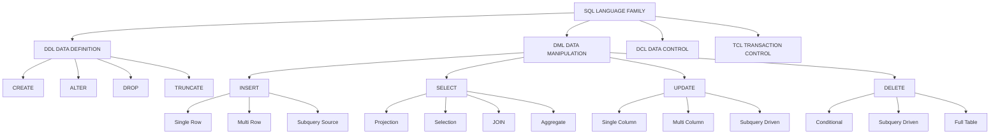
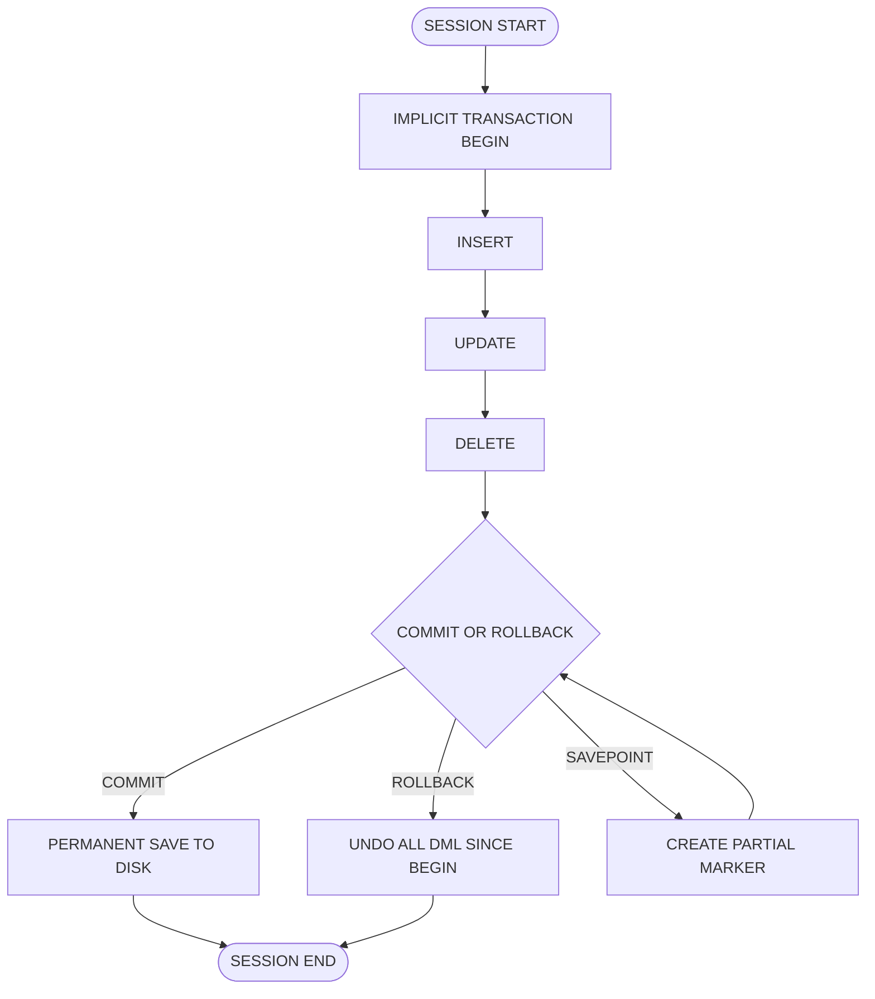
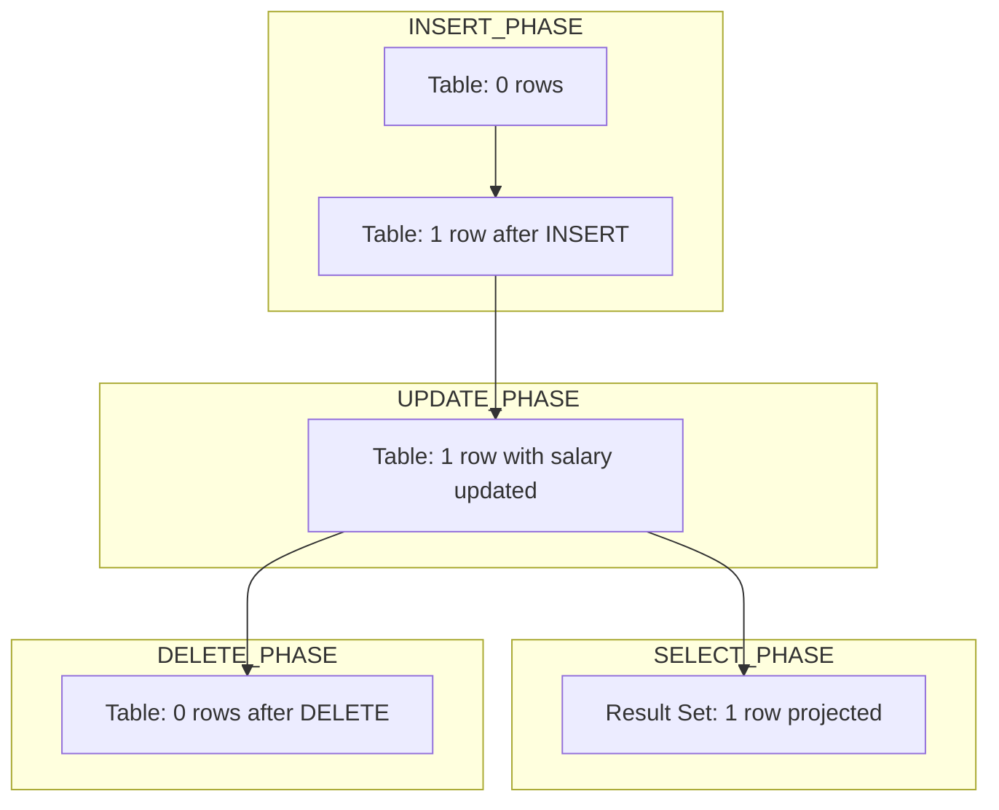

# DML Commands

<!-- SECTION_1_START -->
# DML Commands — Core Technical Definition & Intuitive Overview

> [!IMPORTANT]
> **KTU 2024 Scheme — Module 1 Focus**
> Course: **Database Management Systems Lab (PCCSL405)**
> Topic: **DML (Data Manipulation Language) Commands**
> Mapped CO: **CO1** | RBT Level: **Apply / Analyze**

## Formal Definition (KTU Syllabus Terminology)

**Data Manipulation Language (DML)** is the subset of SQL (Structured Query Language) used to **retrieve, insert, update, and delete data** stored in the relational tables of an RDBMS. Unlike DDL (Data Definition Language), DML operations act **only on the data/rows inside existing schema objects** — they do not alter the structure of the table itself.

The four canonical DML commands as per the KTU 2024 DBMS Lab syllabus are:

| Command | Purpose |
| :--- | :--- |
| `INSERT` | Adds new rows (tuples) into a table |
| `SELECT` | Retrieves rows from one or more tables |
| `UPDATE` | Modifies existing row values |
| `DELETE` | Removes rows from a table |

> [!NOTE]
> **KTU Board Definition (Verbatim Expectation):**
> *“DML statements are used to manage data within schema objects. They do not commit implicitly — transaction control is handled by `COMMIT`, `ROLLBACK`, and `SAVEPOINT`.”*

## Conceptual Analogy / Intuition

Imagine a **spreadsheet ledger** maintained by a bank cashier:

- The **table structure** (column names, data types) is the printed layout on the ledger — set by management (this is DDL).
- The **DML commands** are the cashier's daily actions: **writing a new deposit** (INSERT), **searching for a customer's balance** (SELECT), **correcting a wrong entry** (UPDATE), and **striking out a cancelled transaction** (DELETE).

> [!TIP]
> **Geometric Intuition:** A relational table can be visualised as a 2D grid on the X-Y plane. DML operations manipulate **points (tuples)** on this grid without ever moving the gridlines themselves. A `WHERE` clause is essentially a **filtering half-plane** that selects only the points lying on the correct side of the boundary.

## Standard SQL Data Types (KTU-Standard Defaults)

Most DML exercises in PCCSL405 use these canonical column types:

- `NUMBER(p, s)` — fixed/decimal numeric, e.g., salary, marks.
- `VARCHAR2(n)` — variable-length string, e.g., names.
- `DATE` — calendar date including time.
- `CHAR(n)` — fixed-length padded string (rarely used for new designs).
- `CLOB` / `BLOB` — large object types for big text/binary content.

> [!VISUALIZATION CONTROL]
> **Concept:** Visualising the `WHERE` clause as a half-plane filter over a table of points.
> **Desmos / GeoGebra Input:**
> * `Table points: (1, A), (2, B), (3, C), (4, D), (5, E)` representing row IDs vs. salary values.
> * `Filter line: y = 30000` representing a `WHERE salary > 30000` boundary.
> **Visual Description:** Only the points strictly above the horizontal line (rows 4 and 5) survive the filter. DML's `WHERE` works identically — it preserves only the tuples satisfying the predicate.

<!-- SECTION_1_END -->

<!-- SECTION_2_START -->
# Deep Theoretical Analysis & KTU High-Yield Cheat Sheet

## The Four DML Commands — Operational Logic Breakdown

### 1. `INSERT` — Adding New Rows

**Why it exists:** Every database must be populated before any query is meaningful. `INSERT` is the *only* standard DML command that **increases** the row count.

**How it works:** The DBMS engine performs a tuple-level write to the data segment, allocates a `ROWID` (Oracle) / physical address (PostgreSQL/MySQL), and validates the row against the column constraints (`NOT NULL`, `UNIQUE`, `CHECK`, `FOREIGN KEY`).

The three legal syntactic forms accepted in KTU exams:

1. **Implicit column list (positional):**
   ```sql
   INSERT INTO table_name VALUES (val1, val2, ...);
   ```
2. **Explicit column list (recommended, safer):**
   ```sql
   INSERT INTO table_name (col1, col2) VALUES (val1, val2);
   ```
3. **Multi-row insert (single statement):**
   ```sql
   INSERT INTO table_name (col1, col2) VALUES (r1c1, r1c2), (r2c1, r2c2);
   ```

### 2. `SELECT` — Retrieving Data

**Why it exists:** Raw data is useless unless it can be **projected**, **filtered**, **joined**, and **aggregated**. `SELECT` is the analytical heart of SQL.

**How it works:** The query passes through the SQL engine's pipeline:
$$\text{PARSE} \rightarrow \text{OPTIMIZE} \rightarrow \text{EXECUTE} \rightarrow \text{FETCH}$$

The logical evaluation order inside the engine is:
$$\text{FROM} \rightarrow \text{WHERE} \rightarrow \text{GROUP BY} \rightarrow \text{HAVING} \rightarrow \text{SELECT} \rightarrow \text{ORDER BY} \rightarrow \text{LIMIT}$$

> [!IMPORTANT]
> **KTU Pitfall:** The `SELECT` keyword appears *first* in the syntax, but the `FROM` clause is evaluated *first* by the engine. Examiners frequently test this conceptual difference.

### 3. `UPDATE` — Modifying Existing Rows

**Why it exists:** Real-world data is dynamic — prices change, statuses flip, balances update. `UPDATE` mutates column values **in place** without creating a new physical row.

**How it works:** A `WHERE` clause decides *which* rows get mutated. A missing `WHERE` updates **every row** in the table — this is the most catastrophic mistake a beginner can make.

### 4. `DELETE` — Removing Rows

**Why it exists:** Obsolete, erroneous, or expired data must be removable. `DELETE` is row-level and respects the `WHERE` filter.

**How it works:** The DBMS marks rows for deletion; the physical space is reclaimed only on `COMMIT` (or by `TRUNCATE`, which is a DDL command and structurally different).

> [!WARNING]
> **`DELETE` vs `TRUNCATE` vs `DROP`:**
> - `DELETE FROM table;` — DML, row-level, can be rolled back, fires triggers.
> - `TRUNCATE TABLE table;` — DDL, deallocates the entire segment, **cannot** be rolled back in most engines.
> - `DROP TABLE table;` — DDL, removes the table definition itself, **cannot** be rolled back.

## KTU High-Yield Cheat Sheet (Formula / Syntax Table)

| Construct | Syntax | KTU Use-Case |
| :--- | :--- | :--- |
| Insert single row | `INSERT INTO t(c1,c2) VALUES (v1,v2);` | Populate seed data |
| Insert from another table | `INSERT INTO t SELECT * FROM other WHERE cond;` | Archival / migration |
| Select all columns | `SELECT * FROM t;` | Quick inspection |
| Select with filter | `SELECT c1 FROM t WHERE c2 > 100;` | Conditional retrieval |
| Select with pattern | `SELECT * FROM t WHERE name LIKE 'A%';` | Search by prefix |
| Aggregate query | `SELECT dept, COUNT(*) FROM t GROUP BY dept;` | Department-wise counts |
| Filtered aggregate | `SELECT dept FROM t GROUP BY dept HAVING COUNT(*) > 5;` | Department with >5 staff |
| Order results | `SELECT * FROM t ORDER BY salary DESC;` | Highest first |
| Update specific rows | `UPDATE t SET col = v WHERE cond;` | Salary revision |
| Update multiple columns | `UPDATE t SET c1=v1, c2=v2 WHERE cond;` | Combined edits |
| Delete specific rows | `DELETE FROM t WHERE cond;` | Remove obsolete |
| Safe delete (all) | `DELETE FROM t;` (DML, rollback-able) | Lab cleanup |
| Transaction commit | `COMMIT;` | End transaction |
| Transaction rollback | `ROLLBACK;` | Undo changes |
| Savepoint | `SAVEPOINT sp1;` | Partial rollback point |

## Real-World Engineering Utility

DML commands form the **transactional backbone** of every production system:

- **E-commerce:** `INSERT` for new orders, `SELECT` for product listings, `UPDATE` for inventory deduction, `DELETE` for cart abandonment cleanup.
- **Banking:** `UPDATE` on balance during a fund transfer — must be **ACID** compliant.
- **Healthcare:** `SELECT` with complex `JOIN`s pulls patient history across normalised tables.
- **Social Networks:** `INSERT` for new posts, `DELETE` for content moderation removal, `UPDATE` for edit history.

<!-- SECTION_2_END -->

<!-- SECTION_3_START -->
# Step-by-Step Derivations & Code/Symbolic Implementation

## Worked-Out Lab Example — The KTU Classic "Employee" Schema

Throughout the KTU PCCSL405 lab, the following canonical schema is used. We will derive every DML operation against it.

**Schema Definition (DDL — assumed pre-existing):**

```sql
CREATE TABLE department (
    dept_id   NUMBER(4)       PRIMARY KEY,
    dept_name VARCHAR2(30)    NOT NULL UNIQUE,
    location  VARCHAR2(20)
);

CREATE TABLE employee (
    emp_id     NUMBER(5)       PRIMARY KEY,
    emp_name   VARCHAR2(30)    NOT NULL,
    salary     NUMBER(10,2)    CHECK (salary > 0),
    hire_date  DATE            DEFAULT SYSDATE,
    dept_id    NUMBER(4),
    CONSTRAINT fk_emp_dept
        FOREIGN KEY (dept_id) REFERENCES department(dept_id)
);
```

---

## Derivation 1 — `INSERT` Operations

### Step 1.1: Single-row insert with explicit columns

```sql
INSERT INTO department (dept_id, dept_name, location)
VALUES (10, 'COMPUTER SCIENCE', 'BLOCK-A');
```

**Evaluation trace:**

1. Engine validates `dept_id = 10` against `PRIMARY KEY` constraint — unique, accepted.
2. Engine validates `dept_name = 'COMPUTER SCIENCE'` against `NOT NULL` and `UNIQUE` — both pass.
3. `location` is nullable; the value `'BLOCK-A'` is stored.
4. Row is written to the data segment; one tuple appended to the table.
5. Without `COMMIT`, the change is visible only to the current session.

### Step 1.2: Multi-row insert

```sql
INSERT INTO department (dept_id, dept_name, location) VALUES
    (20, 'MECHANICAL',         'BLOCK-B'),
    (30, 'CIVIL',              'BLOCK-C'),
    (40, 'ELECTRICAL',         'BLOCK-D'),
    (50, 'ELECTRONICS',        'BLOCK-E');
```

**Evaluation:** The engine performs a single parse, one optimised execution plan, and a single redo-log flush. This is more efficient than five individual inserts.

### Step 1.3: Insert with omitted column (uses DEFAULT)

```sql
INSERT INTO employee (emp_id, emp_name, salary, dept_id)
VALUES (1001, 'ARJUN RAJ', 45000.00, 10);
```

Because `hire_date` is omitted and has a `DEFAULT SYSDATE`, the engine substitutes today's date automatically.

### Step 1.4: Insert from a subquery (INSERT ... SELECT)

```sql
INSERT INTO employee_archive (emp_id, emp_name, salary)
SELECT emp_id, emp_name, salary
FROM   employee
WHERE  hire_date < TO_DATE('2020-01-01', 'YYYY-MM-DD');
```

This is **archival migration** — rows are read from one table and inserted into another using a single statement.

---

## Derivation 2 — `SELECT` Operations

### Step 2.1: Full table scan

```sql
SELECT * FROM employee;
```

**Logical execution:**

$$\text{FROM employee} \rightarrow \text{All rows} \rightarrow \text{All columns} \rightarrow \text{Result set}$$

### Step 2.2: Projection (selected columns only)

```sql
SELECT emp_id, emp_name, salary FROM employee;
```

### Step 2.3: Selection (WHERE filter)

```sql
SELECT emp_name, salary
FROM   employee
WHERE  salary BETWEEN 30000 AND 60000
  AND  dept_id = 10;
```

**Boolean evaluation per row:**

$$R_i \in \text{Result} \iff (30000 \le \text{salary}_i \le 60000) \land (\text{dept\_id}_i = 10)$$

### Step 2.4: Pattern matching with LIKE

```sql
SELECT emp_id, emp_name
FROM   employee
WHERE  emp_name LIKE 'A%';
```

The `%` wildcard matches **any sequence of zero or more characters**. So 'A%' matches 'Arjun', 'Anita', 'A' itself, but not 'Bala'.

### Step 2.5: Sorting and limiting

```sql
SELECT emp_name, salary
FROM   employee
ORDER BY salary DESC
FETCH FIRST 5 ROWS ONLY;
```

The `FETCH FIRST n ROWS ONLY` clause is the **ANSI-SQL standard** equivalent of Oracle's older `ROWNUM <= 5` and MySQL's `LIMIT 5`.

### Step 2.6: Aggregation with GROUP BY and HAVING

```sql
SELECT dept_id, COUNT(*) AS emp_count, AVG(salary) AS avg_sal
FROM   employee
GROUP BY dept_id
HAVING AVG(salary) > 40000
ORDER BY avg_sal DESC;
```

**Logical pipeline (executed in this order):**

1. `FROM employee` — read all rows.
2. `GROUP BY dept_id` — partition rows into groups.
3. `COUNT(*)` and `AVG(salary)` — compute per-group aggregates.
4. `HAVING AVG(salary) > 40000` — discard groups whose average is too low.
5. `SELECT` — project the final columns with aliases.
6. `ORDER BY avg_sal DESC` — sort the output.

> [!IMPORTANT]
> **`WHERE` vs `HAVING`:** `WHERE` filters **rows before grouping**. `HAVING` filters **groups after aggregation**. Putting an aggregate inside `WHERE` is a syntax error.

---

## Derivation 3 — `UPDATE` Operations

### Step 3.1: Conditional single-column update

```sql
UPDATE employee
SET    salary = salary * 1.10
WHERE  dept_id = 10;
```

**Per-row evaluation:**

$$\text{salary}_{\text{new}} = \text{salary}_{\text{old}} \times 1.10 \quad \text{if} \quad \text{dept\_id} = 10$$

This is a **10% raise** for the Computer Science department only. All other rows are untouched.

### Step 3.2: Multi-column update

```sql
UPDATE employee
SET    salary = 50000,
       dept_id = 20
WHERE  emp_id = 1001;
```

### Step 3.3: Update with a subquery (cross-table update)

```sql
UPDATE employee
SET    salary = (
           SELECT AVG(salary)
           FROM   employee
           WHERE  dept_id = employee.dept_id
       )
WHERE  emp_id = 1005;
```

**Caution:** The correlated subquery references `employee.dept_id` to fetch the department average.

### Step 3.4: Update all rows (catastrophic if unintended)

```sql
UPDATE employee SET salary = 0;
-- No WHERE clause → EVERY employee's salary becomes 0.
```

> [!WARNING]
> **Always run a `SELECT` first** with the same `WHERE` clause to preview affected rows:
> ```sql
> SELECT COUNT(*) FROM employee WHERE dept_id = 10;
> -- If this returns N rows, the UPDATE will affect N rows.
> ```

---

## Derivation 4 — `DELETE` Operations

### Step 4.1: Conditional row deletion

```sql
DELETE FROM employee
WHERE  hire_date < TO_DATE('2015-01-01', 'YYYY-MM-DD');
```

### Step 4.2: Deletion with subquery (referential check)

```sql
DELETE FROM employee
WHERE  dept_id IN (
           SELECT dept_id FROM department WHERE location = 'BLOCK-X'
       );
```

### Step 4.3: Complete table wipe (DML-style)

```sql
DELETE FROM employee;
COMMIT;
```

This is a DML wipe: slow on large tables (one row at a time), generates redo logs, and is rollback-able before `COMMIT`.

---

## Derivation 5 — Transaction Control (DML Companion)

DML operations are **transactional**. The three terminating commands are:

```sql
COMMIT;          -- permanently save all DML changes in this transaction
ROLLBACK;        -- discard all DML changes since the last COMMIT
SAVEPOINT sp1;   -- create a partial rollback marker
ROLLBACK TO sp1; -- undo back to sp1, keeping changes after it intact
```

**Canonical transaction pattern:**

```sql
UPDATE employee SET salary = 60000 WHERE emp_id = 1001;
SAVEPOINT before_risk;
DELETE FROM employee WHERE dept_id = 999;  -- might violate FK
-- If the DELETE fails or was a mistake:
ROLLBACK TO before_risk;
-- The UPDATE remains; the DELETE is undone.
COMMIT;
```

---

## Full Python Helper — DML Verifier (Lab Utility)

This script is useful for KTU lab viva — it parses a SQL DML statement and warns about missing `WHERE` clauses.

```python
import re
import sys
from typing import List, Tuple


class DMLVerifier:
    """
    Static analyser for SQL DML statements.
    Detects dangerous UPDATE/DELETE statements that lack a WHERE clause.
    """

    DML_KEYWORDS: Tuple[str, ...] = ("INSERT", "UPDATE", "DELETE", "SELECT", "MERGE")

    def __init__(self, statement: str) -> None:
        self.statement: str = statement.strip().rstrip(";").strip()
        self.tokens: List[str] = [t.upper() for t in self.statement.split()]

    def command_type(self) -> str:
        if not self.tokens:
            raise ValueError("Empty SQL statement provided.")
        head = self.tokens[0]
        if head not in self.DML_KEYWORDS:
            raise ValueError(f"Statement does not start with a DML keyword: {head}")
        return head

    def has_where_clause(self) -> bool:
        return "WHERE" in self.tokens

    def is_dangerous(self) -> bool:
        """
        Returns True if the statement is an UPDATE/DELETE/MERGE
        that affects ALL rows (no WHERE clause).
        """
        cmd = self.command_type()
        if cmd in ("UPDATE", "DELETE", "MERGE"):
            return not self.has_where_clause()
        return False

    def report(self) -> str:
        try:
            cmd = self.command_type()
        except ValueError as exc:
            return f"[ERROR] {exc}"

        if self.is_dangerous():
            return (
                f"[DANGER] {cmd} statement has NO WHERE clause. "
                f"It will affect EVERY row in the target table."
            )
        if cmd == "INSERT" and "VALUES" not in self.tokens and "SELECT" not in self.tokens:
            return f"[WARNING] {cmd} statement appears malformed (no VALUES/SELECT)."
        return f"[OK] {cmd} statement parsed successfully."


def main() -> int:
    samples: List[str] = [
        "UPDATE employee SET salary = 0;",
        "DELETE FROM employee;",
        "UPDATE employee SET salary = 5000 WHERE emp_id = 1001;",
        "SELECT * FROM employee WHERE dept_id = 10;",
    ]
    for sql in samples:
        verifier = DMLVerifier(sql)
        print(f"SQL : {sql}")
        print(f"     -> {verifier.report()}")
        print("-" * 60)
    return 0


if __name__ == "__main__":
    sys.exit(main())
```

**Sample execution output:**

```
SQL : UPDATE employee SET salary = 0;
     -> [DANGER] UPDATE statement has NO WHERE clause. It will affect EVERY row in the target table.
------------------------------------------------------------
SQL : DELETE FROM employee;
     -> [DANGER] DELETE statement has NO WHERE clause. It will affect EVERY row in the target table.
------------------------------------------------------------
SQL : UPDATE employee SET salary = 5000 WHERE emp_id = 1001;
     -> [OK] UPDATE statement parsed successfully.
------------------------------------------------------------
SQL : SELECT * FROM employee WHERE dept_id = 10;
     -> [OK] SELECT statement parsed successfully.
------------------------------------------------------------
```

<!-- SECTION_3_END -->

<!-- SECTION_4_START -->
# Structural Diagrams & Schematics

## Figure 1 — DML Command Classification Topology



## Figure 2 — SELECT Statement Logical Pipeline


## Figure 3 — Transaction Lifecycle with DML



## Figure 4 — DML Operation Effect on Table Cardinality



> [!NOTE]
> **Diagrammatic Insight:** Only `INSERT` increases cardinality, only `DELETE` decreases it, `UPDATE` preserves it, and `SELECT` produces a **separate result set** that does not modify the underlying table.

<!-- SECTION_4_END -->

<!-- SECTION_5_START -->
# KTU 2024 Scheme Examination Question Bank & Topic Recap

## Part A — Short Answer Questions (3 Marks Each)

### Question A1
`[KTU University Exam - July 2024]` — **CO1 / Remember**

**Q: Differentiate between DDL and DML commands. Give one example of each.**

**Model Answer (3 Marks):**

- **DDL (Data Definition Language)** defines or alters the **structure** of database objects such as tables, views, and indexes. DDL statements are **auto-committed** in most RDBMS — the changes are permanent and cannot be rolled back. Example: `CREATE TABLE student (roll_no NUMBER PRIMARY KEY, name VARCHAR2(30));`
- **DML (Data Manipulation Language)** manipulates the **data** stored inside the tables. DML statements are **transactional** — they can be committed or rolled back. Example: `UPDATE student SET name = 'ARJUN' WHERE roll_no = 101;`

> **[Valuation Key: Definition of DDL: 1 Mark | Definition of DML: 1 Mark | One example each: 1 Mark]**

---

### Question A2
`[KTU University Exam - Dec 2023]` — **CO1 / Understand**

**Q: What is the difference between the `WHERE` and `HAVING` clauses in a SQL `SELECT` statement?**

**Model Answer (3 Marks):**

The `WHERE` clause filters **individual rows** *before* any grouping or aggregation takes place, and it **cannot contain aggregate functions** like `COUNT()` or `AVG()`. The `HAVING` clause filters **groups of rows** *after* the `GROUP BY` operation, and it **can contain aggregate functions**.

Example:
```sql
SELECT dept_id, COUNT(*) FROM employee
WHERE salary > 20000
GROUP BY dept_id
HAVING COUNT(*) > 3;
```

Here `WHERE` removes low-salary employees first, then `HAVING` removes departments with three or fewer remaining employees.

> **[Valuation Key: WHERE purpose: 1 Mark | HAVING purpose: 1 Mark | Aggregate distinction: 1 Mark]**

---

## Part B — Long Answer Questions (14 Marks, with Internal Choice)

### Question B-A
`[KTU University Exam - July 2024]` — **CO1 / Apply + Analyze**

**Consider the following two tables for a university database:**

**STUDENT** (`roll_no`, `name`, `dob`, `dept_id`, `cgpa`)
**DEPARTMENT** (`dept_id`, `dept_name`, `hod_name`)

**(a)** Write SQL DML statements to perform the following operations: **(7 Marks)**
1. Insert a new student with roll number 101, name 'ARJUN RAJ', dob '2003-05-12', dept_id 2, cgpa 8.7.
2. Increase the CGPA of all students in department 2 by 0.2.
3. Delete all students whose CGPA is below 5.0.
4. Display the name and CGPA of all students, sorted by CGPA in descending order.

**(b)** Write a single SQL query to display, for each department, the department name, the number of students, and the average CGPA. Show only those departments where the average CGPA exceeds 8.0. **(7 Marks)**

---

**Model Solution:**

### Part (a) — 7 Marks

**1. Insert a new student:** `[2 Marks]`
```sql
INSERT INTO student (roll_no, name, dob, dept_id, cgpa)
VALUES (101, 'ARJUN RAJ', TO_DATE('2003-05-12', 'YYYY-MM-DD'), 2, 8.7);
```
*Valuation: Correct INSERT syntax with column list: 1 Mark | Correct values and date format: 1 Mark*

**2. Update CGPA for department 2:** `[2 Marks]`
```sql
UPDATE student
SET    cgpa = cgpa + 0.2
WHERE  dept_id = 2;
```
*Valuation: Correct SET clause: 1 Mark | Correct WHERE filter: 1 Mark*

**3. Delete low CGPA students:** `[1 Mark]`
```sql
DELETE FROM student
WHERE  cgpa < 5.0;
```

**4. Display sorted by CGPA:** `[2 Marks]`
```sql
SELECT name, cgpa
FROM   student
ORDER BY cgpa DESC;
```

### Part (b) — 7 Marks

```sql
SELECT d.dept_name,
       COUNT(s.roll_no)  AS student_count,
       AVG(s.cgpa)       AS average_cgpa
FROM   department d
LEFT JOIN student s ON d.dept_id = s.dept_id
GROUP BY d.dept_name
HAVING AVG(s.cgpa) > 8.0
ORDER BY average_cgpa DESC;
```

*Valuation Key:*
- *Correct JOIN between student and department: 2 Marks*
- *Correct GROUP BY with aggregate functions: 2 Marks*
- *Correct HAVING clause using AVG: 2 Marks*
- *Proper aliasing and ORDER BY: 1 Mark*

---

### Question B-B (Internal Choice Alternative)
`[KTU University Exam - Dec 2023]` — **CO1 / Apply + Analyze**

**Consider the tables:**

**BOOK** (`book_id`, `title`, `author`, `price`, `pub_year`)
**BORROW** (`borrow_id`, `roll_no`, `book_id`, `borrow_date`)

**(a)** Write DML statements for the following: **(7 Marks)**
1. Insert two new books in a single statement.
2. Increase the price of all books published before 2015 by 15%.
3. Delete all borrow records where the borrow date is more than 2 years old.
4. Display the title and author of all books whose title starts with the letter 'D'.

**(b)** Write a SQL query to find, for each author, the total number of books and the maximum price. Show only those authors with more than 2 books, sorted by maximum price descending. **(7 Marks)**

---

**Model Solution:**

### Part (a) — 7 Marks

**1. Multi-row insert:** `[2 Marks]`
```sql
INSERT INTO book (book_id, title, author, price, pub_year) VALUES
    (501, 'DATABASE SYSTEMS', 'ELMASRI', 550.00, 2020),
    (502, 'OPERATING SYSTEMS', 'SILBERSCHATZ', 600.00, 2018);
```

**2. 15% price hike for pre-2015 books:** `[2 Marks]`
```sql
UPDATE book
SET    price = price * 1.15
WHERE  pub_year < 2015;
```

**3. Delete old borrow records:** `[1 Mark]`
```sql
DELETE FROM borrow
WHERE  borrow_date < ADD_MONTHS(SYSDATE, -24);
```

**4. Pattern match for title starting with 'D':** `[2 Marks]`
```sql
SELECT title, author
FROM   book
WHERE  title LIKE 'D%';
```

### Part (b) — 7 Marks

```sql
SELECT author,
       COUNT(book_id) AS total_books,
       MAX(price)     AS max_price
FROM   book
GROUP BY author
HAVING COUNT(book_id) > 2
ORDER BY max_price DESC;
```

*Valuation Key:*
- *Correct use of COUNT and MAX aggregates: 2 Marks*
- *Correct GROUP BY author: 2 Marks*
- *Correct HAVING COUNT > 2: 2 Marks*
- *Correct ORDER BY: 1 Mark*

---

> [!WARNING]
> **KTU Examiner's Valuation Pitfalls — Where Students Lose Marks**
> 1. **Forgetting `COMMIT` after DML in lab exams** — the row is visible only to the session. Always end with `COMMIT;`.
> 2. **Using `WHERE` with aggregate functions** — `WHERE AVG(salary) > 50000` is a syntax error. Use `HAVING`.
> 3. **Confusing `DELETE` (DML) with `DROP` (DDL)** — `DELETE` removes rows, `DROP` removes the entire table.
> 4. **Missing `WHERE` clause on `UPDATE`/`DELETE`** — updates or deletes every row. Always preview with a `SELECT` first.
> 5. **Wrong date format** — use `TO_DATE('YYYY-MM-DD', 'YYYY-MM-DD')` in Oracle; do not pass a raw string.
> 6. **`ORDER BY` referencing an alias that is not in `SELECT`** — only valid in some engines; safest to repeat the expression.
> 7. **Using `=` with `NULL`** — `WHERE salary = NULL` returns no rows. Use `IS NULL` instead.

---

## Topic Recap & Important Things to Remember

> [!TIP]
> **Rapid-Revision Checklist for DML Commands (Module 1)**

- **DML stands for Data Manipulation Language** — it manipulates data, not structure.
- **The four canonical DML commands are `INSERT`, `SELECT`, `UPDATE`, `DELETE`.**
- **DML is transactional** — wrap operations with `COMMIT` / `ROLLBACK` / `SAVEPOINT`.
- **`INSERT INTO t (cols) VALUES (vals);`** is the safest form — always specify the column list.
- **Multi-row insert** uses comma-separated `VALUES` tuples within one statement.
- **`INSERT ... SELECT`** copies rows from one table into another.
- **`SELECT` logical evaluation order:** `FROM` → `WHERE` → `GROUP BY` → `HAVING` → `SELECT` → `ORDER BY` → `FETCH`.
- **`WHERE` filters rows, `HAVING` filters groups** — never mix them.
- **`LIKE` wildcards:** `%` matches any sequence, `_` matches exactly one character.
- **`ORDER BY` default is ascending;** use `DESC` for descending.
- **`FETCH FIRST n ROWS ONLY`** is the ANSI-standard way to limit results.
- **`UPDATE` without `WHERE` modifies every row** — preview with `SELECT` first.
- **`UPDATE` with a subquery** can reference the same table using a correlated subquery.
- **`DELETE` is row-level, transactional, and respects `WHERE`.**
- **`TRUNCATE` is DDL**, not DML — it deallocates the entire segment and is faster but not rollback-able.
- **`DROP` is DDL** — it removes the table definition entirely.
- **ACID properties** (Atomicity, Consistency, Isolation, Durability) govern DML transaction safety.
- **In Oracle:** changes are visible only inside the session until `COMMIT` is executed.
- **Pattern matching:** `LIKE 'A%'` for prefix, `LIKE '%son'` for suffix, `LIKE '%er%'` for substring.
- **NULL handling:** use `IS NULL` / `IS NOT NULL`; never `= NULL`.
- **KTU lab standard:** always end scripts with `COMMIT;` followed by a final `SELECT` verification.

<!-- SECTION_5_END -->
