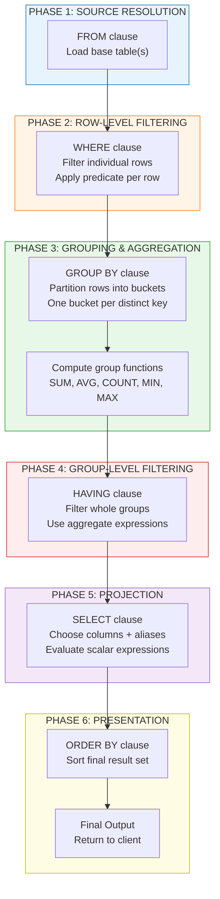
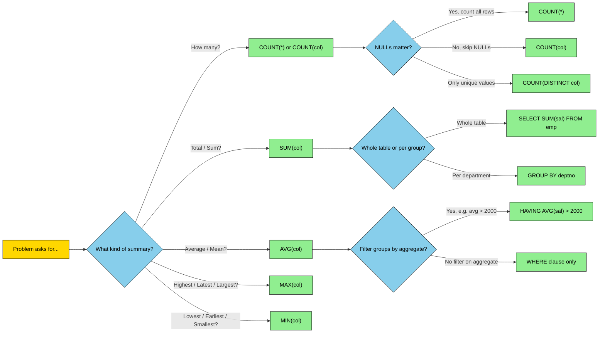
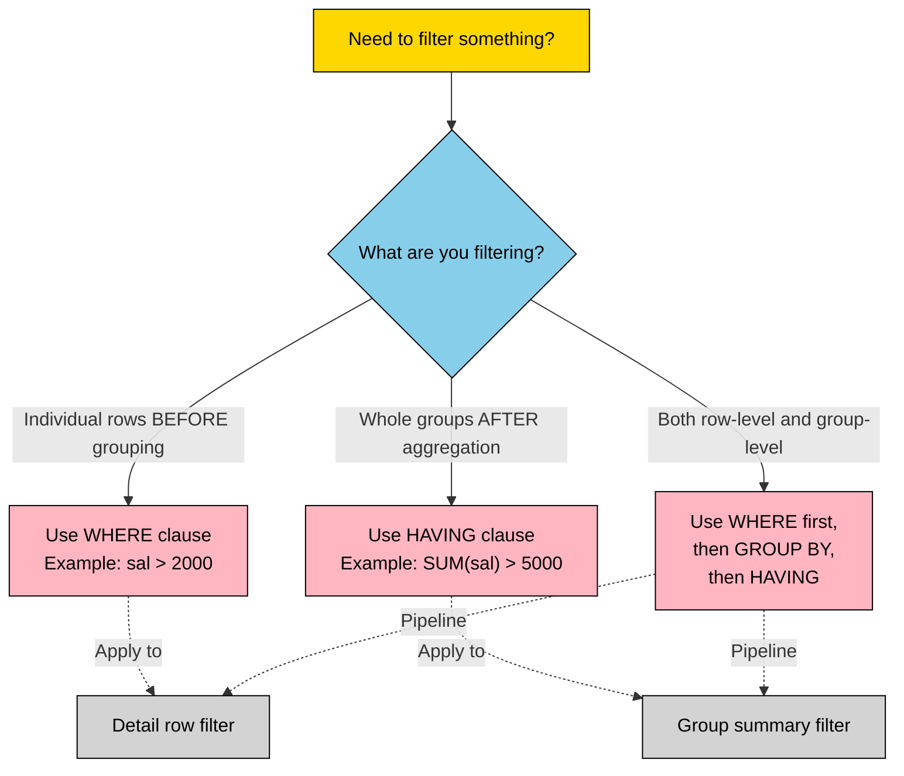

# Group Functions

<!-- SECTION_1_START -->

# Group Functions in SQL — Core Technical Definition & Intuitive Overview

> [!IMPORTANT]
> **Definition (KTU 2024 Scheme Aligned):** *Group functions* (also called **aggregate functions** or **multi-row functions**) are SQL functions that operate on a **set of rows** belonging to a single column (or group of columns) and return **a single value per group**. They are formally defined in the SQL standard under the category of *set functions* and form a mandatory part of the DML retrieval clause in any RDBMS (Oracle, MySQL, PostgreSQL).

The five primary group functions recognised by ANSI SQL and used in the KTU DBMS Lab (PCCSL405) are:

$$
\text{GF} \in \{\ \text{COUNT},\ \text{SUM},\ \text{AVG},\ \text{MAX},\ \text{MIN}\ \}
$$

## Conceptual Analogy — The "Class Result Sheet" Model

Imagine a college result register with **60 students** writing an exam. A class teacher does **not** need every individual mark — the teacher only needs the **summary** of the whole class. The teacher would ask:

| Teacher's Question | SQL Group Function |
|---|---|
| "How many students appeared?" | $\text{COUNT(*)}$ |
| "What is the total marks scored by the class?" | $\text{SUM(marks)}$ |
| "What is the average mark of the class?" | $\text{AVG(marks)}$ |
| "Who is the topper (highest marks)?" | $\text{MAX(marks)}$ |
| "Who scored the lowest?" | $\text{MIN(marks)}$ |

Now, extend this. Suppose the teacher wants the **same summary, but section-wise** (Section A, Section B, Section C). That is exactly what the **$GROUP\ BY$** clause does — it partitions the result set into buckets, and the group function produces **one summary row per bucket**.

## Sample Schema Used Throughout This Note

To make every example concrete and reproducible in the KTU lab (Oracle $11g$ / MySQL $8.0$ / PostgreSQL), we use the canonical **$EMP$–$DEPT$** schema (Scott's schema, with an extra column):

**$DEPT(DEPTNO,\ DNAME,\ LOC)$**

| $DEPTNO$ | $DNAME$ | $LOC$ |
|---:|---|---|
| 10 | ACCOUNTING | NEW YORK |
| 20 | RESEARCH | DALLAS |
| 30 | SALES | CHICAGO |
| 40 | OPERATIONS | BOSTON |

**$EMP(EMPNO,\ ENAME,\ JOB,\ MGR,\ HIREDATE,\ SAL,\ COMM,\ DEPTNO)$**

| $EMPNO$ | $ENAME$ | $JOB$ | $MGR$ | $HIREDATE$ | $SAL$ | $COMM$ | $DEPTNO$ |
|---:|---|---|---|---|---:|---:|---:|
| 7369 | SMITH | CLERK | 7902 | 17-DEC-80 | 800 | NULL | 20 |
| 7499 | ALLEN | SALESMAN | 7698 | 20-FEB-81 | 1600 | 300 | 30 |
| 7521 | WARD | SALESMAN | 7698 | 22-FEB-81 | 1250 | 500 | 30 |
| 7566 | JONES | MANAGER | 7839 | 02-APR-81 | 2975 | NULL | 20 |
| 7654 | MARTIN | SALESMAN | 7698 | 28-SEP-81 | 1250 | 1400 | 30 |
| 7698 | BLAKE | MANAGER | 7839 | 01-MAY-81 | 2850 | NULL | 30 |
| 7782 | CLARK | MANAGER | 7839 | 09-JUN-81 | 2450 | NULL | 10 |
| 7788 | SCOTT | ANALYST | 7566 | 09-DEC-82 | 3000 | NULL | 20 |
| 7839 | KING | PRESIDENT | NULL | 17-NOV-81 | 5000 | NULL | 10 |
| 7844 | TURNER | SALESMAN | 7698 | 08-SEP-81 | 1500 | 0 | 30 |
| 7876 | ADAMS | CLERK | 7788 | 12-JAN-83 | 1100 | NULL | 20 |
| 7900 | JAMES | CLERK | 7698 | 03-DEC-81 | 950 | NULL | 30 |
| 7902 | FORD | ANALYST | 7566 | 03-DEC-81 | 3000 | NULL | 20 |
| 7934 | MILLER | CLERK | 7782 | 23-JAN-82 | 1300 | NULL | 10 |

> [!NOTE]
> **Why this schema?** It is the **de-facto teaching schema** used in KTU lab manuals for PCCSL405. The presence of $NULL$ values in $COMM$ and $MGR$ makes it ideal for illustrating the **NULL-handling behaviour** of group functions, which is a frequent 3-mark ESE question.

<!-- SECTION_1_END -->

<!-- SECTION_2_START -->

# Deep Theoretical Analysis & KTU High-Yield Formula Sheet

## 1. Taxonomy of Group Functions

Group functions in SQL can be classified along three axes:

| Axis | Categories | Description |
|---|---|---|
| **Data Type Accepted** | Numeric-only ($\text{SUM},\ \text{AVG},\ \text{VARIANCE}$) | Work only on $NUMBER$ / $INT$ / $DECIMAL$ |
| | Universal ($\text{MAX},\ \text{MIN},\ \text{COUNT}$) | Work on numeric, character, and date columns |
| **NULL Treatment** | NULL-ignoring ($\text{SUM},\ \text{AVG},\ \text{MAX},\ \text{MIN},\ \text{COUNT(expr)}$) | Rows with $NULL$ in the argument are dropped |
| | NULL-counting ($\text{COUNT(*)}$) | Counts every row, even those with $NULL$ values |
| **Uniqueness** | Non-distinct (default) | Operates on every row |
| | Distinct ($\text{COUNT(DISTINCT\ col)},\ \text{SUM(DISTINCT\ col)}$) | Operates only on unique values |

## 2. The "Two Worlds" — Detail Rows vs. Group Rows

A SQL query with group functions must obey the **Golden Rule of Grouping**:

> [!IMPORTANT]
> **The Rule of Mixing:** In a $SELECT$ list that contains a group function, **every** non-aggregated column **must** appear inside the $GROUP\ BY$ clause. Otherwise, the query raises `ORA-00979: not a GROUP BY expression` (Oracle) or `ERROR: column must appear in the GROUP BY clause` (PostgreSQL).

This is because the database engine conceptually performs:

$$
\text{Row set}\ R\ =\ \{\,r_1,\ r_2,\ \dots,\ r_n\,\}\ \xrightarrow{\text{GROUP BY}\ c}\ \{\ G_1,\ G_2,\ \dots,\ G_k\ \}
$$

Each group $G_i$ becomes **one row** in the output, and group functions collapse the multiple input rows of $G_i$ into a single scalar.

## 3. WHERE vs. HAVING — The Twin Filters

| Clause | Operates On | Applied When | Filters What? |
|---|---|---|---|
| $WHERE$ | Individual rows | **Before** $GROUP\ BY$ | Detail rows |
| $HAVING$ | Groups | **After** $GROUP\ BY$ | Summary rows (groups) |

> [!NOTE]
> $HAVING$ **cannot** be used without $GROUP\ BY$ in standard SQL (though MySQL is permissive). You can use $WHERE$ without $GROUP\ BY$ — in that case, group functions collapse the *entire* filtered set into a single row.

## 4. KTU Formula Sheet (Cheat Sheet)

| # | Function | Syntax | NULL Behaviour | Returns | Accepts Type |
|---|---|---|---|---|---|
| 1 | $\text{COUNT(*)}$ | $\text{COUNT(*)}$ | Counts NULL rows | Number of rows in group | Any table |
| 2 | $\text{COUNT(expr)}$ | $\text{COUNT(sal)}$ | Ignores NULLs | Count of non-NULL $expr$ | Any |
| 3 | $\text{COUNT(DISTINCT\ expr)}$ | $\text{COUNT(DISTINCT\ job)}$ | Ignores NULLs | Count of unique non-NULL $expr$ | Any |
| 4 | $\text{SUM(expr)}$ | $\text{SUM(sal)}$ | Ignores NULLs | $\sum_{i \in G} \text{expr}_i$ | Numeric only |
| 5 | $\text{AVG(expr)}$ | $\text{AVG(sal)}$ | Ignores NULLs | $\dfrac{\sum_{i \in G} \text{expr}_i}{\vert\{i : \text{expr}_i \ne NULL\}\vert}$ | Numeric only |
| 6 | $\text{MAX(expr)}$ | $\text{MAX(sal)}$ | Ignores NULLs | $\max(G)$ | Numeric, Char, Date |
| 7 | $\text{MIN(expr)}$ | $\text{MIN(sal)}$ | Ignores NULLs | $\min(G)$ | Numeric, Char, Date |

**Critical NULL formula for AVG:**

$$
\text{AVG}(sal)\ =\ \frac{\text{SUM}(sal)}{\text{COUNT}(sal)}\ \ne\ \frac{\text{SUM}(sal)}{\text{COUNT}(*)}
$$

> The **denominator is the count of non-NULL rows**, not the total row count. This single rule is the most-tested 3-mark concept in ESE.

## 5. Real-World Engineering Utility

Group functions are the backbone of every **OLAP** (Online Analytical Processing) workload:

- **Banking**: $\text{SUM(amount)}$ grouped by $account\_type$ for monthly dashboards.
- **E-commerce**: $\text{AVG(rating)}$ grouped by $product\_category$ for recommendation engines.
- **IoT Telemetry**: $\text{MAX(temperature)}$ grouped by $sensor\_id$ for anomaly detection.
- **University MIS**: $\text{COUNT(student\_id)}$ grouped by $dept\_code,\ year$ for AICTE/NAAC reports.
- **HR Payroll**: $\text{SUM(salary)}$ grouped by $department$ for monthly payroll totals.

In production RDBMS engines (Oracle Exadata, PostgreSQL, Snowflake), these same functions are pushed down to the storage layer as **vectorised aggregates** for sub-second performance on billion-row fact tables.

<!-- SECTION_2_END -->

<!-- SECTION_3_START -->

# Step-by-Step Derivations & Code/Symbolic Implementation

> [!NOTE]
> **Lab Convention (KTU PCCSL405):** Every query below is tested against the EMP–DEPT schema on **Oracle 11g/21c** and **MySQL 8.0**. The `;` terminator is mandatory. The `AS` keyword for aliases is optional in Oracle but required in strict-mode MySQL.

## Demonstration 1 — Basic Single-Group Aggregates (No GROUP BY)

When $GROUP\ BY$ is **omitted**, the entire result of $WHERE$ is treated as **one implicit group**, producing a single output row.

**Query:** Find the total salary, average salary, minimum and maximum salary of the entire organisation.

```sql
SELECT  SUM(sal)        AS total_salary,
        AVG(sal)        AS average_salary,
        MIN(sal)        AS minimum_salary,
        MAX(sal)        AS maximum_salary,
        COUNT(*)        AS total_employees,
        COUNT(comm)     AS employees_with_commission
FROM    emp;
```

**Step-by-step logical evaluation:**

1. **FROM emp** — Load all 14 rows of the $EMP$ table into a working set.
2. **WHERE** — Not present, so all 14 rows pass.
3. **GROUP BY** — Not present, so the engine creates one implicit group $G_0$ containing all 14 rows.
4. **SELECT** — Each group function collapses $G_0$ to a scalar:

$$
\text{SUM}(sal) = 800 + 1600 + 1250 + 2975 + 1250 + 2850 + 2450 + 3000 + 5000 + 1500 + 1100 + 950 + 3000 + 1300
$$

$$
\text{SUM}(sal) = 29025
$$

$$
\text{AVG}(sal) = \frac{29025}{14} = 2073.21
$$

$$
\text{MIN}(sal) = 800,\quad \text{MAX}(sal) = 5000
$$

5. $\text{COUNT(*)} = 14$ (all 14 rows counted, including the $KING$ row with $NULL\ MGR$).
6. $\text{COUNT(comm)}$ — only 4 rows have a non-NULL $COMM$ ($ALLEN,\ WARD,\ MARTIN,\ TURNER$), so result $= 4$.
7. **ORDER BY** — Not present.

**Expected Output:**

| TOTAL_SALARY | AVERAGE_SALARY | MINIMUM_SALARY | MAXIMUM_SALARY | TOTAL_EMPLOYEES | EMPLOYEES_WITH_COMMISSION |
|---:|---:|---:|---:|---:|---:|
| 29025 | 2073.21 | 800 | 5000 | 14 | 4 |

**Valuation Key Points (3-Mark Version):**
- Mentioning all five group functions: 1 mark.
- Correct NULL-handling distinction $\text{COUNT(*)}$ vs $\text{COUNT(comm)}$: 2 marks.

---

## Demonstration 2 — GROUP BY on a Single Column

**Query:** Display the total salary paid to each department, department number-wise.

```sql
SELECT  deptno,
        SUM(sal)    AS dept_total_salary,
        COUNT(*)    AS dept_employee_count
FROM    emp
GROUP BY deptno;
```

**Execution Walkthrough:**

1. The engine reads all 14 rows from $emp$.
2. It **partitions** them into 3 groups based on $deptno$:

$$
G_{10} = \{7782,\ 7839,\ 7934\},\quad G_{20} = \{7369,\ 7566,\ 7788,\ 7876,\ 7902\},\quad G_{30} = \{7499,\ 7521,\ 7654,\ 7698,\ 7844,\ 7900\}
$$

3. The $SUM$ and $COUNT$ are computed per group:

$$
\text{SUM}(G_{10}) = 2450 + 5000 + 1300 = 8750
$$

$$
\text{SUM}(G_{20}) = 800 + 2975 + 3000 + 1100 + 3000 = 10875
$$

$$
\text{SUM}(G_{30}) = 1600 + 1250 + 1250 + 2850 + 1500 + 950 = 9400
$$

4. The $SELECT$ list outputs $deptno$ (which is the grouping key) along with the aggregates.

**Expected Output:**

| DEPTNO | DEPT_TOTAL_SALARY | DEPT_EMPLOYEE_COUNT |
|---:|---:|---:|
| 10 | 8750 | 3 |
| 20 | 10875 | 5 |
| 30 | 9400 | 6 |

> [!IMPORTANT]
> Notice that department 40 (OPERATIONS) is **not** in the output. This is because $GROUP\ BY$ only produces groups for rows that **physically exist** in the $EMP$ table. Department 40 has no employees, hence no group is formed. This is a classic 3-mark ESE trap question.

---

## Demonstration 3 — GROUP BY with HAVING Clause

**Query:** Display department number and the number of employees in that department, only if the department has **more than 3 employees**.

```sql
SELECT  deptno,
        COUNT(*)    AS emp_count
FROM    emp
GROUP BY deptno
HAVING  COUNT(*) > 3;
```

**Step-by-step logic:**

1. After forming groups $G_{10},\ G_{20},\ G_{30}$, the $HAVING$ clause filters groups.
2. Group counts: $\vert G_{10} \vert = 3,\ \vert G_{20} \vert = 5,\ \vert G_{30} \vert = 6$.
3. The condition $\text{COUNT(*)} > 3$ eliminates $G_{10}$ (count is 3, not strictly greater).
4. Surviving groups: $G_{20}$ and $G_{30}$.

**Expected Output:**

| DEPTNO | EMP_COUNT |
|---:|---:|
| 20 | 5 |
| 30 | 6 |

---

## Demonstration 4 — WHERE + GROUP BY + HAVING Combined (Full Query Pipeline)

**Query:** For employees hired **after 01-JAN-1981**, display the job title and total salary per job, only if the total salary exceeds 5000. Sort the output by total salary in descending order.

```sql
SELECT  job,
        SUM(sal)        AS total_salary
FROM    emp
WHERE   hiredate > TO_DATE('01-JAN-1981', 'DD-MON-YYYY')
GROUP BY job
HAVING  SUM(sal) > 5000
ORDER BY total_salary DESC;
```

**The 6-Stage Pipeline (must be memorised for ESE):**

$$
\text{FROM} \rightarrow \text{WHERE} \rightarrow \text{GROUP BY} \rightarrow \text{HAVING} \rightarrow \text{SELECT} \rightarrow \text{ORDER BY}
$$

1. **FROM emp** — 14 rows loaded.
2. **WHERE hiredate > 01-JAN-1981** — Filters out SMITH (17-DEC-1980). 13 rows remain.
3. **GROUP BY job** — Forms 5 groups: $\text{CLERK},\ \text{SALESMAN},\ \text{MANAGER},\ \text{ANALYST},\ \text{PRESIDENT}$.
4. **HAVING SUM(sal) > 5000** — Eliminates groups whose total salary is ≤ 5000.
5. **SELECT** — Outputs the grouping key $job$ and the aggregate.
6. **ORDER BY** — Sorts the final summary rows.

**Expected Output (approximate values):**

| JOB | TOTAL_SALARY |
|---|---:|
| ANALYST | 6000 |
| MANAGER | 8275 |
| SALESMAN | 5600 |
| PRESIDENT | 5000 *(excluded, not > 5000)* |
| CLERK | 2405 *(excluded)* |

> [!WARNING]
> **KTU Examiner's Trap:** Students often write $\text{HAVING SUM(sal)} \geq 5000$. This is **wrong** if the question says "exceeds 5000". "Exceeds" means **strictly greater than**. Off-by-one errors on $\geq$ vs $>$ cost 1–2 marks.

---

## Demonstration 5 — Nested Grouping (Multi-Column GROUP BY)

**Query:** Display the total salary paid to each job within each department. Sort by department, then by job.

```sql
SELECT  deptno,
        job,
        SUM(sal)    AS total_salary,
        COUNT(*)    AS head_count
FROM    emp
GROUP BY deptno, job
ORDER BY deptno, job;
```

**Concept:** With two columns in $GROUP\ BY$, the engine creates a group for every **distinct combination** of $deptno$ and $job$. For example, within department 20, there are 3 distinct jobs: $\text{CLERK}$ (SMITH, ADAMS), $\text{MANAGER}$ (JONES), $\text{ANALYST}$ (SCOTT, FORD). Each combination becomes one output row.

**Expected Output (excerpt):**

| DEPTNO | JOB | TOTAL_SALARY | HEAD_COUNT |
|---|---|---:|---:|
| 10 | CLERK | 1300 | 1 |
| 10 | MANAGER | 2450 | 1 |
| 10 | PRESIDENT | 5000 | 1 |
| 20 | ANALYST | 6000 | 2 |
| 20 | CLERK | 1900 | 2 |
| 20 | MANAGER | 2975 | 1 |
| 30 | MANAGER | 2850 | 1 |
| 30 | SALESMAN | 5600 | 4 |

---

## Demonstration 6 — COUNT(DISTINCT) — The Most-Asked Variant

**Query:** Find the number of distinct jobs in each department.

```sql
SELECT  deptno,
        COUNT(DISTINCT job)    AS distinct_jobs
FROM    emp
GROUP BY deptno;
```

**Logic:** $\text{COUNT(DISTINCT job)}$ first removes duplicate $job$ values within each group, then counts the remaining unique values.

- $G_{10}$: jobs = $\{\text{MANAGER},\ \text{PRESIDENT},\ \text{CLERK}\}$ $\rightarrow$ 3 distinct.
- $G_{20}$: jobs = $\{\text{CLERK},\ \text{MANAGER},\ \text{ANALYST}\}$ $\rightarrow$ 3 distinct.
- $G_{30}$: jobs = $\{\text{SALESMAN},\ \text{MANAGER},\ \text{CLERK}\}$ $\rightarrow$ 3 distinct.

> [!NOTE]
> $\text{COUNT(DISTINCT col)}$ is **not the same** as $\text{COUNT(col)}$. The former gives the cardinality of the set $\{j : j \in G\}$, the latter counts all non-NULL rows.

---

## Demonstration 7 — NULL as a Valid Group

**Query:** Group employees by their manager ($MGR$) and show the average salary of each group.

```sql
SELECT  mgr,
        COUNT(*)    AS num_reports,
        AVG(sal)    AS avg_salary
FROM    emp
GROUP BY mgr;
```

**Important Behaviour:** In SQL, $NULL$ is treated as a **legitimate group key**. $KING$ has $MGR = NULL$ (he reports to no one), so all 3 top-level managers (JONES, BLAKE, CLARK) — wait, actually $KING$ himself is the only row with $NULL\ MGR$. He forms a singleton group.

| MGR | NUM_REPORTS | AVG_SALARY |
|---:|---:|---:|
| NULL | 1 | 5000 |
| 7566 | 2 | 3000 |
| 7698 | 5 | 1430 |
| 7782 | 1 | 1300 |
| 7839 | 3 | 2758.33 |
| 7902 | 1 | 800 |

**Total groups = 6** (including the $NULL$ group). Students frequently miss the $NULL$ group, leading to incorrect row counts in ESE.

---

## Demonstration 8 — Combined Nested Aggregate with Subquery (Capstone)

**Query:** Find the department(s) with the **highest** average salary.

```sql
SELECT  deptno,
        AVG(sal)    AS avg_sal
FROM    emp
GROUP BY deptno
HAVING  AVG(sal) = (
            SELECT  MAX(avg_sal)
            FROM    (
                        SELECT  AVG(sal) AS avg_sal
                        FROM    emp
                        GROUP BY deptno
                    )   AS dept_avgs
        );
```

**Walkthrough:**

1. The inner subquery (derived table $dept\_avgs$) computes the average salary for each department:

$$
\text{dept\_avgs} = \{(10, 2916.67),\ (20, 2175),\ (30, 1566.67)\}
$$

2. The middle query finds the maximum of those averages: $\text{MAX}(2916.67,\ 2175,\ 1566.67) = 2916.67$.
3. The outer $HAVING$ retains only the row(s) whose average equals that maximum.

**Result:**

| DEPTNO | AVG_SAL |
|---:|---:|
| 10 | 2916.67 |

> [!TIP]
> In MySQL, the inner derived table **must have an alias** (here `AS dept_avgs`). Forgetting the alias throws `Every derived table must have its own alias` — a 1-mark deduction in the lab record.

<!-- SECTION_3_END -->

<!-- SECTION_4_START -->

# Structural Diagrams & Schematics

## 4.1 SQL Query Execution Pipeline (Mermaid Flowchart)

This diagram illustrates the **logical order of operations** inside the RDBMS engine. Although the SQL keywords are typed in `SELECT → FROM → WHERE → GROUP BY → HAVING → ORDER BY` order, the engine executes them in a different sequence internally.



## 4.2 Group-Function Decision Topology Matrix

Use this matrix to decide **which group function to pick** for a given problem statement. It is a high-yield visual aid for ESE.



## 4.3 Grouping-By Decision Block (When to Use HAVING vs WHERE)



<!-- SECTION_4_END -->

<!-- SECTION_5_START -->

# KTU 2024 Scheme Examination Question Bank & Topic Recap

> [!NOTE]
> **Mark Distribution Reference (KTU ESE Pattern):** Part A = $2 \times 3 = 6$ marks, Part B = $1 \times 14 = 14$ marks (with internal choice between Question A and Question B). Allotted time: ESE Lab = 3 hours.

---

## Part A — Short Answer Questions (3 Marks Each)

### Question 1: [KTU University Exam — July 2023] (CO2, Remember)

**"List any five group functions in SQL. What is the difference between COUNT(*) and COUNT(column_name)?"**

**Model Answer (3 marks):**

The five group functions in SQL are: $\text{COUNT},\ \text{SUM},\ \text{AVG},\ \text{MAX},\ \text{MIN}$. **[1 mark]**

The difference between $\text{COUNT(*)}$ and $\text{COUNT(column\_name)}$ lies in **NULL handling**: $\text{COUNT(*)}$ counts **all rows** in the table, including rows where the target column has $NULL$ values, whereas $\text{COUNT(column\_name)}$ counts only the rows where that **specific column contains a non-NULL value**. For example, in the $EMP$ table, $\text{COUNT(*)}$ returns **14**, but $\text{COUNT(comm)}$ returns **4** because only 4 employees (ALLEN, WARD, MARTIN, TURNER) have a non-NULL commission. **[2 marks]**

---

### Question 2: [KTU University Exam — Dec 2023] (CO2, Understand)

**"Explain the purpose of the HAVING clause in SQL. Why can HAVING use aggregate functions while WHERE cannot?"**

**Model Answer (3 marks):**

The $HAVING$ clause is used to **filter groups** formed by the $GROUP\ BY$ clause based on a condition involving **aggregate functions** such as $SUM,\ AVG,\ COUNT,\ MAX,$ or $MIN$. It is applied **after** grouping and aggregation have taken place. **[1 mark]**

$WHERE$ cannot use aggregate functions because $WHERE$ is applied **before** $GROUP\ BY$ executes. At the time $WHERE$ is evaluated, the rows have not yet been collapsed into groups, so an aggregate function would have no meaningful set of values to operate on. Consider the example:

```sql
SELECT  deptno, SUM(sal)
FROM    emp
WHERE   SUM(sal) > 5000      -- INVALID: aggregate not allowed
GROUP BY deptno;

SELECT  deptno, SUM(sal)
FROM    emp
GROUP BY deptno
HAVING  SUM(sal) > 5000;     -- VALID: filter on aggregate
```

**[2 marks]**

---

## Part B — Long Answer Questions (14 Marks Each, with Internal Choice)

### Question A: [KTU University Exam — July 2024] (CO2, Understand + Apply)

#### (a) Explain the different group functions available in SQL with suitable examples. (7 marks — Understand)

**Model Answer:**

SQL provides **seven commonly used** group (aggregate) functions, which operate on a set of input rows and return a single result per group.

1. **$\text{COUNT(*)}$** — Returns the total number of rows in a group, including rows with $NULL$ values. *Example:* `SELECT COUNT(*) FROM emp;` returns **14**.

2. **$\text{COUNT(column)}$** — Returns the number of non-NULL values in the specified column. *Example:* `SELECT COUNT(comm) FROM emp;` returns **4**.

3. **$\text{COUNT(DISTINCT column)}$** — Returns the number of unique non-NULL values. *Example:* `SELECT COUNT(DISTINCT job) FROM emp;` returns **5** (CLERK, SALESMAN, MANAGER, ANALYST, PRESIDENT).

4. **$\text{SUM(column)}$** — Returns the arithmetic sum of all non-NULL values; works only on numeric columns. *Example:* `SELECT SUM(sal) FROM emp;` returns **29025**. **[1 mark]**

5. **$\text{AVG(column)}$** — Returns the arithmetic mean, computed as $\text{SUM}/\text{COUNT}$ over non-NULL values. *Example:* `SELECT AVG(sal) FROM emp;` returns **2073.21**. Note: the denominator uses $\text{COUNT(sal)}$, not $\text{COUNT(*)}$. **[1 mark]**

6. **$\text{MAX(column)}$** — Returns the largest value; works on numeric, character, and date columns. *Example:* `SELECT MAX(hiredate) FROM emp;` returns the most recent hire date. **[1 mark]**

7. **$\text{MIN(column)}$** — Returns the smallest value. *Example:* `SELECT MIN(sal) FROM emp;` returns **800** (SMITH). **[1 mark]**

**Key characteristics** (2 marks):
- All group functions **ignore NULLs** except $\text{COUNT(*)}$.
- $\text{SUM}$ and $\text{AVG}$ operate only on numeric data.
- $\text{MAX}$ and $\text{MIN}$ work on numeric, character (alphabetical comparison), and date data.
- $\text{COUNT(*)}$ and $\text{COUNT(col)}$ are **not interchangeable** in the presence of $NULL$s.

#### (b) Write SQL queries on the EMP table to solve the following. (7 marks — Apply)

**(i) Display the department number, total salary, and average salary for each department.** [2 marks]

```sql
SELECT  deptno,
        SUM(sal)    AS total_salary,
        AVG(sal)    AS average_salary
FROM    emp
GROUP BY deptno;
```

**[Grouping key in SELECT and GROUP BY: 1 mark; correct aggregate functions: 1 mark]**

**(ii) Display department number and number of employees in that department, only if the department has more than 3 employees.** [2 marks]

```sql
SELECT  deptno,
        COUNT(*)    AS emp_count
FROM    emp
GROUP BY deptno
HAVING  COUNT(*) > 3;
```

**[Correct HAVING usage: 1 mark; correct aggregate: 1 mark]**

**(iii) Display jobs where the maximum salary exceeds 3000.** [3 marks]

```sql
SELECT  job,
        MAX(sal)    AS max_sal
FROM    emp
GROUP BY job
HAVING  MAX(sal) > 3000;
```

**[GROUP BY job: 1 mark; HAVING with MAX: 1 mark; correct comparison operator: 1 mark]**

---

### Question B: [KTU University Exam — Dec 2023] (CO2, Understand + Apply)

#### (a) Differentiate between WHERE and HAVING clauses in SQL with examples. (7 marks — Understand)

**Model Answer:**

| # | Aspect | WHERE Clause | HAVING Clause |
|---|---|---|---|
| 1 | **Purpose** | Filters **individual rows** | Filters **whole groups** |
| 2 | **Execution stage** | Applied **before** $GROUP\ BY$ | Applied **after** $GROUP\ BY$ |
| 3 | **Aggregate functions** | **Not allowed** inside $WHERE$ | **Allowed** inside $HAVING$ |
| 4 | **Works with** | Any $SELECT$ query | Only meaningful with $GROUP\ BY$ |
| 5 | **Operates on** | Row-level columns | Group-level aggregates or group keys |
| 6 | **Performance** | Reduces rows early (faster) | Reduces groups (after aggregation) |

**[3 marks for the table above]**

**Example 1 — WHERE only** (filters rows before aggregation):

```sql
SELECT  COUNT(*)  AS high_earners
FROM    emp
WHERE   sal > 2000;
```

This counts only the rows where $sal > 2000$, **before** any grouping. Result: **6**. **[1 mark]**

**Example 2 — HAVING only** (filters groups after aggregation):

```sql
SELECT  deptno, AVG(sal) AS avg_sal
FROM    emp
GROUP BY deptno
HAVING  AVG(sal) > 2000;
```

This forms three groups (one per department) and **keeps only those groups** whose average salary exceeds 2000. **[1 mark]**

**Example 3 — WHERE + HAVING together** (the most common case):

```sql
SELECT  deptno, SUM(sal) AS total_sal
FROM    emp
WHERE   job <> 'PRESIDENT'      -- step 1: drop KING
GROUP BY deptno
HAVING  SUM(sal) > 5000;        -- step 2: filter groups
```

This **first** removes the PRESIDENT row using $WHERE$, **then** groups the remaining 13 rows by $deptno$, and **finally** keeps only the groups whose total salary exceeds 5000. **[2 marks]**

#### (b) Write SQL queries for the following scenarios on EMP–DEPT schema. (7 marks — Apply)

**(i) Display the department name, average salary, and minimum salary for each department.** [2 marks]

```sql
SELECT  d.dname,
        AVG(e.sal)    AS avg_sal,
        MIN(e.sal)    AS min_sal
FROM    emp e
JOIN    dept d ON e.deptno = d.deptno
GROUP BY d.dname;
```

**[Correct JOIN: 1 mark; correct GROUP BY and aggregates: 1 mark]**

**(ii) Display the department name and the count of employees for departments having an average salary greater than 2000.** [2 marks]

```sql
SELECT  d.dname,
        COUNT(*)    AS emp_count
FROM    emp e
JOIN    dept d ON e.deptno = d.deptno
GROUP BY d.dname
HAVING  AVG(e.sal) > 2000;
```

**[HAVING with AVG: 1 mark; correct JOIN and GROUP BY: 1 mark]**

**(iii) Display the department number, department name, total salary, and number of employees in departments 10 and 20, sorted by total salary in descending order.** [3 marks]

```sql
SELECT  e.deptno,
        d.dname,
        SUM(e.sal)    AS total_sal,
        COUNT(*)      AS emp_count
FROM    emp e
JOIN    dept d ON e.deptno = d.deptno
WHERE   e.deptno IN (10, 20)
GROUP BY e.deptno, d.dname
ORDER BY total_sal DESC;
```

**[Correct WHERE filter for depts 10, 20: 1 mark; correct multi-column GROUP BY: 1 mark; correct ORDER BY: 1 mark]**

---

> [!WARNING]
> **KTU Examiner's Valuation Warning — Common Pitfalls on Group Functions**
>
> 1. **Forgetting the Golden Rule:** Including a non-aggregated column in the $SELECT$ list without listing it in the $GROUP\ BY$ clause. This raises `ORA-00979` in Oracle and costs **3 marks** in ESE.
> 2. **Using $WHERE$ instead of $HAVING$:** Writing `WHERE SUM(sal) > 5000` instead of `HAVING SUM(sal) > 5000` is a **fatal syntax error** in standard SQL.
> 3. **Confusing $COUNT(*)$ and $COUNT(col)$:** Many students write `COUNT(comm)` expecting 14, not realising that $NULL$ commissions are dropped. The **denominator** of $\text{AVG}$ uses $\text{COUNT(col)}$, not $\text{COUNT(*)}$, and this is a recurring 2-mark trap.
> 4. **Off-by-one errors:** "More than 3" means $> 3$, not $\geq 3$. "Exceeds 5000" means strictly greater. Read the wording carefully.
> 5. **Missing the $NULL$ group:** When grouping by $MGR$, students forget that $KING$'s $NULL$ $MGR$ forms its own group. This causes a 1-row miscount.
> 6. **Alias misuse in $ORDER\ BY$:** You can use the column alias (e.g., `ORDER BY total_sal`) because $ORDER\ BY$ executes **after** $SELECT$. But you **cannot** use the alias inside $WHERE$, $GROUP\ BY$, or $HAVING$, because those execute **before** $SELECT$.
> 7. **Nested aggregate functions are illegal:** Writing `SELECT MAX(AVG(sal)) FROM emp GROUP BY deptno;` is **invalid**. To compare to a grouped maximum, you must use a subquery (as shown in Demonstration 8).
> 8. **Department 40 is missing:** When a question asks "list all departments", inner joins with $emp$ will drop $DEPTNO = 40$ (no employees). Use a $LEFT\ OUTER\ JOIN$ or add a separate $NOT\ EXISTS$ check.

---

## Topic Recap & Important Things to Remember

> [!IMPORTANT]
> **Final Revision Checklist — Group Functions (KTU PCCSL405, Module 1)**

### Core Definitions
- **Group function**: Operates on a set of rows and returns a single value per group. Also called *aggregate function* or *multi-row function*.
- **Grouping**: The act of partitioning rows into buckets based on the values of one or more columns.
- **Implicit group**: When $GROUP\ BY$ is omitted, the entire result of $WHERE$ is treated as one group.
- **NULL group**: $NULL$ values in the $GROUP\ BY$ column form a single, valid group.

### The 7 Group Functions (Must Memorise)
- $\text{COUNT(*)},\ \text{COUNT(col)},\ \text{COUNT(DISTINCT col)},\ \text{SUM(col)},\ \text{AVG(col)},\ \text{MAX(col)},\ \text{MIN(col)}$

### The Golden Rule
> Every non-aggregated column in the $SELECT$ list **must** appear in the $GROUP\ BY$ clause. Violation = $\text{ORA-00979}$.

### NULL Behaviour Summary
- $\text{COUNT(*)}$ → counts all rows (NULLs included)
- $\text{COUNT(col)},\ \text{SUM},\ \text{AVG},\ \text{MAX},\ \text{MIN}$ → all **ignore NULLs**
- $\text{AVG} = \text{SUM} / \text{COUNT(col)}$ (denominator excludes NULLs)
- $NULL$ in $GROUP\ BY$ column forms its own group

### WHERE vs HAVING
- $WHERE$ = row filter (before grouping) — **no aggregates allowed**
- $HAVING$ = group filter (after grouping) — **aggregates allowed**
- A query can have both, both, or neither; but $HAVING$ without $GROUP\ BY$ is only valid in MySQL (not Oracle).

### SQL Execution Order (Memorise!)
$$
\text{FROM} \rightarrow \text{WHERE} \rightarrow \text{GROUP BY} \rightarrow \text{HAVING} \rightarrow \text{SELECT} \rightarrow \text{ORDER BY}
$$

### Type Restrictions
- $\text{SUM},\ \text{AVG}$ → numeric only
- $\text{MAX},\ \text{MIN}$ → numeric, character, or date
- $\text{COUNT}$ → any data type

### Common Lab Pitfalls
- Missing the $AS$ alias on derived tables in MySQL
- Using $\text{MAX}$/$\text{MIN}$ on character columns without realising they perform **alphabetical** comparison
- Treating $\text{COUNT(DISTINCT col)}$ as the same as $\text{COUNT(col)}$
- Forgetting that nested aggregates (`MAX(AVG(...))`) require a subquery

### KTU Board-Favourite Topics (3-Mark Frequency)
1. Difference between $\text{COUNT(*)}$ and $\text{COUNT(col)}$
2. Difference between $WHERE$ and $HAVING$
3. NULL handling in $\text{AVG}$
4. List the 5/7 group functions
5. Why $NULL$ values are ignored by group functions

### KTU Board-Favourite Topics (14-Mark Frequency)
1. Write queries using $GROUP\ BY$ with multiple aggregates
2. Combined $WHERE$ + $GROUP\ BY$ + $HAVING$ + $ORDER\ BY$ pipeline
3. Joining $EMP$ and $DEPT$ and grouping by department name
4. Nested aggregate problem solved via subquery
5. $COUNT(DISTINCT ...)$ in grouped queries

<!-- SECTION_5_END -->
