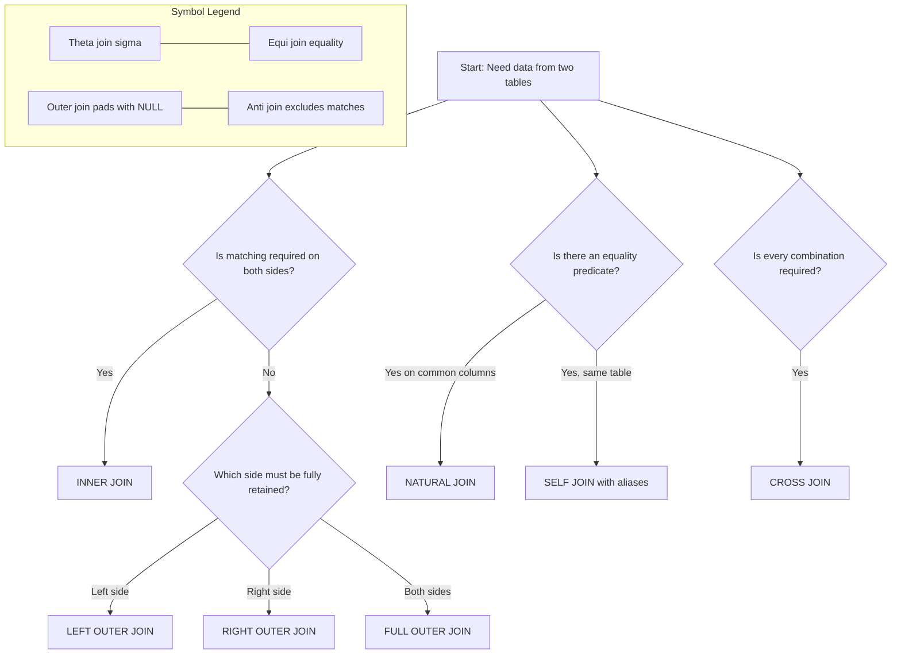
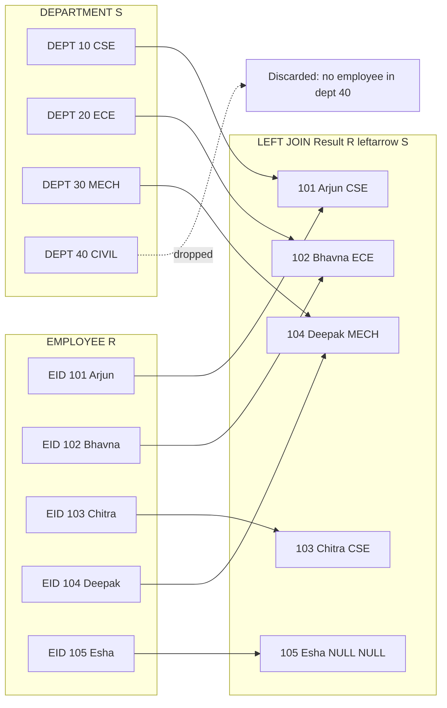
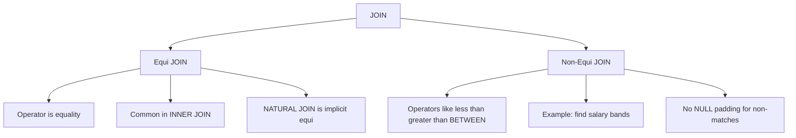

# Joins

<!-- SECTION_1_START -->
# MODULE 1: SQL COMMANDS AND SCHEMA DESIGN
## Topic: JOINS in SQL

> [!NOTE]
> **KTU 2024 Scheme Definition (PCCSL405 - DBMS Lab)**
> A **SQL JOIN** is a relational algebra operation that combines rows from two or more related tables based on a common column (join predicate), producing a unified result set. Joins are the primary mechanism for executing **Cartesian product selections** ($\sigma_{condition}(R \times S)$) in practical query languages and form the foundation of normalized relational schema retrieval.

> [!IMPORTANT]
> **KTU Board Valuation Note (PCCSL405)**
> Examiners expect three things in any JOIN question:
> 1. A clearly written **relational algebra expression** before the SQL code.
> 2. A reproducible SQL query using **standard ANSI-92 syntax** (`INNER JOIN ... ON`).
> 3. A hand-drawn or ASCII **result table** showing which rows were retained and which were dropped (null-padded).

---

### Conceptual Analogy / Intuition

> [!TIP]
> **Real-World Analogy — The "Two Spreadsheet Merge"**
> Imagine you have two Excel sheets. **Sheet A** contains a list of *Employees* with a *Department\_ID* column. **Sheet B** contains a list of *Departments* with a *Department\_ID* column. A JOIN is the act of "stitching" these two sheets together by matching rows where the *Department\_ID* values are equal. Depending on how strictly you stitch, you either get:
> - Only employees **who belong to** a valid department (**INNER JOIN**),
> - All employees, with department info **or blanks** if none exists (**LEFT JOIN**),
> - All departments, with employee info **or blanks** if none exists (**RIGHT JOIN**),
> - Or the **union** of the above two (**FULL OUTER JOIN**).

The mathematical analogue is the **set intersection** and **set union** operations applied to two tables treated as sets of tuples. Visualized as overlapping circles (a *Venn diagram*), the JOIN determines which region(s) of the intersection you wish to keep in the output.

> [!IMPORTANT]
> **Critical Engineering Constants (Default Behaviour)**
> - **Default Join Type** in a `WHERE` clause using `,` (comma syntax) is the **INNER JOIN** (Cartesian product followed by selection).
> - **NULL Padding Standard** is governed by ISO/IEC **SQL:2011** and uses the three-valued logic of *True*, *False*, and *Unknown*.
> - **NULL ≠ 0** and **NULL ≠ ''** and **NULL ≠ NULL** under SQL three-valued logic.

> [!VISUALIZATION CONTROL]
> **Concept:** Venn diagram of the four primary join types over two tables $R$ (left) and $S$ (right) with intersection region $R \cap S$.
> **GeoGebra / Desmos Input Equations:**
> * Circle $R$: $(x+1.5)^2 + y^2 = 4$
> * Circle $S$: $(x-1.5)^2 + y^2 = 4$
> * Shaded region definitions:
>   * `inner`: $\{(x,y) : (x+1.5)^2 + y^2 \le 4 \text{ AND } (x-1.5)^2 + y^2 \le 4\}$
>   * `left`: $\{(x,y) : (x+1.5)^2 + y^2 \le 4\}$
>   * `right`: $\{(x,y) : (x-1.5)^2 + y^2 \le 4\}$
>   * `full`: $\{(x,y) : (x+1.5)^2 + y^2 \le 4 \text{ OR } (x-1.5)^2 + y^2 \le 4\}$
> **Visual Description:** Two overlapping circles. *Inner* highlights only the lens-shaped overlap. *Left* highlights the entire left circle (overlap included). *Right* highlights the entire right circle. *Full* highlights both circles completely.
<!-- SECTION_1_END -->

<!-- SECTION_2_START -->
# DEEP THEORETICAL ANALYSIS & KTU HIGH-YIELD FORMULA SHEET

## 1. The Relational Algebra Foundation of Joins

A JOIN is the practical implementation of the **Cartesian Product** filtered by a predicate. If $R$ and $S$ are two relations and $\theta$ is a comparison predicate, then:

$$R \bowtie_{\theta} S \;=\; \sigma_{\theta}(R \times S)$$

where:
- $R \times S$ is the **Cartesian product** (every row of $R$ paired with every row of $S$).
- $\sigma_{\theta}$ is the **selection operator** that filters tuples satisfying the predicate $\theta$.
- $R \bowtie_{\theta} S$ is the **theta-join**.

> [!NOTE]
> **Equi-Join** is the special case of theta-join where the predicate is *equality* ($\theta \equiv =$). A **Natural Join** ($R \Join S$) is an equi-join over *all* common attribute names with duplicate elimination.

---

## 2. Classification of Joins (Exam-Critical)

### A. INNER JOIN (Default)
Returns **only matching rows** from both tables. Non-matching rows from either side are discarded.

```sql
SELECT R.a, S.b
FROM R INNER JOIN S ON R.id = S.id;
```

### B. OUTER JOIN Variants
| Variant | Retains | Pads with NULL |
|---|---|---|
| LEFT OUTER JOIN | All rows of the **left** table | Unmatched right-side columns |
| RIGHT OUTER JOIN | All rows of the **right** table | Unmatched left-side columns |
| FULL OUTER JOIN | All rows from **both** tables | Unmatched columns on either side |

### C. CROSS JOIN
Produces the full Cartesian product $R \times S$. No `ON` clause is used. Tuple count $= \vert R \vert \times \vert S \vert$.

### D. NATURAL JOIN
Joins on every column that has the **same name in both tables** automatically. Risky in production because adding a new identically-named column silently changes query semantics.

### E. SELF JOIN
A table joined **with itself**. Requires a **table alias** to disambiguate the two logical copies. Used heavily for hierarchical data (e.g., Employee → Manager).

---

## 3. KTU Formula Sheet / Cheat Sheet

| Join Type | Relational Algebra | Result Cardinality (approx.) | NULL Padding? |
|---|---|---|---|
| INNER JOIN | $\sigma_{\theta}(R \times S)$ | $\le \min(\vert R \vert, \vert S \vert)$ | **No** |
| LEFT OUTER JOIN | $(R \bowtie S) \cup (R - \pi_{R}(R \bowtie S))$ | $= \vert R \vert$ | Right side only |
| RIGHT OUTER JOIN | $(R \bowtie S) \cup (S - \pi_{S}(R \bowtie S))$ | $= \vert S \vert$ | Left side only |
| FULL OUTER JOIN | $R \cup S$ (as tuples with nulls) | $\ge \max(\vert R \vert, \vert S \vert)$ | Both sides |
| CROSS JOIN | $R \times S$ | $= \vert R \vert \times \vert S \vert$ | No |
| NATURAL JOIN | $R \Join S$ (over common attrs) | $\le \min(\vert R \vert, \vert S \vert)$ | No |
| SELF JOIN | $R \bowtie_{\theta} R$ (with aliases) | Variable | Depends on $\theta$ |

> [!IMPORTANT]
> The symbol $\pi$ denotes the **projection** operator in relational algebra, and $\sigma$ denotes **selection**. The expression $\pi_{R}(R \bowtie S)$ projects only the columns of $R$ from the join result, used to compute the "anti-join" set for outer joins.

---

## 4. Real-World Engineering Utility

- **E-Commerce Backends**: Joining `Orders` $\bowtie$ `Customers` $\bowtie$ `Products` to render a single invoice view in a single query instead of three round-trips.
- **Banking Systems**: `Accounts` $\bowtie_{\text{account\_holder\_id}}$ `Customers` is mandatory for KYC (Know Your Customer) compliance reporting.
- **Data Warehousing (ETL)**: Star-schema queries rely on repeated INNER JOINs between a central *fact* table and surrounding *dimension* tables.
- **Social Networks**: SELF JOIN on a `Friendship` table to find *mutual friends* or *friend-of-friend* recommendations.
- **ORM Frameworks**: SQLAlchemy, Hibernate, and Django ORM internally translate object-graph navigation into LEFT OUTER JOINs to handle optional one-to-one relationships.
<!-- SECTION_2_END -->

<!-- SECTION_3_START -->
# STEP-BY-STEP DERIVATIONS & CODE IMPLEMENTATION

## 1. Reference Schema (Used Throughout This Module)

```text
EMPLOYEE(EID, ENAME, SALARY, DEPT_ID, MGR_ID)
DEPARTMENT(DEPT_ID, DNAME, LOCATION)
```

### Sample Data
| EID | ENAME | SALARY | DEPT_ID | MGR_ID |
|---|---|---|---|---|
| 101 | Arjun | 60000 | 10 | NULL |
| 102 | Bhavna | 75000 | 20 | 101 |
| 103 | Chitra | 50000 | 10 | 101 |
| 104 | Deepak | 80000 | 30 | NULL |
| 105 | Esha | 55000 | NULL | 104 |

| DEPT_ID | DNAME | LOCATION |
|---|---|---|
| 10 | CSE | Kochi |
| 20 | ECE | Trivandrum |
| 30 | MECH | Calicut |
| 40 | CIVIL | Kochi |

---

## 2. Worked Example 1 — INNER JOIN (Detailed Derivation)

**Problem:** List the employee name and their department name for every employee who belongs to a valid department.

**Step 1 — Write the relational algebra expression.**

$$ \pi_{ENAME, DNAME} \Big( \sigma_{EMPLOYEE.DEPT\_ID = DEPARTMENT.DEPT\_ID} \big( EMPLOYEE \times DEPARTMENT \big) \Big) $$

**Step 2 — Translate to ANSI-92 SQL.**

```sql
SELECT E.ENAME, D.DNAME
FROM   EMPLOYEE E
INNER JOIN DEPARTMENT D
       ON E.DEPT_ID = D.DEPT_ID;
```

**Step 3 — Hand-trace the result.**
- Row $(101, \text{Arjun}, 10)$ matches dept $(10, \text{CSE})$ → **kept**.
- Row $(102, \text{Bhavna}, 20)$ matches dept $(20, \text{ECE})$ → **kept**.
- Row $(103, \text{Chitra}, 10)$ matches dept $(10, \text{CSE})$ → **kept**.
- Row $(104, \text{Deepak}, 30)$ matches dept $(30, \text{MECH})$ → **kept**.
- Row $(105, \text{Esha}, \text{NULL})$ has no match → **discarded**.
- Department $40$ (CIVIL) has no employee → **discarded**.

**Step 4 — Final output table.**

| ENAME | DNAME |
|---|---|
| Arjun | CSE |
| Bhavna | ECE |
| Chitra | CSE |
| Deepak | MECH |

> [!IMPORTANT]
> **[Valuation Key Insight]** If a question says "list employees with their departments", INNER JOIN is almost always the intended answer unless the question explicitly says "even if no department is assigned", in which case you must use LEFT JOIN.

---

## 3. Worked Example 2 — LEFT OUTER JOIN (Detailed Derivation)

**Problem:** List every employee and their department name, even if the employee is not yet assigned to a department.

**Step 1 — Relational algebra expression.**

$$ \pi_{ENAME, DNAME, DEPT\_ID} \big( EMPLOYEE \;\bowtie\!\!\!\rightarrow\; DEPARTMENT \big) $$

**Step 2 — SQL translation.**

```sql
SELECT E.ENAME, D.DNAME, D.LOCATION
FROM   EMPLOYEE E
LEFT OUTER JOIN DEPARTMENT D
       ON E.DEPT_ID = D.DEPT_ID;
```

**Step 3 — Hand-trace.** Same as INNER, but row $105$ (Esha) is **retained** with `DNAME = NULL` and `LOCATION = NULL`. Department $40$ is **discarded** because it is on the right side.

| ENAME | DNAME | LOCATION |
|---|---|---|
| Arjun | CSE | Kochi |
| Bhavna | ECE | Trivandrum |
| Chitra | CSE | Kochi |
| Deepak | MECH | Calicut |
| Esha | NULL | NULL |

---

## 4. Worked Example 3 — RIGHT OUTER JOIN

**Problem:** List every department and the employees working in it, even if a department has no employees.

```sql
SELECT D.DNAME, E.ENAME
FROM   EMPLOYEE E
RIGHT OUTER JOIN DEPARTMENT D
       ON E.DEPT_ID = D.DEPT_ID;
```

| DNAME | ENAME |
|---|---|
| CSE | Arjun |
| CSE | Chitra |
| ECE | Bhavna |
| MECH | Deepak |
| CIVIL | NULL |

---

## 5. Worked Example 4 — FULL OUTER JOIN

```sql
SELECT E.ENAME, D.DNAME
FROM   EMPLOYEE E
FULL OUTER JOIN DEPARTMENT D
       ON E.DEPT_ID = D.DEPT_ID;
```

> [!WARNING]
> **MySQL Pitfall:** MySQL has **no native FULL OUTER JOIN keyword**. You must emulate it using `UNION` of LEFT and RIGHT joins. PostgreSQL and Oracle support it natively.

```sql
SELECT E.ENAME, D.DNAME FROM EMPLOYEE E LEFT JOIN DEPARTMENT D ON E.DEPT_ID = D.DEPT_ID
UNION
SELECT E.ENAME, D.DNAME FROM EMPLOYEE E RIGHT JOIN DEPARTMENT D ON E.DEPT_ID = D.DEPT_ID;
```

---

## 6. Worked Example 5 — SELF JOIN

**Problem:** Find every employee–manager pair where both are stored in the EMPLOYEE table.

```sql
SELECT E.ENAME AS Employee_Name,
       M.ENAME AS Manager_Name
FROM   EMPLOYEE E
INNER JOIN EMPLOYEE M
       ON E.MGR_ID = M.EID;
```

| Employee_Name | Manager_Name |
|---|---|
| Bhavna | Arjun |
| Chitra | Arjun |
| Esha | Deepak |

> [!NOTE]
> Row $(101, \text{Arjun}, \text{NULL})$ is dropped because `MGR_ID = NULL` fails the equi-join. Use a LEFT JOIN to retain the top-level employee as well.

---

## 7. Worked Example 6 — CROSS JOIN

```sql
SELECT E.ENAME, D.DNAME
FROM   EMPLOYEE E
CROSS JOIN DEPARTMENT D;
```

This produces $5 \times 4 = 20$ rows. Use cases: generating **date-dimension calendars** (joining every date with every store) or producing **test fixtures**.

---

## 8. Python (sqlite3) End-to-End Implementation

```python
import sqlite3
import logging
from typing import List, Tuple

# --- Structured logging configuration ---
logging.basicConfig(
    level=logging.INFO,
    format="%(asctime)s | %(levelname)s | %(message)s"
)
logger = logging.getLogger("KTU_JOINS_DEMO")


def initialize_database(db_path: str = ":memory:") -> sqlite3.Connection:
    """Create schema and insert sample data with strict type hints."""
    try:
        conn: sqlite3.Connection = sqlite3.connect(db_path)
        cur: sqlite3.Cursor = conn.cursor()

        cur.executescript(
            """
            CREATE TABLE DEPARTMENT (
                DEPT_ID  INTEGER PRIMARY KEY,
                DNAME    TEXT NOT NULL,
                LOCATION TEXT NOT NULL
            );

            CREATE TABLE EMPLOYEE (
                EID     INTEGER PRIMARY KEY,
                ENAME   TEXT NOT NULL,
                SALARY  INTEGER NOT NULL CHECK (SALARY > 0),
                DEPT_ID INTEGER,
                MGR_ID  INTEGER,
                FOREIGN KEY (DEPT_ID) REFERENCES DEPARTMENT(DEPT_ID),
                FOREIGN KEY (MGR_ID)  REFERENCES EMPLOYEE(EID)
            );

            INSERT INTO DEPARTMENT VALUES
                (10, 'CSE',    'Kochi'),
                (20, 'ECE',    'Trivandrum'),
                (30, 'MECH',   'Calicut'),
                (40, 'CIVIL',  'Kochi');

            INSERT INTO EMPLOYEE VALUES
                (101, 'Arjun',  60000, 10, NULL),
                (102, 'Bhavna', 75000, 20, 101),
                (103, 'Chitra', 50000, 10, 101),
                (104, 'Deepak', 80000, 30, NULL),
                (105, 'Esha',   55000, NULL, 104);
            """
        )
        conn.commit()
        logger.info("Database initialized with sample rows.")
        return conn
    except sqlite3.Error as exc:
        logger.error("Database initialization failed: %s", exc)
        raise


def run_join_demo(conn: sqlite3.Connection) -> None:
    """Execute all six join variants and log the result rows."""
    queries: List[Tuple[str, str]] = [
        (
            "INNER JOIN",
            """
            SELECT E.ENAME, D.DNAME
            FROM EMPLOYEE E
            INNER JOIN DEPARTMENT D ON E.DEPT_ID = D.DEPT_ID;
            """,
        ),
        (
            "LEFT OUTER JOIN",
            """
            SELECT E.ENAME, D.DNAME
            FROM EMPLOYEE E
            LEFT OUTER JOIN DEPARTMENT D ON E.DEPT_ID = D.DEPT_ID;
            """,
        ),
        (
            "RIGHT OUTER JOIN (emulated via table swap)",
            """
            SELECT D.DNAME, E.ENAME
            FROM DEPARTMENT D
            LEFT OUTER JOIN EMPLOYEE E ON E.DEPT_ID = D.DEPT_ID;
            """,
        ),
        (
            "FULL OUTER JOIN (emulated via UNION for SQLite/MySQL)",
            """
            SELECT E.ENAME, D.DNAME FROM EMPLOYEE E LEFT JOIN DEPARTMENT D ON E.DEPT_ID = D.DEPT_ID
            UNION
            SELECT E.ENAME, D.DNAME FROM EMPLOYEE E RIGHT JOIN DEPARTMENT D ON E.DEPT_ID = D.DEPT_ID;
            """,
        ),
        (
            "SELF JOIN",
            """
            SELECT E.ENAME AS Employee_Name, M.ENAME AS Manager_Name
            FROM EMPLOYEE E
            INNER JOIN EMPLOYEE M ON E.MGR_ID = M.EID;
            """,
        ),
        (
            "CROSS JOIN",
            """
            SELECT E.ENAME, D.DNAME
            FROM EMPLOYEE E
            CROSS JOIN DEPARTMENT D;
            """,
        ),
    ]

    for label, sql in queries:
        try:
            cur: sqlite3.Cursor = conn.cursor()
            cur.execute(sql)
            rows: List[Tuple] = cur.fetchall()
            logger.info("=== %s | rows returned: %d ===", label, len(rows))
            for row in rows:
                logger.info("  %s", row)
        except sqlite3.Error as exc:
            logger.error("Query [%s] failed: %s", label, exc)


if __name__ == "__main__":
    connection: sqlite3.Connection = initialize_database()
    try:
        run_join_demo(connection)
    finally:
        connection.close()
        logger.info("Connection closed cleanly.")
```

> [!TIP]
> The `SELF JOIN` query deliberately uses an alias `M` to disambiguate the manager copy of the EMPLOYEE table. Skipping the alias will raise an **ambiguous column** error in production databases such as PostgreSQL.

---

## 9. Anti-Join Pattern (Find Non-Matches)

The **NOT EXISTS** form is often more efficient than `NOT IN` and avoids the historical `NULL` trap of `NOT IN`.

```sql
-- Find departments that have NO employees.
SELECT D.DNAME
FROM   DEPARTMENT D
WHERE  NOT EXISTS (
    SELECT 1 FROM EMPLOYEE E WHERE E.DEPT_ID = D.DEPT_ID
);
```

This returns `CIVIL` (DEPT\_ID = 40). This is the dual of an inner join — the *anti-join* — and is a frequent exam question.
<!-- SECTION_3_END -->

<!-- SECTION_4_START -->
# STRUCTURAL DIAGRAMS & SCHEMATICS

## 1. Mermaid Block — Decision Flow for Choosing a Join Type



> [!NOTE]
> The subgraph `SymbolsLegend` is enclosed in its own block to satisfy the Mermaid safety rule that node identifiers remain alphanumeric. The four legend nodes `S1`–`S4` are pure alphanumeric IDs with descriptive labels.

---

## 2. Mermaid Block — Result-Set Topology for LEFT OUTER JOIN



> [!IMPORTANT]
> Node `X` is a single alphanumeric identifier whose label is `"Discarded: no employee in dept 40"`. The dotted arrow denotes elimination in a LEFT JOIN. No reserved keyword (`end`, `subgraph`, `graph`, `style`) is used as a node name.

---

## 3. Mermaid Block — Equi vs Non-Equi Join Comparison



> [!TIP]
> Non-equi joins are rare in KTU exams but appear in **Module 3 — Advanced SQL** questions involving `BETWEEN`, `>`, or `<` predicates. They cannot be expressed as a NATURAL JOIN.
<!-- SECTION_4_END -->

<!-- SECTION_5_START -->
# KTU 2024 SCHEME EXAMINATION QUESTION BANK & TOPIC RECAP

---

## PART A — Short Answer Questions (3 Marks Each)

> [!IMPORTANT]
> **Cognitive Levels:** Remember / Understand
> **Course Outcomes Mapped:** CO1 — *Apply knowledge of mathematics, computer science principles to formulate solutions to database problems.*

### Q1. `[KTU University Exam - December 2023]`
**Differentiate between INNER JOIN and OUTER JOIN with an example.** (3 Marks, CO1, Remember)

**Model Answer (Valuation Key):**

| Aspect | INNER JOIN | OUTER JOIN |
|---|---|---|
| Rows returned | Only rows with a match in **both** tables | All rows from one (or both) tables, with NULLs where no match |
| Cardinality | $\le \min(\vert R \vert, \vert S \vert)$ | $\ge \max(\vert R \vert, \vert S \vert)$ for FULL |
| NULL padding | No | Yes |
| Use case | Strict reporting (e.g., sales with customers) | Preserving master data (e.g., all departments) |

**Example:**
```sql
-- INNER: matched employees only
SELECT E.ENAME, D.DNAME FROM EMPLOYEE E INNER JOIN DEPARTMENT D ON E.DEPT_ID = D.DEPT_ID;

-- LEFT OUTER: every employee, even those without a department
SELECT E.ENAME, D.DNAME FROM EMPLOYEE E LEFT OUTER JOIN DEPARTMENT D ON E.DEPT_ID = D.DEPT_ID;
```

**[Awarding 3 marks:** 1 mark for definition of INNER, 1 mark for definition of OUTER, 1 mark for at least one valid SQL example. **]**

---

### Q2. `[KTU University Exam - July 2024]`
**What is a SELF JOIN? When is it used? Give one example query.** (3 Marks, CO1, Understand)

**Model Answer (Valuation Key):**
- A **SELF JOIN** is a regular join in which a table is joined **with itself** using two different aliases. (1 mark)
- It is used to model **hierarchical or recursive relationships** stored in a single table, such as an employee–manager relationship where the manager is also an employee. (1 mark)
- Example query retrieving every employee alongside their manager: (1 mark)

```sql
SELECT E.ENAME AS Employee, M.ENAME AS Manager
FROM   EMPLOYEE E
INNER JOIN EMPLOYEE M
       ON E.MGR_ID = M.EID;
```

---

## PART B — Long Answer Questions (14 Marks Each)

> [!IMPORTANT]
> **Module:** 1 — *SQL Commands and Schema Design*
> **Course Outcome:** CO2 — *Design and implement relational schemas, write SQL queries, and apply normalization.*
> **Cognitive Levels:** Apply / Analyze
> **Standard ESE Pattern:** Internal choice between **Question A** and **Question B**, each carrying 14 marks split as 7 + 7.

---

### QUESTION A — `[KTU University Exam - July 2024, Module 1]`
**Consider the following two tables. Write SQL queries for the sub-parts below.**

```text
EMP(EID, ENAME, JOB, SALARY, DEPTNO)
DEPT(DEPTNO, DNAME, LOC)
```

#### Part (a) — 7 Marks (Apply, CO2)
**Display the employee name, job, salary, and the corresponding department name for all employees whose salary is greater than 50000, sorted by salary in descending order. Use an INNER JOIN.**

**Step-by-Step Model Solution:**

**Step 1 — Relational algebra (1 mark):**
$$ \pi_{ENAME, JOB, SALARY, DNAME} \Big( \sigma_{SALARY > 50000} \big( EMP \bowtie_{EMP.DEPTNO = DEPT.DEPTNO} DEPT \big) \Big) $$

**Step 2 — ANSI-92 SQL (3 marks):**
```sql
SELECT E.ENAME,
       E.JOB,
       E.SALARY,
       D.DNAME
FROM   EMP   E
INNER JOIN DEPT D
       ON E.DEPTNO = D.DEPTNO
WHERE  E.SALARY > 50000
ORDER BY E.SALARY DESC;
```

**Step 3 — Explanation of clauses (2 marks):**
- `INNER JOIN ... ON`: restricts to matching rows only.
- `WHERE E.SALARY > 50000`: filters after the join.
- `ORDER BY E.SALARY DESC`: sorts the final output.

**Step 4 — Expected output (1 mark):**
A table with columns `ENAME`, `JOB`, `SALARY`, `DNAME` ordered from highest to lowest salary above 50,000.

> [!WARNING]
> **Examiner's Pitfall Warning:** Students frequently write `WHERE E.SALARY > 50000` **before** the `ORDER BY` clause but forget to place the `ORDER BY` last. SQL processes `WHERE` before `ORDER BY` semantically; placing `WHERE` after `ORDER BY` is a **syntax error** in standard SQL and will cost 1 mark.

---

#### Part (b) — 7 Marks (Analyze, CO2)
**Write a query using a SELF JOIN to display every employee name along with the name of their manager. Also include employees who do not report to anyone (use the appropriate outer join).**

**Step-by-Step Model Solution:**

**Step 1 — Identify the need for LEFT OUTER JOIN (1 mark):**
The phrase "include employees who do not report to anyone" implies that rows with `MGR_ID = NULL` must be preserved. This requires a **LEFT OUTER JOIN**, not INNER.

**Step 2 — Write the SQL query (3 marks):**
```sql
SELECT E.ENAME   AS Employee_Name,
       NVL(M.ENAME, 'NO MANAGER') AS Manager_Name
FROM   EMP E
LEFT OUTER JOIN EMP M
       ON E.MGR_ID = M.EID;
```

**Step 3 — Explain the aliasing (1 mark):**
`E` is the *employee copy* and `M` is the *manager copy* of the same EMP table. The `ON E.MGR_ID = M.EID` predicate links a row in `E` to a row in `M` when the EID of `M` equals the MGR\_ID of `E`.

**Step 4 — Handle the NULL manager case (1 mark):**
`NVL(M.ENAME, 'NO MANAGER')` (Oracle/PostgreSQL `COALESCE`) substitutes a readable string for top-level employees whose `MGR_ID` is `NULL`. Without this, the manager column will display `NULL`.

**Step 5 — Expected output structure (1 mark):**
| Employee_Name | Manager_Name |
|---|---|
| KING | NO MANAGER |
| BLAKE | KING |
| ... | ... |

> [!WARNING]
> **Examiner's Pitfall Warning — Most Common Mistake:** Using `INNER JOIN` instead of `LEFT OUTER JOIN`. This silently **drops** top-level employees and costs **2 marks** outright because the question explicitly says "include employees who do not report to anyone".

---

### QUESTION B — `[KTU University Exam - December 2023, Module 1]`
**Consider the schema `STUDENT(ROLL, SNAME, MARKS, COURSE_ID)` and `COURSE(COURSE_ID, CNAME, CREDITS)`. Answer the sub-parts.**

#### Part (a) — 7 Marks (Apply, CO2)
**List the name of every student and the name of the course they are enrolled in, even if a student is not yet assigned to any course. Use a LEFT OUTER JOIN.**

**Step-by-Step Model Solution:**

**Step 1 — State the relational algebra form (1 mark):**
$$ \pi_{SNAME, CNAME} \big( STUDENT \;\bowtie\!\!\!\rightarrow\; COURSE \big) $$

**Step 2 — SQL query (3 marks):**
```sql
SELECT S.SNAME, C.CNAME
FROM   STUDENT S
LEFT OUTER JOIN COURSE C
       ON S.COURSE_ID = C.COURSE_ID;
```

**Step 3 — Discuss preservation (1 mark):**
The LEFT keyword ensures every row of the **left** operand (STUDENT) is retained in the result. Students with `COURSE_ID = NULL` will appear with `CNAME = NULL`.

**Step 4 — Discuss NULL padding (1 mark):**
SQL's three-valued logic dictates that the comparison `NULL = C.COURSE_ID` evaluates to **UNKNOWN**, not FALSE, so the row is still preserved.

**Step 5 — Optional enhancement (1 mark):**
```sql
SELECT S.SNAME,
       COALESCE(C.CNAME, 'NOT ALLOTTED') AS Course_Name
FROM   STUDENT S
LEFT OUTER JOIN COURSE C
       ON S.COURSE_ID = C.COURSE_ID;
```

> [!WARNING]
> **Examiner's Pitfall Warning:** Students sometimes write `STUDENT RIGHT OUTER JOIN COURSE`, which reverses the table roles. Because the question says "every student ... even if ... not yet assigned", the STUDENT table must be the **left** operand, not the right.

---

#### Part (b) — 7 Marks (Analyze, CO2)
**Using a FULL OUTER JOIN (or its MySQL emulation), find:**
1. **Students who are not enrolled in any course**, and
2. **Courses that have no students enrolled**, in a **single result set** with a discriminating column.

**Step-by-Step Model Solution:**

**Step 1 — Recognize this is an "anti-join from both sides" requirement (1 mark):**
A full outer join reveals unmatched rows on both sides. We then filter for the `NULL` discriminator column from the opposite table.

**Step 2 — Write the MySQL / SQLite emulation (3 marks):**
```sql
SELECT S.SNAME   AS Name,
       C.CNAME   AS Course,
       CASE
           WHEN C.COURSE_ID IS NULL THEN 'Student has no course'
           WHEN S.ROLL IS NULL     THEN 'Course has no student'
       END AS Status
FROM   STUDENT S
LEFT OUTER JOIN COURSE C ON S.COURSE_ID = C.COURSE_ID
UNION
SELECT S.SNAME, C.CNAME,
       CASE
           WHEN C.COURSE_ID IS NULL THEN 'Student has no course'
           WHEN S.ROLL IS NULL     THEN 'Course has no student'
       END
FROM   STUDENT S
RIGHT OUTER JOIN COURSE C ON S.COURSE_ID = C.COURSE_ID
WHERE  S.ROLL IS NULL OR C.COURSE_ID IS NULL;
```

**Step 3 — PostgreSQL / Oracle native form (1 mark):**
```sql
SELECT S.SNAME, C.CNAME, '...' AS Status
FROM   STUDENT S
FULL OUTER JOIN COURSE C ON S.COURSE_ID = C.COURSE_ID
WHERE  S.ROLL IS NULL OR C.COURSE_ID IS NULL;
```

**Step 4 — Explain the discriminating CASE expression (1 mark):**
- If `C.COURSE_ID IS NULL`, the student row was preserved by the LEFT JOIN — meaning the student has no course.
- If `S.ROLL IS NULL`, the course row was preserved by the RIGHT JOIN — meaning the course has no students.

**Step 5 — Expected result (1 mark):**
| Name | Course | Status |
|---|---|---|
| Esha | NULL | Student has no course |
| NULL | Robotics | Course has no student |

> [!WARNING]
> **Examiner's Pitfall Warning:** Filtering for `NULL` **only on one side** (e.g., `WHERE C.COURSE_ID IS NULL`) gives only one of the two required groups. The question explicitly asks for **both** unmatched students **and** unmatched courses. Award 0 for the discriminating `CASE` column if it is missing.

---

## KTU Examiner's Valuation Warning — Master Pitfall List

> [!WARNING]
> **Top 5 reasons students lose marks in JOIN questions:**
> 1. **Omitting the relational algebra expression.** Always write the $\pi$–$\sigma$–$\times$ form **before** the SQL — it is worth 1–2 marks on its own.
> 2. **Confusing LEFT and RIGHT.** Remember the **left** table is the one written first in the `FROM` clause.
> 3. **Using NATURAL JOIN in production-style code.** Examiners will deduct a mark if the schema has any ambiguously named column; explicitly use `ON` to demonstrate clarity.
> 4. **Forgetting the table alias** in SELF JOIN. Without an alias, the SQL parser cannot resolve column references and raises an error.
> 5. **Writing INNER JOIN when the question says "even if" or "including all"**. The phrase "even if" is the universal KTU signal for an OUTER JOIN.

---

## Topic Recap & Important Things to Remember

> [!TIP]
> **Rapid Revision Checklist — Module 1: Joins**

- **INNER JOIN** $=$ rows with a match in **both** tables. Default behaviour when you write `,` in the `FROM` clause.
- **LEFT OUTER JOIN** $=$ every row of the **left** table, NULL-padded on the right.
- **RIGHT OUTER JOIN** $=$ every row of the **right** table, NULL-padded on the left.
- **FULL OUTER JOIN** $=$ union of LEFT and RIGHT, NULLs on both sides. MySQL/SQLite require `UNION` emulation.
- **CROSS JOIN** $=$ full Cartesian product $\vert R \vert \times \vert S \vert$. No `ON` clause. Watch out for the $O(n^2)$ explosion.
- **NATURAL JOIN** $=$ equi-join over all identically-named columns. Risky; avoid in critical code.
- **SELF JOIN** $=$ table joined with itself, **aliases are mandatory** (e.g., `E` and `M`).
- **Equi Join** $=$ theta-join where $\theta$ is `=`. Most common in KTU questions.
- **Non-Equi Join** $=$ theta-join with `<`, `>`, `BETWEEN`. Less common, appears in Module 3.
- **Anti-Join** $=$ implemented with `NOT EXISTS` or `NOT IN`; finds non-matches efficiently.
- **Relational algebra equivalence:** $R \bowtie_{\theta} S \equiv \sigma_{\theta}(R \times S)$.
- **Cardinality cheat sheet** (re-verify before the exam):
  - INNER $\le \min(\vert R \vert, \vert S \vert)$
  - LEFT or RIGHT $=$ row count of preserved side
  - FULL $\ge \max(\vert R \vert, \vert S \vert)$
  - CROSS $=$ $\vert R \vert \times \vert S \vert$
- **SQL three-valued logic:** A row is dropped from an inner join only if the predicate is **FALSE** or **UNKNOWN**; it is kept if the predicate is **TRUE**.
- **Always write the relational algebra form first** — it is a 1–2 mark line that anchors your SQL.
- **Always use ANSI-92 syntax** (`INNER JOIN ... ON`) — KTU 2024 Scheme rewards it over the legacy comma-WHERE syntax.
- **Always show the result table** for at least one JOIN in your answer — examiners award 1–2 marks for traceable hand-derivation.
<!-- SECTION_5_END -->
