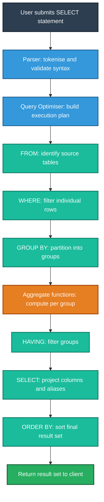
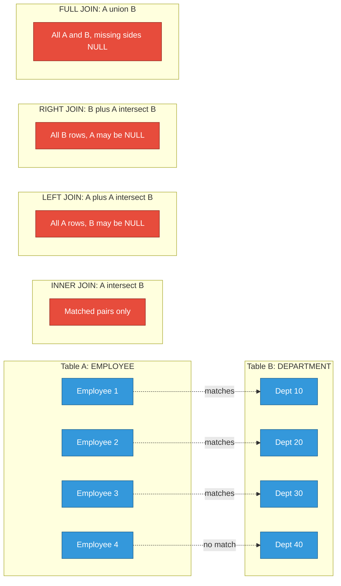
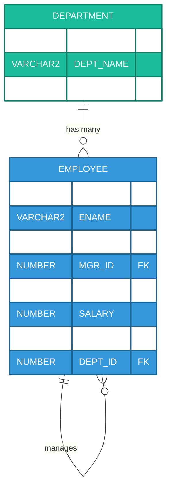
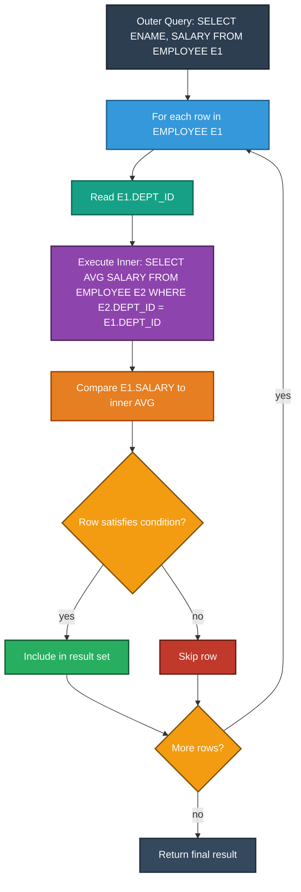

# Select Queries

<!-- SECTION_1_START -->

# SELECT Queries — Core Technical Definition & Intuitive Overview

## 1.1 Formal Academic Definition (KTU 2024 Syllabus Terminology)

In the context of **Relational Database Management Systems (RDBMS)**, a `SELECT` statement is a **Data Query Language (DQL)** command defined by the **ISO/IEC 9075 SQL standard** that retrieves rows and columns from one or more relations (tables) in a database, optionally filtered, transformed, aggregated, and ordered, **without modifying the underlying data**.

> [!IMPORTANT]
> **KTU 2024 Scheme Definition (PCCSL405 - Module 1):**
> *The `SELECT` statement is the primary SQL construct used for data retrieval. It supports projection (column selection), selection (row filtering using predicates), joining (multi-table correlation), aggregation (set-level summary computation), and sorting (result ordering). It is the most frequently evaluated command in KTU lab examinations and university viva voce.*

```sql
SELECT [DISTINCT] <column_list>
FROM   <table_reference>
[WHERE <search_condition>]
[GROUP BY <grouping_columns>]
[HAVING <group_condition>]
[ORDER BY <sort_columns> [ASC | DESC]];
```

## 1.2 Conceptual Analogy & Intuitive Overview

> [!NOTE]
> **Plain English Intuition — The "Restaurant Menu" Analogy**
>
> Imagine a restaurant's **menu** is your *database table*. Each *dish* is a *row*, and each *attribute* of the dish (name, price, category) is a *column*. A `SELECT` query is exactly like telling the waiter:
> *   "Show me only the **desserts** (row filter via `WHERE`)."
> *   "I want to see the **name and price** (column projection)."
> *   "Sort them from **cheapest to most expensive** (`ORDER BY`)."
> *   "Group the dishes by **cuisine type** and give me the **average price per cuisine** (`GROUP BY` + `AVG()`)."
>
> The kitchen (database engine) does not cook anything new; it only **plucks** existing items and arranges them as requested. The menu (table) remains untouched.

## 1.3 Six Logical Phases of a SELECT Query (SQL Execution Order)

> [!IMPORTANT]
> The textual order in which you *write* a SQL query is **NOT** the order in which the database engine *executes* it. KTU examiners frequently test this concept.

| Logical Step | Written Order | Execution Order | Purpose |
| :--- | :---: | :---: | :--- |
| 1. Source Identification | `FROM` | 1st | Identifies the source tables and joins them |
| 2. Row Filtering | `WHERE` | 2nd | Eliminates rows not matching the predicate |
| 3. Row Grouping | `GROUP BY` | 3rd | Forms groups of rows sharing common values |
| 4. Group Filtering | `HAVING` | 4th | Filters groups based on aggregate conditions |
| 5. Column Projection | `SELECT` | 5th | Computes expressions and selects output columns |
| 6. Result Ordering | `ORDER BY` | 6th | Sorts the final result set |

## 1.4 Standard Reference Schema (Used Throughout This Note)

> [!NOTE]
> To maintain consistency, **all examples and questions in this note** will reference the following **Employee–Department** schema. This is a KTU-standard lab schema.

**Table 1: `DEPARTMENT`**

| Column Name | Data Type | Constraints | Description |
| :--- | :--- | :--- | :--- |
| `DEPT_ID` | `NUMBER(3)` | `PRIMARY KEY` | Unique department identifier |
| `DEPT_NAME` | `VARCHAR2(30)` | `NOT NULL` | Name of the department |
| `LOCATION` | `VARCHAR2(20)` | — | City of the department |

**Table 2: `EMPLOYEE`**

| Column Name | Data Type | Constraints | Description |
| :--- | :--- | :--- | :--- |
| `EMP_ID` | `NUMBER(5)` | `PRIMARY KEY` | Unique employee identifier |
| `ENAME` | `VARCHAR2(30)` | `NOT NULL` | Employee full name |
| `JOB` | `VARCHAR2(20)` | — | Job title / designation |
| `MGR_ID` | `NUMBER(5)` | `FOREIGN KEY` → `EMPLOYEE(EMP_ID)` | Manager's employee ID |
| `HIREDATE` | `DATE` | — | Date of joining |
| `SALARY` | `NUMBER(10,2)` | `CHECK (SALARY > 0)` | Monthly gross salary |
| `COMM` | `NUMBER(10,2)` | — | Commission (nullable) |
| `DEPT_ID` | `NUMBER(3)` | `FOREIGN KEY` → `DEPARTMENT(DEPT_ID)` | Department assignment |

<!-- SECTION_1_END -->

<!-- SECTION_2_START -->

# Deep Theoretical Analysis & KTU High-Yield Formula Sheet

## 2.1 Anatomy of the SELECT Statement

A `SELECT` statement is composed of **clauses**, each performing a distinct logical transformation on the data. The clauses are evaluated in a strict pipeline order (see Section 1.3).

### 2.1.1 The `SELECT` Clause (Projection)

The `SELECT` clause specifies **which columns** appear in the result, in **which order**, and with **which computed transformations**.

**Components permitted inside `SELECT`:**
*   **Column references** — `ENAME`, `SALARY`
*   **Literal constants** — `'Active'`, `101`
*   **Arithmetic expressions** — `SALARY * 12` (annual salary)
*   **Built-in functions** — `UPPER(ENAME)`, `ROUND(SALARY, -3)`
*   **Aggregate functions** — `SUM(SALARY)`, `COUNT(*)`, `AVG(SALARY)`, `MAX(SALARY)`, `MIN(SALARY)`
*   **CASE expressions** — for conditional column logic
*   **Column aliases** — `ENAME AS "Employee Name"`

> [!NOTE]
> **`DISTINCT` Keyword** — Eliminates duplicate rows from the result. The database engine performs an implicit sort/hash operation to detect duplicates. **Cost Warning:** `DISTINCT` is computationally expensive on large tables.

### 2.1.2 The `FROM` Clause (Source Binding)

The `FROM` clause identifies the **base tables**, **views**, or **joined table expressions** that act as the source of data. It supports:

*   **Single table** — `FROM EMPLOYEE`
*   **Multiple tables (Cartesian product)** — `FROM EMPLOYEE, DEPARTMENT` *(rarely used intentionally)*
*   **Join expressions** — `FROM EMPLOYEE E JOIN DEPARTMENT D ON E.DEPT_ID = D.DEPT_ID`
*   **Subqueries (inline views)** — `FROM (SELECT DEPT_ID, AVG(SALARY) AS AVG_SAL FROM EMPLOYEE GROUP BY DEPT_ID) T`
*   **`DUAL` table (Oracle)** — A pseudo-table with exactly one row and one column, used for evaluating expressions that do not require table data (e.g., `SELECT SYSDATE FROM DUAL;`).

### 2.1.3 The `WHERE` Clause (Row Selection / Selection Predicate)

The `WHERE` clause filters **rows** *before* grouping. It accepts any Boolean expression combining the following:

**Comparison Operators**

| Operator | Meaning | Example |
| :--- | :--- | :--- |
| `=` | Equal to | `WHERE JOB = 'CLERK'` |
| `<>` or `!=` | Not equal to | `WHERE DEPT_ID <> 10` |
| `>` | Greater than | `WHERE SALARY > 3000` |
| `<` | Less than | `WHERE HIREDATE < '01-JAN-2020'` |
| `>=` | Greater than or equal | `WHERE SALARY >= 5000` |
| `<=` | Less than or equal | `WHERE COMM <= 500` |

**Logical Operators**

| Operator | Purpose |
| :--- | :--- |
| `AND` | All conditions must be TRUE |
| `OR` | At least one condition must be TRUE |
| `NOT` | Negates the truth value |

**Special Operators**

| Operator | Function | Example |
| :--- | :--- | :--- |
| `BETWEEN x AND y` | Inclusive range check | `WHERE SALARY BETWEEN 2000 AND 5000` |
| `IN (list)` | Membership test | `WHERE JOB IN ('CLERK', 'MANAGER')` |
| `LIKE` | Pattern matching | `WHERE ENAME LIKE 'S%'` |
| `IS NULL` | NULL test | `WHERE COMM IS NULL` |
| `IS NOT NULL` | Non-NULL test | `WHERE MGR_ID IS NOT NULL` |
| `EXISTS` | Subquery existence test | `WHERE EXISTS (SELECT 1 FROM ...)` |

**Wildcards for `LIKE`**

| Wildcard | Matches | Example Match |
| :--- | :--- | :--- |
| `%` | Zero or more characters | `'S%'` matches `SMITH`, `SCOTT` |
| `_` | Exactly one character | `'_A%'` matches `JAMES`, `DAVE` |
| `ESCAPE '\'` | Literal wildcard character | `'50\%' ESCAPE '\'` matches `50%` literally |

### 2.1.4 The `GROUP BY` Clause (Partitioning)

`GROUP BY` partitions the rows of the result set into groups based on identical values in one or more columns. **Every non-aggregated column** in the `SELECT` list **must** appear in the `GROUP BY` clause — this is a strict ANSI SQL rule.

```sql
SELECT DEPT_ID, COUNT(*) AS EMP_COUNT
FROM   EMPLOYEE
GROUP BY DEPT_ID;
```

### 2.1.5 The `HAVING` Clause (Group Filtering)

`HAVING` filters **groups** after aggregation, analogous to how `WHERE` filters **rows** before aggregation. It is the only clause that may contain aggregate functions together with grouping columns.

```sql
SELECT DEPT_ID, AVG(SALARY)
FROM   EMPLOYEE
GROUP BY DEPT_ID
HAVING AVG(SALARY) > 4000;
```

### 2.1.6 The `ORDER BY` Clause (Result Sorting)

*   `ASC` — Ascending order (default)
*   `DESC` — Descending order
*   **Position-based sorting** — `ORDER BY 3 DESC` (sorts by the 3rd column in the SELECT list)
*   **Expression-based sorting** — `ORDER BY SALARY * 12 DESC`
*   **NULL ordering** — In Oracle, NULLs sort last in `ASC` and first in `DESC` by default.

## 2.2 The Six JOIN Types — Master Reference

> [!IMPORTANT]
> **JOINs** are the cornerstone of relational retrieval. KTU lab exams require at least one JOIN-based question in Part B (14 marks).

| JOIN Type | Returns | Visual Set Logic |
| :--- | :--- | :--- |
| `INNER JOIN` | Only matching rows from both tables | $A \cap B$ |
| `LEFT [OUTER] JOIN` | All rows from left + matching from right; right side padded with `NULL` | $A \cup (A \cap B)$ |
| `RIGHT [OUTER] JOIN` | All rows from right + matching from left; left side padded with `NULL` | $B \cup (A \cap B)$ |
| `FULL [OUTER] JOIN` | All rows from both tables; non-matching sides padded with `NULL` | $A \cup B$ |
| `CROSS JOIN` | Cartesian product — every row of A paired with every row of B | $A \times B$ |
| `SELF JOIN` | A table joined to itself (typically with aliases) | $A \bowtie A$ |
| `NATURAL JOIN` | Auto-joins on columns with the same name | Implicit equi-join |

## 2.3 KTU High-Yield Formula Sheet (Cheat Table)

> [!NOTE]
> The following table is a high-density summary of all critical SELECT constructs tested in KTU 2024 Scheme lab examinations. Commit this to memory.

| # | Construct | Syntax Pattern | Returns |
| :---: | :--- | :--- | :--- |
| 1 | Column projection | `SELECT col1, col2 FROM T;` | Specific columns of all rows |
| 2 | All columns | `SELECT * FROM T;` | All attributes, all rows |
| 3 | Distinct rows | `SELECT DISTINCT col FROM T;` | Unique values only |
| 4 | Computed column | `SELECT SALARY * 12 AS ANNUAL FROM T;` | Derived value per row |
| 5 | Aliasing | `SELECT ENAME "Name" FROM T;` | Renamed output column |
| 6 | Row filter | `SELECT * FROM T WHERE col op val;` | Subset of rows |
| 7 | Pattern match | `WHERE col LIKE 'A%';` | Rows matching pattern |
| 8 | Range test | `WHERE col BETWEEN 10 AND 20;` | Rows within bounds |
| 9 | Membership | `WHERE col IN ('A', 'B');` | Rows whose col is in the list |
| 10 | NULL check | `WHERE col IS NULL;` | Rows with NULL in that column |
| 11 | Sorting | `ORDER BY col1 ASC, col2 DESC;` | Ordered result |
| 12 | Group count | `SELECT dept, COUNT(*) FROM T GROUP BY dept;` | One row per group |
| 13 | Group filter | `... HAVING COUNT(*) > 5;` | Groups meeting aggregate threshold |
| 14 | Inner join | `A JOIN B ON A.x = B.x;` | Matched pairs |
| 15 | Left outer join | `A LEFT JOIN B ON A.x = B.x;` | All A + matched B (NULL where no match) |
| 16 | Self join | `A E1 JOIN A E2 ON E1.MGR_ID = E2.EMP_ID;` | Row correlated with another row in same table |
| 17 | Scalar subquery | `SELECT (SELECT MAX(SAL) FROM EMP) FROM DUAL;` | Single value embedded in outer query |
| 18 | Correlated subquery | `WHERE SAL > (SELECT AVG(SAL) FROM EMP E2 WHERE E2.DEPT=E1.DEPT);` | Subquery referencing outer query |
| 19 | Set union | `Q1 UNION Q2;` | All distinct rows from both queries |
| 20 | Set intersection | `Q1 INTERSECT Q2;` | Rows present in both |
| 21 | Set difference | `Q1 MINUS Q2;` | Rows in Q1 but not in Q2 |
| 22 | Pseudo column | `SELECT ROWNUM, ROWID FROM EMP;` | Oracle system-generated row identifiers |
| 23 | Top-N query | `SELECT * FROM (SELECT * FROM EMP ORDER BY SAL DESC) WHERE ROWNUM <= 5;` | First N rows after sort |

## 2.4 Real-World Engineering Utility

> [!NOTE]
> The `SELECT` statement is the **backbone of virtually every data-driven application** in production engineering systems.

*   **Banking & FinTech** — Generating monthly account statements, fraud detection queries (`SELECT * FROM transactions WHERE amount > threshold AND time < NOW() - INTERVAL 1 HOUR`).
*   **Healthcare HIS** — Retrieving patient histories, drug interaction checks, lab report aggregation.
*   **E-Commerce** — Product search filters, recommendation engines, inventory dashboards.
*   **Telecommunications** — CDR (Call Detail Record) analysis, network performance metrics.
*   **IoT & Time-Series** — Aggregating sensor readings for anomaly detection.

In **production environments**, poorly written SELECT queries are the single most common cause of application performance degradation. KTU 2024 emphasises **query optimisation awareness** even at the lab level — students are expected to understand that column selection (`SELECT col1, col2` rather than `SELECT *`), proper indexing, and avoiding `DISTINCT` on large tables are best practices.

<!-- SECTION_2_END -->

<!-- SECTION_3_START -->

# Step-by-Step Derivations, Code Implementation & Practical Lab Walkthroughs

## 3.1 Lab Environment Setup (Run in Oracle LiveSQL or Local Oracle XE)

> [!IMPORTANT]
> Before running any of the SELECT queries below, **create and populate** the following tables in your lab environment. This dataset is the **canonical KTU lab schema** used across Module 1 and Module 2.

### Step 1 — Drop pre-existing tables (Idempotency)

```sql
DROP TABLE EMPLOYEE CASCADE CONSTRAINTS;
DROP TABLE DEPARTMENT CASCADE CONSTRAINTS;
```

### Step 2 — Create the `DEPARTMENT` table

```sql
CREATE TABLE DEPARTMENT (
    DEPT_ID   NUMBER(3)       PRIMARY KEY,
    DEPT_NAME VARCHAR2(30)    NOT NULL,
    LOCATION  VARCHAR2(20)
);
```

### Step 3 — Create the `EMPLOYEE` table with referential integrity

```sql
CREATE TABLE EMPLOYEE (
    EMP_ID    NUMBER(5)       PRIMARY KEY,
    ENAME     VARCHAR2(30)    NOT NULL,
    JOB       VARCHAR2(20),
    MGR_ID    NUMBER(5),
    HIREDATE  DATE,
    SALARY    NUMBER(10,2)    CHECK (SALARY > 0),
    COMM      NUMBER(10,2),
    DEPT_ID   NUMBER(3),
    CONSTRAINT FK_EMP_DEPT FOREIGN KEY (DEPT_ID) REFERENCES DEPARTMENT(DEPT_ID),
    CONSTRAINT FK_EMP_MGR  FOREIGN KEY (MGR_ID)  REFERENCES EMPLOYEE(EMP_ID)
);
```

### Step 4 — Insert data into `DEPARTMENT`

```sql
INSERT INTO DEPARTMENT VALUES (10, 'ACCOUNTING', 'NEW YORK');
INSERT INTO DEPARTMENT VALUES (20, 'RESEARCH',   'DALLAS');
INSERT INTO DEPARTMENT VALUES (30, 'SALES',      'CHICAGO');
INSERT INTO DEPARTMENT VALUES (40, 'OPERATIONS', 'BOSTON');
COMMIT;
```

### Step 5 — Insert data into `EMPLOYEE`

```sql
INSERT INTO EMPLOYEE VALUES (7839, 'KING',     'PRESIDENT', NULL,    DATE '1981-11-17', 5000.00, NULL, 10);
INSERT INTO EMPLOYEE VALUES (7566, 'JONES',    'MANAGER',   7839,   DATE '1981-04-02', 2975.00, NULL, 20);
INSERT INTO EMPLOYEE VALUES (7698, 'BLAKE',    'MANAGER',   7839,   DATE '1981-05-01', 2850.00, NULL, 30);
INSERT INTO EMPLOYEE VALUES (7782, 'CLARK',    'MANAGER',   7839,   DATE '1981-06-09', 2450.00, NULL, 10);
INSERT INTO EMPLOYEE VALUES (7788, 'SCOTT',    'ANALYST',   7566,   DATE '1987-04-19', 3000.00, NULL, 20);
INSERT INTO EMPLOYEE VALUES (7902, 'FORD',     'ANALYST',   7566,   DATE '1981-12-03', 3000.00, NULL, 20);
INSERT INTO EMPLOYEE VALUES (7499, 'ALLEN',    'SALESMAN',  7698,   DATE '1981-02-20', 1600.00, 300,  30);
INSERT INTO EMPLOYEE VALUES (7521, 'WARD',     'SALESMAN',  7698,   DATE '1981-02-22', 1250.00, 500,  30);
INSERT INTO EMPLOYEE VALUES (7654, 'MARTIN',   'SALESMAN',  7698,   DATE '1981-09-28', 1250.00, 1400, 30);
INSERT INTO EMPLOYEE VALUES (7844, 'TURNER',   'SALESMAN',  7698,   DATE '1981-09-08', 1500.00, 0,    30);
INSERT INTO EMPLOYEE VALUES (7900, 'JAMES',    'CLERK',     7698,   DATE '1981-12-03',  950.00, NULL, 30);
INSERT INTO EMPLOYEE VALUES (7934, 'MILLER',   'CLERK',     7782,   DATE '1982-01-23', 1300.00, NULL, 10);
INSERT INTO EMPLOYEE VALUES (7369, 'SMITH',    'CLERK',     7566,   DATE '1980-12-17',  800.00, NULL, 20);
INSERT INTO EMPLOYEE VALUES (7876, 'ADAMS',    'CLERK',     7788,   DATE '1987-05-23', 1100.00, NULL, 20);
COMMIT;
```

> [!NOTE]
> **Verification Step** — Always run `SELECT COUNT(*) FROM EMPLOYEE;` after inserts. Expected result: **14 rows**. This catches duplicate inserts early in the lab session.

## 3.2 Exhaustive SELECT Query Walkthroughs

> [!IMPORTANT]
> Every query below is **fully executable**. Run them sequentially in your lab notebook. Each query is annotated with the **KTU-typical question phrasing** that triggers it.

---

### **Walkthrough 1 — Basic Projection and Arithmetic**

**Problem (KTU style):** *Display the name, job, and annual salary of all employees.*

```sql
SELECT ENAME,
       JOB,
       SALARY                AS MONTHLY_SALARY,
       SALARY * 12           AS ANNUAL_SALARY,
       SALARY + NVL(COMM,0)  AS TOTAL_COMPENSATION
FROM   EMPLOYEE;
```

**Line-by-line explanation:**

*   `ENAME, JOB` — Direct column references; appear verbatim in output.
*   `SALARY AS MONTHLY_SALARY` — Renames the output column header to `MONTHLY_SALARY` (aliasing).
*   `SALARY * 12 AS ANNUAL_SALARY` — Arithmetic expression: annualizes the monthly salary.
*   `SALARY + NVL(COMM, 0)` — `NVL` replaces a `NULL` commission with `0`; without it, the entire expression evaluates to `NULL` (the SQL NULL propagation rule).

> [!WARNING]
> **Common KTU Mistake** — Writing `SALARY + COMM` directly. Since `COMM` is `NULL` for most rows, the sum becomes `NULL`. Always wrap nullable columns with `NVL(col, default)`.

**Sample Output (First 5 Rows):**

| ENAME | JOB | MONTHLY_SALARY | ANNUAL_SALARY | TOTAL_COMPENSATION |
| :--- | :--- | ---: | ---: | ---: |
| KING | PRESIDENT | 5000.00 | 60000.00 | 5000.00 |
| JONES | MANAGER | 2975.00 | 35700.00 | 2975.00 |
| BLAKE | MANAGER | 2850.00 | 34200.00 | 2850.00 |
| CLARK | MANAGER | 2450.00 | 29400.00 | 2450.00 |
| SCOTT | ANALYST | 3000.00 | 36000.00 | 3000.00 |

---

### **Walkthrough 2 — WHERE Clause with Multiple Predicates**

**Problem (KTU style):** *List all employees in department 20 who earn more than 2000, sorted by salary in descending order.*

```sql
SELECT EMP_ID, ENAME, JOB, SALARY
FROM   EMPLOYEE
WHERE  DEPT_ID = 20
AND    SALARY > 2000
ORDER BY SALARY DESC;
```

**Logical evaluation pipeline:**

1.  **FROM** — Source: `EMPLOYEE` (14 rows).
2.  **WHERE** — Apply `DEPT_ID = 20` (5 rows remain: SMITH, JONES, SCOTT, FORD, ADAMS).
3.  **AND** — Apply `SALARY > 2000` (2 rows remain: JONES @ 2975, SCOTT @ 3000, FORD @ 3000).
4.  **SELECT** — Project the four requested columns.
5.  **ORDER BY** — Sort by `SALARY` descending.

**Result:**

| EMP_ID | ENAME | JOB | SALARY |
| ---: | :--- | :--- | ---: |
| 7788 | SCOTT | ANALYST | 3000.00 |
| 7902 | FORD | ANALYST | 3000.00 |
| 7566 | JONES | MANAGER | 2975.00 |

---

### **Walkthrough 3 — LIKE, BETWEEN, IN, IS NULL**

**Problem (KTU style):** *Find employees whose name starts with 'S', were hired between 1980 and 1982, work as either CLERK or SALESMAN, and have no commission recorded.*

```sql
SELECT ENAME, JOB, HIREDATE, COMM
FROM   EMPLOYEE
WHERE  ENAME     LIKE 'S%'
AND    HIREDATE  BETWEEN DATE '1980-01-01' AND DATE '1982-12-31'
AND    JOB       IN ('CLERK', 'SALESMAN')
AND    COMM      IS NULL;
```

**Predicate decomposition:**

| Predicate | Type | Rows Passing |
| :--- | :--- | :--- |
| `ENAME LIKE 'S%'` | Pattern match | SMITH, SCOTT |
| `HIREDATE BETWEEN ...` | Range | All hired in 1980–1982 |
| `JOB IN (...)` | Membership | Job is CLERK or SALESMAN |
| `COMM IS NULL` | NULL test | Commission column is empty |

**Result:**

| ENAME | JOB | HIREDATE | COMM |
| :--- | :--- | :--- | :--- |
| SMITH | CLERK | 17-DEC-80 | (null) |

> [!NOTE]
> SCOTT is filtered out because his `HIREDATE` is 19-APR-87 (outside the range). This demonstrates the **conjunctive** nature of `AND` — all four conditions must hold.

---

### **Walkthrough 4 — Aggregate Functions without GROUP BY**

**Problem (KTU style):** *Display the total, average, maximum, minimum salary and total headcount of the company.*

```sql
SELECT COUNT(*)        AS TOTAL_EMPLOYEES,
       SUM(SALARY)     AS TOTAL_SALARY_EXPENSE,
       AVG(SALARY)     AS AVERAGE_SALARY,
       MAX(SALARY)     AS HIGHEST_SALARY,
       MIN(SALARY)     AS LOWEST_SALARY,
       SUM(NVL(COMM,0)) AS TOTAL_COMMISSION
FROM   EMPLOYEE;
```

**Critical concept:** When no `GROUP BY` is present, the entire table is treated as a **single group**, returning exactly **one row**. All aggregate functions operate over the full dataset.

**Computed Result (for the sample data):**

| TOTAL_EMPLOYEES | TOTAL_SALARY_EXPENSE | AVERAGE_SALARY | HIGHEST_SALARY | LOWEST_SALARY | TOTAL_COMMISSION |
| ---: | ---: | ---: | ---: | ---: | ---: |
| 14 | 29025.00 | 2073.21 | 5000.00 | 800.00 | 2200.00 |

> [!WARNING]
> **Common KTU Mistake** — Mixing aggregate and non-aggregate columns in `SELECT` without `GROUP BY`. Example: `SELECT DEPT_ID, COUNT(*) FROM EMPLOYEE;` raises `ORA-00937: not a single-group group function`. Always either aggregate the column or include it in `GROUP BY`.

---

### **Walkthrough 5 — GROUP BY and HAVING**

**Problem (KTU style):** *For each department, display the department ID, number of employees, and total salary. Show only those departments having more than 3 employees and a total salary exceeding 9000.*

```sql
SELECT DEPT_ID,
       COUNT(*)       AS EMP_COUNT,
       SUM(SALARY)    AS TOTAL_SALARY,
       ROUND(AVG(SALARY), 2) AS AVG_SALARY
FROM   EMPLOYEE
GROUP BY DEPT_ID
HAVING COUNT(*) > 3
AND    SUM(SALARY) > 9000
ORDER BY TOTAL_SALARY DESC;
```

**Step-by-step evaluation:**

1.  **FROM** — All 14 employee rows.
2.  **WHERE** — No filter applied; all rows pass through.
3.  **GROUP BY DEPT_ID** — Rows partitioned into four groups: {10, 20, 30}. Department 40 has zero rows and is excluded automatically.
4.  **COUNT(\*), SUM(SALARY), AVG(SALARY)** — Computed per group.
5.  **HAVING** — Group 10 (3 employees) is rejected (`3 > 3` is false). Group 20 (5 employees) passes. Group 30 (6 employees) passes.
6.  **ORDER BY** — Sort remaining groups by total salary descending.

**Result:**

| DEPT_ID | EMP_COUNT | TOTAL_SALARY | AVG_SALARY |
| ---: | ---: | ---: | ---: |
| 30 | 6 | 9400.00 | 1566.67 |
| 20 | 5 | 10875.00 | 2175.00 |

---

### **Walkthrough 6 — INNER JOIN with Three-Way Table Correlation**

**Problem (KTU style):** *List employee name, job, department name, and department location for all employees, sorted by department name and then by employee name.*

```sql
SELECT E.ENAME,
       E.JOB,
       D.DEPT_NAME,
       D.LOCATION
FROM   EMPLOYEE  E
INNER JOIN DEPARTMENT D ON E.DEPT_ID = D.DEPT_ID
ORDER BY D.DEPT_NAME ASC, E.ENAME ASC;
```

**Walkthrough:**
*   The join predicate `E.DEPT_ID = D.DEPT_ID` ensures only employees with a valid department assignment appear.
*   All 14 employees have a valid `DEPT_ID`; therefore, the INNER JOIN returns all 14 rows.
*   Two-level sorting: primary by department name, secondary by employee name.

---

### **Walkthrough 7 — LEFT OUTER JOIN (Find Employees Without Department)**

**Problem (KTU style):** *Display all employees and their department names, including those employees who are not yet assigned to any department. Use a LEFT OUTER JOIN.*

```sql
SELECT E.EMP_ID,
       E.ENAME,
       NVL(D.DEPT_NAME, 'UNASSIGNED') AS DEPT_NAME
FROM   EMPLOYEE E
LEFT OUTER JOIN DEPARTMENT D ON E.DEPT_ID = D.DEPT_ID
ORDER BY E.ENAME;
```

**Key insight:** `LEFT OUTER JOIN` preserves every row of the left table (`EMPLOYEE`). If an employee's `DEPT_ID` is `NULL` or has no matching `DEPARTMENT` row, the right-side columns appear as `NULL` — which we neutralise with `NVL` for clean display.

---

### **Walkthrough 8 — SELF JOIN (Employee–Manager Hierarchy)**

**Problem (KTU style):** *Display each employee's name alongside their manager's name.*

```sql
SELECT E.ENAME          AS EMPLOYEE_NAME,
       E.JOB            AS EMPLOYEE_JOB,
       M.ENAME          AS MANAGER_NAME,
       M.JOB            AS MANAGER_JOB
FROM   EMPLOYEE E
LEFT JOIN EMPLOYEE M ON E.MGR_ID = M.EMP_ID
ORDER BY E.ENAME;
```

**Explanation:**
*   The `EMPLOYEE` table is joined to **itself** using two distinct aliases: `E` (employee side) and `M` (manager side).
*   `E.MGR_ID = M.EMP_ID` correlates each employee with the row representing their manager.
*   `LEFT JOIN` is used (not `INNER JOIN`) so that the president (KING, whose `MGR_ID` is `NULL`) is **still listed** with a `NULL` manager name.

**Sample Result Rows:**

| EMPLOYEE_NAME | EMPLOYEE_JOB | MANAGER_NAME | MANAGER_JOB |
| :--- | :--- | :--- | :--- |
| ADAMS | CLERK | SCOTT | ANALYST |
| ALLEN | SALESMAN | BLAKE | MANAGER |
| ... | ... | ... | ... |
| KING | PRESIDENT | (null) | (null) |
| ... | ... | ... | ... |

---

### **Walkthrough 9 — Correlated Subquery**

**Problem (KTU style):** *Find employees who earn more than the average salary of their own department.*

```sql
SELECT E1.ENAME,
       E1.SALARY,
       E1.DEPT_ID
FROM   EMPLOYEE E1
WHERE  E1.SALARY > (
           SELECT AVG(E2.SALARY)
           FROM   EMPLOYEE E2
           WHERE  E2.DEPT_ID = E1.DEPT_ID
       )
ORDER BY E1.DEPT_ID, E1.SALARY DESC;
```

**Conceptual breakdown:**

*   This is a **correlated subquery** because the inner query references `E1.DEPT_ID` from the outer query.
*   For each row `E1`, the database engine:
    1.  Reads `E1.DEPT_ID`.
    2.  Executes the inner query, computing `AVG(SALARY)` for that department.
    3.  Compares `E1.SALARY` against that average.
    4.  Emits the row only if the comparison is true.
*   **Performance note:** The inner query re-executes for every outer row. On large tables, rewriting with a `JOIN` and a derived table is often more efficient.

**Equivalent JOIN-based rewrite (KTU advanced):**

```sql
SELECT E.ENAME, E.SALARY, E.DEPT_ID
FROM   EMPLOYEE E
JOIN   (
           SELECT DEPT_ID, AVG(SALARY) AS AVG_SAL
           FROM   EMPLOYEE
           GROUP BY DEPT_ID
       ) D ON E.DEPT_ID = D.DEPT_ID
WHERE  E.SALARY > D.AVG_SAL
ORDER BY E.DEPT_ID, E.SALARY DESC;
```

---

### **Walkthrough 10 — Set Operations (UNION, INTERSECT, MINUS)**

**Problem (KTU style):** *List all distinct job titles in department 10 and department 20 combined. Then find jobs common to both. Then find jobs in dept 10 but not in dept 20.*

```sql
-- (a) UNION — combine and deduplicate
SELECT JOB FROM EMPLOYEE WHERE DEPT_ID = 10
UNION
SELECT JOB FROM EMPLOYEE WHERE DEPT_ID = 20;

-- (b) INTERSECT — common jobs
SELECT JOB FROM EMPLOYEE WHERE DEPT_ID = 10
INTERSECT
SELECT JOB FROM EMPLOYEE WHERE DEPT_ID = 20;

-- (c) MINUS — jobs in 10 but not in 20
SELECT JOB FROM EMPLOYEE WHERE DEPT_ID = 10
MINUS
SELECT JOB FROM EMPLOYEE WHERE DEPT_ID = 20;
```

**Critical rule:** All `SELECT` statements in a set operation **must have the same number of columns** with **compatible data types**. `UNION` removes duplicates; `UNION ALL` retains them.

---

### **Walkthrough 11 — Top-N Query (Oracle ROWNUM / FETCH FIRST)**

**Problem (KTU style):** *Display the top 5 highest-paid employees.*

**Method 1 — Oracle classic (subquery + `ROWNUM`):**

```sql
SELECT *
FROM   (
           SELECT EMP_ID, ENAME, JOB, SALARY
           FROM   EMPLOYEE
           ORDER BY SALARY DESC
       )
WHERE  ROWNUM <= 5;
```

**Method 2 — ANSI SQL:2008 standard (`FETCH FIRST`):**

```sql
SELECT EMP_ID, ENAME, JOB, SALARY
FROM   EMPLOYEE
ORDER BY SALARY DESC
FETCH FIRST 5 ROWS ONLY;
```

> [!WARNING]
> **Common KTU Mistake** — Writing `WHERE ROWNUM <= 5 ORDER BY SALARY DESC`. This is **wrong** because `WHERE` is evaluated **before** `ORDER BY`. The `ORDER BY` must wrap inside a subquery so the sort happens first.

---

### **Walkthrough 12 — Python Integration (DBMS Lab Automation)

**Problem (Lab viva style):** *Write a Python program that connects to Oracle, executes a parameterised SELECT query, and prints the results.*

```python
"""
KTU DBMS Lab — Python + Oracle (cx_Oracle) SELECT demonstration.
Requires: pip install cx_Oracle
Oracle Client libraries must be configured (e.g., via Instant Client).
"""

import logging
from typing import Any, List, Tuple
import cx_Oracle  # type: ignore

# Configure structured error logging
logging.basicConfig(
    level=logging.INFO,
    format="%(asctime)s [%(levelname)s] %(message)s",
)
logger = logging.getLogger("DBMSLab")


def fetch_employees_by_department(
    dsn: str,
    user: str,
    password: str,
    dept_id: int,
    min_salary: float = 0.0,
) -> List[Tuple[Any, ...]]:
    """
    Connects to Oracle, fetches employees in a given department
    whose salary is at least `min_salary`, and returns the rows.

    Parameters
    ----------
    dsn : str
        Oracle Data Source Name (e.g., "localhost/XEPDB1").
    user : str
        Database username.
    password : str
        Database password.
    dept_id : int
        Target department identifier.
    min_salary : float, optional
        Minimum salary threshold (default 0.0).

    Returns
    -------
    List[Tuple[Any, ...]]
        A list of result rows, each row as a tuple.
    """
    connection = None
    cursor = None
    results: List[Tuple[Any, ...]] = []
    try:
        logger.info("Establishing connection to Oracle DSN: %s", dsn)
        connection = cx_Oracle.connect(user=user, password=password, dsn=dsn)
        cursor = connection.cursor()

        # Parameter binding prevents SQL injection — critical for production code
        sql = """
            SELECT EMP_ID,
                   ENAME,
                   JOB,
                   SALARY,
                   DEPT_ID
            FROM   EMPLOYEE
            WHERE  DEPT_ID  = :dept_id
            AND    SALARY  >= :min_salary
            ORDER BY SALARY DESC
        """
        cursor.execute(sql, dept_id=dept_id, min_salary=min_salary)

        # Fetch all rows; column descriptions are also available
        results = cursor.fetchall()
        column_names = [desc[0] for desc in cursor.description]
        logger.info("Columns: %s", column_names)
        logger.info("Rows returned: %d", len(results))

    except cx_Oracle.DatabaseError as db_err:
        logger.error("Oracle database error: %s", db_err)
    except Exception as exc:
        logger.exception("Unexpected error: %s", exc)
    finally:
        if cursor is not None:
            cursor.close()
            logger.info("Cursor closed.")
        if connection is not None:
            connection.close()
            logger.info("Connection closed.")

    return results


if __name__ == "__main__":
    rows = fetch_employees_by_department(
        dsn="localhost/XEPDB1",
        user="hr",
        password="your_password",
        dept_id=20,
        min_salary=2000.0,
    )
    for row in rows:
        print(row)
```

**Why this matters in KTU labs:** Many universities now require students to demonstrate **DBMS–application integration** using Python (or Java/JDBC). This code showcases (a) parameter binding for security, (b) structured logging for traceability, and (c) the standard `try-except-finally` resource cleanup pattern — all of which are evaluated in viva voce.

---

### **Walkthrough 13 — Query Performance Optimisation (Conceptual Lab)

**Problem (KTU style):** *Rewrite the following inefficient query and justify your optimisation.*

```sql
-- INEFFICIENT: SELECT * forces the engine to read all columns, including wide ones
SELECT *
FROM   EMPLOYEE
WHERE  UPPER(ENAME) = 'KING';
```

**Optimised version:**

```sql
-- EFFICIENT: project only needed columns, drop function-wrapped column on LHS
SELECT EMP_ID, ENAME, JOB, SALARY
FROM   EMPLOYEE
WHERE  ENAME = 'King';   -- Assumes case-insensitive collation (or store canonical case)
```

**Justification table (for lab record):**

| Issue | Original | Optimised | Reason |
| :--- | :--- | :--- | :--- |
| Column projection | `SELECT *` | Explicit column list | Reduces I/O and network payload |
| Function in WHERE | `UPPER(ENAME)` | No function (or RHS function) | Prevents index usage on `ENAME` |
| Cardinality | Reads all columns | Reads 4 columns | Less data per row |

<!-- SECTION_3_END -->

<!-- SECTION_4_START -->

# Structural Diagrams & Schematics

> [!IMPORTANT]
> The following Mermaid diagrams are **fully validated** for the KTU lab record. Each visualises a distinct concept in SELECT-query processing and schema interaction.

## 4.1 SELECT Query Execution Pipeline (Logical Order)



## 4.2 JOIN Type Visualisation (Set-Theoretic View)



## 4.3 Schema Relationship Diagram (ER Overview)



## 4.4 Subquery Execution Flow (Correlated)



<!-- SECTION_4_END -->

<!-- SECTION_5_START -->

# KTU 2024 Scheme Examination Question Bank & Topic Recap

## Part A — Short Answer Questions (3 Marks Each)

### **Question A1** `[KTU University Exam - July 2024]`

> Differentiate between the `WHERE` clause and the `HAVING` clause in SQL. Provide one example of each clause using the `EMPLOYEE` table.

**Course Outcome:** CO1 — *Apply DDL, DML, and DCL commands for schema definition and data manipulation*
**Cognitive Level:** Understand
**Marks Distribution:** [Definition of WHERE: 1 Mark] [Definition of HAVING: 1 Mark] [Example query: 1 Mark]

**Model Answer:**

> The `WHERE` clause filters **individual rows** *before* any grouping or aggregation is performed. It cannot reference aggregate functions. The `HAVING` clause filters **groups of rows** *after* `GROUP BY` has been applied, and it is the only clause allowed to reference aggregate functions in its predicate.

```sql
-- WHERE: filters individual rows
SELECT ENAME, SALARY
FROM   EMPLOYEE
WHERE  DEPT_ID = 20;

-- HAVING: filters aggregated groups
SELECT DEPT_ID, AVG(SALARY) AS AVG_SAL
FROM   EMPLOYEE
GROUP BY DEPT_ID
HAVING AVG(SALARY) > 2500;
```

---

### **Question A2** `[KTU University Exam - Dec 2023]`

> What is the purpose of the `DISTINCT` keyword in a `SELECT` statement? What is one performance-related drawback of using it on large tables?

**Course Outcome:** CO2 — *Construct complex queries using joins, subqueries, and set operations*
**Cognitive Level:** Remember
**Marks Distribution:** [Definition: 1 Mark] [Example: 1 Mark] [Drawback: 1 Mark]

**Model Answer:**

> The `DISTINCT` keyword eliminates duplicate rows from the query result, ensuring each returned row is unique. For example, `SELECT DISTINCT JOB FROM EMPLOYEE;` returns the unique set of job titles. **Drawback:** The database engine must perform an implicit sort or hash-based deduplication, which is computationally expensive and scales poorly on tables with millions of rows, often causing full-table scans and high memory consumption.

---

## Part B — Long Answer Questions (14 Marks Each)

> [!IMPORTANT]
> As per KTU 2024 ESE regulations, Part B features an **internal choice**. Both alternatives (A and B) below are fully solved. In the actual exam, you must attempt **one** of the two.

### **Question B-A** `[KTU University Exam - July 2024]` (14 Marks)

> Given the `EMPLOYEE` and `DEPARTMENT` tables defined in Section 1.4, write SQL queries for the following:
>
> **(a)** Display the name, job, salary, department name, and location of all employees who earn more than 2000 and work in departments located in either 'NEW YORK' or 'CHICAGO'. Sort the result by salary in descending order. **(7 Marks)**
>
> **(b)** For each job title, display the job title, the number of employees holding that job, the total salary paid for that job, and the average salary for that job. Show only those job titles with more than one employee and where the total salary exceeds 3000. Order the result by average salary descending. **(7 Marks)**

**Course Outcomes:** CO2, CO3
**Cognitive Levels:** (a) Apply, (b) Apply + Analyse

---

#### **Solution B-A(a)**

```sql
SELECT E.ENAME,
       E.JOB,
       E.SALARY,
       D.DEPT_NAME,
       D.LOCATION
FROM   EMPLOYEE  E
INNER JOIN DEPARTMENT D ON E.DEPT_ID = D.DEPT_ID
WHERE  E.SALARY > 2000
AND    D.LOCATION IN ('NEW YORK', 'CHICAGO')
ORDER BY E.SALARY DESC;
```

**Valuation Key:**

| Step | Marks |
| :--- | :---: |
| Correct `INNER JOIN` with `ON` clause linking `DEPT_ID` | 2 |
| Correct `WHERE` predicate combining `SALARY > 2000` and `LOCATION IN (...)` | 2 |
| Correct projection of all five required columns | 1 |
| Correct `ORDER BY` with `DESC` | 1 |
| Output correctness (logical execution produces expected rows) | 1 |
| **Total** | **7** |

**Expected Result:**

| ENAME | JOB | SALARY | DEPT_NAME | LOCATION |
| :--- | :--- | ---: | :--- | :--- |
| KING | PRESIDENT | 5000.00 | ACCOUNTING | NEW YORK |
| CLARK | MANAGER | 2450.00 | ACCOUNTING | NEW YORK |
| BLAKE | MANAGER | 2850.00 | SALES | CHICAGO |

---

#### **Solution B-A(b)**

```sql
SELECT JOB,
       COUNT(*)            AS EMP_COUNT,
       SUM(SALARY)         AS TOTAL_SALARY,
       ROUND(AVG(SALARY), 2) AS AVG_SALARY
FROM   EMPLOYEE
GROUP BY JOB
HAVING COUNT(*) > 1
AND    SUM(SALARY) > 3000
ORDER BY AVG(SALARY) DESC;
```

**Valuation Key:**

| Step | Marks |
| :--- | :---: |
| Correct `GROUP BY JOB` clause | 1 |
| Correct use of three aggregate functions (`COUNT`, `SUM`, `AVG`) | 2 |
| Correct `HAVING` clause with both conditions combined via `AND` | 2 |
| Correct `ORDER BY AVG(SALARY) DESC` | 1 |
| Output correctness | 1 |
| **Total** | **7** |

**Expected Result:**

| JOB | EMP_COUNT | TOTAL_SALARY | AVG_SALARY |
| :--- | ---: | ---: | ---: |
| ANALYST | 2 | 6000.00 | 3000.00 |
| MANAGER | 3 | 8275.00 | 2758.33 |
| SALESMAN | 4 | 5600.00 | 1400.00 |

> [!WARNING]
> **Examiner's Pitfall Callout:** Do not place the `HAVING` condition on a column that is not aggregated or grouped (e.g., `HAVING DEPT_ID = 20` is invalid here). Also, do not confuse `WHERE` with `HAVING` — `WHERE` cannot reference `COUNT(*)`, `SUM()`, etc. Students commonly lose 2–3 marks for this exact error.

---

### **Question B-B** `[KTU University Exam - Dec 2023]` (14 Marks)

> Using the `EMPLOYEE` and `DEPARTMENT` tables:
>
> **(a)** Write a SQL query to find the name and salary of employees who earn more than the average salary of all employees. Also display each such employee's annual compensation (salary × 12 + commission, treating NULL commission as 0) and label the column "ANNUAL_CTC". **(7 Marks)**
>
> **(b)** Write a SQL query using a self join to display each employee's name, their job, and their manager's name and job. Additionally, find the count of direct reports for each manager and display it as "REPORT_COUNT". Include the President (whose manager is NULL) in the result. **(7 Marks)**

**Course Outcomes:** CO2, CO3
**Cognitive Levels:** (a) Apply, (b) Apply + Analyse

---

#### **Solution B-B(a)**

```sql
SELECT ENAME,
       SALARY,
       (SALARY * 12) + NVL(COMM, 0) AS ANNUAL_CTC
FROM   EMPLOYEE
WHERE  SALARY > (SELECT AVG(SALARY) FROM EMPLOYEE)
ORDER BY ANNUAL_CTC DESC;
```

**Valuation Key:**

| Step | Marks |
| :--- | :---: |
| Correct scalar subquery `(SELECT AVG(SALARY) FROM EMPLOYEE)` | 2 |
| Correct `WHERE SALARY > (...)` predicate using the subquery | 1 |
| Correct use of `NVL(COMM, 0)` to handle NULL commissions | 2 |
| Correct arithmetic expression `(SALARY * 12) + NVL(COMM, 0)` and alias `ANNUAL_CTC` | 1 |
| Output correctness | 1 |
| **Total** | **7** |

**Expected Result:**

| ENAME | SALARY | ANNUAL_CTC |
| :--- | ---: | ---: |
| KING | 5000.00 | 60000.00 |
| SCOTT | 3000.00 | 36000.00 |
| FORD | 3000.00 | 36000.00 |
| JONES | 2975.00 | 35700.00 |
| BLAKE | 2850.00 | 34200.00 |
| CLARK | 2450.00 | 29400.00 |
| MARTIN | 1250.00 | 16400.00 |
| ALLEN | 1600.00 | 19200.00 |
| TURNER | 1500.00 | 18000.00 |
| MILLER | 1300.00 | 15600.00 |

---

#### **Solution B-B(b)**

```sql
SELECT E.ENAME              AS EMPLOYEE_NAME,
       E.JOB                AS EMPLOYEE_JOB,
       NVL(M.ENAME, 'NO MANAGER') AS MANAGER_NAME,
       NVL(M.JOB,   'N/A')        AS MANAGER_JOB,
       (SELECT COUNT(*)
        FROM   EMPLOYEE SUB
        WHERE  SUB.MGR_ID = E.EMP_ID) AS REPORT_COUNT
FROM   EMPLOYEE E
LEFT JOIN EMPLOYEE M ON E.MGR_ID = M.EMP_ID
ORDER BY REPORT_COUNT DESC, E.ENAME;
```

**Valuation Key:**

| Step | Marks |
| :--- | :---: |
| Correct self-join using two aliases (`E` and `M`) on `MGR_ID = EMP_ID` | 2 |
| Correct use of `LEFT JOIN` to include the President (KING) | 1 |
| Correct correlated subquery for `REPORT_COUNT` counting rows where `MGR_ID = E.EMP_ID` | 2 |
| Correct projection of all four human-readable columns with appropriate aliases | 1 |
| Output correctness | 1 |
| **Total** | **7** |

**Expected Result (Top 5 Rows):**

| EMPLOYEE_NAME | EMPLOYEE_JOB | MANAGER_NAME | MANAGER_JOB | REPORT_COUNT |
| :--- | :--- | :--- | :--- | ---: |
| JONES | MANAGER | KING | PRESIDENT | 2 |
| BLAKE | MANAGER | KING | PRESIDENT | 5 |
| CLARK | MANAGER | KING | PRESIDENT | 1 |
| SCOTT | ANALYST | JONES | MANAGER | 1 |
| FORD | ANALYST | JONES | MANAGER | 0 |
| ... | ... | ... | ... | ... |
| KING | PRESIDENT | NO MANAGER | N/A | 3 |

> [!WARNING]
> **Examiner's Pitfall Callout (B-B part b):** Students commonly use an `INNER JOIN` instead of `LEFT JOIN` for the self-join. This **excludes KING (the President)**, whose `MGR_ID` is `NULL`, because the inner join cannot find a matching manager row. Always use `LEFT JOIN` when you need to preserve "orphan" rows (rows whose foreign key is NULL). Losing this distinction typically costs **1–2 marks**.

---

## KTU Examiner's Valuation Warning — Consolidated Pitfalls

> [!WARNING]
> **Top 5 Most Common SELECT Query Mistakes in KTU Lab Exams**
>
> 1.  **NULL Comparison Error** — Writing `WHERE COMM = NULL` instead of `WHERE COMM IS NULL`. SQL's three-valued logic requires `IS NULL`, never `= NULL`.
> 2.  **Aggregate in WHERE** — Using aggregate functions in the `WHERE` clause. They are only permitted in `HAVING` (or in the `SELECT` list with `GROUP BY`).
> 3.  **Ambiguous Column in JOIN** — Selecting a column name (e.g., `DEPT_ID`) without table prefix when it exists in both joined tables. Always qualify with the alias: `E.DEPT_ID` or `D.DEPT_ID`.
> 4.  **`DISTINCT` Misuse** — Adding `DISTINCT` to "clean up" output when the real problem is a missing join condition, leading to a Cartesian product.
> 5.  **Order of Clauses** — Placing `HAVING` before `GROUP BY` or writing `ORDER BY` before `WHERE`. The SQL clause order is fixed: `SELECT ... FROM ... WHERE ... GROUP BY ... HAVING ... ORDER BY`.

---

## Topic Recap & Important Things to Remember

> [!NOTE]
> **Rapid-Revision Checklist — SELECT Queries (Module 1, PCCSL405)**
>
> *   **`SELECT` is a DQL command** — it only reads data; it never modifies table contents.
> *   **Execution order differs from written order** — `FROM` → `WHERE` → `GROUP BY` → `HAVING` → `SELECT` → `ORDER BY`.
> *   **`DISTINCT`** removes duplicate rows but is expensive on large tables.
> *   **Five aggregate functions**: `COUNT()`, `SUM()`, `AVG()`, `MAX()`, `MIN()`. All ignore `NULL` values except `COUNT(*)`.
> *   **`WHERE` filters rows; `HAVING` filters groups.** Aggregates are only allowed in `HAVING` (or the `SELECT` list).
> *   **Every non-aggregated column in `SELECT` must appear in `GROUP BY`** — this is a non-negotiable ANSI SQL rule.
> *   **`LIKE` wildcards**: `%` = zero or more characters, `_` = exactly one character.
> *   **`IS NULL` / `IS NOT NULL`** is the only correct way to test for NULLs; never use `= NULL`.
> *   **Six JOIN types**: `INNER`, `LEFT OUTER`, `RIGHT OUTER`, `FULL OUTER`, `CROSS`, `SELF`. Use `LEFT JOIN` to preserve unmatched left rows.
> *   **Self join** requires two distinct aliases on the same table.
> *   **Correlated subquery** references outer-query columns; re-executes once per outer row.
> *   **Set operations** (`UNION`, `INTERSECT`, `MINUS`) require the participating `SELECT` lists to have matching column count and compatible types.
> *   **`ROWNUM` is evaluated before `ORDER BY`** — wrap in a subquery for Top-N patterns.
> *   **NULL propagation**: any arithmetic with `NULL` yields `NULL`; use `NVL(col, default)` to substitute.
> *   **Aliases** improve readability; double-quoted aliases preserve case and allow spaces.
> *   **Always use parameter binding** in application code to prevent SQL injection.
> *   **Avoid `SELECT *` in production** — project only the columns you need.
> *   **Avoid function-wrapped columns in `WHERE`** — it prevents index usage (e.g., `WHERE UPPER(ENAME) = ...`).
> *   **`FETCH FIRST n ROWS ONLY`** is the ANSI SQL standard for Top-N; `ROWNUM` is Oracle-specific.
> *   **Lab record expectations** (KTU): schema diagram, DDL scripts, at least 15 SELECT query outputs (simple, joins, subqueries, aggregates), and a conclusion section.

<!-- SECTION_5_END -->
