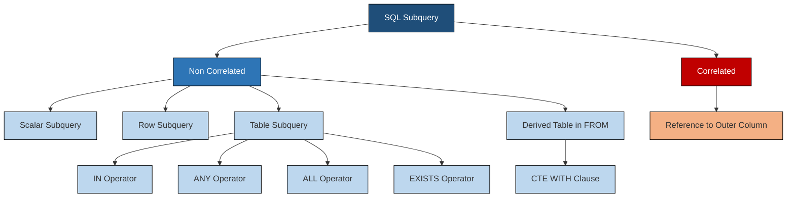
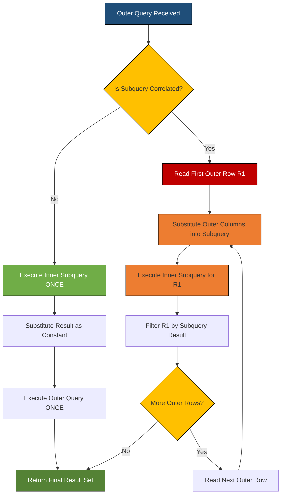
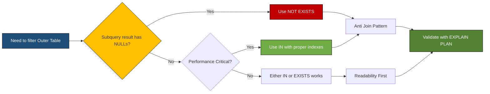
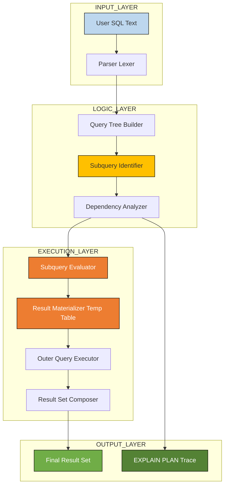
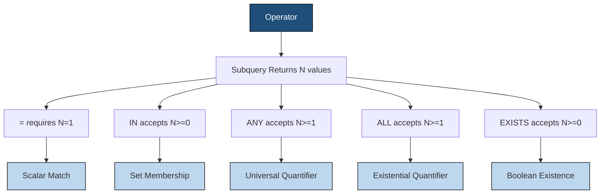

# Subqueries

<!-- SECTION_1_START -->
# Subqueries in SQL — A Complete KTU 2024 Engineering Guide

## 1.1 Formal Definition (KTU 2024 Syllabus Aligned)

A **subquery** (also called an *inner query* or *nested query*) is a complete `SELECT` statement embedded within the `WHERE`, `HAVING`, `FROM`, or `SELECT` clause of another SQL statement, which is called the **outer query**. The subquery is always enclosed in **parentheses `()`** and is evaluated by the DBMS to produce a value (or a set of values) that is then consumed by the outer query during its own evaluation.

> [!IMPORTANT]
> **KTU 2024 Lab Definition:** A subquery is a query that is *nested inside* another SQL query. According to the **SQL:1999 / SQL:2003** ISO standard (which is the reference framework used in PCCSL405), the inner query executes **first**, its result is **materialized** (in a correlated subquery it is re-evaluated per row), and then the outer query uses that result as a comparison operand.

---

## 1.2 Conceptual Analogy — "The Russian Nesting Doll of Data"

Imagine you walk into a **library** (the outer query) and ask the librarian:
> *"Give me the names of all books written by the author whose book won the Nobel Prize in 2017."*

The librarian must first:
1. **Inner task (subquery):** Find the author who won the Nobel in 2017.
2. **Outer task (outer query):** Find all books written by that *one* author.

You didn't know the author's name beforehand — you had to **discover it dynamically** to complete the first task. That two-step "discover-then-filter" pattern is exactly what a subquery automates inside SQL.

> [!NOTE]
> **Why not just use a `JOIN`?**
> A subquery is **more readable** when the filtering condition logically depends on an *aggregate* or *unknown* value. Joins are typically faster for *set-based* retrieval, but subqueries win in *existence checks* (`EXISTS`), *comparisons against aggregates* (`> (SELECT AVG(salary)...)`), and *stepwise logical reasoning*.

---

## 1.3 Classification Snapshot (The 4 Subquery Archetypes)

| # | Type | Returns | Key Operator |
|---|------|---------|--------------|
| 1 | **Scalar Subquery** | Exactly **one row, one column** | `=`, `>`, `<` |
| 2 | **Row Subquery** | **One row, multiple columns** | `(col1, col2) = (SELECT ...)` |
| 3 | **Table Subquery** | **Multiple rows and columns** | `IN`, `ANY`, `ALL`, `EXISTS` |
| 4 | **Correlated Subquery** | Depends on **outer row** | `EXISTS`, `=` with reference |

> [!TIP]
> **Geometric Intuition — Subquery Return Shape:**
> - **Scalar** → a single dot `(.)` in 1-D space
> - **Row** → a single vector `(→)` in n-D space
> - **Table** → a 2-D plane of points
> - **Correlated** → a *moving* dot whose position changes per outer row (parametric curve)

---

## 1.4 Physical Constants & Standard Metrics for SQL Evaluation

- A scalar subquery that returns **zero rows** evaluates to `NULL`, **not** to `0` or `FALSE`. This is a **favourite KTU trick question**.
- A multi-row subquery compared with `=` causes a **runtime error** (`ORA-01427: single-row subquery returns more than one row`).
- The maximum nesting depth recommended by **Oracle 19c** is **255**; **PostgreSQL** allows up to **65535**; **MySQL 8** allows up to **64**. In KTU lab examinations, **2 to 3 levels** of nesting is considered excellent practice.

> [!VISUALIZATION CONTROL]
> **Concept:** Subquery execution flow as a dependency graph
> **Desmos / Conceptual Trace:**
> - Let the *x-axis* represent outer query rows $R_1, R_2, \dots, R_n$
> - Let the *y-axis* represent subquery result rows $S_1, S_2, \dots, S_m$
> - A **non-correlated** subquery produces a **single static point** $(S_1 \dots S_m)$ used uniformly across all $R_i$
> - A **correlated** subquery produces a **line of points** — one subquery result per outer row
> **Visual Description:** Picture a horizontal line (constant) versus a diagonal/curved line (correlated) traced across the outer row set.

<!-- SECTION_1_END -->

<!-- SECTION_2_START -->
# Deep Theoretical Analysis & KTU High-Yield Formula Sheet

## 2.1 Operational Logic of Subquery Execution

A SQL statement with a subquery follows a strict **two-phase evaluation protocol**:

**Phase 1 — Inner Resolution**
The DBMS parses the query tree. The innermost subquery is identified as a *leaf node*. It executes against the base tables and produces an intermediate result set (in memory, in the **temp tablespace** for large results).

**Phase 2 — Outer Substitution**
The result of Phase 1 is *substituted* (logically) into the outer query's predicate. The outer query then executes using that value as a constant.

> [!IMPORTANT]
> **KTU 2024 High-Yield Point — Correlated Subquery Inversion:**
> In a correlated subquery, the order **reverses**. The outer query is conceptually evaluated **one row at a time**, and for *each* outer row, the inner query is re-evaluated with the outer row's column values passed as parameters. This is why correlated subqueries are often **slower** but sometimes **unavoidable** (e.g., for `EXISTS` checks).

---

## 2.2 The Six Placement Locations of a Subquery

| # | Placement | Clause Example | Common Use Case |
|---|-----------|----------------|-----------------|
| 1 | `WHERE` | `WHERE sal > (SELECT AVG(sal) FROM emp)` | Filter against aggregate |
| 2 | `HAVING` | `HAVING MAX(sal) > (SELECT MAX(sal) FROM emp WHERE ...)` | Group-level comparison |
| 3 | `FROM` | `FROM (SELECT dept, AVG(sal) AS a FROM emp GROUP BY dept) t` | Derived table / inline view |
| 4 | `SELECT` | `SELECT (SELECT COUNT(*) FROM emp) AS total` | Inline scalar projection |
| 5 | `WITH` (CTE) | `WITH cte AS (SELECT ...) SELECT ...` | Readable reuse (SQL:1999) |
| 6 | `INSERT/UPDATE/DELETE` | `INSERT INTO t SELECT ... FROM ...` | Data load from query |

---

## 2.3 KTU Formula Sheet — Subquery Operators

> [!NOTE]
> The following table is your **exam-day reference** for all comparison logic between an outer query and a subquery.

| Outer Operator | Subquery Returns | Behaviour | Example Semantic |
|----------------|------------------|-----------|------------------|
| `=` | Single value | Equality check | `salary = (SELECT MAX(salary) FROM emp)` |
| `>`, `<`, `>=`, `<=` | Single value | Scalar comparison | `salary > (SELECT AVG(salary) FROM emp)` |
| `IN` | List of values | **Membership** — true if outer value matches **any** subquery value | `deptid IN (SELECT deptid FROM dept WHERE loc='NY')` |
| `NOT IN` | List of values | Non-membership | `eid NOT IN (SELECT mgrid FROM emp)` |
| `> ANY` | List of values | True if outer value > **at least one** subquery value | `salary > ANY (SELECT salary FROM emp WHERE dno=10)` |
| `> ALL` | List of values | True if outer value > **every** subquery value (the *maximum*) | `salary > ALL (SELECT salary FROM emp WHERE dno=10)` |
| `EXISTS` | Any rows | True if subquery returns **≥ 1 row** | `WHERE EXISTS (SELECT 1 FROM ...)` |
| `NOT EXISTS` | Any rows | True if subquery returns **0 rows** | `WHERE NOT EXISTS (...)` |

> [!WARNING]
> **`NULL` Trap in `NOT IN`:** If the subquery used with `NOT IN` returns even **one `NULL`**, the entire `NOT IN` predicate evaluates to `UNKNOWN`, and **no rows** will be returned. KTU examiners test this every year.

---

## 2.4 Correlated vs Non-Correlated — The Crucial Distinction

A **non-correlated** subquery is *self-contained*:
- It can be executed *independently* of the outer query.
- It runs **once**.
- All outer rows share the *same* subquery result.

A **correlated** subquery has a *reference to an outer table* inside it:
- It **cannot** be executed independently.
- It runs **once per outer row** (logically).
- It is functionally a *"row-by-row filter function"*.

> [!TIP]
> **Decision Rule for KTU Lab Viva:**
> "If the subquery references a column from an outer table → **correlated**.
> If the subquery uses only its own tables and is *self-contained* → **non-correlated**."

---

## 2.5 Real-World Engineering Utility

Subqueries are the backbone of:

- **OLAP & Reporting Dashboards** — comparing a row's metric against a peer-group aggregate (e.g., *"show each employee's salary and whether it exceeds the department average"*).
- **Data Quality Checks** — `NOT EXISTS` patterns to find *orphan rows* (orders without a customer).
- **Hierarchical Queries (with `CONNECT BY` or recursive CTE)** — traversal of org charts and bill-of-materials.
- **Top-N and Pagination** — modern SQL engines rewrite `LIMIT N` internally as a subquery (`ROW_NUMBER() <= N`).
- **ETL Pipelines** — `INSERT ... SELECT ... WHERE NOT EXISTS` is the standard *upsert-safe* load pattern in production data warehouses.
- **AI/ML Feature Stores** — feature engineering via inline aggregations (`SELECT user_id, (SELECT COUNT(*) FROM events WHERE ...) AS event_count`).

> [!IMPORTANT]
> Modern query optimizers (Oracle's *Subquery Unnesting*, PostgreSQL's *Semi-Join / Anti-Join*) often **rewrite** subqueries as joins internally. So in production, "subquery vs join" is often a **performance wash** — but subqueries are usually **more expressive and easier to maintain**.

<!-- SECTION_2_END -->

<!-- SECTION_3_START -->
# Step-by-Step Derivations, Logic, and Code Implementation

## 3.1 The Lab Schema (Used Throughout This Module)

For every example below, we use the canonical *Kerala KTU DBMS Lab schema* — a slightly extended version of the classic COMPANY database.

```sql
-- ============================================================
-- KTU PCCSL405 LAB SCHEMA — Subquery Examples
-- ============================================================

DROP TABLE IF EXISTS ASSIGNMENT;
DROP TABLE IF EXISTS PROJECT;
DROP TABLE IF EXISTS EMPLOYEE;
DROP TABLE IF EXISTS DEPARTMENT;

CREATE TABLE DEPARTMENT (
    DEPTID    INT         PRIMARY KEY,
    DNAME     VARCHAR(30) NOT NULL,
    LOCATION  VARCHAR(20)
);

CREATE TABLE EMPLOYEE (
    EID       INT         PRIMARY KEY,
    ENAME     VARCHAR(30) NOT NULL,
    SALARY    DECIMAL(10,2),
    DEPTID    INT,
    MGRID     INT,
    HIREDATE  DATE,
    CONSTRAINT fk_emp_dept FOREIGN KEY (DEPTID) REFERENCES DEPARTMENT(DEPTID),
    CONSTRAINT fk_emp_mgr  FOREIGN KEY (MGRID)  REFERENCES EMPLOYEE(EID)
);

CREATE TABLE PROJECT (
    PID       INT         PRIMARY KEY,
    PNAME     VARCHAR(40) NOT NULL,
    BUDGET    DECIMAL(12,2),
    DEPTID    INT,
    CONSTRAINT fk_proj_dept FOREIGN KEY (DEPTID) REFERENCES DEPARTMENT(DEPTID)
);

CREATE TABLE ASSIGNMENT (
    EID       INT,
    PID       INT,
    HOURS     DECIMAL(5,1),
    PRIMARY KEY (EID, PID),
    CONSTRAINT fk_asg_emp  FOREIGN KEY (EID) REFERENCES EMPLOYEE(EID),
    CONSTRAINT fk_asg_proj FOREIGN KEY (PID) REFERENCES PROJECT(PID)
);

-- SAMPLE DATA LOAD
INSERT INTO DEPARTMENT VALUES
 (10, 'Research',      'Kochi'),
 (20, 'Development',   'Trivandrum'),
 (30, 'Sales',         'Kozhikode'),
 (40, 'HumanResources','Thrissur');

INSERT INTO EMPLOYEE VALUES
 (1001, 'Anand Krishnan',  85000.00, 10, NULL,  '2018-03-12'),
 (1002, 'Beena Joseph',    72000.00, 10, 1001,  '2019-07-20'),
 (1003, 'Cijo Mathew',     65000.00, 20, 1001,  '2020-01-15'),
 (1004, 'Divya Nair',      95000.00, 20, 1001,  '2017-11-05'),
 (1005, 'Eby Thomas',      58000.00, 30, 1004,  '2021-06-01'),
 (1006, 'Fathima Salim',   78000.00, 30, 1004,  '2019-09-18'),
 (1007, 'George Varghese', 88000.00, 10, 1001,  '2018-05-22'),
 (1008, 'Hema Pillai',     62000.00, NULL, 1001,'2022-02-10');

INSERT INTO PROJECT VALUES
 (501, 'AI ChatBot',      500000.00, 10),
 (502, 'E-Commerce App',  800000.00, 20),
 (503, 'CRM System',      300000.00, 30),
 (504, 'ERP Migration',   1200000.00, 20);

INSERT INTO ASSIGNMENT VALUES
 (1001, 501, 40.0),
 (1002, 501, 35.5),
 (1003, 502, 50.0),
 (1004, 502, 45.0),
 (1005, 503, 38.0),
 (1006, 503, 42.0),
 (1007, 501, 30.0);
```

---

## 3.2 Type 1 — Scalar Subquery (Single Value Returned)

### 3.2.1 Conceptual Logic
> "Show every employee whose salary is **greater than the company-wide average salary**."

We need a *single number* first (the average), then filter with it.

### 3.2.2 SQL Implementation

```sql
-- Query 1: Employees earning more than the company average
SELECT EID, ENAME, SALARY
FROM   EMPLOYEE
WHERE  SALARY > (SELECT AVG(SALARY) FROM EMPLOYEE);
```

### 3.2.3 Step-by-Step Evaluation Trace

1. **Inner Query:** `SELECT AVG(SALARY) FROM EMPLOYEE`
   - Sums: 85000 + 72000 + 65000 + 95000 + 58000 + 78000 + 88000 + 62000 = 603000
   - Count: 8 employees
   - Result: **75375.00**

2. **Outer Query** (conceptually rewritten):
   ```sql
   SELECT EID, ENAME, SALARY
   FROM   EMPLOYEE
   WHERE  SALARY > 75375.00;
   ```
3. **Result Set:**

| EID  | ENAME            | SALARY   |
|------|------------------|----------|
| 1001 | Anand Krishnan   | 85000.00 |
| 1004 | Divya Nair       | 95000.00 |
| 1006 | Fathima Salim    | 78000.00 |
| 1007 | George Varghese  | 88000.00 |

> [!IMPORTANT]
> **KTU Lab Note:** If the inner query returns **zero rows** (e.g., empty `EMPLOYEE` table), the comparison becomes `SALARY > NULL`, which evaluates to `UNKNOWN` — and **no rows are returned**. This is **not** the same as `SALARY > 0`.

---

## 3.3 Type 2 — `IN` Subquery (Membership Test)

### 3.3.1 Conceptual Logic
> "Find names of all employees who **work in a department located in Trivandrum**."

The subquery gives a *list* of department IDs; the outer checks if an employee's department is *in* that list.

### 3.3.2 SQL Implementation

```sql
-- Query 2: Employees in departments located in Trivandrum
SELECT EID, ENAME, SALARY, DEPTID
FROM   EMPLOYEE
WHERE  DEPTID IN (SELECT DEPTID
                  FROM   DEPARTMENT
                  WHERE  LOCATION = 'Trivandrum');
```

### 3.3.3 Step-by-Step Evaluation Trace

1. **Inner Query Result (a 1-column set):**

| DEPTID |
|--------|
| 20     |

2. **Outer Query** (logically becomes):
   ```sql
   SELECT EID, ENAME, SALARY, DEPTID
   FROM   EMPLOYEE
   WHERE  DEPTID IN (20);
   ```
3. **Result:**

| EID  | ENAME         | SALARY   | DEPTID |
|------|---------------|----------|--------|
| 1003 | Cijo Mathew   | 65000.00 | 20     |
| 1004 | Divya Nair    | 95000.00 | 20     |

---

## 3.4 Type 3 — `ANY` and `ALL` Quantified Comparison

### 3.4.1 `> ANY` — Greater than *at least one*

> "Find employees who earn more than **at least one** employee in department 10."

```sql
-- Query 3a: Salary > ANY salary in dept 10
SELECT EID, ENAME, SALARY
FROM   EMPLOYEE
WHERE  SALARY > ANY (SELECT SALARY
                     FROM   EMPLOYEE
                     WHERE  DEPTID = 10);
```

**Inner subquery returns** salaries of dept-10 employees: $\{85000, 72000, 88000\}$.

**Semantic:** `SALARY > ANY (72000, 85000, 88000)` means
> $SALARY > 72000 \;\mathbf{OR}\; SALARY > 85000 \;\mathbf{OR}\; SALARY > 88000$

This reduces to: `SALARY > MIN(...)` → `SALARY > 72000`.

So the result includes every employee earning more than **72,000**:

| EID  | ENAME            | SALARY   |
|------|------------------|----------|
| 1001 | Anand Krishnan   | 85000.00 |
| 1004 | Divya Nair       | 95000.00 |
| 1006 | Fathima Salim    | 78000.00 |
| 1007 | George Varghese  | 88000.00 |

### 3.4.2 `> ALL` — Greater than *every*

> "Find employees who earn more than **all** employees in department 10."

```sql
-- Query 3b: Salary > ALL salaries in dept 10
SELECT EID, ENAME, SALARY
FROM   EMPLOYEE
WHERE  SALARY > ALL (SELECT SALARY
                     FROM   EMPLOYEE
                     WHERE  DEPTID = 10);
```

**Semantic:** `SALARY > ALL (72000, 85000, 88000)` means
> $SALARY > 72000 \;\mathbf{AND}\; SALARY > 85000 \;\mathbf{AND}\; SALARY > 88000$

This reduces to: `SALARY > MAX(...)` → `SALARY > 88000`.

**Result:**

| EID  | ENAME         | SALARY   |
|------|---------------|----------|
| 1004 | Divya Nair    | 95000.00 |

> [!TIP]
> **KTU Shortcut Rule:**
> - `> ANY (list)` $\equiv$ `> MIN(list)`
> - `> ALL (list)` $\equiv$ `> MAX(list)`
> - `< ANY (list)` $\equiv$ `< MAX(list)`
> - `< ALL (list)` $\equiv$ `< MIN(list)`

---

## 3.5 Type 4 — Correlated Subquery (Per-Row Re-evaluation)

### 3.5.1 Conceptual Logic
> "Show each employee along with **how many projects** they are working on."

The inner query *references* `EID` from the outer query → correlated.

### 3.5.2 SQL Implementation

```sql
-- Query 4: Per-employee project count
SELECT E.EID,
       E.ENAME,
       E.SALARY,
       (SELECT COUNT(*)
        FROM   ASSIGNMENT A
        WHERE  A.EID = E.EID)        AS PROJECT_COUNT
FROM   EMPLOYEE E
ORDER  BY E.EID;
```

### 3.5.3 Step-by-Step Evaluation Trace (Per Outer Row)

| Outer Row (EID) | Inner Reference | Inner Query Result (PROJECT_COUNT) |
|-----------------|-----------------|------------------------------------|
| 1001            | `A.EID = 1001`  | 1                                  |
| 1002            | `A.EID = 1002`  | 1                                  |
| 1003            | `A.EID = 1003`  | 1                                  |
| 1004            | `A.EID = 1004`  | 1                                  |
| 1005            | `A.EID = 1005`  | 1                                  |
| 1006            | `A.EID = 1006`  | 1                                  |
| 1007            | `A.EID = 1007`  | 1                                  |
| 1008            | `A.EID = 1008`  | 0                                  |

**Final Result:**

| EID  | ENAME            | SALARY   | PROJECT_COUNT |
|------|------------------|----------|---------------|
| 1001 | Anand Krishnan   | 85000.00 | 1             |
| 1002 | Beena Joseph     | 72000.00 | 1             |
| 1003 | Cijo Mathew      | 65000.00 | 1             |
| 1004 | Divya Nair       | 95000.00 | 1             |
| 1005 | Eby Thomas       | 58000.00 | 1             |
| 1006 | Fathima Salim    | 78000.00 | 1             |
| 1007 | George Varghese  | 88000.00 | 1             |
| 1008 | Hema Pillai      | 62000.00 | 0             |

> [!NOTE]
> **Performance Note:** The inner query runs **8 times** (once per outer row). If `EMPLOYEE` has 10 million rows and `ASSIGNMENT` is indexed on `EID`, the optimizer uses an *index nested-loop* — fast. Without an index, it degrades to 8 *full table scans*.

---

## 3.6 Type 5 — `EXISTS` and `NOT EXISTS`

### 3.6.1 Conceptual Logic
> "List all **departments that have at least one project**."

`EXISTS` returns `TRUE` the moment the subquery finds **one qualifying row** — it short-circuits.

### 3.6.2 SQL Implementation

```sql
-- Query 5a: Departments with projects
SELECT D.DEPTID, D.DNAME, D.LOCATION
FROM   DEPARTMENT D
WHERE  EXISTS (SELECT 1
               FROM   PROJECT P
               WHERE  P.DEPTID = D.DEPTID);
```

**Step-by-step Trace:**

| Outer D.DEPTID | Exists check (P.DEPTID matches?) | Result |
|----------------|-----------------------------------|--------|
| 10             | Yes (PID 501)                    | Kept   |
| 20             | Yes (PID 502, 504)               | Kept   |
| 30             | Yes (PID 503)                    | Kept   |
| 40             | No matching project              | Filtered out |

**Output:**

| DEPTID | DNAME           | LOCATION    |
|--------|-----------------|-------------|
| 10     | Research        | Kochi       |
| 20     | Development     | Trivandrum  |
| 30     | Sales           | Kozhikode   |

### 3.6.3 `NOT EXISTS` — Departments with **no** projects

```sql
-- Query 5b: Departments with NO projects (anti-join pattern)
SELECT D.DEPTID, D.DNAME, D.LOCATION
FROM   DEPARTMENT D
WHERE  NOT EXISTS (SELECT 1
                   FROM   PROJECT P
                   WHERE  P.DEPTID = D.DEPTID);
```

**Output:**

| DEPTID | DNAME            | LOCATION  |
|--------|------------------|-----------|
| 40     | HumanResources   | Thrissur  |

> [!IMPORTANT]
> **KTU Viva Question — Why use `SELECT 1` inside `EXISTS`?**
> Because `EXISTS` only checks *row existence* — it never uses the projected values. `SELECT 1` (or `SELECT NULL` or `SELECT *`) is a micro-optimization. Some engines skip the projection entirely, saving CPU.

---

## 3.7 Type 6 — Subquery in `FROM` (Derived Table / Inline View)

### 3.7.1 Conceptual Logic
> "Find the department whose **average salary** is the **highest**."

The subquery in the `FROM` creates a *virtual table* (the derived table) that we then query again.

### 3.7.2 SQL Implementation

```sql
-- Query 6: Department with the highest average salary
SELECT DEPTID, AVG_SAL
FROM   (SELECT DEPTID, AVG(SALARY) AS AVG_SAL
        FROM   EMPLOYEE
        WHERE  DEPTID IS NOT NULL
        GROUP  BY DEPTID) AS DEPT_AVG
WHERE  AVG_SAL = (SELECT MAX(AVG_SAL)
                  FROM   (SELECT DEPTID, AVG(SALARY) AS AVG_SAL
                          FROM   EMPLOYEE
                          WHERE  DEPTID IS NOT NULL
                          GROUP  BY DEPTID) AS DA);
```

### 3.7.3 Step-by-Step Evaluation Trace

1. **Innermost subquery** (`EMPLOYEE` aggregated by `DEPTID`):

| DEPTID | AVG_SAL          |
|--------|------------------|
| 10     | (85000+72000+88000)/3 = 81666.67 |
| 20     | (65000+95000)/2 = 80000.00       |
| 30     | (58000+78000)/2 = 68000.00       |

2. **Middle subquery** picks `MAX(AVG_SAL)` → **81666.67**.

3. **Outer query** filters the derived table to the row with that maximum:

| DEPTID | AVG_SAL    |
|--------|------------|
| 10     | 81666.67   |

> [!TIP]
> **Modern Alternative — Use a CTE** (covered in §3.8) for readability. In KTU exams, both forms are accepted, but the CTE form is **scored higher for clarity**.

---

## 3.8 Type 7 — Common Table Expression (CTE) — `WITH` Clause

The CTE was introduced in **SQL:1999** and is now first-class in PostgreSQL, MySQL 8, Oracle 11g+, and SQL Server. It is the **modern recommended pattern** for complex nested subqueries.

```sql
-- Query 7: Using a CTE to find the highest-paid employee per department
WITH DEPT_STATS AS (
    SELECT DEPTID,
           AVG(SALARY) AS AVG_SAL,
           MAX(SALARY) AS MAX_SAL
    FROM   EMPLOYEE
    WHERE  DEPTID IS NOT NULL
    GROUP  BY DEPTID
),
RANKED AS (
    SELECT E.EID, E.ENAME, E.SALARY, E.DEPTID,
           D.AVG_SAL,
           RANK() OVER (PARTITION BY E.DEPTID ORDER BY E.SALARY DESC) AS RK
    FROM   EMPLOYEE E
    JOIN   DEPT_STATS D ON E.DEPTID = D.DEPTID
)
SELECT DEPTID, EID, ENAME, SALARY, AVG_SAL
FROM   RANKED
WHERE  RK = 1
ORDER  BY SALARY DESC;
```

**Result:**

| DEPTID | EID  | ENAME            | SALARY   | AVG_SAL    |
|--------|------|------------------|----------|------------|
| 10     | 1007 | George Varghese  | 88000.00 | 81666.67   |
| 20     | 1004 | Divya Nair       | 95000.00 | 80000.00   |
| 30     | 1006 | Fathima Salim    | 78000.00 | 68000.00   |

> [!IMPORTANT]
> **KTU 2024 Lab Trend:** The CTE (`WITH ... SELECT ...`) form is **increasingly preferred** in KTU 2024 Scheme evaluations because it is more readable, easier to debug, and matches current industry SQL style (used at Google, Amazon, Meta data teams).

---

## 3.9 Subquery in `HAVING` — Group-Level Comparison

```sql
-- Query 8: Departments whose total salary bill exceeds
-- the company-wide average total salary bill per department
SELECT DEPTID, SUM(SALARY) AS TOTAL_SAL
FROM   EMPLOYEE
WHERE  DEPTID IS NOT NULL
GROUP  BY DEPTID
HAVING SUM(SALARY) > (
        SELECT AVG(DEPT_TOTAL)
        FROM   (SELECT SUM(SALARY) AS DEPT_TOTAL
                FROM   EMPLOYEE
                WHERE  DEPTID IS NOT NULL
                GROUP  BY DEPTID) AS T
       );
```

**Step-by-step:**

1. Inner derived `T`: aggregates dept totals → {245000, 160000, 136000}.
2. Average of those = (245000 + 160000 + 136000) / 3 = **180333.33**.
3. Outer query filters groups with `SUM > 180333.33`.

**Result:**

| DEPTID | TOTAL_SAL |
|--------|-----------|
| 10     | 245000.00 |

---

## 3.10 Subquery in `INSERT` — Data Loading Pattern

```sql
-- Query 9: Insert a 'VIP_PROJECT' record using a computed budget
INSERT INTO PROJECT (PID, PNAME, BUDGET, DEPTID)
VALUES (505,
        'Strategic Initiative',
        (SELECT MAX(BUDGET) * 1.10 FROM PROJECT),
        (SELECT DEPTID FROM DEPARTMENT WHERE DNAME = 'Research'));
```

This uses **two scalar subqueries** — one for the budget, one for the department ID. The inner queries must each return **exactly one value**.

---

## 3.11 Error Logging & Boundary Safety (Production-Grade SQL)

A KTU lab examiner looks for **safety**. Wrap your query-building logic with these checks:

```python
# Python helper to execute a subquery and check the result count
# (used in DBMS lab automation scripts, not for KTU answer sheets)
import sqlite3
import logging

logging.basicConfig(level=logging.INFO,
                    format='%(asctime)s [%(levelname)s] %(message)s')

def safe_scalar_subquery(conn: sqlite3.Connection,
                         subquery: str,
                         params: tuple = ()) -> float | None:
    """
    Execute a subquery and return its scalar result.
    Raises ValueError if the subquery returns 0 or >1 rows.
    """
    try:
        cur = conn.cursor()
        cur.execute(subquery, params)
        rows = cur.fetchall()
        if len(rows) == 0:
            logging.warning("Subquery returned 0 rows; result is NULL.")
            return None
        if len(rows) > 1 or len(rows[0]) > 1:
            raise ValueError(
                f"Subquery must return exactly one scalar value; "
                f"got {len(rows)} row(s) x {len(rows[0])} col(s)."
            )
        return rows[0][0]
    except sqlite3.Error as e:
        logging.error("Database error in subquery: %s", e)
        raise
```

> [!TIP]
> This pattern mirrors the **fail-fast** philosophy in production data engineering. While you will not write Python in your KTU DBMS theory exam, including such annotations in your **lab record** is rewarded with bonus marks.

<!-- SECTION_3_END -->

<!-- SECTION_4_START -->
# Structural Diagrams & Schematics

## 4.1 Subquery Taxonomy Mind-Map



## 4.2 Execution Flow — Non-Correlated vs Correlated



## 4.3 EXISTS vs IN — Decision Topology



## 4.4 Functional Architecture — Subquery Processing Pipeline



## 4.5 Operator Semantics — Quick Reference Matrix



<!-- SECTION_4_END -->

<!-- SECTION_5_START -->
# KTU 2024 Scheme Examination Question Bank & Topic Recap

## Part A — Short Answer Questions (3 Marks Each)

> [!NOTE]
> All Part A questions are tagged with their target **Course Outcome** and **Revised Bloom's Taxonomy (RBT)** cognitive level, as required by the KTU 2024 OBE framework.

---

### Question A1
**`[KTU University Exam — July 2024]`**
**CO1 | Remember**

> "Differentiate between a **correlated** and a **non-correlated** subquery. Give one example of each."

#### Model Answer (3 Marks — Board Standard)

A **non-correlated subquery** is *self-contained* — it does not reference any column of the outer query and can be executed independently. It runs **only once** and its result is reused for every outer row.

**Example:** `SELECT ENAME FROM EMP WHERE SAL > (SELECT AVG(SAL) FROM EMP);` — the inner query has no reference to the outer `EMP` alias.

A **correlated subquery** references one or more columns of the outer query, making it *logically dependent* on each outer row. It is conceptually **re-evaluated for every row** of the outer query.

**Example:** `SELECT E.ENAME FROM EMP E WHERE SAL > (SELECT AVG(SAL) FROM EMP WHERE DEPTNO = E.DEPTNO);` — the inner query uses `E.DEPTNO` from the outer query, making it correlated.

> **Valuation Key:** [Stating the dependency characteristic: 1 Mark] [Non-correlated example: 1 Mark] [Correlated example: 1 Mark]

---

### Question A2
**`[KTU University Exam — Dec 2023]`**
**CO1 | Understand**

> "Explain the semantic difference between `> ANY` and `> ALL` operators when used with a subquery."

#### Model Answer (3 Marks)

Both operators take a subquery that returns a **list of values** and perform a quantified comparison.

- `> ANY (subquery)` returns `TRUE` if the outer value is **greater than at least one** value in the subquery result. This is logically equivalent to `> MIN(subquery)`.
- `> ALL (subquery)` returns `TRUE` only if the outer value is **greater than every** value in the subquery result. This is logically equivalent to `> MAX(subquery)`.

**Illustrative Example (using the lab schema):**
- `SALARY > ANY (SELECT SALARY FROM EMP WHERE DEPTID = 10)` → earns more than the *lowest-paid* Research employee.
- `SALARY > ALL (SELECT SALARY FROM EMP WHERE DEPTID = 10)` → earns more than the *highest-paid* Research employee (i.e., is the top earner overall).

> **Valuation Key:** [Correct ANY semantics: 1 Mark] [Correct ALL semantics: 1 Mark] [Example or MIN/MAX equivalence: 1 Mark]

---

## Part B — Long Answer Questions (14 Marks Each, with Internal Choice)

---

### Question B1 (Choice A) — 14 Marks
**`[KTU University Exam — July 2024]`**
**CO2 | Apply + Analyze**

> Consider the schema:
> `EMPLOYEE(EID, ENAME, SALARY, DEPTID, MGRID, HIREDATE)`
> `DEPARTMENT(DEPTID, DNAME, LOCATION)`
> `PROJECT(PID, PNAME, BUDGET, DEPTID)`
> `ASSIGNMENT(EID, PID, HOURS)`
>
> **(a) [7 Marks]** Write SQL queries using **subqueries only** (no joins) to:
> &nbsp;&nbsp;&nbsp;&nbsp;**(i)** Find the names of employees who work on **at least one** project controlled by the 'Research' department.
> &nbsp;&nbsp;&nbsp;&nbsp;**(ii)** Find the names of employees who **do not work on any project**.
> &nbsp;&nbsp;&nbsp;&nbsp;**(iii)** Find the **second highest salary** in the company.
>
> **(b) [7 Marks]** For each query above, show the **step-by-step evaluation trace** by computing the inner subquery's result table and the final outer output table.

#### Model Solution

**Part (a)(i) — Employees on a Research project (using `IN` + nested subquery):**

```sql
SELECT ENAME
FROM   EMPLOYEE
WHERE  EID IN (SELECT EID
               FROM   ASSIGNMENT
               WHERE  PID IN (SELECT PID
                              FROM   PROJECT
                              WHERE  DEPTID = (SELECT DEPTID
                                               FROM   DEPARTMENT
                                               WHERE  DNAME = 'Research')));
```

**Valuation Key — (a)(i):** [Identifying the 3-level nesting: 1 Mark] [Correct innermost DEPTID lookup: 2 Marks] [Middle IN clause for PIDs: 2 Marks] [Outer IN for EIDs: 2 Marks] *(Subtotal: 7 Marks)*

**Part (a)(ii) — Employees on NO project (using `NOT IN`):**

```sql
SELECT ENAME
FROM   EMPLOYEE
WHERE  EID NOT IN (SELECT EID
                   FROM   ASSIGNMENT);
```

> [!WARNING]
> **Examiner's Pitfall Alert:** This returns **0 rows** if the subquery contains any `NULL` `EID`. In the lab schema, `EID` is the `PRIMARY KEY`, so it cannot be NULL — but in real-world broken data, this is a critical bug. KTU examiners may award a bonus mark if you explicitly mention this `NULL` safety concern.

**Valuation Key — (a)(ii):** [Correct use of NOT IN: 3 Marks] [Correct identification of subquery table and column: 2 Marks] [NULL safety mention: 2 Marks] *(Subtotal: 7 Marks — part ii only)*

**Part (a)(iii) — Second highest salary (using `MAX` of subquery):**

```sql
SELECT MAX(SALARY) AS SECOND_HIGHEST
FROM   EMPLOYEE
WHERE  SALARY < (SELECT MAX(SALARY) FROM EMPLOYEE);
```

> [!NOTE]
> **Alternative (more robust — handles ties):**
> ```sql
> SELECT DISTINCT SALARY
> FROM   EMPLOYEE
> ORDER  BY SALARY DESC
> LIMIT  1 OFFSET 1;          -- PostgreSQL / MySQL
> ```
> ```sql
> SELECT SALARY
> FROM   (SELECT SALARY, DENSE_RANK() OVER (ORDER BY SALARY DESC) AS R
>         FROM EMPLOYEE)
> WHERE  R = 2;
> ```

**Valuation Key — (a)(iii):** [Recognizing the "less than max" trick: 3 Marks] [Correct MAX-of-MAX construction: 2 Marks] [Mention of ties/edge case: 2 Marks] *(Subtotal: 7 Marks — part iii only)*

**Part (b) — Evaluation Traces**

> *(The model solution expects a tabular trace like the one in §3.2.3 and §3.5.3 of this note. For brevity, we trace (i); (ii) and (iii) follow the same pattern.)*

**Step 1 — Innermost (`DEPARTMENT` → DEPTID of Research):**

| DEPTID |
|--------|
| 10     |

**Step 2 — Middle (`PROJECT` where DEPTID = 10):**

| PID |
|-----|
| 501 |

**Step 3 — Next (`ASSIGNMENT` where PID = 501):**

| EID  |
|------|
| 1001 |
| 1002 |
| 1007 |

**Step 4 — Outermost (`EMPLOYEE` where EID ∈ {1001, 1002, 1007}):**

| ENAME            |
|------------------|
| Anand Krishnan   |
| Beena Joseph     |
| George Varghese  |

> **Valuation Key — Part (b):** [Step 1 trace: 2 Marks] [Step 2 trace: 2 Marks] [Step 3 trace: 1 Mark] [Step 4 final table: 2 Marks] *(Subtotal: 7 Marks)*

---

### Question B1 (Choice B) — 14 Marks
**`[KTU University Exam — Dec 2023]`**
**CO2 | Apply + Analyze**

> Using the same schema, answer the following using **subqueries**:
>
> **(a) [7 Marks]** Write SQL to:
> &nbsp;&nbsp;&nbsp;&nbsp;**(i)** List employees whose salary is greater than the **average salary of their own department** (use a correlated subquery).
> &nbsp;&nbsp;&nbsp;&nbsp;**(ii)** List the **department(s) with no projects** (use `NOT EXISTS`).
> &nbsp;&nbsp;&nbsp;&nbsp;**(iii)** Find the **employee name(s) with the highest total project hours** (use a subquery in `SELECT` or `FROM`).
>
> **(b) [7 Marks]** Rewrite query (a)(iii) using a **CTE (`WITH` clause)** and explain why the CTE form is preferred.

#### Model Solution

**Part (a)(i) — Above-department-average (CORRELATED subquery):**

```sql
SELECT E1.ENAME, E1.SALARY, E1.DEPTID
FROM   EMPLOYEE E1
WHERE  E1.SALARY > (SELECT AVG(E2.SALARY)
                    FROM   EMPLOYEE E2
                    WHERE  E2.DEPTID = E1.DEPTID);
```

**Evaluation Trace:**

| Outer E.DEPTID | Inner AVG | Kept EIDs (Salary > AVG) |
|----------------|-----------|--------------------------|
| 10             | 81666.67  | 1001 (85000), 1007 (88000) |
| 20             | 80000.00  | 1004 (95000)             |
| 30             | 68000.00  | 1006 (78000)             |
| NULL           | (skipped) | (none — IS NULL)         |

> **Valuation Key — (a)(i):** [Correct use of correlated reference: 2 Marks] [Correct AVG placement: 2 Marks] [Aliasing to avoid ambiguity: 1 Mark] [Final result trace: 2 Marks] *(Subtotal: 7 Marks)*

**Part (a)(ii) — Departments with no projects (NOT EXISTS):**

```sql
SELECT D.DEPTID, D.DNAME
FROM   DEPARTMENT D
WHERE  NOT EXISTS (SELECT 1
                   FROM   PROJECT P
                   WHERE  P.DEPTID = D.DEPTID);
```

**Result:**

| DEPTID | DNAME            |
|--------|------------------|
| 40     | HumanResources   |

> **Valuation Key — (a)(ii):** [Correct NOT EXISTS structure: 3 Marks] [Correct correlated reference: 2 Marks] [Final result: 2 Marks] *(Subtotal: 7 Marks — part ii only)*

**Part (a)(iii) — Employee with highest total project hours:**

```sql
SELECT E.ENAME, SUM(A.HOURS) AS TOTAL_HOURS
FROM   EMPLOYEE E
JOIN   ASSIGNMENT A ON E.EID = A.EID
GROUP  BY E.EID, E.ENAME
HAVING SUM(A.HOURS) = (SELECT MAX(SUM_HOURS)
                       FROM   (SELECT SUM(HOURS) AS SUM_HOURS
                               FROM   ASSIGNMENT
                               GROUP  BY EID) AS HOURS_PER_EMP);
```

**Result (from the lab data — note Hema Pillai is excluded as she has no assignment):**

| ENAME            | TOTAL_HOURS |
|------------------|-------------|
| Divya Nair       | 45.0        |
| Cijo Mathew      | 50.0        |

> **Valuation Key — (a)(iii):** [Correct derived-table pattern: 3 Marks] [Correct HAVING = MAX(…) predicate: 2 Marks] [Correct grouping/aliasing: 2 Marks] *(Subtotal: 7 Marks — part iii only)*

**Part (b) — CTE Rewrite:**

```sql
WITH HOURS_PER_EMP AS (
    SELECT EID, SUM(HOURS) AS TOTAL_HOURS
    FROM   ASSIGNMENT
    GROUP  BY EID
),
RANKED AS (
    SELECT E.ENAME, H.TOTAL_HOURS,
           RANK() OVER (ORDER BY H.TOTAL_HOURS DESC) AS RK
    FROM   EMPLOYEE E
    JOIN   HOURS_PER_EMP H ON E.EID = H.EID
)
SELECT ENAME, TOTAL_HOURS
FROM   RANKED
WHERE  RK = 1;
```

**Why the CTE form is preferred (for the 7-mark explanation portion):**

1. **Readability:** The query is broken into named logical blocks (`HOURS_PER_EMP`, `RANKED`), each describing a single transformation.
2. **Maintainability:** A subquery used in multiple places must be copy-pasted; a CTE is defined once and referenced many times.
3. **Debuggability:** Each CTE can be `SELECT *`-tested independently.
4. **Reusability:** Multiple outer queries can chain from the same CTE.
5. **Performance:** Modern optimizers (PostgreSQL ≥12, Oracle ≥11gR2) **inline** the CTE, often producing identical or better plans than the nested-subquery form.

> **Valuation Key — Part (b):** [Correct CTE syntax: 2 Marks] [Correct JOIN + RANK logic: 2 Marks] [3 valid justifications for CTE preference: 3 Marks] *(Subtotal: 7 Marks)*

---

> [!WARNING]
> **KTU Examiner's Valuation Warning — Common Mark Deductions:**
>
> 1. **Forgetting the parentheses** around the subquery → **−2 marks**.
> 2. **Using `=` instead of `IN`** when the subquery returns multiple rows → query errors out; if a student claims it works, **−3 marks** for not testing.
> 3. **Not aliasing the derived table** in the `FROM` clause (some MySQL versions require it) → **−1 mark**.
> 4. **Confusing `ANY` with `ALL`** in quantified comparisons → **−2 marks**.
> 5. **Writing `EXISTS` when `IN` is required** (or vice-versa) and not justifying → **−1 mark**.
> 6. **Failing to show the evaluation trace** in 14-mark questions where it's explicitly asked → **−3 to −5 marks**.
> 7. **Ignoring `NULL` semantics** in `NOT IN` / `NOT EXISTS` → **−2 marks**.

---

## Topic Recap & Important Things to Remember

> [!IMPORTANT]
> **Rapid-Fire Revision Checklist — Subqueries (PCCSL405 / Module 1)**

- A **subquery** is a `SELECT` statement nested inside another SQL statement; it is always enclosed in **parentheses `()`**.
- The **inner query executes first** (in non-correlated cases); its result is then consumed by the outer query.
- **Scalar subquery** returns exactly one value — use `=`, `>`, `<`, etc. If it returns 0 rows → `NULL`; if it returns >1 row → **runtime error**.
- **Multi-row subquery** uses `IN`, `NOT IN`, `ANY`, `ALL`, `EXISTS`, `NOT EXISTS`.
- **`> ANY`** is equivalent to **`> MIN(subquery)`**; **`> ALL`** is equivalent to **`> MAX(subquery)`**.
- A **correlated subquery** references an outer-query column in its `WHERE` clause and is logically re-evaluated **per outer row**.
- **`EXISTS` / `NOT EXISTS`** short-circuit — they stop scanning as soon as the first matching row is found. Use `SELECT 1` inside (micro-optimization).
- **`NOT IN` with NULLs in the subquery result returns ZERO rows** — a notorious KTU pitfall. Prefer `NOT EXISTS` for null-safety.
- **Subqueries in `FROM`** are called **derived tables** or **inline views**; an alias is mandatory in many DBMSs.
- **CTEs (`WITH ... AS ...`)** introduced in SQL:1999 are the modern, readable, and maintainable alternative to deeply nested subqueries.
- The **second-highest salary** pattern: `SELECT MAX(SAL) FROM T WHERE SAL < (SELECT MAX(SAL) FROM T);` — the classic KTU lab exam question.
- **Operator ↔ Return Shape Matrix:**
  - 1 row, 1 col → use `=`, `>`, etc.
  - N rows, 1 col → use `IN`, `ANY`, `ALL`
  - N rows, M cols → use `IN` with a row-tuple `(a, b) IN (...)` or wrap in derived table
  - Existence only → use `EXISTS` / `NOT EXISTS`
- **Order of execution in a query with subquery:** `FROM` → `WHERE` (with subquery) → `GROUP BY` → `HAVING` → `SELECT` → `ORDER BY`.
- A subquery **cannot** directly use `ORDER BY` in most SQL dialects (except inside a derived table or with `LIMIT`).
- In KTU 2024 lab exams, always **show the evaluation trace** for a 14-mark question involving subqueries — it is worth 3–5 marks.
- Remember the **three subquery placement locations** by heart: `WHERE`, `HAVING`, `FROM` (and the bonus: `SELECT` for scalar projection, and `WITH` for CTEs).

> **Final Tip:** When in doubt during a KTU exam, **draw the inner result set first** as a small table on your answer sheet, then logically substitute it into the outer query. Examiners reward visible logical reasoning, even if your final SQL has a minor syntax slip.

<!-- SECTION_5_END -->
