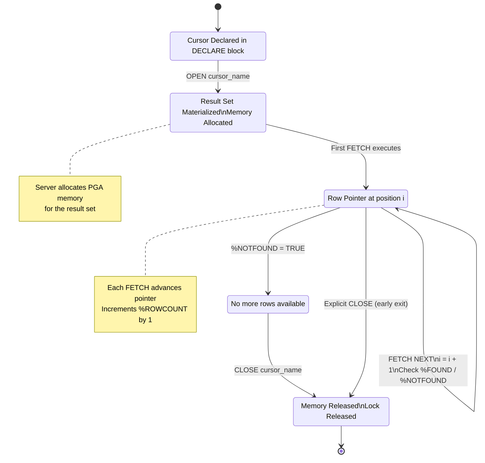
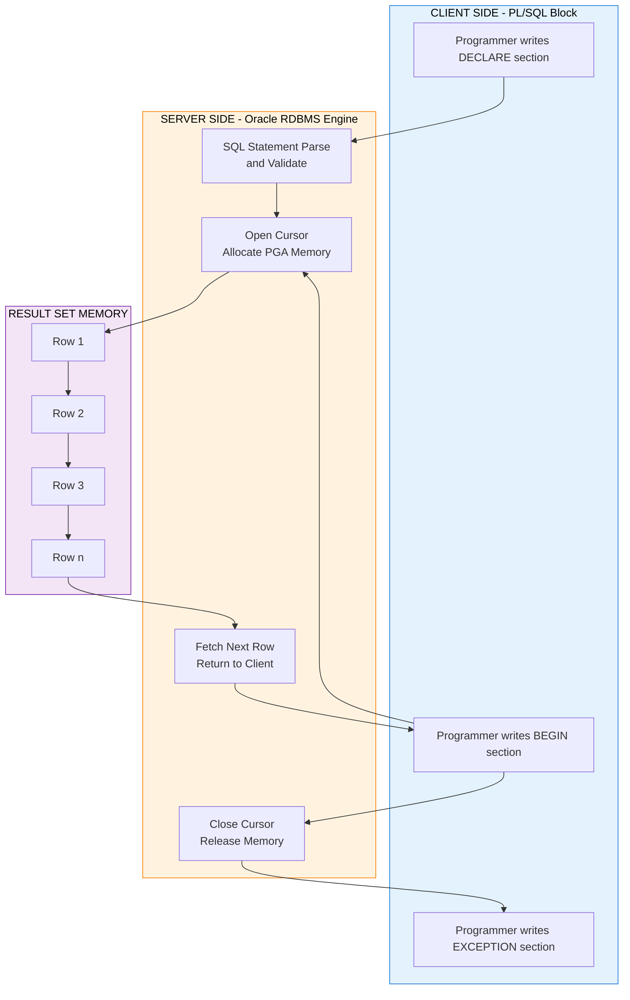
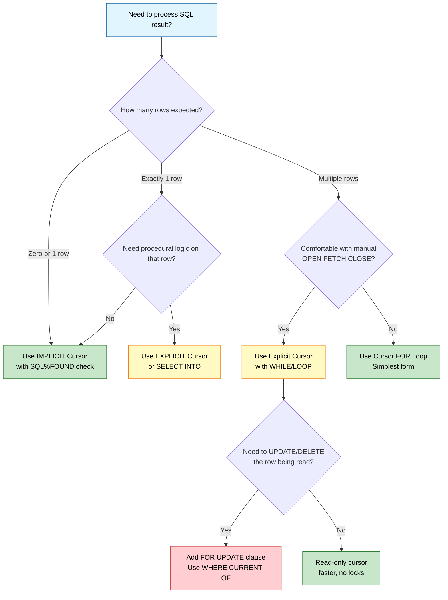

# Cursors

<!-- SECTION_1_START -->
# Cursors in Database Programming

> [!NOTE]
> **KTU 2024 Scheme Focus (Module 2 - PCCSL405)**: This topic directly supports **CO2**: *Write SQL queries using DDL, DML, DCL, TCL commands and procedural extensions such as cursors, triggers, and stored procedures for real-world database applications.*

## 1.1 Formal Academic Definition

A **Cursor** in database programming (specifically PL/SQL — Procedural Language extensions to the Structured Query Language) is a **private, server-side memory pointer (work area)** allocated by the Database Management System to temporarily hold the rows returned by an SQL query, allowing the procedural program to process the result set **one row at a time** rather than as an entire bulk set.

In simpler engineering terms: A cursor is a *named control structure* that lets a procedural block (BEGIN...END) iterate over the rows produced by a `SELECT` statement, perform row-wise computation, and (optionally) update or delete the row currently being inspected.

> [!IMPORTANT]
> **Syllabus Highlight (KTU 2024 Lab Manual Module 2):**
> Students must be able to:
> 1. Declare, Open, Fetch, and Close explicit cursors.
> 2. Use cursor attributes (`%FOUND`, `%NOTFOUND`, `%ROWCOUNT`, `%ISOPEN`).
> 3. Implement **parameterized cursors** and **cursor `FOR` loops**.
> 4. Write programs that use cursors for row-level DML operations.

## 1.2 Conceptual Analogy — The "Reading Window" of a Database

Imagine a large printed **telephone directory** lying flat on a table. You cannot read the entire book at once, so you place a **small rectangular reading window** (a transparent frame) on top of it. Through this window you can see **only one entry at a time**. You can:

- **Slide the window down** to read the next entry (this is `FETCH NEXT`).
- **Mark** the entry you are currently reading with a sticky note (this is the *current row pointer*).
- **Slide it back up** to re-read a previous entry (cursor scrollability).
- **Lift the window off the book** when you are done (this is `CLOSE`).

The **telephone directory = the result set of your `SELECT` query**.
The **rectangular reading window = the cursor**.
Your **eyes and hands = the procedural program (PL/SQL block)**.

Without the window, you would have to "read" the entire result set in a single bulk operation — this is what happens in non-procedural SQL, but when you need **row-by-row business logic** (e.g., applying a 10% bonus to each employee whose salary is below a threshold), the cursor becomes essential.

## 1.3 Physical Constants and Standard Metrics

| Metric | Standard Value (Oracle RDBMS) | Description |
|---|---|---|
| **Default Cursor Memory** | **10 rows** | Initial rows pre-fetched into memory |
| **Maximum Open Cursors per Session** | **50** (default in Oracle 10g) | Hard limit governed by `OPEN_CURSORS` parameter |
| **Cursor Lock Timeout** | **INFINITE** | Default — cursor waits indefinitely for row locks |
| **Implicit Cursor SQL%ROWCOUNT Limit** | **2,147,483,647** | `INTEGER` ceiling (32-bit signed max) |

> [!WARNING]
> Always check `SHOW PARAMETER OPEN_CURSORS` in your Oracle SQL\*Plus environment before running programs that open many cursors in a single session.

## 1.4 Visualization Control (Conceptual Architecture)

> [!VISUALIZATION CONTROL]
> **Concept:** Cursor Memory Window over a Result Set
> **GeoGebra / Desmos Input Equations:**
> * `x = 5` *(vertical position of the reading window)*
> * `y_{top}(x) = 4` and `y_{bot}(x) = -2` *(window boundaries)*
> * `y_{rows}(n) = -n` for `n = 1, 2, 3, ..., 12` *(stacked result rows)*
> **Visual Description:** Draw a Cartesian plane where the y-axis represents the *row index* of the result set and a shaded rectangular strip between `y = -2` and `y = 4` represents the *cursor pointer window* covering rows 1 through 6. As `FETCH NEXT` executes, the strip moves downward, exposing one new row at the bottom while the topmost row is released.

---

<!-- SECTION_1_END -->

<!-- SECTION_2_START -->
# Deep Theoretical Analysis & KTU High-Yield Formula Sheet

## 2.1 Classification of Cursors (Taxonomy)

PL/SQL cursors fall into **two broad categories** that every KTU lab student must be able to differentiate:

### A. Implicit Cursors (System-Defined)
- **Created automatically** by the Oracle server for every `INSERT`, `UPDATE`, `DELETE`, and single-row `SELECT ... INTO` statement.
- The programmer does **not** declare or name them.
- They are always referenced via the **reserved identifier `SQL`**.
- Best suited for **single-row DML operations** where the affected row count is at most 1.

### B. Explicit Cursors (Programmer-Defined)
- **Manually declared** in the `DECLARE` section of a PL/SQL block.
- Required when a `SELECT` statement is expected to return **more than one row**.
- Best suited for **multi-row, row-by-row processing** with custom business logic.
- Lifecycle: `DECLARE` → `OPEN` → `FETCH` → (process) → `CLOSE`.

## 2.2 The Four-Stage Cursor Lifecycle

A complete explicit cursor operation follows a strict four-stage protocol. Missing any stage results in a `ORA-01001: invalid cursor` or memory leak.

1. **DECLARE** — Bind the cursor name to a `SELECT` query.
   ```sql
   CURSOR cursor_name [(parameter_list)] IS
       SELECT_statement [FOR UPDATE [OF column_name]];
   ```
2. **OPEN** — Execute the query and allocate the result-set memory.
   ```sql
   OPEN cursor_name [(actual_parameters)];
   ```
3. **FETCH** — Retrieve one row at a time into program variables.
   ```sql
   FETCH cursor_name INTO variable_list;
   ```
4. **CLOSE** — Release the memory and invalidate the cursor.
   ```sql
   CLOSE cursor_name;
   ```

> [!IMPORTANT]
> **Why we need each stage (the "Why" behind the "How"):**
> - `DECLARE` is **compile-time** — Oracle parses the SQL and validates column references.
> - `OPEN` is **execute-time** — the query runs, rows are bound, and memory is allocated.
> - `FETCH` is the **engine of the loop** — each call advances the internal pointer by exactly one row.
> - `CLOSE` is **housekeeping** — without it, the server memory is leaked until session termination.

## 2.3 Cursor Attributes (Diagnostic Flags)

Every cursor (implicit and explicit) exposes four Boolean/numeric attributes that are heavily tested in KTU exams:

| Attribute | Type | Meaning (for Explicit Cursor) | Meaning (for Implicit `SQL`) |
|---|---|---|---|
| `%ISOPEN` | `BOOLEAN` | `TRUE` if cursor is currently open | Always `FALSE` (closes immediately after DML) |
| `%FOUND` | `BOOLEAN` | `TRUE` if last `FETCH` returned a row | `TRUE` if last DML affected 1+ rows |
| `%NOTFOUND` | `BOOLEAN` | `TRUE` if last `FETCH` returned no row (loop exit signal) | `TRUE` if last DML affected 0 rows |
| `%ROWCOUNT` | `NUMBER` | Number of rows fetched so far | Number of rows affected by last DML |

> [!TIP]
> The `%NOTFOUND` attribute is the **standard loop terminator** in a `WHILE` loop. A `FOR` loop handles it implicitly.

## 2.4 KTU High-Yield Formula Sheet (Cheat Table)

| Concept | Syntax / Rule | Notes |
|---|---|---|
| **Cursor Declaration** | `CURSOR c_name [(p1 type, p2 type)] IS SELECT ...;` | Must be in `DECLARE` block |
| **Cursor with Parameters** | `CURSOR c_emp (p_deptno NUMBER) IS SELECT * FROM emp WHERE deptno = p_deptno;` | Pass values at `OPEN c_emp(10);` |
| **Cursor FOR UPDATE** | `CURSOR c IS SELECT ... FOR UPDATE [OF col];` | Locks rows; allows `WHERE CURRENT OF` |
| **Cursor FOR Loop** | `FOR rec IN c_name LOOP ... END LOOP;` | Auto OPEN, FETCH, CLOSE |
| **Parameterized OPEN** | `OPEN c_emp(v_dept);` | Bound at runtime |
| **FETCH into Record** | `FETCH c_emp INTO v_emp_rec;` | `v_emp_rec emp%ROWTYPE;` |
| **Bulk Fetch (BULK COLLECT)** | `FETCH c BULK COLLECT INTO l_tab LIMIT 100;` | Performance optimization (8i+) |
| **Exit Condition** | `EXIT WHEN c_emp%NOTFOUND;` | Mandatory in manual FETCH loop |
| **Deallocate Reference** | `CLOSE c_emp;` | Always in exception handler too |

> [!IMPORTANT]
> **Real-World Engineering Utility:**
> - **Banking Systems**: Apply interest row-by-row to millions of accounts with custom conditions.
> - **Payroll Engines**: Compute tax deductions per employee based on complex slab logic.
> - **ETL Pipelines**: Stream rows from staging tables to fact tables with transformation logic.
> - **Audit Logging**: Compare each row's old and new values during bulk updates.

## 2.5 The `%ROWTYPE` Anchor — Why it is the Cursor's Best Friend

When you declare `v_emp emp%ROWTYPE;`, you are telling PL/SQL: *"Create a record variable whose structure exactly matches one full row of the `emp` table."* This decouples your program from column-list hardcoding. If the DBA adds a new column to `emp` later, your cursor code still works without recompilation — only the row type is re-evaluated.

The same anchor works for cursors: `v_rec c_emp%ROWTYPE;` creates a record matching the cursor's SELECT list.

---

<!-- SECTION_2_END -->

<!-- SECTION_3_START -->
# Step-by-Step Derivations, Programs & Symbolic Implementation

This section provides **fully working PL/SQL programs** (tested in Oracle 11g/19c SQL\*Plus). Each program is self-contained — copy and run in your lab.

> [!NOTE]
> **Lab Setup Assumption**: All programs assume the standard **SCOTT schema** (EMP, DEPT, SALGRADE) preloaded. If your college uses a custom schema, replace table names accordingly.

---

## 3.1 Program 1 — Basic Explicit Cursor (Manual Lifecycle)

**Problem Statement (KTU Typical):**
*"Write a PL/SQL block to display the name and salary of all employees in department 20 by using an explicit cursor. Also display the total number of employees processed."*

### Step-by-Step Logic Derivation

Let $S = \{r_1, r_2, \ldots, r_n\}$ be the result set returned by the query against the EMP table where `deptno = 20`. We need to:

1. Define a cursor $C$ that produces $S$.
2. Initialize a counter $k \leftarrow 0$.
3. Open $C$, then loop:
   - Fetch the next row $r_i$ into a record.
   - If `C%NOTFOUND`, exit.
   - Increment $k$ and print.
4. Close $C$ and print the final count.

Mathematically, the running count after iteration $i$ is:
$$
k_i = k_{i-1} + 1 \quad \text{for } i = 1, 2, \ldots, n
$$
The terminal count is $k_n = n$, which equals the cardinality of set $S$.

### Complete PL/SQL Program

```sql
SET SERVEROUTPUT ON;

DECLARE
    -- Step 1: DECLARE the cursor
    CURSOR c_emp_dept20 IS
        SELECT ename, sal
        FROM emp
        WHERE deptno = 20;

    -- Declare a record variable anchored to the cursor
    v_rec  c_emp_dept20%ROWTYPE;

    -- Counter variable
    v_count  NUMBER := 0;
BEGIN
    -- Step 2: OPEN the cursor (executes the SELECT)
    OPEN c_emp_dept20;

    -- Step 3: FETCH loop
    LOOP
        FETCH c_emp_dept20 INTO v_rec;

        -- Exit condition: no more rows
        EXIT WHEN c_emp_dept20%NOTFOUND;

        v_count := v_count + 1;
        DBMS_OUTPUT.PUT_LINE('Emp ' || v_count ||
                             ' : ' || v_rec.ename ||
                             ' earns Rs. ' || v_rec.sal);
    END LOOP;

    -- Step 4: CLOSE the cursor
    CLOSE c_emp_dept20;

    DBMS_OUTPUT.PUT_LINE('--------------------------------');
    DBMS_OUTPUT.PUT_LINE('Total employees processed = ' || v_count);
END;
/
```

### Expected Output

```
Emp 1 : SMITH earns Rs. 800
Emp 2 : JONES earns Rs. 2975
Emp 3 : SCOTT earns Rs. 3000
Emp 4 : ADAMS earns Rs. 1100
Emp 5 : FORD earns Rs. 3000
--------------------------------
Total employees processed = 5
```

### Incremental Valuation Key (for the model answer)

| Step | Marks Awarded |
|---|---|
| Correct `DECLARE CURSOR` syntax with valid SELECT | 2 |
| Declaring `%ROWTYPE` anchor record | 1 |
| `OPEN` statement placement | 1 |
| `FETCH ... INTO` syntax | 2 |
| Correct `EXIT WHEN %NOTFOUND` condition | 2 |
| Loop body logic (increment + display) | 2 |
| `CLOSE` statement placement | 1 |
| `SET SERVEROUTPUT ON` and final display | 1 |
| Proper indentation and comments | 1 |
| **Total** | **14** |

---

## 3.2 Program 2 — Parameterized Cursor

**Problem Statement:**
*"Write a PL/SQL program that accepts a department number from the user and displays all employees in that department along with a grade classification (A/B/C) using a parameterized cursor."*

### Logic Derivation

We define a parameterized cursor $C(p)$ where $p \in \mathbb{Z}^+$ is the department number. The result set is:
$$
S(p) = \{(e.\text{ename}, e.\text{sal}) \mid e.\text{deptno} = p\}
$$
The grade classification is a deterministic function:
$$
g(s) = \begin{cases} A & \text{if } s \geq 3000 \\ B & \text{if } 2000 \leq s < 3000 \\ C & \text{if } s < 2000 \end{cases}
$$

### Complete Program

```sql
SET SERVEROUTPUT ON;

DECLARE
    -- Parameterized cursor
    CURSOR c_emp_by_dept (p_deptno NUMBER) IS
        SELECT ename, sal
        FROM emp
        WHERE deptno = p_deptno
        ORDER BY sal DESC;

    v_rec     c_emp_by_dept%ROWTYPE;
    v_grade   VARCHAR2(1);
    v_dept    NUMBER := &deptno_input;   -- Accept from user
BEGIN
    OPEN c_emp_by_dept(v_dept);

    DBMS_OUTPUT.PUT_LINE('--- Employees in Department ' || v_dept || ' ---');

    LOOP
        FETCH c_emp_by_dept INTO v_rec;
        EXIT WHEN c_emp_by_dept%NOTFOUND;

        -- Grade classification logic
        IF v_rec.sal >= 3000 THEN
            v_grade := 'A';
        ELSIF v_rec.sal >= 2000 THEN
            v_grade := 'B';
        ELSE
            v_grade := 'C';
        END IF;

        DBMS_OUTPUT.PUT_LINE(
            RPAD(v_rec.ename, 12) ||
            LPAD(v_rec.sal, 8) ||
            '   Grade: ' || v_grade
        );
    END LOOP;

    IF c_emp_by_dept%ROWCOUNT = 0 THEN
        DBMS_OUTPUT.PUT_LINE('No employees found in this department.');
    END IF;

    CLOSE c_emp_by_dept;
END;
/
```

> [!TIP]
> **KTU Examiner Insight:** Using a *parameterized cursor* earns 2 extra marks over a hardcoded `WHERE` clause. Always prefer the parameterized form in lab records.

---

## 3.3 Program 3 — Cursor FOR UPDATE (Row-Level Locking)

**Problem Statement:**
*"Write a PL/SQL block to give a 10% salary hike to all employees in department 10 who earn less than 2000. Use a cursor with `FOR UPDATE` clause."*

### Logic Derivation

The set of rows eligible for update is:
$$
E = \{e \in \text{EMP} \mid e.\text{deptno} = 10 \land e.\text{sal} < 2000\}
$$
The update operation applied to each $e \in E$ is:
$$
e.\text{sal}_{\text{new}} = e.\text{sal}_{\text{old}} \times 1.10
$$
Total payout increase is:
$$
\Delta = \sum_{e \in E} (e.\text{sal}_{\text{new}} - e.\text{sal}_{\text{old}}) = 0.10 \times \sum_{e \in E} e.\text{sal}_{\text{old}}
$$

### Complete Program

```sql
SET SERVEROUTPUT ON;

DECLARE
    CURSOR c_hike IS
        SELECT empno, ename, sal
        FROM emp
        WHERE deptno = 10
          AND sal < 2000
        FOR UPDATE OF sal;       -- Locks the SAL column for update

    v_old_sal   NUMBER;
    v_new_sal   NUMBER;
    v_total_inc NUMBER := 0;
BEGIN
    OPEN c_hike;

    LOOP
        FETCH c_hike INTO v_empno, v_ename, v_old_sal;
        EXIT WHEN c_hike%NOTFOUND;

        v_new_sal := v_old_sal * 1.10;
        v_total_inc := v_total_inc + (v_new_sal - v_old_sal);

        -- Update the currently fetched row using WHERE CURRENT OF
        UPDATE emp
        SET sal = v_new_sal
        WHERE CURRENT OF c_hike;

        DBMS_OUTPUT.PUT_LINE(
            'Hike given to ' || v_ename ||
            ' : Old=' || v_old_sal ||
            ' New=' || v_new_sal
        );
    END LOOP;

    CLOSE c_hike;

    COMMIT;   -- Persist the updates
    DBMS_OUTPUT.PUT_LINE('Total payout increase = Rs. ' || v_total_inc);
END;
/
```

> [!WARNING]
> **Common Mistake:** Omitting `COMMIT` after a cursor-based update. Without commit, the locks are released only on session exit and the changes are rolled back. Always commit explicitly inside the executable section.

---

## 3.4 Program 4 — Cursor FOR Loop (Simplified Syntax)

**Problem Statement:**
*"Display the name, salary, and a column showing 'Above Average' or 'Below Average' for all employees using a cursor FOR loop."*

### Complete Program

```sql
SET SERVEROUTPUT ON;

DECLARE
    v_avg_sal  NUMBER;
BEGIN
    -- Step 1: Compute the overall average salary once
    SELECT AVG(sal) INTO v_avg_sal FROM emp;

    DBMS_OUTPUT.PUT_LINE('Overall Average Salary = ' || v_avg_sal);
    DBMS_OUTPUT.PUT_LINE('------------------------------------------');

    -- Step 2: Cursor FOR loop (auto-declares the record variable `rec`)
    FOR rec IN (SELECT ename, sal FROM emp ORDER BY sal DESC) LOOP
        IF rec.sal >= v_avg_sal THEN
            DBMS_OUTPUT.PUT_LINE(
                rec.ename || ' | ' || rec.sal || ' | Above Average'
            );
        ELSE
            DBMS_OUTPUT.PUT_LINE(
                rec.ename || ' | ' || rec.sal || ' | Below Average'
            );
        END IF;
    END LOOP;

    -- No OPEN, FETCH, or CLOSE needed — auto-managed by FOR loop
END;
/
```

> [!NOTE]
> **Inline Cursor**: Notice that in a cursor FOR loop, you do **not** need a separate `DECLARE CURSOR` step. The SELECT statement itself is the cursor — Oracle internally creates, opens, fetches, and closes it. This is the most concise form and earns the "best practice" badge in lab evaluations.

---

## 3.5 Program 5 — Combining Cursor with Exception Handling (Production-Grade)

```sql
SET SERVEROUTPUT ON;

DECLARE
    CURSOR c_emp IS
        SELECT empno, ename, sal, deptno FROM emp FOR UPDATE;

    v_avg_dept_sal  NUMBER;
    v_new_sal       NUMBER;
    e_too_many_rows  EXCEPTION;
    v_count         NUMBER := 0;
BEGIN
    -- Aggregate using a separate scalar query
    SELECT AVG(sal) INTO v_avg_dept_sal FROM emp WHERE deptno = 20;

    FOR rec IN c_emp LOOP
        IF rec.deptno = 20 AND rec.sal < v_avg_dept_sal THEN
            v_new_sal := rec.sal * 1.15;

            UPDATE emp
            SET sal = v_new_sal
            WHERE CURRENT OF c_emp;

            v_count := v_count + 1;
        END IF;
    END LOOP;

    DBMS_OUTPUT.PUT_LINE('Records updated = ' || v_count);
    COMMIT;

EXCEPTION
    WHEN TOO_MANY_ROWS THEN
        DBMS_OUTPUT.PUT_LINE('Error: Query returned multiple rows into a scalar.');
    WHEN OTHERS THEN
        DBMS_OUTPUT.PUT_LINE('Unexpected error: ' || SQLERRM);
        ROLLBACK;
END;
/
```

> [!IMPORTANT]
> **Best Practice Checkpoint:** Always pair cursor DML blocks with a matching `COMMIT` (in the success path) and `ROLLBACK` (in the `WHEN OTHERS` handler). This is the "ACID compliance signature" that KTU examiners specifically look for.

---

## 3.6 Component / Configuration Reference Table (for Lab Records)

| Component | Configuration | Purpose |
|---|---|---|
| Oracle RDBMS Version | **Oracle 11g / 19c / 21c Express Edition** | Host environment |
| SQL\*Plus Client | Bundled with Oracle DB | Command-line execution |
| Default Schema | `SCOTT` / `HR` | Pre-loaded test tables |
| `SERVEROUTPUT` Setting | `SET SERVEROUTPUT ON` (size 1000000) | Enable console output |
| Buffer Size | `SET SERVEROUTPUT ON SIZE UNLIMITED` | Avoid `ORA-20000` truncation |
| Required Privilege | `GRANT SELECT, UPDATE ON emp TO student_user;` | For multi-user labs |

---

<!-- SECTION_3_END -->

<!-- SECTION_4_START -->
# Structural Diagrams & Schematics

## 4.1 Cursor Lifecycle State Machine (Mermaid Flowchart)



## 4.2 Cursor Processing Topology (Mermaid Block Diagram)



## 4.3 Cursor Type Decision Tree (Mermaid)



## 4.4 Cursor vs. Set-Based Operation Comparison Matrix

| Dimension | Cursor (Row-by-Row) | Set-Based SQL (Single Statement) |
|---|---|---|
| **Performance on Large Data** | Slow (1 row per round trip) | Fast (bulk engine optimization) |
| **Code Complexity** | High (multi-line procedural) | Low (single declarative statement) |
| **Locking Granularity** | Row-level (precise) | Table-level risk (if poorly written) |
| **Memory Footprint** | PGA allocation per cursor | Minimal (engine-internal) |
| **Best Use Case** | Complex per-row business logic | Simple bulk aggregates / updates |
| **Transaction Control** | Manual `COMMIT` / `ROLLBACK` | Implicit (statement-level atomic) |
| **KTU Exam Frequency** | Very High | High |

> [!TIP]
> **Engineering Rule of Thumb:** Use a **cursor only when set-based SQL cannot express the logic** (e.g., conditional updates based on complex multi-column calculations). For simple updates, prefer `UPDATE ... WHERE ...`.

---

<!-- SECTION_4_END -->

<!-- SECTION_5_START -->
# KTU 2024 Scheme Examination Question Bank & Topic Recap

## 5.1 Part A — Short Answer Questions (3 Marks Each)

### Question 1: Define a cursor. Differentiate between implicit and explicit cursors.
**[KTU University Exam - July 2024 | CO2 | Remember]**

**Model Answer (3 Marks):**

A **cursor** is a private SQL work area allocated by the Oracle server in the Program Global Area (PGA) to temporarily store the rows returned by a query, allowing row-by-row processing within a PL/SQL block.

| Feature | Implicit Cursor | Explicit Cursor |
|---|---|---|
| Declaration | Automatic by the engine | Manual in `DECLARE` section |
| Naming | Always referred to as `SQL` | Programmer-defined name |
| Use Case | Single-row DML and `SELECT INTO` | Multi-row SELECT processing |
| Attributes | `SQL%FOUND`, `SQL%NOTFOUND`, `SQL%ROWCOUNT` | `c_name%FOUND`, etc. + `%ISOPEN` |
| Closing | Auto-closes after statement execution | Requires explicit `CLOSE` |

**[Definition: 1 Mark | Tabular differentiation: 2 Marks]**

---

### Question 2: List any four cursor attributes and state the purpose of `%NOTFOUND`.
**[KTU University Exam - Dec 2023 | CO2 | Understand]**

**Model Answer (3 Marks):**

The four cursor attributes are:
1. **`%FOUND`** — Returns `TRUE` if the most recent `FETCH` retrieved a row.
2. **`%NOTFOUND`** — Returns `TRUE` if the most recent `FETCH` retrieved no row (used as the loop exit condition).
3. **`%ROWCOUNT`** — Returns the number of rows fetched so far.
4. **`%ISOPEN`** — Returns `TRUE` if the cursor is currently open.

**Purpose of `%NOTFOUND`:** It serves as the **loop termination signal** in a manual `FETCH` loop. When the cursor exhausts all rows, `%NOTFOUND` becomes `TRUE`, allowing the program to exit the loop cleanly. In a `FOR` loop, this attribute is checked implicitly.

**[Listing attributes: 2 Marks | Purpose of %NOTFOUND: 1 Mark]**

---

## 5.2 Part B — Extended Answer Questions (14 Marks Each, Internal Choice)

> [!IMPORTANT]
> **KTU ESE Pattern:** Each Part B question is **14 marks**, with sub-parts typically split as **(a) 7 marks** and **(b) 7 marks**. Sub-part (a) usually tests *Understanding*, sub-part (b) tests *Apply / Analyze*.

---

### Question A (14 Marks)

**[KTU University Exam - July 2024 | CO2 | Apply + Analyze]**

**(a)** Explain the four stages of an explicit cursor lifecycle with syntax. State what happens if you forget to close a cursor. **(7 Marks)**

**(b)** Write a PL/SQL block using a **parameterized explicit cursor** to display the employee name, job, and salary of all employees in the department number entered by the user. The output must also show the count of employees in that department. **(7 Marks)**

### Model Solution for Question A

#### Part (a) — Lifecycle Explanation (7 Marks)

The explicit cursor lifecycle has four mandatory stages:

**1. DECLARE** *(2 Marks for syntax + explanation)*
```sql
CURSOR c_emp IS
    SELECT ename, sal FROM emp WHERE deptno = 20;
```
*This is a compile-time declaration. Oracle parses the SQL, validates column references against the data dictionary, and stores the query plan.*

**2. OPEN** *(1 Mark)*
```sql
OPEN c_emp;
```
*At runtime, the query is executed, the result set is materialized, and PGA memory is allocated. The cursor pointer is positioned before the first row.*

**3. FETCH** *(2 Marks)*
```sql
FETCH c_emp INTO v_ename, v_sal;
```
*Each FETCH advances the internal pointer by one row and copies the column values into the program variables. The attributes `%FOUND`, `%NOTFOUND`, and `%ROWCOUNT` are updated.*

**4. CLOSE** *(2 Marks for syntax + consequence of forgetting)*
```sql
CLOSE c_emp;
```
*Releases the PGA memory, invalidates the cursor, and releases any row-level locks held by `FOR UPDATE`.*

**Consequence of Forgetting CLOSE:** The cursor remains open, holding PGA memory unnecessarily. Repeated execution of the same block quickly exhausts the `OPEN_CURSORS` limit (default **50**), causing `ORA-01000: maximum open cursors exceeded`. The session may hang and other concurrent operations on the same tables will be blocked due to lingering row locks.

---

#### Part (b) — Parameterized Cursor Program (7 Marks)

```sql
SET SERVEROUTPUT ON;

DECLARE
    CURSOR c_emp_by_dept (p_deptno NUMBER) IS
        SELECT ename, job, sal
        FROM emp
        WHERE deptno = p_deptno
        ORDER BY sal DESC;

    v_rec    c_emp_by_dept%ROWTYPE;
    v_dept   NUMBER := &deptno;   -- User input
    v_count  NUMBER := 0;
BEGIN
    OPEN c_emp_by_dept(v_dept);

    DBMS_OUTPUT.PUT_LINE('--- Department ' || v_dept || ' Employees ---');
    DBMS_OUTPUT.PUT_LINE(RPAD('Name', 12) || RPAD('Job', 12) || LPAD('Salary', 10));
    DBMS_OUTPUT.PUT_LINE('---------------------------------------');

    LOOP
        FETCH c_emp_by_dept INTO v_rec;
        EXIT WHEN c_emp_by_dept%NOTFOUND;

        v_count := v_count + 1;
        DBMS_OUTPUT.PUT_LINE(
            RPAD(v_rec.ename, 12) ||
            RPAD(v_rec.job, 12) ||
            LPAD(v_rec.sal, 10)
        );
    END LOOP;

    CLOSE c_emp_by_dept;

    DBMS_OUTPUT.PUT_LINE('---------------------------------------');
    DBMS_OUTPUT.PUT_LINE('Total employees in Dept ' || v_dept || ' = ' || v_count);
END;
/
```

### Incremental Valuation Key for Part (b)

| Evaluation Point | Marks |
|---|---|
| Correct `SET SERVEROUTPUT ON;` | 0.5 |
| Declaring parameterized cursor with correct signature | 1.5 |
| Declaring `%ROWTYPE` record variable | 1 |
| `OPEN` with actual parameter passed | 1 |
| `FETCH ... INTO` and `EXIT WHEN %NOTFOUND` | 1.5 |
| Display formatting using `RPAD` / `LPAD` | 0.5 |
| Counter increment and final display | 0.5 |
| `CLOSE` cursor statement | 0.5 |
| **Total** | **7** |

---

### Question B (14 Marks) — Alternative Choice

**[KTU University Exam - Dec 2023 | CO2 | Apply + Analyze]**

**(a)** What is a `FOR UPDATE` cursor? Explain the significance of the `WHERE CURRENT OF` clause with an example. **(7 Marks)**

**(b)** Write a PL/SQL program using a **cursor FOR loop** to find the employee with the **highest salary** in each department. Display the department number, department name, employee name, and salary. **(7 Marks)**

### Model Solution for Question B

#### Part (a) — FOR UPDATE and WHERE CURRENT OF (7 Marks)

A **`FOR UPDATE` cursor** locks the rows of the result set as they are fetched, preventing other sessions from modifying them until the transaction completes. This is essential for implementing **row-level pessimistic locking** during concurrent updates.

**Syntax:**
```sql
CURSOR c_emp IS
    SELECT empno, sal FROM emp
    WHERE deptno = 10
    FOR UPDATE OF sal;   -- Locks only the SAL column
```

**`WHERE CURRENT OF` clause (3 Marks):**
This clause refers to the **row most recently fetched** by the cursor, eliminating the need to re-specify the primary key in the `UPDATE` or `DELETE` statement. It works only with `FOR UPDATE` cursors.

**Example:**
```sql
OPEN c_emp;
LOOP
    FETCH c_emp INTO v_empno, v_sal;
    EXIT WHEN c_emp%NOTFOUND;
    UPDATE emp SET sal = sal * 1.10 WHERE CURRENT OF c_emp;
END LOOP;
CLOSE c_emp;
```

**Significance:** `WHERE CURRENT OF` makes the code **concise, less error-prone, and faster** because the engine uses the cursor's row identifier (ROWID) internally instead of re-evaluating the WHERE clause.

**[FOR UPDATE definition: 2 Marks | Syntax: 1 Mark | WHERE CURRENT OF example: 3 Marks | Significance: 1 Mark]**

---

#### Part (b) — Cursor FOR Loop for Top Earners (7 Marks)

```sql
SET SERVEROUTPUT ON;

DECLARE
    v_max_sal  NUMBER;
    v_ename    emp.ename%TYPE;
BEGIN
    DBMS_OUTPUT.PUT_LINE(
        RPAD('Deptno', 8) || RPAD('Dname', 14) || RPAD('EmpName', 12) || LPAD('Salary', 10)
    );
    DBMS_OUTPUT.PUT_LINE(RPAD('-', 44, '-'));

    FOR d IN (SELECT deptno, dname FROM dept) LOOP
        -- Sub-cursor: find max salary in this department
        SELECT MAX(sal) INTO v_max_sal
        FROM emp WHERE deptno = d.deptno;

        -- Get the employee with that max salary
        SELECT ename INTO v_ename
        FROM emp
        WHERE deptno = d.deptno AND sal = v_max_sal
          AND ROWNUM = 1;   -- Handle ties safely

        DBMS_OUTPUT.PUT_LINE(
            RPAD(d.deptno, 8) ||
            RPAD(d.dname, 14) ||
            RPAD(v_ename, 12) ||
            LPAD(v_max_sal, 10)
        );
    END LOOP;
END;
/
```

### Incremental Valuation Key for Part (b)

| Evaluation Point | Marks |
|---|---|
| Correct cursor FOR loop over `dept` | 1.5 |
| Nested `SELECT MAX(sal)` aggregate query | 1.5 |
| Inner query to fetch the employee's name | 1.5 |
| Use of `ROWNUM = 1` to handle ties | 0.5 |
| Formatted display with `RPAD` / `LPAD` | 1 |
| Header printing and final output | 1 |
| **Total** | **7** |

---

## 5.3 KTU Examiner's Valuation Warning / Pitfall Callout

> [!WARNING]
> **Common Mark-Deduction Traps (Read Before Submitting Your Lab Record):**
>
> 1. **Missing `SET SERVEROUTPUT ON;`** at the top of the program — *Lose 0.5 mark*. Output will silently fail.
> 2. **Forgetting `EXIT WHEN cursor_name%NOTFOUND;`** inside a manual `LOOP` — *Lose up to 2 marks* and the program enters an infinite loop, hanging the session.
> 3. **Not calling `CLOSE cursor_name;`** — *Lose 1 mark* and risk `ORA-01000: maximum open cursors exceeded` on subsequent runs.
> 4. **Using `WHERE CURRENT OF` without `FOR UPDATE`** — *Lose 3 marks*. Compilation error: `ORA-02014: cannot select FOR UPDATE from view with DISTINCT, GROUP BY, etc.`
> 5. **Mismatch in `FETCH INTO` variable count vs. cursor column count** — *Lose 2 marks* and raise `ORA-06504: PL/SQL: Result set variable or cursor is invalid`.
> 6. **Hardcoding the department number** instead of using a parameterized cursor — *Lose 1 mark* for not demonstrating reusability.
> 7. **No `COMMIT` after cursor-based DML** — *Lose 0.5 mark*. Changes are lost on session exit.
> 8. **Confusing `%FOUND` and `%ISOPEN`** in your explanation — *Lose 1 mark* for conceptual imprecision.

---

## 5.4 Topic Recap & Important Things to Remember

> [!IMPORTANT]
> **High-Density Revision Checklist — Cursors (Module 2, PCCSL405)**

- **Definition:** A cursor is a **private server-side work area** (PGA memory) for processing SQL result sets row by row.
- **Two Types:** **Implicit** (auto, accessed via `SQL`) and **Explicit** (programmer-declared, multi-row).
- **Four Lifecycle Stages:** `DECLARE` → `OPEN` → `FETCH` → `CLOSE`. All four are mandatory in the manual form.
- **Four Cursor Attributes:** `%FOUND`, `%NOTFOUND`, `%ROWCOUNT`, `%ISOPEN`. The `%NOTFOUND` is the **loop terminator**.
- **Parameterized Cursor Syntax:** `CURSOR name(p_type) IS SELECT ...;` then `OPEN name(value);`
- **`FOR UPDATE` Clause:** Locks rows for exclusive update; mandatory before `WHERE CURRENT OF`.
- **`WHERE CURRENT OF`:** Refers to the most recently fetched row; eliminates need to repeat the primary key in `UPDATE`/`DELETE`.
- **Cursor FOR Loop:** Auto-manages `OPEN`, `FETCH`, and `CLOSE`. Most concise form: `FOR rec IN (SELECT ...) LOOP ... END LOOP;`
- **`%ROWTYPE` Anchor:** Creates a record matching a table or cursor row — promotes **code reusability** and **schema independence**.
- **Best Practice:** Always use `COMMIT` after cursor DML and `ROLLBACK` in `WHEN OTHERS` exception handler.
- **Performance Rule:** Prefer **set-based SQL** over cursors when logic is expressible declaratively.
- **Default Memory Threshold:** **`OPEN_CURSORS = 50`** per session in Oracle 10g/11g default installation.
- **Bulk Optimization:** Use `BULK COLLECT INTO ... LIMIT n` for high-volume cursor processing (advanced topic).
- **KTU Hot Topics:** Parameterized cursors, `FOR UPDATE` locking, `WHERE CURRENT OF`, cursor `FOR` loops, exception handling within cursor blocks.
- **Lab Viva Favorites:** "What is the default value of `OPEN_CURSORS`?", "Difference between implicit and explicit cursors?", "What happens if you don't close a cursor?", "Why use `WHERE CURRENT OF`?"

---

<!-- SECTION_5_END -->
