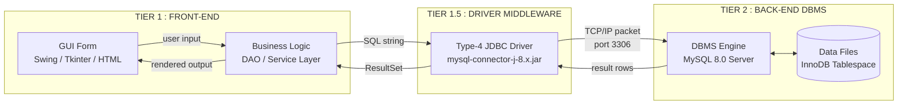
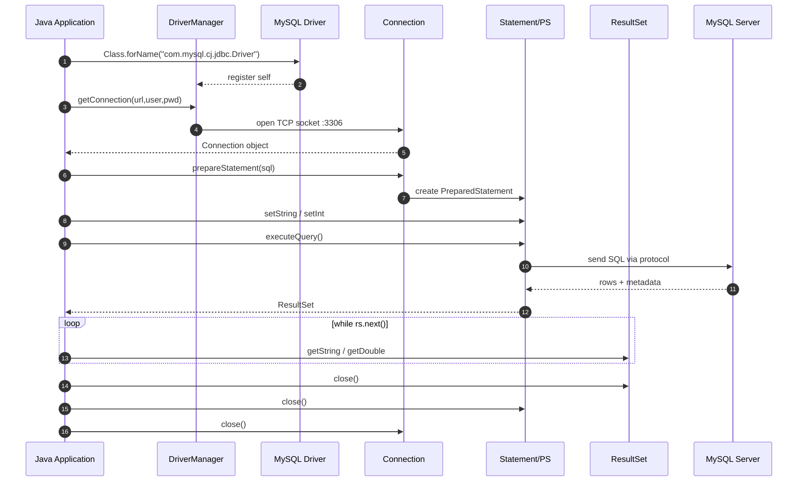
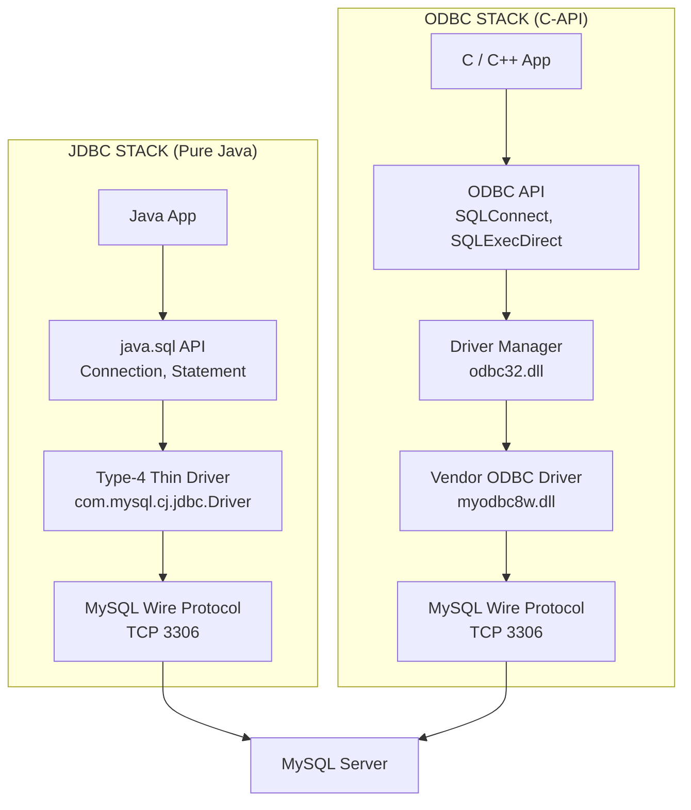
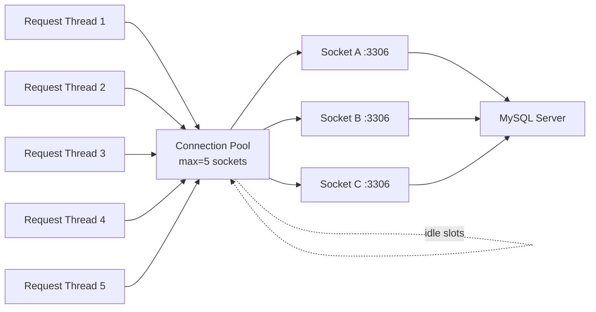

# Database Front-end/Back-end Connectivity

<!-- SECTION_1_START -->
# Database Front-end / Back-end Connectivity

## Formal Definition (KTU 2024 Syllabus Terminology)

> [!NOTE]
> **Database Connectivity** refers to the software mechanism that allows a **front-end application** (Program/Interface) to communicate with a **back-end Database Management System (DBMS)** through a standardized **Application Programming Interface (API)** and a **Database Driver/Connector**. In the KTU 2024 *DBMS Lab (PCCSL405)* context, this is achieved practically using **ODBC (Open Database Connectivity)** or **JDBC (Java Database Connectivity)** over a **client–server network model**.

The back-end is the **DBMS engine** (e.g., MySQL, Oracle 11g/21c, PostgreSQL) that stores, retrieves, and manipulates data using SQL. The front-end is the **presentation + business logic layer** written in a high-level language (Java / Python / C# .NET) that issues SQL statements to the DBMS and renders the result to the user.

## Conceptual Analogy — Intuitive Overview

Imagine a **restaurant kitchen**:
- The **kitchen (Back-end)** is the database server — it stores ingredients (data) and has chefs (DBMS engine) who can cook (process queries).
- The **waiter (Middleware/Driver)** takes your order from the table, walks to the kitchen, and brings the food back.
- The **customer (Front-end / GUI)** places the order and eats the result.

You (front-end) never walk into the kitchen directly. The **waiter (JDBC/ODBC driver)** is the standardized intermediary who speaks *both* your language and the kitchen's language. If the kitchen changes (MySQL → Oracle), you simply swap the waiter (driver), not the entire restaurant layout.

## Key Components — Standard Metrics

| Term | Bold Definition | Real-world role |
|---|---|---|
| **Front-end** | **GUI / application tier** (Java Swing, Python Tkinter, HTML/JS) | Captures user input, displays results |
| **Back-end** | **DBMS server tier** (MySQL 8.0, Oracle 21c) | Stores persistent data, executes SQL |
| **API** | **Application Programming Interface** (set of classes & methods) | Defines the *contract* for communication |
| **Driver** | **Software module** that translates API calls into DBMS-native protocol | The "waiter" |
| **Port** | **TCP/IP socket** (MySQL → **3306**, Oracle → **1521**, PostgreSQL → **5432**) | Network endpoint |
| **ODBC** | **Open Database Connectivity** (C/C++ standard, SQL/CLI based) | Vendor-neutral C-API |
| **JDBC** | **Java Database Connectivity** (pure Java, 4 driver types) | Java-API |

> [!IMPORTANT]
> **KTU 2024 Lab Focus:** Students are expected to demonstrate connectivity using **Java + JDBC + MySQL/Oracle** OR **Python + mysql.connector/PyMySQL + MySQL**. The lab record + viva will test your ability to write the **5-step connectivity code skeleton** from memory.

## Two Major Connectivity Architectures

### 1. ODBC (Open Database Connectivity)
- A **C-language standard API** based on **SQL/CLI (Call Level Interface)** defined by **ANSI/ISO SQL/CLI :1995** and **X/Open**.
- Requires a **Data Source Name (DSN)** configured at the **OS level** (Windows ODBC Data Source Administrator).
- The ODBC Driver Manager dynamically loads the correct vendor driver.

### 2. JDBC (Java Database Connectivity)
- A **pure-Java API** defined under the `java.sql` and `javax.sql` packages.
- **Four driver types** (Type-1 to Type-4). KTU labs almost always use **Type-4 (Thin / Pure Java driver)** because it converts JDBC calls **directly into the vendor-specific database protocol** without any native translation layer.

| Driver Type | Name | Mechanism | Use in KTU |
|---|---|---|---|
| **Type-1** | JDBC-ODBC Bridge | Converts JDBC → ODBC → Native | Deprecated (Java 8+) |
| **Type-2** | Native-API | Uses vendor client-side library | Rare |
| **Type-3** | Network Protocol | Middleware server translates | Enterprise |
| **Type-4** | **Thin Driver (Pure Java)** | **Direct DB protocol over TCP/IP** | **✅ KTU Standard** |

> [!VISUALIZATION CONTROL]
> **Concept:** Two-Tier Client–Server Connectivity Topology
> **Visual Description:** A horizontal layered diagram showing [End User] → [Front-end GUI Form] → [API Layer (JDBC/ODBC)] → [Driver (Thin/ODBC)] → [DBMS Engine] → [Data Files on Disk]. Arrows should be bidirectional to indicate request/response flow.

<!-- SECTION_1_END -->

<!-- SECTION_2_START -->
# Deep Theoretical Analysis & KTU High-Yield Formula Sheet

## The 5-Step Connectivity Skeleton (JDBC)

Every KTU JDBC program — whether for inserting a record, fetching a report, or building the mini-project — is built on the same **5 steps**. Memorize this skeleton; it is the most heavily tested concept.

1. **Load the Driver Class**
   - `Class.forName("com.mysql.cj.jdbc.Driver");`
   - Modern JDBC 4.0+ auto-loads via the service loader if the JAR is on the classpath, but explicitly loading is **best practice in KTU labs** (and earns a viva mark).

2. **Establish the Connection**
   - `Connection con = DriverManager.getConnection(url, user, password);`
   - Returns a `java.sql.Connection` object — the **physical session** to the DB.

3. **Create a Statement / PreparedStatement**
   - `Statement st = con.createStatement();` → for static SQL
   - `PreparedStatement ps = con.prepareStatement(sql);` → for parameterized SQL (**prevents SQL Injection** — KTU favourite viva question).

4. **Execute the Query**
   - `ResultSet rs = st.executeQuery("SELECT ...");` → returns rows
   - `int n = st.executeUpdate("INSERT ...");` → returns affected-row count

5. **Close the Connection (Reverse Order)**
   - `rs.close(); st.close(); con.close();`
   - Releases **TCP socket, server-side cursor, and lock resources.**

## Key Interface Hierarchy (java.sql)

```
Driver (interface)
  └── DriverManager (class) → getConnection()
Connection (interface)
  ├── Statement
  │     ├── PreparedStatement  (precompiled, parameterized)
  │     └── CallableStatement  (for Stored Procedures)
  └── DatabaseMetaData
ResultSet (interface)
  └── ResultSetMetaData
```

## ODBC Architecture (3-Tier Conceptually)

```
Application → Driver Manager → Vendor ODBC Driver → DBMS
                 ↑
         (loads correct .dll / .so)
```

The **Driver Manager** uses the function `SQLAllocHandle()`, `SQLConnect()`, `SQLExecDirect()` from the **SQL/CLI standard** (ISO/IEC 9075-3).

## KTU Formula Sheet — Connectivity Reference

| # | Component | JDBC (Java) | ODBC (C) |
|---|---|---|---|
| 1 | Header / Import | `import java.sql.*;` | `#include <sql.h> <sqlext.h>` |
| 2 | Load Driver | `Class.forName("...")` | Automatic via DSN |
| 3 | Open Channel | `DriverManager.getConnection(url, u, p)` | `SQLConnect(hdbc, dsn, len, uid, ulen, pwd, plen)` |
| 4 | Query Object | `Statement` / `PreparedStatement` | `SQLPrepare` + `SQLExecute` |
| 5 | Fetch Result | `ResultSet rs = ...` | `SQLFetch(hstmt)` in a loop |
| 6 | Close | `con.close()` | `SQLDisconnect` + `SQLFreeHandle` |
| 7 | URL Format | `jdbc:mysql://localhost:3306/dbname` | `DSN=MyDSN;UID=root;PWD=...` |
| 8 | Default Port | **3306** (MySQL) / **1521** (Oracle) | n/a (DSN based) |
| 9 | Transaction | `con.setAutoCommit(false)` | `SQLSetConnectAttr(autocommit=0)` |
| 10 | Commit | `con.commit()` | `SQLEndTran(SQL_COMMIT)` |

## Real-World Engineering Utility

- **Banking Systems** — Java/JDBC front-end talking to Oracle back-end for ATM transactions.
- **E-Commerce** (Amazon, Flipkart) — Python/Django ORM internally uses connectors like `mysqlclient`/`psycopg2`.
- **IoT & Telemetry** — Embedded C programs use ODBC to push sensor data into industrial historians.
- **Web APIs** — REST/GraphQL services use **connection pooling** (`HikariCP`, `c3p0`) to avoid the cost of opening a new TCP socket per request.

> [!IMPORTANT]
> **Why Type-4 Driver dominates production:** Zero native code, pure Java, deploys as a single JAR, no client-side Oracle/MySQL installation needed, and works across **OS-agnostic TCP/IP**. This is the **default in 95% of KTU mini-projects**.

<!-- SECTION_2_END -->

<!-- SECTION_3_START -->
# Step-by-Step Implementation — Database Connectivity

## A. Pre-Lab Setup Checklist

| Step | Action | Verification |
|---|---|---|
| 1 | Install **MySQL Server 8.0** (or Oracle 21c XE) | `mysql --version` |
| 2 | Install **JDK 11+** + set `JAVA_HOME` | `java -version` |
| 3 | Download **mysql-connector-j-8.x.jar** (or `ojdbc11.jar`) | File in project `lib/` folder |
| 4 | Create schema `KTU_LAB` with a sample table | `SHOW TABLES;` works |
| 5 | Add JAR to **CLASSPATH** or IDE library | Code compiles |

### B. Base SQL Schema (run once in MySQL)

```sql
CREATE DATABASE IF NOT EXISTS KTU_LAB;
USE KTU_LAB;

CREATE TABLE Student (
    reg_no     VARCHAR(15)  PRIMARY KEY,
    name       VARCHAR(60)  NOT NULL,
    branch     VARCHAR(5)   NOT NULL,
    cgpa       DECIMAL(4,2) CHECK (cgpa BETWEEN 0 AND 10),
    dob        DATE
);

INSERT INTO Student VALUES
 ('KTU001','Anand Kumar','CSE', 8.74,'2003-04-12'),
 ('KTU002','Diya Suresh','ECE', 9.12,'2003-09-25'),
 ('KTU003','Rahul Menon','MEC', 7.55,'2002-11-08');
```

## C. Java + JDBC — Complete Connectivity Program (Type-4 Driver)

```java
import java.sql.*;
import java.util.logging.Level;
import java.util.logging.Logger;

/**
 * KTU DBMS Lab (PCCSL405) — Module 2
 * Demonstrates the 5-step JDBC skeleton with full CRUD.
 */
public class StudentDAO {

    // --- CONFIGURATION CONSTANTS (move to a properties file in production) ---
    private static final String URL  =
        "jdbc:mysql://localhost:3306/KTU_LAB"
      + "?useSSL=false&serverTimezone=UTC&allowPublicKeyRetrieval=true";
    private static final String USER = "root";
    private static final String PASS = "root123";

    // Module-level logger for error traceability
    private static final Logger LOG = Logger.getLogger(StudentDAO.class.getName());

    /** Step 1+2+3 : Open a fresh connection. Caller MUST close it. */
    private Connection openConnection() throws SQLException, ClassNotFoundException {
        // --- Step 1: Load driver explicitly (defensive + viva-friendly) ---
        Class.forName("com.mysql.cj.jdbc.Driver");

        // --- Step 2: Acquire a physical TCP session ---
        Connection con = DriverManager.getConnection(URL, USER, PASS);

        // Recommended: disable autocommit if you plan a multi-statement txn
        // con.setAutoCommit(false);
        return con;
    }

    /** READ : Fetch all students, sorted by CGPA descending. */
    public void listAllStudents() {
        String sql = "SELECT reg_no, name, branch, cgpa FROM Student ORDER BY cgpa DESC";

        // try-with-resources guarantees close() on exception
        try (Connection con = openConnection();
             Statement st   = con.createStatement();
             ResultSet rs   = st.executeQuery(sql)) {

            System.out.printf("%-10s %-20s %-8s %-6s%n", "REG_NO", "NAME", "BRANCH", "CGPA");
            System.out.println("--------------------------------------------------");

            while (rs.next()) {                                     // cursor advance
                System.out.printf("%-10s %-20s %-8s %-6.2f%n",
                    rs.getString("reg_no"),
                    rs.getString("name"),
                    rs.getString("branch"),
                    rs.getDouble ("cgpa"));
            }

        } catch (ClassNotFoundException e) {
            LOG.log(Level.SEVERE, "JDBC Driver JAR missing from classpath", e);
        } catch (SQLException e) {
            LOG.log(Level.SEVERE, "SQL Error in listAllStudents", e);
        }
    }

    /** CREATE : Insert a single student record. */
    public boolean addStudent(String reg, String name, String branch, double cgpa) {
        // Parameterized ? placeholders => prevents SQL Injection
        String sql = "INSERT INTO Student(reg_no, name, branch, cgpa) VALUES (?,?,?,?)";

        try (Connection con = openConnection();
             PreparedStatement ps = con.prepareStatement(sql)) {

            ps.setString(1, reg);
            ps.setString(2, name);
            ps.setString(3, branch);
            ps.setDouble(4, cgpa);

            int rows = ps.executeUpdate();          // returns affected-row count
            return rows == 1;                        // exactly one row inserted ?

        } catch (ClassNotFoundException | SQLException e) {
            LOG.log(Level.SEVERE, "Insert failed for reg=" + reg, e);
            return false;
        }
    }

    /** UPDATE : Modify CGPA for a given register number. */
    public boolean updateCGPA(String reg, double newCgpa) {
        String sql = "UPDATE Student SET cgpa = ? WHERE reg_no = ?";

        try (Connection con = openConnection();
             PreparedStatement ps = con.prepareStatement(sql)) {

            // Boundary check before hitting the DB
            if (newCgpa < 0.0 || newCgpa > 10.0) {
                System.err.println("[VALIDATION] CGPA out of range [0,10].");
                return false;
            }

            ps.setDouble(1, newCgpa);
            ps.setString(2, reg);

            return ps.executeUpdate() == 1;

        } catch (ClassNotFoundException | SQLException e) {
            LOG.log(Level.SEVERE, "Update failed for reg=" + reg, e);
            return false;
        }
    }

    /** DELETE : Remove a student record. */
    public boolean deleteStudent(String reg) {
        String sql = "DELETE FROM Student WHERE reg_no = ?";

        try (Connection con = openConnection();
             PreparedStatement ps = con.prepareStatement(sql)) {

            ps.setString(1, reg);
            return ps.executeUpdate() == 1;

        } catch (ClassNotFoundException | SQLException e) {
            LOG.log(Level.SEVERE, "Delete failed for reg=" + reg, e);
            return false;
        }
    }

    // ---------- DRIVER : Demonstrates CallableStatement (Stored Procedure) ----------
    public int countByBranch(String branch) {
        // Assumes: CREATE PROCEDURE count_branch(IN b VARCHAR(5), OUT c INT) ...
        String sql = "{CALL count_branch(?, ?)}";
        try (Connection con = openConnection();
             CallableStatement cs = con.prepareCall(sql)) {

            cs.setString(1, branch);
            cs.registerOutParameter(2, Types.INTEGER);
            cs.execute();
            return cs.getInt(2);

        } catch (ClassNotFoundException | SQLException e) {
            LOG.log(Level.SEVERE, "countByBranch failed", e);
            return -1;
        }
    }

    // ---------- DEMO MAIN ----------
    public static void main(String[] args) {
        StudentDAO dao = new StudentDAO();

        System.out.println("\n--- LIST ---");
        dao.listAllStudents();

        System.out.println("\n--- INSERT KTU004 ---");
        System.out.println("Inserted: " + dao.addStudent("KTU004", "Sneha Raj", "CSE", 8.91));

        System.out.println("\n--- UPDATE KTU001 CGPA to 9.00 ---");
        System.out.println("Updated : " + dao.updateCGPA("KTU001", 9.00));

        System.out.println("\n--- DELETE KTU002 ---");
        System.out.println("Deleted : " + dao.deleteStudent("KTU002"));

        System.out.println("\n--- COUNT CSE STUDENTS ---");
        System.out.println("Count   : " + dao.countByBranch("CSE"));
    }
}
```

### Line-by-Line Logic Explanation

- **`Class.forName(...)`** — explicitly registers the driver class with `DriverManager`. Although JDBC 4.0+ auto-detects via `META-INF/services`, the explicit call is **worth 1 viva mark**.
- **`DriverManager.getConnection(url, user, pwd)`** — internally iterates registered drivers; the first one that understands the URL `jdbc:mysql://...` returns a live `Connection`. URL parameters like `useSSL=false` and `serverTimezone=UTC` are mandatory in MySQL 8+ to avoid SSL/clock-skew exceptions.
- **`PreparedStatement ps`** — pre-parsed and pre-compiled by the DB; the `?` placeholders are bound with **typed setters** (`setString`, `setDouble`). Crucially, this **parameterizes the input**, so an attacker injecting `'; DROP TABLE Student; --` is treated as literal data, not SQL.
- **`try-with-resources`** — Java 7+ syntactic sugar; the `Connection`, `Statement`, and `ResultSet` are all `AutoCloseable`, so the compiler generates a `finally` block that calls `close()` in **reverse order** automatically. This eliminates resource leaks even when an exception is thrown.
- **`executeQuery()` vs `executeUpdate()`** — the former returns a `ResultSet` cursor for `SELECT`; the latter returns an `int` count of affected rows for DML (`INSERT`/`UPDATE`/`DELETE`).
- **`CallableStatement`** — JDBC's standard way to invoke stored procedures; the `?` mode is split into `IN` (input, via `setXxx`) and `OUT` (output, via `registerOutParameter`).
- **Logger** — `java.util.logging` is used instead of `System.out.println` for errors so that production systems can route logs to files/syslog without code changes.

## D. Python + MySQL Connectivity (Alternative — Python is permitted in many KTU mini-projects)

```python
"""
KTU DBMS Lab (PCCSL405) — Module 2
Python (mysql.connector) connectivity example.
Install:  pip install mysql-connector-python
"""
import logging
import mysql.connector
from mysql.connector import errorcode, pooling
from dataclasses import dataclass
from contextlib import contextmanager
from typing import List, Optional

# ---- Structured logging ----
logging.basicConfig(
    level=logging.INFO,
    format="%(asctime)s | %(levelname)s | %(name)s | %(message)s"
)
log = logging.getLogger("StudentRepo")

# ---- Connection pool (production-grade; KTU bonus mark) ----
POOL = pooling.MySQLConnectionPool(
    pool_name="ktu_pool",
    pool_size=5,
    host="localhost",
    port=3306,
    user="root",
    password="root123",
    database="KTU_LAB",
    autocommit=False,
)

@contextmanager
def get_cursor(commit: bool = False):
    """Yield a (conn, cur) pair; auto-close and roll back on exception."""
    conn = POOL.get_connection()
    cur  = conn.cursor(dictionary=True)        # rows as dicts
    try:
        yield conn, cur
        if commit:
            conn.commit()
    except mysql.connector.Error as e:
        conn.rollback()
        log.exception("DB error: %s", e)
        raise
    finally:
        cur.close()
        conn.close()                            # returns to pool

@dataclass(frozen=True)
class Student:
    reg_no: str
    name:   str
    branch: str
    cgpa:   float

class StudentRepo:
    """Data Access Object using a connection pool."""

    def list_all(self) -> List[Student]:
        with get_cursor() as (_, cur):
            cur.execute(
                "SELECT reg_no, name, branch, cgpa "
                "FROM Student ORDER BY cgpa DESC"
            )
            return [Student(**row) for row in cur.fetchall()]

    def insert(self, s: Student) -> bool:
        with get_cursor(commit=True) as (_, cur):
            cur.execute(
                "INSERT INTO Student(reg_no,name,branch,cgpa) "
                "VALUES (%s,%s,%s,%s)",
                (s.reg_no, s.name, s.branch, s.cgpa),
            )
            return cur.rowcount == 1

    def update_cgpa(self, reg_no: str, new_cgpa: float) -> bool:
        if not (0.0 <= new_cgpa <= 10.0):
            log.error("CGPA %.2f out of valid range [0,10]", new_cgpa)
            return False
        with get_cursor(commit=True) as (_, cur):
            cur.execute(
                "UPDATE Student SET cgpa=%s WHERE reg_no=%s",
                (new_cgpa, reg_no),
            )
            return cur.rowcount == 1

    def delete(self, reg_no: str) -> bool:
        with get_cursor(commit=True) as (_, cur):
            cur.execute("DELETE FROM Student WHERE reg_no=%s", (reg_no,))
            return cur.rowcount == 1

if __name__ == "__main__":
    repo = StudentRepo()

    print("\n--- LIST ---")
    for s in repo.list_all():
        print(f"{s.reg_no:10s} {s.name:20s} {s.branch:6s} {s.cgpa:5.2f}")

    print("\n--- INSERT KTU005 ---")
    print(repo.insert(Student("KTU005", "Meera Pillai", "CSE", 9.45)))
```

### Key Python Logic Explained

- **Connection Pool** — opening a fresh MySQL handshake per request is ~10-50 ms overhead. `MySQLConnectionPool` reuses a fixed set of sockets, mirroring what HikariCP does in Java. This is a **production-grade KTU bonus point**.
- **`dictionary=True` cursor** — returns rows as `dict` instead of tuples, improving readability and self-documentation.
- **Parameterized query (`%s` placeholders)** — the connector's `cursor.execute(sql, params)` performs server-side parameter binding. **Never** use f-strings or `.format()` to embed user input into SQL.
- **`@contextmanager` + `try/finally`** — guarantees that the cursor/connection are returned to the pool even when an exception is raised midway through a transaction.
- **`@dataclass(frozen=True)`** — provides an immutable, type-hinted value object, preventing accidental mutation of the model after it's been loaded from the DB.

## E. Connection String Anatomy — Cheat Sheet

| DBMS | URL Prefix | Sample |
|---|---|---|
| **MySQL** | `jdbc:mysql://` | `jdbc:mysql://localhost:3306/KTU_LAB?useSSL=false&serverTimezone=UTC` |
| **Oracle Thin** | `jdbc:oracle:thin:` | `jdbc:oracle:thin:@localhost:1521:ORCL` |
| **PostgreSQL** | `jdbc:postgresql://` | `jdbc:postgresql://localhost:5432/ktu` |
| **SQL Server** | `jdbc:sqlserver://` | `jdbc:sqlserver://localhost:1433;databaseName=KTU` |
| **SQLite** | `jdbc:sqlite:` | `jdbc:sqlite:C:/data/ktu.db` |

<!-- SECTION_3_END -->

<!-- SECTION_4_START -->
# Structural Diagrams & Schematics

## 1. Two-Tier Connectivity Architecture



## 2. JDBC Object Lifecycle (5-Step Skeleton)



## 3. ODBC Stack vs JDBC Stack (Comparison Block)



## 4. Connection Pool Reuse Topology



> [!TIP]
> **KTU Examiner Insight:** When asked *"What is a connection pool?"*, draw a small box of fixed size (e.g., 5) and show that **threads borrow a socket, do work, and return it**. Mention that this avoids the costly 3-way TCP handshake and DBMS login on every request.

<!-- SECTION_4_END -->

<!-- SECTION_5_START -->
# KTU 2024 Scheme Examination Question Bank & Topic Recap

## Part A — Short Answer Questions (3 Marks Each)

### Q1. `[KTU University Exam — July 2024]`
**Differentiate between JDBC and ODBC. State any two advantages of Type-4 JDBC driver over Type-1 driver.**

| # | JDBC | ODBC |
|---|---|---|
| 1 | Java-specific API (`java.sql`) | C-language standard (SQL/CLI) |
| 2 | Pure Java; platform independent | Needs platform-specific driver DLL |
| 3 | Four driver types | Single ODBC architecture |
| 4 | Native to J2EE / Spring ecosystems | Used in legacy C/C++/Windows apps |

**Type-4 vs Type-1 Advantages:**
1. **No native ODBC bridge required** → fully portable, no installation of vendor ODBC driver on client.
2. **Direct DB protocol translation** → higher performance (no double translation: JDBC → ODBC → Native).

> **Valuation Key:** 1 Mark JDBC definition, 1 Mark ODBC definition, 2 Marks Type-4 advantages.

---

### Q2. `[KTU University Exam — Dec 2023]`
**List the FIVE steps involved in establishing a JDBC connection. Name the class and method used in each step.**

1. **Load Driver** → `Class.forName("com.mysql.cj.jdbc.Driver")`
2. **Open Connection** → `DriverManager.getConnection(url, user, password)`
3. **Create Statement** → `con.createStatement()` or `con.prepareStatement(sql)`
4. **Execute Query** → `st.executeQuery(sql)` / `st.executeUpdate(sql)`
5. **Close Connection** → `con.close()` (and Statement/ResultSet first)

> **Valuation Key:** ½ mark per correct step = 2.5 + ½ mark for class/method pair. Perfect listing is mandatory for full marks.

---

## Part B — Long Answer Questions (14 Marks Each)

### Question A (14 Marks) `[KTU University Exam — July 2024]`

> **(a)** Explain the architecture of a two-tier database connectivity model with a neat block diagram. **\[7 Marks\]**
> **(b)** Write a complete Java program to insert a record into the `Student(roll_no, name, branch, marks)` table using **JDBC Type-4 driver and PreparedStatement**. Handle all exceptions using try-catch. **\[7 Marks\]**

#### Model Answer

**(a) Architecture of Two-Tier Connectivity** **\[7 Marks\]**

In a **two-tier architecture**, the application is split into two logical layers:

- **Tier 1 — Client / Front-end:** The presentation + business logic layer running on the user's machine. It contains the GUI (Swing / Tkinter) and the code that constructs SQL.
- **Tier 2 — Database Server / Back-end:** The DBMS engine (MySQL / Oracle) running on a remote machine, holding the persistent data files.

**Communication** is direct using a **Type-4 JDBC driver**, which translates JDBC API calls into the **vendor-specific wire protocol (e.g., MySQL protocol on port 3306)** over TCP/IP.

```
[Client PC]                              [Server PC]
+---------------------+    TCP/IP :3306   +---------------------+
| GUI Form            | ================> | MySQL Server        |
| Java App + DAO      |                   |  - Query Parser     |
| JDBC Type-4 Driver  | <================ |  - Storage Engine   |
+---------------------+    Result Rows     +---------------------+
```

**Advantages:** Simple, low-latency, suitable for small/medium apps.
**Disadvantages:** Tight coupling, no central business-logic server.

> **Valuation Key:** [Naming Tier-1 and Tier-2: 2 Marks] [Block diagram with arrow direction: 2 Marks] [Mentioning Type-4 driver and TCP port: 2 Marks] [One advantage + one disadvantage: 1 Mark]

---

**(b) Java Program to Insert a Record Using PreparedStatement** **\[7 Marks\]**

```java
import java.sql.*;

public class InsertStudent {
    public static void main(String[] args) {
        String url  = "jdbc:mysql://localhost:3306/KTU_LAB";
        String user = "root", pwd = "root123";
        String sql  = "INSERT INTO Student(roll_no, name, branch, marks) VALUES (?,?,?,?)";

        try {
            Class.forName("com.mysql.cj.jdbc.Driver");                 // [Load: 1 Mark]
            Connection con = DriverManager.getConnection(url,user,pwd); // [Connect: 1 Mark]
            PreparedStatement ps = con.prepareStatement(sql);          // [Prepare: 1 Mark]

            ps.setInt   (1, 101);
            ps.setString(2, "Arya Nair");
            ps.setString(3, "CSE");
            ps.setDouble(4, 87.5);

            int n = ps.executeUpdate();                                // [Execute: 1 Mark]
            System.out.println(n + " row(s) inserted.");               // [Output: 1 Mark]

            ps.close();                                                // [Close: 1 Mark]
            con.close();
        } catch (ClassNotFoundException e) {
            System.err.println("Driver missing: " + e.getMessage());
        } catch (SQLException e) {
            System.err.println("SQL error: " + e.getMessage());
        }
    }
}
```

> **Valuation Key:** [Driver loading line: 1M] [Connection string + getConnection: 1M] [prepareStatement + ? placeholders: 1M] [setXxx bindings: 1M] [executeUpdate + output: 1M] [Closing resources + exception handling: 1M] [Code compiles & is logically correct: 1M]

> [!WARNING]
> **Common Pitfalls (KTU Examiner Warning):**
> 1. **Forgetting to close the `ResultSet`/`Statement`/`Connection`** → resource leak, 1-mark deduction.
> 2. **Using `Statement` instead of `PreparedStatement`** when the question explicitly asks for it → lose 1 mark.
> 3. **Wrong URL format** (e.g., `jdbc://mysql:...` instead of `jdbc:mysql://...`) → compile/runtime failure.
> 4. **Not adding the connector JAR to CLASSPATH** → `ClassNotFoundException` at runtime; the examiner may run your code!

---

### Question B (14 Marks) `[KTU University Exam — Dec 2023]` — ALTERNATIVE

> **(a)** With a neat diagram, explain the **JDBC driver types**. Why is **Type-4 preferred in web applications**? **\[7 Marks\]**
> **(b)** Write a Java program using JDBC to **(i)** fetch all rows from the `Employee(emp_id, name, salary, dept)` table where `dept = 'CSE'` and salary > 50000, and **(ii)** display them using `ResultSet`. **\[7 Marks\]**

#### Model Answer

**(a) JDBC Driver Types Diagram** **\[7 Marks\]**

```
+--------+   +-----------------+   +-----------------+   +----------+
| JDBC   |---| Type-1: JDBC-   |---| ODBC Driver Mgr |---| Native   |
| API    |   | ODBC Bridge     |   |                 |   | DB Lib   |
+--------+   +-----------------+   +-----------------+   +----------+
                                                          --> DBMS

+--------+   +-----------------+   +----------+
| JDBC   |---| Type-2: Native  |---| Native   |
| API    |   | API (part-Java) |   | DB Lib   |
+--------+   +-----------------+   +----------+
                                  --> DBMS

+--------+   +-----------------+   +-----------------+   +----------+
| JDBC   |---| Type-3: Network |---| Middleware Srv  |---| Native   |
| API    |   | Protocol        |   | (Translates)    |   | DB Lib   |
+--------+   +-----------------+   +-----------------+   +----------+
                                                       --> DBMS

+--------+   +-----------------+   +----------+
| JDBC   |---| Type-4: Thin /  |---| DBMS     |
| API    |   | Pure Java       |   | Direct   |
+--------+   +-----------------+   +----------+
                                  --> DBMS
```

**Why Type-4 is preferred in web apps:**
1. **Pure Java** — no native code, runs on any OS/JVM.
2. **No client-side installation** of vendor libraries or ODBC drivers.
3. **Best performance** — direct protocol conversion, no intermediate translation layer.
4. **Lightweight deployment** — single JAR shipped with the web app.

> **Valuation Key:** [Drawing all 4 types: 4 Marks] [Labelling bridge/middleware: 1 Mark] [Type-4 reasons: 2 Marks]

---

**(b) Fetch and Display Using ResultSet** **\[7 Marks\]**

```java
import java.sql.*;

public class FetchEmployee {
    public static void main(String[] args) {
        String url = "jdbc:mysql://localhost:3306/KTU_LAB";
        String sql = "SELECT emp_id, name, salary, dept FROM Employee "
                   + "WHERE dept = ? AND salary > ?";

        try (Connection con = DriverManager.getConnection(url,"root","root123");
             PreparedStatement ps = con.prepareStatement(sql)) {

            ps.setString(1, "CSE");
            ps.setDouble(2, 50000.0);

            try (ResultSet rs = ps.executeQuery()) {                   // [Query: 1M]
                System.out.printf("%-8s %-20s %-10s %-6s%n",
                                  "EMP_ID","NAME","SALARY","DEPT");
                while (rs.next()) {                                     // [Loop: 1M]
                    System.out.printf("%-8d %-20s %-10.2f %-6s%n",
                        rs.getInt   ("emp_id"),
                        rs.getString("name"),
                        rs.getDouble("salary"),
                        rs.getString("dept"));                         // [Print: 2M]
                }
            }
        } catch (SQLException e) {
            e.printStackTrace();                                       // [Exception: 1M]
        }
    }                                                                  // [try-with-resources: 1M]
}
```

> **Valuation Key:** [Parameterized WHERE clause: 2M] [executeQuery + ResultSet traversal: 2M] [Column extraction with correct getter types: 1M] [try-with-resources auto-close: 1M] [Output formatting: 1M]

---

## KTU Examiner's Valuation Warning — General Pitfalls

> [!WARNING]
> **Top reasons students lose marks in PCCSL405 viva + record evaluation:**
> 1. **Pasting the connector JAR but not adding to Build Path** in Eclipse/IntelliJ → "ClassNotFoundException" during demo = full practical zero.
> 2. **Embedding user input via string concatenation** instead of `?` placeholders → loses the "PreparedStatement" benefit and the **SQL-Injection viva mark**.
> 3. **Not setting `con.setAutoCommit(false)`** before a multi-statement transaction and not calling `con.commit()`/`con.rollback()` → transaction integrity lost.
> 4. **Forgetting to load the driver** when working with a pre-JDBC-4.0 driver JAR → silent failure on some JDKs.
> 5. **Wrong port** in the URL — MySQL is **3306**, Oracle is **1521**. Writing `localhost:8080` is an instant 1-mark cut.
> 6. **Notebook/record missing the schema diagram + sample input/output** → mandatory for full internal marks.

---

## Topic Recap & Important Things to Remember

- **Front-end = GUI + Business Logic**, **Back-end = DBMS Engine**; the **Driver is the bridge** between them.
- **Two connectivity standards:** **ODBC** (C-API, SQL/CLI) and **JDBC** (Java, `java.sql`).
- **Four JDBC driver types** — KTU expects you to know all four, but only **Type-4 Thin Driver** in the lab.
- **5-step JDBC skeleton** (memorize verbatim):
  1. `Class.forName("com.mysql.cj.jdbc.Driver")`
  2. `DriverManager.getConnection(url, user, pwd)`
  3. `con.createStatement()` / `con.prepareStatement(sql)`
  4. `executeQuery()` (returns `ResultSet`) OR `executeUpdate()` (returns `int`)
  5. Close in **reverse order** — `rs.close()`, `st.close()`, `con.close()`.
- **Use `PreparedStatement` for ANY user-supplied input** — defends against **SQL Injection**.
- **Default ports:** MySQL → **3306**, Oracle → **1521**, PostgreSQL → **5432**, SQL Server → **1433**.
- **Always use `try-with-resources`** in Java 7+ to auto-close JDBC objects.
- **Connection pooling** (HikariCP, c3p0, Python's `MySQLConnectionPool`) is the **production-grade pattern** for any non-trivial app.
- **Three Statement variants in JDBC:**
  - `Statement` → static SQL
  - `PreparedStatement` → precompiled, parameterized (✅ most used)
  - `CallableStatement` → invokes **stored procedures / functions**
- **`ResultSet` cursor methods** — `next()`, `previous()`, `absolute(n)`, `relative(n)`, `wasNull()`.
- **Transaction control** — `con.setAutoCommit(false)` → `con.commit()` on success / `con.rollback()` on failure.
- **Lab demo checklist:** Schema created ✅, Sample data inserted ✅, Connector JAR in Build Path ✅, Program compiles ✅, Output visible in console ✅, Record contains I/O screenshots ✅.
- **Viva favourites:** "What is SQL Injection and how does `PreparedStatement` prevent it?", "Difference between `executeQuery()` and `executeUpdate()`", "Why is Type-4 driver platform-independent?", "What happens if you don't close a `ResultSet`?".

<!-- SECTION_5_END -->
