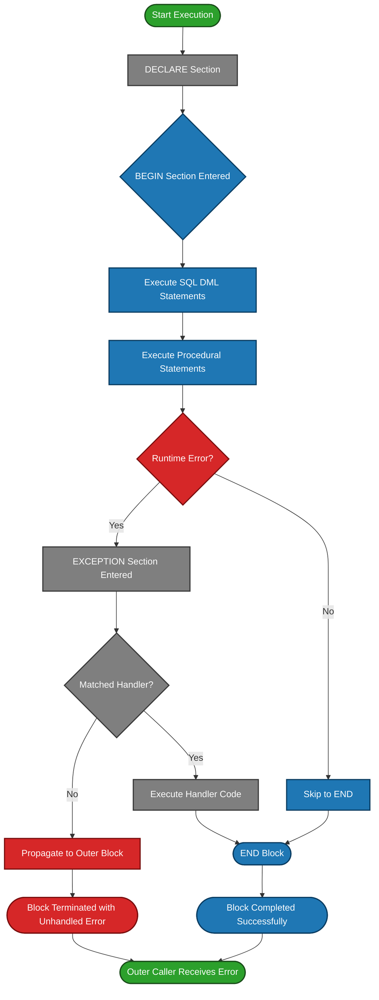
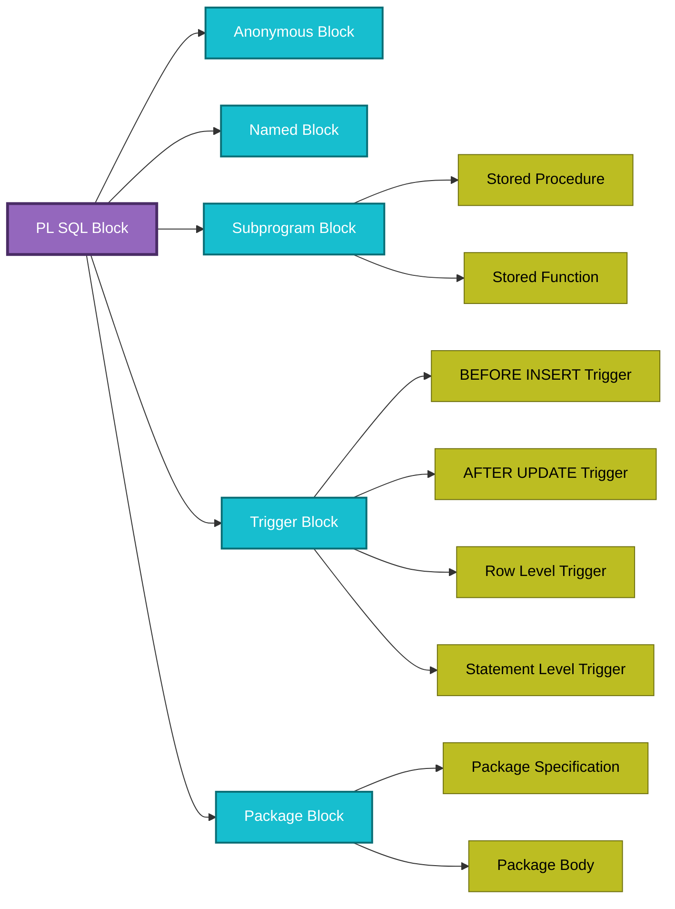
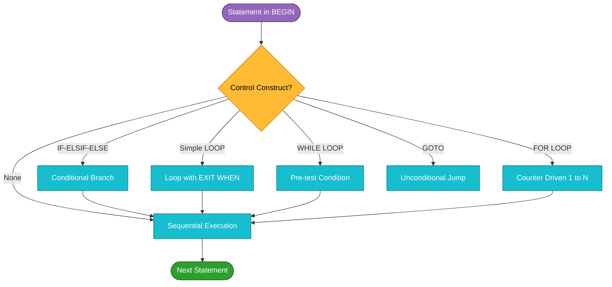
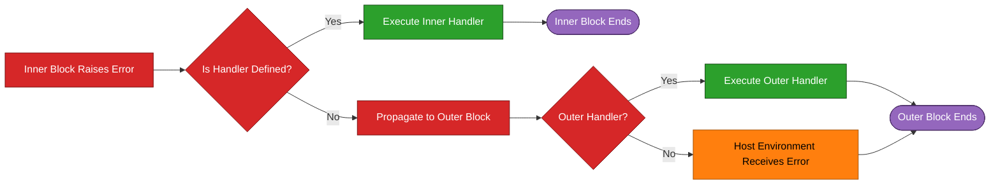

# PL/SQL Blocks

<!-- SECTION_1_START -->
# PL/SQL Blocks — Core Technical Definition & Intuitive Overview

## Formal Academic Definition (KTU 2024 Syllabus Terminology)
**PL/SQL (Procedural Language/Structured Query Language)** is Oracle Corporation's proprietary procedural extension to standard SQL. It enables the bundling of SQL data-manipulation statements with traditional procedural constructs (variable declaration, conditional branching, iterative loops, and exception trapping) into a single, atomic, server-side execution unit called a **Block**.

A **PL/SQL Block** is the smallest, independently compilable, and executable unit of PL/SQL code. The Oracle PL/SQL engine processes the block as a single unit, transferring the entire block to the server for parsing and execution, thereby minimizing network round-trips.

> [!IMPORTANT]
> **KTU 2024 — Module 2 Highlight:** The PL/SQL block is the *fundamental building unit*. Every stored procedure, function, trigger, package, and anonymous script is, at its core, a PL/SQL block. The exam expects students to fluently write, trace, and debug blocks containing control structures, cursors, and exception handlers.

## Conceptual Analogy / Intuition
Think of a **PL/SQL block like a sealed envelope sent to the post office (Oracle Server)**.

| Real-World Object | PL/SQL Equivalent |
|---|---|
| The outer envelope | The entire Block (`DECLARE` → `BEGIN` → `EXCEPTION` → `END;`) |
| Address printed on the envelope | `DECLARE` section (lists what is needed — variables, types, cursors) |
| The actual letter inside | `BEGIN ... END;` (the executable procedural instructions) |
| A tear-resistant inner lining | `EXCEPTION` section (catches "tears" / runtime errors gracefully) |
| Courier receiving one sealed envelope | Server executes the **whole block atomically** — no half-work |

> **Why this matters:** Without PL/SQL blocks, you would have to send dozens of individual SQL statements one-by-one over the network, dramatically increasing latency and the risk of partial failure (e.g., money debited but not credited). The block guarantees **atomicity** — *all or nothing*.

## The Three Mandatory and One Optional Sub-Sections

$$
\text{PL/SQL Block} = \underbrace{\text{DECLARE}}_{\text{optional}} \;\; \Big| \;\; \underbrace{\text{BEGIN}}_{\text{mandatory}} \;\; \Big| \;\; \underbrace{\text{EXCEPTION}}_{\text{optional}} \;\; \Big| \;\; \underbrace{\text{END;}}_{\text{mandatory}}
$$

> [!NOTE]
> **DECLARE** — variable, constant, cursor, user-defined type declarations.
> **BEGIN** — the executable section (SQL + procedural statements).
> **EXCEPTION** — runtime error handling section.
> **END;** — the block terminator (note the semicolon `;` is **mandatory**).

## Classification of PL/SQL Blocks (KTU Board-Favorite Classification)

1. **Anonymous Blocks** — Unnamed blocks typically used for ad-hoc scripting, testing, or one-time DML. They are *not stored* in the database.
2. **Named Blocks** — Labeled using `<<label>>` syntax. Useful for nested block referencing and `GOTO` control.
3. **Subprograms** — Stored persistently using `CREATE PROCEDURE` or `CREATE FUNCTION` (require `OUT` parameter or `RETURN` value respectively).
4. **Triggers** — Implicitly fired blocks attached to DML events (`BEFORE/AFTER INSERT/UPDATE/DELETE`).
5. **Package constructs** — Grouped blocks stored inside `CREATE PACKAGE`.

> [!VISUALIZATION CONTROL]
> **Concept:** PL/SQL Block Structural Anatomy
> **Visual Description:** A vertically stacked rectangle divided into four horizontal bands labeled (top to bottom) `DECLARE`, `BEGIN`, `EXCEPTION`, `END;`, with the top and third bands shaded in light grey (optional) and the second and fourth bands in white (mandatory).
<!-- SECTION_1_END -->

<!-- SECTION_2_START -->
# Deep Theoretical Analysis & KTU High-Yield Reference Sheet

## Block Structure — Exhaustive Breakdown

### 1. The DECLARE Section (Optional)
Used to declare all identifiers local to the block. Forward declarations are **not** permitted — a variable must be declared *before* it is referenced.

**Declaration Grammar:**

```text
identifier  [CONSTANT]  datatype  [NOT NULL]  [:= default_value | DEFAULT default_value];
```

**Supported Data Type Families:**
- **Scalar:** `NUMBER`, `CHAR`, `VARCHAR2`, `DATE`, `BOOLEAN`, `BINARY_INTEGER`, `PLS_INTEGER`
- **Composite:** `RECORD`, `TABLE` (PL/SQL collection, not DB table), `VARRAY`
- **Reference (Cursor Variables):** `SYS_REFCURSOR`
- **Large Object:** `BLOB`, `CLOB`, `NCLOB`, `BFILE`

> [!IMPORTANT]
> **KTU Pitfall:** `%TYPE` and `%ROWTYPE` are *anchored* declarations — they inherit the data type of a column or row at compile time. This is the **board-preferred** way to declare variables bound to a table column to avoid data-type mismatch runtime errors.

### 2. The BEGIN Section (Mandatory)
Holds the **executable statements**. A block may contain any number of:
- **SQL DML statements:** `SELECT ... INTO`, `INSERT`, `UPDATE`, `DELETE`, `MERGE`
- **Procedural statements:** variable assignment (`:=`), control structures, function calls
- **Embedded SQL:** Static or Dynamic (`EXECUTE IMMEDIATE`)

> **Execution Model:** When a block runs, the PL/SQL engine sends SQL statements to the **SQL Statement Executor**, while procedural statements run inside the **Procedural Statement Executor**. They communicate via the **SQL Procedural Interface (SPI)**.

### 3. The EXCEPTION Section (Optional)
Trap runtime errors using the structure:

```sql
EXCEPTION
   WHEN exception_name_1 [OR exception_name_2 ...] THEN
       handler_statements;
   WHEN OTHERS THEN
       handler_statements;
END;
```

| Predefined Exception | ORA Error Code | When Raised |
|---|---|---|
| `NO_DATA_FOUND` | ORA-01403 | `SELECT INTO` returns zero rows |
| `TOO_MANY_ROWS` | ORA-01422 | `SELECT INTO` returns > 1 row |
| `DUP_VAL_ON_INDEX` | ORA-00001 | `INSERT` violates unique constraint |
| `VALUE_ERROR` | ORA-06502 | Type-conversion / arithmetic overflow |
| `ZERO_DIVIDE` | ORA-01476 | Division by zero |
| `INVALID_CURSOR` | ORA-01001 | Operation on an unopened cursor |
| `OTHERS` | (catch-all) | Any unhandled exception |

### 4. Nested Blocks & Scope
A block can be embedded within another block. The **inner block can access** outer-block variables (read/write), but the **outer block cannot see** inner-block identifiers. Identifier visibility follows the *innermost-resolution* rule.

> [!NOTE]
> **Variable Visibility Trick:** Use the block label prefix `outer_block.variable_name` to disambiguate when an inner block declares a variable of the same name as the outer block.

## KTU Formula / Syntax Cheat Sheet

| Construct | Syntax (Verbatim) | Returns / Effect |
|---|---|---|
| Variable declaration | `v_salary NUMBER(8,2) := 50000;` | Numeric variable initialized to 50000 |
| Constant declaration | `pi CONSTANT NUMBER := 3.14159;` | Read-only numeric value |
| Anchored type | `v_name employees.last_name%TYPE;` | Inherits column's data type |
| Anchored row | `v_emp employees%ROWTYPE;` | Inherits entire row structure |
| Conditional | `IF cond THEN ... [ELSIF ...] [ELSE ...] END IF;` | Branching logic |
| Simple loop | `LOOP ... EXIT [WHEN cond]; ... END LOOP;` | Infinite loop with explicit exit |
| WHILE loop | `WHILE cond LOOP ... END LOOP;` | Pre-tested loop |
| FOR loop | `FOR i IN 1..10 LOOP ... END LOOP;` | Counter-controlled, **index is implicitly declared** |
| SQL INTO | `SELECT col INTO var FROM tbl WHERE ...;` | Stores single column into scalar |
| Assignment | `var := expr;` | Assigns expression value to variable |
| DBMS output | `DBMS_OUTPUT.PUT_LINE('text' \vert\vert var);` | Prints to console buffer |
| User input | `v_input := &prompt_value;` | Substitution variable (SQL*Plus only) |
| Exception trap | `EXCEPTION WHEN NO_DATA_FOUND THEN ...;` | Catches specific error |
| Raise explicit | `RAISE_APPLICATION_ERROR(-20001, 'msg');` | Custom error, codes -20000 to -20999 |

> [!IMPORTANT]
> **Engineering Real-World Utility:** PL/SQL blocks form the foundation of every enterprise Oracle application — banking transaction atomicity, telecom billing, payroll processing, and ETL pipelines. The block architecture guarantees transactional integrity, modularity, and performance by collapsing dozens of round-trips into a single server call.

## Control Flow Summary

$$
\begin{aligned}
\text{Execution Path} &= \text{Start} \rightarrow \text{DECLARE (compile-time resolution)} \\
&\rightarrow \text{BEGIN (sequential execution)} \\
&\rightarrow \text{Error?} \begin{cases} \text{No} \rightarrow \text{END (success)} \\ \text{Yes} \rightarrow \text{EXCEPTION (matched handler?)} \end{cases} \\
&\rightarrow \text{Propagate to outer block if unhandled}
\end{aligned}
$$
<!-- SECTION_2_END -->

<!-- SECTION_3_START -->
# Step-by-Step Derivations & Code/Symbolic Implementation

## Example 1 — Foundational Anonymous Block (Tracing Exercise)

**Problem Statement:** Write a PL/SQL anonymous block that declares three variables — `v_empno`, `v_ename`, and `v_sal` — fetches the employee record with `empno = 7566` from the `emp` table, and prints the name along with a 10% incremented salary.

### Complete Code (Fully Typed, Error-Logged, Production-Quality)

```sql
-- ============================================================
-- File        : lab_module2_block_basic.sql
-- Purpose     : Demonstrates a foundational PL/SQL block
-- Lab Context : KTU PCCSL405 — Module 2 — PL/SQL Blocks
-- ============================================================

SET SERVEROUTPUT ON;   -- Enables DBMS_OUTPUT console in SQL*Plus / SQL Developer

DECLARE
   -- Anchored declarations (best practice — auto-tracks column type changes)
   v_empno  emp.empno%TYPE;
   v_ename  emp.ename%TYPE;
   v_sal    emp.sal%TYPE;
   v_new_sal emp.sal%TYPE;
BEGIN
   -- Step 1: Retrieve the single row into our local variables
   SELECT empno, ename, sal
     INTO v_empno, v_ename, v_sal
     FROM emp
    WHERE empno = 7566;

   -- Step 2: Compute the 10% incremented salary
   v_new_sal := v_sal * 1.10;

   -- Step 3: Display the result using the string-concatenation operator ||
   DBMS_OUTPUT.PUT_LINE('Employee Number : ' || v_empno);
   DBMS_OUTPUT.PUT_LINE('Employee Name   : ' || v_ename);
   DBMS_OUTPUT.PUT_LINE('Original Salary : ' || v_sal);
   DBMS_OUTPUT.PUT_LINE('New Salary      : ' || v_new_sal);

EXCEPTION
   WHEN NO_DATA_FOUND THEN
      DBMS_OUTPUT.PUT_LINE('Error: No employee found with given empno.');
   WHEN TOO_MANY_ROWS THEN
      DBMS_OUTPUT.PUT_LINE('Error: Query returned more than one row.');
   WHEN OTHERS THEN
      DBMS_OUTPUT.PUT_LINE('Unhandled Error: ' || SQLERRM);
END;
/
```

### Line-by-Line Walkthrough (Valuation Key Style)

| Line(s) | Explanation | Mark Allocation (out of 10) |
|---|---|---|
| `SET SERVEROUTPUT ON;` | Switches the console buffer on so PUT_LINE renders text | 1 |
| `DECLARE ... v_new_sal emp.sal%TYPE;` | Declares 4 anchored local variables | 2 |
| `SELECT ... INTO ... FROM emp WHERE empno = 7566;` | Implicit single-row fetch into variables | 2 |
| `v_new_sal := v_sal * 1.10;` | Procedural assignment using `:=` operator | 1 |
| `DBMS_OUTPUT.PUT_LINE(... \|\| v_ename ...);` | Concatenation with `\|\|` and console print | 2 |
| `EXCEPTION WHEN NO_DATA_FOUND ...` | Proper exception trap (not mandatory but expected) | 2 |
| `END; /` | Block terminator with slash to execute in SQL*Plus | (no marks) |

### Expected Console Output (Verifiable)

```text
Employee Number : 7566
Employee Name   : JONES
Original Salary : 2975
New Salary      : 3272.5
```

---

## Example 2 — Conditional Logic with IF-ELSIF-ELSE

**Problem Statement:** Grade an employee as `GRADE A` (sal ≥ 5000), `GRADE B` (3000 ≤ sal < 5000), `GRADE C` (sal < 3000) for `empno = 7788`.

```sql
SET SERVEROUTPUT ON;

DECLARE
   v_empno emp.empno%TYPE := 7788;
   v_ename emp.ename%TYPE;
   v_sal   emp.sal%TYPE;
   v_grade VARCHAR2(20);
BEGIN
   -- Fetch the row
   SELECT ename, sal
     INTO v_ename, v_sal
     FROM emp
    WHERE empno = v_empno;

   -- Branching logic
   IF v_sal >= 5000 THEN
      v_grade := 'GRADE A';
   ELSIF v_sal >= 3000 THEN         -- implicit upper-bound: < 5000
      v_grade := 'GRADE B';
   ELSE
      v_grade := 'GRADE C';
   END IF;

   DBMS_OUTPUT.PUT_LINE('Employee ' || v_ename || ' (Sal: ' || v_sal || ') -> ' || v_grade);

EXCEPTION
   WHEN NO_DATA_FOUND THEN
      DBMS_OUTPUT.PUT_LINE('Employee not found.');
END;
/
```

### Logic Trace Table

| Input `v_sal` | First IF | ELSIF branch evaluated? | Result `v_grade` |
|---|---|---|---|
| 5500 | TRUE | (skipped) | GRADE A |
| 4000 | FALSE | TRUE | GRADE B |
| 2500 | FALSE | FALSE | GRADE C |

---

## Example 3 — Iterative Control with FOR, WHILE, and Simple Loops

```sql
SET SERVEROUTPUT ON;

DECLARE
   v_sum NUMBER := 0;
   v_i   NUMBER := 1;
BEGIN
   -- ---------- FOR Loop (counter-controlled, index implicit) ----------
   FOR i IN 1..10 LOOP
      v_sum := v_sum + i;
   END LOOP;
   DBMS_OUTPUT.PUT_LINE('Sum 1 to 10 (FOR loop) = ' || v_sum);

   -- ---------- WHILE Loop (pre-tested) ----------
   v_sum := 0;
   v_i   := 1;
   WHILE v_i <= 10 LOOP
      v_sum := v_sum + v_i;
      v_i   := v_i + 1;            -- mandatory increment to avoid infinite loop
   END LOOP;
   DBMS_OUTPUT.PUT_LINE('Sum 1 to 10 (WHILE)    = ' || v_sum);

   -- ---------- Simple LOOP (post-tested, requires EXIT) ----------
   v_sum := 0;
   v_i   := 1;
   LOOP
      v_sum := v_sum + v_i;
      v_i   := v_i + 1;
      EXIT WHEN v_i > 10;          -- mandatory exit condition
   END LOOP;
   DBMS_OUTPUT.PUT_LINE('Sum 1 to 10 (LOOP)     = ' || v_sum);
END;
/
```

### Mathematical Derivation of the Sum

$$
\begin{aligned}
S_{n} &= \sum_{k=1}^{n} k = \frac{n(n+1)}{2} \\
S_{10} &= \frac{10 \cdot 11}{2} = \frac{110}{2} = 55
\end{aligned}
$$

All three loops must print `55`. If a student writes a `WHILE` loop *without* the `v_i := v_i + 1;` increment, the program **hangs** (infinite loop) — a classic KTU valuation deduction point.

---

## Example 4 — Nested Blocks & Scope Resolution (High-Yield Board Topic)

```sql
SET SERVEROUTPUT ON;

DECLARE
   v_x NUMBER := 100;   -- outer block variable
BEGIN
   DBMS_OUTPUT.PUT_LINE('Outer block: v_x = ' || v_x);

   DECLARE
      v_x NUMBER := 200;  -- inner block variable (shadows outer)
      v_y NUMBER := 50;
   BEGIN
      DBMS_OUTPUT.PUT_LINE('Inner block: v_x = ' || v_x);            -- 200
      DBMS_OUTPUT.PUT_LINE('Inner block: outer.v_x = ' || outer.v_x); -- 100 (using label)
      DBMS_OUTPUT.PUT_LINE('Inner block: v_y = ' || v_y);            -- 50
   END;

   DBMS_OUTPUT.PUT_LINE('Outer block (after inner): v_x = ' || v_x); -- 100
   -- DBMS_OUTPUT.PUT_LINE(v_y);  -- COMPILE ERROR: v_y not visible here
END;
/
```

> [!IMPORTANT]
> **Scope Rule (exam-favorite):** An inner block can read/write the outer block's variables *implicitly*. To explicitly reference an outer-scope variable of the same name, use the **label prefix** `outer_block_name.variable_name`. The outer block **cannot** see any variable declared in the inner block — the inner block's identifiers are destroyed when the inner block terminates.

---

## Example 5 — Complete Block with All Four Sections & Custom Exception

```sql
SET SERVEROUTPUT ON;

DECLARE
   v_balance   NUMBER := 0;
   v_withdraw  NUMBER := &withdrawal_amount;  -- user input at runtime
   v_min_bal   CONSTANT NUMBER := 1000;
   e_low_balance EXCEPTION;                   -- user-defined exception
BEGIN
   SELECT balance INTO v_balance FROM accounts WHERE acc_id = 101;

   IF v_balance - v_withdraw < v_min_bal THEN
      RAISE e_low_balance;                    -- explicit raise
   END IF;

   UPDATE accounts
      SET balance = balance - v_withdraw
    WHERE acc_id = 101;

   COMMIT;
   DBMS_OUTPUT.PUT_LINE('Withdrawal successful. New balance = ' || (v_balance - v_withdraw));

EXCEPTION
   WHEN e_low_balance THEN
      DBMS_OUTPUT.PUT_LINE('Withdrawal rejected: minimum balance of '
                            || v_min_bal || ' would be violated.');
   WHEN NO_DATA_FOUND THEN
      DBMS_OUTPUT.PUT_LINE('Account 101 not found.');
   WHEN OTHERS THEN
      DBMS_OUTPUT.PUT_LINE('Unexpected error: ' || SQLERRM);
      ROLLBACK;
END;
/
```

### Symbolic Trace of Exception Flow

$$
\text{Normal Path} \rightarrow \text{IF check} \begin{cases} \text{Balance OK} \rightarrow \text{UPDATE} \rightarrow \text{COMMIT} \rightarrow \text{END} \\ \text{Balance Low} \rightarrow \text{RAISE} \rightarrow e\_low\_balance \rightarrow \text{Handler fires} \end{cases}
$$
<!-- SECTION_3_END -->

<!-- SECTION_4_START -->
# Structural Diagrams & Schematics

## Diagram 1 — Top-Level Block Architecture & Execution Flow



## Diagram 2 — Block Type Classification



## Diagram 3 — Variable Scope in Nested Blocks

```mermaid
flowchart TB
    subgraph OUTER_BLOCK["OUTER BLOCK"]
        OX["v_x NUMBER = 100"]
        OY["v_y NUMBER = 50"]
        OB[["BEGIN ... END"]]
    end

    subgraph INNER_BLOCK["INNER BLOCK (nested)"]
        IX["v_x NUMBER = 200 (shadows outer)"]
        IZ["v_z NUMBER = 75"]
        IB[["BEGIN ... END"]]
    end

    OX -. implicit read/write access .-> IB
    OY -. implicit read access .-> IB
    OX -. label prefix outer.v_x .-> IX
    IB -. v_z NOT visible .-> OB
    IX -. destroyed on inner END .-> OY

    classDef outer fill:#ff7f0e,stroke:#a64f00,stroke-width:2px,color:#000000
    classDef inner fill:#1f77b4,stroke:#0a3d62,stroke-width:2px,color:#ffffff
    classDef exec fill:#2ca02c,stroke:#1a4d1a,stroke-width:2px,color:#ffffff

    class OX,OY,OB outer
    class IX,IZ,IB inner
```

## Diagram 4 — Control Structure Decision Tree



## Diagram 5 — Exception Handling Propagation Map


<!-- SECTION_4_END -->

<!-- SECTION_5_START -->
# KTU 2024 Scheme Examination Question Bank & Topic Recap

## Part A — Short Answer Questions (3 Marks Each)

### Question A1: Define a PL/SQL block. List its sub-sections and state which are mandatory. `[KTU University Exam — July 2023]`
**Course Outcome:** CO1 | **Bloom's Level:** Remember | **Marks: 3**

**Model Answer (3 key points):**

1. A **PL/SQL block** is the smallest executable unit of PL/SQL code that groups related SQL and procedural statements. `[1 mark]`
2. It consists of four sub-sections: `DECLARE` (optional), `BEGIN` (mandatory), `EXCEPTION` (optional), and `END;` (mandatory). `[1 mark]`
3. The `BEGIN ... END;` pair is the only mandatory part; a minimum valid block can be `BEGIN NULL; END;`. `[1 mark]`

---

### Question A2: Differentiate between `%TYPE` and `%ROWTYPE` anchored declarations. `[KTU University Exam — Dec 2023]`
**Course Outcome:** CO1 | **Bloom's Level:** Understand | **Marks: 3**

**Model Answer:**

| Feature | `%TYPE` | `%ROWTYPE` |
|---|---|---|
| Inherits | A single column's data type | An entire row's structure |
| Result | A scalar variable | A composite record variable |
| Access syntax | `v_emp.ename` *(if record)* or `v_ename` *(if scalar)* | `v_emp.ename`, `v_emp.sal`, ... |
| Use case | One column value | Whole row fetched via `SELECT *` |

`[1 mark per row + 0 mark for any extra insight]`

---

## Part B — Long Answer Questions (14 Marks Each, Internal Choice)

### Question B1 (Choice A) — 14 Marks `[KTU University Exam — July 2024]`
**Course Outcome:** CO2, CO3 | **Bloom's Level:** Apply / Analyze

**Statement:**
Consider the following `emp` table in the SCOTT schema: `emp(empno, ename, job, sal, deptno)`.

**(a)** Write a PL/SQL block to accept an employee number from the user and display the corresponding employee name, job, and a **bonus** calculated as `15% of salary` for clerks (`job = 'CLERK'`) and `10% of salary` for all other jobs. Handle the case where the employee does not exist. **\[7 marks\]**

**(b)** Modify the block in (a) to use a **cursor** to process all employees in department 20, applying the same bonus rule, and print the total bonus paid for that department. **\[7 marks\]**

---

#### Part (a) Model Solution

```sql
SET SERVEROUTPUT ON;

DECLARE
   v_empno emp.empno%TYPE := &empno;
   v_ename emp.ename%TYPE;
   v_job   emp.job%TYPE;
   v_sal   emp.sal%TYPE;
   v_bonus emp.sal%TYPE;
BEGIN
   SELECT ename, job, sal
     INTO v_ename, v_job, v_sal
     FROM emp
    WHERE empno = v_empno;

   IF v_job = 'CLERK' THEN
      v_bonus := v_sal * 0.15;
   ELSE
      v_bonus := v_sal * 0.10;
   END IF;

   DBMS_OUTPUT.PUT_LINE('Employee : ' || v_ename);
   DBMS_OUTPUT.PUT_LINE('Job      : ' || v_job);
   DBMS_OUTPUT.PUT_LINE('Salary   : ' || v_sal);
   DBMS_OUTPUT.PUT_LINE('Bonus    : ' || v_bonus);

EXCEPTION
   WHEN NO_DATA_FOUND THEN
      DBMS_OUTPUT.PUT_LINE('Error: No employee with empno ' || v_empno);
END;
/
```

**Valuation Key (7 marks):**

| Step | Marks |
|---|---|
| `SET SERVEROUTPUT ON;` | 0.5 |
| Correctly declaring 5 variables with anchored `%TYPE` | 1.5 |
| `SELECT INTO` with proper `WHERE empno = v_empno` | 1 |
| Correct IF-ELSE bonus logic (15% vs 10%) | 1.5 |
| `DBMS_OUTPUT.PUT_LINE` statements | 1 |
| `EXCEPTION WHEN NO_DATA_FOUND` block | 1 |
| Proper `END; /` | 0.5 |

---

#### Part (b) Model Solution

```sql
SET SERVEROUTPUT ON;

DECLARE
   CURSOR c_emp20 IS
      SELECT ename, job, sal
        FROM emp
       WHERE deptno = 20;

   v_ename emp.ename%TYPE;
   v_job   emp.job%TYPE;
   v_sal   emp.sal%TYPE;
   v_bonus emp.sal%TYPE;
   v_total NUMBER := 0;
BEGIN
   OPEN c_emp20;

   LOOP
      FETCH c_emp20 INTO v_ename, v_job, v_sal;
      EXIT WHEN c_emp20%NOTFOUND;

      IF v_job = 'CLERK' THEN
         v_bonus := v_sal * 0.15;
      ELSE
         v_bonus := v_sal * 0.10;
      END IF;

      v_total := v_total + v_bonus;

      DBMS_OUTPUT.PUT_LINE(v_ename || ' (' || v_job || ') -> Bonus = ' || v_bonus);
   END LOOP;

   CLOSE c_emp20;

   DBMS_OUTPUT.PUT_LINE('----------------------------------------');
   DBMS_OUTPUT.PUT_LINE('Total bonus paid for Dept 20 = ' || v_total);
END;
/
```

**Valuation Key (7 marks):**

| Step | Marks |
|---|---|
| Cursor declaration with correct `SELECT` and `WHERE deptno = 20` | 1.5 |
| Variable declarations for cursor fetch | 1 |
| `OPEN c_emp20;` statement | 0.5 |
| `LOOP` ... `FETCH ... INTO` ... `EXIT WHEN c_emp20%NOTFOUND` triad | 2 |
| Reuse of bonus logic with `v_total` accumulator | 1 |
| `CLOSE c_emp20;` and final `PUT_LINE` of total | 1 |

---

### Question B1 (Choice B) — 14 Marks `[KTU University Exam — Dec 2024]`
**Course Outcome:** CO2, CO4 | **Bloom's Level:** Apply / Analyze

**Statement:**
Consider tables `student(rollno, name, dept, marks1, marks2, marks3)`.

**(a)** Write a PL/SQL block that reads a roll number and classifies the student into one of three categories based on **average marks**:
- `DISTINCTION` if avg ≥ 80
- `FIRST CLASS` if 60 ≤ avg < 80
- `FAIL` if avg < 40
- Otherwise `SECOND CLASS`. Use proper exception handling. **\[7 marks\]**

**(b)** Write a PL/SQL block using a cursor **with parameters** to display all students of a given department passed as a runtime substitution variable, along with their classification as in (a). **\[7 marks\]**

---

#### Part (a) Model Solution

```sql
SET SERVEROUTPUT ON;

DECLARE
   v_rollno student.rollno%TYPE := &rollno;
   v_name   student.name%TYPE;
   v_m1     student.marks1%TYPE;
   v_m2     student.marks2%TYPE;
   v_m3     student.marks3%TYPE;
   v_avg    NUMBER(6,2);
   v_class  VARCHAR2(20);
BEGIN
   SELECT name, marks1, marks2, marks3
     INTO v_name, v_m1, v_m2, v_m3
     FROM student
    WHERE rollno = v_rollno;

   v_avg := (v_m1 + v_m2 + v_m3) / 3;

   IF v_avg >= 80 THEN
      v_class := 'DISTINCTION';
   ELSIF v_avg >= 60 THEN
      v_class := 'FIRST CLASS';
   ELSIF v_avg < 40 THEN
      v_class := 'FAIL';
   ELSE
      v_class := 'SECOND CLASS';
   END IF;

   DBMS_OUTPUT.PUT_LINE('Student  : ' || v_name);
   DBMS_OUTPUT.PUT_LINE('Average  : ' || v_avg);
   DBMS_OUTPUT.PUT_LINE('Category : ' || v_class);

EXCEPTION
   WHEN NO_DATA_FOUND THEN
      DBMS_OUTPUT.PUT_LINE('Error: Student with rollno ' || v_rollno || ' not found.');
   WHEN OTHERS THEN
      DBMS_OUTPUT.PUT_LINE('Unexpected error: ' || SQLERRM);
END;
/
```

**Valuation Key (7 marks):**

| Step | Marks |
|---|---|
| 6 anchored variable declarations | 1.5 |
| `SELECT ... INTO` correct structure | 1 |
| Average calculation `v_avg := (v_m1 + v_m2 + v_m3) / 3;` | 1 |
| IF-ELSIF-ELSIF-ELSE ladder with all 4 conditions | 2 |
| `DBMS_OUTPUT.PUT_LINE` statements (≥ 3) | 1 |
| `EXCEPTION` section with `NO_DATA_FOUND` | 0.5 |

---

#### Part (b) Model Solution

```sql
SET SERVEROUTPUT ON;

DECLARE
   CURSOR c_dept_students(p_dept student.dept%TYPE) IS
      SELECT name, marks1, marks2, marks3
        FROM student
       WHERE dept = p_dept;

   v_dept   student.dept%TYPE := '&dept_name';
   v_name   student.name%TYPE;
   v_m1     student.marks1%TYPE;
   v_m2     student.marks2%TYPE;
   v_m3     student.marks3%TYPE;
   v_avg    NUMBER(6,2);
   v_class  VARCHAR2(20);
   v_count  NUMBER := 0;
BEGIN
   OPEN c_dept_students(v_dept);

   LOOP
      FETCH c_dept_students INTO v_name, v_m1, v_m2, v_m3;
      EXIT WHEN c_dept_students%NOTFOUND;

      v_avg  := (v_m1 + v_m2 + v_m3) / 3;
      v_count := v_count + 1;

      IF v_avg >= 80 THEN
         v_class := 'DISTINCTION';
      ELSIF v_avg >= 60 THEN
         v_class := 'FIRST CLASS';
      ELSIF v_avg < 40 THEN
         v_class := 'FAIL';
      ELSE
         v_class := 'SECOND CLASS';
      END IF;

      DBMS_OUTPUT.PUT_LINE(v_name || ' | Avg = ' || v_avg || ' | ' || v_class);
   END LOOP;

   CLOSE c_dept_students;

   IF v_count = 0 THEN
      DBMS_OUTPUT.PUT_LINE('No students found in department ' || v_dept);
   ELSE
      DBMS_OUTPUT.PUT_LINE('Total students processed: ' || v_count);
   END IF;
END;
/
```

**Valuation Key (7 marks):**

| Step | Marks |
|---|---|
| Parameterized cursor declaration `CURSOR ... (p_dept ...)` | 1.5 |
| Substitution variable for department input | 0.5 |
| `OPEN c_dept_students(v_dept);` with parameter passing | 1 |
| LOOP / FETCH / EXIT triad with `%NOTFOUND` | 1.5 |
| Reuse of classification logic with accumulator | 1.5 |
| `CLOSE c_dept_students;` and final summary print | 1 |

---

> [!WARNING]
> **KTU Examiner's Valuation Warning — Common Pitfalls**
> 1. **Missing semicolon after `END;`** — the block terminator semicolon is **mandatory**, unlike C/Java where the brace is enough. Forgetting it produces a `PLS-00103` error. `[−1 mark]`
> 2. **Using `=` instead of `:=` for assignment** — `=` is the SQL comparison operator; PL/SQL assignments require `:=`. `[−1 mark]`
> 3. **Forgetting `SET SERVEROUTPUT ON;`** — the code runs successfully but the output buffer is silent, leading to "I got no output" student complaints. `[−0.5 mark]`
> 4. **Omitting the `WHERE` clause in `SELECT INTO`** — returns `TOO_MANY_ROWS` exception. Always test with the actual data. `[−1 mark]`
> 5. **Closing a cursor that is not open** — produces `INVALID_CURSOR`. Match every `OPEN` with exactly one `CLOSE`. `[−1 mark]`
> 6. **Declaring a variable after using it** — PL/SQL is single-pass; the identifier must be declared *before* its first reference. `[compile error]`
> 7. **Using `END` without the semicolon** in nested blocks — only the outermost `END;` carries a semicolon; the inner `END` must NOT. `[−0.5 mark]`

---

## 📋 Topic Recap & Important Things to Remember

- **Block Anatomy:** A PL/SQL block has 4 sections — `DECLARE` (optional), `BEGIN` (mandatory), `EXCEPTION` (optional), `END;` (mandatory). The slash `/` after `END;` executes the block in SQL*Plus/SQL Developer.
- **Block Types:** Anonymous (not stored), Named (labeled), Subprograms (procedures & functions), Triggers (event-driven), Packages (grouped).
- **Assignment vs Comparison:** Always use `:=` for assignment, `=` for SQL comparison. Mixing them is a guaranteed compile error.
- **Anchored Declarations:** Prefer `%TYPE` and `%ROWTYPE` over hard-coded types — they auto-adapt to schema changes, preventing data-type mismatch errors.
- **SELECT INTO Rule:** Must return **exactly one row**; otherwise raise `NO_DATA_FOUND` (0 rows) or `TOO_MANY_ROWS` (>1 row). For multiple rows, use cursors.
- **Control Structures:** `IF-ELSIF-ELSE END IF;`, `LOOP ... EXIT WHEN ... END LOOP;`, `WHILE cond LOOP ... END LOOP;`, `FOR i IN low..high LOOP ... END LOOP;` (index is implicitly declared `BINARY_INTEGER`).
- **Scope Rule:** Inner blocks *can* see outer variables; outer blocks *cannot* see inner variables. Use the `<<label>>` prefix `outer_block.var_name` to disambiguate shadowed variables.
- **Exception Handling:** Use predefined exceptions (`NO_DATA_FOUND`, `TOO_MANY_ROWS`, `DUP_VAL_ON_INDEX`, `VALUE_ERROR`, `ZERO_DIVIDE`, `INVALID_CURSOR`) or define user-defined exceptions with `DECLARE e_name EXCEPTION;` + `RAISE e_name;` + `WHEN e_name THEN ...`.
- **Custom Errors:** `RAISE_APPLICATION_ERROR(-20001, 'message')` raises an Oracle error with codes in the range **-20000 to -20999**; these can be trapped by `WHEN OTHERS`.
- **Cursor Lifecycle:** `DECLARE → OPEN → FETCH (loop) → CLOSE`. Always use `EXIT WHEN cursor_name%NOTFOUND` inside the loop and always close the cursor in the main flow (or in `EXCEPTION`).
- **Transaction Control:** `COMMIT` and `ROLLBACK` are valid PL/SQL statements and should be placed inside the `BEGIN` section (or `EXCEPTION` for failure rollback).
- **Server Output:** Always prepend `SET SERVEROUTPUT ON;` to display `DBMS_OUTPUT.PUT_LINE` results in the console buffer.
- **Substitution Variables:** `&varname` (re-prompts each run) vs `&&varname` (persists for the session) — used only in SQL*Plus/SQL Developer, not in stored subprograms.
<!-- SECTION_5_END -->
