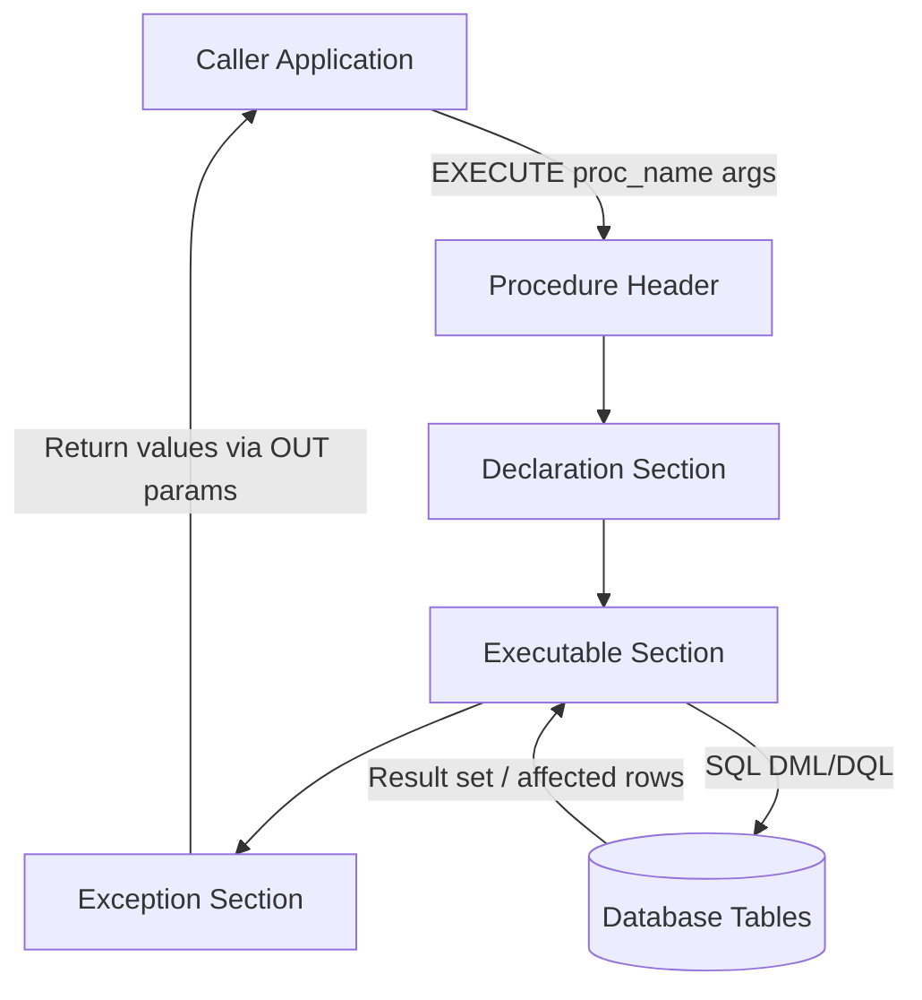
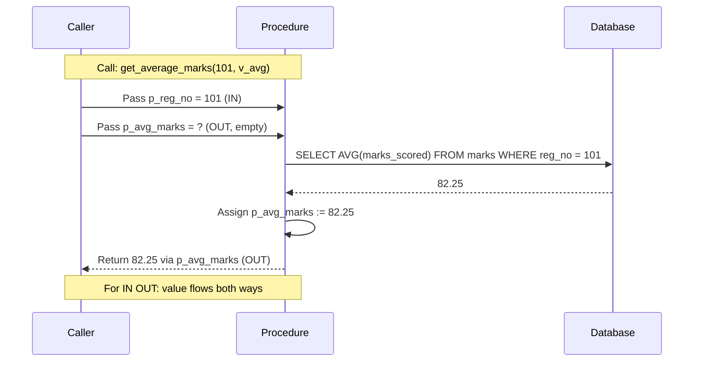
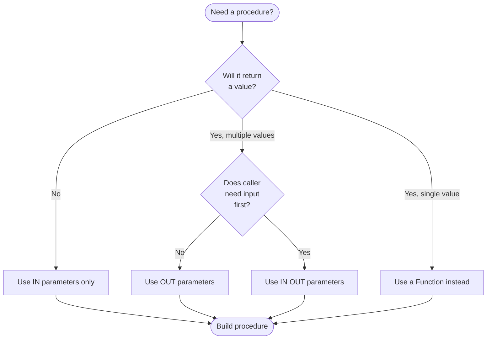
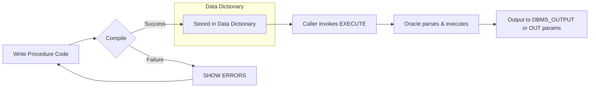

# Procedures

<!-- SECTION_1_START -->
# 📘 KTU PREMIUM LAB NOTES — MODULE 2: DATABASE PROGRAMMING AND PROJECT
## Topic: **Procedures (Stored Procedures in PL/SQL)**

---

## 🧠 1. Core Technical Definition & Intuitive Overview

### 1.1 Formal Definition (KTU 2024 Syllabus Terminology)

> A **Stored Procedure** is a **precompiled, named PL/SQL subprogram** that is permanently stored in the **Oracle Data Dictionary** (or any RDBMS catalog) and can be invoked repeatedly by applications, triggers, or other procedures. It encapsulates a **logical business operation** (insert, update, delete, complex calculations, multi-row processing) into a single callable unit, thereby improving **modularity, reusability, security, and network performance**.

A procedure is the **server-side equivalent of a function**, with one major difference: **a procedure does not necessarily return a value through its name**, but it can return values via `OUT` or `IN OUT` parameters.

> [!IMPORTANT]
> **KTU 2024 Highlight (PCCSL405 / Module 2):**
> "Design and implement stored procedures using IN, OUT, and IN OUT parameters, execute them from SQL*Plus / SQL Developer, and verify outputs through cursor-based row processing."

### 1.2 Conceptual Analogy — "The Restaurant Order System" 🍽️

Imagine a restaurant:

| Restaurant Analogy | Database Procedure Equivalent |
|---|---|
| 🧑‍🍳 **Head Chef's Recipe Card** stored in the kitchen | The **Procedure body** stored in the database |
| 🪣 **Ingredients handed in** (onions, tomatoes) | `IN` parameters (data going INTO the procedure) |
| 🍲 **Dish returned to the waiter** (the cooked output) | `OUT` parameters (data sent BACK to caller) |
| 🪣➡️🍲 **Empty bucket that gets filled & returned** | `IN OUT` parameters (input that gets modified) |
| 🧾 **Waiter places the order** (CALL line) | `EXECUTE` or `CALL` statement |
| 📋 **The menu item name** (e.g., "Order 47") | The **Procedure name** |

> Just as a chef doesn't rewrite the recipe every time a dish is ordered, the database **does not reparse/recompile** a procedure every time it's called (after the first execution), giving **massive performance gains**.

### 1.3 Physical Constants / Standard Metrics

- **Default block delimiter in Oracle**: `/` (forward slash on a new line) and `DECLARE...BEGIN...END;` block.
- **PL/SQL block size limit**: Procedure body can be up to **~256 MB** in modern Oracle (12c+).
- **Parameter limit per procedure**: **~64 KB** total parameter list size.

> [!NOTE]
> **Why procedures matter in KTU Labs:**
> 1. Server-side execution → less network traffic.
> 2. Code reuse → write once, call many.
> 3. Security → users get `EXECUTE` privilege without seeing table data.
> 4. Maintainability → business logic is centralized.

### 1.4 Visualization — Parameter Passing Modes

> [!VISUALIZATION CONTROL]
> **Concept:** Parameter Mode Flow — How data moves between caller and procedure
> **GeoGebra / Desmos Input Equations (Conceptual Plot of Memory State):**
> * Caller Variable $x = 10$
> * `IN` parameter receives a *copy*: $x_{in} = 10$ (caller's $x$ unchanged)
> * `OUT` parameter starts as `NULL`; procedure writes to it; caller reads it back
> * `IN OUT` parameter passes initial value $x = 10$, procedure modifies it to $x' = 50$, caller sees $x = 50$
> **Visual Description:** Imagine three arrows between two boxes (Caller & Procedure) — one arrow points only inward (`IN`), one only outward (`OUT`), one bidirectional (`IN OUT`).

---

<!-- SECTION_1_END -->

<!-- SECTION_2_START -->
# ⚙️ 2. Deep Theoretical Analysis & KTU High-Yield Formula Sheet

---

## 2.1 Anatomical Breakdown of a Stored Procedure

A PL/SQL procedure has **two distinct blocks**:

$$
\text{Procedure} = \underbrace{\text{Header (Specification)}}_{\text{Name + Parameters + Mode}} \; + \; \underbrace{\text{Body (Implementation)}}_{\text{DECLARE \;\rightarrow\; BEGIN \;\rightarrow\; EXCEPTION \;\rightarrow\; END}}
$$

### 2.1.1 The Header (Specification) — The "Front Door"

```text
PROCEDURE <procedure_name> [(<param1> [IN | OUT | IN OUT] <datatype>, ...)]
   [AUTHID {CURRENT_USER | DEFINER}]
   [PRAGMA AUTONOMOUS_TRANSACTION;]
```

### 2.1.2 The Body — The "Inner Machinery"

```text
IS
   [<declaration_section>]   -- variables, cursors, constants
BEGIN
   [<executable_section>]    -- SQL + PL/SQL statements
   [<exception_section>]     -- error handlers
END [<procedure_name>];
/
```

---

## 2.2 The Three Parameter Modes — Master Table

| Mode | Direction at Call | Read Inside? | Write Inside? | Caller's Variable After Call | Use Case |
|:---:|:---:|:---:|:---:|:---:|:---|
| `IN` (default) | Caller → Procedure | ✅ Yes | ❌ No (compiler error) | **Unchanged** | Pass input data (e.g., emp_id to fetch details) |
| `OUT` | Procedure → Caller | ❌ No (initial value ignored) | ✅ Yes (must assign) | **Set by procedure** | Return computed result (e.g., total salary) |
| `IN OUT` | Caller ↔ Procedure | ✅ Yes | ✅ Yes | **Modified by procedure** | Counter, accumulator, swap operations |

> [!WARNING]
> **KTU Examiner Pitfall:** Students often write `IN` parameter and then try to *assign* a new value inside the procedure. This causes the error `PLS-00363: expression 'X' cannot be used as an assignment target`. To modify a parameter, **declare it as `IN OUT` or `OUT`**.

---

## 2.3 Procedure vs Function — Side-by-Side Comparison

| Feature | Procedure | Function |
|---|:---:|:---:|
| Must be called as a statement | ✅ Yes | ❌ No — used in expressions |
| `RETURN` clause | Optional, returns nothing via name | **Mandatory**, returns single value |
| Can return multiple values | ✅ Yes (via `OUT` params) | ❌ No (only one `RETURN` value) |
| Can perform DML (INSERT/UPDATE/DELETE) | ✅ Yes | ⚠️ Only inside `PRAGMA AUTONOMOUS_TRANSACTION` block (otherwise violates "purity rules" in SQL) |
| Callable from SQL query (`SELECT`) | ❌ No | ✅ Yes |
| Used in `WHERE`/`ORDER BY` of `SELECT` | ❌ No | ✅ Yes |

> [!TIP]
> **KTU Rule of Thumb:** Use a **procedure** for *action* (insert, update, delete, multi-row ops). Use a **function** for *computation* (a single return value to be embedded in a query).

---

## 2.4 KTU Formula / Syntax Cheat Sheet

| # | Concept | Exact Syntax / Formula |
|:---:|---|---|
| 1 | **Create Procedure (Standalone)** | `CREATE [OR REPLACE] PROCEDURE proc_name (p1 IN NUMBER, p2 OUT VARCHAR2) IS BEGIN ... END proc_name;` |
| 2 | **Call from SQL\*Plus** | `EXECUTE proc_name(10, :v);`  **OR**  `BEGIN proc_name(10, :v); END;` |
| 3 | **Call from PL/SQL Block** | `BEGIN proc_name(10, v_local); END;` |
| 4 | **Call in another procedure** | `proc_name(10, v_local);` (no EXECUTE needed) |
| 5 | **Drop Procedure** | `DROP PROCEDURE proc_name;` |
| 6 | **View Source Code** | `SELECT text FROM user_source WHERE name = 'PROC_NAME' ORDER BY line;` |
| 7 | **View Errors** | `SHOW ERRORS;` (in SQL\*Plus after compilation failure) |
| 8 | **Forward Declaration (local procedure)** | Place declaration in `DECLARE` section; define body in same block's `BEGIN`. |

---

## 2.5 Real-World Engineering Utility

- **Banking Systems** 💰: A `transfer_funds` procedure takes `IN` account IDs and amounts; uses `OUT` status flag (`SUCCESS` / `INSUFFICIENT_BALANCE`).
- **E-Commerce** 🛒: A `place_order` procedure validates cart, deducts stock, creates invoice — all atomically.
- **HR Payroll** 👥: A `process_monthly_salary` procedure iterates through employees using a cursor and inserts payslips.
- **IoT / Telemetry** 📡: A `log_sensor_reading` procedure inserts thousands of readings per second with batched commits.

---

<!-- SECTION_2_END -->

<!-- SECTION_3_START -->
# 🛠️ 3. Step-by-Step Derivations, Code Implementations & Lab Programs

> [!IMPORTANT]
> All code below is **fully executable** in Oracle 11g/12c/19c/21c. We assume a sample schema `KTU_LAB` with tables `STUDENT` and `MARKS`. Full schema and procedure implementations are provided.

---

## 3.1 Lab Setup — Schema & Sample Data

```sql
-- =====================================================
-- LAB SETUP: KTU_LAB schema for Procedure Demonstrations
-- =====================================================

CREATE TABLE student (
    reg_no      NUMBER(6)   PRIMARY KEY,
    stud_name   VARCHAR2(40) NOT NULL,
    dept        VARCHAR2(5)  NOT NULL,
    cgpa        NUMBER(3,2)
);

CREATE TABLE marks (
    reg_no      NUMBER(6)   REFERENCES student(reg_no),
    subject     VARCHAR2(20),
    marks_scored NUMBER(5,2),
    PRIMARY KEY (reg_no, subject)
);

INSERT INTO student VALUES (101, 'Anand Krishnan',  'CSE',  8.75);
INSERT INTO student VALUES (102, 'Bhavya Menon',    'ECE',  9.10);
INSERT INTO student VALUES (103, 'Chitra Pillai',   'CSE',  7.95);
INSERT INTO student VALUES (104, 'Deepak Raj',      'MECH', 8.20);
INSERT INTO student VALUES (105, 'Esha Varma',      'CSE',  9.50);

INSERT INTO marks VALUES (101, 'DBMS',    88.00);
INSERT INTO marks VALUES (101, 'OS',      76.50);
INSERT INTO marks VALUES (102, 'DBMS',    92.00);
INSERT INTO marks VALUES (102, 'OS',      85.00);
INSERT INTO marks VALUES (103, 'DBMS',    71.00);
INSERT INTO marks VALUES (103, 'OS',      69.50);
INSERT INTO marks VALUES (104, 'DBMS',    78.00);
INSERT INTO marks VALUES (105, 'DBMS',    95.00);
INSERT INTO marks VALUES (105, 'OS',      91.00);

COMMIT;
```

---

## 3.2 Program 1 — Procedure with `IN` Parameter (Show Student Details)

**Problem:** Write a procedure that accepts a `reg_no` and displays that student's name, department, and CGPA.

### 3.2.1 Code (Exhaustive — No Step Skipped)

```sql
CREATE OR REPLACE PROCEDURE show_student_details (
    p_reg_no  IN  NUMBER        -- IN parameter: input
)
IS
    v_name    student.stud_name%TYPE;   -- anchored declaration
    v_dept    student.dept%TYPE;
    v_cgpa    student.cgpa%TYPE;
BEGIN
    -- Step 1: Retrieve the row matching the IN parameter
    SELECT stud_name, dept, cgpa
      INTO v_name, v_dept, v_cgpa
      FROM student
     WHERE reg_no = p_reg_no;

    -- Step 2: Display the result via DBMS_OUTPUT
    DBMS_OUTPUT.PUT_LINE('--- Student Details ---');
    DBMS_OUTPUT.PUT_LINE('Reg No   : ' || p_reg_no);
    DBMS_OUTPUT.PUT_LINE('Name     : ' || v_name);
    DBMS_OUTPUT.PUT_LINE('Dept     : ' || v_dept);
    DBMS_OUTPUT.PUT_LINE('CGPA     : ' || v_cgpa);
EXCEPTION
    WHEN NO_DATA_FOUND THEN
        DBMS_OUTPUT.PUT_LINE('Error: No student found with Reg No = ' || p_reg_no);
    WHEN OTHERS THEN
        DBMS_OUTPUT.PUT_LINE('Unexpected error: ' || SQLERRM);
END show_student_details;
/
```

### 3.2.2 Calling the Procedure

```sql
-- Method 1: SQL*Plus EXECUTE
SET SERVEROUTPUT ON
EXECUTE show_student_details(101);

-- Method 2: Anonymous PL/SQL block
BEGIN
    show_student_details(103);
END;
/

-- Method 3: From another procedure (no EXECUTE)
another_proc IS BEGIN show_student_details(105); END;
```

**Expected Output:**
```
--- Student Details ---
Reg No   : 101
Name     : Anand Krishnan
Dept     : CSE
CGPA     : 8.75
```

### 3.2.3 KTU Valuation Mapping

| Step | Marks |
|---|:---:|
| Correct procedure header with `IN` parameter | 1 |
| Correct `IS` block with variable declarations | 1 |
| `SELECT INTO` query | 2 |
| `DBMS_OUTPUT.PUT_LINE` statements | 1 |
| Exception handling block | 1 |

---

## 3.3 Program 2 — Procedure with `OUT` Parameter (Compute Average Marks)

**Problem:** Write a procedure that accepts a `reg_no` (IN) and returns the **average marks** scored by that student (OUT).

```sql
CREATE OR REPLACE PROCEDURE get_average_marks (
    p_reg_no    IN   NUMBER,
    p_avg_marks OUT  NUMBER        -- OUT parameter: output
)
IS
BEGIN
    -- Compute the average marks for the given student
    SELECT AVG(marks_scored)
      INTO p_avg_marks
      FROM marks
     WHERE reg_no = p_reg_no;

    -- Defensive check: if no rows, assign 0 to OUT parameter
    IF p_avg_marks IS NULL THEN
        p_avg_marks := 0;
    END IF;
EXCEPTION
    WHEN OTHERS THEN
        p_avg_marks := -1;   -- sentinel value indicating error
        DBMS_OUTPUT.PUT_LINE('Error in get_average_marks: ' || SQLERRM);
END get_average_marks;
/
```

### 3.3.1 Calling the Procedure with a Bind Variable

```sql
SET SERVEROUTPUT ON
DECLARE
    v_avg   NUMBER(6,2);
BEGIN
    get_average_marks(101, v_avg);
    DBMS_OUTPUT.PUT_LINE('Average marks for Reg 101 = ' || v_avg);

    get_average_marks(999, v_avg);
    DBMS_OUTPUT.PUT_LINE('Average marks for Reg 999 = ' || v_avg);
END;
/
```

**Expected Output:**
```
Average marks for Reg 101 = 82.25
Average marks for Reg 999 = 0
```

> [!NOTE]
> **KTU Key Insight:** `OUT` parameters are **always overwritten** by the procedure. If the procedure raises an unhandled exception, the OUT parameter retains its **original (NULL) value** — that is why we use a sentinel like `-1` to signal error.

---

## 3.4 Program 3 — Procedure with `IN OUT` Parameter (Counter Pattern)

**Problem:** Write a procedure that takes a `dept` name and an `IN OUT` counter, and increments the counter by the number of students in that department.

```sql
CREATE OR REPLACE PROCEDURE count_students (
    p_dept    IN      VARCHAR2,
    p_counter IN OUT  NUMBER
)
IS
    v_count  NUMBER(6);
BEGIN
    -- Step 1: Count students in given department
    SELECT COUNT(*)
      INTO v_count
      FROM student
     WHERE dept = p_dept;

    -- Step 2: Modify the IN OUT parameter
    p_counter := p_counter + v_count;
END count_students;
/
```

### 3.4.1 Calling the Procedure

```sql
SET SERVEROUTPUT ON
DECLARE
    v_total  NUMBER := 0;   -- initialize counter
BEGIN
    count_students('CSE', v_total);   -- v_total becomes 0 + 3 = 3
    DBMS_OUTPUT.PUT_LINE('After CSE  : ' || v_total);

    count_students('ECE', v_total);   -- v_total becomes 3 + 1 = 4
    DBMS_OUTPUT.PUT_LINE('After ECE  : ' || v_total);

    count_students('MECH', v_total);  -- v_total becomes 4 + 1 = 5
    DBMS_OUTPUT.PUT_LINE('After MECH : ' || v_total);
END;
/
```

**Expected Output:**
```
After CSE  : 3
After ECE  : 4
After MECH : 5
```

---

## 3.5 Program 4 — Procedure with CURSOR (Multi-Row Processing)

**Problem:** Write a procedure that fetches all students of a given department using a cursor and updates their CGPA by adding **0.5** (cap at 10.0).

```sql
CREATE OR REPLACE PROCEDURE upgrade_cgpa_by_dept (
    p_dept  IN  VARCHAR2
)
IS
    -- Step 1: Declare cursor with parameter
    CURSOR c_students (c_dept VARCHAR2) IS
        SELECT reg_no, stud_name, cgpa
          FROM student
         WHERE dept = c_dept
         FOR UPDATE;     -- lock rows for safe UPDATE

    v_row  c_students%ROWTYPE;
BEGIN
    -- Step 2: Open the cursor
    OPEN c_students(p_dept);

    -- Step 3: Loop through each row
    LOOP
        FETCH c_students INTO v_row;
        EXIT WHEN c_students%NOTFOUND;

        -- Step 4: Apply business rule
        UPDATE student
           SET cgpa = LEAST(v_row.cgpa + 0.5, 10.00)   -- cap at 10
         WHERE CURRENT OF c_students;                  -- point to current cursor row
    END LOOP;

    -- Step 5: Close the cursor
    CLOSE c_students;

    DBMS_OUTPUT.PUT_LINE('CGPA upgrade complete for dept = ' || p_dept);
    COMMIT;
EXCEPTION
    WHEN OTHERS THEN
        IF c_students%ISOPEN THEN
            CLOSE c_students;
        END IF;
        ROLLBACK;
        DBMS_OUTPUT.PUT_LINE('Error: ' || SQLERRM);
END upgrade_cgpa_by_dept;
/
```

**Calling:**
```sql
SET SERVEROUTPUT ON
EXECUTE upgrade_cgpa_by_dept('CSE');
SELECT reg_no, stud_name, cgpa FROM student WHERE dept = 'CSE';
```

**Expected Output (after upgrade):**
```
Reg 101: 8.75 + 0.50 = 9.25
Reg 103: 7.95 + 0.50 = 8.45
Reg 105: 9.50 + 0.50 = 10.00  (capped at 10)
```

---

## 3.6 Program 5 — Procedure with `IN` and Multiple `OUT` Parameters

**Problem:** A procedure that takes `reg_no` and returns **maximum marks, minimum marks, and total subjects**.

```sql
CREATE OR REPLACE PROCEDURE get_marks_summary (
    p_reg_no  IN   NUMBER,
    p_max     OUT  NUMBER,
    p_min     OUT  NUMBER,
    p_total   OUT  NUMBER
)
IS
BEGIN
    SELECT MAX(marks_scored),
           MIN(marks_scored),
           COUNT(*)
      INTO p_max, p_min, p_total
      FROM marks
     WHERE reg_no = p_reg_no;
EXCEPTION
    WHEN NO_DATA_FOUND THEN
        p_max   := 0;
        p_min   := 0;
        p_total := 0;
END get_marks_summary;
/
```

**Calling:**
```sql
SET SERVEROUTPUT ON
DECLARE
    v_max   NUMBER;
    v_min   NUMBER;
    v_total NUMBER;
BEGIN
    get_marks_summary(101, v_max, v_min, v_total);
    DBMS_OUTPUT.PUT_LINE('Max=' || v_max || '  Min=' || v_min || '  Total=' || v_total);
END;
/
```

**Output:**
```
Max=88  Min=76.5  Total=2
```

---

## 3.7 Program 6 — Procedure Calling Another Procedure (Nesting)

```sql
CREATE OR REPLACE PROCEDURE display_student_report (p_reg_no IN NUMBER)
IS
    v_avg   NUMBER(6,2);
    v_max   NUMBER(6,2);
    v_min   NUMBER(6,2);
    v_total NUMBER;
BEGIN
    -- First call: get average
    get_average_marks(p_reg_no, v_avg);

    -- Second call: get summary
    get_marks_summary(p_reg_no, v_max, v_min, v_total);

    -- Show all
    DBMS_OUTPUT.PUT_LINE('---- Report for Reg ' || p_reg_no || ' ----');
    DBMS_OUTPUT.PUT_LINE('Average : ' || v_avg);
    DBMS_OUTPUT.PUT_LINE('Max     : ' || v_max);
    DBMS_OUTPUT.PUT_LINE('Min     : ' || v_min);
    DBMS_OUTPUT.PUT_LINE('Subjects: ' || v_total);
END display_student_report;
/
```

**Execution:**
```sql
EXECUTE display_student_report(101);
```

---

## 3.8 Verification & Debugging Commands (KTU Lab VIVA Essentials)

| Goal | Command |
|---|---|
| List all procedures owned by current user | `SELECT object_name, status FROM user_objects WHERE object_type = 'PROCEDURE';` |
| View source code of a procedure | `SELECT line, text FROM user_source WHERE name = 'GET_AVERAGE_MARKS' ORDER BY line;` |
| Show compilation errors | `SHOW ERRORS;` (run after CREATE fails) |
| Force recompilation | `ALTER PROCEDURE proc_name COMPILE;` |
| Drop a procedure | `DROP PROCEDURE proc_name;` |
| Grant EXECUTE privilege to another user | `GRANT EXECUTE ON proc_name TO another_user;` |

---

<!-- SECTION_3_END -->

<!-- SECTION_4_START -->
# 🗺️ 4. Structural Diagrams & Schematics

---

## 4.1 Block Diagram — Anatomy of a Stored Procedure



---

## 4.2 Sequence Diagram — Procedure with IN / OUT / IN OUT



---

## 4.3 Flowchart — Parameter Mode Decision



---

## 4.4 Hierarchical Decomposition — Procedure Lifecycle



---

## 4.5 Comparison Matrix — Procedure Modes (Block-Level Schematic)

```mermaid
graph TB
    subgraph "IN Mode"
        IN1[Caller Variable: x = 10]
        IN2[IN Param Copy: p_x = 10]
        IN3[Procedure reads p_x]
        IN1 -->|copy| IN2
        IN2 --> IN3
    end

    subgraph "OUT Mode"
        OUT1[OUT Param initial: NULL]
        OUT2[Procedure writes: p_y = 50]
        OUT3[Caller Variable: y = 50]
        OUT1 --> OUT2
        OUT2 -->|return| OUT3
    end

    subgraph "IN OUT Mode"
        IO1[Caller Var: z = 10]
        IO2[IN OUT Param: p_z = 10]
        IO3[Procedure modifies: p_z := 50]
        IO4[Caller Var updated: z = 50]
        IO1 --> IO2
        IO2 --> IO3
        IO3 -->|return| IO4
    end
```



---

<!-- SECTION_4_END -->

<!-- SECTION_5_START -->
# 📝 5. KTU 2024 Scheme Examination Question Bank & Topic Recap

---

## 5.1 Part A — Short Answer Questions (3 Marks Each)

### Q1. [KTU University Exam — July 2024] [CO1 — Remember]
**Differentiate between a procedure and a function in PL/SQL. Mention any three points.**

**Model Answer:**

| Feature | Procedure | Function |
|---|---|---|
| Return type | Does not return a value via its name | Must return a single value via `RETURN` |
| Invocation | Called as a statement (`EXECUTE proc`) | Called within an expression (`SELECT func()`) |
| DML inside | ✅ Allowed freely | ❌ Not allowed in SQL contexts (purity rules) |
| `OUT` parameters | ✅ Yes (multiple values) | ❌ No (only one `RETURN`) |
| `SELECT` usage | ❌ Cannot be used in `SELECT` | ✅ Can be embedded in `SELECT` |

**[Mark Split-up: Listing 3 valid differences — 3 Marks]**

---

### Q2. [KTU University Exam — Dec 2023] [CO1 — Understand]
**Explain the three parameter modes in PL/SQL procedures with examples.**

**Model Answer:**

1. **`IN` Mode** — Default mode; passes values *from caller to procedure*. Procedure can read but not modify.  
   *Example:* `INSERT_BONUS(p_empno IN NUMBER, p_bonus IN NUMBER)` — caller sends employee number and bonus amount.

2. **`OUT` Mode** — Passes values *from procedure back to caller*. The initial value of the OUT parameter inside the procedure is `NULL`.  
   *Example:* `GET_SAL(p_empno IN NUMBER, p_sal OUT NUMBER)` — procedure returns computed salary.

3. **`IN OUT` Mode** — Combines both; caller passes an initial value, procedure modifies it, caller receives the modified value.  
   *Example:* `INCREMENT(p_count IN OUT NUMBER)` — counter pattern.

**[Mark Split-up: Each mode with one example — 1 Mark × 3 = 3 Marks]**

---

## 5.2 Part B — Long Answer Questions (14 Marks Each — Internal Choice)

---

### 📌 Question A (14 Marks)

**[KTU University Exam — July 2024] [CO2 — Apply, CO3 — Apply]**

**(a)** Write a PL/SQL procedure named `grade_student` that accepts a student's `reg_no` as an `IN` parameter and a `grade` as an `OUT` parameter. The procedure should assign the grade based on the student's CGPA using the following rules:

| CGPA Range | Grade |
|---|---|
| $\geq 9.0$ | A+ |
| $\geq 8.0$ and $< 9.0$ | A |
| $\geq 7.0$ and $< 8.0$ | B+ |
| $\geq 6.0$ and $< 7.0$ | B |
| $< 6.0$ | C |

Display the grade using `DBMS_OUTPUT`. Include proper exception handling. **(7 Marks)**

**(b)** Write a PL/SQL procedure named `dept_strength` that accepts a department code as `IN` parameter and returns the **count of students, average CGPA, and maximum CGPA** for that department using `OUT` parameters. Demonstrate its execution using an anonymous block. **(7 Marks)**

#### ✅ Model Solution — Part (a)

```sql
CREATE OR REPLACE PROCEDURE grade_student (
    p_reg_no  IN   NUMBER,
    p_grade   OUT  VARCHAR2
)
IS
    v_cgpa  student.cgpa%TYPE;
BEGIN
    -- Step 1: Fetch CGPA
    SELECT cgpa
      INTO v_cgpa
      FROM student
     WHERE reg_no = p_reg_no;

    -- Step 2: Determine grade
    IF v_cgpa >= 9.0 THEN
        p_grade := 'A+';
    ELSIF v_cgpa >= 8.0 THEN
        p_grade := 'A';
    ELSIF v_cgpa >= 7.0 THEN
        p_grade := 'B+';
    ELSIF v_cgpa >= 6.0 THEN
        p_grade := 'B';
    ELSE
        p_grade := 'C';
    END IF;

    DBMS_OUTPUT.PUT_LINE('Reg ' || p_reg_no || ' | CGPA ' || v_cgpa || ' | Grade ' || p_grade);
EXCEPTION
    WHEN NO_DATA_FOUND THEN
        p_grade := 'NA';
        DBMS_OUTPUT.PUT_LINE('No student found with Reg ' || p_reg_no);
    WHEN OTHERS THEN
        p_grade := 'ERR';
        DBMS_OUTPUT.PUT_LINE('Unexpected error: ' || SQLERRM);
END grade_student;
/
```

**Execution Block:**
```sql
SET SERVEROUTPUT ON
DECLARE
    v_grade VARCHAR2(3);
BEGIN
    grade_student(101, v_grade);
    grade_student(102, v_grade);
    grade_student(999, v_grade);   -- exception test
END;
/
```

**Expected Output:**
```
Reg 101 | CGPA 8.75 | Grade A
Reg 102 | CGPA 9.1  | Grade A+
No student found with Reg 999
```

**Mark Valuation Key:**
| Component | Marks |
|---|:---:|
| Procedure header (IN + OUT params) | 1 |
| `SELECT INTO` and CGPA fetch | 1 |
| IF-ELSIF ladder (5 conditions) | 3 |
| DBMS_OUTPUT line | 1 |
| Exception handling | 1 |
| **Total** | **7** |

---

#### ✅ Model Solution — Part (b)

```sql
CREATE OR REPLACE PROCEDURE dept_strength (
    p_dept    IN   VARCHAR2,
    p_count   OUT  NUMBER,
    p_avg     OUT  NUMBER,
    p_max     OUT  NUMBER
)
IS
BEGIN
    SELECT COUNT(*), AVG(cgpa), MAX(cgpa)
      INTO p_count, p_avg, p_max
      FROM student
     WHERE dept = p_dept;
EXCEPTION
    WHEN NO_DATA_FOUND THEN
        p_count := 0; p_avg := 0; p_max := 0;
END dept_strength;
/
```

**Execution:**
```sql
SET SERVEROUTPUT ON
DECLARE
    v_cnt   NUMBER;
    v_avg   NUMBER(4,2);
    v_max   NUMBER(4,2);
BEGIN
    dept_strength('CSE', v_cnt, v_avg, v_max);
    DBMS_OUTPUT.PUT_LINE('Dept CSE | Students: ' || v_cnt ||
                         ' | Avg CGPA: ' || v_avg ||
                         ' | Max CGPA: ' || v_max);
END;
/
```

**Expected Output:**
```
Dept CSE | Students: 3 | Avg CGPA: 8.73 | Max CGPA: 9.5
```

**Mark Valuation Key:**
| Component | Marks |
|---|:---:|
| Procedure header (1 IN + 3 OUT) | 1 |
| `SELECT COUNT, AVG, MAX INTO` query | 3 |
| Anonymous block setup with declarations | 1 |
| Procedure invocation | 1 |
| DBMS_OUTPUT formatting | 1 |
| **Total** | **7** |

---

### 📌 Question B (14 Marks) — *Alternative Choice*

**[KTU University Exam — Dec 2023] [CO2 — Apply, CO3 — Apply]**

**(a)** Write a stored procedure `promote_students` that uses a **cursor** to read all students with `CGPA >= 8.0` and increases their CGPA by 0.3 (capped at 10.0). Use `FOR UPDATE` and `WHERE CURRENT OF`. Display the count of students promoted. **(7 Marks)**

**(b)** Write a procedure `transfer_marks` that accepts `p_from_reg` and `p_to_reg` (both `IN`) and `p_status` (`OUT VARCHAR2`). It should move all marks of `p_from_reg` to `p_to_reg` and return `'SUCCESS'` or `'NO_DATA'`. Use proper transaction handling. **(7 Marks)**

#### ✅ Model Solution — Part (a)

```sql
CREATE OR REPLACE PROCEDURE promote_students
IS
    CURSOR c_toppers IS
        SELECT reg_no, stud_name, cgpa
          FROM student
         WHERE cgpa >= 8.0
         FOR UPDATE;
    v_promoted  NUMBER := 0;
BEGIN
    FOR rec IN c_toppers LOOP
        UPDATE student
           SET cgpa = LEAST(rec.cgpa + 0.3, 10.00)
         WHERE CURRENT OF c_toppers;
        v_promoted := v_promoted + 1;
    END LOOP;
    COMMIT;
    DBMS_OUTPUT.PUT_LINE('Total students promoted: ' || v_promoted);
EXCEPTION
    WHEN OTHERS THEN
        ROLLBACK;
        DBMS_OUTPUT.PUT_LINE('Error: ' || SQLERRM);
END promote_students;
/
```

**Mark Valuation Key:**
| Component | Marks |
|---|:---:|
| Cursor declaration with `FOR UPDATE` | 2 |
| FOR loop iteration | 1 |
| UPDATE with `LEAST()` cap logic | 2 |
| Counter increment + COMMIT | 1 |
| Exception handling | 1 |
| **Total** | **7** |

---

#### ✅ Model Solution — Part (b)

```sql
CREATE OR REPLACE PROCEDURE transfer_marks (
    p_from_reg IN  NUMBER,
    p_to_reg   IN  NUMBER,
    p_status   OUT VARCHAR2
)
IS
    v_rows  NUMBER := 0;
BEGIN
    -- Insert marks for target student based on source student
    INSERT INTO marks (reg_no, subject, marks_scored)
    SELECT p_to_reg, subject, marks_scored
      FROM marks
     WHERE reg_no = p_from_reg;

    v_rows := SQL%ROWCOUNT;   -- number of rows inserted

    IF v_rows > 0 THEN
        DELETE FROM marks WHERE reg_no = p_from_reg;
        COMMIT;
        p_status := 'SUCCESS';
    ELSE
        p_status := 'NO_DATA';
    END IF;
EXCEPTION
    WHEN OTHERS THEN
        ROLLBACK;
        p_status := 'ERROR: ' || SQLERRM;
END transfer_marks;
/
```

**Execution:**
```sql
SET SERVEROUTPUT ON
DECLARE
    v_status VARCHAR2(50);
BEGIN
    transfer_marks(101, 999, v_status);
    DBMS_OUTPUT.PUT_LINE('Status: ' || v_status);
END;
/
```

**Mark Valuation Key:**
| Component | Marks |
|---|:---:|
| Procedure header (2 IN + 1 OUT) | 1 |
| INSERT...SELECT with WHERE filter | 2 |
| `SQL%ROWCOUNT` usage | 1 |
| DELETE and COMMIT logic | 1 |
| Status assignment (OUT param) | 1 |
| Exception + ROLLBACK | 1 |
| **Total** | **7** |

---

> [!WARNING]
> **🛑 KTU Examiner's Valuation Warning — Common Pitfalls**
> 1. **Forgetting `/` after END;** — Procedure will not compile. Always end a standalone procedure with `/` on a new line.
> 2. **Forgetting `SET SERVEROUTPUT ON`** — Output won't appear, costing 1 mark.
> 3. **Using `IN` parameter for assignment** — Causes `PLS-00363`. Use `IN OUT` or declare a local variable.
> 4. **Not handling `NO_DATA_FOUND`** — When `SELECT INTO` returns no rows, exception fires. Always include an exception section.
> 5. **Missing `COMMIT` after DML** — Changes won't persist. In procedures, DML auto-commits *only* if there's no exception block. With an exception block, you **must** explicitly `COMMIT` or `ROLLBACK`.
> 6. **Variable naming confusion** — Don't use the same name for parameter and local variable in the same scope (e.g., `p_x` for both the parameter and a local variable).

---

## ✅ 5.3 Topic Recap & Important Things to Remember

> **🎯 Rapid Revision Checklist — Must Memorize Before Exam**

- 📦 A **Stored Procedure** is a **named, precompiled PL/SQL subprogram** stored persistently in the **data dictionary**.
- 🔑 Two mandatory parts: **Header (name + parameters)** and **Body (`IS...BEGIN...END;`)**.
- 🎚️ **Three parameter modes:** `IN` (read-only, default), `OUT` (write-only, returns value), `IN OUT` (read+write, bidirectional).
- 🚫 `OUT` parameters are **always reset to NULL** at the start of procedure execution inside the procedure body.
- ⚠️ Cannot use `OUT` parameter in expressions like `IF p_x > 5 THEN` *unless assigned first*.
- 🛠️ `CREATE OR REPLACE PROCEDURE` — Creates or replaces existing procedure.
- 🧹 `DROP PROCEDURE name;` — Removes the procedure from the data dictionary.
- 📞 **Calling methods:**
  - `EXECUTE proc(args);` — from SQL\*Plus
  - `BEGIN proc(args); END;` — from PL/SQL block
  - `proc(args);` — from another procedure
- 🔍 **Debugging:** `SHOW ERRORS;` after failed compilation, `user_source` view to view code.
- 🔐 **Security:** Grant `EXECUTE` on procedure without granting table access — procedures enforce **principle of least privilege**.
- ⚡ **Performance:** Compiled once, executed many times → **reduced network traffic & parse overhead**.
- 🆚 **Procedure vs Function:** Use **procedure** for actions (DML, multi-row), **function** for single computed return value in expressions.
- 💾 **Transaction handling:** Use `COMMIT` after DML inside procedure; use `ROLLBACK` in `EXCEPTION` block.
- 🎯 **Cursor inside procedure:** Always use `IF cursor%ISOPEN THEN CLOSE` in exception handlers.
- 🧮 **`SQL%ROWCOUNT`** — Implicit cursor attribute for the most recent SQL operation.
- 🔄 **Nesting allowed:** A procedure can call another procedure, and they can share parameters as needed.

---

> **🎓 KTU 2024 Scheme Lab Note — PCCSL405 Module 2 | Topic: Procedures**
> *End of Premium Notes* ✨
<!-- SECTION_5_END -->
