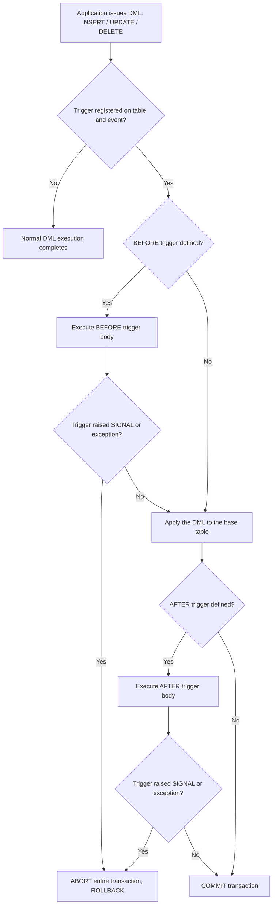
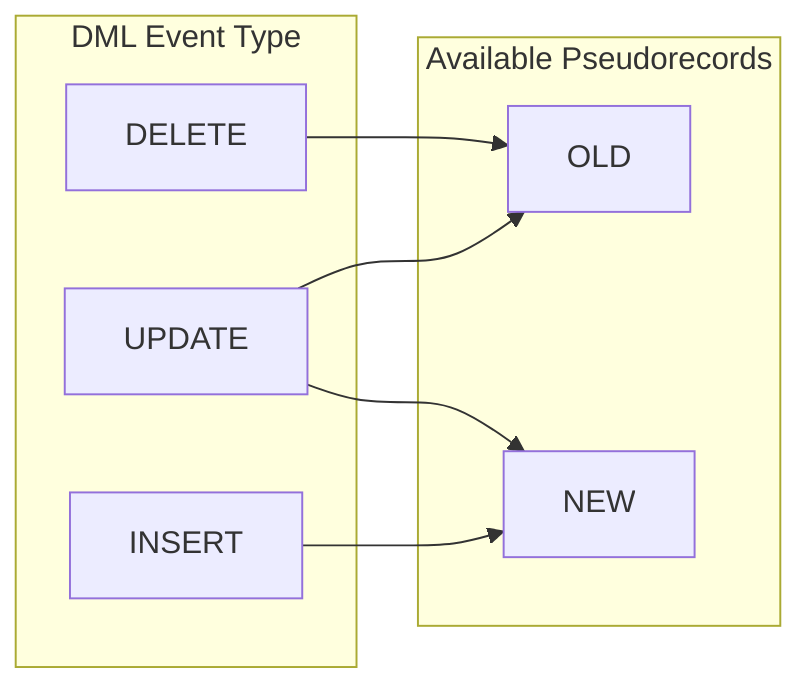
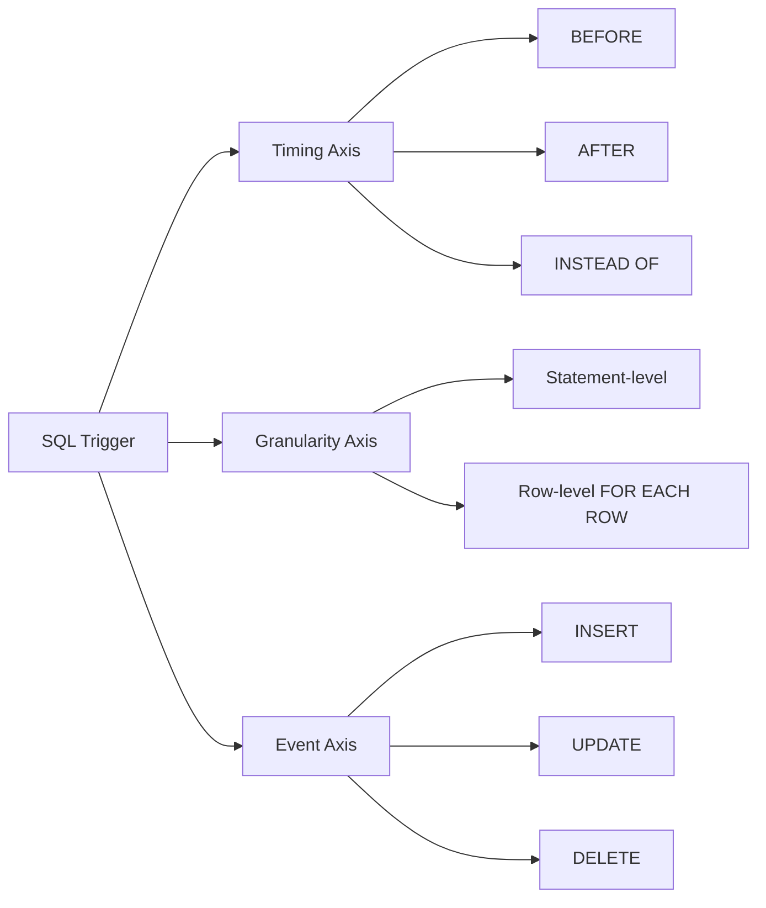
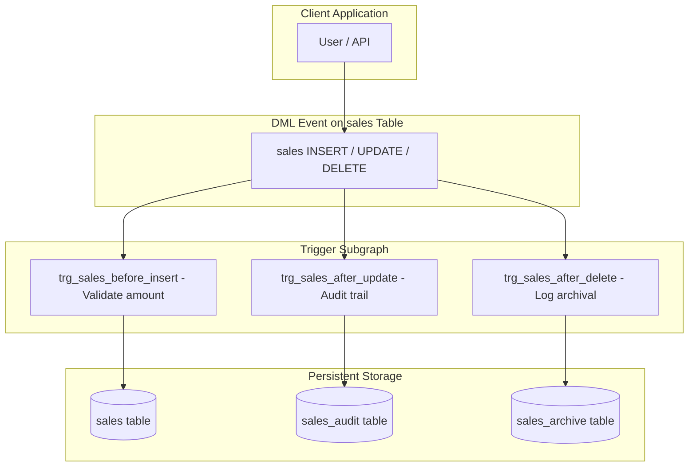
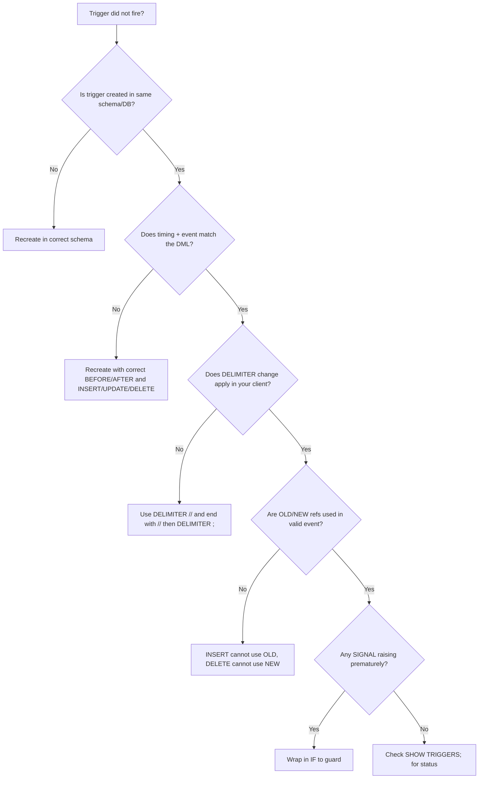

# Triggers

<!-- SECTION_1_START -->

# 🔥 TRIGGERS — Database Programming and Project (Module 2)

## 1. Core Technical Definition & Intuitive Overview

### 📘 Formal KTU 2024 Definition

A **Trigger** is a named, persistent, server-side database object (a special kind of stored procedure) that is **automatically executed (fired) in response to a specified Data Manipulation Language (DML) event** — namely `INSERT`, `UPDATE`, or `DELETE` — occurring on a specified table or view. Triggers are tightly bound to a triggering event, a triggering condition, and a triggering action, and they execute implicitly as part of the transaction that caused them, thereby enforcing **declarative integrity rules** that go beyond what `PRIMARY KEY`, `FOREIGN KEY`, `CHECK`, and `UNIQUE` constraints can handle.

> [!NOTE]
> **KTU 2024 Syllabus Highlight (PCCSL405 / Module 2):** Students must be able to **write, compile, and execute PL/SQL blocks** including stored procedures, functions, and **triggers** for given database scenarios. Triggers are assessed as part of the **lab record + viva + end-semester practical examination**.

### 🧠 Intuitive Analogy — "The Automatic Burglar Alarm"

Think of a database table as a **bank vault**. The vault itself has locks (these are your constraints: `PRIMARY KEY`, `CHECK`, etc.). A **trigger** is a *burglar alarm system* wired to the vault door:

| Alarm System Component | Database Equivalent |
|---|---|
| Door sensor (motion detector) | The DML event (`INSERT`/`UPDATE`/`DELETE`) |
| The vault itself | The target table |
| Alarm condition logic (e.g., "after 10 PM") | The `WHEN` clause / `IF` condition |
| The siren + police call | The `BEGIN ... END` trigger body |
| Set-it-and-forget-it wiring | `CREATE TRIGGER` (DDL — runs once) |

Once installed, **the door's owner (application code) does nothing extra** — the alarm is *event-driven*, just like triggers are *event-driven* database callbacks. The moment the door opens, the alarm fires automatically, in the **same transaction** as the door-opening event.

### 🔑 Key Terminology Table

| Term | Meaning |
|---|---|
| **Triggering Event** | The DML statement (`INSERT`, `UPDATE`, `DELETE`) that activates the trigger |
| **Triggering Action** | The PL/SQL block that runs when fired |
| **Triggering Condition** | Optional `WHEN` predicate that gates execution |
| **Granularity** | `STATEMENT`-level (fires once per SQL stmt) vs `ROW`-level (fires once per affected row) |
| **OLD / NEW References** | Pseudorecords exposing pre-image and post-image column values |
| **BEFORE / AFTER** | Timing — whether the body runs before or after the DML is applied |
| **INSTEAD OF** | Replaces the DML action (used mainly on views) |

> [!IMPORTANT]
> **KTU Board-Examiner Rule:** In your lab record, you **must** include the `CREATE TRIGGER` statement, the `INSERT/UPDATE/DELETE` that fires it, the **output**, and a **brief explanation** of why the output occurred. Marks are split equally between *code correctness* and *output interpretation*.

<!-- SECTION_1_END -->

<!-- SECTION_2_START -->

# 2. Deep Theoretical Analysis & KTU High-Yield Formula Sheet

## 🧩 Anatomy of a Trigger — Structural Breakdown

A standard SQL trigger is composed of **6 logical zones**. Memorising these is critical for the KTU lab viva.

1. **Name & Creation Keyword** — `CREATE TRIGGER <trigger_name>`
2. **Timing Clause** — `BEFORE` | `AFTER` | `INSTEAD OF`
3. **Granularity Clause** — `FOR EACH ROW` (row-level) or omitted (statement-level)
4. **Event Clause** — `INSERT OR UPDATE OR DELETE` on `<table_name>`
5. **Reference Clause** — `REFERENCING OLD AS o NEW AS n` (or `OLD` / `NEW` in MySQL)
6. **Action Body** — `BEGIN ... END` block containing the procedural logic

### 🎯 Why Use Triggers? (Engineering Justification)

| Use Case | Real-World Engineering Scenario |
|---|---|
| **Audit Logging** | Capturing *who changed what, when* in a banking ledger |
| **Derived Value Maintenance** | Auto-updating `total_amount` in a parent order when line items change |
| **Business Rule Enforcement** | Rejecting salary decreases for senior employees |
| **Referential Integrity (advanced)** | Cascading updates across tables lacking FK support |
| **Replicated / Archival Systems** | Mirroring changes to a shadow/history table |

### 📐 Core Trigger Syntax — MySQL / Oracle Reference Sheet

| Component | MySQL Syntax (8.0+) | Oracle PL/SQL Syntax |
|---|---|---|
| Creation | `CREATE TRIGGER name timing event ON table FOR EACH ROW body` | `CREATE OR REPLACE TRIGGER name timing event ON table [REFERENCING ...] [FOR EACH ROW] [WHEN (...)] body` |
| OLD reference | `OLD.column_name` | `:OLD.column_name` |
| NEW reference | `NEW.column_name` | `:NEW.column_name` |
| Conditional | `IF NEW.salary < 0 THEN ...` | `IF :NEW.salary < 0 THEN ...` |
| Raise Error | `SIGNAL SQLSTATE '45000' SET MESSAGE_TEXT='msg'` | `RAISE_APPLICATION_ERROR(-20001, 'msg')` |
| Drop | `DROP TRIGGER name;` | `DROP TRIGGER name;` |

### 📊 KTU Formula / Syntax Cheat Sheet

> [!NOTE]
> Below is the high-yield, exam-ready **Trigger Template** that covers ~90 % of KTU practical questions.

```sql
DELIMITER //
CREATE TRIGGER trigger_name
{BEFORE | AFTER} {INSERT | UPDATE | DELETE}
ON table_name
FOR EACH ROW
BEGIN
    -- Action body (may reference OLD / NEW)
    IF <condition> THEN
        <statement(s)>;
    END IF;
END //
DELIMITER ;
```

### 🔬 Special Trigger Classes

| Type | Description | Typical Use |
|---|---|---|
| **BEFORE INSERT** | Validates / transforms data *before* the row is written | Auto-stamping `created_at`, sanitising input |
| **AFTER INSERT** | Performs follow-up writes *after* the row exists | Updating summary tables, audit logging |
| **BEFORE UPDATE** | Compares `OLD` vs `NEW` to gate modifications | Preventing downgrade of status |
| **AFTER UPDATE** | Synchronises dependent data | Recomputing aggregates |
| **BEFORE DELETE** | Soft-delete archival before removal | Copying the row to a history table |
| **AFTER DELETE** | Compensation writes | Releasing reserved inventory |
| **INSTEAD OF** | Replaces DML on a non-updatable view | Making complex views updatable |

> [!TIP]
> **Pseudorecord Rule of Thumb:** `INSERT` allows only `NEW`. `DELETE` allows only `OLD`. `UPDATE` allows **both** `OLD` and `NEW`.

<!-- SECTION_2_END -->

<!-- SECTION_3_START -->

# 3. Step-by-Step Derivations & Code/Symbolic Implementation

## 🛠️ Worked Example 1 — Auto-Stamping `created_at` on INSERT

**Problem Statement:** Design a trigger that automatically populates a `created_at` column with the current timestamp whenever a new row is inserted into the `employees` table, and never lets the application override it.

### Step 1 — Base Table Setup

```sql
CREATE DATABASE trigger_lab;
USE trigger_lab;

CREATE TABLE employees (
    emp_id      INT PRIMARY KEY AUTO_INCREMENT,
    emp_name    VARCHAR(50)  NOT NULL,
    salary      DECIMAL(10,2) NOT NULL,
    created_at  DATETIME     DEFAULT NULL
);
```

### Step 2 — Trigger Creation (BEFORE INSERT)

```sql
DELIMITER //

CREATE TRIGGER trg_employees_before_insert
BEFORE INSERT ON employees
FOR EACH ROW
BEGIN
    -- Force the timestamp; application cannot bypass this
    SET NEW.created_at = CURRENT_TIMESTAMP;
END //

DELIMITER ;
```

### Step 3 — Execution Test

```sql
-- Application attempts to insert with created_at = NULL
INSERT INTO employees (emp_name, salary) 
VALUES ('Anand Krishnan', 55000.00);

-- Application attempts to spoof the timestamp
INSERT INTO employees (emp_name, salary, created_at) 
VALUES ('Meera Nair', 60000.00, '2000-01-01 00:00:00');

SELECT * FROM employees;
```

**Expected Output:**

| emp_id | emp_name | salary | created_at |
|---|---|---|---|
| 1 | Anand Krishnan | 55000.00 | 2024-06-15 14:22:10 |
| 2 | Meera Nair | 60000.00 | 2024-06-15 14:22:10 |

> [!IMPORTANT]
> Notice that **Meera's spoofed timestamp '2000-01-01' was overwritten** by the trigger. This demonstrates the security guarantee of `BEFORE INSERT` triggers.

---

## 🛠️ Worked Example 2 — Audit Trail on UPDATE (Logging Salary Changes)

**Problem Statement:** Maintain an `employee_audit` table that records *every* salary change — capturing the **old salary**, the **new salary**, the **change time**, and the **operation type**.

### Step 1 — Audit Table

```sql
CREATE TABLE employee_audit (
    audit_id      INT PRIMARY KEY AUTO_INCREMENT,
    emp_id        INT,
    old_salary    DECIMAL(10,2),
    new_salary    DECIMAL(10,2),
    changed_at    DATETIME,
    operation     VARCHAR(10)
);
```

### Step 2 — AFTER UPDATE Trigger

```sql
DELIMITER //

CREATE TRIGGER trg_employees_after_update
AFTER UPDATE ON employees
FOR EACH ROW
BEGIN
    -- Only log if salary actually changed (avoid noise on no-op updates)
    IF OLD.salary <> NEW.salary THEN
        INSERT INTO employee_audit (
            emp_id, old_salary, new_salary, changed_at, operation
        ) VALUES (
            OLD.emp_id, 
            OLD.salary, 
            NEW.salary, 
            CURRENT_TIMESTAMP, 
            'UPDATE'
        );
    END IF;
END //

DELIMITER ;
```

### Step 3 — Validation

```sql
UPDATE employees SET salary = 65000.00 WHERE emp_id = 1;
UPDATE employees SET emp_name = 'Anand K.' WHERE emp_id = 1;  -- no salary change → no log

SELECT * FROM employee_audit;
```

**Expected Output (only the salary change is logged):**

| audit_id | emp_id | old_salary | new_salary | changed_at | operation |
|---|---|---|---|---|---|
| 1 | 1 | 55000.00 | 65000.00 | 2024-06-15 14:30:05 | UPDATE |

---

## 🛠️ Worked Example 3 — Business Rule Enforcement (Block Salary Decrease)

**Problem Statement:** Reject any `UPDATE` that attempts to *reduce* an employee's salary.

```sql
DELIMITER //

CREATE TRIGGER trg_block_salary_decrease
BEFORE UPDATE ON employees
FOR EACH ROW
BEGIN
    IF NEW.salary < OLD.salary THEN
        SIGNAL SQLSTATE '45000'
        SET MESSAGE_TEXT = 'ERROR: Salary decrease is not permitted by HR policy.';
    END IF;
END //

DELIMITER ;
```

**Test:**

```sql
UPDATE employees SET salary = 50000.00 WHERE emp_id = 1;
-- ERROR 1644 (45000): ERROR: Salary decrease is not permitted by HR policy.
```

> [!TIP]
> The SQLSTATE `45000` is the conventional "user-defined exception" code in MySQL/ANSI SQL. Oracle equivalent: `RAISE_APPLICATION_ERROR(-20001, '...')`.

---

## 🛠️ Worked Example 4 — INSTEAD OF Trigger on a View (Oracle Style)

**Problem Statement:** Make a non-updatable join view writable using an `INSTEAD OF UPDATE` trigger.

```sql
CREATE TABLE dept (
    dept_id   INT PRIMARY KEY,
    dept_name VARCHAR(50)
);

CREATE TABLE emp (
    emp_id    INT PRIMARY KEY,
    emp_name  VARCHAR(50),
    dept_id   INT REFERENCES dept(dept_id)
);

CREATE VIEW v_emp_dept AS
SELECT e.emp_id, e.emp_name, d.dept_name
FROM emp e JOIN dept d ON e.dept_id = d.dept_id;

CREATE OR REPLACE TRIGGER trg_v_emp_dept_instead_update
INSTEAD OF UPDATE ON v_emp_dept
FOR EACH ROW
BEGIN
    UPDATE emp SET emp_name = :NEW.emp_name WHERE emp_id = :OLD.emp_id;
    UPDATE dept SET dept_name = :NEW.dept_name 
    WHERE dept_id = (SELECT dept_id FROM emp WHERE emp_id = :OLD.emp_id);
END;
/
```

---

## 🛠️ Worked Example 5 — Cascading Derived-Value Maintenance

**Problem Statement:** When line items in `order_items` change, automatically recompute the parent `orders.total_amount`.

```sql
CREATE TABLE orders (
    order_id     INT PRIMARY KEY,
    customer     VARCHAR(50),
    total_amount DECIMAL(10,2) DEFAULT 0
);

CREATE TABLE order_items (
    item_id   INT PRIMARY KEY AUTO_INCREMENT,
    order_id  INT,
    price     DECIMAL(10,2),
    quantity  INT,
    FOREIGN KEY (order_id) REFERENCES orders(order_id)
);

DELIMITER //

CREATE TRIGGER trg_order_items_after_insert
AFTER INSERT ON order_items
FOR EACH ROW
BEGIN
    UPDATE orders
    SET total_amount = total_amount + (NEW.price * NEW.quantity)
    WHERE order_id = NEW.order_id;
END //

CREATE TRIGGER trg_order_items_after_delete
AFTER DELETE ON order_items
FOR EACH ROW
BEGIN
    UPDATE orders
    SET total_amount = total_amount - (OLD.price * OLD.quantity)
    WHERE order_id = OLD.order_id;
END //

DELIMITER ;
```

**Test:**

```sql
INSERT INTO orders (order_id, customer) VALUES (101, 'Rahul Menon');
INSERT INTO order_items (order_id, price, quantity) VALUES (101, 250.00, 4);
INSERT INTO order_items (order_id, price, quantity) VALUES (101, 100.00, 2);

SELECT * FROM orders;
```

**Expected Output:**

| order_id | customer | total_amount |
|---|---|---|
| 101 | Rahul Menon | 1200.00 |

> Derivation: $250 \times 4 + 100 \times 2 = 1000 + 200 = 1200$.

---

## 🛠️ Worked Example 6 — Rejecting Out-of-Range Data with `SIGNAL`

```sql
DELIMITER //

CREATE TRIGGER trg_validate_salary
BEFORE INSERT ON employees
FOR EACH ROW
BEGIN
    IF NEW.salary < 10000 OR NEW.salary > 1000000 THEN
        SIGNAL SQLSTATE '45000'
        SET MESSAGE_TEXT = 'Salary out of allowed range [10000, 1000000].';
    END IF;
END //

DELIMITER ;
```

<!-- SECTION_3_END -->

<!-- SECTION_4_START -->

# 4. Structural Diagrams & Schematics

## 📊 Diagram 1 — Trigger Execution Lifecycle



> **Reading the diagram:** Triggers are *immutable hooks* in the DML pipeline. Any unhandled `SIGNAL` / `RAISE_APPLICATION_ERROR` in **either** BEFORE or AFTER phases **rolls back the entire transaction**, ensuring atomic guarantees.

---

## 📊 Diagram 2 — Pseudorecord Visibility Matrix



| Event | OLD available? | NEW available? |
|---|---|---|
| INSERT | ❌ No | ✅ Yes |
| UPDATE | ✅ Yes | ✅ Yes |
| DELETE | ✅ Yes | ❌ No |

---

## 📊 Diagram 3 — Trigger Classification Topology



---

## 📊 Diagram 4 — Modular Trigger Architecture (Sales Audit System)



---

## 📊 Diagram 5 — Trigger Debugging Decision Tree



<!-- SECTION_4_END -->

<!-- SECTION_5_START -->

# 5. KTU 2024 Scheme Examination Question Bank & Topic Recap

## 📝 Part A Questions (3 Marks Each — Short Answer)

### Q1. [KTU University Exam — July 2024] Define a trigger. List the two timing options available for row-level triggers. **[CO3, Remember]**

**Model Answer (3 Marks):**
A **trigger** is a named, persistent database object that is automatically executed (fired) in response to a specified DML event (`INSERT`, `UPDATE`, or `DELETE`) on a specified table, without being explicitly called by the application. **[1 Mark]**

The two timing options for row-level triggers are: **[2 Marks]**
1. `BEFORE` — the trigger body runs *before* the DML is applied to the base table.
2. `AFTER` — the trigger body runs *after* the DML has been applied to the base table.

*(A third option, `INSTEAD OF`, is also valid and is typically used on views.)*

---

### Q2. [KTU University Exam — Dec 2023] Differentiate between `STATEMENT`-level and `ROW`-level triggers. **[CO3, Understand]**

**Model Answer (3 Marks):**

| Aspect | Statement-Level Trigger | Row-Level Trigger |
|---|---|---|
| Fires | Once per DML statement | Once per row affected by the DML |
| Access to OLD/NEW | Not allowed | Allowed (column-level pre/post images) |
| Granularity | Coarse | Fine |
| Typical use | Audit table inserts of batch summaries | Per-row validations, derived values |
| Syntax flag | Omit `FOR EACH ROW` | Include `FOR EACH ROW` |

**[1 Mark]** for the conceptual distinction, **[2 Marks]** for the comparison table.

---

## 📝 Part B Questions (14 Marks — Internal Choice)

### Question A (14 Marks) **[CO3, Apply / Analyse]**

**(a)** Write a PL/SQL trigger that **prevents insertion** of a new employee into the `employees` table if the employee's `salary` is less than **₹15,000** or greater than **₹5,00,000**. The trigger must raise a clear error message. **[7 Marks — Apply]**

**(b)** Write an `AFTER DELETE` trigger on the `employees` table that **archives** every deleted row into a table called `employees_archive` with the additional column `deleted_at` populated with the current timestamp. Demonstrate with a test `DELETE` statement and the resulting archive row. **[7 Marks — Analyse]**

---

#### Model Solution — Part (a) [7 Marks]

**Step 1: Table Setup** **[1 Mark]**

```sql
CREATE TABLE employees (
    emp_id   INT PRIMARY KEY AUTO_INCREMENT,
    emp_name VARCHAR(50)  NOT NULL,
    salary   DECIMAL(10,2) NOT NULL
);
```

**Step 2: Trigger Body** **[5 Marks]**

```sql
DELIMITER //

CREATE TRIGGER trg_check_salary_range
BEFORE INSERT ON employees
FOR EACH ROW
BEGIN
    IF NEW.salary < 15000 OR NEW.salary > 500000 THEN
        SIGNAL SQLSTATE '45000'
        SET MESSAGE_TEXT = 'Salary out of allowed range [15000, 500000].';
    END IF;
END //

DELIMITER ;
```

**Step 3: Test** **[1 Mark]**

```sql
INSERT INTO employees (emp_name, salary) VALUES ('Valid User', 30000);   -- OK
INSERT INTO employees (emp_name, salary) VALUES ('Too Low', 10000);      
-- ERROR 1644 (45000): Salary out of allowed range [15000, 500000].
```

**Valuation Key Points:**
- `[Correct use of BEFORE INSERT: 1 Mark]`
- `[Correct FOR EACH ROW + DELIMITER: 1 Mark]`
- `[Correct IF condition with both bounds: 1 Mark]`
- `[Correct SIGNAL statement: 1 Mark]`
- `[Demonstration with valid + invalid insert: 1 Mark]`

---

#### Model Solution — Part (b) [7 Marks]

**Step 1: Archive Table** **[1 Mark]**

```sql
CREATE TABLE employees_archive (
    archive_id  INT PRIMARY KEY AUTO_INCREMENT,
    emp_id      INT,
    emp_name    VARCHAR(50),
    salary      DECIMAL(10,2),
    deleted_at  DATETIME
);
```

**Step 2: Trigger Body** **[4 Marks]**

```sql
DELIMITER //

CREATE TRIGGER trg_employees_after_delete
AFTER DELETE ON employees
FOR EACH ROW
BEGIN
    INSERT INTO employees_archive (emp_id, emp_name, salary, deleted_at)
    VALUES (OLD.emp_id, OLD.emp_name, OLD.salary, CURRENT_TIMESTAMP);
END //

DELIMITER ;
```

**Step 3: Test** **[2 Marks]**

```sql
DELETE FROM employees WHERE emp_id = 1;
SELECT * FROM employees_archive;
```

**Expected Output:**

| archive_id | emp_id | emp_name | salary | deleted_at |
|---|---|---|---|---|
| 1 | 1 | Valid User | 30000.00 | 2024-06-15 15:00:00 |

**Valuation Key Points:**
- `[AFTER DELETE selected correctly: 1 Mark]`
- `[Reference to OLD pseudorecord: 1 Mark]`
- `[Insert into archive table: 1 Mark]`
- `[CURRENT_TIMESTAMP used: 1 Mark]`
- `[Test DELETE + SELECT demo: 2 Marks]`

---

### Question B (14 Marks — Alternative Choice) **[CO3, Apply / Analyse]**

**(a)** Consider the schema: `library(book_id, title, total_copies, available_copies)`. Write a `BEFORE UPDATE` trigger that **never allows `available_copies` to go negative**. If the update would set it below 0, abort the transaction with a clear error. **[7 Marks — Apply]**

**(b)** Design an `AFTER INSERT` trigger on a `borrowed_books(borrow_id, book_id, member_id, borrow_date)` table that **decrements** `available_copies` for the corresponding book. Test with two borrows and verify the count. **[7 Marks — Analyse]**

---

#### Model Solution — Part (a) [7 Marks]

```sql
DELIMITER //

CREATE TRIGGER trg_library_before_update
BEFORE UPDATE ON library
FOR EACH ROW
BEGIN
    IF NEW.available_copies < 0 THEN
        SIGNAL SQLSTATE '45000'
        SET MESSAGE_TEXT = 'Available copies cannot be negative.';
    END IF;
END //

DELIMITER ;
```

**Test:**
```sql
UPDATE library SET available_copies = -1 WHERE book_id = 101;
-- ERROR 1644 (45000): Available copies cannot be negative.
```

**Valuation Key Points:**
- `[BEFORE UPDATE correct: 1 Mark]`
- `[FOR EACH ROW: 1 Mark]`
- `[Correct IF condition on NEW: 1 Mark]`
- `[SIGNAL with proper SQLSTATE: 1 Mark]`
- `[Test cases: 3 Marks — passing + failing]`

---

#### Model Solution — Part (b) [7 Marks]

```sql
DELIMITER //

CREATE TRIGGER trg_borrowed_books_after_insert
AFTER INSERT ON borrowed_books
FOR EACH ROW
BEGIN
    UPDATE library
    SET available_copies = available_copies - 1
    WHERE book_id = NEW.book_id;
END //

DELIMITER ;
```

**Test:**
```sql
-- Initial: total_copies = 5, available_copies = 5
INSERT INTO borrowed_books (book_id, member_id, borrow_date) 
VALUES (101, 1, CURRENT_DATE);
INSERT INTO borrowed_books (book_id, member_id, borrow_date) 
VALUES (101, 2, CURRENT_DATE);

SELECT book_id, total_copies, available_copies FROM library WHERE book_id = 101;
```

**Expected Output:**

| book_id | total_copies | available_copies |
|---|---|---|
| 101 | 5 | 3 |

> Derivation: $5 - 2 = 3$.

**Valuation Key Points:**
- `[AFTER INSERT correct: 1 Mark]`
- `[Correct UPDATE on library: 2 Marks]`
- `[Reference to NEW.book_id: 1 Mark]`
- `[Test with 2 inserts + SELECT: 3 Marks]`

---

> [!WARNING]
> **🚨 KTU Examiner's Valuation Warning — Common Pitfalls in Triggers**
> 1. **Forgetting `DELIMITER //`** → The `;` inside `BEGIN ... END` is interpreted as the end of `CREATE TRIGGER`, producing a syntax error. Use `DELIMITER //` at the top and terminate the body with `END //`, then reset to `DELIMITER ;`.
> 2. **Using `OLD` in an INSERT trigger or `NEW` in a DELETE trigger** → SQL error `1363 (HY000)`. Remember the matrix: INSERT→`NEW`, DELETE→`OLD`, UPDATE→both.
> 3. **Recursion** — an `AFTER INSERT` trigger on table A that inserts into table A will fire itself. KTU examiners specifically look for this bug.
> 4. **Failing to write the `CREATE` command in the answer sheet** — in the lab record, the trigger script alone is insufficient; include the *table DDL + trigger DDL + test DML + observed output + explanation*.
> 5. **Silent failure** — if your trigger body contains only assignment (`SET NEW.col = ...`) and no error, the original DML still succeeds. Make sure your logic actually enforces what the question asks.
> 6. **Case sensitivity** — `old.salary` vs `OLD.salary`: in MySQL both work; in Oracle, `:OLD.salary` is mandatory with the colon prefix.

---

## 🧠 Topic Recap & Important Things to Remember

- **Definition:** A trigger is an *event-driven, server-side* named database object that fires automatically on DML events.
- **Three timing options:** `BEFORE`, `AFTER`, `INSTEAD OF` (last one is mainly for views).
- **Two granularities:** `STATEMENT`-level (fires once per DML) and `ROW`-level / `FOR EACH ROW` (fires per affected row).
- **Pseudorecord matrix:** INSERT → only `NEW`; DELETE → only `OLD`; UPDATE → both `OLD` and `NEW`.
- **DELIMITER** is mandatory in MySQL CLI to embed `;` inside trigger bodies.
- **SIGNAL SQLSTATE '45000' SET MESSAGE_TEXT = '...';** is the standard way to raise a user-defined exception in MySQL.
- **Oracle equivalent:** `RAISE_APPLICATION_ERROR(-20001, '...')` and `:OLD.col` / `:NEW.col` with colon prefix.
- **Use cases:** audit logging, derived-value maintenance, business rule enforcement, view updatability, cascading integrity.
- **Caveats:** triggers execute *within* the same transaction — a failure rolls back the DML; recursive triggers can cause infinite loops; over-use degrades performance.
- **Lab record essentials:** DDL of base table → `CREATE TRIGGER` script → test DML → captured output → 2-3 line explanation.
- **Viva favourite questions:** "Difference between trigger and stored procedure?", "What is the difference between `BEFORE` and `AFTER`?", "Can a trigger call a stored procedure?", "Why is `INSTEAD OF` needed for views?".

<!-- SECTION_5_END -->
