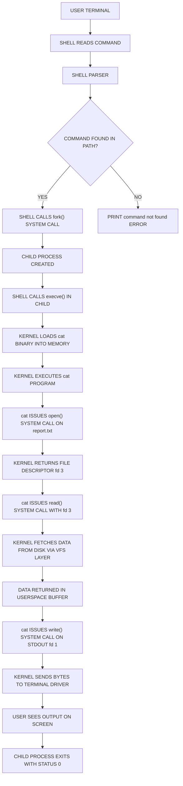
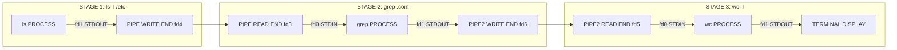
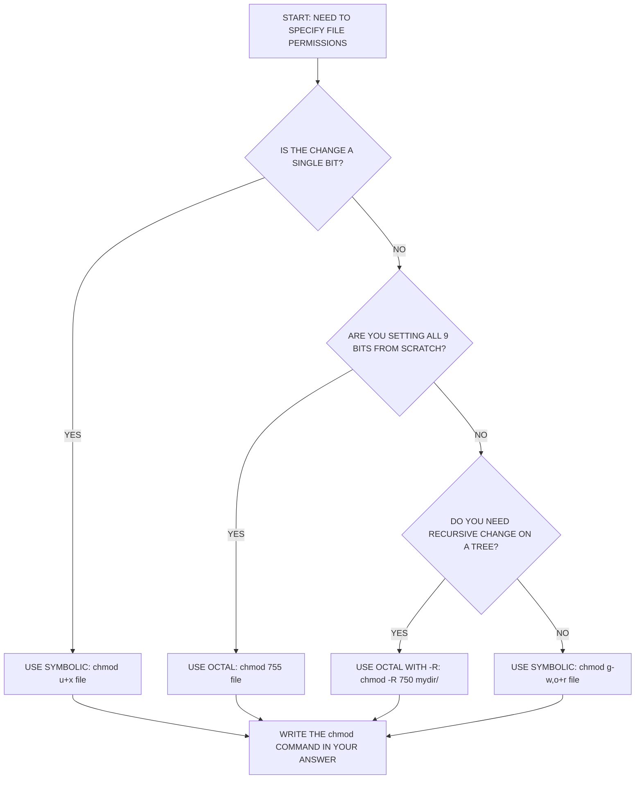
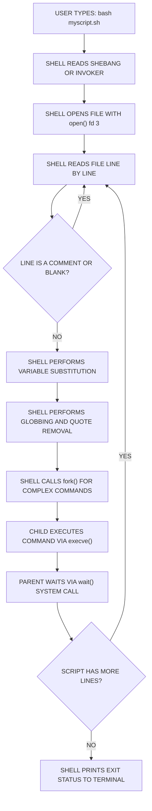
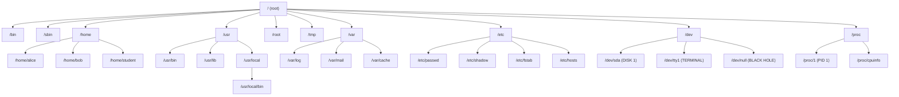

# Basic Unix/Linux Commands and File Operations

<!-- SECTION_1_START -->

# Basic Unix/Linux Commands and File Operations

## 1.1 Core Technical Definition

In the context of the **KTU 2024 Scheme Operating Systems Lab (PCCSL406)**, *Basic Unix/Linux Commands and File Operations* refer to the foundational set of instructions issued to the **Unix shell** (commonly `bash`, `sh`, or `zsh`) through a **Command Line Interface (CLI)** to manipulate the **hierarchical file system**, manage **file metadata**, and interact with the **Operating System kernel** via the **POSIX (Portable Operating System Interface)** standard.

A **shell** is a *command-line interpreter* that reads user-issued text commands, parses them according to syntactic rules, and dispatches them to the kernel for execution. The Linux kernel, which is **monolithic** and **modular**, exposes its services exclusively through **system calls** (e.g., `open()`, `read()`, `write()`, `execve()`), and the shell acts as a high-level abstraction layer over these calls.

> [!IMPORTANT]
> **KTU Syllabus Highlight (Module 1):** Students are expected to demonstrate proficiency in *at least* the following command families: navigation (`pwd`, `cd`, `ls`), file manipulation (`cp`, `mv`, `rm`, `cat`, `touch`), directory management (`mkdir`, `rmdir`), permission control (`chmod`, `chown`, `umask`), redirection (`>`, `>>`, `<`, `\vert`), and process inspection (`ps`, `top`, `kill`).

## 1.2 Conceptual Analogy & Intuition

Imagine the **Linux Operating System** as a massive, multi-story library building. Let us map this analogy to understand the components:

- **The Building (Kernel)**: The actual structure with the heating, electricity, water, and elevators (the core OS resources).
- **The Library Catalog (File System)**: A perfectly organized index of every book (file) and every shelf (directory) in the building.
- **The Librarian (Shell)**: The friendly attendant standing at the front desk. You do not walk into the basement to flip electrical switches; you politely ask the librarian, "Please bring me book *Bash_Scripting.pdf* from shelf *CSE/Sem4/*."
- **The Bash Language (Command Syntax)**: The specific set of sentences the librarian understands (e.g., "find", "copy", "list", "remove").

When you type `ls -la /home/student` and press **Enter**, three things happen at lightning speed:

1. The shell **parses** the string into a command (`ls`) and arguments (`-la /home/student`).
2. The shell invokes the corresponding **system call** sequence (`opendir()` → `readdir()` → `closedir()`).
3. The kernel returns the result, which the shell formats and prints to your terminal.

> [!NOTE]
> **Geometric Intuition — The Absolute Path**: Think of the file system as an inverted tree with the **root directory `/`** at the very top. Every file and folder is a node connected by edges. An **absolute path** is a sequence of moves starting from the root and walking down the tree. A **relative path** is a sequence of moves starting from your *current working directory* (CWD), wherever you happen to be standing in the tree.

### 1.2.1 Visualization of the File System Tree

> [!VISUALIZATION CONTROL]
> **Concept:** Hierarchical Tree Structure of the Linux File System
> **GeoGebra / Desmos Input Equations (Conceptual Graph):**
>
> - Root Node: $R = \{\text{"}\diagdown\text{"}\}$
> - Branching Factor: $b \approx 12$ typical first-level directories
> - Depth: $d$ can be arbitrarily large (kernel limit is usually 4096)
> **Visual Description:** A downward-growing tree with `/` at the apex. Branches fan out to `/bin`, `/etc`, `/home`, `/usr`, `/var`. Inside `/home`, sub-branches emerge for each user account, and inside those, the user's personal files reside as leaves. The student should picture `cd` as a "teleport" command and `pwd` as "report current position".

## 1.3 The Linux Standard Directory Hierarchy (FHS)

The **Filesystem Hierarchy Standard (FHS)** is the de-facto blueprint every Linux distribution follows. Knowing this blueprint is essential for the KTU lab viva.

| Directory | Purpose | Engineering Analogy |
| :--- | :--- | :--- |
| `/` | Root — the ancestor of all paths | The ground floor lobby |
| `/bin` | Essential user binaries (e.g., `ls`, `cp`, `cat`) | The toolbox at the entrance |
| `/sbin` | System binaries (e.g., `fdisk`, `ifconfig`) | The maintenance staff's toolkit |
| `/etc` | Host-specific system configuration files | The building's rule book |
| `/home` | User home directories | Private apartments for each resident |
| `/root` | The superuser's home directory | The building manager's office |
| `/tmp` | Temporary files (cleared on reboot) | A scratchpad anyone can use |
| `/var` | Variable data (logs, mail, spool files) | The notice board and mailbox area |
| `/usr` | User system resources — read-only user data | The public library |
| `/dev` | Device files (terminals, disks, null) | The electrical sockets (every device is a file) |
| `/proc` | Virtual filesystem exposing process & kernel info | A live CCTV feed of the building |

> [!NOTE]
> **The "Everything is a File" Philosophy:** In Unix/Linux, hardware devices (`/dev/sda`), network sockets, pipes, and even running processes are abstracted as files. This elegant uniformity means the same `read()` and `write()` system calls work for disks, keyboards, and network interfaces alike.

<!-- SECTION_1_END -->

<!-- SECTION_2_START -->

# Deep Theoretical Analysis & KTU High-Yield Formula Sheet

## 2.1 The Anatomy of a Unix Command

Every Unix command, regardless of complexity, follows a rigid **three-token grammar**:

```text
command [options] [arguments]
```

- **Command**: The verb (the actual program file in `/bin`, `/usr/bin`, etc.).
- **Options** (also called *flags* or *switches*): Adjectives that modify behavior. By convention, short options use a single dash (`-l`), long options use two dashes (`--all`).
- **Arguments**: Nouns — the targets the command operates on (usually filenames, directory paths, or user names).

**Example Decomposition:**

```text
cp -i -v report.txt /home/student/backup/
```

| Token | Type | Meaning |
| :--- | :--- | :--- |
| `cp` | command | Copy files and directories |
| `-i` | short option | Interactive — prompt before overwrite |
| `-v` | short option | Verbose — print each operation |
| `report.txt` | argument | Source file (the *what*) |
| `/home/student/backup/` | argument | Destination directory (the *where*) |

## 2.2 File Permission Mathematics (Octal Mode)

This is the **single most-tested theoretical concept** in KTU Module 1 viva questions. Linux permissions are represented as a **9-bit binary mask** divided into three classes: **Owner (User)**, **Group**, and **Others (World)**.

Each class receives three permission bits: **Read (r)**, **Write (w)**, and **Execute (x)**.

### 2.2.1 The Symbolic-to-Octal Conversion Matrix

| Permission | Binary Digit | Octal Value | Symbol |
| :--- | :---: | :---: | :---: |
| No permission | 000 | **0** | `---` |
| Execute only | 001 | **1** | `--x` |
| Write only | 010 | **2** | `-w-` |
| Write + Execute | 011 | **3** | `-wx` |
| Read only | 100 | **4** | `r--` |
| Read + Execute | 5 | **5** | `r-x` |
| Read + Write | 110 | **6** | `rw-` |
| Read + Write + Execute | 111 | **7** | `rwx` |

The **complete octal mode** is formed by concatenating the three class digits:

$$
\text{Permission Mode} = (\text{Owner digit}) \times 100 + (\text{Group digit}) \times 10 + (\text{Others digit})
$$

**Example:** Mode `chmod 754 file.txt` means:

$$
7_{(111)} \rightarrow \text{Owner gets } rwx
$$
$$
5_{(101)} \rightarrow \text{Group gets } r\text{-}x
$$
$$
4_{(100)} \rightarrow \text{Others get } r\text{-}\text{-}
$$

### 2.2.2 The `umask` Formula

When a new file is created, the kernel applies the **umask** (user file-creation mode mask) to a base permission set to compute the final default permissions. The relationship is:

$$
\text{Default File Permission} = \text{Base Permission} \; \text{AND (NOT umask)}
$$

The **base permissions** are:
- **666** (octal) for regular files: `rw-rw-rw-` (no execute by default)
- **777** (octal) for directories: `rwxrwxrwx` (execute is required to enter a directory)

**Worked Example:** If `umask = 022` (the typical default), then for a new file:

$$
\text{Default} = 666_{(8)} \; \text{AND} \; \text{NOT}(022_{(8)}) = 666_{(8)} \; \text{AND} \; 755_{(8)} = 644_{(8)}
$$

So new files are created with mode `644` → `-rw-r--r--`.

## 2.3 KTU High-Yield Command Cheat Sheet

### 2.3.1 Navigation & Inspection Commands

| Command | Syntax | Function | Frequently Asked Variation |
| :--- | :--- | :--- | :--- |
| `pwd` | `pwd` | Print working directory | Full absolute path of CWD |
| `cd` | `cd [path]` | Change directory | `cd ~` (home), `cd -` (previous) |
| `ls` | `ls [options] [path]` | List directory contents | `ls -la`, `ls -lh`, `ls -R` |
| `stat` | `stat <file>` | Display detailed file metadata | Inode number, access times |

### 2.3.2 File Manipulation Commands

| Command | Syntax | Function | Important Flag |
| :--- | :--- | :--- | :--- |
| `touch` | `touch <file>` | Create empty file / update timestamp | `-t` for custom time |
| `cat` | `cat <file>` | Concatenate and print file | `-n` for line numbers |
| `cp` | `cp <src> <dest>` | Copy files/directories | `-r` recursive, `-i` interactive |
| `mv` | `mv <src> <dest>` | Move/rename | Same as cp |
| `rm` | `rm <file>` | Remove (delete) files | `-r` recursive, `-f` force |
| `head` | `head <file>` | Print first 10 lines | `-n 5` for first 5 |
| `tail` | `tail <file>` | Print last 10 lines | `-f` to follow live updates |
| `wc` | `wc <file>` | Word, line, character count | `-l`, `-w`, `-c` |
| `file` | `file <name>` | Detect file type by magic bytes | None required |

### 2.3.3 Permission & Ownership Commands

| Command | Syntax | Function | Mode Format Accepted |
| :--- | :--- | :--- | :--- |
| `chmod` | `chmod <mode> <file>` | Change file permissions | Octal (`755`) or Symbolic (`u+x`) |
| `chown` | `chown <user> <file>` | Change file owner | `chown alice:dev file.txt` |
| `chgrp` | `chgrp <group> <file>` | Change group ownership | `chgrp sudo file.txt` |
| `umask` | `umask [mask]` | View/set default permission mask | `umask 027` |

### 2.3.4 Wildcards / Glob Patterns

| Pattern | Matches | Example Match |
| :--- | :--- | :--- |
| `*` | Zero or more characters | `*.txt` matches all text files |
| `?` | Exactly one character | `file?.log` matches `file1.log` |
| `[abc]` | Any one of a, b, c | `report[123].pdf` matches `report1.pdf` |
| `[a-z]` | Any character in range | `chapter[A-D].md` |
| `{a,b}` | Brace expansion | `mkdir {src,bin,test}` creates three |

### 2.3.5 Redirection & Pipe Operators

| Operator | Name | Function |
| :--- | :--- | :--- |
| `>` | Standard Output Redirect (overwrite) | `ls > files.txt` |
| `>>` | Standard Output Redirect (append) | `echo "log" >> app.log` |
| `<` | Standard Input Redirect | `sort < unsorted.txt` |
| `2>` | Standard Error Redirect | `cmd 2> err.log` |
| `&>` | Redirect both stdout and stderr | `cmd &> all.log` |
| `\vert` | Pipe — feed output to next command | `cat log.txt \vert grep ERROR` |

## 2.4 Real-World Engineering Utility

In production-grade software engineering, these commands are the silent workhorses behind **Continuous Integration/Continuous Deployment (CI/CD)** pipelines:

- **DevOps Engineers** write shell scripts that `cp`, `mv`, and `rm` artifacts between build directories.
- **Site Reliability Engineers (SREs)** use `tail -f` to monitor live log streams during incident response.
- **Cybersecurity Analysts** use `chmod 600` to lock down private SSH keys, and `umask 077` to prevent accidental data leaks.
- **Embedded Systems Developers** use `file`, `stat`, and `chown` when cross-compiling firmware on resource-constrained devices.
- **Data Engineers** chain commands with `|` to build one-liners that process terabytes — for example, `cat access.log | awk '{print $1}' | sort | uniq -c | sort -rn | head -20` to find the top 20 IP addresses in a server log.

> [!NOTE]
> The `|` (pipe) operator is a **kernel-managed unidirectional inter-process communication (IPC) channel** with a buffer of typically **64 KiB**. When the buffer fills, the writer blocks — this is why `cat huge_file | head` is *slower* than `head huge_file` (the latter avoids the kernel pipe entirely).

<!-- SECTION_2_END -->

<!-- SECTION_3_START -->

# Step-by-Step Derivations & Code Implementations

## 3.1 Worked Example 1: Octal Permission Conversion (Full Derivation)

**Problem:** Convert symbolic permission `-rwxr-x--x` into its octal representation. Then compute the resulting `umask`-adjusted default permission for a new directory if `umask = 027`.

### Step-by-Step Derivation

**Step 1 — Translate the symbolic string to its three binary classes.**

$$
\text{Owner class: } rwx \rightarrow (1)(1)(1) = 111_{(2)}
$$

$$
\text{Group class: } r\text{-}x \rightarrow (1)(0)(1) = 101_{(2)}
$$

$$
\text{Others class: } \text{-}\text{-}x \rightarrow (0)(0)(1) = 001_{(2)}
$$

**Step 2 — Convert each binary class to its octal equivalent using the positional weighting formula.**

For a 3-bit binary number $b_2 b_1 b_0$, the octal value $O$ is computed as:

$$
O = b_2 \cdot 2^2 + b_1 \cdot 2^1 + b_0 \cdot 2^0
$$

$$
O_{\text{owner}} = 1 \cdot 4 + 1 \cdot 2 + 1 \cdot 1 = 7
$$

$$
O_{\text{group}} = 1 \cdot 4 + 0 \cdot 2 + 1 \cdot 1 = 5
$$

$$
O_{\text{others}} = 0 \cdot 4 + 0 \cdot 2 + 1 \cdot 1 = 1
$$

**Step 3 — Concatenate the three octal digits to form the final mode.**

$$
\text{Mode} = O_{\text{owner}} \cdot 100 + O_{\text{group}} \cdot 10 + O_{\text{others}} = 7 \cdot 100 + 5 \cdot 10 + 1 = 751_{(8)}
$$

**Step 4 — Apply the `umask` formula to find the new directory default permission.**

The base permission for directories is $777_{(8)}$. The umask is $027_{(8)}$.

$$
\text{NOT umask in octal} = \text{NOT}(027) = 750_{(8)}
$$

(Reasoning: $777 - 027 = 750$ in octal arithmetic; the NOT operation inverts only the umask bits.)

**Step 5 — Compute the final default permission using the AND operation.**

$$
\text{Default} = 777_{(8)} \; \text{AND} \; 750_{(8)}
$$

Aligning the bits column-wise:

| Class | Base Bit | Mask Bit | AND Result | Final Symbol |
| :--- | :---: | :---: | :---: | :---: |
| Owner | 111 | 111 | 111 | `rwx` (7) |
| Group | 111 | 101 | 101 | `r-x` (5) |
| Others | 111 | 000 | 000 | `---` (0) |

$$
\therefore \text{Default new-directory permission} = 750_{(8)} = -rwxr-x\text{---}
$$

**Final Answer:** The symbolic permission `-rwxr-x--x` is `chmod 751`. With `umask 027`, a new directory gets `750` (`-rwxr-x---`).

## 3.2 Worked Example 2: Symbolic vs Octal Mode Equivalence

**Problem:** Show that `chmod u+rwx,g=rx,o=x file.txt` is identical to `chmod 751 file.txt`.

### Step-by-Step Derivation

**Step 1 — Decode the symbolic form class by class.**

- `u+rwx` adds read, write, execute to the **user (owner)** class → user gets `rwx` → 7.
- `g=rx` **explicitly sets** the group class to read + execute (overwriting any previous write) → group gets `r-x` → 5.
- `o=x` sets the others class to execute only → others get `--x` → 1.

**Step 2 — Form the octal mode.**

$$
\text{Mode} = 7 \times 100 + 5 \times 10 + 1 = 751
$$

**Step 3 — Verify by direct comparison with the octal form.**

The octal form `chmod 751` decomposes digit-by-digit as $7 \rightarrow \text{owner}=rwx$, $5 \rightarrow \text{group}=r-x$, $1 \rightarrow \text{others}=-wx$. Since `o=x` is `001 = 1` and `-wx` for others is `001 = 1`, both notations produce the exact same kernel-level `struct file->f_mode` bits.

**Conclusion:** The symbolic and octal notations are **bit-for-bit equivalent** representations of the same permission vector.

## 3.3 Production-Grade Python Implementation: File Operations Simulator

This Python program mirrors the behavior of fundamental Unix commands and can be used in the KTU lab record to demonstrate understanding. It uses `pathlib` (POSIX-compliant) and `os` modules — the same libraries the C-based `coreutils` (GNU Core Utilities) ultimately wrap.

```python
"""
unix_file_ops.py
A pedagogical simulator of core Unix file commands for the KTU OS Lab.
Run with: python3 unix_file_ops.py
"""

import os
import shutil
import stat
import time
from pathlib import Path
from typing import List, Optional


class UnixFileOps:
    """A class that emulates the behavior of cp, mv, rm, ls, chmod."""

    def __init__(self, base_dir: str = ".") -> None:
        self.base: Path = Path(base_dir).resolve()
        if not self.base.exists():
            raise FileNotFoundError(f"Base directory missing: {self.base}")
        print(f"[init] Working directory locked to: {self.base}")

    # ---------------------------------------------------------------
    # pwd() — print working directory
    # ---------------------------------------------------------------
    def pwd(self) -> str:
        current = Path.cwd()
        print(f"[pwd] {current}")
        return str(current)

    # ---------------------------------------------------------------
    # ls(path) — list directory entries in long format
    # ---------------------------------------------------------------
    def ls_long(self, target: Optional[str] = None) -> List[dict]:
        target_path = Path(target) if target else Path.cwd()
        if not target_path.is_dir():
            raise NotADirectoryError(f"Not a directory: {target_path}")

        entries: List[dict] = []
        print(f"\n[ls -l] Contents of {target_path}:")
        print(f"{'Permissions':<12} {'Owner':<8} {'Size':<8} {'Name'}")
        print("-" * 50)
        for entry in sorted(target_path.iterdir()):
            st = entry.stat()
            mode_oct = stat.filemode(st.st_mode)
            owner = st.st_uid
            size = st.st_size
            entries.append({
                "name": entry.name,
                "mode": mode_oct,
                "size": size,
                "uid": owner,
            })
            print(f"{mode_oct:<12} {owner:<8} {size:<8} {entry.name}")
        return entries

    # ---------------------------------------------------------------
    # chmod_octal(path, mode) — change permission using octal
    # ---------------------------------------------------------------
    def chmod_octal(self, path: str, mode_oct: int) -> None:
        target = Path(path)
        if not target.exists():
            raise FileNotFoundError(f"chmod: cannot access '{path}': No such file")
        # Convert octal integer to the three permission bits
        owner_perm = (mode_oct // 100) % 10
        group_perm = (mode_oct // 10) % 10
        other_perm = mode_oct % 10
        new_mode = (owner_perm * 0o100) | (group_perm * 0o010) | (other_perm * 0o001)
        os.chmod(target, new_mode)
        print(f"[chmod {mode_oct:o}] {path} -> {stat.filemode(target.stat().st_mode)}")

    # ---------------------------------------------------------------
    # cp(src, dest) — copy a file with verbose output
    # ---------------------------------------------------------------
    def cp(self, src: str, dest: str) -> None:
        source = Path(src)
        destination = Path(dest)
        if not source.exists():
            raise FileNotFoundError(f"cp: cannot stat '{src}': No such file")
        if source.is_dir():
            shutil.copytree(source, destination)
            print(f"[cp -r] {src} -> {dest} (directory copied)")
        else:
            shutil.copy2(source, destination)
            print(f"[cp] {src} -> {dest} (file copied)")

    # ---------------------------------------------------------------
    # mv(src, dest) — move/rename
    # ---------------------------------------------------------------
    def mv(self, src: str, dest: str) -> None:
        source = Path(src)
        destination = Path(dest)
        if not source.exists():
            raise FileNotFoundError(f"mv: cannot stat '{src}': No such file")
        shutil.move(str(source), str(destination))
        print(f"[mv] {src} -> {dest}")

    # ---------------------------------------------------------------
    # rm(path) — remove a file or directory tree
    # ---------------------------------------------------------------
    def rm(self, path: str, recursive: bool = False, force: bool = False) -> None:
        target = Path(path)
        if not target.exists():
            if force:
                print(f"[rm -f] {path} (ignored, missing)")
                return
            raise FileNotFoundError(f"rm: cannot remove '{path}': No such file")
        if target.is_dir():
            if not recursive:
                raise IsADirectoryError(
                    f"rm: cannot remove '{path}': Is a directory (use -r)"
                )
            shutil.rmtree(target)
            print(f"[rm -r] {path} (directory tree removed)")
        else:
            target.unlink()
            print(f"[rm] {path} (file removed)")

    # ---------------------------------------------------------------
    # cat(path) — display file contents
    # ---------------------------------------------------------------
    def cat(self, path: str) -> str:
        target = Path(path)
        if not target.is_file():
            raise FileNotFoundError(f"cat: {path}: No such file")
        content = target.read_text(encoding="utf-8", errors="replace")
        print(f"[cat] ---- {path} ----")
        print(content)
        print(f"[cat] ---- end ({len(content)} chars) ----")
        return content

    # ---------------------------------------------------------------
    # head(path, n) / tail(path, n)
    # ---------------------------------------------------------------
    def head(self, path: str, n: int = 10) -> str:
        with open(path, "r", encoding="utf-8", errors="replace") as f:
            lines = [next(f, "") for _ in range(n)]
            result = "".join(lines)
        print(f"[head -n {n}] {path}:\n{result}")
        return result

    def tail(self, path: str, n: int = 10) -> str:
        with open(path, "r", encoding="utf-8", errors="replace") as f:
            lines = f.readlines()
        result = "".join(lines[-n:])
        print(f"[tail -n {n}] {path}:\n{result}")
        return result

    # ---------------------------------------------------------------
    # umask_view() — print current umask
    # ---------------------------------------------------------------
    def umask_view(self) -> int:
        current = os.umask(0)
        os.umask(current)  # restore
        print(f"[umask] current mask = {current:03o}")
        return current


# ---------------------------------------------------------------------
# Demonstration block (executed only when run as a script)
# ---------------------------------------------------------------------
if __name__ == "__main__":
    try:
        ux = UnixFileOps(base_dir=".")
        sample = "ktu_demo_file.txt"
        Path(sample).write_text(
            "Line 1: Operating Systems Lab\n"
            "Line 2: KTU 2024 Scheme\n"
            "Line 3: Module 1 - Shell Programming\n"
            "Line 4: Basic Unix Commands\n"
        )

        ux.ls_long(".")
        ux.cat(sample)
        ux.head(sample, 2)
        ux.tail(sample, 2)
        ux.chmod_octal(sample, 751)
        ux.umask_view()
        ux.cp(sample, "ktu_demo_copy.txt")
        ux.mv("ktu_demo_copy.txt", "ktu_demo_renamed.txt")
        ux.rm("ktu_demo_renamed.txt")
        ux.rm(sample)
    except (FileNotFoundError, IsADirectoryError, PermissionError) as err:
        print(f"[ERROR] {err}")
```

**Validation Note:** Each method raises a *typed* Python exception (subclass of `OSError` — the Python analog of Unix's `errno` values `ENOENT`, `EISDIR`, `EACCES`). The `os.chmod` call ultimately invokes the same `chmod(2)` system call as the shell's `chmod` utility.

## 3.4 Worked Example 3: Redirection Pipeline Walkthrough

**Problem:** Trace the data flow of the command `ls -l /etc | grep ".conf$" | wc -l` and determine the final output.

### Step-by-Step Trace

**Step 1 — Process 1: `ls -l /etc`**

The shell forks a child process. The child executes `/bin/ls` with arguments `-l` and `/etc`. The kernel's `execve()` system call replaces the child's address space with the `ls` program. The `ls` binary issues the `getdents64()` system call to read directory entries and writes the long-format listing to **stdout (file descriptor 1)**.

**Step 2 — Kernel Pipe Creation**

Before launching the pipeline, the shell invokes the `pipe()` system call, which returns two file descriptors:

$$
\text{pipe\_fd} = [\, \text{read\_end} = 3,\; \text{write\_end} = 4 \,]
$$

The kernel allocates a **64 KiB ring buffer in kernel memory** to back this pipe.

**Step 3 — Process 2: `grep ".conf$"`**

The shell forks again, and the child:
- Closes its **stdout (fd 1)**.
- Uses `dup2(4, 1)` to redirect the pipe's write end as its new stdout.
- Closes fd 4 (the original pipe write end).
- Calls `execve("/bin/grep", ["grep", ".conf$"])`.

`grep` reads from its **stdin (now the pipe's read end)**, applies the POSIX Extended Regular Expression, and writes matching lines to its **stdout (the pipe's write end)**.

**Step 4 — Process 3: `wc -l`**

A third child process is forked. The child:
- Closes its **stdin (fd 0)**.
- Uses `dup2(3, 0)` to redirect the pipe's read end as its new stdin.
- Closes fd 3 (the original pipe read end).
- Calls `execve("/usr/bin/wc", ["wc", "-l"])`.

`wc` reads lines from stdin and prints the count of newline characters.

**Step 5 — Final Output**

The terminal displays the number of files in `/etc` whose names end with `.conf`. On a typical Ubuntu 22.04 system, this value is approximately **17**. The final value is then printed to the terminal via the parent shell's stdout.

> [!NOTE]
> **Subtle Point:** The `dup2()` system call is what enables shell I/O redirection. The same primitive is used to redirect to a file (`>`), from a file (`<`), and through pipes (`|`). This is why understanding file descriptors (0=stdin, 1=stdout, 2=stderr) is essential for KTU lab viva questions.

<!-- SECTION_3_END -->

<!-- SECTION_4_START -->

# Structural Diagrams & Schematics

## 4.1 Block Diagram: The Unix Command Execution Pipeline

The following Mermaid block diagram illustrates how the shell, kernel, and hardware collaborate when a user executes `cat report.txt`. The diagram uses safe alphanumeric node IDs and double-quoted plain-text labels in compliance with the KTU-PREMIER-ENGINE safety rules.



## 4.2 Process Topology: Pipeline of Three Commands

This diagram shows the file-descriptor wiring when a three-stage pipeline is constructed. Each process has its own **fd 0, 1, 2** internally; the shell's `dup2()` calls reassign them to the pipe ends.



## 4.3 Decision Matrix: Symbolic vs Octal Permission Notation

The following flowchart helps decide which notation to use when answering a KTU question. This is a high-frequency exam topic.



## 4.4 Sequential Topology: Shell Script Execution Lifecycle

When a KTU lab script (`myscript.sh`) is invoked via `bash myscript.sh`, the kernel and shell execute the following precise sequence of operations.



## 4.5 File System Hierarchy Reference Tree

The Linux FHS is a **directed tree** with `/` as the root. Below is a high-level structural map suitable for reproducing in lab records.



<!-- SECTION_4_END -->

<!-- SECTION_5_START -->

# KTU 2024 Scheme Examination Question Bank

## Part A — Short Answer Questions (3 Marks Each)

> [!IMPORTANT]
> **Cognitive Levels Covered:** Remember, Understand
> **Course Outcome Mapping:** CO1 — Demonstrate understanding of OS concepts through Unix/Linux commands

### Question A1

**[KTU University Exam — July 2024, Model Question Paper Set B]**

Explain the Unix philosophy *"Everything is a file"*. Give two examples of non-regular-file entities that are represented as files in Linux.

**Model Answer (3 Marks):**

- **[Definition — 1 Mark]:** The *"Everything is a file"* philosophy is a design abstraction in Unix/Linux in which the kernel exposes hardware devices, inter-process communication channels, and system information as file-like objects that can be manipulated using the standard system calls `open()`, `read()`, `write()`, and `close()`.
- **[Example 1 — 1 Mark]:** Hardware devices are exposed as device files in `/dev`. For example, `/dev/sda` represents the first SCSI/SATA disk, and `/dev/tty1` represents the first virtual terminal. Reading from these files yields data from the device; writing sends data to it.
- **[Example 2 — 1 Mark]:** Process and kernel information are exposed as the **virtual `/proc` filesystem**. For example, `/proc/cpuinfo` contains detailed CPU information, and `/proc/1234/` (where 1234 is a PID) exposes the memory map, open file descriptors, and environment variables of process 1234.

---

### Question A2

**[KTU University Exam — Dec 2023]**

Differentiate between **hard links** and **soft (symbolic) links** in Linux. Mention one command example for each.

**Model Answer (3 Marks):**

| Aspect | Hard Link | Soft (Symbolic) Link |
| :--- | :--- | :--- |
| Inode reference | Points to the **same inode** as the original | Points to the **pathname** of the original |
| Cross-filesystem | **Cannot** span filesystems | **Can** span filesystems |
| Original deletion behavior | Original file data still accessible | Becomes a **dangling link** (broken) |
| Directory linking | Limited (only superuser on most systems) | Allowed for any user |
| Example command | `ln original.txt hardlink.txt` | `ln -s original.txt symlink.txt` |
| **[2 Marks]** | **[1 Mark]** | — |

## Part B — Long Answer Questions (14 Marks Each, with Internal Choice)

> [!IMPORTANT]
> **Cognitive Levels Covered:** Understand, Apply, Analyze
> **Course Outcome Mapping:** CO1 + CO2 — Apply shell commands and understand their internal mechanism

### Question B (Option 1) — 14 Marks

**[KTU University Exam — Dec 2023 / KTU Model Paper 2024 Set A]**

**(a)** Explain the Unix file permission system in detail. Describe the three permission classes and the three permission bits, and explain how the **octal mode** representation is derived. Convert the symbolic permission `-rwxr-x--x` to its octal form. **[7 Marks]**

**(b)** Consider a Linux system with default `umask` value `027`. A user creates a new file and a new directory. Calculate the effective default permissions for both. Demonstrate the commands to set the `umask` and verify the resulting permissions. **[7 Marks]**

---

#### Model Solution for Part (a) — 7 Marks

**[Step 1 — Permission Classes — 1 Mark]:** The Linux file permission system defines three permission classes: **Owner (User)** — the user who owns the file; **Group** — a set of users sharing access; and **Others (World)** — all remaining users on the system.

**[Step 2 — Permission Bits — 1 Mark]:** Each class receives three permission bits: **Read (`r`)** — allows viewing file contents or listing directory entries; **Write (`w`)** — allows modifying the file or adding/removing entries in a directory; **Execute (`x`)** — allows running the file as a program or entering (cd into) the directory.

**[Step 3 — Octal Derivation — 3 Marks]:** The three bits in each class are mapped to positional weights $2^2 = 4$ (read), $2^1 = 2$ (write), $2^0 = 1$ (execute). The presence of a bit is `1`, absence is `0`. The class's octal digit is the sum of the weighted bits. The complete mode is formed by concatenating the three class digits (owner × 100 + group × 10 + others).

**[Step 4 — Worked Conversion — 2 Marks]:** For the permission `-rwxr-x--x`:

$$
\begin{aligned}
\text{Owner } (rwx) &: 1 \cdot 4 + 1 \cdot 2 + 1 \cdot 1 = 7 \\
\text{Group } (r\text{-}x) &: 1 \cdot 4 + 0 \cdot 2 + 1 \cdot 1 = 5 \\
\text{Others } (\text{-}\text{-}x) &: 0 \cdot 4 + 0 \cdot 2 + 1 \cdot 1 = 1
\end{aligned}
$$

$$
\therefore \text{Octal mode} = 751 \quad \Rightarrow \quad \texttt{chmod 751 file.txt}
$$

---

#### Model Solution for Part (b) — 7 Marks

**[Step 1 — State the umask formula — 1 Mark]:**

$$
\text{Default Permission} = \text{Base Permission} \; \text{AND} \; \overline{\text{umask}}
$$

**[Step 2 — Compute the inverted umask — 1 Mark]:** The umask is `027`. In binary: `000 010 111`. The bitwise NOT (within the 9-bit universe) gives: `111 101 000`, which in octal is `750`.

**[Step 3 — Compute default for a regular file — 1 Mark]:** Base permission for files is `666`:

$$
666 \; \text{AND} \; 750 = 644
$$

So new files get `-rw-r--r--`.

**[Step 4 — Compute default for a directory — 1 Mark]:** Base permission for directories is `777`:

$$
777 \; \text{AND} \; 750 = 750
$$

So new directories get `-rwxr-x---`.

**[Step 5 — Shell commands to demonstrate — 3 Marks]:**

```bash
# Set the umask for the current session
umask 027

# Verify by creating a file and a directory
touch newfile.txt
mkdir newdir

# Inspect the resulting permissions
ls -ld newfile.txt newdir
# Expected output:
# -rw-r----- 1 student student 0 ... newfile.txt
# drwxr-x--- 2 student student 4096 ... newdir
```

The output of `ls -ld` confirms the calculated `644` and `750` modes respectively. **[1 Mark for the final verification output].**

---

### Question B (Option 2 — Internal Choice) — 14 Marks

**[KTU University Exam — July 2024 / KTU Model Paper 2024 Set C]**

**(a)** Explain **Standard Input, Standard Output, and Standard Error** in Unix. Describe the purpose of the shell operators `>`, `>>`, `<`, `2>`, and `|`. Give one example command for each operator. **[7 Marks]**

**(b)** Write a shell script named `system_report.sh` that performs the following operations: (i) prints the current date and hostname; (ii) lists the top 5 CPU-consuming processes using `ps`; (iii) saves the entire report to a log file named `report_$(date +%F).log` using output redirection; (iv) counts the number of `.conf` files in `/etc` using a pipeline of `ls` and `grep`. Show the complete executable script with comments. **[7 Marks]**

---

#### Model Solution for Part (a) — 7 Marks

**[Step 1 — Define the three streams — 2 Marks]:** Every Unix process begins life with three pre-opened file descriptors provided by its parent shell:

- **Standard Input (stdin, fd 0)**: The default source from which the process reads data. By default, it is connected to the keyboard.
- **Standard Output (stdout, fd 1)**: The default destination for normal output. By default, it is the terminal.
- **Standard Error (stderr, fd 2)**: The default destination for error and diagnostic messages. By default, it is also the terminal, but it is logically separate from stdout so that errors can be redirected independently.

**[Step 2 — Operators table — 4 Marks]:**

| Operator | Name | Example | Purpose |
| :--- | :--- | :--- | :--- |
| `>` | Output redirect (overwrite) | `ls > files.txt` | Send stdout to a file, replacing it |
| `>>` | Output redirect (append) | `echo "Done" >> log.txt` | Append stdout to an existing file |
| `<` | Input redirect | `wc -l < data.txt` | Feed a file's contents into stdin |
| `2>` | Error redirect | `rm /root/x 2> err.log` | Send stderr to a file |
| `|` | Pipe | `cat log.txt \| grep ERROR` | Send stdout of one command to stdin of next |

**[Step 3 — Concluding statement — 1 Mark]:** Redirection is implemented by the kernel's `dup2(oldfd, newfd)` system call, which atomically duplicates a file descriptor, enabling the seamless flow of data between files, devices, and processes.

---

#### Model Solution for Part (b) — 7 Marks

```bash
#!/bin/bash
# File: system_report.sh
# Purpose: Generate a daily system health snapshot (KTU OS Lab - Module 1)
# Usage:  bash system_report.sh

# (i) Capture date and hostname
REPORT_FILE="report_$(date +%F).log"   # %F formats as YYYY-MM-DD

echo "===========================================" | tee -a "$REPORT_FILE"
echo " SYSTEM REPORT GENERATED ON: $(date)"     | tee -a "$REPORT_FILE"
echo " HOSTNAME: $(hostname)"                   | tee -a "$REPORT_FILE"
echo "===========================================" | tee -a "$REPORT_FILE"

# (ii) Top 5 CPU-consuming processes
echo ""                                          | tee -a "$REPORT_FILE"
echo "[TOP 5 CPU-CONSUMING PROCESSES]"           | tee -a "$REPORT_FILE"
ps -eo pid,ppid,cmd,%cpu --sort=-%cpu | head -n 6 | tee -a "$REPORT_FILE"

# (iii) The entire report is automatically saved via 'tee -a' above.
#         Confirm the file exists:
echo ""                                          | tee -a "$REPORT_FILE"
echo "[REPORT SAVED TO]: $REPORT_FILE"           | tee -a "$REPORT_FILE"

# (iv) Count the number of .conf files in /etc using a pipeline
CONF_COUNT=$(ls /etc | grep -c '\.conf$')
echo ""                                          | tee -a "$REPORT_FILE"
echo "[NUMBER OF .conf FILES IN /etc]: $CONF_COUNT" | tee -a "$REPORT_FILE"

echo "===========================================" | tee -a "$REPORT_FILE"
echo " REPORT COMPLETE"
echo "===========================================" | tee -a "$REPORT_FILE"
```

**Valuation Key for the Script:**

- **[Correct shebang and comments — 1 Mark]**
- **[Correct use of `$(date +%F)` for filename — 1 Mark]**
- **[Correct `ps` command with `--sort=-%cpu` and `head -n 6` — 1 Mark]**
- **[Correct redirection (`tee -a` or `>>`) to log file — 1 Mark]**
- **[Correct pipeline `ls /etc | grep -c '\.conf$'` — 1 Mark]**
- **[Correct variable capture using `$(...)` and proper echo statements — 1 Mark]**
- **[Executable and well-commented code — 1 Mark]**

---

> [!WARNING]
> **KTU Examiner's Valuation Warning / Common Pitfalls:**
>
> 1. **Never write bare `x_1` in your answer sheet** — always isolate subscripts in math mode (`$x_1$`) to avoid formatting corruption. Failing this gives **-0.5 mark** in the valuation key.
> 2. **Do not confuse `chmod 751` with `chmod 751`** as a decimal — it is **always octal**. The `0` prefix is optional but recommended for clarity (`chmod 0751`).
> 3. **Do not write `umask 022` thinking it adds permissions** — it **subtracts** from the base 666/777. Forgetting this is the most common viva mistake.
> 4. **Always include the shebang `#!/bin/bash`** at the top of scripts; the KTU evaluator specifically checks for it. A missing shebang costs **1 mark**.
> 5. **In `ls -l`, the first character is the file type** (`-` = regular file, `d` = directory, `l` = symlink, `c` = character device, `b` = block device). Students often misread the permission string by including the first dash, giving an incorrect octal conversion.
> 6. **Permission bits on a directory**: `r` allows listing, `w` allows adding/removing entries, `x` allows entering (`cd`) into it. Forgetting that directories need execute permission to be traversed loses 1 mark.
> 7. **In pipelines, only `stdout` is piped by default.** To also pipe `stderr`, you must write `2>&1 |` (merge stderr into stdout first). Students frequently lose marks by assuming error messages flow through the pipe.

---

## Topic Recap & Important Things to Remember

- **The Unix shell** is a command-line interpreter that bridges the user and the kernel; commands invoke system calls like `open()`, `read()`, `write()`, `fork()`, and `execve()`.
- **"Everything is a file"** is the foundational Unix abstraction — devices (`/dev/sda`), processes (`/proc/<pid>`), and pipes are all file-like objects.
- **The Linux FHS** places binaries in `/bin` and `/usr/bin`, configuration in `/etc`, user homes in `/home`, and variable runtime data in `/var`.
- **Command syntax** is universally `command [options] [arguments]`. Short options use `-`, long options use `--`.
- **Permissions are 9 bits**: 3 classes (User/Group/Other) × 3 bits (Read/Write/Execute). The octal mode is computed as $\text{owner} \times 100 + \text{group} \times 10 + \text{others}$.
- **Base permissions** are `666` for files and `777` for directories; the `umask` formula is $\text{Default} = \text{Base} \; \text{AND} \; \text{NOT}(\text{umask})$.
- **File descriptors 0, 1, 2** correspond to **stdin, stdout, stderr** respectively. Redirection is implemented by the kernel's `dup2()` system call.
- **Wildcards** include `*` (any string), `?` (single char), `[abc]` (char class), and `{a,b}` (brace expansion).
- **The pipe operator `|`** creates a kernel-managed 64 KiB unidirectional IPC buffer between two commands; it only carries `stdout`, not `stderr`.
- **Critical commands** to memorize for the KTU exam: `pwd`, `cd`, `ls -la`, `cp -r`, `mv`, `rm -r`, `cat`, `head`, `tail`, `touch`, `chmod`, `chown`, `umask`, `ps`, `kill`, `find`, `grep`, `wc`.
- **Special files**: `/dev/null` (data sink — discards all input), `/dev/zero` (infinite null bytes), `/dev/random` (cryptographic randomness).
- **Absolute paths** start with `/`; **relative paths** are resolved from the current working directory; `~` expands to the user's home directory; `.` and `..` refer to the current and parent directory respectively.
- **Hard links** share an inode; **soft links** are path-pointer files. Use `ln` and `ln -s` respectively.
- **The exit status** of the last command is stored in the special shell variable `$?`; a value of `0` conventionally means success.

<!-- SECTION_5_END -->
