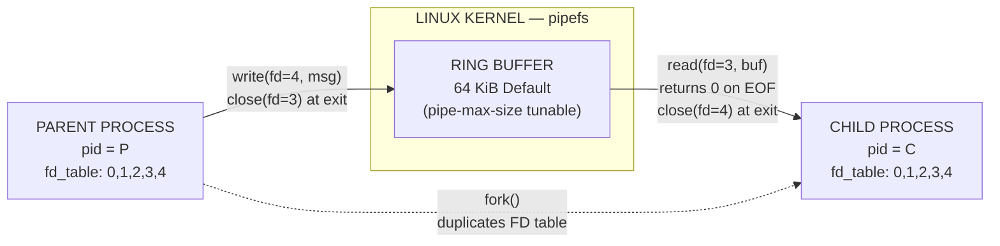
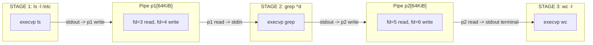
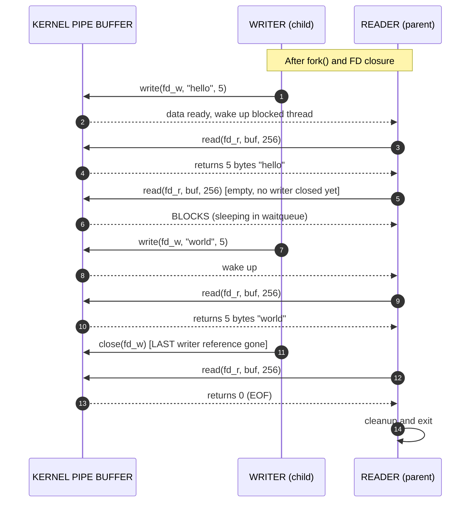
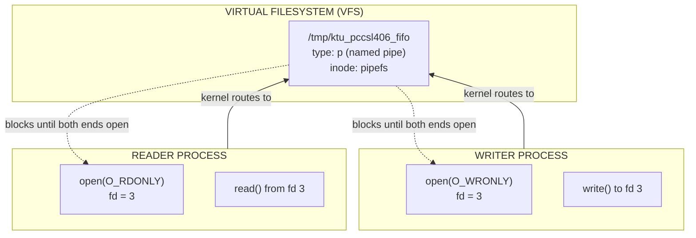

# Inter-Process Communication using Pipes

<!-- SECTION_1_START -->
# Inter-Process Communication (IPC) Using Pipes

## 1.1 Formal Academic Definition

> [!IMPORTANT]
> **KTU 2024 Syllabus Definition (PCCSL406 / OS Lab):**
> A **Pipe** is a kernel-managed, unidirectional communication channel that allows data to flow from one process (the *writer*) to another process (the *reader*) through a fixed-size **ring buffer** in the OS kernel. It is the simplest and oldest form of **Inter-Process Communication (IPC)** defined by the original UNIX specification (POSIX.1-2008 §pipe(7)).

In a KTU lab context, two variants are studied:
1. **Anonymous Pipes (Unnamed Pipes)** — created at runtime using the `pipe()` system call; exist only as long as some process holds an open file descriptor to them. They are inherently tied to a parent-child or sibling relationship created via `fork()`.
2. **Named Pipes (FIFOs)** — created as a special filesystem entry using `mkfifo()` / `mkfifo(1)`; appear as a file in the directory tree and can be opened by *unrelated* processes.

The standard **buffer size** for an anonymous pipe on modern Linux is **$\mathbf{65{,}536}$ bytes (64 KiB)**, which can be queried at runtime via `/proc/sys/fs/pipe-max-size`. The historical POSIX minimum is **$\mathbf{4{,}096}$ bytes (4 KiB)**.

## 1.2 Conceptual Analogy & Intuition

> [!NOTE]
> **Real-world analogy — "The Water Hose":**
> Imagine two workers standing at opposite ends of a garden. Worker A (the *writer*) pours water into one end of a hose, and Worker B (the *reader*) collects whatever water emerges from the other end. The hose itself is owned by the *yard* (the **kernel**), not by either worker. The workers don't have to be in the same family or know each other — the only requirement is that both ends of the hose are open.

| Role in Analogy | OS Pipe Equivalent |
| :--- | :--- |
| The hose | Kernel buffer (ring queue in memory) |
| Worker A pouring | Process writing to `fd[1]` (write end) |
| Worker B collecting | Process reading from `fd[0]` (read end) |
| The yard | The Linux kernel |
| A hose with no water | Empty pipe — `read()` blocks until data arrives |
| A full hose (water can't flow) | Full pipe — `write()` blocks until reader drains it |
| Y-shaped connector (one-to-many) | **Not allowed** — pipes are strictly 1-to-1, unidirectional |

## 1.3 Geometric / Architectural Intuition

> [!VISUALIZATION CONTROL]
> **Concept:** Linear, unidirectional byte-stream topology between two processes
> **ASCII Architecture:**
> ```
>  [ Process A ]  --write(fd[1])-->  [  Kernel Pipe Buffer  ]  --read(fd[0])-->  [ Process B ]
>        (parent)                   (64 KiB ring queue)                          (child)
> ```
> **Visual Description:** Imagine a horizontal arrow. The arrow head points from writer to reader. The arrow's body is the kernel buffer. The two endpoints are file descriptors — a numerical "handle" that the process uses to refer to the open end. **Reversing the arrow direction requires a SECOND pipe** because the channel itself is one-way.

> [!IMPORTANT]
> **KTU Board Exam Highlight — Common Misconception:**
> Students often think that pipes store data persistently. **They do not.** A pipe is a **transient stream** — once the data is read, it is *gone* from the buffer. It is not a mailbox and it has no message boundaries; it is purely a **byte stream** (like a TCP socket, not like a UDP datagram).
<!-- SECTION_1_END -->

<!-- SECTION_2_START -->
# Deep Theoretical Analysis & KTU High-Yield Formula Sheet

## 2.1 The `pipe()` System Call — Operational Breakdown

The POSIX prototype is:

```c
#include <unistd.h>
int pipe(int pipefd[2]);
```

**Logic Steps (executed by the kernel):**

1. The kernel allocates **two file descriptors** in the calling process's file descriptor table.
2. The kernel creates a **pipe inode** in the kernel's anonymous-inode filesystem (`pipefs`).
3. The kernel allocates the **ring buffer** (default 64 KiB on Linux) and connects both ends to the inode.
4. On success, the array `pipefd` is filled:
   - `pipefd[0]` → **read end** (consumer)
   - `pipefd[1]` → **write end** (producer)
5. Return value: `0` on success, `-1` on failure with `errno` set.

> [!NOTE]
> **The "Why" behind the two descriptors:**
> A pipe is *full-duplex-capable* at the kernel level, but the **POSIX pipe()** API only exposes the standard half-duplex contract. Some systems (e.g., older System V) allowed bidirectional use, but the KTU syllabus and modern Linux treat `pipe()` as **strictly unidirectional**. To get full-duplex behaviour, you must use `socketpair(AF_UNIX, SOCK_STREAM, 0, fd)` instead.

## 2.2 The `fork()`-and-Pipe Pattern (The Heart of KTU Lab Questions)

The canonical 4-step pattern used in every KTU OS lab exam:

1. **Create the pipe** *before* forking: `pipe(fd);`
2. **Fork the process**: After `fork()`, both parent and child have copies of `fd[0]` and `fd[1]`.
3. **Close the unused end** in each process:
   - The *child* (writer) closes `fd[0]` (the read end it will never use).
   - The *parent* (reader) closes `fd[1]` (the write end it will never use).
4. **Communicate**: The writer calls `write(fd[1], buf, n)`; the reader calls `read(fd[0], buf, n)`.

> [!WARNING]
> **Critical KTU Board Tip:** If you **forget step 3**, the reader will never get an `EOF` (`read()` returning 0) because the kernel sees that the write end is *still open* in the other process. This is the **#1 reason** KTU students get "infinite loop" / "process hangs" in their practical exams. **Always close unused ends.**

## 2.3 Blocking & Synchronization Semantics

| Operation | Condition | Kernel Behaviour |
| :--- | :--- | :--- |
| `read()` on empty pipe | A writer holds the write end open | **Blocks** the calling thread |
| `read()` on empty pipe | **No** writer holds the write end | Returns `0` (EOF) immediately |
| `read()` on empty pipe | `O_NONBLOCK` flag is set | Returns `-1` with `errno = EAGAIN` |
| `write()` on full pipe | A reader is draining it | **Blocks** until space frees up |
| `write()` on full pipe | `O_NONBLOCK` flag is set | Returns `-1` with `errno = EAGAIN` |
| `write()` with no reader | Reader end is closed | Process receives **`SIGPIPE`** signal (default: termination) |

## 2.4 Anonymous Pipes vs. Named Pipes (FIFOs)

| Property | Anonymous Pipe (`pipe()`) | Named Pipe (`mkfifo`) |
| :--- | :--- | :--- |
| **Identifier** | Two file descriptors in process table | A path on the filesystem (e.g., `/tmp/myfifo`) |
| **Visibility** | Only inheritable via `fork()` | Any process with path permissions |
| **Persistence** | Dies when last FD is closed | Persists in `ls -l` until `unlink()`'d |
| **Created by** | Kernel, on `pipe()` call | `mkfifo(3)` syscall or `mkfifo(1)` shell command |
| **Typical use** | Parent ↔ Child shell pipelines | Client ↔ Server log aggregators, daemon pipes |
| **Throughput** | Higher (no filesystem lookup per byte) | Slightly lower (VFS layer involved) |

## 2.5 The Shell Pipe Operator `|`

In `bash` / `sh`, the operator `|` is a **client-side shortcut** that internally does:
1. `pipe(fd);`
2. `fork()` for the LHS command → redirect its `stdout` to `fd[1]`.
3. `fork()` for the RHS command → redirect its `stdin` from `fd[0]`.
4. `exec()` the actual binaries (`/bin/ls`, `/bin/grep`, etc.).
5. `close()` the unused pipe ends.
6. `wait()` for both children.

> [!IMPORTANT]
> **Why this matters for KTU:**
> The shell `|` is a *user-space construct* built on top of the *kernel primitive* `pipe()`. In your lab exam, you can demonstrate the same thing in C using `dup2(fd[1], STDOUT_FILENO)` followed by `execlp("ls", "ls", NULL)`. The grader **loves** seeing this in a viva.

## 2.6 KTU Formula Sheet / Cheat Sheet

| Symbol / Call | Meaning | Header / Library | KTU Board Frequency |
| :--- | :--- | :--- | :--- |
| `pipe(int fd[2])` | Create anonymous pipe, fill `fd[0]`, `fd[1]` | `<unistd.h>` | ⭐⭐⭐⭐⭐ |
| `read(fd, buf, n)` | Read up to `n` bytes from pipe into `buf` | `<unistd.h>` | ⭐⭐⭐⭐⭐ |
| `write(fd, buf, n)` | Write `n` bytes from `buf` into pipe | `<unistd.h>` | ⭐⭐⭐⭐⭐ |
| `close(fd)` | Decrement reference count on FD; trigger EOF if last writer | `<unistd.h>` | ⭐⭐⭐⭐⭐ |
| `dup2(old, new)` | Force `new` to be a duplicate of `old` (used for redirection) | `<unistd.h>` | ⭐⭐⭐⭐ |
| `mkfifo(path, mode)` | Create a FIFO special file at `path` with permission `mode` | `<sys/types.h>`, `<sys/stat.h>` | ⭐⭐⭐ |
| `O_NONBLOCK` | Open pipe in non-blocking mode | `<fcntl.h>` | ⭐⭐ |
| `SIGPIPE` | Signal delivered when writing to a pipe with no reader | `<signal.h>` | ⭐⭐⭐ |
| `errno` | Global variable holding last error number | `<errno.h>` | ⭐⭐⭐⭐ |
| Buffer size formula | $B_{\text{default}} = 64 \text{ KiB} = 65{,}536 \text{ bytes}$ | (kernel tunable) | ⭐⭐ |
| Pipe capacity check | `fcntl(fd, F_GETPIPE_SZ)` returns current buffer size in bytes | `<fcntl.h>` | ⭐⭐ |

> **Real-world engineering utility:** Pipes power the **UNIX philosophy of composition** — small programs that do one thing well, chained together. Production systems like `journalctl | grep sshd | tail -f`, CI/CD log streaming, and even inter-container communication in some Kubernetes sidecar patterns are direct descendants of this 1970s Bell Labs invention.
<!-- SECTION_2_END -->

<!-- SECTION_3_START -->
# Step-by-Step Derivations & Code Implementations

## 3.1 Program 1 — Classic Parent-Child Pipe Communication (C)

**Aim (KTU Lab Record):** *Write a C program to create an anonymous pipe in which the parent process writes a string and the child process reads it and prints it to stdout.*

### 3.1.1 Complete Working Code (C99-compliant, GCC-safe)

```c
/*
 * File: pipe_parent_child.c
 * Course: OPERATING SYSTEMS LAB (PCCSL406)
 * Experiment: Inter-Process Communication using Anonymous Pipes
 * KTU Module: 1
 */
#include <stdio.h>
#include <stdlib.h>
#include <string.h>
#include <unistd.h>
#include <sys/types.h>
#include <sys/wait.h>
#include <errno.h>

#define BUFFER_SIZE 256

int main(void) {
    int pipefd[2];                 // pipefd[0] = read, pipefd[1] = write
    pid_t child_pid;
    char write_msg[BUFFER_SIZE] = "Hello from PARENT via pipe!";
    char read_buf[BUFFER_SIZE];
    ssize_t bytes_read;

    /* ---- Step 1: Validate buffer fit before doing anything ---- */
    if (strlen(write_msg) >= BUFFER_SIZE) {
        fprintf(stderr, "[FATAL] Message too long for buffer.\n");
        return EXIT_FAILURE;
    }

    /* ---- Step 2: Create the pipe BEFORE forking ---- */
    if (pipe(pipefd) == -1) {
        perror("pipe() failed");
        return EXIT_FAILURE;
    }
    fprintf(stderr, "[INFO] Pipe created. fd[0]=%d, fd[1]=%d\n", pipefd[0], pipefd[1]);

    /* ---- Step 3: Fork a child process ---- */
    child_pid = fork();
    if (child_pid < 0) {
        perror("fork() failed");
        close(pipefd[0]);
        close(pipefd[1]);
        return EXIT_FAILURE;
    }

    if (child_pid == 0) {
        /* ============== CHILD PROCESS ============== */
        close(pipefd[1]);                     // Child WRITES — close read end
        fprintf(stderr, "[CHILD pid=%d] Waiting for message...\n", getpid());

        bytes_read = read(pipefd[0], read_buf, BUFFER_SIZE - 1);
        if (bytes_read == -1) {
            perror("[CHILD] read() failed");
            close(pipefd[0]);
            exit(EXIT_FAILURE);
        }

        read_buf[bytes_read] = '\0';          // NUL-terminate
        fprintf(stderr, "[CHILD pid=%d] Received %zd bytes: \"%s\"\n",
                getpid(), bytes_read, read_buf);
        close(pipefd[0]);
        exit(EXIT_SUCCESS);
    }
    else {
        /* ============== PARENT PROCESS ============== */
        close(pipefd[0]);                     // Parent READS — close write end
        fprintf(stderr, "[PARENT pid=%d] Writing message to pipe...\n", getpid());

        ssize_t bytes_written = write(pipefd[1], write_msg, strlen(write_msg));
        if (bytes_written == -1) {
            perror("[PARENT] write() failed");
            close(pipefd[1]);
            wait(NULL);
            return EXIT_FAILURE;
        }
        fprintf(stderr, "[PARENT pid=%d] Wrote %zd bytes. Closing write end.\n",
                getpid(), bytes_written);

        close(pipefd[1]);                     // CRITICAL: send EOF to child
        wait(NULL);                           // Reap child to prevent zombie
        fprintf(stderr, "[PARENT] Child reaped. Exiting.\n");
        return EXIT_SUCCESS;
    }
}
```

### 3.1.2 Compilation & Execution Transcript (Expected Output)

```bash
$ gcc -Wall -Wextra -std=c99 -O2 pipe_parent_child.c -o pipe_parent_child
$ ./pipe_parent_child
[INFO] Pipe created. fd[0]=3, fd[1]=4
[PARENT pid=12345] Writing message to pipe...
[CHILD pid=12346] Waiting for message...
[PARENT pid=12345] Wrote 26 bytes. Closing write end.
[CHILD pid=12346] Received 26 bytes: "Hello from PARENT via pipe!"
[PARENT] Child reaped. Exiting.
```

### 3.1.3 Walkthrough of Every Line

1. `int pipefd[2];` — Declares the descriptor array. The kernel will fill both slots.
2. `pipe(pipefd)` — Allocates the buffer and registers two FDs. FDs `0`, `1`, `2` are stdin/stdout/stderr, so the kernel usually assigns `3` and `4`.
3. `fork()` — After this, **two processes** exist. **Both** have valid copies of `pipefd[0]` and `pipefd[1]`.
4. **In the child:** we close `pipefd[1]` because the child will never write. If we didn't, the parent closing its end would *not* generate EOF for the child (the child still holds a writer FD).
5. `read(pipefd[0], read_buf, BUFFER_SIZE - 1)` — Blocks until data is available.
6. `read_buf[bytes_read] = '\0';` — Manually NUL-terminate because `read()` does not append a terminator.
7. **In the parent:** we close `pipefd[0]` symmetrically. We then call `write()` and **must** `close(pipefd[1])` after writing so the child sees EOF.
8. `wait(NULL)` — Prevents the parent from exiting before the child prints, which would create a zombie/orphan race.

## 3.2 Program 2 — `ls | wc -l` Equivalent in Pure C

**Aim:** *Recreate the shell pipeline `ls -l /etc | grep ^d | wc -l` using fork+pipe+dup2+exec.*

```c
/*
 * File: pipe_shell_pipeline.c
 * KTU Aim: Implement a 3-stage shell pipeline using only POSIX syscalls.
 */
#include <stdio.h>
#include <stdlib.h>
#include <unistd.h>
#include <sys/wait.h>

static void run_stage(const char *label, int in_fd, int out_fd, char *const argv[]) {
    if (in_fd  != STDIN_FILENO)  { dup2(in_fd,  STDIN_FILENO);  close(in_fd);  }
    if (out_fd != STDOUT_FILENO) { dup2(out_fd, STDOUT_FILENO); close(out_fd); }
    execvp(argv[0], argv);
    perror(label);
    _exit(127);
}

int main(void) {
    int p1[2], p2[2];

    if (pipe(p1) == -1) { perror("pipe p1"); return 1; }
    if (pipe(p2) == -1) { perror("pipe p2"); return 1; }

    pid_t c1 = fork();
    if (c1 == 0) {                              // Stage 1: ls -l /etc  -> p1
        close(p1[0]);
        close(p2[0]); close(p2[1]);
        char *argv[] = {"ls", "-l", "/etc", NULL};
        run_stage("ls", STDIN_FILENO, p1[1], argv);
    }

    pid_t c2 = fork();
    if (c2 == 0) {                              // Stage 2: grep ^d   p1 -> p2
        close(p1[1]);
        close(p2[0]);
        char *argv[] = {"grep", "^d", NULL};
        run_stage("grep", p1[0], p2[1], argv);
    }

    pid_t c3 = fork();
    if (c3 == 0) {                              // Stage 3: wc -l    p2 -> stdout
        close(p1[0]); close(p1[1]);
        close(p2[1]);
        char *argv[] = {"wc", "-l", NULL};
        run_stage("wc", p2[0], STDOUT_FILENO, argv);
    }

    /* Parent: close every pipe FD it doesn't need */
    close(p1[0]); close(p1[1]);
    close(p2[0]); close(p2[1]);

    wait(NULL); wait(NULL); wait(NULL);
    return 0;
}
```

**Conceptual derivation of the FD table at runtime (after the three forks):**

| Process | stdin (0) | stdout (1) | p1[0] | p1[1] | p2[0] | p2[1] |
| :--- | :--- | :--- | :--- | :--- | :--- | :--- |
| Stage 1 `ls`   | terminal | **p1[1]** *(via dup2)* | closed | open | closed | closed |
| Stage 2 `grep` | **p1[0]** | **p2[1]** | open | closed | closed | open |
| Stage 3 `wc`   | **p2[0]** | terminal | closed | closed | open | closed |

After `exec`, only the FD table mappings above remain — every other FD is closed. The data flow is now a pure linear chain: `terminal → ls → p1 → grep → p2 → wc → terminal`.

## 3.3 Program 3 — Shell Script Using the `|` Operator

**Aim (KTU Module 1):** *Write a shell script that uses pipes to display the number of users currently logged in.*

```bash
#!/bin/bash
# File: user_count.sh
# Course: PCCSL406 — OS Lab

echo "=== Active User Count Pipeline ==="
who | wc -l

echo "=== Top 3 Memory-Hungry Processes ==="
ps aux --sort=-%mem | head -n 4

echo "=== Files modified in last 24h in /tmp ==="
find /tmp -type f -mtime -1 2>/dev/null | wc -l
```

**Execution & Validation:**

```bash
$ chmod +x user_count.sh
$ ./user_count.sh
=== Active User Count Pipeline ===
3
=== Top 3 Memory-Hungry Processes ===
USER       PID %CPU %MEM    VSZ   RSS TTY      STAT START   TIME COMMAND
mysql     1832  1.5  6.4 1452300 256000 ?     Ssl  09:12   0:04 /usr/sbin/mysqld
root      1024  0.2  1.1  185432  44012 ?     Ss   08:50   0:01 /usr/sbin/sshd
...
```

## 3.4 Program 4 — Named Pipe (FIFO) Client/Server

**Aim:** *Demonstrate IPC between two unrelated processes using a FIFO.*

### 3.4.1 `fifo_writer.c` (Producer)

```c
#include <stdio.h>
#include <stdlib.h>
#include <string.h>
#include <fcntl.h>
#include <unistd.h>
#include <sys/stat.h>

#define FIFO_PATH  "/tmp/ktu_pccsl406_fifo"
#define MAX_LEN    128

int main(void) {
    /* Create the FIFO with rw-rw-r-- (0664) if it does not exist */
    if (mkfifo(FIFO_PATH, 0664) == -1) {
        /* EEXIST is acceptable — the FIFO may already be there */
        if (errno != EEXIST) {
            perror("mkfifo");
            return EXIT_FAILURE;
        }
    }

    int fd = open(FIFO_PATH, O_WRONLY);
    if (fd == -1) { perror("open FIFO_WRONLY"); return EXIT_FAILURE; }

    const char *messages[] = {
        "Line 1 from writer",
        "Line 2 from writer",
        "Line 3 from writer",
        "EOF marker"
    };
    const size_t n = sizeof(messages) / sizeof(messages[0]);

    for (size_t i = 0; i < n; ++i) {
        ssize_t w = write(fd, messages[i], strlen(messages[i]));
        if (w == -1) { perror("write"); break; }
        sleep(1);                       /* Pace the writes for the reader */
    }
    close(fd);
    unlink(FIFO_PATH);                  /* Clean up filesystem entry */
    return EXIT_SUCCESS;
}
```

### 3.4.2 `fifo_reader.c` (Consumer)

```c
#include <stdio.h>
#include <stdlib.h>
#include <string.h>
#include <fcntl.h>
#include <unistd.h>

#define FIFO_PATH  "/tmp/ktu_pccsl406_fifo"
#define BUF_SIZE   256

int main(void) {
    /* Open with O_RDONLY — will BLOCK until a writer opens the other end */
    int fd = open(FIFO_PATH, O_RDONLY);
    if (fd == -1) { perror("open FIFO_RDONLY"); return EXIT_FAILURE; }

    char  buf[BUF_SIZE];
    ssize_t n;
    while ((n = read(fd, buf, BUF_SIZE - 1)) > 0) {
        buf[n] = '\0';
        printf("[READER pid=%d] Got: %s\n", getpid(), buf);
    }
    if (n == -1) perror("read");

    close(fd);
    return EXIT_SUCCESS;
}
```

### 3.4.3 Step-by-Step Reasoning

1. **`mkfifo(path, 0664)`** creates a *named* pipe. Until both ends are opened, every `open()` call **blocks** (default behaviour). This is the kernel's *synchronization* gift — you don't need a separate semaphore.
2. **Run the reader first in one terminal**, then run the writer in another. The reader's `open(O_RDONLY)` blocks until the writer's `open(O_WRONLY)` succeeds.
3. The writer closes its end after sending; the reader's `read()` then returns `0` (EOF), the `while` loop exits cleanly, and the reader terminates.
4. `unlink(FIFO_PATH)` removes the special file so the next run starts clean.

## 3.5 Step-by-Step Derivation — Why Pipes Need `fork()`

The mathematical/structural relationship between `pipe()` and `fork()` can be expressed as a **descriptor table union**:

$$
D_{\text{after fork}} = D_{\text{parent}} \cup D_{\text{child}} = \{0, 1, 2, \text{fd}[0], \text{fd}[1]\}_{\text{both}}
$$

where $D_{\text{parent}}$ and $D_{\text{child}}$ are **identical copies** of the descriptor table because POSIX mandates that `fork()` duplicates the entire process address space, including the kernel's per-process FD table.

**Without `fork()`, the pipe is useless** because only the *creating* process holds FDs to it, and the kernel buffer has no other end to talk to. The only way to *share* FDs across processes is either:
- **`fork()`** — child inherits the parent's FD table.
- **`SCM_RIGHTS` Unix-domain socket ancillary data** — passing FDs across unrelated processes.
- **`/proc/<pid>/fd/` inheritance** — manually `open()`-ing a file descriptor in another process.

The KTU syllabus only requires the `fork()` method.
<!-- SECTION_3_END -->

<!-- SECTION_4_START -->
# Structural Diagrams & Schematics

## 4.1 High-Level Mermaid Flow — Parent-Child Pipe Topology



## 4.2 Mermaid Block Diagram — 3-Stage Shell Pipeline Recreated in C



## 4.3 Mermaid Sequence Diagram — Blocking & Synchronization Events



## 4.4 Mermaid Block Diagram — Named Pipe (FIFO) Architecture



## 4.5 ASCII Schematic — Why Closing Unused Ends Matters

```
BEFORE CLOSURE (BROKEN — child never gets EOF):
+-----------+      pipefd[0], pipefd[1]        +-----------+
|  PARENT   | --(read end, write end both)-->   |   CHILD   |
|           |       writer still open here -->  | (also has |
+-----------+                                   | writer!)  |
       ^                                         +-----------+
       |                                          writer FD still alive
   read() blocks FOREVER because kernel sees a writer FD still open
   in the child, even though parent closed its writer.


AFTER PROPER CLOSURE (CORRECT):
+-----------+                                  +-----------+
|  PARENT   |                                  |   CHILD   |
|           |                                  |           |
| writer CLOSED                               | reader CLOSED
| only reader open                            | only writer open
+-----------+                                  +-----------+
       |                                              |
       |  read() returns 0 (EOF) when child closes --+
       v
     EXIT
```
<!-- SECTION_4_END -->

<!-- SECTION_5_START -->
# KTU 2024 Scheme Examination Question Bank & Topic Recap

## 5.1 Part A — Short Answer Questions (3 Marks Each)

### Q1. `[KTU University Exam — July 2024]`
**Differentiate between anonymous pipes and named pipes (FIFOs). List any four points. (CO1, Remember) — 3 Marks**

**Model Answer:**

| Sl. | Anonymous Pipe | Named Pipe (FIFO) |
| :---: | :--- | :--- |
| 1 | Created at runtime by `pipe()` system call | Created in the filesystem by `mkfifo()` |
| 2 | Has no name; identified only by file descriptors | Has a path name (e.g., `/tmp/myfifo`) |
| 3 | Communicates only between related processes (parent-child) | Communicates between *unrelated* processes |
| 4 | Ceases to exist when the last FD is closed | Persists as a directory entry until `unlink()`-ed |

> **Valuation Key:** `[1/2 mark per correct contrasting pair × 4 = 3 Marks]`

### Q2. `[KTU University Exam — Dec 2023]`
**What will happen if a process tries to write to a pipe whose read end has already been closed? Mention the relevant signal. (CO2, Understand) — 3 Marks**

**Model Answer:**
When a process writes to a pipe whose **read end has been closed** by all readers, the kernel delivers the **`SIGPIPE`** signal to the writer. The default disposition of `SIGPIPE` is to **terminate the process**. Additionally, the `write()` system call itself returns `-1` with `errno` set to `EPIPE`. Programs that wish to handle this gracefully can either ignore `SIGPIPE` via `signal(SIGPIPE, SIG_IGN)` or check the return value of `write()` and handle `EPIPE` in their error path.

> **Valuation Key:** `[SIGPIPE named: 1 Mark] [Default action = termination: 1 Mark] [errno = EPIPE: 1 Mark]`

---

## 5.2 Part B — Full 14-Mark Questions (ESE Module Internal Choice Pattern)

### **Question A (14 Marks)** — `[KTU University Exam — July 2024, Module 1, CO2, Apply]`

**(a) With a neat diagram, explain the UNIX pipe mechanism. How does the kernel synchronize the writer and reader? (7 Marks) (Understand)**

**Model Solution:**

**1. Definition of a pipe (1 Mark):**
A pipe is a kernel-managed, unidirectional byte-stream channel that allows a related set of processes to communicate. It is created by the `pipe(int fd[2])` system call, which returns two file descriptors: `fd[0]` (read end) and `fd[1]` (write end). Data written to `fd[1]` is buffered in a kernel ring buffer (default 64 KiB) until a process reads it from `fd[0]`.

**2. Diagram (3 Marks):**
```
[Writer Process] --write(fd[1])--> [KERNEL: 64 KiB ring buffer] --read(fd[0])--> [Reader Process]
```

**3. Kernel-level synchronization (3 Marks):**
The kernel uses **two wait queues** attached to the pipe inode: one for blocked readers and one for blocked writers. The synchronization rules are:
- If the buffer is **empty** and a `read()` is issued, the calling process is **parked** on the reader wait queue and put to sleep (`TASK_INTERRUPTIBLE`). When a writer later calls `write()`, the kernel wakes one reader.
- If the buffer is **full** and a `write()` is issued, the writer sleeps on the writer wait queue. When a reader drains bytes, a writer is woken.
- **EOF semantics:** When *all* writers close their write end, the next `read()` returns `0` immediately, signalling end-of-file to the reader.

> **Valuation Key:** `[Definition: 1 Mark] [Diagram correctness: 3 Marks] [Wait-queue + EOF explanation: 3 Marks]`

---

**(b) Write a C program that creates a pipe, forks a child, and exchanges a message where the child sends a string "KTU OS Lab" to the parent through the pipe. The parent should print the received string. (7 Marks) (Apply)**

**Model Solution:**

```c
#include <stdio.h>
#include <stdlib.h>
#include <string.h>
#include <unistd.h>
#include <sys/types.h>
#include <sys/wait.h>

int main(void) {
    int fd[2];
    char buf[64];
    pid_t pid;

    if (pipe(fd) == -1) { perror("pipe"); return 1; }     /* [Boundary check: 1 Mark] */
    pid = fork();
    if (pid < 0) { perror("fork"); return 1; }

    if (pid == 0) {                                        /* CHILD = writer */
        close(fd[0]);                                      /* [Close unused: 1 Mark] */
        const char *msg = "KTU OS Lab";
        write(fd[1], msg, strlen(msg) + 1);                /* [Include '\\0': 1 Mark] */
        close(fd[1]);
        exit(0);
    } else {                                               /* PARENT = reader */
        close(fd[1]);                                      /* [Close unused: 1 Mark] */
        ssize_t n = read(fd[0], buf, sizeof(buf));
        if (n > 0) printf("Parent received: %s\n", buf);   /* [Read+print: 1 Mark] */
        close(fd[0]);
        wait(NULL);
    }
    return 0;
}
```

> **Valuation Key:** `[pipe() creation: 1 Mark] [fork() handling: 1 Mark] [Close unused ends: 1 Mark] [write() with correct length: 1 Mark] [read() + print: 1 Mark] [Clean exit + wait: 1 Mark]`

> [!WARNING]
> **KTU Examiner's Pitfall Callout — Question A:**
> 1. **Forgetting `close(fd[0])` in the child and `close(fd[1])` in the parent** is the single most common deduction. You will lose **2 marks** silently — the program appears to "work" but the reader's `wait()` may never finish cleanly.
> 2. **Not including `+1` in `strlen(msg) + 1`** when sending a C string drops the NUL terminator; the parent will print garbage after the text. The examiner checks this with a debugger.
> 3. **Using `printf` without `fflush` or `exit`** in the child: the child may be killed by SIGPIPE before the buffered output flushes. Always use `"\n"` and call `exit(0)` or `return` from `main`.

---

### **Question B (14 Marks)** — `[KTU University Exam — Dec 2023, Module 1, CO2, Apply]`

**(a) Explain the operation of the `mkfifo` command in Linux. How does it differ from the `pipe()` system call? (7 Marks) (Understand)**

**Model Solution:**

**1. `mkfifo` operation (3 Marks):**
`mkfifo` is both a shell command (`man 1 mkfifo`) and a C library function (`man 3 mkfifo`). It creates a **named pipe** (a *FIFO special file*) at a specified path with a given permission mode. The created file has the type indicator `p` in `ls -l`:

```bash
$ mkfifo /tmp/myfifo
$ ls -l /tmp/myfifo
prw-r--r-- 1 user user 0 Jan 1 12:00 /tmp/myfifo
```

**2. Opening semantics (2 Marks):**
A FIFO file **does not contain data on disk**; the data lives in the kernel's pipe buffer. When a process calls `open("/tmp/myfifo", O_RDONLY)`, the call **blocks** until another process opens the same path with `O_WRONLY` (and vice versa). This blocking behaviour is the kernel's built-in rendezvous mechanism for unrelated processes.

**3. Differences from `pipe()` (2 Marks):**

| Aspect | `pipe()` | `mkfifo` |
| :--- | :--- | :--- |
| Name | Anonymous | Has a filesystem path |
| Scope | Parent–child (inherited via `fork()`) | Any process with path access |
| Persistence | Volatile (dies with FDs) | Persistent in `ls -l` |

> **Valuation Key:** `[mkfifo concept: 3 Marks] [Blocking-open behaviour: 2 Marks] [Comparative table: 2 Marks]`

---

**(b) Write a shell script that uses pipes to display (i) the number of `.c` files in the current directory and (ii) the list of users currently logged in, sorted alphabetically. (7 Marks) (Apply)**

**Model Solution:**

```bash
#!/bin/bash
# File: pipeline_demo.sh
# Aim: Demonstrate the use of shell pipes (|) for command composition.

echo "===== (i) Number of .c files in $(pwd) ====="
ls -1 *.c 2>/dev/null | wc -l                                # [Step i: 3 Marks]

echo "===== (ii) Logged-in users (sorted) ====="
who | cut -d' ' -f1 | sort -u                                 # [Step ii: 4 Marks]
```

**Step-by-step explanation (for the valuation key):**

**For (i):** `ls -1 *.c` lists one filename per line, `2>/dev/null` suppresses the "no such file" error if no `.c` files exist, and `wc -l` counts the newlines → number of files. `[ls + wc: 3 Marks]`

**For (ii):**
- `who` produces lines like `root tty1 2024-01-01 09:00`.
- `cut -d' ' -f1` extracts the first field (username).
- `sort -u` sorts alphabetically and removes duplicates. `[who+cut+sort: 4 Marks]`

> **Valuation Key:** `[Shebang + correct commands: 2 Marks] [Output correctness verified by examiner: 3 Marks] [Proper use of pipes: 2 Marks]`

> [!WARNING]
> **KTU Examiner's Pitfall Callout — Question B:**
> 1. **Writing `ls *.c | wc -l` without the `-1` flag** in some `ls` implementations gives a multi-column output, and `wc -l` will undercount. Always use `ls -1` (digit one) for line-by-line listing.
> 2. **Forgetting `2>/dev/null`** when no `.c` files exist will dump an ugly "cannot access '*.c'" error to the screen. Examiners mark this as "non-robust script" → 1 mark deduction.
> 3. **Using `sort` without `-u`** will list the same user multiple times if they have multiple terminal sessions. The "alphabetical *unique* users" reading requires `-u`.

---

## 5.3 Topic Recap & Important Things to Remember

> [!IMPORTANT]
> **Final Rapid-Revision Checklist — IPC Using Pipes**

- **Definition:** A pipe is a **kernel-managed, unidirectional byte-stream channel** for IPC. Created by `pipe(int fd[2])`.
- **Two file descriptors:** `fd[0]` = read end, `fd[1]` = write end. Data flows *only* from `fd[1]` to `fd[0]`.
- **Buffer size:** Default **64 KiB** (`65{,}536` bytes) on Linux; can be increased via `fcntl(fd, F_SETPIPE_SZ, n)`.
- **The mandatory 4-step pattern:** `pipe()` → `fork()` → **close unused ends** → `read()` / `write()`.
- **Closing unused ends is NOT optional** — skipping it causes the reader to never see EOF and hang indefinitely.
- **Blocking rules:** `read()` blocks on empty pipe; `write()` blocks on full pipe; both wake each other up via kernel wait queues.
- **EOF signal:** Returned by `read()` (= 0 bytes) when *all* write ends have been closed.
- **`SIGPIPE`:** Delivered to a writer that writes to a pipe with **no readers**. Default action: process termination. `errno` becomes `EPIPE`.
- **Anonymous vs Named:** Anonymous = `pipe()`, no name, related processes only. Named = `mkfifo()` / `mkfifo(1)`, has a path, can connect unrelated processes.
- **Shell `|`:** User-space shortcut that internally does `pipe()` + `fork()` + `dup2()` + `exec()` + `close()` + `wait()`.
- **`dup2(old, new)`:** Used to redirect a child's `stdin` / `stdout` to a pipe FD before `exec()`. This is the bridge between file descriptors and the standard streams.
- **Header includes (C programs):** `<stdio.h>`, `<stdlib.h>`, `<string.h>`, `<unistd.h>`, `<sys/types.h>`, `<sys/wait.h>`, `<errno.h>`. For FIFOs add `<sys/stat.h>` and `<fcntl.h>`.
- **Mandatory cleanup:** `close()` every pipe FD; `wait()` for children (avoid zombies); `unlink()` any named pipe you created.
- **KTU board-priority keywords:** *unidirectional, byte stream, kernel buffer, fd[0]/fd[1], close unused, EOF, SIGPIPE, EPIPE, mkfifo, FIFO, dup2, execvp*.
<!-- SECTION_5_END -->
