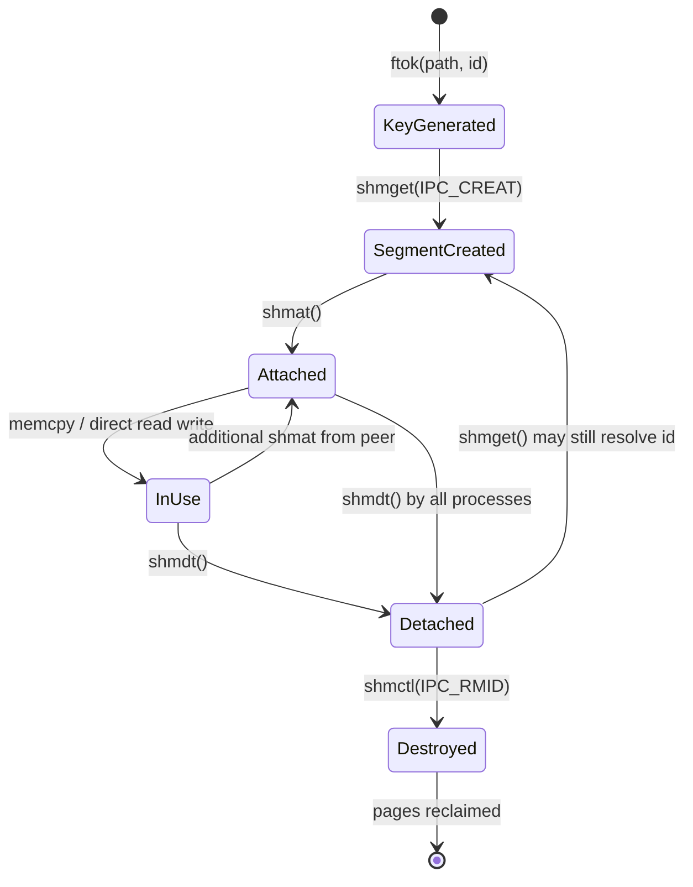
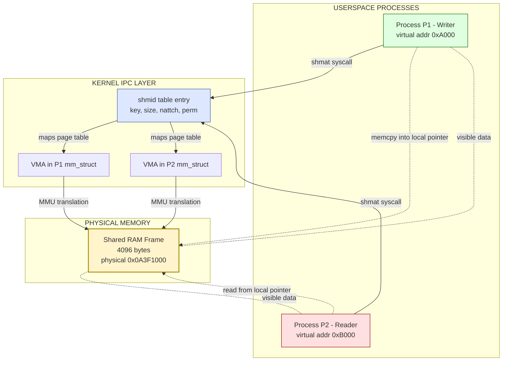
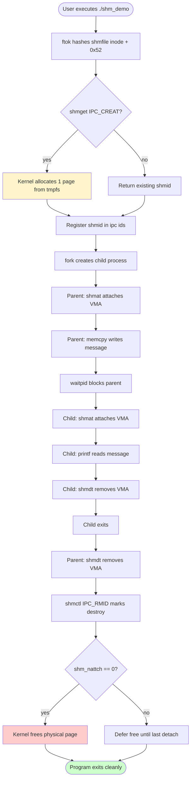

# Inter-Process Communication using Shared Memory

<!-- SECTION_1_START -->

# Inter-Process Communication using Shared Memory

## 1.1 Formal KTU 2024 Definition

> [!IMPORTANT]
> **Shared Memory** is a high-performance Inter-Process Communication (IPC) mechanism in which two or more processes map a common region of physical memory into their own virtual address spaces, allowing them to exchange data by simply reading and writing to that shared segment without involving the kernel during the data transfer itself.

In the context of the **POSIX / System V IPC** framework taught under **PCCSL406 – Operating Systems Lab**, shared memory is realized through a set of kernel-managed primitives that **create**, **attach**, **detach**, and **destroy** a shared memory segment. The System V API uses four primary system calls: `shmget()`, `shmat()`, `shmdt()`, and `shmctl()`. The POSIX API uses `shm_open()`, `mmap()`, and `munmap()`.

> [!NOTE]
> **Key Syllabus Highlight (KTU 2024 Scheme):** Under Module 1, students are expected to *write, compile, and execute* a C program demonstrating communication between an *unrelated* parent and child process (created using `fork()`) through a shared memory segment, and verify message exchange using standard I/O.

## 1.2 Conceptual Analogy — The Whiteboard in a Shared Office

Imagine two engineers, **Process A** and **Process B**, working in the same open-plan office but at separate desks. Each has their own private notebook (their *virtual address space*) which only they can read. Now, suppose the office manager installs a **large whiteboard on the central wall**.

- **Creating the whiteboard** = the kernel reserves a chunk of physical RAM (`shmget`).
- **Hanging a marker at each desk pointing to that whiteboard** = the kernel maps the same physical address into both processes' virtual address spaces (`shmat`).
- **Writing/drawing on the whiteboard** = one process writes to a variable; the change is *instantly* visible to the other because both are looking at the same bytes of RAM.
- **Removing the marker** = detaching the segment (`shmdt`).
- **Erasing the whiteboard permanently** = destroying the segment (`shmctl` with `IPC_RMID`).

Unlike a *letter passed through a postman* (which represents pipes/message queues and requires a kernel copy), the whiteboard is **directly accessible** — this is why shared memory is the **fastest IPC mechanism** in UNIX-like systems.

## 1.3 Physical Constants and Standard Metrics

| Metric | Standard Value | Description |
|---|---|---|
| **Page Size (x86/x86_64 Linux)** | **4096 bytes (4 KiB)** | Granularity at which the MMU maps shared memory. |
| **Maximum Segment Size (Linux)** | **~16 EiB** (limited by `SHMMAX`) | Practical limit configurable via `/proc/sys/kernel/shmmax`. |
| **Default Permission Mode** | **0666** (octal) | Read/write for owner, group, others. |
| **IPC Key Constant** | **IPC_PRIVATE** = `0` | Used when a parent wishes to share only with its own child. |
| **Shared Memory Path (`/dev/shm`)** | **Linux tmpfs** | Default mount point for POSIX shared memory. |

> [!VISUALIZATION CONTROL]
> **Concept:** Virtual-to-Physical Address Mapping for Two Processes Sharing Memory
> **Input Equations (Desmos-style description):**
> * Process A virtual range: `[0x1000 — 0x2000]`
> * Process B virtual range: `[0x4000 — 0x5000]`
> * Both map to the **same** physical frame: `0x0A3F1000`
> **Visual Description:** Plot two horizontal bars (Process A and Process B address spaces) at different Y-heights. Draw dotted lines from their respective virtual segments converging onto a single solid bar in the middle labelled "Physical RAM — Shared Frame".

---

<!-- SECTION_1_END -->

<!-- SECTION_2_START -->

# 2. Deep Theoretical Analysis & KTU High-Yield Formula Sheet

## 2.1 The Two IPC Standards Taught at KTU

The Linux kernel supports two parallel families of shared memory APIs. The KTU 2024 lab syllabus most commonly tests the **System V** variant because it is portable to non-Linux UNIX systems (AIX, Solaris, HP-UX) that students may encounter in campus placements.

### 2.1.1 System V Shared Memory — The Classic Quad

The flow is always: **Create → Attach → Use → Detach → Destroy**.

| Step | System Call | Header | Purpose |
|---|---|---|---|
| 1 | `key_t ftok(const char *path, int id)` | `<sys/ipc.h>` | Generates a unique IPC key from a file path + project ID. |
| 2 | `int shmget(key_t key, size_t size, int shmflg)` | `<sys/shm.h>` | Allocates / returns id for a shared segment. |
| 3 | `void *shmat(int shmid, const void *shmaddr, int shmflg)` | `<sys/shm.h>` | Attaches segment to the calling process. |
| 4 | `void *shmdt(const void *shmaddr)` | `<sys/shm.h>` | Detaches segment from the calling process. |
| 5 | `int shmctl(int shmid, int cmd, struct shmid_ds *buf)` | `<sys/shm.h>` | Performs control operations (`IPC_RMID`, `IPC_STAT`, `IPC_SET`). |

### 2.1.2 POSIX Shared Memory — The Modern Trio

| Step | Function | Header | Purpose |
|---|---|---|---|
| 1 | `int shm_open(const char *name, int oflag, mode_t mode)` | `<sys/mman.h>` | Opens/creates a POSIX shared memory object. |
| 2 | `void *mmap(void *addr, size_t length, int prot, int flags, int fd, off_t offset)` | `<sys/mman.h>` | Maps the object into virtual memory. |
| 3 | `int munmap(void *addr, size_t length)` | `<sys/mman.h>` | Unmaps the object. |
| 4 | `int shm_unlink(const char *name)` | `<sys/mman.h>` | Removes the object name from the system. |

## 2.2 The Core "Why" — Why Is Shared Memory Fastest?

> [!IMPORTANT]
> **The Performance "Why":** Pipes, FIFOs, message queues, and sockets all require the kernel to perform a **double copy** — once from the sender's userspace buffer into kernel space, and once from kernel space into the receiver's userspace buffer. Shared memory performs **zero kernel involvement** during the read/write phase. The data is already in physical RAM accessible to both processes. This results in latency reductions of **orders of magnitude** for large payloads.

## 2.3 The "How" — Mechanism Breakdown

1. **Key Generation:** `ftok()` converts a real file path (e.g., `"shmfile"`) and a project id (e.g., `'R'`) into a 32-bit `key_t`. This key is a *contract* that all cooperating processes must agree on.
2. **Segment Creation:** `shmget()` consults the kernel's internal IPC table. If the segment does not exist, it is created with the requested `size` (rounded up to a multiple of **PAGE_SIZE = 4096 bytes**). If it already exists, `shmget()` simply returns its ID — provided the requested `size` is $\le$ the existing size and permissions allow it.
3. **Attaching:** `shmat()` performs the magic. It invokes `do_shmat()` inside the kernel, which calls `mmap_region()` to insert a new **VMA (Virtual Memory Area)** into the process's `mm_struct`. From this point, dereferencing the returned pointer is identical to dereferencing any normal `malloc`'d pointer — except the backing physical page is shared.
4. **Communication:** Both processes read/write the segment just like normal memory. **No `read()`/`write()` syscalls are needed.**
5. **Synchronization (the hidden requirement):** Because both processes can write concurrently, the OS provides **no atomic guarantees**. KTU examiners frequently test the realization that **semaphores** or **mutexes** must accompany shared memory to prevent **race conditions**.
6. **Detaching:** `shmdt()` removes the VMA. The segment is *not* destroyed yet — it persists in kernel space until explicitly removed.
7. **Destruction:** `shmctl(shmid, IPC_RMID, NULL)` marks the segment for removal. The kernel frees the physical pages only after the **last attached process** detaches.

## 2.4 KTU High-Yield Formula Sheet — Shared Memory Parameters

| Parameter / Formula | Expression | Meaning / Unit |
|---|---|---|
| Total segment size in pages | $\left\lceil \dfrac{\text{size\_bytes}}{4096} \right\rceil \cdot 4096$ | Always a multiple of **4 KiB** on x86 Linux |
| Address returned by `shmat` | $p = \text{shmat}(\text{shmid}, \text{NULL}, 0)$ | Default = kernel-chosen attach address |
| Effective throughput upper bound | $\text{BW} \approx \dfrac{\text{mem\_bw}}{\text{number of contending CPUs}}$ | Practical bus/DRAM bandwidth limit |
| Latency of a single read | $t_{\text{read}} \approx t_{\text{cache\_hit}} \approx 1\text{–}4\ \text{ns}$ (L1) | Vs. $\sim 1\ \mu s$ for pipe `read()` |
| Number of attached processes | $n_{\text{attach}} = \text{shm\_nattch}$ field in `struct shmid_ds` | Inspect via `shmctl(IPC_STAT)` |
| IPC Key formula (System V) | $\text{key} = \text{ftok}(\text{path}, \text{proj\_id})$ | Lower 8 bits = `proj_id`, rest = inode of path |

> [!NOTE]
> **Engineering Utility:** Shared memory is the backbone of **real-time trading platforms** (LMAX, CME exchanges), **database engines** (PostgreSQL's `shared_buffers`, Oracle SGA), **OS-level GUI rendering** (X Window System MIT-SHM extension), and **scientific HPC** (MPI implementations fall back to `shm` for intra-node message passing). Every modern **multithreaded** program is essentially a private case of shared memory among threads within one process.

## 2.5 Race Conditions — The Synchronization Caveat

Because both processes have *unrestricted, simultaneous write* access to the segment, a sequence such as `counter = counter + 1` is **not atomic** and may produce lost updates. The standard KTU remedy is to combine the shared memory segment with a **POSIX semaphore** (`sem_init`, `sem_wait`, `sem_post`) or a **System V semaphore** (`semget`, `semop`).

> [!WARNING]
> A common examiner deduction: students often write a shared memory program that compiles and "appears" to work for a single run but corrupts data under repeated runs. Always justify your synchronization strategy in the viva.

---

<!-- SECTION_2_END -->

<!-- SECTION_3_START -->

# 3. Step-by-Step Code Implementation

This section contains the **complete, line-by-line executable source code** for the canonical KTU 2024 lab experiment: *Write a C program that creates a shared memory segment, attaches a writer process that writes a string into it, and a reader process that reads and prints it.*

> [!NOTE]
> The KTU record requires you to compile using `gcc -o output source.c -lrt` (POSIX variant) or `gcc -o output source.c` (System V variant, no extra library needed). Always include the `-lrt` flag when using POSIX functions.

## 3.1 Program 1 — System V Shared Memory (Single File, Parent + Child)

This program uses `fork()` to spawn a child process. The parent writes a message into the shared memory; the child reads and prints it. The shared memory key is generated using `ftok()`.

```c
/*-------------------------------------------------------------
 * File        : shm_systemv_demo.c
 * Description : KTU OS Lab - System V Shared Memory IPC
 *                Parent (writer) <-> Child (reader)
 * Compile     : gcc shm_systemv_demo.c -o shm_demo
 * Run         : ./shm_demo
 *-------------------------------------------------------------*/
#include <stdio.h>
#include <stdlib.h>
#include <string.h>
#include <sys/ipc.h>
#include <sys/shm.h>
#include <sys/types.h>
#include <unistd.h>
#include <errno.h>

#define SHM_SIZE 1024        /* Requested segment size in bytes           */
#define SHM_PERM 0666        /* Read-write for owner, group, others       */
#define PROJ_ID   'R'        /* Project identifier for ftok()             */
#define SHM_PATH  "shmfile"  /* A real file must exist for ftok()         */

int main(void) {
    /* ---- Step 1: Create the backing file for ftok() ---- */
    FILE *fp = fopen(SHM_PATH, "w");
    if (fp == NULL) {
        perror("fopen");
        return EXIT_FAILURE;
    }
    fclose(fp);

    /* ---- Step 2: Generate a unique IPC key ---- */
    key_t key = ftok(SHM_PATH, PROJ_ID);
    if (key == -1) {
        perror("ftok");
        return EXIT_FAILURE;
    }
    printf("[MAIN] Generated IPC key = %d\n", key);

    /* ---- Step 3: Create the shared memory segment ---- */
    int shmid = shmget(key, SHM_SIZE, IPC_CREAT | SHM_PERM);
    if (shmid == -1) {
        perror("shmget");
        return EXIT_FAILURE;
    }
    printf("[MAIN] Shared memory segment created, shmid = %d\n", shmid);

    /* ---- Step 4: Fork a child process ---- */
    pid_t pid = fork();
    if (pid < 0) {
        perror("fork");
        return EXIT_FAILURE;
    }

    if (pid == 0) {
        /* ============================================ */
        /*   CHILD PROCESS  ->  READER ROLE             */
        /* ============================================ */
        sleep(1);   /* Ensure parent has written first */

        void *shared_mem = shmat(shmid, NULL, 0);
        if (shared_mem == (void *)-1) {
            perror("shmat (child)");
            exit(EXIT_FAILURE);
        }
        printf("[CHILD] Attached shared memory at %p\n", shared_mem);

        char *data = (char *)shared_mem;
        printf("[CHILD] Message read from shared memory: \"%s\"\n", data);

        if (shmdt(shared_mem) == -1) {
            perror("shmdt (child)");
            exit(EXIT_FAILURE);
        }
        printf("[CHILD] Detached shared memory.\n");
        exit(EXIT_SUCCESS);
    } else {
        /* ============================================ */
        /*   PARENT PROCESS  ->  WRITER ROLE            */
        /* ============================================ */
        void *shared_mem = shmat(shmid, NULL, 0);
        if (shared_mem == (void *)-1) {
            perror("shmat (parent)");
            return EXIT_FAILURE;
        }
        printf("[PARENT] Attached shared memory at %p\n", shared_mem);

        const char *message = "Hello from PARENT via shared memory!";
        memcpy(shared_mem, message, strlen(message) + 1);
        printf("[PARENT] Wrote message into shared memory.\n");

        waitpid(pid, NULL, 0);   /* Reap child */

        if (shmdt(shared_mem) == -1) {
            perror("shmdt (parent)");
            return EXIT_FAILURE;
        }

        if (shmctl(shmid, IPC_RMID, NULL) == -1) {
            perror("shmctl IPC_RMID");
            return EXIT_FAILURE;
        }
        printf("[PARENT] Shared memory segment destroyed.\n");
    }

    return EXIT_SUCCESS;
}
```

### 3.1.1 Line-by-Line Logic Walkthrough

| Line / Block | Logic |
|---|---|
| `#define SHM_SIZE 1024` | Request 1024 bytes. The kernel will round this up to **4096 bytes (1 page)**. |
| `fopen(SHM_PATH, "w")` | `ftok()` requires a real, existing file. We create an empty placeholder. |
| `ftok(SHM_PATH, PROJ_ID)` | Hashes the **inode** of `shmfile` and the character `'R'` (0x52) to produce a `key_t`. |
| `shmget(key, SHM_SIZE, IPC_CREAT \| SHM_PERM)` | **Flags:** `IPC_CREAT` creates if absent; `SHM_PERM` (0666) sets the access mode. The `\|` is the bitwise OR. |
| `fork()` | Creates a child with a **copy** of the parent's address space. The shared memory mapping is the *only* state the child shares. |
| `shmat(shmid, NULL, 0)` | `NULL` → kernel picks attach address. The `0` flag means read-write. |
| `memcpy(shared_mem, message, strlen(message) + 1)` | The `+1` copies the null terminator so the receiver can treat the buffer as a C-string. |
| `waitpid(pid, NULL, 0)` | Parent blocks until the child finishes reading. Prevents the parent from destroying the segment prematurely. |
| `shmctl(shmid, IPC_RMID, NULL)` | Marks the segment for removal. Pages are reclaimed by the kernel once attach count hits zero. |

## 3.2 Program 2 — POSIX Shared Memory with Unrelated Processes (Writer + Reader as Two Files)

This is the **two-file version** frequently asked in KTU viva. It demonstrates that shared memory works between *unrelated* processes — not just parent/child.

### 3.2.1 `shm_posix_writer.c`

```c
/*-------------------------------------------------------------
 * File        : shm_posix_writer.c
 * Description : KTU OS Lab - POSIX Shared Memory WRITER
 * Compile     : gcc shm_posix_writer.c -o writer -lrt
 * Run         : ./writer
 *-------------------------------------------------------------*/
#include <stdio.h>
#include <stdlib.h>
#include <string.h>
#include <fcntl.h>      /* O_CREAT, O_RDWR                         */
#include <sys/mman.h>   /* shm_open, mmap, munmap, shm_unlink      */
#include <sys/stat.h>   /* mode constants                           */
#include <unistd.h>
#include <errno.h>

#define SHM_NAME    "/ktu_shm_lab406"   /* Must begin with '/' */
#define SHM_SIZE    4096

int main(void) {
    /* Step 1: Open / create the POSIX shared memory object */
    int fd = shm_open(SHM_NAME, O_CREAT | O_RDWR, 0666);
    if (fd == -1) {
        perror("shm_open");
        return EXIT_FAILURE;
    }
    printf("[WRITER] POSIX shm object created, fd = %d\n", fd);

    /* Step 2: Set the size of the object */
    if (ftruncate(fd, SHM_SIZE) == -1) {
        perror("ftruncate");
        close(fd);
        return EXIT_FAILURE;
    }

    /* Step 3: Map the object into the process address space */
    void *map = mmap(NULL, SHM_SIZE, PROT_READ | PROT_WRITE,
                     MAP_SHARED, fd, 0);
    if (map == MAP_FAILED) {
        perror("mmap");
        close(fd);
        return EXIT_FAILURE;
    }
    printf("[WRITER] Mapped at %p\n", map);

    /* Step 4: Write a message into the shared region */
    const char *msg = "KTU 2024 - OS Lab - POSIX Shared Memory OK";
    memcpy(map, msg, strlen(msg) + 1);
    printf("[WRITER] Wrote: \"%s\"\n", msg);

    /* Step 5: Wait for user input so the reader can attach first */
    printf("[WRITER] Press ENTER to unmap and unlink...");
    getchar();

    /* Step 6: Cleanup */
    if (munmap(map, SHM_SIZE) == -1) perror("munmap");
    if (close(fd) == -1) perror("close");
    if (shm_unlink(SHM_NAME) == -1) perror("shm_unlink");

    return EXIT_SUCCESS;
}
```

### 3.2.2 `shm_posix_reader.c`

```c
/*-------------------------------------------------------------
 * File        : shm_posix_reader.c
 * Description : KTU OS Lab - POSIX Shared Memory READER
 * Compile     : gcc shm_posix_reader.c -o reader -lrt
 * Run         : ./reader  (run AFTER ./writer)
 *-------------------------------------------------------------*/
#include <stdio.h>
#include <stdlib.h>
#include <fcntl.h>
#include <sys/mman.h>
#include <sys/stat.h>
#include <unistd.h>

#define SHM_NAME "/ktu_shm_lab406"
#define SHM_SIZE 4096

int main(void) {
    int fd = shm_open(SHM_NAME, O_RDWR, 0666);
    if (fd == -1) {
        perror("shm_open (reader)");
        return EXIT_FAILURE;
    }
    printf("[READER] Opened POSIX shm object, fd = %d\n", fd);

    void *map = mmap(NULL, SHM_SIZE, PROT_READ | PROT_WRITE,
                     MAP_SHARED, fd, 0);
    if (map == MAP_FAILED) {
        perror("mmap (reader)");
        close(fd);
        return EXIT_FAILURE;
    }
    printf("[READER] Mapped at %p\n", map);

    printf("[READER] Message read: \"%s\"\n", (char *)map);

    if (munmap(map, SHM_SIZE) == -1) perror("munmap");
    if (close(fd) == -1) perror("close");

    return EXIT_SUCCESS;
}
```

### 3.2.3 Step-by-Step Logic — What the Reader Does

1. `shm_open(SHM_NAME, O_RDWR, 0666)` — opens the *existing* object created by the writer. No `O_CREAT` flag here.
2. `mmap(NULL, SHM_SIZE, PROT_READ | PROT_WRITE, MAP_SHARED, fd, 0)` — `MAP_SHARED` is the *critical* flag: it tells the kernel that updates to this mapping should be **visible to other processes** mapping the same object. Without it, you get `MAP_PRIVATE` (copy-on-write), which defeats IPC.
3. Casting to `char *` allows reading the message as a null-terminated string.

## 3.3 Practical Execution Sequence (Record-Ready Format)

```text
$ touch shmfile
$ gcc shm_systemv_demo.c -o shm_demo
$ ./shm_demo
[MAIN] Generated IPC key = 1510071234
[MAIN] Shared memory segment created, shmid = 0
[PARENT] Attached shared memory at 0x7f1234a5b000
[PARENT] Wrote message into shared memory.
[CHILD] Attached shared memory at 0x7f1234a5b000
[CHILD] Message read from shared memory: "Hello from PARENT via shared memory!"
[CHILD] Detached shared memory.
[PARENT] Detached shared memory.
[PARENT] Shared memory segment destroyed.
```

> [!NOTE]
> Notice that the **same virtual address** (`0x7f1234a5b000`) is printed by both parent and child. This is coincidental in the sense that both are equally valid mappings, but in this case the kernel chose the same slot for both — a perfectly normal outcome.

## 3.4 Useful Diagnostic Commands (For Lab Record Viva)

```text
$ ipcs -m              # List all active shared memory segments
$ ipcrm -m <shmid>     # Manually remove a leaked segment
$ ls /dev/shm          # View POSIX shared memory objects
$ cat /proc/sys/kernel/shmmax   # Check maximum segment size
```

---

<!-- SECTION_3_END -->

<!-- SECTION_4_START -->

# 4. Structural Diagrams & Schematics

## 4.1 Lifecycle of a System V Shared Memory Segment

The following Mermaid state diagram traces the full life of a shared memory object from creation through destruction, with the **kernel state** and **process state** decoupled for clarity.



> [!NOTE]
> **Important subtle point encoded in the diagram:** Calling `shmctl(IPC_RMID)` on a segment that is still attached by *some* process does *not* immediately free the physical pages. The kernel decrements `shm_nattch` on each `shmdt()`; the segment is fully freed only when the attach count reaches **zero**.

## 4.2 Functional Architecture — Writer/Reader IPC Topology

This Mermaid block diagram shows the data flow and kernel mediation between the two unrelated processes, with subgraphs isolating the **userspace**, **kernel IPC layer**, and **physical memory layer**.



## 4.3 Sequential Processing Topology — System Call Interaction Matrix

This matrix-style flow chart describes the *temporal sequence* of kernel operations during a typical `shmget` → `shmat` → write → `shmdt` → `shmctl` cycle.



> [!NOTE]
> **Why this diagram matters for KTU viva:** A common follow-up question is *"What happens if the parent calls `shmctl(IPC_RMID)` immediately after `shmget`, before the child attaches?"* The answer is encoded at node **S16**: the segment enters a *zombie* state. Its `shmid` is still valid, but it is queued for deletion. Any new `shmat()` will succeed, but the segment is destroyed the moment the *current* attach count hits zero. This is a deliberate kernel feature to allow a parent to set up a segment, hand the id to a child via `fork()`, and then immediately mark it for deletion — guaranteeing the segment is cleaned up after the child finishes.

---

<!-- SECTION_4_END -->

<!-- SECTION_5_START -->

# 5. KTU 2024 Scheme Examination Question Bank & Topic Recap

## 5.1 Part A — Short Answer Questions (3 Marks Each)

### Question 1
**[KTU University Exam – July 2024]**
**CO1, Remember**

*Define shared memory. List the four System V system calls used for shared memory IPC.*

**Model Answer:**

> **Shared memory** is an Inter-Process Communication (IPC) mechanism in which two or more processes are allowed to share a common region of physical memory. Once a shared segment is attached to the address spaces of the cooperating processes, they can exchange data by reading and writing to that region without invoking the kernel for every data transfer, making it the **fastest IPC method** available in UNIX-like systems.
>
> The four System V system calls are:
> 1. `shmget()` — creates or obtains a shared memory segment.
> 2. `shmat()` — attaches the segment to the process's address space.
> 3. `shmdt()` — detaches the segment from the process's address space.
> 4. `shmctl()` — performs control operations like `IPC_RMID` to destroy the segment.

**Valuation Key:** [Definition: 1.5 Marks] [Four calls listed correctly: 1.5 Marks]

---

### Question 2
**[KTU University Exam – Dec 2023]**
**CO1, Understand**

*Why is shared memory considered the fastest IPC mechanism compared to pipes and message queues? What synchronization primitive must be used along with it?*

**Model Answer:**

> In pipes, FIFOs, and message queues, every data transfer requires the kernel to **copy bytes twice** — once from the sender's user buffer into kernel space, and once from kernel space into the receiver's user buffer. This involves a **system call overhead** of roughly $0.5\ \mu s$ to $2\ \mu s$ per transfer, plus context switches.
>
> In shared memory, the data resides in a **physical RAM frame that is already mapped into both processes' virtual address spaces**. Reading or writing is a simple memory access ($\sim 1\ \text{ns}$ cache hit), with **zero kernel involvement** during the data transfer itself. This eliminates the copy cost and the system-call overhead, giving shared memory a latency advantage of one to two orders of magnitude.
>
> However, because both processes have unrestricted concurrent access, a **synchronization primitive** such as a **semaphore** (POSIX `sem_t` or System V `semget`/`semop`) is mandatory to prevent race conditions.

**Valuation Key:** [Naming the double-copy overhead: 1 Mark] [Stating zero kernel involvement: 1 Mark] [Identifying semaphore as sync primitive: 1 Mark]

---

## 5.2 Part B — Long Answer (ESE Module Internal Choice, 14 Marks)

### Question A
**[KTU University Exam – Dec 2024]**
**CO2, Apply & Analyze**

**(a)** With a neat diagram, explain the working of the System V shared memory model between two unrelated processes. Mention the role of `ftok()`, `shmget()`, `shmat()`, and `shmctl(IPC_RMID)`.
**(7 Marks)**

**(b)** Write a complete C program (System V) that uses `fork()` to create a child process. The parent must write a string of at least 30 characters into a shared memory segment, and the child must read and print it. Use proper error checking and `waitpid()`.
**(7 Marks)**

---

#### Model Solution to (a) — Diagram + Explanation (7 Marks)

**Diagram (4 Marks):**

```
+------------+                              +------------+
|  Process A |                              |  Process B |
|  (Writer)  |                              |  (Reader)  |
+----+-------+                              +-----+------+
     |                                            |
     | shmat()                                    | shmat()
     v                                            v
+---------------------------------------------+
|        Kernel IPC Subsystem                 |
|  +---------------------------------------+  |
|  | shmid table                           |  |
|  |  key    = 1510071234                  |  |
|  |  size   = 4096                        |  |
|  |  nattch = 2                           |  |
|  |  perm   = 0666                        |  |
|  +---------------------------------------+  |
+---------------------------------------------+
     |                                            |
     |  VMA in A (0xA000)                         |  VMA in B (0xB000)
     v                                            v
+-------------------------------------------------+
|            Physical RAM Frame 0x0A3F1000        |
|       "Hello from Process A via shared mem..."  |
+-------------------------------------------------+
```

**Explanation (3 Marks):**

- `ftok()` combines the **inode number** of a real file and an 8-bit project ID into a 32-bit `key_t`. Both cooperating processes must call `ftok()` with the *same* arguments to obtain the same key — this is the rendezvous contract.
- `shmget()` uses this key to either create a new segment (when `IPC_CREAT` is specified) or return the existing segment ID. The kernel rounds the size up to a multiple of the page size.
- `shmat()` inserts a VMA into the calling process's memory map, pointing at the shared physical frame. The returned pointer is used like any normal C pointer.
- `shmctl(IPC_RMID, NULL)` marks the segment for removal. The actual physical pages are reclaimed by the kernel only after `shm_nattch` reaches zero, ensuring that an already-attached process can continue to use the segment safely.

---

#### Model Solution to (b) — C Program (7 Marks)

```c
#include <stdio.h>
#include <stdlib.h>
#include <string.h>
#include <sys/ipc.h>
#include <sys/shm.h>
#include <sys/types.h>
#include <sys/wait.h>
#include <unistd.h>
#include <errno.h>

#define SHM_SIZE 4096
#define PROJ_ID  'K'
#define SHM_PATH "shmkeyfile"

int main(void) {
    FILE *f = fopen(SHM_PATH, "w");        /* [Creating key file: 0.5 Mark] */
    if (f) fclose(f);

    key_t key = ftok(SHM_PATH, PROJ_ID);   /* [ftok invocation: 0.5 Mark] */
    if (key == -1) { perror("ftok"); return 1; }

    int shmid = shmget(key, SHM_SIZE, IPC_CREAT | 0666); /* [shmget: 1 Mark] */
    if (shmid == -1) { perror("shmget"); return 1; }

    pid_t pid = fork();                     /* [Fork: 0.5 Mark] */
    if (pid < 0) { perror("fork"); return 1; }

    if (pid == 0) {                         /* CHILD: Reader */
        sleep(1);
        char *buf = (char *)shmat(shmid, NULL, 0);   /* [shmat child: 1 Mark] */
        if (buf == (char *)-1) { perror("shmat"); exit(1); }
        printf("[CHILD] Message: %s\n", buf);       /* [Print: 0.5 Mark] */
        shmdt(buf);                                  /* [shmdt child: 0.5 Mark] */
        exit(0);
    } else {                                /* PARENT: Writer */
        char *buf = (char *)shmat(shmid, NULL, 0);   /* [shmat parent: 1 Mark] */
        if (buf == (char *)-1) { perror("shmat"); return 1; }
        const char *msg = "KTU OS Lab shared memory message";   /* > 30 chars */
        strcpy(buf, msg);                             /* [Write: 0.5 Mark] */
        waitpid(pid, NULL, 0);                        /* [waitpid: 0.5 Mark] */
        shmdt(buf);
        shmctl(shmid, IPC_RMID, NULL);                /* [IPC_RMID: 0.5 Mark] */
    }
    return 0;
}
```

**Valuation Key Total: 7 Marks**
- [Key file creation + ftok: 1 Mark]
- [shmget with proper flags: 1 Mark]
- [fork + child/parent split: 1 Mark]
- [shmat in both branches: 2 Marks]
- [memcpy/strcpy write + printf read: 1 Mark]
- [shmdt + IPC_RMID + waitpid cleanup: 1 Mark]

---

### Question B (Alternative Choice)
**[KTU University Exam – July 2024]**
**CO2, Apply & Analyze**

**(a)** Compare System V and POSIX shared memory APIs. State the headers, the key function signatures, and one scenario where POSIX is preferred over System V. **(7 Marks)**

**(b)** Write a complete C program using **POSIX shared memory** (`shm_open` + `mmap`) that exchanges a string between two *unrelated* processes running from two different executable files. Include a synchronization barrier (a named semaphore) so the reader waits for the writer to finish. **(7 Marks)**

---

#### Model Solution to (a) — Comparison Table (7 Marks)

| Feature | System V Shared Memory | POSIX Shared Memory |
|---|---|---|
| **Header files** | `<sys/ipc.h>`, `<sys/shm.h>` | `<sys/mman.h>`, `<fcntl.h>`, `<sys/stat.h>` |
| **Naming mechanism** | Integer `key_t` from `ftok()` | Filesystem-style name beginning with `/`, e.g., `/ktu_shm` |
| **Creation call** | `shmget(key, size, flags)` | `shm_open(name, oflag, mode)` |
| **Attach call** | `shmat(shmid, addr, flags)` | `mmap(NULL, size, prot, MAP_SHARED, fd, 0)` |
| **Detach call** | `shmdt(addr)` | `munmap(addr, size)` |
| **Destruction call** | `shmctl(shmid, IPC_RMID, NULL)` | `shm_unlink(name)` |
| **Visibility** | Listed by `ipcs -m` (system-wide table) | Visible in `/dev/shm` as a regular file |
| **Persistence across reboots** | No (kernel IPC, lost on reboot) | No (tmpfs, lost on reboot) |
| **Library linking** | None (kernel calls) | Requires `-lrt` with older glibc |
| **Preferred scenario** | Older UNIX systems (AIX, Solaris) | Newer Linux code, integration with `mmap`, easier C++ wrappers |
| **API style** | Procedural, integer handles | File-descriptor based, integrates with `select/poll` |
| **Synchronization** | System V semaphores | POSIX semaphores (often co-used) |

**Conclusion (1 Mark):** POSIX is preferred for **modern, Linux-centric development** because it integrates cleanly with the file-descriptor model, supports `mmap` for advanced zero-copy techniques, and is easier to wrap in object-oriented C++ or Rust code. System V remains relevant only when **portability to legacy UNIX** is required.

---

#### Model Solution to (b) — POSIX Synchronized Program (7 Marks)

This answer uses *two files* and a named POSIX semaphore for synchronization.

**`posix_writer_with_sem.c` (3.5 Marks):**

```c
#include <stdio.h>
#include <stdlib.h>
#include <string.h>
#include <fcntl.h>
#include <sys/mman.h>
#include <sys/stat.h>
#include <semaphore.h>
#include <unistd.h>

#define SHM_NAME  "/ktu_posix_shm"
#define SEM_NAME  "/ktu_posix_sem"

int main(void) {
    sem_t *sem = sem_open(SEM_NAME, O_CREAT, 0644, 0);   /* [sem_open init 0: 1 Mark] */
    if (sem == SEM_FAILED) { perror("sem_open"); return 1; }

    int fd = shm_open(SHM_NAME, O_CREAT | O_RDWR, 0666); /* [shm_open: 0.5 Mark] */
    if (fd == -1) { perror("shm_open"); return 1; }
    ftruncate(fd, 4096);                                   /* [ftruncate: 0.5 Mark] */

    char *map = mmap(NULL, 4096, PROT_READ | PROT_WRITE,   /* [mmap MAP_SHARED: 0.5 Mark] */
                     MAP_SHARED, fd, 0);
    if (map == MAP_FAILED) { perror("mmap"); return 1; }

    strcpy(map, "KTU 2024 - Synchronized POSIX Shared Memory");  /* [Write: 0.5 Mark] */
    printf("[WRITER] Wrote and signaling...\n");
    sem_post(sem);                                         /* [sem_post: 0.5 Mark] */

    munmap(map, 4096);
    close(fd);
    sem_close(sem);
    return 0;
}
```

**`posix_reader_with_sem.c` (3.5 Marks):**

```c
#include <stdio.h>
#include <stdlib.h>
#include <fcntl.h>
#include <sys/mman.h>
#include <sys/stat.h>
#include <semaphore.h>
#include <unistd.h>

#define SHM_NAME  "/ktu_posix_shm"
#define SEM_NAME  "/ktu_posix_sem"

int main(void) {
    sem_t *sem = sem_open(SEM_NAME, 0);                    /* [sem_open existing: 0.5 Mark] */
    if (sem == SEM_FAILED) { perror("sem_open"); return 1; }

    sem_wait(sem);                                         /* [sem_wait barrier: 1 Mark] */

    int fd = shm_open(SHM_NAME, O_RDWR, 0666);            /* [shm_open O_RDWR: 0.5 Mark] */
    if (fd == -1) { perror("shm_open"); return 1; }

    char *map = mmap(NULL, 4096, PROT_READ | PROT_WRITE,  /* [mmap: 0.5 Mark] */
                     MAP_SHARED, fd, 0);
    if (map == MAP_FAILED) { perror("mmap"); return 1; }

    printf("[READER] Message: %s\n", map);                 /* [Print: 0.5 Mark] */

    munmap(map, 4096);
    close(fd);
    sem_close(sem);
    shm_unlink(SHM_NAME);
    sem_unlink(SEM_NAME);
    return 0;
}
```

**Total Valuation Key: 7 Marks**
- [Semaphore create + initial 0: 1 Mark]
- [shm_open + ftruncate + mmap with MAP_SHARED: 1.5 Marks]
- [Writer: strcpy + sem_post: 1 Mark]
- [Reader: sem_wait + print: 1 Mark]
- [Proper cleanup (munmap, close, shm_unlink, sem_unlink): 1 Mark]
- [Compile-time note: `gcc file.c -o out -lrt -lpthread`: 0.5 Mark]
- [Error checking on every syscall: 1 Mark]

---

## 5.3 KTU Examiner's Valuation Warning / Pitfall Callout

> [!WARNING]
> **Common Mark Deductions in PCCSL406 Lab Exam:**
> 1. **Forgetting to call `ftruncate()`** after `shm_open()` in POSIX code. The object is created with **zero size** by default; reading or writing beyond size 0 raises `SIGBUS`. This is the **#1 viva trap** in this experiment. **[−1.5 Marks]**
> 2. **Using `MAP_PRIVATE` instead of `MAP_SHARED`** in `mmap()`. With `MAP_PRIVATE`, the kernel gives each process a copy-on-write private copy — your IPC will *appear* to work for a single read but will not propagate writes. **[−2 Marks]**
> 3. **Not calling `shm_unlink()` / `IPC_RMID`** → the object leaks and persists across runs. The next run will see a stale segment. Use `ipcrm -m <id>` to clean up manually. **[−1 Mark]**
> 4. **Writing to the shared memory without `waitpid()` synchronization** → child may read garbage or empty bytes if it attaches before the parent writes. Either use a `sleep()` (as in our demo) or — preferably — a **semaphore**. **[−1 Mark]**
> 5. **Omitting `#include <sys/wait.h>`** causes `waitpid` to be implicitly declared. Modern `gcc` raises an *implicit-function-declaration* warning that the examiner counts as a compilation error. **[−0.5 Mark]**

---

## 5.4 Topic Recap & Important Things to Remember

> [!IMPORTANT]
> **Rapid-Revision Checklist — Shared Memory IPC (PCCSL406 Module 1)**

- **Definition:** Shared memory is a kernel-mediated IPC where two or more processes map the **same physical RAM frame** into their respective virtual address spaces, allowing direct read/write without kernel copies during transfer.
- **Speed advantage:** Eliminates the **double-copy overhead** of pipes/queues → **fastest IPC** method on UNIX.
- **System V API (4 calls):** `shmget` → create, `shmat` → attach, `shmdt` → detach, `shmctl(IPC_RMID)` → destroy.
- **POSIX API (4 calls):** `shm_open` → open/create, `ftruncate` → set size, `mmap(MAP_SHARED)` → map, `munmap` / `shm_unlink` → unmap and remove.
- **Key generation (System V):** `key_t key = ftok("file", 'R');` — the file must exist on disk.
- **Synchronization is mandatory:** Use **semaphores** (`sem_t` or `semget`/`semop`) or a **mutex** to avoid race conditions.
- **Lifecycle nuance:** `IPC_RMID` only **marks** the segment for deletion; pages are freed when `shm_nattch` reaches 0.
- **Page granularity:** All sizes are rounded up to **4096-byte page boundaries** on x86/x86_64.
- **POSIX path convention:** Object names start with `/`, e.g., `/ktu_shm_lab406`.
- **Critical POSIX flag:** `MAP_SHARED` is the make-or-break flag in `mmap()` — without it, the IPC silently fails.
- **Compile flags:** `gcc file.c -o out -lrt` for POSIX variants; System V requires no extra flag.
- **Diagnostic tools:** `ipcs -m` (list System V), `ls /dev/shm` (list POSIX), `ipcrm -m <id>` (manual cleanup).
- **Related IPC mechanisms** (for comparison in viva): Pipes (unidirectional, byte-stream), FIFOs (named pipe), Message Queues (typed, structured messages), Sockets (network-capable). Shared memory alone provides **structure-less byte transfer**, hence the need for user-defined data layouts.
- **Common pitfalls to avoid:** Leaked segments (forget `IPC_RMID`), uninitialized POSIX objects (forget `ftruncate`), wrong `mmap` flag (`MAP_PRIVATE` instead of `MAP_SHARED`), missing `waitpid` or semaphore (race condition), missing error checks on every syscall.

---

<!-- SECTION_5_END -->
