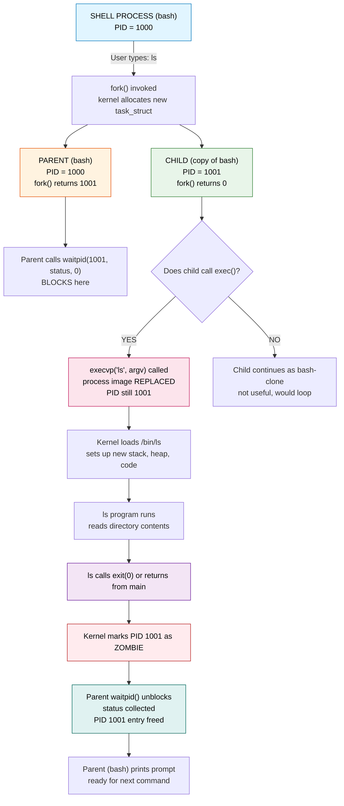
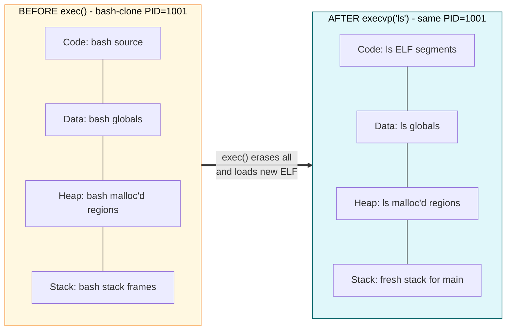
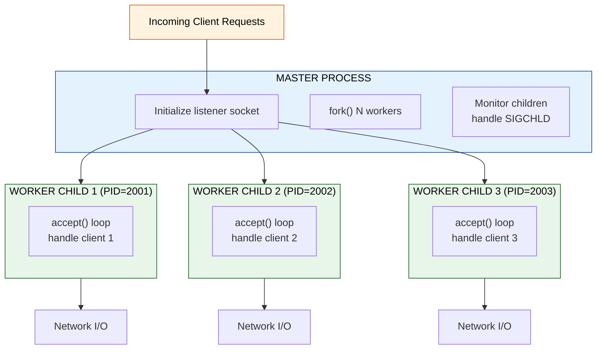
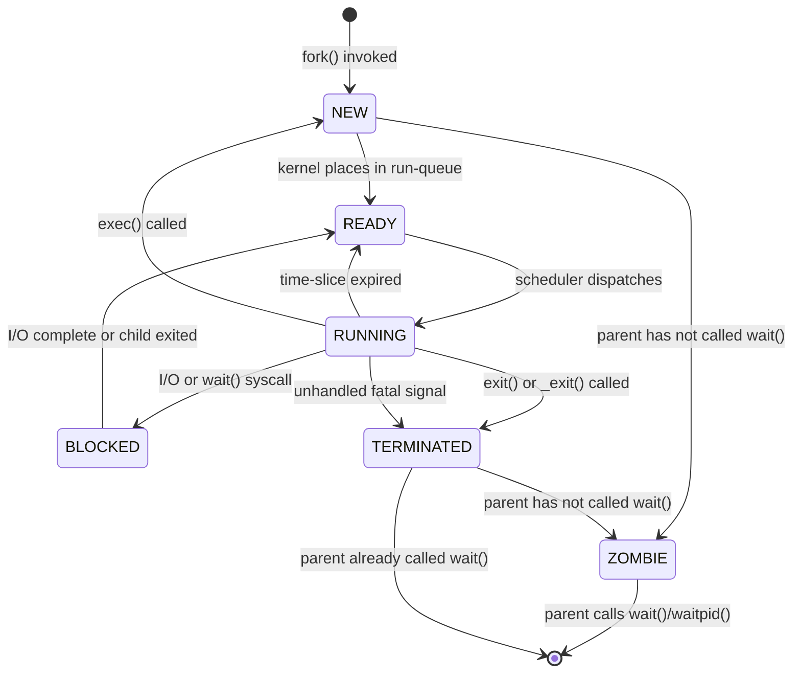

# Process Creation using fork() and exec()

<!-- SECTION_1_START -->
# Process Creation using `fork()` and `exec()`

## 1.1 Formal Definition (KTU 2024 Syllabus Terminology)

In the UNIX/Linux process model, a **process** is the fundamental unit of execution — a running instance of a program with its own address space, registers, stack, heap, and a unique Process ID (**PID**). The Operating System kernel exposes two pivotal system calls that govern *how* new processes are born and *how* a running process can *transform itself* into another program:

- **`fork()`** — A system call that creates a **new (child) process** which is an almost-exact duplicate of the calling (parent) process. Both processes resume execution at the instruction immediately following the `fork()` call, but with **divergent return values** that the application uses to discriminate between parent and child code paths.
- **`exec()`** — A *family* of system calls (e.g., `execl()`, `execv()`, `execlp()`, `execvp()`, `execve()`) that *replace* the current process image — code, data, heap, and stack — with a new program loaded from an executable file. The PID of the calling process is **preserved**; only the program identity changes.

> [!IMPORTANT]
> **KTU 2024 Board Definition:**
> "`fork()` is the **only** POSIX-blessed way to create a new process in UNIX. `exec()` does not create a process — it transforms one. Together, they form the classical `fork-then-exec` pattern that underpins every shell, every daemon-launcher, and every container runtime (Docker, runc, systemd)."

## 1.2 Intuitive Analogy — The Restaurant Kitchen

Imagine a busy restaurant kitchen run by a Head Chef (the **kernel**):

| Real-World Analogy | UNIX Concept |
|---|---|
| A **Head Chef** writing down a recipe on a fresh notepad identical to the one in use | `fork()` — duplicates the entire process context |
| The original Head Chef **continues cooking the old dish** | **Parent process** continues post-`fork()` |
| The new Assistant Chef **starts cooking the same dish** (for now) | **Child process** resumes post-`fork()` |
| The Assistant Chef is handed a **completely new recipe card** to cook a different dish | `exec()` — overwrites the process image |
| Both chefs wear name badges with the same **order ticket number** | PID is preserved across `exec()` |
| The Head Chef **waits** at the pass until the Assistant Chef reports back | `wait()` / `waitpid()` — parent reaps child |

> [!NOTE]
> **Key Insight for Students:** `fork()` is about *duplication* (more processes), `exec()` is about *replacement* (new program). A typical shell like `bash` does `fork()` to spawn a copy of itself, then the child does `exec()` to run the user's command (e.g., `ls`). Without this pattern, there would be no way to launch programs from a shell.

## 1.3 Standard Process Identifiers — Constants You Must Know

In KTU lab exams, the following `<sys/types.h>` / `<unistd.h>` constants are **mandatory** to know:

- **`pid_t`** — signed integer type used to hold a process ID. **Always** declare variables as `pid_t`, never as raw `int`.
- **Return value of `fork()`**:
  - In the **parent**: returns the **child's PID** (a positive integer).
  - In the **child**: returns **`0`**.
  - On **failure**: returns **`-1`**, and `errno` is set.
- **`getpid()`** — returns the PID of the *current* process.
- **`getppid()`** — returns the PID of the *parent* of the current process.
- **Standard PIDs**:
  - **PID 1** — `init` / `systemd`, the *ancestor of all user processes*. The kernel itself is PID 0.
  - **PID 2** — `kthreadd`, the kernel thread manager.

> [!VISUALIZATION CONTROL]
> **Concept:** Process Tree after `fork()` (Parent-Child Topology)
> **Conceptual Coordinate Mapping:**
> * Parent Process (PID = 100) at root
> * Child Process (PID = 101) sprouts below
> * Both nodes labeled with their return value from `fork()`
> **Visual Description:** A binary tree with the root node showing the child's PID (101) returned to the parent, and the left child node showing `0` returned to itself. An arrow from each node labeled "resumes execution" should diverge to separate execution paths.

<!-- SECTION_1_END -->

<!-- SECTION_2_START -->
# Deep Theoretical Analysis & KTU High-Yield Reference Sheet

## 2.1 Operational Mechanics — The Six Phases of `fork()`

When a user-mode program invokes `fork()`, the kernel performs the following sequence in **kernel space**:

1. **Process Table Slot Allocation** — Kernel reserves a new entry in the global process table and assigns a fresh, unique `pid_t` value.
2. **Copy of the Process Descriptor (`task_struct` in Linux)** — Open file descriptors, signal handlers, environment variables, resource limits, umask, nice value, and scheduling priority are duplicated.
3. **Memory Space Duplication** — Two strategies exist:
   - **Naive Copy-on-Write (CoW) — Modern:** Initially, parent and child **share the same physical pages** marked read-only. A page fault on *write* triggers the actual copy. This is the **default in Linux** since 2.6.x.
   - **Eager Physical Copy — Legacy Unix:** Every page is physically duplicated. Extremely expensive.
4. **Register State Copy** — The child's saved register set is a snapshot of the paused parent. The child will resume at the same `EIP`/`RIP` (instruction pointer) but with its own copy of the stack.
5. **Return Value Differentiation** — Kernel crafts the return values: **child PID** for parent, **`0`** for child.
6. **Scheduler Insertion** — Both processes are placed on the run-queue. The scheduler decides who runs next — the order is **not guaranteed**.

> [!NOTE]
> **Why CoW matters for KTU viva:** "Why is `fork()` fast in Linux?" → Because no memory is physically copied until either process writes. This is why servers like NGINX or Redis can `fork()` thousands of worker children per second.

## 2.2 The `exec()` Family — Variants Table

All members replace the process image. They differ in **how arguments are passed** and **how the executable is located**.

| Function | Argument Style | File Search | Path | Header |
|---|---|---|---|---|
| `execl(path, arg0, ..., NULL)` | List (variadic) | Caller-supplied full path | Absolute or relative | `<unistd.h>` |
| `execv(path, argv[])` | Vector (array) | Caller-supplied full path | Absolute or relative | `<unistd.h>` |
| `execlp(file, arg0, ..., NULL)` | List (variadic) | **`PATH` env variable** searched | Just filename | `<unistd.h>` |
| `execvp(file, argv[])` | Vector (array) | **`PATH` env variable** searched | Just filename | `<unistd.h>` |
| `execle(path, arg0, ..., NULL, envp[])` | List + env | Caller-supplied path | Absolute/relative | `<unistd.h>` |
| `execve(path, argv[], envp[])` | Vector + env | Caller-supplied path | **The kernel-level syscall** | `<unistd.h>` |

> [!IMPORTANT]
> **The single kernel syscall** that every `exec*` library function eventually invokes is `execve(path, argv, envp)`. The other six are thin `libc` wrappers. **KTU viva favourite question.**

## 2.3 Process Lifecycle States (KTU Diagram Essential)

A process in UNIX cycles through these states (referenced in your theory course EST 304 / CST 304):

| State | Meaning |
|---|---|
| `NEW` / `CREATED` | Process is being created (`fork()` mid-flight) |
| `READY` | In run-queue, waiting for CPU |
| `RUNNING` | Currently executing on a CPU core |
| `BLOCKED` / `WAITING` | Awaiting I/O, signal, or resource |
| `TERMINATED` / `ZOMBIE` | Has exited, awaiting parent to `wait()` |
| `ORPHAN` | Parent died before child; re-parented to PID 1 |

> [!WARNING]
> **Zombie vs Orphan — KTU favourite 3-mark question!**
> - **Zombie:** Child has finished (`_exit()`) but parent hasn't called `wait()`. Defunct entry still in process table.
> - **Orphan:** Parent has terminated before the child. Child is re-parented to `init` (PID 1).

## 2.4 KTU High-Yield Formula / API Cheat Sheet

> **Note:** Operating Systems Lab is API-driven, not formula-driven. The "equations" are the function signatures and return values.

| Symbol / API | Meaning / Signature | Typical Return / Unit |
|---|---|---|
| `pid_t fork(void)` | Create child process | Child PID (parent), `0` (child), `-1` (error) |
| `int execl(const char *path, const char *arg, ..., NULL)` | List-style exec | None on success, `-1` on error |
| `int execv(const char *path, char *const argv[])` | Vector-style exec | None on success, `-1` on error |
| `int execlp(const char *file, const char *arg, ..., NULL)` | List-style + PATH search | None on success, `-1` on error |
| `int execvp(const char *file, char *const argv[])` | Vector-style + PATH search | None on success, `-1` on error |
| `pid_t getpid(void)` | Current PID | Numeric PID |
| `pid_t getppid(void)` | Parent PID | Numeric PPID |
| `pid_t wait(int *status)` | Block until any child exits | Child PID, or `-1` |
| `pid_t waitpid(pid_t pid, int *status, int options)` | Block until specific child exits | Child PID, or `-1` |
| `void exit(int status)` | Normal process termination | No return |
| `void _exit(int status)` | Immediate kernel-level termination | No return |
| `WIFEXITED(status)` | Macro: did child exit normally? | Boolean |
| `WEXITSTATUS(status)` | Macro: extract child's exit code | 0–255 |
| `WIFSIGNALED(status)` | Macro: was child killed by signal? | Boolean |
| `WTERMSIG(status)` | Macro: which signal killed the child? | Signal number |
| `errno` | Global error indicator | Set on `-1` returns |

### 2.5 Real-World Engineering Utility

- **Shell Implementation** (`bash`, `zsh`): Every typed command triggers a `fork()` followed by `exec()` in the child.
- **Web Servers** (NGINX, Apache pre-fork model): Master process `fork()`s worker children; each worker handles incoming HTTP requests.
- **Database Servers** (PostgreSQL): Backend process `fork()`s a dedicated child per client connection.
- **Container Runtimes** (Docker, containerd): `clone()` (a `fork()` superset) is used with namespaces and cgroups to create isolated containers.
- **Sandboxing** (Chrome browser, Firefox): Each browser tab is a separate process spawned via `fork()`/`exec()`, isolating crashes and improving security.
- **Daemons** (systemd, cron, sshd): Long-running services are spawned once via `fork()` and detached.

<!-- SECTION_2_END -->

<!-- SECTION_3_START -->
# Step-by-Step Implementations — Source Code & Walkthroughs

## 3.1 Program 1: Basic `fork()` — Understanding the Return Value

This program is the **canonical KTU lab Program #1**. It demonstrates the divergence of execution after `fork()` and shows how the return value discriminates parent from child.

```c
/*
 * File: 01_basic_fork.c
 * Lab Program 1: Process creation using fork()
 * KTU 2024 Scheme — Operating Systems Lab (PCCSL406)
 */
#include <stdio.h>
#include <stdlib.h>
#include <unistd.h>
#include <sys/types.h>

int main(void) {
    pid_t pid;

    printf("[BEFORE FORK] PID = %d | PPID = %d\n", getpid(), getppid());
    fflush(stdout);  /* CRITICAL: flush before fork() to avoid duplicate buffering */

    pid = fork();

    /* --- ERROR HANDLING (must come first) --- */
    if (pid < 0) {
        fprintf(stderr, "fork() failed with errno = %d\n", errno);
        perror("fork");
        exit(EXIT_FAILURE);
    }

    /* --- CHILD BLOCK --- */
    else if (pid == 0) {
        printf("[CHILD ] PID = %d | PPID = %d | fork() returned: %d\n",
               getpid(), getppid(), pid);
        printf("[CHILD ] I am the child process. Sleeping for 2 seconds...\n");
        sleep(2);
        printf("[CHILD ] Child exiting now.\n");
        exit(42);   /* Pass exit code 42 to any waiting parent */
    }

    /* --- PARENT BLOCK --- */
    else {
        printf("[PARENT] PID = %d | PPID = %d | fork() returned (child PID): %d\n",
               getpid(), getppid(), pid);
        printf("[PARENT] I am the parent. Waiting for child to finish...\n");
        int status;
        pid_t finished = wait(&status);

        if (WIFEXITED(status)) {
            printf("[PARENT] Child %d exited normally with code %d\n",
                   finished, WEXITSTATUS(status));
        } else if (WIFSIGNALED(status)) {
            printf("[PARENT] Child %d was killed by signal %d\n",
                   finished, WTERMSIG(status));
        }
    }

    return EXIT_SUCCESS;
}
```

**Compilation & Execution:**

```bash
gcc -Wall -Wextra -std=c11 -O0 -g 01_basic_fork.c -o 01_basic_fork
./01_basic_fork
```

**Expected Output (order of [PARENT] and [CHILD] lines may vary due to scheduling):**

```
[BEFORE FORK] PID = 5500 | PPID = 3210
[CHILD ] PID = 5501 | PPID = 5500 | fork() returned: 0
[PARENT] PID = 5500 | PPID = 3210 | fork() returned (child PID): 5501
[CHILD ] I am the child process. Sleeping for 2 seconds...
[PARENT] I am the parent. Waiting for child to finish...
[CHILD ] Child exiting now.
[PARENT] Child 5501 exited normally with code 42
```

**Walkthrough — Line-by-Line Reasoning:**

1. `fflush(stdout)` before `fork()` is **not optional**. The C library buffers `stdout` in user-space memory. After `fork()`, the child inherits the buffered-but-not-flushed data, causing **duplicate prints** if you skip this.
2. `pid < 0` is the *only* branch that can detect failure. **`fork()` returning -1 is rare** but possible when the system's process table is full (`EAGAIN`).
3. The child receives `0` — the magic value that lets the child know "I am the new one."
4. The parent receives the **actual numeric PID** of the child. The parent needs this to call `waitpid()` on a *specific* child later.
5. `wait(&status)` is **blocking**. The parent halts here until *any* child terminates.
6. `WIFEXITED` and `WEXITSTATUS` are bit-mask macros that unpack the lower 16 bits of `status` — bit 7 indicates normal exit, bits 8–15 hold the exit code.

---

## 3.2 Program 2: `exec()` — Replacing the Process Image

This program shows what happens when a process calls `exec()` to **transform itself** into a different program.

```c
/*
 * File: 02_basic_exec.c
 * Demonstrates the exec() family — process replacement
 */
#include <stdio.h>
#include <stdlib.h>
#include <unistd.h>
#include <errno.h>
#include <string.h>

int main(int argc, char *argv[]) {
    if (argc != 2) {
        fprintf(stderr, "Usage: %s <full-path-to-program>\n", argv[0]);
        exit(EXIT_FAILURE);
    }

    printf("[BEFORE EXEC] PID = %d | About to become: %s\n", getpid(), argv[1]);
    fflush(stdout);

    /* Use execlp() so we can just give the program name and let PATH resolve it */
    execlp(argv[1], argv[1], "-l", "-a", (char *)NULL);

    /* If execlp() returns, it means it FAILED.
       If successful, this line is never reached. */
    fprintf(stderr, "execlp() failed: %s (errno = %d)\n", strerror(errno), errno);
    return EXIT_FAILURE;
}
```

**Compilation & Execution:**

```bash
gcc -Wall -Wextra -std=c11 02_basic_exec.c -o 02_basic_exec
./02_basic_exec ls
```

**Expected Output (excerpt):**

```
[BEFORE EXEC] PID = 6200 | About to become: ls
total 24
drwxr-xr-x 2 user user 4096 Oct 14 10:23 .
drwxr-xr-x 3 user user 4096 Oct 14 10:23 ..
-rwxr-xr-x 1 user user 8384 Oct 14 10:23 01_basic_fork
-rwxr-xr-x 1 user user 7304 Oct 14 10:23 02_basic_exec
-rw-r--r-- 1 user user  456 Oct 14 10:23 01_basic_fork.c
-rw-r--r-- 1 user user  312 Oct 14 10:23 02_basic_exec.c
```

**Critical Observation:** The line *"About to become: ls"* is followed by the output of `ls -l -a` — **proving the process is now `ls`**. The PID (`6200`) is **preserved**. The original program is **gone forever**.

---

## 3.3 Program 3: The Classic `fork()` + `exec()` + `wait()` Shell Pattern

This is the **most important KTU lab program** — it mimics what `bash` does when you type a command.

```c
/*
 * File: 03_shell_pattern.c
 * The canonical fork-then-exec pattern, mirroring how a UNIX shell launches commands.
 */
#include <stdio.h>
#include <stdlib.h>
#include <string.h>
#include <unistd.h>
#include <sys/wait.h>
#include <errno.h>

int main(int argc, char *argv[]) {
    if (argc < 2) {
        fprintf(stderr, "Usage: %s <command> [args...]\n", argv[0]);
        exit(EXIT_FAILURE);
    }

    pid_t pid = fork();

    if (pid < 0) {
        perror("fork");
        return EXIT_FAILURE;
    }

    if (pid == 0) {
        /* ============ CHILD ============ */
        printf("[child %d] Executing: %s\n", getpid(), argv[1]);
        fflush(stdout);

        /* Build argv for execvp: argv[1] is the program name, remaining are args */
        execvp(argv[1], &argv[1]);

        /* Only reached on exec failure */
        fprintf(stderr, "[child %d] execvp failed: %s\n", getpid(), strerror(errno));
        _exit(127);   /* Standard exit code for "command not found" */
    }

    /* ============ PARENT ============ */
    int status;
    pid_t result = waitpid(pid, &status, 0);

    if (result == -1) {
        perror("waitpid");
        return EXIT_FAILURE;
    }

    if (WIFEXITED(status)) {
        printf("[parent] Child %d exited with code %d\n", result, WEXITSTATUS(status));
    } else if (WIFSIGNALED(status)) {
        printf("[parent] Child %d killed by signal %d\n", result, WTERMSIG(status));
    }

    return EXIT_SUCCESS;
}
```

**Compilation & Execution:**

```bash
gcc -Wall -Wextra -std=c11 03_shell_pattern.c -o 03_shell_pattern

./03_shell_pattern ls -la /tmp
./03_shell_pattern echo Hello KTU 2024
./03_shell_pattern ps -ef | head -5
```

**Expected Output (sample):**

```
[child 7101] Executing: ls
total 32
drwxrwxrwt 14 root root  4096 Oct 14 11:00 .
...
[parent] Child 7101 exited with code 0
```

**Step-by-Step Flow Diagram (textual):**

1. Parent calls `fork()`.
2. Parent receives child's PID (`pid > 0`); child receives `0`.
3. Child enters `if (pid == 0)` block.
4. Child calls `execvp(argv[1], &argv[1])` — *replaces its own image* with `ls`.
5. Child (now `ls`) runs to completion and calls `_exit(0)` (or returns from `main`, equivalent).
6. Parent, blocked in `waitpid(pid, ...)`, wakes up.
7. Parent inspects `status`, prints the result, and exits cleanly.

---

## 3.4 Program 4: Multi-Process Spawning — N Workers in Parallel

Demonstrates a **pre-forked worker pool**, the architectural backbone of Apache HTTPD, NGINX, and PostgreSQL.

```c
/*
 * File: 04_worker_pool.c
 * Spawns N child processes that each do independent work in parallel.
 */
#include <stdio.h>
#include <stdlib.h>
#include <unistd.h>
#include <sys/wait.h>

#define NUM_WORKERS 3

int main(void) {
    pid_t pids[NUM_WORKERS];

    for (int i = 0; i < NUM_WORKERS; i++) {
        pids[i] = fork();

        if (pids[i] < 0) {
            perror("fork");
            return EXIT_FAILURE;
        }

        if (pids[i] == 0) {
            /* CHILD i: do some "work" */
            printf("[worker %d] PID=%d PPID=%d starting job...\n",
                   i, getpid(), getppid());
            fflush(stdout);

            sleep(2 + i);   /* Simulate variable work duration */

            printf("[worker %d] PID=%d finishing job.\n", i, getpid());
            fflush(stdout);

            _exit(100 + i);  /* Distinct exit code per worker */
        }

        /* PARENT continues loop to fork next worker */
    }

    /* PARENT reaps ALL children */
    for (int i = 0; i < NUM_WORKERS; i++) {
        int status;
        pid_t done = waitpid(pids[i], &status, 0);
        if (WIFEXITED(status)) {
            printf("[parent] Reaped PID=%d (worker %d) exit_code=%d\n",
                   done, i, WEXITSTATUS(status));
        }
    }

    printf("[parent] All workers done. Exiting.\n");
    return EXIT_SUCCESS;
}
```

**Expected Output (parallelism visible):**

```
[worker 0] PID=8200 PPID=8199 starting job...
[worker 1] PID=8201 PPID=8199 starting job...
[worker 2] PID=8202 PPID=8199 starting job...
[worker 0] PID=8200 finishing job.
[parent] Reaped PID=8200 (worker 0) exit_code=100
[worker 1] PID=8201 finishing job.
[parent] Reaped PID=8201 (worker 1) exit_code=101
[worker 2] PID=8202 finishing job.
[parent] Reaped PID=8202 (worker 2) exit_code=102
[parent] All workers done. Exiting.
```

**Engineering Note:** Notice that `pids[]` array is sized `NUM_WORKERS`. The parent uses `waitpid(pids[i], ...)` with the *specific* PID rather than the generic `wait()`. This is essential when you have multiple children and want to reap them in order or selectively.

---

## 3.5 Program 5: Zombie Process Demonstration & Prevention

```c
/*
 * File: 05_zombie_demo.c
 * Demonstrates how a missing wait() leaves zombies, and how wait() cleans them up.
 */
#include <stdio.h>
#include <stdlib.h>
#include <unistd.h>
#include <sys/wait.h>

int main(void) {
    pid_t pid = fork();

    if (pid == 0) {
        /* CHILD: exits almost immediately */
        printf("[child] PID=%d exiting now.\n", getpid());
        _exit(0);
    }

    /* PARENT: sleeps WITHOUT calling wait() — child becomes zombie */
    printf("[parent] PID=%d sleeping 5s. Child is a zombie in the meantime.\n", getpid());
    printf("[parent] Run 'ps -el | grep %d' in another terminal to observe the 'Z' state.\n", pid);
    fflush(stdout);

    sleep(5);

    /* Now reap the zombie */
    wait(NULL);
    printf("[parent] Reaped. Zombie cleared. Exiting.\n");
    return 0;
}
```

**How to observe the zombie:**

```bash
gcc 05_zombie_demo.c -o 05_zombie_demo
./05_zombie_demo &
ps -el | grep 05_zombie
```

The child will appear with state **`Z`** (zombie) for 5 seconds.

---

## 3.6 Python Equivalent — Algorithmic Variant for Conceptual Clarity

For students who prefer Python, here is the same `fork()`+`exec()` pattern in Python using `os.fork()` and `os.execvp()`:

```python
"""
File: 06_fork_exec_python.py
Python equivalent of the C shell pattern.
"""
import os
import sys
import time

def main() -> int:
    if len(sys.argv) < 2:
        print(f"Usage: {sys.argv[0]} <command> [args...]", file=sys.stderr)
        return 1

    # In Python, sys.stdout may be line-buffered. Flush before fork.
    sys.stdout.flush()

    pid: int = os.fork()

    if pid < 0:
        print("fork failed", file=sys.stderr)
        return 1

    if pid == 0:
        # CHILD
        print(f"[child {os.getpid()}] executing: {sys.argv[1]}")
        sys.stdout.flush()
        try:
            os.execvp(sys.argv[1], sys.argv[1:])
        except FileNotFoundError as e:
            print(f"[child] exec failed: {e}", file=sys.stderr)
            os._exit(127)

    # PARENT
    _, status = os.waitpid(pid, 0)
    if os.WIFEXITED(status):
        print(f"[parent] child {pid} exited with code {os.WEXITSTATUS(status)}")
    elif os.WIFSIGNALED(status):
        print(f"[parent] child {pid} killed by signal {os.WTERMSIG(status)}")
    return 0

if __name__ == "__main__":
    sys.exit(main())
```

**Execution:**

```bash
python3 06_fork_exec_python.py ls -la
```

<!-- SECTION_3_END -->

<!-- SECTION_4_START -->
# Structural Diagrams & Schematics

## 4.1 Mermaid Process Tree — `fork()` + `exec()` Flow



## 4.2 Mermaid — Address Space Layout Before vs. After `exec()`



## 4.3 Mermaid — Block Architecture of a Pre-Forked Worker Server



## 4.4 Mermaid — Process State Lifecycle with `fork()`/`exec()`/`exit()`/`wait()`



<!-- SECTION_4_END -->

<!-- SECTION_5_START -->
# KTU 2024 Scheme Examination Question Bank & Topic Recap

## 5.1 Part A — Short Answer Questions (3 Marks Each)

### Question A1: Define the `fork()` system call. Explain the significance of its return value.  [3 Marks]
`[KTU University Exam — July 2024 | CO1 | Remember]`

**Model Answer:**

> `fork()` is a POSIX system call defined in `<unistd.h>` that creates a new process, called the **child**, which is an almost exact duplicate of the calling process, called the **parent**. The new child runs concurrently with the parent from the point of the `fork()` call.
>
> **Significance of the return value:** `fork()` returns three distinct values that allow the program to identify its role:
> 1. A **negative value** (i.e., `-1`) indicates an **error** — the new process could not be created (e.g., process table full). `errno` is set.
> 2. A **zero** (`0`) is returned to the **newly created child process**, allowing it to identify itself.
> 3. A **positive value** — the **PID of the child** — is returned to the **parent** process, allowing the parent to track and manage the child.
>
> **[Return-value discrimination: 2 Marks | Error case mention: 1 Mark]**

### Question A2: Differentiate between a Zombie process and an Orphan process.  [3 Marks]
`[KTU University Exam — Dec 2023 | CO2 | Understand]`

**Model Answer:**

> | Aspect | Zombie Process | Orphan Process |
> |---|---|---|
> | **Definition** | A process that has **completed execution** but still has an entry in the process table because its parent has not yet read its exit status. | A process whose **parent has terminated** before the child has finished executing. |
> | **Cause** | Child calls `exit()`/`_exit()` but parent has not called `wait()`/`waitpid()`. | Parent dies (e.g., crashes) before the child terminates. |
> | **Reaping** | Cleaned up when the parent eventually calls `wait()` or exits. | Automatically re-parented to `init` (PID 1) which reaps it. |
> | **Resource leak** | Consumes a process-table slot. | No leak per se, but lifecycle extended. |
> | **State in `ps`** | Shown with state code **`Z`**. | Shown as a normal `R`/`S` process with PPID = 1. |
>
> **[Definition of zombie: 1 Mark | Definition of orphan: 1 Mark | Distinguishing table row: 1 Mark]**

---

## 5.2 Part B — Long Answer Questions (14 Marks Each, with Internal Choice)

### Question B-A:  [14 Marks]
`[KTU University Exam — July 2024 | CO1, CO2 | Apply + Analyze]`

**(a)** Write a C program using `fork()` to create a child process. In the parent, print the **child's PID** and wait for the child to finish. In the child, print **its own PID and parent's PID**, then execute `ls -l /tmp` using `execlp()`. Show the expected output. **[7 Marks]**

**(b)** Explain the **six phases of `fork()` execution** as performed by the Linux kernel. What is **Copy-on-Write (CoW)** and why is it essential for the performance of modern UNIX systems? **[7 Marks]**

#### Model Solution (a):

```c
#include <stdio.h>
#include <stdlib.h>
#include <unistd.h>
#include <sys/wait.h>

int main(void) {
    pid_t pid = fork();

    if (pid < 0) {
        perror("fork");
        return EXIT_FAILURE;
    }

    if (pid == 0) {
        /* CHILD */
        printf("[CHILD]  My PID = %d\n", getpid());
        printf("[CHILD]  My parent's PID = %d\n", getppid());
        fflush(stdout);
        execlp("ls", "ls", "-l", "/tmp", (char *)NULL);
        _exit(127);
    } else {
        /* PARENT */
        printf("[PARENT] My PID = %d\n", getpid());
        printf("[PARENT] Child's PID returned by fork = %d\n", pid);
        int status;
        waitpid(pid, &status, 0);
        printf("[PARENT] Child has finished.\n");
    }
    return 0;
}
```

**Expected Output:**

```
[PARENT] My PID = 9000
[PARENT] Child's PID returned by fork = 9001
[CHILD]  My PID = 9001
[CHILD]  My parent's PID = 9000
total 48
drwxrwxrwt 14 root root  4096 Oct 14 12:00 /tmp
...
[PARENT] Child has finished.
```

**Valuation Key:**

- [Correct inclusion of headers and `pid_t` declaration: 1 Mark]
- [Correct `fork()` invocation and three-way return-value check (`<0`, `==0`, `>0`): 2 Marks]
- [Correct use of `getpid()` and `getppid()` in child: 1 Mark]
- [Correct `execlp()` arguments terminated by `(char *)NULL`: 2 Marks]
- [Parent uses `waitpid()` and prints child's PID: 1 Mark]

#### Model Solution (b):

**The six phases of `fork()` in Linux kernel:**

1. **`do_fork()` Entry Point** — Kernel allocates a new `task_struct` (process descriptor) in the process table and assigns a unique PID.  [1 Mark]
2. **Copy Process Descriptor** — The `task_struct` is duplicated: open file descriptors (with ref-count increments), signal handlers, signal mask, working directory, umask, nice value, and resource limits are copied.  [1 Mark]
3. **Memory Space Setup (Copy-on-Write)** — Instead of physically copying user-space memory, the kernel marks all the parent's pages as **read-only** in both page tables and sets up the child's page tables to point to the **same physical frames**. A special flag in the VMA (Virtual Memory Area) structures indicates CoW.  [1 Mark]
4. **Register State Snapshot** — The child's saved register context (general-purpose registers, stack pointer, instruction pointer) is an exact copy of the parent's, captured at the moment of the syscall. The child will resume at the **same instruction** immediately after `fork()` returns.  [1 Mark]
5. **Return-Value Crafting** — The kernel sets the child's return register to **`0`** and the parent's to the **child's PID**.  [0.5 Mark]
6. **Scheduler Insertion** — Both processes are added to the run-queue. The scheduler decides which runs first; this is **non-deterministic**.  [0.5 Mark]

**Copy-on-Write (CoW) — Detailed:**

> CoW is a lazy-duplication optimization where physical memory pages are **shared** between parent and child after `fork()`, with all pages marked read-only. A page fault is triggered the moment *either* process attempts a **write** to a shared page. The kernel's page-fault handler then allocates a **new physical frame**, copies the contents, and remaps the faulting process's PTE to point at the new frame.  [1 Mark]
>
> **Why CoW is essential:**
> - **Performance:** `fork()` becomes almost as cheap as creating a thread, enabling high-rate process spawning (e.g., NGINX, PostgreSQL spawning thousands of connections per second).  [0.5 Mark]
> - **Memory efficiency:** Idle children (e.g., those about to call `exec()`) never waste memory on duplicated pages.  [0.5 Mark]
> - **Indispensable for `exec()`:** Since the child will almost always immediately call `exec()`, copying pages that are about to be discarded would be pure waste. CoW makes the `fork-then-exec` pattern cheap.  [0.5 Mark]

### Question B-B:  [14 Marks]  *(Internal Choice Alternative)*
`[KTU University Exam — Dec 2023 | CO1, CO3 | Apply + Analyze]`

**(a)** Compare the six variants of the `exec()` family in a tabular form, focusing on (i) argument passing style, (ii) whether `PATH` is searched, and (iii) whether environment variables are inherited. Write a working C program that uses `execvp()` to run the user's command passed via `argv`.  **[7 Marks]**

**(b)** Describe the **state transitions** of a UNIX process. With a neat diagram, explain how `fork()`, `exec()`, `exit()`, and `wait()` move a process between states.  **[7 Marks]**

#### Model Solution (a):

**Comparison Table:**

| Function | Argument Style | PATH Searched? | Environment Inherited? | Header |
|---|---|---|---|---|
| `execl` | List (variadic) | No (full path required) | Yes (inherits) | `<unistd.h>` |
| `execlp` | List (variadic) | **Yes** | Yes (inherits) | `<unistd.h>` |
| `execle` | List + env | No | **Custom** (passed explicitly) | `<unistd.h>` |
| `execv` | Vector (array) | No | Yes (inherits) | `<unistd.h>` |
| `execvp` | Vector (array) | **Yes** | Yes (inherits) | `<unistd.h>` |
| `execve` | Vector + env | No | **Custom** (passed explicitly) | `<unistd.h>` |

**[Correct 6-row table with all 4 columns: 3 Marks]**

**C Program using `execvp()`:**

```c
#include <stdio.h>
#include <stdlib.h>
#include <unistd.h>
#include <sys/wait.h>
#include <errno.h>
#include <string.h>

int main(int argc, char *argv[]) {
    if (argc < 2) {
        fprintf(stderr, "Usage: %s <command> [args...]\n", argv[0]);
        return EXIT_FAILURE;
    }

    pid_t pid = fork();
    if (pid < 0) { perror("fork"); return EXIT_FAILURE; }

    if (pid == 0) {
        /* CHILD uses execvp() — vector style, PATH-searched */
        execvp(argv[1], &argv[1]);
        fprintf(stderr, "execvp failed: %s\n", strerror(errno));
        _exit(127);
    }

    int status;
    waitpid(pid, &status, 0);
    if (WIFEXITED(status))
        printf("Exit code: %d\n", WEXITSTATUS(status));
    return 0;
}
```

**[Correct fork-then-execvp with PATH reliance and `&argv[1]` vector: 4 Marks]**

#### Model Solution (b):

**The five fundamental states** a UNIX process can occupy:

1. `NEW` — Process is being created.
2. `READY` — Waiting in the run-queue for CPU.
3. `RUNNING` — Actively executing on a CPU core.
4. `BLOCKED`/`WAITING` — Suspended on I/O, signal, or child termination.
5. `TERMINATED`/`ZOMBIE` — Has exited, awaiting parent to call `wait()`.  [1 Mark]

**Transitions driven by system calls/events:**

| Event | Transition |
|---|---|
| `fork()` | `NEW` → `READY` (both parent and child) |
| Scheduler dispatch | `READY` → `RUNNING` |
| Time-slice expiry | `RUNNING` → `READY` |
| I/O wait / `wait()` | `RUNNING` → `BLOCKED` |
| I/O completion / child exit | `BLOCKED` → `READY` |
| `exec()` | `RUNNING` → `RUNNING` (but with new program image) |
| `exit()` / `_exit()` | `RUNNING` → `TERMINATED` (becomes zombie) |
| `wait()` by parent | `ZOMBIE` → removed from process table |

**[Table: 3 Marks | Explanation of `exec()` keeping PID/state: 1 Mark | Explanation of zombie cleanup: 2 Marks]**

**State Diagram (textual):**

```
NEW --fork()--> READY <--wait()-- BLOCKED
                  |                  |
                  | schedule         | I/O done
                  v                  v
                RUNNING ----------> BLOCKED
                  |
                  | exit() / _exit()
                  v
              TERMINATED (ZOMBIE)
                  |
                  | parent calls wait()
                  v
                 [removed]
```

**[Neat ASCII diagram: 2 Marks]**

> [!WARNING]
> **KTU Examiner's Valuation Pitfall Callout:**
> 1. **Forgetting `fflush(stdout)` before `fork()`** — duplicates printed lines, and the examiner will dock 1 mark.
> 2. **Using `printf` without `\n` before `fork()`** — same root cause; always flush or always end with newline.
> 3. **Returning from `main()` in the child after `exec()` failure instead of `_exit()`** — the child will run the parent's `wait()` block, causing a deadlock.
> 4. **Forgetting `(char *)NULL` terminator in `execl*()`** — undefined behavior; argv array not null-terminated.
> 5. **Confusing `exit()` (libc) with `_exit()` (kernel)** — `exit()` flushes stdio buffers (a no-op after `exec` failure, but a duplicate-print risk in normal exit); `_exit()` is immediate and is the *correct* choice in a forked child.
> 6. **Not handling `pid < 0` branch** — losing 1 mark for the missing error case.
> 7. **Passing `argv[0]` (program name) as the first arg to `execvp` instead of `&argv[1]`** — wrong program name inside the new process; some programs (like `bash`) rely on `argv[0]` for behavior.

---

## 5.3 Topic Recap & Important Things to Remember

> [!IMPORTANT]
> **High-Density Rapid Revision Checklist — KTU OS Lab Module 1**

- **`fork()` is the ONLY way to create a new process in POSIX UNIX.** It duplicates the process — both parent and child resume at the same instruction.
- **`fork()` returns:** `-1` (error), `0` (in child), **child PID** (in parent). This is the *only* reliable way to know "am I parent or child?"
- **Always check all three return-value branches.** Skipping the `< 0` branch loses marks.
- **`fflush(stdout)` before `fork()` is mandatory** if you've printed anything. Otherwise, both processes will flush identical buffered output → duplicate prints.
- **`exec()` does NOT create a process.** It *replaces* the current process image with a new executable. The PID is preserved.
- **The `exec` family has 6 variants** (`l` vs `v` for list vs vector; `p` for PATH search; `e` for custom env). The one true kernel syscall is `execve()`.
- **The canonical pattern is `fork()` → (in child) `exec()` → (in parent) `wait()`.** This is how shells, web servers, database backends, and Docker containers all launch new work.
- **`getpid()`** returns your own PID. **`getppid()`** returns your parent's PID.
- **`wait()` blocks until ANY child exits.** **`waitpid(pid, ...)`** blocks until a SPECIFIC child exits. Use `waitpid()` when you have multiple children.
- **Status macros** — `WIFEXITED`, `WEXITSTATUS`, `WIFSIGNALED`, `WTERMSIG` — let the parent decode *how* the child died.
- **`exit()` (libc) vs `_exit()` (kernel):** in a forked child, prefer `_exit()` to avoid double-flush corruption.
- **Zombie process** = child has exited, parent has not yet `wait()`-ed. Fix by calling `wait()`. **Orphan process** = parent died before child; re-parented to `init` (PID 1).
- **Copy-on-Write (CoW)** is the magic that makes `fork()` cheap — pages are shared read-only; a write triggers physical copy.
- **Default scheduler behavior is non-deterministic.** The order of parent vs child prints after `fork()` is *not guaranteed* — write your code to be order-independent.
- **Common KTU viva questions:**
  1. "Can a child call `exec()` after `fork()`?" — Yes, and usually does.
  2. "What happens to file descriptors after `fork()`?" — They are duplicated (shared file offset).
  3. "Can `fork()` fail?" — Yes (`EAGAIN`) if the process table is full or rlimit hit.
  4. "How many processes are created by a `for` loop that calls `fork()` `N` times?" — $2^N$ (exponential!).
  5. "Why does Linux prefer CoW over eager copy?" — To avoid wasted memory and speed up `fork()`.
- **Standard exit codes:** `0` = success, `1` = general error, `127` = command not found in shell-exec pattern, `130` = killed by SIGINT (Ctrl+C), `137` = killed by SIGKILL.

<!-- SECTION_5_END -->
