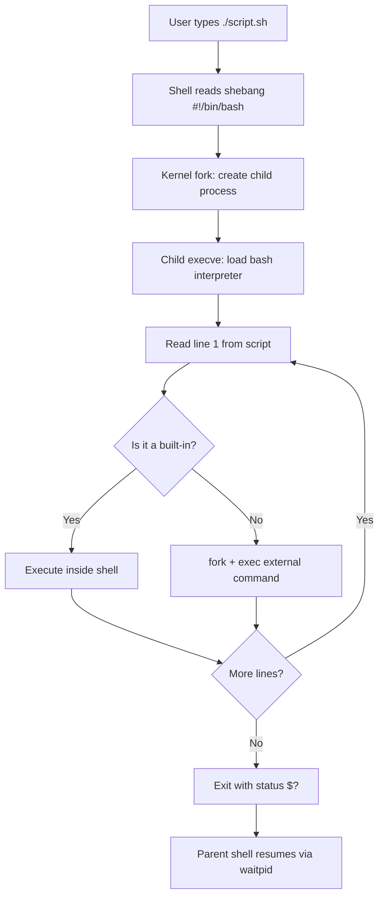
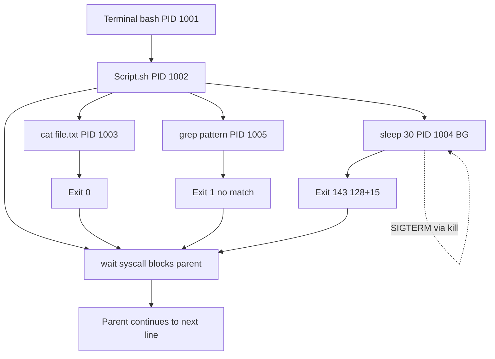
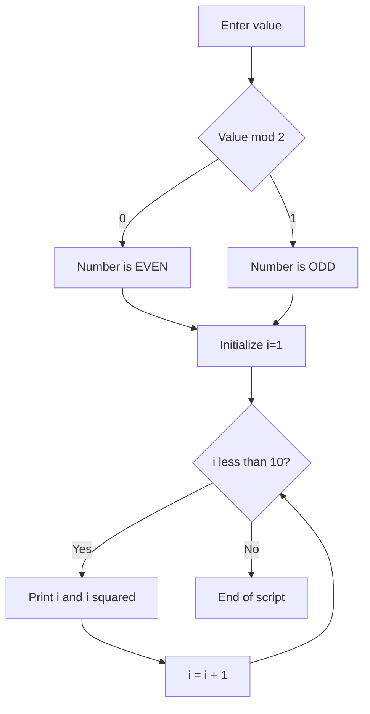
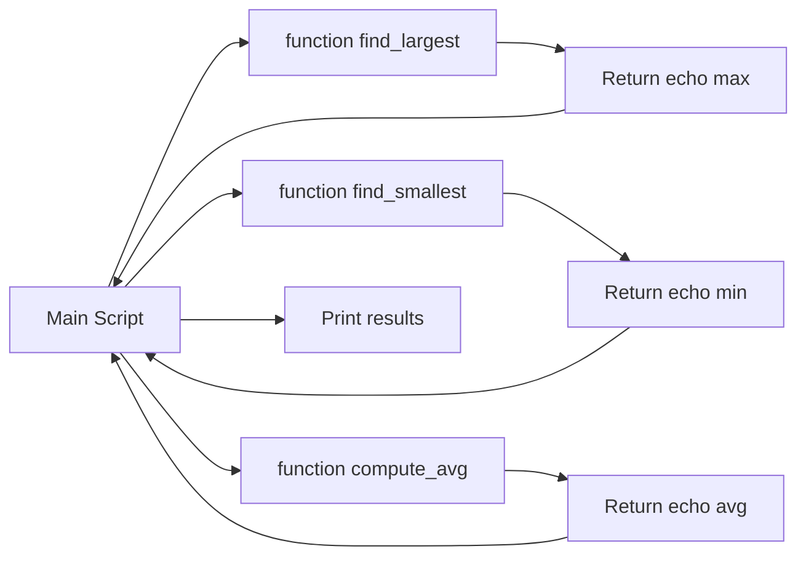
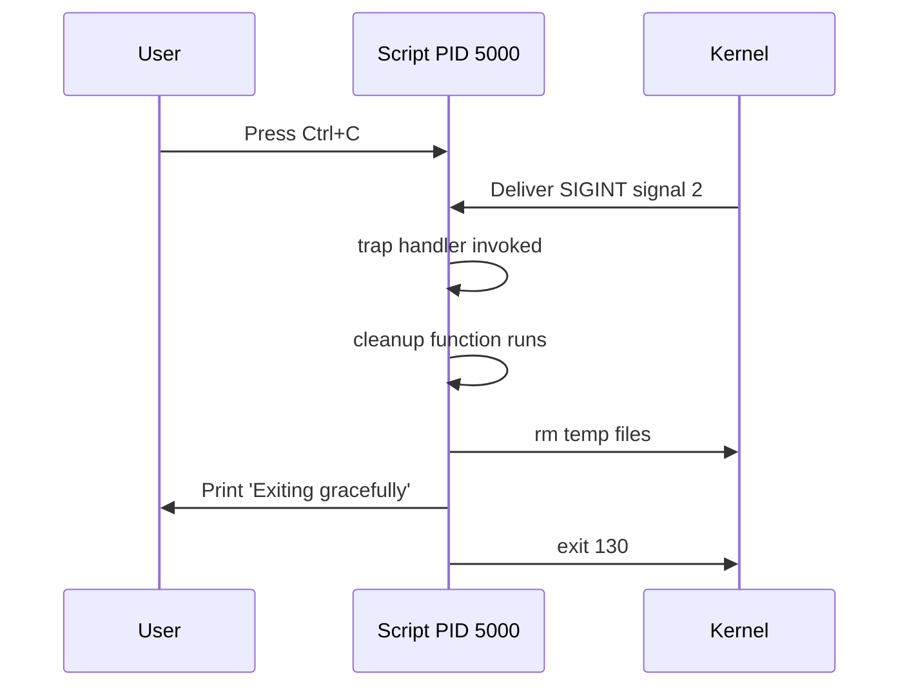

# Shell Script Programming

<!-- SECTION_1_START -->
# Shell Script Programming — Core Technical Definition & Intuitive Overview

## 1.1 Formal KTU 2024 Definition

> [!IMPORTANT]
> **Shell Script Programming (KTU 2024 — PCCSL406 / Module 1)**
> A *shell script* is an **executable text file** containing a sequential list of commands written for the *Unix/Linux shell* (commonly `bash`, `sh`, `ksh`, or `zsh`). The shell acts as a **command-line interpreter** that reads each line of the script, performs **lexical analysis**, **variable substitution**, and **command execution** by invoking the operating system kernel via system calls such as `fork()`, `exec()`, and `wait()`. Shell scripts are primarily used for **process automation**, **system administration**, **program building**, and **batch job control** in Unix-like environments.

In the KTU Operating Systems Lab (PCCSL406), Module 1 explicitly trains students to:
- Write modular shell programs using `bash` (Bourne Again SHell).
- Demonstrate **process creation and control** using system-level commands like `ps`, `fork`, `exec`, `wait`, `kill`, and shell built-ins.
- Implement **control structures** (`if-elif-else`, `case`, `for`, `while`, `until`).
- Use **string and arithmetic operations**, **arrays**, **functions**, and **file handling**.

## 1.2 Conceptual Analogy — The Kitchen Chef

> [!NOTE]
> **Think of the shell as a Head Chef in a kitchen.**
> - The **recipe book (script file)** contains a step-by-step list of instructions.
> - The **Head Chef (shell interpreter)** reads each instruction one at a time.
> - The **cooking assistants (CPU/kernel processes)** actually chop, boil, and fry — equivalent to `fork()`-ing a child process.
> - The **waiter (parent process)** holds the plate (`wait()`) until the dish is ready.
> - If the recipe says "if salt is low, add more" → that is a **conditional (`if`)**. "Stir 10 times" → a **loop (`for`)**.
>
> Without a recipe, the chef has to be told every step verbally. With a script (recipe), the chef can **automate the entire dish consistently** — every time, the same way.

## 1.3 Anatomy of a Shell Script — First Glance

```bash
#!/bin/bash
# File: hello.sh
# Purpose: Demonstrate basic shell script structure
# Author: KTU Student

echo "Hello, World! Current user is: $USER"
echo "Today is: $(date)"
echo "Script name: $0"
echo "Number of arguments: $#"
```

| Component | Meaning | Mandatory? |
| :--- | :--- | :--- |
| `#!/bin/bash` | **Shebang** — tells kernel which interpreter to use | **YES** |
| `# comment` | Comments (ignored by interpreter) | Recommended |
| `echo` | Built-in command to print to **STDOUT** | No |
| `$VARIABLE` | Variable expansion (preceded by `$`) | No |
| `$(command)` | Command substitution — captures output | No |

## 1.4 Why Shell Scripting in an OS Lab?

> [!IMPORTANT]
> **KTU 2024 Syllabus Highlight (PCCSL406, Module 1):**
> The Operating Systems Lab begins with Shell Programming because it provides a **direct, hands-on interface to the OS kernel**. Every command in a shell script is ultimately a **system call** wrapped in user-friendly syntax. By learning shell scripting, students gain practical exposure to:
> - **Process lifecycle** (creation, execution, termination).
> - **File descriptors and I/O redirection**.
> - **Environment variables and shell expansion rules**.
> - **Inter-process communication pipelines** (`pipe`, `filter`).
> - **Scheduling via `cron` and `at`**.

> [!VISUALIZATION CONTROL]
> **Concept:** Shell Script Execution Flow
> **Process Hierarchy Mapping:**
> * Terminal opens → spawns **Shell (bash)** with PID, say `1001`
> * User runs `./script.sh` → shell calls `fork()` → child PID `1002`
> * Child calls `execve("/bin/bash", ...)` → interpreter loaded
> * Interpreter parses line-by-line → each external command triggers another `fork/exec/wait`
> **Visual Description:** Picture a *rooted tree*. The terminal is the root. `./script.sh` is a child. Each `grep`, `awk`, `sort` inside the script is a grandchild leaf. The shell (parent) waits at every internal node using `waitpid()`.

<!-- SECTION_1_END -->

<!-- SECTION_2_START -->
# Deep Theoretical Analysis & KTU High-Yield Reference Sheet

## 2.1 The Shell Script Execution Pipeline (Theory)

A shell script is **not compiled** in the traditional sense. It is **interpreted line-by-line**. The full lifecycle is:

1. **Read** a line from the script file (using the file descriptor opened by the parent shell).
2. **Tokenize** the line (lexical analysis) into words, operators, and reserved keywords.
3. **Expand** aliases, variables (`$VAR`, `${VAR}`), command substitutions (`$(...)`), and glob patterns (`*.txt`).
4. **Parse** redirections (`>`, `<`, `>>`, `2>&1`) and pipes (`|`).
5. **Execute**:
   - **Built-in command** → handled inside the shell process itself (no `fork`).
   - **External command** → `fork()` a child, child calls `exec()`, parent calls `wait()`.
6. **Return** exit status (`$?` ∈ {0..255}); `0` means **success**.

> [!NOTE]
> **Built-in vs External commands** is a *favorite KTU viva question*.
> - **Built-in** (e.g., `cd`, `echo`, `read`, `export`, `set`): executed by the shell itself, **no new process created**, faster.
> - **External** (e.g., `ls`, `cat`, `grep`, `awk`): stored as binaries in `/bin` or `/usr/bin`, require `fork + exec` overhead.

## 2.2 KTU High-Yield Reference Sheet — Variables, Special Parameters, Operators

### 2.2.1 Variable Declaration & Access

```bash
name="KTU"           # NO spaces around '='
echo $name           # Output: KTU
echo ${name}         # Safer; explicit braces
echo "$name_2024"    # Output: (empty) — underscore becomes part of name
echo "${name}_2024"  # Output: KTU_2024
```

### 2.2.2 Special Shell Parameters (Frequently Asked)

| Parameter | Meaning | Example |
| :--- | :--- | :--- |
| `$0` | Name of the script itself | `./demo.sh` |
| `$1` … `$9` | Positional arguments (1st to 9th) | `$1` = first arg |
| `${10}` | 10th positional argument (use braces) | `${10}` |
| `$#` | Total number of arguments passed | `3` |
| `$@` | All arguments as **separate** quoted strings | `"$@"` |
| `$*` | All arguments as **single** string | `"$*"` |
| `$?` | Exit status of last command (0 = success) | `127` = not found |
| `$$` | **PID** of the current shell | `1001` |
| `$!` | PID of the last background job | `1005` |
| `$-` | Current shell option flags | `himBHs` |

### 2.2.3 Quoting Rules (Critical for Exams)

| Syntax | Name | Behavior | Example |
| :--- | :--- | :--- | :--- |
| `"double"` | Double quote | Allows `$`, `\`, `` ` `` expansion | `echo "$name"` → KTU |
| `'single'` | Single quote | **Literal** — no expansion | `echo '$name'` → $name |
| `` `cmd` `` | Backticks | Command substitution (older) | `` echo `date` `` |
| `$(cmd)` | Dollar-paren | Command substitution (preferred) | `echo $(date)` |
| `\` | Backslash | Escape single char | `echo \$name` → $name |

### 2.2.4 String & Arithmetic Operators

| Operation | Syntax | Notes |
| :--- | :--- | :--- |
| String equality | `[ "$a" = "$b" ]` | Use `=` inside `[ ]` |
| String inequality | `[ "$a" != "$b" ]` | |
| Integer equality | `[ "$a" -eq "$b" ]` | `-eq`, `-ne`, `-gt`, `-lt`, `-ge`, `-le` |
| File test | `[ -f file ]` | `-f`=file, `-d`=dir, `-e`=exists, `-r`=readable |
| Logical AND | `[ cond1 ] && [ cond2 ]` or `[[ cond1 && cond2 ]]` | |
| Arithmetic | `(( a + b ))` or `$((a + b))` | C-style operators inside `(( ))` |
| String length | `${#str}` | Returns integer count |
| Substring | `${str:2:5}` | From index 2, length 5 |

### 2.2.5 I/O Redirection Operators

| Operator | Meaning |
| :--- | :--- |
| `>` | Redirect STDOUT to file (overwrite) |
| `>>` | Append STDOUT to file |
| `<` | Redirect STDIN from file |
| `2>` | Redirect STDERR to file |
| `&>` | Redirect both STDOUT and STDERR (bash) |
| `\|` | Pipe: STDOUT of left → STDIN of right |

### 2.2.6 Control Structures Quick Reference

| Construct | Syntax Skeleton |
| :--- | :--- |
| `if` | `if [ cond ]; then ... elif [ cond ]; then ... else ... fi` |
| `case` | `case $var in pattern1) cmd ;; pattern2) cmd ;; *) default ;; esac` |
| `for` (list) | `for var in list; do ... done` |
| `for` (C-style) | `for ((i=0; i<10; i++)); do ... done` |
| `while` | `while [ cond ]; do ... done` |
| `until` | `until [ cond ]; do ... done` |
| Function | `fname() { commands; }` |
| Loop control | `break` (exit loop), `continue` (skip iteration) |

## 2.3 Real-World Utility of Shell Scripting

> [!NOTE]
> **Why engineers use shell scripts in production:**
> - **CI/CD pipelines** (Jenkins, GitHub Actions) — every step is a shell command.
> - **DevOps automation** — Docker entry points, Kubernetes init containers, Ansible playbooks.
> - **Log processing and ETL** — pipelines of `grep | awk | sed | sort | uniq`.
> - **System boot scripts** — `/etc/init.d/`, systemd service files.
> - **HPC batch jobs** — Slurm/PBS submission scripts.
> - **Quick prototyping** — test an idea in 5 lines without writing a full C program.
>
> In the KTU OS lab context, it is the **bridge between theory (processes, system calls) and practice (running actual commands on Linux)**.

<!-- SECTION_2_END -->

<!-- SECTION_3_START -->
# Step-by-Step Derivations & Code Implementation

> [!IMPORTANT]
> **Lab Setup Convention (assumed by KTU 2024 labs):**
> - OS: Ubuntu 22.04 LTS / Fedora 38 (or any Linux with `bash ≥ 4.x`).
> - Editor: `gedit`, `vim`, or `nano`.
> - Execution: `chmod +x script.sh && ./script.sh` or `bash script.sh`.

---

## 3.1 Program 1 — Hello, Process Tree (Variables, Special Params, Comments)

**Aim:** Write a shell script that displays a greeting, the current user, system date, script name, and the number of arguments passed.

```bash
#!/bin/bash
#---------------------------------------------------------
# Program: 01_hello.sh
# Aim    : Display greeting, user, date, script info
# KTU    : PCCSL406 / Module 1
#---------------------------------------------------------

echo "==========================================="
echo " Welcome to KTU OS Lab — Shell Programming "
echo "==========================================="

# Special parameters
echo "Script name        : $0"
echo "First argument     : $1"
echo "Second argument    : $2"
echo "All arguments      : $@"
echo "Number of args     : $#"
echo "Current PID        : $$"
echo "Current user       : $USER"
echo "Home directory     : $HOME"
echo "Working directory  : $PWD"
echo "Today's date       : $(date '+%d-%m-%Y %H:%M:%S')"
echo "Exit status of date command: $?"
```

**Execution trace with 2 args:**

```text
$ chmod +x 01_hello.sh
$ ./01_hello.sh Alice Bob
===========================================
 Welcome to KTU OS Lab — Shell Programming
===========================================
Script name        : ./01_hello.sh
First argument     : Alice
Second argument    : Bob
All arguments      : Alice Bob
Number of args     : 2
Current PID        : 4872
Current user       : student
Home directory     : /home/student
Working directory  : /home/student/lab
Today's date       : 15-06-2025 14:32:10
Exit status of date command: 0
```

---

## 3.2 Program 2 — Arithmetic Operations & Conditionals (if-elif-else)

**Aim:** Read two numbers and an operator from the user; perform the operation using `case`.

```bash
#!/bin/bash
# Program: 02_calc.sh
# Aim    : Menu-driven calculator using case

read -p "Enter first number  : " a
read -p "Enter second number : " b
read -p "Enter operator (+ - * / %) : " op

# Validate numeric input using regex
if ! [[ "$a" =~ ^-?[0-9]+$ ]] || ! [[ "$b" =~ ^-?[0-9]+$ ]]; then
    echo "ERROR: Both inputs must be integers."
    exit 1
fi

case "$op" in
    "+") result=$(( a + b )) ;;
    "-") result=$(( a - b )) ;;
    "*") result=$(( a * b )) ;;
    "/")
        if [ "$b" -eq 0 ]; then
            echo "ERROR: Division by zero is undefined."
            exit 2
        fi
        result=$(( a / b ))
        ;;
    "%")
        if [ "$b" -eq 0 ]; then
            echo "ERROR: Modulo by zero is undefined."
            exit 3
        fi
        result=$(( a % b ))
        ;;
    *) echo "ERROR: Unknown operator '$op'"; exit 4 ;;
esac

echo "------------------------------------------"
echo "Result : $a $op $b = $result"
echo "------------------------------------------"
```

**Sample run:**

```text
$ ./02_calc.sh
Enter first number  : 25
Enter second number : 4
Enter operator (+ - * / %) : +
------------------------------------------
Result : 25 + 4 = 29
------------------------------------------
```

---

## 3.3 Program 3 — Loops: Sum of N Natural Numbers, Factorial, Prime Check

```bash
#!/bin/bash
# Program: 03_loops.sh
# Aim    : Demonstrate for, while, until loops

# ---- (a) Sum of first N natural numbers using for ----
read -p "Enter N: " n
sum=0
for (( i=1; i<=n; i++ ))
do
    sum=$(( sum + i ))
done
echo "Sum of 1..$n = $sum"

# ---- (b) Factorial using while ----
read -p "Enter number for factorial: " m
fact=1
i=1
while [ $i -le $m ]
do
    fact=$(( fact * i ))
    i=$(( i + 1 ))
done
echo "Factorial of $m = $fact"

# ---- (c) Prime check using until ----
read -p "Enter number to test primality: " p
if [ $p -lt 2 ]; then
    echo "$p is NOT prime"
    exit 0
fi
is_prime=1
i=2
until [ $i -gt $(( p / 2 )) ]
do
    if [ $(( p % i )) -eq 0 ]; then
        is_prime=0
        break
    fi
    i=$(( i + 1 ))
done
if [ $is_prime -eq 1 ]; then
    echo "$p is PRIME"
else
    echo "$p is NOT prime (divisible by $i)"
fi
```

---

## 3.4 Program 4 — Functions & Arrays (Largest, Smallest, Sorting)

```bash
#!/bin/bash
# Program: 04_functions.sh
# Aim    : Demonstrate user-defined functions and arrays

# Function to find largest element
find_largest() {
    local -n arr=$1      # nameref (bash 4.3+)
    local max=${arr[0]}
    for x in "${arr[@]}"; do
        if [ $x -gt $max ]; then max=$x; fi
    done
    echo $max
}

# Function to find smallest element
find_smallest() {
    local -n arr=$1
    local min=${arr[0]}
    for x in "${arr[@]}"; do
        if [ $x -lt $min ]; then min=$x; fi
    done
    echo $min
}

# Function to compute average
compute_avg() {
    local -n arr=$1
    local total=0
    for x in "${arr[@]}"; do
        total=$(( total + x ))
    done
    echo $(( total / ${#arr[@]} ))
}

# ---- main ----
read -p "Enter 5 numbers separated by spaces: " -a nums
echo "You entered      : ${nums[@]}"
echo "Array length     : ${#nums[@]}"
echo "Largest          : $(find_largest nums)"
echo "Smallest         : $(find_smallest nums)"
echo "Average          : $(compute_avg nums)"

# Bubble sort using arrays
n=${#nums[@]}
for (( i=0; i<n-1; i++ ))
do
    for (( j=0; j<n-i-1; j++ ))
    do
        if [ ${nums[j]} -gt ${nums[j+1]} ]; then
            temp=${nums[j]}
            nums[j]=${nums[j+1]}
            nums[j+1]=$temp
        fi
    done
done
echo "Sorted (asc)     : ${nums[@]}"
```

**Sample run:**

```text
$ ./04_functions.sh
Enter 5 numbers separated by spaces: 34 12 78 5 23
You entered      : 34 12 78 5 23
Array length     : 5
Largest          : 78
Smallest         : 5
Average          : 30
Sorted (asc)     : 5 12 23 34 78
```

---

## 3.5 Program 5 — File Handling & Process Control (Killer App)

**Aim:** Read a filename; count lines, words, characters; then manage a background process.

```bash
#!/bin/bash
# Program: 05_file_process.sh
# Aim    : File statistics + background process management

# ---- Part A: file statistics ----
read -p "Enter filename: " fname
if [ ! -f "$fname" ]; then
    echo "ERROR: File '$fname' does not exist."
    exit 1
fi

lines=$(wc -l < "$fname")
words=$(wc -w < "$fname")
chars=$(wc -c < "$fname")
echo "Lines   : $lines"
echo "Words   : $words"
echo "Chars   : $chars"

# ---- Part B: spawn 3 background sleep processes ----
echo "Spawning 3 background processes..."
sleep 30 &
pid1=$!
sleep 45 &
pid2=$!
sleep 60 &
pid3=$!
echo "PIDs : $pid1  $pid2  $pid3"
echo "Parent PID: $$"

sleep 2   # let them settle

echo "--- ps snapshot of children ---"
ps -o pid,ppid,stat,cmd -p $pid1,$pid2,$pid3

# Kill the longest one to demonstrate process control
echo "Terminating PID $pid3 (60-sec sleep)..."
kill $pid3
wait $pid3 2>/dev/null
echo "Exit status of killed process: $?"

echo "--- ps snapshot after kill ---"
ps -o pid,ppid,stat,cmd -p $pid1,$pid2
```

> [!NOTE]
> **Key OS concept demonstrated:**
> - `$!` captures the **PID of the most recent background job**.
> - `&` puts a process in the background (non-blocking).
> - `wait PID` blocks the parent until that child terminates (system call `waitpid()`).
> - `kill PID` sends `SIGTERM` (signal 15) by default.
> - `ps` shows process state: `S` = sleeping, `R` = running, `Z` = zombie.

---

## 3.6 Program 6 — String Manipulation & `case` Menu

```bash
#!/bin/bash
# Program: 06_string_menu.sh
# Aim    : Demonstrate string slicing, length, pattern matching

read -p "Enter a string: " s
echo "Length        : ${#s}"
echo "Uppercase     : ${s^^}"
echo "Lowercase     : ${s,,}"
echo "First 3 chars : ${s:0:3}"
echo "Substring 2-5 : ${s:2:3}"
echo "Reverse       : $(echo "$s" | rev)"

# Pattern check: does it start with a vowel?
case "$s" in
    [aeiouAEIOU]*) echo "Begins with a vowel." ;;
    [0-9]*)        echo "Begins with a digit."  ;;
    *)             echo "Begins with a consonant or symbol." ;;
esac

# Replace first 'a' with '@'
echo "After replace : ${s/a/@}"
# Replace all 'a' with '@'
echo "Replace all   : ${s//a/@}"
```

---

## 3.7 Program 7 — System Process Monitor (Cron-like polling)

```bash
#!/bin/bash
# Program: 07_monitor.sh
# Aim    : Poll running processes every 2s for 10s and log them

LOGFILE="process_log_$(date '+%Y%m%d_%H%M%S').txt"
echo "Logging top processes to $LOGFILE"

count=0
while [ $count -lt 5 ]
do
    echo "=== Snapshot $((count+1)) at $(date) ===" >> "$LOGFILE"
    ps -eo pid,ppid,%cpu,%mem,cmd --sort=-%cpu | head -n 6 >> "$LOGFILE"
    sleep 2
    count=$(( count + 1 ))
done

echo "--- Log contents ---"
cat "$LOGFILE"
```

---

## 3.8 Program 8 — Trap & Signal Handling (Process Control)

```bash
#!/bin/bash
# Program: 08_trap.sh
# Aim    : Handle SIGINT (Ctrl+C) and SIGTERM gracefully

# Define cleanup action on receiving signals
cleanup() {
    echo ""
    echo "[TRAP] Caught signal. Cleaning up temporary files..."
    rm -f /tmp/ktu_temp_*.$$
    echo "[TRAP] Cleanup complete. Exiting gracefully."
    exit 130   # 128 + SIGINT(2)
}

trap cleanup SIGINT SIGTERM

echo "Script running. Press Ctrl+C to test trap."
echo "My PID: $$"

i=0
while true
do
    echo "Working... iteration $i"
    sleep 1
    i=$(( i + 1 ))
done
```

**Verification:**

```text
$ ./08_trap.sh
Script running. Press Ctrl+C to test trap.
My PID: 7291
Working... iteration 0
Working... iteration 1
^C
[TRAP] Caught signal. Cleaning up temporary files...
[TRAP] Cleanup complete. Exiting gracefully.
$ echo $?
130
```

> [!NOTE]
> **Why `130`?**
> By convention, when a process is terminated by signal `N`, the shell records exit status as `128 + N`. `SIGINT = 2`, so exit status is `130`.

---

## 3.9 Comparative Analysis Table — Built-in vs External Commands

| Aspect | Built-in Command | External Command |
| :--- | :--- | :--- |
| Storage | Inside shell binary | Separate file in `/bin`, `/usr/bin` |
| Process creation | **No fork** | Requires `fork + exec` |
| Speed | Faster | Slower due to context switch |
| Examples | `cd`, `echo`, `pwd`, `read`, `export`, `set`, `alias`, `type` | `ls`, `cat`, `grep`, `awk`, `sed`, `wc`, `ps` |
| Modify shell state? | **Yes** (e.g., `cd` changes `$PWD`) | No (runs in child) |
| Discover command | `type cd` → `cd is a shell builtin` | `type ls` → `ls is /usr/bin/ls` |

<!-- SECTION_3_END -->

<!-- SECTION_4_START -->
# Structural Diagrams & Schematics

## 4.1 Shell Script Execution Lifecycle



## 4.2 Process Tree for a Shell Script with Background Jobs



## 4.3 Conditional & Loop Control Flow



## 4.4 Function Call Architecture



## 4.5 Signal Handling with `trap`



## 4.6 I/O Redirection & Pipe Topology

```mermaid
flowchart LR
    Cmd1[cat data.txt] -- FD 1 STDOUT --> Pipe{{| pipe}}
    Pipe -- FD 0 STDIN --> Cmd2[grep error]
    Cmd2 -- FD 1 --> Out[terminal display]
    Err[stderr of cmd2] -- 2> err.log --> File[(err.log file)]
    Cmd1 -- FD 1 to file --> File2[(output.txt via >)]
```

> [!NOTE]
> **Reading the diagram:** Each box is a process. The pipe `|` connects **STDOUT (FD 1)** of the left process to **STDIN (FD 0)** of the right process. The kernel implements this via a temporary **pipe buffer** in memory (system call `pipe()`).

<!-- SECTION_4_END -->

<!-- SECTION_5_START -->
# KTU 2024 Scheme Examination Question Bank & Topic Recap

> [!IMPORTANT]
> **Mark Distribution Reference (KTU 2024 Lab Pattern):**
> - **Continuous Evaluation (CE)**: 50 marks (Record + Viva + Regular Performance).
> - **End Semester Exam (ESE)**: 50 marks (Algorithm + Program + Output + Viva).
> - Typical ESE time: 90 minutes for 1.5–2 hour slot.

---

## Part A — Short Answer Questions (2 × 3 = 6 Marks Equivalent)

### **Q1.** [KTU University Exam — July 2023]
**Differentiate between shell built-in commands and external commands with two examples each.**

**Model Answer (3 Marks):**

| Aspect | Built-in Command | External Command |
| :--- | :--- | :--- |
| Definition | Executed by the shell itself, no new process | A separate binary file invoked via `fork + exec` |
| Process creation | **No fork** | **fork + exec** required |
| Speed | Faster | Slower due to context switch |
| Location | Inside shell binary | `/bin`, `/usr/bin`, `/usr/local/bin` |
| Examples | `cd`, `echo`, `pwd`, `export` | `ls`, `cat`, `grep`, `awk` |

*Example marking: [Definition: 1M] [Comparison table: 1M] [Examples: 1M]*

### **Q2.** [KTU University Exam — Dec 2023]
**Explain the significance of the shebang line `#!/bin/bash` in a shell script. What happens if it is missing?**

**Model Answer (3 Marks):**
- The shebang is the **first line** of an executable script, beginning with `#!` followed by the absolute path of the interpreter.
- When the kernel attempts to execute the file via `execve()`, it inspects the first two bytes (`#!`) and uses the rest of the line to load the specified interpreter.
- It enables **portability** — the same script runs correctly on any Unix system regardless of the default login shell.
- If the shebang is **missing**, the kernel treats the file as a **plain shell script** and invokes the **default shell** (`/bin/sh` on most systems), which may be `dash` on Debian/Ubuntu, causing `bash`-specific syntax (like `[[ ]]` or arrays) to fail.
*[3 marks: 1 for definition, 1 for execution flow, 1 for missing-shebang consequences]*

---

## Part B — Long Answer Questions (Internal Choice, 14 Marks)

### **Question A (14 Marks)** — [KTU University Exam — July 2024]

#### Part (a) — 7 Marks — *Understand Level*

**Write a shell script that accepts a filename as a command-line argument and reports whether it is a regular file, directory, or does not exist. Also display its permissions, size (in bytes), and last modification time.**

**Model Answer:**

```bash
#!/bin/bash
# 07_file_info.sh — File information reporter

if [ $# -ne 1 ]; then
    echo "Usage: $0 <filename>"
    exit 1
fi

f="$1"

if [ -e "$f" ]; then
    if [ -f "$f" ]; then
        echo "$f is a REGULAR FILE"
    elif [ -d "$f" ]; then
        echo "$f is a DIRECTORY"
    elif [ -L "$f" ]; then
        echo "$f is a SYMBOLIC LINK"
    else
        echo "$f is a SPECIAL FILE"
    fi
    echo "Permissions : $(ls -l "$f" | cut -c1-10)"
    echo "Size (bytes): $(stat -c %s "$f")"
    echo "Modified on : $(stat -c %y "$f")"
else
    echo "ERROR: '$f' does not exist."
    exit 2
fi
```

**Valuation Key Points:**

| Step | Marks |
| :--- | :--- |
| Argument count check using `$#` | 1 |
| Using `-e`, `-f`, `-d` file test operators | 2 |
| Correct permission extraction (`ls -l` + `cut`) | 1 |
| Size and time using `stat -c` | 2 |
| Proper exit codes for error cases | 1 |
| **Total** | **7** |

#### Part (b) — 7 Marks — *Apply Level*

**Extend the above script to recursively list all `.sh` files in the current directory and count the total number of shell scripts present. Display the count and the names sorted alphabetically.**

**Model Answer:**

```bash
#!/bin/bash
# Extension: recursive .sh file finder

# Collect all .sh files
sh_files=($(find . -type f -name "*.sh" | sort))

count=${#sh_files[@]}

if [ $count -eq 0 ]; then
    echo "No shell scripts found in current directory tree."
    exit 0
fi

echo "Found $count shell script(s):"
echo "-----------------------------------"
i=1
for f in "${sh_files[@]}"; do
    printf "%3d. %s\n" $i "$f"
    i=$(( i + 1 ))
done
echo "-----------------------------------"
echo "Total: $count script(s)"
```

**Valuation Key Points:**

| Step | Marks |
| :--- | :--- |
| Using `find . -type f -name "*.sh"` correctly | 2 |
| Storing into a bash array | 1 |
| Sorting results | 1 |
| Iterating with `for` and formatting output | 2 |
| Counting and final print | 1 |
| **Total** | **7** |

---

### **Question B (14 Marks)** — [KTU University Exam — Dec 2023]

#### Part (a) — 7 Marks — *Understand Level*

**Explain the difference between `$*`, `$@`, and `"$@"`. When is it preferable to use `"$@"` over the others?**

**Model Answer:**

| Variable | Behavior | Quoted Form | Unquoted Form |
| :--- | :--- | :--- | :--- |
| `$*` | All args joined as one string with IFS (default space) | `"$*"` → one string | `$*` → word-split |
| `$@` | All args as separate words | `"$@"` → **each arg preserved as-is**, even with spaces | `$@` → word-split |
| `"$*"` | All args as a single string | `"$*"` → `arg1 arg2 arg3` | — |
| `"$@"` | **Best practice**: each arg remains an independent quoted entity | `"$@"` → `arg1`, `arg2`, `arg3` | — |

**Preferring `"$@"`:**
- When arguments may contain **spaces or special characters** (e.g., filenames like `"my document.txt"`).
- When iterating with `for arg in "$@"`, each argument is treated as a **single, atomic unit** — preventing word-splitting and glob expansion bugs.
- This is the **safest and most idiomatic** form for passing arguments inside shell functions and loops.

*Valuation: [Definition table: 3M] [Quoting rules explanation: 2M] [Real-world scenario: 2M]*

#### Part (b) — 7 Marks — *Apply Level*

**Write a shell script using a function that accepts a directory path and prints the count of regular files, sub-directories, symbolic links, and total size in human-readable form.**

**Model Answer:**

```bash
#!/bin/bash
# 09_dir_stats.sh

dir_stats() {
    local d="$1"
    if [ ! -d "$d" ]; then
        echo "ERROR: '$d' is not a directory."
        return 1
    fi
    local n_files n_dirs n_links total_size
    n_files=$(find "$d" -maxdepth 1 -type f | wc -l)
    n_dirs=$(find "$d" -maxdepth 1 -type d | wc -l)
    n_links=$(find "$d" -maxdepth 1 -type l | wc -l)
    total_size=$(du -sh "$d" | cut -f1)
    echo "--------------------------------------"
    echo "Directory     : $d"
    echo "Regular files : $n_files"
    echo "Sub-directories: $(( n_dirs - 1 ))"  # exclude '.' itself
    echo "Symlinks      : $n_links"
    echo "Total size    : $total_size"
    echo "--------------------------------------"
}

if [ $# -ne 1 ]; then
    echo "Usage: $0 <directory_path>"
    exit 1
fi

dir_stats "$1"
```

**Valuation Key Points:**

| Step | Marks |
| :--- | :--- |
| Function definition with `local` variables | 1 |
| Validation of directory with `-d` | 1 |
| Use of `find -maxdepth 1 -type f/d/l` | 3 |
| `du -sh` for human-readable size | 1 |
| Proper formatted output | 1 |
| **Total** | **7** |

---

## > [!WARNING]
## KTU Examiner's Valuation Pitfalls — Shell Programming

> [!WARNING]
> **Common ways KTU students LOSE marks:**
> 1. **Forgetting the shebang `#!/bin/bash`** on the first line → loses 1 mark easily.
> 2. **Using spaces around `=` in assignments**: `name = "KTU"` is **WRONG** (it runs `name` command with args). Correct: `name="KTU"`.
> 3. **Unquoted variables in `[ ]`**: `[ $var = "abc" ]` fails if `$var` is empty. Always write `[ "$var" = "abc" ]`.
> 4. **Confusing `=` with `-eq`**: `[ "$a" = "$b" ]` is **string** equality; `[ "$a" -eq "$b" ]` is **integer** equality. Mixing them = syntax error.
> 5. **Forgetting `;;` (double semicolon) after each `case` branch** → branch falls through.
> 6. **Not using `chmod +x` or executing with `bash script.sh`** when asked to run directly.
> 7. **Ignoring exit codes (`$?`)** in processes/pipe programs — examiners specifically look for this in process-control questions.
> 8. **Using `$(date)` without quotes** inside double-quoted strings — usually works, but better to write `$(date '+%F')` for ISO format.
> 9. **Not commenting the code** — at least 3–4 descriptive comments are expected in lab records.
> 10. **Hardcoding paths**: prefer `$HOME`, `$PWD`, `$USER` over `/home/student/...`.

---

## Topic Recap & Important Things to Remember

> [!IMPORTANT]
> **Rapid Revision Checklist — Shell Script Programming (PCCSL406 / M1)**
>
> ✅ **Shebang line `#!/bin/bash`** is mandatory on line 1 of every script.
>
> ✅ **Variables**: no spaces around `=`, access with `$VAR` or `${VAR}`.
>
> ✅ **Quoting hierarchy**: single quotes (literal) > double quotes (expand `$`, `\` only) > no quotes (word-split + glob).
>
> ✅ **Command substitution**: prefer `$(cmd)` over backticks `` `cmd` ``.
>
> ✅ **Special params**: `$0` (script), `$#` (count), `$@`/`$*` (args), `$$` (PID), `$?` (exit status), `$!` (last BG PID).
>
> ✅ **Exit status**: `0` = success, `1-255` = error, `128+N` = killed by signal `N`.
>
> ✅ **File tests**: `-f` file, `-d` dir, `-e` exists, `-r/-w/-x` permissions, `-L` symlink.
>
> ✅ **Integer tests**: `-eq -ne -gt -lt -ge -le`. **String tests**: `= != < > -z -n`.
>
> ✅ **Arithmetic**: `$(( expr ))` or `(( expr ))`. Supports `+ - * / % **`.
>
> ✅ **Loops**: `for` (list/C-style), `while` (test at top), `until` (test at top, opposite of while).
>
> ✅ **Conditionals**: `if-elif-else-fi`; `case-in-...-esac` (always end each branch with `;;`).
>
> ✅ **Functions**: defined as `fname() { ...; }`, called as `fname args`, args inside are `$1, $2, ..., $@`.
>
> ✅ **Arrays**: `arr=(a b c)`, access `${arr[i]}`, all `"${arr[@]}"`, length `${#arr[@]}`.
>
> ✅ **I/O redirection**: `>` (overwrite), `>>` (append), `<` (input), `2>` (stderr), `&>` (both), `|` (pipe).
>
> ✅ **Background jobs**: `cmd &` to background, `$!` for PID, `wait PID` to synchronize, `kill PID` to terminate.
>
> ✅ **Trap**: `trap 'handler' SIGINT SIGTERM` for graceful cleanup; default action of SIGINT is termination.
>
> ✅ **Built-in vs External**: built-ins (e.g., `cd`, `echo`, `read`) don't fork; externals (e.g., `ls`, `cat`, `grep`) do.
>
> ✅ **Key OS link**: shell scripts demonstrate `fork()`, `exec()`, `wait()`, `pipe()`, `kill()` system calls in action.
>
> ✅ **Lab record essentials**: aim, algorithm, program (well-commented), sample input/output, result.

<!-- SECTION_5_END -->
