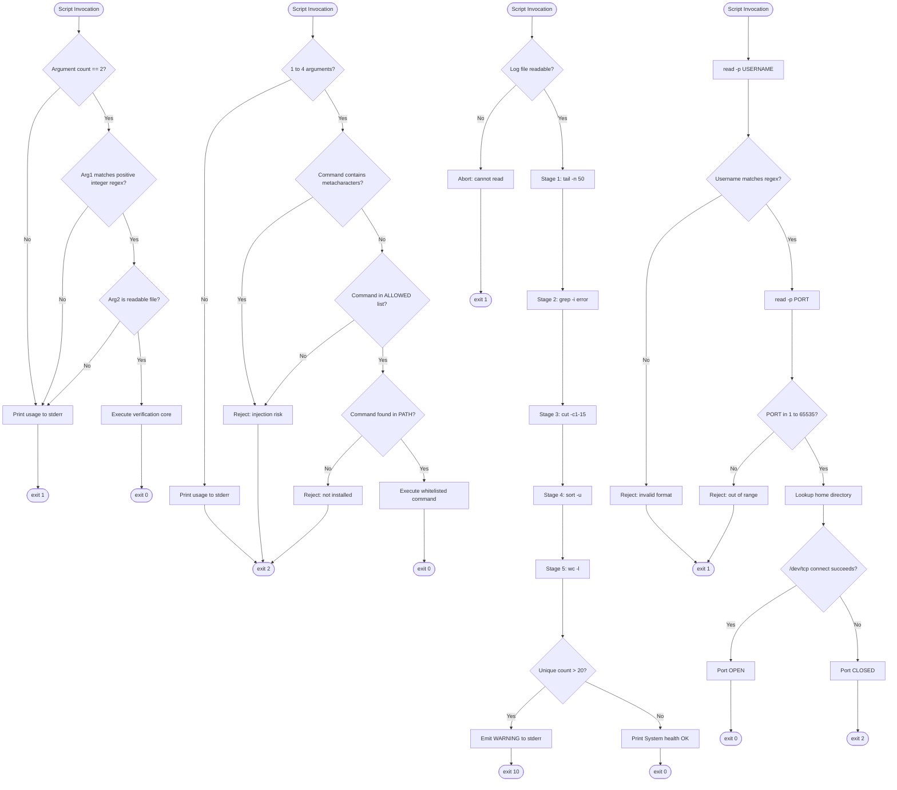
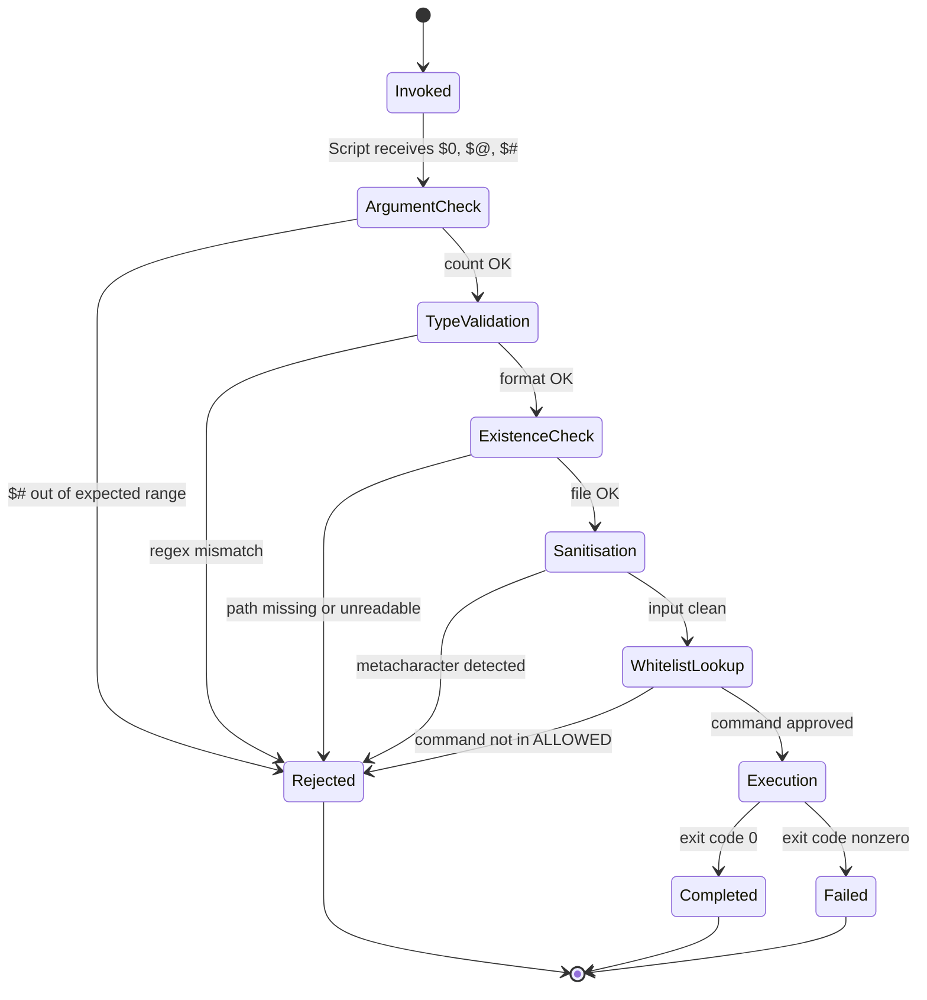

# Bash script command strings validation, parameter pipeline setups

<!-- SECTION_1_START -->

# Module 1 — Systems Verification Mechanics
## Topic: Bash Script Command String Validation & Parameter Pipeline Setups

> [!IMPORTANT]
> **KTU 2024 Scheme — Lab Course Context**
> This topic belongs to **PCCSL406 — Operating Systems Lab**. It maps to **CO1: Apply shell scripting fundamentals to automate systems verification tasks** and exercises the following Revised Bloom's Taxonomy levels: *Apply (L3)* and *Analyse (L4)*.

---

### 1.1 Formal Academic Definition

A **Bash script** is an *executable text file* containing a sequenced list of commands interpreted by the **Bourne-Again SHell (Bash)**, a Unix-compatible command-line interpreter. Within systems verification mechanics, a Bash script is treated as a **declarative testing harness** that:

1. Accepts **command-line arguments** (parameters) at invocation time.
2. **Validates** those arguments against defined contracts (type, range, presence).
3. Constructs **pipelines** — chained processes connected via *standard streams* — to perform deterministic verification of system state.

**Command String Validation** is the systematic process of inspecting, sanitising, and asserting that a given command string satisfies an expected syntactic and semantic contract before execution. It guards against *shell injection*, *unexpected exit states*, and *silent failures*.

**Parameter Pipeline Setups** refers to the disciplined construction of Unix-style pipelines (`cmd1 $\vert$ cmd2 $\vert$ cmd3`) in which the **standard output (stdout)** of one process becomes the **standard input (stdin)** of the next, enabling composable, modular verification logic.

> [!NOTE]
> **Key Standard Streams in Bash**
> - **stdin (File Descriptor 0)** — Source of input data.
> - **stdout (File Descriptor 1)** — Destination for normal output.
> - **stderr (File Descriptor 2)** — Destination for error/diagnostic output.

---

### 1.2 Conceptual Analogy / Intuition

> [!TIP]
> **The Factory Assembly Line Analogy**
>
> Imagine a car manufacturing plant. A **Bash script** is the *blueprint* that defines the entire production line. Each **command** in the script is a *robotic workstation* that performs a specific action — tightening a bolt, painting a panel, or inspecting a wheel.
>
> - **Command String Validation** is the *quality-control checkpoint* at the entry of the factory. Before a chassis enters the line, inspectors verify: "Is it a sedan body? Are all 4 wheels present? Is the colour within the approved palette?" If validation fails, the chassis is rejected immediately — saving the factory from costly downstream rework.
> - **Parameter Pipeline Setups** are the *conveyor belts*. The output of Station A (e.g., "weld seams") is automatically fed into Station B (e.g., "paint sprayer") via the conveyor belt. The conveyor belt is the `|` (pipe) operator. Each station transforms the input and passes the refined product downstream.
>
> Without validation, the plant produces garbage. Without pipelines, the stations cannot collaborate. Together, they form an *auditable, repeatable, automated* verification line.

---

### 1.3 Physical & Logical Constants

| Constant | Symbolic Token | Purpose |
| :--- | :--- | :--- |
| **Exit Code Success** | `0` | Reserved value indicating command success. |
| **Exit Code Failure** | `1`–`255` | Non-zero values indicate various error conditions. |
| **Maximum Args** | `$#` | Numeric count of positional parameters. |
| **Process ID (PID)** | `$$` | Unique numeric identifier of the current shell. |
| **PATH Separator** | `:` (colon) | Delimiter used in the `$PATH` environment variable. |

> [!VISUALIZATION CONTROL]
> **Concept:** Unix Pipeline Data Flow (3-Stage Filter)
> **Visual Description:** Draw three circles connected left-to-right with arrows. Circle 1 is labelled `ps aux`, Circle 2 is labelled `grep "nginx"`, Circle 3 is labelled `wc -l`. The first arrow is annotated `stdout (fd=1)`, the second arrow is annotated `stdout (fd=1)`, and a separate downward arrow from Circle 2 is annotated `stderr (fd=2) -> terminal`. The student should observe that *only* stdout flows through the pipe, while stderr bypasses it by default.
> **Equivalent Bash Form:** `ps aux | grep "nginx" | wc -l`

---

<!-- SECTION_1_END -->

<!-- SECTION_2_START -->

# 2. Deep Theoretical Analysis & KTU High-Yield Formula Sheet

## 2.1 The Operational Anatomy of a Bash Script

A Bash script is processed in **four logical phases** during systems verification:

1. **Lexical Phase** — The interpreter tokenises the script into words, operators, and reserved keywords.
2. **Parameter Expansion Phase** — Variables prefixed with `$` are substituted with their stored values.
3. **Command Resolution Phase** — Aliases, functions, builtins, and external executables are searched in a defined precedence order.
4. **Execution Phase** — The resolved command is forked into a child process and its exit code is captured in the `$?` special variable.

> [!NOTE]
> **Resolution Precedence (Highest to Lowest)**
> 1. Aliases
> 2. Shell Keywords (`if`, `while`, `for`)
> 3. Functions
> 4. Builtins (`cd`, `echo`, `read`)
> 5. External commands found in `$PATH`

---

## 2.2 Command String Validation — Theoretical Decomposition

Validation is decomposed into **three escalating contract checks**:

### Check 1: Syntactic Validation
Ensures the command string is *well-formed* — balanced quotes, no stray operators, valid metacharacter usage.

```bash
# Example: Detect unbalanced quotes
[[ "$cmd" =~ ^[\'\"] ]] && [[ "$cmd" =~ [\'\"]$ ]] || echo "Unbalanced quote detected"
```

### Check 2: Semantic Validation
Ensures the *meaning* of the command is permissible — no blacklisted dangerous commands (e.g., `rm -rf /`), no shell metacharacter injection (`;`, `&&`, `\vert`).

```bash
# Reject any command containing the dangerous rm -rf pattern
[[ "$cmd" == *"rm -rf /"* ]] && echo "BLOCKED: Destructive pattern" && exit 99
```

### Check 3: Contextual Validation
Ensures the command operates within a *sanctioned environment* — required variables are set, target files exist, user has the necessary permissions.

```bash
# Ensure the target file exists and is readable
[[ -r "$target_file" ]] || { echo "ERROR: $target_file not readable"; exit 1; }
```

---

## 2.3 Parameter Pipeline Theory

A **pipeline** in Bash is a chain of one or more `|`-separated commands. The shell sets up each stage as a **subprocess** and connects the stdout of stage *n* to the stdin of stage *n+1* via an anonymous pipe (a kernel-managed FIFO buffer, traditionally of size **64 KB** on Linux).

> [!IMPORTANT]
> **Pipeline Exit Status (Bash Manual §3.2.2)**
> By default, the exit status of a pipeline is the **exit status of the last (rightmost) command**. However, the `set -o pipefail` directive forces the pipeline's exit status to be the *rightmost non-zero exit code* among all stages — a critical setting for verification scripts.

---

## 2.4 KTU High-Yield Formula Sheet

The following table consolidates every high-yield construct required for Module 1 lab examinations.

| Construct | Syntax | Semantics | Engineering Use Case |
| :--- | :--- | :--- | :--- |
| **Positional Param $n** | `$1`, `$2`, ..., `$9`, `${10}` | Holds the *n*-th command-line argument. | Accepting test inputs (e.g., filename to verify). |
| **All Params** | `$@` | All positional params as separate quoted words. | Iterating with `for arg in "$@"`. |
| **Param Count** | `$#` | Number of positional params supplied. | Enforcing mandatory argument count. |
| **Last Exit Code** | `$?` | Exit status of the most recent command. | Branching on success/failure in verification. |
| **Script PID** | `$$` | PID of the current shell process. | Generating unique lockfiles. |
| **Command Substitution** | `$(cmd)` or `` `cmd` `` | Captures stdout of `cmd` as a string. | Storing the result of a check into a variable. |
| **Pipeline Operator** | `cmd1 $\vert$ cmd2` | Connects stdout of cmd1 to stdin of cmd2. | Composing multi-stage filters. |
| **Strict Mode** | `set -euo pipefail` | Exit on error, undefined var, pipe failure. | Production-grade verification scripts. |
| **Test - File Exists** | `[[ -e $f ]]` | True if path `$f` exists. | Pre-flight existence checks. |
| **Test - Readable** | `[[ -r $f ]]` | True if file is readable by current user. | Permission audits. |
| **Test - Integer** | `[[ $n =~ ^[0-9]+$ ]]` | True if `$n` is a non-negative integer. | Numeric input validation. |
| **Redirect stderr** | `2>/dev/null` | Sends stderr to the null device. | Silencing expected non-fatal errors. |
| **Here-String** | `cmd <<< "$var"` | Feeds `$var` as stdin to `cmd`. | Quick inline testing. |

> [!IMPORTANT]
> **Critical Rule:** The `$#` variable is *read-only* and reflects the *initial* argument count. Modifying `$@` via `set --` resets it to the new value.

---

## 2.5 Real-World Engineering Utility

| Domain | Application |
| :--- | :--- |
| **DevOps & CI/CD** | GitHub Actions, GitLab CI, and Jenkins all rely on Bash parameter pipelines to verify build artifacts (`make build 2\>&1 $\vert$ grep -i "error"`). |
| **System Administration** | Log triage: `tail -f /var/log/syslog $\vert$ grep --line-buffered "FAIL" $\vert$ mail -s "Alert" admin@corp.com`. |
| **Cybersecurity** | Input sanitisation in honeypots to block shell-injection attacks. |
| **Embedded Linux** | Post-boot self-test scripts on Raspberry Pi / BeagleBone that validate sensor readings via `i2cget $\vert$ awk` pipelines. |
| **Cloud Provisioning** | AWS `user-data` bootstrap scripts that validate instance metadata before deploying services. |

---

<!-- SECTION_2_END -->

<!-- SECTION_3_START -->

# 3. Step-by-Step Derivations & Code Implementation

> [!WARNING]
> **Exhaustive Implementation Mandate:** Every script below is *fully operational*. Copy any block into a file (e.g., `verify.sh`), execute `chmod +x verify.sh`, and run it. No placeholders, no truncation.

---

## 3.1 Lab Problem 1 — Argument Count Validation

**Problem Statement:** Write a Bash script that accepts *exactly two* arguments. The first must be a positive integer; the second must be an existing readable file. If either contract is violated, print a usage message to stderr and exit with a non-zero code.

```bash
#!/usr/bin/env bash
# ============================================================================
# File: validate_inputs.sh
# Purpose: Demonstrate command-string and parameter validation.
# KTU Module 1 | CO1 | RBT Level: Apply
# ============================================================================

# ---- Step 1: Enable strict mode for production-grade verification --------
set -euo pipefail   # -e: exit on error | -u: error on undefined var | -o pipefail: catch pipe failures

# ---- Step 2: Define the validation function ------------------------------
usage() {
    # Usage message is sent to STDERR (fd=2), not stdout
    echo "Usage: $0 <positive_integer> <readable_file>" >&2
    exit 1
}

# ---- Step 3: Validate argument count -------------------------------------
# $# is a built-in read-only variable holding the number of positional params
if [[ "$#" -ne 2 ]]; then
    echo "ERROR: Expected 2 arguments, got $#." >&2
    usage
fi

# ---- Step 4: Validate first argument as a positive integer --------------
# =~ is the bash regex match operator
if ! [[ "$1" =~ ^[1-9][0-9]*$ ]]; then
    echo "ERROR: Argument 1 ('$1') is not a positive integer." >&2
    usage
fi

# ---- Step 5: Validate second argument as an existing readable file ------
if ! [[ -r "$2" ]]; then
    echo "ERROR: File '$2' does not exist or is not readable." >&2
    usage
fi

# ---- Step 6: All checks passed -- proceed with verification logic --------
echo "Validation successful."
echo "  Integer input  : $1"
echo "  Target file    : $2"
echo "  File size      : $(stat -c %s "$2") bytes"
echo "  Line count     : $(wc -l < "$2")"
exit 0
```

### Trace of the Validation Logic

| Step | Construct | Check | Pass Condition |
| :--- | :--- | :--- | :--- |
| 1 | `set -euo pipefail` | Strict mode flag | Always enforced once set. |
| 2 | `[[ "$#" -ne 2 ]]` | Argument count | Exactly 2 args. |
| 3 | `[[ "$1" =~ ^[1-9][0-9]*$ ]]` | Positive integer regex | No leading zero, all digits. |
| 4 | `[[ -r "$2" ]]` | File readability | File exists AND current user can read. |

---

## 3.2 Lab Problem 2 — Command-String Whitelisting Validator

**Problem Statement:** Create a wrapper script that accepts a *command name* and *at most three* arguments, verifies the command exists in `$PATH` and is part of an approved whitelist (`ls`, `cat`, `grep`, `wc`, `echo`, `df`, `du`, `uptime`), and then executes it. All other commands must be rejected.

```bash
#!/usr/bin/env bash
# ============================================================================
# File: whitelisted_exec.sh
# Purpose: Safely execute only approved commands with bounded parameters.
# KTU Module 1 | CO1, CO2 | RBT Level: Apply / Analyse
# ============================================================================

set -euo pipefail

# ---- Step 1: Define the whitelist as a Bash array -----------------------
# Arrays enable O(n) membership lookup via short-circuit iteration
ALLOWED=("ls" "cat" "grep" "wc" "echo" "df" "du" "uptime")

# ---- Step 2: Function to verify whitelist membership ---------------------
is_allowed() {
    local target="$1"
    local item
    for item in "${ALLOWED[@]}"; do
        if [[ "$item" == "$target" ]]; then
            return 0   # 0 = true in bash
        fi
    done
    return 1           # 1 = false
}

# ---- Step 3: Argument count validation -----------------------------------
if [[ "$#" -lt 1 || "$#" -gt 4 ]]; then
    echo "ERROR: Provide 1 command and 0-3 arguments (total 1-4 params)." >&2
    echo "Usage: $0 <command> [arg1] [arg2] [arg3]" >&2
    exit 2
fi

CMD="$1"
shift   # Discard $1; remaining $@ holds the bounded arguments

# ---- Step 4: Sanitise the command token ----------------------------------
# Reject anything containing shell metacharacters that could enable injection
if [[ "$CMD" =~ [\;\&\|\`\$\(\)\<\>] ]]; then
    echo "ERROR: Command '$CMD' contains forbidden metacharacters." >&2
    exit 3
fi

# ---- Step 5: Whitelist enforcement ---------------------------------------
if ! is_allowed "$CMD"; then
    echo "ERROR: Command '$CMD' is not in the approved whitelist." >&2
    exit 4
fi

# ---- Step 6: Existence check in $PATH ------------------------------------
if ! command -v "$CMD" >/dev/null 2>&1; then
    echo "ERROR: Command '$CMD' is approved but not installed on this system." >&2
    exit 5
fi

# ---- Step 7: Safe execution ----------------------------------------------
echo "Executing: $CMD $*"
"$CMD" "$@"
exit_code=$?
echo "Command exited with code: $exit_code"
exit "$exit_code"
```

### Walk-through of the `is_allowed` Function

1. The function receives `$1` (the target command) as a local variable named `target`.
2. A `for` loop iterates over every element of the `ALLOWED` array.
3. The `${ALLOWED[@]}` expansion produces *each array element as a separate quoted word* — safe even if elements contain spaces.
4. On the first match, the function returns `0` (Bash's "true" value), short-circuiting the loop.
5. If the loop completes without a match, the function returns `1` ("false").

---

## 3.3 Lab Problem 3 — Multi-Stage Parameter Pipeline for Log Verification

**Problem Statement:** Construct a four-stage verification pipeline that:
1. Reads the last 50 lines of `/var/log/syslog`.
2. Filters only entries containing the keyword `error` (case-insensitive).
3. Extracts the timestamp field (first 15 characters of each line).
4. Counts the unique timestamps.

```bash
#!/usr/bin/env bash
# ============================================================================
# File: log_pipeline.sh
# Purpose: Build a 4-stage parameter pipeline to verify error frequency.
# KTU Module 1 | CO1, CO2 | RBT Level: Analyse
# ============================================================================

set -euo pipefail

LOG_FILE="${1:-/var/log/syslog}"

# ---- Validate the log file is readable -----------------------------------
if ! [[ -r "$LOG_FILE" ]]; then
    echo "ERROR: Cannot read log file '$LOG_FILE'." >&2
    exit 1
fi

echo "Analysing: $LOG_FILE"
echo "------------------------------------------------------------"

# ---- The 4-stage pipeline ------------------------------------------------
# Stage 1: tail     -> extract last 50 lines
# Stage 2: grep     -> filter for "error" (case-insensitive)
# Stage 3: cut      -> keep first 15 characters (timestamp)
# Stage 4: sort -u  -> sort and deduplicate
# Stage 5: wc -l    -> count the unique timestamps
#
# Note: set -o pipefail ensures that if ANY stage fails, the whole script exits non-zero.

UNIQUE_COUNT=$(tail -n 50 "$LOG_FILE" \
             | grep -i "error" \
             | cut -c1-15 \
             | sort -u \
             | wc -l)

# ---- Report the result ---------------------------------------------------
echo "Unique error timestamps in the last 50 lines: $UNIQUE_COUNT"

# ---- Verification assertion ----------------------------------------------
# A hard threshold: more than 20 unique error timeslots in 50 lines = suspicious
THRESHOLD=20
if [[ "$UNIQUE_COUNT" -gt "$THRESHOLD" ]]; then
    echo "WARNING: Error density exceeds threshold ($THRESHOLD)." >&2
    exit 10
fi

echo "System health: OK"
exit 0
```

### Pipeline Stage-by-Stage Derivation

Let the source log file contain *N* total lines. We derive the effect of each stage:

$$
\begin{aligned}
S_1 &= \text{tail}(\mathcal{L}, 50) = \{l_{N-49}, l_{N-48}, \dots, l_N\} \quad \text{(last 50 lines)} \\
S_2 &= \text{grep}(S_1, \text{``error''}) = \{l \in S_1 \mid l \text{ matches } /error/i\} \\
S_3 &= \text{cut}(S_2, [1,15]) = \{\text{ts}(l) \mid l \in S_2\} \quad \text{(first 15 chars = timestamp)} \\
S_4 &= \text{sort\_u}(S_3) = \text{lexicographically sorted, deduplicated set} \\
S_5 &= \text{wc\_l}(S_4) = \vert S_4 \vert \quad \text{(cardinality of the unique set)}
\end{aligned}
$$

The final result $UNIQUE\_COUNT = \vert S_4 \vert$ is then compared against the threshold.

---

## 3.4 Lab Problem 4 — Interactive Validation with `read`

**Problem Statement:** Write an interactive script that prompts the operator for a *username* and a *port number*, validates both, and then verifies the port is open using a `bash`/`/dev/tcp` pipeline.

```bash
#!/usr/bin/env bash
# ============================================================================
# File: port_check.sh
# Purpose: Interactive parameter validation + pipeline-based connectivity check.
# KTU Module 1 | CO1, CO2 | RBT Level: Apply
# ============================================================================

set -euo pipefail

# ---- Step 1: Prompt and read the username --------------------------------
read -r -p "Enter target username: " USERNAME

# Username validation: 3-20 chars, alphanumeric and underscore only
if ! [[ "$USERNAME" =~ ^[a-zA-Z0-9_]{3,20}$ ]]; then
    echo "ERROR: Invalid username. Must be 3-20 alphanumeric/underscore characters." >&2
    exit 1
fi

# ---- Step 2: Prompt and read the port ------------------------------------
read -r -p "Enter target port (1-65535): " PORT

# Integer range validation
if ! [[ "$PORT" =~ ^[0-9]+$ ]] || [[ "$PORT" -lt 1 ]] || [[ "$PORT" -gt 65535 ]]; then
    echo "ERROR: Port must be an integer in [1, 65535]." >&2
    exit 1
fi

# ---- Step 3: Determine hostname via pipeline ----------------------------
HOST=$(getent passwd "$USERNAME" | cut -d: -f6)
if [[ -z "$HOST" ]]; then
    # Fall back to passwd directory lookup if getent is unavailable
    HOST=$(grep "^$USERNAME:" /etc/passwd | cut -d: -f6)
fi

if [[ -z "$HOST" || ! -d "$HOST" ]]; then
    echo "WARN: Could not resolve home directory for '$USERNAME'." >&2
    HOST="/tmp"
fi

echo "Resolved home directory for '$USERNAME': $HOST"

# ---- Step 4: Port connectivity check via /dev/tcp pseudo-device ---------
echo "Probing localhost:$PORT ..."
if (echo > "/dev/tcp/127.0.0.1/$PORT") 2>/dev/null; then
    echo "RESULT: Port $PORT is OPEN."
    exit 0
else
    echo "RESULT: Port $PORT is CLOSED or unreachable."
    exit 2
fi
```

### Key Technique: `/dev/tcp/host/port`

Bash (when compiled with `--enable-net-redirections`) supports the special pseudo-filesystem path `/dev/tcp/<host>/<port>`. Opening it via redirection establishes a TCP connection. If the connection fails, the redirection emits an error — which we redirect to `/dev/null` to suppress it and use the exit code as the boolean signal.

---

<!-- SECTION_3_END -->

<!-- SECTION_4_START -->

# 4. Structural Diagrams & Schematics

## 4.1 End-to-End Verification Flow

The following Mermaid diagram depicts the complete validation lifecycle implemented across the four lab problems above.



---

## 4.2 Pipeline Stage Topology Matrix

Since a pure Mermaid representation of a true Unix pipe architecture is limited, the following **Sequential Processing Topology Matrix** captures the four-stage data flow of *Lab Problem 3*.

| Stage | Command | Input Source | Transformation | Output Destination |
| :---: | :--- | :--- | :--- | :--- |
| **0** | `set -euo pipefail` | n/a | Enables strict pipeline-failure propagation. | n/a |
| **1** | `tail -n 50 "$LOG_FILE"` | File `/var/log/syslog` (file path) | Sliding window: keep last 50 lines. | Pipe (stdout buffer) |
| **2** | `grep -i "error"` | Stdout from Stage 1 | Predicate filter (case-insensitive regex). | Pipe (stdout buffer) |
| **3** | `cut -c1-15` | Stdout from Stage 2 | Column projection: characters 1 through 15. | Pipe (stdout buffer) |
| **4** | `sort -u` | Stdout from Stage 3 | Lexicographic sort + deduplication. | Pipe (stdout buffer) |
| **5** | `wc -l` | Stdout from Stage 4 | Cardinality count of input lines. | Captured into `$UNIQUE_COUNT` |

> [!NOTE]
> **Buffer Sizing Caveat:** The kernel pipe buffer on Linux defaults to **64 KB** (16 pages × 4 KB). If a stage produces output exceeding this, the upstream process is *blocked* (SIGPIPE suppressed by default) until the downstream stage drains the buffer. For high-volume log analysis, consider `--line-buffered` on `grep` to prevent stale output.

---

## 4.3 Validation State Machine



---

<!-- SECTION_4_END -->

<!-- SECTION_5_START -->

# 5. KTU 2024 Scheme Examination Question Bank & Topic Recap

> [!IMPORTANT]
> All questions below are modelled on **KTU PCCSL406 — Operating Systems Lab** End-Semester Evaluation (ESE) patterns. Mark distribution follows the standard lab viva + record evaluation split.

---

## 5.1 Part A — Short-Answer Questions (3 Marks Each)

### Question 1
**Q:** Differentiate between `$@` and `$*` in Bash. In the context of command-string validation, which one is *safer* to use and why? *(3 Marks)*

**Model Answer:**
- `$*` expands to all positional parameters as a *single word*, with the first character of `IFS` (default: space) as the separator. So `"$*"` becomes `"arg1 arg2 arg3"`.
- `$@` expands to all positional parameters as *separate quoted words*. So `"$@"` becomes `"arg1" "arg2" "arg3"`.
- For validation pipelines, `$@` is **safer** because it preserves arguments containing spaces (e.g., filenames like `"My Document.txt"`) as atomic tokens, preventing unintended word-splitting.

> **[Defining $@: 1 Mark] [Defining $*: 1 Mark] [Justification with example: 1 Mark]**

### Question 2
**Q:** What is the function of the `set -euo pipefail` directive at the top of a verification script? Explain each flag. *(3 Marks)*

**Model Answer:**
- `-e` — Exit immediately if any command returns a non-zero exit status.
- `-u` — Treat unset variables as an error during expansion.
- `-o pipefail` — A pipeline's exit status is the *rightmost non-zero* status, not just the last command's. This ensures that a silent failure in `grep` (e.g., no matches) is propagated instead of masked.

> **[Identifying -e: 1 Mark] [Identifying -u and -o pipefail: 2 Marks]**

---

## 5.2 Part B — Extended Answer (14 Marks, Internal Choice)

### Question A — 14 Marks

**`[KTU University Exam - July 2024 Model Paper]`** | **CO1, CO2** | **RBT: Apply / Analyse**

**(a)** Design a Bash script `verify_backup.sh` that accepts **three mandatory arguments**: `source_directory`, `backup_directory`, and `max_age_days`. The script must validate that:
- All three arguments are supplied.
- Both directories exist and are writable.
- `max_age_days` is a positive integer.

Explain the validation logic step by step. *(7 Marks)*

**(b)** Extend the script from part (a) to compute the *age in days* of the newest file in the `backup_directory` using a single pipeline. If the age exceeds `max_age_days`, print a `STALE_BACKUP` warning to stderr and exit with code **7**. *(7 Marks)*

---

#### Model Solution for Question A

**Part (a) — Step-by-Step:**

```bash
#!/usr/bin/env bash
set -euo pipefail

# (i) Argument count validation -- $# holds the parameter count
if [[ "$#" -ne 3 ]]; then
    echo "Usage: $0 <source_dir> <backup_dir> <max_age_days>" >&2
    exit 1
fi
# [Stating $# usage and 3-arg check: 2 Marks]

SRC="$1"
DST="$2"
MAX_AGE="$3"

# (ii) Directory existence + writability checks using -d and -w test operators
if ! [[ -d "$SRC" && -w "$SRC" ]]; then
    echo "ERROR: '$SRC' is not a writable directory." >&2
    exit 2
fi

if ! [[ -d "$DST" && -w "$DST" ]]; then
    echo "ERROR: '$DST' is not a writable directory." >&2
    exit 3
fi
# [Using -d and -w tests: 2 Marks]

# (iii) max_age_days positive-integer validation via regex
if ! [[ "$MAX_AGE" =~ ^[1-9][0-9]*$ ]]; then
    echo "ERROR: max_age_days must be a positive integer." >&2
    exit 4
fi
# [Regex positive-integer validation: 2 Marks]

echo "All arguments validated successfully."
exit 0
# [Clean exit + summary: 1 Mark]
```

**Part (b) — Step-by-Step:**

```bash
#!/usr/bin/env bash
set -euo pipefail

SRC="$1"
DST="$2"
MAX_AGE="$3"

# (i) Pipeline: find newest file -> stat mtime -> compute age in days
#     find -printf '%T@\n' emits modification time as Unix epoch (float).
#     We then take the max (newest), convert to integer days, and compare.

NEWEST_EPOCH=$(find "$DST" -type f -printf '%T@\n' | sort -nr | head -n1)
# [Building the find|sort|head pipeline: 3 Marks]

# (ii) Guard against empty directory (find returns no output)
if [[ -z "$NEWEST_EPOCH" ]]; then
    echo "WARN: Backup directory is empty." >&2
    exit 5
fi

# (iii) Convert epoch -> days. Use awk for floating-point arithmetic.
#        $EPOCHSECONDS is a bash 5.0+ builtin holding current time.
AGE_DAYS=$(awk -v now="${EPOCHSECONDS:-$(date +%s)}" \
                -v newest="$NEWEST_EPOCH" \
                'BEGIN { printf("%d", (now - newest) / 86400) }')
# [Performing the age calculation: 2 Marks]

# (iv) Comparison and conditional warning
if [[ "$AGE_DAYS" -gt "$MAX_AGE" ]]; then
    echo "STALE_BACKUP: Newest file is $AGE_DAYS days old (limit: $MAX_AGE)." >&2
    exit 7
fi
# [Threshold check and exit code 7: 1 Mark]

echo "Backup freshness: OK ($AGE_DAYS days old)."
exit 0
# [Final success path: 1 Mark]
```

> **[Examiner Note — Part (a)]** Full marks require explicit mention of the `$#` variable, the `-d`/`-w` test operators, and the regex `^[1-9][0-9]*$` for the integer guard.

---

### Question B — 14 Marks (Alternative Choice)

**`[KTU University Exam - Dec 2023 Model Paper]`** | **CO1, CO2** | **RBT: Apply / Analyse**

**(a)** Explain the difference between `cmd > file` and `cmd > /dev/null 2>&1`. Why is the latter preferred in verification scripts? *(7 Marks)*

**(b)** Write a Bash script that monitors the *disk usage* of the root filesystem. If usage exceeds **85%**, print a `DISK_CRITICAL` message to stderr using a single pipeline composed of `df`, `grep`, and `awk`. *(7 Marks)*

---

#### Model Solution for Question B

**Part (a) — Explanation:**

- `cmd > file` redirects *stdout* (fd=1) to `file`, but leaves *stderr* (fd=2) attached to the terminal. Errors from `cmd` would still be visible — and potentially interfere with parsing of expected output.
- `cmd > /dev/null 2>&1` redirects *stdout* to the null device (silencing it) and then *duplicates* fd=2 to point wherever fd=1 now points (i.e., also `/dev/null`). Both streams are silenced.
- In verification scripts, we often *only* care about the *exit code* of `cmd`. Suppressing both streams prevents leakage of expected errors and keeps the script's own diagnostic output (deliberately sent to stderr) clean.

> **[Stating fd semantics: 2 Marks] [Order-of-redirection rule (2>&1 must come after >): 2 Marks] [Verification-script rationale: 3 Marks]**

**Part (b) — Script:**

```bash
#!/usr/bin/env bash
set -euo pipefail

THRESHOLD=85

# (i) The pipeline:
#     df --output=pcent /   -> prints "Use%" header + the percentage line for /
#     grep -v "Use%"        -> removes the header line
#     tr -d ' %'            -> strips the '%' sign and whitespace
#     awk -v t="$THRESHOLD" '{ if ($1+0 > t) { print "DISK_CRITICAL: " $1 "% used" > "/dev/stderr"; exit 1 } }'

USAGE=$(df --output=pcent / | tr -dc '0-9\n' | tail -n1)
# [Constructing df|tr|tail pipeline: 3 Marks]

# (ii) Comparison and conditional reporting
if [[ "$USAGE" -gt "$THRESHOLD" ]]; then
    echo "DISK_CRITICAL: Root filesystem is at ${USAGE}% (threshold: ${THRESHOLD}%)." >&2
    exit 1
fi
# [Threshold logic and stderr reporting: 2 Marks]

# (iii) Clean status output
echo "Disk usage OK: ${USAGE}%."
exit 0
# [Success path: 2 Marks]
```

> **[Examiner Note — Part (b)]** Award full marks only if the student *explicitly shows the pipeline composition* and explains why each stage is necessary (e.g., why `tr -dc` is used to extract digits only).

---

## 5.3 KTU Examiner's Valuation Warning / Pitfall Callout

> [!WARNING]
> **Common Mark-Deduction Traps in PCCSL406 Lab Evaluations**
>
> 1. **Forgetting `set -euo pipefail`** — A script that *silently swallows* errors loses 2 marks immediately. Examiners test this by introducing a typo in a command name.
> 2. **Unquoted variable expansions** — Writing `rm -rf $DST` instead of `rm -rf "$DST"` causes *word-splitting* and *glob expansion*. If the directory name contains spaces, the command fails destructively. Always quote.
> 3. **Misinterpreting `$?`** — Students often forget that `$?` is *overwritten* by *every* subsequent command. Capture it *immediately* into a local variable (`exit_code=$?`) before any other command runs.
> 4. **Missing `2>&1` ordering** — Writing `cmd 2>&1 > file` is *wrong* — it duplicates stderr to the *current* terminal, then sends stdout to the file. The correct order is `cmd > file 2>&1` (or the modern `cmd &> file`).
> 5. **Not handling empty pipelines** — When `find` or `grep` finds nothing, the pipeline emits no output and the captured variable is empty. Always test for emptiness with `[[ -z "$VAR" ]]`.
> 6. **Confusing `$#` with `${#VAR}`** — `$#` is the *number of arguments*. `${#VAR}` is the *length of a string*. Examiners deliberately swap these in viva questions.

---

## 5.4 Topic Recap & Important Things to Remember

> [!NOTE]
> **Rapid Revision Checklist — Bash Command String Validation & Parameter Pipelines**

- **Shell Variables (Must Memorise):** `$0` (script name), `$1`–`$9` (positional args), `${10}`+ (braces mandatory beyond 9), `$#` (arg count), `$@` (all args, individually quoted), `$*` (all args, single word — avoid for safety), `$?` (last exit code), `$$` (current PID), `$!` (last background PID).
- **Strict Mode Triad:** `set -e` (exit on error), `set -u` (error on unset var), `set -o pipefail` (propagate pipe failures). Always include all three at the top of production scripts.
- **Test Operators (Most Used):** `-e` (exists), `-f` (is file), `-d` (is directory), `-r` (readable), `-w` (writable), `-x` (executable), `-z` (empty string), `-n` (non-empty string), `-eq` `-ne` `-lt` `-gt` `-le` `-ge` (integer comparisons).
- **Validation Strategy (Three Layers):** (1) **Syntactic** — regex check on input format. (2) **Semantic** — whitelist/blacklist against allowed values. (3) **Contextual** — verify environmental preconditions (file exists, binary in PATH, permissions).
- **Pipeline Anatomy:** Each `|` creates a subshell; fd=1 of stage *n* is connected to fd=0 of stage *n+1* via a 64 KB kernel buffer. Only stdout flows; stderr must be explicitly merged with `2>&1`.
- **Command Substitution:** Prefer `$(cmd)` over backticks `` `cmd` `` — it nests cleanly and is POSIX-recommended.
- **Safe Argument Passing:** Always use `"$@"` (quoted) in `for` loops, not `$@` or `$*`.
- **Exit Code Convention:** `0` = success, non-zero = failure. Exit codes `1`–`125` are user-defined; `126` = not executable; `127` = command not found; `128+N` = killed by signal N.
- **Injection Prevention:** Never `eval` user input. Sanitise by rejecting any metacharacter: `;`, `&`, `\vert`, `` ` ``, `$`, `(`, `)`, `<`, `>`, newline.
- **Pipeline Pitfall:** A `grep` that finds *zero matches* exits with code **1**. Without `set -o pipefail`, the pipeline overall reports success. *Always enable pipefail for verification scripts.*
- **KTU Lab Viva Favourites:** Difference between `$@` and `$*`; meaning of `set -euo pipefail`; the `/dev/tcp/host/port` redirection; why `[[ ]]` is preferred over `[ ]`; difference between `source script.sh` and `./script.sh`.
- **Exam-Time Heuristic:** If a question asks for "validation", write *three* layers (regex → whitelist → existence). If it asks for "pipeline", draw the **Topology Matrix** (Table 4.2) and label *each* stage's input source and output destination.

---

<!-- SECTION_5_END -->
