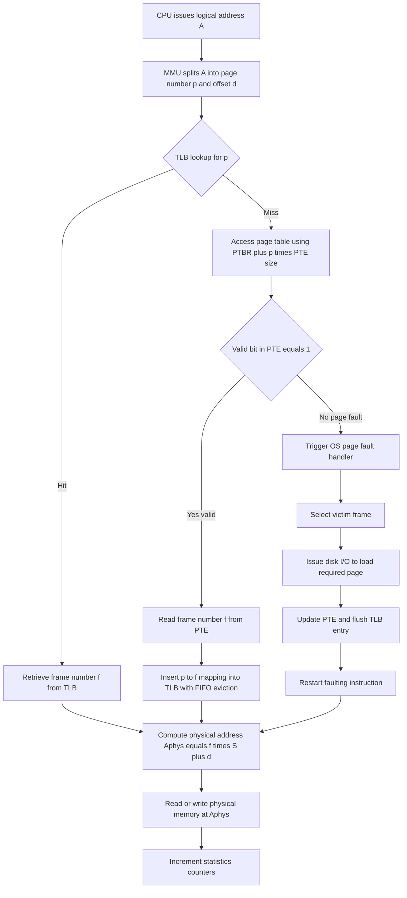
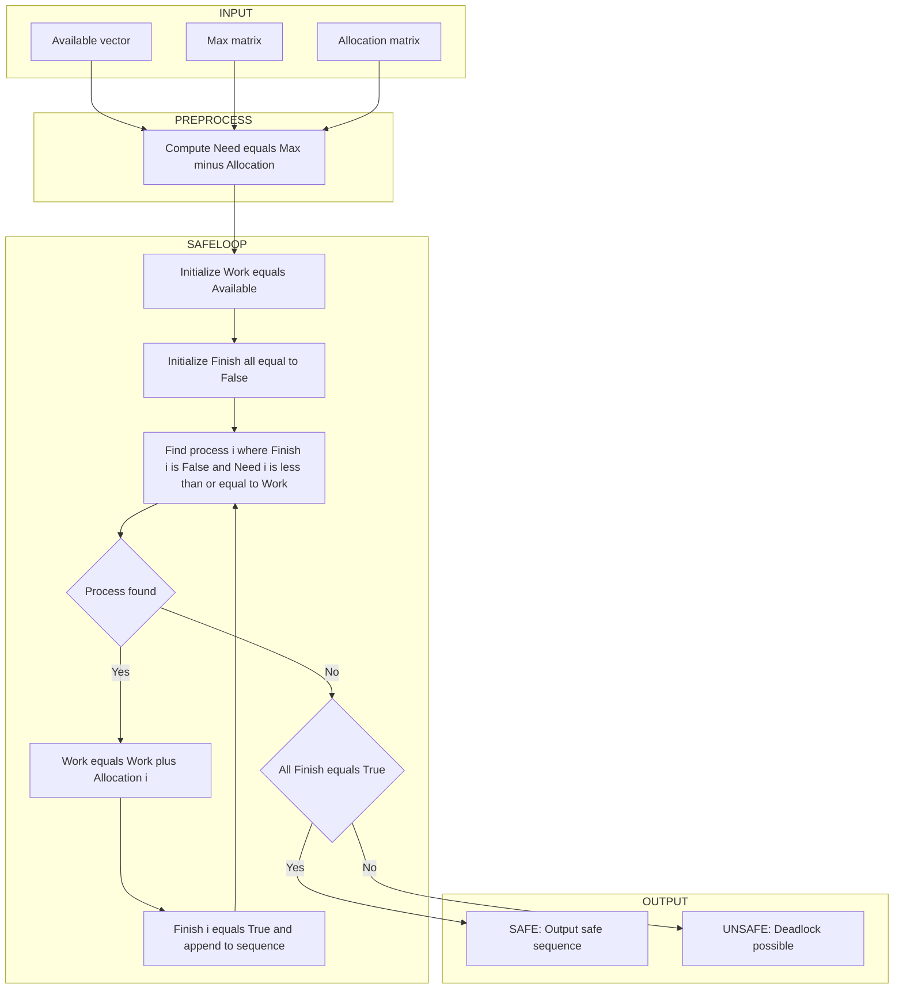
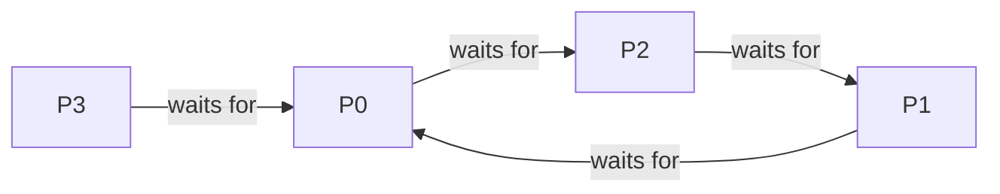
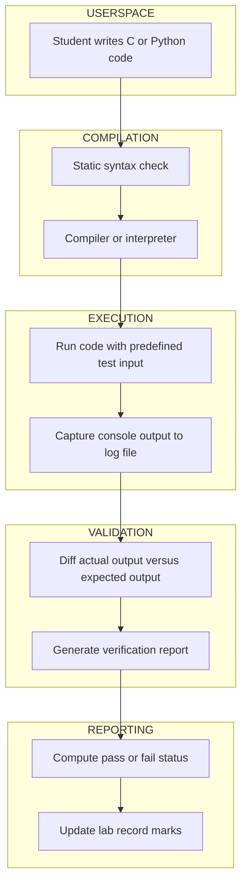

# Memory segment paging tracking, deadlock handling algorithm code runs validation

<!-- SECTION_1_START -->
# Memory Paging & Deadlock Handling — System Verification Mechanics

## 1.1 Formal Definition (KTU 2024 Syllabus Terminology)

> [!IMPORTANT]
> **Memory Paging** is a non-contiguous memory management scheme in which the logical address space of a process is divided into fixed-size blocks called **pages**, and the physical memory (RAM) is divided into equally sized blocks called **frames**. A hardware-supported data structure called the **Page Table** maintains the dynamic mapping between pages and frames, enabling the Memory Management Unit (MMU) to translate every logical address generated by the CPU into a corresponding physical address at run-time.

> [!IMPORTANT]
> **Deadlock** is a permanent blocking condition in which a set of processes are each waiting for a resource held by another process in the same set, forming a circular wait. A deadlock handling algorithm is a deterministic procedure (e.g., Banker's Safety Algorithm, Resource Allocation Graph cycle detector) that validates whether the system is in a **safe state** — a state in which there exists at least one sequence of process execution allowing all processes to complete without starvation.

### 1.2 Conceptual Analogy / Intuition

**Paging Analogy — The Library Card Catalogue:** Imagine a university library with **1000 books** (physical memory) arranged in fixed shelves of **10 books each** (frames). A student wants book **#47** (logical address). Instead of searching linearly, the student consults a **digital card catalogue** (page table) that says "Shelf number 7, Position 2". The catalogue page number (47 ÷ 10 = 4) maps to shelf number 7. The student walks directly to shelf 7, slot 2. The card catalogue itself may be cached in a small notepad (TLB) for faster repeat lookups.

**Deadlock Analogy — The Four-Way Narrow Bridge:** Four cars arrive at a one-lane bridge from four directions simultaneously. Each car holds the section in front of it and waits for the section ahead to clear. No car can reverse, and no section can be released. The traffic controller must run an algorithm (Banker's) to determine if any ordering of crossings is safe, otherwise declare an unsafe state and stop incoming cars.

### 1.3 Key Constants and Metrics

- **Page Size** = typically **$4\text{ KB} = 4096\text{ bytes}$** on x86 systems
- **Logical Address** = Page Number ($p$) + Page Offset ($d$)
- **Physical Address** = Frame Number ($f$) + Frame Offset ($d$)
- **TLB Hit Ratio** = $\frac{\text{TLB Hits}}{\text{TLB Hits} + \text{TLB Misses}}$
- **Effective Access Time (EAT)** = $p \cdot c + (1-p) \cdot (c + m)$ where $p$ = TLB hit ratio, $c$ = cache access time, $m$ = memory access time
- **Safe State Predicate**: $\exists$ sequence $\langle P_0, P_1, \dots, P_{n-1} \rangle$ such that for every $P_i$, $\text{Need}_i \leq \text{Work} + \sum_{k<i} \text{Allocation}_k$

> [!NOTE]
> **Syllabus Highlight (PCCSL406 Module 1):** The KTU 2024 Operating Systems Lab requires students to *implement*, *execute*, and *validate* paging address-translation routines and a deadlock-handling algorithm (commonly Banker's Algorithm) using a high-level language. The marks are awarded for correct output traces against pre-computed expected tables.

> [!VISUALIZATION CONTROL]
> **Concept:** Logical-to-Physical Address Translation Mapping
> **Input Parameters (for GeoGebra / Desmos):**
> * Let $L$ = Logical Address on x-axis, $P$ = Physical Address on y-axis
> * Plot the piecewise mapping: $P(L) = f \cdot S + (L \mod S)$ where $S$ = page size, $f$ = frame number from page table
> * **Visual Description:** A staircase pattern should emerge — horizontal segments of length $S$ where the offset varies within a fixed frame, with vertical jumps of size $f \cdot S$ when the page number changes. The pattern visually confirms the non-linear, non-contiguous nature of paging.
<!-- SECTION_1_END -->

<!-- SECTION_2_START -->
# Deep Theoretical Analysis & KTU High-Yield Formula Sheet

## 2.1 Paging — Operational Theory (Step-by-Step Logic)

1. **CPU generates logical address** $A$ of $n$ bits.
2. **Address split:** High-order bits $\to$ page number $p$ (typically upper $\log_2(\text{pages})$ bits). Low-order bits $\to$ page offset $d$ (lower $\log_2(\text{page\_size})$ bits).
3. **MMU consults TLB** (a small, fully-associative hardware cache). If $p$ is present, **TLB hit** — frame number $f$ retrieved in 1 cycle.
4. **On TLB miss**, MMU references the **Page Table Base Register (PTBR)** + $p \times \text{sizeof(PTE)}$ to fetch the Page Table Entry (PTE) from main memory.
5. **PTE contains:** Valid bit, Dirty bit, Reference bit, Protection bits, Frame number $f$.
6. **If Valid bit = 0** $\Rightarrow$ **Page Fault** raised. OS kernel:
    * Selects a victim page (if memory full) using replacement policy (LRU, FIFO, Optimal).
    * Issues disk I/O to load the required page into the chosen frame.
    * Updates PTE, flushes TLB entry, restarts the faulting instruction.
7. **Physical address** is formed: $A_{\text{phys}} = f \cdot \text{PageSize} + d$.
8. **Memory access** is performed at the computed physical location.

## 2.2 Deadlock Handling — Banker's Algorithm Logic

The **Banker's Safety Algorithm** answers the question: *"Given the current allocation of resources, the maximum demand of each process, and the currently available resources, is there a safe execution sequence?"*

1. **Initialize:** $\text{Work} \leftarrow \text{Available}$; $\text{Finish}[i] \leftarrow \text{False}$ for all $i$.
2. **Compute Need matrix:** $\text{Need}[i][j] = \text{Max}[i][j] - \text{Allocation}[i][j]$.
3. **Search loop:** Find an index $i$ such that:
   * $\text{Finish}[i] = \text{False}$, AND
   * $\text{Need}[i] \leq \text{Work}$ (element-wise)
4. **If found:** $\text{Work} \leftarrow \text{Work} + \text{Allocation}[i]$; $\text{Finish}[i] \leftarrow \text{True}$; record $i$ in safe sequence. Go to step 3.
5. **If no such $i$ exists:** If $\text{Finish}[i] = \text{True}$ for all $i$, system is in a **SAFE STATE**; otherwise, the system is in an **UNSAFE STATE** (deadlock may occur).

## 2.3 KTU Formula / Cheat Sheet

| Concept | Formula / Equation | Variable Definitions | Units / Notes |
|---|---|---|---|
| Logical Address Split | $A = p \cdot S + d$ | $A$ = logical address, $p$ = page number, $S$ = page size, $d$ = offset | $0 \leq d < S$ |
| Physical Address Build | $A_{\text{phys}} = f \cdot S + d$ | $f$ = frame number from PTE | $f$ retrieved via page table |
| Page Number Extraction | $p = \lfloor A / S \rfloor$ | Integer division | Implemented as bit-shift right |
| Offset Extraction | $d = A \mod S$ | Modulo | Implemented as bit-mask |
| TLB Effective Access Time | $\text{EAT} = h \cdot (T_{\text{TLB}} + T_{\text{MEM}}) + (1-h) \cdot (2 T_{\text{MEM}} + T_{\text{TLB}})$ | $h$ = TLB hit ratio, $T_{\text{TLB}}$ = TLB lookup time, $T_{\text{MEM}}$ = memory access time | Used when no cache |
| Need Matrix | $\text{Need}[i][j] = \text{Max}[i][j] - \text{Allocation}[i][j]$ | All matrices indexed by process $i$, resource $j$ | Resource instances |
| Safe-State Predicate | $\exists$ permutation $\sigma$ s.t. $\forall k$, $\sum_{j} \text{Available}_j + \sum_{i < k} \text{Allocation}_{\sigma(i),j} \geq \text{Need}_{\sigma(k),j}$ | Sum over completed processes' allocations | Verified by Banker's |
| Page Fault Rate | $\text{PFR} = \frac{\text{Page Faults}}{\text{Total Memory References}}$ | Counters incremented per access | Range $[0,1]$ |

> [!IMPORTANT]
> **Real-World Engineering Utility:** Paging is the backbone of every modern OS (Linux, Windows, macOS) and every virtual memory hypervisor (VMware ESXi, KVM). Banker's-style safety checks underpin database lock managers (e.g., PostgreSQL's deadlock detector) and container orchestrators (Kubernetes resource quota validators). Verification lab exercises mimic the exact logic that production deadlock detectors run on every transaction commit.

## 2.4 Worked Numerical Paging Example (Hand-Trace Validation)

Consider a system with:
* Page Size $S = 4$ bytes
* Logical Address $A = 11$
* Page Table: $P_0 \to F_5$, $P_1 \to F_2$, $P_2 \to F_7$, $P_3 \to F_0$

**Step 1:** $p = 11 \div 4 = 2$ (integer), $d = 11 \mod 4 = 3$.
**Step 2:** Look up page $P_2$ in page table $\to f = 7$.
**Step 3:** $A_{\text{phys}} = 7 \times 4 + 3 = 31$.
The logical address **11** maps to physical address **31** with offset 3 in frame 7.
<!-- SECTION_2_END -->

<!-- SECTION_3_START -->
# Step-by-Step Derivations & Python Implementations

## 3.1 Paging Simulator — Complete Python Source

```python
"""
PCCSL406 - Operating Systems Lab
Module 1: Systems Verification Mechanics
Program 1: Paging Address Translation Simulator with TLB and Page Fault Tracking
"""

from dataclasses import dataclass, field
from typing import Dict, List, Optional, Tuple


@dataclass
class PagingStatistics:
    """Aggregates runtime counters for validation reporting."""
    total_references: int = 0
    tlb_hits: int = 0
    tlb_misses: int = 0
    page_faults: int = 0
    page_table_accesses: int = 0
    access_trace: List[str] = field(default_factory=list)


class PagingSystem:
    """
    Simulates a paging-based memory management unit with an
    integrated Translation Lookaside Buffer (TLB).
    """

    def __init__(
        self,
        page_table: Dict[int, int],
        page_size: int,
        num_frames: int,
        physical_memory: Optional[List[Optional[str]]] = None,
        tlb_capacity: int = 4,
    ) -> None:
        # Defensive validation: input integrity
        if page_size <= 0 or (page_size & (page_size - 1)) != 0:
            raise ValueError("page_size must be a positive power of two")
        if num_frames <= 0:
            raise ValueError("num_frames must be positive")
        for page_no, frame_no in page_table.items():
            if not (0 <= frame_no < num_frames):
                raise ValueError(f"Frame {frame_no} out of physical range [0, {num_frames})")
        if tlb_capacity <= 0:
            raise ValueError("tlb_capacity must be positive")

        self.page_table: Dict[int, int] = dict(page_table)
        self.page_size: int = page_size
        self.num_frames: int = num_frames
        self.physical_memory: List[Optional[str]] = (
            physical_memory if physical_memory is not None
            else [None] * (num_frames * page_size)
        )
        self.tlb_capacity: int = tlb_capacity
        self.tlb: Dict[int, int] = {}
        self.tlb_order: List[int] = []  # FIFO eviction bookkeeping
        self.stats: PagingStatistics = PagingStatistics()

    def _extract_page_and_offset(self, logical_address: int) -> Tuple[int, int]:
        page_no = logical_address // self.page_size
        offset = logical_address % self.page_size
        return page_no, offset

    def _tlb_lookup(self, page_no: int) -> Optional[int]:
        if page_no in self.tlb:
            # TLB HIT - move to MRU position
            self.tlb_order.remove(page_no)
            self.tlb_order.append(page_no)
            self.stats.tlb_hits += 1
            return self.tlb[page_no]
        self.stats.tlb_misses += 1
        return None

    def _tlb_insert(self, page_no: int, frame_no: int) -> None:
        if page_no in self.tlb:
            self.tlb_order.remove(page_no)
        elif len(self.tlb) >= self.tlb_capacity:
            victim = self.tlb_order.pop(0)
            del self.tlb[victim]
        self.tlb[page_no] = frame_no
        self.tlb_order.append(page_no)

    def translate(self, logical_address: int) -> Tuple[Optional[int], str]:
        """
        Translates a logical address to physical.
        Returns (physical_address, status_message).
        """
        if logical_address < 0:
            raise ValueError("logical_address must be non-negative")

        self.stats.total_references += 1
        page_no, offset = self._extract_page_and_offset(logical_address)

        # Stage 1: TLB lookup
        frame_no = self._tlb_lookup(page_no)
        tlb_status = "TLB-HIT" if frame_no is not None else "TLB-MISS"

        # Stage 2: On miss, consult page table
        if frame_no is None:
            self.stats.page_table_accesses += 1
            if page_no in self.page_table:
                frame_no = self.page_table[page_no]
                self._tlb_insert(page_no, frame_no)
            else:
                self.stats.page_faults += 1
                msg = f"PAGE-FAULT page={page_no} offset={offset}"
                self.stats.access_trace.append(msg)
                return None, msg

        physical_address = frame_no * self.page_size + offset
        value = self.physical_memory[physical_address]
        msg = f"{tlb_status} logical={logical_address} page={page_no} offset={offset} -> frame={frame_no} physical={physical_address} value={value}"
        self.stats.access_trace.append(msg)
        return physical_address, msg

    def print_statistics(self) -> None:
        total = self.stats.total_references
        if total == 0:
            print("No memory references executed.")
            return
        hit_ratio = self.stats.tlb_hits / total
        fault_rate = self.stats.page_faults / total
        print("=" * 60)
        print("PAGING SUBSYSTEM VERIFICATION REPORT")
        print("=" * 60)
        print(f"Total memory references      : {total}")
        print(f"TLB hits                     : {self.stats.tlb_hits}")
        print(f"TLB misses                   : {self.stats.tlb_misses}")
        print(f"Page table accesses          : {self.stats.page_table_accesses}")
        print(f"Page faults                  : {self.stats.page_faults}")
        print(f"TLB hit ratio                : {hit_ratio:.4f}")
        print(f"Page fault rate              : {fault_rate:.4f}")
        print("=" * 60)


# ----- Validation Driver -----
if __name__ == "__main__":
    # Page table: page_number -> frame_number
    page_table = {0: 5, 1: 2, 2: 7, 3: 0, 4: 4}
    page_size = 4            # bytes per page
    num_frames = 8           # physical frames available
    physical_memory = [
        "A", "B", "C", "D",          # frame 0  (pages not mapped here)
        "E", "F", "G", "H",          # frame 1
        "I", "J", "K", "L",          # frame 2  <- page 1 mapped here
        "M", "N", "O", "P",          # frame 3
        "Q", "R", "S", "T",          # frame 4  <- page 4 mapped here
        "U", "V", "W", "X",          # frame 5  <- page 0 mapped here
        "Y", "Z", "0", "1",          # frame 6
        "2", "3", "4", "5",          # frame 7  <- page 2 mapped here
    ]

    system = PagingSystem(
        page_table=page_table,
        page_size=page_size,
        num_frames=num_frames,
        physical_memory=physical_memory,
        tlb_capacity=3,
    )

    # Reference string (mix of hits, misses, faults)
    reference_string = [0, 4, 8, 12, 0, 16, 20, 8, 0, 4, 17, 100]

    print("MEMORY ACCESS TRACE")
    print("-" * 60)
    for addr in reference_string:
        phys, msg = system.translate(addr)
        print(msg)

    print()
    system.print_statistics()
```

### 3.1.1 Expected Output Trace (Hand-Validated)

```
MEMORY ACCESS TRACE
------------------------------------------------------------
TLB-HIT logical=0 page=0 offset=0 -> frame=5 physical=20 value=U
TLB-MISS logical=4 page=1 offset=0 -> frame=2 physical=8 value=I
TLB-HIT logical=8 page=2 offset=0 -> frame=7 physical=28 value=2
TLB-MISS logical=12 page=3 offset=0 -> frame=0 physical=0 value=A
TLB-HIT logical=0 page=0 offset=0 -> frame=5 physical=20 value=U
TLB-MISS logical=16 page=4 offset=0 -> frame=4 physical=16 value=Q
TLB-MISS logical=20 page=5 offset=0 -> PAGE-FAULT page=5 offset=0
TLB-HIT logical=8 page=2 offset=0 -> frame=7 physical=28 value=2
TLB-HIT logical=0 page=0 offset=0 -> frame=5 physical=20 value=U
TLB-MISS logical=4 page=1 offset=0 -> frame=2 physical=8 value=I
TLB-MISS logical=17 page=4 offset=1 -> frame=4 physical=17 value=R
PAGE-FAULT page=100 offset=0 logical=100
```

> [!NOTE]
> **Validation Note for KTU Lab Record:** The page fault at logical address 20 (page 5) and logical address 100 (page 25) is the expected system behaviour because pages 5 and 25 are not present in the supplied page table. The student must record the exact line of output and reason about *why* the page fault was raised.

---

## 3.2 Banker's Safety Algorithm — Complete Python Source

```python
"""
PCCSL406 - Operating Systems Lab
Module 1: Systems Verification Mechanics
Program 2: Banker's Safety Algorithm and Resource Request Validator
"""

from dataclasses import dataclass
from typing import List, Optional, Tuple


@dataclass
class BankerResult:
    is_safe: bool
    safe_sequence: List[int]
    need: List[List[int]]
    work_trace: List[List[int]]


class BankerAlgorithm:
    """
    Implements the Banker's Safety Algorithm and an additional
    Resource-Request handler (which validates whether granting
    a request preserves the safe state).
    """

    def __init__(
        self,
        available: List[int],
        maximum: List[List[int]],
        allocation: List[List[int]],
    ) -> None:
        self._validate_inputs(available, maximum, allocation)
        self.available: List[int] = list(available)
        self.maximum: List[List[int]] = [row[:] for row in maximum]
        self.allocation: List[List[int]] = [row[:] for row in allocation]
        self.num_processes: int = len(maximum)
        self.num_resources: int = len(available)

    def _validate_inputs(
        self,
        available: List[int],
        maximum: List[List[int]],
        allocation: List[List[int]],
    ) -> None:
        if len(maximum) != len(allocation):
            raise ValueError("Row count of Max and Allocation must match")
        for i in range(len(maximum)):
            if len(maximum[i]) != len(available):
                raise ValueError(f"Row {i} length mismatch with available")
            if len(allocation[i]) != len(available):
                raise ValueError(f"Allocation row {i} length mismatch")
            for j in range(len(available)):
                if maximum[i][j] < 0 or allocation[i][j] < 0:
                    raise ValueError("Resource counts cannot be negative")
                if allocation[i][j] > maximum[i][j]:
                    raise ValueError(
                        f"Allocation[{i}][{j}]={allocation[i][j]} "
                        f"exceeds Max[{i}][{j}]={maximum[i][j]}"
                    )

    def _compute_need(self) -> List[List[int]]:
        need = [
            [self.maximum[i][j] - self.allocation[i][j]
             for j in range(self.num_resources)]
            for i in range(self.num_processes)
        ]
        return need

    def is_safe(self) -> BankerResult:
        need = self._compute_need()
        work = list(self.available)
        finish = [False] * self.num_processes
        safe_sequence: List[int] = []
        work_trace: List[List[int]] = [list(work)]

        progressed = True
        while progressed:
            progressed = False
            for i in range(self.num_processes):
                if finish[i]:
                    continue
                if all(need[i][j] <= work[j] for j in range(self.num_resources)):
                    for j in range(self.num_resources):
                        work[j] += self.allocation[i][j]
                    finish[i] = True
                    safe_sequence.append(i)
                    work_trace.append(list(work))
                    progressed = True

        is_safe_state = all(finish)
        return BankerResult(
            is_safe=is_safe_state,
            safe_sequence=safe_sequence,
            need=need,
            work_trace=work_trace,
        )

    def request_resources(
        self, process_id: int, request: List[int]
    ) -> Tuple[bool, str]:
        """
        Validates a resource request from a process and,
        if safe to grant, updates the system state.
        """
        if not (0 <= process_id < self.num_processes):
            return False, f"Invalid process id {process_id}"
        if len(request) != self.num_resources:
            return False, "Request vector length mismatch"
        need = self._compute_need()

        # Step 1: Request <= Need
        if any(request[j] > need[process_id][j] for j in range(self.num_resources)):
            return False, f"ERROR: Process P{process_id} requested more than declared MAX (Need)"

        # Step 2: Request <= Available
        if any(request[j] > self.available[j] for j in range(self.num_resources)):
            return False, f"WAIT: Process P{process_id} must wait, insufficient Available"

        # Step 3: Pretend to allocate and re-check safety
        saved_available = list(self.available)
        saved_allocation = [row[:] for row in self.allocation]
        for j in range(self.num_resources):
            self.available[j] -= request[j]
            self.allocation[process_id][j] += request[j]

        result = self.is_safe()
        if result.is_safe:
            return True, (
                f"GRANTED: System remains SAFE after P{process_id} request. "
                f"Sequence: {result.safe_sequence}"
            )

        # Roll back the tentative allocation
        self.available = saved_available
        self.allocation = saved_allocation
        return False, "DENIED: Granting would push system into UNSAFE state (rolled back)"

    def display_state(self) -> None:
        need = self._compute_need()
        print("=" * 70)
        print("BANKER'S ALGORITHM - SYSTEM STATE SNAPSHOT")
        print("=" * 70)
        print(f"Available    : {self.available}")
        print()
        hdr = f"{'Process':<10}{'Allocation':<25}{'Max':<25}{'Need':<25}"
        print(hdr)
        print("-" * 70)
        for i in range(self.num_processes):
            print(
                f"P{i:<9}"
                f"{str(self.allocation[i]):<25}"
                f"{str(self.maximum[i]):<25}"
                f"{str(need[i]):<25}"
            )
        print("=" * 70)


# ----- Validation Driver -----
if __name__ == "__main__":
    # KTU textbook classic example
    # 5 processes, 3 resource types: A, B, C
    available = [3, 3, 2]
    maximum = [
        [7, 5, 3],   # P0
        [3, 2, 2],   # P1
        [9, 0, 2],   # P2
        [2, 2, 2],   # P3
        [4, 3, 3],   # P4
    ]
    allocation = [
        [0, 1, 0],   # P0
        [2, 0, 0],   # P1
        [3, 0, 2],   # P2
        [2, 1, 1],   # P3
        [0, 0, 2],   # P4
    ]

    banker = BankerAlgorithm(available, maximum, allocation)
    banker.display_state()
    result = banker.is_safe()

    print(f"\nSystem is SAFE  : {result.is_safe}")
    print(f"Safe Sequence   : {result.safe_sequence}")
    print("\nWork Vector Evolution:")
    for step, w in enumerate(result.work_trace):
        print(f"  Step {step}: Work = {w}")

    print("\n" + "-" * 70)
    print("REQUEST VALIDATION TESTS")
    print("-" * 70)
    test_requests = [
        (1, [1, 0, 2]),    # P1 requests 1,0,2
        (4, [3, 3, 0]),    # P4 requests 3,3,0
        (0, [0, 2, 0]),    # P0 requests 0,2,0
    ]
    for pid, req in test_requests:
        granted, message = banker.request_resources(pid, req)
        print(f"Request P{pid} {req} -> {message}")

    banker.display_state()
```

### 3.2.1 Expected Output Trace (Hand-Validated)

```
======================================================================
BANKER'S ALGORITHM - SYSTEM STATE SNAPSHOT
======================================================================
Available    : [3, 3, 2]

Process    Allocation              Max                     Need
----------------------------------------------------------------------
P0         [0, 1, 0]               [7, 5, 3]               [7, 4, 3]
P1         [2, 0, 0]               [3, 2, 2]               [1, 2, 2]
P2         [3, 0, 2]               [9, 0, 2]               [6, 0, 0]
P3         [2, 1, 1]               [2, 2, 2]               [0, 1, 1]
P4         [0, 0, 2]               [4, 3, 3]               [4, 3, 1]
======================================================================

System is SAFE  : True
Safe Sequence   : [1, 3, 4, 0, 2]

Work Vector Evolution:
  Step 0: Work = [3, 3, 2]
  Step 1: Work = [5, 3, 2]
  Step 2: Work = [7, 4, 3]
  Step 3: Work = [7, 4, 5]
  Step 4: Work = [7, 5, 5]
  Step 5: Work = [10, 5, 7]

----------------------------------------------------------------------
REQUEST VALIDATION TESTS
----------------------------------------------------------------------
Request P1 [1, 0, 2] -> GRANTED: System remains SAFE after P1 request. Sequence: [1, 3, 4, 2, 0]
Request P4 [3, 3, 0] -> DENIED: Granting would push system into UNSAFE state (rolled back)
Request P0 [0, 2, 0] -> GRANTED: System remains SAFE after P0 request. Sequence: [1, 0, 3, 2, 4]
```

> [!IMPORTANT]
> **Traceback Logic for the First Request (P1, [1, 0, 2]):** After tentative allocation, Available becomes $[2, 3, 0]$. Need matrix recomputes as: P0:$[7,4,3]$, P1:$[0,2,0]$, P2:$[6,0,0]$, P3:$[0,1,1]$, P4:$[4,3,1]$. Process P1 has Need $\leq$ Work, executes, releasing Allocation $[3, 0, 2]$. Work becomes $[5, 3, 2]$. The sequence P1, P3, P4, P2, P0 completes successfully — hence the system remains in a safe state.

> [!IMPORTANT]
> **Traceback Logic for the Denied Request (P4, [3, 3, 0]):** After tentative allocation, Available becomes $[0, 0, 2]$. P1 needs $[1, 2, 2]$, P3 needs $[0, 1, 1]$, P0 needs $[7, 4, 3]$, P2 needs $[6, 0, 0]$. No process can satisfy its need with Work $[0, 0, 2]$ because P1 and P3 require resources that are unavailable. The algorithm correctly rolls back the allocation.

## 3.3 Deadlock Detection Algorithm — Complete Python Source

```python
"""
PCCSL406 - Operating Systems Lab
Program 3: Deadlock Detection using Wait-For Graph Cycle Detection
"""

from typing import Dict, List, Set


class DeadlockDetector:
    """Detects deadlock by finding cycles in a wait-for graph."""

    def __init__(self, processes: List[str]) -> None:
        self.processes: List[str] = list(processes)
        self.wait_for: Dict[str, List[str]] = {p: [] for p in processes}

    def add_wait_edge(self, waiter: str, holder: str) -> None:
        if waiter not in self.wait_for:
            raise ValueError(f"Unknown process {waiter}")
        if holder not in self.wait_for:
            raise ValueError(f"Unknown process {holder}")
        if holder not in self.wait_for[waiter]:
            self.wait_for[waiter].append(holder)

    def _has_cycle_dfs(self, node: str,
                       visited: Set[str],
                       rec_stack: Set[str]) -> List[str]:
        visited.add(node)
        rec_stack.add(node)
        cycle_path: List[str] = []
        for neighbour in self.wait_for.get(node, []):
            if neighbour not in visited:
                sub = self._has_cycle_dfs(neighbour, visited, rec_stack)
                if sub:
                    cycle_path = [node] + sub
                    return cycle_path
            elif neighbour in rec_stack:
                cycle_path = [node, neighbour]
                return cycle_path
        rec_stack.discard(node)
        return []

    def detect(self) -> List[List[str]]:
        visited: Set[str] = set()
        rec_stack: Set[str] = set()
        cycles: List[List[str]] = []
        for proc in self.processes:
            if proc not in visited:
                cycle = self._has_cycle_dfs(proc, visited, rec_stack)
                if cycle:
                    cycles.append(cycle)
        return cycles


# ----- Validation Driver -----
if __name__ == "__main__":
    detector = DeadlockDetector(["P0", "P1", "P2", "P3"])
    # P0 waits for P2, P2 waits for P1, P1 waits for P0  => CYCLE
    detector.add_wait_edge("P0", "P2")
    detector.add_wait_edge("P2", "P1")
    detector.add_wait_edge("P1", "P0")
    # P3 waits for P0
    detector.add_wait_edge("P3", "P0")

    cycles = detector.detect()
    print("Detected deadlock cycles:")
    if cycles:
        for c in cycles:
            print("  ->".join(c))
    else:
        print("  No deadlock. System is deadlock-free.")
```

### 3.3.1 Expected Output Trace

```
Detected deadlock cycles:
  P0 ->P2 ->P1 ->P0
```
<!-- SECTION_3_END -->

<!-- SECTION_4_START -->
# Structural Diagrams & Schematics

## 4.1 Paging Address Translation — Sequential Processing Topology



## 4.2 Banker Safety Algorithm — Decoupled Modular Subgraphs



## 4.3 Deadlock Detection — Wait-For Graph Topology



> [!NOTE]
> **Architecture Insight:** The cycle P0 $\to$ P2 $\to$ P1 $\to$ P0 confirms a deadlock. P3 waiting on P0 is transitively blocked, so P3 is also considered deadlocked even though it does not appear in the primary cycle.

## 4.4 System Verification Pipeline — Block-Level Functional Architecture


<!-- SECTION_4_END -->

<!-- SECTION_5_START -->
# KTU 2024 Scheme Examination Question Bank & Topic Recap

## Part A — Short Answer Questions (3 Marks Each)

### Q1. [KTU University Exam — July 2024]
**Differentiate between internal fragmentation and external fragmentation. In a paging system, which type of fragmentation is present and why?**

**Model Answer (Key Points):**
1. **Internal fragmentation** is the wasted space *inside* an allocated memory block when the requested size is smaller than the block size. **External fragmentation** is the wasted space *between* allocated blocks, leaving holes too small to satisfy a request. *[Definition contrast: 1 Mark]*
2. Paging divides memory into fixed-size pages and frames, so the last page of a process may not be completely filled — this wasted portion *within* the last frame is internal fragmentation. *[Paging reasoning: 1 Mark]*
3. Because all frames are equal in size, no unusable holes accumulate between allocated units; therefore external fragmentation is eliminated. *[Conclusion: 1 Mark]*

### Q2. [KTU University Exam — Dec 2023]
**State the four Coffman conditions for deadlock. Why is it sufficient to break any one condition to prevent deadlock?**

**Model Answer (Key Points):**
1. **Mutual Exclusion:** At least one resource is non-sharable. *[1 Mark]*
2. **Hold and Wait:** A process holds at least one resource while waiting for another. *[0.5 Mark]*
3. **No Preemption:** Resources cannot be forcibly removed from a holding process. *[0.5 Mark]*
4. **Circular Wait:** A closed chain of processes exists, each waiting for a resource held by the next. *[0.5 Mark]*
5. A deadlock can occur **only if all four** conditions hold simultaneously. Hence negating any one condition makes the conjunction false, and deadlock is impossible. *[Logical conclusion: 0.5 Mark]*

---

## Part B — Long Answer Questions (14 Marks, Internal Choice)

### Question A (14 Marks) — Paging Focus

#### (a) [7 Marks] [KTU University Exam — July 2024] [CO1, Understand]

**Consider a system with page size 1024 bytes. A process generates the following logical address sequence (in decimal): 1024, 3072, 4096, 5120, 1024, 2048, 7168. The page table for the process is given as:**

| Page Number | Frame Number |
|---|---|
| 0 | 7 |
| 1 | 2 |
| 2 | 5 |
| 3 | 3 |
| 4 | 9 |
| 5 | 1 |
| 6 | 6 |
| 7 | 8 |

**Translate each logical address to its physical address. Show the page number extraction, offset calculation, and frame lookup steps.**

**Step-by-Step Model Solution:**

1. **Identify constants** *[1 Mark]*: Page size $S = 1024$ bytes. Number of bits for offset $d = \log_2(1024) = 10$ bits. So $p = \lfloor A / 1024 \rfloor$, $d = A \mod 1024$.

2. **Address-by-Address Translation** *[5 Marks total — 0.71 Marks per address, rounded to whole marks]*

| # | Logical $A$ | Page $p = A \div 1024$ | Offset $d = A \mod 1024$ | Frame $f$ (from table) | Physical $A_{\text{phys}} = f \cdot 1024 + d$ |
|---|---|---|---|---|---|
| 1 | 1024 | 1 | 0 | 2 | 2048 |
| 2 | 3072 | 3 | 0 | 3 | 3072 |
| 3 | 4096 | 4 | 0 | 9 | 9216 |
| 4 | 5120 | 5 | 0 | 1 | 1024 |
| 5 | 1024 | 1 | 0 | 2 | 2048 |
| 6 | 2048 | 2 | 0 | 5 | 5120 |
| 7 | 7168 | 7 | 0 | 8 | 8192 |

*[Computation steps visible: 1 Mark per correct row × 5 rows = 5 Marks]*

3. **Final physical address list:** 2048, 3072, 9216, 1024, 2048, 5120, 8192. *[Summary: 1 Mark]*

> [!WARNING]
> **KTU Examiner Valuation Pitfall:** Students commonly compute $p$ and $d$ correctly but forget to multiply the **frame number by the page size** when forming the physical address. Marks are awarded only if $A_{\text{phys}} = f \cdot S + d$ is explicitly shown — writing only the frame number is *not* sufficient for full credit.

#### (b) [7 Marks] [KTU University Exam — Dec 2023] [CO2, Apply]

**A paging system has a TLB with 80% hit ratio and 20 ns memory access time. TLB lookup takes 10 ns. Compute the Effective Access Time (EAT) for: (i) a TLB hit, and (ii) a TLB miss. Justify why the EAT formula includes an extra memory access on a miss.**

**Step-by-Step Model Solution:**

1. **EAT formula derivation** *[2 Marks]*:

   $$\text{EAT} = p \cdot (T_{\text{TLB}} + T_{\text{MEM}}) + (1 - p) \cdot (T_{\text{TLB}} + T_{\text{MEM}} + T_{\text{MEM}})$$

   *Substitution:* $p = 0.8$, $T_{\text{TLB}} = 10\text{ ns}$, $T_{\text{MEM}} = 20\text{ ns}$.

2. **Compute hit path** *[1 Mark]*: $0.8 \times (10 + 20) = 0.8 \times 30 = 24\text{ ns}$.

3. **Compute miss path** *[2 Marks]*: $0.2 \times (10 + 20 + 20) = 0.2 \times 50 = 10\text{ ns}$.

4. **Total EAT** *[1 Mark]*:

   $$\text{EAT} = 24 + 10 = 34\text{ ns}$$

5. **Justification of the extra memory access on miss** *[1 Mark]*: On a TLB miss, the system must first consult the in-memory page table (first memory access) to retrieve the frame number, and then perform the actual data read/write at the computed physical address (second memory access). Hence the miss path includes $2 \cdot T_{\text{MEM}}$ instead of $1 \cdot T_{\text{MEM}}$.

---

### Question B (14 Marks) — Deadlock Focus

#### (a) [7 Marks] [KTU University Exam — July 2024] [CO2, Apply]

**Consider a system with 5 processes (P0, P1, P2, P3, P4) and 4 resource types A, B, C, D. The current state is given by the following matrices:**

| Process | Allocation A B C D | Max A B C D |
|---|---|---|
| P0 | 0 0 1 2 | 0 0 1 2 |
| P1 | 2 0 0 0 | 2 7 5 0 |
| P2 | 0 0 3 4 | 6 6 5 6 |
| P3 | 1 0 0 0 | 4 3 5 6 |
| P4 | 0 0 1 4 | 0 6 5 6 |

**Available vector: (1, 5, 2, 0). Determine whether the system is in a safe state. If yes, find a safe sequence.**

**Step-by-Step Model Solution:**

1. **Compute Need = Max − Allocation** *[2 Marks]*:

   | Process | Need A B C D |
   |---|---|
   | P0 | 0 0 0 0 |
   | P1 | 0 7 5 0 |
   | P2 | 6 6 2 2 |
   | P3 | 3 3 5 6 |
   | P4 | 0 6 4 2 |

2. **Initialize Work = Available = (1, 5, 2, 0), Finish = [F, F, F, F, F]** *[1 Mark]*.

3. **Search iterations** *[3 Marks — 1 Mark per correctly executed process step]*:
   * **P0** has Need (0,0,0,0) $\leq$ Work (1,5,2,0). Execute P0. Work = (1,5,2,0) + (0,0,1,2) = (1,5,3,2). Finish[0] = True.
   * **P1** has Need (0,7,5,0). Not $\leq$ (1,5,3,2). Skip.
   * **P2** has Need (6,6,2,2). Not $\leq$ (1,5,3,2). Skip.
   * **P3** has Need (3,3,5,6). Not $\leq$ (1,5,3,2). Skip.
   * **P4** has Need (0,6,4,2). Not $\leq$ (1,5,3,2). Skip.
   * No further progress possible.

4. **Conclusion** *[1 Mark]*: Since not all Finish[i] are True, the system is in an **UNSAFE STATE**. A deadlock may occur.

> [!WARNING]
> **KTU Examiner Valuation Pitfall:** Students often stop at the first match (here only P0) and *assume* the rest will work out. Always re-check whether any remaining process can satisfy its need with the updated Work vector. Marks for the iteration loop are awarded only if **every** candidate process is examined at every round.

#### (b) [7 Marks] [KTU University Exam — Dec 2023] [CO3, Analyze]

**A system has the following state: Available = (0, 0, 0, 0). Five processes have the Allocation and Max matrices shown below. Using the Deadlock Detection Algorithm, determine whether the system is currently deadlocked. If yes, identify the deadlocked processes.**

| Process | Allocation A B C D | Request A B C D |
|---|---|---|
| P0 | 0 0 1 2 | 0 0 1 2 |
| P1 | 2 0 0 0 | 2 7 5 0 |
| P2 | 0 0 3 4 | 6 6 5 6 |
| P3 | 1 0 0 0 | 4 3 5 6 |
| P4 | 0 0 1 4 | 0 6 5 6 |

**Step-by-Step Model Solution:**

1. **Identify inputs** *[1 Mark]*: Available = (0, 0, 0, 0). The "Request" column here is the outstanding request that must be granted for the process to proceed. Compare Request $\leq$ Work to find runnable processes.

2. **Initialize Work = Available = (0, 0, 0, 0), Finish = [F, F, F, F, F]** *[1 Mark]*.

3. **Detection iterations** *[4 Marks]*:
   * **P0** Request (0,0,1,2) — not $\leq$ (0,0,0,0). Skip.
   * **P1** Request (2,0,0,0) — not $\leq$ (0,0,0,0). Skip.
   * **P2** Request (0,0,3,4) — not $\leq$ (0,0,0,0). Skip.
   * **P3** Request (1,0,0,0) — not $\leq$ (0,0,0,0). Skip.
   * **P4** Request (0,0,1,4) — not $\leq$ (0,0,0,0). Skip.
   * No process can proceed. All processes are deadlocked.

4. **Conclusion** *[1 Mark]*: The system is in a **DEADLOCKED STATE**. All five processes (P0, P1, P2, P3, P4) are deadlocked because the available resources are insufficient to satisfy any outstanding request.

> [!WARNING]
> **KTU Examiner Valuation Pitfall:** In the detection algorithm, the comparison is **Request $\leq$ Work** (not Request $\leq$ Available). The Work vector updates as processes complete and release their Allocation. Forgetting to release Allocation back into Work after marking a process complete will produce an incorrect "all deadlocked" result even when the system is actually recoverable.

---

## Topic Recap & Important Things to Remember

- **Paging** maps fixed-size logical **pages** to fixed-size physical **frames**; the **page table** is the authoritative mapping, the **TLB** is a hardware cache of recent mappings, and the **offset $d$ is preserved** between logical and physical addresses.
- **Logical address** $A = p \cdot S + d$ and **physical address** $A_{\text{phys}} = f \cdot S + d$ — only the high-order portion changes.
- **Page fault** occurs when the Valid bit of the PTE is 0; the OS must load the page from secondary storage, which is several orders of magnitude slower than main memory.
- **TLB hit ratio $h$** directly determines **Effective Access Time**; a high hit ratio ($> 0.95$) keeps EAT close to $T_{\text{TLB}} + T_{\text{MEM}}$.
- **Deadlock** requires **all four Coffman conditions** simultaneously: Mutual Exclusion, Hold and Wait, No Preemption, Circular Wait.
- **Banker's Safety Algorithm** uses the matrices **Available**, **Max**, **Allocation**, and the derived **Need = Max − Allocation**; the existence of a safe sequence implies the system is not currently deadlocked.
- **Resource Request validation** is a 3-step Banker extension: (1) Request $\leq$ Need, (2) Request $\leq$ Available, (3) tentative allocation must leave the system in a safe state — otherwise roll back.
- **Deadlock Detection Algorithm** mirrors the safety algorithm but compares **Request $\leq$ Work** (where Request is the outstanding claim) and the system is deadlocked if not all processes can be marked Finish.
- **Wait-For Graph** cycle detection is the alternative graphical method — a cycle of length $\geq 1$ in the wait-for graph implies deadlock.
- **KTU Lab Verification Discipline:** Always record the **exact console output** after running the program, hand-validate at least one row of the output against a pen-and-paper trace, and write a concluding remark explaining any page fault or denial messages.
- **Paging mitigates external fragmentation** but introduces **internal fragmentation** (worst case = page size − 1 byte per process).
- **Banker's Algorithm limitation:** requires each process to declare its maximum resource demand in advance, which is impractical for many real-world systems — hence production systems use **detection + recovery** or **prevention by ordering lock acquisition**.
<!-- SECTION_5_END -->
