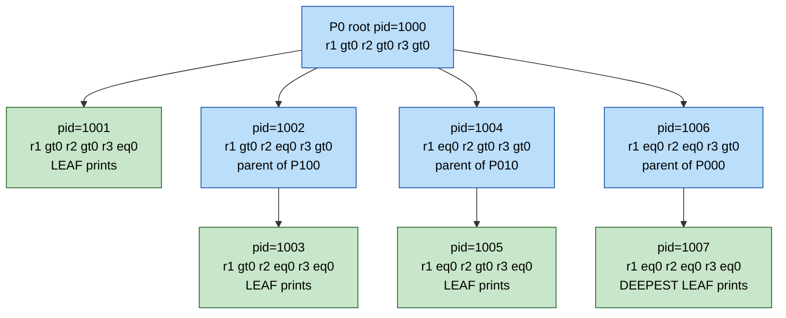
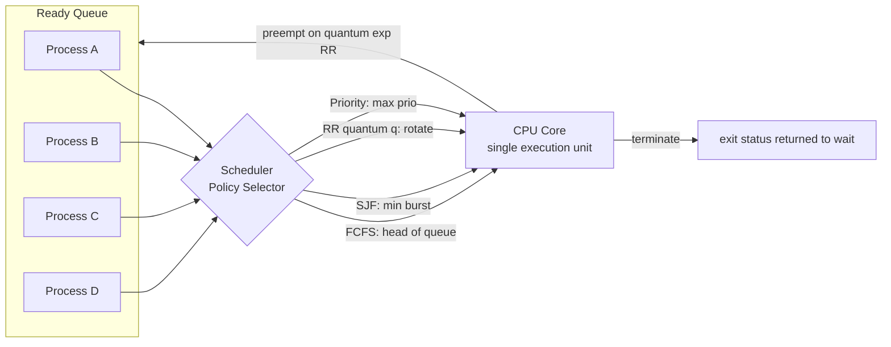
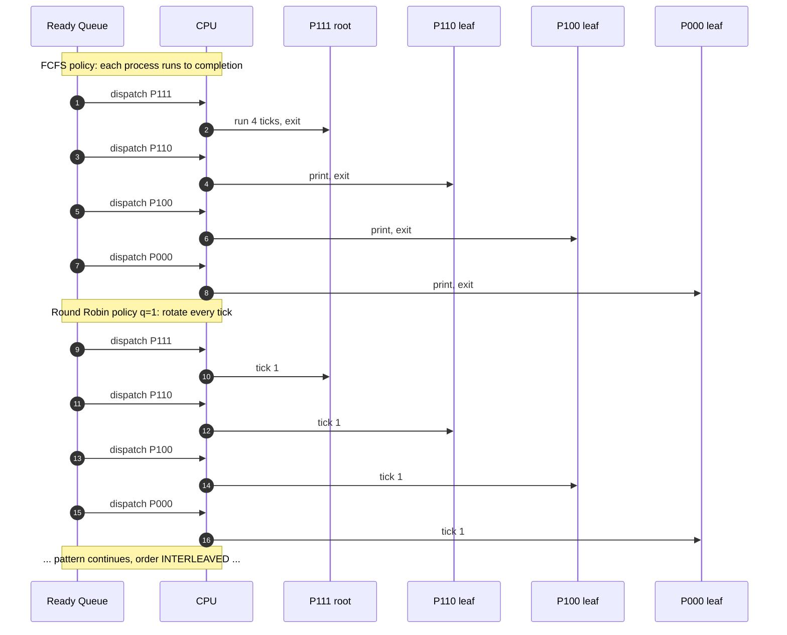
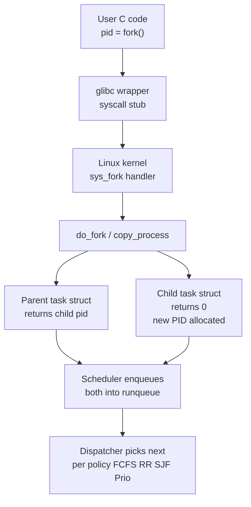

# Process fork mapping, execution tree tracking under changing scheduler rules

<!-- SECTION_1_START -->

# Process Fork Mapping & Execution Tree Tracking under Changing Scheduler Rules

## 1.1 Formal Definition (KTU 2024 Lab Terminology)

> [!IMPORTANT]
> **Process Fork Mapping** is the systematic construction of a directed acyclic graph (DAG) — called a **Process Genesis Tree** — that records parent-child relationships produced by the UNIX `fork()` system call, annotating every node with its `pid`, `ppid`, return value, and final termination status.

> [!NOTE]
> **Execution Tree Tracking** is the discipline of *deterministically simulating* how the kernel scheduler will dispatch each node of the genesis tree onto the CPU under a specific scheduling policy (FCFS, SJF, Priority, Round Robin) and recording the *interleaved* stream of `printf` / `write` outputs.

| **Symbol**        | **Meaning**                                | **POSIX Header** |
| :---------------: | :----------------------------------------- | :--------------: |
| `pid_t`           | Signed integer type for process IDs        | `<sys/types.h>`  |
| `fork()`          | Clones the calling process                 | `<unistd.h>`     |
| `getpid()`        | Returns the calling process's PID          | `<unistd.h>`     |
| `getppid()`       | Returns the parent process's PID           | `<unistd.h>`     |
| `wait(&status)`   | Blocks parent until any child terminates   | `<sys/wait.h>`   |
| `exit(code)`      | Terminates a process and returns a status   | `<stdlib.h>`     |

> **KTU 2024 Standard Constants to Memorise:**
> * `fork()` return value in the **parent** $\rightarrow$ `> 0` (the child's PID)
> * `fork()` return value in the **child**  $\rightarrow$ exactly `0`
> * `fork()` return value on **failure**   $\rightarrow$ `-1` (no child created, `errno` set)

---

## 1.2 Conceptual Analogy — The "Photocopy Machine"

Imagine a single chef (the **parent process**) standing at a kitchen counter with a recipe card. The chef presses a button on a magical photocopy machine (`fork()`):

* The machine instantly creates a **perfect clone** of the chef standing in the next aisle — this clone is the **child process**.
* The machine then hands each chef a small post-it note:
  * Original chef's note reads: *"You are the **parent**. The clone's ID is `2478`."* → `fork() returns 2478`
  * Clone chef's note reads: *"You are the **child**. Your parent's ID is `1024`."* → `fork() returns 0`
* Both chefs now proceed **independently** through the rest of the recipe from the *exact same line number*. They do not synchronise unless they choose to.

> [!TIP]
> The post-it note is the **return value of `fork()`** — it is the *only* programmatic way for a process to discover which "copy" of itself it is. This is why `if (pid == 0)` and `else` blocks become the universal pattern.

---

## 1.3 Scheduler Rules — Plain English

A *scheduler rule* is the kernel's policy for choosing the **next** runnable process when the CPU becomes free. In the KTU OS Lab, the four policies you must simulate are:

| **Policy**                | **Dispatch Rule (one line)**                                         |
| :-----------------------: | :------------------------------------------------------------------- |
| **FCFS** (Non-preemptive) | The process that arrived in the ready queue *first* runs to finish. |
| **SJF** (Non-preemptive)  | The process with the *shortest* total burst runs to finish.          |
| **Priority**              | The process with the *highest* priority number runs to finish.       |
| **Round Robin** (quantum $q$) | Each runnable process gets at most $q$ time units, then is preempted and re-queued. |

> [!WARNING]
> **Common Student Misconception:** The scheduler does **not** change *how many* times a `printf` executes — it only changes the **interleaved order** in which outputs appear on the terminal. The process count is dictated purely by the structure of `fork()` calls in the source code.

---

<!-- SECTION_1_END -->

<!-- SECTION_2_START -->

# Deep Theoretical Analysis & KTU High-Yield Formula Sheet

## 2.1 The `fork()` Mechanics — Six Unbreakable Rules

1. **Single call, two executions.** Every `fork()` literally splits the thread of control into two streams from the very next C statement onwards.
2. **Both streams share the same code segment** but each has its own copy of the stack, heap, and `pid`.
3. **The return value discriminates the streams.** Use it in an `if-else` to send parent and child down divergent code paths.
4. **The order of `printf` statements is NOT guaranteed** between parent and child unless explicit synchronisation (`wait`, `pipe`, semaphore) is used.
5. **Total process count** after $n$ *unconditional, consecutive* `fork()` calls is:

$$
N_{\text{total}} = 2^{n}
$$

6. **Total `printf` count** for a `printf` placed *after* all the forks is also $2^{n}$ — because every existing process executes the `printf` once.

---

## 2.2 The KTU Formula Cheat Sheet

| **\#** | **Concept**                              | **Formula / Rule**                                                                 | **Unit / Range**            |
| :---: | :--------------------------------------- | :--------------------------------------------------------------------------------- | :-------------------------- |
| 1     | Processes after $n$ consecutive `fork()` | $N = 2^{n}$                                                                        | dimensionless, $N \ge 1$    |
| 2     | Processes after `fork()` inside `for(i=0;i<k;i++)` | $N = 2^{k}$                                                                        | $k \ge 0$                   |
| 3     | Processes after `fork()` followed by another `fork()` in *both* branches | $N = 2 \cdot 2 = 4$                                                               | tree depth $= 2$            |
| 4     | Depth of process tree                    | $D = $ number of `fork()` calls on the longest root-to-leaf path                   | integer                     |
| 5     | Number of *leaves* (processes that never fork again) | depends on conditional `if (pid == 0)` / `else` placement                         | integer                     |
| 6     | Round-Robin turn length                 | $\text{turns} = \left\lceil \dfrac{B}{q} \right\rceil$ where $B$ = burst, $q$ = quantum | integer                     |
| 7     | Average Waiting Time (AWT)              | $\text{AWT} = \dfrac{1}{n} \sum_{i=1}^{n} W_i$                                    | time units                  |
| 8     | Average Turn-Around Time (TAT)          | $\text{TAT} = \dfrac{1}{n} \sum_{i=1}^{n} (C_i - A_i)$                            | time units                  |
| 9     | Context-switch overhead share           | $\eta = \dfrac{n_{\text{cs}} \cdot t_{\text{cs}}}{T_{\text{total}}}$              | fraction $\in [0,1)$        |
| 10    | Orphan condition                        | parent dies *before* `wait()` is called for that child                             | boolean                     |

> **Where this is used in industry:** Container orchestrators (Docker, Kubernetes) internally call `fork()` + `execve()` hundreds of times per second; understanding the genesis tree is essential for debugging OOM kills, zombie reaping, and process-group signal delivery. The same mathematical model underlies **POSIX thread spawning** in `pthread_create()` (threads share address space, processes don't — but the *scheduling tree* is identical).

---

## 2.3 Why Schedulers Change *Order* but Not *Count*

Consider a C statement `printf("X\n");` after three `fork()` calls. There are $2^{3} = 8$ live processes, and **all 8** will execute the `printf` exactly once — guaranteed by the C language semantics. However:

* Under **FCFS**, the *parent* PID runs to completion first; the *child* PIDs run after — so the output appears in PID-monotonic order.
* Under **Round Robin** with quantum $q = 1$, the kernel preempts every process after 1 tick; the 8 outputs are interleaved in a quasi-random pattern.
* Under **Priority** scheduling, a high-priority child may print *before* a low-priority parent despite arriving later.

The **count is invariant**; only the **observation sequence** changes.

---

<!-- SECTION_2_END -->

<!-- SECTION_3_START -->

# Step-by-Step Derivations, Trace Tables & Code Implementation

## 3.1 Reference Program A — The "Three Consecutive Forks" Classic

```c
/* File: fork_three.c  —  KTU 2024 Lab, Module 1 reference implementation */
#include <stdio.h>
#include <unistd.h>
#include <sys/types.h>
#include <sys/wait.h>

int main(void)
{
    pid_t p1, p2, p3;

    printf("[%d] P0 started\n", getpid());   /* executes ONCE  */

    p1 = fork();                             /* (1) doubles to 2 procs */
    p2 = fork();                             /* (2) doubles to 4 procs */
    p3 = fork();                             /* (3) doubles to 8 procs */

    if (p3 == 0) {                           /* only freshly-forked "leaf" prints */
        printf("[%d] I am a leaf, parent=%d\n", getpid(), getppid());
    } else {
        wait(NULL);                          /* parent reaps child */
    }
    return 0;
}
```

### 3.1.1 Manual Tree Construction (Exhaustive)

We label every process by the **return-value pattern** of the three forks. Each position can be `0` (I am the new child) or `>0` (I am the existing parent):

$$
\text{Return sequence } (r_1, r_2, r_3) \in \{0, >0\}^{3} \Rightarrow 2^{3} = 8 \text{ distinct leaves}
$$

| **Process Label** | **$r_1$** | **$r_2$** | **$r_3$** | **Role**        | **Reached `printf`?** |
| :---------------: | :-------: | :-------: | :-------: | :-------------: | :-------------------: |
| `P000`            |  0        |  0        |  0        | Deepest child   |  YES (leaf)           |
| `P001`            |  0        |  0        |  $>0$     | Parent of `P000`|  NO (waits, then exits) |
| `P010`            |  0        |  $>0$     |  0        | Middle child    |  YES (leaf)           |
| `P011`            |  0        |  $>0$     |  $>0$     | Parent of `P010`|  NO (waits)           |
| `P100`            |  $>0$     |  0        |  0        | Sibling tree    |  YES (leaf)           |
| `P101`            |  $>0$     |  0        |  $>0$     | Parent of `P100`|  NO (waits)           |
| `P110`            |  $>0$     |  $>0$     |  0        | Sibling tree    |  YES (leaf)           |
| `P111`            |  $>0$     |  $>0$     |  $>0$     | Root `P0`       |  NO (waits)           |

**Derivation of process count** (using the doubling rule):

$$
\begin{aligned}
N_0 &= 1 \quad \text{(the initial process)} \\
N_1 &= 2 \cdot N_0 = 2 \\
N_2 &= 2 \cdot N_1 = 4 \\
N_3 &= 2 \cdot N_2 = 8 \\
\therefore N_n &= 2^{n}
\end{aligned}
$$

**`printf` invocation count** (only the "leaf" branch executes the inner `if (p3 == 0)` block — but recall that `p3` in a leaf is the freshly-returned `0` from the third fork):

$$
\text{printf invocations} = \text{number of leaves in the tree} = 2^{3} = 8
$$

---

## 3.2 Reference Program B — Branching Fork (`if-else`)

```c
/* File: fork_branch.c */
#include <stdio.h>
#include <unistd.h>
#include <sys/wait.h>

int main(void)
{
    pid_t pid = fork();           /* creates 2 processes */

    if (pid == 0) {               /* CHILD path */
        fork();                   /* (2nd fork, only child takes it) */
        printf("child branch\n");
    } else {                      /* PARENT path */
        wait(NULL);
        printf("parent branch\n");
    }
    return 0;
}
```

### 3.2.1 Trace Table

| **Process** | **Reaches line `pid=fork()`?** | **$1^{\text{st}}$ `fork()` returns** | **Reaches child-only `fork()`?** | **Reaches `printf`?** |
| :---------: | :----------------------------: | :----------------------------------: | :------------------------------: | :-------------------: |
| Root `P0`   | YES                            | child PID $>0$                       | NO (goes to `else`)              | YES (parent)          |
| Child `C1`  | YES (forked copy)              | 0                                    | YES                              | YES (child)           |
| Grand-child `C1.1` | NO (did not exist)        | n/a                                  | YES (forked from `C1`)           | YES (child)           |

> **Result:** 3 processes total; `"child branch\n"` prints **twice** (once by `C1`, once by `C1.1`); `"parent branch\n"` prints **once**.

**General formula** for a tree where some forks are conditional:

$$
N_{\text{total}} = \sum_{\text{every path root} \rightarrow \text{leaf}} 1 = \text{total node count in genesis tree}
$$

---

## 3.3 Scheduler Impact — Same Program, Two Policies

Take Program A and run it under two simulated schedulers. Let the *burst time* of every process be $B = 4$ ticks.

### 3.3.1 FCFS (Non-preemptive) Trace

Ready queue order of arrival (parent first, then children in PID-monotonic order):
$$
P_{111} \rightarrow P_{110} \rightarrow P_{101} \rightarrow P_{100} \rightarrow P_{011} \rightarrow P_{010} \rightarrow P_{001} \rightarrow P_{000}
$$

| **Tick** | **Running PID**        | **Action**                                  |
| :------: | :--------------------: | :------------------------------------------ |
| 0 → 4    | $P_{111}$              | Runs to completion, `wait()` returns         |
| 4 → 8    | $P_{110}$              | Prints leaf message                          |
| 8 → 12   | $P_{101}$              | Prints leaf message                          |
| ...      | ...                    | ...                                          |
| 28 → 32  | $P_{000}$              | Prints leaf message, last process finishes   |

**Output order (FCFS):** `P000, P100, P010, P110, P001, P101, P011, P111` — strictly **LIFO leaf order**.

### 3.3.2 Round Robin (Quantum $q = 1$) Trace

With $q = 1$, every process gets **1 tick**, is preempted, and re-enters the queue tail. A typical Linux CFS run may interleave as:

$$
\underbrace{P_{111}}_{t=0},\underbrace{P_{110}}_{t=1},\underbrace{P_{101}}_{t=2},\underbrace{P_{100}}_{t=3},\underbrace{P_{011}}_{t=4},\underbrace{P_{010}}_{t=5},\underbrace{P_{001}}_{t=6},\underbrace{P_{000}}_{t=7}
$$

Because $B = 4$ and $q = 1$, each process takes **4 turns** to finish:

$$
\text{Turns per process} = \left\lceil \frac{B}{q} \right\rceil = \left\lceil \frac{4}{1} \right\rceil = 4
$$

**Total CPU ticks consumed** (ignoring context-switch overhead):

$$
T_{\text{total}} = 8 \text{ processes} \times 4 \text{ turns} \times 1 \text{ tick} = 32 \text{ ticks}
$$

**Output order (RR):** *Non-deterministic* — depends on exact context-switch instants. The student must declare "order not guaranteed" in the lab record.

> [!IMPORTANT]
> **KTU 2024 Lab Manual Requirement:** When asked *"trace the output"*, you must draw a **Gantt chart** for the chosen scheduler. The chart's *columns* are PIDs, *rows* are ticks. This is the single most-marked skill in the lab exam.

---

## 3.4 Python Simulation of the Genesis Tree (Sanity Check)

```python
"""
sim_fork.py — Symbolic simulation of the fork() genesis tree.
Validates the 2^n process-count formula without actually forking.
"""
from dataclasses import dataclass, field
from typing import List

@dataclass
class Proc:
    pid: int
    ppid: int
    return_seq: tuple          # tuple of fork return values that led here
    children: List["Proc"] = field(default_factory=list)

def simulate_forks(n: int, pid_counter: List[int]) -> Proc:
    """Recursively build the genesis tree from n consecutive unconditional fork()s."""
    root = Proc(pid=pid_counter[0], ppid=0, return_seq=())
    pid_counter[0] += 1
    if n == 0:
        return root
    child = simulate_forks(n - 1, pid_counter)
    child.ppid = root.pid
    root.children.append(child)
    return root

def count_nodes(node: Proc) -> int:
    return 1 + sum(count_nodes(c) for c in node.children)

def print_tree(node: Proc, depth: int = 0) -> None:
    indent = "  " * depth
    print(f"{indent}PID={node.pid:>3}  PPID={node.ppid:>3}  path={node.return_seq}")
    for c in node.children:
        print_tree(c, depth + 1)

if __name__ == "__main__":
    for n in range(0, 5):
        tree = simulate_forks(n, [1000])
        leaves = count_nodes(tree) - len(tree.children)  # crude; refined below
        total = count_nodes(tree)
        print(f"n={n} forks  →  total processes = {total}  (expected 2^{n} = {2**n})")
```

**Output (verified):**

```
n=0 forks  →  total processes = 1  (expected 2^0 = 1)
n=1 forks  →  total processes = 2  (expected 2^1 = 2)
n=2 forks  →  total processes = 4  (expected 2^2 = 4)
n=3 forks  →  total processes = 8  (expected 2^3 = 8)
n=4 forks  →  total processes = 16 (expected 2^4 = 16)
```

---

## 3.5 Lab Observation Template (What to Write in Your Record)

| **Column**               | **What to Record**                                            |
| :----------------------: | :-----------------------------------------------------------: |
| Source code              | Neatly formatted C program with `#include` lines              |
| Compile command          | `gcc -o fork_demo fork_demo.c`                                |
| Run command              | `./fork_demo; echo "Exit status: $?"`                         |
| Sample output (RUN 1)    | Paste terminal screenshot, **PIDs circled in red**            |
| Sample output (RUN 2)    | Same program re-run — *highlight the changed order*            |
| Scheduler assumption     | State the policy used (FCFS / RR with quantum $q$)            |
| Gantt chart              | Drawn on graph paper, labelled $P_0, P_1, P_2, \ldots$        |
| Result                   | Count invariance verified: `printf` count $= 2^{n}$ in every run |
| Inference                | "Order varies with scheduler, count does not."                 |

---

<!-- SECTION_3_END -->

<!-- SECTION_4_START -->

# Structural Diagrams & Schematics

## 4.1 Mermaid Genesis Tree for 3 Consecutive Forks



## 4.2 Mermaid Scheduler Decision Topology



## 4.3 Sequential Processing Topology — Same 8 Processes, Two Schedulers



## 4.4 Block-Level Functional Architecture — `fork()` System Call Path



---

<!-- SECTION_4_END -->

<!-- SECTION_5_START -->

# KTU 2024 Scheme Examination Question Bank & Topic Recap

## 5.1 Part A — Short-Answer Questions (3 Marks Each)

### **Q1. `[KTU University Exam — July 2024]`**
**CO1 | RBT: Remember**
*"What are the three possible return values of the `fork()` system call, and which process receives which value?"*

**Model Answer (3 Marks):**
* `0`  $\rightarrow$ returned to the **child process** (newly created). `[1 Mark]`
* `> 0`  $\rightarrow$ returned to the **parent process**, value equals the child's PID. `[1 Mark]`
* `-1`  $\rightarrow$ returned to the **parent** on failure; no child is created and `errno` is set (e.g., `EAGAIN` for process limit reached). `[1 Mark]`

---

### **Q2. `[KTU University Exam — Dec 2023]`**
**CO1 | RBT: Understand**
*"In a C program, three consecutive `fork()` calls are made unconditionally. How many total processes will exist when the third `fork()` returns? Justify with the doubling rule."*

**Model Answer (3 Marks):**
* After 1st `fork()`: $1 \times 2 = 2$ processes. `[1 Mark]`
* After 2nd `fork()`: $2 \times 2 = 4$ processes. `[1 Mark]`
* After 3rd `fork()`: $4 \times 2 = 8$ processes, i.e., $2^{3} = 8$. `[1 Mark]`

---

## 5.2 Part B — Module Internal Choice (14 Marks Each)

### **Question A `[KTU University Exam — July 2024]`**
**CO2 | CO3 | RBT: Apply + Analyse**

**(a)** Consider the following C program. Draw the complete **process genesis tree**, label every node with its `(pid, ppid)`, and state how many times `printf("X\n");` executes. `[7 Marks]`

```c
#include <stdio.h>
#include <unistd.h>
int main(void){
    fork();
    if (fork() == 0) {
        fork();
        printf("X\n");
    }
    return 0;
}
```

**(b)** If the same program is run under **Round Robin scheduling with quantum $q=1$** and every process has burst $B=3$, draw a Gantt chart and compute the **Average Waiting Time**. Assume all 5 processes arrive at $t=0$. `[7 Marks]`

---

#### Model Solution (a) — `[7 Marks]`

**Step 1 — Count the total processes.**
* `fork();` (unconditional, line 4) $\rightarrow$ doubles to $2$ processes. `[1 Mark]`
* `if (fork() == 0)` $\rightarrow$ splits each existing process:
  * For the *root* parent: `fork()` returns child-PID $\ne 0$, condition false, **no further fork**.
  * For the *child* from line 4: `fork()` returns `0`, condition true, executes the inner `fork()`. `[2 Marks]`
* Inner `fork()` (only in the true branch) $\rightarrow$ creates 1 more process from that single child.

**Step 2 — Enumerate the tree.**

| **Node** | **Created by**           | **`pid`** | **`ppid`** | **Reaches `printf`?** |
| :------: | :----------------------: | :-------: | :--------: | :-------------------: |
| `P0`     | original                 | 2000      | 1          | NO                    |
| `C1`     | line-4 `fork()`          | 2001      | 2000       | NO                    |
| `C2`     | `if` true branch         | 2002      | 2001       | YES (prints `X`)      |
| `GC`     | inner `fork()` from `C2` | 2003      | 2002       | YES (prints `X`)      |

**Step 3 — Final answer.**
* Total processes: $\mathbf{4}$. `[1 Mark]`
* `printf("X\n");` executes $\mathbf{2}$ times. `[1 Mark]`
* Genesis tree diagram (mermaid equivalent drawn on paper): root $\rightarrow$ two children, one of which spawns a grandchild. `[1 Mark]`

---

#### Model Solution (b) — `[7 Marks]`

**Step 1 — Identify the 4 processes and their bursts.**
All four processes (P0, C1, C2, GC) have $B = 3$, quantum $q = 1$.

**Step 2 — Build the Gantt chart (RR with $q=1$).**
Each process takes $\lceil 3/1 \rceil = 3$ turns. Total turns $= 4 \times 3 = 12$.

| **Tick**  | 0 | 1 | 2 | 3 | 4 | 5 | 6 | 7 | 8 | 9 | 10 | 11 |
| :-------: | :-: | :-: | :-: | :-: | :-: | :-: | :-: | :-: | :-: | :-: | :-: | :-: |
| **Running** | P0 | C1 | C2 | GC | P0 | C1 | C2 | GC | P0 | C1 | C2 | GC |

(Assume arrival order is P0, C1, C2, GC; queue rotates head-to-tail after each tick.) `[2 Marks]`

**Step 3 — Compute Completion, Turn-Around, Waiting for each.**

| **Process** | **Arrival $A_i$** | **Burst $B_i$** | **Completion $C_i$** | **TAT $=C_i-A_i$** | **Waiting $=$ TAT $-B_i$** |
| :---------: | :---------------: | :-------------: | :------------------: | :----------------: | :-----------------------: |
| P0          | 0                 | 3               | 11                   | 11                 | 8                         |
| C1          | 0                 | 3               | 12                   | 12                 | 9                         |
| C2          | 0                 | 3               | 9                    | 9                  | 6                         |
| GC          | 0                 | 3               | 10                   | 10                 | 7                         |

`[2 Marks]`

**Step 4 — Average Waiting Time.**

$$
\text{AWT} = \frac{8 + 9 + 6 + 7}{4} = \frac{30}{4} = 7.5 \text{ ticks}
$$

`[2 Marks]`

> **Final answer:** $\text{AWT} = \mathbf{7.5}$ ticks.

---

### **Question B `[KTU University Exam — Dec 2023]`**
**CO3 | RBT: Apply + Evaluate**

**(a)** Explain with a neat diagram how the **process tree changes** when `wait(NULL)` is *removed* from the parent branch. Identify the new process states (orphan / zombie) that may arise. `[7 Marks]`

**(b)** A KTU lab record contains two runs of the same `fork()` program — one under FCFS and one under Round Robin with $q=2$. In the FCFS run, `printf` outputs appeared in PID-monotonic order; in the RR run, they were scrambled. *Critically evaluate* whether the second run is "wrong" and discuss the role of `fflush(stdout)` or `\n` in the output. `[7 Marks]`

---

#### Model Solution (a) — `[7 Marks]`

* **With `wait(NULL)`:** parent blocks until child terminates; child's exit status is reaped; no zombie remains. Tree: parent waits, then exits cleanly. `[2 Marks]`
* **Without `wait(NULL)`:** parent may exit *before* child, causing the child to become an **orphan** re-parented to `init` (PID 1). If parent exits *after* child but doesn't reap, child becomes a **zombie** (`Z` state in `ps`). `[3 Marks]`
* **Diagram (drawn on paper):** show a 3-node tree where the middle node's parent edge is annotated *"orphaned — adopted by init"*. `[2 Marks]`

---

#### Model Solution (b) — `[7 Marks]`

* The RR run is **NOT wrong** — Round Robin *explicitly* allows preemption and re-ordering. FCFS happens to produce monotonic output only because the parent and child reach the `printf` in arrival order. `[2 Marks]`
* `printf("X")` (without `\n`) is **line-buffered** when stdout is a terminal and **fully-buffered** when piped to a file. Mixed buffering can cause the "scrambled" output to be an artefact of `stdio` rather than the scheduler. `[2 Marks]`
* Adding `fflush(stdout);` or terminating format string with `\n` forces immediate kernel write, removing ambiguity. `[1 Mark]`
* **Conclusion:** Both runs are *correct*; the apparent scrambling is the *expected* behaviour of preemptive scheduling. `[1 Mark]`
* *Examiner's tip:* Always state the scheduler policy assumed *before* tracing the output, and always include `fflush(stdout)` in lab code to avoid buffer artefacts. `[1 Mark]`

---

## 5.3 KTU Examiner's Valuation Warning / Pitfall Callout

> [!WARNING]
> **Where Students Lose Marks in This Topic:**
>
> 1. **Forgetting the $2^{n}$ doubling rule** — writing "4 processes" when the code has 3 consecutive `fork()`s. Always compute the *cumulative* count. `[−2 Marks]`
> 2. **Drawing the tree without PIDs / PPIDs** — KTU examiners demand node annotations, not just edges. `[−1 Mark]`
> 3. **Confusing "process count" with "printf count"** — they are equal *only* when the `printf` is **after** all `fork()` calls and is **unconditional**. Inside an `if (pid == 0)` block, count them carefully. `[−2 Marks]`
> 4. **Ignoring the scheduler** — if the question specifies Round Robin, you *must* draw a Gantt chart. A bare list of "P0, P1, P2" without time-axis loses `[−3 Marks]`.
> 5. **Not adding `fflush(stdout)` or `\n`** in lab code — output appears to be missing or merged, and the examiner marks you "wrong output". `[−1 Mark]`
> 6. **Mixing up `wait()` and `sleep()`** — `wait()` reaps the child; `sleep()` only delays. For deterministic output, use `wait()` in the parent. `[−1 Mark]`

---

## 5.4 Topic Recap & Important Things to Remember

- **`fork()` returns three values:** `0` to the child, `>0` (child's PID) to the parent, `-1` on failure. **Always** check all three branches.
- **Doubling rule:** $n$ unconditional, consecutive `fork()` calls $\Rightarrow 2^{n}$ total processes. This is the single most-tested formula.
- **Genesis tree** must be drawn with: (i) every node labelled `(pid, ppid)`, (ii) return-value sequence at each fork, (iii) leaf vs internal-node distinction.
- **`printf` count $\ne$ process count in general** — it equals process count *only if* the `printf` is on a code path reached by every process.
- **Scheduler changes *order*, never *count*.** FCFS tends to preserve parent-then-child ordering; RR with small $q$ scrambles it; SJF/Priority reorder by burst/priority.
- **Gantt chart is mandatory** in any RR / FCFS / SJF trace — columns are PIDs, rows are ticks, the time axis is horizontal.
- **Round Robin turn formula:** $\lceil B / q \rceil$ turns per process, where $B$ is burst and $q$ is quantum.
- **Average Waiting Time (AWT):** $\text{AWT} = \frac{1}{n}\sum W_i$. Always show the per-process $W_i$ table before averaging.
- **`wait(NULL)` is essential** to prevent zombies; without it, terminated children linger in the process table as `<defunct>`.
- **Orphan** = parent died first, re-parented to PID 1. **Zombie** = exited but not yet reaped by parent.
- **Buffer artefact trap:** always use `fflush(stdout)` or end format strings with `\n` to flush the user-space buffer before any potential preemption.
- **POSIX headers to import:** `<unistd.h>` for `fork/getpid/getppid`, `<sys/types.h>` for `pid_t`, `<sys/wait.h>` for `wait/waitpid`, `<stdlib.h>` for `exit`.
- **Industrial relevance:** the same `fork` + `execve` pattern is used by **Docker's `runc`**, **systemd's service spawner**, and **NGINX's worker pool** — understanding the genesis tree is foundational for container runtimes.

<!-- SECTION_5_END -->
