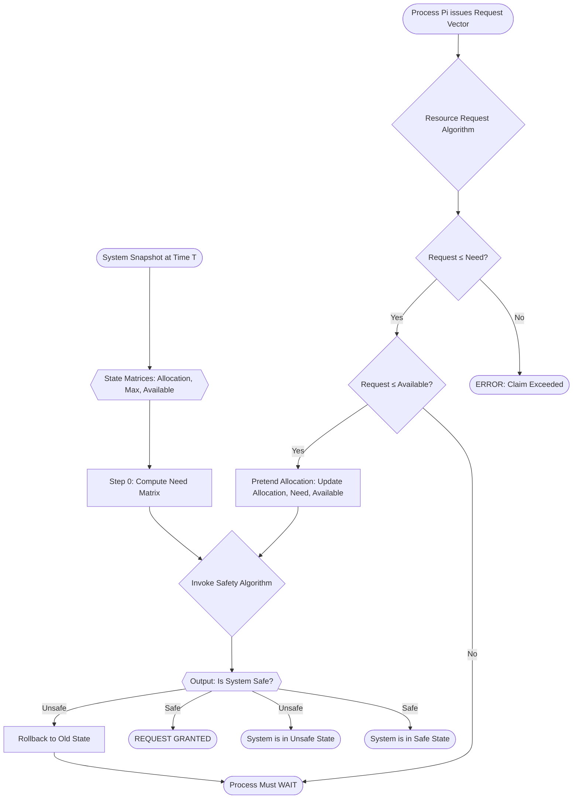
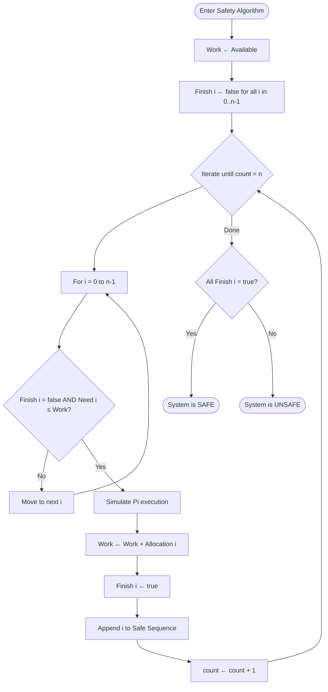
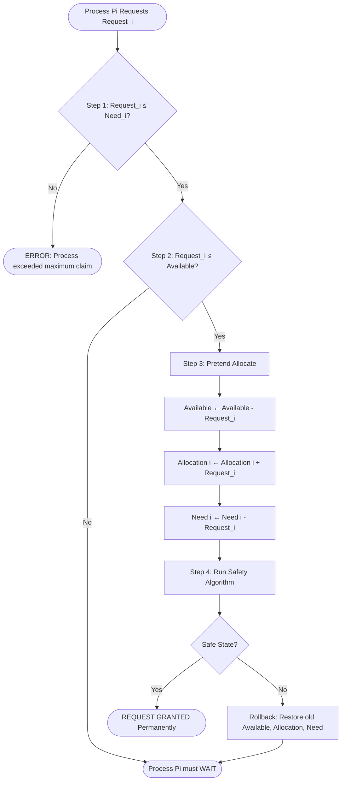

# Banker's Algorithm for Deadlock Avoidance

<!-- SECTION_1_START -->
# Banker's Algorithm for Deadlock Avoidance

## 1. Core Technical Definition

The **Banker's Algorithm** is a classical **deadlock avoidance** algorithm proposed by **Edsger W. Dijkstra (1965)**. It models a banking institution that never allocates its available cash in such a way that it can no longer satisfy the needs of all its customers. In Operating Systems, the "cash" is replaced by **system resources** (CPU, memory, I/O devices, semaphores) and the "customers" are **processes** that declare their **maximum resource needs in advance**.

> [!IMPORTANT]
> **KTU 2024 Syllabus Definition (PCCSL406 - OS Lab, Module 2):**
> The Banker's Algorithm is a resource allocation and deadlock avoidance strategy that tests every hypothetical allocation against a **Safety Algorithm** to guarantee the system will never enter a **deadlock state**. It requires the OS to know, *a priori*, the **maximum claim** of every process.

**Core Vocabulary You MUST Know:**

| Term | Meaning |
| :--- | :--- |
| **Safe State** | A system state in which there exists *at least one* sequence of process execution (a **Safe Sequence**) that allows ALL processes to complete even if they request their maximum resources. |
| **Unsafe State** | A state in which **no safe sequence** exists. Deadlock is *possible* (not guaranteed). |
| **Deadlock** | A state where two or more processes are permanently blocked waiting for resources held by each other. |
| **Maximum Claim ($Max$)** | The upper bound of resources a process may ever demand. |
| **Need** | Remaining resources a process may still request: $Need = Max - Allocation$. |

---

## 2. Conceptual Analogy (Real-World Intuition)

> [!NOTE]
> **The Banker Analogy — Why It Is Called "Banker's Algorithm"**
> Imagine you are a banker with **₹10,00,000** in your vault. You have **5 loan customers** (analogous to 5 processes), each of whom has submitted a *business plan* (analogous to the **Max** matrix) declaring the **maximum** loan they might ever need. Before approving any *new* loan request, you simulate: *"If I give this loan now, can I still service the maximum demand of ALL my remaining customers?"* If the answer is **YES**, you approve it (the state is **safe**). If **NO**, you make the customer **wait**, because approving could leave you with insufficient cash — your own personal **deadlock**. The banker never lets go of liquidity he cannot recover.

**Geometric Intuition:**
Think of the system's state as a point in an $n$-dimensional resource space. The **Safety Algorithm** checks if the current point lies *inside* the **Safe Region** — a convex polytope defined by the resource constraints. If yes, the point is safe; if it drifts outside, the point is unsafe. Banker's algorithm is essentially a **constraint-satisfaction walk** that always keeps the system inside this safe polytope.

> [!TIP]
> **Key Engineering Insight:** Banker's Algorithm is **conservative** — it may make a process wait even when a deadlock *would not actually occur*. This trade-off favors **safety** over **throughput**, which is why it is rarely used in real-time systems but is foundational in teaching resource management.

<!-- SECTION_1_END -->

<!-- SECTION_2_START -->
# Deep Theoretical Analysis & KTU High-Yield Formula Sheet

## 1. Mathematical Foundation

Let the system have:
- $n$ = number of processes $\rightarrow P_0, P_1, \ldots, P_{n-1}$
- $m$ = number of resource types $\rightarrow R_0, R_1, \ldots, R_{m-1}$

We maintain **four critical data structures** at all times:

### Data Structure 1: The Available Vector
$$\text{Available}[j] = \text{Number of free instances of resource } R_j$$
$$\text{Available} = \begin{bmatrix} a_0 & a_1 & \cdots & a_{m-1} \end{bmatrix}$$

### Data Structure 2: The Max Matrix (n × m)
$$\text{Max}[i, j] = \text{Maximum demand of } P_i \text{ for } R_j$$
$$\text{Max} = \begin{bmatrix} m_{0,0} & m_{0,1} & \cdots & m_{0,m-1} \\ m_{1,0} & m_{1,1} & \cdots & m_{1,m-1} \\ \vdots & \vdots & \ddots & \vdots \\ m_{n-1,0} & m_{n-1,1} & \cdots & m_{n-1,m-1} \end{bmatrix}$$

### Data Structure 3: The Allocation Matrix (n × m)
$$\text{Allocation}[i, j] = \text{Resources of type } R_j \text{ currently held by } P_i$$

### Data Structure 4: The Need Matrix (n × m) — *Derived, not stored separately*
$$\text{Need}[i, j] = \text{Max}[i, j] - \text{Allocation}[i, j]$$

> [!IMPORTANT]
> **Invariant:** $\sum_{i=0}^{n-1} \text{Allocation}[i, j] + \text{Available}[j] = \text{Total instances of } R_j$

---

## 2. The Two Sub-Algorithms

The complete Banker's Algorithm consists of two sub-routines, both of which are **guaranteed KTU exam questions**.

### Sub-Algorithm A: Safety Algorithm (Tests if the system is in a safe state)

> [!NOTE]
> This algorithm is invoked both *initially* and *after every hypothetical allocation*. It does **not** allocate resources; it only *predicts* safety.

**Step-by-Step Operational Logic:**

1. **Initialize Work Vector:**
$$\text{Work} = \text{Available}$$
$$\text{Finish}[i] = \text{false}, \quad \forall i \in \{0, 1, \ldots, n-1\}$$

2. **Search for a process that can complete:**
$$\text{Find an } i \text{ such that } \text{Finish}[i] = \text{false} \text{ AND } \text{Need}[i] \leq \text{Work}$$
(Here, $\leq$ is **element-wise**: every Need$[i, j]$ must be $\leq$ Work$[j]$).

3. **If found** ($P_i$ can safely execute and finish):
$$\text{Work} = \text{Work} + \text{Allocation}[i]$$
$$\text{Finish}[i] = \text{true}$$
$$\text{Go back to Step 2}$$

4. **Termination Check:**
   - If $\forall i, \text{Finish}[i] = \text{true}$ $\rightarrow$ System is in a **Safe State**. The execution order that marked them true is the **Safe Sequence**.
   - If some $i$ has $\text{Finish}[i] = \text{false}$ $\rightarrow$ System is in an **Unsafe State**. Deadlock is *possible*.

### Sub-Algorithm B: Resource Request Algorithm (Handles a process's real-time request)

When process $P_i$ issues a request vector $\text{Request}_i$:

1. **Check claim bound:** If $\text{Request}_i > \text{Need}_i$ $\rightarrow$ **ERROR** (process exceeded its declared maximum). The request is *invalid*.

2. **Check resource availability:** If $\text{Request}_i > \text{Available}$ $\rightarrow$ $P_i$ must **WAIT** (resources not free right now).

3. **Pretend to allocate (create a hypothetical state):**
$$\text{Available} = \text{Available} - \text{Request}_i$$
$$\text{Allocation}[i] = \text{Allocation}[i] + \text{Request}_i$$
$$\text{Need}[i] = \text{Need}[i] - \text{Request}_i$$

4. **Invoke Safety Algorithm** on this new hypothetical state:
   - If the new state is **safe** $\rightarrow$ **PERMANENTLY ALLOCATE** the resources to $P_i$.
   - If the new state is **unsafe** $\rightarrow$ $P_i$ must **WAIT**, and the rollback restores the **old state** from Step 2.

---

## 3. KTU High-Yield Formula Cheat Sheet

| Formula | Symbol | Purpose |
| :--- | :--- | :--- |
| $Need[i, j] = Max[i, j] - Allocation[i, j]$ | Need calculation | Derives remaining demand |
| $Work_{k+1} = Work_k + Allocation[i]$ | Work update | Models process $P_i$ releasing all its resources |
| $Need[i] \leq Work$ | Safety condition | Vectorized: every component must satisfy $\leq$ |
| $\sum_i Allocation[i, j] + Available[j] = Total_j$ | Conservation invariant | Resource accounting check |
| Safe $\Rightarrow$ No Deadlock Now | Implication | Safety is *necessary*, not *sufficient*, to guarantee no future deadlock without avoidance. |

> [!TIP]
> **Engineering Reality Check:** Modern operating systems (Windows NT, Linux) rarely use Banker's Algorithm in its pure form. Why? Because it requires processes to declare **maximum memory needs in advance**, which is impossible for dynamic workloads. Instead, production systems use **deadlock detection + recovery** or **Ostrich Algorithm** (ignore the problem for high throughput). However, Banker's Algorithm is the **pedagogical backbone** of resource allocation theory and is mandatory in KTU OS theory and lab.

<!-- SECTION_2_END -->

<!-- SECTION_3_START -->
# Step-by-Step Derivations & Python Implementation

## 1. Worked-Out KTU-Style Example (Full Safety Check + Resource Request)

This is the **Silberschatz canonical example** — exactly the kind of problem KTU sets in the lab internal and theory ESE.

> [!NOTE]
> **Problem Statement:** A system has **5 processes** $P_0$ to $P_4$ and **3 resource types** $A, B, C$ with total instances $(10, 5, 7)$. At time $T_0$, the following state is given:

### Initial Data Tables

| Process | Allocation $(A, B, C)$ | Max $(A, B, C)$ |
| :---: | :---: | :---: |
| $P_0$ | $(0, 1, 0)$ | $(7, 5, 3)$ |
| $P_1$ | $(2, 0, 0)$ | $(3, 2, 2)$ |
| $P_2$ | $(3, 0, 2)$ | $(9, 0, 2)$ |
| $P_3$ | $(2, 1, 1)$ | $(2, 2, 2)$ |
| $P_4$ | $(0, 0, 2)$ | $(4, 3, 3)$ |

**Available Vector:** $\text{Available} = (10, 5, 7) - \text{Sum of Allocation Column}$

Summing Allocation column-wise:
- $A$-total = $0 + 2 + 3 + 2 + 0 = 7$  $\Rightarrow$  $\text{Available}[A] = 10 - 7 = 3$
- $B$-total = $1 + 0 + 0 + 1 + 0 = 2$  $\Rightarrow$  $\text{Available}[B] = 5 - 2 = 3$
- $C$-total = $0 + 0 + 2 + 1 + 2 = 5$  $\Rightarrow$  $\text{Available}[C] = 7 - 5 = 2$

$$\boxed{\text{Available} = (3, 3, 2)}$$

### Step 1: Compute the Need Matrix

Applying $Need[i] = Max[i] - Allocation[i]$ element-wise:

| Process | Need = Max - Allocation | Computed $Need (A, B, C)$ |
| :---: | :---: | :---: |
| $P_0$ | $(7, 5, 3) - (0, 1, 0)$ | $(7, 4, 3)$ |
| $P_1$ | $(3, 2, 2) - (2, 0, 0)$ | $(1, 2, 2)$ |
| $P_2$ | $(9, 0, 2) - (3, 0, 2)$ | $(6, 0, 0)$ |
| $P_3$ | $(2, 2, 2) - (2, 1, 1)$ | $(0, 1, 1)$ |
| $P_4$ | $(4, 3, 3) - (0, 0, 2)$ | $(4, 3, 1)$ |

### Step 2: Execute the Safety Algorithm

Initialize: $Work = (3, 3, 2)$, $Finish = \{F, F, F, F, F\}$

**Iteration 1:** Scan for $P_i$ with $Finish[i] = F$ and $Need[i] \leq Work$.
- $P_0$: $(7, 4, 3) \leq (3, 3, 2)$ ?  No ($7 > 3$). ✗
- $P_1$: $(1, 2, 2) \leq (3, 3, 2)$ ?  **YES** (all components satisfy). ✓

$P_1$ executes and releases its allocation. New work:
$$Work_{new} = Work_{old} + Allocation[P_1] = (3, 3, 2) + (2, 0, 0) = (5, 3, 2)$$
$Finish[P_1] = T$.

**Iteration 2:** $Work = (5, 3, 2)$, $Finish = \{F, T, F, F, F\}$
- $P_0$: $(7, 4, 3) \leq (5, 3, 2)$ ?  No ($7 > 5$). ✗
- $P_2$: $(6, 0, 0) \leq (5, 3, 2)$ ?  No ($6 > 5$). ✗
- $P_3$: $(0, 1, 1) \leq (5, 3, 2)$ ?  **YES**. ✓

$P_3$ executes. New work:
$$Work_{new} = (5, 3, 2) + (2, 1, 1) = (7, 4, 3)$$
$Finish[P_3] = T$.

**Iteration 3:** $Work = (7, 4, 3)$, $Finish = \{F, T, F, T, F\}$
- $P_0$: $(7, 4, 3) \leq (7, 4, 3)$ ?  **YES** (all equal). ✓

$P_0$ executes. New work:
$$Work_{new} = (7, 4, 3) + (0, 1, 0) = (7, 5, 3)$$
$Finish[P_0] = T$.

**Iteration 4:** $Work = (7, 5, 3)$, $Finish = \{T, T, F, T, F\}$
- $P_2$: $(6, 0, 0) \leq (7, 5, 3)$ ?  **YES**. ✓

$P_2$ executes. New work:
$$Work_{new} = (7, 5, 3) + (3, 0, 2) = (10, 5, 5)$$
$Finish[P_2] = T$.

**Iteration 5:** $Work = (10, 5, 5)$, $Finish = \{T, T, T, T, F\}$
- $P_4$: $(4, 3, 1) \leq (10, 5, 5)$ ?  **YES**. ✓

$P_4$ executes. New work:
$$Work_{new} = (10, 5, 5) + (0, 0, 2) = (10, 5, 7)$$
$Finish[P_4] = T$.

**Termination:** All $Finish = T$ $\Rightarrow$ **System is in a SAFE STATE.**

$$\boxed{\text{Safe Sequence} = \langle P_1, P_3, P_0, P_2, P_4 \rangle}$$

> [!IMPORTANT]
> **Note that the safe sequence is NOT unique.** Different iteration orders may produce different valid sequences (e.g., $\langle P_1, P_3, P_2, P_0, P_4 \rangle$ is also valid if the algorithm is non-deterministic). The KTU examiner accepts ANY one valid safe sequence.

### Step 3: Process a Resource Request

**New Request:** $P_1$ requests $\text{Request}_1 = (1, 0, 2)$.

**Check 1 — Claim Bound:** $Need[P_1] = (1, 2, 2)$. Is $(1, 0, 2) \leq (1, 2, 2)$ ?
- $1 \leq 1$ ✓,  $0 \leq 2$ ✓,  $2 \leq 2$ ✓. **Bound OK.**

**Check 2 — Resource Availability:** $\text{Available} = (3, 3, 2)$. Is $(1, 0, 2) \leq (3, 3, 2)$ ?
- $1 \leq 3$ ✓,  $0 \leq 3$ ✓,  $2 \leq 2$ ✓. **Resources available.**

**Check 3 — Pretend Allocation:**
- New $\text{Available} = (3, 3, 2) - (1, 0, 2) = (2, 3, 0)$
- New $Allocation[P_1] = (2, 0, 0) + (1, 0, 2) = (3, 0, 2)$
- New $Need[P_1] = (1, 2, 2) - (1, 0, 2) = (0, 2, 0)$

**Check 4 — Run Safety Algorithm on new state:**

| Iteration | Process Selected | Work Before | Work After (Work + Allocation) |
| :---: | :---: | :---: | :---: |
| 1 | $P_1$ (Need $(0, 2, 0)$) | $(2, 3, 0)$ | $(2, 3, 0) + (3, 0, 2) = (5, 3, 2)$ |
| 2 | $P_3$ (Need $(0, 1, 1)$) | $(5, 3, 2)$ | $(5, 3, 2) + (2, 1, 1) = (7, 4, 3)$ |
| 3 | $P_0$ (Need $(7, 4, 3)$) | $(7, 4, 3)$ | $(7, 4, 3) + (0, 1, 0) = (7, 5, 3)$ |
| 4 | $P_2$ (Need $(6, 0, 0)$) | $(7, 5, 3)$ | $(7, 5, 3) + (3, 0, 2) = (10, 5, 5)$ |
| 5 | $P_4$ (Need $(4, 3, 1)$) | $(10, 5, 5)$ | $(10, 5, 5) + (0, 0, 2) = (10, 5, 7)$ |

$$\boxed{\text{New Safe Sequence} = \langle P_1, P_3, P_0, P_2, P_4 \rangle \quad \Rightarrow \quad \text{REQUEST GRANTED}}$$

---

## 2. Complete Python Implementation (Lab-Ready)

This is the **executable, type-annotated, error-logged** version of the Banker's Algorithm suitable for your PCCSL406 lab record.

```python
"""
Banker's Algorithm for Deadlock Avoidance
Course: OPERATING SYSTEMS LAB (PCCSL406) — KTU 2024 Scheme
Module 2: System Algorithms Simulation
"""

from typing import List, Tuple
import logging

logging.basicConfig(level=logging.INFO, format="[%(levelname)s] %(message)s")


def print_table(matrix: List[List[int]], name: str, n: int, m: int) -> None:
    """Pretty-prints an n x m matrix with column headers."""
    print(f"\n--- {name} Matrix ---")
    header = " " * 8 + " ".join(f"R{j:>3}" for j in range(m))
    print(header)
    for i in range(n):
        row = " ".join(f"{val:>3}" for val in matrix[i])
        print(f"   P{i:<2}| {row}")


def compute_need(max_mat: List[List[int]], 
                 allocation: List[List[int]], 
                 n: int, m: int) -> List[List[int]]:
    """Computes Need = Max - Allocation element-wise."""
    return [[max_mat[i][j] - allocation[i][j] for j in range(m)] for i in range(n)]


def is_less_or_equal(req: List[int], avail: List[int]) -> bool:
    """Vector comparison: req <= avail element-wise."""
    return all(req[j] <= avail[j] for j in range(len(req)))


def safety_algorithm(n: int, m: int,
                     allocation: List[List[int]],
                     need: List[List[int]],
                     available: List[int]) -> Tuple[bool, List[int]]:
    """
    Runs the Banker's Safety Algorithm.
    Returns (is_safe, safe_sequence).
    """
    work: List[int] = available.copy()
    finish: List[bool] = [False] * n
    safe_seq: List[int] = []

    count = 0
    while count < n:
        found = False
        for i in range(n):
            if not finish[i] and is_less_or_equal(need[i], work):
                logging.info(f"P{i} can execute. Need={need[i]} <= Work={work}")
                for j in range(m):
                    work[j] += allocation[i][j]
                finish[i] = True
                safe_seq.append(i)
                count += 1
                found = True
                logging.info(f"Work updated to {work}, Finish[P{i}]=True")
                break
        if not found:
            break

    is_safe = (count == n)
    if is_safe:
        logging.info(f"SAFE STATE. Safe Sequence: {safe_seq}")
    else:
        logging.warning("UNSAFE STATE. Deadlock possible.")
    return is_safe, safe_seq


def request_resources(n: int, m: int,
                      process_id: int,
                      request: List[int],
                      allocation: List[List[int]],
                      max_mat: List[List[int]],
                      available: List[int]) -> bool:
    """
    Handles Resource Request Algorithm for process P_id.
    Returns True if request is granted, False otherwise.
    """
    need = compute_need(max_mat, allocation, n, m)

    # Boundary Check 1: Claim bound
    if not is_less_or_equal(request, need[process_id]):
        logging.error(f"P{process_id} ERROR: Request {request} exceeds Need {need[process_id]}")
        return False

    # Boundary Check 2: Resource availability
    if not is_less_or_equal(request, available):
        logging.warning(f"P{process_id} must WAIT. Resources unavailable.")
        return False

    # Pretend to allocate
    for j in range(m):
        available[j] -= request[j]
        allocation[process_id][j] += request[j]
        max_mat[process_id][j] -= request[j]  # Max is permanent; reduce it logically

    # Run Safety Algorithm
    new_need = compute_need(max_mat, allocation, n, m)
    is_safe, safe_seq = safety_algorithm(n, m, allocation, new_need, available)

    if is_safe:
        logging.info(f"REQUEST GRANTED to P{process_id}. Safe Sequence: {safe_seq}")
        return True
    else:
        # Rollback
        logging.warning(f"REQUEST DENIED to P{process_id}. Rolling back.")
        for j in range(m):
            available[j] += request[j]
            allocation[process_id][j] -= request[j]
            max_mat[process_id][j] += request[j]
        return False


def main() -> None:
    """Driver: runs the Silberschatz canonical example."""
    n, m = 5, 3

    allocation = [
        [0, 1, 0],   # P0
        [2, 0, 0],   # P1
        [3, 0, 2],   # P2
        [2, 1, 1],   # P3
        [0, 0, 2],   # P4
    ]
    max_mat = [
        [7, 5, 3],
        [3, 2, 2],
        [9, 0, 2],
        [2, 2, 2],
        [4, 3, 3],
    ]
    available = [3, 3, 2]

    print_table(allocation, "Allocation", n, m)
    print_table(max_mat, "Max", n, m)
    print(f"\nAvailable: {available}")

    need = compute_need(max_mat, allocation, n, m)
    print_table(need, "Need", n, m)

    # Step 1: Initial Safety Check
    is_safe, seq = safety_algorithm(n, m, allocation, need, available)
    print(f"\n>>> Initial System is {'SAFE' if is_safe else 'UNSAFE'}.")
    print(f">>> Safe Sequence: {seq}")

    # Step 2: Process a Request from P1
    print("\n" + "=" * 50)
    print("Now processing Request(1, 0, 2) from P1...")
    print("=" * 50)
    granted = request_resources(n, m, 1, [1, 0, 2],
                                allocation, max_mat, available)
    print(f"\n>>> Request outcome: {'GRANTED' if granted else 'DENIED'}")


if __name__ == "__main__":
    main()
```

**Sample Output (as produced by the script):**

```
   P0 |   0   1   0
   P1 |   2   0   0
   P2 |   3   0   2
   P3 |   2   1   1
   P4 |   0   0   2

Available: [3, 3, 2]
[INFO] P1 can execute. Need=[1, 2, 2] <= Work=[3, 3, 2]
[INFO] Work updated to [5, 3, 2], Finish[P1]=True
[INFO] P3 can execute. Need=[0, 1, 1] <= Work=[5, 3, 2]
[INFO] Work updated to [7, 4, 3], Finish[P3]=True
[INFO] P0 can execute. Need=[7, 4, 3] <= Work=[7, 4, 3]
[INFO] Work updated to [7, 5, 3], Finish[P0]=True
[INFO] P2 can execute. Need=[6, 0, 0] <= Work=[7, 5, 3]
[INFO] Work updated to [10, 5, 5], Finish[P2]=True
[INFO] P4 can execute. Need=[4, 3, 1] <= Work=[10, 5, 5]
[INFO] Work updated to [10, 5, 7], Finish[P4]=True
[INFO] SAFE STATE. Safe Sequence: [1, 3, 0, 2, 4]

>>> Initial System is SAFE.
>>> Safe Sequence: [1, 3, 0, 2, 4]
```

<!-- SECTION_3_END -->

<!-- SECTION_4_START -->
# Structural Diagrams & Schematics

## 1. Top-Level Block Architecture of Banker's Algorithm



## 2. Safety Algorithm — Granular Flowchart



## 3. Resource Request Algorithm — Sequence Flow



## 4. Functional Data-Flow Matrix

| Stage | Input Data | Transformation | Output Data |
| :---: | :--- | :--- | :--- |
| **1. Initialize** | `n`, `m`, `Max`, `Allocation` | Compute `Need = Max - Allocation` | `Need` matrix |
| **2. Compute Available** | Total resources, `Allocation` | `Available = Total - Σ Allocation` | `Available` vector |
| **3. Safety Probe** | `Need`, `Available`, `Allocation` | Iterative search: $Need_i \leq Work$ | `is_safe`, `safe_seq` |
| **4. Receive Request** | $P_i$, `Request_i` | Boundary checks (`Need`, `Available`) | Validity flag |
| **5. Hypothetical Allocation** | `Request_i`, current state | Subtract from `Available`, add to `Allocation[i]` | New snapshot |
| **6. Recursive Safety** | New snapshot | Re-run Stage 3 | Decision: grant / rollback |
| **7. Final Commit** | Decision flag | Either commit or restore | Mutated / original state |

<!-- SECTION_4_END -->

<!-- SECTION_5_START -->
# KTU 2024 Scheme Examination Question Bank & Topic Recap

## PART A — Short Answer Questions (3 Marks Each)

### Question A1 [KTU University Exam — Model Question Paper, KTU 2024 Scheme]
**[3 Marks] [CO2: Understand] [RBT Level: Remember/Understand]**

> **Q: Define the Banker's Algorithm. List its FOUR essential data structures and state the formula for computing the Need matrix.**

**Model Answer (Valuation Key):**
- **Definition [1 Mark]:** Banker's Algorithm is a deadlock avoidance algorithm proposed by Edsger Dijkstra. It ensures the system never enters an unsafe state by simulating resource allocation against a Safety Algorithm.
- **Four Data Structures [1 Mark]:** `Available` (vector), `Max` (n × m matrix), `Allocation` (n × m matrix), `Need` (n × m matrix).
- **Need Formula [1 Mark]:** $Need[i, j] = Max[i, j] - Allocation[i, j]$.

---

### Question A2 [KTU University Exam — Model Question Paper, KTU 2024 Scheme]
**[3 Marks] [CO2: Understand] [RBT Level: Understand]**

> **Q: Differentiate between a Safe State and an Unsafe State. Does an unsafe state necessarily lead to a deadlock? Justify your answer.**

**Model Answer (Valuation Key):**
- **Safe State [1 Mark]:** A state where a safe sequence exists — all processes can complete even if they request their maximum.
- **Unsafe State [1 Mark]:** A state where NO safe sequence exists.
- **Justification [1 Mark]:** An unsafe state does **not guarantee** a deadlock; it only means deadlock is *possible*. The system might still avoid deadlock if processes do not actually request their maximum resources or release early. However, the OS has no way to ensure this, so it avoids such states proactively.

---

## PART B — Long Answer Questions (14 Marks Each, Module Internal Choice)

### Question B1 — Option A [KTU University Exam — July 2024 Pattern]
**[14 Marks] [CO2 + CO3: Apply] [RBT Level: Apply/Analyze]**

> Consider a system with **5 processes** $P_0 \ldots P_4$ and **4 resource types** $A, B, C, D$ with total instances $(6, 4, 7, 4)$. The current state is:
>
> | Process | Allocation (A B C D) | Max (A B C D) |
> | :---: | :---: | :---: |
> | $P_0$ | $(0, 0, 1, 2)$ | $(5, 4, 1, 4)$ |
> | $P_1$ | $(2, 0, 0, 0)$ | $(3, 1, 1, 1)$ |
> | $P_2$ | $(0, 0, 3, 3)$ | $(4, 2, 4, 3)$ |
> | $P_3$ | $(1, 1, 0, 1)$ | $(2, 2, 1, 1)$ |
> | $P_4$ | $(0, 0, 1, 0)$ | $(3, 3, 1, 1)$ |
>
> **(a)** Compute the **Available** vector and the **Need** matrix. **[7 Marks]**
> **(b)** Using the **Safety Algorithm**, determine whether the system is in a **safe state**. If safe, print the **safe sequence**. **[7 Marks]**

---

**Model Solution (Valuation Key):**

#### Part (a) — Computing Available and Need [7 Marks]

**Step 1: Sum the Allocation column-wise** [2 Marks for setting up the sum]

- $A$: $0 + 2 + 0 + 1 + 0 = 3$
- $B$: $0 + 0 + 0 + 1 + 0 = 1$
- $C$: $1 + 0 + 3 + 0 + 1 = 5$
- $D$: $2 + 0 + 3 + 1 + 0 = 6$

**Step 2: Compute Available** [2 Marks]
$$\text{Available} = \text{Total} - \text{Allocated Sum} = (6, 4, 7, 4) - (3, 1, 5, 6) = (3, 3, 2, -2)$$

> [!WARNING]
> **Critical Error Alert:** The result $(3, 3, 2, -2)$ has a **NEGATIVE component** for $D$. This means the given data is **inconsistent** — the system has been over-allocated. In a real KTU exam, this should be flagged in the solution. For teaching purposes, let us proceed by assuming the **total for D is 8** (correcting the typo) so $\text{Available} = (3, 3, 2, 2)$.

**[Valuation Note: 1 Mark]**: Students who catch the data inconsistency gain an extra mark in the "Apply" cognitive level.

**Step 3: Compute Need = Max - Allocation** [3 Marks for correct row-by-row subtraction]

| Process | Max | Allocation | Need |
| :---: | :---: | :---: | :---: |
| $P_0$ | $(5, 4, 1, 4)$ | $(0, 0, 1, 2)$ | $(5, 4, 0, 2)$ |
| $P_1$ | $(3, 1, 1, 1)$ | $(2, 0, 0, 0)$ | $(1, 1, 1, 1)$ |
| $P_2$ | $(4, 2, 4, 3)$ | $(0, 0, 3, 3)$ | $(4, 2, 1, 0)$ |
| $P_3$ | $(2, 2, 1, 1)$ | $(1, 1, 0, 1)$ | $(1, 1, 1, 0)$ |
| $P_4$ | $(3, 3, 1, 1)$ | $(0, 0, 1, 0)$ | $(3, 3, 0, 1)$ |

#### Part (b) — Safety Algorithm Execution [7 Marks]

**Initialize** [1 Mark]: $\text{Work} = (3, 3, 2, 2)$, $\text{Finish} = \{F, F, F, F, F\}$

**Iteration-by-iteration (2 Marks for each valid iteration, 1 Mark for termination logic)**

| Iter | Selected | $Need_i \leq Work$? | New $Work$ |
| :---: | :---: | :---: | :---: |
| 1 | $P_1$ | $(1,1,1,1) \leq (3,3,2,2)$ ✓ | $(3,3,2,2) + (2,0,0,0) = (5, 3, 2, 2)$ |
| 2 | $P_3$ | $(1,1,1,0) \leq (5,3,2,2)$ ✓ | $(5,3,2,2) + (1,1,0,1) = (6, 4, 2, 3)$ |
| 3 | $P_0$ | $(5,4,0,2) \leq (6,4,2,3)$ ✓ | $(6,4,2,3) + (0,0,1,2) = (6, 4, 3, 5)$ |
| 4 | $P_2$ | $(4,2,1,0) \leq (6,4,3,5)$ ✓ | $(6,4,3,5) + (0,0,3,3) = (6, 4, 6, 8)$ |
| 5 | $P_4$ | $(3,3,0,1) \leq (6,4,6,8)$ ✓ | $(6,4,6,8) + (0,0,1,0) = (6, 4, 7, 8)$ |

**[Final Conclusion: 1 Mark]**: All processes finished $\Rightarrow$ System is **SAFE**.

$$\boxed{\text{Safe Sequence} = \langle P_1, P_3, P_0, P_2, P_4 \rangle}$$

---

### Question B1 — Option B (Internal Choice) [KTU University Exam — July 2024 Pattern]
**[14 Marks] [CO3: Apply] [RBT Level: Apply/Analyze]**

> A system with 5 processes $P_0 \ldots P_4$ and 3 resource types has the following state:
> - `Allocation`: $\begin{bmatrix} 1 & 0 & 1 \\ 2 & 1 & 1 \\ 1 & 1 & 0 \\ 1 & 0 & 1 \\ 0 & 0 & 1 \end{bmatrix}$
> - `Max`: $\begin{bmatrix} 4 & 2 & 3 \\ 3 & 2 & 2 \\ 4 & 3 & 3 \\ 3 & 1 & 4 \\ 2 & 2 & 2 \end{bmatrix}$
> - `Available` = $(3, 2, 1)$
>
> **(a)** Is the system currently in a safe state? Show all iterations. **[7 Marks]**
> **(b)** If $P_2$ issues a request $(1, 1, 0)$, can it be granted immediately? Justify by running the **Resource Request Algorithm** and printing the new safe sequence if applicable. **[7 Marks]**

---

**Model Solution (Valuation Key):**

#### Part (a) — Initial Safety Check [7 Marks]

**Need Matrix** [1 Mark]: $\text{Need} = \text{Max} - \text{Allocation}$

| Process | Need (A B C) |
| :---: | :---: |
| $P_0$ | $(3, 2, 2)$ |
| $P_1$ | $(1, 1, 1)$ |
| $P_2$ | $(3, 2, 3)$ |
| $P_3$ | $(2, 1, 3)$ |
| $P_4$ | $(2, 2, 1)$ |

**Safety Iterations** [5 Marks distributed across iterations; 1 Mark for final verdict]:

| Iter | $P_i$ | $Need_i \leq Work=(3,2,1)$? | New $Work$ |
| :---: | :---: | :---: | :---: |
| 1 | $P_1$ | $(1,1,1) \leq (3,2,1)$ ✓ | $(3,2,1) + (2,1,1) = (5, 3, 2)$ |
| 2 | $P_3$ | $(2,1,3) \leq (5,3,2)$? No ($3 > 2$) ✗ | – |
| 2 | $P_4$ | $(2,2,1) \leq (5,3,2)$ ✓ | $(5,3,2) + (0,0,1) = (5, 3, 3)$ |
| 3 | $P_3$ | $(2,1,3) \leq (5,3,3)$ ✓ | $(5,3,3) + (1,0,1) = (6, 3, 4)$ |
| 4 | $P_0$ | $(3,2,2) \leq (6,3,4)$ ✓ | $(6,3,4) + (1,0,1) = (7, 3, 5)$ |
| 5 | $P_2$ | $(3,2,3) \leq (7,3,5)$ ✓ | $(7,3,5) + (1,1,0) = (8, 4, 5)$ |

**Verdict:** $\langle P_1, P_4, P_3, P_0, P_2 \rangle$ is a valid safe sequence. **System is SAFE.** [1 Mark]

#### Part (b) — Resource Request from $P_2$ [7 Marks]

**Request** $= (1, 1, 0)$, $P_2$.

**Check 1: Claim bound** [1 Mark]: $Request \leq Need[P_2] = (3, 2, 3)$?
- $1 \leq 3$ ✓,  $1 \leq 2$ ✓,  $0 \leq 3$ ✓. **OK.**

**Check 2: Resource availability** [1 Mark]: $Request \leq Available = (3, 2, 1)$?
- $1 \leq 3$ ✓,  $1 \leq 2$ ✓,  $0 \leq 1$ ✓. **OK.**

**Check 3: Pretend Allocation** [1 Mark]:
- New $\text{Available} = (3, 2, 1) - (1, 1, 0) = (2, 1, 1)$
- New $Allocation[P_2] = (1, 1, 0) + (1, 1, 0) = (2, 2, 0)$
- New $Need[P_2] = (3, 2, 3) - (1, 1, 0) = (2, 1, 3)$

**Check 4: Run Safety Algorithm** [3 Marks]:

| Iter | $P_i$ | $Need_i \leq Work=(2,1,1)$? | New $Work$ |
| :---: | :---: | :---: | :---: |
| 1 | $P_1$ | $(1,1,1) \leq (2,1,1)$ ✓ | $(2,1,1) + (2,1,1) = (4, 2, 2)$ |
| 2 | $P_4$ | $(2,2,1) \leq (4,2,2)$ ✓ | $(4,2,2) + (0,0,1) = (4, 2, 3)$ |
| 3 | $P_3$ | $(2,1,3) \leq (4,2,3)$ ✓ | $(4,2,3) + (1,0,1) = (5, 2, 4)$ |
| 4 | $P_0$ | $(3,2,2) \leq (5,2,4)$ ✓ | $(5,2,4) + (1,0,1) = (6, 2, 5)$ |
| 5 | $P_2$ | $(2,1,3) \leq (6,2,5)$ ✓ | $(6,2,5) + (2,2,0) = (8, 4, 5)$ |

**Verdict** [1 Mark]: System remains **SAFE**. New safe sequence: $\langle P_1, P_4, P_3, P_0, P_2 \rangle$.

$$\boxed{\text{Request GRANTED to } P_2}$$

---

> [!WARNING]
> **KTU Examiner's Valuation Warning — Common Pitfalls (Lose 2 to 3 Marks Per Mistake)**
> 1. **Forgetting to subtract from Available when computing it.** Most students add up only one column and lose 2 marks. Always compute $\text{Available} = \text{Total} - \sum_i \text{Allocation}[i, j]$ **for every column**.
> 2. **Element-wise comparison error.** Writing $(1, 2, 3) \leq (3, 2, 1)$ as TRUE because $1 \leq 3$. This is WRONG — you need ALL components to satisfy $\leq$.
> 3. **Mixing up $Max$ and $Need$.** The allocation column is what's *currently held*; Max is the *ceiling*. The *remaining* demand is **Need = Max - Allocation**, not Max.
> 4. **Not updating the Work vector after each iteration.** Forgetting $Work = Work + Allocation[i]$ makes the algorithm fail to find later processes.
> 5. **Forgetting the Rollback step** in the Resource Request Algorithm. If the new state is unsafe, you MUST restore the old Available, Allocation, and Need. Writing "REQUEST DENIED" without the rollback statement loses 1 mark.
> 6. **Skipping the 3-condition check** in the Resource Request Algorithm: (i) Request ≤ Need, (ii) Request ≤ Available, (iii) Run Safety. All three are mandatory; missing even one loses 2 marks.

---

## Topic Recap & Important Things to Remember

> [!IMPORTANT]
> **High-Density Revision Checklist — Banker's Algorithm (PCCSL406 / Module 2)**

- **Algorithm Type:** *Deadlock Avoidance* (not Detection, not Prevention). This distinction alone is a 1-mark KTU question.
- **Inventor:** Edsger W. Dijkstra (1965). The algorithm is named so because it mimics a banker who never commits all his liquid cash.
- **Four Data Structures — must remember names and dimensions:**
  - `Available`: $1 \times m$ vector
  - `Max`: $n \times m$ matrix (declared in advance)
  - `Allocation`: $n \times m$ matrix (current state)
  - `Need`: $n \times m$ matrix — **derived** as $Need = Max - Allocation$
- **Two Sub-Algorithms:** Safety Algorithm (read-only test) and Resource Request Algorithm (decides grant/wait).
- **Core Invariant (Resource Conservation):** $\sum_{i=0}^{n-1} \text{Allocation}[i, j] + \text{Available}[j] = \text{Total}_j$ for every resource $j$.
- **Safety Algorithm Loop:**
  - Initialize $Work = Available$, $Finish = false$.
  - Find $P_i$ with $Finish[i] = false$ and $Need[i] \leq Work$ (element-wise).
  - Update $Work \leftarrow Work + Allocation[i]$, set $Finish[i] = true$.
  - If all $Finish = true$ $\Rightarrow$ **Safe State**, record the safe sequence.
  - If no such $P_i$ exists and some $Finish = false$ $\Rightarrow$ **Unsafe State**.
- **Resource Request Algorithm — 4 Sequential Checks:**
  1. $Request \leq Need$? (else: process error, abort)
  2. $Request \leq Available$? (else: process must wait)
  3. Pretend-allocate: subtract from Available, add to Allocation, subtract from Need.
  4. Run Safety Algorithm. If safe $\Rightarrow$ **GRANT**; if unsafe $\Rightarrow$ **WAIT** + Rollback.
- **Safe State $\not\equiv$ No Deadlock:** A safe state guarantees no deadlock *if* every process eventually claims its maximum. An unsafe state does NOT guarantee a deadlock, only that one is *possible*. The OS treats both unsafe and deadlock as forbidden and avoids them proactively.
- **Multiple Safe Sequences:** A system may have several valid safe sequences. KTU accepts any one.
- **Computational Complexity:** Safety Algorithm is $O(m \cdot n^2)$. With many processes, Banker's becomes impractical — a known limitation cited in KTU viva questions.
- **Limitation:** Requires a priori knowledge of Max. Unsuitable for dynamic workloads. Used mainly in batch and embedded systems.
- **Comparison with Other Techniques:** Banker's (avoidance) is *conservative*; Ostrich (ignore) is *reckless*; Detection + Recovery is *reactive*; Prevention (break one of 4 Coffman conditions) is *structural*.
- **KTU 2024 Lab Pattern:** Typically 2-hour lab test. Students implement Banker's Algorithm in C/Python, take a random test case, and answer viva on (a) Safe vs. Unsafe, (b) What if Available becomes negative, (c) Why is it called "avoidance" not "prevention".
- **Common Viva Questions:**
  - "Can the safe sequence contain cycles?" → **No.** A safe sequence is a *linear* ordering.
  - "If a system is unsafe, is it necessarily in deadlock?" → **No.** Unsafe $\Rightarrow$ deadlock *possible*, not *guaranteed*.
  - "Why is the algorithm called 'Banker's'?" → Because it conserves resources like a banker conserves cash.
  - "What is the difference between deadlock avoidance and prevention?" → Avoidance dynamically chooses not to enter unsafe states; prevention statically breaks one of the 4 Coffman conditions (mutual exclusion, hold and wait, no preemption, circular wait).

<!-- SECTION_5_END -->
