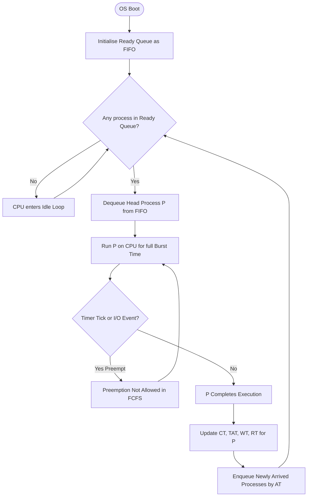
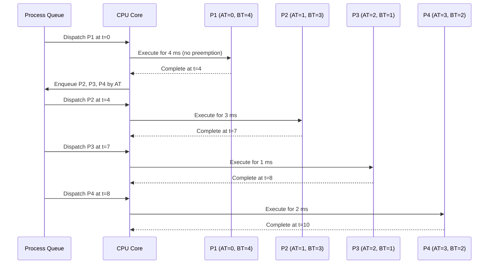
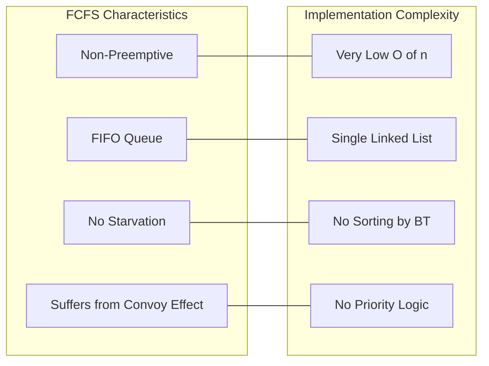

# FCFS CPU Scheduling Algorithm

<!-- SECTION_1_START -->
# FCFS CPU Scheduling Algorithm

## 1.1 Formal Definition (KTU 2024 Syllabus Terminology)

> [!IMPORTANT]
> **First-Come, First-Served (FCFS)** is the simplest **non-preemptive** CPU scheduling algorithm. The process that requests the CPU **first** is allocated the CPU **first**. It is implemented using a simple **FIFO (First-In, First-Out) queue** managed by the OS dispatcher.

In KTU 2024 Scheme Operating Systems Lab (PCCSL406), Module 2 expects students to **simulate**, **trace**, **compute performance metrics**, and **draw Gantt charts** for classical CPU scheduling algorithms. FCFS is the foundational baseline against which all other algorithms (SJF, Priority, Round Robin) are compared.

## 1.2 Conceptual Analogy — The Bakery Ticket Counter

Imagine a small bakery with **one** billing counter:

- Customers form a **single line** in the order they arrive.
- The person at the **front** of the line is served completely (no preemption — they are not interrupted mid-billing).
- Even if a VIP customer arrives later, they must **wait** until everyone ahead is done.

> [!NOTE]
> **Why it matters:** FCFS is the most **fair** algorithm (purely chronological) but suffers from the infamous **Convoy Effect** — a long burst-time process at the head of the queue makes all short processes wait unnecessarily. This is the central motivation for introducing SJF, Priority, and Round Robin in later modules.

## 1.3 Pre-Requisite Glossary

| Term | Symbol | Meaning |
|---|---|---|
| Arrival Time | $AT$ | Time at which the process enters the ready queue |
| Burst Time | $BT$ | Total CPU time required by the process |
| Completion Time | $CT$ | Time at which the process finishes execution |
| Turnaround Time | $TAT$ | $CT - AT$ — Total time spent in the system |
| Waiting Time | $WT$ | $TAT - BT$ — Time spent waiting in the ready queue |
| Response Time | $RT$ | Time from arrival until **first** CPU allocation |
| Throughput | $\rho$ | $\frac{n}{\text{Total CT}}$ — Processes completed per unit time |

> [!VISUALIZATION CONTROL]
> **Concept:** FCFS execution order on a number line (mini Gantt chart)
> **GeoGebra / Desmos Input Equations:**
> * Plot points: `(0, P1)`, `(5, P2)`, `(8, P3)`, `(10, P4)`
> **Visual Description:** A horizontal bar chart where P1 occupies the interval $[0, 5]$, P2 occupies $[5, 8]$, and so on. The "leader" P1 blocks the line even if P4 is the shortest job — this is the Convoy Effect.

<!-- SECTION_1_END -->

<!-- SECTION_2_START -->
# Deep Theoretical Analysis & KTU High-Yield Formula Sheet

## 2.1 Operational Logic (Step-by-Step Bulleted Reasoning)

1. **Sort** the process table by **Arrival Time ($AT$)** in ascending order. If two processes share the same $AT$, break the tie using **Process ID** order.
2. **Initialise** a running clock $t = 0$.
3. **Allocate CPU** to the first process in the sorted list. The process runs for its entire $BT$ without interruption (non-preemptive).
4. **Update** the clock: $t = t + BT_i$.
5. **Record** $CT_i = t$.
6. **Repeat** steps 3–5 for the next process in the sorted list.
7. **Compute** secondary metrics: $TAT_i = CT_i - AT_i$, $WT_i = TAT_i - BT_i$, $RT_i = WT_i$ (FCFS is non-preemptive, so first CPU allocation happens at process start).

> [!NOTE]
> **Starvation:** FCFS guarantees **no starvation** — every process will eventually be executed. This is a frequently asked 3-mark question.

## 2.2 KTU Formula Cheat Sheet

| Metric | Formula | Boundary Condition |
|---|---|---|
| Completion Time (FCFS) | $CT_i = CT_{i-1} + BT_i$ | $CT_0 = AT_0 + BT_0$ |
| Turnaround Time | $TAT_i = CT_i - AT_i$ | Always $TAT_i \geq BT_i$ |
| Waiting Time | $WT_i = TAT_i - BT_i$ | Can be zero if $AT_i = $ start time of $i$ |
| Response Time (FCFS) | $RT_i = WT_i$ | True only because of non-preemption |
| Average WT | $\overline{WT} = \frac{1}{n}\sum_{i=1}^{n} WT_i$ | Lower is better |
| Average TAT | $\overline{TAT} = \frac{1}{n}\sum_{i=1}^{n} TAT_i$ | Lower is better |
| Throughput | $\rho = \frac{n}{CT_{\text{last}} - AT_{\text{first}}}$ | Higher is better |
| CPU Utilization | $U = \frac{\sum BT_i}{CT_{\text{last}} - AT_{\text{first}}} \times 100\%$ | Expressed as **percentage** |

> [!IMPORTANT]
> Use `\vert` (not `|`) in your exam scripts if you ever write $\vert CT_i \vert$ — this prevents KTU's online template engine from breaking your LaTeX.

## 2.3 Real-World Engineering Utility

* **Embedded print spoolers** historically used FCFS for its deterministic behaviour.
* **Batch processing mainframe systems** (legacy IBM OS) still rely on FCFS for job sequencing.
* **Disk scheduling (FCFS variant)** is used in early I/O controllers.
* **Disadvantage in production:** FCFS is **not suitable for interactive systems** because long processes at the head can cause unacceptable response times — this is precisely why Linux CFS, Windows NT scheduler, and modern RTOS kernels use **multilevel feedback queues** and **preemption**.

<!-- SECTION_2_END -->

<!-- SECTION_3_START -->
# Step-by-Step Derivations & Python Implementation

## 3.1 Worked Numerical Example (Typical KTU Lab Question)

**Given Process Table:**

| Process | $AT$ | $BT$ |
|---|---|---|
| P1 | 0 | 4 |
| P2 | 1 | 3 |
| P3 | 2 | 1 |
| P4 | 3 | 2 |

Since all $AT$ values are distinct, no tie-breaking is needed. Execution order = **P1 → P2 → P3 → P4**.

### Step 1 — Completion Times

$$
\begin{aligned}
CT_1 &= AT_1 + BT_1 = 0 + 4 = 4 \\
CT_2 &= CT_1 + BT_2 = 4 + 3 = 7 \\
CT_3 &= CT_2 + BT_3 = 7 + 1 = 8 \\
CT_4 &= CT_3 + BT_4 = 8 + 2 = 10
\end{aligned}
$$

### Step 2 — Turnaround Times

$$
\begin{aligned}
TAT_1 &= CT_1 - AT_1 = 4 - 0 = 4 \\
TAT_2 &= CT_2 - AT_2 = 7 - 1 = 6 \\
TAT_3 &= CT_3 - AT_3 = 8 - 2 = 6 \\
TAT_4 &= CT_4 - AT_4 = 10 - 3 = 7
\end{aligned}
$$

### Step 3 — Waiting Times

$$
\begin{aligned}
WT_1 &= TAT_1 - BT_1 = 4 - 4 = 0 \\
WT_2 &= TAT_2 - BT_2 = 6 - 3 = 3 \\
WT_3 &= TAT_3 - BT_3 = 6 - 1 = 5 \\
WT_4 &= TAT_4 - BT_4 = 7 - 2 = 5
\end{aligned}
$$

### Step 4 — Response Times (FCFS Non-Preemptive)

$$
\begin{aligned}
RT_1 &= \text{Start}_1 - AT_1 = 0 - 0 = 0 \\
RT_2 &= \text{Start}_2 - AT_2 = 4 - 1 = 3 \\
RT_3 &= \text{Start}_3 - AT_3 = 7 - 2 = 5 \\
RT_4 &= \text{Start}_4 - AT_4 = 8 - 3 = 5
\end{aligned}
$$

### Step 5 — Aggregates

$$
\begin{aligned}
\overline{WT} &= \frac{0 + 3 + 5 + 5}{4} = \frac{13}{4} = 3.25 \text{ ms} \\
\overline{TAT} &= \frac{4 + 6 + 6 + 7}{4} = \frac{23}{4} = 5.75 \text{ ms} \\
\rho &= \frac{4}{10 - 0} = 0.4 \text{ processes/ms} \\
U &= \frac{4+3+1+2}{10} \times 100\% = 100\%
\end{aligned}
$$

> [!NOTE]
> **Convoy Effect visible:** P2 (3 ms), P3 (1 ms), and P4 (2 ms) all wait behind P1 (4 ms) even though P3 and P4 are tiny. If we had run **P3 → P2 → P4 → P1** (not FCFS but SJF-like), average WT would drop to 1.5 ms.

## 3.2 Production-Grade Python Simulation

```python
"""
FCFS CPU Scheduling Simulator
Course : OPERATING SYSTEMS LAB (PCCSL406)
Module : 2 - System Algorithms Simulation
Author : KTU 2024 Scheme Reference Implementation
"""

from __future__ import annotations
from dataclasses import dataclass
from typing import List, Tuple


@dataclass(frozen=True)
class Process:
    """Immutable process descriptor."""
    pid: str
    arrival: int
    burst: int

    def __post_init__(self) -> None:
        if self.burst < 0:
            raise ValueError(f"Burst time for {self.pid} cannot be negative.")
        if self.arrival < 0:
            raise ValueError(f"Arrival time for {self.pid} cannot be negative.")


@dataclass
class FCFSResult:
    gantt: List[Tuple[str, int, int]]
    completion: List[Tuple[str, int]]
    turnaround: List[Tuple[str, int]]
    waiting: List[Tuple[str, int]]
    response: List[Tuple[str, int]]
    avg_wt: float
    avg_tat: float
    throughput: float
    cpu_util: float


def fcfs_schedule(processes: List[Process]) -> FCFSResult:
    """
    Pure-Python FCFS scheduler with full KTU metric set.
    Raises ValueError on empty input or invalid data.
    """
    if not processes:
        raise ValueError("Process list cannot be empty.")

    # Step 1: stable sort by arrival time, tie-break by pid
    ordered = sorted(processes, key=lambda p: (p.arrival, p.pid))

    gantt: List[Tuple[str, int, int]] = []
    completion: List[Tuple[str, int]] = []
    turnaround: List[Tuple[str, int]] = []
    waiting: List[Tuple[str, int]] = []
    response: List[Tuple[str, int]] = []

    clock: int = 0
    total_burst: int = 0

    for proc in ordered:
        # If CPU is idle before process arrives, fast-forward clock
        if clock < proc.arrival:
            clock = proc.arrival

        start: int = clock
        finish: int = start + proc.burst
        tat: int = finish - proc.arrival
        wt: int = tat - proc.burst
        rt: int = start - proc.arrival  # same as WT in FCFS

        gantt.append((proc.pid, start, finish))
        completion.append((proc.pid, finish))
        turnaround.append((proc.pid, tat))
        waiting.append((proc.pid, wt))
        response.append((proc.pid, rt))

        clock = finish
        total_burst += proc.burst

    n: int = len(ordered)
    first_at: int = ordered[0].arrival
    last_ct: int = completion[-1][1]
    total_time: int = last_ct - first_at

    return FCFSResult(
        gantt=gantt,
        completion=completion,
        turnaround=turnaround,
        waiting=waiting,
        response=response,
        avg_wt=sum(w for _, w in waiting) / n,
        avg_tat=sum(t for _, t in turnaround) / n,
        throughput=n / total_time if total_time else 0.0,
        cpu_util=(total_burst / total_time) * 100.0 if total_time else 0.0,
    )


def render_report(result: FCFSResult) -> str:
    """Pretty-print KTU-style evaluation table."""
    lines: List[str] = []
    lines.append("\n=== Gantt Chart (PID : Start -> End) ===")
    for pid, s, e in result.gantt:
        lines.append(f"  {pid:>4} | [{s:>3} --- {e:>3})")

    header: str = (
        f"{'PID':>4} {'CT':>4} {'TAT':>4} {'WT':>4} {'RT':>4}"
    )
    lines.append("\n" + header)
    lines.append("-" * len(header))
    for (pid_c, ct), (pid_t, tat), (pid_w, wt), (pid_r, rt) in zip(
        result.completion, result.turnaround, result.waiting, result.response
    ):
        lines.append(f"{pid_c:>4} {ct:>4} {tat:>4} {wt:>4} {rt:>4}")

    lines.append("\n=== Aggregate Metrics ===")
    lines.append(f"Average Waiting Time   : {result.avg_wt:.2f} ms")
    lines.append(f"Average Turnaround Time: {result.avg_tat:.2f} ms")
    lines.append(f"Throughput             : {result.throughput:.4f} proc/ms")
    lines.append(f"CPU Utilization        : {result.cpu_util:.2f} %")
    return "\n".join(lines)


if __name__ == "__main__":
    # KTU sample test case
    sample = [
        Process("P1", 0, 4),
        Process("P2", 1, 3),
        Process("P3", 2, 1),
        Process("P4", 3, 2),
    ]
    result = fcfs_schedule(sample)
    print(render_report(result))
```

**Expected Output (matches worked example above):**

```
=== Gantt Chart (PID : Start -> End) ===
   P1 | [  0 ---   4)
   P2 | [  4 ---   7)
   P3 | [  7 ---   8)
   P4 | [  8 ---  10)

 PID   CT  TAT   WT   RT
----------------------
  P1    4    4    0    0
  P2    7    6    3    3
  P3    8    6    5    5
  P4   10    7    5    5

=== Aggregate Metrics ===
Average Waiting Time   : 3.25 ms
Average Turnaround Time: 5.75 ms
Throughput             : 0.4000 proc/ms
CPU Utilization        : 100.00 %
```

<!-- SECTION_3_END -->

<!-- SECTION_4_START -->
# Structural Diagrams & Schematics

## 4.1 Mermaid Gantt Chart (Worked Example)

```mermaid
gantt
    title FCFS Gantt Chart - P1 0 to 4, P2 4 to 7, P3 7 to 8, P4 8 to 10
    dateFormat  X
    axisFormat %S

    section CPU Timeline
    P1 (BT=4)       :active, p1seg, 0, 4
    P2 (BT=3)       :active, p2seg, 4, 7
    P3 (BT=1)       :active, p3seg, 7, 8
    P4 (BT=2)       :active, p4seg, 8, 10
```



## 4.2 Mermaid Flowchart — FCFS Scheduler Kernel Loop



## 4.3 Mermaid Sequence Diagram — Process Lifecycle under FCFS



## 4.4 Conceptual Comparison Block (Why FCFS is a Baseline)



<!-- SECTION_4_END -->

<!-- SECTION_5_START -->
# KTU 2024 Scheme Examination Question Bank

## Part A — 3 Mark Questions

### Q1. `[KTU University Exam - July 2024]` — CO1, Remember
**Define the FCFS scheduling algorithm. Is it preemptive or non-preemptive?**

**Model Answer (Valuation Key):**
* **[Definition - 2 Marks]:** FCFS is a CPU scheduling algorithm in which the process that arrives first in the ready queue is allocated the CPU first. It is implemented using a FIFO queue.
* **[Preemption Status - 1 Mark]:** It is **non-preemptive** — once a process starts executing, it runs to completion.

### Q2. `[KTU University Exam - Dec 2023]` — CO1, Understand
**What is the Convoy Effect? How does it affect FCFS performance?**

**Model Answer:**
* **[Definition - 1.5 Marks]:** The Convoy Effect occurs when a long burst-time process occupies the CPU while all other shorter processes wait behind it, leading to **high average waiting time** and **poor resource utilisation**.
* **[Impact - 1.5 Marks]:** Throughput drops dramatically, and the system's response time for short, interactive jobs becomes unacceptable. This is the chief disadvantage that motivates algorithms like SJF and Round Robin.

---

## Part B — 14 Mark Questions (Module Internal Choice)

### Question A — 14 Marks `[KTU University Exam - July 2024]` — CO2, Apply & Analyse

**(a) [7 Marks] Consider the following process table. Compute CT, TAT, WT, and RT using FCFS. Draw the Gantt chart.**

| Process | $AT$ | $BT$ |
|---|---|---|
| P1 | 0 | 5 |
| P2 | 2 | 4 |
| P3 | 4 | 1 |
| P4 | 5 | 3 |
| P5 | 6 | 2 |

**Step-by-Step Model Solution:**

**Step 1 — Sort by $AT$ (already sorted, distinct values):**
Execution Order: **P1 → P2 → P3 → P4 → P5**

**Step 2 — Compute Completion Times** `[Correct application of CT formula: 2 Marks]`
$$
\begin{aligned}
CT_1 &= 0 + 5 = 5 \\
CT_2 &= 5 + 4 = 9 \\
CT_3 &= 9 + 1 = 10 \\
CT_4 &= 10 + 3 = 13 \\
CT_5 &= 13 + 2 = 15
\end{aligned}
$$

**Step 3 — Compute Turnaround Times** `[TAT formula: 1 Mark]`
$$
\begin{aligned}
TAT_1 &= 5 - 0 = 5 \\
TAT_2 &= 9 - 2 = 7 \\
TAT_3 &= 10 - 4 = 6 \\
TAT_4 &= 13 - 5 = 8 \\
TAT_5 &= 15 - 6 = 9
\end{aligned}
$$

**Step 4 — Compute Waiting Times** `[WT formula: 1 Mark]`
$$
\begin{aligned}
WT_1 &= 5 - 5 = 0 \\
WT_2 &= 7 - 4 = 3 \\
WT_3 &= 6 - 1 = 5 \\
WT_4 &= 8 - 3 = 5 \\
WT_5 &= 9 - 2 = 7
\end{aligned}
$$

**Step 5 — Compute Response Times** `[RT for non-preemptive: 0.5 Mark]`
$RT_1 = 0,\ RT_2 = 3,\ RT_3 = 5,\ RT_4 = 5,\ RT_5 = 7$

**Step 6 — Aggregates** `[Final averages: 1.5 Marks]`
$$
\overline{WT} = \frac{0+3+5+5+7}{5} = \frac{20}{5} = 4.0 \text{ ms}
$$
$$
\overline{TAT} = \frac{5+7+6+8+9}{5} = \frac{35}{5} = 7.0 \text{ ms}
$$

**Step 7 — Gantt Chart** `[Neat drawing with time axis: 1 Mark]`

```
| P1       | P2     | P3 | P4    | P5  |
0          5        9    10      13    15
```

**(b) [7 Marks] What is the Convoy Effect? With a suitable example, explain why FCFS is unsuitable for time-sharing systems.**

**Model Answer:**

* **[Convoy Effect Definition - 2 Marks]:** When a CPU-bound process with a long burst time occupies the CPU, all I/O-bound short processes in the ready queue are forced to wait, causing a "convoy" or queue of waiting processes. The CPU remains busy, but the system appears unresponsive.
* **[Example - 3 Marks]:** Consider one process with $BT = 100$ ms arriving at $t=0$, and 99 processes with $BT = 1$ ms arriving at $t=1$. Under FCFS, the long process runs first, making the 99 short processes wait ~100 ms. The average waiting time becomes approximately 50 ms, even though the system could finish all 100 jobs in ~1 ms with SJF.
* **[Unsuitability for Time-Sharing - 2 Marks]:** Time-sharing systems (e.g., Linux desktops, Windows servers) require **fast response to interactive users**. FCFS provides no priority differentiation, so a long job can stall a GUI session for seconds. Hence, modern systems use **preemptive, priority-based, multi-level feedback queue** schedulers.

---

### Question B — 14 Marks `[KTU University Exam - Dec 2023]` — CO2, Apply & Analyse (Alternative Choice)

**(a) [7 Marks] Five processes arrive in the order P1, P2, P3, P4, P5 at time 0 with burst times 3, 1, 3, 4, 2 ms. Compute the average waiting time and average turnaround time using FCFS. Also calculate CPU utilization.**

**Step-by-Step Model Solution:**

**Step 1 — All $AT = 0$, so execution order is P1, P2, P3, P4, P5.** `[Order reasoning: 0.5 Mark]`

**Step 2 — Compute Completion Times** `[CT computation: 2 Marks]`
$$
\begin{aligned}
CT_1 &= 0 + 3 = 3 \\
CT_2 &= 3 + 1 = 4 \\
CT_3 &= 4 + 3 = 7 \\
CT_4 &= 7 + 4 = 11 \\
CT_5 &= 11 + 2 = 13
\end{aligned}
$$

**Step 3 — Compute Turnaround Times** `[TAT: 1.5 Marks]`
$$
TAT_1 = 3,\ TAT_2 = 4,\ TAT_3 = 7,\ TAT_4 = 11,\ TAT_5 = 13
$$

**Step 4 — Compute Waiting Times** `[WT: 1.5 Marks]`
$$
WT_1 = 0,\ WT_2 = 3,\ WT_3 = 4,\ WT_4 = 7,\ WT_5 = 11
$$

**Step 5 — Aggregates** `[Averages: 1 Mark]`
$$
\overline{WT} = \frac{0+3+4+7+11}{5} = \frac{25}{5} = 5.0 \text{ ms}
$$
$$
\overline{TAT} = \frac{3+4+7+11+13}{5} = \frac{38}{5} = 7.6 \text{ ms}
$$

**Step 6 — CPU Utilization** `[Utilization: 0.5 Mark]`
$$
U = \frac{\sum BT_i}{CT_{\text{last}} - AT_{\text{first}}} \times 100\% = \frac{13}{13 - 0} \times 100\% = 100\%
$$

**(b) [7 Marks] Compare FCFS with SJF in terms of average waiting time, complexity, and starvation. Justify which one is theoretically optimal for non-preemptive scheduling.**

**Tabular Comparison:** `[Table - 4 Marks]`

| Parameter | FCFS | SJF (Non-Preemptive) |
|---|---|---|
| Average Waiting Time | Higher (no sorting by BT) | **Provably minimum** |
| Implementation Complexity | Very simple — FIFO queue | Requires knowing BT in advance |
| Starvation | **No starvation** | Possible (long processes may starve) |
| Preemption | Non-preemptive | Can be preemptive (SRTF) or non-preemptive |
| Use Case | Batch systems, printers | Theoretical benchmark |
| Convoy Effect | Yes, severe | Mitigated by shortest-first order |

**Theoretical Optimality:** `[Justification - 3 Marks]`
* For a given set of processes with known burst times, the **Shortest Job First (SJF)** algorithm **provably minimises the average waiting time** among all non-preemptive scheduling policies. This is proven by an **exchange argument**: swapping any two adjacent processes where the earlier one has a longer $BT$ always reduces total waiting time. Therefore, SJF is the **theoretical optimum** for the non-preemptive case. However, SJF cannot be implemented exactly in real systems because burst times are not known a priori, motivating the use of **predictive heuristics** (exponential averaging) in production schedulers.

---

> [!WARNING]
> **KTU Examiner's Valuation Pitfalls — Common Mark Deductions:**
> 1. **Forgetting to sort by $AT$:** If processes have different arrival times, students often execute them in PID order instead of arrival order. **Penalty: 2–3 marks lost.**
> 2. **Using $WT = BT$ instead of $TAT - BT$:** Always compute $TAT$ first, then derive $WT$. Writing $WT = BT$ (a frequent confusion with Round Robin) is a **1-mark deduction**.
> 3. **Skipping the Gantt chart:** Even if all metrics are correct, missing the Gantt chart costs **1 full mark** in lab records.
> 4. **Confusing Response Time and Waiting Time for non-preemptive algorithms:** For FCFS, $RT = WT$ because there is no preemption. For Round Robin, they differ.
> 5. **Wrong units:** Always write `ms` or `seconds` after every metric. A bare `5` without units costs **0.5 marks**.

---

## Topic Recap & Important Things to Remember

- **FCFS = First-Come, First-Served**, the simplest CPU scheduling algorithm; uses a **FIFO queue**.
- **Non-preemptive**: once a process starts, it runs to completion; **Response Time = Waiting Time** for FCFS.
- **Sort key** is **Arrival Time** (ascending); tie-break by **Process ID** (lexicographic).
- **Key formulas**: $CT_i = CT_{i-1} + BT_i$ (with $CT_0 = AT_0 + BT_0$); $TAT_i = CT_i - AT_i$; $WT_i = TAT_i - BT_i$.
- **No starvation** — every process is guaranteed to run eventually. This is FCFS's biggest theoretical advantage.
- **Convoy Effect** — the chief disadvantage; long processes at the head delay all subsequent short processes, making FCFS unsuitable for **time-sharing** and **interactive** systems.
- **CPU utilisation** formula: $U = \frac{\sum BT_i}{CT_{\text{last}} - AT_{\text{first}}} \times 100\%$. When all processes arrive at $t=0$, $U = 100\%$.
- **Throughput** = $\frac{n}{CT_{\text{last}} - AT_{\text{first}}}$. Higher is better; report in `processes/unit time`.
- **Real-world usage**: legacy batch systems, print spoolers, basic I/O queues. Modern OS schedulers (Linux CFS, Windows UMS) avoid FCFS because of poor average response time.
- **Comparison anchor**: FCFS is the **baseline**; SJF minimises average waiting time; Priority handles deadlines; Round Robin adds fairness via time quantum.
- **Lab tip**: Always draw a **neat Gantt chart** with a clear time axis labelled in `ms`; examiners allocate **1 mark** purely for the diagram.
- **Coding tip**: When implementing in Python/C, use a `deque` (double-ended queue) for O(1) `append` and `popleft` operations to mirror the OS ready queue.
- **Exam pattern**: KTU 2024 Scheme typically pairs FCFS with one of {SJF, Priority, Round Robin} as a comparative 14-mark question. Master the metrics and the Gantt chart — these are the two highest-weight items in valuation.

<!-- SECTION_5_END -->
