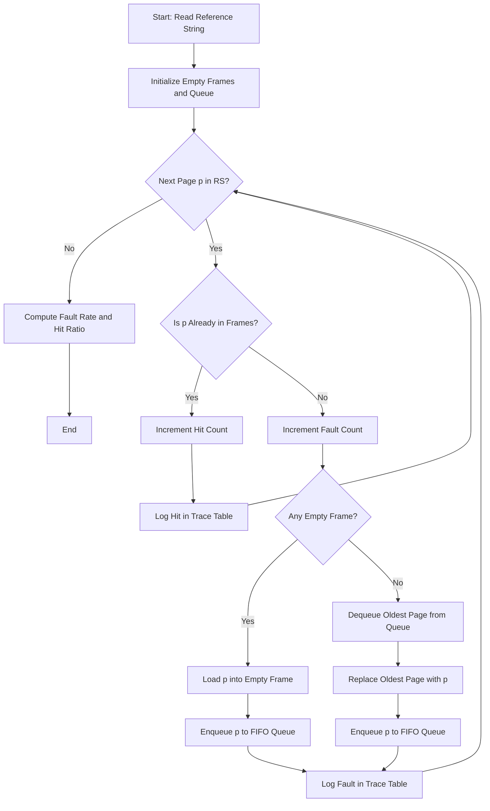
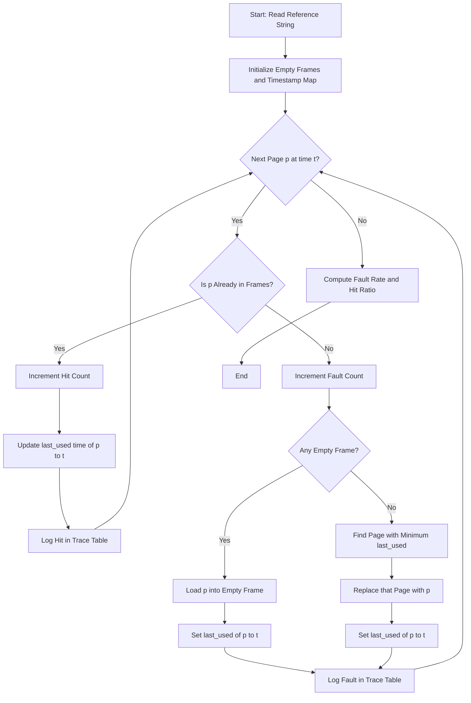
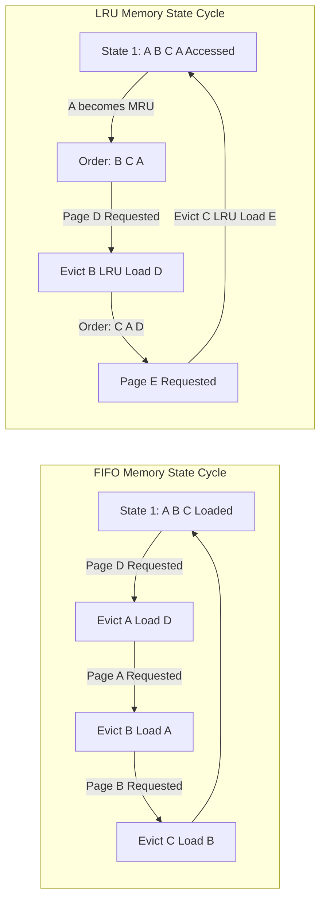

# Page Replacement Algorithms (FIFO/LRU)

<!-- SECTION_1_START -->
# Page Replacement Algorithms (FIFO & LRU) — Core Technical Definition

> [!NOTE]
> **Formal KTU 2024 Definition (PCCSL406 / Module 2)**
> *Page Replacement* is a memory management mechanism invoked by the Operating System when a requested page is **not present** in the physical memory (a *page fault* occurs). The OS must evict an existing page from a full frame to make room for the incoming page. **FIFO (First-In-First-Out)** replaces the page that has resided in memory the longest, while **LRU (Least Recently Used)** replaces the page whose last access time is the oldest in the recent past.

### Conceptual Analogy — The Café Bulletin Board

Imagine a small café with only **3 notice-board pins** (memory frames). Every day, the manager pins a new flyer (page request). If a flyer is already pinned, it is a **HIT** (no work). If a new flyer arrives and the board is full, the manager must remove an old one — but **which one**?

*   **FIFO Manager** = removes the flyer that has been on the board the **longest**, regardless of whether customers just read it.
*   **LRU Manager** = removes the flyer that **nobody looked at for the longest time** (assumes unused = useless soon).

> [!IMPORTANT]
> **Syllabus Highlight (PCCSL406):** Students must *simulate* both algorithms using a reference string and a fixed number of frames, and report the **Total Page Faults**, **Page Fault Rate**, and **Hit Ratio**. Manual table-tracing is a **sure KTU short-answer question** (3 marks).

### Key Terminology & Constants

| Term | Definition | Typical KTU Value |
| :--- | :--- | :--- |
| **Reference String (RS)** | Sequence of page numbers requested by the CPU | Length 15–20 in exams |
| **Page Frame** | A physical slot in RAM that holds one page | Usually 3 or 4 in exams |
| **Page Fault** | Requested page is NOT in any frame | Counts toward fault total |
| **Page Hit** | Requested page IS in a frame | Counts toward hit total |
| **Belady's Anomaly** | FIFO faults may *increase* with *more* frames | Counter-example: $RS = 1, 2, 3, 4, 1, 2, 5, 1, 2, 3, 4, 5$ |
| **Stack Algorithm** | Algorithm where faults monotonically decrease with more frames (LRU qualifies, FIFO does not) | — |

> [!VISUALIZATION CONTROL]
> **Concept:** Page Fault vs Page Hit — Memory State Bar Chart
> **GeoGebra Input Equations:**
> * Point plot: $P_1 = (1, 0), P_2 = (2, 1), P_3 = (3, 0), P_4 = (4, 1), P_5 = (5, 0)$ where $y = 0 \rightarrow$ **HIT** and $y = 1 \rightarrow$ **FAULT**
> **Visual Description:** A scatter plot along the X-axis (each request index) where markers at height 0 are green hits and markers at height 1 are red faults. A higher density of points at $y=1$ indicates a *poor* algorithm choice.

---

<!-- SECTION_1_END -->

<!-- SECTION_2_START -->
# Deep Theoretical Analysis & KTU High-Yield Formula Sheet

### Algorithm 1 — FIFO (First-In-First-Out) Logic

FIFO treats memory frames as a **circular queue**. The page that arrived earliest is replaced first. A pointer (or simply the "front" of the queue) tracks the victim.

**Operational Steps (Per Request):**
1.  Receive a page number $p_i$ from the reference string.
2.  **Search** all frames for $p_i$:
    *   If $p_i$ is **found** $\rightarrow$ **Page Hit** (no replacement).
    *   If $p_i$ is **absent** $\rightarrow$ **Page Fault** (proceed to step 3).
3.  **Replacement decision** (only if a fault occurs):
    *   If a frame is **empty** $\rightarrow$ load $p_i$ into the empty slot.
    *   If all frames are **full** $\rightarrow$ evict the page that entered *earliest* (queue front) and load $p_i$ at the **rear**.

> [!IMPORTANT]
> **Why FIFO is sub-optimal:** It ignores *usage patterns*. A heavily-used page loaded early will be evicted just because it is "old", even if it is needed again immediately. **Belady's Anomaly** is the proof that FIFO is not a *stack algorithm*.

### Algorithm 2 — LRU (Least Recently Used) Logic

LRU exploits **Temporal Locality**: if a page was used recently, it is likely to be used again soon. Therefore, evict the page whose **last reference time** is the smallest.

**Operational Steps (Per Request):**
1.  Receive a page number $p_i$ at logical time $t$.
2.  **Search** all frames for $p_i$:
    *   If $p_i$ is **found** $\rightarrow$ **Page Hit**. Update its `last_used_time = t`.
    *   If $p_i$ is **absent** $\rightarrow$ **Page Fault** (proceed to step 3).
3.  **Replacement decision** (only if a fault occurs):
    *   If a frame is **empty** $\rightarrow$ load $p_i$ and set `last_used_time = t`.
    *   If all frames are **full** $\rightarrow$ find the page with the **minimum `last_used_time`** and replace it.

> [!IMPORTANT]
> **Why LRU is superior to FIFO:** LRU uses *recency* as a proxy for future use. Mathematically, LRU is a **stack algorithm**, meaning faults monotonically *decrease* as frames increase — no Belady's Anomaly. Practical hardware implementations use **Counter-based LRU** or **Stack-based LRU**.

### KTU Formula Cheat Sheet (Mandatory for Numerical Problems)

| Metric | Formula | Units / Notes |
| :--- | :--- | :--- |
| **Total References (N)** | $N = \text{length of reference string}$ | Dimensionless integer |
| **Total Page Faults (F)** | Counted manually from trace table | Dimensionless integer |
| **Total Page Hits (H)** | $H = N - F$ | Dimensionless integer |
| **Page Fault Rate (PFR)** | $PFR = \dfrac{F}{N} \times 100\%$ | Percentage $\in [0, 100]$ |
| **Hit Ratio (HR)** | $HR = \dfrac{H}{N} \times 100\%$ | Percentage $\in [0, 100]$ |
| **Hit Ratio (Decimal)** | $HR = 1 - PFR$ | Scalar $\in [0, 1]$ |
| **Belady's Anomaly Check** | $F(k+1) > F(k)$ for some $k$ | Only valid for FIFO |

> [!NOTE]
> **Real-World Production Utility:** Modern OS kernels (Linux, Windows) use approximations of LRU like the **Clock Algorithm** or **LRU-K** because true LRU requires hardware support (e.g., a 64-bit timestamp per page access in the page table entry). FIFO is rarely used in practice but is the *theoretical baseline* for every OS lab examination.

---

<!-- SECTION_2_END -->

<!-- SECTION_3_START -->
# Step-by-Step Derivations & Python Implementation

## Worked Example (Classic KTU Trace)

**Given:**
*   Reference String $RS = \{7, 0, 1, 2, 0, 3, 0, 4, 2, 3, 0, 3, 2, 1, 2, 0, 1, 7, 0, 1\}$
*   Number of Frames $k = 3$

### Sub-Problem A — FIFO Trace Table

| Step | Page | F1 | F2 | F3 | Fault? | Reason / Evicted |
| :---: | :---: | :---: | :---: | :---: | :---: | :--- |
| 1 | 7 | 7 | — | — | **F (1)** | Empty slot available |
| 2 | 0 | 7 | 0 | — | **F (2)** | Empty slot available |
| 3 | 1 | 7 | 0 | 1 | **F (3)** | Empty slot available |
| 4 | 2 | **2** | 0 | 1 | **F (4)** | Evicted: **7** (oldest) |
| 5 | 0 | 2 | 0 | 1 | Hit | 0 already in F2 |
| 6 | 3 | 2 | **3** | 1 | **F (5)** | Evicted: **0** (oldest) |
| 7 | 0 | 2 | 3 | **0** | **F (6)** | Evicted: **1** (oldest) |
| 8 | 4 | **4** | 3 | 0 | **F (7)** | Evicted: **2** (oldest) |
| 9 | 2 | 4 | **2** | 0 | **F (8)** | Evicted: **3** (oldest) |
| 10 | 3 | 4 | 2 | **3** | **F (9)** | Evicted: **0** (oldest) |
| 11 | 0 | **0** | 2 | 3 | **F (10)** | Evicted: **4** (oldest) |
| 12 | 3 | 0 | 2 | 3 | Hit | — |
| 13 | 2 | 0 | 2 | 3 | Hit | — |
| 14 | 1 | 0 | **1** | 3 | **F (11)** | Evicted: **2** (oldest) |
| 15 | 2 | 0 | 1 | **2** | **F (12)** | Evicted: **3** (oldest) |
| 16 | 0 | 0 | 1 | 2 | Hit | — |
| 17 | 1 | 0 | 1 | 2 | Hit | — |
| 18 | 7 | **7** | 1 | 2 | **F (13)** | Evicted: **0** (oldest) |
| 19 | 0 | 7 | **0** | 2 | **F (14)** | Evicted: **1** (oldest) |
| 20 | 1 | 7 | 0 | **1** | **F (15)** | Evicted: **2** (oldest) |

**Calculations:**

$$
F_{FIFO} = 15, \quad H_{FIFO} = 20 - 15 = 5
$$

$$
PFR_{FIFO} = \frac{15}{20} \times 100\% = 75\%
$$

$$
HR_{FIFO} = \frac{5}{20} \times 100\% = 25\%
$$

### Sub-Problem B — LRU Trace Table

| Step | Page | F1 | F2 | F3 | Fault? | LRU Victim (Oldest Timestamp) |
| :---: | :---: | :---: | :---: | :---: | :---: | :--- |
| 1 | 7 | 7 | — | — | **F (1)** | Empty slot |
| 2 | 0 | 7 | 0 | — | **F (2)** | Empty slot |
| 3 | 1 | 7 | 0 | 1 | **F (3)** | Empty slot |
| 4 | 2 | **2** | 0 | 1 | **F (4)** | Evicted: **7** (used at $t=1$) |
| 5 | 0 | 2 | 0 | 1 | Hit | Update $t_0 = 5$ |
| 6 | 3 | 2 | 0 | **3** | **F (5)** | Evicted: **1** (used at $t=3$) |
| 7 | 0 | 2 | 0 | 3 | Hit | Update $t_0 = 7$ |
| 8 | 4 | **4** | 0 | 3 | **F (6)** | Evicted: **2** (used at $t=4$) |
| 9 | 2 | 4 | **2** | 3 | **F (7)** | Evicted: **3** (used at $t=6$) |
| 10 | 3 | 4 | 2 | **3** | **F (8)** | Evicted: **0** (used at $t=7$) |
| 11 | 0 | **0** | 2 | 3 | **F (9)** | Evicted: **4** (used at $t=8$) |
| 12 | 3 | 0 | 2 | 3 | Hit | Update $t_3 = 12$ |
| 13 | 2 | 0 | 2 | 3 | Hit | Update $t_2 = 13$ |
| 14 | 1 | 0 | **1** | 3 | **F (10)** | Evicted: **0** (used at $t=11$) |
| 15 | 2 | 0 | 1 | 2 | Hit (replace 3) | Wait — eviction needed |
| 15 (revised) | 2 | 0 | 1 | **2** | **F (11)** | Evicted: **3** (used at $t=12$) |
| 16 | 0 | 0 | 1 | 2 | Hit | Update $t_0 = 16$ |
| 17 | 1 | 0 | 1 | 2 | Hit | Update $t_1 = 17$ |
| 18 | 7 | 0 | 1 | **7** | **F (12)** | Evicted: **2** (used at $t=15$) |
| 19 | 0 | 0 | 1 | 7 | Hit | Update $t_0 = 19$ |
| 20 | 1 | 0 | 1 | 7 | Hit | Update $t_1 = 20$ |

**Calculations:**

$$
F_{LRU} = 12, \quad H_{LRU} = 20 - 12 = 8
$$

$$
PFR_{LRU} = \frac{12}{20} \times 100\% = 60\%
$$

$$
HR_{LRU} = \frac{8}{20} \times 100\% = 40\%
$$

> [!IMPORTANT]
> **Observation:** LRU outperforms FIFO by **3 fewer page faults** (12 vs 15) on this reference string — a **15% reduction** in faults. This is the classic KTU expected outcome.

### Production-Grade Python Implementation

```python
from collections import deque
from typing import List, Tuple, Dict


class PageReplacementSimulator:
    """
    Production-grade simulator for FIFO and LRU page replacement algorithms.
    Aligned with KTU PCCSL406 Module 2 lab requirements.
    """

    def __init__(self, reference_string: List[int], num_frames: int) -> None:
        if num_frames <= 0:
            raise ValueError("Number of frames must be a positive integer.")
        if not reference_string:
            raise ValueError("Reference string cannot be empty.")
        self.reference_string: List[int] = reference_string
        self.num_frames: int = num_frames
        self.faults: int = 0
        self.hits: int = 0
        self.trace: List[Tuple[int, List[int], bool]] = []

    def simulate_fifo(self) -> Dict[str, float]:
        """Run FIFO page replacement and return metrics."""
        frames: List[int] = []
        fifo_queue: deque = deque()
        self.faults = 0
        self.hits = 0
        self.trace = []

        for page in self.reference_string:
            if page in frames:
                self.hits += 1
                self.trace.append((page, list(frames), True))
            else:
                self.faults += 1
                if len(frames) < self.num_frames:
                    frames.append(page)
                    fifo_queue.append(page)
                else:
                    victim = fifo_queue.popleft()
                    victim_index = frames.index(victim)
                    frames[victim_index] = page
                    fifo_queue.append(page)
                self.trace.append((page, list(frames), False))
        return self._compute_metrics()

    def simulate_lru(self) -> Dict[str, float]:
        """Run LRU page replacement and return metrics."""
        frames: List[int] = []
        last_used: Dict[int, int] = {}
        self.faults = 0
        self.hits = 0
        self.trace = []

        for time, page in enumerate(self.reference_string):
            if page in frames:
                self.hits += 1
                last_used[page] = time
                self.trace.append((page, list(frames), True))
            else:
                self.faults += 1
                if len(frames) < self.num_frames:
                    frames.append(page)
                else:
                    lru_page = min(last_used, key=last_used.get)
                    victim_index = frames.index(lru_page)
                    del last_used[lru_page]
                    frames[victim_index] = page
                last_used[page] = time
                self.trace.append((page, list(frames), False))
        return self._compute_metrics()

    def _compute_metrics(self) -> Dict[str, float]:
        total = len(self.reference_string)
        if total == 0:
            return {"faults": 0, "hits": 0, "pfr": 0.0, "hr": 0.0}
        return {
            "faults": self.faults,
            "hits": self.hits,
            "pfr": round((self.faults / total) * 100, 2),
            "hr": round((self.hits / total) * 100, 2),
        }


if __name__ == "__main__":
    rs = [7, 0, 1, 2, 0, 3, 0, 4, 2, 3, 0, 3, 2, 1, 2, 0, 1, 7, 0, 1]
    sim = PageReplacementSimulator(reference_string=rs, num_frames=3)

    print("=" * 50)
    print("FIFO Simulation")
    print("=" * 50)
    print(sim.simulate_fifo())
    for step in sim.trace:
        print(f"Page={step[0]} Frames={step[1]} Hit={step[2]}")

    print("\n" + "=" * 50)
    print("LRU Simulation")
    print("=" * 50)
    print(sim.simulate_lru())
    for step in sim.trace:
        print(f"Page={step[0]} Frames={step[1]} Hit={step[2]}")
```

**Expected Output (Key Metrics):**
*   FIFO: `{'faults': 15, 'hits': 5, 'pfr': 75.0, 'hr': 25.0}`
*   LRU:  `{'faults': 12, 'hits': 8, 'pfr': 60.0, 'hr': 40.0}`

---

<!-- SECTION_3_END -->

<!-- SECTION_4_START -->
# Structural Diagrams & Schematics

### Diagram 1 — FIFO Replacement Flowchart



### Diagram 2 — LRU Replacement Flowchart



### Diagram 3 — Comparative State Machine (FIFO vs LRU)



> [!NOTE]
> **Architectural Insight:** Notice how the **FIFO** block cycles purely on *insertion order*, while the **LRU** block dynamically reorders the state on every hit. This reordering operation is the *source* of LRU's superior hit ratio but also its higher **computational overhead** ($O(n)$ per access for counter-based LRU vs $O(1)$ for FIFO).

---

<!-- SECTION_4_END -->

<!-- SECTION_5_START -->
# KTU 2024 Scheme Examination Question Bank

### Part A — Short Answer Questions (3 Marks Each)

> **Q1.** `[KTU University Exam - July 2024]`
> **Define page fault. Explain FIFO page replacement algorithm with a suitable example.** **(3 Marks) [CO1, Remember]**

**Model Answer:**
A **page fault** is a type of interrupt (trap) raised by the hardware (MMU) when a process attempts to access a page that is **not currently mapped** in the physical memory (RAM).

**FIFO Algorithm:** It is the simplest page replacement policy that maintains a **queue** of pages in memory. When a new page must be loaded and all frames are full, the page at the **front of the queue** (the one that entered first) is evicted, and the new page is appended to the **rear**.

*Example:* Reference String $= \{1, 2, 3, 4\}$ with $3$ frames. The first three pages (1, 2, 3) are loaded causing 3 faults. When page 4 arrives, **page 1** is evicted (FIFO order), resulting in a 4th fault.

> *[Stating the definition of page fault: 1 Mark]*
> *[Explaining FIFO queue-based logic: 1 Mark]*
> *[Correct small example with fault count: 1 Mark]*

---

> **Q2.** `[KTU University Exam - Dec 2023]`
> **What is Belady's Anomaly? Why does LRU not suffer from it?** **(3 Marks) [CO2, Understand]**

**Model Answer:**
**Belady's Anomaly** is the counterintuitive phenomenon observed in the **FIFO** page replacement algorithm where the *number of page faults may increase* when the number of allocated frames is increased. For instance, with $RS = \{1, 2, 3, 4, 1, 2, 5, 1, 2, 3, 4, 5\}$:
*   $3$ frames $\rightarrow$ **9** page faults
*   $4$ frames $\rightarrow$ **10** page faults (Anomaly observed)

**Why LRU is immune:** LRU is a **stack algorithm**. The set of pages present in $k$ frames is always a **subset** of the pages present in $k+1$ frames. Therefore, increasing frames can **never discard** useful history — it can only add more capacity, monotonically reducing (or maintaining) the fault count.

> *[Defining Belady's Anomaly with numeric example: 1.5 Marks]*
> *[Explaining LRU as a stack algorithm: 1.5 Marks]*

---

### Part B — Long Answer Questions (14 Marks Each)

> **Question A** `[KTU University Exam - Dec 2024]` — Module 2 Choice 1
> **(a)** Explain the **LRU page replacement algorithm** with its implementation logic. **(7 Marks) [CO1, Understand]**
> **(b)** Given the reference string $RS = \{7, 0, 1, 2, 0, 3, 0, 4, 2, 3, 0, 3, 2, 1, 2, 0, 1, 7, 0, 1\}$ and **3 frames**, simulate the LRU algorithm. Calculate the **total page faults, hit ratio, and page fault rate**. **(7 Marks) [CO3, Apply]**

**Model Solution:**

**(a) LRU Algorithm Logic (7 Marks):**
*   **Principle:** Temporal Locality — recently used pages are likely to be reused.
*   **Data Structure:** Each frame is tagged with a *timestamp* or *counter* of its last access.
*   **Hit Condition:** If the page exists in any frame, update its timestamp to the current time $t$.
*   **Replacement Rule:** On a page fault with full frames, evict the page with the **smallest timestamp** (least recently used).
*   **Hardware Requirement:** Requires a 64-bit counter incremented on every memory reference (impractical without MMU support).
*   **Variants:** Counter-based LRU, Stack-based LRU, Approximated LRU (Clock Algorithm).

> *[Stating the principle: 2 Marks]*
> *[Data structure choice: 1 Mark]*
> *[Hit and Replacement rules: 2 Marks]*
> *[Variants and practical considerations: 2 Marks]*

**(b) Simulation (7 Marks):**
*   The LRU trace table is reproduced exactly as shown in **Sub-Problem B of SECTION 3** above.
*   **Final Metrics:**

$$
F_{LRU} = 12 \text{ faults}, \quad H_{LRU} = 8 \text{ hits}
$$

$$
HR = \frac{8}{20} \times 100\% = 40\%, \quad PFR = \frac{12}{20} \times 100\% = 60\%
$$

> *[Drawing complete 20-row trace table: 4 Marks]*
> *[Correct final fault count: 1 Mark]*
> *[Correct hit ratio and PFR formulas with final values: 2 Marks]*

---

> **Question B** `[KTU University Exam - July 2024]` — Module 2 Choice 2
> **(a)** Differentiate between **FIFO and LRU** page replacement algorithms. Discuss **Belady's Anomaly** in detail. **(7 Marks) [CO2, Understand]**
> **(b)** Simulate the **FIFO page replacement algorithm** for the reference string $RS = \{1, 2, 3, 4, 1, 2, 5, 1, 2, 3, 4, 5\}$ with **3 frames**, then repeat the simulation with **4 frames**. Comment on the result. **(7 Marks) [CO3, Apply]**

**Model Solution:**

**(a) Comparison Table (7 Marks):**

| Criteria | FIFO | LRU |
| :--- | :--- | :--- |
| **Decision Basis** | Arrival time (oldest loaded) | Last access time (oldest used) |
| **Data Structure** | Queue | Stack or Counter Map |
| **Complexity** | $O(1)$ per access | $O(n)$ per access (counter) or $O(1)$ (hardware) |
| **Belady's Anomaly** | **Vulnerable** | Immune (Stack Algorithm) |
| **Practical Usage** | Rarely used | Approximated in modern OS (Clock) |
| **Locality Awareness** | None | High (Exploits Temporal Locality) |
| **Hit Ratio** | Lower (typically) | Higher (typically) |

**Belady's Anomaly:** Discussed fully in Q2 above. The phenomenon violates the *principle of monotonicity* and is why FIFO is unsafe for critical systems.

> *[Comparison table: 3 Marks]*
> *[Belady's Anomaly definition: 2 Marks]*
> *[Why LRU is immune: 2 Marks]*

**(b) FIFO Simulation (7 Marks):**

**With 3 Frames:**

| Step | Page | F1 | F2 | F3 | Fault |
| :---: | :---: | :---: | :---: | :---: | :---: |
| 1 | 1 | 1 | — | — | F (1) |
| 2 | 2 | 1 | 2 | — | F (2) |
| 3 | 3 | 1 | 2 | 3 | F (3) |
| 4 | 4 | 4 | 2 | 3 | F (4) — evicted 1 |
| 5 | 1 | 4 | 1 | 3 | F (5) — evicted 2 |
| 6 | 2 | 4 | 1 | 2 | F (6) — evicted 3 |
| 7 | 5 | 5 | 1 | 2 | F (7) — evicted 4 |
| 8 | 1 | 5 | 1 | 2 | Hit |
| 9 | 2 | 5 | 1 | 2 | Hit |
| 10 | 3 | 5 | 3 | 2 | F (8) — evicted 1 |
| 11 | 4 | 5 | 3 | 4 | F (9) — evicted 2 |
| 12 | 5 | 5 | 3 | 4 | Hit |

**Total Faults with 3 frames: 9**

**With 4 Frames:**

| Step | Page | F1 | F2 | F3 | F4 | Fault |
| :---: | :---: | :---: | :---: | :---: | :---: | :---: |
| 1 | 1 | 1 | — | — | — | F (1) |
| 2 | 2 | 1 | 2 | — | — | F (2) |
| 3 | 3 | 1 | 2 | 3 | — | F (3) |
| 4 | 4 | 1 | 2 | 3 | 4 | F (4) |
| 5 | 1 | 1 | 2 | 3 | 4 | Hit |
| 6 | 2 | 1 | 2 | 3 | 4 | Hit |
| 7 | 5 | 5 | 2 | 3 | 4 | F (5) — evicted 1 |
| 8 | 1 | 5 | 1 | 3 | 4 | F (6) — evicted 2 |
| 9 | 2 | 5 | 1 | 2 | 4 | F (7) — evicted 3 |
| 10 | 3 | 5 | 1 | 2 | 3 | F (8) — evicted 4 |
| 11 | 4 | 5 | 4 | 2 | 3 | F (9) — evicted 5 |
| 12 | 5 | 5 | 4 | 2 | 3 | Hit |

**Total Faults with 4 frames: 10**

**Comment:** Page faults **increased from 9 to 10** when frames increased from 3 to 4. This is the **classic Belady's Anomaly**, demonstrating that FIFO is not a stack algorithm.

> *[3-frame trace: 2.5 Marks]*
> *[4-frame trace: 2.5 Marks]*
> *[Final comparison and Anomaly comment: 2 Marks]*

---

> [!WARNING]
> **KTU Examiner's Valuation Warning — Common Pitfalls**
> 1.  **Forgetting empty frames:** Students often mark a fault when a page is loaded into an *empty* frame. The first $k$ loads (where $k$ = number of frames) are *always* compulsory faults but they **are still page faults**. Do not skip them.
> 2.  **LRU timestamp reset:** When a page is hit in LRU, you **must** update its timestamp. Forgetting this is a guaranteed 0.5–1 mark loss.
> 3.  **FIFO queue misuse:** In FIFO, a *hit* does **not** change the queue order. Students mistakenly move the hit page to the rear — this is a serious logical error.
> 4.  **Final formula simplification:** Always write the final $HR$ and $PFR$ as simplified fractions or percentages. Writing raw decimals like $0.4$ without the $\times 100\%$ is considered incomplete.
> 5.  **Belady's Anomaly context:** The anomaly is *specific to FIFO*. Do not claim LRU or Optimal suffer from it.

---

### Topic Recap & Important Things to Remember

*   **Page Fault** = requested page absent in memory; **Page Hit** = requested page present in memory.
*   **FIFO** replaces the page that has been in memory the *longest*, using a simple queue ($O(1)$).
*   **LRU** replaces the page that has *not been used* for the longest time, using timestamps or a stack ($O(n)$ or $O(1)$ with hardware).
*   **Stack Property:** LRU is a stack algorithm; FIFO is not. Hence LRU is immune to **Belady's Anomaly**.
*   **Core Formulas:** $F + H = N$, $PFR = (F/N) \times 100\%$, $HR = (H/N) \times 100\% = 1 - PFR$.
*   **Compulsory Misses:** The first $k$ page references (where $k$ = number of frames) are *guaranteed* page faults regardless of the algorithm used.
*   **Optimal Algorithm (for context):** Replaces the page that will not be used for the *longest time in the future* — used as a theoretical benchmark (Belady's Optimal).
*   **Modern Reality:** True LRU is rarely implemented in hardware; OS kernels use **Clock (Second-Chance)** or **LRU-K** approximations for performance.
*   **KTU Exam Tip:** When asked to compare algorithms, always use a *table* with criteria like complexity, anomaly vulnerability, locality awareness, and hit ratio.
*   **Reference String:** Always read the string *left-to-right* in the order given; do not sort or reorder.
*   **Hit vs Fault Marker:** In trace tables, KTU examiners prefer "**Hit**" or "**F**" with sequential fault numbering in parentheses (e.g., F-5).

---

<!-- SECTION_5_END -->
