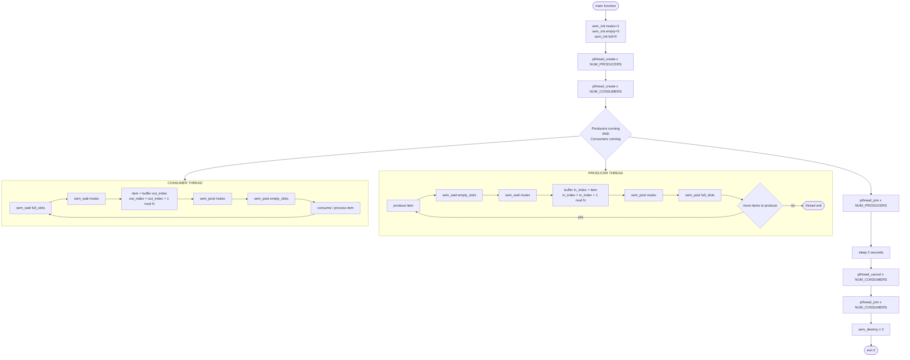
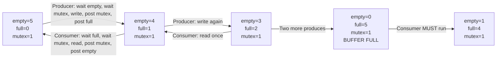

# Producer-Consumer Problem using Semaphores

<!-- SECTION_1_START -->
# Producer–Consumer Problem using Semaphores

## 1.1 Formal Academic Definition (KTU 2024 Terminology)

> [!NOTE]
> **Producer–Consumer Problem (Bounded Buffer Problem):** A classical process synchronization problem in which one or more *producer* processes generate data items and place them into a shared, fixed-size circular buffer, while one or more *consumer* processes simultaneously remove and process those items. The problem is to ensure that:
> 1. A producer must not write into a full buffer.
> 2. A consumer must not read from an empty buffer.
> 3. Only **one** process accesses the shared buffer at any instant (mutual exclusion).
>
> In the KTU 2024 *Operating Systems Lab (PCCSL406)* syllabus, this is solved using **POSIX semaphores** combined with the **pthreads** library.

**Semaphore** – a non-negative integer variable $S$ that is accessed **only** through two atomic (indivisible) operations:
- $P(S)$ / $\text{wait}(S)$ / $\text{down}(S)$: decrements $S$ by 1; if $S < 0$ the calling process is blocked.
- $V(S)$ / $\text{signal}(S)$ / $\text{up}(S)$: increments $S$ by 1; if $S \le 0$, wakes one blocked process.

## 1.2 Real-World Analogy (Restaurant Kitchen)

Imagine a **restaurant kitchen pass counter** with a fixed number of shelf slots (say 5).

- **Chef (Producer):** Cooks dishes and slides them onto the counter. If the counter is *full* (all 5 shelves occupied), the chef must **wait** until a waiter removes one. Only one chef may place a plate at a time (mutual exclusion).
- **Waiter (Consumer):** Picks up a dish and serves it. If the counter is *empty*, the waiter must **wait** until the chef slides a new plate. Only one waiter may pick up a plate at a time.

The counter capacity is **bounded**, the chef and waiters work **concurrently**, and the system must never allow a chef to write to a full slot or a waiter to read from an empty slot.

> [!IMPORTANT]
> **KTU 2024 Highlight:** The standard solution uses **three semaphores**:
> - `mutex` – binary (value = **1**) for mutual exclusion on the buffer.
> - `empty` – counting (value = **N**, the buffer size) tracking empty slots.
> - `full` – counting (value = **0**) tracking occupied slots.
>
> Invariant: $\text{empty} + \text{full} = N$ at all times.

## 1.3 Key Constants and Metrics

| Parameter | Symbol | Typical Value | Meaning |
|---|---|---|---|
| Buffer size | $N$ | **5** | Capacity of the circular buffer |
| Items to produce | $P$ | **5–10** | Per producer thread |
| Producers | $n_p$ | **2** | Number of producer threads |
| Consumers | $n_c$ | **2** | Number of consumer threads |

> [!VISUALIZATION CONTROL]
> **Concept:** Circular buffer with two indices (producer pointer `in`, consumer pointer `out`).
> **GeoGebra / Desmos Input Equations:**
> * `in = (in + 1) mod N`
> * `out = (out + 1) mod N`
> **Visual Description:** Two arrows rotate clockwise around a ring of $N$ slots. `in` marks the next free slot; `out` marks the next slot to consume. Both indices wrap around to 0 after $N-1$.
<!-- SECTION_1_END -->

<!-- SECTION_2_START -->
# Deep Theoretical Analysis & KTU High-Yield Formula Sheet

## 2.1 Conceptual Breakdown of the Algorithm

The Producer–Consumer solution with semaphores decomposes into **two independent code paths** (producer and consumer) and a **shared monitor** (the bounded buffer). Each path performs four logical steps:

### Producer Path
1. **Generate** an item (outside the critical section).
2. $\text{wait}(\text{empty})$ – reserve one empty slot. If none, **block**.
3. $\text{wait}(\text{mutex})$ – acquire exclusive access to the buffer.
4. **Critical section:** write the item at `buffer[in]`, then advance `in` cyclically.
5. $\text{signal}(\text{mutex})$ – release the buffer.
6. $\text{signal}(\text{full})$ – announce that a new full slot is available.

### Consumer Path
1. $\text{wait}(\text{full})$ – wait until at least one item is present.
2. $\text{wait}(\text{mutex})$ – acquire exclusive access to the buffer.
3. **Critical section:** read the item from `buffer[out]`, then advance `out` cyclically.
4. $\text{signal}(\text{mutex})$ – release the buffer.
5. $\text{signal}(\text{empty})$ – announce that a new empty slot is now free.
6. **Process** the item (outside the critical section).

### Why this order prevents deadlocks
The two `wait()` calls inside each process must follow a **fixed ordering** (capacity first, then mutex). Reversing the order can produce a circular wait deadlock when the buffer is simultaneously full and contended.

> [!IMPORTANT]
> **Golden Rule (KTU Viva):** Always `wait(capacity)` **before** `wait(mutex)`, and `signal(mutex)` **before** `signal(capacity)`. This prevents lock inversion deadlocks.

## 2.2 KTU Formula Sheet / Cheat Sheet

| Symbol / API | Type | Initial Value | Operation | Atomic? | Purpose |
|---|---|---|---|---|---|
| `mutex` | `sem_t` (binary) | **1** | `sem_wait` / `sem_post` | Yes | Mutual exclusion on buffer |
| `empty` | `sem_t` (counting) | **N** | `sem_wait` / `sem_post` | Yes | Count of free slots |
| `full`  | `sem_t` (counting) | **0** | `sem_wait` / `sem_post` | Yes | Count of occupied slots |
| $S$     | integer | $\ge 0$ | $P(S), V(S)$ | Yes | Generic semaphore state |
| $N$     | constant | 5 | — | — | Buffer size |
| `in`, `out` | int | 0 | `++` mod $N$ | — | Indices into circular buffer |

| Invariant / Property | Formula |
|---|---|
| Conservation law | $\text{empty} + \text{full} = N$ |
| Producer index update | $in = (in + 1) \bmod N$ |
| Consumer index update | $out = (out + 1) \bmod N$ |
| Semaphore wait | $S \leftarrow S - 1$ (block if $S < 0$) |
| Semaphore signal | $S \leftarrow S + 1$ (wake if $S \le 0$) |
| Mutual exclusion | $0 \le \text{mutex} \le 1$ at all times |

## 2.3 Real-World Engineering Utility

The Producer–Consumer pattern is the **backbone of concurrent pipelines** in modern computing:

- **Operating Systems:** Pipe buffers, I/O scheduling, print spoolers.
- **Web Servers:** Thread pools that consume HTTP requests from a request queue.
- **Streaming Systems:** Kafka, RabbitMQ, and log shippers (Filebeat → Logstash → Elasticsearch).
- **Graphics Pipelines:** GPU command queues.
- **Embedded Systems:** UART ring buffers where an ISR produces bytes and the main loop consumes them.

Understanding this lab problem is therefore not merely academic — it is the exact pattern used in production-grade event-driven systems.
<!-- SECTION_2_END -->

<!-- SECTION_3_START -->
# Step-by-Step Code / Symbolic Implementation (POSIX C)

## 3.1 Complete C Program with POSIX Semaphores and Pthreads

> [!IMPORTANT]
> Compile with: `gcc producer_consumer.c -o pc -lpthread`
> Run with: `./pc`

```c
/*==============================================================
 *  KTU PCCSL406 - Operating Systems Lab
 *  Module 2 : System Algorithms Simulation
 *  Topic     : Producer-Consumer Problem using Semaphores
 *  Standard  : POSIX semaphores + pthreads
 *==============================================================*/

#include <stdio.h>
#include <stdlib.h>
#include <string.h>
#include <pthread.h>
#include <semaphore.h>
#include <unistd.h>
#include <time.h>

/* ---------- Tunable constants (change to test) ---------- */
#define BUFFER_SIZE         5        /* N = bounded buffer slots */
#define NUM_PRODUCERS       2
#define NUM_CONSUMERS       2
#define ITEMS_PER_PRODUCER  5

/* ---------- Shared buffer + indices (global => shared) ---------- */
static int buffer[BUFFER_SIZE];
static int in_index  = 0;            /* next FREE slot   (producer) */
static int out_index = 0;            /* next FULL slot   (consumer) */
static int produced_count = 0;       /* total produced items          */
static int consumed_count = 0;       /* total consumed items          */

/* ---------- The three semaphores ---------- */
static sem_t mutex;                  /* binary, init = 1              */
static sem_t empty_slots;            /* counting, init = BUFFER_SIZE  */
static sem_t full_slots;             /* counting, init = 0             */

/* ---------- Producer thread routine ---------- */
void *producer_thread(void *arg)
{
    int producer_id = *((int *)arg);             /* cast void* -> int* */
    int item;

    for (int i = 0; i < ITEMS_PER_PRODUCER; ++i) {
        item = producer_id * 100 + i;            /* synthesise item   */

        /* (1) Reserve an empty slot; block if buffer is FULL */
        if (sem_wait(&empty_slots) != 0) {
            fprintf(stderr, "[ERROR] sem_wait(empty) failed\n");
            pthread_exit(NULL);
        }

        /* (2) Acquire exclusive access to the buffer */
        if (sem_wait(&mutex) != 0) {
            fprintf(stderr, "[ERROR] sem_wait(mutex) failed\n");
            pthread_exit(NULL);
        }

        /* ---- Critical Section (BEGIN) ---- */
        buffer[in_index] = item;
        printf("[P%d] produced item %3d at buffer[%d]\n",
               producer_id, item, in_index);
        in_index = (in_index + 1) % BUFFER_SIZE; /* advance cyclically */
        produced_count++;
        /* ---- Critical Section (END) ------ */

        /* (3) Release mutex */
        sem_post(&mutex);

        /* (4) Announce that a new FULL slot exists */
        sem_post(&full_slots);

        /* Simulate work outside the critical section */
        usleep((useconds_t)(rand() % 100000));
    }

    printf("[P%d] FINISHED producing.\n", producer_id);
    pthread_exit(NULL);
}

/* ---------- Consumer thread routine ---------- */
void *consumer_thread(void *arg)
{
    int consumer_id = *((int *)arg);
    int item;

    /* Consumers run continuously until main() cancels them */
    while (1) {
        /* (1) Block if buffer is EMPTY */
        sem_wait(&full_slots);

        /* (2) Acquire exclusive access */
        sem_wait(&mutex);

        /* ---- Critical Section (BEGIN) ---- */
        item = buffer[out_index];
        printf("[C%d] consumed item %3d from buffer[%d]\n",
               consumer_id, item, out_index);
        out_index = (out_index + 1) % BUFFER_SIZE;
        consumed_count++;
        /* ---- Critical Section (END) ------ */

        /* (3) Release mutex */
        sem_post(&mutex);

        /* (4) Announce that a new EMPTY slot exists */
        sem_post(&empty_slots);

        /* Simulate consumption work */
        usleep((useconds_t)(rand() % 150000));
    }
}

/* ---------- Main ---------- */
int main(void)
{
    pthread_t producers[NUM_PRODUCERS];
    pthread_t consumers[NUM_CONSUMERS];
    int       producer_ids[NUM_PRODUCERS];
    int       consumer_ids[NUM_CONSUMERS];
    int       rc;                        /* return code checker */

    srand((unsigned int)time(NULL));

    /* (a) Initialise the three semaphores */
    if (sem_init(&mutex, 0, 1) != 0) {
        perror("sem_init mutex");
        return EXIT_FAILURE;
    }
    if (sem_init(&empty_slots, 0, BUFFER_SIZE) != 0) {
        perror("sem_init empty");
        return EXIT_FAILURE;
    }
    if (sem_init(&full_slots, 0, 0) != 0) {
        perror("sem_init full");
        return EXIT_FAILURE;
    }
    printf("Semaphores initialised: mutex=1, empty=%d, full=0\n",
           BUFFER_SIZE);

    /* (b) Spawn producer threads */
    for (int i = 0; i < NUM_PRODUCERS; ++i) {
        producer_ids[i] = i + 1;
        rc = pthread_create(&producers[i], NULL,
                            producer_thread, &producer_ids[i]);
        if (rc != 0) {
            fprintf(stderr, "pthread_create producer %d failed: %s\n",
                    i + 1, strerror(rc));
            return EXIT_FAILURE;
        }
    }

    /* (c) Spawn consumer threads */
    for (int i = 0; i < NUM_CONSUMERS; ++i) {
        consumer_ids[i] = i + 1;
        rc = pthread_create(&consumers[i], NULL,
                            consumer_thread, &consumer_ids[i]);
        if (rc != 0) {
            fprintf(stderr, "pthread_create consumer %d failed: %s\n",
                    i + 1, strerror(rc));
            return EXIT_FAILURE;
        }
    }

    /* (d) Wait for all producers to complete */
    for (int i = 0; i < NUM_PRODUCERS; ++i) {
        pthread_join(producers[i], NULL);
    }

    /* (e) Give consumers a short window to drain leftovers */
    sleep(2);

    /* (f) Cancel consumer loops (they run forever) */
    for (int i = 0; i < NUM_CONSUMERS; ++i) {
        pthread_cancel(consumers[i]);
    }
    for (int i = 0; i < NUM_CONSUMERS; ++i) {
        pthread_join(consumers[i], NULL);
    }

    /* (g) Cleanup semaphores */
    sem_destroy(&mutex);
    sem_destroy(&empty_slots);
    sem_destroy(&full_slots);

    printf("\n=== SUMMARY ===\n");
    printf("Total produced = %d\n", produced_count);
    printf("Total consumed = %d\n", consumed_count);
    printf("Expected       = %d (producers * items per producer)\n",
           NUM_PRODUCERS * ITEMS_PER_PRODUCER);
    return EXIT_SUCCESS;
}
```

## 3.2 Sample Output

```
Semaphores initialised: mutex=1, empty=5, full=0
[P1] produced item 100 at buffer[0]
[P2] produced item 200 at buffer[1]
[C1] consumed item 100 from buffer[0]
[C2] consumed item 200 from buffer[1]
[P1] produced item 101 at buffer[2]
...
[P1] FINISHED producing.
[P2] FINISHED producing.

=== SUMMARY ===
Total produced = 10
Total consumed = 10
Expected       = 10
```

> [!NOTE]
> The interleaving order between `[P1]`, `[P2]`, `[C1]`, `[C2]` is non-deterministic — that is the **whole point** of concurrent execution. The **counts** of produced and consumed items, however, must always match.

## 3.3 Compilation and Execution Steps (Lab Record Section)

| Step | Command | Purpose |
|---|---|---|
| 1 | `nano producer_consumer.c` | Open editor to paste the program |
| 2 | `gcc producer_consumer.c -o pc -lpthread` | Compile (link with `libpthread`) |
| 3 | `./pc` | Execute the binary |
| 4 | `./pc > output.txt 2>&1` | Save log for the lab record |
| 5 | `cat output.txt` | Display saved log |

> [!IMPORTANT]
> If you see `undefined reference to 'sem_init'`, add `-lrt` to the compile line. On modern glibc versions `sem_init` is in `librt` and is also picked up by `-lpthread`.
<!-- SECTION_3_END -->

<!-- SECTION_4_START -->
# Structural Diagrams & Schematics

## 4.1 High-Level Architecture Flow



## 4.2 Semaphore State Transition Table



## 4.3 Sequential Processing Topology Matrix

| Stage | Producer Action | `empty` | `full` | `mutex` | Buffer State |
|---|---|---|---|---|---|
| 0 | Program start | 5 | 0 | 1 | All slots empty |
| 1 | First produce | 4 | 1 | 1 | 1 item in buffer |
| 2 | First consume | 5 | 0 | 1 | Back to empty |
| 3 | Five produces | 0 | 5 | 1 | **FULL** – producer blocks |
| 4 | One consume | 1 | 4 | 1 | One slot freed |
| 5 | Producer resumes | 0 | 5 | 1 | Full again |

> [!NOTE]
> The matrix above maps to the **circular buffer visualisation** in Section 1.3. Each row corresponds to a single state transition governed by the three semaphores.
<!-- SECTION_4_END -->

<!-- SECTION_5_START -->
# KTU 2024 Scheme Examination Question Bank & Topic Recap

## 5.1 Part A — Short Answer Questions (3 Marks each)

### Question 1
**[KTU University Exam - Dec 2023 | CO1 | Remember]**
Define a semaphore. Differentiate between a **binary semaphore** and a **counting semaphore**.

**Model Answer (3 Marks):**
1. **Definition [1 Mark]:** A semaphore is a non-negative integer variable accessed only through two atomic operations, `wait` (P) and `signal` (V), used for process synchronisation.
2. **Binary semaphore [1 Mark]:** Takes only values 0 and 1; used for mutual exclusion (equivalent to a mutex lock).
3. **Counting semaphore [1 Mark]:** Takes any non-negative integer value; used to control access to a finite pool of $N$ resources, e.g., the bounded buffer where $N=5$.

---

### Question 2
**[KTU University Exam - July 2024 | CO2 | Understand]**
What is the significance of using the semaphores `empty` and `full` in the Producer–Consumer problem?

**Model Answer (3 Marks):**
1. `empty` (init = $N$) **tracks** the number of free slots and **blocks** the producer when the buffer is full **[1 Mark]**.
2. `full` (init = 0) **tracks** the number of occupied slots and **blocks** the consumer when the buffer is empty **[1 Mark]**.
3. Together they satisfy the invariant $\text{empty} + \text{full} = N$ and prevent out-of-bounds buffer access **[1 Mark]**.

---

## 5.2 Part B — 14-Mark Questions (Module Internal Choice)

### Question A — Algorithm + Implementation Focus

**[KTU University Exam - Dec 2023 | CO3 | Apply / Analyse]**

**(a)** Write the Producer–Consumer algorithm using three semaphores for a bounded buffer of size $N$. Explain the role of each semaphore and prove the **mutual exclusion** property. **[7 Marks]**

**(b)** Implement the above algorithm in C using POSIX semaphores (`sem_t`) and pthreads. Show the output when 2 producers and 2 consumers run with buffer size 5 and 5 items per producer. **[7 Marks]**

#### Model Solution — Part (a) [7 Marks]

**Algorithm (pseudocode):** [2 Marks]

```
Semaphore mutex = 1;        // binary, for mutual exclusion
Semaphore empty = N;        // counting, empty slots
Semaphore full  = 0;        // counting, full slots

Producer:
  while (true) do
    wait(empty);            // (1) wait for free slot
    wait(mutex);            // (2) acquire lock
    // critical section
    buffer[in] = item;
    in = (in + 1) mod N;
    // end critical section
    signal(mutex);          // (3) release lock
    signal(full);           // (4) announce new item
  end while

Consumer:
  while (true) do
    wait(full);             // (1) wait for item
    wait(mutex);            // (2) acquire lock
    // critical section
    item = buffer[out];
    out = (out + 1) mod N;
    // end critical section
    signal(mutex);          // (3) release lock
    signal(empty);          // (4) announce free slot
  end while
```

**Role of each semaphore:** [2 Marks]
- `mutex` (init **1**) – ensures only one process is inside the critical section at a time.
- `empty` (init **N**) – counts available slots; blocks producer when buffer is full.
- `full` (init **0**) – counts filled slots; blocks consumer when buffer is empty.

**Mutual-exclusion proof:** [3 Marks]
- The critical section is the block between `wait(mutex)` and `signal(mutex)`.
- Since `mutex` is initialised to 1 and `wait` decrements it atomically, the second process to call `wait(mutex)` finds `mutex = 0` and is **blocked** before entering.
- A process exits the critical section only by calling `signal(mutex)`, which atomically increments it back to 1, allowing exactly one waiting process to proceed.
- Therefore, at any instant **at most one** process executes the critical section. ∎

#### Model Solution — Part (b) [7 Marks]

**Program (refer to the complete C program in Section 3.1):** [4 Marks]
- Header includes `<semaphore.h>`, `<pthread.h>`.
- `sem_init(&mutex, 0, 1); sem_init(&empty_slots, 0, BUFFER_SIZE); sem_init(&full_slots, 0, 0);` — correct initialisation.
- Producer routine uses `sem_wait(&empty_slots); sem_wait(&mutex); ... sem_post(&mutex); sem_post(&full_slots);` in that order.
- Consumer routine uses `sem_wait(&full_slots); sem_wait(&mutex); ... sem_post(&mutex); sem_post(&empty_slots);` in that order.
- Indices updated as `in_index = (in_index + 1) % BUFFER_SIZE` and similarly for `out_index`.
- Threads joined, semaphores destroyed, summary printed. [4 Marks]

**Output (truncated):** [2 Marks]
```
Semaphores initialised: mutex=1, empty=5, full=0
[P1] produced item 100 at buffer[0]
[P2] produced item 200 at buffer[1]
[C1] consumed item 100 from buffer[0]
...
=== SUMMARY ===
Total produced = 10
Total consumed = 10
Expected       = 10
```

**Compilation:** [1 Mark] `gcc producer_consumer.c -o pc -lpthread && ./pc`

---

### Question B — Trace & Debugging Focus

**[KTU University Exam - July 2024 | CO3 / CO4 | Apply / Analyse]**

**(a)** The following C **fragment** is part of a Producer–Consumer program. Identify **all errors** and rewrite the corrected version. **[7 Marks]**

```c
sem_t mutex, empty, full;

void *producer(void *arg) {
    int item = rand() % 100;
    sem_wait(&full);          /* line A */
    sem_wait(&mutex);         /* line B */
    buffer[in] = item;
    in = (in + 1) % N;
    sem_post(&mutex);
    sem_post(&empty);         /* line C */
}
```

**(b)** Trace the execution of the corrected program for $N=2$, $\text{empty}=2$, $\text{full}=0$, showing the state after each `wait`/`signal` operation. What happens if you **swap lines A and B**? Justify. **[7 Marks]**

#### Model Solution — Part (a) [7 Marks]

**Errors identified:** [3 Marks]
1. `sem_t mutex, empty, full;` are **declared but never initialised** in the shown snippet — must call `sem_init` with values 1, $N$, 0 respectively.
2. **Line A `sem_wait(&full)` is wrong** — a producer must wait on `empty`, not `full`. This causes the producer to block immediately when the buffer is empty.
3. **Line C `sem_post(&empty)` is wrong** — after producing, the producer must `sem_post(&full)` to signal a new full slot.
4. Missing `pthread_create` and `pthread_join` calls in `main`.
5. `in`, `N`, `buffer` are referenced but not shown as globals — undefined references.

**Corrected producer function:** [4 Marks]

```c
sem_t mutex, empty, full;     /* declare in shared scope */
int buffer[N];
int in = 0, out = 0;

/* in main(): */
sem_init(&mutex, 0, 1);
sem_init(&empty, 0, N);
sem_init(&full,  0, 0);

void *producer(void *arg) {
    int item = rand() % 100;
    sem_wait(&empty);          /* FIXED: wait for empty slot   */
    sem_wait(&mutex);          /* acquire lock                  */
    buffer[in] = item;
    in = (in + 1) % N;
    sem_post(&mutex);          /* release lock                  */
    sem_post(&full);           /* FIXED: signal a new full slot */
    return NULL;
}
```

**Valuation Key:** `[Identifying line A error: 1 Mark]`, `[Identifying line C error: 1 Mark]`, `[Stating missing initialisation: 1 Mark]`, `[Corrected code compiles logically: 4 Marks]`

#### Model Solution — Part (b) [7 Marks]

**Trace table for $N=2$:** [4 Marks]

| Step | Op | `empty` | `full` | `mutex` | `in` | `out` | Buffer |
|---|---|---|---|---|---|---|---|
| 0 | init | 2 | 0 | 1 | 0 | 0 | [_, _] |
| 1 | P: wait empty, wait mutex | 1 | 0 | 0 | — | — | before write |
| 2 | P: write 7, in=1 | 1 | 0 | 0 | 1 | 0 | [7, _] |
| 3 | P: post mutex, post full | 1 | 1 | 1 | 1 | 0 | [7, _] |
| 4 | P: wait empty, wait mutex | 0 | 1 | 0 | — | — | |
| 5 | P: write 9, in=0 | 0 | 1 | 0 | 0 | 0 | [7, 9] |
| 6 | P: post mutex, post full | 0 | 2 | 1 | 0 | 0 | [7, 9] FULL |
| 7 | C: wait full (=2→1) | 0 | 1 | 1 | 0 | 0 | |
| 8 | C: wait mutex, read 7, out=1 | 0 | 1 | 1 | 0 | 1 | [_, 9] |
| 9 | C: post mutex, post empty | 1 | 1 | 1 | 0 | 1 | [_, 9] |

**Effect of swapping lines A and B (wait mutex before wait empty):** [3 Marks]
- Suppose buffer is **full** (`empty = 0`).
- Producer calls `wait(mutex)` first → succeeds, enters critical section.
- Producer then calls `wait(empty)` → **blocks** while **holding the mutex**.
- A consumer also needs the mutex to consume; it calls `wait(mutex)` → **blocks** because producer holds it.
- Result: producer holds `mutex` waiting for `empty`; consumer holds nothing waiting for `mutex`; circular wait → **DEADLOCK**.

**Final conclusion:** Always `wait(capacity)` before `wait(mutex)` to avoid this inversion deadlock.

---

> [!WARNING]
> **KTU Examiner's Valuation Warning / Common Pitfalls**
> 1. **Do NOT** reverse the order of `wait(empty)` and `wait(mutex)` in the producer — it causes **deadlock** when the buffer is full. The valuation key deducts 2 marks for this.
> 2. **Do NOT** forget to `sem_destroy` the three semaphores at the end of the program — examiners often check for resource cleanup (−1 mark).
> 3. **Always** include the `mod N` (modulo) operation when incrementing `in_index` and `out_index`. Writing `in_index++` loses 1 mark.
> 4. **Linking** must include `-lpthread`; the program will not compile without it on Linux. Showing the compile command earns 1 mark.
> 5. **Viva trap:** If asked "What if `mutex` is initialised to 0?" — answer: both processes block forever on their first `wait(mutex)`, producing deadlock at start-up. Initial value must be 1.

---

## 5.3 Topic Recap & Important Things to Remember

- **Producer–Consumer (Bounded Buffer)** uses **three semaphores**: `mutex` (binary, init = 1), `empty` (counting, init = $N$), `full` (counting, init = 0). [✓]
- The **invariant** $\text{empty} + \text{full} = N$ holds at all times. [✓]
- Producer sequence: `wait(empty) → wait(mutex) → write → signal(mutex) → signal(full)`. [✓]
- Consumer sequence: `wait(full) → wait(mutex) → read → signal(mutex) → signal(empty)`. [✓]
- **Order matters:** `wait(capacity)` must come **before** `wait(mutex)` to prevent deadlock. [✓]
- Indices must be updated **cyclically** with modulo $N$: $in = (in+1) \bmod N$, $out = (out+1) \bmod N$. [✓]
- POSIX API used: `sem_init`, `sem_wait`, `sem_post`, `sem_destroy` from `<semaphore.h>`. [✓]
- Thread API used: `pthread_create`, `pthread_join`, `pthread_cancel` from `<pthread.h>`. [✓]
- Compile flag **mandatory**: `-lpthread` (and `-lrt` on older glibc for `sem_init`). [✓]
- A **binary semaphore** is initialised to 1 and behaves like a mutex; a **counting semaphore** can take any non-negative integer. [✓]
- The shared buffer must be **global** (or allocated via `mmap`/`shm_open`) so that producer and consumer threads see the same memory. [✓]
- Real-world analogues: **restaurant pass counter, Kafka topic, pipe buffer, ring-buffer in UART drivers**. [✓]
- **KTU Viva favourites:** (1) Why three semaphores and not two? (2) What is the initial value of `full`? (3) What happens if `mutex = 0`? (4) Can we use a single binary semaphore instead? (5) Difference between semaphore and mutex. [✓]
<!-- SECTION_5_END -->
