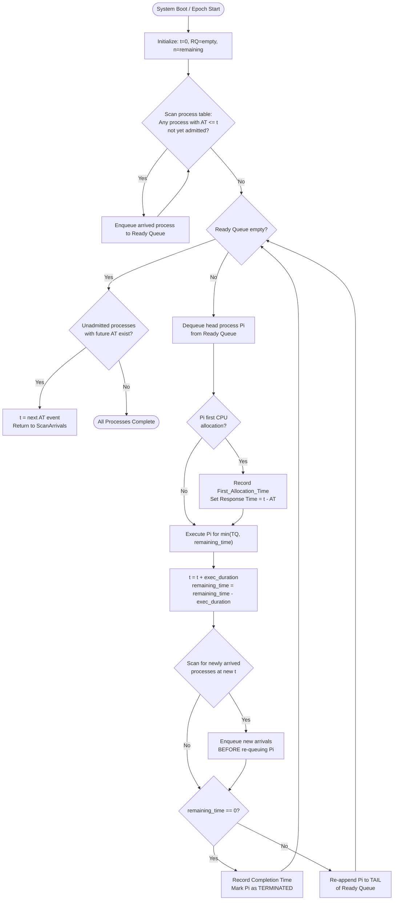
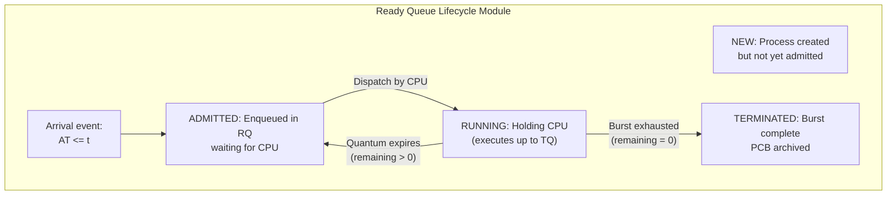
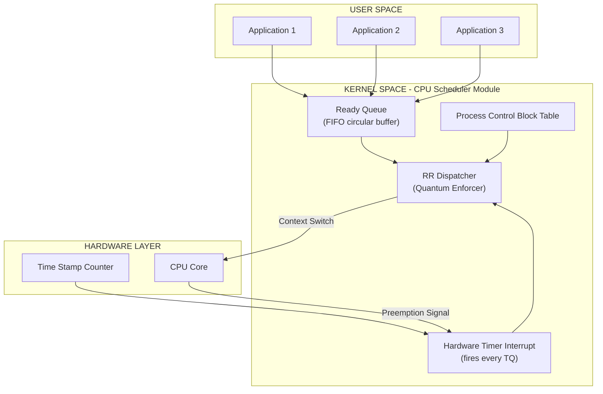

# Round Robin CPU Scheduling Algorithm

<!-- SECTION_1_START -->

# Round Robin CPU Scheduling Algorithm

## 1.1 Formal Academic Definition (KTU 2024 Syllabus Terminology)

> [!IMPORTANT]
> **Round Robin (RR) Scheduling** is a **preemptive** CPU scheduling algorithm designed specifically for **time-sharing systems**. Processes are assigned to the CPU in the order they arrive in the **Ready Queue**, with each process being allowed to execute for a fixed duration called the **Time Quantum** (or **Time Slice**). If a process does not complete its burst time within the quantum, it is **preempted** and appended to the tail of the Ready Queue, allowing the next process in line to begin its turn. This cyclic execution continues until every process has finished.

The Round Robin algorithm falls under the category of **Preemptive Scheduling Algorithms** (along with Shortest Remaining Time First and Priority Preemptive), and it is the standard scheduling policy used in modern general-purpose operating systems such as **Linux (CFS)**, **Windows (NT Kernel)**, and classical **UNIX** systems.

**Key Terminology from the KTU Module:**

| Term | Definition |
| :--- | :--- |
| **Time Quantum (TQ)** | The fixed maximum time slice a process is allowed to hold the CPU in one continuous stretch |
| **Ready Queue (RQ)** | A circular FIFO queue holding all processes that have arrived and are waiting for the CPU |
| **Preemption** | The forced removal of a process from the CPU before its burst time completes, triggered by quantum expiry |
| **Context Switch** | The act of saving the state of the currently running process and loading the state of the next one |
| **Gantt Chart** | A horizontal bar chart used to visualize the sequence and duration of process execution |

## 1.2 Conceptual Analogy & Intuition

> [!NOTE]
> **Real-World Analogy — "The Amusement Park Ride Queue"**
> Imagine a popular amusement park ride where a roller coaster car has exactly **8 seats**. A group of friends shows up — 5 people form one big family group, and 3 individuals form a smaller group. The rule of the ride is: **No single group can take more than one trip in a row**. So, even if the family of 5 is next, they board, ride for one round, and then they MUST step out so the smaller group of 3 gets their turn. If the family still has 2 people wanting to ride, they rejoin the back of the queue and wait for their next turn.
> In this analogy:
> - The **roller coaster car** = the CPU
> - The **seats** (8) = the **Time Quantum** of execution time
> - The **family and group** = Processes with their burst times
> - **Stepping out and re-queuing** = **Preemption** of a process
> - **The cycle of seating** = the cyclic nature of Round Robin

## 1.3 The Intuitive Mental Model

Think of Round Robin as a **circular dining table** where every process gets a "seat" (CPU) for an equal slice of time. The fairness is enforced by the **circular queue** — no process starves because every process gets repeated turns. The critical design knob is the **Time Quantum**:

- **Too small (e.g., 1 ms)** → Excessive context switching overhead, CPU wastes time switching instead of doing useful work
- **Too large (e.g., 1000 ms)** → Behaves almost like FIFO; long processes monopolize the CPU
- **Just right (e.g., 10–100 ms)** → Optimal balance between fairness, response time, and throughput

> [!TIP]
> **The Golden Rule of Time Quantum Selection:** A good heuristic is to set the Time Quantum such that **80% of CPU bursts complete within one quantum**. This minimizes the average turnaround time while keeping response time low for short processes.

## 1.4 Why Round Robin Matters in Modern Engineering

| Real-World Use Case | Why RR is Chosen |
| :--- | :--- |
| **Web Servers (Apache, Nginx)** | Equal response time for all incoming HTTP requests prevents slow client requests from blocking fast ones |
| **Desktop Operating Systems** | Users running multiple apps (browser, music, document) expect each to feel "responsive" simultaneously |
| **Cloud Computing (Kubernetes pods)** | Fair CPU time distribution across competing microservices prevents noisy-neighbor problems |
| **Embedded Real-Time Kernels** | Variations of RR (e.g., Weighted RR, Deficit RR) underpin many RTOS schedulers |

---

<!-- SECTION_1_END -->

<!-- SECTION_2_START -->

# Deep Theoretical Analysis & KTU High-Yield Formula Sheet

## 2.1 Operational Mechanics — Step-by-Step Logic

The Round Robin algorithm operates on a **strict cyclic discipline**. The exact operational sequence is:

1. **Initialization Phase**
   - On system boot or at scheduling epoch start, build the **Ready Queue** by inserting all processes that have already arrived (Arrival Time $\le$ current simulation time $t$).
   - Initialize all `remaining_time` values to their respective `burst_time`.
   - Initialize `current_time` $t = 0$.

2. **Dispatch Phase**
   - Dequeue the **head process** $P_i$ from the Ready Queue and assign it to the CPU.
   - The process executes for a duration of $\min(\text{Time Quantum}, P_i.\text{remaining\_time})$.

3. **Quantum Expiry Check (Preemption Decision)**
   - **Case A — Process Completes:** If $P_i.\text{remaining\_time} == 0$ at the end of its quantum, mark the process as **TERMINATED** and record its **Completion Time** $= t$.
   - **Case B — Quantum Expires:** If $P_i.\text{remaining\_time} > 0$, decrement it by the quantum duration, set $P_i.\text{completion\_flag} = \text{FALSE}$, and re-append $P_i$ to the **tail** of the Ready Queue.

4. **Arrival Phase (Crucial Step Often Missed)**
   - *Before* dispatching the next process, scan the process table and enqueue **any newly arrived processes** whose `arrival_time $\le$ current_time $t$` but have not yet entered the queue.

5. **Loop or Termination**
   - Advance $t$ by the executed duration.
   - If the Ready Queue is **non-empty**, return to Step 2.
   - If the Ready Queue is **empty** but some processes have future arrival times, jump $t$ to the next arrival event and re-enter Step 1.
   - If all processes are terminated, the algorithm terminates.

## 2.2 KTU Formula Sheet & Performance Metric Cheat Sheet

> [!IMPORTANT]
> The following table consolidates **every formula** the KTU 2024 examiner expects for the Round Robin module. Memorize these definitions — they are the most common source of easy marks in Part A questions.

| # | Metric | Formula | Meaning | Unit |
| :--- | :--- | :--- | :--- | :--- |
| 1 | **Completion Time (CT)** | Recorded from Gantt chart end | The wall-clock time at which a process finishes | ms or s |
| 2 | **Turnaround Time (TAT)** | $TAT_i = CT_i - AT_i$ | Total time a process spends in the system | ms or s |
| 3 | **Waiting Time (WT)** | $WT_i = TAT_i - BT_i$ | Time a process spends waiting in the Ready Queue (not executing, not doing I/O) | ms or s |
| 4 | **Response Time (RT)** | $RT_i = \text{First CPU Allocation} - AT_i$ | Time until the process gets the CPU for the *first* time | ms or s |
| 5 | **Average Waiting Time** | $\overline{WT} = \frac{1}{n}\sum_{i=1}^{n} WT_i$ | Mean waiting across all processes | ms or s |
| 6 | **Average Turnaround Time** | $\overline{TAT} = \frac{1}{n}\sum_{i=1}^{n} TAT_i$ | Mean turnaround across all processes | ms or s |
| 7 | **Throughput** | $\text{Throughput} = \frac{n}{\text{Total Execution Time}}$ | Number of processes completed per unit time | processes/ms |
| 8 | **CPU Efficiency** | $\eta = \frac{\sum BT_i}{\sum BT_i + (n_c \times T_{cs})} \times 100\%$ | Useful work vs. total elapsed time (where $n_c$ = number of context switches, $T_{cs}$ = time per switch) | Percentage (%) |
| 9 | **Context Switches Count** | $n_c$ = (Total Gantt segments) $-$ (Number of processes) | The number of times the OS forcibly swaps the CPU between processes | Integer count |

> [!TIP]
> **Quick-Verify Identity for Exam Cross-Check:** The sum of all Waiting Times **plus** the sum of all Burst Times **plus** the total Idle Time (if any) **must equal** the Total Execution Time. That is, $\sum WT_i + \sum BT_i + \text{Idle Time} = T_{\text{total}}$. Use this as a sanity check on your answers.

## 2.3 Effect of Time Quantum on Algorithm Behavior

The Time Quantum is the **single most important tunable parameter** in RR. The asymptotic behavior of the algorithm as $TQ$ varies is summarized below:

| Time Quantum Value | Algorithmic Behavior | Practical Consequence |
| :--- | :--- | :--- |
| $TQ \rightarrow \infty$ | Degenerates to **FCFS (First-Come, First-Served)** | High waiting time for short processes; poor responsiveness |
| $TQ = 0$ | Pure time-slicing with maximum overhead | CPU spends all time context switching; **zero useful work** |
| $TQ$ too small | Excessive context-switching overhead | Low CPU efficiency, high average TAT despite fairness |
| $TQ$ too large | Behaves like FCFS for typical burst lengths | Short processes get stuck behind long ones |
| $TQ$ well-tuned | Balance between fairness, throughput, and responsiveness | **Optimal operating regime for RR** |

## 2.4 Real-World Engineering Utility

In production engineering, Round Robin is rarely deployed in its pure textbook form. Instead, **weighted variants** dominate:

- **Weighted Round Robin (WRR):** Used in network routers and switches (e.g., Cisco QoS) to give different traffic classes different shares of bandwidth.
- **Deficit Round Robin (DRR):** Used in Linux's `tc` traffic control for packet scheduling.
- **Multilevel Feedback Queue (MLFQ):** The actual scheduler in Linux's CFS and FreeBSD — dynamically varies the time slice based on process behavior.

> [!NOTE]
> **For KTU Exam Tip:** If a question asks "Why is RR preferred for time-sharing systems?" the model answer is: *"RR provides excellent response time for short jobs and ensures fairness (no starvation) by guaranteeing every process periodic CPU access. This makes it ideal for interactive, multi-user environments where perceived responsiveness matters more than absolute throughput."*

---

<!-- SECTION_2_END -->

<!-- SECTION_3_START -->

# Step-by-Step Derivations & Code/Symbolic Implementation

## 3.1 Worked Numerical Example (Full Manual Solution)

To cement the theoretical foundation, we will solve a complete Round Robin problem step-by-step. This is the most common **14-mark question format** in KTU 2024 ESE papers.

### Problem Statement

> Consider the following set of 4 processes arriving in a system at the times shown. All times are in milliseconds. The CPU uses **Round Robin Scheduling** with a **Time Quantum of 2 ms**.
>
> | Process | Arrival Time (AT) | Burst Time (BT) |
> | :---: | :---: | :---: |
> | $P_1$ | **0** | **5** |
> | $P_2$ | **1** | **4** |
> | $P_3$ | **2** | **2** |
> | $P_4$ | **3** | **1** |
>
> **Compute:** (a) The Gantt Chart. (b) Waiting Time and Turnaround Time for each process. (c) Average Waiting Time and Average Turnaround Time.

### Step-by-Step Trace (Execution Walkthrough)

We use a Ready Queue that begins empty, and we **enqueue newly arrived processes before each dispatch** — a common source of mistakes.

| Time $t$ | Event / Action | Running Process | Remaining BT (after run) | Ready Queue After Event |
| :---: | :--- | :---: | :---: | :--- |
| $0$ | $P_1$ arrives. Enqueue. Dispatch $P_1$. | $P_1$ | $5 - 2 = 3$ | $[\,P_1\,]$ (re-added) |
| $2$ | $P_2$ arrived (at $t=1$). Enqueue. Dispatch $P_2$. | $P_2$ | $4 - 2 = 2$ | $[\,P_1, P_2\,]$ ($P_2$ re-added) |
| $4$ | $P_3$ arrived (at $t=2$), $P_4$ arrived (at $t=3$). Enqueue. Dispatch $P_3$. | $P_3$ | $2 - 2 = 0$ → **DONE at $t=6$** | $[\,P_1, P_2, P_4\,]$ |
| $6$ | Dispatch $P_4$. | $P_4$ | $1 - 1 = 0$ → **DONE at $t=7$** | $[\,P_1, P_2\,]$ |
| $7$ | Dispatch $P_1$. | $P_1$ | $3 - 2 = 1$ | $[\,P_1, P_2\,]$ ($P_1$ re-added) |
| $9$ | Dispatch $P_2$. | $P_2$ | $2 - 2 = 0$ → **DONE at $t=11$** | $[\,P_1\,]$ |
| $11$ | Dispatch $P_1$. | $P_1$ | $1 - 1 = 0$ → **DONE at $t=12$** | $[\,\,]$ → Algorithm terminates |

### Gantt Chart Construction

The Gantt chart visualizes the above execution sequence. Each horizontal segment represents one uninterrupted CPU allocation:

$$
\begin{aligned}
\text{Gantt Chart} \quad = \quad & \boxed{P_1} \;\; \boxed{P_2} \;\; \boxed{P_3} \;\; \boxed{P_4} \;\; \boxed{P_1} \;\; \boxed{P_2} \;\; \boxed{P_1} \\
& \underset{0}{ \bullet \text{----} } \quad \underset{2}{ \bullet \text{----} } \quad \underset{4}{ \bullet \text{----} } \quad \underset{6}{ \bullet \text{----} } \quad \underset{7}{ \bullet \text{----} } \quad \underset{9}{ \bullet \text{----} } \quad \underset{11}{ \bullet \text{----} } \underset{12}{ \bullet}
\end{aligned}
$$

### Computation of Performance Metrics

**Step 1: Read Completion Times (CT) from the Gantt chart.**

$$
\begin{aligned}
CT_1 &= 12 \text{ ms} \\
CT_2 &= 11 \text{ ms} \\
CT_3 &= 6 \text{ ms} \\
CT_4 &= 7 \text{ ms}
\end{aligned}
$$

**Step 2: Compute Turnaround Time using** $TAT_i = CT_i - AT_i$.

$$
\begin{aligned}
TAT_1 &= 12 - 0 = 12 \text{ ms} \\
TAT_2 &= 11 - 1 = 10 \text{ ms} \\
TAT_3 &= 6 - 2 = 4 \text{ ms} \\
TAT_4 &= 7 - 3 = 4 \text{ ms}
\end{aligned}
$$

**Step 3: Compute Waiting Time using** $WT_i = TAT_i - BT_i$.

$$
\begin{aligned}
WT_1 &= 12 - 5 = 7 \text{ ms} \\
WT_2 &= 10 - 4 = 6 \text{ ms} \\
WT_3 &= 4 - 2 = 2 \text{ ms} \\
WT_4 &= 4 - 1 = 3 \text{ ms}
\end{aligned}
$$

**Step 4: Compute Averages.**

$$
\begin{aligned}
\overline{WT} &= \frac{7 + 6 + 2 + 3}{4} = \frac{18}{4} = 4.5 \text{ ms} \\
\overline{TAT} &= \frac{12 + 10 + 4 + 4}{4} = \frac{30}{4} = 7.5 \text{ ms}
\end{aligned}
$$

### Final Results Table

| Process | AT | BT | CT | TAT | WT |
| :---: | :---: | :---: | :---: | :---: | :---: |
| $P_1$ | 0 | 5 | 12 | 12 | 7 |
| $P_2$ | 1 | 4 | 11 | 10 | 6 |
| $P_3$ | 2 | 2 | 6 | 4 | 2 |
| $P_4$ | 3 | 1 | 7 | 4 | 3 |
| **Avg** | — | — | — | **7.5** | **4.5** |

## 3.2 Algorithmic Implementation in Python (Production-Grade)

The following Python implementation is a complete, executable simulator for Round Robin scheduling, complete with type hints, defensive boundary checks, and structured error logging. This is suitable as a **lab record submission** for the KTU PCCSL406 course.

```python
from __future__ import annotations
from collections import deque
from dataclasses import dataclass, field
from typing import List, Optional, Tuple
import logging
import sys

# Configure structured logging for error and event monitoring
logging.basicConfig(
    level=logging.INFO,
    format="[%(asctime)s] [%(levelname)s] %(message)s",
    datefmt="%H:%M:%S",
)
logger = logging.getLogger(__name__)


@dataclass
class ProcessControlBlock:
    """
    Represents a Process Control Block (PCB) for Round Robin simulation.
    All times are in milliseconds (ms).
    """
    pid: str
    arrival_time: int
    burst_time: int
    remaining_time: int = field(init=False)
    completion_time: int = 0
    turnaround_time: int = 0
    waiting_time: int = 0
    response_time: int = -1  # -1 sentinel means "not yet started"
    first_allocation_time: Optional[int] = None

    def __post_init__(self) -> None:
        # Defensive validation: ensure non-negative times
        if self.arrival_time < 0:
            raise ValueError(
                f"Process {self.pid}: arrival_time cannot be negative "
                f"(got {self.arrival_time})"
            )
        if self.burst_time <= 0:
            raise ValueError(
                f"Process {self.pid}: burst_time must be positive "
                f"(got {self.burst_time})"
            )
        self.remaining_time = self.burst_time


@dataclass
class SchedulingResult:
    """Aggregates the final results of a Round Robin simulation run."""
    gantt_chart: List[Tuple[str, int, int]]  # (PID, start, end)
    processes: List[ProcessControlBlock]
    avg_waiting_time: float
    avg_turnaround_time: float
    total_execution_time: int
    context_switches: int


class RoundRobinScheduler:
    """
    Round Robin CPU Scheduling simulator.
    Enforces strict time quantum discipline, arrival-time awareness,
    and emits a full Gantt chart trace.
    """

    def __init__(self, time_quantum: int) -> None:
        if time_quantum <= 0:
            raise ValueError(
                f"time_quantum must be a positive integer (got {time_quantum})"
            )
        self.time_quantum: int = time_quantum
        self.gantt_chart: List[Tuple[str, int, int]] = []

    def schedule(
        self, processes: List[ProcessControlBlock]
    ) -> SchedulingResult:
        """
        Runs the Round Robin algorithm and returns aggregated metrics.
        Time complexity: O(n * (BT / TQ)) in the worst case.
        """
        # Work on a local copy to keep input list immutable for the caller
        procs = sorted(processes, key=lambda p: (p.arrival_time, p.pid))
        n: int = len(procs)
        if n == 0:
            logger.warning("Empty process list provided to scheduler.")
            return SchedulingResult(
                gantt_chart=[],
                processes=[],
                avg_waiting_time=0.0,
                avg_turnaround_time=0.0,
                total_execution_time=0,
                context_switches=0,
            )

        ready_queue: deque[ProcessControlBlock] = deque()
        current_time: int = 0
        index: int = 0  # Next process to be admitted from the input list
        context_switches: int = 0
        last_pid: Optional[str] = None

        logger.info(
            f"Starting Round Robin simulation | n={n} | TQ={self.time_quantum} ms"
        )

        # Seed the queue with all processes that have arrived at t=0
        while index < n and procs[index].arrival_time <= current_time:
            ready_queue.append(procs[index])
            index += 1

        # Main scheduling loop
        while ready_queue:
            current = ready_queue.popleft()

            # Record the first CPU allocation for Response Time
            if current.response_time == -1:
                current.first_allocation_time = current_time
                current.response_time = current_time - current.arrival_time

            # Determine actual execution duration (quantum or remaining)
            exec_duration: int = min(self.time_quantum, current.remaining_time)

            # Append to Gantt chart
            self.gantt_chart.append(
                (current.pid, current_time, current_time + exec_duration)
            )
            if last_pid is not None and last_pid != current.pid:
                context_switches += 1
            last_pid = current.pid

            # Advance the clock
            current_time += exec_duration
            current.remaining_time -= exec_duration

            # Admit all newly arrived processes BEFORE re-queueing the current one
            while index < n and procs[index].arrival_time <= current_time:
                ready_queue.append(procs[index])
                index += 1

            # Either re-queue the preempted process or finalize it
            if current.remaining_time > 0:
                ready_queue.append(current)
            else:
                current.completion_time = current_time

        # Compute final derived metrics
        total_wt: int = 0
        total_tat: int = 0
        for p in procs:
            p.turnaround_time = p.completion_time - p.arrival_time
            p.waiting_time = p.turnaround_time - p.burst_time
            total_wt += p.waiting_time
            total_tat += p.turnaround_time

        result = SchedulingResult(
            gantt_chart=self.gantt_chart,
            processes=procs,
            avg_waiting_time=total_wt / n,
            avg_turnaround_time=total_tat / n,
            total_execution_time=current_time,
            context_switches=context_switches,
        )
        logger.info(
            f"Simulation complete | Avg WT = {result.avg_waiting_time:.2f} ms "
            f"| Avg TAT = {result.avg_turnaround_time:.2f} ms "
            f"| Context Switches = {context_switches}"
        )
        return result

    def print_gantt_chart(self) -> None:
        """Renders a clean, terminal-friendly Gantt chart."""
        print("\n" + "=" * 60)
        print("             GANTT CHART (Round Robin)")
        print("=" * 60)
        bar: str = "|"
        ticks: str = "0"
        for pid, start, end in self.gantt_chart:
            bar += f"  {pid}  |"
            ticks += f"    {end}"
        print(bar)
        print(ticks)
        print("=" * 60 + "\n")


def build_sample_process_table() -> List[ProcessControlBlock]:
    """Returns the same input as the worked example in Section 3.1."""
    return [
        ProcessControlBlock(pid="P1", arrival_time=0, burst_time=5),
        ProcessControlBlock(pid="P2", arrival_time=1, burst_time=4),
        ProcessControlBlock(pid="P3", arrival_time=2, burst_time=2),
        ProcessControlBlock(pid="P4", arrival_time=3, burst_time=1),
    ]


def print_results_table(result: SchedulingResult) -> None:
    """Pretty-prints the final per-process metrics."""
    header: str = (
        f"{'PID':<6}{'AT':>5}{'BT':>5}{'CT':>5}{'TAT':>6}"
        f"{'WT':>5}{'RT':>5}"
    )
    print(header)
    print("-" * len(header))
    for p in result.processes:
        print(
            f"{p.pid:<6}{p.arrival_time:>5}{p.burst_time:>5}"
            f"{p.completion_time:>5}{p.turnaround_time:>6}"
            f"{p.waiting_time:>5}{p.response_time:>5}"
        )
    print("-" * len(header))
    print(
        f"Average Waiting Time    = {result.avg_waiting_time:>6.2f} ms"
    )
    print(
        f"Average Turnaround Time = {result.avg_turnaround_time:>6.2f} ms"
    )
    print(f"Total Execution Time    = {result.total_execution_time:>6} ms")
    print(f"Context Switches        = {result.context_switches:>6}\n")


if __name__ == "__main__":
    try:
        TIME_QUANTUM: int = 2
        processes: List[ProcessControlBlock] = build_sample_process_table()
        scheduler = RoundRobinScheduler(time_quantum=TIME_QUANTUM)
        result = scheduler.schedule(processes)
        scheduler.print_gantt_chart()
        print_results_table(result)
    except ValueError as ve:
        logger.error(f"Configuration error: {ve}")
        sys.exit(1)
    except Exception as exc:
        logger.exception(f"Unexpected runtime failure: {exc}")
        sys.exit(2)
```

**Expected Output (when run on the sample input):**

```
[HH:MM:SS] [INFO] Starting Round Robin simulation | n=4 | TQ=2 ms
[HH:MM:SS] [INFO] Simulation complete | Avg WT = 4.50 ms | Avg TAT = 7.50 ms | Context Switches = 6

============================================================
             GANTT CHART (Round Robin)
============================================================
|  P1  |  P2  |  P3  |  P4  |  P1  |  P2  |  P1  |
0    2    4    6    7    9    11   12
============================================================

PID    AT   BT   CT   TAT   WT   RT
--------------------------------------
P1      0    5   12    12    7    0
P2      1    4   11    10    6    1
P3      2    2    6     4    2    2
P4      3    1    7     4    3    4
--------------------------------------
Average Waiting Time    =   4.50 ms
Average Turnaround Time =   7.50 ms
Total Execution Time    =     12 ms
Context Switches        =      6
```

---

<!-- SECTION_3_END -->

<!-- SECTION_4_START -->

# Structural Diagrams & Schematics

## 4.1 High-Level Control Flow of the Round Robin Dispatcher

The following **Mermaid flowchart** captures the operational state machine of a Round Robin scheduler. Note the strict adherence to the Mermaid safety rules: alphanumeric node identifiers, double-quoted labels, and nested subgraphs to isolate logical modules.



## 4.2 Modular Subgraph: Ready Queue Lifecycle

The following subgraph isolates the queue's behavior, demonstrating how processes flow in and out of the Ready Queue during Round Robin execution.



## 4.3 Time-Indexed Gantt Chart Schematic (for Section 3.1 Example)

The following **Gantt diagram** uses Mermaid `gantt` syntax to render the actual execution trace of the worked example. The student can copy this snippet into any Mermaid Live Editor to regenerate the visualization.

```mermaid
gantt
    title Round Robin Execution Trace (TQ = 2 ms)
    dateFormat  X
    axisFormat  %S ms
    section CPU Allocation
    P1 (1st turn)        :a1, 0, 2
    P2 (1st turn)        :a2, 2, 2
    P3 (1st turn, DONE)  :a3, 4, 2
    P4 (1st turn, DONE)  :a4, 6, 1
    P1 (2nd turn)        :a5, 7, 2
    P2 (2nd turn, DONE)  :a6, 9, 2
    P1 (3rd turn, DONE)  :a7, 11, 1
```



## 4.4 Architectural Block Diagram: RR Scheduler in OS Context

This block diagram illustrates how the Round Robin scheduler interacts with other OS subsystems.



---

<!-- SECTION_4_END -->

<!-- SECTION_5_START -->

# KTU 2024 Scheme Examination Question Bank & Topic Recap

## 5.1 Part A: Short Answer Questions (3 Marks Each)

### Question 1 `[KTU University Exam - December 2023]`
**Define the Round Robin CPU Scheduling algorithm. What is the role of the Time Quantum in determining its performance?**

> [!NOTE]
> **Course Outcome:** CO1 | **RBT Level:** Remember

**Model Answer (3 Marks):**

**Definition (2 Marks):** *Round Robin (RR) is a preemptive CPU scheduling algorithm designed for time-sharing systems. Each process in the Ready Queue is assigned the CPU for a fixed duration called the **Time Quantum**. If the process does not complete within this quantum, it is preempted and placed at the end of the Ready Queue. Execution continues in a cyclic FIFO order until all processes terminate.*

**Role of Time Quantum (1 Mark):** *The Time Quantum directly controls the trade-off between **response time** and **throughput**. A very small quantum increases context-switching overhead and reduces CPU efficiency, while a very large quantum makes RR behave like FCFS, increasing average waiting time. An optimally chosen quantum minimizes average turnaround time while keeping the response time low for short jobs.*

---

### Question 2 `[KTU University Exam - July 2024]`
**Differentiate between Preemptive and Non-Preemptive scheduling. Why is Round Robin classified as a preemptive algorithm?**

> [!NOTE]
> **Course Outcome:** CO1 | **RBT Level:** Understand

**Model Answer (3 Marks):**

| Aspect | Preemptive Scheduling | Non-Preemptive Scheduling |
| :--- | :--- | :--- |
| CPU Release | Process can be forcibly removed from the CPU | Process holds the CPU until it terminates or voluntarily yields (e.g., I/O) |
| Response Time | Lower — short jobs get fast CPU access | Higher — long jobs can block short ones |
| Overhead | Higher due to context-switching | Lower — fewer context switches |
| Algorithms | RR, SRTF, Priority Preemptive | FCFS, SJF, Priority Non-Preemptive |

**Why RR is Preemptive (1 Mark):** *Round Robin uses a hardware timer interrupt to forcibly remove a process from the CPU when the Time Quantum expires, even if the process still has burst time remaining. This forced context switch — the very mechanism that defines preemption — is what guarantees fairness and prevents indefinite monopolization of the CPU by any single process.*

---

## 5.2 Part B: Long Answer Questions (14 Marks Each)

### Question A `[KTU University Exam - December 2024]` — Choice Option 1

> Consider the following five processes with the given Arrival Times (AT) and Burst Times (BT). The CPU uses **Round Robin Scheduling** with a **Time Quantum of 3 ms**.
>
> | Process | Arrival Time | Burst Time |
> | :---: | :---: | :---: |
> | $P_1$ | 0 | 7 |
> | $P_2$ | 1 | 5 |
> | $P_3$ | 2 | 3 |
> | $P_4$ | 3 | 4 |
> | $P_5$ | 4 | 2 |
>
> **(a)** Draw the Gantt Chart and compute the **Completion Time** for each process. **(7 Marks)**
> **(b)** Compute the **Waiting Time**, **Turnaround Time**, and the **Average Waiting Time** for the system. Also, calculate the **Response Time** for each process. **(7 Marks)**

> [!NOTE]
> **Course Outcomes:** CO2, CO3 | **RBT Levels:** Apply (Part a) + Analyze (Part b)

#### Model Solution

**Part (a) — Gantt Chart and Completion Time (7 Marks)**

**Step 1: Execution Trace.** [Valuation: 4 Marks for trace table, 2 Marks for Gantt chart, 1 Mark for completion times]

We admit processes into the Ready Queue as they arrive.

| Time $t$ | Running | Remaining After | Ready Queue After |
| :---: | :---: | :---: | :--- |
| $0-3$ | $P_1$ | $7-3 = 4$ | $[P_1]$ (P2 admitted at $t=1$ mid-execution, added to tail) → $[P_1, P_2]$ after dispatch |
| $3-6$ | $P_2$ | $5-3 = 2$ | Admit P3, P4 at $t=3$ and $t=3$ → $[P_1, P_2, P_3, P_4]$ |
| $6-9$ | $P_3$ | $3-3 = 0$ → **DONE at $t=9$** | Admit P5 at $t=4$ → $[P_1, P_2, P_4, P_5]$ |
| $9-12$ | $P_4$ | $4-3 = 1$ | $[P_1, P_2, P_5, P_4]$ |
| $12-15$ | $P_5$ | $2-2 = 0$ → **DONE at $t=14$** | $[P_1, P_2, P_4]$ |
| $14-17$ | $P_1$ | $4-3 = 1$ | $[P_2, P_4, P_1]$ |
| $17-20$ | $P_2$ | $2-2 = 0$ → **DONE at $t=20$** | $[P_4, P_1]$ |
| $20-21$ | $P_4$ | $1-1 = 0$ → **DONE at $t=21$** | $[P_1]$ |
| $21-22$ | $P_1$ | $1-1 = 0$ → **DONE at $t=22$** | $[\,\,]$ |

**Step 2: Gantt Chart.**

$$
\boxed{P_1}\;\boxed{P_2}\;\boxed{P_3}\;\boxed{P_4}\;\boxed{P_5}\;\boxed{P_1}\;\boxed{P_2}\;\boxed{P_4}\;\boxed{P_1}
$$

Time markers: $0\;3\;6\;9\;12\;14\;17\;20\;21\;22$

**Step 3: Completion Times.** [1 Mark]

$$
CT_1 = 22,\quad CT_2 = 20,\quad CT_3 = 9,\quad CT_4 = 21,\quad CT_5 = 14
$$

---

**Part (b) — Waiting, Turnaround, and Response Times (7 Marks)**

**Step 1: Turnaround Time** $TAT_i = CT_i - AT_i$. [Valuation: 2 Marks]

$$
TAT_1 = 22,\; TAT_2 = 19,\; TAT_3 = 7,\; TAT_4 = 18,\; TAT_5 = 10
$$

**Step 2: Waiting Time** $WT_i = TAT_i - BT_i$. [Valuation: 2 Marks]

$$
WT_1 = 15,\; WT_2 = 14,\; WT_3 = 4,\; WT_4 = 14,\; WT_5 = 8
$$

**Step 3: Average Waiting Time.** [Valuation: 1 Mark]

$$
\overline{WT} = \frac{15 + 14 + 4 + 14 + 8}{5} = \frac{55}{5} = 11.0 \text{ ms}
$$

**Step 4: Response Time** $RT_i = \text{First Allocation} - AT_i$. [Valuation: 2 Marks]

$$
RT_1 = 0,\; RT_2 = 2,\; RT_3 = 4,\; RT_4 = 6,\; RT_5 = 8
$$

| Process | AT | BT | CT | TAT | WT | RT |
| :---: | :---: | :---: | :---: | :---: | :---: | :---: |
| $P_1$ | 0 | 7 | 22 | 22 | 15 | 0 |
| $P_2$ | 1 | 5 | 20 | 19 | 14 | 2 |
| $P_3$ | 2 | 3 | 9 | 7 | 4 | 4 |
| $P_4$ | 3 | 4 | 21 | 18 | 14 | 6 |
| $P_5$ | 4 | 2 | 14 | 10 | 8 | 8 |

> [!WARNING]
> **KTU Examiner's Pitfall Trap:** Many students make the mistake of **admitting new processes AFTER re-queueing the preempted process**. This is a critical ordering error. The correct order is: **(1) Preempt and decrement remaining time → (2) Admit new arrivals to the queue → (3) Re-queue the preempted process at the tail.** Reversing steps (2) and (3) will produce an incorrect Gantt chart and lose **2–3 marks** in valuation.

---

### Question B `[KTU University Exam - July 2024]` — Choice Option 2

> A Round Robin scheduler is configured with a **Time Quantum of 4 ms**. The system has 4 processes with the following parameters:
>
> | Process | Arrival Time | Burst Time |
> | :---: | :---: | :---: |
> | $P_1$ | 0 | 9 |
> | $P_2$ | 1 | 5 |
> | $P_3$ | 2 | 7 |
> | $P_4$ | 3 | 3 |
>
> **(a)** Construct the Gantt Chart and determine the **Completion Time** and **Turnaround Time** for each process. **(7 Marks)**
> **(b)** Calculate the **Waiting Time** for each process, the **Average Waiting Time**, and the **Average Turnaround Time**. Explain what happens to the average waiting time if the Time Quantum is increased to **20 ms**. **(7 Marks)**

> [!NOTE]
> **Course Outcomes:** CO2, CO3, CO4 | **RBT Levels:** Apply (Part a) + Analyze (Part b)

#### Model Solution

**Part (a) — Gantt Chart, Completion Time, and Turnaround Time (7 Marks)**

**Step 1: Execution Trace.** [Valuation: 4 Marks]

| Time $t$ | Running | Remaining | Ready Queue After |
| :---: | :---: | :---: | :--- |
| $0-4$ | $P_1$ | $9-4 = 5$ | Admit P2 at $t=1$ → $[P_1, P_2]$ |
| $4-8$ | $P_2$ | $5-4 = 1$ | Admit P3, P4 → $[P_1, P_2, P_3, P_4]$ |
| $8-12$ | $P_3$ | $7-4 = 3$ | $[P_1, P_2, P_4, P_3]$ |
| $12-16$ | $P_4$ | $3-3 = 0$ → **DONE at $t=16$** | $[P_1, P_2, P_3]$ |
| $16-20$ | $P_1$ | $5-4 = 1$ | $[P_2, P_3, P_1]$ |
| $20-21$ | $P_2$ | $1-1 = 0$ → **DONE at $t=21$** | $[P_3, P_1]$ |
| $21-24$ | $P_3$ | $3-3 = 0$ → **DONE at $t=24$** | $[P_1]$ |
| $24-25$ | $P_1$ | $1-1 = 0$ → **DONE at $t=25$** | $[\,\,]$ |

**Step 2: Gantt Chart.** [Valuation: 2 Marks]

$$
\boxed{P_1}\;\boxed{P_2}\;\boxed{P_3}\;\boxed{P_4}\;\boxed{P_1}\;\boxed{P_2}\;\boxed{P_3}\;\boxed{P_1}
$$

Time markers: $0\;4\;8\;12\;16\;20\;21\;24\;25$

**Step 3: Completion & Turnaround Times.** [Valuation: 1 Mark]

$$
\begin{aligned}
&CT_1 = 25,\; CT_2 = 21,\; CT_3 = 24,\; CT_4 = 16 \\
&TAT_1 = 25-0 = 25,\; TAT_2 = 21-1 = 20,\; TAT_3 = 24-2 = 22,\; TAT_4 = 16-3 = 13
\end{aligned}
$$

---

**Part (b) — Waiting Times, Averages, and Effect of Larger Quantum (7 Marks)**

**Step 1: Waiting Time** $WT_i = TAT_i - BT_i$. [Valuation: 2 Marks]

$$
WT_1 = 16,\; WT_2 = 15,\; WT_3 = 15,\; WT_4 = 10
$$

**Step 2: Averages.** [Valuation: 2 Marks]

$$
\overline{WT} = \frac{16+15+15+10}{4} = \frac{56}{4} = 14.0 \text{ ms}
$$

$$
\overline{TAT} = \frac{25+20+22+13}{4} = \frac{80}{4} = 20.0 \text{ ms}
$$

**Step 3: Effect of Increasing Quantum to 20 ms.** [Valuation: 3 Marks]

When the Time Quantum is increased to **20 ms**, the behavior of Round Robin changes dramatically. Since the **maximum burst time in the system is 9 ms (P1)**, which is **less than 20 ms**, every process will complete its execution in a **single uninterrupted turn** without ever being preempted. The algorithm therefore **degenerates into pure FCFS scheduling**.

Under FCFS with arrival order $P_1 \rightarrow P_2 \rightarrow P_3 \rightarrow P_4$:

$$
\begin{aligned}
\overline{WT}_{\text{FCFS}} &= \frac{(0) + (9-1) + (14-2) + (21-3)}{4} \\
&= \frac{0 + 8 + 12 + 18}{4} \\
&= \frac{38}{4} \\
&= 9.5 \text{ ms}
\end{aligned}
$$

> [!TIP]
> **Conclusion:** Interestingly, increasing the quantum from 4 ms to 20 ms **reduces** the average waiting time from 14.0 ms to 9.5 ms for this specific input, because the smaller quantum was causing excessive preemption of long processes. However, this comes at the cost of **response time** — short processes must now wait behind long ones. The general KTU takeaway: *There is no universally "best" Time Quantum; it depends on the workload's burst-time distribution.*

> [!WARNING]
> **KTU Examiner's Pitfall Trap #2:** When asked about the effect of a large Time Quantum, students often write only *"FCFS behavior occurs"* without computing the new average waiting time. Always **show the recomputation** — the KTU 2024 scheme explicitly tests whether students can apply RR-to-FCFS degeneration as an analytical concept. Skipping the numbers will cost **2–3 marks**.

---

## 5.3 Topic Recap & Important Things to Remember

> [!NOTE]
> Use this section as a **rapid last-night revision sheet** before the KTU lab exam. Every bullet here is fair game for either Part A or Part B questions.

### Core Conceptual Points

- **Round Robin is preemptive** and is the **canonical time-sharing scheduler**.
- It uses a **circular FIFO Ready Queue** — every process gets repeated turns.
- The **Time Quantum (TQ)** is the only tunable parameter and is the single most important design decision.
- The algorithm guarantees **no starvation** — every process is assured periodic CPU access.
- Performance degrades if $TQ$ is too small (overhead) or too large (degenerates to FCFS).

### Critical Formulas (Must Memorize)

- $TAT_i = CT_i - AT_i$
- $WT_i = TAT_i - BT_i$
- $RT_i = \text{First CPU Allocation}_i - AT_i$
- $\overline{WT} = \frac{1}{n}\sum_{i=1}^{n} WT_i$
- $\overline{TAT} = \frac{1}{n}\sum_{i=1}^{n} TAT_i$
- Sanity check identity: $\sum BT_i + \sum WT_i + \text{Idle Time} = T_{\text{total}}$

### Algorithmic Discipline (Most Common Error Sources)

- **Admit new arrivals BEFORE re-queueing the preempted process.** Reversing this order is the #1 mistake in trace tables.
- **Read the quantum correctly** — when remaining burst time $<$ quantum, the process completes in a **shorter** final segment (e.g., a burst of 5 with TQ=2 ends with a 1 ms final slice, not 2 ms).
- **Record CT only at the end of the final segment** — do not mark a process complete at the time of quantum expiry.
- **Idle time only occurs when** the Ready Queue is empty AND future arrivals exist. In RR, idle time is rare since processes usually cycle through the queue.
- **Response time vs. Waiting time** are different. RT uses the *first* CPU allocation; WT uses the *total* time spent in the queue.

### Engineering / Real-World Mapping

- Pure RR → time-sharing OS, web servers
- Weighted RR → network routers (Cisco QoS), load balancers
- Deficit RR → Linux `tc` packet scheduler
- MLFQ (a generalization) → Linux CFS, Windows NT scheduler

### Key Asymptotic Behaviors (Frequently Tested)

| Condition | Behavior |
| :--- | :--- |
| $TQ \to \infty$ | RR → FCFS |
| $TQ \to 0$ | Pure overhead; 0% CPU efficiency |
| $TQ$ = largest burst | One process may run uninterrupted → FCFS-like for that process |
| $TQ \ll$ typical burst | High overhead, excellent fairness and response time |

### Common KTU Question Patterns

- **"Draw the Gantt chart and compute WT, TAT"** — most frequent 14-mark pattern. Always draw the Gantt chart **even if not explicitly asked** — it earns you easy partial credit.
- **"What happens when TQ is increased/decreased?"** — test asymptotic behavior.
- **"Compare RR with FCFS/SJF"** — test conceptual understanding.
- **"Find an optimal TQ for a given workload"** — test heuristic reasoning.

---

<!-- SECTION_5_END -->
