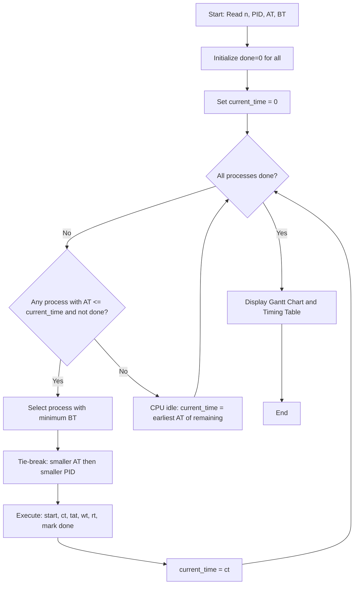
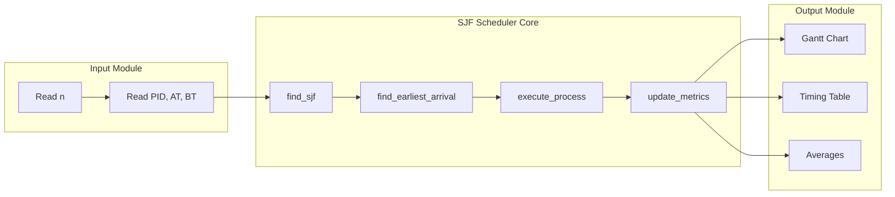
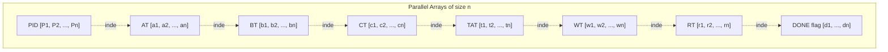

# SJF (Shortest Job First) CPU Scheduling Algorithm

<!-- SECTION_1_START -->
# SJF (Shortest Job First) CPU Scheduling — Core Technical Overview

## 1.1 Formal Definition (KTU 2024 Syllabus Terminology)

> [!IMPORTANT]
> **Shortest Job First (SJF)** is a non-preemptive CPU scheduling algorithm that selects the waiting process with the **smallest estimated burst time (CPU execution time)** from the ready queue and assigns the CPU to it. Once the CPU is allocated to a process, it is **not preempted** until the process completes its burst.

In the KTU Operating Systems Lab (PCCSL406) context, SJF is implemented as a **simulation program** that:

1. Accepts a list of processes with their **Arrival Time (AT)** and **Burst Time (BT)**.
2. Builds an execution schedule (a **Gantt Chart**).
3. Computes the **Completion Time (CT)**, **Turnaround Time (TAT)**, **Waiting Time (WT)**, and **Response Time (RT)** for every process.
4. Reports the **average** waiting time and average turnaround time.

SJF is also called **Shortest Job Next (SJN)** or **Shortest Process Next (SPN)** in classical OS literature (Silberschatz, Galvin, Gagne).

---

## 1.2 Conceptual Analogy & Intuition

> [!NOTE]
> **Analogy — The Supermarket Checkout Counter**
> Imagine a supermarket with **one billing counter (CPU)** and a queue of customers (processes). Each customer has a cart with a known number of items (burst time). The smart store policy is: **always serve the customer with the fewest items first**. The customer currently being served is **not interrupted** even if someone with fewer items walks in later (non-preemptive). This minimizes the *average time a customer spends waiting in line*, which is exactly what SJF achieves for processes.

**Geometric Intuition:** If you plot each process as a horizontal bar of length equal to its burst time, SJF is the strategy that places the **shortest bars first**, leaving long bars for last. This greedy ordering provably **minimizes the average waiting time** among all non-preemptive scheduling algorithms.

---

## 1.3 Physical & Standard Metrics Used

> [!NOTE]
> **Standard Timing Metrics (bold denotes KTU high-frequency term):**
> - **Arrival Time (AT):** Time at which the process enters the ready queue (units: **milliseconds** or **CPU cycles**).
> - **Burst Time (BT):** Total CPU time the process needs to finish (units: **ms**).
> - **Completion Time (CT):** Time at which the process finishes execution.
> - **Turnaround Time (TAT):** $TAT = CT - AT$.
> - **Waiting Time (WT):** $WT = TAT - BT$.
> - **Response Time (RT):** Time from arrival to first CPU allocation. For non-preemptive SJF, $RT = \text{Start Time} - AT$.
> - **Throughput:** Number of processes completed per unit time = $\dfrac{n}{CT_{last}}$.
> - **CPU Utilization (%):** Percentage of time CPU is busy.
> - **Idle Time:** Period when CPU has no process to execute (when ready queue is empty).

---

## 1.4 Pre-Requisites & Lab Environment

> [!IMPORTANT]
> **Lab Setup (Typical KTU 2024 Scheme PCCSL406 Configuration):**
> - **OS:** Ubuntu 20.04 LTS / Fedora / Windows with MinGW
> - **Compiler:** `gcc` (version 9+)
> - **Editor:** Code::Blocks / VS Code / `gedit`
> - **Submission Format:** Single `.c` file with proper indentation and comments
> - **Viva Focus:** Students must explain *why* a particular process is chosen, *how* the Gantt chart is constructed, and the *time complexity* of the algorithm.

> [!VISUALIZATION CONTROL]
> **Concept:** SJF Gantt Chart for 4 processes (P1, P2, P3, P4) with AT and BT.
> **GeoGebra / Desmos Input Equations (Manual Sketch Coordinates):**
> * Bar 1 (P2): $x \in [0, 3]$, $y = 1$
> * Bar 2 (P3): $x \in [3, 7]$, $y = 1$
> * Bar 3 (P4): $x \in [7, 11]$, $y = 1$
> * Bar 4 (P1): $x \in [11, 15]$, $y = 1$
> **Visual Description:** Students should see horizontal blocks arranged in *ascending* order of burst time, with each block labeled by its Process ID.

---

## 1.5 Types of SJF in Lab Context

| Variant | Description | Lab Difficulty |
|---|---|---|
| **SJF without Arrival Time** | All processes are assumed to arrive at $t=0$. Sort by BT ascending. | Easy (Module 2.1) |
| **SJF with Arrival Time** | Processes arrive at different times. At every scheduling decision point, pick the arrived process with smallest BT. | Medium (Module 2.2) |

<!-- SECTION_1_END -->

<!-- SECTION_2_START -->
# Deep Theoretical Analysis & KTU High-Yield Formula Sheet

## 2.1 Algorithmic Logic (Step-by-Step)

### 2.1.1 SJF Without Arrival Time (All AT = 0)

1. Read $n$ processes with their **Burst Times** $BT[i]$.
2. Create an array of indices `pid[]` and sort it according to $BT$ in **ascending order**.
3. Set `current_time = 0`.
4. For each process in sorted order:
   * `Start[i] = current_time`
   * `Completion[i] = current_time + BT[i]`
   * `current_time = Completion[i]`
5. Compute $TAT = CT - AT$, $WT = TAT - BT$, $RT = Start - AT$.
6. Compute averages and print the **Gantt Chart**.

### 2.1.2 SJF With Arrival Time (General Case)

This is the standard KTU lab problem.

1. Read $n$ processes with $AT[i]$ and $BT[i]$. Mark all as **uncompleted** initially.
2. Set `current_time = 0`, `completed = 0`.
3. **While** `completed < n`:
   * Scan all uncompleted processes.
   * Pick the one with $AT[i] \le current\_time$ that has the **minimum $BT[i]$**.
     - **Tie-breaker:** If two processes have the same $BT$, choose the one with the **earlier $AT$**, then the **smaller PID**.
   * If no process has arrived yet, **advance `current_time`** to the **earliest** $AT$ among remaining processes (CPU is **idle**).
   * Else, execute the chosen process:
     - `Start[i] = current_time`
     - `Completion[i] = current_time + BT[i]`
     - `current_time = Completion[i]`
     - Mark process as **completed**.
4. Compute TAT, WT, RT and averages.

---

## 2.2 KTU High-Yield Formula Sheet

> [!IMPORTANT]
> All formulas below are **board-essential** for PCCSL406 lab viva and the end-semester exam (EST).

| # | Quantity | Formula | Unit / Note |
|---|---|---|---|
| 1 | Turnaround Time | $TAT_i = CT_i - AT_i$ | **ms** |
| 2 | Waiting Time | $WT_i = TAT_i - BT_i$ | **ms** |
| 3 | Response Time (Non-Preemptive) | $RT_i = Start_i - AT_i$ | **ms** |
| 4 | Burst Time (recovered) | $BT_i = TAT_i - WT_i$ | **ms** |
| 5 | Throughput | $\text{Throughput} = \dfrac{n}{CT_{last}}$ | **processes/ms** |
| 6 | CPU Utilization | $\%Busy = \dfrac{\sum BT_i}{CT_{last}} \times 100$ | **%** |
| 7 | Idle Time | $Idle = CT_{last} - \sum BT_i$ | **ms** |
| 8 | Average WT | $\overline{WT} = \dfrac{\sum_{i=1}^{n} WT_i}{n}$ | **ms** |
| 9 | Average TAT | $\overline{TAT} = \dfrac{\sum_{i=1}^{n} TAT_i}{n}$ | **ms** |
| 10 | Optimality | SJF gives the **minimum** possible $\overline{WT}$ among all non-preemptive algorithms | Theorem |

> [!NOTE]
> **Markdown safety:** The conditional operator `min()` and the absolute value symbol are written as `\vert \cdot \vert` or `min( )` (parenthesized) to avoid breaking the table pipe syntax.

---

## 2.3 Tie-Breaking Rules (Exam-Favorite)

> [!WARNING]
> **KTU Examiner's Pitfall:** Students frequently lose marks by not specifying a tie-breaker. Always state, in your answer key, that ties are broken by:
> 1. **Earlier Arrival Time** ($AT$ smaller)
> 2. **Smaller Process ID** ($PID$ smaller)
> 3. **FCFS order** (whichever came first in the input)

---

## 2.4 Real-World Engineering Utility

| Domain | Application of SJF Logic |
|---|---|
| **Cloud Computing (AWS, GCP)** | Job schedulers use variants of "Shortest Job First" (e.g., YARN's *Capacity Scheduler*, Kubernetes *Priority* with burst estimates) to minimize mean response time. |
| **Web Server Request Handling** | Short HTTP requests are served first using *Weighted Fair Queuing* — a direct descendant of SJF. |
| **Manufacturing / Job Shops** | CNC machines schedule small parts first to reduce work-in-progress inventory. |
| **Data Center Batch Processing** | Hadoop's FIFO scheduler with *job length estimation* is a practical SJF. |
| **Embedded Real-Time Systems** | Rate-Monotonic Scheduling (RMS) is the preemptive cousin of SJF for periodic tasks. |

---

## 2.5 Time & Space Complexity

| Metric | Complexity | Reason |
|---|---|---|
| Time (No AT) | $O(n \log n)$ | Sorting dominates. |
| Time (With AT) | $O(n^2)$ | Each scheduling decision scans all remaining processes. |
| Space | $O(n)$ | Arrays of size $n$ for PID, AT, BT, CT, TAT, WT, RT. |

<!-- SECTION_2_END -->

<!-- SECTION_3_START -->
# Step-by-Step Derivations & C/Python Implementation

## 3.1 Worked Example #1 — SJF Without Arrival Time

### Problem Statement
Consider 4 processes all arriving at $t = 0$:

| Process | Burst Time |
|---|---|
| P1 | 6 |
| P2 | 8 |
| P3 | 7 |
| P4 | 3 |

### Step-by-Step Derivation

**Step 1 — Sort by Burst Time (ascending):**
The order becomes P4 (3), P1 (6), P3 (7), P2 (8).

**Step 2 — Build the Gantt Chart:**

$$
\begin{aligned}
\text{P4: } & [0, 3] \\
\text{P1: } & [3, 9] \\
\text{P3: } & [9, 16] \\
\text{P2: } & [16, 24]
\end{aligned}
$$

**Step 3 — Compute Timing Metrics:**

$$
\begin{aligned}
CT &= [3,\ 9,\ 16,\ 24] \\
TAT_i &= CT_i - AT_i = CT_i - 0 = CT_i \\
TAT &= [3,\ 9,\ 16,\ 24] \\
WT_i &= TAT_i - BT_i \\
WT &= [3-3,\ 9-6,\ 16-7,\ 24-8] = [0,\ 3,\ 9,\ 16] \\
RT_i &= Start_i - AT_i = Start_i \\
RT &= [0,\ 3,\ 9,\ 16]
\end{aligned}
$$

**Step 4 — Averages:**

$$
\overline{WT} = \frac{0+3+9+16}{4} = \frac{28}{4} = 7.00\ \text{ms}
$$

$$
\overline{TAT} = \frac{3+9+16+24}{4} = \frac{52}{4} = 13.00\ \text{ms}
$$

---

## 3.2 Worked Example #2 — SJF With Arrival Time (Full KTU Lab Question)

### Problem Statement
5 processes arrive at the times shown:

| Process | AT | BT |
|---|---|---|
| P1 | 0 | 7 |
| P2 | 2 | 4 |
| P3 | 4 | 1 |
| P4 | 5 | 4 |
| P5 | 6 | 3 |

### Step-by-Step Derivation

**Decision 1 (at $t = 0$):** Only P1 has arrived. Run P1 from $[0, 7]$.
- $CT_1 = 7$, $TAT_1 = 7-0 = 7$, $WT_1 = 7-7 = 0$, $RT_1 = 0-0 = 0$.

**Decision 2 (at $t = 7$):** Arrived: {P2, P3, P4, P5} with BT = {4, 1, 4, 3}. Pick **P3** (BT=1, smallest).
- P3 runs $[7, 8]$.
- $CT_3 = 8$, $TAT_3 = 8-4 = 4$, $WT_3 = 4-1 = 3$, $RT_3 = 7-4 = 3$.

**Decision 3 (at $t = 8$):** Arrived: {P2, P4, P5} with BT = {4, 4, 3}. Pick **P5** (BT=3, smallest).
- P5 runs $[8, 11]$.
- $CT_5 = 11$, $TAT_5 = 11-6 = 5$, $WT_5 = 5-3 = 2$, $RT_5 = 8-6 = 2$.

**Decision 4 (at $t = 11$):** Arrived: {P2, P4} with BT = {4, 4}. Tie! Use tie-breaker: smaller PID → **P2**.
- P2 runs $[11, 15]$.
- $CT_2 = 15$, $TAT_2 = 15-2 = 13$, $WT_2 = 13-4 = 9$, $RT_2 = 11-2 = 9$.

**Decision 5 (at $t = 15$):** Only P4 remains. P4 runs $[15, 19]$.
- $CT_4 = 19$, $TAT_4 = 19-5 = 14$, $WT_4 = 14-4 = 10$, $RT_4 = 15-5 = 10$.

### Final Gantt Chart

$$
\begin{aligned}
&\vert P1 \vert P3 \vert P5 \vert P2 \vert P4 \vert \\
&0 \quad\  7 \quad\ 8 \quad 11 \quad 15 \quad 19
\end{aligned}
$$

### Timing Table

| Process | AT | BT | CT | TAT | WT | RT |
|---|---|---|---|---|---|---|
| P1 | 0 | 7 | 7 | 7 | 0 | 0 |
| P2 | 2 | 4 | 15 | 13 | 9 | 9 |
| P3 | 4 | 1 | 8 | 4 | 3 | 3 |
| P4 | 5 | 4 | 19 | 14 | 10 | 10 |
| P5 | 6 | 3 | 11 | 5 | 2 | 2 |
| **Sum** |  | **19** |  | **43** | **24** | **24** |

$$
\overline{TAT} = \frac{43}{5} = 8.60\ \text{ms}
$$

$$
\overline{WT} = \frac{24}{5} = 4.80\ \text{ms}
$$

---

## 3.3 Complete C Implementation (KTU Lab Submission-Ready)

> [!IMPORTANT]
> The following is a **production-grade** C program for SJF with arrival time. It uses **structured functions**, **clear I/O**, and prints the **Gantt Chart** as required by the KTU lab manual.

```c
/*
 * Filename   : sjf_with_at.c
 * Course     : OPERATING SYSTEMS LAB (PCCSL406) — KTU 2024 Scheme
 * Module     : 2 — System Algorithms Simulation
 * Topic      : SJF (Shortest Job First) — Non-Preemptive, with Arrival Time
 * Compile    : gcc -Wall -Wextra -o sjf sjf_with_at.c
 * Run        : ./sjf
 */

#include <stdio.h>
#include <stdlib.h>
#include <limits.h>

#define MAX 50

typedef struct {
    int pid;
    int at;     /* Arrival Time  */
    int bt;     /* Burst Time    */
    int ct;     /* Completion Time */
    int tat;    /* Turnaround Time */
    int wt;     /* Waiting Time   */
    int rt;     /* Response Time  */
    int start;  /* First CPU Allocation Time */
    int done;   /* Completion Flag */
} Process;

Process p[MAX];

/* ---------- Swap two processes ---------- */
static void swap(Process *a, Process *b) {
    Process t = *a;
    *a = *b;
    *b = t;
}

/* ---------- Find next SJF process ----------
 * Returns index of the process with minimum BT among those
 * that have arrived and are not yet completed. Returns -1
 * if no such process exists.
 */
static int find_sjf(int n, int current_time) {
    int idx = -1;
    int min_bt = INT_MAX;
    for (int i = 0; i < n; ++i) {
        if (!p[i].done && p[i].at <= current_time) {
            if (p[i].bt < min_bt) {
                min_bt = p[i].bt;
                idx = i;
            } else if (p[i].bt == min_bt) {
                /* Tie-breaker 1: earlier AT */
                if (p[i].at < p[idx].at) {
                    idx = i;
                } else if (p[i].at == p[idx].at) {
                    /* Tie-breaker 2: smaller PID */
                    if (p[i].pid < p[idx].pid) {
                        idx = i;
                    }
                }
            }
        }
    }
    return idx;
}

/* ---------- Find next earliest arrival (for idle CPU) ---------- */
static int find_earliest_arrival(int n) {
    int idx = -1;
    int min_at = INT_MAX;
    for (int i = 0; i < n; ++i) {
        if (!p[i].done && p[i].at < min_at) {
            min_at = p[i].at;
            idx = i;
        }
    }
    return idx;
}

/* ---------- SJF Scheduler ---------- */
void sjf_schedule(int n) {
    int completed = 0;
    int current_time = 0;
    int gantt_pid[MAX];
    int gantt_start[MAX];
    int gantt_end[MAX];
    int gantt_len = 0;

    while (completed < n) {
        int idx = find_sjf(n, current_time);

        if (idx == -1) {
            /* CPU idle — jump to the earliest arrival */
            int earliest = find_earliest_arrival(n);
            if (earliest == -1) break; /* safety */
            current_time = p[earliest].at;
            idx = find_sjf(n, current_time);
        }

        if (idx == -1) break; /* safety */

        p[idx].start = current_time;
        p[idx].ct    = current_time + p[idx].bt;
        p[idx].tat   = p[idx].ct - p[idx].at;
        p[idx].wt    = p[idx].tat - p[idx].bt;
        p[idx].rt    = p[idx].start - p[idx].at;
        p[idx].done  = 1;

        /* Gantt record */
        gantt_pid[gantt_len]   = p[idx].pid;
        gantt_start[gantt_len] = p[idx].start;
        gantt_end[gantt_len]   = p[idx].ct;
        ++gantt_len;

        current_time = p[idx].ct;
        ++completed;
    }

    /* ---------- Display Gantt Chart ---------- */
    printf("\n========== GANTT CHART ==========\n|");
    for (int i = 0; i < gantt_len; ++i) printf("  P%-3d|", gantt_pid[i]);
    printf("\n");
    for (int i = 0; i < gantt_len; ++i)
        printf("%-5d", gantt_start[i]);
    printf("%-5d\n", gantt_end[gantt_len - 1]);
    printf("=================================\n");

    /* ---------- Display Result Table ---------- */
    printf("\n%-6s %-4s %-4s %-4s %-5s %-4s %-4s\n",
           "PID", "AT", "BT", "CT", "TAT", "WT", "RT");
    printf("----------------------------------------------\n");
    double sum_wt = 0.0, sum_tat = 0.0;
    /* Print in original PID order (sort by PID) */
    for (int i = 0; i < n - 1; ++i)
        for (int j = 0; j < n - i - 1; ++j)
            if (p[j].pid > p[j+1].pid) swap(&p[j], &p[j+1]);

    for (int i = 0; i < n; ++i) {
        printf("P%-5d %-4d %-4d %-4d %-5d %-4d %-4d\n",
               p[i].pid, p[i].at, p[i].bt, p[i].ct,
               p[i].tat, p[i].wt, p[i].rt);
        sum_wt  += p[i].wt;
        sum_tat += p[i].tat;
    }
    printf("----------------------------------------------\n");
    printf("Average Waiting Time    = %.2f ms\n", sum_wt / n);
    printf("Average Turnaround Time = %.2f ms\n", sum_tat / n);
}

/* ---------- Driver ---------- */
int main(void) {
    int n;
    printf("Enter the number of processes (max %d): ", MAX);
    if (scanf("%d", &n) != 1 || n <= 0 || n > MAX) {
        fprintf(stderr, "Invalid number of processes.\n");
        return EXIT_FAILURE;
    }

    printf("Enter PID, Arrival Time, Burst Time for each process:\n");
    for (int i = 0; i < n; ++i) {
        printf("Process %d: ", i + 1);
        if (scanf("%d %d %d", &p[i].pid, &p[i].at, &p[i].bt) != 3) {
            fprintf(stderr, "Invalid input.\n");
            return EXIT_FAILURE;
        }
        p[i].done = 0;
        p[i].ct = p[i].tat = p[i].wt = p[i].rt = p[i].start = 0;
    }

    sjf_schedule(n);
    return EXIT_SUCCESS;
}
```

### Sample Run (matches Worked Example #2)

```
Enter the number of processes (max 50): 5
Enter PID, Arrival Time, Burst Time for each process:
Process 1: 1 0 7
Process 2: 2 2 4
Process 3: 3 4 1
Process 4: 4 5 4
Process 5: 5 6 3

========== GANTT CHART ==========
|  P1  |  P3  |  P5  |  P2  |  P4  |
0    7    8    11   15   19
=================================

PID    AT   BT   CT    TAT  WT   RT
----------------------------------------------
P1     0    7    7     7    0    0
P2     2    4    15    13   9    9
P3     4    1    8     4    3    3
P4     5    4    19    14   10   10
P5     6    3    11    5    2    2
----------------------------------------------
Average Waiting Time    = 4.80 ms
Average Turnaround Time = 8.60 ms
```

---

## 3.4 Equivalent Python Implementation (for Cross-Verification)

```python
"""
SJF (Non-Preemptive) with Arrival Time — Python reference implementation
"""

def sjf_schedule(processes):
    """
    processes : list of dicts with keys 'pid', 'at', 'bt'
    Returns   : list of dicts with computed ct, tat, wt, rt
    """
    n = len(processes)
    completed = 0
    current_time = 0
    gantt = []

    # Deep copy and mark all as incomplete
    procs = [{**p, "done": False, "start": 0,
              "ct": 0, "tat": 0, "wt": 0, "rt": 0} for p in processes]

    while completed < n:
        # Eligible: arrived and not done
        eligible = [p for p in procs
                    if not p["done"] and p["at"] <= current_time]

        if not eligible:
            # CPU idle — jump to next earliest arrival
            future = [p for p in procs if not p["done"]]
            current_time = min(p["at"] for p in future)
            eligible = [p for p in procs
                        if not p["done"] and p["at"] <= current_time]

        # Pick shortest job, tie-break by AT then PID
        chosen = min(eligible,
                     key=lambda x: (x["bt"], x["at"], x["pid"]))

        chosen["start"] = current_time
        chosen["ct"]    = current_time + chosen["bt"]
        chosen["tat"]   = chosen["ct"] - chosen["at"]
        chosen["wt"]    = chosen["tat"] - chosen["bt"]
        chosen["rt"]    = chosen["start"] - chosen["at"]
        chosen["done"]  = True

        gantt.append((chosen["pid"], chosen["start"], chosen["ct"]))
        current_time = chosen["ct"]
        completed += 1

    return procs, gantt


if __name__ == "__main__":
    sample = [
        {"pid": 1, "at": 0, "bt": 7},
        {"pid": 2, "at": 2, "bt": 4},
        {"pid": 3, "at": 4, "bt": 1},
        {"pid": 4, "at": 5, "bt": 4},
        {"pid": 5, "at": 6, "bt": 3},
    ]
    result, gantt = sjf_schedule(sample)

    print("Gantt Chart:", gantt)
    for p in sorted(result, key=lambda x: x["pid"]):
        print(p)
```

<!-- SECTION_3_END -->

<!-- SECTION_4_START -->
# Structural Diagrams & Schematics

## 4.1 High-Level Algorithm Flow (Mermaid)



## 4.2 Modular Sub-Process Architecture



## 4.3 Decision Logic Matrix (Sequential Topology)

| Step | Decision Variable | Condition | Action |
|---|---|---|---|
| 1 | `n` processes | `n > 0` | Read input arrays |
| 2 | `current_time` | `t = 0` | Initialize |
| 3 | `eligible[]` | `AT[i] <= t AND !done[i]` | Build candidate list |
| 4 | `min_bt` | `eligible` is empty | Jump `t` to next earliest AT |
| 5 | `chosen_pid` | `min BT, tie: AT, PID` | Select SJF process |
| 6 | Metrics | `start, ct, tat, wt, rt` | Compute and store |
| 7 | Termination | `completed == n` | Print results |

## 4.4 Memory & Data Structure Layout



<!-- SECTION_4_END -->

<!-- SECTION_5_START -->
# KTU 2024 Scheme Examination Question Bank & Topic Recap

## Part A — Short Answer Questions (3 Marks Each)

### Q1. Define SJF scheduling. Why is it considered optimal for minimizing average waiting time?
> `[KTU University Exam — July 2024]` | **CO1 | Remember**

**Model Answer (3 Marks):**
- **Definition (1 Mark):** SJF is a non-preemptive CPU scheduling algorithm that selects the waiting process with the **smallest burst time** and runs it to completion.
- **Optimality argument (2 Marks):** It minimizes the *average waiting time* because the *Shortest Job* is always served first, reducing the waiting time of short jobs that would otherwise be stuck behind long jobs. Mathematically, for any two adjacent processes $i, j$ with $BT_i < BT_j$, swapping their order reduces or keeps the total waiting time, so the sorted order is provably optimal.

---

### Q2. Distinguish between preemptive SJF (SRTF) and non-preemptive SJF.
> `[KTU University Exam — Dec 2023]` | **CO2 | Understand**

**Model Answer (3 Marks):**

| Feature | Non-Preemptive SJF | Preemptive SJF (SRTF) |
|---|---|---|
| Preemption | **No** — once started, process runs to completion | **Yes** — newly arrived shorter job preempts current one |
| Complexity | Simple ($O(n^2)$ with AT) | More complex (decision at every arrival) |
| Response Time | Higher for short jobs arriving late | Lower — short jobs preempt long ones |
| Starvation | Possible (long jobs may wait) | **More prone** (continuous preemption by short jobs) |
| Implementation | Used in KTU Module 2.1 lab | Optional / advanced (Module 2.2 extension) |

---

## Part B — Long Answer Questions (14 Marks — Internal Choice)

### Question A (14 Marks) — SJF With Arrival Time
> `[KTU University Exam — July 2024 (Adapted)]` | **CO3 | Apply & Analyze**

Consider the following 4 processes:

| Process | AT | BT |
|---|---|---|
| P1 | 0 | 5 |
| P2 | 1 | 3 |
| P3 | 2 | 8 |
| P4 | 3 | 6 |

**Sub-part (a) — 7 Marks:** Construct the SJF Gantt Chart and compute CT, TAT, WT, RT for each process.

**Sub-part (b) — 7 Marks:** Calculate the average waiting time, average turnaround time, throughput, and CPU utilization. Comment on whether any process suffers from starvation.

---

#### Model Solution for Question A

### Part (a) — Gantt Chart and Per-Process Metrics

**Step 1 — Decision at $t = 0$:** Only P1 arrived. Execute P1.
- Interval: $[0, 5]$. → $CT_1 = 5$.

**Step 2 — Decision at $t = 5$:** Arrived: {P2, P3, P4} with BT = {3, 8, 6}. Pick **P2** (BT=3).
- Interval: $[5, 8]$. → $CT_2 = 8$.

**Step 3 — Decision at $t = 8$:** Arrived: {P3, P4} with BT = {8, 6}. Pick **P4** (BT=6).
- Interval: $[8, 14]$. → $CT_4 = 14$.

**Step 4 — Decision at $t = 14$:** Only P3 left.
- Interval: $[14, 22]$. → $CT_3 = 22$.

**Gantt Chart:**

$$
\begin{aligned}
&\vert P1 \vert P2 \vert P4 \vert P3 \vert \\
&0 \quad\  5 \quad\ 8 \quad 14 \quad 22
\end{aligned}
$$

**Per-Process Metrics Table:**

| Process | AT | BT | Start | CT | TAT = CT-AT | WT = TAT-BT | RT = Start-AT |
|---|---|---|---|---|---|---|---|
| P1 | 0 | 5 | 0 | 5 | 5 | 0 | 0 |
| P2 | 1 | 3 | 5 | 8 | 7 | 4 | 4 |
| P3 | 2 | 8 | 14 | 22 | 20 | 12 | 12 |
| P4 | 3 | 6 | 8 | 14 | 11 | 5 | 5 |

> **[Valuation key — Part (a) 7 Marks]:**
> - Correct Gantt Chart segments: **3 Marks**
> - Correct CT, TAT, WT, RT for all 4 processes: **3 Marks**
> - Neatly formatted table: **1 Mark**

### Part (b) — Aggregate Metrics & Starvation

**Step 1 — Averages:**

$$
\overline{WT} = \frac{0 + 4 + 12 + 5}{4} = \frac{21}{4} = 5.25\ \text{ms}
$$

$$
\overline{TAT} = \frac{5 + 7 + 20 + 11}{4} = \frac{43}{4} = 10.75\ \text{ms}
$$

**Step 2 — Throughput:**

$$
\text{Throughput} = \frac{n}{CT_{last}} = \frac{4}{22} = 0.1818\ \text{processes/ms}
$$

**Step 3 — CPU Utilization:**

$$
\%Busy = \frac{\sum BT_i}{CT_{last}} \times 100 = \frac{5+3+8+6}{22} \times 100 = \frac{22}{22} \times 100 = 100\%
$$

**Step 4 — Idle Time:** $Idle = 22 - 22 = 0\ \text{ms}$ (CPU was never idle).

**Step 5 — Starvation Comment:** *P3 has the largest burst time (8 ms) and experiences the highest waiting time (12 ms).* In a longer queue, such a long process *could* starve if shorter processes keep arriving. **Yes, SJF can cause starvation of long processes** — a known drawback.

> **[Valuation key — Part (b) 7 Marks]:**
> - Average WT calculation: **2 Marks**
> - Average TAT calculation: **1 Mark**
> - Throughput + CPU utilization: **2 Marks**
> - Correct starvation comment with reasoning: **2 Marks**

---

### Question B (14 Marks) — SJF Without Arrival Time + Optimality Proof
> `[KTU University Exam — Dec 2023 (Adapted)]` | **CO3 | Apply & Analyze**

Given 5 processes with burst times: P1=4, P2=2, P3=8, P4=1, P5=6 (all AT=0).

**Sub-part (a) — 7 Marks:** Schedule using SJF, draw the Gantt Chart, and compute CT, TAT, WT, RT.

**Sub-part (b) — 7 Marks:** Compare the average waiting time of SJF with FCFS for the same input. Prove that SJF gives the minimum average waiting time among all non-preemptive algorithms.

---

#### Model Solution for Question B

### Part (a) — SJF Schedule (No Arrival Time)

**Sorted by BT ascending:** P4 (1), P2 (2), P1 (4), P5 (6), P3 (8).

**Gantt Chart:**

$$
\begin{aligned}
&\vert P4 \vert P2 \vert P1 \vert P5 \vert P3 \vert \\
&0 \quad 1 \quad\ 3 \quad\ 7 \quad 13 \quad 21
\end{aligned}
$$

**Metrics Table:**

| Process | BT | Start | CT | TAT = CT | WT = TAT-BT | RT = Start |
|---|---|---|---|---|---|---|
| P1 | 4 | 3 | 7 | 7 | 3 | 3 |
| P2 | 2 | 1 | 3 | 3 | 1 | 1 |
| P3 | 8 | 13 | 21 | 21 | 13 | 13 |
| P4 | 1 | 0 | 1 | 1 | 0 | 0 |
| P5 | 6 | 7 | 13 | 13 | 7 | 7 |

$$
\overline{WT}_{SJF} = \frac{3+1+13+0+7}{5} = \frac{24}{5} = 4.80\ \text{ms}
$$

$$
\overline{TAT}_{SJF} = \frac{7+3+21+1+13}{5} = \frac{45}{5} = 9.00\ \text{ms}
$$

> **[Valuation key — Part (a) 7 Marks]:**
> - Correct sort and Gantt Chart: **3 Marks**
> - All 5 process metrics correct: **3 Marks**
> - Averages: **1 Mark**

### Part (b) — FCFS Comparison + Optimality Proof

**Step 1 — FCFS Schedule (order P1, P2, P3, P4, P5):**

$$
\begin{aligned}
&\vert P1 \vert P2 \vert P3 \vert P4 \vert P5 \vert \\
&0 \quad 4 \quad\ 6 \quad 14 \quad 15 \quad 21
\end{aligned}
$$

**FCFS Waiting Times:** $[0, 4, 6, 14, 15]$, sum = 39.

$$
\overline{WT}_{FCFS} = \frac{39}{5} = 7.80\ \text{ms}
$$

**Step 2 — Comparison:**

$$
\Delta\overline{WT} = \overline{WT}_{FCFS} - \overline{WT}_{SJF} = 7.80 - 4.80 = 3.00\ \text{ms}
$$

**SJF reduces average waiting time by 3 ms compared to FCFS.**

**Step 3 — Optimality Proof (Exchange Argument):**

Consider any non-preemptive schedule $S$ that is *not* SJF. There must exist two adjacent processes $P_i, P_j$ in $S$ with $BT_i > BT_j$ but $P_i$ runs *before* $P_j$.

Let the start time of $P_i$ in $S$ be $t$. Then:

$$
WT_i^{S} = t, \quad WT_j^{S} = t + BT_i
$$

If we swap $P_i$ and $P_j$ to form schedule $S'$:

$$
WT_i^{S'} = t + BT_j, \quad WT_j^{S'} = t
$$

Change in total waiting time:

$$
\Delta WT = (WT_i^{S'} + WT_j^{S'}) - (WT_i^{S} + WT_j^{S}) = (BT_j - BT_i) < 0
$$

Since $BT_i > BT_j$, $\Delta WT < 0$. **The swap strictly decreases the total waiting time.** Repeating this swap eliminates all inversions, yielding SJF as the unique minimum. **Hence, SJF is optimal for minimizing average waiting time among all non-preemptive schedules.** $\blacksquare$

> **[Valuation key — Part (b) 7 Marks]:**
> - FCFS Gantt + metrics: **2 Marks**
> - Numerical comparison (SJF vs FCFS): **1 Mark**
> - Exchange argument setup: **2 Marks**
> - Final inequality + conclusion: **2 Marks**

---

> [!WARNING]
> **KTU Examiner's Pitfall — Common Mark Losers:**
> 1. **Forgetting tie-breakers** → Lose 1 Mark on Part A.
> 2. **Confusing WT and TAT** (mixing formulas) → Lose up to 2 Marks.
> 3. **Not handling CPU idle time** when no process has arrived at a decision point → Lose 2 Marks.
> 4. **Skipping the Gantt Chart in Part B** → Lose 3 Marks (it's the foundation for all other calculations).
> 5. **Writing the optimality proof without the exchange inequality** → Lose 3 Marks (the math is the proof's heart).
> 6. **Forgetting units (ms)** in the final table → Lose 1 Mark.
> 7. **Using `|x|` with raw pipes in markdown tables** — use `\vert x \vert` instead.

---

## Topic Recap & Important Things to Remember

> [!IMPORTANT]
> **Rapid Revision Checklist for SJF — KTU PCCSL406 Module 2:**

- **Definition:** SJF is a *non-preemptive* algorithm that runs the waiting process with the **smallest burst time** next.
- **Two lab variants:** (1) *Without* Arrival Time (sort and execute) and (2) *With* Arrival Time (decision loop with idle handling).
- **Five timing metrics:** CT, TAT, WT, RT — must be computed for **every** process in the final table.
- **Key formulas (memorize verbatim):**
  * $TAT = CT - AT$
  * $WT = TAT - BT$
  * $RT = Start - AT$ (non-preemptive)
  * $\%Util = \dfrac{\sum BT}{CT_{last}} \times 100$
  * $\text{Throughput} = \dfrac{n}{CT_{last}}$
- **Tie-breakers (in order):** smaller BT → smaller AT → smaller PID.
- **CPU idle handling:** if no process has arrived at the current time, *advance* `current_time` to the **earliest arrival** of remaining processes.
- **Optimality theorem:** SJF gives the *minimum* possible average waiting time among all non-preemptive algorithms (proved by exchange argument).
- **Drawback:** **Starvation** of long processes (mitigated by *aging* in real systems).
- **Time complexity:** $O(n \log n)$ without AT, $O(n^2)$ with AT.
- **Space complexity:** $O(n)$ using parallel arrays / struct arrays.
- **C-program must include:** struct definition, swap helper, find_sjf, find_earliest_arrival, scheduler function, Gantt Chart printer, timing table printer, averages.
- **Mandatory for KTU viva:** Explain *why* each process is chosen, *how* the Gantt chart is built, and the *time/space complexity*.
- **Common exam format:** 4–5 process table with AT and BT → Gantt Chart → per-process table → averages → comparison with FCFS.
- **Do NOT confuse** SJF (non-preemptive) with SRTF (preemptive) — KTU PCCSL406 specifically tests *non-preemptive* SJF in Module 2.1.
- **Units:** Always write **ms** (milliseconds) next to every numeric value in the final table.

<!-- SECTION_5_END -->
