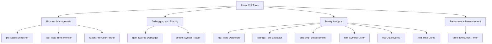
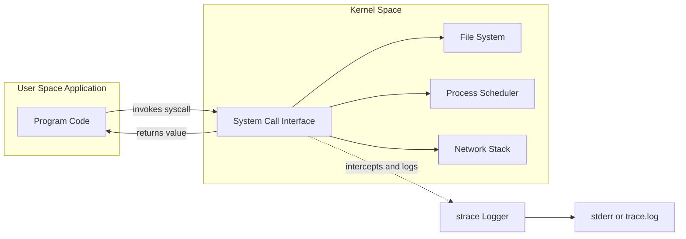
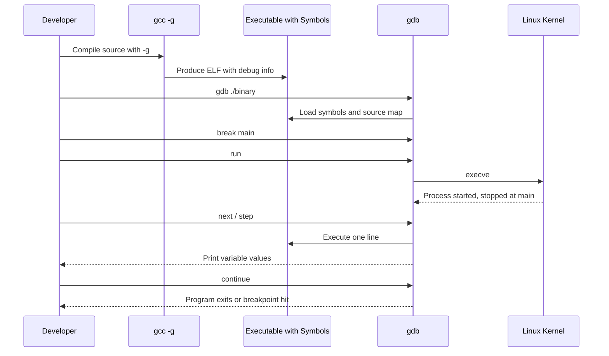
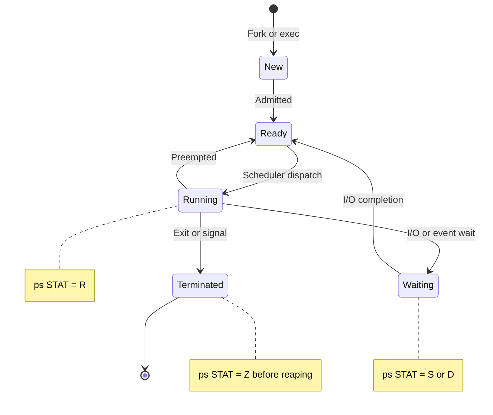
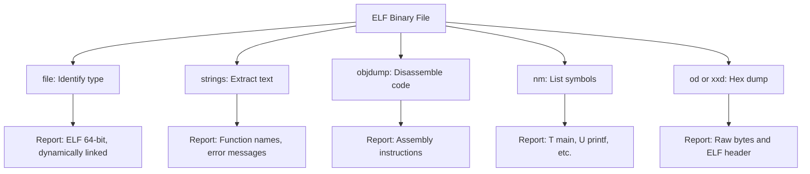
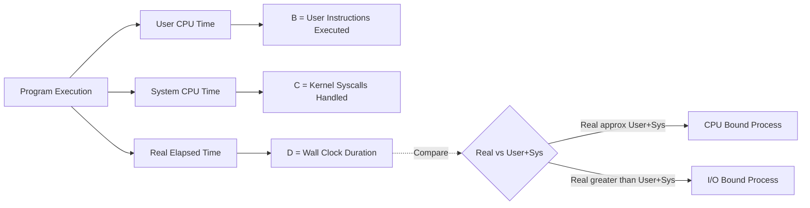

# Familiarisation with basic Linux programming commands: ps, strace,  gdb, strings, objdump, nm, file, od, xxd, time, fuser, top

<!-- SECTION_1_START -->
# Familiarisation with Basic Linux Programming Commands

## 1. Introduction to Linux Programming Commands

Linux is the foundation of modern operating systems, and mastering its command-line tools is essential for any computer science engineer. The **Operating Systems Lab (PCCSL407)** in the KTU 2024 scheme requires hands-on familiarity with low-level process inspection, debugging, and binary analysis commands.

### 1.1 Core Definition

> [!NOTE]
> **Linux Programming Commands** are a set of text-mode utilities in Unix-like operating systems that allow developers and system administrators to inspect, debug, analyse, and monitor running processes, executables, and system resources directly from the **Bash shell (Bourne Again Shell)**.

These commands interact with the **kernel** through **system calls** — privileged functions that user-space programs invoke to request OS services such as file I/O, process creation, and memory allocation.

### 1.2 Conceptual Analogy

> [!IMPORTANT]
> **Intuitive Analogy — The Hospital Analogy**
> Imagine the Linux operating system as a **large hospital**:
> - **Processes** = Patients in different wards (some healthy, some critical)
> - **The Kernel** = The hospital administration that controls resources
> - **`ps` command** = A ward census list showing who is currently admitted
> - **`top` command** = A live vital-signs monitor at the nurse's station
> - **`gdb`** = A doctor who can pause treatment, examine organs, and inject fixes
> - **`strace`** = A camera recording every single request a patient makes
> - **`strings`, `objdump`, `nm`, `file`, `od`, `xxd`** = The pathology lab instruments that analyse patient blood samples and X-rays
> - **`fuser`** = A security guard identifying which patient is touching a particular medical instrument
> - **`time`** = A stopwatch measuring how long a treatment takes

This analogy helps visualise how these commands let us peek into the inner workings of the OS.

### 1.3 Classification of Commands

| Category | Commands | Primary Use |
|----------|----------|-------------|
| **Process Management** | `ps`, `top`, `fuser` | Monitor and manage running processes |
| **Debugging & Tracing** | `gdb`, `strace` | Debug and trace program execution |
| **Binary Analysis** | `strings`, `objdump`, `nm`, `file`, `od`, `xxd` | Inspect compiled binaries |
| **Performance Measurement** | `time` | Measure execution duration and resource usage |

> [!VISUALIZATION CONTROL]
> **Concept:** Command Classification Hierarchy
> **Conceptual Layout:** Root node (Linux Commands) branching into four functional categories
> **Visual Description:** Students should imagine a tree diagram with the central "Linux CLI" trunk and four major branches — Process Management, Debugging, Binary Analysis, and Performance — each containing its respective tool set.

---

## 2. Standard File Descriptors — Foundation Concept

> [!NOTE]
> Before exploring these commands, understanding the three **standard file descriptors** is mandatory, as most debugging and tracing commands refer to them:

| FD Number | Symbol | Default Target | Purpose |
|-----------|--------|----------------|---------|
| **0** | `stdin` | Keyboard | Standard input |
| **1** | `stdout` | Terminal | Standard output |
| **2** | `stderr` | Terminal | Standard error |

The **PID (Process ID)** is a unique integer assigned by the kernel to each running process. The parent process is called **PPID (Parent Process ID)**.
<!-- SECTION_1_END -->

<!-- SECTION_2_START -->
# Deep Theoretical Analysis — KTU High-Yield Command Reference

## 1. Process Inspection Commands

### 1.1 `ps` — Process Status

The `ps` command provides a **snapshot** of currently running processes. Unlike `top`, it is non-interactive and exits immediately after printing.

> [!IMPORTANT]
> **Definition (KTU Syllabus Highlight):** `ps` (Process Status) displays information about active processes, including PID, TTY, TIME, and the command that launched them.

**Common `ps` Options:**

| Option | Long Form | Description |
|--------|-----------|-------------|
| `-e` | `--everyone` | Select all processes in the system |
| `-f` | `--full` | Full-format listing (UID, PID, PPID, C, STIME, TTY, TIME, CMD) |
| `-u user` | `--user` | Show processes owned by `user` |
| `-aux` | Combined | All processes, user-oriented, includes those without a controlling terminal |
| `-l` | `--long` | Long format |
| `-p PID` | `--pid` | Show a specific process |
| `-L` | `--threads` | Show threads (lightweight processes) |
| `--forest` | — | Display process tree in ASCII art |

**Process State Codes (`STAT` column):**

| Code | Meaning |
|------|---------|
| `R` | Running or runnable (on a run queue) |
| `S` | Interruptible sleep (waiting for an event) |
| `D` | Uninterruptible sleep (usually I/O) |
| `Z` | Zombie (terminated but not reaped by parent) |
| `T` | Stopped (by signal, e.g., SIGSTOP) |
| `I` | Idle kernel thread |
| `+` | In the foreground process group |
| `<` | High-priority (nice value is negative) |

> [!NOTE]
> **Why is `ps` important in Engineering?**
> In production systems, `ps` is used in shell scripts to detect runaway processes, kill misbehaving services, and monitor containerised applications in Docker/Kubernetes environments.

### 1.2 `top` — Table of Processes

`top` provides a **dynamic, real-time, interactive** view of the running system, refreshing typically every 3 seconds by default.

**Header Information (Line 1-5):**
- **Line 1:** Current time, system uptime, logged-in users, load average (1, 5, 15 min)
- **Line 2:** Total, running, sleeping, stopped, zombie tasks
- **Line 3:** CPU usage breakdown: `us`, `sy`, `ni`, `id`, `wa`, `hi`, `si`, `st`
- **Line 4:** Memory: total, free, used, buff/cache
- **Line 5:** Swap: total, free, used, available

**Interactive Commands inside `top`:**

| Key | Action |
|-----|--------|
| `P` | Sort by CPU usage |
| `M` | Sort by memory usage |
| `T` | Sort by running time |
| `k` | Kill a process (prompts for PID) |
| `r` | Renice a process |
| `1` | Toggle per-CPU core stats |
| `q` | Quit |

### 1.3 `fuser` — File/User Identifier

> [!IMPORTANT]
> `fuser` displays the **PIDs of processes that are using the specified file, filesystem, or Unix socket**. It is instrumental in identifying which process holds a file open — useful before unmounting a device.

**Common Options:**

| Option | Description |
|--------|-------------|
| `-k` | Kill processes accessing the file |
| `-i` | Interactive mode (asks for confirmation before kill) |
| `-v` | Verbose output |
| `-n tcp 80` | Search for processes using TCP port 80 |
| `-m /mnt/usb` | Search for processes on a mounted filesystem |

## 2. Debugging and Tracing Commands

### 2.1 `gdb` — GNU Debugger

`gdb` is the **de facto standard debugger** for C, C++, Fortran, and other compiled languages on Linux.

**Compilation Requirement:** To debug a program, compile with the `-g` flag to include debugging symbols:
```
gcc -g program.c -o program
```

**Essential `gdb` Commands:**

| Command | Shortcut | Purpose |
|---------|----------|---------|
| `break function` | `b` | Set a breakpoint at a function |
| `break line` | `b` | Set breakpoint at a line number |
| `run` | `r` | Start program execution |
| `next` | `n` | Execute next line (step over functions) |
| `step` | `s` | Step into function calls |
| `continue` | `c` | Resume execution until next breakpoint |
| `print expr` | `p` | Print value of expression |
| `display expr` | — | Auto-print expression on every stop |
| `info breakpoints` | `i b` | List all breakpoints |
| `delete 2` | `d 2` | Delete breakpoint number 2 |
| `backtrace` | `bt` | Show call stack |
| `watch var` | — | Set a watchpoint (break when var changes) |
| `list` | `l` | Show source code around current line |
| `quit` | `q` | Exit gdb |

### 2.2 `strace` — System Call Trace

> [!NOTE]
> **Definition:** `strace` intercepts and records the **system calls** made by a process and the signals received. It is a powerful diagnostic tool for understanding what a program is doing at the kernel boundary.

**Common Options:**

| Option | Description |
|--------|-------------|
| `-p PID` | Attach to an already running process |
| `-c` | Count time, calls, errors per syscall |
| `-e trace=open,read,write` | Trace only specific syscalls |
| `-f` | Follow child processes (forks) |
| `-o file` | Write output to a file |
| `-t` | Print absolute timestamps |
| `-tt` | Print timestamps with microseconds |
| `-T` | Show time spent in each syscall |
| `-i` | Print instruction pointer |

## 3. Binary Analysis Commands

### 3.1 `file` — File Type Detection

`file` examines the **magic bytes** (first few bytes) of a file to identify its true type — independent of extension.

**Output Examples:**
```
file hello          → "ELF 64-bit LSB executable, x86-64, dynamically linked"
file image.jpg      → "JPEG image data, JFIF standard"
file script.sh      → "Bourne-Again shell script, ASCII text"
```

### 3.2 `strings` — Extract Printable Strings

`strings` extracts sequences of printable characters (default ≥ 4 characters) from binary files. Used to find hardcoded passwords, error messages, version info, and file paths inside executables.

**Options:**
- `-n 8` — Minimum string length of 8
- `-a` — Scan the whole file (not just initialised data sections)
- `-e l` — Encoding (l=16-bit little-endian, b=16-bit big-endian)
- `-t x` — Print offset in hexadecimal

### 3.3 `objdump` — Object File Disassembler

`objdump` displays information from **object files**, including disassembly, symbol tables, and section headers.

**Key Sub-commands:**
- `objdump -d binary` — Disassemble executable sections
- `objdump -t binary` — Display symbol table
- `objdump -h binary` — Display section headers
- `objdump -D binary` — Disassemble all sections (including data)

### 3.4 `nm` — Symbol Listing

`nm` lists **symbols** (variables, functions) from object files. In the output:
- `T` — Text section (function defined)
- `t` — Local function
- `D` — Initialised data
- `B` — Uninitialised data (BSS)
- `U` — Undefined (referenced but not defined here)
- `R` — Read-only data

### 3.5 `od` — Octal Dump

`od` displays binary files in various formats — octal (default), hex, decimal, character.

**Example:** `od -c file` shows characters; `od -x file` shows hex; `od -An -tx1` shows clean hex.

### 3.6 `xxd` — Hex Dump

`xxd` creates a **hex dump** of a file or reverses one. It's the standard tool for inspecting raw bytes.

**Options:**
- `-l 100` — Limit to 100 bytes
- `-c 16` — Format 16 bytes per line
- `-r` — Reverse mode (hex dump → binary)

## 4. Performance Measurement

### 4.1 `time` — Execution Timer

> [!IMPORTANT]
> The `time` command measures the duration of command execution, providing three key metrics: **real** (wall-clock), **user** (CPU in user space), and **sys** (CPU in kernel space).

**Output Format:**
```
real    0m5.123s
user    0m3.456s
sys     0m0.987s
```

**Interpretation:** `real < user + sys` suggests good parallelisation; `real > user + sys` suggests I/O waiting.

## 5. KTU High-Yield Cheat Sheet — All Commands at a Glance

| Command | Category | Key Function | Common Use Case |
|---------|----------|--------------|-----------------|
| `ps` | Process | Static process list | Scripting, batch monitoring |
| `top` | Process | Real-time process monitor | Live system surveillance |
| `fuser` | Process | Identify file users | Safe unmount, port conflict |
| `gdb` | Debug | Source-level debugger | Bug fixing, crash analysis |
| `strace` | Debug | System call tracer | I/O diagnosis, syscall analysis |
| `file` | Binary | Detect file type | Verify ELF, scripts, archives |
| `strings` | Binary | Extract printable text | Reverse engineering, malware analysis |
| `objdump` | Binary | Disassemble object code | Code inspection, security audits |
| `nm` | Binary | List symbols | Library linking, symbol resolution |
| `od` | Binary | Octal/hex dump | Raw byte inspection |
| `xxd` | Binary | Hex editor/dump | Patching binaries, forensics |
| `time` | Performance | Measure execution | Benchmarking |
<!-- SECTION_2_END -->

<!-- SECTION_3_START -->
# Step-by-Step Demonstrations and Code Implementations

## Demonstration 1: Using `ps` to Inspect Processes

**Step 1 — Open a terminal and view your own shell process:**
```bash
ps
```

**Sample Output:**
```
  PID TTY          TIME CMD
 4521 pts/0    00:00:00 bash
 4589 pts/0    00:00:00 ps
```

**Step 2 — List all processes on the system in full format:**
```bash
ps -ef
```

**Step 3 — Show only the PID, user, and command:**
```bash
ps -eo pid,user,comm
```

**Step 4 — Find a specific process by name using `grep`:**
```bash
ps -ef | grep firefox
```

**Step 5 — Display a process tree to see parent-child relationships:**
```bash
ps -ef --forest
```

> [!NOTE]
> The `ps -ef | grep X` pattern is the canonical KTU-lab way to find a PID before passing it to `kill` or `strace -p`.

## Demonstration 2: Using `top` for Live Monitoring

**Step 1 — Launch `top`:**
```bash
top
```

**Step 2 — Sort by memory usage:** Press `M` (capital M).

**Step 3 — Show per-CPU statistics:** Press `1`.

**Step 4 — Set update interval to 1 second:** Press `d`, then type `1`.

**Step 5 — Kill a process:** Press `k`, enter the PID, then the signal number (default 15 = SIGTERM, or 9 = SIGKILL).

**Step 6 — Quit:** Press `q`.

**Alternative one-shot non-interactive form (batch mode):**
```bash
top -b -n 1 | head -20
```

This runs `top` in **batch mode** (`-b`) for 1 iteration (`-n 1`) and pipes the top 20 lines to `head`.

## Demonstration 3: Using `gdb` to Debug a C Program

**Step 1 — Create a buggy C program `buggy.c`:**
```c
#include <stdio.h>

int divide(int a, int b) {
    return a / b;   // Bug: no check for b == 0
}

int main(int argc, char *argv[]) {
    int x = 10, y = 0;
    int result = divide(x, y);
    printf("Result: %d\n", result);
    return 0;
}
```

**Step 2 — Compile with debug symbols:**
```bash
gcc -g buggy.c -o buggy
```

**Step 3 — Launch `gdb`:**
```bash
gdb ./buggy
```

**Step 4 — Inside gdb, set a breakpoint and run:**
```
(gdb) break divide
(gdb) run
```

**Step 5 — Inspect the variables:**
```
(gdb) print a
$1 = 10
(gdb) print b
$2 = 0
```

**Step 6 — Step into the function and watch the crash:**
```
(gdb) next
Program received signal SIGFPE, Arithmetic exception.
0x0000555555555149 in divide (a=10, b=0) at buggy.c:4
4           return a / b;
```

**Step 7 — Examine the call stack:**
```
(gdb) backtrace
#0  divide (a=10, b=0) at buggy.c:4
#1  0x0000555555555170 in main (argc=1, argv=0x7fffffffe2c8) at buggy.c:9
```

**Step 8 — Exit gdb:**
```
(gdb) quit
```

## Demonstration 4: Using `strace` to Trace System Calls

**Step 1 — Trace the execution of a simple program:**
```bash
strace ls /tmp
```

**Sample output (excerpt):**
```
execve("/bin/ls", ["ls", "/tmp"], 0x7ffc... ) = 0
brk(NULL)                                = 0x55a...
openat(AT_FDCWD, "/tmp", O_RDONLY|O_NONBLOCK|O_CLOEXEC) = 3
getdents64(3, ...)                       = 1234
write(1, "file1\nfile2\n", 12)           = 12
exit_group(0)                            = ?
```

**Step 2 — Trace only file-related syscalls and count them:**
```bash
strace -e trace=open,openat,read,write -c ls /tmp
```

**Step 3 — Attach to a running process (e.g., PID 1234):**
```bash
sudo strace -p 1234
```

**Step 4 — Save trace output for offline analysis:**
```bash
strace -o trace.log ./my_program
```

> [!IMPORTANT]
> Each traced line follows the format: `syscall(arg1, arg2, ...) = return_value`. This is invaluable for KTU lab reports when documenting "what the OS actually does" when a program runs.

## Demonstration 5: Using `file`, `strings`, `objdump`, `nm`

**Step 1 — Identify file type:**
```bash
file /bin/ls
# Output: /bin/ls: ELF 64-bit LSB pie executable, x86-64, ...
```

**Step 2 — Extract strings of length ≥ 6:**
```bash
strings -n 6 /bin/ls | head -20
```

**Step 3 — Disassemble the `main` function of a binary:**
```bash
objdump -d /bin/ls | grep -A 30 "<main>:"
```

**Step 4 — List defined and undefined symbols:**
```bash
nm /bin/ls | head -30
```

**Step 5 — Filter for interesting symbols:**
```bash
nm /bin/ls | grep " U "   # Show undefined (library) symbols
```

## Demonstration 6: Using `od` and `xxd` for Hex Inspection

**Step 1 — Create a test file with known content:**
```bash
echo -n "Hello" > test.txt
```

**Step 2 — Display in octal (default for `od`):**
```bash
od test.txt
# 0000000 110145 154154 005157
# 0000006
```

**Step 3 — Display in hexadecimal:**
```bash
od -An -tx1 test.txt
# 48 65 6c 6c 6f
```

**Step 4 — Display with `xxd` (richer format):**
```bash
xxd test.txt
# 00000000: 4865 6c6c 6f                             Hello
```

**Step 5 — Display first 100 bytes of an ELF binary:**
```bash
xxd /bin/ls | head -10
```

The first four bytes `7f 45 4c 46` form the **ELF magic number** (`\x7fELF`).

## Demonstration 7: Using `time` to Benchmark

**Step 1 — Time a sleep operation:**
```bash
time sleep 2
```

**Output:**
```
real    0m2.002s
user    0m0.001s
sys     0m0.002s
```

**Step 2 — Time a CPU-intensive task:**
```bash
time find / -name "*.c" 2>/dev/null
```

> [!NOTE]
> The difference between `real` and `user + sys` is **wait time** (I/O, scheduling latency). A balanced process shows real ≈ user + sys.

## Demonstration 8: Using `fuser` for File and Port Identification

**Step 1 — Find which process is using `/tmp/somefile`:**
```bash
fuser -v /tmp/somefile
```

**Sample output:**
```
                     USER        PID ACCESS COMMAND
/tmp/somefile:       root       1234 f....  my_server
```

The `f....` indicates: `f` = file open for writing.

**Step 2 — Check who is using TCP port 80:**
```bash
sudo fuser -v -n tcp 80
```

**Step 3 — Safely kill processes holding a file:**
```bash
fuser -ki /tmp/somefile
```

The `-i` flag makes the kill **interactive**, asking for confirmation.
<!-- SECTION_3_END -->

<!-- SECTION_4_START -->
# Structural Diagrams and Schematics

## Diagram 1: Linux Command Classification Hierarchy



## Diagram 2: Workflow of a Program Under `strace`



## Diagram 3: `gdb` Debugging Workflow



## Diagram 4: Process State Transitions Visible in `ps`/`top`



## Diagram 5: ELF Binary Inspection Pipeline



## Diagram 6: `time` Output Interpretation


<!-- SECTION_4_END -->

<!-- SECTION_5_START -->
# KTU 2024 Scheme Examination Question Bank

## Part A — Short Answer Questions (3 Marks Each)

### Question 1
**[KTU University Exam — July 2023]**
**Q: List any three options of the `ps` command and explain their purpose. (CO1, Remember)**

**Model Answer:**

The `ps` (Process Status) command provides a snapshot of currently running processes. Three commonly used options are:

1. **`ps -e`** — Selects every process on the system, not just those attached to the current terminal. Useful for system-wide monitoring.

2. **`ps -f`** — Produces a **full-format** listing that includes UID, PID, PPID, C (CPU utilisation), STIME (start time), TTY, TIME (cumulative CPU time), and CMD.

3. **`ps -aux`** — A combined BSD-style option that shows all processes (`a`), of the current user (`u`), including those without a controlling terminal (`x`).

> [!NOTE]
> **[Mentioning purpose of each: 2 Marks | Correct option syntax: 1 Mark]**

---

### Question 2
**[KTU University Exam — Dec 2023]**
**Q: Differentiate between `ps` and `top` commands in Linux. (CO1, Understand)**

**Model Answer:**

| Feature | `ps` | `top` |
|---------|------|-------|
| Nature | **Snapshot** — executes and exits | **Real-time, interactive** — refreshes periodically |
| Update | One-time listing | Auto-refresh (default every 3 seconds) |
| Interactivity | Non-interactive | Supports keystrokes (`k`, `P`, `M`, `q`) |
| Resource usage | Very low | Slightly higher due to continuous updates |
| Use case | Scripting, batch capture | Live system monitoring, diagnosing spikes |

In short, `ps` is a **photograph** of the process table, while `top` is a **live video feed**.

> [!NOTE]
> **[Two valid differences with examples: 2 Marks | Concluding summary: 1 Mark]**

---

## Part B — Long Answer Questions (14 Marks Each, Module Internal Choice)

### Question 3 (Option A)

**[KTU University Exam — July 2024]**
**Q: (a) Explain the `gdb` debugger in detail. List any five essential `gdb` commands with their syntax. (7 Marks)**
**Q: (b) With a suitable example, demonstrate the use of `strace` to trace system calls made by a process. (7 Marks)**

**Model Answer:**

#### Part (a) — `gdb` Debugger (7 Marks)

> [!IMPORTANT]
> **Definition (2 Marks):** The GNU Debugger (`gdb`) is a portable, source-level debugger that runs on Unix-like systems. It allows developers to **set breakpoints, step through code line by line, inspect variables, examine the call stack, and modify program state** at runtime.

**Compilation Requirement (1 Mark):**
To use `gdb`, the program must be compiled with the `-g` flag, which embeds **debugging symbols** and source-line mappings inside the binary:
```
gcc -g program.c -o program
```

**Five Essential `gdb` Commands (4 Marks):**

| Command | Syntax | Purpose |
|---------|--------|---------|
| `break` | `break <function> or break <line>` | Pause execution at a specific point |
| `run` | `run [args]` | Start the program under gdb |
| `next` | `next` | Execute current line, skipping over function calls |
| `print` | `print <expression>` | Display the value of a variable or expression |
| `backtrace` | `backtrace` | Show the function call stack at the current point |

**Additional commands (bonus):** `step`, `continue`, `info breakpoints`, `watch`, `list`, `quit`.

---

#### Part (b) — `strace` Demonstration (7 Marks)

**Step 1 — Create a test program `hello.c` (1 Mark):**
```c
#include <stdio.h>
#include <unistd.h>

int main() {
    write(1, "Hello, KTU!\n", 12);
    return 0;
}
```

**Step 2 — Compile it (1 Mark):**
```bash
gcc hello.c -o hello
```

**Step 3 — Run `strace` on the program (3 Marks):**
```bash
strace ./hello
```

**Sample Output (key syscalls highlighted):**
```
execve("./hello", ["./hello"], 0x7ffd...) = 0
brk(NULL)                                = 0x55a1...
mmap(NULL, 8192, PROT_READ|PROT_WRITE, MAP_PRIVATE|MAP_ANONYMOUS, -1, 0) = 0x7f...
write(1, "Hello, KTU!\n", 12)            = 12
exit_group(0)                            = ?
```

**Step 4 — Interpretation (2 Marks):**
- `execve` — Loads the binary into memory.
- `brk` and `mmap` — Set up heap memory.
- `write(1, ...)` — The actual output to **stdout** (FD 1), returning **12** bytes written.
- `exit_group(0)` — Clean process termination.

> [!NOTE]
> **[Writing the test program: 1 Mark | Compiling: 1 Mark | Showing strace output: 3 Marks | Interpretation of syscalls: 2 Marks]**

---

### Question 3 (Option B)

**[KTU University Exam — July 2024]**
**Q: (a) Explain the `objdump` and `nm` commands. How are they useful in binary analysis? (7 Marks)**
**Q: (b) Describe the use of `file`, `strings`, `od`, and `xxd` commands with examples. (7 Marks)**

**Model Answer:**

#### Part (a) — `objdump` and `nm` (7 Marks)

**`objdump` (3 Marks):**
`objdump` is a **binary analysis tool** that displays information from object files. Its most common use is **disassembly** of executable code.

| Option | Purpose |
|--------|---------|
| `objdump -d binary` | Disassemble executable sections |
| `objdump -t binary` | Display the symbol table |
| `objdump -h binary` | Display section headers |
| `objdump -D binary` | Disassemble all sections |

**Example:**
```bash
objdump -d /bin/ls | head -40
```
This prints the first 40 lines of disassembled x86-64 instructions of the `ls` binary.

**`nm` (2 Marks):**
`nm` lists symbols defined and referenced in an object file. Each symbol has a single-character code:
- `T` — Function defined in text section
- `D` — Initialised data
- `B` — BSS (uninitialised data)
- `U` — Undefined (external reference)

**Example:**
```bash
nm /bin/ls | grep " main"
# Output: 0000000000004000 T main
```

**Use in binary analysis (2 Marks):** Both commands are essential for **reverse engineering, security auditing, debugging linking errors, and understanding library dependencies**.

---

#### Part (b) — `file`, `strings`, `od`, `xxd` (7 Marks)

**`file` (2 Marks):** Identifies the actual type of a file by examining its magic bytes.
```bash
file /bin/ls
# /bin/ls: ELF 64-bit LSB pie executable, x86-64, dynamically linked, ...
```

**`strings` (2 Marks):** Extracts printable character sequences (≥ 4 chars by default).
```bash
strings -n 6 /bin/ls | grep -i version
```

**`od` (1.5 Marks):** Displays file contents in octal, hex, or character format.
```bash
od -An -c /etc/hostname
```

**`xxd` (1.5 Marks):** Creates a hex dump with ASCII side-by-side view.
```bash
xxd /bin/ls | head -3
# 00000000: 7f45 4c46 0201 0100 0000 0000 0000 0000  .ELF............
```
The first four bytes `7f 45 4c 46` are the **ELF magic number**, confirming the file is an ELF binary.

> [!NOTE]
> **[Each command with purpose and example: ~1.5–2 Marks each, totalling 7 Marks]**

---

## KTU Examiner's Valuation Warning / Pitfall Callout

> [!WARNING]
> **Common Mistakes That Cost Marks in OS Lab Exams:**
> 1. **Forgetting `-g` flag in compilation:** Without it, `gdb` cannot map addresses to source lines — you will only get raw memory addresses. Always mention `gcc -g` in your answer.
> 2. **Confusing `ps STAT` codes:** Writing `S = Suspended` is wrong. The correct meaning is `S = Interruptible Sleep`. Suspended/Stopped is `T`.
> 3. **Not mentioning file descriptors:** When discussing `strace`, students often forget to identify that `write(1, ...)` means writing to **stdout (FD 1)**. Examiners reward this awareness.
> 4. **Mixing up `strings` with `strace`:** These are completely different commands. `strings` extracts text from binaries; `strace` traces syscalls.
> 5. **Not showing sample output:** In the OS lab, the *output* of the command is the proof of understanding. Always include a short output snippet in your answer.
> 6. **Forgetting the difference between `objdump` and `nm`:** `objdump` shows disassembly (instructions); `nm` shows symbols (names of functions/variables). They are complementary, not interchangeable.

---

## Topic Recap & Important Things to Remember

> [!IMPORTANT]
> **Rapid Revision Checklist — Linux Programming Commands (Module 1)**

- **`ps`** — Static process snapshot. Use `ps -ef` for full listing; `ps -aux` for BSD-style.
- **`top`** — Real-time, interactive monitor. Keys: `P` (sort CPU), `M` (sort mem), `k` (kill), `q` (quit).
- **`fuser -v file`** — Shows PID accessing a file. Use `fuser -ki` for interactive safe-kill.
- **`gdb`** — Source-level debugger. **Always compile with `-g`**. Key commands: `break`, `run`, `next`, `step`, `print`, `backtrace`, `continue`, `quit`.
- **`strace`** — Traces **system calls** of a program. Use `-p PID` to attach, `-c` for summary, `-o file` to log.
- **`file`** — Detects true file type via **magic bytes** (e.g., `7f 45 4c 46` = ELF).
- **`strings`** — Extracts printable text from binaries; useful for finding error messages, paths, and hardcoded values.
- **`objdump -d`** — Disassembles binary into assembly instructions.
- **`nm`** — Lists **symbols** (`T` = function, `D` = data, `U` = undefined).
- **`od`** — Octal/hex/character dump. Use `od -An -tx1` for clean hex view.
- **`xxd`** — Hex dump with ASCII view. Used in reverse engineering and binary patching.
- **`time`** — Measures **real**, **user**, and **sys** durations. `real < user+sys` indicates parallelisation.
- **Standard FDs:** 0 = stdin, 1 = stdout, 2 = stderr.
- **Process States in `ps STAT`:** R (Running), S (Sleeping), D (Uninterruptible sleep), Z (Zombie), T (Stopped).
- **ELF Magic Number:** `0x7F 'E' 'L' 'F'` — confirms a Linux executable.
- **PID** is unique per process; **PPID** is the parent process.
- **Production relevance:** These commands are used in **CI/CD pipelines, container orchestration, system hardening, and forensic analysis** in real-world engineering practice.
<!-- SECTION_5_END -->
