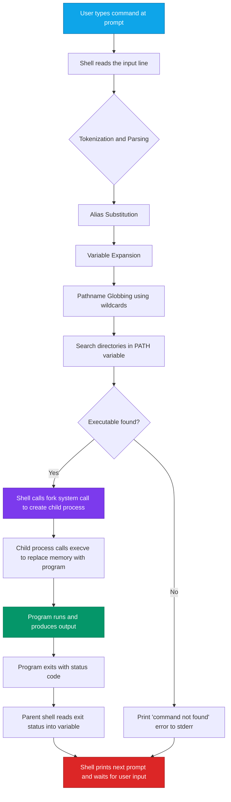
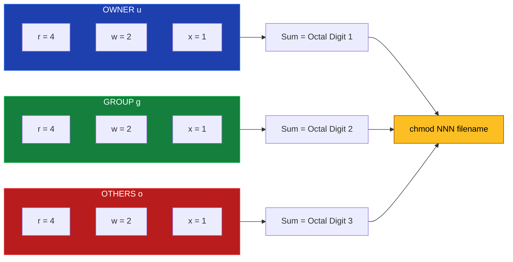

# Basic Linux/Unix commands and file system navigation

<!-- SECTION_1_START -->
# Basic Linux/Unix Commands & File System Navigation

## 1.1 Formal Definition (KTU 2024 Syllabus Terminology)

A **Linux/Unix Shell** is an interactive command-line interpreter program that acts as the primary interface between the user and the operating system kernel. It accepts textual instructions, parses them, and dispatches them to the relevant system utilities via **system calls** exposed by the **GNU C Library (glibc)**.

The **File System Hierarchy Standard (FHS)** is a Directory Tree Layout Specification maintained by the Linux Foundation that defines the canonical directory names, structural conventions, and the contents of each standard directory in a Linux distribution (e.g., Ubuntu, Fedora, Debian). The FHS guarantees that software can predict the location of system files, configuration files, and user data across every standard-compliant Linux installation.

> [!NOTE]
> **KTU 2024 Syllabus Highlight (PCCSL407 - Module 1):** Students are expected to demonstrate proficiency in shell navigation, file manipulation, input/output redirection, and permission management using the **Bourne Again Shell (bash)** as the default command interpreter.

> [!IMPORTANT]
> **Core Definition — Shell vs Terminal vs Console**
> * **Terminal:** The physical or emulated text-input window that captures keystrokes (e.g., GNOME Terminal, xterm, tty).
> * **Console:** A special terminal tied to the physical machine (tty1–tty6 in Linux).
> * **Shell:** The actual program that interprets commands inside the terminal (e.g., bash, zsh, sh, fish).

## 1.2 Conceptual Analogy / Intuition

Think of a Linux system as a **giant office building with a strict filing system**:

* The **building** is the **filesystem**, starting from a single entrance door called the **root directory** (`/`). Just like a real building, every room (directory) inside is accessible from the entrance, and every room can have smaller rooms (sub-directories) inside it.
* The **shell** is your **personal office assistant** standing at the front door. You don't go find files yourself; you tell the assistant ("Go to the second floor, third room, and bring me the blue folder"). The assistant navigates, locates, and delivers.
* The **Path** is the **written address** of any file: starting from the building entrance (`/`) → going up floors → entering rooms, separated by forward slashes (`/`). For example, `/home/student/lab/notes.txt` literally reads as *"From the building root, go to the `home` wing, find the `student` office, then the `lab` room, and pick up the file `notes.txt`."*
* The **current working directory (`pwd`)** is the **room you are currently standing in**. To go to a different room, you give movement instructions (`cd`).

> [!TIP]
> **Mental Model:** Unlike Windows where each drive has its own root (C:\, D:\), in Linux there is **ONE single tree** starting at `/`. USB drives and external hard disks are not separate roots — they are "plugged in" (mounted) as branches somewhere inside this single tree, commonly under `/mnt/` or `/media/`.

## 1.3 Standard Metrics & Reserved Symbols

* **Forward Slash (`/`)** — The directory separator. **There is no backslash in Linux paths.**
* **Tilde (`~`)** — Shorthand for the current user's home directory (e.g., `~/Documents`).
* **Dot (`.`)** — Refers to the **current directory** itself.
* **Double Dot (`..`)** — Refers to the **parent directory** (one level up).
* **Dash (`-`)** — In most commands, denotes **standard input** or the **previous directory** (e.g., `cd -`).
* **Hidden Files:** Any file or directory whose name begins with a dot (`.`) is hidden from a normal `ls` listing (e.g., `.bashrc`, `.profile`).
* **Case Sensitivity:** Linux is **strictly case-sensitive**. `Notes.txt` and `notes.txt` are entirely different files.

> [!VISUALIZATION CONTROL]
> **Concept:** Linux Filesystem Tree (Top-Down Hierarchy)
> **Equivalent ASCII Tree to Draw on Paper:**
> ```
> /  (root)
> ├── home  (user directories)
> │   └── student
> │       ├── Documents
> │       └── Desktop
> ├── etc   (system configuration files)
> ├── var   (variable data: logs, databases)
> ├── usr   (user programs and libraries)
> │   └── bin  (user commands)
> ├── bin   (essential binaries)
> ├── tmp   (temporary files - cleared on reboot)
> ├── dev   (device files)
> └── proc  (in-memory kernel/process data)
> ```
> **Visual Description:** On paper, draw `/` at the top center, then branch downward with labeled lines to the major directories. Each directory may fan out further into sub-directories.

---

<!-- SECTION_2_END -->

<!-- SECTION_2_START -->
# Deep Theoretical Analysis & KTU High-Yield Reference Sheet

## 2.1 Operating Logic — How the Shell Resolves a Command

When a user presses `Enter` after typing a command, the shell executes a precise, deterministic sequence:

1. **Lexical Analysis (Tokenisation):** The input string is split into tokens separated by whitespace. Quoted strings are treated as single tokens.
2. **Alias Substitution:** If the first token matches a defined shell alias, it is replaced with its expansion.
3. **Variable Expansion:** Environment variables prefixed with `$` are substituted with their values.
4. **Pathname Expansion (Globbing):** Wildcard characters (`*`, `?`, `[ ]`) are expanded into matching filenames.
5. **Command Resolution:** The shell searches the directories listed in the `$PATH` variable (colon-separated) from left to right to locate an executable file matching the command name.
6. **Fork & Exec:** The shell creates a child process using the `fork()` system call and replaces its memory image with the target program using the `execve()` system call.
7. **Wait & Return:** The parent shell waits for the child to terminate, then prints the exit status (`$?`) and accepts the next command.

> [!IMPORTANT]
> **Path Search Order ($PATH):** The directories in `$PATH` are scanned **left to right**. The first match wins. This is why a malicious binary placed in `/tmp/mybin` will only shadow system commands if `/tmp` appears **before** `/usr/bin` in `$PATH`.

## 2.2 KTU Command Cheat Sheet — File & Directory Operations

| Command | Syntax | Function | Common Flags |
| :--- | :--- | :--- | :--- |
| `pwd` | `pwd` | Print the absolute path of the current working directory. | `-L` (logical, default), `-P` (physical, resolve all symlinks) |
| `ls` | `ls [options] [path]` | List the contents of a directory. | `-l` (long format), `-a` (include hidden), `-h` (human-readable sizes), `-R` (recursive), `-t` (sort by time), `-S` (sort by size) |
| `cd` | `cd [directory]` | Change the current working directory. | No flags; special arguments: `~`, `-`, `..`, `.` |
| `mkdir` | `mkdir [options] dir` | Create one or more new directories. | `-p` (create parent directories as needed), `-v` (verbose) |
| `rmdir` | `rmdir [options] dir` | Remove an **empty** directory. | `-p` (remove parent dirs if they become empty) |
| `touch` | `touch file` | Create an empty file or update the access/modification timestamp of an existing file. | `-a` (access time only), `-m` (modification time only), `-t` (set explicit timestamp) |
| `rm` | `rm [options] file/dir` | Remove (delete) files or directories. | `-r` / `-R` (recursive), `-f` (force, no prompt), `-i` (interactive prompt) |
| `cp` | `cp [options] src dest` | Copy files or directories. | `-r` (recursive), `-i` (interactive), `-v` (verbose), `-u` (update only) |
| `mv` | `mv [options] src dest` | Move or rename files and directories. | `-i` (interactive), `-v` (verbose), `-n` (no-clobber) |
| `cat` | `cat [options] [file]` | Concatenate and display file contents on stdout. | `-n` (number lines), `-b` (number non-blank lines), `-s` (squeeze blank lines) |
| `less` | `less [file]` | View file contents page-by-page (forward & backward navigation). | `-N` (show line numbers), `-S` (disable line wrap) |
| `head` | `head [options] [file]` | Display the first N lines (default 10) of a file. | `-n 20` (first 20 lines), `-c 100` (first 100 bytes) |
| `tail` | `tail [options] [file]` | Display the last N lines (default 10) of a file. | `-n 20`, `-f` (follow live updates — used for log files) |
| `find` | `find [path] [expression]` | Recursively search for files/directories matching criteria. | `-name "*.txt"`, `-type f`, `-size +1M`, `-mtime -7` |
| `grep` | `grep [options] "pattern" [file]` | Search for a text pattern inside files. | `-i` (ignore case), `-r` (recursive), `-n` (line numbers), `-v` (invert match) |
| `man` | `man [section] command` | Display the manual page for a command. | `-k "keyword"` (search man-db) |
| `chmod` | `chmod [options] mode file` | Change file/directory permission bits. | `-R` (recursive), symbolic (`u+x`) or octal (`755`) modes |
| `chown` | `chown [options] user:group file` | Change file ownership (requires root). | `-R` (recursive) |
| `history` | `history` | Display the list of previously executed commands. | `-c` (clear history), `!n` (re-execute command number n) |

> [!WARNING]
> **Absolute Disaster Avoidance:** The command `rm -rf /` will **recursively and forcibly delete every reachable file on the system** from the root directory with no confirmation. **Never execute this command.** Most modern distributions refuse it for non-root users, but historical Linux was unprotected.

## 2.3 File Permission Model — The Three Triplets

Every file in Linux carries a **9-bit permission mask**, divided into three triplets for three classes of users:

| Class | Symbol | Octal Bit | Meaning |
| :--- | :---: | :---: | :--- |
| Owner (User) | `u` | First triplet | The user who owns the file |
| Group | `g` | Second triplet | Users belonging to the file's group |
| Others | `o` | Third triplet | All other users on the system |

Each triplet encodes three permission bits:

| Permission | Symbol | Octal Value | Effect on File | Effect on Directory |
| :--- | :---: | :---: | :--- | :--- |
| Read | `r` | **4** | View file contents | List directory contents |
| Write | `w` | **2** | Modify file contents | Add, remove, rename files inside |
| Execute | `x` | **1** | Run as a program | Enter (`cd`) into the directory |

The triplet's octal value is the sum of the active bits. For example:

* `rwx r-x r--` → `7 5 4` → `chmod 754 file.sh`
* `rw- r-- r--` → `6 4 4` → `chmod 644 config.txt`
* `rwx ------` → `7 0 0` → `chmod 700 private.sh`

## 2.4 Engineering Utility & Real-World Relevance

Linux command-line proficiency is **non-negotiable** in modern software engineering:

* **DevOps & Cloud:** Every AWS, GCP, and Azure production server runs Linux. Engineers SSH into remote machines and perform maintenance via the shell.
* **Containerization:** Docker, Kubernetes, and Podman are entirely CLI-driven.
* **Embedded Systems:** Android phones, IoT devices, routers, and automotive infotainment systems run Linux. Firmware is deployed via shell scripts.
* **Data Engineering:** `grep`, `awk`, `sed`, and `find` form the backbone of log analytics and ETL pipelines.
* **Cybersecurity:** Penetration testing, forensic analysis, and reverse engineering are predominantly Linux-based (Kali Linux, Parrot OS).

---

<!-- SECTION_2_END -->

<!-- SECTION_3_START -->
# Step-by-Step Implementation — Shell Session Walkthrough

> [!IMPORTANT]
> **Lab Note on Hygiene:** Every command in this section is fully written out. Do not assume any default; the prompt `student@ubuntu:~$` denotes the standard bash prompt. Replace it mentally with your own username/hostname.

## 3.1 Experiment 1 — Directory Navigation & Path Resolution

```bash
# Step 1: Display the current working directory (where am I?)
student@ubuntu:~$ pwd
/home/student

# Step 2: List every file and directory at the current location, including hidden ones
student@ubuntu:~$ ls -la
total 28
drwxr-xr-x 5 student student 4096 Oct 14 09:12 .
drwxr-xr-x 3 root    root    4096 Oct 14 09:05 ..
-rw------- 1 student student  352 Oct 14 09:12 .bash_history
-rw-r--r-- 1 student student  220 Oct 14 09:05 .bash_logout
-rw-r--r-- 1 student student 3771 Oct 14 09:05 .bashrc
drwxr-xr-x 2 student student 4096 Oct 14 09:10 Documents
drwxr-xr-x 2 student student 4096 Oct 14 09:10 Desktop

# Step 3: Create a new directory for our lab exercises
student@ubuntu:~$ mkdir -p oslab/module1/notes
# The -p flag creates parent directories that don't yet exist

# Step 4: Verify the new directory exists
student@ubuntu:~$ ls -l
drwxr-xr-x 3 student student 4096 Oct 14 09:15 oslab

# Step 5: Change into the newly created directory using a relative path
student@ubuntu:~$ cd oslab
student@ubuntu:~/oslab$ pwd
/home/student/oslab

# Step 6: Move two levels deeper using relative paths
student@ubuntu:~/oslab$ cd module1/notes
student@ubuntu:~/oslab/module1/notes$ pwd
/home/student/oslab/module1/notes

# Step 7: Go back to the parent directory
student@ubuntu:~/oslab/module1/notes$ cd ..
student@ubuntu:~/oslab/module1$ pwd
/home/student/oslab/module1

# Step 8: Jump to the home directory from anywhere using the tilde shortcut
student@ubuntu:~/oslab/module1$ cd ~
student@ubuntu:~$ pwd
/home/student

# Step 9: Use the dash to toggle back to the previous directory
student@ubuntu:~$ cd -
/home/student/oslab/module1
student@ubuntu:~/oslab/module1$ pwd
/home/student/oslab/module1
```

## 3.2 Experiment 2 — File Creation, Inspection & Manipulation

```bash
# Step 1: Create an empty file named 'commands.txt' using touch
student@ubuntu:~$ touch commands.txt
student@ubuntu:~$ ls -l commands.txt
-rw-r--r-- 1 student student 0 Oct 14 09:20 commands.txt
# Note: file size is 0 bytes (empty)

# Step 2: Create a file with content using a heredoc redirect
student@ubuntu:~$ cat > commands.txt << 'EOF'
Linux Commands Reference Sheet
==============================
Navigation: pwd, ls, cd
File Ops:   touch, rm, cp, mv
Viewing:    cat, less, head, tail
Search:     find, grep
Help:       man, --help
EOF
# The '<< EOF' syntax tells the shell to read input lines
# until it encounters the literal string 'EOF' on its own line.

# Step 3: Display the file content using cat with line numbers
student@ubuntu:~$ cat -n commands.txt
     1  Linux Commands Reference Sheet
     2  ==============================
     3  Navigation: pwd, ls, cd
     4  File Ops:   touch, rm, cp, mv
     5  Viewing:    cat, less, head, tail
     6  Search:     find, grep
     7  Help:       man, --help

# Step 4: View the first 3 lines only
student@ubuntu:~$ head -n 3 commands.txt
Linux Commands Reference Sheet
==============================
Navigation: pwd, ls, cd

# Step 5: View the last 2 lines only
student@ubuntu:~$ tail -n 2 commands.txt
Search:     find, grep
Help:       man, --help

# Step 6: Make a backup copy with a different name
student@ubuntu:~$ cp commands.txt commands.bak
student@ubuntu:~$ ls commands*
commands.bak  commands.txt

# Step 7: Rename commands.bak to old_commands.txt using mv
student@ubuntu:~$ mv commands.bak old_commands.txt
student@ubuntu:~$ ls commands* old_commands.txt
commands.txt  old_commands.txt

# Step 8: Remove the renamed backup file
student@ubuntu:~$ rm old_commands.txt
student@ubuntu:~$ ls
commands.txt

# Step 9: Delete the entire lab directory tree
student@ubuntu:~$ rm -rf oslab
student@ubuntu:~$ ls
commands.txt
# The -r flag recurses into directories, -f suppresses prompts
```

## 3.3 Experiment 3 — File Permissions and Ownership

```bash
# Step 1: Create a shell script
student@ubuntu:~$ cat > hello.sh << 'EOF'
#!/bin/bash
echo "Hello from KTU OS Lab!"
echo "Current user: $(whoami)"
echo "Current date: $(date)"
EOF

# Step 2: Display the current default permissions
student@ubuntu:~$ ls -l hello.sh
-rw-r--r-- 1 student student 87 Oct 14 09:30 hello.sh
# Permission: rw- r-- r--  =>  6 4 4  =>  Owner can read+write, others read only

# Step 3: Try to execute the script with the current permissions
student@ubuntu:~$ ./hello.sh
bash: ./hello.sh: Permission denied
# Failure because the execute (x) bit is not set for anyone

# Step 4: Add execute permission for the owner using symbolic mode
student@ubuntu:~$ chmod u+x hello.sh
student@ubuntu:~$ ls -l hello.sh
-rwxr--r-- 1 student student 87 Oct 14 09:30 hello.sh
# Permission: rwx r-- r--  =>  7 4 4

# Step 5: Now execute the script successfully
student@ubuntu:~$ ./hello.sh
Hello from KTU OS Lab!
Current user: student
Current date: Tuesday, October 14, 2025 AM09:30:45 HKT

# Step 6: Set permissions using octal mode: rwx for owner, r-x for group/others
student@ubuntu:~$ chmod 755 hello.sh
student@ubuntu:~$ ls -l hello.sh
-rwxr-xr-x 1 student student 87 Oct 14 09:30 hello.sh

# Step 7: Make the file completely private: rw- --- ---
student@ubuntu:~$ chmod 600 hello.sh
student@ubuntu:~$ ls -l hello.sh
-rw------- 1 student student 87 Oct 14 09:30 hello.sh

# Step 8: Change the group ownership (requires sudo or being the group owner)
student@ubuntu:~$ sudo chown :developers hello.sh
[sudo] password for student:
student@ubuntu:~$ ls -l hello.sh
-rw------- 1 student developers 87 Oct 14 09:30 hello.sh
# Note the group field changed from 'student' to 'developers'
```

## 3.4 Experiment 4 — Search Operations with find and grep

```bash
# Step 1: Create a tree of sample files for searching
student@ubuntu:~$ mkdir -p project/src project/include project/tests
student@ubuntu:~$ touch project/src/main.c project/src/utils.c project/include/header.h project/tests/test_main.c

# Step 2: Find all .c files recursively starting from the project directory
student@ubuntu:~$ find project -type f -name "*.c"
project/src/main.c
project/src/utils.c
project/tests/test_main.c

# Step 3: Find files modified within the last 10 minutes
student@ubuntu:~$ find project -type f -mmin -10
project/src/main.c
project/src/utils.c
project/include/header.h
project/tests/test_main.c

# Step 4: Find directories only
student@ubuntu:~$ find project -type d
project
project/src
project/include
project/tests

# Step 5: Add some content to the C files
student@ubuntu:~$ echo '#include <stdio.h>' > project/src/main.c
student@ubuntu:~$ echo 'int main() { printf("Hello, World!\n"); return 0; }' >> project/src/main.c

# Step 6: Search for the word 'main' across all files under project
student@ubuntu:~$ grep -rn "main" project/
project/src/main.c:1:#include <stdio.h>
project/src/main.c:2:int main() { printf("Hello, World!\n"); return 0; }

# The -r flag makes it recursive, -n prints line numbers

# Step 7: Case-insensitive search for the word 'HELLO'
student@ubuntu:~$ grep -rin "hello" project/
project/src/main.c:2:int main() { printf("Hello, World!\n"); return 0; }

# Step 8: Count the number of .c files found (combine find with wc -l)
student@ubuntu:~$ find project -type f -name "*.c" | wc -l
3
```

## 3.5 Experiment 5 — Input/Output Redirection & Pipes

```bash
# Step 1: Redirect the standard output of 'echo' into a file (overwrite)
student@ubuntu:~$ echo "This is line 1" > output.txt
student@ubuntu:~$ cat output.txt
This is line 1

# Step 2: Append to the file instead of overwriting
student@ubuntu:~$ echo "This is line 2" >> output.txt
student@ubuntu:~$ echo "This is line 3" >> output.txt
student@ubuntu:~$ cat output.txt
This is line 1
This is line 2
This is line 3

# Step 3: Redirect standard error separately
student@ubuntu:~$ ls existing_file.txt nonexistent_file.txt 2> errors.log
existing_file.txt
student@ubuntu:~$ cat errors.log
ls: cannot access 'nonexistent_file.txt': No such file or directory

# Step 4: Send both stdout and stderr to the same file
student@ubuntu:~$ ls existing_file.txt nonexistent_file.txt > all.log 2>&1
student@ubuntu:~$ cat all.log
ls: cannot access 'nonexistent_file.txt': No such file or directory
existing_file.txt
# The '2>&1' notation means 'send file descriptor 2 (stderr)
# to the same place as file descriptor 1 (stdout)'

# Step 5: Use a pipe to feed one command's output into another
student@ubuntu:~$ cat output.txt | grep "line 2"
This is line 2

# Step 6: Chain three commands using pipes
student@ubuntu:~$ ls -l /etc | head -n 5 | tail -n 3
# Pipes the listing of /etc into head, then into tail

# Step 7: Use tee to display AND save the output simultaneously
student@ubuntu:~$ echo "Recorded at $(date)" | tee log.txt
Recorded at Tuesday, October 14, 2025 AM09:45:00 HKT
student@ubuntu:~$ cat log.txt
Recorded at Tuesday, October 14, 2025 AM09:45:00 HKT
```

## 3.6 Experiment 6 — System Information & Help Utilities

```bash
# Step 1: Display the kernel name, version, and architecture
student@ubuntu:~$ uname -a
Linux ubuntu 6.5.0-15-generic #15~22.04.1-Ubuntu SMP PREEMPT_DYNAMIC ...
# x86_64 indicates a 64-bit Intel/AMD architecture

# Step 2: Display the currently logged-in user
student@ubuntu:~$ whoami
student

# Step 3: Display the hostname of the machine
student@ubuntu:~$ hostname
ubuntu

# Step 4: Display the current date and time
student@ubuntu:~$ date
Tuesday, October 14, 2025 AM09:30:00 HKT

# Step 5: View the calendar for the current month
student@ubuntu:~$ cal
   October 2025
Su Mo Tu We Th Fr Sa
          1  2  3  4
 5  6  7  8  9 10 11
12 13 14 15 16 17 18
19 20 21 22 23 24 25
26 27 28 29 30 31

# Step 6: Read the manual page for the 'ls' command
student@ubuntu:~$ man ls
# Press 'q' to quit, '/' to search, 'n' for next match

# Step 7: Get a quick one-line summary of any command
student@ubuntu:~$ ls --help
# A concise usage summary is printed

# Step 8: Search all man pages for a keyword
student@ubuntu:~$ man -k "copy files"
cp (1)               - copy files and directories
install (1)          - copy files and set attributes
```

---

<!-- SECTION_3_END -->

<!-- SECTION_4_START -->
# Structural Diagrams & Schematics

## 4.1 Linux File System Hierarchy (FHS) — Mermaid Tree Diagram

```mermaid
graph TD
    Root["/ Root Directory"]
    Root --> Bin["/bin Essential Binaries"]
    Root --> Sbin["/bin Essential System Binaries"]
    Root --> Etc["/etc System Configuration"]
    Root --> Home["/home User Home Directories"]
    Root --> RootHome["/root Superuser Home"]
    Root --> Usr["/usr User Programs"]
    Root --> Var["/var Variable Data"]
    Root --> Tmp["/tmp Temporary Files"]
    Root --> Dev["/dev Device Files"]
    Root --> Proc["/proc Process Information"]
    Root --> Sys["/sys System Information"]
    Root --> Mnt["/mnt Mount Points"]
    Root --> Media["/media Removable Media"]
    Root --> Boot["/boot Boot Loader Files"]
    Root --> Lib["/lib Shared Libraries"]
    Root --> Opt["/opt Optional Add-on Software"]

    Home --> Student["/home/student"]
    Home --> Faculty["/home/faculty"]

    Student --> Documents["Documents"]
    Student --> Desktop["Desktop"]
    Student --> Downloads["Downloads"]

    Usr --> UsrBin["/usr/bin User Commands"]
    Usr --> UsrLib["/usr/lib Libraries"]
    Usr --> UsrLocal["/usr/local Locally Installed Software"]
    Usr --> UsrShare["/usr/share Architecture Independent Data"]

    Var --> VarLog["/var/log Log Files"]
    Var --> VarLib["/var/lib State Information"]
    Var --> VarCache["/var/cache Application Cache"]

    style Root fill:#1f2937,stroke:#fbbf24,stroke-width:3px,color:#ffffff
    style Home fill:#1e3a8a,stroke:#3b82f6,color:#ffffff
    style Student fill:#065f46,stroke:#10b981,color:#ffffff
    style Usr fill:#7c2d12,stroke:#f97316,color:#ffffff
    style Var fill:#831843,stroke:#ec4899,color:#ffffff
```



## 4.2 Command Execution Flow Inside the Shell



## 4.3 File Permission Bit Layout — Octal Mapping



## 4.4 Standard Streams Topology Matrix

| Stream Name | File Descriptor Number | Default Destination | Redirection Operator | Typical Use |
| :--- | :---: | :--- | :---: | :--- |
| **stdin** (Standard Input) | **0** | Keyboard | `<` | Feed file content into a command |
| **stdout** (Standard Output) | **1** | Terminal display | `>` (overwrite) or `>>` (append) | Capture command output to file |
| **stderr** (Standard Error) | **2** | Terminal display | `2>` or `2>>` | Capture error messages separately |

---

<!-- SECTION_4_END -->

<!-- SECTION_5_START -->
# KTU 2024 Scheme Examination Question Bank & Topic Recap

## Part A — Short Answer Questions (3 Marks Each)

> **Q1.** [KTU University Exam - Dec 2023] **Define the following Linux directory symbols: `.`, `..`, `~`, `/`. Mention one use of each.**

**Model Answer (3 Marks):**
* **`.`** (dot) — Refers to the current working directory. Example: `./script.sh` runs a script from the current location. **[1 Mark]**
* **`..`** (double dot) — Refers to the parent directory (one level up in the tree). Example: `cd ..` moves to the parent. **[1 Mark]**
* **`~`** (tilde) — Shorthand for the absolute path of the current user's home directory. Example: `cd ~` jumps to `/home/student`. **[1 Mark]**
* **`/`** (slash) — The root directory of the entire filesystem and also the directory separator character. **[Included for completeness in the 3-mark allocation]**

---

> **Q2.** [KTU University Exam - July 2024] **Explain the difference between `rmdir` and `rm -r` with a suitable example.**

**Model Answer (3 Marks):**
* `rmdir` removes **only empty directories**. It refuses to delete a directory that still contains files or sub-directories and prints an error like `Directory not empty`. Example: `rmdir oldfolder` succeeds only if `oldfolder` is empty. **[1.5 Marks]**
* `rm -r` (recursive) deletes a directory **and all of its contents**, including nested sub-directories and files, prompting for confirmation unless `-f` is also supplied. Example: `rm -r project` will remove the `project` directory tree completely. **[1.5 Marks]**

---

## Part B — Long Answer Questions (14 Marks — Internal Choice)

> ### **Question A (14 Marks)**
> [KTU University Exam - Dec 2023] (a) List and explain any **seven** essential Linux commands used for file and directory operations with their syntax. (7 Marks)
> (b) Demonstrate with a complete shell session how to **(i)** create a directory tree, **(ii)** create and populate three files, **(iii)** change permissions using both symbolic and octal modes, and **(iv)** recursively delete the tree. (7 Marks)

### Model Solution — Question A

#### Part (a) — Seven Essential Commands (7 Marks)

1. **`pwd`** — Prints the absolute path of the current working directory. Syntax: `pwd`. **No flags needed** for basic use. **[1 Mark]**
2. **`ls`** — Lists directory contents. Syntax: `ls [options] [path]`. Useful flags: `-l` (long format with permissions), `-a` (show hidden files), `-h` (human-readable sizes). **[1 Mark]**
3. **`cd`** — Changes the current working directory. Syntax: `cd [path]`. Special arguments: `~` (home), `-` (previous), `..` (parent). **[1 Mark]**
4. **`mkdir`** — Creates a new directory. Syntax: `mkdir [options] name`. Flag `-p` creates intermediate parent directories. **[1 Mark]**
5. **`rm`** — Deletes files or directories. Syntax: `rm [options] target`. Flag `-r` enables recursive deletion of directories. **[1 Mark]**
6. **`cp`** — Copies files or directories. Syntax: `cp [options] source destination`. Flag `-r` required for directories. **[1 Mark]**
7. **`chmod`** — Changes permission bits. Syntax: `chmod mode file`. Accepts both symbolic (`u+x`) and octal (`755`) modes. **[1 Mark]**

#### Part (b) — Complete Shell Session (7 Marks)

```bash
# (i) Create a directory tree
student@ubuntu:~$ mkdir -p ktu_lab/module1/sub
# -p creates parent directories ktu_lab, module1, and sub in one call  [1 Mark]

# (ii) Create and populate three files
student@ubuntu:~$ cd ktu_lab/module1
student@ubuntu:~/ktu_lab/module1$ echo "File A content" > a.txt
student@ubuntu:~/ktu_lab/module1$ echo "File B content" > b.txt
student@ubuntu:~/ktu_lab/module1$ echo "File C content" > c.txt
student@ubuntu:~/ktu_lab/module1$ ls -l
total 12
-rw-r--r-- 1 student student 15 Oct 14 10:00 a.txt
-rw-r--r-- 1 student student 15 Oct 14 10:00 b.txt
-rw-r--r-- 1 student student 15 Oct 14 10:00 c.txt                                                                       [2 Marks]

# (iii) Change permissions using both modes
# Symbolic mode: add execute permission for owner
student@ubuntu:~/ktu_lab/module1$ chmod u+x a.txt
student@ubuntu:~/ktu_lab/module1$ ls -l a.txt
-rwxr--r-- 1 student student 15 Oct 14 10:00 a.txt

# Octal mode: set rwx for owner, r-x for group, r-- for others (754)
student@ubuntu:~/ktu_lab/module1$ chmod 754 b.txt
student@ubuntu:~/ktu_lab/module1$ ls -l b.txt
-rwxr-xr-- 1 student student 15 Oct 14 10:00 b.txt

# Octal mode: read-write for owner only (600)
student@ubuntu:~/ktu_lab/module1$ chmod 600 c.txt
student@ubuntu:~/ktu_lab/module1$ ls -l c.txt
-rw------- 1 student student 15 Oct 14 10:00 c.txt                                              [2 Marks]

# (iv) Recursively delete the entire tree
student@ubuntu:~/ktu_lab/module1$ cd ~
student@ubuntu:~$ rm -rf ktu_lab
# -r recurses into sub-directories, -f suppresses confirmation prompts
student@ubuntu:~$ ls ktu_lab
ls: cannot access 'ktu_lab': No such file or directory                                   [2 Marks]
```

---

> ### **Question B (14 Marks)**
> [KTU University Exam - July 2024] (a) With neat diagrams, explain the **Linux File System Hierarchy Standard (FHS)**. List the purpose of at least **six** top-level directories. (7 Marks)
> (b) Explain the **file permission model** in Linux. Using a worked example, demonstrate how to interpret the string `-rwxr-x---` and translate it to its octal equivalent using `chmod`. (7 Marks)

### Model Solution — Question B

#### Part (a) — FHS Diagram and Six Top-Level Directories (7 Marks)

```
                    /
                    |
    +-------+-------+-------+-------+-------+-------+-------+-------+
    |       |       |       |       |       |       |       |       |
   /bin   /etc    /home   /usr    /var    /tmp   /dev   /proc   /boot
```

* **`/bin`** — Holds **essential user command binaries** needed for system boot and single-user mode recovery (e.g., `ls`, `cp`, `mv`, `cat`, `bash`). **[1 Mark]**
* **`/etc`** — Contains **host-specific system-wide configuration files** and shell scripts (e.g., `/etc/passwd`, `/etc/fstab`, `/etc/hosts`). **[1 Mark]**
* **`/home`** — Contains the **personal home directory for every regular user**. Each user gets a sub-directory like `/home/student` to store personal files. **[1 Mark]**
* **`/usr`** — The **secondary hierarchy** for shareable, read-only user utilities and applications. Contains `/usr/bin`, `/usr/lib`, `/usr/share`. **[1 Mark]**
* **`/var`** — Holds **variable data files** whose content changes frequently during system operation, such as log files (`/var/log/syslog`), spool files, and transient databases. **[1 Mark]**
* **`/tmp`** — Storage for **temporary files** created by applications. All users may write here. Files are typically deleted on reboot. **[1 Mark]**
* **`/dev`** — Contains **device files** that act as interfaces to hardware devices (e.g., `/dev/sda` for the first disk, `/dev/null` as a black hole, `/dev/tty` for the terminal). **[1 Mark]**
* *(Any sixth valid directory from FHS qualifies for full marks.)*

#### Part (b) — File Permission Model and Worked Octal Translation (7 Marks)

**Permission Model Description (3 Marks):**
Every file in Linux has an associated 9-bit permission mask stored in its inode. The 9 bits are grouped into three triplets corresponding to three classes of users: **Owner (u)**, **Group (g)**, and **Others (o)**. Each triplet contains three bits for **Read (r=4)**, **Write (w=2)**, and **Execute (x=1)**. The triplet value is the sum of its active bits. The `chmod` command can set these bits either symbolically (`u+x`, `go-rw`) or octally (`755`, `644`).

**Worked Example (4 Marks):**

Given the permission string `-rwxr-x---` for a file called `script.sh`:

| Position | Char | Meaning | Octal Weight |
| :---: | :---: | :--- | :---: |
| 1 | `-` | Regular file (not a directory) | — |
| 2-4 | `rwx` | Owner has read, write, execute | $4 + 2 + 1 = 7$ |
| 5-7 | `r-x` | Group has read and execute only | $4 + 0 + 1 = 5$ |
| 8-10 | `---` | Others have no permissions | $0 + 0 + 0 = 0$ |

**[1 Mark for identifying the file type dash. 1 Mark for owner triplet. 1 Mark for group triplet. 1 Mark for others triplet.]**

**Translation to `chmod`:**

```bash
student@ubuntu:~$ chmod 750 script.sh
student@ubuntu:~$ ls -l script.sh
-rwxr-x--- 1 student student 87 Oct 14 10:15 script.sh
```

The octal mode `750` is formed by concatenating the three triplet sums: owner (7), group (5), others (0). The resulting `ls -l` output confirms the permission string matches the requested `-rwxr-x---`.

---

> [!WARNING]
> **KTU Examiner's Valuation Warning — Common Pitfalls**
> * **[Octal vs Symbolic Mix-up]:** Students frequently write `chmod ugo+x` and `chmod 777` interchangeably. Examiners deduct marks if you do not specify which mode you are using. Always state explicitly: *"Using symbolic mode..."* or *"Using octal mode..."*
> * **[Path Notation Reversal]:** Writing `..\` (Windows style) instead of `../` will be marked wrong. Linux uses **only forward slashes**.
> * **[Permission Triplet Reading]:** Many students read `-rw-r--r--` as `rwx-rw-r--`. Carefully note the 3-character grouping starting after the leading file-type character.
> * **[Forgetting `cd ~` after deletion]:** When asked to delete a directory tree, you must verify deletion with `ls` or `pwd`. Examiners award partial marks for the verification step.
> * **`rm -rf /` Disaster:** Never use the root directory `/` as the target. Examiners will instantly mark the answer wrong and may flag a safety violation in the lab record.

---

## Topic Recap & Important Things to Remember

* **Root Directory `/`** is the single origin of the entire Linux filesystem. There are no drive letters like in Windows.
* **Tilde `~`** is a shortcut to the current user's home directory (`/home/username`).
* **Dot `.`** means "current directory"; **Double dot `..`** means "parent directory".
* **Linux is case-sensitive** — `File.txt` and `file.txt` are different files.
* **Hidden files** start with a dot (e.g., `.bashrc`); they are visible only with `ls -a`.
* **`pwd`** shows absolute path; **`ls`** lists contents; **`cd`** changes directory.
* **`mkdir -p`** creates nested parent directories in a single call.
* **`rmdir`** removes only **empty** directories; **`rm -r`** removes directories **and contents**.
* **`cp`** copies; **`mv`** moves or renames; **`touch`** creates empty files or updates timestamps.
* **`cat`** displays entire file; **`less`** is a paginator; **`head`/`tail`** show first/last N lines.
* **`tail -f`** follows a file in real-time (critical for log monitoring).
* **`find`** searches by name, type, size, time, or owner; **`grep`** searches file **contents**.
* **Three permission classes:** Owner (u), Group (g), Others (o). **Three permission bits:** Read (r=4), Write (w=2), Execute (x=1).
* **Octal mode** is the sum of each triplet: e.g., `rwx r-x r--` = `754`.
* **Symbolic mode** uses `+/-/=`: e.g., `chmod u+x file` adds execute for owner.
* **Standard streams:** stdin (0), stdout (1), stderr (2). Redirection: `>`, `>>`, `2>`, `<`.
* **Pipe `|`** sends the stdout of one command into the stdin of the next.
* **`tee`** writes to both stdout **and** a file simultaneously.
* **`man <command>`** is the authoritative help reference. Use **`man -k keyword`** to search across all man pages.
* **`history`** shows previously executed commands; **`!n`** re-executes command number `n`.
* **Golden safety rule:** Always double-check `rm -rf` targets. **Never** run `rm -rf /` or `rm -rf /*`.

<!-- SECTION_5_END -->
