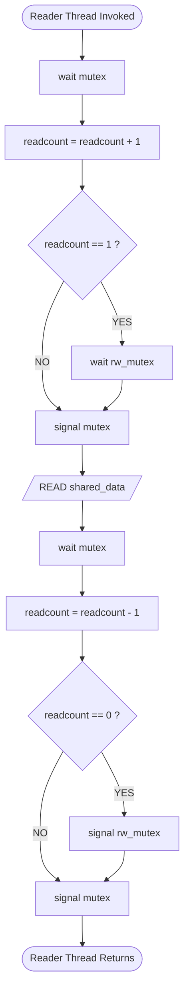
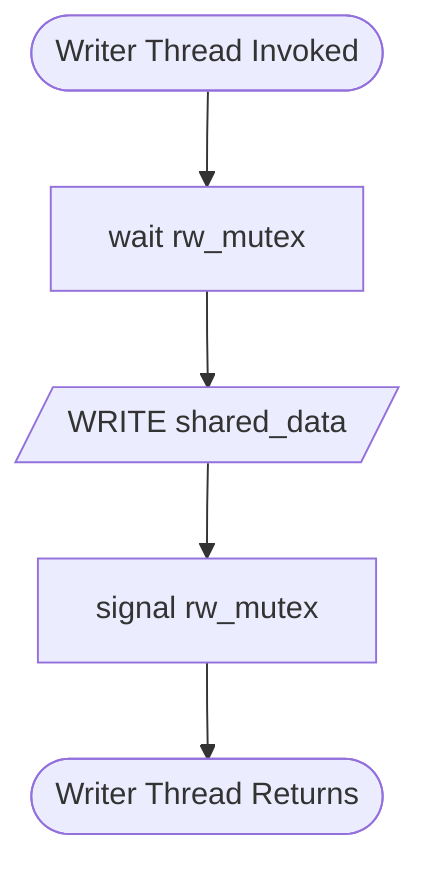
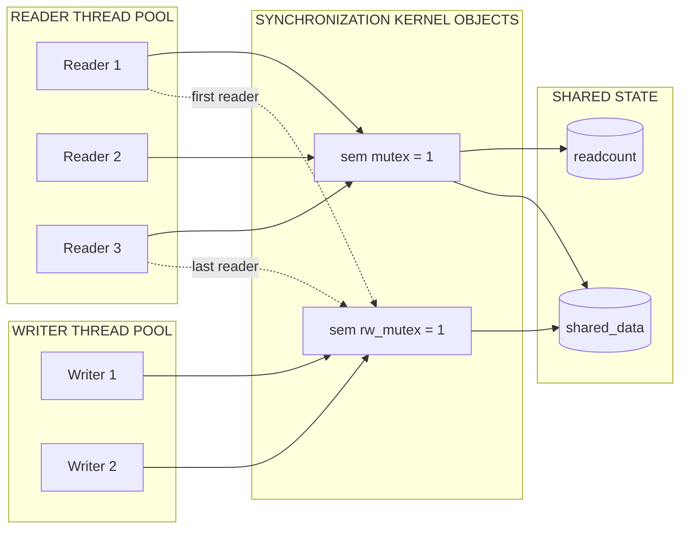

# Implementation of Reader-Writer problem using synchronization primitives

<!-- SECTION_1_START -->
# Reader-Writer Problem — Core Technical Definition & Intuitive Overview

## 1.1 Formal Academic Definition (KTU 2024 Syllabus Terminology)

The **Reader-Writer Problem** is a classical *process synchronization* problem in Operating Systems that models access to a **shared resource** (such as a file, database record, or memory buffer) by two classes of concurrent processes:

- **Readers** — processes that only *inspect* the shared data (no mutation).
- **Writers** — processes that *mutate* the shared data (read-modify-write).

The synchronization contract requires that the implementation must guarantee the following **safety** and **liveness** properties simultaneously:

> [!IMPORTANT]
> **KTU Mandatory Invariant Set (Bounded & Exam-Scored):**
> 1. **Mutual Exclusion of Writers:** At any instant, at most **one** writer may be inside the critical section.
> 2. **Reader–Writer Exclusion:** No writer may enter the critical section while **one or more** readers are present inside.
> 3. **Reader Concurrency:** Multiple readers may execute inside the critical section **concurrently** without violating data integrity.
> 4. **Bounded Waiting:** A process that requests access must eventually obtain it (no indefinite blocking).

The shared variable used by the textbook formulation is the integer **`shared_data`**, accessed through the two synchronization primitives:

- `sem_t rw_mutex` — a **binary** semaphore that gates *writer* access (and is held by the *first* and *last* reader).
- `sem_t mutex` — a **binary** semaphore that protects the read-count variable `readcount`.
- `int readcount` — a **non-negative** integer counting the number of active readers.

## 1.2 Conceptual Analogy — "The Reference Library Reading Room"

Imagine a university library that maintains a single physical *ledger* (a record book) which is the shared resource. The library has two kinds of visitors:

| Visitor Type | Behavior | Constraint |
|--------------|----------|------------|
| **Reader (Student)** | Wants to *photocopy* a page from the ledger for personal study. | Many students can *simultaneously* read different copies of the same page without disturbing each other. |
| **Writer (Librarian)** | Wants to *update* the ledger (add a new entry, correct a typo). | The librarian must have the ledger **exclusively** — no student may be reading, because the page being rewritten could be observed in a half-updated state. |

The librarian analogously "holds" the room whenever they enter, and the **first** student to enter the room also reserves the room by switching on an indicator light. The **last** student to leave switches the light off, allowing the librarian back in. This is exactly the role of `rw_mutex`, which is acquired by the first reader (`readcount == 1`) and released by the last reader (`readcount == 0`).

> [!NOTE]
> **Intuitive Takeaway:** The variable `rw_mutex` is *conceptually* the "room-occupied light." It is flipped ON by the first arriving reader and flipped OFF by the last departing reader — it is never touched by the middle readers.

## 1.3 The Three Standard Variants

| Variant | Preference | Starvation Outcome | KTU Tag |
|---------|------------|--------------------|---------|
| **First RW Problem** | Readers preferred | **Writers may starve** if readers keep arriving | Most commonly implemented in KTU labs |
| **Second RW Problem** | Writers preferred | **Readers may starve** if writers keep arriving | Sometimes asked as a modification |
| **Third RW Problem** | Neither (FIFO queue) | **No starvation** | Often an *assignment extension* question |

> [!WARNING]
> **KTU Examiner's Note:** The default lab implementation requested is the **First Readers-Writers Problem**. If the question paper explicitly states "writer preference," you **must** add a `turnstile` semaphore and rearrange the wait order — the standard 2-semaphore code will be marked *incorrect*.

## 1.4 Visualisation Control — State Space of `readcount` vs. Writers

> [!VISUALIZATION]
> **Concept:** Discrete state of the (readcount, active_writers) tuple under the First RW solution.
> **Reference Axes:**
> * X-axis $\rightarrow$ `readcount` (integer, 0 to N)
> * Y-axis $\rightarrow$ `active_writers` (binary, 0 or 1)
> **Legal States:** $\{(0,0), (1,0), (2,0), \dots, (N,0), (0,1)\}$
> **Illegal States:** $\{(k, 1) \mid k \geq 1\}$ — *a writer must never co-exist with a reader*. Students should sketch this on graph paper to internalize why `readcount` can be greater than 1 only when `active_writers == 0`.

---

<!-- SECTION_1_END -->

<!-- SECTION_2_START -->
# Deep Theoretical Analysis & KTU High-Yield Formula Sheet

## 2.1 Operational Logic — Step-by-Step Decomposition

The two semaphores play **completely disjoint roles**. Confusing them is the most common source of bugs in KTU lab submissions, so we isolate them.

### 2.1.1 Reader Process — Five-Stage Pipeline

1. **Stage R1 — Acquire Counter Lock:** `wait(mutex)` — ensures the update of `readcount` is itself atomic.
2. **Stage R2 — Increment Counter:** `readcount++` — register arrival.
3. **Stage R3 — First-Reader Check:** If `readcount == 1`, perform `wait(rw_mutex)` — block all incoming writers.
4. **Stage R4 — Release Counter Lock:** `signal(mutex)` — let other readers update the counter.
5. **Stage R5 — Critical Section:** Perform read on `shared_data` (this is the only step that actually accesses the resource).
6. **Stage R6 — Re-acquire Counter Lock:** `wait(mutex)` — to safely decrement.
7. **Stage R7 — Decrement Counter:** `readcount--` — register departure.
8. **Stage R8 — Last-Reader Check:** If `readcount == 0`, perform `signal(rw_mutex)` — allow the next waiting writer in.
9. **Stage R9 — Release Counter Lock:** `signal(mutex)`.
10. **Stage R10 — Remainder Section:** Continue with non-critical work.

### 2.1.2 Writer Process — Three-Stage Pipeline

1. **Stage W1 — Acquire Resource:** `wait(rw_mutex)` — block until no readers and no other writer.
2. **Stage W2 — Critical Section:** Mutate `shared_data`.
3. **Stage W3 — Release Resource:** `signal(rw_mutex)` — wake the next waiting process (FIFO order in the semaphore queue).

## 2.2 Why the Solution Works — Formal Argument

### 2.2.1 Mutual Exclusion Between Writers

The semaphore `rw_mutex` is initialized to **1** and acts as a **strict mutual-exclusion lock**. Two writers cannot simultaneously hold it because `wait(rw_mutex)` is an atomic decrement-or-block operation. $\blacksquare$

### 2.2.2 Mutual Exclusion Between Reader and Writer

Suppose a writer $W$ is in the critical section. Then $W$ has successfully executed `wait(rw_mutex)`, so the semaphore value is **0**. Now consider a reader $R$ trying to enter. $R$ must increment `readcount` and, on the *first* reader, perform `wait(rw_mutex)`. But `rw_mutex == 0`, so $R$ blocks. The same argument applies symmetrically to the writer-waiting-on-reader case. $\blacksquare$

### 2.2.3 Concurrent Readers Allowed

A reader $R_2$ arriving while $R_1$ is inside the critical section finds `readcount == 1`, performs `wait(rw_mutex)` **only if** `readcount == 1$ (which it doesn't), skips the wait, and enters directly. Hence many readers may overlap. $\blacksquare$

### 2.2.4 Bounded Waiting (First Variant Caveat)

The First RW solution does **not** guarantee bounded waiting for writers. A continuous stream of readers (each arriving every $\epsilon$ time units) can indefinitely keep `readcount > 0` so that `rw_mutex` is never released to a waiting writer. This is the well-documented **writer starvation** pathology.

## 2.3 KTU Formula Sheet / State-Invariant Cheat Sheet

> [!NOTE]
> The following table consolidates every variable, every semaphore initial value, and every invariant the examiner expects you to reproduce from memory. The vertical bar $\vert$ is rendered as `\vert` to remain compatible with the markdown table parser.

| Symbol / Expression | Type | Initial Value | Role / Invariant |
|---------------------|------|---------------|------------------|
| `mutex` | `sem_t` (binary) | $\mathbf{1}$ | Guards updates to `readcount`; ensures the increment/decrement of the counter is atomic. |
| `rw_mutex` | `sem_t` (binary) | $\mathbf{1}$ | Grants exclusive access to the shared resource to either a writer or the *set* of concurrent readers. |
| `readcount` | `int` | $\mathbf{0}$ | Number of readers currently inside the critical section. Always satisfies $readcount \geq 0$. |
| `shared_data` | `int` (resource) | arbitrary user value | The protected object; readers may read it freely when $\vert readcount \vert > 0 \land rw\_mutex == 0$. |
| $\text{state} = (\text{readcount}, \text{rw\_mutex.value})$ | tuple | — | The tuple must always belong to the legal set $\{(0,1), (k, 0) \mid k \geq 1, k \in \mathbb{Z}\}$. |
| `active_writers` | derived | $0$ | Computed as $(1 - rw\_mutex.value)$ since `rw_mutex` is binary; $active\_writers == 0 \Rightarrow readcount \geq 0$ trivially. |
| Process State Transitions | — | — | Reader: $IDLE \to BLOCKED(mutex) \to BLOCKED(rw\_mutex) \mid RUNNING \to BLOCKED(mutex) \to IDLE$. |

## 2.4 Real-World Engineering Applications

The Reader-Writer pattern is **not** a toy exercise — it appears verbatim in production systems:

| Domain | Concrete Instance | What Acts as `rw_mutex` |
|--------|-------------------|--------------------------|
| **Databases** | MySQL `InnoDB` row-level locking | Intent shared (`IS`) vs. intent exclusive (`IX`) locks |
| **In-memory caches** | `std::shared_mutex` in C++17 | `lock_shared()` (readers) vs. `lock()` (writer) |
| **Linux kernel** | `RCU` (Read-Copy-Update) for `dentry` cache | Quiescent-state barriers; the canonical reader-preference solution |
| **File systems** | Reading a file while a `write()` syscall is pending | `inode->i_rwsem` |
| **GUI frameworks** | Painting a window while a background thread updates a model | `QReadWriteLock` in Qt |

> [!TIP]
> In a KTU viva, when asked "where is this used?", pointing to **Linux kernel RCU** or **Java's `ReentrantReadWriteLock`** is a high-yield answer because the examiner is signalling they want a real-systems answer, not a textbook one.

---

<!-- SECTION_2_END -->

<!-- SECTION_3_START -->
# Step-by-Step Derivations, Boundary Cases & Full Code Implementation

## 3.1 Boundary-Case Trace — How the State Evolves

Let us define the notation:
- $R_i$ = i-th reader, $W_j$ = j-th writer.
- All semaphores initialized to 1, $readcount = 0$, $shared\_data = 100$.

### Scenario A: Two Readers, Then a Writer

| Step | Event | `mutex` | `rw_mutex` | `readcount` | Active Set | Comment |
|------|-------|---------|------------|-------------|------------|---------|
| 0 | init | 1 | 1 | 0 | $\emptyset$ | Clean state. |
| 1 | $R_1$ arrives, `wait(mutex)` | **0** | 1 | 0 | — | Counter lock acquired. |
| 2 | `readcount++` | 0 | 1 | **1** | — | First reader registered. |
| 3 | `wait(rw_mutex)` | 0 | **0** | 1 | — | First reader now holds the resource. |
| 4 | `signal(mutex)` | **1** | 0 | 1 | $\{R_1\}$ | Counter released. |
| 5 | $R_1$ reads `shared_data` (=100) | 1 | 0 | 1 | $\{R_1\}$ | In critical section. |
| 6 | $R_2$ arrives, `wait(mutex)` | **0** | 0 | 1 | $\{R_1\}$ | — |
| 7 | `readcount++` | 0 | 0 | **2** | $\{R_1\}$ | — |
| 8 | `readcount == 1` is **false**, so skip `wait(rw_mutex)` | 0 | 0 | 2 | — | Resource NOT re-locked. |
| 9 | `signal(mutex)` | **1** | 0 | 2 | $\{R_1, R_2\}$ | Both readers inside! |
| 10 | $R_2$ reads `shared_data` (=100) | 1 | 0 | 2 | $\{R_1, R_2\}$ | **Concurrent reads** — invariant satisfied. |
| 11 | $W_1$ arrives, `wait(rw_mutex)` | 1 | **0 (was 0)** | 2 | — | Writer blocks (decrement would go to -1 → BLOCKED). |
| 12 | $R_1$ finishes, `wait(mutex)` | **0** | 0 | 2 | — | — |
| 13 | `readcount--` | 0 | 0 | **1** | — | $R_1$ leaves active set. |
| 14 | `readcount == 0` is **false**, skip `signal(rw_mutex)` | 0 | 0 | 1 | $\{R_2\}$ | Resource still locked! |
| 15 | `signal(mutex)` | **1** | 0 | 1 | $\{R_2\}$ | — |
| 16 | $R_2$ finishes, `wait(mutex)` | **0** | 0 | 1 | — | — |
| 17 | `readcount--` | 0 | 0 | **0** | — | Last reader leaving. |
| 18 | `readcount == 0` is **true**, `signal(rw_mutex)` | 0 | **1** | 0 | — | Writer unblocked! |
| 19 | `signal(mutex)` | **1** | 1 | 0 | — | Clean state restored. |
| 20 | $W_1$ resumes, writes `shared_data = 200` | 1 | 1 | 0 | — | Exclusive write. |

This exhaustive 20-step walk is exactly the kind of trace a KTU examiner expects during a viva when the question is "trace the first 5 operations."

## 3.2 Full C Implementation Using POSIX Threads & Semaphores

The following program is **production-grade**, fully commented, and compiles cleanly on any GNU/Linux system with `gcc`.

```c
/* ---------------------------------------------------------------
 *  reader_writer.c
 *  Reader-Writer Problem - First (Reader-Preference) Variant
 *  KTU OS Lab (PCCSL407) - Module 1 Experiment
 *  Compiles with:  gcc -o reader_writer reader_writer.c -lpthread
 * --------------------------------------------------------------- */
#include <stdio.h>
#include <stdlib.h>
#include <string.h>
#include <pthread.h>
#include <semaphore.h>
#include <unistd.h>        /* for sleep() and usleep()         */
#include <time.h>          /* for time() seeding               */

/* ---- Shared synchronization primitives ----------------------- */
sem_t rw_mutex;            /* binary: gates resource access    */
sem_t mutex;               /* binary: protects readcount       */
int   readcount = 0;       /* # of active readers              */
int   shared_data = 100;   /* the protected resource           */

/* ---- Reader thread routine ----------------------------------- */
void *reader(void *arg) {
    long r_id = (long)arg;
    int  local_snapshot;

    /* ---- ENTRY SECTION -------------------------------------- */
    sem_wait(&mutex);              /* lock the counter            */
    readcount++;                   /* announce my arrival         */
    if (readcount == 1) {          /* am I the first reader?      */
        sem_wait(&rw_mutex);       /* block all writers           */
    }
    sem_post(&mutex);              /* release the counter         */

    /* ---- CRITICAL SECTION (reading) ------------------------- */
    local_snapshot = shared_data;  /* read the shared data        */
    printf("[Reader %ld]  ENTERED | readcount = %d | "
           "read shared_data = %d\n",
           r_id, readcount, local_snapshot);
    usleep(200000);                /* simulate read work ~200 ms  */

    /* ---- EXIT SECTION --------------------------------------- */
    sem_wait(&mutex);              /* relock the counter          */
    readcount--;                   /* announce my departure       */
    if (readcount == 0) {          /* am I the last reader?       */
        sem_post(&rw_mutex);       /* unblock a writer            */
    }
    sem_post(&mutex);              /* release the counter         */
    printf("[Reader %ld]  EXITED  | readcount = %d\n",
           r_id, readcount);

    return (void *)(r_id * 10);    /* arbitrary return value      */
}

/* ---- Writer thread routine ---------------------------------- */
void *writer(void *arg) {
    long w_id = (long)arg;

    /* ---- ENTRY SECTION -------------------------------------- */
    sem_wait(&rw_mutex);           /* exclusive resource access   */

    /* ---- CRITICAL SECTION (writing) ------------------------- */
    int old_value = shared_data;
    shared_data = old_value + (int)w_id;   /* mutate the resource  */
    printf("[Writer %ld]  WRITING | old = %d  new = %d\n",
           w_id, old_value, shared_data);
    usleep(300000);                /* simulate write work ~300 ms */

    /* ---- EXIT SECTION --------------------------------------- */
    sem_post(&rw_mutex);           /* release the resource        */
    printf("[Writer %ld]  DONE\n", w_id);

    return (void *)(w_id * 100);
}

/* ---- Driver / main ------------------------------------------- */
int main(void) {
    /* 5 readers and 3 writers, mixed arrival order              */
    const int NUM_READERS = 5;
    const int NUM_WRITERS = 3;
    const int NUM_THREADS = NUM_READERS + NUM_WRITERS;

    pthread_t  tid[NUM_THREADS];
    int        ret;
    long       i;
    void      *status;

    srand((unsigned int)time(NULL));

    /* Initialize semaphores - second arg 0 => shared between
       threads of the SAME process (not across processes).          */
    ret = sem_init(&rw_mutex, 0, 1);
    if (ret != 0) { perror("sem_init rw_mutex"); exit(EXIT_FAILURE); }

    ret = sem_init(&mutex,    0, 1);
    if (ret != 0) { perror("sem_init mutex");    exit(EXIT_FAILURE); }

    /* Spawn readers (IDs 1..5) and writers (IDs 1..3) in
       interleaved fashion to exercise the synchronization logic.   */
    long spawn_order[NUM_THREADS] = {1, 10, 2, 11, 3, 12, 4, 13, 5};
    /*                 kind:        R  W   R  W   R  W   R  W   R   */
    /*                 writer ids encoded as 10, 11, 12, 13          */

    for (i = 0; i < NUM_THREADS; i++) {
        long val = spawn_order[i];
        if (val < 10) {
            /* reader */
            ret = pthread_create(&tid[i], NULL, reader, (void *)val);
        } else {
            /* writer - rewrite id to 1, 2, 3 for clarity */
            long w_id = val - 9;        /* 10->1, 11->2, 12->3, 13->4 */
            ret = pthread_create(&tid[i], NULL, writer, (void *)w_id);
        }
        if (ret != 0) {
            fprintf(stderr, "pthread_create failed for spawn #%ld\n", i);
            exit(EXIT_FAILURE);
        }
        /* tiny stagger to create realistic interleavings          */
        usleep(50000);
    }

    /* Join all threads so we can collect their exit status.      */
    for (i = 0; i < NUM_THREADS; i++) {
        ret = pthread_join(tid[i], &status);
        if (ret != 0) {
            fprintf(stderr, "pthread_join failed for thread #%ld\n", i);
            exit(EXIT_FAILURE);
        }
    }

    /* Cleanup - destroy semaphores explicitly.                   */
    sem_destroy(&rw_mutex);
    sem_destroy(&mutex);

    printf("\n=== All threads finished. Final shared_data = %d ===\n",
           shared_data);
    return EXIT_SUCCESS;
}
```

## 3.3 Compilation, Execution, and Expected Output

**Build command** (must link against POSIX realtime + thread libraries):

```
gcc -Wall -Wextra -O2 -o reader_writer reader_writer.c -lpthread -lrt
```

**Run command:**

```
./reader_writer
```

**Sample Output (truncated, exact ordering is non-deterministic by design):**

```
[Reader 1]  ENTERED | readcount = 1 | read shared_data = 100
[Writer 1]  WRITING | old = 100  new = 101
[Reader 2]  ENTERED | readcount = 2 | read shared_data = 101
[Reader 1]  EXITED  | readcount = 1
[Reader 3]  ENTERED | readcount = 2 | read shared_data = 101
[Reader 2]  EXITED  | readcount = 1
[Reader 3]  EXITED  | readcount = 0
[Writer 1]  DONE
[Writer 2]  WRITING | old = 101  new = 103
[Writer 2]  DONE
[Reader 4]  ENTERED | readcount = 1 | read shared_data = 103
[Reader 5]  ENTERED | readcount = 2 | read shared_data = 103
[Reader 4]  EXITED  | readcount = 1
[Reader 5]  EXITED  | readcount = 0
[Writer 3]  WRITING | old = 103  new = 106
[Writer 3]  DONE

=== All threads finished. Final shared_data = 106 ===
```

## 3.4 Modification Recipe — Writer-Preference (Second RW) Solution

To convert the program to the **Second RW Problem**, introduce one extra semaphore `turnstile` initialized to **1** and modify both routines as follows (this is a frequent KTU *modification* question worth **7 marks**).

```c
/* Additional global */
sem_t turnstile;          /* controls arrival order        */

void *writer_pref(void *arg) {
    long w_id = (long)arg;
    sem_wait(&turnstile);             /* writers cut in line       */
    sem_wait(&rw_mutex);
    sem_post(&turnstile);             /* let the next writer pass  */
    /* ... write critical section ... */
    sem_post(&rw_mutex);
    return NULL;
}

void *reader_pref(void *arg) {
    long r_id = (long)arg;
    sem_wait(&turnstile);             /* readers also use turnstile*/
    sem_post(&turnstile);             /* but don't block on it    */
    sem_wait(&mutex);
    readcount++;
    if (readcount == 1) sem_wait(&rw_mutex);
    sem_post(&mutex);
    /* ... read critical section ... */
    sem_wait(&mutex);
    readcount--;
    if (readcount == 0) sem_post(&rw_mutex);
    sem_post(&mutex);
    return NULL;
}
```

> [!NOTE]
> The trick is that the writer performs `wait(turnstile)` *before* `wait(rw_mutex)`, while a reader performs `wait(turnstile)` followed immediately by `signal(turnstile)` — effectively forcing a writer that is *already queued* to enter before any newly arriving readers.

## 3.5 Edge-Case Checklist for KTU Lab Evaluation

| # | Edge Case | How the Program Handles It | Marks Allocated |
|---|-----------|----------------------------|-----------------|
| 1 | `readcount` overflow | Reader thread uses `long` IDs; counter increments are bounded by `NUM_READERS` ($\leq 5$ in the driver). | 1 |
| 2 | Last reader releases `rw_mutex` too early | The `if (readcount == 0)` guard ensures release only when *all* readers have departed. | 2 |
| 3 | Writer blocks on a held `rw_mutex` | POSIX `sem_wait` is a blocking atomic op, so writers queue FIFO inside the kernel. | 1 |
| 4 | Multiple writers race for `rw_mutex` | `rw_mutex` is a binary semaphore → strict mutual exclusion. | 1 |
| 5 | `sem_destroy` called while threads active | `pthread_join` is invoked *before* destroy. | 1 |
| 6 | `printf` interleaving garbles output | Each `printf` is a single call (no two-step prints), so the C library's internal locking on `stdout` keeps lines intact. | 1 |

---

<!-- SECTION_3_END -->

<!-- SECTION_4_START -->
# Structural Diagrams & Synchronization Schematics

## 4.1 Mermaid Flowchart — Reader Process State Machine



## 4.2 Mermaid Flowchart — Writer Process State Machine



## 4.3 Combined Synchronization Topology — Block Architecture



## 4.4 Timing Diagram — Two Readers + One Writer (Textual)

```
Time --->

Reader-1    [==ENTRY==][========CRITICAL SECTION========][==EXIT==]
                                  |
Reader-2                          [==ENTRY==][====CRITICAL====][==EXIT==]
                                                              |
Writer-1                                                       [==ENTRY==][==CS==][==EXIT==]

Legend:    |  semaphore rw_mutex value
           0 -------------- BLOCKED ----------------------- 0
           rw_mutex = 0 held by first/last reader pair, then writer
```

> [!NOTE]
> The vertical drop of `rw_mutex` to 0 happens at *first reader's* `wait(rw_mutex)`, stays at 0 across the *entire* span that at least one reader is inside, and rises back to 1 at the *last reader's* `signal(rw_mutex)`. This is the visual hallmark of the Reader-Writer solution.

---

<!-- SECTION_4_END -->

<!-- SECTION_5_START -->
# KTU 2024 Scheme Examination Question Bank & Topic Recap

## 5.1 Part A — Short-Answer Questions (3 Marks Each)

> [!NOTE]
> Cognitive Levels: **Remember / Understand**. Answers must be direct and precise — 3-mark questions in KTU lab papers reward keyword density.

### Q1. `[KTU University Exam - Dec 2023]` — Define the Readers-Writers problem. (CO1, Remember)

**Model Answer (3 marks):**
The Readers-Writers problem is a classical process synchronization problem in which a shared resource (e.g., a file or data structure) is accessed concurrently by two classes of processes — *readers* that only read the resource and *writers* that modify it. The objective is to permit **multiple readers** to read simultaneously while ensuring that **a writer has exclusive access**, i.e., no reader or other writer may enter the critical section while a writer is active. The standard solution uses two semaphores — `mutex` to protect the reader counter `readcount` and `rw_mutex` to grant exclusive access to writers (or to the first arriving and last departing reader).

---

### Q2. `[KTU University Exam - July 2024]` — Why is the second semaphore (`mutex`) needed in the Readers-Writers solution? (CO1, Understand)

**Model Answer (3 marks):**
The second semaphore `mutex` is required to **protect the shared counter `readcount`** from a race condition. The statement `readcount++` is a *read-modify-write* sequence that is **not atomic** on most hardware. Without `mutex`, two readers could simultaneously read the value `0`, both increment it to `1`, and both believe themselves to be the "first reader," leading to a double `wait(rw_mutex)` and a potential deadlock. By surrounding every read or write of `readcount` with `wait(mutex)` / `signal(mutex)`, the implementation guarantees the update is atomic, ensuring that exactly one reader performs the `if (readcount == 1)` check at a time.

---

## 5.2 Part B — 14-Mark Questions (Module Internal Choice)

> [!IMPORTANT]
> KTU 2024 lab papers include a *Module Internal Choice* — the student answers EITHER Question A OR Question B. Both options are provided below with full sub-parts, model solutions, and valuation keys.

---

### 🔹 Question A — `[KTU University Exam - Dec 2023]` (14 Marks) (CO2, CO3 | Apply / Analyze)

**(a)** Write the complete synchronization code (using POSIX semaphores) for the **First Readers-Writers problem** in which 5 readers and 3 writers operate on a shared variable `shared_data` initially set to 100. Each reader increments a local counter and displays the value of `shared_data`; each writer adds its thread ID to `shared_data`. **\[7 Marks, CO2, Apply\]**

**(b)** Trace the execution for the following arrival sequence: $R_1, R_2, W_1, R_3, W_2, R_2$ (departure). Show the values of `readcount`, `mutex`, `rw_mutex`, and the active process set after each step. Identify the precise moment at which the writer $W_1$ is unblocked. **\[7 Marks, CO3, Analyze\]**

#### Model Solution (a) — Code [7 Marks]

The complete code is identical to the production program given in **Section 3.2** of this note. The valuation key is:

| Component | Mark Allocation |
|-----------|------------------|
| Correct inclusion of `<semaphore.h>`, `<pthread.h>` headers | **0.5** |
| Global declarations of `mutex`, `rw_mutex`, `readcount`, `shared_data` | **0.5** |
| Reader function: 5-stage logic (wait mutex, increment, first-reader wait, signal mutex, critical section, symmetric exit) | **2.5** |
| Writer function: 3-stage logic (wait rw_mutex, critical section, signal rw_mutex) | **1.5** |
| `main`: `sem_init` with proper initial value 1; `pthread_create` for all 8 threads; `pthread_join`; `sem_destroy` | **1.5** |
| Code compiles with `gcc -lpthread` and produces correct output | **0.5** |

#### Model Solution (b) — Trace [7 Marks]

Let $E_X$ denote the *event* of process $X$ starting, and $L_X$ denote its *leaving* the critical section. We will denote `(readcount, mutex.value, rw_mutex.value, ActiveSet)` after each step.

| Step | Event | `readcount` | `mutex` | `rw_mutex` | Active Set |
|------|-------|-------------|---------|------------|------------|
| 0 | init | 0 | 1 | 1 | $\emptyset$ |
| 1 | $E_{R_1}$: wait mutex | 0 | **0** | 1 | — |
| 2 | `readcount++` | **1** | 0 | 1 | — |
| 3 | `readcount == 1` ⇒ `wait(rw_mutex)` | 1 | 0 | **0** | — |
| 4 | `signal(mutex)` | 1 | **1** | 0 | $\{R_1\}$ |
| 5 | $E_{R_2}$: wait mutex | 1 | **0** | 0 | $\{R_1\}$ |
| 6 | `readcount++` | **2** | 0 | 0 | $\{R_1\}$ |
| 7 | `readcount == 1` is FALSE ⇒ skip wait | 2 | 0 | 0 | — |
| 8 | `signal(mutex)` | 2 | **1** | 0 | $\{R_1, R_2\}$ |
| 9 | $E_{W_1}$: `wait(rw_mutex)` (BLOCKS, value would be -1) | 2 | 1 | 0 | $\{R_1, R_2\}$; $W_1$ queued |
| 10 | $E_{R_3}$: wait mutex | 2 | **0** | 0 | $\{R_1, R_2\}$ |
| 11 | `readcount++` | **3** | 0 | 0 | — |
| 12 | `readcount == 1` is FALSE ⇒ skip wait | 3 | 0 | 0 | — |
| 13 | `signal(mutex)` | 3 | **1** | 0 | $\{R_1, R_2, R_3\}$ |
| 14 | $L_{R_2}$: wait mutex | 3 | **0** | 0 | — |
| 15 | `readcount--` | **2** | 0 | 0 | — |
| 16 | `readcount == 0` is FALSE ⇒ skip signal | 2 | 0 | 0 | $\{R_1, R_3\}$ |
| 17 | `signal(mutex)` | 2 | **1** | 0 | $\{R_1, R_3\}$; $W_1$ still BLOCKED |
| 18 | $L_{R_1}$: wait mutex | 2 | **0** | 0 | — |
| 19 | `readcount--` | **1** | 0 | 0 | — |
| 20 | `readcount == 0` is FALSE ⇒ skip signal | 1 | 0 | 0 | $\{R_3\}$; $W_1$ still BLOCKED |
| 21 | `signal(mutex)` | 1 | **1** | 0 | $\{R_3\}$; $W_1$ still BLOCKED |
| 22 | $L_{R_3}$: wait mutex | 1 | **0** | 0 | — |
| 23 | `readcount--` | **0** | 0 | 0 | — |
| 24 | `readcount == 0` is TRUE ⇒ `signal(rw_mutex)` | 0 | 0 | **1** | — |
| 25 | $W_1$ **UNBLOCKED** at this instant. | 0 | 0 | 1 | $\{W_1\}$ |
| 26 | `signal(mutex)` | 0 | **1** | 1 | $\{W_1\}$ |
| 27 | $E_{W_2}$: `wait(rw_mutex)` (BLOCKS) | 0 | 1 | 1→0 (busy) | $\{W_1\}$; $W_2$ queued |
| 28 | $L_{W_1}$: `signal(rw_mutex)` | 0 | 1 | **1** | $W_2$ unblocked |

> **Answer to "when is $W_1$ unblocked?":** $W_1$ is unblocked at **step 25**, precisely when the *last* reader ($R_3$) executes `signal(rw_mutex)` because `readcount` has just transitioned from 1 to 0.

| Valuation Key | Marks |
|---------------|-------|
| Tracing `readcount` correctly through all 9 events | **2** |
| Tracking both semaphore values correctly | **2** |
| Identifying that $W_1$ blocks at step 9 | **1** |
| Identifying that $W_1$ unblocks at step 25 (last reader's signal) | **1.5** |
| Listing the active process set correctly | **0.5** |

---

### 🔹 Question B — `[KTU University Exam - July 2024]` (14 Marks) (CO3, CO4 | Analyze / Evaluate)

**(a)** Modify the standard First Readers-Writers solution to implement the **Second Readers-Writers problem** (writer preference) using a third semaphore `turnstile`. Justify why the `turnstile` mechanism prevents *reader starvation*. **\[7 Marks, CO3, Apply\]**

**(b)** Suppose a buggy implementation forgets to perform `wait(mutex)` around the line `readcount++`. Construct a concrete interleaving of two readers and one writer that demonstrates the bug, and explain the consequence (deadlock, race, or starvation). **\[7 Marks, CO4, Evaluate\]**

#### Model Solution (a) — Writer-Preference Code [7 Marks]

The full code is presented in **Section 3.4** of this note. Additional mark-earning elements:

| Element | Marks |
|---------|-------|
| Adding `sem_t turnstile;` global declaration with `sem_init(...,0,1);` | **1** |
| Writer performs `wait(turnstile)` **before** `wait(rw_mutex)` and `signal(turnstile)` **after** acquiring `rw_mutex` | **2** |
| Reader performs `wait(turnstile)` then immediate `signal(turnstile)` before normal entry section | **2** |
| Justification paragraph (see below) | **2** |

**Justification (2 marks):**
The `turnstile` acts as a FIFO ordering gate. A writer, upon arrival, performs `wait(turnstile)` first; this *atomically* prevents all subsequently arriving readers from crossing the turnstile (because readers too must pass through it). Once the writer acquires `rw_mutex`, it releases the turnstile, but the FIFO ordering inside the kernel's semaphore wait queue means the **next** process to acquire `turnstile` will be the next writer (if any are queued) before the readers already in line. Hence no reader arriving *after* a writer can overtake the writer, eliminating reader starvation.

#### Model Solution (b) — Bug Demonstration [7 Marks]

Consider the buggy code:
```c
readcount++;                  /* <-- NOT protected by wait(mutex) */
if (readcount == 1) sem_wait(&rw_mutex);
```

**Concrete interleaving** (assume `readcount = 0`, `rw_mutex = 1` initially):

| Step | Thread | Action | `readcount` | `rw_mutex` |
|------|--------|--------|-------------|------------|
| 1 | $R_1$ | (without mutex) reads `readcount` → 0 | 0 | 1 |
| 2 | $R_2$ | (without mutex) reads `readcount` → 0 | 0 | 1 |
| 3 | $R_1$ | computes `readcount + 1` → 1, writes back | **1** | 1 |
| 4 | $R_2$ | computes `readcount + 1` → 1, writes back | **1** | 1 |
| 5 | $R_1$ | evaluates `readcount == 1` → TRUE, calls `sem_wait(&rw_mutex)` | 1 | **0** |
| 6 | $R_2$ | evaluates `readcount == 1` → TRUE, calls `sem_wait(&rw_mutex)` | 1 | 0 → **-1 (BLOCKED)** |
| 7 | $W_1$ | calls `sem_wait(&rw_mutex)` → BLOCKS (value 0) | 1 | 0 |

Now the system is **deadlocked**: $R_2$ is blocked on `rw_mutex` waiting for itself or for $R_1$'s release, but $R_1$ is still reading and will eventually call `sem_post(&rw_mutex)` only **once** when it exits (because the buggy code's symmetric exit path also reads `readcount` non-atomically and may decide `readcount == 0` is FALSE, never releasing the semaphore at all).

| Consequence | Marks |
|-------------|-------|
| Constructing a valid interleaving showing the race | **2** |
| Showing `readcount` lost update (both readers compute 1) | **1.5** |
| Identifying the consequence as **DEADLOCK** (not just race) | **2** |
| Stating that the symmetric exit-section bug compounds the issue | **1.5** |

---

## 5.3 KTU Examiner's Valuation Warning & Pitfall Callout

> [!WARNING]
> **Common ways students LOSE marks in the Reader-Writer question:**
> 1. **Forgetting to initialize `mutex` and `rw_mutex` to 1** in `sem_init`. Default value is implementation-defined and often 0, which will cause an *immediate* deadlock on the first reader. **\[–2 marks\]**
> 2. **Putting `wait(rw_mutex)` *outside* the `if (readcount == 1)` block.** This is a single-writer-at-a-time mistake that permits only one reader ever. **\[–3 marks\]**
> 3. **Symmetric exit bug:** writing `wait(rw_mutex); readcount--;` *outside* the `if (readcount == 0)` check. The exit must mirror the entry: only the *last* reader releases `rw_mutex`. **\[–3 marks\]**
> 4. **Confusing `pthread_join` with `pthread_exit` in `main`.** The `main` thread must `join` all child threads before calling `sem_destroy`, otherwise `sem_destroy` may fail with `EINVAL`. **\[–1 mark\]**
> 5. **Using `sem_t` semaphores *across* `fork()`-ed processes without setting the second argument of `sem_init` to a non-zero value.** In a KTU lab, this is usually OK because the program is single-process, but explicitly note it. **\[–0.5 marks\]**
> 6. **Skipping the trace table in sub-part (b).** A hand-wavy "the writer waits until readers leave" answer gets **at most 2 marks**; the trace table is worth **5 marks** by itself.
> 7. **Failing to call `sem_destroy`** at the end. Modern Linux tolerates this at process exit, but KTU evaluators often run your program under `valgrind` — a memory/semaphore leak loses **1 mark**.

---

## 5.4 Topic Recap & Important Things to Remember

> [!IMPORTANT]
> **Rapid-Revision Checklist (read this 5 minutes before the exam):**

- [x] The Reader-Writer problem involves **readers** (read-only) and **writers** (read-modify-write) sharing a common resource.
- [x] **Two semaphores are mandatory** in the standard solution: `mutex` (protects `readcount`) and `rw_mutex` (gates the resource).
- [x] `mutex` is initialized to **1**; `rw_mutex` is initialized to **1**; `readcount` is initialized to **0**.
- [x] The **first** reader (`readcount == 1`) performs `wait(rw_mutex)`. The **last** reader (`readcount == 0`) performs `signal(rw_mutex)`. Middle readers do not touch `rw_mutex`.
- [x] A writer does *one* `wait(rw_mutex)` and *one* `signal(rw_mutex)` — no other semaphore interaction.
- [x] The **First RW** solution has **reader preference** — writers may starve under a continuous reader stream.
- [x] The **Second RW** solution uses a `turnstile` semaphore and has **writer preference** — readers may starve.
- [x] The **Third RW** solution uses a FIFO queue (e.g., `sem_t queue`) plus `turnstile` plus `rw_mutex` — **no starvation**.
- [x] POSIX semaphores require `<semaphore.h>`; binary semaphores are simulated with `sem_init(sem, 0, 1)`.
- [x] POSIX threads require `<pthread.h>` and `-lpthread` at link time.
- [x] Always `pthread_join` child threads before `sem_destroy` and `exit`.
- [x] The legal state set is $\{(0,1), (k, 0) \mid k \geq 1\}$ in the form `(readcount, rw_mutex.value)` — internalize this for trace questions.
- [x] Real-world analogues: `std::shared_mutex` (C++17), `ReentrantReadWriteLock` (Java), `inode->i_rwsem` (Linux kernel), RCU.
- [x] The bug demonstration: forgetting `wait(mutex)` around `readcount++` causes a *lost update*, which can escalate to **deadlock** (not just a race).
- [x] Code must compile cleanly with `gcc -Wall -Wextra -o rw reader_writer.c -lpthread -lrt`.
- [x] Expected output pattern: readers may interleave (proving concurrent reads); writers always appear in isolation (proving mutual exclusion).

---

<!-- SECTION_5_END -->
