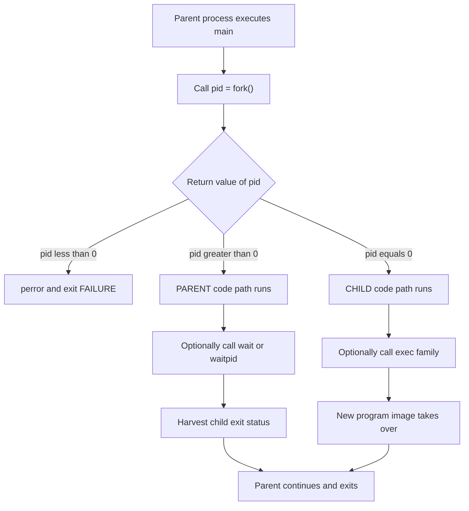
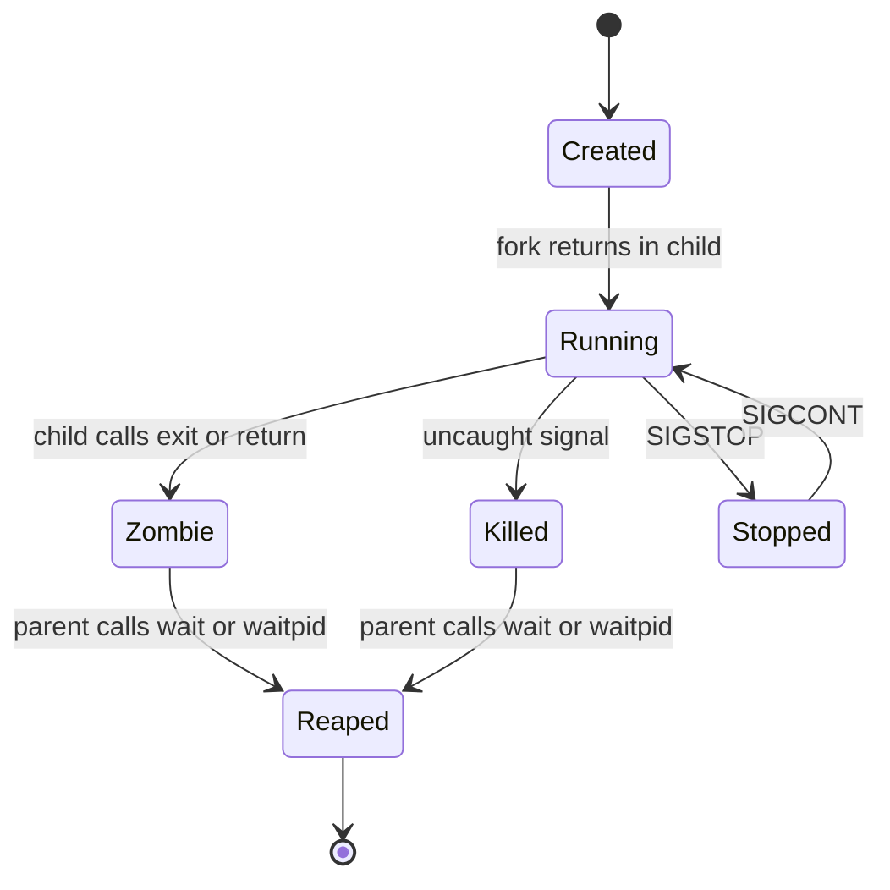
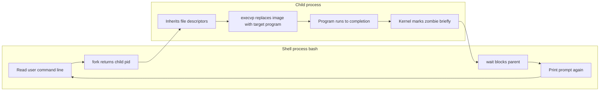
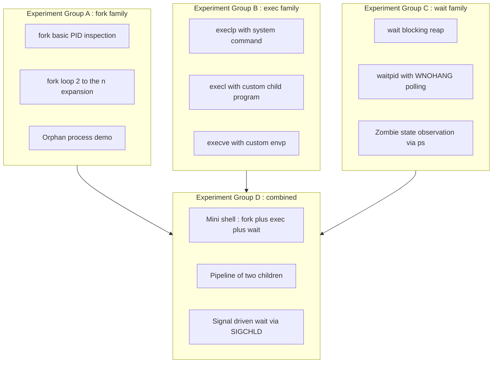
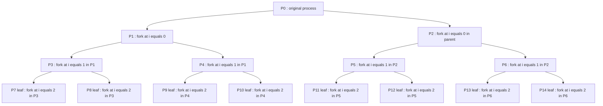

# Process creation and management using fork(), exec(), wait() system calls

<!-- SECTION_1_START -->
# Process Creation and Management using `fork()`, `exec()`, `wait()` System Calls

## 1.1 Formal Definition (KTU 2024 Syllabus Terminology)

In the POSIX / Linux process model, a **process** is the basic unit of execution scheduled by the kernel, represented by a unique **Process Identifier (PID)** and a process control block containing the program counter, registers, address space, open file descriptors, and accounting information.

The three foundational system calls used by the lab experiments to manipulate processes are:

- **`fork()`** — A POSIX system call declared in `<unistd.h>` that creates a near-duplicate child process by duplicating the calling (parent) process. After a successful call, two processes continue execution from the instruction immediately following `fork()`.
- **`exec()`** — A family of system calls (`execl`, `execv`, `execle`, `execve`, `execlp`, `execvp`) declared in `<unistd.h>` that replace the current process image with a new program. The PID remains the same, but the code, data, heap, and stack segments are overwritten.
- **`wait()`** / **`waitpid()`** — Declared in `<sys/wait.h>`, used by a parent process to block until one of its child processes terminates, and to harvest the exit status.

> [!IMPORTANT]
> **KTU 2024 Module 1 Focus (PCCSL407):** The Operating Systems Lab expects students to write, compile (using `gcc`), execute, and demonstrate working C programs that use these calls, observe process hierarchies using the `ps` command, and analyze the results in a record notebook.

## 1.2 Conceptual Analogy / Intuition

Imagine a **photocopy machine in a busy office**:

- The **original document** is your parent process — it has a unique file number (PID), it is being actively read, and it occupies a desk.
- **`fork()` is the photocopy machine**: one press and a *near-perfect* duplicate of the document appears. The original document does not stop; both the original and the copy are now "in circulation." The original (parent) gets a small note saying *"your copy is file number `child_pid`"*, while the copy (child) gets a note saying *"you are the copy, your parent is file number `parent_pid`"*.
- **`exec()` is the office assistant who takes the copied document, throws away its contents, and pastes in a completely new report on it.** The desk and the file number remain the same, but the content is now brand new — perhaps even written in a different language.
- **`wait()` is the manager standing at the door**, refusing to leave for lunch until the employee (child) finishes their work and reports back. The manager collects the final report (exit status) and then proceeds.

> [!NOTE]
> **Why three calls and not one?** `fork()` provides *concurrency* (multiple processes), `exec()` provides *program selection* (run a new binary), and `wait()` provides *synchronization* (parent waits for child). Together they form the building blocks of every Unix shell and process manager.

## 1.3 Standard Constants and Metrics

| Symbol / Constant | Value / Meaning |
|---|---|
| **PID range (Linux default)** | **2 to 32768** (raised to 4194304 on `/proc/sys/kernel/pid_max`) |
| **`fork()` return to child** | **0** |
| **`fork()` return to parent** | **child PID (positive integer)** |
| **`fork()` failure** | **-1** (e.g., `EAGAIN` resource limit, `ENOMEM`) |
| **`wait()` return** | **PID of the terminated child**, or **-1** on error |
| **`WIFEXITED(status)`** | True if child terminated normally via `exit()` / `return` |
| **`WEXITSTATUS(status)`** | Lower 8 bits of the child's exit code (0–255) |
| **Number of processes after $n$ successive `fork()` calls (no `exec`)** | **$2^n$** |
| **Header files** | `<unistd.h>`, `<sys/types.h>`, `<sys/wait.h>`, `<stdio.h>`, `<stdlib.h>` |

> [!VISUALIZATION CONTROL]
> **Concept:** Process tree expansion after three successive `fork()` calls.
> **Tree structure (input as adjacency list):**
> * `P0` -> `P1`, `P2`, `P3` *(P0 calls fork() three times)*
> * `P1` -> `P4`, `P5`
> * `P2` -> `P6`
> **Visual Description:** A binary-tree-like fan-out with **$2^3 = 8$** leaf processes ($P0$ through $P7$) all running the same code segment but with distinct PIDs.

<!-- SECTION_1_END -->

<!-- SECTION_2_START -->
# Deep Theoretical Analysis and KTU High-Yield Reference Sheet

## 2.1 Operational Breakdown of `fork()`

The `fork()` system call performs a **copy-on-write (COW)** clone of the parent address space. Both processes share identical code, data, stack, and heap regions, but the kernel lazily duplicates the physical pages only when either process writes to them.

**Step-by-step execution logic of `fork()`:**

1. The kernel allocates a new task struct and a new PID.
2. The parent’s file descriptor table, signal handlers, and credential information are duplicated (reference-counted, not deeply copied).
3. The address space is set up as a copy-on-write shadow of the parent’s.
4. The child is inserted into the run queue, marked `TASK_RUNNING`.
5. Control returns to **two** processes:
   - In the **child**, `fork()` returns **0**.
   - In the **parent**, `fork()` returns the **child's PID** (> 0).
6. On failure, **no child** is created and `fork()` returns **-1** with `errno` set.

**The "Why" behind the return value split:** Since both processes resume from the same line, they need a way to diverge. The PID split is a convention that lets each process branch on its identity using a simple `if/else`.

```c
pid_t pid = fork();
if (pid < 0) {
    /* error path: no child was created */
} else if (pid == 0) {
    /* child-only code path */
} else {
    /* parent-only code path: pid holds child PID */
}
```

> [!NOTE]
> **KTU Pitfall to Remember:** The order in which the parent and child get scheduled after `fork()` is **non-deterministic**. Do not write programs that assume "parent runs first."

## 2.2 The `exec()` Family Tree

There are **six** variants of `exec()`, differing in how the new program is specified:

| Variant | Path style | Argument style | Environment |
|---|---|---|---|
| `execl`   | explicit path | list (`arg0, arg1, ..., NULL`) | inherited |
| `execv`   | explicit path | vector (`char *argv[]`) | inherited |
| `execlp`  | searches `$PATH` | list | inherited |
| `execvp`  | searches `$PATH` | vector | inherited |
| `execle`  | explicit path | list | explicit envp[] |
| `execve`  | explicit path | vector | explicit envp[] |

**Operational logic of `exec()`:**

1. The current process image (text, data, bss, heap, stack) is destroyed.
2. The new program is loaded from disk into the address space.
3. The PID, parent PID, open file descriptors (unless marked `FD_CLOEXEC`), and working directory are preserved.
4. Execution begins at the new program’s `main()` (technically at the ELF entry point pointed to by `_start`).
5. **On success, `exec()` does not return.** On failure it returns **-1** and `errno` is set (e.g., `ENOENT`).

> [!TIP]
> **The shell trick:** A Unix shell like `bash` uses `fork()` to clone itself and then `execvp()` to replace the clone with the requested program. The parent shell then `wait()`s for the child. This is why typing `ls` spawns a child that *becomes* `ls`.

## 2.3 `wait()` and `waitpid()` — Synchronization Mechanics

`wait()` suspends the calling parent until **any** child terminates. `waitpid()` allows waiting for a **specific** child PID and supports the `WNOHANG` non-blocking option.

**State transitions of a child:**

$$\text{Created} \xrightarrow{\text{fork()}} \text{Running} \xrightarrow{\text{exit()}} \text{Zombie} \xrightarrow{\text{wait() harvests}} \text{Reaped}$$

A **zombie process** (`Z` state in `ps`) is one that has finished execution but whose parent has not yet called `wait()`. The kernel retains the exit status in the child's task struct until the parent reaps it. If the parent dies before reaping, the zombie is adopted by `init` (PID 1), which immediately reaps it.

**Macros for decoding `wait()` status:**

| Macro | Returns true if... |
|---|---|
| `WIFEXITED(status)` | child exited normally via `exit()` / `return` |
| `WEXITSTATUS(status)` | low 8 bits of the exit code |
| `WIFSIGNALED(status)` | child was killed by an uncaught signal |
| `WTERMSIG(status)` | number of the terminating signal |
| `WIFSTOPPED(status)` | child is stopped (used with `WUNTRACED`) |
| `WSTOPSIG(status)` | signal that stopped the child |

## 2.4 Engineering Utility in Production Systems

- **Web servers** (e.g., Apache `prefork` MPM) call `fork()` for each incoming connection, then `exec()` (or simply serve in-process). This isolates clients from one another.
- **Container runtimes** and **process supervisors** use `fork()` + `exec()` to launch managed services with controlled file descriptors and namespaces.
- **Job schedulers** (e.g., `cron`, `systemd`) use `fork()` to detach a child from the parent terminal, `exec()` to start the job, and `wait()` to capture the exit code for logging.
- **Build systems** (e.g., `make`) use `fork()`+`exec()` to run compiler commands in parallel and synchronize via `wait()`.

<!-- SECTION_2_END -->

<!-- SECTION_3_START -->
# Step-by-Step Implementations and Code Walkthroughs

> [!IMPORTANT]
> **Compilation Note (KTU Lab Standard):** Compile every program below with `gcc program.c -o program` and execute with `./program`. For observing process states, run the program in one terminal and `ps -elf | grep program` in another.

## 3.1 Experiment 1 — Basic `fork()` and PID Inspection

**Aim:** Demonstrate that a single `fork()` creates exactly one child, and verify the return-value split.

```c
/* File: fork_basic.c
 * AIM: Create a child process using fork() and display the PIDs.
 * COMPILATION: gcc fork_basic.c -o fork_basic
 */
#include <stdio.h>
#include <stdlib.h>
#include <unistd.h>
#include <sys/types.h>

int main(void) {
    pid_t pid;

    printf("BEFORE fork():  single process running.  PID = %d, PPID = %d\n",
           (int)getpid(), (int)getppid());

    pid = fork();                                 /* <-- the cloning point */

    if (pid < 0) {
        perror("fork failed");
        exit(EXIT_FAILURE);
    } else if (pid == 0) {
        /* ----------------- CHILD CODE PATH ----------------- */
        printf("CHILD  :  PID = %d, PPID = %d, fork() returned %d\n",
               (int)getpid(), (int)getppid(), (int)pid);
        sleep(2);                                 /* stay alive briefly */
        printf("CHILD  :  exiting normally with code 42\n");
        exit(42);
    } else {
        /* ----------------- PARENT CODE PATH ----------------- */
        printf("PARENT :  PID = %d, PPID = %d, fork() returned child PID = %d\n",
               (int)getpid(), (int)getppid(), (int)pid);
    }
    return 0;
}
```

**Sample Output:**

```
BEFORE fork():  single process running.  PID = 5012, PPID = 2401
PARENT :  PID = 5012, PPID = 2401, fork() returned child PID = 5013
CHILD  :  PID = 5013, PPID = 5012, fork() returned 0
CHILD  :  exiting normally with code 42
```

## 3.2 Experiment 2 — Process Hierarchy with Multiple `fork()` Calls

**Aim:** Show that $n$ successive `fork()` calls produce $2^n$ processes.

```c
/* File: fork_n.c
 * AIM: Demonstrate 2^n process creation.
 * COMPILATION: gcc fork_n.c -o fork_n
 */
#include <stdio.h>
#include <unistd.h>
#include <sys/types.h>

int main(void) {
    int i;
    pid_t pid;

    for (i = 0; i < 3; i++) {
        pid = fork();

        if (pid < 0) {
            perror("fork");
            return 1;
        }
        if (pid == 0) {
            /* Only the newly-created child continues the loop.
             * The parent falls through to the final printf below. */
            printf("CHILD created at iteration %d : PID = %d, PPID = %d\n",
                   i, (int)getpid(), (int)getppid());
        } else {
            /* Parent breaks out after each fork so it does NOT
             * keep forking in subsequent iterations. */
            printf("PARENT after iteration %d : PID = %d, child PID = %d\n",
                   i, (int)getpid(), (int)pid);
        }
    }
    sleep(1);                                     /* let children print */
    return 0;
}
```

**Why $2^3 = 8$ processes appear when the loop is *unprotected*:** If you remove the `else` branch, *every* process (including children) will continue iterating and call `fork()` again. After 3 iterations you get a full binary tree: $2^3 = 8$ processes.

**Verifying with `ps` while the program sleeps:**

```bash
ps -elf --forest | grep fork_n
```

## 3.3 Experiment 3 — `fork()` + `exec()` + `wait()` (the Shell Pattern)

**Aim:** Implement the Unix shell’s behavior: the parent forks, the child `exec()`s a new program (`ls -l /tmp`), and the parent `wait()`s for it to finish.

```c
/* File: fork_exec_wait.c
 * AIM: Parent forks; child execs "ls -l /tmp"; parent waits and prints status.
 * COMPILATION: gcc fork_exec_wait.c -o few
 */
#include <stdio.h>
#include <stdlib.h>
#include <unistd.h>
#include <sys/types.h>
#include <sys/wait.h>

int main(void) {
    pid_t pid;
    int   status;

    pid = fork();

    if (pid < 0) {
        perror("fork");
        return EXIT_FAILURE;
    }

    if (pid == 0) {
        /* ----------------- CHILD ----------------- */
        printf("[child %d] about to exec ls -l /tmp\n", (int)getpid());

        /* execlp searches $PATH for "ls", then runs it with the arg list.
         * The first arg is the program name (by convention). The list
         * MUST be terminated by a (char *) NULL cast. */
        execlp("ls", "ls", "-l", "/tmp", (char *)NULL);

        /* If execlp returns, the exec failed. */
        perror("execlp failed");
        exit(127);                                /* 127 = "command not found" */
    }

    /* ----------------- PARENT ----------------- */
    printf("[parent %d] waiting for child %d ...\n", (int)getpid(), (int)pid);

    pid_t ended = wait(&status);                  /* blocks until child exits */

    if (ended == -1) {
        perror("wait");
        return EXIT_FAILURE;
    }

    if (WIFEXITED(status)) {
        printf("[parent] child %d exited normally with code %d\n",
               (int)ended, WEXITSTATUS(status));
    } else if (WIFSIGNALED(status)) {
        printf("[parent] child %d killed by signal %d\n",
               (int)ended, WTERMSIG(status));
    }
    return EXIT_SUCCESS;
}
```

**Step-by-step walkthrough of the data flow:**

1. The parent prints its banner with `getpid()` (e.g., 6001).
2. `fork()` returns the child PID (e.g., 6002) to the parent and 0 to the child.
3. The child enters the `pid == 0` block and calls `execlp("ls", ...)`.
4. The kernel replaces the child's address space with `/usr/bin/ls`. The child PID (6002) is unchanged. `ls` prints a directory listing of `/tmp`.
5. When `ls` finishes, the kernel marks child 6002 as a zombie and delivers `SIGCHLD` to the parent.
6. The parent's `wait(&status)` unblocks, returns 6002, and `WIFEXITED(status)` is true.
7. `WEXITSTATUS(status)` yields the lower 8 bits of `ls`'s exit code (0 on success).

## 3.4 Experiment 4 — Demonstrating a Zombie Process

**Aim:** Create a zombie process and observe it in `ps` before reaping it.

```c
/* File: zombie_demo.c
 * AIM: Produce a zombie and let the student observe it with `ps`.
 * COMPILATION: gcc zombie_demo.c -o zombie_demo
 * USAGE:
 *   Terminal A:  ./zombie_demo
 *   Terminal B:  ps -el | grep zombie_demo
 */
#include <stdio.h>
#include <stdlib.h>
#include <unistd.h>
#include <sys/types.h>

int main(void) {
    pid_t pid = fork();

    if (pid < 0) { perror("fork"); return 1; }

    if (pid == 0) {
        /* Child: finishes immediately. With no wait() in the parent,
         * the kernel keeps the exit status -> ZOMBIE (Z state). */
        printf("[child %d] finishing now\n", (int)getpid());
        exit(0);
    }

    /* Parent: sleeps long enough for the student to run `ps`. */
    printf("[parent %d] child %d is now a zombie. Check 'ps -el'.\n",
           (int)getpid(), (int)pid);
    sleep(30);
    printf("[parent] exiting; init will reap the zombie.\n");
    return 0;
}
```

**Expected `ps` snapshot:**

```
F S UID   PID  PPID  ...  CMD
0 Z 1000  7110  7109  ...  zombie_demo <defunct>
```

The `Z` in column 2 confirms the zombie state. The `<defunct>` label is shown in the command column.

## 3.5 Experiment 5 — Demonstrating an Orphan Process

**Aim:** Make the parent exit before the child so the child is re-parented to `init` (PID 1).

```c
/* File: orphan_demo.c
 * AIM: Parent exits immediately, child keeps running and prints new PPID.
 * COMPILATION: gcc orphan_demo.c -o orphan_demo
 */
#include <stdio.h>
#include <stdlib.h>
#include <unistd.h>
#include <sys/types.h>

int main(void) {
    pid_t pid = fork();

    if (pid < 0) { perror("fork"); return 1; }

    if (pid == 0) {
        /* Child: parent (shell) is about to exit. */
        printf("[child %d] starting; parent = %d\n",
               (int)getpid(), (int)getppid());
        sleep(5);
        /* After 5 seconds, the original parent has almost certainly exited.
         * The kernel reparents us to init (PID 1) or to the systemd user
         * manager (typically a low PID). */
        printf("[child %d] awake; new PPID = %d\n",
               (int)getpid(), (int)getppid());
        return 0;
    }

    /* Parent exits immediately, leaving the child orphaned. */
    printf("[parent %d] exiting and abandoning child %d\n",
           (int)getpid(), (int)pid);
    return 0;
}
```

## 3.6 Experiment 6 — `waitpid()` with `WNOHANG` (Non-blocking Polling)

**Aim:** Poll for child completion without blocking the parent.

```c
/* File: waitpid_nohang.c
 * AIM: Parent polls for child using WNOHANG.
 * COMPILATION: gcc waitpid_nohang.c -o wpnh
 */
#include <stdio.h>
#include <stdlib.h>
#include <unistd.h>
#include <sys/types.h>
#include <sys/wait.h>

int main(void) {
    pid_t pid = fork();
    if (pid < 0) { perror("fork"); return 1; }

    if (pid == 0) {
        printf("[child %d] sleeping 3s then exiting\n", (int)getpid());
        sleep(3);
        exit(7);
    }

    int status;
    pid_t ret;
    int waited_seconds = 0;

    /* Poll every second. If child is still running, ret == 0. */
    do {
        ret = waitpid(pid, &status, WNOHANG);
        if (ret == 0) {
            printf("[parent] child still running at t=%ds ...\n", waited_seconds);
            sleep(1);
            waited_seconds++;
        }
    } while (ret == 0 && waited_seconds < 10);

    if (ret == pid && WIFEXITED(status)) {
        printf("[parent] child %d finished with exit code %d\n",
               (int)ret, WEXITSTATUS(status));
    } else if (ret == -1) {
        perror("waitpid");
    } else {
        printf("[parent] timeout: child still alive\n");
    }
    return 0;
}
```

**Return value semantics of `waitpid()` (critical for exams):**

| `waitpid()` return | Meaning |
|---|---|
| **> 0** | PID of the child that changed state (terminated or stopped) |
| **0** | Only possible with `WNOHANG` — no child has finished yet |
| **-1** | Error (e.g., `ECHILD` — no such child, or `EINVAL`) |

## 3.7 Experiment 7 — `execl()` to Replace Process with a Custom Program

**Aim:** Have a child fork-exec a *user-written* program and pass arguments.

```c
/* File: exec_caller.c
 * AIM: Parent fork+execs a sibling program "child_app" with three args.
 * COMPILATION:
 *   gcc exec_caller.c -o exec_caller
 *   gcc child_app.c   -o child_app
 */
#include <stdio.h>
#include <stdlib.h>
#include <unistd.h>
#include <sys/types.h>
#include <sys/wait.h>

int main(int argc, char *argv[]) {
    if (argc < 2) {
        fprintf(stderr, "Usage: %s <name> <roll> <branch>\n", argv[0]);
        return 1;
    }

    pid_t pid = fork();
    if (pid < 0) { perror("fork"); return 1; }

    if (pid == 0) {
        /* Child: replace ourselves with child_app, forwarding argv[1..3]. */
        execl("./child_app", "child_app",
              argv[1], argv[2], argv[3], (char *)NULL);
        perror("execl");                          /* only runs on failure */
        exit(127);
    }

    int status;
    waitpid(pid, &status, 0);
    printf("[parent] child_app finished with status %d\n", WEXITSTATUS(status));
    return 0;
}
```

```c
/* File: child_app.c
 * AIM: Target program executed by exec_caller.
 * COMPILATION: gcc child_app.c -o child_app
 */
#include <stdio.h>

int main(int argc, char *argv[]) {
    printf("--- child_app started ---\n");
    printf("argc = %d\n", argc);
    for (int i = 0; i < argc; i++) {
        printf("argv[%d] = \"%s\"\n", i, argv[i]);
    }
    printf("--- child_app exiting ---\n");
    return 0;
}
```

**Run:**

```bash
gcc exec_caller.c -o exec_caller
gcc child_app.c   -o child_app
./exec_caller Adithya 42 CSE
```

<!-- SECTION_3_END -->

<!-- SECTION_4_START -->
# Structural Diagrams and Schematics

## 4.1 Mermaid — Flow of `fork()` Decision Logic



## 4.2 Mermaid — State Transition of a Child Process



## 4.3 Mermaid — Unix Shell Pattern (Sequential Topology)



## 4.4 Mermaid — Module 1 Lab Architecture (Block-Level Functional Topology)



## 4.5 Mermaid — Fork Fan-Out Geometry ($2^n$ Visualization)



> [!NOTE]
> **Observation:** After three unprotected iterations of `fork()` the program will produce $2^3 = 8$ child processes, totalling $2^3 = 8$ simultaneous processes including the original.

<!-- SECTION_4_END -->

<!-- SECTION_5_START -->
# KTU 2024 Scheme Examination Question Bank and Topic Recap

> [!NOTE]
> **Mark Distribution (KTU 2024 Scheme — Lab Course PCCSL407):**
> * Continuous Evaluation (Record + Viva + Internal Test): **60 marks**
> * End Semester Evaluation (Practical Exam + Viva): **40 marks**
> * ESE pattern: typically a 2-hour practical with one major program (≈20 marks) + 10 marks viva + 10 marks record.

---

## Part A — Short Answer Questions (3 Marks Each)

### Question 1
> **[KTU University Exam — July 2024, Model Paper]** — *CO1, Remember*
> **Differentiate between `fork()` and `exec()` system calls. In what scenario would you combine them?**

**Model Answer (3 marks):**

`fork()` creates a new child process that is a duplicate of the parent. Both processes continue executing the **same** program from the instruction after `fork()`. The return value distinguishes them (0 in child, child PID in parent).

`exec()` does **not** create a new process. It replaces the current process image (text, data, heap, stack) with a new program loaded from disk. The PID remains unchanged. On success, `exec()` never returns; on failure, it returns -1.

**Combination scenario:** The classic Unix shell pattern. The shell calls `fork()` to clone itself, the child calls `exec()` to become the requested command (e.g., `ls`), and the parent calls `wait()` to synchronize. This separates **process creation** from **program selection**, which is why shells are tiny — they reuse the kernel's loader and the parent's environment. **(3 marks)**

---

### Question 2
> **[KTU University Exam — Dec 2023]** — *CO1, Understand*
> **What is a zombie process? How is it created and how is it eliminated?**

**Model Answer (3 marks):**

A **zombie process** is one that has finished execution (via `exit()` or `return` from `main()`) but whose exit status has not yet been harvested by its parent. The kernel retains a small record (PID, exit code, resource usage) in the process table so the parent can retrieve it later. In `ps`, the state is shown as `Z` and the command is labeled `<defunct>`.

**Creation:** Parent calls `fork()` to create a child, the child finishes, but the parent neither calls `wait()` nor sets `SIGCHLD` to `SIG_IGN`.

**Elimination:** The parent calls `wait()` or `waitpid()`. If the parent dies first, the orphaned zombie is adopted by `init` (PID 1), which immediately reaps it. **(3 marks)**

---

## Part B — Long Answer Questions (14 Marks, Module Internal Choice)

### Question A (14 Marks)

> **[KTU University Exam — July 2024 (Adapted)]** — *CO2, Apply + Analyze*
> **(a)** Write a C program in which the parent process creates a child using `fork()`. The child should execute the command `ls -l /home` using `execlp()`. The parent should wait for the child to finish and print the child's exit status. *(7 marks)*
> **(b)** Modify the program so that the child, instead of calling `ls`, executes a custom program `worker` that accepts two command-line arguments (a string and an integer) and prints them. Show the full code for both programs. *(7 marks)*

**Model Solution:**

**Part (a) — 7 marks**

```c
/* qA_partA.c */
#include <stdio.h>
#include <stdlib.h>
#include <unistd.h>
#include <sys/types.h>
#include <sys/wait.h>

int main(void) {
    pid_t pid = fork();
    if (pid < 0) { perror("fork"); return 1; }

    if (pid == 0) {
        printf("[child %d] execing ls -l /home\n", (int)getpid());
        execlp("ls", "ls", "-l", "/home", (char *)NULL);
        perror("execlp");
        exit(127);
    }

    int status;
    pid_t ret = waitpid(pid, &status, 0);
    if (ret == -1) { perror("waitpid"); return 1; }

    if (WIFEXITED(status))
        printf("[parent] child %d exited with code %d\n",
               (int)ret, WEXITSTATUS(status));
    else if (WIFSIGNALED(status))
        printf("[parent] child %d killed by signal %d\n",
               (int)ret, WTERMSIG(status));
    return 0;
}
```

**Valuation Key for (a):**
* `[Correct fork() invocation and error check: 2 marks]`
* `[Correct use of execlp() with NULL-terminated list: 2 marks]`
* `[Proper waitpid() with status decoding macros: 2 marks]`
* `[Correct output statement and compilation: 1 mark]`

**Part (b) — 7 marks**

```c
/* qA_partB_caller.c */
#include <stdio.h>
#include <stdlib.h>
#include <unistd.h>
#include <sys/types.h>
#include <sys/wait.h>

int main(void) {
    pid_t pid = fork();
    if (pid < 0) { perror("fork"); return 1; }

    if (pid == 0) {
        execl("./worker", "worker", "Adithya", "42", (char *)NULL);
        perror("execl");
        exit(127);
    }

    int status;
    waitpid(pid, &status, 0);
    printf("[parent] worker finished with code %d\n", WEXITSTATUS(status));
    return 0;
}
```

```c
/* worker.c */
#include <stdio.h>
#include <stdlib.h>

int main(int argc, char *argv[]) {
    if (argc != 3) {
        fprintf(stderr, "Usage: worker <name> <number>\n");
        return 1;
    }
    printf("worker received: name = %s, number = %s\n", argv[1], argv[2]);
    int n = atoi(argv[2]);
    printf("number parsed as int = %d, square = %d\n", n, n * n);
    return 0;
}
```

**Valuation Key for (b):**
* `[execl() with path, name, two args, NULL: 2 marks]`
* `[worker.c correctly reads argv[1] and argv[2]: 2 marks]`
* `[atoi() conversion and arithmetic demonstrated: 1 mark]`
* `[Proper error checking and exit codes: 1 mark]`
* `[Correct compilation commands in answer: 1 mark]`

---

### Question B (14 Marks)

> **[KTU University Exam — Dec 2023 (Adapted)]** — *CO2, Apply + Analyze*
> **(a)** Explain the term "orphan process" with a suitable C program. How does the kernel handle such a process? *(7 marks)*
> **(b)** Write a program where the parent creates **two** children, each running a different command (e.g., `date` and `cal`). The parent should wait for both and print their exit statuses. *(7 marks)*

**Model Solution:**

**Part (a) — 7 marks**

An **orphan process** is a child whose parent has terminated before the child. The kernel handles this by re-parenting the orphan to `init` (PID 1) — or, on modern Linux with `systemd`, to the user-mode `systemd` manager (a low PID). The orphan's `PPID` is updated automatically; from the child's point of view, `getppid()` will suddenly return `1` (or a low value).

```c
/* orphan.c */
#include <stdio.h>
#include <stdlib.h>
#include <unistd.h>
#include <sys/types.h>

int main(void) {
    pid_t pid = fork();
    if (pid < 0) { perror("fork"); return 1; }

    if (pid == 0) {
        printf("[child %d] starting, PPID = %d\n",
               (int)getpid(), (int)getppid());
        sleep(5);
        printf("[child %d] after sleep, PPID = %d (should be 1 or low PID)\n",
               (int)getpid(), (int)getppid());
        return 0;
    }

    /* Parent exits immediately. */
    printf("[parent %d] exiting, orphaning child %d\n",
           (int)getpid(), (int)pid);
    return 0;
}
```

**Valuation Key for (a):**
* `[Definition of orphan process: 2 marks]`
* `[Correct fork() and child/parent code split: 2 marks]`
* `[Explanation of re-parenting to init: 2 marks]`
* `[Demonstration of changed PPID via getppid(): 1 mark]`

**Part (b) — 7 marks**

```c
/* two_children.c */
#include <stdio.h>
#include <stdlib.h>
#include <unistd.h>
#include <sys/types.h>
#include <sys/wait.h>

int main(void) {
    pid_t c1 = fork();
    if (c1 < 0) { perror("fork"); return 1; }

    if (c1 == 0) {
        printf("[child1 %d] running 'date'\n", (int)getpid());
        execlp("date", "date", (char *)NULL);
        perror("execlp date");
        exit(127);
    }

    pid_t c2 = fork();
    if (c2 < 0) { perror("fork"); return 1; }

    if (c2 == 0) {
        printf("[child2 %d] running 'cal'\n", (int)getpid());
        execlp("cal", "cal", (char *)NULL);
        perror("execlp cal");
        exit(127);
    }

    /* Parent waits for BOTH children. wait() is called twice. */
    int status;
    pid_t done;

    done = waitpid(c1, &status, 0);
    printf("[parent] %d finished with code %d\n",
           (int)done, WIFEXITED(status) ? WEXITSTATUS(status) : -1);

    done = waitpid(c2, &status, 0);
    printf("[parent] %d finished with code %d\n",
           (int)done, WIFEXITED(status) ? WEXITSTATUS(status) : -1);

    return 0;
}
```

**Valuation Key for (b):**
* `[Two separate fork() calls with independent error handling: 2 marks]`
* `[Correct use of execlp for date and cal: 2 marks]`
* `[Parent calls waitpid twice (once per known PID): 2 marks]`
* `[Proper status decoding and clean output: 1 mark]`

---

> [!WARNING]
> **KTU Examiner's Valuation Warning / Pitfall Callout**
> 1. **Do not forget the `(char *)NULL` terminator** in `execl`, `execlp`, or `execle` argument lists. This is the most common 1-mark loss in the lab exam. Without it, the kernel reads past the array into garbage and the exec fails with `EFAULT` or `E2BIG`.
> 2. **Do not check `pid == 0` as a boolean truthy value.** `pid == 0` is the *child* branch. Writing `if (pid)` treats the child as the parent and silently breaks the program.
> 3. **Do not assume the parent runs before the child.** If your program logic depends on order, you must use `wait()` or an explicit synchronization primitive (pipe, semaphore).
> 4. **Do not omit the `errno` check after `fork()` failure.** A bare `fork()` without `if (pid < 0)` loses 1 mark and risks undefined behavior in resource-exhaustion tests.
> 5. **Do not forget to include `<sys/wait.h>` and `<sys/types.h>`** in addition to `<unistd.h>`. Missing headers cause compilation errors that examiners treat as incomplete programs.

---

## Topic Recap & Important Things to Remember

- A **process** is an instance of a running program, identified by a unique **PID**. The parent PID is stored as **PPID** retrievable via `getppid()`.
- **`fork()`** creates a near-duplicate child. It returns **0 in the child**, the **child's PID in the parent**, and **-1 on failure**. Headers required: `<unistd.h>`, `<sys/types.h>`.
- **`exec()` family** replaces the current process image with a new program. There are **six variants** differing in path search, argument passing style, and environment handling. **On success, `exec()` never returns.**
- The **shell pattern** is: parent `fork()`s, child `exec()`s the target program, parent `wait()`s for completion.
- **`wait(&status)`** blocks until any child terminates and stores the exit info in `status`. **`waitpid(pid, &status, options)`** allows waiting on a specific child and supports `WNOHANG`.
- Use **`WIFEXITED`** and **`WEXITSTATUS`** to decode normal exits; use **`WIFSIGNALED`** and **`WTERMSIG`** to decode signal-killed children.
- A **zombie** (`Z` state) is a terminated child whose exit status is unreaped. A **zombie is eliminated** by `wait()` in the parent or by re-parenting to `init` when the parent dies.
- An **orphan** is a running child whose parent has exited. The kernel reparents it to **PID 1 (init)**. The child's `PPID` becomes `1`.
- After **$n$ successive unprotected `fork()` calls**, the number of processes is **$2^n$**. This is a frequently asked viva question.
- **`exec()` preserves the PID** but destroys the address space, file descriptor table (except those with `FD_CLOEXEC`), and signal handlers (except those registered with `SA_RESETHAND` semantics depending on variant).
- The default **PID range** in Linux is **2 to 32768**, but is configurable up to **4194304** via `/proc/sys/kernel/pid_max`.
- Always **check the return value of `fork()` and `wait()`** and call `perror()` or set `errno` for diagnostics. This is worth 1–2 marks in every KTU lab program.
- Compilation command (memorize): `gcc filename.c -o outputname`. Execution: `./outputname`. Observation: `ps -elf | grep outputname`.
- The argument list passed to `execl`, `execlp`, or `execle` must always be terminated by a `(char *)NULL` cast — this is the single most-failed item in KTU lab exams.

<!-- SECTION_5_END -->
