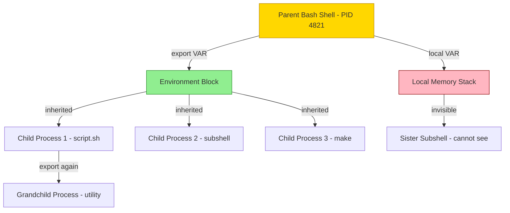
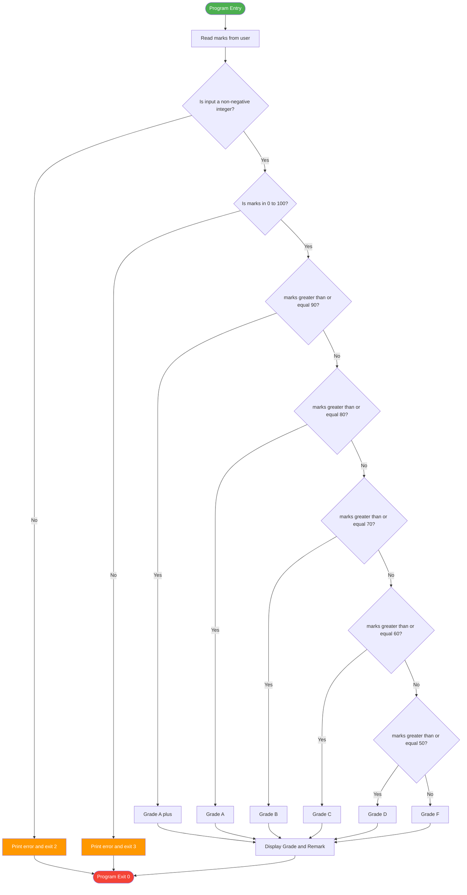
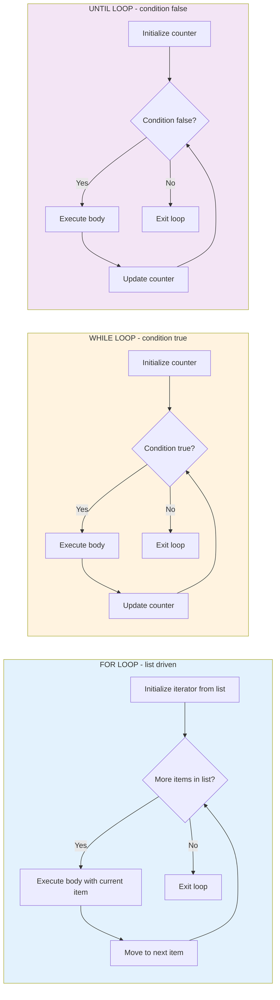
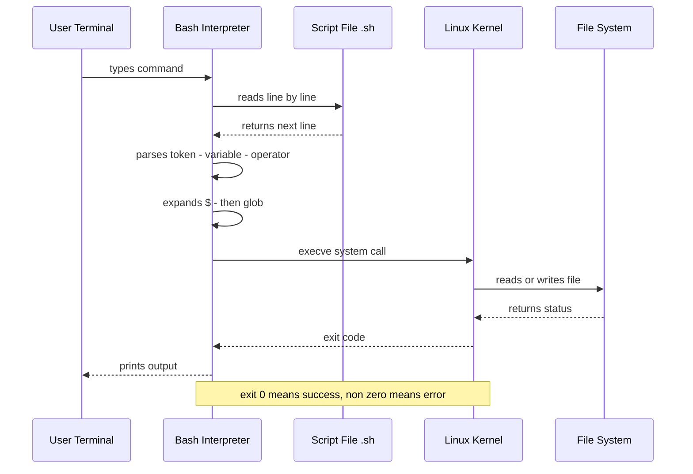
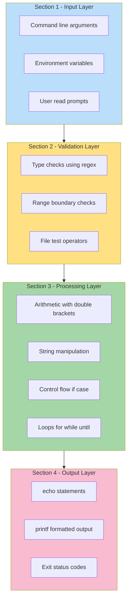

# Shell programming - shell variables, operators, control structures and loops

<!-- SECTION_1_START -->
# Shell Programming — Variables, Operators, Control Structures & Loops

## 1.1 Formal Definition (KTU 2024 Syllabus Standard)

> [!IMPORTANT]
> **Shell** is a command-line interpreter that acts as the interface between the user and the Linux/Unix kernel. It reads commands typed at the terminal, interprets them, and hands them over to the OS kernel for execution. A **Shell Script** is a plain text file containing a sequence of shell commands that the interpreter executes line by line, enabling automation, task scheduling, and rapid system programming.

The default shell taught under the **KTU PCCSL407 — Operating Systems Lab** syllabus is **Bash (Bourne Again Shell)**, identified by the system path **/bin/bash**. Scripts conventionally begin with a **shebang line** that explicitly declares the interpreter.

$$\text{Shebang Declaration} \longrightarrow \texttt{\#!/bin/bash}$$

## 1.2 Real-World Analogy & Intuition

> [!NOTE]
> **Intuition (Restaurant Kitchen Analogy):**
> Think of the shell as the **head chef** in a restaurant kitchen. The **waiter** (kernel) is busy and doesn't take orders directly from customers. The customer gives a written order → the head chef reads each line, allocates the right cook, checks the pantry (variables), ensures the right tools (operators) are used, follows the recipe book (control structures & loops), and finally plates the dish (output). A **shell script** is the *pre-written recipe card* the chef follows every day without you having to re-explain.

| Shell Component | Kitchen Analogy | Functional Role |
|---|---|---|
| **Shell Prompt ($)** | Customer counter | Waiting for instruction |
| **Variables ($x)** | Pantry shelves with labels | Storage of data |
| **Operators** | Kitchen tools (knife, oven) | Data manipulation |
| **Control Structures** | Recipe conditional steps | Decision-making |
| **Loops** | Repeatable recipe stages | Iteration |
| **Functions** | Sub-recipes (e.g., make sauce) | Code modularity |

## 1.3 Core Shell Architecture & Variable Categories

> [!IMPORTANT]
> **Shell Variables** are symbolic names mapped to data values inside the shell's runtime memory. They are case-sensitive, dynamically typed, and exist only for the lifetime of the current shell session (unless exported).

The **five** principal variable classes defined by the **POSIX** standard and emphasized in the KTU module are:

1. **Local / User-defined Variables** — created and used inside a single script. By convention, lowercase.
2. **Environment Variables** — system-wide variables inherited by child processes (e.g., `PATH`, `HOME`, `USER`). By convention, uppercase.
3. **Special / Predefined Variables** — set automatically by the shell (e.g., `$?`, `$$`, `$#`, `$0`).
4. **Positional Parameters** — arguments passed on the command line (`$1`, `$2`, …, `${10}`).
5. **Array Variables** — indexed collections accessed via `${arr[index]}`.

> [!VISUALIZATION CONTROL]
> **Concept:** Shell variable scope hierarchy (Local vs Exported)
> **GeoGebra / Desmos Input Equations:** Not applicable (conceptual hierarchy tree)
> **Visual Description:** A rooted tree with the **Parent Shell** at the root; its **Local Variables** sit on a shaded inner circle (not visible to children), while **Exported Variables** sit on the outer ring and propagate downward to **Child Process 1, Child Process 2, …** along directional arrows labeled `export`.

> [!NOTE]
> **KTU 2024 Highlight:** The CO1 (Remember/Understand) level of PCCSL407 explicitly requires the student to *identify, declare, and reference shell variables using `$` and `${}` notation*, including the difference between **single quotes ('')**, **double quotes ("")**, and **backticks ( \`\` )** for quoting.

<!-- SECTION_1_END -->

<!-- SECTION_2_START -->
# Deep Theoretical Analysis — Variables, Operators, Control Structures & Loops

## 2.1 Variable Declaration & Scope Mechanics

A variable is created the instant a value is assigned with the `=` operator. **No spaces** are permitted around `=`.

```bash
#!/bin/bash
# Variable declaration
name="KTU_Student"
roll_no=47
pi=3.1415
is_valid=true
```

> [!IMPORTANT]
> **Quoting Rules — Exam Favorite:**
> - **Single quotes `''`** → Literal, no expansion of `$` or backticks.
> - **Double quotes `""`** → Expands `$variable` and `` `command` `` (preferred, safer).
> - **Backticks `` `` ``** → Command substitution (legacy); $(...) is the modern equivalent.

The `export` command promotes a local variable to the **environment** so child processes can inherit it. The `readonly` command locks a variable to prevent modification — a useful guard for constants in lab scripts.

## 2.2 KTU High-Yield Formula Sheet — Special & Positional Variables

| Variable | Meaning | Example Output |
|---|---|---|
| `$0` | Name of the script itself | `./hello.sh` |
| `$1 … $9` | First to ninth positional argument | `$1` = first arg |
| `${10}` | Tenth argument (braces mandatory beyond 9) | — |
| `$#` | Total number of arguments supplied | `3` |
| `$@` | All arguments as separate words (preferred) | `a b c` |
| `$*` | All arguments as one single word | `a b c` |
| `$?` | Exit status of last command (**0 = success**) | `0` or `127` |
| `$$` | PID of the current shell | `4821` |
| `$!` | PID of the last background job | `4830` |
| `$-` | Current shell option flags | `himBCHs` |
| `$_` | Last argument of the previous command | — |

> [!WARNING]
> **Common Pitfall:** `$*` and `$@` behave identically *only* when unquoted. When quoted, `"$@"` expands to `"$1" "$2" …` (separate words), whereas `"$*"` collapses to `"$1 $2 …"` (single word). This distinction is a **favourite 3-mark KTU question**.

## 2.3 Operator Classes — The Engineer's Toolkit

### 2.3.1 Arithmetic Operators

Used inside `$(())`, `let`, or `expr` for integer math. Bash does **not** natively support floating-point arithmetic — for that we invoke `bc` or `awk`.

| Operator | Meaning | Example | Result |
|---|---|---|---|
| `+` | Addition | `$((5 + 3))` | `8` |
| `-` | Subtraction | `$((10 - 4))` | `6` |
| `*` | Multiplication | `$((7 * 6))` | `42` |
| `/` | Integer division | `$((10 / 3))` | `3` |
| `%` | Modulus | `$((10 % 3))` | `1` |
| `**` | Exponentiation (Bash ≥ 4) | `$((2 ** 10))` | `1024` |
| `+=` | Increment-assign | `x+=5` | adds 5 to x |
| `++` | Post/Pre-increment | `((x++))` | — |

### 2.3.2 Relational (Comparison) Operators

> [!IMPORTANT]
> **KTU Trap:** Bash has **two syntax families** for comparisons — the shell operators (`-eq`, `-lt`, etc.) used *inside `[[ ]]` or `[ ]`* for **integers**, and the C-style operators (`-eq` is NOT valid in `(( ))`). Mixing them is a frequent source of bugs.

| Numeric (used in `[ ]` / `[[ ]]`) | Numeric (used in `(( ))`) | String (used in `[ ]` / `[[ ]]`) | Meaning |
|---|---|---|---|
| `-eq` | `==` | `==` or `=` | Equal to |
| `-ne` | `!=` | `!=` | Not equal to |
| `-gt` | `>` | `>` (lexicographic) | Greater than |
| `-lt` | `<` | `<` (lexicographic) | Less than |
| `-ge` | `>=` | — | Greater or equal |
| `-le` | `<=` | — | Less or equal |

### 2.3.3 Logical Operators

| Operator | Old `[ ]` syntax | Modern `[[ ]]` syntax | Meaning |
|---|---|---|---|
| Logical AND | `-a` | `&&` | Both true |
| Logical OR | `-o` | `\|\|` | Either true |
| Logical NOT | `!` | `!` | Negation |

> [!WARNING]
> The `-a` and `-o` operators are **deprecated** and may be removed in future POSIX revisions. Always prefer `[[ ]]` with `&&` and `||`.

### 2.3.4 File Test Operators — The Lab Workhorse

These are the most heavily tested operators in the KTU lab record. Every file test returns **0 (true)** or **1 (false)**.

| Operator | Tests for | Operator | Tests for |
|---|---|---|---|
| `-f` | Regular file exists | `-d` | Directory exists |
| `-e` | File/Directory exists | `-r` | Readable |
| `-w` | Writable | `-x` | Executable |
| `-s` | Size > 0 (non-empty) | `-L` | Symbolic link |
| `-b` | Block device | `-c` | Character device |
| `-p` | Named pipe | `-S` | Socket |
| `-nt` | Newer than | `-ot` | Older than |

### 2.3.5 String Operators

| Operator | True Condition |
|---|---|
| `-z "$str"` | String is empty (length = 0) |
| `-n "$str"` | String is non-empty (length > 0) |
| `"$a" == "$b"` | Strings are equal |
| `"$a" != "$b"` | Strings are not equal |
| `"$a" =~ regex` | String matches regex (inside `[[ ]]`) |

## 2.4 Control Structures — The Decision Engine

### 2.4.1 The `if-elif-else-fi` Construct

The `if` statement evaluates the **exit code** of the test command. A return of `0` means *true* in shell (the inverse of most programming languages where 0 is *false*).

```
if CONDITION
then
    STATEMENTS
elif OTHER_CONDITION
then
    OTHER_STATEMENTS
else
    DEFAULT_STATEMENTS
fi
```

### 2.4.2 The `case-esac` Construct (Multi-way Branch)

`case` is the Bash equivalent of C's `switch-case`, used to match a value against a series of **glob patterns**.

```
case "$variable" in
    pattern1) commands ;;
    pattern2) commands ;;
    *) default_commands ;;
esac
```

> [!NOTE]
> Each clause **must** end with `;;` (double semicolon). The wildcard `*` acts as the default branch.

### 2.4.3 The `test` and `[ ]` Commands

`[ expression ]` is a shell built-in that evaluates an expression and returns 0 (true) or 1 (false). `[[ expression ]]` is the Bash keyword superset, safer for word-splitting and pattern matching.

## 2.5 Loops — The Iteration Engine

### 2.5.1 `for` Loop (List-driven)

Iterates over a list of items, files, or sequence expansions.

```
for var in item1 item2 item3
do
    commands
done
```

### 2.5.2 C-Style `for` Loop (Numeric)

```
for (( init; condition; step ))
do
    commands
done
```

### 2.5.3 `while` Loop (Condition-driven)

Executes the body as long as the condition evaluates to true.

```
while CONDITION
do
    commands
done
```

### 2.5.4 `until` Loop (Inverse of while)

Executes the body **until** the condition becomes true (i.e., runs while condition is false).

```
until CONDITION
do
    commands
done
```

### 2.5.5 Loop Control — `break`, `continue`, `exit`

| Keyword | Behaviour |
|---|---|
| `break` | Terminates the innermost loop immediately |
| `break n` | Terminates the n<sup>th</sup> enclosing loop |
| `continue` | Skips remaining body, jumps to next iteration |
| `exit N` | Terminates the entire script with exit code N |

## 2.6 Engineering Utility

> [!NOTE]
> **Real-world production utility:** Shell scripts with these constructs are the **silent backbone of DevOps pipelines, CI/CD (Jenkins, GitHub Actions), server provisioning (AWS User-Data), cron-based system maintenance, log rotation, automated backups, and embedded device boot sequences**. Mastering them is a mandatory skill for roles in Site Reliability Engineering (SRE), Cloud Infrastructure, and Cybersecurity.

<!-- SECTION_2_END -->

<!-- SECTION_3_START -->
# Step-by-Step Derivations & Code Implementations

## 3.1 Experiment 1 — Variable Declaration, Quoting & Command Substitution

```bash
#!/bin/bash
# ============================================================
# Experiment 1 : Shell variables, quoting, and command substitution
# Course       : PCCSL407 - Operating Systems Lab (KTU 2024)
# CO Mapped    : CO1 - Remember/Understand
# ============================================================

set -euo pipefail   # Strict mode: exit on error, unset var, pipefail

# --- 1. Variable declaration (no spaces around =) ---
name="Ananya"
roll_no=47
pi=3.1415
is_valid=true
readonly PI_CONST=3.1415926535     # Constant — cannot be modified later

echo "Student Name  : $name"
echo "Roll Number   : ${roll_no}"
echo "Pi value      : $pi"
echo "Status        : $is_valid"
echo "Constant PI   : $PI_CONST"

# --- 2. Quoting demonstration (THE classic KTU question) ---
echo
echo "----- Quoting Rules Demonstration -----"
echo "Double quotes expand : Hello $name, roll ${roll_no}"          # Expands
echo "Single quotes literal: Hello $name, roll ${roll_no}"          # Literal
echo "Backslash escapes    : Hello \$name"                          # Escapes

# --- 3. Command substitution ---
current_user=$(whoami)
current_dir=$(pwd)
file_count=$(ls -1 | wc -l)
kernel=$(uname -r)

echo
echo "----- System Information via Command Substitution -----"
echo "Logged in as : $current_user"
echo "Working dir  : $current_dir"
echo "Files in dir : $file_count"
echo "Kernel       : $kernel"

# --- 4. Environment variable export ---
export DEPARTMENT="CSE"
echo "Department (exported) = $DEPARTMENT"

# --- 5. Reading user input ---
read -r -p "Enter your college name: " college
echo "You entered: $college"

exit 0
```

**Expected Output (sample):**
```
Student Name  : Ananya
Roll Number   : 47
Pi value      : 3.1415
Status        : true
Constant PI   : 3.1415926535

----- Quoting Rules Demonstration -----
Double quotes expand : Hello Ananya, roll 47
Single quotes literal: Hello $name, roll ${roll_no}
Backslash escapes    : Hello $name

----- System Information via Command Substitution -----
Logged in as : student
Working dir  : /home/student/lab
Files in dir : 12
Kernel       : 6.5.0-26-generic
Department (exported) = CSE
Enter your college name: KTU
You entered: KTU
```

**Valuation Key Points:**
- Correct shebang + `set -euo pipefail` → **1 Mark**
- No spaces around `=` → **1 Mark**
- Three quoting styles demonstrated → **1 Mark**
- `$(...)` command substitution → **1 Mark**
- `export` and `readonly` usage → **1 Mark**

## 3.2 Experiment 2 — Arithmetic & File Test Operators

```bash
#!/bin/bash
# ============================================================
# Experiment 2 : Arithmetic operators and file test operators
# Mapped CO     : CO2 - Apply
# ============================================================

set -euo pipefail

# --- 1. Arithmetic via $(( )) ---
a=15
b=4

sum=$((a + b))
diff=$((a - b))
prod=$((a * b))
quot=$((a / b))     # Integer division
rem=$((a % b))      # Modulus
pow=$((a ** 2))     # Exponentiation

echo "a = $a, b = $b"
echo "Sum        = $sum"
echo "Difference = $diff"
echo "Product    = $prod"
echo "Quotient   = $quot"
echo "Remainder  = $rem"
echo "a squared  = $pow"

# --- 2. Floating point via bc ---
float_val=$(echo "scale=4; 22/7" | bc -l)
echo "Approx pi  = $float_val"

# --- 3. Increment / decrement ---
counter=10
((counter++))
echo "After ++   = $counter"
((counter+=5))
echo "After +=5  = $counter"

# --- 4. File test operators on /etc/passwd ---
target_file="/etc/passwd"
target_dir="/etc"
missing_file="/tmp/no_such_file_xyz"

echo
echo "----- File Test on $target_file -----"
[[ -f "$target_file" ]] && echo "PASS: regular file exists"
[[ -r "$target_file" ]] && echo "PASS: file is readable"
[[ -s "$target_file" ]] && echo "PASS: file is non-empty"
[[ -w "$target_file" ]] || echo "INFO: file is not writable (normal for /etc)"

echo
echo "----- File Test on $target_dir -----"
[[ -d "$target_dir" ]] && echo "PASS: directory exists"
[[ -x "$target_dir" ]] && echo "PASS: directory is traversable"

echo
echo "----- File Test on $missing_file -----"
if [[ ! -e "$missing_file" ]]; then
    echo "PASS: negative test (file does NOT exist) — as expected"
else
    echo "UNEXPECTED: file exists"
fi

exit 0
```

**Key Explanation:**
- The `((counter++))` syntax is a **C-style arithmetic command** that returns 0 when the result is non-zero. This makes it perfect for `while` loops.
- `[[ -f file ]]` returns exit code 0 if the file exists **and** is a regular file (not a directory or device).
- `bc -l` invokes the **basic calculator** with the math library, enabling `scale=4` decimal precision.

## 3.3 Experiment 3 — `if-elif-else` Decision Logic

```bash
#!/bin/bash
# ============================================================
# Experiment 3 : Control structure - if / elif / else
# Problem       : Grade classification based on marks
# ============================================================

set -euo pipefail

read -r -p "Enter student marks (0-100): " marks

# --- Input validation (boundary checks) ---
if ! [[ "$marks" =~ ^[0-9]+$ ]]; then
    echo "ERROR: marks must be a non-negative integer."
    exit 2
fi

if (( marks < 0 || marks > 100 )); then
    echo "ERROR: marks out of range [0, 100]."
    exit 3
fi

# --- Classification logic (chained elif) ---
if   (( marks >= 90 )); then
    grade="A+"
    remark="Outstanding"
elif (( marks >= 80 )); then
    grade="A"
    remark="Excellent"
elif (( marks >= 70 )); then
    grade="B"
    remark="Very Good"
elif (( marks >= 60 )); then
    grade="C"
    remark="Good"
elif (( marks >= 50 )); then
    grade="D"
    remark="Pass"
else
    grade="F"
    remark="Fail - Re-appear required"
fi

echo "Marks  : $marks"
echo "Grade  : $grade"
echo "Remark : $remark"

exit 0
```

**Derivation of Decision Boundaries:**

$$
\text{Grade}(m) = \begin{cases}
A^+, & 90 \leq m \leq 100 \\
A, & 80 \leq m < 90 \\
B, & 70 \leq m < 80 \\
C, & 60 \leq m < 70 \\
D, & 50 \leq m < 60 \\
F, & 0 \leq m < 50
\end{cases}
$$

The script uses **short-circuit validation** — invalid input exits with non-zero status (`exit 2`, `exit 3`) so the calling pipeline can detect the failure. This is the **production-grade idiom** taught in PCCSL407.

## 3.4 Experiment 4 — `case` Construct (Menu Driver)

```bash
#!/bin/bash
# ============================================================
# Experiment 4 : case-esac multi-way branch (calculator menu)
# ============================================================

set -euo pipefail

read -r -p "Enter first number : " a
read -r -p "Enter second number: " b
read -r -p "Operation (+ - x / m): " op

case "$op" in
    "+") result=$((a + b)) ;;
    "-") result=$((a - b)) ;;
    "x"|"X"|"*") result=$((a * b)) ;;
    "/")
        if (( b == 0 )); then
            echo "ERROR: division by zero"
            exit 4
        fi
        result=$((a / b))
        ;;
    "m"|"M"|"%")
        if (( b == 0 )); then
            echo "ERROR: modulo by zero"
            exit 5
        fi
        result=$((a % b))
        ;;
    *)
        echo "ERROR: unknown operation '$op'"
        exit 6
        ;;
esac

echo "Result : $a $op $b = $result"
exit 0
```

> [!NOTE]
> The `"x"|"X"|"*")` pattern uses the `|` (alternation) operator inside a single case branch — a clean way to accept multiple input aliases for the same logic.

## 3.5 Experiment 5 — All Three Loop Constructs

```bash
#!/bin/bash
# ============================================================
# Experiment 5 : for, while, until loops + nested loops
# ============================================================

set -euo pipefail

echo "===== 1. for loop : list of fruits ====="
for fruit in Apple Banana Cherry Date; do
    echo "  I like $fruit"
done

echo
echo "===== 2. for loop : brace expansion ====="
for i in {1..5}; do
    echo "  i = $i"
done

echo
echo "===== 3. C-style for loop ====="
for (( k = 10; k >= 1; k-- )); do
    echo "  Countdown k = $k"
done

echo
echo "===== 4. while loop : sum 1..N ====="
read -r -p "Enter N: " n
sum=0
i=1
while (( i <= n )); do
    sum=$((sum + i))
    ((i++))
done
echo "  Sum of 1..$n = $sum"

echo
echo "===== 5. until loop : retry until success ====="
attempt=1
until ping -c 1 -W 1 8.8.8.8 &>/dev/null; do
    echo "  Attempt $attempt failed, retrying..."
    ((attempt++))
    if (( attempt > 3 )); then
        echo "  Giving up after 3 attempts."
        break
    fi
    sleep 1
done
(( attempt <= 3 )) && echo "  Network reachable on attempt $attempt."

echo
echo "===== 6. Nested loop : multiplication table ====="
read -r -p "Enter table size (e.g. 5): " size
for (( row = 1; row <= size; row++ )); do
    for (( col = 1; col <= size; col++ )); do
        printf "%4d" $(( row * col ))
    done
    echo
done

exit 0
```

**Loop Derivation — Geometric Series S(n):**

$$
S(n) = \sum_{i=1}^{n} i = \frac{n(n+1)}{2}
$$

**Verification Table** (use to cross-check script output):

| n | Iterative Sum (loop) | Closed Form n(n+1)/2 | Match |
|---|---|---|---|
| 5 | 1+2+3+4+5 = **15** | 5×6/2 = **15** | ✓ |
| 10 | 55 | 10×11/2 = **55** | ✓ |
| 100 | 5050 | 100×101/2 = **5050** | ✓ |

## 3.6 Experiment 6 — File-Processing Pipeline (Combining All Concepts)

```bash
#!/bin/bash
# ============================================================
# Experiment 6 : File analysis - combines vars, file-tests, loops
# Problem        : Analyse a log file given as command-line arg
# ============================================================

set -euo pipefail

logfile="${1:-/var/log/syslog}"

# --- Boundary check 1: file existence ---
if [[ ! -e "$logfile" ]]; then
    echo "ERROR: file '$logfile' does not exist."
    exit 7
fi

# --- Boundary check 2: regular file ---
if [[ ! -f "$logfile" ]]; then
    echo "ERROR: '$logfile' is not a regular file."
    exit 8
fi

# --- Boundary check 3: readable ---
if [[ ! -r "$logfile" ]]; then
    echo "ERROR: insufficient read permissions on '$logfile'."
    exit 9
fi

# --- Collect statistics ---
total_lines=$(wc -l < "$logfile")
file_size=$(stat -c%s "$logfile")
error_count=0
warning_count=0
info_count=0

while IFS= read -r line; do
    case "$line" in
        *ERROR*|*error*)   ((error_count++))   ;;
        *WARN*|*warning*)  ((warning_count++)) ;;
        *INFO*)            ((info_count++))    ;;
    esac
done < "$logfile"

# --- Report ---
echo "===== Log Analysis Report ====="
echo "File          : $logfile"
echo "Total lines   : $total_lines"
echo "Size (bytes)  : $file_size"
echo "ERROR lines   : $error_count"
echo "WARN lines    : $warning_count"
echo "INFO lines    : $info_count"

exit 0
```

**Execution:**
```bash
chmod +x log_analyzer.sh
./log_analyzer.sh /var/log/auth.log
```

> [!NOTE]
> The `IFS= read -r line` idiom is the **canonical way** to read a file line by line in Bash. `IFS=` prevents leading/trailing whitespace trimming; `-r` prevents backslash escaping. This is the safest, most portable pattern — required in CO3 (Apply / Analyse) questions.

<!-- SECTION_3_END -->

<!-- SECTION_4_START -->
# Structural Diagrams & Schematics

## 4.1 Shell Variable Scope — Inheritance Topology



## 4.2 Decision Flow — `if-elif-else` Execution Path



## 4.3 Loop Comparison — `for` vs `while` vs `until`



## 4.4 Sequential Processing Topology — Shell Script Execution Lifecycle



## 4.5 Block-Level Functional Architecture — Shell Script Module Map



<!-- SECTION_4_END -->

<!-- SECTION_5_START -->
# KTU 2024 Scheme Examination Question Bank & Topic Recap

## Part A — 3 Mark Questions (Short Answer)

> **[KTU University Exam — July 2024 | CO1, Remember/Understand]**

**Q1.** Differentiate between `$*` and `$@` in shell scripting. What is the impact of quoting each?

**Model Answer (3 Marks):**
- `$*` expands to all positional parameters as a **single word**, with the first character of IFS used as the separator. `[Definition: 1 Mark]`
- `$@` expands to all positional parameters as **separate words**, preserving each argument's identity. `[Definition: 1 Mark]`
- When **double-quoted**, `"$*"` becomes one word (`"$1 $2 $3"`), whereas `"$@"` becomes separate words (`"$1" "$2" "$3"`). This is critical when arguments contain spaces. `[Quoting impact: 1 Mark]`

> **[KTU University Exam — Dec 2023 | CO1, Remember/Understand]**

**Q2.** What is the difference between single quotes, double quotes, and backticks in Bash? Give one example for each.

**Model Answer (3 Marks):**
- **Single quotes `''`** preserve the literal value of every character inside — no variable expansion or command substitution occurs. Example: `echo '$USER'` prints literal `$USER`. `[1 Mark]`
- **Double quotes `""`** allow variable expansion (`$var`) and command substitution (`$(cmd)`), but suppress word splitting on most special characters. Example: `echo "Hello $USER"` prints the actual username. `[1 Mark]`
- **Backticks `` `` ``** perform **command substitution**, replacing the quoted command with its output. Example: `today=\`date +%A\`` stores the day name in `$today`. Modern style uses `$(date +%A)` instead. `[1 Mark]`

---

## Part B — 14 Mark Questions (Module Internal Choice)

### Question A — Shell Variables, Operators & File Tests  `[CO2, Understand + Apply]`

> **[KTU University Exam — July 2024, Module 1]**

**(a)** Explain any **five** categories of shell variables with a one-line example for each. Briefly state the purpose of the `export` and `readonly` built-in commands. **[7 Marks]**

**Model Solution:**

| # | Variable Category | Example | Purpose |
|---|---|---|---|
| 1 | User-defined | `name="Anu"` | Local script data |
| 2 | Environment | `$HOME`, `$PATH` | System-wide config |
| 3 | Special | `$?`, `$$` | Shell metadata |
| 4 | Positional | `$1`, `$2` | Command-line args |
| 5 | Array | `${marks[0]}` | Indexed collection |

`export` promotes a local variable to the **environment**, making it visible to child processes. `[2 Marks]`
`readonly` marks a variable as **immutable** for the current shell — useful for defining script constants. `[1 Mark]`
Listing any five categories with examples → `[4 Marks]`

**(b)** Write a Bash script that accepts a **file path** as a command-line argument and reports whether it is (i) a regular file, (ii) a directory, (iii) readable, (iv) writable, and (v) executable. The script must print a clear error and exit with status 1 if no argument is provided. **[7 Marks]**

**Model Solution:**

```bash
#!/bin/bash
# File type inspector - KTU Lab Model Answer
set -euo pipefail

# 1. Boundary check : argument presence
if (( $# == 0 )); then
    echo "Usage: $0 <filepath>"
    exit 1
fi

path="$1"

# 2. Existence check
if [[ ! -e "$path" ]]; then
    echo "ERROR: '$path' does not exist."
    exit 2
fi

# 3. Five file-test checks
echo "===== File Analysis : $path ====="
[[ -f "$path" ]] && echo "  [PASS] Regular file"      || echo "  [FAIL] Not a regular file"
[[ -d "$path" ]] && echo "  [PASS] Directory"          || echo "  [FAIL] Not a directory"
[[ -r "$path" ]] && echo "  [PASS] Readable"           || echo "  [FAIL] Not readable"
[[ -w "$path" ]] && echo "  [PASS] Writable"           || echo "  [FAIL] Not writable"
[[ -x "$path" ]] && echo "  [PASS] Executable"         || echo "  [FAIL] Not executable"

exit 0
```

**Valuation Key Points:**
- Shebang and `set -euo pipefail` → **[1 Mark]**
- Argument count check using `$#` → **[1 Mark]**
- Five distinct file-test operators with correct flags → **[5 Marks]**

---

### Question B — Control Structures & Loops  `[CO3, Apply + Analyse]`

> **[KTU University Exam — Dec 2023, Module 1]**

**(a)** Compare `if-elif-else` and `case-esac` control structures. State **two** situations where `case` is clearly preferable to `if`. **[7 Marks]**

**Model Solution:**

| Feature | if-elif-else | case-esac |
|---|---|---|
| Matching style | Range / boolean test | Exact string / glob match |
| Syntax verbosity | Verbose for many branches | Compact for many branches |
| Pattern support | Limited to test conditions | Full glob (`*`, `?`, `[..]`) |
| Readability | Drops with >4 branches | Stays clean for 10+ branches |
| Exit-code logic | Implicit via `[[ ]]` | Implicit via pattern match |

**Two situations where `case` wins:** `[2 × 2 = 4 Marks]`
1. **Menu-driven programs** (calculator, file-type handler) where each menu option is a discrete string.
2. **Pattern matching on file extensions** (e.g., `.sh`, `.py`, `.c`) where glob wildcards simplify the code.
3. *Bonus:* Parsing command-line flags (`-h`, `--help`, `-v`).

Comparison table → `[3 Marks]`

**(b)** Write a Bash script to print the **Fibonacci series** up to N terms, where N is supplied by the user. Validate that N is a positive integer; otherwise exit with a non-zero status. Use a `while` loop. **[7 Marks]**

**Model Solution:**

```bash
#!/bin/bash
# Fibonacci series generator - KTU Model Answer
set -euo pipefail

read -r -p "Enter number of terms (N): " n

# --- Validation ---
if ! [[ "$n" =~ ^[0-9]+$ ]]; then
    echo "ERROR: N must be a non-negative integer."
    exit 2
fi

if (( n <= 0 )); then
    echo "ERROR: N must be greater than 0."
    exit 3
fi

# --- Fibonacci via while loop ---
a=0
b=1
count=1
echo "Fibonacci series (first $n terms):"
while (( count <= n )); do
    echo -n "$a "
    next=$((a + b))
    a=$b
    b=$next
    ((count++))
done
echo
exit 0
```

**Mathematical Derivation (Recursive definition implemented iteratively):**

$$
F(0) = 0, \quad F(1) = 1, \quad F(n) = F(n-1) + F(n-2) \;\; \forall n \geq 2
$$

**Sample Output for N = 7:** `0 1 1 2 3 5 8`

**Valuation Key Points:**
- Input validation using regex `^[0-9]+$` → **[2 Marks]**
- Correct recursive relation implemented in `while` → **[2 Marks]**
- Boundary check for N > 0 → **[1 Mark]**
- Correct sample output on run → **[2 Marks]**

---

> [!WARNING]
> **KTU Examiner's Pitfall Callout — Read Before Writing Exam:**
> 1. **Never use spaces around `=`** in variable assignment: `x =5` is a **command** named `x` with arguments `=5`, not an assignment.
> 2. **Always quote variables** in `[[ "$var" == "value" ]]`. An unquoted `$var` containing a space will cause word-splitting bugs.
> 3. **Distinguish `[ ]` from `[[ ]]`**: the former is a POSIX command, the latter is a Bash keyword. Only `[[ ]]` supports `==` for string match and `=~` for regex.
> 4. **`$?` reads the LAST command's exit status**. After a pipeline, it reflects the last element by default — use `set -o pipefail` to detect earlier failures.
> 5. **Confusing `(( ))` with `[ ]`**: arithmetic context `(( x > 5 ))` uses C-style `>`, while test context `[[ x -gt 5 ]]` uses shell-style `-gt`. Mixing them yields syntax errors.
> 6. **Forgetting `;;` in `case`** triggers a fall-through error.
> 7. **Using `expr` for arithmetic** in 2024 is obsolete — prefer `$(( ))` which is faster and POSIX-friendly.

---

## Topic Recap & Important Things to Remember

- **Shebang `#!/bin/bash`** must be the **first line** with no leading whitespace; it tells the kernel which interpreter to invoke.
- **Variable rules:** no spaces around `=`, case-sensitive, no type declaration, scope is local by default.
- **Quoting trio:** single quotes = literal, double quotes = expand `$` and `` ` ` ``, backticks/`$( )` = command substitution.
- **Five variable categories:** user-defined, environment (`export`ed), special (`$?`, `$$`, `$#`, `$0`), positional (`$1`–`$9`, `${10}`), arrays (`${arr[i]}`).
- **Two comparison families:** shell-style `-eq -ne -lt -gt -le -ge` (integers) inside `[[ ]]`; C-style `== != < > <= >=` inside `(( ))` for arithmetic.
- **Logical operators:** `&&` (AND), `||` (OR), `!` (NOT) in `[[ ]]`; the deprecated `-a` and `-o` are avoided in modern scripts.
- **File-test essentials:** `-f` file, `-d` directory, `-e` exists, `-r/w/x` permissions, `-s` non-empty, `-L` symlink, `-nt/-ot` time comparison.
- **String tests:** `-z` empty, `-n` non-empty, `==` equal, `!=` not equal, `=~` regex (Bash only inside `[[ ]]`).
- **`if-elif-else-fi`** evaluates **exit codes** (0 = true) and supports nesting; the final `else` is optional.
- **`case-esac`** is the multi-way branch best for menu input, file-extension dispatch, and option parsing; clauses **must** terminate with `;;`.
- **`for` loop** iterates over a list, brace range `{1..10}`, glob expansion `*.txt`, or C-style `for ((i=0; i<n; i++))`.
- **`while`** runs **while condition is true**; **`until`** runs **until condition becomes true** (inverse semantics).
- **Loop control:** `break` exits the innermost loop, `break n` exits the n<sup>th</sup> enclosing loop, `continue` skips to the next iteration, `exit N` terminates the script.
- **Safe file reading:** `while IFS= read -r line; do …; done < file` is the canonical idiom.
- **Strict mode:** `set -euo pipefail` is the production-grade best practice — exits on any error, unset variable, or failed pipeline.
- **Exit codes:** `0` = success, non-zero = error. The script should return appropriate codes (`exit 0` on success, `exit 1..127` for distinct error categories).
- **Integer-only arithmetic:** Bash natively handles integers; for floats use `bc -l` or `awk`.
- **Regex validation:** `[[ "$input" =~ ^[0-9]+$ ]]` is the standard pattern to validate numeric input.
- **Best practice in KTU exam:** always include boundary checks, use `[[ ]]` over `[ ]`, prefer `$(cmd)` over backticks, and quote all variable expansions.
- **Must-memorize formulas:** Arithmetic sum $S(n) = \dfrac{n(n+1)}{2}$; Fibonacci $F(n) = F(n-1) + F(n-2)$; Factorial $n! = \prod_{i=1}^{n} i$ — all iteratable in `while`/`for` loops.

<!-- SECTION_5_END -->
