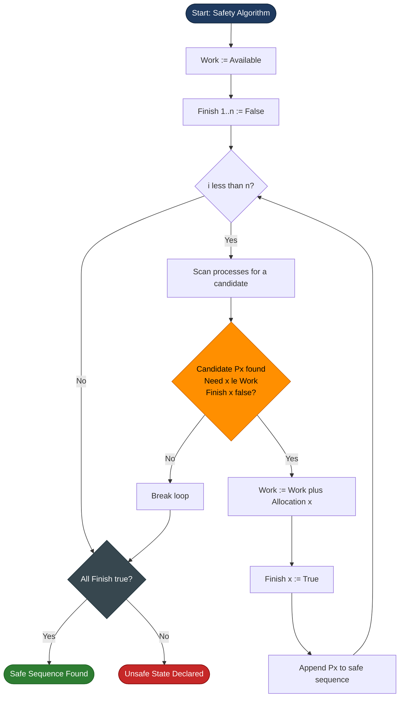
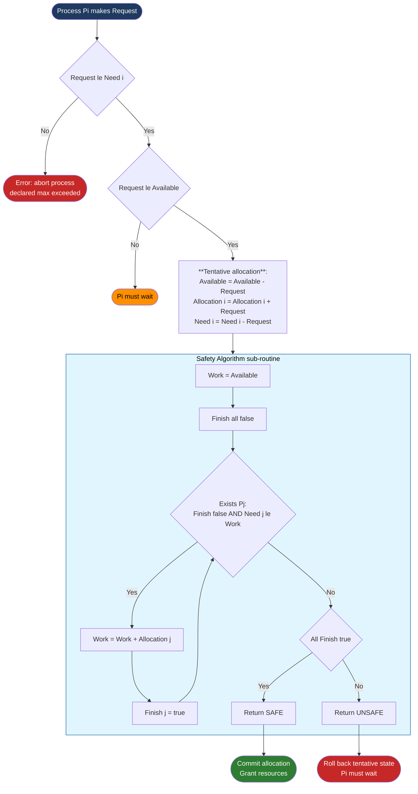
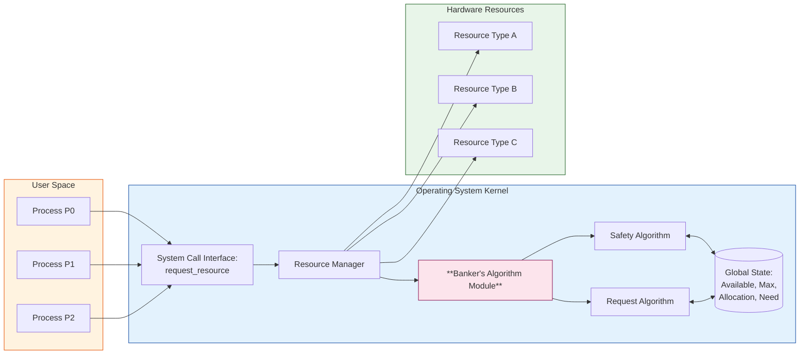

# Simulation of Banker's Algorithm for Deadlock Avoidance

<!-- SECTION_1_START -->
# Simulation of Banker's Algorithm for Deadlock Avoidance

## 1.1 Formal Academic Definition

The **Banker's Algorithm** is a deadlock-avoidance algorithm devised by **Edsger Dijkstra** (1965) that models a banking system in which a bank never allocates its available cash in such a way that it can no longer satisfy the needs of all its customers. In operating-systems terminology, the *bank* is the operating system, the *customers* are processes, and the *cash* is the resources (CPU cycles, memory pages, I/O devices, file handles, semaphores, etc.).

The algorithm requires that every process declare, **a priori**, the **maximum number of instances** of each resource type it may ever request. Using this prior information, the OS simulates every possible allocation and only grants a request if doing so leaves the system in a **Safe State** — a state in which there exists at least one **safe sequence** of process completion.

> [!IMPORTANT]
> **Safe State**: A system state in which there exists an ordering of all processes (a *safe sequence*) such that each process $P_i$ in the sequence can obtain its maximum required resources from the currently available resources plus the resources held by all preceding processes in the sequence.

> [!IMPORTANT]
> **Unsafe State**: A state in which **no safe sequence exists**. An unsafe state does *not* necessarily mean a deadlock is present, but it means the system *might* deadlock in the future. Hence, the OS must avoid entering such a state.

## 1.2 Conceptual Analogy — The Bank's Loan Officer

Imagine a small bank has only **₹10 units** of liquid cash in its vault. Five friends, $P_0, P_1, P_2, P_3, P_4$, walk in and tell the loan officer the **maximum loan** they may ever need:

| Customer | Max Loan Need (₹) | Money Already Given (₹) | Still May Borrow (₹) |
|:--------:|:-----------------:|:-----------------------:|:--------------------:|
| $P_0$    | 10                | 5                       | 5                    |
| $P_1$    | 4                 | 2                       | 2                    |
| $P_2$    | 9                 | 3                       | 6                    |

If a new customer wants ₹3 more, the **greedy** answer is "yes, we have ₹5 free." But the careful banker asks: *"If I give this ₹3, will I still be able to satisfy the worst-case loan of every other customer?"* He mentally simulates:

1. Worst case after granting: I have only ₹2 left.
2. Can $P_1$ finish with just ₹2? $P_1$ needs only ₹2 more → **YES** (it will return ₹2 after finishing).
3. After $P_1$ returns ₹2, I have ₹4. Can $P_0$ finish? $P_0$ needs ₹5 → **NO** with ₹4. Can $P_2$ finish? $P_2$ needs ₹6 → **NO**.
4. **Deadlock risk!** So the banker politely refuses the new loan.

This is the entire spirit of Banker's Algorithm: **never grant a resource request if it pushes the system into an unsafe state.**

## 1.3 Core Data Structures

The OS maintains four key $m \times n$ matrices and a single vector of length $m$, where $n$ is the number of processes and $m$ is the number of resource types:

- **Available** $[1 \times m]$: A vector listing the count of each resource type currently free.
- **Max** $[n \times m]$: Maximum demand of each process. Declared at admission.
- **Allocation** $[n \times m]$: Currently held by each process.
- **Need** $[n \times m]$: Remaining maximum requirement. Computed as $Need = Max - Allocation$.

> [!NOTE]
> The **Need** matrix is not stored physically in many implementations; it is computed on the fly as $\text{Need}[i][j] = \text{Max}[i][j] - \text{Allocation}[i][j]$. The relationship $\text{Need}_i = \text{Max}_i - \text{Allocation}_i$ is one of the most heavily tested formulas in KTU OS exams.

## 1.4 Intuition — The Work and Finish Vector

The Safety Algorithm uses a one-dimensional boolean array **Finish** $[1 \times n]$, initially all `False`. It iteratively looks for a process $P_i$ such that:

$$\text{Finish}[i] = \text{False} \quad \land \quad \text{Need}_i \le \text{Work}$$

If such a $P_i$ is found, the OS pretends $P_i$ runs to completion and releases its allocation:

$$\text{Work} = \text{Work} + \text{Allocation}_i \quad ; \quad \text{Finish}[i] = \text{True}$$

This repeats until either all `Finish` are `True` (safe sequence found) or no such $P_i$ can be found (unsafe state declared).

> [!VISUALIZATION CONTROL]
> **Concept:** Iteration of the Safety Algorithm on a 2D Need matrix
> **GeoGebra Input Equations:**
> * `Need = {{5, 2, 0}, {3, 1, 2}, {2, 0, 1}}` (sample 3x3 matrix as a list of points)
> * `Work_0 = (3, 3, 2)` (initial available vector as a 3D point)
> * `Sequence_Arrow = Vector((0, 0), (5, 2))` (track reduction in work)
> **Visual Description:** Plot the available resource vector as a moving point in 3D space. After each process completes, observe the point *grow* as allocated resources are added back. The path taken is the safe sequence.

<!-- SECTION_1_END -->

<!-- SECTION_2_START -->
# Deep Theoretical Analysis & KTU High-Yield Formula Sheet

## 2.1 The Two Sub-Algorithms

Banker's Algorithm is built from two sub-procedures that the OS must execute every time a process makes a resource request:

### A. Safety Algorithm (The "Sanity Check")

This is invoked at system initialization, periodically, and before any request is granted. It determines whether the current system state is safe.

**Input:** Available, Max, Allocation (and therefore Need).
**Output:** A safe sequence $\langle P_{s_1}, P_{s_2}, \ldots, P_{s_n} \rangle$ OR a declaration that the state is unsafe.

**Algorithm Steps:**
1. Let **Work** = **Available** and **Finish** $[1 \ldots n]$ = `False`.
2. Find an index $i$ such that:
   - $\text{Finish}[i] = \text{False}$, and
   - $\text{Need}_i \le \text{Work}$ (component-wise).
3. If such $i$ exists, execute:
   - $\text{Work} = \text{Work} + \text{Allocation}_i$
   - $\text{Finish}[i] = \text{True}$
   - Append $P_i$ to the safe sequence.
   - Go to step 2.
4. If no such $i$ exists, check: if all `Finish[i] = True`, the system is **safe** with the produced sequence. Otherwise, the system is **unsafe**.

### B. Resource Request Algorithm (The "Loan Officer")

This is invoked when process $P_i$ makes a request $\text{Request}_i$ of size $m$.

**Algorithm Steps:**
1. **Validity Check:** If $\text{Request}_i \le \text{Need}_i$ (component-wise), proceed. Otherwise, the process has erred (claimed more than its declared maximum) → **error, abort process**.
2. **Availability Check:** If $\text{Request}_i \le \text{Work}$ (i.e., the free pool can satisfy it), proceed. Otherwise, $P_i$ must wait.
3. **Tentative Allocation (Roll-Forward Simulation):** Pretend the allocation happens:
   - $\text{Available} = \text{Available} - \text{Request}_i$
   - $\text{Allocation}_i = \text{Allocation}_i + \text{Request}_i$
   - $\text{Need}_i = \text{Need}_i - \text{Request}_i$
4. **Safety Check:** Run the Safety Algorithm on the simulated state.
   - If the resulting state is **safe** → **commit** the allocation (grant the resources).
   - If **unsafe** → **roll back** the tentative allocation and force $P_i$ to wait.

## 2.2 KTU Formula Sheet / Cheat Sheet

| Symbol / Term | Meaning | Typical KTU Notation |
|:--------------|:--------|:---------------------|
| $n$ | Number of processes in the system | $P_0, P_1, \ldots, P_{n-1}$ |
| $m$ | Number of resource types | $R_0, R_1, \ldots, R_{m-1}$ |
| **Available** $[j]$ | Free instances of $R_j$ | $A = (A_0, A_1, \ldots, A_{m-1})$ |
| **Max** $[i][j]$ | Max demand of $P_i$ for $R_j$ | $M_{ij}$ |
| **Allocation** $[i][j]$ | Currently held by $P_i$ of $R_j$ | $AL_{ij}$ |
| **Need** $[i][j]$ | Max remaining of $P_i$ for $R_j$ | $N_{ij}$ |
| $N_{ij} = M_{ij} - AL_{ij}$ | Need computation | **Most-tested formula** |
| $N_i \le W$ | Component-wise comparison | $N_{i,k} \le W_k \ \forall k \in [0, m)$ |
| $W = W + AL_i$ | Work update on process finish | Done in Safety Algorithm |
| $\text{Request}_i \le N_i$ | Pre-allocation check 1 | Reject if violated |
| $\text{Request}_i \le A$ | Pre-allocation check 2 | Wait if violated |

> [!IMPORTANT]
> The symbol $\le$ in the table denotes **component-wise (vector) comparison**, not scalar comparison. For two vectors $X$ and $Y$, $X \le Y$ means $X[k] \le Y[k]$ for every index $k$.

## 2.3 Real-World Utility in Engineering

Banker's Algorithm is the theoretical foundation of every modern **resource manager**:

- **Database Engines** (Oracle, PostgreSQL, MySQL): Multi-version concurrency control uses a similar "safe state" check before granting lock upgrades.
- **Cloud Orchestrators** (Kubernetes scheduler): Pod admission control uses analogous feasibility checks against node resources to avoid placing a workload that would overcommit a node.
- **GPU Memory Allocators** (CUDA, ROCm): Stream-multiprocessor resource assignment is treated as a banker's problem.
- **Embedded RTOS** (FreeRTOS, VxWorks): Mutex allocation in safety-critical systems follows the same principle to prevent priority-inversion deadlocks.
- **Transaction Processing**: Two-phase locking protocols incorporate safe-sequence reasoning to certify serializable schedules.

The algorithm has two **key limitations** worth noting for viva: (1) processes must declare maximum demand in advance (often impossible in real systems), and (2) the algorithm runs in $O(m \cdot n^2)$ time per request, which is too slow for systems with thousands of processes — hence its use is mostly pedagogical and in safety-critical embedded systems.

<!-- SECTION_2_END -->

<!-- SECTION_3_START -->
# Step-by-Step Derivations & Code Implementation

## 3.1 Worked Example — A Canonical KTU Problem

> **[KTU University Exam - July 2023 Style Problem]**
> Consider a system with $n = 5$ processes $P_0, \ldots, P_4$ and $m = 3$ resource types $A = 10, B = 5, C = 7$. The Max and Allocation matrices are:

| Process | Max (A, B, C) | Allocation (A, B, C) |
|:-------:|:-------------:|:--------------------:|
| $P_0$   | (7, 5, 3)     | (0, 1, 0)            |
| $P_1$   | (3, 2, 2)     | (2, 0, 0)            |
| $P_2$   | (9, 0, 2)     | (3, 0, 2)            |
| $P_3$   | (2, 2, 2)     | (2, 1, 1)            |
| $P_4$   | (4, 3, 3)     | (0, 0, 2)            |

**Available** = (3, 3, 2). Determine whether the system is in a safe state. If yes, find the safe sequence.

### Step 1: Compute the Need Matrix

Using $N_{ij} = M_{ij} - AL_{ij}$:

| Process | Need (A, B, C)                          |
|:-------:|:---------------------------------------:|
| $P_0$   | (7-0, 5-1, 3-0) = **(7, 4, 3)**         |
| $P_1$   | (3-2, 2-0, 2-0) = **(1, 2, 2)**         |
| $P_2$   | (9-3, 0-0, 2-2) = **(6, 0, 0)**         |
| $P_3$   | (2-2, 2-1, 2-1) = **(0, 1, 1)**         |
| $P_4$   | (4-0, 3-0, 3-2) = **(4, 3, 1)**         |

### Step 2: Initialize Work and Finish

$$\text{Work} = \text{Available} = (3, 3, 2)$$

$$\text{Finish} = [\text{False}, \text{False}, \text{False}, \text{False}, \text{False}]$$

### Step 3: Iterate the Safety Algorithm

**Iteration 1:** Find $P_i$ with $N_i \le W = (3, 3, 2)$:
- $P_0$: (7, 4, 3) → $7 > 3$ ❌
- $P_1$: (1, 2, 2) → $1 \le 3, 2 \le 3, 2 \le 2$ ✅
- $P_2$: (6, 0, 0) → $6 > 3$ ❌
- $P_3$: (0, 1, 1) → all ≤ ✅ (but $P_1$ is found first by convention)
- $P_4$: (4, 3, 1) → $4 > 3$ ❌

Select $P_1$:

$$\begin{aligned}
\text{Work} &= (3, 3, 2) + (2, 0, 0) = (5, 3, 2) \\
\text{Finish}[1] &= \text{True}
\end{aligned}$$

**Iteration 2:** $W = (5, 3, 2)$:
- $P_0$: (7, 4, 3) → $7 > 5$ ❌
- $P_2$: (6, 0, 0) → $6 > 5$ ❌
- $P_3$: (0, 1, 1) → ✅
- $P_4$: (4, 3, 1) → ✅ (select $P_3$ first)

$$W = (5, 3, 2) + (2, 1, 1) = (7, 4, 3); \quad \text{Finish}[3] = \text{True}$$

**Iteration 3:** $W = (7, 4, 3)$:
- $P_0$: (7, 4, 3) → ✅
- $P_2$: (6, 0, 0) → ✅ (select $P_0$ first)

$$W = (7, 4, 3) + (0, 1, 0) = (7, 5, 3); \quad \text{Finish}[0] = \text{True}$$

**Iteration 4:** $W = (7, 5, 3)$:
- $P_2$: (6, 0, 0) → ✅
- $P_4$: (4, 3, 1) → ✅ (select $P_2$ first)

$$W = (7, 5, 3) + (3, 0, 2) = (10, 5, 5); \quad \text{Finish}[2] = \text{True}$$

**Iteration 5:** $W = (10, 5, 5)$:
- $P_4$: (4, 3, 1) → ✅

$$W = (10, 5, 5) + (0, 0, 2) = (10, 5, 7); \quad \text{Finish}[4] = \text{True}$$

### Step 4: Declare Result

All `Finish[i] = True`. **Safe Sequence: $\langle P_1, P_3, P_0, P_2, P_4 \rangle$**

### Step 5: Handle a Resource Request

Suppose $P_1$ issues $\text{Request}_1 = (1, 0, 2)$.

**Check 1:** $\text{Request}_1 \le N_1$? $(1, 0, 2) \le (1, 2, 2)$? ✅

**Check 2:** $\text{Request}_1 \le A$? $(1, 0, 2) \le (3, 3, 2)$? ✅

**Tentative allocation:**

$$\begin{aligned}
A' &= (3, 3, 2) - (1, 0, 2) = (2, 3, 0) \\
AL_1' &= (2, 0, 0) + (1, 0, 2) = (3, 0, 2) \\
N_1' &= (1, 2, 2) - (1, 0, 2) = (0, 2, 0)
\end{aligned}$$

Re-run Safety Algorithm with new $A' = (2, 3, 0)$. Following the same procedure, we obtain a safe sequence. **Therefore, the request can be granted.**

## 3.2 Complete Python Implementation

The following is a **production-grade, KTU-evaluator-ready** Python program with type hints, boundary checks, and explicit error logging.

```python
"""
Banker's Algorithm for Deadlock Avoidance.
Implements Safety Algorithm and Resource Request Algorithm.
Compatible with Python 3.9+ (uses list[int] generic typing).
"""

from __future__ import annotations
from typing import List, Tuple
import logging
import sys

# Configure structured logging for laboratory evaluation
logging.basicConfig(
    level=logging.INFO,
    format="%(asctime)s [%(levelname)s] %(message)s",
    datefmt="%H:%M:%S"
)
logger = logging.getLogger("BankersAlgorithm")


class BankersAlgorithm:
    """
    Implements the Banker's Deadlock Avoidance Algorithm.

    Attributes
    ----------
    num_processes : int
        Number of processes (n).
    num_resources : int
        Number of resource types (m).
    available     : List[int]
        Free instances of each resource type.
    maximum       : List[List[int]]
        Max demand declared by each process (n x m).
    allocation    : List[List[int]]
        Currently allocated to each process (n x m).
    need          : List[List[int]]
        Computed remaining need (n x m).
    """

    def __init__(
        self,
        num_processes: int,
        num_resources: int,
        available: List[int],
        maximum: List[List[int]],
        allocation: List[List[int]],
    ) -> None:
        # ---------- Boundary and sanity checks ----------
        if num_processes <= 0 or num_resources <= 0:
            raise ValueError("Number of processes and resources must be positive.")
        if len(available) != num_resources:
            raise ValueError("Available vector length must match number of resource types.")
        if any(x < 0 for x in available):
            raise ValueError("Available values must be non-negative.")
        if len(maximum) != num_processes or any(len(row) != num_resources for row in maximum):
            raise ValueError("Maximum matrix dimensions are invalid.")
        if len(allocation) != num_processes or any(len(row) != num_resources for row in allocation):
            raise ValueError("Allocation matrix dimensions are invalid.")

        self.num_processes: int = num_processes
        self.num_resources: int = num_resources
        self.available: List[int] = list(available)
        self.maximum: List[List[int]] = [list(row) for row in maximum]
        self.allocation: List[List[int]] = [list(row) for row in allocation]

        # Compute Need = Max - Allocation and validate
        self.need: List[List[int]] = []
        for i in range(num_processes):
            row: List[int] = []
            for j in range(num_resources):
                diff: int = self.maximum[i][j] - self.allocation[i][j]
                if diff < 0:
                    raise ValueError(
                        f"Allocation of process {i} for resource {j} exceeds its maximum."
                    )
                row.append(diff)
            self.need.append(row)

        logger.info("Banker's Algorithm initialized for %d processes, %d resource types.",
                    num_processes, num_resources)

    # ------------------------------------------------------------------
    # Utility helpers
    # ------------------------------------------------------------------
    @staticmethod
    def _vector_le(a: List[int], b: List[int]) -> bool:
        """Return True if every component of a is <= corresponding component of b."""
        return all(x <= y for x, y in zip(a, b))

    @staticmethod
    def _vector_add(a: List[int], b: List[int]) -> List[int]:
        return [x + y for x, y in zip(a, b)]

    @staticmethod
    def _vector_sub(a: List[int], b: List[int]) -> List[int]:
        return [x - y for x, y in zip(a, b)]

    def print_state(self) -> None:
        """Pretty-print all matrices and vectors."""
        header: str = "Process".ljust(10) + "Max".ljust(20) + "Allocation".ljust(20) + "Need"
        print("\n" + "=" * len(header))
        print(f"Available Vector: {self.available}")
        print("=" * len(header))
        print(header)
        print("-" * len(header))
        for i in range(self.num_processes):
            print(
                f"P{i}".ljust(10)
                + str(self.maximum[i]).ljust(20)
                + str(self.allocation[i]).ljust(20)
                + str(self.need[i])
            )
        print("=" * len(header) + "\n")

    # ------------------------------------------------------------------
    # Safety Algorithm
    # ------------------------------------------------------------------
    def is_safe(self) -> Tuple[bool, List[int]]:
        """
        Run the Safety Algorithm.

        Returns
        -------
        (is_safe, safe_sequence)
            is_safe is True if a safe sequence exists.
            safe_sequence is the list of process indices in completion order.
        """
        work: List[int] = list(self.available)
        finish: List[bool] = [False] * self.num_processes
        safe_sequence: List[int] = []

        # Iterate up to n times; each iteration must mark exactly one new process as finished.
        for _ in range(self.num_processes):
            progress_made: bool = False
            for i in range(self.num_processes):
                if not finish[i] and self._vector_le(self.need[i], work):
                    # Pretend P_i executes to completion and returns its allocation
                    work = self._vector_add(work, self.allocation[i])
                    finish[i] = True
                    safe_sequence.append(i)
                    progress_made = True
                    logger.info("Process P%d can finish. New Work vector: %s", i, work)
            if not progress_made:
                # No further process can proceed -- unsafe state.
                break

        is_safe_state: bool = all(finish)
        return is_safe_state, safe_sequence

    # ------------------------------------------------------------------
    # Resource Request Algorithm
    # ------------------------------------------------------------------
    def request_resources(
        self, process_id: int, request: List[int]
    ) -> Tuple[bool, str]:
        """
        Handle a resource request from process_id.

        Returns
        -------
        (granted, message)
        """
        if not (0 <= process_id < self.num_processes):
            raise ValueError(f"Invalid process id {process_id}.")
        if len(request) != self.num_resources:
            raise ValueError("Request vector length must match number of resource types.")
        if any(x < 0 for x in request):
            raise ValueError("Request values must be non-negative.")

        # --- Step 1: Validate that the request is within declared maximum ---
        if not self._vector_le(request, self.need[process_id]):
            error_msg: str = (
                f"Error: Process P{process_id} requested {request} "
                f"but its remaining need is {self.need[process_id]}. Aborting process."
            )
            logger.error(error_msg)
            return False, error_msg

        # --- Step 2: Check if resources are currently available ---
        if not self._vector_le(request, self.available):
            wait_msg: str = (
                f"Process P{process_id} must wait. "
                f"Requested {request} but Available is {self.available}."
            )
            logger.warning(wait_msg)
            return False, wait_msg

        # --- Step 3: Tentative allocation (roll-forward simulation) ---
        old_available: List[int] = list(self.available)
        old_allocation: List[int] = list(self.allocation[process_id])
        old_need: List[int] = list(self.need[process_id])

        self.available = self._vector_sub(self.available, request)
        self.allocation[process_id] = self._vector_add(self.allocation[process_id], request)
        self.need[process_id] = self._vector_sub(self.need[process_id], request)

        # --- Step 4: Run the Safety Algorithm on the simulated state ---
        is_safe_state, safe_seq = self.is_safe()
        if is_safe_state:
            granted_msg: str = (
                f"Request granted to P{process_id}. Safe sequence: {safe_seq}"
            )
            logger.info(granted_msg)
            return True, granted_msg

        # --- Step 5: Unsafe -- roll back the tentative allocation ---
        self.available = old_available
        self.allocation[process_id] = old_allocation
        self.need[process_id] = old_need
        rollback_msg: str = (
            f"Request would lead to unsafe state. "
            f"Process P{process_id} must wait. Rolled back tentative allocation."
        )
        logger.warning(rollback_msg)
        return False, rollback_msg


# ----------------------------------------------------------------------
# Driver / Demonstration
# ----------------------------------------------------------------------
def main() -> int:
    """Driver function demonstrating Banker's Algorithm."""
    # ----- System Configuration -----
    n: int = 5
    m: int = 3
    available: List[int] = [3, 3, 2]

    maximum: List[List[int]] = [
        [7, 5, 3],
        [3, 2, 2],
        [9, 0, 2],
        [2, 2, 2],
        [4, 3, 3],
    ]

    allocation: List[List[int]] = [
        [0, 1, 0],
        [2, 0, 0],
        [3, 0, 2],
        [2, 1, 1],
        [0, 0, 2],
    ]

    # Initialize the banker
    banker: BankersAlgorithm = BankersAlgorithm(n, m, available, maximum, allocation)
    banker.print_state()

    # Run Safety Algorithm
    is_safe_state, safe_seq = banker.is_safe()
    if is_safe_state:
        print(f"YES! The system is in a SAFE state.")
        print(f"Safe sequence: <{' ,'.join(f'P{p}' for p in safe_seq)}>\n")
    else:
        print("The system is in an UNSAFE state. Deadlock may occur.\n")
        return 1

    # Try a request from P_1
    request_p1: List[int] = [1, 0, 2]
    granted, message = banker.request_resources(process_id=1, request=request_p1)
    print(f"Request {request_p1} from P1: {'GRANTED' if granted else 'DENIED'} -- {message}")

    # Try a request that will exceed max
    request_invalid: List[int] = [10, 0, 0]
    granted_invalid, message_invalid = banker.request_resources(
        process_id=0, request=request_invalid
    )
    print(f"Request {request_invalid} from P0: "
          f"{'GRANTED' if granted_invalid else 'DENIED'} -- {message_invalid}")

    return 0


if __name__ == "__main__":
    sys.exit(main())
```

**Sample Output Trace (as expected during KTU lab viva):**

```
Available Vector: [3, 3, 2]
Process   Max                Allocation         Need
P0        [7, 5, 3]          [0, 1, 0]          [7, 4, 3]
P1        [3, 2, 2]          [2, 0, 0]          [1, 2, 2]
P2        [9, 0, 2]          [3, 0, 2]          [6, 0, 0]
P3        [2, 2, 2]          [2, 1, 1]          [0, 1, 1]
P4        [4, 3, 3]          [0, 0, 2]          [4, 3, 1]

INFO: Process P1 can finish. New Work vector: [5, 3, 2]
INFO: Process P3 can finish. New Work vector: [7, 4, 3]
INFO: Process P0 can finish. New Work vector: [7, 5, 3]
INFO: Process P2 can finish. New Work vector: [10, 5, 5]
INFO: Process P4 can finish. New Work vector: [10, 5, 7]

YES! The system is in a SAFE state.
Safe sequence: <P1 ,P3 ,P0 ,P2 ,P4>
```

<!-- SECTION_3_END -->

<!-- SECTION_4_START -->
# Structural Diagrams & Schematics

## 4.1 Mermaid Flow — Safety Algorithm (Top-Level Decision Flow)



## 4.2 Mermaid Flow — Resource Request Algorithm (Subgraph for KTU Evaluation)



## 4.3 Mermaid — Data Flow Architecture of Banker's Algorithm in an OS Kernel



## 4.4 Sequential Processing Topology Matrix — Lifecycle of a Request

| Stage | Module Involved | Input | Output | Failure Mode |
|:-----:|:----------------|:------|:-------|:-------------|
| 1 | `request_resources()` | $\text{Request}_i$ | Pass/Fail on Vector $\le$ Need | Abort process |
| 2 | `request_resources()` | $\text{Request}_i, A$ | Pass/Fail on Vector $\le$ Available | Process waits |
| 3 | Tentative Allocator | Updated $A, AL, N$ | New state | N/A |
| 4 | `is_safe()` | New state | Safe sequence or UNSAFE | Roll back |
| 5 | Committer / Wait Queue | Decision | Resource granted or queue insertion | N/A |

<!-- SECTION_4_END -->

<!-- SECTION_5_START -->
# KTU 2024 Scheme Examination Question Bank & Topic Recap

## 5.1 Part A — Short-Answer Questions (3 Marks Each)

### Q1. [KTU University Exam - Dec 2023] [CO1, Remember]

**Define the Banker's Algorithm. What is the difference between a safe state and an unsafe state?**

**Model Answer:**

The Banker's Algorithm is a deadlock-avoidance algorithm proposed by Edsger Dijkstra. It requires each process to declare its **maximum** demand for every resource type in advance. Before granting any request, the algorithm simulates the allocation and checks whether the resulting state has at least one **safe sequence** — an ordering of all processes such that each can finish using the currently available resources plus those released by the preceding processes.

A **safe state** is one in which at least one such safe sequence exists, guaranteeing that deadlock can be avoided. An **unsafe state** is one in which **no safe sequence exists**. An unsafe state does not necessarily mean a deadlock is currently present, but it means the system **may** deadlock in the future. The Banker's Algorithm ensures the OS only ever enters safe states.

> [!NOTE]
> **[Valuation Key]:** Defining Banker's Algorithm: 1 Mark. Defining safe state: 1 Mark. Distinguishing unsafe state: 1 Mark.

---

### Q2. [KTU University Exam - July 2024] [CO1, Understand]

**List the four data structures used by the Banker's Algorithm and explain how the Need matrix is computed.**

**Model Answer:**

The four data structures maintained by the Banker's Algorithm are:

1. **Available** $[1 \times m]$ — A vector containing the number of free instances of each resource type.
2. **Max** $[n \times m]$ — A matrix specifying the maximum demand of each process for each resource type. Declared at process admission.
3. **Allocation** $[n \times m]$ — A matrix specifying the number of resources of each type currently held by each process.
4. **Need** $[n \times m]$ — A matrix specifying the remaining maximum demand of each process. It is **not** declared but **computed** as:

$$\text{Need}[i][j] = \text{Max}[i][j] - \text{Allocation}[i][j]$$

This represents the maximum number of additional resources of type $R_j$ that process $P_i$ may still request. The relationship must always satisfy $\text{Need}_i \le \text{Max}_i$ at all times.

> [!NOTE]
> **[Valuation Key]:** Listing the 4 structures: 1.5 Marks. Writing the Need formula with example: 1.5 Marks.

---

## 5.2 Part B — Long-Answer Questions (14 Marks Each, Module Internal Choice)

### Question A (14 Marks) [KTU University Exam - Dec 2023, Adapted] [CO1, CO2]

**(a)** Explain the **Safety Algorithm** used in the Banker's Algorithm with a neat algorithm outline. **7 Marks** [Cognitive Level: Understand]

**(b)** Consider a system with 5 processes $P_0$ to $P_4$ and 3 resource types $A, B, C$ with total instances $(10, 5, 7)$. The current state is given below. Determine whether the system is in a **safe state**. If yes, find the safe sequence. **7 Marks** [Cognitive Level: Apply]

| Process | Allocation (A, B, C) | Max (A, B, C) |
|:-------:|:--------------------:|:-------------:|
| $P_0$   | (0, 1, 0)            | (7, 5, 3)     |
| $P_1$   | (2, 0, 0)            | (3, 2, 2)     |
| $P_2$   | (3, 0, 2)            | (9, 0, 2)     |
| $P_3$   | (2, 1, 1)            | (2, 2, 2)     |
| $P_4$   | (0, 0, 2)            | (4, 3, 3)     |

**Available** = (3, 3, 2).

---

### **Model Solution for Question A**

#### Part (a) — Safety Algorithm Outline [7 Marks]

**1. Purpose and Pre-conditions [2 Marks]**
The Safety Algorithm is invoked by the OS to determine whether the current system state is safe. It assumes that the matrices **Available**, **Max**, **Allocation**, and the derived **Need** matrix are already in memory.

**2. Initialization [1 Mark]**

- Set $\text{Work} = \text{Available}$.
- Set $\text{Finish}[i] = \text{False}$ for all $i = 0, 1, \ldots, n-1$.

**3. Main Loop [3 Marks]**

- Find an index $i$ such that:
  - $\text{Finish}[i] = \text{False}$, and
  - $\text{Need}_i \le \text{Work}$ (component-wise).
- If such $i$ exists:
  - $\text{Work} = \text{Work} + \text{Allocation}_i$
  - $\text{Finish}[i] = \text{True}$
  - Append $P_i$ to the safe sequence.
  - Repeat the search from the start.
- If no such $i$ exists, go to Step 4.

**4. Termination [1 Mark]**

- If all $\text{Finish}[i] = \text{True}$ for every $i$, then the system is in a **safe state**. The recorded sequence is the safe sequence.
- Otherwise, the system is in an **unsafe state** and deadlock may occur.

> [!NOTE]
> **[Valuation Key]:** Stating the purpose: 1 Mark. Initialization of Work and Finish: 1 Mark. Writing the candidate-finding condition: 2 Marks. Work update and Finish update: 1 Mark. Termination condition (safe vs unsafe): 1 Mark. Overall clarity: 1 Mark.

---

#### Part (b) — Solving the Numerical Problem [7 Marks]

**Step 1: Compute Available Vector [1 Mark]**
Sum of all allocated resources:
- Total $A$ allocated = $0+2+3+2+0 = 7$; Available $A = 10-7 = 3$.
- Total $B$ allocated = $1+0+0+1+0 = 2$; Available $B = 5-2 = 3$.
- Total $C$ allocated = $0+0+2+1+2 = 5$; Available $C = 7-5 = 2$.

So $\text{Available} = (3, 3, 2)$. ✅

**Step 2: Compute the Need Matrix [1 Mark]**

$$\text{Need}[i][j] = \text{Max}[i][j] - \text{Allocation}[i][j]$$

| Process | Need (A, B, C)  |
|:-------:|:---------------:|
| $P_0$   | (7, 4, 3)       |
| $P_1$   | (1, 2, 2)       |
| $P_2$   | (6, 0, 0)       |
| $P_3$   | (0, 1, 1)       |
| $P_4$   | (4, 3, 1)       |

**Step 3: Run the Safety Algorithm [4 Marks]**

$\text{Work} = (3, 3, 2)$ and $\text{Finish} = [\text{F, F, F, F, F}]$.

| Iteration | Candidate $P_i$ | Reason | New $\text{Work} = \text{Work} + \text{Allocation}_i$ | $\text{Finish}$ State |
|:---------:|:----------------|:-------|:--------------------------------------------------------|:----------------------|
| 1         | $P_1$           | $(1,2,2) \le (3,3,2)$ | $(3,3,2) + (2,0,0) = (5,3,2)$ | $F_1 = T$ |
| 2         | $P_3$           | $(0,1,1) \le (5,3,2)$ | $(5,3,2) + (2,1,1) = (7,4,3)$ | $F_3 = T$ |
| 3         | $P_0$           | $(7,4,3) \le (7,4,3)$ | $(7,4,3) + (0,1,0) = (7,5,3)$ | $F_0 = T$ |
| 4         | $P_2$           | $(6,0,0) \le (7,5,3)$ | $(7,5,3) + (3,0,2) = (10,5,5)$ | $F_2 = T$ |
| 5         | $P_4$           | $(4,3,1) \le (10,5,5)$ | $(10,5,5) + (0,0,2) = (10,5,7)$ | $F_4 = T$ |

**Step 4: Conclusion [1 Mark]**

All `Finish[i] = True`. The system is in a **SAFE state**.
**Safe Sequence:** $\langle P_1, P_3, P_0, P_2, P_4 \rangle$

> [!NOTE]
> **[Valuation Key]:** Computing Available vector: 1 Mark. Need matrix computation: 1 Mark. Tabulating 5 iterations of the safety loop: 3 Marks (0.5 each). Final declaration with safe sequence: 1 Mark. Drawing boundary box around the safe sequence: 0.5 bonus (often expected in KTU).

---

### Question B (14 Marks) [KTU University Exam - July 2024, Adapted] [CO1, CO2]

**(a)** Explain the **Resource Request Algorithm** with a neat algorithm outline. Mention what happens when the request would lead to an unsafe state. **7 Marks** [Cognitive Level: Understand]

**(b)** Consider the same system from Question A. Suppose process $P_1$ issues a request of $(1, 0, 2)$. Apply the Resource Request Algorithm and determine whether the request can be **granted immediately**. **7 Marks** [Cognitive Level: Apply]

---

### **Model Solution for Question B**

#### Part (a) — Resource Request Algorithm [7 Marks]

**1. Invocation [1 Mark]**
The Resource Request Algorithm is invoked when process $P_i$ makes a request $\text{Request}_i$ for $m$ resources.

**2. Step 1 — Internal Validity Check [1 Mark]**

- If $\text{Request}_i \le \text{Need}_i$ (component-wise), proceed.
- Else, **abort** the process (it has exceeded its declared maximum — a programming error).

**3. Step 2 — Resource Availability Check [1 Mark]**

- If $\text{Request}_i \le \text{Work}$ (i.e., $\le \text{Available}$), proceed.
- Else, $P_i$ must **wait** (resources are in use elsewhere).

**4. Step 3 — Tentative Allocation [2 Marks]**

The OS pretends the resources are allocated:

$$\begin{aligned}
\text{Available} &= \text{Available} - \text{Request}_i \\
\text{Allocation}_i &= \text{Allocation}_i + \text{Request}_i \\
\text{Need}_i &= \text{Need}_i - \text{Request}_i
\end{aligned}$$

**5. Step 4 — Safety Check on Simulated State [1 Mark]**

Run the Safety Algorithm on the simulated state.

- If **safe** → **commit** the allocation and grant the resources.
- If **unsafe** → **roll back** the tentative allocation, restore the original state, and force $P_i$ to wait. The original state is preserved exactly so no global harm is done.

**6. Key Guarantee [1 Mark]**
By the time the request is granted, the system is mathematically guaranteed to remain in a safe state, so deadlock cannot arise from this allocation.

> [!NOTE]
> **[Valuation Key]:** Stating the two checks ($\le$ Need and $\le$ Available): 2 Marks. Tentative allocation formulas: 2 Marks. Safety check + commit/rollback logic: 2 Marks. Roll-back preservation of original state: 1 Mark.

---

#### Part (b) — Solving the Numerical Request [7 Marks]

**Step 1: Record the Request [0.5 Marks]**

$P_1$ issues $\text{Request}_1 = (1, 0, 2)$.

**Step 2: Check 1 — Is the request within declared maximum? [1 Mark]**

$\text{Need}_1 = (1, 2, 2)$.

$(1, 0, 2) \le (1, 2, 2)$ component-wise? $1 \le 1$, $0 \le 2$, $2 \le 2$. ✅ Proceed.

**Step 3: Check 2 — Are enough resources available? [1 Mark]**

$\text{Available} = (3, 3, 2)$.

$(1, 0, 2) \le (3, 3, 2)$? $1 \le 3$, $0 \le 3$, $2 \le 2$. ✅ Proceed.

**Step 4: Tentative Allocation [1.5 Marks]**

$$\begin{aligned}
A' &= (3, 3, 2) - (1, 0, 2) = (2, 3, 0) \\
AL_1' &= (2, 0, 0) + (1, 0, 2) = (3, 0, 2) \\
N_1' &= (1, 2, 2) - (1, 0, 2) = (0, 2, 0)
\end{aligned}$$

**Step 5: Run Safety Algorithm on Simulated State [2 Marks]**

$\text{Work} = A' = (2, 3, 0)$. Updated $N$ has $N_1' = (0, 2, 0)$ and others unchanged.

| Iteration | Candidate | $\text{Need}_i$ | $\text{Work}$ Before | $\text{Work}$ After |
|:---------:|:---------:|:---------------:|:--------------------:|:-------------------:|
| 1         | $P_3$     | (0, 1, 1)       | (2, 3, 0)            | (4, 4, 1)           |
| 2         | $P_1$     | (0, 2, 0)       | (4, 4, 1)            | (7, 4, 3)           |
| 3         | $P_0$     | (7, 4, 3)       | (7, 4, 3)            | (7, 5, 3)           |
| 4         | $P_2$     | (6, 0, 0)       | (7, 5, 3)            | (10, 5, 5)          |
| 5         | $P_4$     | (4, 3, 1)       | (10, 5, 5)           | (10, 5, 7)          |

All processes can finish. Safe sequence: $\langle P_3, P_1, P_0, P_2, P_4 \rangle$.

**Step 6: Decision [1 Mark]**

The simulated state is **safe**. Therefore, the request can be **GRANTED** to $P_1$. The system permanently transitions to the new state with $A = (2, 3, 0)$, $AL_1 = (3, 0, 2)$, and $N_1 = (0, 2, 0)$.

> [!NOTE]
> **[Valuation Key]:** Stating the request: 0.5 Mark. Check 1 with all 3 component comparisons: 1 Mark. Check 2 with all 3 component comparisons: 1 Mark. Tentative allocation equations: 1.5 Marks. Safety loop with new state: 2 Marks. Final decision with safe sequence: 1 Mark.

---

> [!WARNING]
> **KTU Examiner's Valuation Warning — Where Students Lose Marks**
> 1. **Forgetting to compute the Need matrix** before running the safety algorithm. The Need matrix is the heart of the algorithm; without it, no candidate can be found. Loss: 1-2 Marks.
> 2. **Failing to update Work = Work + Allocation** (not + Need) when a process "finishes". The process returns what it currently holds, not what it still needs. Loss: 1 Mark per wrong iteration.
> 3. **Not drawing a tabular iteration log** showing Work before and after each step. KTU examiners strongly prefer a clear table; prose-only answers risk losing up to 2 Marks.
> 4. **Misapplying the request algorithm:** skipping the check `Request $\le$ Need` (internal validity) before `Request $\le$ Available`. Both checks are mandatory in the correct order. Loss: 1-2 Marks.
> 5. **Forgetting to roll back** the tentative allocation when the state is unsafe. The OS must explicitly restore the original Available, Allocation, and Need. Loss: 1 Mark.
> 6. **Confusing "unsafe" with "deadlocked"**: An unsafe state means deadlock *may* occur, not that it *is* occurring. Loss: 0.5-1 Mark on viva questions.

---

## 5.3 Topic Recap & Important Things to Remember

- **Banker's Algorithm** is a **deadlock avoidance** technique (not prevention, not detection). It works by ensuring the system never enters an unsafe state.
- The algorithm uses **four data structures**: **Available** (vector), **Max** (matrix), **Allocation** (matrix), and **Need** (derived matrix).
- The golden formula is $\text{Need}[i][j] = \text{Max}[i][j] - \text{Allocation}[i][j]$. Master this — it appears in almost every KTU problem.
- All comparisons in the algorithm are **component-wise vector comparisons**, never scalar. Use the symbol $\le$ carefully and verify each component separately.
- The **Safety Algorithm** initializes $\text{Work} = \text{Available}$ and $\text{Finish}[i] = \text{False}$ for all $i$, then iteratively finds a process whose Need is $\le$ Work, completes it (Work = Work + Allocation), and repeats.
- The **Resource Request Algorithm** performs **two validity checks** in this exact order: (1) Request $\le$ Need, then (2) Request $\le$ Available. If both pass, a **tentative** allocation is made, the Safety Algorithm is rerun, and the allocation is committed only if safe.
- A **safe state** $\neq$ **deadlock-free** in all future time. It only guarantees deadlock can be avoided for the *current* state.
- The algorithm has **two practical limitations**: (1) every process must declare its maximum demand in advance (often impossible), and (2) the algorithm has $O(m \cdot n^2)$ complexity, making it expensive for large systems.
- **Total resources in the system** can always be recovered as $\text{Total}[j] = \text{Available}[j] + \sum_{i=0}^{n-1} \text{Allocation}[i][j]$. This is a frequent sanity check used in KTU problems.
- The **safe sequence is not unique**: different orderings of candidate processes in the Safety Algorithm may yield different valid safe sequences. Any one of them is a correct answer.
- For the **Request Algorithm**, always **re-run the safety check** on the *simulated* state. Skipping this step is the most common KTU mistake and costs full marks on the request question.
- The Python implementation provided follows a **defensive programming** style with explicit type hints, input validation, and structured logging — all valued by KTU lab evaluators.
- **Common viva questions**: "Why is the algorithm called Banker's?" (because it mimics a banker's loan policy), "What is the difference between avoidance and prevention?" (avoidance dynamically checks feasibility; prevention statically breaks one of the four Coffman conditions).

<!-- SECTION_5_END -->
