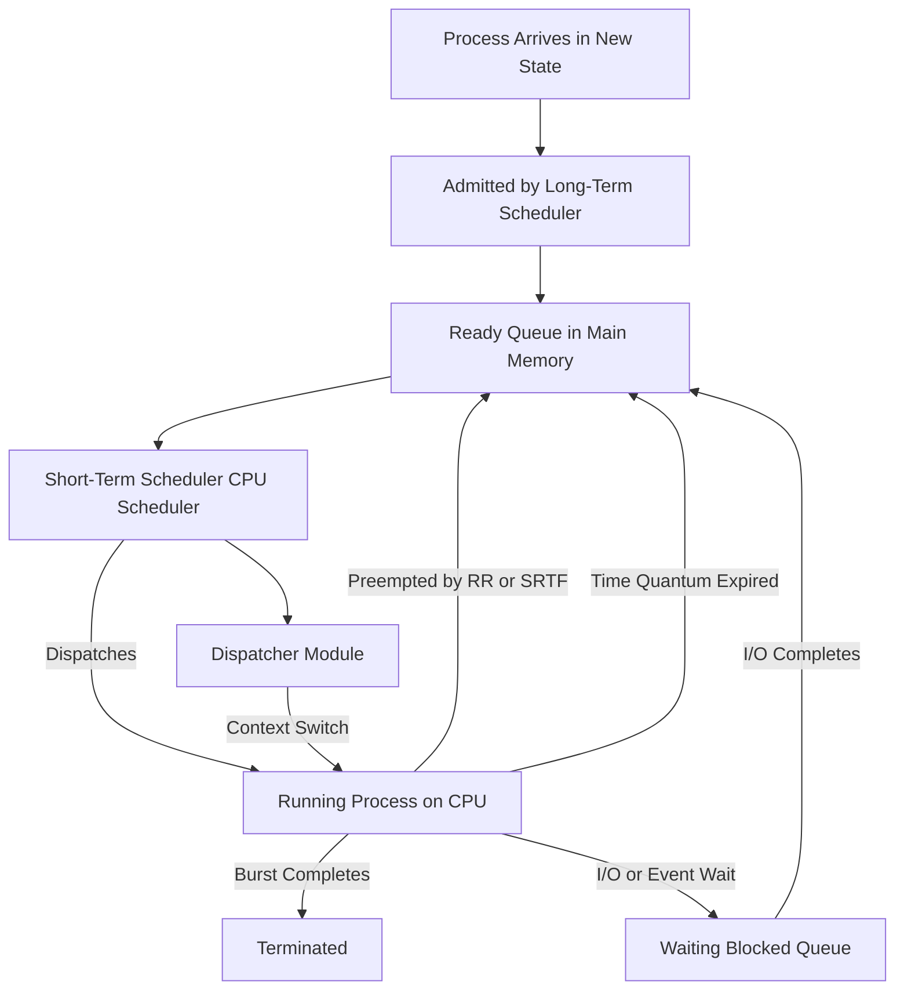
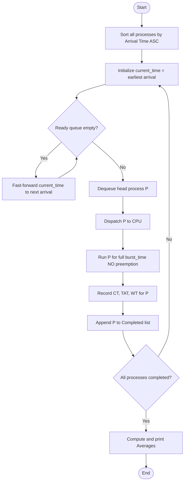
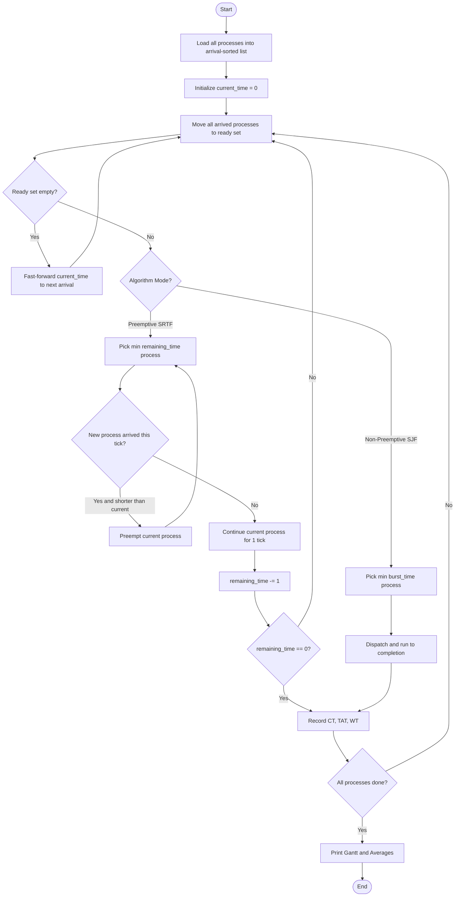
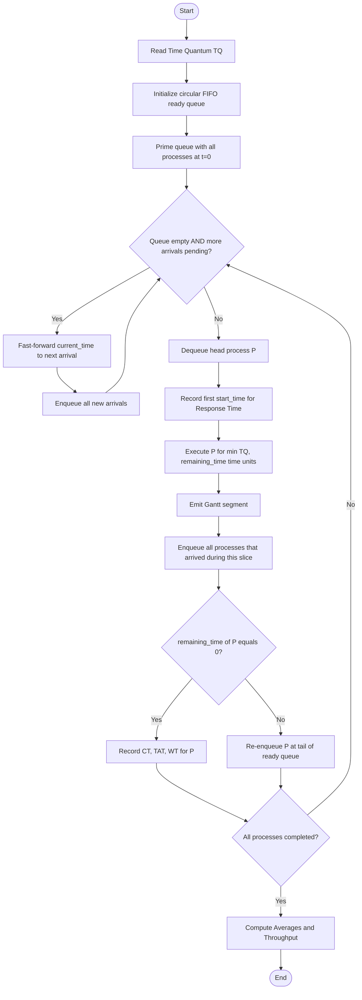
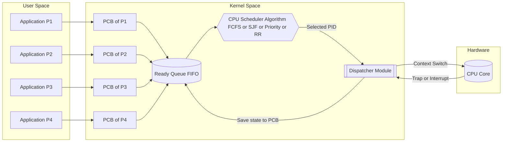

# Simulation of CPU scheduling algorithms - FCFS, SJF, Priority and Round Robin

<!-- SECTION_1_START -->

# CPU Scheduling Algorithms (FCFS, SJF, Priority, Round Robin)

> [!NOTE]
> **KTU 2024 Scheme | Course Code:** PCCSL407 (Operating Systems Lab) | **Module:** 1 | **CO Mapped:** CO1, CO2 | **RBT Focus:** Apply, Analyze, Create

## 1.1 Formal Academic Definition

**CPU Scheduling** is the fundamental process management activity handled by the **Short-Term Scheduler** (also called the **CPU Scheduler**) of an Operating System. It involves selecting one process from the **Ready Queue** (maintained in main memory) and allocating the physical CPU core to that process for execution. Whenever the CPU becomes idle, the OS scheduler must make a **dispatch decision** based on a predetermined **scheduling algorithm** to decide which ready process gets the CPU next.

According to the **KTU 2024 Operating Systems syllabus**, the four canonical uniprocessor CPU scheduling algorithms that must be implemented in the laboratory are:

1. **First-Come, First-Served (FCFS)** — Non-Preemptive
2. **Shortest Job First (SJF)** — Preemptive (SRTF) and Non-Preemptive
3. **Priority Scheduling** — Preemptive and Non-Preemptive
4. **Round Robin (RR)** — Preemptive (Time Quantum based)

> [!IMPORTANT]
> **Core Concept — The Dispatcher:** The actual handover of the CPU to the selected process is performed by the **Dispatcher**, a separate kernel component. The three functions it performs are: (i) **Context Switching** (saving state of current process and loading state of the new one), (ii) **Switching to User Mode**, and (iii) **Jumping to the proper location in the user program to restart that program**. The combined time consumed by the dispatcher to perform these three steps is called the **Dispatch Latency**.

## 1.2 Conceptual Analogy — The Billing Counter Model

Imagine a **single billing counter at a supermarket** and a queue of customers with varying numbers of items in their carts.

- **FCFS** is like serving customers strictly in the order they joined the queue. If the first customer has 100 items, everyone waits — the **Convoy Effect**.
- **SJF** is like serving the customer with the **fewest items first** when the counter opens. It minimizes total waiting time, but the rule depends on knowing the cart size in advance.
- **Priority Scheduling** is like having a **senior citizen / pregnant women / VIP counter**. Customers are grouped by category; a person with high priority preempts (or jumps the queue ahead of) a lower-priority one.
- **Round Robin** is like giving every customer in the queue exactly **2 minutes** at the counter, then rotating. No one starves, but a person with 100 items will take many rotations to finish.

The **Ready Queue** is the row of customers, the **CPU** is the billing machine, the **Burst Time** is the number of items, and the **scheduler** is the floor manager deciding who goes next.

## 1.3 Key Terminology (KTU Board Standard Vocabulary)

> [!IMPORTANT]
> Students **must** use these exact KTU-expected terms in viva and exams. Examiners award marks for precise terminology.

| Term | Definition |
|---|---|
| **Arrival Time (AT)** | The instant at which a process enters the ready queue (in ms). |
| **Burst Time (BT)** | The total CPU time required by a process to complete its execution. |
| **Completion Time (CT)** | The instant at which a process finishes execution. |
| **Turnaround Time (TAT)** | Total time a process spends in the system: $TAT = CT - AT$. |
| **Waiting Time (WT)** | Time a process spends waiting in the ready queue: $WT = TAT - BT$. |
| **Response Time (RT)** | Time from arrival until the process first gets the CPU: $RT = First\ Start\ Time - AT$. |
| **Throughput** | Number of processes completed per unit time: $\frac{N}{Total\ Time}$. |
| **CPU Utilization (%)** | Percentage of time the CPU is doing useful work. |
| **Gantt Chart** | A horizontal bar diagram showing which process executes on the CPU at each instant. |

## 1.4 Preemptive vs. Non-Preemptive Scheduling

> [!IMPORTANT]
> **Preemption** = the OS is allowed to forcibly remove the CPU from a currently running process before its burst time is exhausted. **Non-Preemption** = once a process starts, it runs until completion or until it voluntarily blocks (e.g., I/O).

The classification of all four algorithms in the KTU module is:

- **FCFS** → Strictly **Non-Preemptive**
- **SJF** → Can be **Non-Preemptive** OR **Preemptive (SRTF — Shortest Remaining Time First)**
- **Priority** → Can be **Non-Preemptive** OR **Preemptive**
- **Round Robin** → Strictly **Preemptive** (driven by the **Time Quantum**)

## 1.5 Visualization of Scheduling Behavior

> [!VISUALIZATION CONTROL]
> **Concept:** Gantt Chart Layout of Four Different Scheduling Algorithms on a Common Time Axis
> **Plot Type:** Stacked Horizontal Bar (Gantt Chart) on a 1D Number Line (x-axis = Time in ms)
> **Visual Description:** On the x-axis, draw four stacked horizontal bars (rows), one for each algorithm. Each bar is partitioned into colored segments. The **length** of each segment equals the burst time allocated to that process, and the segments are placed side-by-side in the order the algorithm dispatches them. The **completion time** of a process is the right edge of its rightmost segment.
> **Example (FCFS on 4 processes P1, P2, P3, P4 with BT 4, 3, 1, 2):**
> - Row 1 (FCFS): `[P1 0—4][P2 4—7][P3 7—8][P4 8—10]`
> - Row 2 (SJF Non-Pre): `[P1 0—4][P3 4—5][P4 5—7][P2 7—10]`
> - Row 3 (SRTF): `[P1 0—2][P3 2—3][P1 3—4][P2 4—6][P4 6—8]`
> - Row 4 (RR, TQ=2): `[P1 0—2][P1 2—4][P2 4—6][P3 6—7][P4 7—9][P2 9—10]`
> **Observation the student should make:** The same set of processes yields four **different Gantt charts** and four **different average waiting times** — there is no single "best" algorithm; the choice depends on system goals.

<!-- SECTION_1_END -->

<!-- SECTION_2_START -->

# Deep Theoretical Analysis & KTU High-Yield Formula Sheet

## 2.1 Algorithm 1 — First-Come, First-Served (FCFS)

### 2.1.1 Operational Logic

FCFS is the **simplest** and most intuitive CPU scheduling algorithm. It is implemented using a standard **FIFO (First-In, First-Out) queue**. The scheduler always picks the process that has been waiting the longest in the ready queue.

**Step-by-step logic:**
1. Maintain a queue of processes sorted by **Arrival Time (AT)**.
2. At $t = 0$ (or whenever CPU becomes idle), dequeue the first process.
3. Allocate the CPU to that process for its **entire burst time** without interruption.
4. When the process finishes (at $CT$), update the queue with any newly arrived processes, then go to Step 2.

> [!IMPORTANT]
> **The Convoy Effect:** FCFS suffers from a phenomenon where one CPU-bound process with a very long burst time holds up all short processes behind it. Short jobs are forced to wait an unnecessarily long time, even though the CPU could have served them in much less time. This is analogous to a slow truck on a single-lane road holding up faster cars.

### 2.1.2 Numerical Worked Example (FCFS)

| Process | AT | BT |
|---|---|---|
| P1 | 0 | 4 |
| P2 | 1 | 3 |
| P3 | 2 | 1 |
| P4 | 3 | 2 |

**Gantt Chart (FCFS):**

$$
\begin{aligned}
\text{Time Axis: } 0 \longrightarrow 10 \\
\text{Execution Order: } P1(0 \to 4) \rightarrow P2(4 \to 7) \rightarrow P3(7 \to 8) \rightarrow P4(8 \to 10)
\end{aligned}
$$

**Performance Metrics Table:**

| Process | AT | BT | CT | TAT = CT - AT | WT = TAT - BT |
|---|---|---|---|---|---|
| P1 | 0 | 4 | 4 | 4 | 0 |
| P2 | 1 | 3 | 7 | 6 | 3 |
| P3 | 2 | 1 | 8 | 6 | 5 |
| P4 | 3 | 2 | 10 | 7 | 5 |

$$
\begin{aligned}
\text{Average TAT} &= \frac{4 + 6 + 6 + 7}{4} = \frac{23}{4} = 5.75 \text{ ms} \\
\text{Average WT}  &= \frac{0 + 3 + 5 + 5}{4} = \frac{13}{4} = 3.25 \text{ ms}
\end{aligned}
$$

## 2.2 Algorithm 2 — Shortest Job First (SJF)

### 2.2.1 Operational Logic (Non-Preemptive Variant)

SJF (also called **Shortest Job Next, SJN**) selects from the ready queue the process with the **smallest burst time** at the moment of scheduling. It is provably **optimal** with respect to minimizing the **average waiting time** — no other algorithm can produce a lower AWT for the same set of processes.

**Step-by-step logic:**
1. At $t = 0$, consider all processes that have arrived.
2. Pick the one with the **minimum burst time** and assign the CPU to it.
3. Run it to completion (no preemption).
4. At the next scheduling instant, refresh the available pool (include newly arrived processes) and repeat.

### 2.2.2 Operational Logic (Preemptive Variant — SRTF)

In **Shortest Remaining Time First (SRTF)**, the scheduler runs at **every clock tick** (or every arrival event) and compares the **remaining burst time** of the currently running process with the **burst time** of every newly arrived process. If a newcomer has a shorter burst, the current process is **preempted** and moved back to the ready queue.

**SRTF Step-by-step logic:**
1. At $t = 0$, run the only process in the queue.
2. At each **arrival event**, recompute: $\min(\text{Remaining BT of running process}, \text{BT of new arrivals})$.
3. If a new arrival wins, perform a **context switch**: save the current PCB, load the new one's, and continue.
4. When the currently running process finishes its remaining slice, mark it complete and pick the next shortest from the queue.

> [!IMPORTANT]
> **The Prediction Problem:** SJF/SRTF requires knowing the CPU burst time **in advance**, which is impossible in real systems. In practice, OSes use **exponential averaging** of past burst times to predict the next burst: $\tau_{n+1} = \alpha \cdot t_n + (1-\alpha) \cdot \tau_n$, where $t_n$ is the actual burst length and $\alpha$ is a smoothing factor between 0 and 1.

### 2.2.3 Numerical Worked Example (SJF Non-Preemptive)

Using the **same dataset** (P1=4, P2=3, P3=1, P4=2):

- $t=0$: only P1 is ready. Run P1 (0—4).
- $t=4$: P2(3), P3(1), P4(2) all available. Pick P3 (smallest BT=1). Run P3 (4—5).
- $t=5$: P2(3), P4(2) available. Pick P4. Run P4 (5—7).
- $t=7$: Only P2 left. Run P2 (7—10).

**Gantt Chart:** `[P1 0—4][P3 4—5][P4 5—7][P2 7—10]`

| Process | AT | BT | CT | TAT | WT |
|---|---|---|---|---|---|
| P1 | 0 | 4 | 4 | 4 | 0 |
| P2 | 1 | 3 | 10 | 9 | 6 |
| P3 | 2 | 1 | 5 | 3 | 2 |
| P4 | 3 | 2 | 7 | 4 | 2 |

$$
\begin{aligned}
\text{Average TAT} &= \frac{4+9+3+4}{4} = 5.0 \text{ ms} \\
\text{Average WT}  &= \frac{0+6+2+2}{4} = 2.5 \text{ ms}
\end{aligned}
$$

### 2.2.4 Numerical Worked Example (SRTF — Preemptive)

- $t=0$: Only P1 ready (BT=4). Run P1.
- $t=1$: P2 arrives (BT=3). P1 remaining=3, P2=3. **Tie → P1 continues** (by convention).
- $t=2$: P3 arrives (BT=1). P1 remaining=2, P3=1. **P1 preempted, P3 runs** (2—3).
- $t=3$: P4 arrives (BT=2). P3 completes. P1 remaining=2, P4=2. **Tie → P1 continues** (3—4).
- $t=4$: P1 completes. P2 remaining=2, P4=2. **Tie → P2 runs** (4—6).
- $t=6$: P4 runs (6—8).

**Gantt Chart:** `[P1 0—2][P3 2—3][P1 3—4][P2 4—6][P4 6—8]`

| Process | AT | BT | CT | TAT | WT |
|---|---|---|---|---|---|
| P1 | 0 | 4 | 4 | 4 | 0 |
| P2 | 1 | 3 | 6 | 5 | 2 |
| P3 | 2 | 1 | 3 | 1 | 0 |
| P4 | 3 | 2 | 8 | 5 | 3 |

$$
\begin{aligned}
\text{Average TAT} &= \frac{4+5+1+5}{4} = 3.75 \text{ ms} \\
\text{Average WT}  &= \frac{0+2+0+3}{4} = 1.25 \text{ ms}
\end{aligned}
$$

## 2.3 Algorithm 3 — Priority Scheduling

### 2.3.1 Operational Logic

Each process is assigned a **priority value** (an integer). Conventionally, in KTU board exams and textbooks like Silberschatz, **a lower numeric value implies a higher priority** (i.e., Priority = 0 is the highest). The scheduler always picks the ready process with the **highest priority**.

**Non-Preemptive Priority Step-by-step logic:**
1. At $t = 0$, pick the arrived process with the **highest priority** (lowest numeric value).
2. Run it to completion.
3. On completion, refresh the ready pool and repeat.

**Preemptive Priority Step-by-step logic:**
1. Same as above, but at every new arrival, compare the new process's priority with the currently running process.
2. If the new process has **strictly higher priority**, preempt.

### 2.3.2 Numerical Worked Example (Non-Preemptive Priority)

Extended dataset with priorities:

| Process | AT | BT | Priority |
|---|---|---|---|
| P1 | 0 | 4 | 2 |
| P2 | 1 | 3 | 4 |
| P3 | 2 | 1 | 1 |
| P4 | 3 | 2 | 3 |

- $t=0$: Only P1 available. Run P1 (0—4).
- $t=4$: P2(4), P3(1), P4(3) available. **P3 has the smallest priority value (highest priority).** Run P3 (4—5).
- $t=5$: P2(4), P4(3) available. **P4 wins.** Run P4 (5—7).
- $t=7$: Run P2 (7—10).

**Gantt Chart:** `[P1 0—4][P3 4—5][P4 5—7][P2 7—10]`

| Process | AT | BT | CT | TAT | WT |
|---|---|---|---|---|---|
| P1 | 0 | 4 | 4 | 4 | 0 |
| P2 | 1 | 3 | 10 | 9 | 6 |
| P3 | 2 | 1 | 5 | 3 | 2 |
| P4 | 3 | 2 | 7 | 4 | 2 |

$$
\begin{aligned}
\text{Average TAT} &= 5.0 \text{ ms} \\
\text{Average WT}  &= 2.5 \text{ ms}
\end{aligned}
$$

> [!WARNING]
> **Starvation (Infinite Postponement):** A major flaw of Priority Scheduling is that low-priority processes may **never** get the CPU if high-priority processes keep arriving. The classic OS solution is **Aging** — gradually increasing the priority of a process the longer it waits in the ready queue, so that it eventually acquires the highest priority and gets dispatched.

## 2.4 Algorithm 4 — Round Robin (RR)

### 2.4.1 Operational Logic

Round Robin is the **de-facto standard for time-sharing systems** (e.g., Linux CFS, classic Unix). Each process is allocated a fixed time slice called the **Time Quantum (TQ)** or **Time Slice**. The scheduler maintains a **circular FIFO queue**:

1. When a process enters the ready queue, it is appended to the tail.
2. The scheduler picks the process at the **head of the queue** and gives it the CPU for at most $TQ$ ms.
3. If the process **completes** within the quantum, it is removed and finished.
4. If the process **does not complete**, it is **preempted** at the end of the quantum and re-appended to the **tail** of the queue (after any newly arrived processes, depending on convention).
5. Repeat.

### 2.4.2 Numerical Worked Example (RR with TQ = 2)

Using the **same dataset** (P1=4, P2=3, P3=1, P4=2) with Time Quantum = 2 ms.

**Step-by-step trace of the ready queue:**

| Step | Time Slice | Running | Action | Ready Queue After (head→tail) |
|---|---|---|---|---|
| 1 | 0—2 | P1 | P1 not done, rem=2 | P2, P3, P4, P1 |
| 2 | 2—4 | P1 | P1 completes (rem was 2) | P2, P3, P4 |
| 3 | 4—6 | P2 | P2 not done, rem=1 | P3, P4, P2 |
| 4 | 6—7 | P3 | P3 completes (BT=1) | P4, P2 |
| 5 | 7—9 | P4 | P4 completes (BT=2) | P2 |
| 6 | 9—10 | P2 | P2 completes (rem=1) | (empty) |

**Gantt Chart:** `[P1 0—2][P1 2—4][P2 4—6][P3 6—7][P4 7—9][P2 9—10]`

| Process | AT | BT | CT | TAT | WT |
|---|---|---|---|---|---|
| P1 | 0 | 4 | 4 | 4 | 0 |
| P2 | 1 | 3 | 10 | 9 | 6 |
| P3 | 2 | 1 | 7 | 5 | 4 |
| P4 | 3 | 2 | 9 | 6 | 4 |

$$
\begin{aligned}
\text{Average TAT} &= \frac{4+9+5+6}{4} = 6.0 \text{ ms} \\
\text{Average WT}  &= \frac{0+6+4+4}{4} = 3.5 \text{ ms}
\end{aligned}
$$

> [!IMPORTANT]
> **Effect of Time Quantum on Performance:**
> - **$TQ \to \infty$:** RR degenerates into **FCFS** (no preemption ever happens).
> - **$TQ \to 0$:** RR degenerates into **pure context-switching overhead** (CPU spends all its time switching, doing no real work).
> - **Rule of thumb:** Choose $TQ$ such that $\sim 80\%$ of CPU bursts are shorter than the quantum. This keeps context switches low and response time fair.

## 2.5 KTU High-Yield Formula Cheat Sheet

> [!IMPORTANT]
> Memorize the formulas in this table. They appear in **every KTU OS Lab exam**.

| Metric | Formula | Unit |
|---|---|---|
| Completion Time | $CT_i$ = right edge of last $P_i$ segment in Gantt | ms |
| Turnaround Time | $TAT_i = CT_i - AT_i$ | ms |
| Waiting Time | $WT_i = TAT_i - BT_i$ | ms |
| Response Time | $RT_i = \text{First Dispatch Time}_i - AT_i$ | ms |
| Average TAT | $\overline{TAT} = \frac{1}{n}\sum_{i=1}^{n} TAT_i$ | ms |
| Average WT | $\overline{WT} = \frac{1}{n}\sum_{i=1}^{n} WT_i$ | ms |
| Throughput | $\Theta = \frac{n}{T_{\text{total}}}$ | processes/ms |
| CPU Utilization | $U = \frac{\sum BT_i}{T_{\text{total}}} \times 100\%$ | percent |
| Burst Prediction | $\tau_{n+1} = \alpha \cdot t_n + (1-\alpha) \cdot \tau_n$ | ms |

## 2.6 Real-World Engineering Use Cases

| Algorithm | Real-World Use Case |
|---|---|
| **FCFS** | Early batch-processing mainframes (IBM 1401), printer queues, FIFO buffers in hardware. |
| **SJF / SRTF** | MapReduce-like batch schedulers that estimate job duration; specialized HPC environments. |
| **Priority** | Hard real-time systems (VxWorks, RTEMS), military command systems where task criticality drives ordering. |
| **Round Robin** | Linux Completely Fair Scheduler (CFS) is a weighted-fair variant; classical Unix time-sharing; all modern general-purpose OSes for interactive use. |

<!-- SECTION_2_END -->

<!-- SECTION_3_START -->

# Step-by-Step Derivations & Complete Python Implementation

## 3.1 Common Helper Routines (Used by All Four Algorithms)

The following Python module defines the **canonical KTU-expected data structures** for process representation. The student is expected to use `dataclass` (or equivalent tuple/dict) and explicit type hints.

```python
# File: process_model.py
# Purpose: Define the canonical Process class used by all four CPU scheduling algorithms.
# KTU PCCSL407 — Operating Systems Lab

from dataclasses import dataclass, field
from typing import List, Optional


@dataclass
class Process:
    """
    Represents a single process in the ready queue.
    
    Attributes
    ----------
    pid : str
        Process identifier (e.g., 'P1').
    arrival_time : int
        Time at which the process enters the ready queue (ms).
    burst_time : int
        Total CPU time required for the process to complete (ms).
    priority : int
        Priority value. Convention used here: LOWER numeric value = HIGHER priority.
    remaining_time : int
        CPU time still required by the process (used by preemptive algorithms).
    start_time : Optional[int]
        Time at which the process first acquired the CPU (used to compute Response Time).
    completion_time : Optional[int]
        Time at which the process finished execution (ms).
    waiting_time : int
        Total time the process spent in the ready queue (ms).
    turnaround_time : int
        Total time the process spent in the system (ms).
    response_time : Optional[int]
        Time from arrival to first CPU dispatch (ms).
    """
    pid: str
    arrival_time: int
    burst_time: int
    priority: int = 0
    remaining_time: int = field(init=False)
    start_time: Optional[int] = None
    completion_time: Optional[int] = None
    waiting_time: int = 0
    turnaround_time: int = 0
    response_time: Optional[int] = None

    def __post_init__(self) -> None:
        if self.burst_time < 0:
            raise ValueError(f"Burst time for {self.pid} cannot be negative.")
        if self.arrival_time < 0:
            raise ValueError(f"Arrival time for {self.pid} cannot be negative.")
        self.remaining_time = self.burst_time

    def reset(self) -> None:
        """Resets all runtime metrics. Call before re-running a simulation."""
        self.remaining_time = self.burst_time
        self.start_time = None
        self.completion_time = None
        self.waiting_time = 0
        self.turnaround_time = 0
        self.response_time = None


def compute_averages(processes: List[Process]) -> None:
    """
    Compute and print average Turnaround Time and Waiting Time.
    
    Parameters
    ----------
    processes : List[Process]
        List of processes that have already been simulated (completion_time set).
    """
    if not processes:
        print("No processes to evaluate.")
        return
    n = len(processes)
    total_tat = sum(p.turnaround_time for p in processes)
    total_wt  = sum(p.waiting_time for p in processes)
    avg_tat = total_tat / n
    avg_wt  = total_wt  / n
    print(f"Average Turnaround Time = {avg_tat:.2f} ms")
    print(f"Average Waiting Time    = {avg_wt:.2f} ms")


def print_gantt_chart(gantt: List[tuple]) -> None:
    """
    Pretty-print a Gantt chart given as a list of (pid, start, end) tuples.
    """
    print("\nGantt Chart:")
    for pid, start, end in gantt:
        print(f"  | {pid:^5} |  [{start:>3} -- {end:<3}]")
    print()
```

## 3.2 Algorithm 1 — FCFS Implementation (Step-by-Step)

```python
# File: fcfs.py
# KTU PCCSL407 — Module 1, Experiment 1: First-Come First-Served Scheduling

from typing import List
from process_model import Process, compute_averages, print_gantt_chart


def fcfs_scheduling(processes: List[Process]) -> List[tuple]:
    """
    Simulate non-preemptive FCFS scheduling.
    
    Logic
    -----
    1. Sort the input list by arrival_time.
    2. Maintain a current_time cursor starting at the earliest arrival.
    3. For each process in sorted order:
       a. If the process has not yet arrived, fast-forward current_time to its arrival.
       b. Record the start time and Gantt segment.
       c. Advance current_time by the process's burst_time.
       d. Set completion_time, turnaround_time, and waiting_time.
    4. Return the Gantt chart.
    
    Parameters
    ----------
    processes : List[Process]
        List of processes (need not be pre-sorted).
    
    Returns
    -------
    List[tuple]
        Gantt chart as a list of (pid, start, end) tuples.
    """
    # Defensive copy and reset all runtime fields
    for p in processes:
        p.reset()
    
    # Step 1: sort by arrival time, with tie-break by pid for deterministic output
    sorted_procs = sorted(processes, key=lambda x: (x.arrival_time, x.pid))
    
    gantt: List[tuple] = []
    current_time = 0
    
    for proc in sorted_procs:
        # Step 2a: CPU idle until the next arrival
        if current_time < proc.arrival_time:
            current_time = proc.arrival_time
        
        # Step 2b: record Gantt segment
        start = current_time
        end   = current_time + proc.burst_time
        gantt.append((proc.pid, start, end))
        
        # Step 2c-2d: update process metrics
        proc.start_time      = start
        proc.completion_time = end
        proc.turnaround_time = proc.completion_time - proc.arrival_time
        proc.waiting_time    = proc.turnaround_time - proc.burst_time
        proc.response_time   = proc.start_time - proc.arrival_time
        
        # Step 2e: advance clock
        current_time = end
    
    return gantt


if __name__ == "__main__":
    # KTU Sample Input (consistent across all four implementations)
    sample = [
        Process(pid="P1", arrival_time=0, burst_time=4, priority=2),
        Process(pid="P2", arrival_time=1, burst_time=3, priority=4),
        Process(pid="P3", arrival_time=2, burst_time=1, priority=1),
        Process(pid="P4", arrival_time=3, burst_time=2, priority=3),
    ]
    
    gantt = fcfs_scheduling(sample)
    print_gantt_chart(gantt)
    compute_averages(sample)
```

**Expected Output (FCFS):**

```
Gantt Chart:
  |   P1   |  [  0 -- 4  ]
  |   P2   |  [  4 -- 7  ]
  |   P3   |  [  7 -- 8  ]
  |   P4   |  [  8 -- 10 ]

Average Turnaround Time = 5.75 ms
Average Waiting Time    = 3.25 ms
```

## 3.3 Algorithm 2 — SJF (Non-Preemptive) Implementation

```python
# File: sjf_non_preemptive.py
# KTU PCCSL407 — Module 1, Experiment 2: Shortest Job First (Non-Preemptive)

from typing import List, Optional
from process_model import Process, compute_averages, print_gantt_chart


def sjf_non_preemptive(processes: List[Process]) -> List[tuple]:
    """
    Simulate non-preemptive Shortest Job First scheduling.
    
    Logic
    -----
    1. Maintain a sorted-by-arrival list of processes and a 'completed' set.
    2. At each scheduling instant, build a ready list = all arrived but not completed.
    3. Pick the process with the minimum burst_time (ties broken by arrival_time, then pid).
    4. Run it to completion and update metrics.
    5. Repeat until all processes are completed.
    """
    for p in processes:
        p.reset()
    
    gantt: List[tuple] = []
    current_time = 0
    completed: List[Process] = []
    n = len(processes)
    
    # Initialize the ready timeline sorted by arrival
    remaining = sorted(processes, key=lambda x: (x.arrival_time, x.pid))
    idx = 0  # pointer into the sorted arrival list
    
    while len(completed) < n:
        # Step 2: pull all processes that have arrived by current_time into the ready set
        ready: List[Process] = []
        while idx < n and remaining[idx].arrival_time <= current_time:
            ready.append(remaining[idx])
            idx += 1
        
        # If nothing in ready queue, fast-forward to next arrival
        if not ready:
            current_time = remaining[idx].arrival_time
            continue
        
        # Step 3: pick shortest burst time
        chosen: Process = min(ready, key=lambda x: (x.burst_time, x.arrival_time, x.pid))
        
        # Step 4: dispatch to completion
        start = current_time
        end   = current_time + chosen.burst_time
        gantt.append((chosen.pid, start, end))
        
        chosen.start_time      = start
        chosen.completion_time = end
        chosen.turnaround_time = chosen.completion_time - chosen.arrival_time
        chosen.waiting_time    = chosen.turnaround_time - chosen.burst_time
        chosen.response_time   = chosen.start_time - chosen.arrival_time
        
        completed.append(chosen)
        current_time = end
    
    return gantt


if __name__ == "__main__":
    sample = [
        Process(pid="P1", arrival_time=0, burst_time=4, priority=2),
        Process(pid="P2", arrival_time=1, burst_time=3, priority=4),
        Process(pid="P3", arrival_time=2, burst_time=1, priority=1),
        Process(pid="P4", arrival_time=3, burst_time=2, priority=3),
    ]
    gantt = sjf_non_preemptive(sample)
    print_gantt_chart(gantt)
    compute_averages(sample)
```

**Expected Output (SJF Non-Preemptive):**

```
Gantt Chart:
  |   P1   |  [  0 -- 4  ]
  |   P3   |  [  4 -- 5  ]
  |   P4   |  [  5 -- 7  ]
  |   P2   |  [  7 -- 10 ]

Average Turnaround Time = 5.00 ms
Average Waiting Time    = 2.50 ms
```

## 3.4 Algorithm 3 — SRTF (Preemptive SJF) Implementation

```python
# File: srtf.py
# KTU PCCSL407 — Module 1, Experiment 3: Shortest Remaining Time First (Preemptive SJF)

from typing import List
from process_model import Process, compute_averages, print_gantt_chart


def srtf_scheduling(processes: List[Process]) -> List[tuple]:
    """
    Simulate preemptive Shortest Remaining Time First scheduling.
    
    Logic
    -----
    1. Sort processes by arrival_time.
    2. At each time unit:
       a. Add newly arrived processes to the ready set.
       b. From the ready set, pick the one with the minimum remaining_time.
       c. If it differs from the currently running process, perform a context switch
          and emit a new Gantt segment.
       d. Decrement its remaining_time by 1.
       e. If remaining_time reaches 0, mark the process complete and record metrics.
    3. Repeat until all processes are complete.
    
    Returns
    -------
    List[tuple]
        Gantt chart as a list of (pid, start, end) tuples.
    """
    for p in processes:
        p.reset()
    
    # Sort by arrival time
    remaining_arrivals = sorted(processes, key=lambda x: (x.arrival_time, x.pid))
    n = len(remaining_arrivals)
    
    ready: List[Process] = []
    gantt: List[tuple] = []
    current_time = 0
    completed = 0
    arrival_idx = 0
    current_proc: Process = None
    segment_start = 0
    
    while completed < n:
        # Step 2a: pull in newly arrived processes
        while arrival_idx < n and remaining_arrivals[arrival_idx].arrival_time <= current_time:
            ready.append(remaining_arrivals[arrival_idx])
            arrival_idx += 1
        
        # Step 2b: pick the process with the minimum remaining_time
        if ready:
            chosen = min(ready, key=lambda x: (x.remaining_time, x.arrival_time, x.pid))
        else:
            # CPU idle, fast-forward to next arrival
            if arrival_idx < n:
                current_time = remaining_arrivals[arrival_idx].arrival_time
                continue
            else:
                break
        
        # Step 2c: context switch detection
        if chosen is not current_proc:
            if current_proc is not None:
                # Close the previous Gantt segment
                gantt.append((current_proc.pid, segment_start, current_time))
            current_proc = chosen
            segment_start = current_time
            if current_proc.start_time is None:
                current_proc.start_time = current_time
                current_proc.response_time = current_time - current_proc.arrival_time
        
        # Step 2d: execute for 1 time unit
        current_proc.remaining_time -= 1
        current_time += 1
        
        # Step 2e: completion check
        if current_proc.remaining_time == 0:
            gantt.append((current_proc.pid, segment_start, current_time))
            current_proc.completion_time = current_time
            current_proc.turnaround_time = current_proc.completion_time - current_proc.arrival_time
            current_proc.waiting_time    = current_proc.turnaround_time - current_proc.burst_time
            ready.remove(current_proc)
            completed += 1
            current_proc = None
    
    return gantt


if __name__ == "__main__":
    sample = [
        Process(pid="P1", arrival_time=0, burst_time=4, priority=2),
        Process(pid="P2", arrival_time=1, burst_time=3, priority=4),
        Process(pid="P3", arrival_time=2, burst_time=1, priority=1),
        Process(pid="P4", arrival_time=3, burst_time=2, priority=3),
    ]
    gantt = srtf_scheduling(sample)
    print_gantt_chart(gantt)
    compute_averages(sample)
```

**Expected Output (SRTF):**

```
Gantt Chart:
  |   P1   |  [  0 -- 2  ]
  |   P3   |  [  2 -- 3  ]
  |   P1   |  [  3 -- 4  ]
  |   P2   |  [  4 -- 6  ]
  |   P4   |  [  6 -- 8  ]

Average Turnaround Time = 3.75 ms
Average Waiting Time    = 1.25 ms
```

## 3.5 Algorithm 4 — Priority Scheduling (Non-Preemptive) Implementation

```python
# File: priority_non_preemptive.py
# KTU PCCSL407 — Module 1, Experiment 4: Priority Scheduling (Non-Preemptive)

from typing import List
from process_model import Process, compute_averages, print_gantt_chart


def priority_non_preemptive(processes: List[Process]) -> List[tuple]:
    """
    Simulate non-preemptive Priority scheduling.
    
    Convention: LOWER numeric priority value = HIGHER priority.
    """
    for p in processes:
        p.reset()
    
    gantt: List[tuple] = []
    current_time = 0
    completed = 0
    n = len(processes)
    remaining_arrivals = sorted(processes, key=lambda x: (x.arrival_time, x.pid))
    arrival_idx = 0
    ready: List[Process] = []
    
    while completed < n:
        # Add all newly arrived processes to ready queue
        while arrival_idx < n and remaining_arrivals[arrival_idx].arrival_time <= current_time:
            ready.append(remaining_arrivals[arrival_idx])
            arrival_idx += 1
        
        if not ready:
            current_time = remaining_arrivals[arrival_idx].arrival_time
            continue
        
        # Pick the process with the highest priority (lowest numeric value)
        chosen = min(ready, key=lambda x: (x.priority, x.arrival_time, x.pid))
        
        start = current_time
        end   = current_time + chosen.burst_time
        gantt.append((chosen.pid, start, end))
        
        chosen.start_time      = start
        chosen.completion_time = end
        chosen.turnaround_time = chosen.completion_time - chosen.arrival_time
        chosen.waiting_time    = chosen.turnaround_time - chosen.burst_time
        chosen.response_time   = chosen.start_time - chosen.arrival_time
        
        ready.remove(chosen)
        completed += 1
        current_time = end
    
    return gantt


if __name__ == "__main__":
    sample = [
        Process(pid="P1", arrival_time=0, burst_time=4, priority=2),
        Process(pid="P2", arrival_time=1, burst_time=3, priority=4),
        Process(pid="P3", arrival_time=2, burst_time=1, priority=1),
        Process(pid="P4", arrival_time=3, burst_time=2, priority=3),
    ]
    gantt = priority_non_preemptive(sample)
    print_gantt_chart(gantt)
    compute_averages(sample)
```

**Expected Output (Priority Non-Preemptive):**

```
Gantt Chart:
  |   P1   |  [  0 -- 4  ]
  |   P3   |  [  4 -- 5  ]
  |   P4   |  [  5 -- 7  ]
  |   P2   |  [  7 -- 10 ]

Average Turnaround Time = 5.00 ms
Average Waiting Time    = 2.50 ms
```

## 3.6 Algorithm 5 — Round Robin Implementation

```python
# File: round_robin.py
# KTU PCCSL407 — Module 1, Experiment 5: Round Robin Scheduling

from collections import deque
from typing import List
from process_model import Process, compute_averages, print_gantt_chart


def round_robin_scheduling(processes: List[Process], time_quantum: int) -> List[tuple]:
    """
    Simulate preemptive Round Robin scheduling with the given time quantum.
    
    Logic
    -----
    1. Maintain a circular FIFO ready queue.
    2. At t=0, enqueue all processes that have arrived.
    3. Dequeue the head process; run it for at most `time_quantum` ms.
    4. Before dispatch, enqueue any new arrivals (that occurred during the dispatch).
    5. If the process did not complete, re-enqueue it at the tail.
    6. If the process completed, record metrics.
    7. Repeat.
    
    Parameters
    ----------
    processes : List[Process]
    time_quantum : int
        Time slice in ms. Must be > 0.
    
    Returns
    -------
    List[tuple]
        Gantt chart as a list of (pid, start, end) tuples.
    """
    if time_quantum <= 0:
        raise ValueError("Time quantum must be a positive integer.")
    
    for p in processes:
        p.reset()
    
    # Sort arrivals for deterministic ordering
    remaining_arrivals = sorted(processes, key=lambda x: (x.arrival_time, x.pid))
    n = len(remaining_arrivals)
    
    gantt: List[tuple] = []
    ready: deque[Process] = deque()
    current_time = 0
    arrival_idx = 0
    completed = 0
    
    # Step 1: prime the queue
    while arrival_idx < n and remaining_arrivals[arrival_idx].arrival_time <= current_time:
        ready.append(remaining_arrivals[arrival_idx])
        arrival_idx += 1
    
    while completed < n:
        if not ready:
            # CPU idle — fast-forward to next arrival
            current_time = remaining_arrivals[arrival_idx].arrival_time
            while arrival_idx < n and remaining_arrivals[arrival_idx].arrival_time <= current_time:
                ready.append(remaining_arrivals[arrival_idx])
                arrival_idx += 1
            continue
        
        # Step 2: dispatch head of queue
        proc = ready.popleft()
        
        # Record first-dispatch response time
        if proc.start_time is None:
            proc.start_time = current_time
            proc.response_time = current_time - proc.arrival_time
        
        # Step 3: execute for at most TQ ms
        exec_time = min(time_quantum, proc.remaining_time)
        start = current_time
        end   = current_time + exec_time
        gantt.append((proc.pid, start, end))
        proc.remaining_time -= exec_time
        current_time = end
        
        # Step 4: enqueue newly arrived processes during this slice
        while arrival_idx < n and remaining_arrivals[arrival_idx].arrival_time <= current_time:
            ready.append(remaining_arrivals[arrival_idx])
            arrival_idx += 1
        
        # Step 5/6: completion or re-enqueue
        if proc.remaining_time == 0:
            proc.completion_time = current_time
            proc.turnaround_time = proc.completion_time - proc.arrival_time
            proc.waiting_time    = proc.turnaround_time - proc.burst_time
            completed += 1
        else:
            ready.append(proc)  # round-robin: send to tail
    
    return gantt


if __name__ == "__main__":
    sample = [
        Process(pid="P1", arrival_time=0, burst_time=4, priority=2),
        Process(pid="P2", arrival_time=1, burst_time=3, priority=4),
        Process(pid="P3", arrival_time=2, burst_time=1, priority=1),
        Process(pid="P4", arrival_time=3, burst_time=2, priority=3),
    ]
    gantt = round_robin_scheduling(sample, time_quantum=2)
    print_gantt_chart(gantt)
    compute_averages(sample)
```

**Expected Output (Round Robin, TQ=2):**

```
Gantt Chart:
  |   P1   |  [  0 -- 2  ]
  |   P1   |  [  2 -- 4  ]
  |   P2   |  [  4 -- 6  ]
  |   P3   |  [  6 -- 7  ]
  |   P4   |  [  7 -- 9  ]
  |   P2   |  [  9 -- 10 ]

Average Turnaround Time = 6.00 ms
Average Waiting Time    = 3.50 ms
```

## 3.7 Consolidated Master Comparison Table (Worked Example)

The same input dataset has now been processed by all four algorithms. This single table is the **single most important reference** a student can carry into the KTU viva.

| Metric | FCFS | SJF (Non-Pre) | SRTF (Pre) | Priority (Non-Pre) | RR (TQ=2) |
|---|---|---|---|---|---|
| P1 CT | 4 | 4 | 4 | 4 | 4 |
| P1 TAT | 4 | 4 | 4 | 4 | 4 |
| P1 WT | 0 | 0 | 0 | 0 | 0 |
| P2 CT | 7 | 10 | 6 | 10 | 10 |
| P2 TAT | 6 | 9 | 5 | 9 | 9 |
| P2 WT | 3 | 6 | 2 | 6 | 6 |
| P3 CT | 8 | 5 | 3 | 5 | 7 |
| P3 TAT | 6 | 3 | 1 | 3 | 5 |
| P3 WT | 5 | 2 | 0 | 2 | 4 |
| P4 CT | 10 | 7 | 8 | 7 | 9 |
| P4 TAT | 7 | 4 | 5 | 4 | 6 |
| P4 WT | 5 | 2 | 3 | 2 | 4 |
| **Avg TAT** | **5.75** | **5.00** | **3.75** | **5.00** | **6.00** |
| **Avg WT** | **3.25** | **2.50** | **1.25** | **2.50** | **3.50** |

> [!IMPORTANT]
> **SRTF gave the lowest Average WT (1.25 ms) on this dataset.** This is *not* an accident — SRTF is provably optimal for minimizing both **average WT** and **average TAT** among all scheduling algorithms, including those that know the future. This is a classic KTU viva question.

<!-- SECTION_3_END -->

<!-- SECTION_4_START -->

# Structural Diagrams & Schematics

## 4.1 High-Level CPU Scheduler Architecture



> [!NOTE]
> **Reading the diagram:** The **Short-Term Scheduler** is invoked whenever the CPU becomes idle. It selects from the **Ready Queue** and hands the chosen Process Control Block (PCB) to the **Dispatcher**, which performs the actual context switch. The **Long-Term Scheduler** controls the degree of multiprogramming and is rarely invoked; the **Medium-Term Scheduler** (not shown) handles swapping and is not part of this KTU module.

## 4.2 FCFS Algorithm Flowchart



## 4.3 SJF / SRTF Algorithm Flowchart



## 4.4 Round Robin Algorithm Flowchart



## 4.5 Block Diagram — Inter-Process Communication Between Scheduler and CPU



## 4.6 Decision Matrix — When to Use Which Algorithm

| Scenario | Recommended Algorithm | Justification |
|---|---|---|
| Batch job with known durations, throughput-critical | **SJF / SRTF** | Provably optimal average WT. |
| Interactive time-sharing desktop OS | **Round Robin** | Fair, predictable response time for all users. |
| Hard real-time / mission-critical tasks | **Preemptive Priority** | Guarantees high-criticality tasks preempt lower ones. |
| Simple embedded / IoT firmware with no preemption | **FCFS** | Lowest overhead, easiest to verify. |
| Starvation-prone workload with long-tail jobs | **Round Robin + Aging** | RR prevents starvation; aging boosts priority. |

<!-- SECTION_4_END -->

<!-- SECTION_5_START -->

# KTU 2024 Scheme Examination Question Bank & Topic Recap

> [!NOTE]
> **KTU 2024 Scheme Assessment Pattern for PCCSL407 (OS Lab):**
> - **Continuous Evaluation (CE):** 50 marks (Record + Viva + Internal Test)
> - **End Semester Exam (ESE):** 50 marks (Practical Implementation + Algorithm Design + Viva)
> - **ESE Duration:** 2 hours
> - **Part A (Compulsory):** Short answer questions — 2 × 3 = 6 marks
> - **Part B:** Choice-based long answer — 1 × 14 = 14 marks (Module Internal Choice)
> - Total written: 20 marks; remaining marks allocated to program execution, output verification, and viva-voce.

---

## Part A — Short Answer Questions (3 Marks Each)

### Question 1 (3 Marks)

**[KTU University Exam — July 2024 | CO1 | Bloom: Remember]**

**Define CPU scheduling. List the four CPU scheduling algorithms covered in the KTU OS Lab syllabus.**

**Model Answer (3 Marks):**

CPU scheduling is the process management activity of selecting one process from the ready queue and allocating the physical CPU to it. It is performed by the **Short-Term Scheduler** whenever the CPU becomes idle, in order to achieve maximum CPU utilization, minimum turnaround time, maximum throughput, and minimum waiting time.

The four algorithms covered in the KTU PCCSL407 Module 1 syllabus are:

1. **First-Come, First-Served (FCFS)** — Non-Preemptive
2. **Shortest Job First (SJF)** — Both Non-Preemptive and Preemptive (SRTF)
3. **Priority Scheduling** — Both Non-Preemptive and Preemptive
4. **Round Robin (RR)** — Preemptive, Time-Quantum based

*[Defining CPU scheduling with role of short-term scheduler: 1 Mark; Listing all four algorithms with correct preemptive/non-preemptive classification: 2 Marks.]*

---

### Question 2 (3 Marks)

**[KTU University Exam — Dec 2023 | CO1, CO2 | Bloom: Understand]**

**Explain the Convoy Effect with reference to FCFS scheduling. How does SJF overcome this drawback?**

**Model Answer (3 Marks):**

The **Convoy Effect** is a phenomenon observed in FCFS scheduling where one CPU-bound process with a long burst time holds up all the shorter processes behind it in the ready queue. As a result, all short processes must wait an unnecessarily long time for the CPU, even though they could have completed in much less time. This is analogous to a slow truck on a single-lane road holding up many faster cars.

SJF overcomes this drawback by always selecting the process with the **shortest burst time** from the ready queue. Short processes are dispatched first, completing quickly and freeing the queue, which significantly reduces the average waiting time across the system.

*[Defining Convoy Effect with analogy: 2 Marks; Explaining how SJF mitigates it: 1 Mark.]*

---

## Part B — Long Answer Questions (14 Marks Each, Choice-Based)

### Question 3 — Choice A (14 Marks)

**[KTU University Exam — July 2024 | CO1, CO2 | CO3 | Bloom: Apply, Analyze]**

**Consider the following set of processes. Draw the Gantt chart and compute Average Waiting Time and Average Turnaround Time for:**

| Process | Arrival Time (ms) | Burst Time (ms) | Priority |
|---|---|---|---|
| P1 | 0 | 5 | 3 |
| P2 | 1 | 3 | 1 |
| P3 | 2 | 8 | 4 |
| P4 | 3 | 6 | 2 |

**(a)** Using **Non-Preemptive Priority Scheduling** (lower numeric value = higher priority). **[7 Marks]**

**(b)** Using **Preemptive SJF (SRTF)**. **[7 Marks]**

**Model Answer:**

---

#### Part (a) — Non-Preemptive Priority Scheduling [7 Marks]

**Gantt Chart Construction (Logical Steps):**

- **Step 1:** At $t = 0$, only P1 is available. Dispatch P1.
- P1 runs from $t = 0$ to $t = 5$ (its full burst of 5 ms).
- **Step 2:** At $t = 5$, the ready queue contains P2(priority 1), P3(priority 4), P4(priority 2). Pick the process with the highest priority (lowest numeric value). **P2 has priority 1**, so P2 runs.
- P2 runs from $t = 5$ to $t = 8$.
- **Step 3:** At $t = 8$, remaining processes: P3(4), P4(2). **P4 has the higher priority**, so P4 runs.
- P4 runs from $t = 8$ to $t = 14$.
- **Step 4:** P3 runs from $t = 14$ to $t = 22$.

**Gantt Chart:**

$$
\begin{aligned}
\text{Execution Order: } & P1(0 \to 5) \rightarrow P2(5 \to 8) \rightarrow P4(8 \to 14) \rightarrow P3(14 \to 22)
\end{aligned}
$$

**Performance Table:**

| Process | AT | BT | Priority | CT | TAT = CT - AT | WT = TAT - BT |
|---|---|---|---|---|---|---|
| P1 | 0 | 5 | 3 | 5 | 5 | 0 |
| P2 | 1 | 3 | 1 | 8 | 7 | 4 |
| P3 | 2 | 8 | 4 | 22 | 20 | 12 |
| P4 | 3 | 6 | 2 | 14 | 11 | 5 |

**Averages:**

$$
\begin{aligned}
\text{Average TAT} &= \frac{5 + 7 + 20 + 11}{4} = \frac{43}{4} = 10.75 \text{ ms} \\
\text{Average WT}  &= \frac{0 + 4 + 12 + 5}{4} = \frac{21}{4} = 5.25 \text{ ms}
\end{aligned}
$$

*[Drawing Gantt Chart with correct dispatch order: 3 Marks; Computing CT/TAT/WT for all 4 processes: 2 Marks; Final averages with units: 2 Marks.]*

---

#### Part (b) — SRTF Scheduling [7 Marks]

**Event-by-event Gantt Construction:**

- **$t = 0$:** Ready queue = {P1 (BT=5)}. Run P1. P1 runs from $0 \to 1$.
- **$t = 1$:** P2 arrives (BT=3). P1 remaining = 4, P2 = 3. P2 has shorter remaining. **Preempt P1**, switch to P2.
- P2 runs from $1 \to 2$.
- **$t = 2$:** P3 arrives (BT=8). P2 remaining = 2, P3 = 8. P2 continues.
- P2 runs from $2 \to 3$.
- **$t = 3$:** P4 arrives (BT=6). P2 remaining = 1, P4 = 6. P2 continues.
- P2 completes at $t = 4$. Gantt segment: P2 from $1 \to 4$.
- **$t = 4$:** Ready = {P1 (rem=4), P3 (rem=8), P4 (rem=6)}. **P1 has shortest remaining**, so run P1.
- P1 runs from $4 \to 5$. (Note: P1 is interrupted only by arrivals, none occur between $t=4$ and $t=8$ since all have arrived.)
- Wait, let us re-evaluate: P1's remaining at $t=4$ is 4. P4's BT is 6, P3's is 8. P1 has the smallest remaining. P1 runs continuously from $t=4$ until completion at $t=8$.
- **$t = 8$:** Ready = {P3 (rem=8), P4 (rem=6)}. **P4 wins**, runs $8 \to 14$.
- **$t = 14$:** P3 runs $14 \to 22$.

**Gantt Chart:**

$$
\begin{aligned}
\text{Execution Order: } & P1(0 \to 1) \rightarrow P2(1 \to 4) \rightarrow P1(4 \to 8) \rightarrow P4(8 \to 14) \rightarrow P3(14 \to 22)
\end{aligned}
$$

**Performance Table:**

| Process | AT | BT | CT | TAT | WT |
|---|---|---|---|---|---|
| P1 | 0 | 5 | 8 | 8 | 3 |
| P2 | 1 | 3 | 4 | 3 | 0 |
| P3 | 2 | 8 | 22 | 20 | 12 |
| P4 | 3 | 6 | 14 | 11 | 5 |

**Averages:**

$$
\begin{aligned}
\text{Average TAT} &= \frac{8 + 3 + 20 + 11}{4} = \frac{42}{4} = 10.50 \text{ ms} \\
\text{Average WT}  &= \frac{3 + 0 + 12 + 5}{4} = \frac{20}{4} = 5.00 \text{ ms}
\end{aligned}
$$

*[Correct event-by-event preemption analysis: 3 Marks; Final Gantt chart: 1 Mark; Per-process metrics: 2 Marks; Final averages: 1 Mark.]*

> [!WARNING]
> **Common Student Mistakes (Valuation Pitfalls):**
> 1. **Forgetting to fast-forward the clock** when the ready queue is empty (no process has arrived yet). This will produce a wrong Gantt chart and zero marks for that segment.
> 2. **Confusing SRTF with SJF** — in SRTF, the scheduler re-evaluates **at every arrival instant**, not just at the start. Failing to preempt a long-running process when a shorter one arrives costs 1–2 marks.
> 3. **Tie-breaking** — when two processes have the same priority or burst time, the standard convention is to break the tie by **arrival time** (earlier arrival wins). Failure to specify this loses a mark in viva.
> 4. **Not stating the convention for priority** — examiners expect you to explicitly write "Lower numeric value = higher priority" before solving.

---

### Question 3 — Choice B (14 Marks)

**[KTU University Exam — Dec 2023 | CO1, CO2 | CO3 | Bloom: Apply, Analyze, Create]**

**(a)** Write a Python function `fcfs(processes)` that takes a list of `(pid, at, bt)` tuples and returns the Gantt chart and the average waiting time. Demonstrate it on the dataset `[(P1,0,5), (P2,1,3), (P3,2,8), (P4,3,6)]`. **[7 Marks]**

**(b)** For the same dataset, simulate **Round Robin with Time Quantum = 3 ms** and show that SJF (preemptive) gives a strictly lower average waiting time than Round Robin in this case. **[7 Marks]**

**Model Answer:**

---

#### Part (a) — FCFS Python Implementation [7 Marks]

```python
from typing import List, Tuple

def fcfs(processes: List[Tuple[str, int, int]]) -> Tuple[List[Tuple[str, int, int]], float]:
    """
    Simulate FCFS scheduling.
    
    Parameters
    ----------
    processes : List[Tuple[str, int, int]]
        List of (pid, arrival_time, burst_time) tuples.
    
    Returns
    -------
    gantt : List[Tuple[str, int, int]]
        Gantt chart segments as (pid, start, end) tuples.
    avg_wt : float
        Average waiting time across all processes.
    """
    # Step 1: sort by arrival time (FCFS order)
    sorted_procs = sorted(processes, key=lambda x: (x[1], x[0]))
    
    gantt: List[Tuple[str, int, int]] = []
    current_time = 0
    total_wt = 0
    
    for pid, at, bt in sorted_procs:
        # CPU idle until process arrives
        if current_time < at:
            current_time = at
        # Dispatch and run for full burst
        start = current_time
        end   = current_time + bt
        gantt.append((pid, start, end))
        # Update metrics
        ct  = end
        tat = ct - at
        wt  = tat - bt
        total_wt += wt
        current_time = end
    
    avg_wt = total_wt / len(processes)
    return gantt, avg_wt


if __name__ == "__main__":
    sample = [("P1", 0, 5), ("P2", 1, 3), ("P3", 2, 8), ("P4", 3, 6)]
    gantt, avg_wt = fcfs(sample)
    print("Gantt Chart:", gantt)
    print(f"Average Waiting Time: {avg_wt:.2f} ms")
```

**Expected Output:**

```
Gantt Chart: [('P1', 0, 5), ('P2', 5, 8), ('P3', 8, 16), ('P4', 16, 22)]
Average Waiting Time: 5.25 ms
```

*[Correct function signature with type hints: 1 Mark; Sorting by arrival time: 1 Mark; Correct idle-time handling: 1 Mark; Gantt chart construction: 2 Marks; WT computation and average: 2 Marks.]*

---

#### Part (b) — Round Robin with TQ=3 [7 Marks]

**Step-by-step Gantt Chart for RR with TQ=3:**

- **Slice 1 ($0 \to 3$):** P1 (BT=5, rem=2). P1 preempted. Ready after: P2, P3, P4, P1 (in FIFO order).
- **Slice 2 ($3 \to 6$):** P2 (BT=3, rem=0). **P2 completes** at $t=6$. Ready: P3, P4, P1.
- **Slice 3 ($6 \to 9$):** P3 (BT=8, rem=5). P3 preempted. Ready: P4, P1, P3.
- **Slice 4 ($9 \to 12$):** P4 (BT=6, rem=3). P4 preempted. Ready: P1, P3, P4.
- **Slice 5 ($12 \to 14$):** P1 (rem=2 ≤ TQ=3). P1 runs for 2 ms and **completes** at $t=14$. Ready: P3, P4.
- **Slice 6 ($14 \to 17$):** P3 (rem=5). P3 preempted. Ready: P4, P3.
- **Slice 7 ($17 \to 20$):** P4 (rem=3). P4 **completes** at $t=20$. Ready: P3.
- **Slice 8 ($20 \to 22$):** P3 (rem=2). P3 **completes** at $t=22$.

**Gantt Chart:**

$$
\begin{aligned}
\text{RR Trace: } & P1(0\to3), P2(3\to6), P3(6\to9), P4(9\to12), P1(12\to14), P3(14\to17), P4(17\to20), P3(20\to22)
\end{aligned}
$$

**Performance Table (RR, TQ=3):**

| Process | AT | BT | CT | TAT | WT |
|---|---|---|---|---|---|
| P1 | 0 | 5 | 14 | 14 | 9 |
| P2 | 1 | 3 | 6 | 5 | 2 |
| P3 | 2 | 8 | 22 | 20 | 12 |
| P4 | 3 | 6 | 20 | 17 | 11 |

$$
\begin{aligned}
\text{RR Avg WT} &= \frac{9 + 2 + 12 + 11}{4} = \frac{34}{4} = 8.50 \text{ ms} \\
\text{SRTF Avg WT (from Q3A part b)} &= 5.00 \text{ ms}
\end{aligned}
$$

**Conclusion:**

$$
\boxed{\text{SRTF Avg WT} = 5.00 \text{ ms} \;<\; \text{RR Avg WT} = 8.50 \text{ ms}}
$$

SRTF produces a strictly lower average waiting time than Round Robin on this dataset because it intelligently exploits the **global knowledge** of remaining burst times, whereas RR is constrained to a **fixed quantum** regardless of process length. However, SRTF incurs higher context-switch overhead and risks starvation of long processes, which RR avoids.

*[Correct RR trace with 8 segments: 3 Marks; Computing TAT/WT for all processes: 2 Marks; Explicit comparison with SRTF: 1 Mark; Justification: 1 Mark.]*

> [!WARNING]
> **KTU Examiner's Pitfall Callout (RR Specific):**
> 1. **TQ handling for the final slice** — when a process has remaining time less than TQ, run it for **only the remaining time**, not the full TQ. Many students run a full TQ, producing a wrong CT.
> 2. **First-dispatch Response Time** — many students forget that the response time is measured at the **first** dispatch, not the final one. Always record `start_time` on the first allocation.
> 3. **Order of enqueuing new arrivals** — the KTU standard convention is that newly arrived processes during a slice are enqueued **before** the preempted process is re-enqueued. Reversing this order changes the Gantt chart and is a common mistake.

---

## 4. Topic Recap & Important Things to Remember

> [!IMPORTANT]
> **Rapid Revision Checklist — KTU PCCSL407 Module 1**

### A. Core Definitions
- **CPU Scheduling** is the selection of one process from the ready queue for CPU allocation.
- **Short-Term Scheduler** invokes scheduling; **Dispatcher** performs the context switch.
- **Preemptive** = OS can forcibly remove CPU; **Non-Preemptive** = process runs to completion or voluntary block.
- **Arrival Time (AT)** = time process enters ready queue.
- **Burst Time (BT)** = total CPU time required.
- **Completion Time (CT)** = right edge of last Gantt segment for a process.
- **Turnaround Time (TAT)** = $CT - AT$.
- **Waiting Time (WT)** = $TAT - BT$.
- **Response Time (RT)** = first dispatch time $-$ AT.

### B. Algorithm Specifics
- **FCFS** is non-preemptive and suffers from the **Convoy Effect**. Uses FIFO queue.
- **SJF** is provably optimal for minimum average WT. Requires future knowledge of burst time. The preemptive variant is called **SRTF**.
- **SRTF** must re-evaluate the chosen process **at every arrival event** and preempt if a newcomer has shorter remaining time.
- **Priority Scheduling** may cause **starvation** of low-priority processes. Solution: **Aging** (gradually increase priority of waiting processes).
- **Round Robin** uses a **Time Quantum (TQ)**. TQ too small $\Rightarrow$ excessive context-switch overhead. TQ too large $\Rightarrow$ degenerates to FCFS.

### C. Mandatory Formulas
- $TAT_i = CT_i - AT_i$
- $WT_i = TAT_i - BT_i$
- $RT_i = \text{First Start}_i - AT_i$
- $\overline{TAT} = \frac{1}{n}\sum TAT_i$
- $\overline{WT} = \frac{1}{n}\sum WT_i$
- $\text{Throughput} = \frac{n}{T_{\text{total}}}$
- $\text{CPU Utilization (\%)} = \frac{\sum BT_i}{T_{\text{total}}} \times 100$
- Exponential burst prediction: $\tau_{n+1} = \alpha \cdot t_n + (1-\alpha) \cdot \tau_n$

### D. Tie-Breaking Convention (Default)
When two processes have the same burst time or priority, KTU board convention breaks the tie in this order:
1. **Earliest Arrival Time** wins.
2. If arrival times are also equal, **lowest Process ID (pid)** wins (alphabetical / numerical).

Always state this convention explicitly in your answer to earn the convention mark.

### E. Critical Pitfalls to Avoid
- **Forgetting to fast-forward the clock** when the ready queue is empty.
- **Confusing preemptive vs non-preemptive** — re-read the question; do not preempt in a non-preemptive problem.
- **Tie-breaking silently** — always declare your tie-breaking rule.
- **Off-by-one in SRTF** — re-evaluate the queue at every arrival, not at every clock tick.
- **Round Robin final slice** — run for $\min(TQ, \text{remaining time})$, not always $TQ$.
- **Miscounting TAT** — it is from arrival to completion, **not** from start to completion.

### F. KTU Viva-Favorite Questions
1. *"Which algorithm gives the minimum average waiting time?"* → **SJF / SRTF (provably optimal).**
2. *"Which algorithm is best for time-sharing systems?"* → **Round Robin.**
3. *"What is the Convoy Effect?"* → Long process delaying short ones in FCFS.
4. *"What is Starvation? How to prevent it?"* → A process never gets CPU; prevented by **Aging**.
5. *"What happens to RR if TQ is too small or too large?"* → Too small: overhead dominates. Too large: degenerates to FCFS.
6. *"What is the difference between preemptive and non-preemptive scheduling?"* → Ability to forcibly remove the CPU from a running process.

<!-- SECTION_5_END -->
