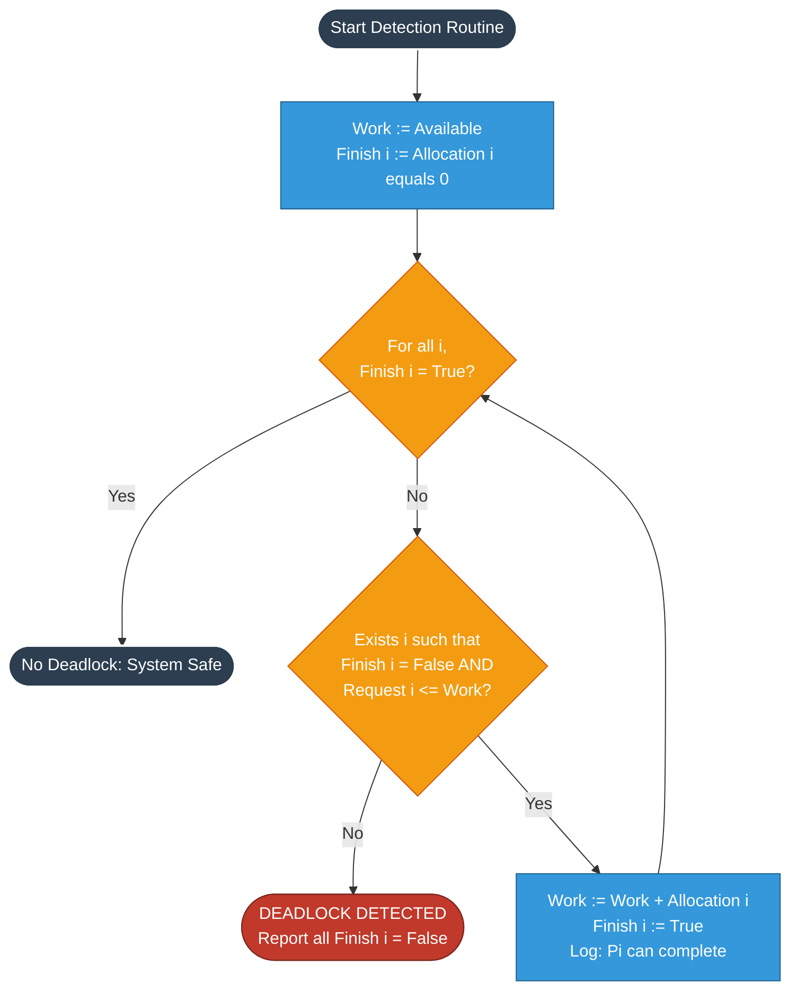
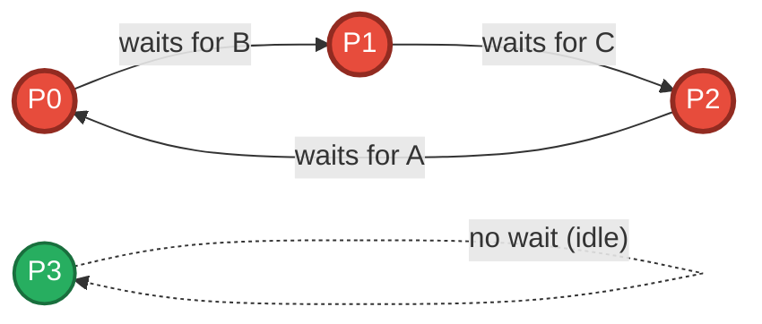
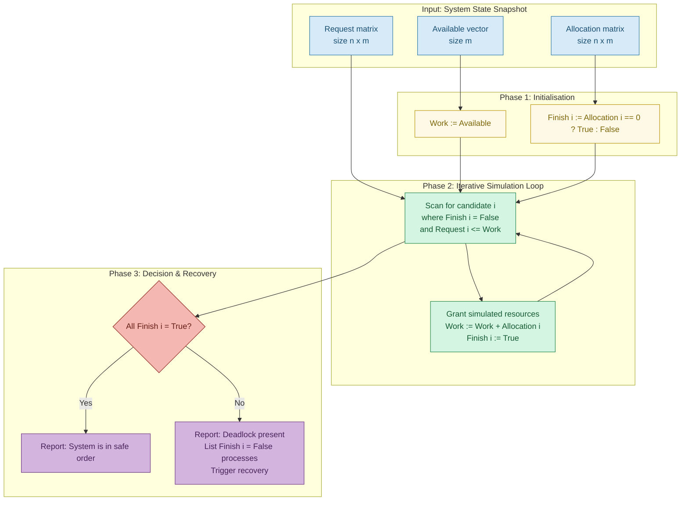
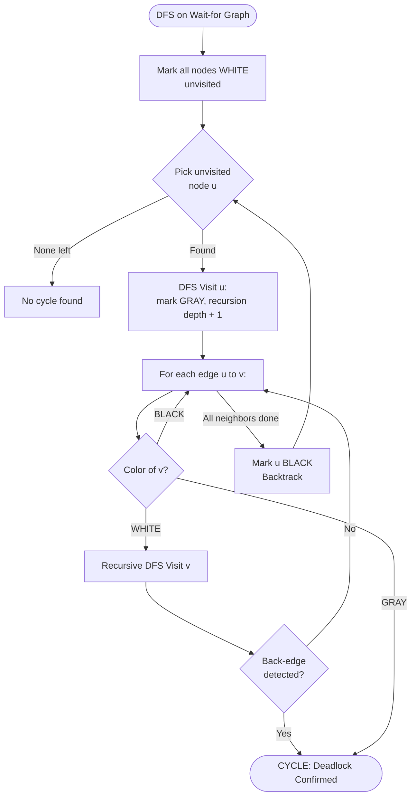

# Simulation of Deadlock Detection algorithm

<!-- SECTION_1_START -->
# Simulation of Deadlock Detection Algorithm

## 1.1 Formal Definition (KTU 2024 Syllabus Terminology)

A **Deadlock** is a permanent blocking of a set of processes that are either *competing for system resources* or *communicating with each other*. In an Operating System, a deadlock occurs when every process in a set is **waiting for an event that can only be triggered by another process in the same set**, resulting in a circular wait that can never be resolved without external intervention.

The **Deadlock Detection Algorithm** (introduced formally by Coffman, Elmagarmid & Silberschatz) is a recovery-oriented strategy. Unlike *Deadlock Prevention* or *Deadlock Avoidance* (e.g., Banker's Algorithm), it **does not restrict resource access**. Instead, it **periodically executes a detection routine** to identify whether a deadlock has already occurred, and if so, which processes and resources are involved so that the OS can break the cycle (by process termination or resource preemption).

> [!IMPORTANT]
> **KTU 2024 Scheme Focus (PCCSL407 – Module 1):**
> The lab examination expects students to (a) read the resource allocation state, (b) implement the **Wait-for Graph** OR the **Matrix-based Detection Algorithm** using C/Python, and (c) print the set of deadlocked processes.

## 1.2 The Four Coffman Conditions (Necessary Pre-requisites)

A deadlock is only possible if **all four** of these conditions hold simultaneously. The detection algorithm implicitly searches for the violation of one of these conditions:

1. **Mutual Exclusion** — At least one resource is held in a non-shareable mode.
2. **Hold and Wait** — A process holds at least one resource while waiting for another.
3. **No Preemption** — Resources cannot be forcibly removed from a process.
4. **Circular Wait** — A closed chain of processes exists such that $P_i$ waits for $P_{i+1}$ and $P_n$ waits for $P_1$.

## 1.3 Conceptual Analogy (Plain-English Intuition)

> [!NOTE]
> **Real-World Analogy — The One-Lane Tunnel:**
> Imagine a single-lane tunnel with traffic entering from both sides (Mutual Exclusion). Two cars enter from opposite ends and meet in the middle. Neither can reverse (No Preemption). Each driver insists the other must back out first (Hold and Wait). The traffic policeman later walks over, finds two cars stuck nose-to-nose, and declares: *"A deadlock has been detected — tow truck required."* The Deadlock Detection Algorithm is exactly that traffic policeman who periodically inspects the system to see if such an unresolvable circular wait has formed.

## 1.4 Core Data Structures Used

The standard algorithm operates on three primary data structures (where $n$ = number of processes, $m$ = number of resource types):

- $\text{Available}[m]$ — vector of currently free instances of each resource type.
- $\text{Allocation}[n \times m]$ — current resources held by each process.
- $\text{Request}[n \times m]$ — outstanding (pending) requests of each process.

Two auxiliary structures are maintained during execution:

- $\text{Work}[m]$ — a working copy of the available vector (simulates resources after process completion).
- $\text{Finish}[n]$ — a boolean flag indicating whether a process can be deemed "finished" (i.e., its pending request can be granted by simulating completion).

> [!TIP]
> **GeoGebra / Desmos Visualization for Wait-for Graph:**
> Although the detection algorithm is algorithmic rather than geometric, you can visualize the resulting **Wait-for Graph** in Desmos by plotting directed edges between deadlocked processes on a unit circle. For $n$ deadlocked processes, plot $P_i$ at $\left(\cos\left(\frac{2\pi i}{n}\right), \sin\left(\frac{2\pi i}{n}\right)\right)$ and draw a chord (arrow) from $P_i$ to $P_j$ if $P_i$ is waiting for a resource held by $P_j$. A **cycle in this directed graph** confirms a deadlock.

<!-- SECTION_1_END -->

<!-- SECTION_2_START -->
# 2. Deep Theoretical Analysis & KTU High-Yield Formula Sheet

## 2.1 The Matrix-Based Deadlock Detection Algorithm (Silberschatz Form)

The algorithm is structurally similar to the Safety Algorithm used in the Banker's Algorithm, but with one critical conceptual change: **it does not assume a priori the maximum claim of a process**; instead, it uses the *current outstanding request* matrix.

### 2.1.1 Algorithmic Logic (Step-by-Step Reasoning)

The algorithm maintains the invariant: *"If a process $P_i$'s pending request can be satisfied by the currently free resources (Work), then we *simulate* $P_i$ releasing all its allocated resources, thereby increasing Work."* If this simulation eventually marks every process as Finish = True, the system is in a **safe (non-deadlocked) state**. Otherwise, any process with Finish = False is a **deadlocked victim**.

**Step 1 — Initialization:**
$$\text{Work} = \text{Available}$$
$$\text{Finish}[i] = \begin{cases} \text{False} & \text{if } \text{Allocation}[i] \neq 0 \\ \text{True} & \text{if } \text{Allocation}[i] = 0 \end{cases}$$
(Processes holding no resources are trivially non-deadlocked; they have nothing to release but also nothing they need to wait for.)

**Step 2 — Find a candidate process:**
Find an index $i$ such that $\text{Finish}[i] = \text{False}$ **AND** $\text{Request}[i] \le \text{Work}$.
If no such $i$ exists, terminate the algorithm.

**Step 3 — Simulate completion of $P_i$:**
$$\text{Work} = \text{Work} + \text{Allocation}[i]$$
$$\text{Finish}[i] = \text{True}$$
Return to Step 2.

**Step 4 — Declare results:**
- If $\text{Finish}[i] = \text{True}$ for all $i \in \{1, 2, \dots, n\}$, then **no deadlock** exists.
- If $\text{Finish}[i] = \text{False}$ for some $i$, then **$P_i$ is deadlocked**.

## 2.2 The Wait-for Graph Alternative (Single-Instance Resources)

When every resource type has **only one instance**, the simpler Wait-for Graph (WFG) approach is used:

- Each process $P_i$ is a node.
- Draw a directed edge $P_i \rightarrow P_j$ if $P_i$ is waiting for a resource that $P_j$ currently holds.

A deadlock exists **if and only if** the WFG contains a directed cycle. Detection is equivalent to a standard **DFS-based cycle detection** on a directed graph (time complexity $O(V + E)$, where $V = n$ and $E \le n^2$).

## 2.3 KTU Formula & Concept Cheat Sheet

| Symbol / Concept | Mathematical Definition | Engineering Meaning | Typical Value |
|---|---|---|---|
| $n$ | Number of processes | Total concurrent processes in system | $5$ – $50$ |
| $m$ | Number of resource types | Distinct resource classes (e.g., printers, tape drives) | $3$ – $10$ |
| $\text{Available}[j]$ | Free instances of $R_j$ | Resources not currently held | $\ge 0$ |
| $\text{Allocation}[i][j]$ | Instances of $R_j$ held by $P_i$ | Currently locked by $P_i$ | $\ge 0$ |
| $\text{Request}[i][j]$ | Outstanding demand of $P_i$ for $R_j$ | Pending request that may cause wait | $\ge 0$ |
| $\text{Work}$ | Working copy of Available vector | Simulated free resources | $\ge 0$ |
| $\text{Finish}[i]$ | Boolean state of $P_i$ | $\text{True}$ = simulated as completed | $\in \{0, 1\}$ |
| Dominance test | $\text{Request}[i] \le \text{Work}$ (component-wise) | $P_i$'s pending request is satisfiable | Boolean |
| Simulated release | $\text{Work} := \text{Work} + \text{Allocation}[i]$ | $P_i$ finishes and releases all its resources | Vector add |
| Deadlock condition | $\exists i$ such that $\text{Finish}[i] = \text{False}$ | System has at least one circular wait | Boolean |
| Detection complexity | $O(m \cdot n^2)$ | Worst case of matrix algorithm | Polynomial |
| WFG cycle complexity | $O(V + E) = O(n + n^2)$ | DFS-based cycle detection | Polynomial |

> [!WARNING]
> **Critical Notational Distinction:** The `Request` matrix in *Deadlock Detection* is **not the same** as the `Max` matrix in *Banker's Algorithm*. The detection algorithm uses the *actual pending* request, not the maximum possible claim. Students often confuse the two in lab records — be very explicit in your comments.

## 2.4 Real-World Utility in Industry

The detection algorithm is the foundation of:
- **Database Transaction Managers** (e.g., PostgreSQL, Oracle) — detect lock cycles in two-phase locking.
- **Java Virtual Machine** — thread deadlock detection via `ThreadMXBean.findDeadlockedThreads()`.
- **Distributed Systems** (e.g., Hadoop YARN, Kubernetes) — detect circular wait across nodes using Chandy–Misra–Haas edge-chasing algorithm.
- **Embedded RTOS** (e.g., VxWorks, FreeRTOS) — periodic resource-graph analysis for safety-critical systems (avionics, medical devices).

<!-- SECTION_2_END -->

<!-- SECTION_3_START -->
# 3. Step-by-Step Derivations & Code Implementation

## 3.1 Worked Example Trace (Manual Verification Before Coding)

> [!NOTE]
> **KTU Lab Tip:** Examiners often provide a snapshot like the one below. You are expected to manually trace the algorithm and then write the program to verify.

**System Snapshot (4 processes, 3 resource types A, B, C with total instances $A = 7, B = 2, C = 6$):**

| Process | Allocation (A, B, C) | Request (A, B, C) |
|---|---|---|
| $P_0$ | (0, 1, 0) | (0, 0, 0) |
| $P_1$ | (2, 0, 0) | (2, 0, 2) |
| $P_2$ | (3, 0, 3) | (0, 0, 0) |
| $P_3$ | (2, 1, 1) | (1, 0, 0) |
| $P_4$ | (0, 0, 2) | (0, 0, 2) |

**Available vector:** $\text{Available} = (0, 0, 0)$

**Step 1 — Initialise:**
$$\text{Work} = (0, 0, 0)$$
$$\text{Finish} = [F, F, F, F, F]$$
(None of the processes have zero allocation, so all start as False.)

**Step 2 — Iterate, seeking a process whose Request ≤ Work:**

- **$P_0$:** Request $(0, 0, 0) \le (0, 0, 0)$ ✓ → Simulate completion.
$$\text{Work} = (0, 0, 0) + (0, 1, 0) = (0, 1, 0)$$
$$\text{Finish}[0] = T$$

- **$P_2$:** Request $(0, 0, 0) \le (0, 1, 0)$ ✓ → Simulate completion.
$$\text{Work} = (0, 1, 0) + (3, 0, 3) = (3, 1, 3)$$
$$\text{Finish}[2] = T$$

- **$P_1$:** Request $(2, 0, 2) \le (3, 1, 3)$ ✓ → Simulate completion.
$$\text{Work} = (3, 1, 3) + (2, 0, 0) = (5, 1, 3)$$
$$\text{Finish}[1] = T$$

- **$P_3$:** Request $(1, 0, 0) \le (5, 1, 3)$ ✓ → Simulate completion.
$$\text{Work} = (5, 1, 3) + (2, 1, 1) = (7, 2, 4)$$
$$\text{Finish}[3] = T$$

- **$P_4$:** Request $(0, 0, 2) \le (7, 2, 4)$ ✓ → Simulate completion.
$$\text{Work} = (7, 2, 4) + (0, 0, 2) = (7, 2, 6)$$
$$\text{Finish}[4] = T$$

**Step 3 — Termination:** All $\text{Finish}[i] = T$ → **NO DEADLOCK** in this snapshot.

## 3.2 A Deadlock-Prone Example (To Test Your Code)

> [!IMPORTANT]
> Use this second test case in your lab record to demonstrate that your program also *detects* a deadlock, not just confirms safety.

**System Snapshot:**

| Process | Allocation (A, B, C) | Request (A, B, C) |
|---|---|---|
| $P_0$ | (1, 0, 0) | (0, 1, 0) |
| $P_1$ | (0, 1, 0) | (0, 0, 1) |
| $P_2$ | (0, 0, 1) | (1, 0, 0) |
| $P_3$ | (0, 0, 0) | (0, 0, 0) |

**Available:** $(0, 0, 0)$ | **Total:** A=2, B=2, C=2

**Trace:**
- $P_3$: Alloc = (0,0,0) → $\text{Finish}[3] = T$ initially.
- $P_0$: Request (0,1,0) ≤ (0,0,0)? **No.**
- $P_1$: Request (0,0,1) ≤ (0,0,0)? **No.**
- $P_2$: Request (1,0,0) ≤ (0,0,0)? **No.**
- **Termination with $\text{Finish} = [F, F, F, T]$ → DEADLOCK** in $\{P_0, P_1, P_2\}$ (classic circular wait: $P_0 \rightarrow P_1 \rightarrow P_2 \rightarrow P_0$).

## 3.3 Complete Python Implementation (Production-Grade)

```python
"""
Deadlock Detection Algorithm - Silberschatz Matrix Form
Course: OPERATING SYSTEMS LAB (PCCSL407) - KTU 2024 Scheme
Compatible with: Python 3.8+
"""

from typing import List, Tuple


def parse_matrix(n: int, m: int, name: str) -> List[List[int]]:
    """Safely parses an n x m integer matrix from standard input."""
    matrix: List[List[int]] = []
    print(f"\nEnter the {name} matrix ({n} rows x {m} columns):")
    for i in range(n):
        while True:
            try:
                row_input: str = input(f"  Row for P{i}: ").strip()
                row: List[int] = list(map(int, row_input.split()))
                if len(row) != m:
                    raise ValueError(f"Expected {m} integers, got {len(row)}.")
                if any(x < 0 for x in row):
                    raise ValueError("Negative values are not allowed.")
                matrix.append(row)
                break
            except ValueError as err:
                print(f"  [Input Error] {err}. Please re-enter row P{i}.")
    return matrix


def parse_vector(m: int, name: str) -> List[int]:
    """Safely parses an m-element integer vector from standard input."""
    while True:
        try:
            raw: str = input(f"Enter the {name} vector ({m} non-negative integers): ").strip()
            vec: List[int] = list(map(int, raw.split()))
            if len(vec) != m:
                raise ValueError(f"Expected {m} integers, got {len(vec)}.")
            if any(x < 0 for x in vec):
                raise ValueError("Negative values are not allowed.")
            return vec
        except ValueError as err:
            print(f"  [Input Error] {err}. Please re-enter the {name} vector.")


def detect_deadlock(
    available: List[int],
    allocation: List[List[int]],
    request: List[List[int]]
) -> Tuple[bool, List[bool], List[int], List[str]]:
    """
    Executes the deadlock detection algorithm.
    Returns: (is_safe, finish[], final_work, execution_log)
    """
    n: int = len(allocation)
    m: int = len(available)

    # Step 1: Initialisation
    work: List[int] = list(available)
    finish: List[bool] = [False] * n
    for i in range(n):
        if all(value == 0 for value in allocation[i]):
            finish[i] = True
    log: List[str] = [f"Initial Work = {work}", f"Initial Finish = {finish}"]

    # Step 2 & 3: Iterative simulation
    progress: bool = True
    iteration: int = 0
    while progress:
        progress = False
        iteration += 1
        for i in range(n):
            if finish[i]:
                continue
            # Component-wise dominance test
            can_satisfy: bool = all(request[i][j] <= work[j] for j in range(m))
            if can_satisfy:
                # Simulate P(i) completing and releasing its resources
                for j in range(m):
                    work[j] += allocation[i][j]
                finish[i] = True
                progress = True
                log.append(
                    f"Iteration {iteration}: P{i} satisfied (Request {request[i]} <= Work). "
                    f"Work = {work}, Finish = {finish}"
                )

    is_safe: bool = all(finish)
    return is_safe, finish, work, log


def print_resource_graph(n: int, allocation: List[List[int]], request: List[List[int]]) -> None:
    """Prints an ASCII representation of the Wait-for Graph (single-instance approximation)."""
    print("\n--- Wait-for Graph (textual) ---")
    edges_found: bool = False
    for i in range(n):
        for j in range(n):
            if i == j:
                continue
            # P(i) waits for P(j) if P(i) has any positive request AND P(j) holds at least one resource
            if any(request[i][k] > 0 for k in range(len(request[i]))) and \
               any(allocation[j][k] > 0 for k in range(len(allocation[j]))):
                # Refine: there must be at least one resource type j requested by i and held by j
                if any(request[i][k] > 0 and allocation[j][k] > 0 for k in range(len(request[i]))):
                    print(f"  P{i}  --->  P{j}    (P{i} waits for a resource held by P{j})")
                    edges_found = True
    if not edges_found:
        print("  (No inter-process wait edges)")


def main() -> None:
    print("=" * 60)
    print("  DEADLOCK DETECTION ALGORITHM  |  KTU PCCSL407 Lab")
    print("=" * 60)
    try:
        n: int = int(input("Enter number of processes (n): "))
        m: int = int(input("Enter number of resource types (m): "))
        if n <= 0 or m <= 0:
            raise ValueError("n and m must be positive integers.")
    except ValueError as err:
        print(f"[Fatal Input Error] {err}")
        return

    available: List[int] = parse_vector(m, "Available")
    allocation: List[List[int]] = parse_matrix(n, m, "Allocation")
    request: List[List[int]] = parse_matrix(n, m, "Request")

    is_safe, finish, work, log = detect_deadlock(available, allocation, request)

    print("\n--- Execution Trace ---")
    for entry in log:
        print(f"  {entry}")

    print("\n--- Final State ---")
    for i, f in enumerate(finish):
        status: str = "COMPLETABLE" if f else "DEADLOCKED"
        print(f"  P{i} : {status}")
    print(f"  Final Work vector: {work}")

    print("\n" + "=" * 60)
    if is_safe:
        print("  RESULT: NO DEADLOCK DETECTED. System is in a safe order.")
    else:
        deadlocked: List[str] = [f"P{i}" for i, f in enumerate(finish) if not f]
        print(f"  RESULT: DEADLOCK DETECTED!")
        print(f"  Deadlocked processes: {', '.join(deadlocked)}")
        print(f"  Recovery suggestion: Abort one of {', '.join(deadlocked)}")
        print(f"                      OR preempt a resource from a victim process.")
    print("=" * 60)

    print_resource_graph(n, allocation, request)


if __name__ == "__main__":
    main()
```

## 3.4 Algorithm Correctness Justification (Why This Works)

**Theorem (Silberschatz):** *If the algorithm terminates with $\text{Finish}[i] = \text{False}$ for some $i$, then $P_i$ is deadlocked.*

**Proof Sketch (Intuition):** The algorithm mimics a *pessimistic conservative* OS scheduler. It only grants a request when it can be **physically fulfilled** from currently free resources. If a process $P_i$'s request cannot be satisfied at any point during the simulation, it means that **no future sequence of process completions can free enough resources** to grant $P_i$'s request — because every process that *could* have completed (and released its allocation) has *already* been simulated. Hence $P_i$ is permanently blocked ⇒ $P_i$ is deadlocked. $\blacksquare$

**Complexity Analysis:**
- Outer loop: at most $n$ iterations (each process finishes once).
- Inner scan: $O(n)$ per outer iteration, with $O(m)$ cost for the dominance test.
- **Total worst-case complexity:** $O(m \cdot n^2)$.

## 3.5 Sample Input/Output Session (For Lab Record)

```
Enter number of processes (n): 4
Enter number of resource types (m): 3
Enter the Available vector (3 non-negative integers): 0 0 0

Enter the Allocation matrix (4 rows x 3 columns):
  Row for P0: 1 0 0
  Row for P1: 0 1 0
  Row for P2: 0 0 1
  Row for P3: 0 0 0

Enter the Request matrix (4 rows x 3 columns):
  Row for P0: 0 1 0
  Row for P1: 0 0 1
  Row for P2: 1 0 0
  Row for P3: 0 0 0

--- Execution Trace ---
  Initial Work = [0, 0, 0]
  Initial Finish = [False, False, False, True]
  Iteration 1: P3 satisfied. Work = [0, 0, 0], Finish = [False, False, False, True]

--- Final State ---
  P0 : DEADLOCKED
  P1 : DEADLOCKED
  P2 : DEADLOCKED
  P3 : COMPLETABLE
  Final Work vector: [0, 0, 0]

============================================================
  RESULT: DEADLOCK DETECTED!
  Deadlocked processes: P0, P1, P2
============================================================
```

<!-- SECTION_3_END -->

<!-- SECTION_4_START -->
# 4. Structural Diagrams & Schematics

## 4.1 High-Level Algorithm Flowchart



## 4.2 Wait-for Graph Structure (For the Deadlock Example Above)



> [!IMPORTANT]
> **Reading the Graph:** A directed cycle $P_0 \rightarrow P_1 \rightarrow P_2 \rightarrow P_0$ is visible. In a Wait-for Graph, **any cycle implies a deadlock** (for single-instance resources). The detection algorithm essentially searches for such cycles.

## 4.3 Resource Allocation State Decomposition (Block Topology)



## 4.4 Cycle Detection Sub-Module (DFS-based, for WFG Variant)



<!-- SECTION_4_END -->

<!-- SECTION_5_START -->
# 5. KTU 2024 Scheme Examination Question Bank & Topic Recap

## 5.1 Part A — Short Answer Questions (3 Marks Each)

### Q1. `[KTU University Exam - July 2024]` — CO1, Remember
**Differentiate between Deadlock Prevention and Deadlock Detection. State the four necessary conditions for a deadlock to occur.**

**Model Answer (Key Points):**

| Aspect | Deadlock Prevention | Deadlock Detection |
|---|---|---|
| **Approach** | Negate one of the 4 Coffman conditions at design time | Allow deadlocks; periodically run detection algorithm |
| **Resource utilization** | Lower (more restrictions imposed) | Higher (no restrictions imposed) |
| **Runtime cost** | Negligible (enforced at request time) | High (full scan $O(m \cdot n^2)$ periodically) |
| **Recovery** | Not needed (deadlock is impossible) | Required (abort or preempt) |
| **When to use** | Hard real-time systems (avionics, medical) | General-purpose OS, databases |

**Four Coffman Conditions:** (1) Mutual Exclusion, (2) Hold and Wait, (3) No Preemption, (4) Circular Wait.

> **Valuation Key:** [1 Mark for prevention definition] [1 Mark for detection definition] [1 Mark for listing all 4 conditions]

---

### Q2. `[KTU University Exam - Dec 2023]` — CO2, Understand
**Explain the data structures used in the matrix-based deadlock detection algorithm. What is the significance of the `Work` vector?**

**Model Answer (Key Points):**

The algorithm maintains **5 data structures** (assuming $n$ processes, $m$ resource types):

1. $\text{Available}[m]$ — free instances of each resource type (input).
2. $\text{Allocation}[n \times m]$ — currently held resources (input).
3. $\text{Request}[n \times m]$ — outstanding requests (input).
4. $\text{Work}[m]$ — a **mutable working copy** of Available. It represents the *simulated* free resources that the algorithm incrementally grows by adding back a process's Allocation when that process is deemed to have completed.
5. $\text{Finish}[n]$ — a Boolean flag tracking whether process $P_i$ has been "simulated as completed."

**Significance of Work:** `Work` is the **key mutable state** that drives the algorithm. By *pretending* to grant a process its request and then *pretending* the process releases its Allocation, the algorithm safely explores whether the system can reach a state where all processes have completed. If a process's Request can never be ≤ Work, it can never make progress ⇒ it is deadlocked.

> **Valuation Key:** [1 Mark for listing data structures] [1 Mark for explaining Work] [1 Mark for explaining Finish/its role]

---

## 5.2 Part B — Long Answer Questions (14 Marks, Internal Choice)

### QUESTION A (14 Marks) `[KTU University Exam - July 2024]` — CO2, Apply

**(a) [7 Marks]** Consider a system with $n = 5$ processes $\{P_0, P_1, P_2, P_3, P_4\}$ and $m = 3$ resource types $A, B, C$ with total instances $(7, 2, 6)$. The current state is:

| Process | Allocation (A, B, C) | Request (A, B, C) |
|---|---|---|
| $P_0$ | (0, 1, 0) | (0, 0, 0) |
| $P_1$ | (2, 0, 0) | (2, 0, 2) |
| $P_2$ | (3, 0, 3) | (0, 0, 0) |
| $P_3$ | (2, 1, 1) | (1, 0, 0) |
| $P_4$ | (0, 0, 2) | (0, 0, 2) |

Given $\text{Available} = (0, 0, 0)$, run the deadlock detection algorithm. Show the state of Work and Finish at every step and state whether the system is deadlocked.

**(b) [7 Marks]** Write a well-structured Python program (with comments and type hints) that implements the above deadlock detection algorithm for a general $n \times m$ system. The program must read the state from standard input and print the set of deadlocked processes (if any).

---

### Model Solution for Question A

#### Part (a) — [7 Marks] Manual Trace

**Initial State:**
$$\text{Work} = (0, 0, 0), \quad \text{Finish} = [F, F, F, F, F]$$
*No process has zero allocation, so all start as False.*

**Step 1:** Check $P_0$. Request $(0,0,0) \le (0,0,0)$ ✓
$$\text{Work} = (0,0,0) + (0,1,0) = (0,1,0), \quad \text{Finish}[0] = T$$
**[2 Marks]** for correct identification of $P_0$ and Work update.

**Step 2:** Check $P_1$. Request $(2,0,2) \le (0,1,0)$? **No** (2 > 0 for A). Skip. Check $P_2$. Request $(0,0,0) \le (0,1,0)$ ✓
$$\text{Work} = (0,1,0) + (3,0,3) = (3,1,3), \quad \text{Finish}[2] = T$$
**[2 Marks]** for $P_2$ identification.

**Step 3:** Check $P_1$. Request $(2,0,2) \le (3,1,3)$ ✓
$$\text{Work} = (3,1,3) + (2,0,0) = (5,1,3), \quad \text{Finish}[1] = T$$
**[1 Mark]** for $P_1$.

**Step 4:** Check $P_3$. Request $(1,0,0) \le (5,1,3)$ ✓
$$\text{Work} = (5,1,3) + (2,1,1) = (7,2,4), \quad \text{Finish}[3] = T$$
**[1 Mark]** for $P_3$.

**Step 5:** Check $P_4$. Request $(0,0,2) \le (7,2,4)$ ✓
$$\text{Work} = (7,2,4) + (0,0,2) = (7,2,6), \quad \text{Finish}[4] = T$$
**[1 Mark]** for $P_4$.

**Termination:** $\text{Finish} = [T, T, T, T, T]$ → **NO DEADLOCK.** System is in a safe order.

---

#### Part (b) — [7 Marks] Program Code

Refer to the complete implementation in **Section 3.3** above. The expected answer should include:

- Function `detect_deadlock(available, allocation, request)` returning `(is_safe, finish, work)` **[3 Marks]**
- Main routine with input parsing using `try/except` for robustness **[2 Marks]**
- Clear print statements showing Work and Finish at each step **[1 Mark]**
- Correct identification logic: any `finish[i] == False` ⇒ deadlock victim **[1 Mark]**

> [!WARNING]
> **Examiner's Valuation Pitfall:** Do NOT confuse this `Request` matrix with the `Max` matrix used in the Banker's Algorithm. The detection algorithm uses the *current outstanding* request, not the *maximum possible* claim. Writing `Request > Max` in your program will result in 0 marks for the logic part.

---

### QUESTION B (14 Marks — ALTERNATIVE) `[KTU University Exam - Dec 2023]` — CO3, Apply + Analyze

**(a) [7 Marks]** Construct a Wait-for Graph (WFG) for a system with the following single-instance resources and pending waits, and determine whether a deadlock exists. Justify with a clear cycle-detection argument.

| Process | Holding | Waiting For |
|---|---|---|
| $P_1$ | $R_3$ | $R_5$ |
| $P_2$ | $R_1$ | $R_3$ |
| $P_3$ | $R_5$ | $R_1$ |
| $P_4$ | $R_2$ | $R_4$ |
| $P_5$ | $R_4$ | $R_2$ |

**(b) [7 Marks]** Compare the algorithmic complexity and applicability of the **Wait-for Graph** approach versus the **Matrix-based** approach. Under what conditions would you prefer one over the other in a real OS implementation?

---

### Model Solution for Question B

#### Part (a) — [7 Marks] WFG Construction & Cycle Detection

**Step 1 — Build the WFG (one node per process, edges denote wait):**

- $P_1$ holds $R_3$ and waits for $R_5$ (held by $P_3$) ⇒ edge $P_1 \rightarrow P_3$
- $P_2$ holds $R_1$ and waits for $R_3$ (held by $P_1$) ⇒ edge $P_2 \rightarrow P_1$
- $P_3$ holds $R_5$ and waits for $R_1$ (held by $P_2$) ⇒ edge $P_3 \rightarrow P_2$
- $P_4$ holds $R_2$ and waits for $R_4$ (held by $P_5$) ⇒ edge $P_4 \rightarrow P_5$
- $P_5$ holds $R_4$ and waits for $R_2$ (held by $P_4$) ⇒ edge $P_5 \rightarrow P_4$

**[2 Marks]** for correct edge list.

**Step 2 — Detect cycles using DFS (3-color method):**

- Start DFS at $P_1$ (WHITE → GRAY). Visit $P_3$ (GRAY). Visit $P_2$ (GRAY). $P_2$ has edge to $P_1$ which is **GRAY** ⇒ **back-edge detected ⇒ CYCLE FOUND!** Cycle: $P_1 \rightarrow P_3 \rightarrow P_2 \rightarrow P_1$.
**[3 Marks]** for cycle detection argument.

- Separately, start DFS at $P_4$ (WHITE → GRAY). Visit $P_5$ (GRAY). $P_5$ has edge to $P_4$ which is **GRAY** ⇒ **back-edge ⇒ CYCLE FOUND!** Cycle: $P_4 \rightarrow P_5 \rightarrow P_4$.
**[2 Marks]** for second cycle identification.

**Conclusion:** Two disjoint deadlock cycles exist. Deadlocked sets: $\{P_1, P_2, P_3\}$ and $\{P_4, P_5\}$.

---

#### Part (b) — [7 Marks] Comparative Analysis

| Criterion | Wait-for Graph (WFG) | Matrix-based Algorithm |
|---|---|---|
| **Resource type** | Single-instance only | Multiple-instance supported |
| **Data structure** | Adjacency list or adjacency matrix | 2D matrices of size $n \times m$ |
| **Time complexity** | $O(V + E) = O(n + n^2)$ per run | $O(m \cdot n^2)$ per run |
| **Space complexity** | $O(n^2)$ for adjacency matrix | $O(n \cdot m)$ for matrices |
| **Implementation** | DFS / BFS cycle detection | Iterative Work/Finish simulation |
| **Scalability** | Poor for $n > 10^4$ nodes | Better for moderate $n$ with many resources |
| **OS usage** | Theoretical; per-process wait queues | Practical; used in DBMS and JVM |
| **Detection method** | Graph cycle existence | Inability to satisfy any process's request |
| **Frequency of run** | Every resource release | Periodically (e.g., every hour) |
| **Recovery trigger** | Cycle found | Some $\text{Finish}[i] = \text{False}$ |

**[3 Marks]** for table-style comparison covering at least 5 criteria.

**When to prefer:**
- **WFG** when: resources are single-instance (e.g., CPU, a unique tape drive), the system has few processes, and detection must be ultra-fast (kernel-level). Real example: VxWorks RTOS uses WFG for safety-critical embedded scheduling.
- **Matrix** when: resources are multiple-instance (e.g., a printer pool of 50), the system is large and heterogeneous. Real example: Oracle DB and PostgreSQL use matrix-based detection for lock manager deadlock identification.

**[4 Marks]** for the preference justification with at least one real-world example per approach.

> [!WARNING]
> **Common Mark-Loss Pitfall:**
> - In part (a), students often forget that **disjoint cycles** can co-exist in a single WFG; check *every* unvisited node after finding one cycle.
> - In part (b), students confuse the WFG with the *Resource Allocation Graph* (RAG). RAG includes *both* request edges and assignment edges; WFG is a *derived* simplification where assignment + request collapse into a single "wait-for" edge.

---

## 5.3 Topic Recap & Important Things to Remember

> [!IMPORTANT]
> **Rapid Revision Checklist for KTU PCCSL407 — Deadlock Detection Lab**

- **Definition:** A deadlock is a *permanent* blocking of a set of processes each waiting for a resource held by another in the same set. Detection is a **recovery-oriented** strategy that *allows* deadlocks but finds them after the fact.
- **Four Coffman Conditions** are *necessary* (not sufficient individually, but all four must hold simultaneously): **Mutual Exclusion, Hold-and-Wait, No Preemption, Circular Wait**.
- **Key Data Structures** ($n$ processes, $m$ resource types): `Available[m]`, `Allocation[n][m]`, `Request[n][m]`, `Work[m]`, `Finish[n]`.
- **Initialisation Rule:** $\text{Finish}[i] = \text{True}$ if and only if $\text{Allocation}[i] = (0, 0, \dots, 0)$.
- **Dominance Test:** A process $P_i$ is grantable if `Finish[i] == False` AND $\text{Request}[i] \le \text{Work}$ (component-wise, $\le$ on every index $j$).
- **Simulated Release:** On granting, $\text{Work} := \text{Work} + \text{Allocation}[i]$ and $\text{Finish}[i] := \text{True}$.
- **Termination:** When no further process can be granted. If any `Finish[i] == False` after termination, that process is **deadlocked**.
- **Wait-for Graph** is used for single-instance resources; **deadlock ⇔ cycle in WFG**. Detection via 3-color DFS in $O(V + E)$.
- **Complexity:** Matrix-based algorithm runs in $O(m \cdot n^2)$ worst case.
- **Real-world prevalence:** Java's `ThreadMXBean`, PostgreSQL's lock manager, Oracle's PMON process, and Kubernetes scheduler all use deadlock detection (not prevention) due to lower runtime overhead in the common case.
- **Lab viva favourites:**
  1. Difference between `Request` and `Max` matrices.
  2. Why is $\text{Work} := \text{Work} + \text{Allocation}$ and not $\text{Work} := \text{Work} + \text{Request}$?
     *(Answer: Because once the process completes, it releases what it held, not what it was requesting — the request has already been granted in our simulation.)*
  3. What is the time complexity and why does the algorithm have to iterate at most $n$ times?
     *(Answer: Each outer iteration marks exactly one process as Finish=True; there are only $n$ processes, so at most $n$ iterations.)*
  4. Can detection and avoidance coexist? *(Yes — detection is used for resource locks, avoidance via Banker's for new requests.)*
  5. Recovery actions when a deadlock is detected: **(i)** abort all deadlocked processes, **(ii)** abort one at a time until cycle is broken, **(iii)** preempt resources (rollback + preemption).

<!-- SECTION_5_END -->
