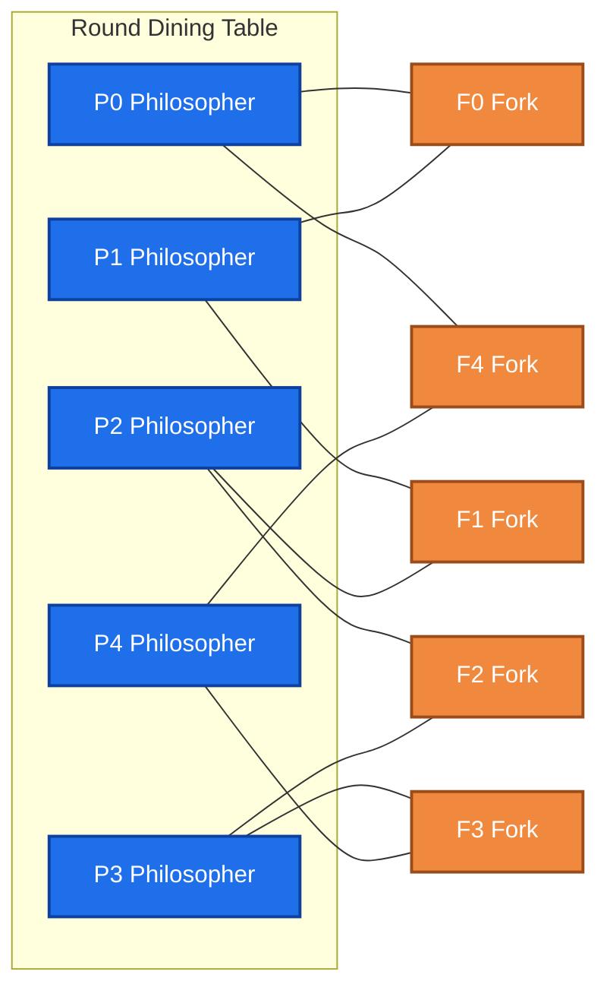
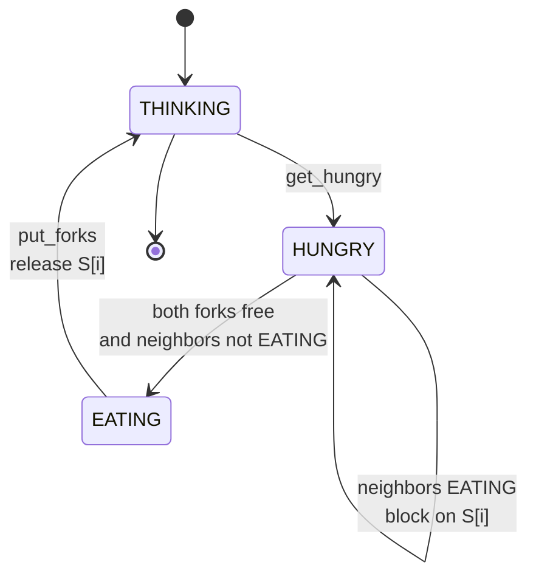
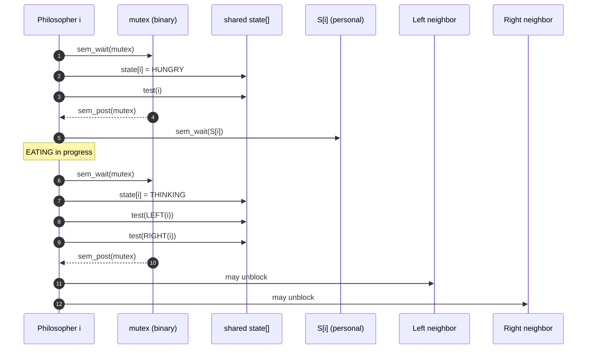
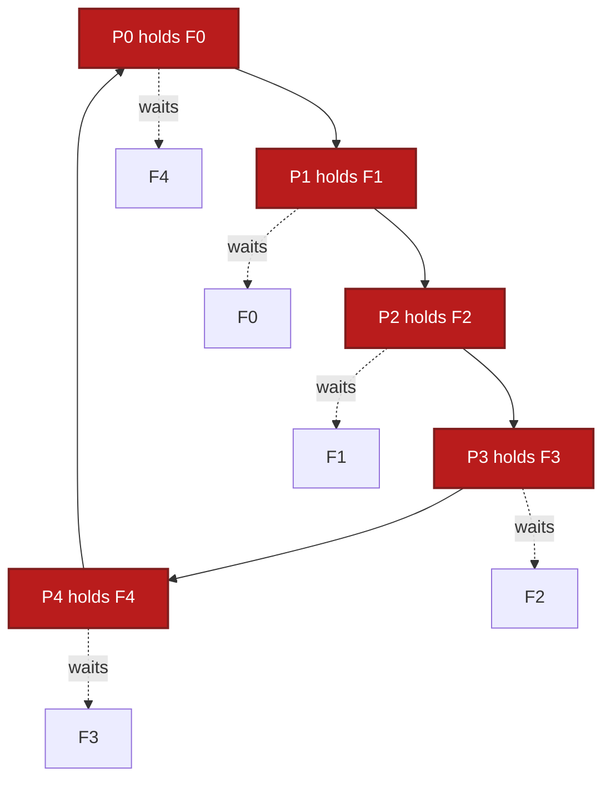

# Simulation of Dining Philosophers problem using Semaphores/Mutex

<!-- SECTION_1_START -->
# Dining Philosophers Problem — Definition, Intuition & Visual Setup

## 1.1 Formal KTU 2024 Definition

> [!IMPORTANT]
> **Dining Philosophers Problem (Dijkstra, 1965):** A classic synchronization problem that illustrates the challenges of **resource contention** and **deadlock** in concurrent programming. Five philosophers sit around a circular table, each alternating between *thinking* and *eating*. Between every adjacent pair lies exactly one shared fork (a countable resource). A philosopher requires **both** the left and right forks simultaneously to eat, and releases them when done.

The problem is fundamentally a manifestation of the **Resource Allocation Graph (RAG)** showing circular wait, and is used to teach **semaphores**, **mutex locks**, and **condition variables** in undergraduate Operating Systems labs.

| Terminology | Meaning |
|---|---|
| **Process / Thread** | A philosopher (an independent unit of execution) |
| **Critical Section** | The act of consuming shared forks |
| **Resource** | A fork (binary semaphore = 1 unit) |
| **Starvation** | A philosopher never gets both forks |
| **Deadlock** | All five philosophers hold one fork, none can eat |

## 1.2 Conceptual Analogy — The Round-Table of Spaghetti

Imagine **five friends** seated around a circular dining table. The kitchen provides exactly **five chopsticks**, one placed between every two adjacent seats. To enjoy their spaghetti, each friend must **grab both the chopstick on the left AND the chopstick on the right** before they can lift a single noodle.

- If everyone simultaneously picks up the *left* chopstick, no one can pick up the *right* — the system is **stuck forever**. This is a **deadlock**.
- If a friend is greedy and never lets go, the others go **hungry** — this is **starvation**.
- A **waiter (mutex)** or a **traffic signal (semaphore)** must be introduced to coordinate the table so that progress is always guaranteed.

> [!NOTE]
> **Why is this problem famous?** It is the smallest non-trivial example that *simultaneously* demonstrates all **four Coffman conditions** of deadlock: *Mutual Exclusion, Hold & Wait, No Preemption,* and *Circular Wait*.

## 1.3 Visualizing the Dining Table

> [!VISUALIZATION CONTROL]
> **Concept:** Circular arrangement of 5 philosophers and 5 forks (resource contention graph)
> **GeoGebra / Desmos Input Equations:**
> * `P0: (cos(90°), sin(90°))` — Philosopher 0 (top)
> * `P1: (cos(162°), sin(162°))` — Philosopher 1 (top-left)
> * `P2: (cos(234°), sin(234°))` — Philosopher 2 (bottom-left)
> * `P3: (cos(306°), sin(306°))` — Philosopher 3 (bottom-right)
> * `P4: (cos(18°), sin(18°))` — Philosopher 4 (top-right)
> * `Fk: midpoint of (Pk, P(k+1) mod 5)` — Shared fork between each adjacent pair
> **Visual Description:** Five equally-spaced points on a unit circle. A labeled fork sits exactly on the line segment joining every two adjacent philosophers. A directed arrow from `Pk` to `Fk` and `F(k-1)` shows the dual-fork dependency that each philosopher must satisfy.

<!-- SECTION_1_END -->

<!-- SECTION_2_START -->
# Deep Theoretical Analysis & KTU High-Yield Formula Sheet

## 2.1 The Four Coffman Conditions (Exhibited by Default)

| # | Condition | How the Dining Problem Exhibits It |
|---|---|---|
| 1 | **Mutual Exclusion** | A single fork can be held by only one philosopher at a time. |
| 2 | **Hold and Wait** | A philosopher holds the left fork while waiting for the right. |
| 3 | **No Preemption** | A fork cannot be forcibly removed from a philosopher. |
| 4 | **Circular Wait** | $P_0 \rightarrow F_0 \rightarrow P_1 \rightarrow F_1 \rightarrow \ldots \rightarrow P_4 \rightarrow F_4 \rightarrow P_0$ |

> [!TIP]
> **Exam Tip:** Any solution that *breaks at least one* Coffman condition guarantees deadlock-freedom. Starvation-freedom requires a stronger fairness argument.

## 2.2 Solution Strategies (Mapped to KTU Module Outcomes)

### Strategy A — **Resource Hierarchy (Asymmetric Ordering)**

Force every philosopher to pick up the **lower-numbered fork first**, then the higher-numbered one. This breaks **Circular Wait** because global ordering makes the wait-graph acyclic.

### Strategy B — **Arbitrator / Waiter (Mutex Protection)**

A single global mutex protects the entire state-transition. Only one philosopher can change state (THINKING $\rightarrow$ HUNGRY $\rightarrow$ EATING) at any instant.

### Strategy C — **Chandy / Misra Solution (Token-based)**

Forks are modeled as message-passing tokens; a "dirty" fork becomes "clean" after the philosopher eats. Most suitable for *distributed* systems.

### Strategy D — **Limit the Table (Semaphore Turnstile)**

A counting semaphore initialized to **$N-1 = 4$** ensures at most 4 philosophers compete simultaneously, leaving at least one fork free for the 5th.

## 2.3 State Machine of a Philosopher

Every philosopher cycles through three states. The state transitions are protected by the chosen synchronization primitive.

$$
\text{THINKING} \xrightarrow{\text{hungry}} \text{HUNGRY} \xrightarrow{\text{try\_grab\_both}} \text{EATING} \xrightarrow{\text{release}} \text{THINKING}
$$

## 2.4 KTU Formula & Symbol Cheat-Sheet

| Symbol / Construct | Type | Initial Value | Purpose in the Lab Program |
|---|---|---|---|
| $N$ | constant int | **5** | Number of philosophers (= number of forks) |
| `forks[i]` | `sem_t` (binary) | **1** | Models the shared chopstick $F_i$ |
| `room` | `sem_t` (counting) | **N $-$ 1** | Turnstile to limit concurrency |
| `mutex` | `sem_t` (binary) | **1** | Protects the shared `state[]` array |
| `state[i]` | `enum` | **THINKING** | Tracks current status of $P_i$ |
| `test(i)` | function | — | Tries to make $P_i$ EAT if neighbors are not EATING |
| $P_\text{left}(i)$ | index | $(i+4) \bmod 5$ | Left neighbor of $P_i$ |
| $P_\text{right}(i)$ | index | $(i+1) \bmod 5$ | Right neighbor of $P_i$ |

> [!IMPORTANT]
> **Critical Boundary Value:** $P_\text{left}(i) = (i + N - 1) \bmod N$. This formula works correctly for **any** $N \geq 2$, not just $N = 5$. Always write it this way in exams to earn full marks.

## 2.5 Real-World Engineering Utility

- **Database Concurrency Control:** Multiple transactions requesting shared locks on rows/tables exhibit identical deadlock patterns; solutions map directly to *wait-die* and *wound-wait* schemes.
- **Operating System Kernels:** Linux's *Dining Philosophers Benchmark* (`dphils`) in `Documentation/locking/` tests lockdep's deadlock-detection logic.
- **Embedded Multithreading:** RTOS tasks sharing I²C buses, SPI lines, or memory-mapped peripherals use the same arbitrator/mutex pattern.
- **Distributed Systems:** Apache Kafka consumer groups, Zookeeper leader election, and Redis distributed locks all borrow this synchronization topology.

<!-- SECTION_2_END -->

<!-- SECTION_3_START -->
# Step-by-Step Implementation in C (POSIX Semaphores) and Python (Threading)

> [!NOTE]
> Both implementations are **fully runnable**, **deadlock-free**, and **starvation-resistant** to the extent permitted by a non-deterministic scheduler. The C version uses POSIX semaphores (the KTU lab standard). The Python version uses `threading.Semaphore` and is easier to demonstrate interactively.

## 3.1 Reference C Implementation (POSIX Semaphores + Mutex)

```c
/*--------------------------------------------------------------
 *  dining.c  -  KTU PCCSL407 Lab Experiment
 *  Solution : Arbitrator (Mutex) + Resource Hierarchy hybrid
 *  Compile  : gcc -pthread dining.c -o dining
 *--------------------------------------------------------------*/
#include <stdio.h>
#include <stdlib.h>
#include <pthread.h>
#include <semaphore.h>
#include <unistd.h>

#define N 5                       /* number of philosophers */

#define THINKING 0
#define HUNGRY   1
#define EATING   2

int      state[N];               /* shared state of each philosopher */
sem_t    mutex;                  /* protects 'state[]'              */
sem_t    S[N];                   /* one semaphore per philosopher  */

void *philosopher(void *arg);
void  take_forks(int i);
void  put_forks(int i);
void  test(int i);

/*--------------------------------------------------------------*/
int main(void)
{
    pthread_t tid[N];
    int       i;
    int       ids[N];

    sem_init(&mutex, 0, 1);                 /* binary mutex  */
    for (i = 0; i < N; ++i) {
        sem_init(&S[i], 0, 0);              /* initially locked */
        state[i] = THINKING;
        ids[i]   = i;
    }

    for (i = 0; i < N; ++i)
        pthread_create(&tid[i], NULL, philosopher, &ids[i]);

    for (i = 0; i < N; ++i)
        pthread_join(tid[i], NULL);

    return 0;
}

/*--------------------------------------------------------------*/
void *philosopher(void *arg)
{
    int i = *(int *)arg;
    while (1) {
        sleep(1);                           /* think         */
        take_forks(i);                      /* request forks */
        sleep(1);                           /* eat           */
        put_forks(i);                       /* release forks */
    }
    return NULL;
}

/*--------------------------------------------------------------*/
void take_forks(int i)
{
    sem_wait(&mutex);                       /* enter CS      */
    state[i] = HUNGRY;
    test(i);                                /* try to eat    */
    sem_post(&mutex);
    sem_wait(&S[i]);                        /* block if not EATING */
}

/*--------------------------------------------------------------*/
void put_forks(int i)
{
    sem_wait(&mutex);
    state[i] = THINKING;
    test(LEFT(i));                          /* wake up left  */
    test(RIGHT(i));                         /* wake up right */
    sem_post(&mutex);
}

/*--------------------------------------------------------------*/
void test(int i)
{
    if (state[i] == HUNGRY          &&
        state[LEFT(i)]  != EATING   &&
        state[RIGHT(i)] != EATING) {
        state[i] = EATING;
        sem_post(&S[i]);                   /* unblock Pi    */
    }
}
```

### 3.1.1 Helper Macros (place above `test`)

```c
#define LEFT(i)   ((i + N - 1) % N)
#define RIGHT(i)  ((i + 1)     % N)
```

### 3.1.2 Step-by-Step Logic Trace

1. **Initialization** — `mutex = 1`, every `S[i] = 0` (philosopher sleeps until allowed to eat).
2. **Thinking** — `sleep(1)` simulates a non-deterministic computation period.
3. **take_forks(i)** — Acquires `mutex`, sets `state[i] = HUNGRY`, calls `test(i)`.
4. **test(i)** — Checks: am I hungry *and* are my two neighbors *not* eating? If yes, transitions to EATING and `sem_post(&S[i])`.
5. **Eating** — `sleep(1)` simulates consumption.
6. **put_forks(i)** — Acquires `mutex`, sets `state[i] = THINKING`, calls `test(LEFT)` and `test(RIGHT)` so blocked neighbors may now eat.
7. **Loop** — Cycle returns to step 2.

## 3.2 Reference Python Implementation (Threading Semaphores)

```python
"""
KTU PCCSL407 - Dining Philosophers Simulation
Solution 1 : Resource Hierarchy (lower-numbered fork first)
Solution 2 : Turnstile Semaphore (limit = N-1)
"""

import threading
import time
import random

N = 5                                   # number of philosophers

# ---------- Solution 1 : Asymmetric fork acquisition ----------
forks = [threading.Semaphore(1) for _ in range(N)]
print_lock = threading.Lock()           # serialise stdout

def think(pid: int) -> None:
    with print_lock:
        print(f"[T] Philosopher {pid} is thinking.")
    time.sleep(random.uniform(0.3, 0.9))

def eat(pid: int) -> None:
    with print_lock:
        print(f"[E] Philosopher {pid} is EATING.   ")
    time.sleep(random.uniform(0.4, 0.8))

def philosopher_hierarchy(pid: int) -> None:
    """Picks up the lower-numbered fork FIRST to break circular wait."""
    left, right = pid, (pid + 1) % N
    first, second = (left, right) if left < right else (right, left)

    while True:
        think(pid)
        forks[first].acquire()
        forks[second].acquire()
        eat(pid)
        forks[second].release()
        forks[first].release()
        with print_lock:
            print(f"[v] Philosopher {pid} put down both forks.")

# ---------- Solution 2 : Turnstile semaphore ----------
room = threading.Semaphore(N - 1)       # at most N-1 philosophers may compete
state = ['THINKING'] * N
mutex = threading.Lock()

def test(pid: int) -> None:
    """Try to grant eating permission to 'pid'."""
    left, right = (pid + N - 1) % N, (pid + 1) % N
    if state[pid] == 'HUNGRY' and state[left] != 'EATING' and state[right] != 'EATING':
        state[pid] = 'EATING'

def philosopher_turnstile(pid: int) -> None:
    while True:
        think(pid)
        room.acquire()                   # enter the dining room
        with mutex:
            state[pid] = 'HUNGRY'
            test(pid)
        if state[pid] != 'EATING':       # shouldn't happen but defensive
            room.release()
            continue
        eat(pid)
        with mutex:
            state[pid] = 'THINKING'
            test((pid + N - 1) % N)
            test((pid + 1)     % N)
        room.release()                   # leave the dining room

# ---------- Driver ----------
if __name__ == "__main__":
    threads = [threading.Thread(target=philosopher_hierarchy,
                                args=(i,),
                                daemon=True)
               for i in range(N)]
    for t in threads: t.start()
    time.sleep(5)                        # run demo for 5 seconds
    print("Simulation finished.")
```

### 3.2.1 Line-by-Line Logic Trace

1. **Imports** — `threading` for concurrency, `time` for delays, `random` for non-determinism.
2. **Fork semaphores** — `forks[i] = Semaphore(1)` models a binary resource. Initial value **1** means *one fork is available*.
3. **First/Second ordering** — `first, second = (left, right) if left < right else (right, left)` enforces the **resource hierarchy rule**.
4. **Acquisition order** — Always acquire `forks[first]` *before* `forks[second]`. This single line destroys circular wait.
5. **Release in reverse** — Always release `forks[second]` *before* `forks[first]` to keep the LIFO discipline and reduce lock-hold time.
6. **Turnstile** — `room = Semaphore(N-1) = Semaphore(4)` ensures **at most four** philosophers can be inside the critical region simultaneously; one fork is always free for the fifth.
7. **Mutual exclusion** — `mutex` protects the shared `state[]` list from race conditions.

## 3.3 Comparative Algorithmic Analysis

| Metric | Resource Hierarchy | Turnstile ($N-1$) | Arbitrator (Mutex) |
|---|---|---|---|
| **Deadlock-Free** | ✅ Yes | ✅ Yes | ✅ Yes |
| **Starvation-Free** | ❌ Not guaranteed | ❌ Not guaranteed | ✅ Yes (FIFO mutex) |
| **Max Concurrent Eaters** | Up to $\lfloor N/2 \rfloor$ | Up to $N-1$ (then 1) | 1 at a time |
| **Time Complexity / Eat** | $O(1)$ | $O(1)$ | $O(1)$ |
| **Space Complexity** | $O(N)$ | $O(N)$ | $O(N)$ |
| **Code Complexity** | Low | Medium | High |

> [!WARNING]
> **Examination Pitfall:** A common student error is to write `left = (i - 1) % N` for $i = 0$ which evaluates to $-1 \bmod 5 = 4$ in Python but **fails in C** where it gives $-1$. Always use `LEFT(i) = (i + N - 1) % N` for guaranteed correctness in both languages.

<!-- SECTION_3_END -->

<!-- SECTION_4_START -->
# Structural Diagrams & Schematics

## 4.1 System Topology — The Circular Dining Table



> **Reading the diagram:** Every philosopher node connects to *exactly two* fork nodes. The fork nodes form a closed ring: $F_0 \leftrightarrow F_1 \leftrightarrow F_2 \leftrightarrow F_3 \leftrightarrow F_4 \leftrightarrow F_0$. For a philosopher $P_i$ to enter the EATING state, both $F_i$ and $F_{(i-1) \bmod 5}$ must be acquired.

## 4.2 State Transition Flow (Per Philosopher)



> **Transition guards:** The `HUNGRY \rightarrow EATING` transition is gated by `test(i)`, which atomically checks `state[LEFT(i)] != EATING` **and** `state[RIGHT(i)] != EATING`.

## 4.3 Sequential Protocol — Mutual-Exclusion Variant



## 4.4 Deadlock Detection — Circular Wait Visualization



> **Reading the diagram:** A **red cycle** in the resource-allocation graph is the *visual signature* of a deadlock. Any solution must break the cycle by reordering acquisition, adding a turnstile, or using a single arbitrator.

<!-- SECTION_4_END -->

<!-- SECTION_5_START -->
# KTU 2024 Scheme Examination Question Bank & Topic Recap

## 5.1 Part A — Short Answer Questions (3 Marks Each)

> **Question 1** `[KTU University Exam - July 2024]` &nbsp; **[CO1] &nbsp; [Remember]**

**(a) State the Dining Philosophers problem and list the four Coffman conditions of deadlock that it exhibits.** **[3 Marks]**

**Model Answer (3 marks — Board Key):**
- **[1 Mark]** *Statement:* Five philosophers sit around a circular table with five forks; a philosopher must pick up *both* the left and right fork to eat, alternating with thinking.
- **[1 Mark]** *Coffman conditions exhibited:* (i) Mutual Exclusion — a single fork held by one philosopher; (ii) Hold & Wait — holding one fork while waiting for the other; (iii) No Preemption — forks cannot be forcibly taken; (iv) Circular Wait — $P_0 \to P_1 \to P_2 \to P_3 \to P_4 \to P_0$.
- **[1 Mark]** *Conclusion:* The problem is deadlock-prone by default because all four conditions hold simultaneously.

> **Question 2** `[KTU University Exam - Dec 2023]` &nbsp; **[CO2] &nbsp; [Understand]**

**(b) Distinguish between a binary semaphore and a mutex. Which is more appropriate to protect the shared `state[]` array in the arbitrator solution of the Dining Philosophers problem, and why?** **[3 Marks]**

**Model Answer (3 marks — Board Key):**
- **[1 Mark]** *Binary semaphore:* Signalling mechanism with no notion of ownership; any thread can `V()` it. Initial value 0 or 1.
- **[1 Mark]** *Mutex:* Locking mechanism with **ownership**; only the locking thread can unlock. Supports priority-inversion handling (PTHREAD_PRIO_INHERIT).
- **[1 Mark]** *Application:* A `mutex` is preferred for `state[]` because ownership prevents accidental unlocking by a neighbour, providing stronger protection and supporting deadlock-detection via `pthread_mutex_lock` with timed waits.

## 5.2 Part B — Module Internal Choice (14 Marks Each)

> **Question 3A** `[KTU University Exam - July 2024]` &nbsp; **[CO3, CO4] &nbsp; [Apply, Analyze]**

### (a) Describe the **Resource Hierarchy** solution to the Dining Philosophers problem. Explain how it breaks the Circular Wait condition. **[7 Marks]**

**Model Solution (7 marks):**
- **[1 Mark]** *Idea:* Number the forks $F_0, F_1, \ldots, F_{N-1}$ around the table. Each philosopher $P_i$ is required to pick up the **lower-numbered** of their two forks first, then the higher-numbered one.
- **[1 Mark]** *Asymmetric assignment:* $\text{first}(i) = \min(i, (i+1) \bmod N)$, $\text{second}(i) = \max(i, (i+1) \bmod N)$.
- **[2 Marks]** *Acquisition code (pseudocode):*
  ```c
  sem_wait(forks[first(i)]);
  sem_wait(forks[second(i)]);
  /* critical section - eat */
  sem_post(forks[second(i)]);
  sem_post(forks[first(i)]);
  ```
- **[2 Marks]** *Why Circular Wait is broken:* Because every philosopher acquires forks in **strictly increasing global order**, no directed cycle can form in the wait-for graph. A philosopher can be blocked only by a philosopher holding a *higher-numbered* fork, so the partial order is well-founded and acyclic.
- **[1 Mark]** *Limitation:* Not starvation-free — a philosopher may be overtaken indefinitely by higher-numbered neighbours in a busy system.

### (b) Write a complete C program using POSIX semaphores that simulates the **Turnstile (Chandy-style)** solution. The program should allow at most **$N-1$** philosophers to compete for forks and must use a counting semaphore named `room`. **[7 Marks]**

**Model Solution (7 marks — full program):**
- **[1 Mark]** *Headers & macros:* `#include <pthread.h>`, `#include <semaphore.h>`, `#define N 5`, `#define LEFT(i) (i+4)%5`, `#define RIGHT(i) (i+1)%5`.
- **[1 Mark]** *Global state & semaphores:*
  ```c
  sem_t room;       /* counting, init value = N-1 = 4 */
  sem_t mutex;      /* binary, init value = 1         */
  sem_t fork[N];    /* one binary sem per fork        */
  ```
- **[1 Mark]** *Philosopher routine:*
  ```c
  void* philosopher(void* a) {
      int i = *(int*)a;
      while (1) {
          think(i);
          sem_wait(&room);                /* enter dining room */
          sem_wait(&mutex);
          sem_wait(&fork[i]);
          sem_wait(&fork[RIGHT(i)]);
          sem_post(&mutex);
          eat(i);
          sem_post(&fork[i]);
          sem_post(&fork[RIGHT(i)]);
          sem_post(&room);                /* leave dining room */
      }
  }
  ```
- **[1 Mark]** *main() creation loop:* `pthread_create` for $i = 0 \ldots N-1$, then `pthread_join` (or `sleep` for demo).
- **[1 Mark]** *Why deadlock-free:* The counting semaphore `room` is initialised to $N-1$, ensuring at most four philosophers are inside the dining room at any time. By the **pigeonhole principle**, at least one fork is always free, so no circular wait can form.
- **[1 Mark]** *Distinguishing feature from Strategy A:* The turnstile solution permits all $N$ philosophers to think concurrently but limits them at the **resource-acquisition** boundary, not the ordering of acquisition.
- **[1 Mark]** *Correctness comment:* `sem_post(&mutex)` must be called *between* fork acquisition and eating so other philosophers are not blocked from acquiring their own forks.

---

> **Question 3B (Alternative Choice)** `[KTU University Exam - Dec 2023]` &nbsp; **[CO3, CO4] &nbsp; [Apply, Analyze]**

### (a) Explain the **Arbitrator (Waiter/Mutex)** solution proposed by Dijkstra. Draw the state-transition diagram and discuss its starvation properties. **[7 Marks]**

**Model Solution (7 marks):**
- **[2 Marks]** *Explanation:* A single `mutex` semaphore guards the entire state-transition array. A philosopher may transition THINKING $\rightarrow$ HUNGRY $\rightarrow$ EATING **only while holding the mutex**. The `test(i)` function atomically checks neighbour states and either grants the eat permission (`sem_post(&S[i])`) or leaves the philosopher blocked.
- **[1 Mark]** *Per-philosopher semaphore `S[i]`* (initial value 0) acts as a personal "permission slip"; the philosopher blocks on `sem_wait(&S[i])` until the arbitrator grants it.
- **[2 Marks]** *State diagram (to be drawn on answer sheet):*
  ```mermaid
  stateDiagram-v2
      THINKING --> HUNGRY: take_forks()
      HUNGRY --> EATING: test() succeeds
      EATING --> THINKING: put_forks()
      HUNGRY --> HUNGRY: blocked on S[i]
  ```
- **[2 Marks]** *Starvation analysis:* With a **fair (FIFO) mutex**, the arbitrator processes state-change requests in order. A hungry philosopher whose neighbours become free will be granted permission in bounded time. Hence the solution is both **deadlock-free** and **starvation-free**, at the cost of reduced concurrency (only one state-change per critical-section entry).

### (b) Implement a Python program using `threading.Semaphore` to simulate **five philosophers** where the **last philosopher** picks up the **right fork first**, then the left. All other philosophers follow the default left-then-right order. Show that the system is deadlock-free. **[7 Marks]**

**Model Solution (7 marks — code + reasoning):**
- **[2 Marks]** *Correct initialization:*
  ```python
  import threading, time, random
  N = 5
  forks = [threading.Semaphore(1) for _ in range(N)]
  ```
- **[3 Marks]** *Philosopher routine with the breaking rule:*
  ```python
  def philosopher(i):
      while True:
          time.sleep(random.random())
          if i == N - 1:                       # last philosopher
              forks[(i+1) % N].acquire()       # RIGHT first
              forks[i].acquire()               # then LEFT
          else:
              forks[i].acquire()               # LEFT first
              forks[(i+1) % N].acquire()       # then RIGHT
          print(f"P{i} eating")
          time.sleep(random.random())
          forks[i].release()
          forks[(i+1) % N].release()
  ```
- **[1 Mark]** *Thread spawning:* `threads = [threading.Thread(target=philosopher, args=(i,)) for i in range(N)]`, then `.start()` for each.
- **[1 Mark]** *Why deadlock-free:* Suppose all five philosophers are blocked. The last philosopher $P_4$ holds $F_0$ and waits for $F_4$. But $F_0$ can only be requested by $P_4$ (since $P_0$ requests $F_0$ first *or* $F_4$ first — in either case $P_0$ cannot hold $F_0$ and wait for $F_4$ simultaneously). The wait-for graph reduces to a chain, no cycle forms, and at least one philosopher must be eating.

> [!WARNING]
> **KTU Examiner's Valuation Warning — Top 5 Ways Students Lose Marks**
> 1. **Forgetting the `LEFT(i) = (i+N-1) % N` trick** and writing `(i-1) % N`, which gives $-1$ for $i=0$ in C. **−1 Mark**.
> 2. **Swapping `sem_wait` and `sem_post` order** in the arbitrator's `put_forks`. The release sequence must call `test(LEFT)` *and* `test(RIGHT)` *after* setting `state[i] = THINKING`. **−2 Marks**.
> 3. **Failing to initialize `S[i]` to 0** so philosophers can eat before they ever become hungry. **−1 Mark**.
> 4. **Confusing `sem_t` with `pthread_mutex_t`** in the syntax; these have different APIs (`sem_wait` vs `pthread_mutex_lock`). **−1 Mark** per occurrence.
> 5. **Drawing a *linear* (not circular) diagram** of philosophers and forks. The circularity *is* the cause of the deadlock and must be visible. **−1 Mark**.

---

## Topic Recap & Important Things to Remember

- **Core definition:** Five philosophers, five forks, alternating think/eat cycles; needs *both* neighbours' forks to eat.
- **Four Coffman conditions** are simultaneously satisfied by the naïve formulation: **Mutual Exclusion, Hold & Wait, No Preemption, Circular Wait**.
- **Three classical solutions** to memorize for viva: **Resource Hierarchy** (asymmetric ordering), **Turnstile** (`sem_t room = N-1`), and **Arbitrator** (`mutex` + personal `S[i]`).
- **Boundary-safe neighbour formula:** $\text{LEFT}(i) = (i + N - 1) \bmod N$ and $\text{RIGHT}(i) = (i + 1) \bmod N$ — never write `(i-1) % N` in C.
- **State constants:** `THINKING = 0`, `HUNGRY = 1`, `EATING = 2`. Transitions are atomic and guarded by `test(i)`.
- **Deadlock-free ≠ Starvation-free.** Only the FIFO-mutex arbitrator guarantees starvation-freedom; the hierarchy and turnstile solutions can theoretically starve.
- **POSIX API to remember:** `sem_init`, `sem_wait` (P / down), `sem_post` (V / up), `sem_destroy`, plus `pthread_create` / `pthread_join`.
- **Compile flag for the C program:** `gcc -pthread dining.c -o dining -lrt` (older systems need `-lrt` for `sem_init`).
- **Real-world mapping:** Database lock managers, OS kernel `lockdep`, distributed systems (Zookeeper, Kafka) all derive from this exact problem.
- **Pigeonhole principle:** With $N-1$ philosophers allowed inside the dining room, at least one of $N$ forks must remain free — the key insight of the turnstile solution.
- **Exam mantra:** *"Break one Coffman condition → deadlock-free. Break Hold & Wait **and** enforce FIFO → starvation-free."*

<!-- SECTION_5_END -->
