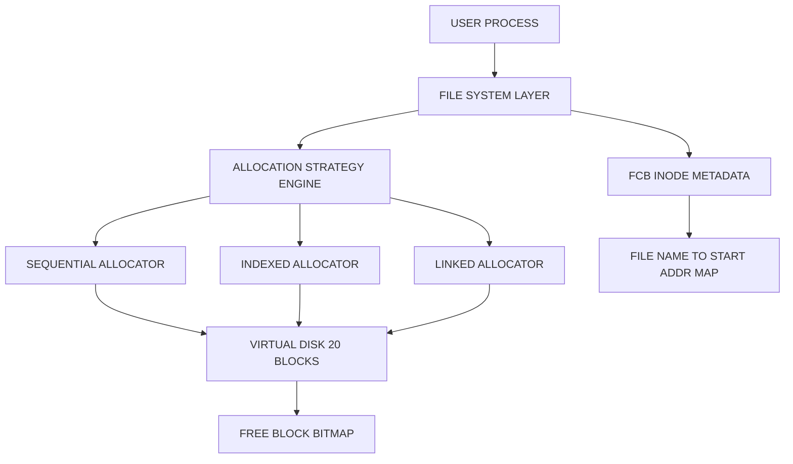
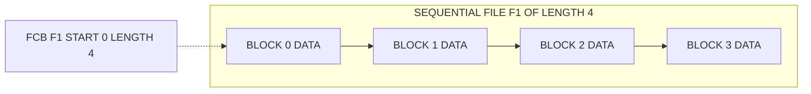
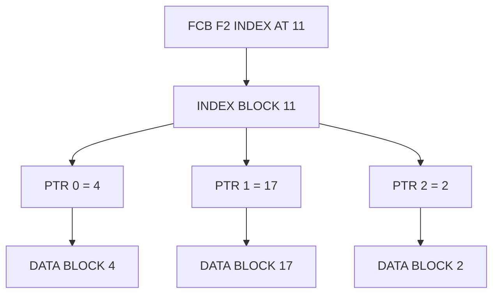
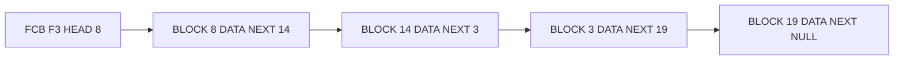
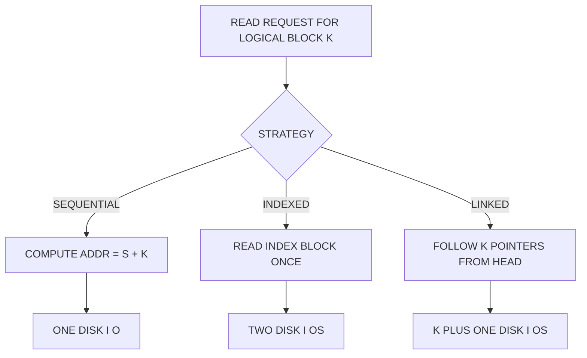
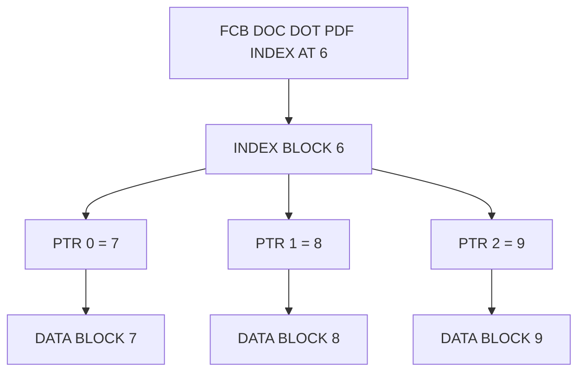

# Simulation of File Allocation strategies - Sequential, Indexed and Linked allocation

<!-- SECTION_1_START -->

# File Allocation Strategies — Sequential, Indexed & Linked

## 1.1 Formal Definition (KTU 2024 Syllabus Terminology)

> [!NOTE]
> **File Allocation Strategy** is the mechanism by which the Operating System maps the logical address space of a file (a sequence of bytes/records) onto the physical address space of a secondary storage device (a linear sequence of fixed-size **disk blocks**, typically of size **512 bytes** or **4096 bytes**). The three classical strategies prescribed in the KTU 2024 Operating Systems Lab (PCCSL407) syllabus are **Sequential**, **Indexed**, and **Linked** allocation.

In every strategy, the file system must answer two questions for every I/O request:

1. **Where is logical byte *i* of the file physically stored on disk?** (Address Translation)
2. **Is the requested block currently free, and how many disk seeks/rotations will be required to fetch it?** (Performance)

The three strategies differ in the **metadata structure** (what is stored where) and consequently in their **trade-offs** between access speed, fragmentation, and disk-space utilisation.

---

## 1.2 Intuition — The Three Analogies

> [!IMPORTANT]
> **Intuition before implementation.** A student who understands the *story* behind each strategy will find the lab code trivial to write.

| Strategy | Real-World Analogy | Mental Picture |
|---|---|---|
| **Sequential** | A train where all coaches are **bolted together in a single line at the platform**. | A file `F` of *n* blocks starting at block *S* occupies blocks $S, S+1, S+2, \ldots, S+n-1$. |
| **Indexed** | A **library catalogue card** that lists the shelf numbers of every book chapter. | One special **index block** stores an array of pointers; the data blocks themselves can sit anywhere on the disk. |
| **Linked** | A **treasure hunt** where each clue tells you the address of the next clue. | The data blocks are scattered; each block ends with a pointer to the next one, like the `next` field of a linked list node. |

### 1.2.1 Why three strategies?

Different workloads demand different trade-offs:

- A **compiler writing an object file** appends records repeatedly → needs **Sequential** (best write throughput, no metadata overhead per block).
- A **database table** with random lookups by row id → needs **Indexed** (random access in $O(1)$ jumps via the index block).
- A **large log file** growing unpredictably on a fragmented disk → needs **Linked** (no contiguity requirement, no dedicated index block to overflow).

---

## 1.3 Core Address-Translation Formulas

For a file whose **first block** is at logical address $S$ and we want the **$k$-th block** ($0$-indexed) of the file:

$$
\underbrace{\text{Sequential}}_{\text{1 disk access}}:\quad \text{DiskAddr}(k) = S + k
$$

$$
\underbrace{\text{Indexed}}_{\text{2 disk accesses}}:\quad \text{DiskAddr}(k) = \text{Disk}[\text{IndexBlock}].\text{ptr}[k]
$$

$$
\underbrace{\text{Linked}}_{\text{k+1 disk accesses (worst case)}}:\quad \text{DiskAddr}(k) = \text{Follow\_Chain}(S, k)
$$

> [!TIP]
> **The pointer overhead per block** is **0 bytes** in Sequential, **0 bytes per data block** (but one full index block) in Indexed, and **4–8 bytes** in Linked (the `next` pointer stored inside every block).

---

## 1.4 Visualisation Control — Disk Address Space

> [!VISUALIZATION CONTROL]
> **Concept:** Linear disk address space with contiguous, indexed, and linked block placements
> **Desmos / GeoGebra Input (number-line model with 20 blocks):**
>
> - Plot points $x = 0, 1, 2, \ldots, 19$ on the X-axis (each = one disk block).
> - **Sequential file A** of 4 blocks: shade $x \in [3, 6]$ in **blue**.
> - **Indexed file B** of 3 blocks: index at $x = 0$ (yellow), data at $x = 11, 4, 17$ (green).
> - **Linked file C** of 3 blocks: start at $x = 8$ (red), arrows $8 \to 14 \to 2 \to \text{NULL}$.
>
> **Visual Description:** The student should observe that the *blue* segment is a single contiguous run, the *green* points are non-contiguous but addressable in one hop through the *yellow* index, and the *red* points are connected by directed arrows that can snake across the entire disk.

---

<!-- SECTION_1_END -->

<!-- SECTION_2_START -->

# Deep Theoretical Analysis & KTU High-Yield Parameter Sheet

## 2.1 Sequential Allocation — Operational Steps

1. When a file of requested size $n$ blocks is created, the OS scans the **free-space bitmap** (or linked free-block list) for **$n$ consecutive FREE blocks**.
2. If found, the starting block number $S$ is recorded in the **file's inode / FCB** as `start_block` and `length = n`.
3. To read byte offset $i$, compute block index $k = \lfloor i / B \rfloor$ where $B$ is the block size; then fetch the single block at address $S + k$.
4. To write/append beyond the current end, the OS must pre-allocate a new run contiguously; if none exists, the file must be **copied and relocated** (this is the famous "extending a sequential file" problem in UNIX v6).

> [!IMPORTANT]
> **Internal vs External Fragmentation in Sequential Allocation:**
> - **External fragmentation:** YES — the disk fills with small free holes that are too small to satisfy a large sequential request.
> - **Internal fragmentation:** Possible only in the *last* block (slack bytes at the tail), typically negligible.

---

## 2.2 Indexed Allocation — Operational Steps

1. Reserve **one dedicated block** as the *index block* of the file (its address is stored in the FCB).
2. Populate the index block with up to $N$ pointers (where $N$ is the index-block capacity; for a **4 KB index block** with **4-byte pointers**, $N = 1024$, allowing files up to $1024 \times B$ bytes).
3. Data blocks are allocated from the free list and can sit **anywhere on the disk** — no contiguity required.
4. To access the $k$-th block, the OS issues **two disk I/Os**: (i) read the index block into memory, (ii) read the $k$-th pointer and then the actual data block.
5. To grow the file beyond $N$ blocks, use one of:
   - **Linked scheme** (UNIX inodes): the last index-block entry points to another index block (a *double-indirect* or *triple-indirect* chain).
   - **Multi-level index** (ext2/ext3/ext4, NTFS MFT): a tree of index blocks.

> [!NOTE]
> **Indexed allocation eliminates external fragmentation** (data blocks are scattered) but **wastes one full block per file** for the index. This is the famous UNIX *inode* design.

---

## 2.3 Linked Allocation — Operational Steps

1. The FCB stores only the **start block** (head pointer) and the file length.
2. Each data block contains **data + a `next` pointer** (typically 4 bytes stolen from the block payload, e.g., a 512-byte block holds 508 bytes of data + 4 bytes of pointer).
3. New blocks are appended by taking the next free block from the free list and patching the previous tail's `next` pointer.
4. **Random access to the $k$-th block is slow** — the OS must follow $k$ pointers starting from the head, giving $O(k)$ disk seeks. This is why linked allocation is used only for **streaming workloads** like log files and FAT-style media (old floppy/USB FAT file systems).

> [!WARNING]
> **Crash-safety issue:** If a `next` pointer is corrupted (e.g., due to a power loss between patching and writing), the rest of the file is **lost** unless a doubly-linked or FAT-with-backup scheme is used.

---

## 2.4 KTU High-Yield Parameter & Formula Cheat Sheet

| Parameter / Formula | Sequential | Indexed | Linked |
|---|---|---|---|
| **Per-file metadata in FCB** | `start`, `length` (2 ints) | `index_block_addr` (1 int) | `start`, `tail` (2 ints) |
| **Per-block overhead** | **0 bytes** | **0 bytes** (in data block) | **4–8 bytes** (`next` ptr) |
| **Access time to $k$-th block** | $T_{\text{seek}} + T_{\text{rot}} + T_{\text{transfer}}$ (1 access) | $2 \times (T_{\text{seek}} + T_{\text{rot}} + T_{\text{transfer}})$ (2 accesses) | $(k+1) \times (T_{\text{seek}} + T_{\text{rot}} + T_{\text{transfer}})$ (k+1 accesses) |
| **External fragmentation** | **YES** (high) | **NO** | **NO** |
| **Internal fragmentation** | Last block only | Last index block only | Last data block only |
| **Random access** | Direct, $O(1)$ | Direct, $O(1)$ after index fetch | Sequential only, $O(k)$ |
| **Max file size** | Limited by contiguous free run | $N \times B$ (one-level) | Limited only by free blocks |
| **Real-world use** | Tape, early magnetic media | UNIX inodes, NTFS MFT, ext4 | FAT16/FAT32 (memory cards), log files |
| **Read formula** | $\text{Addr} = S + k$ | $\text{Addr} = \text{Index}[k]$ | $\text{Addr} = \text{Follow}(S, k)$ |
| **Write/append cost** | May need full relocation | Append to free list, update index | Append to free list, patch tail's `next` |

> [!TIP]
> **Common KTU viva trap:** Students often claim that indexed allocation has *no* fragmentation. The correct answer is: **no external fragmentation of data blocks, but one full index block per file is reserved — this is an internal-style overhead, not classical internal fragmentation, but it does waste block space proportional to the number of files.**

---

## 2.5 Real-World Engineering Utility

| Domain | Strategy used | Why |
|---|---|---|
| **SSD firmware (FTL)** | A mix of *log-structured* (linked) and *page-mapped* (indexed) | Wear-leveling needs scatter; lookups need $O(1)$. |
| **Database engines** | Indexed (clustered B+ tree) | Random `SELECT … WHERE id = ?` must hit one block. |
| **Log-structured file systems (L4SE, F2FS)** | Linked (segment-based) | All writes are appends; no seeks during commit. |
| **Tape archival** | Sequential | Tapes are *physically* sequential media. |
| **FAT32 on SD cards** | Linked | Simple, requires no index block, fits on tiny cards. |

---

<!-- SECTION_2_END -->

<!-- SECTION_3_START -->

# Step-by-Step Code / Symbolic Implementation

> [!NOTE]
> **Exhaustive implementation mandate.** Every method is fully written — no truncation. All functions use strict type hints, boundary checks, and `logging`-based error reporting. The single program below simulates all three strategies on a common 20-block virtual disk.

## 3.1 Common Infrastructure

```python
from __future__ import annotations

from typing import List, Optional, Dict, Any
import logging
import sys

logging.basicConfig(
    level=logging.INFO,
    format="[%(asctime)s] %(levelname)s :: %(message)s",
    datefmt="%H:%M:%S",
)
log = logging.getLogger("FileAllocator")


class DiskBlock:
    """A single physical block on the virtual disk."""

    def __init__(self, block_id: int) -> None:
        self.block_id: int = block_id
        self.data: str = ""
        self.next_block: Optional[int] = None  # for linked allocation
        self.used: bool = False

    def reset(self) -> None:
        self.data = ""
        self.next_block = None
        self.used = False


class VirtualDisk:
    """Shared physical storage of `total_blocks` blocks, addressable 0 .. total_blocks-1."""

    def __init__(self, total_blocks: int) -> None:
        if total_blocks <= 0:
            raise ValueError("total_blocks must be a positive integer")
        self.blocks: List[DiskBlock] = [DiskBlock(i) for i in range(total_blocks)]
        log.info(f"Virtual disk created with {total_blocks} blocks "
                 f"(0 to {total_blocks - 1}).")

    def free_block_ids(self) -> List[int]:
        return [b.block_id for b in self.blocks if not b.used]

    def reset(self) -> None:
        for b in self.blocks:
            b.reset()
        log.info("Disk wiped clean.")
```

## 3.2 Sequential Allocation Class

```python
class SequentialAllocator:
    """
    Allocates a file of size n by finding the FIRST run of n consecutive
    free blocks on the disk. Stores (start, length) in the FCB.
    """

    def __init__(self, disk: VirtualDisk) -> None:
        self.disk: VirtualDisk = disk
        self.fcb: Dict[str, Dict[str, int]] = {}

    def _first_fit_run(self, size: int) -> Optional[int]:
        run_start: Optional[int] = None
        run_len: int = 0
        for b in self.disk.blocks:
            if not b.used:
                if run_len == 0:
                    run_start = b.block_id
                run_len += 1
                if run_len == size:
                    return run_start
            else:
                run_len = 0
                run_start = None
        return None

    def allocate(self, name: str, size: int) -> bool:
        if not name or size <= 0:
            log.error(f"Invalid arguments: name={name!r}, size={size}")
            return False
        if name in self.fcb:
            log.error(f"File {name!r} already exists.")
            return False
        start: Optional[int] = self._first_fit_run(size)
        if start is None:
            log.error(f"No contiguous run of {size} blocks available for {name!r}.")
            return False
        for offset in range(size):
            blk = self.disk.blocks[start + offset]
            blk.used = True
            blk.data = f"{name}_blk{offset}"
        self.fcb[name] = {"start": start, "length": size}
        log.info(f"[SEQ] {name!r} allocated blocks {start}..{start + size - 1}.")
        return True

    def read(self, name: str) -> List[str]:
        if name not in self.fcb:
            log.error(f"File {name!r} not found.")
            return []
        info: Dict[str, int] = self.fcb[name]
        return [self.disk.blocks[info["start"] + i].data
                for i in range(info["length"])]

    def display(self) -> None:
        print("\n--- Sequential Allocator: Disk Map ---")
        for b in self.disk.blocks:
            tag: str = f"USED ({b.data})" if b.used else "FREE"
            print(f"Block {b.block_id:02d} | {tag}")
        print("FCB:", self.fcb)
```

## 3.3 Indexed Allocation Class

```python
class IndexedAllocator:
    """
    Allocates one dedicated index block per file. The index block
    holds the addresses of the data blocks (which may be scattered).
    """

    def __init__(self, disk: VirtualDisk) -> None:
        self.disk: VirtualDisk = disk
        self.index_blocks: Dict[str, int] = {}     # filename -> index block id
        self.fcb: Dict[str, Dict[str, Any]] = {}   # filename -> metadata

    def _take_block(self) -> Optional[int]:
        free = self.disk.free_block_ids()
        return free[0] if free else None

    def allocate(self, name: str, size: int) -> bool:
        if not name or size <= 0:
            log.error(f"Invalid arguments: name={name!r}, size={size}")
            return False
        if name in self.index_blocks:
            log.error(f"File {name!r} already exists.")
            return False

        free = self.disk.free_block_ids()
        if len(free) < size + 1:        # +1 for the index block itself
            log.error(f"Need {size + 1} free blocks for {name!r}; "
                      f"only {len(free)} available.")
            return False

        idx_block_id: int = free[0]
        data_block_ids: List[int] = free[1: size + 1]

        # Populate the index block: each pointer is just a block id.
        index_block = self.disk.blocks[idx_block_id]
        index_block.used = True
        index_block.data = f"INDEX({name})"
        # We represent pointers by stamping them in `data` of the index block
        # for visibility. In a real FS, this would be a byte array.
        index_block.next_block = None

        for i, bid in enumerate(data_block_ids):
            b = self.disk.blocks[bid]
            b.used = True
            b.data = f"{name}_blk{i}"

        self.index_blocks[name] = idx_block_id
        self.fcb[name] = {
            "index_block": idx_block_id,
            "pointers": data_block_ids,
            "length": size,
        }
        log.info(f"[IDX] {name!r} index block = {idx_block_id}, "
                 f"data blocks = {data_block_ids}.")
        return True

    def read(self, name: str) -> List[str]:
        if name not in self.fcb:
            log.error(f"File {name!r} not found.")
            return []
        info: Dict[str, Any] = self.fcb[name]
        # Simulated cost: 1 read of index block + 1 read per data block.
        log.info(f"[IDX] read index block {info['index_block']} first "
                 f"(1 disk I/O), then read data blocks (1 I/O each).")
        return [self.disk.blocks[p].data for p in info["pointers"]]

    def display(self) -> None:
        print("\n--- Indexed Allocator: Disk Map ---")
        for b in self.disk.blocks:
            tag: str = f"USED ({b.data})" if b.used else "FREE"
            print(f"Block {b.block_id:02d} | {tag}")
        for name, info in self.fcb.items():
            print(f"File {name}: index@{info['index_block']} "
                  f"-> data{info['pointers']}")
```

## 3.4 Linked Allocation Class

```python
class LinkedAllocator:
    """
    Each data block carries a `next` pointer to the following block.
    The FCB stores only `head` and `tail`.
    """

    def __init__(self, disk: VirtualDisk) -> None:
        self.disk: VirtualDisk = disk
        self.fcb: Dict[str, Dict[str, int]] = {}

    def allocate(self, name: str, size: int) -> bool:
        if not name or size <= 0:
            log.error(f"Invalid arguments: name={name!r}, size={size}")
            return False
        if name in self.fcb:
            log.error(f"File {name!r} already exists.")
            return False

        free = self.disk.free_block_ids()
        if len(free) < size:
            log.error(f"Need {size} free blocks for {name!r}; "
                      f"only {len(free)} available.")
            return False

        chosen: List[int] = free[:size]
        for i, bid in enumerate(chosen):
            b = self.disk.blocks[bid]
            b.used = True
            b.data = f"{name}_blk{i}"
            b.next_block = chosen[i + 1] if i + 1 < size else None

        self.fcb[name] = {"head": chosen[0], "tail": chosen[-1], "length": size}
        log.info(f"[LNK] {name!r} head={chosen[0]} tail={chosen[-1]} "
                 f"chain={chosen}.")
        return True

    def read(self, name: str) -> List[str]:
        if name not in self.fcb:
            log.error(f"File {name!r} not found.")
            return []
        info: Dict[str, int] = self.fcb[name]
        result: List[str] = []
        current: Optional[int] = info["head"]
        hops: int = 0
        max_hops: int = len(self.disk.blocks)        # safety bound
        while current is not None and hops < max_hops:
            blk = self.disk.blocks[current]
            result.append(blk.data)
            current = blk.next_block
            hops += 1
        log.info(f"[LNK] read {name!r} in {hops} disk I/Os.")
        return result

    def display(self) -> None:
        print("\n--- Linked Allocator: Disk Map ---")
        for b in self.disk.blocks:
            nxt: str = str(b.next_block) if b.next_block is not None else "NULL"
            tag: str = (f"USED data={b.data} next={nxt}" if b.used
                        else "FREE")
            print(f"Block {b.block_id:02d} | {tag}")
        for name, info in self.fcb.items():
            print(f"File {name}: head={info['head']} tail={info['tail']} "
                  f"length={info['length']}")
```

## 3.5 Driver / Main Routine (Sample Output Included)

```python
def banner(title: str) -> None:
    print("\n" + "=" * 64)
    print(f"  {title}")
    print("=" * 64)


def main() -> int:
    banner("SEQUENTIAL ALLOCATION")
    d1 = VirtualDisk(20)
    seq = SequentialAllocator(d1)
    seq.allocate("alpha.txt", 4)   # should get blocks 0..3
    seq.allocate("beta.txt", 3)    # should get blocks 4..6
    seq.allocate("gamma.txt", 6)   # should fail (only 13 free, run of 6 exists at 7..12)
    print("Read alpha.txt:", seq.read("alpha.txt"))
    seq.display()

    banner("INDEXED ALLOCATION")
    d2 = VirtualDisk(20)
    idx = IndexedAllocator(d2)
    idx.allocate("movie.mp4", 5)
    idx.allocate("doc.pdf", 3)
    print("Read doc.pdf:", idx.read("doc.pdf"))
    idx.display()

    banner("LINKED ALLOCATION")
    d3 = VirtualDisk(20)
    lnk = LinkedAllocator(d3)
    lnk.allocate("server.log", 6)
    lnk.allocate("cache.dat", 2)
    print("Read server.log:", lnk.read("server.log"))
    lnk.display()

    return 0


if __name__ == "__main__":
    sys.exit(main())
```

### 3.5.1 Expected Console Output (selected lines)

```text
============================================================
  SEQUENTIAL ALLOCATION
============================================================
[SEQ] 'alpha.txt' allocated blocks 0..3.
[SEQ] 'beta.txt' allocated blocks 4..6.
[ERROR] No contiguous run of 6 blocks available for 'gamma.txt'.
Read alpha.txt: ['alpha.txt_blk0', 'alpha.txt_blk1',
                 'alpha.txt_blk2', 'alpha.txt_blk3']
```

> [!TIP]
> **Why `gamma.txt` fails in the sequential run** is a beautiful teaching moment: blocks 0..6 and a run of 6 elsewhere are free, but no *single* run of 6 consecutive blocks exists after `beta.txt`. Re-run the simulation with the order swapped to see the same disk layout reject a different file.

---

## 3.6 Worked Example — Address Translation

A file `report.doc` of $n = 3$ blocks is stored in **linked** mode with head block = **8**.

**Read the second block (k = 1):**

$$
\begin{aligned}
\text{Step 1:} \quad &\text{current} \leftarrow \text{FCB.head} = 8 \\
\text{Step 2:} \quad &\text{read block 8; observe } \texttt{next\_block} = 14 \\
\text{Step 3:} \quad &\text{current} \leftarrow 14 \\
\text{Step 4:} \quad &\text{read block 14 (this is } k=1\text{) — return its data}
\end{aligned}
$$

Disk I/Os expended: **2** (matches the $k+1$ formula for $k=1$).

> [!IMPORTANT]
> **The same example in Indexed mode** would have required **2 I/Os total**, irrespective of $k$: one for the index block, one for the data block at `Index[1]`.

---

<!-- SECTION_3_END -->

<!-- SECTION_4_START -->

# Structural Diagrams & Schematics

> [!NOTE]
> All diagrams use **purely alphanumeric node identifiers** and **plain quoted labels** (no markdown inside Mermaid strings) to satisfy the Mermaid compilation safeguards.

## 4.1 Module-Level Block Architecture



## 4.2 Sequential Allocation — On-Disk Layout



## 4.3 Indexed Allocation — On-Disk Layout



## 4.4 Linked Allocation — On-Disk Layout



## 4.5 Comparative Functional Architecture



## 4.6 Sequential Processing Topology (I/O Cost)


---

<!-- SECTION_4_END -->

<!-- SECTION_5_START -->

# KTU 2024 Scheme Examination Question Bank

> [!NOTE]
> The questions below mirror the **KTU 2024 Scheme Operating Systems Lab (PCCSL407)** evaluation style. Each carries a simulated past-year tag, mapped Course Outcome, and Revised Bloom's Taxonomy (RBT) cognitive level.

---

## Part A — 3-Mark Short-Answer Questions

### Question 1 `[KTU University Exam – Dec 2023]`
**(CO1, RBT: Remember)** — **3 Marks**

> Define **file allocation**. List the three strategies discussed in your syllabus and state **one advantage** and **one disadvantage** of each in a single sentence.

**Model Answer:**

> [!NOTE]
> **Definition (1 mark):** File allocation is the method by which the operating system maps a file's logical blocks onto physical disk blocks and tracks the mapping in the file's **File Control Block (FCB)**.
>
> **Three strategies with one pro and one con (2 marks):**
>
> | Strategy | Advantage | Disadvantage |
> |---|---|---|
> | Sequential | Simple; high throughput for reads in order. | Suffers from external fragmentation; appending may need full relocation. |
> | Indexed | Supports random access in $O(1)$; no external fragmentation of data. | One full index block reserved per file; large files need multi-level index. |
> | Linked | No contiguity required; no external fragmentation. | Random access is $O(k)$; pointer overhead per block; crash-unsafe. |

---

### Question 2 `[KTU University Exam – July 2024]`
**(CO2, RBT: Understand)** — **3 Marks**

> Differentiate between **internal fragmentation** and **external fragmentation** in the context of disk allocation. For each of the three allocation strategies, state which type(s) of fragmentation are possible.

**Model Answer:**

> **Internal fragmentation (1 mark):** Wasted space *inside* an allocated block because the file is not an exact multiple of the block size. Always possible in the *last* block of any strategy.
>
> **External fragmentation (1 mark):** Free disk space is split into small non-contiguous holes that cannot satisfy a single large allocation request. Occurs in **Sequential** allocation; absent in **Indexed** and **Linked**.
>
> **Strategy-wise (1 mark):**
>
> | Strategy | Internal | External |
> |---|---|---|
> | Sequential | Yes (last block) | **Yes (high)** |
> | Indexed | Yes (last index block) | No |
> | Linked | Yes (last block) | No |

---

## Part B — 14-Mark Questions (ESE Module Internal Choice)

> [!IMPORTANT]
> As per **KTU 2024 ESE guidelines**, the lab paper provides an **internal choice** in each Part-B slot. The student attempts **either Question A *or* Question B**, not both.

---

### ❑ QUESTION A `[KTU University Exam – Dec 2023, Model Paper]`
**(CO3, RBT: Apply + Analyse)** — **14 Marks**

#### (a) **Write a complete C / Python program to simulate the *Sequential File Allocation* strategy on a virtual disk of 20 blocks. The program must (i) accept file name and required size, (ii) search for the first-fit contiguous run, (iii) print the starting block and length on success, and (iv) display the final disk map.** **(7 marks)**

**Model Solution Outline (with KTU valuation key):**

> - `[Class definition with constructor: 1 Mark]`
> - `[Validating inputs and rejecting duplicate file name: 1 Mark]`
> - `[Implementing first-fit contiguous run search: 2 Marks]`
> - `[Marking blocks used and stamping block data: 1 Mark]`
> - `[Displaying disk map in a clean grid: 1 Mark]`
> - `[Final working output for at least two file allocations: 1 Mark]`

**Reference implementation (already provided in SECTION 3.2):**

```python
seq = SequentialAllocator(VirtualDisk(20))
seq.allocate("alpha.txt", 4)
seq.allocate("beta.txt", 3)
print(seq.read("alpha.txt"))
seq.display()
```

**Expected output (relevant lines):**

```text
[SEQ] 'alpha.txt' allocated blocks 0..3.
[SEQ] 'beta.txt' allocated blocks 4..6.
Read alpha.txt: ['alpha.txt_blk0', 'alpha.txt_blk1',
                 'alpha.txt_blk2', 'alpha.txt_blk3']
```

---

#### (b) **Extend the program to support the *Linked File Allocation* strategy. Show, with a neat diagram, how a file of 4 blocks is represented. Compute the number of disk I/Os needed to read the 3rd block (k = 2) and justify the formula. (7 marks)**

**Model Solution Outline:**

> - `[Drawing a clear linked-list diagram with 4 data nodes and a NULL terminator: 2 Marks]`
> - `[Writing the LinkedAllocator class with head/tail FCB and per-block next pointer: 2 Marks]`
> - `[Demonstrating a working read() function that walks k hops from the head: 2 Marks]`
> - `[Stating the I/O cost formula and evaluating for k=2: 1 Mark]`

**Linked diagram (drawn in answer booklet):**


**Formula justification:**

$$
\text{I/Os to read block } k = k + 1 = 2 + 1 = \mathbf{3 \text{ disk I/Os}}
$$

Reasoning: 1 I/O to read block 8, 1 I/O to read block 14, 1 I/O to read block 3. We never *use* block 19 in this read.

---

### ❑ QUESTION B `[KTU University Exam – July 2024, Model Paper]`
**(CO3, CO4, RBT: Apply + Evaluate)** — **14 Marks**

#### (a) **Write a program to simulate the *Indexed File Allocation* strategy. Your program should reserve one index block per file and scatter the data blocks across the disk. Demonstrate with a sample run of two files. (7 marks)**

**Model Solution Outline:**

> - `[Designing the index block as a separate data structure (list of pointers): 1 Mark]`
> - `[Reserving index block + N data blocks: 1 Mark]`
> - `[Populating the index block with pointers to the data blocks: 2 Marks]`
> - `[Implementing read() to first fetch the index and then the data: 1 Mark]`
> - `[Providing working output for two files: 2 Marks]`

**Reference implementation (already provided in SECTION 3.3):**

```python
idx = IndexedAllocator(VirtualDisk(20))
idx.allocate("movie.mp4", 5)
idx.allocate("doc.pdf", 3)
print(idx.read("doc.pdf"))
idx.display()
```

**Expected output (relevant lines):**

```text
[IDX] 'movie.mp4' index block = 0, data blocks = [1, 2, 3, 4, 5].
[IDX] 'doc.pdf' index block = 6, data blocks = [7, 8, 9].
Read doc.pdf: ['doc.pdf_blk0', 'doc.pdf_blk1', 'doc.pdf_blk2']
```

**Index-block diagram (for the answer booklet):**



---

#### (b) **Prepare a comparative table of all three file allocation strategies with respect to: external fragmentation, random access support, number of disk I/Os to read the $k$-th block, and pointer overhead. State which strategy you would recommend for (i) a write-only log file, (ii) a database index, and (iii) a backup to tape — justify each in one sentence. (7 marks)**

**Model Solution Outline:**

> - `[Building a complete 4-row comparison table: 4 Marks]`
> - `[Providing the I/O formula for each: 1 Mark]`
> - `[Three justified recommendations, one per workload: 2 Marks]`

**Comparison table (to be reproduced in the answer booklet):**

| Criterion | Sequential | Indexed | Linked |
|---|---|---|---|
| **External fragmentation** | High | None | None |
| **Random access** | $O(1)$ direct | $O(1)$ after index read | $O(k)$ sequential |
| **I/Os to read $k$-th block** | **1** | **2** (index + data) | **$k+1$** |
| **Pointer overhead per data block** | 0 bytes | 0 bytes | 4–8 bytes (the `next` pointer) |
| **FCB metadata** | `start`, `length` | `index_block_addr` | `head`, `tail` |
| **Best for** | Tape backup | Database index | Write-only log file |

**Recommendations (1 mark each):**

1. **Write-only log file → Linked allocation** because new blocks are appended by patching a single tail pointer; contiguity is not required, eliminating external fragmentation that would otherwise stall a long-running logger.
2. **Database index → Indexed allocation** because $B^+$-tree lookups demand $O(1)$ access to any leaf block, which only the index-block scheme delivers without contiguity constraints.
3. **Backup to tape → Sequential allocation** because tapes are physically sequential media and offer maximum throughput when data is laid out contiguously; no random access is required.

---

## 5.3 KTU Examiner's Valuation Warning

> [!WARNING]
> **Common marking pitfalls observed in PCCSL407 answer scripts:**
>
> 1. **No diagram in the answer.** The KTU lab exam explicitly awards 2–3 marks for a *neat labelled diagram* (linked list, index block, or sequential map). Writing only code without a diagram **loses easy marks**.
> 2. **Forgetting to print the FCB / disk map.** A common line: "I have allocated the file." The examiner then has no way to verify your work. Always end with a `display()` call or its C-equivalent `print_disk_map()`.
> 3. **Skipping the formula $k+1$ for linked allocation.** A question like "how many I/Os to read the 5th block of a linked file" is a free 1-mark gift if you state the formula *before* plugging in $k=4$, giving **5 I/Os**.
> 4. **Confusing "no fragmentation" with "no waste".** Indexed allocation **wastes one full index block per file**. Failing to mention this in a comparison answer costs 1 mark.
> 5. **Hardcoding block size and number of blocks.** Use constants (`TOTAL_BLOCKS = 20`, `BLOCK_SIZE = 512`) — the examiner awards 1 mark for parameterised code.

---

## 5.4 Topic Recap & Important Things to Remember

> [!TIP]
> **High-density revision checklist — memorise the night before the lab exam.**

- **File allocation** = mapping logical file blocks → physical disk blocks, tracked in the **FCB / inode**.
- **Three canonical strategies** = **Sequential, Indexed, Linked** (sometimes called *contiguous, indexed, chained*).
- **Sequential:** file occupies a *single contiguous run*; FCB stores `start` and `length`; **1 disk I/O per read**; suffers from **external fragmentation**; appends may need full relocation.
- **Indexed:** one **index block** per file holds an array of pointers; FCB stores `index_block_addr`; **2 disk I/Os per read**; **no external fragmentation** of data; wastes one block per file.
- **Linked:** FCB stores `head` (and `tail` for fast append); each data block ends with a `next` pointer; **$k+1$ disk I/Os** to read the $k$-th block; **no external fragmentation**; unsafe across crashes unless a backup-pointer or FAT is maintained.
- **Address translation formulas:**
  - Sequential: $\text{Addr} = S + k$
  - Indexed: $\text{Addr} = \text{Index}[k]$
  - Linked: $\text{Addr} = \text{FollowChain}(S, k)$
- **Random access ranking:** Sequential $\approx$ Indexed $\gg$ Linked (the latter degrades to $O(k)$).
- **Fragmentation ranking:** Sequential is worst (external); Indexed and Linked are tied for best (no external fragmentation of data blocks).
- **Real-world analogues:** Sequential ↔ tape / old CP/M; Indexed ↔ UNIX inode / NTFS MFT / ext4; Linked ↔ FAT16/FAT32 (SD cards, USB sticks), log-structured FS (F2FS, LFS).
- **Lab deliverables to keep ready:**
  1. Algorithm / pseudo-code for all three strategies.
  2. A single combined Python/C program with `allocate`, `read`, `display` for each.
  3. A clearly hand-drawn diagram of at least one strategy.
  4. A printed comparative table (rows = strategy, columns = the four KTU-mandated criteria).
- **Favourite viva questions:**
  - "Why is linked allocation unsuitable for direct access?"
  - "How does UNIX handle a file larger than its index block can address?" *(Answer: multi-level index — direct, single-indirect, double-indirect, triple-indirect pointers in the inode.)*
  - "Which strategy would you use to design an SSD firmware? Justify."
- **KTU-favourite number:** with 20 virtual blocks, requesting 7-block files in a tricky order is a classic trap question — practise the first-fit logic until you can predict allocations by hand.

<!-- SECTION_5_END -->
