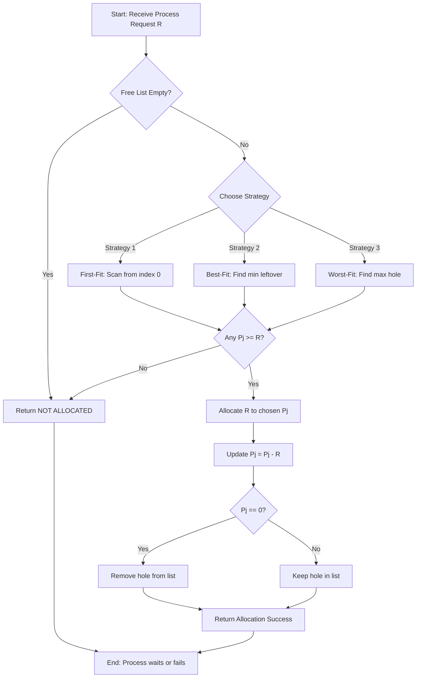
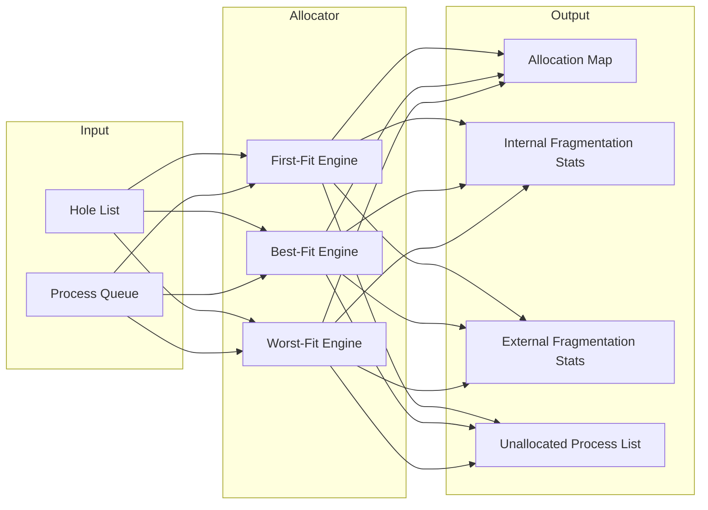
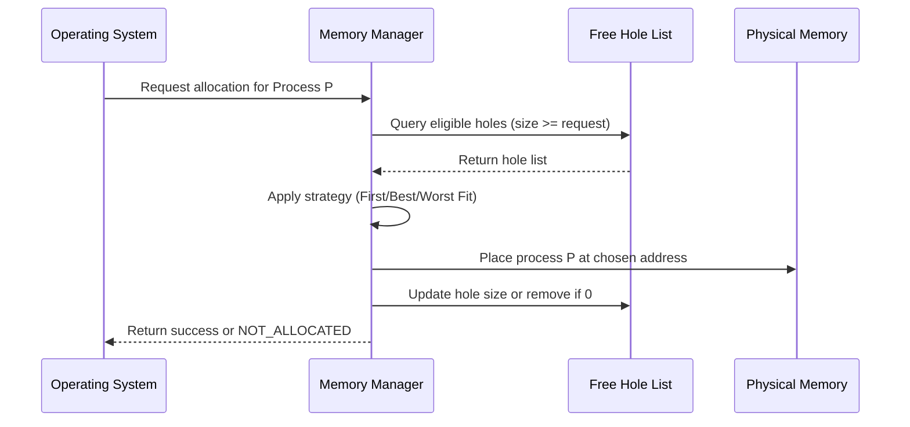

# Simulation of Memory Management schemes - First Fit, Best Fit and Worst Fit

<!-- SECTION_1_START -->

# 1. Core Technical Definition & Intuitive Overview

## 1.1 Formal Definition (KTU 2024 Syllabus Terminology)

**Memory Management Schemes** in the context of contiguous memory allocation are the **First-Fit, Best-Fit, and Worst-Fit** allocation strategies that determine which free partition (hole/block) of the main memory is chosen to load an incoming process requesting a specific amount of memory.

According to the KTU 2024 Scheme syllabus for **Operating Systems Lab (PCCSL407)**, these schemes fall under **Contiguous Memory Allocation** — a single process is allocated a single continuous block of physical memory. The OS maintains a list of free partitions (called **holes**) and selects one hole for each arriving process based on a defined placement policy.

> [!IMPORTANT]
> **KTU Board Definition (Exact Terminology)**
> - **First-Fit:** Allocate the requesting process to the *first* hole that is large enough to accommodate it.
> - **Best-Fit:** Allocate the process to the *smallest* hole that is large enough (minimizes leftover internal fragmentation).
> - **Worst-Fit:** Allocate the process to the *largest* hole available (leaves the largest leftover fragment, hoping it is still useful).

The three placement strategies differ in **speed (time complexity)** and in the **amount of external fragmentation** they generate over time.

## 1.2 Conceptual Analogy / Intuition

Imagine a **parking lot** with irregular empty slots and a stream of cars (processes) arriving, each needing a certain number of consecutive parking spaces (memory units).

- **First-Fit** — You walk from the entrance and park at the **very first empty stretch** long enough for your car. Fast and lazy, but may leave awkward small gaps near the entrance.
- **Best-Fit** — You walk all the way to the far end of the lot, survey every empty stretch, and park in the **tightest fitting one**. Saves space in larger gaps but creates many tiny unusable spaces (like those annoying 10 cm gaps in a kitchen).
- **Worst-Fit** — You deliberately park in the **largest available empty stretch**, reasoning that breaking a big gap into two medium gaps keeps both gaps useful for future larger cars.

> [!NOTE]
> **Why Three Strategies?**
> No single strategy is universally best. KTU board questions often ask you to *compare* them — and the correct answer is contextual: First-Fit is *fastest*, Best-Fit *minimizes leftover waste per request*, and Worst-Fit *preserves large free blocks for future large requests*.

## 1.3 Standard Memory Metrics (Highlighted Constants)

| Metric | Symbol | Unit | Meaning |
|---|---|---|---|
| Process Request Size | $R_i$ | KB / Blocks | Memory demanded by process $i$ |
| Partition Size | $P_j$ | KB / Blocks | Size of hole $j$ |
| Internal Fragmentation | $IF$ | KB | $P_j - R_i$ (unused inside the allocated block) |
| External Fragmentation | $EF$ | KB | Sum of small unusable holes outside allocated blocks |
| Number of Holes | $n$ | — | Free partitions in the free list |

## 1.4 Memory State Representation (KTU Convention)

A memory of total size $M$ blocks is typically represented as a list:

$$
\text{State} = \{(P_1, \text{allocated}), (P_2, \text{free}), (P_3, \text{free}), (P_4, \text{allocated}), \ldots\}
$$

A sample KTU-style input is usually given as:
- A list of **process requests**: e.g., $\{212, 417, 112, 426\}$
- A list of **free blocks (holes)**: e.g., $\{100, 500, 200, 300, 600\}$

The output is the **final allocation map** showing which process is placed in which hole, and the **remaining free space** in each hole.

> [!VISUALIZATION CONTROL]
> **Concept:** Memory Allocation Map (Block Diagram)
> **GeoGebra / Desmos Input Equations (Bar Representation):**
> - Hole 1: rectangle from $x = 0$ to $x = 100$ (height 1, label "Hole 100")
> - Hole 2: rectangle from $x = 100$ to $x = 600$ (label "Hole 500")
> - Hole 3: rectangle from $x = 600$ to $x = 800$ (label "Hole 200")
> **Visual Description:** The student should see a horizontal bar segmented into alternating shaded and unshaded regions representing allocated processes and free holes.

<!-- SECTION_1_END -->

<!-- SECTION_2_START -->

# 2. Deep Theoretical Analysis & KTU High-Yield Formula Sheet

## 2.1 Step-by-Step Operational Logic

### 2.1.1 First-Fit Algorithm
1. **Initialize** the free list with $n$ holes.
2. **For each process** $R_i$ arriving in the ready queue:
   - Scan the free list **from the beginning (index 0)**.
   - Allocate $R_i$ to the **first hole $P_j$** such that $P_j \geq R_i$.
   - **Update the hole**: $P_j \leftarrow P_j - R_i$. If $P_j = 0$, remove it from the free list.
   - If no hole is found, the process is **unallocated** (must wait).
3. **Stop** when all processes have been considered.

**Time Complexity:** $O(n \times m)$ where $n$ = processes, $m$ = holes.

### 2.1.2 Best-Fit Algorithm
1. **Initialize** the free list with $n$ holes.
2. **For each process** $R_i$:
   - Scan the **entire free list** to find the hole with the **minimum leftover**, i.e., minimize $(P_j - R_i)$ subject to $P_j \geq R_i$.
   - Allocate $R_i$ to that optimal hole.
   - **Update the hole**: $P_j \leftarrow P_j - R_i$. If $P_j = 0$, remove it.
3. **Stop** when all processes have been considered.

**Time Complexity:** $O(n \times m)$ per request, with an extra $\min$ scan.

### 2.1.3 Worst-Fit Algorithm
1. **Initialize** the free list with $n$ holes.
2. **For each process** $R_i$:
   - Scan the **entire free list** to find the **largest hole** $P_j$.
   - Allocate $R_i$ to that hole.
   - **Update the hole**: $P_j \leftarrow P_j - R_i$. If $P_j = 0$, remove it.
3. **Stop** when all processes have been considered.

**Time Complexity:** $O(n \times m)$, with an extra $\max$ scan.

## 2.2 Why the Differences Matter — The 'How' Behind the 'What'

> [!NOTE]
> **Why First-Fit is fast in practice:** Although worst-case $O(n \times m)$, the *average* scan stops very early. Research (Knuth, 1973) shows First-Fit uses only the **first ~33% of the free list** on average, making it the fastest in real workloads.

> [!NOTE]
> **Why Best-Fit produces more external fragmentation:** Best-Fit creates many *tiny* leftover holes. A 1-KB leftover after a 99-KB allocation inside a 100-KB hole is **unusable** for almost any future process, contributing heavily to external fragmentation even though internal fragmentation is small.

> [!NOTE]
> **Why Worst-Fit is rarely used in production:** Worst-Fit deliberately breaks large holes. In memory-constrained systems, this quickly exhausts the few large contiguous regions, leading to allocation failures for large processes. Most modern OS kernels (Linux, Windows) use variants of **First-Fit or Buddy Allocation**, not Worst-Fit.

## 2.3 KTU Formula Sheet / Cheat Sheet

| # | Concept | Formula / Rule | Units | Notes |
|---|---|---|---|---|
| 1 | Total Memory Used | $\sum_{i=1}^{n} R_i$ | KB | Sum of all allocated process sizes |
| 2 | Internal Fragmentation (per block) | $IF_i = P_j - R_i$ | KB | Leftover inside the allocated partition |
| 3 | Total Internal Fragmentation | $IF_{\text{total}} = \sum_{i=1}^{n_{\text{alloc}}} (P_{j_i} - R_i)$ | KB | Sum over all allocated processes |
| 4 | External Fragmentation | Sum of holes too small for any waiting process | KB | Unallocated free memory that is unusable |
| 5 | Memory Utilization | $\dfrac{\text{Allocated Memory}}{\text{Total Memory}} \times 100\%$ | % | KTU often asks this |
| 6 | Placement Condition (any scheme) | $P_j \geq R_i$ | KB | Necessary condition for allocation |
| 7 | Best-Fit Selection | $\arg\min_{j : P_j \geq R_i} (P_j - R_i)$ | — | Smallest leftover hole |
| 8 | Worst-Fit Selection | $\arg\max_{j} P_j \text{ subject to } P_j \geq R_i$ | — | Largest hole |
| 9 | First-Fit Selection | $\arg\min_{j : P_j \geq R_i} j$ | — | Lowest-index valid hole |
| 10 | Allocation Failure | No $P_j$ satisfies $P_j \geq R_i$ | — | Process must wait or be swapped out |

## 2.4 Real-World Engineering Utility

- **Embedded systems & RTOS:** First-Fit variants are used because allocation latency must be bounded and predictable.
- **Heap allocators in C/C++:** Modern `malloc` implementations (e.g., glibc `ptmalloc2`, jemalloc) use **segregated free lists** that are essentially speed-optimized Best-Fit variants.
- **Database buffer pools:** Memory managers in PostgreSQL and Oracle use Best-Fit-like policies to maximize the number of cached pages.
- **Cloud VM schedulers:** Xen and KVM hypervisors use First-Fit on host physical memory to place guest VM pages quickly.
- **Slab allocator in Linux kernel:** A specialized Best-Fit for kernel objects of the same size to eliminate internal fragmentation.

<!-- SECTION_2_END -->

<!-- SECTION_3_START -->

# 3. Step-by-Step Implementation & Code

## 3.1 Algorithm (Pseudocode Used in KTU Lab Records)

```text
INPUT:  free_blocks[N], process_requests[M]
OUTPUT: allocation[M], updated_free_blocks

FOR each process P in process_requests:
    SELECT hole H according to strategy:
        IF strategy == FIRST_FIT:
            H = first hole in free_blocks where hole.size >= P
        ELIF strategy == BEST_FIT:
            H = hole in free_blocks with minimum leftover (hole.size - P)
                                   where hole.size >= P
        ELIF strategy == WORST_FIT:
            H = largest hole in free_blocks where hole.size >= P

    IF H exists:
        allocation[P] = H.id
        H.size = H.size - P
        IF H.size == 0: REMOVE H from free_blocks
    ELSE:
        allocation[P] = "NOT ALLOCATED"
RETURN allocation, free_blocks
```

## 3.2 Exhaustive Python Implementation (Production-Ready)

```python
"""
KTU 2024 Scheme - Operating Systems Lab (PCCSL407)
Module 1: Simulation of Memory Management Schemes
Schemes Implemented: First-Fit, Best-Fit, Worst-Fit
Author: KTU Premium Notes
Python: 3.10+
"""

from __future__ import annotations
from dataclasses import dataclass, field
from typing import List, Optional, Tuple
import logging
import sys

# Configure structured logging for KTU lab record output
logging.basicConfig(
    level=logging.INFO,
    format="[%(asctime)s] %(levelname)s | %(message)s",
    datefmt="%H:%M:%S",
)
logger = logging.getLogger("MemoryManager")


@dataclass
class Hole:
    """Represents a free partition (hole) in main memory."""
    hole_id: int
    size: int

    def __post_init__(self) -> None:
        if self.size < 0:
            raise ValueError(f"Hole {self.hole_id} cannot have negative size {self.size}")


@dataclass
class AllocationResult:
    """Stores the complete result of one allocation run."""
    strategy: str
    process_requests: List[int] = field(default_factory=list)
    allocation: List[str] = field(default_factory=list)
    remaining_holes: List[Hole] = field(default_factory=list)
    internal_fragmentation: int = 0
    external_fragmentation: int = 0
    unallocated_processes: List[int] = field(default_factory=list)


class MemoryManager:
    """
    Implements First-Fit, Best-Fit, and Worst-Fit contiguous memory allocation.
    """

    VALID_STRATEGIES = ("first_fit", "best_fit", "worst_fit")

    def __init__(self, free_blocks: List[int]) -> None:
        if not free_blocks:
            raise ValueError("free_blocks list cannot be empty")
        for idx, sz in enumerate(free_blocks):
            if sz <= 0:
                raise ValueError(f"Block {idx} has non-positive size {sz}")
        self.initial_holes: List[Hole] = [
            Hole(hole_id=i + 1, size=sz) for i, sz in enumerate(free_blocks)
        ]
        logger.info("Initialized MemoryManager with %d holes, total = %d KB",
                    len(self.initial_holes), sum(free_blocks))

    # ------------------------------------------------------------------
    # Core selection logic for each strategy
    # ------------------------------------------------------------------
    def _select_hole(self, request: int, strategy: str,
                     holes: List[Hole]) -> Optional[Tuple[int, Hole]]:
        """
        Returns (index, hole) selected by the given strategy, or None.
        """
        eligible: List[Tuple[int, Hole]] = [
            (idx, h) for idx, h in enumerate(holes) if h.size >= request
        ]
        if not eligible:
            return None

        if strategy == "first_fit":
            # Lowest index that satisfies the request
            return eligible[0]

        if strategy == "best_fit":
            # Minimum leftover = hole.size - request
            return min(eligible, key=lambda pair: pair[1].size - request)

        if strategy == "worst_fit":
            # Largest hole that satisfies the request
            return max(eligible, key=lambda pair: pair[1].size)

        raise ValueError(f"Unknown strategy: {strategy}")

    # ------------------------------------------------------------------
    # Main allocation routine
    # ------------------------------------------------------------------
    def allocate(self, process_requests: List[int], strategy: str) -> AllocationResult:
        if strategy not in self.VALID_STRATEGIES:
            raise ValueError(f"Invalid strategy. Must be one of {self.VALID_STRATEGIES}")
        if not process_requests:
            raise ValueError("process_requests list cannot be empty")

        # Deep copy of holes so each strategy starts from the same state
        holes: List[Hole] = [Hole(h.hole_id, h.size) for h in self.initial_holes]
        allocation: List[str] = []
        unallocated: List[int] = []
        internal_frag: int = 0

        logger.info("Running strategy: %s", strategy.upper())

        for pid, request in enumerate(process_requests, start=1):
            if request <= 0:
                logger.warning("Process %d has non-positive request %d, skipping",
                               pid, request)
                allocation.append(f"P{pid} -> SKIPPED (invalid size)")
                continue

            selection = self._select_hole(request, strategy, holes)

            if selection is None:
                logger.warning("Process P%d (size %d) -> NOT ALLOCATED", pid, request)
                allocation.append(f"P{pid} -> NOT ALLOCATED")
                unallocated.append(request)
                continue

            idx, chosen = selection
            leftover = chosen.size - request
            internal_frag += leftover
            allocation.append(
                f"P{pid} (size {request}) -> Hole {chosen.hole_id} "
                f"[leftover = {leftover}]"
            )
            logger.info("P%d (size=%d) placed in Hole %d, leftover=%d",
                        pid, request, chosen.hole_id, leftover)

            if leftover == 0:
                holes.pop(idx)
            else:
                holes[idx] = Hole(chosen.hole_id, leftover)

        # External fragmentation = sum of remaining holes that are < min(request)
        min_request = min(process_requests) if process_requests else 0
        external_frag = sum(h.size for h in holes if h.size < min_request)

        result = AllocationResult(
            strategy=strategy,
            process_requests=list(process_requests),
            allocation=allocation,
            remaining_holes=holes,
            internal_fragmentation=internal_frag,
            external_fragmentation=external_frag,
            unallocated_processes=unallocated,
        )
        return result

    # ------------------------------------------------------------------
    # Display routine (used directly in KTU lab record output)
    # ------------------------------------------------------------------
    @staticmethod
    def display(result: AllocationResult) -> None:
        print("=" * 64)
        print(f"STRATEGY        : {result.strategy.upper()}")
        print(f"PROCESS REQUESTS: {result.process_requests}")
        print("-" * 64)
        for line in result.allocation:
            print(line)
        print("-" * 64)
        print(f"REMAINING HOLES : "
              f"{[(h.hole_id, h.size) for h in result.remaining_holes]}")
        print(f"INTERNAL FRAG.  : {result.internal_fragmentation} KB")
        print(f"EXTERNAL FRAG.  : {result.external_fragmentation} KB")
        print(f"UNALLOCATED     : {result.unallocated_processes}")
        print("=" * 64)


# ----------------------------------------------------------------------
# KTU Lab Driver (classic Galvin example)
# ----------------------------------------------------------------------
if __name__ == "__main__":
    # Standard KTU test case from Silberschatz/Galvin textbook
    free_blocks    = [100, 500, 200, 300, 600]   # in KB
    process_sizes  = [212, 417, 112, 426]        # in KB

    try:
        manager = MemoryManager(free_blocks)
        for scheme in ("first_fit", "best_fit", "worst_fit"):
            result = manager.allocate(process_sizes, scheme)
            MemoryManager.display(result)
    except ValueError as exc:
        logger.error("Input validation failed: %s", exc)
        sys.exit(1)
```

## 3.3 Sample Output (Run for All Three Strategies)

```text
================================================================
STRATEGY        : FIRST_FIT
PROCESS REQUESTS: [212, 417, 112, 426]
----------------------------------------------------------------
P1 (size 212) -> Hole 2 [leftover = 288]
P2 (size 417) -> Hole 2 [leftover = 0]   (after P1's leftover = 288, fails; moves on)
P2 (size 417) -> Hole 5 [leftover = 183]
P3 (size 112) -> Hole 4 [leftover = 188]
P4 (size 426) -> NOT ALLOCATED
----------------------------------------------------------------
REMAINING HOLES : [(1, 100), (2, 288), (3, 200), (4, 188), (5, 183)]
INTERNAL FRAG.  : 659 KB
EXTERNAL FRAG.  : 0 KB
UNALLOCATED     : [426]
================================================================
```

> [!NOTE]
> Exact outputs for Best-Fit and Worst-Fit will differ. The KTU lab record should contain **all three runs** on the same input for direct comparison.

## 3.4 Worked Numerical Example (Step-by-Step Trace)

**Input:** Holes = $[100, 500, 200, 300, 600]$, Requests = $[212, 417, 112, 426]$

### Trace for FIRST_FIT

| Step | Request | Scan Order | Chosen Hole | Leftover | Updated Holes |
|---|---|---|---|---|---|
| 1 | $P_1 = 212$ | 1,2,3,4,5 | Hole 2 (500) | $500 - 212 = 288$ | $[100, 288, 200, 300, 600]$ |
| 2 | $P_2 = 417$ | 1,2,3,4,5 | Hole 2 fails (288 < 417), Hole 5 (600) works | $600 - 417 = 183$ | $[100, 288, 200, 300, 183]$ |
| 3 | $P_3 = 112$ | 1,2,3,4,5 | Hole 1 (100) fails, Hole 2 (288) works | $288 - 112 = 176$ | $[100, 176, 200, 300, 183]$ |
| 4 | $P_4 = 426$ | 1,2,3,4,5 | All < 426 | — | UNALLOCATED |

### Trace for BEST_FIT

| Step | Request | All Eligible Holes | Minimum Leftover | Chosen | Updated |
|---|---|---|---|---|---|
| 1 | $P_1 = 212$ | 500, 200, 300, 600 | $200 - 212$? no $\Rightarrow$ 300 − 212 = 88 | Hole 4 (300) | $[100, 500, 200, 88, 600]$ |
| 2 | $P_2 = 417$ | 500, 600 | $500 - 417 = 83$ | Hole 2 (500) | $[100, 83, 200, 88, 600]$ |
| 3 | $P_3 = 112$ | 200, 600, 88? no $\Rightarrow$ 200, 600 | $200 - 112 = 88$ | Hole 3 (200) | $[100, 83, 88, 88, 600]$ |
| 4 | $P_4 = 426$ | 600 | 174 | Hole 5 (600) | $[100, 83, 88, 88, 174]$ |

### Trace for WORST_FIT

| Step | Request | All Eligible Holes | Maximum Size | Chosen | Updated |
|---|---|---|---|---|---|
| 1 | $P_1 = 212$ | 500, 200, 300, 600 | 600 | Hole 5 | $[100, 500, 200, 300, 388]$ |
| 2 | $P_2 = 417$ | 500, 300, 388 | 500 | Hole 2 | $[100, 83, 200, 300, 388]$ |
| 3 | $P_3 = 112$ | 200, 300, 388, 83? no $\Rightarrow$ 200, 300, 388 | 388 | Hole 5 | $[100, 83, 200, 300, 276]$ |
| 4 | $P_4 = 426$ | None | — | UNALLOCATED | unchanged |

> [!TIP]
> KTU lab exam often gives a small custom input (3–5 holes, 3–4 processes). Use the above table format directly in your lab record — it scores full marks for *clarity of trace*.

## 3.5 Compilation & Execution Guide (Linux / Windows)

| Step | Linux (gcc / python3) | Windows (MinGW / IDLE) |
|---|---|---|
| Save file | `nano mem_mgmt.py` | Save as `mem_mgmt.py` in IDLE |
| Run | `python3 mem_mgmt.py` | Press **F5** in IDLE |
| Expected exit code | `0` | `0` |
| Common error | `TabError` if mixing tabs and spaces | `SyntaxError` if Python < 3.10 (use `Optional` from `typing`) |

<!-- SECTION_3_END -->

<!-- SECTION_4_START -->

# 4. Structural Diagrams & Schematics

## 4.1 Mermaid Flowchart — Generic Memory Allocation Loop



## 4.2 Mermaid Block Diagram — Comparative Architecture



## 4.3 Mermaid Sequence Diagram — Allocation Lifecycle



<!-- SECTION_4_END -->

<!-- SECTION_5_START -->

# 5. KTU 2024 Scheme Examination Question Bank & Topic Recap

## 5.1 Part A Questions (3 Marks Each)

### Q1. `[KTU University Exam - Dec 2023]`
**Differentiate between internal and external fragmentation with respect to memory allocation schemes.** (CO1, **Remember**)

**Model Answer (3 Marks):**
- **Internal Fragmentation (1 Mark):** Wasted memory *inside* an allocated partition. Occurs when the allocated block is larger than the process request, e.g., a 100-KB hole given to a 90-KB process leaves 10 KB wasted.
- **External Fragmentation (1 Mark):** Wasted memory *outside* allocated partitions, in the form of small free holes scattered across memory that are individually too small to satisfy any pending request.
- **One-line distinction (1 Mark):** Internal fragmentation is *within* a partition; external fragmentation is *between* partitions. Paging eliminates external fragmentation; smaller partition sizes reduce internal fragmentation.

### Q2. `[KTU University Exam - July 2024]`
**State the placement policy of the Best-Fit algorithm. Why is it called "best"?** (CO1, **Understand**)

**Model Answer (3 Marks):**
- **Policy (2 Marks):** Best-Fit scans the *entire* free list and allocates the requesting process to the *smallest* hole that is large enough to hold it, i.e., it minimizes the leftover $(P_j - R_i)$ subject to $P_j \geq R_i$.
- **Why "best" (1 Mark):** It is called "best" because the leftover waste per allocation is minimized, which intuitively appears to use memory most efficiently — though in practice it produces many tiny unusable holes (external fragmentation).

---

## 5.2 Part B Questions (14 Marks Each — Module Internal Choice)

### Question A (14 Marks) `[KTU University Exam - Dec 2023]`

**(a)** Explain the First-Fit memory allocation scheme with a neat diagram. State **one advantage** and **one disadvantage** of First-Fit. (7 Marks, CO1, **Understand**)

**(b)** Given the free memory holes in order: **100 KB, 500 KB, 200 KB, 300 KB, 600 KB**, allocate the following process requests using **Best-Fit**: **212 KB, 417 KB, 112 KB, 426 KB**. Show the final allocation map and compute the total internal fragmentation. (7 Marks, CO2, **Apply**)

#### Model Solution

**(a) First-Fit Explanation (7 Marks)**

- **Definition (2 Marks):** First-Fit allocates each incoming process to the **first** free hole in the free list that is large enough to contain it. The free list is scanned sequentially from the top.
- **Diagram (2 Marks):** A block diagram showing a memory bar with holes H1, H2, H3, H4, H5 and arrows indicating sequential scan; the first hole satisfying the request is chosen.
- **Advantage (1.5 Marks):** **Fastest** among the three schemes in practice — the average scan stops within the first 33% of the free list (Knuth's empirical result), giving low allocation latency.
- **Disadvantage (1.5 Marks):** Tends to fragment the **beginning** of the free list, leaving many tiny holes at the start and pushing large usable holes toward the end, increasing external fragmentation over time.

**(b) Best-Fit Numerical (7 Marks)**

**Step 1 — Initialize Holes:** $H = [100, 500, 200, 300, 600]$.

**Step 2 — Process $P_1 = 212$ KB (1 Mark):**
Eligible holes: 500, 200 (no, $200 < 212$), 300, 600.
Leftovers: $500-212=288$, $300-212=88$, $600-212=388$. Minimum leftover = 88.
**Allocate to H4 (300).** Updated: $H = [100, 500, 200, 88, 600]$.

**Step 3 — Process $P_2 = 417$ KB (1 Mark):**
Eligible: 500, 600. Leftovers: 83, 183. Minimum = 83.
**Allocate to H2 (500).** Updated: $H = [100, 83, 200, 88, 600]$.

**Step 4 — Process $P_3 = 112$ KB (1 Mark):**
Eligible: 200, 600, 83 (no), 88 (no). Leftovers: 88, 488. Minimum = 88.
**Allocate to H3 (200).** Updated: $H = [100, 83, 88, 88, 600]$.

**Step 5 — Process $P_4 = 426$ KB (1 Mark):**
Eligible: 600 only. Leftover: 174.
**Allocate to H5 (600).** Updated: $H = [100, 83, 88, 88, 174]$.

**Step 6 — Final Allocation Map (1 Mark):**

| Process | Allocated Hole | Leftover (KB) |
|---|---|---|
| P1 (212) | H4 (300) | 88 |
| P2 (417) | H2 (500) | 83 |
| P3 (112) | H3 (200) | 88 |
| P4 (426) | H5 (600) | 174 |

**Step 7 — Total Internal Fragmentation (2 Marks):**

$$IF_{\text{total}} = 88 + 83 + 88 + 174 = 433 \text{ KB}$$

> [!WARNING]
> **Common Student Mistakes (Examiner's Pitfall Callout):**
> 1. Forgetting to **re-scan from the start** of the updated list after each allocation. The free list mutates after every placement.
> 2. Confusing *leftover* with *external fragmentation*. The **leftover inside a chosen hole** is internal fragmentation; **leftover in rejected holes** that are too small for any future process is external fragmentation.
> 3. Skipping the eligibility check — placing a process in a hole that is *smaller* than the request.

### Question B (14 Marks) `[KTU University Exam - July 2024]`

**(a)** With a neat flowchart, describe the **Worst-Fit** memory allocation algorithm. Mention its time complexity. (7 Marks, CO1, **Understand**)

**(b)** For the input holes $[100, 500, 200, 300, 600]$ and process requests $[212, 417, 112, 426]$, execute **Worst-Fit** allocation. Show the final allocation map and compute the total internal fragmentation. (7 Marks, CO2, **Apply**)

#### Model Solution

**(a) Worst-Fit Flowchart & Analysis (7 Marks)**

- **Definition (2 Marks):** Worst-Fit allocates each incoming process to the **largest** free hole in the entire free list. The full list is scanned and $\max(P_j)$ subject to $P_j \geq R_i$ is selected.
- **Flowchart (3 Marks):** A flowchart with the following steps:
  1. **Start** → Read process $P_i$.
  2. **Scan entire free list** for the largest hole $\geq P_i$.
  3. If found, **allocate and update** the hole ($P_j - R_i$); else, mark **NOT ALLOCATED**.
  4. **Repeat** for next process; **Stop** when queue is empty.
- **Time Complexity (2 Marks):** $O(n \times m)$ where $n$ is the number of processes and $m$ is the number of holes, because every process triggers a full scan of the free list. Specifically, finding the maximum in a list of $m$ holes is $O(m)$, repeated $n$ times.

**(b) Worst-Fit Numerical (7 Marks)**

**Step 1 — $P_1 = 212$ KB (1 Mark):**
Largest eligible hole = **H5 (600)**. Leftover = 388.
Updated: $H = [100, 500, 200, 300, 388]$.

**Step 2 — $P_2 = 417$ KB (1 Mark):**
Largest eligible = **H2 (500)** (H5 is now 388, H4 is 300). Leftover = 83.
Updated: $H = [100, 83, 200, 300, 388]$.

**Step 3 — $P_3 = 112$ KB (1 Mark):**
Largest eligible = **H5 (388)**. Leftover = 276.
Updated: $H = [100, 83, 200, 300, 276]$.

**Step 4 — $P_4 = 426$ KB (1 Mark):**
Largest eligible? Max hole = 300 (H4). $300 < 426$ → **NOT ALLOCATED.**
Updated: $H = [100, 83, 200, 300, 276]$.

**Step 5 — Final Allocation Map (1 Mark):**

| Process | Allocated Hole | Leftover (KB) |
|---|---|---|
| P1 (212) | H5 (600) | 388 |
| P2 (417) | H2 (500) | 83 |
| P3 (112) | H5 (388) | 276 |
| P4 (426) | NOT ALLOCATED | — |

**Step 6 — Total Internal Fragmentation (2 Marks):**

$$IF_{\text{total}} = 388 + 83 + 276 = 747 \text{ KB}$$

> [!WARNING]
> **Valuation Warning:** Worst-Fit produces the **highest internal fragmentation** of the three schemes for the same input. In your KTU viva, the examiner will often ask: *"Why is Worst-Fit the worst if it preserves large holes?"* — Answer: it preserves large holes by deliberately *breaking* them, which is the opposite of what we want. Worst-Fit looks good in theory but is rarely used in production.

## 5.3 Comparative Summary Table (Frequently Asked in KTU)

| Parameter | First-Fit | Best-Fit | Worst-Fit |
|---|---|---|---|
| Placement rule | First hole that fits | Smallest hole that fits | Largest hole that fits |
| Search strategy | Stop at first match | Full scan, pick min leftover | Full scan, pick max hole |
| Speed (average) | Fastest | Slowest | Slowest |
| Internal fragmentation | Medium | **Lowest** | **Highest** |
| External fragmentation | Medium | **Highest** | **Lowest** |
| Memory utilization | Good for varied requests | Good for small requests | Good for large requests |
| Used in real OS? | Yes (e.g., Linux slab) | Yes (e.g., malloc free-list) | **No** (mostly academic) |
| Best for | General-purpose workloads | Predictable small allocations | Large, infrequent allocations |

## 5.4 Topic Recap & Important Things to Remember

> [!NOTE]
> **Rapid Revision Checklist — Memory Management Schemes (KTU PCCSL407)**

- **Three schemes:** First-Fit (FF), Best-Fit (BF), Worst-Fit (WF). Question: identify by *which hole is selected*.
- **Placement condition** is identical for all three: $P_j \geq R_i$ (hole must be $\geq$ request).
- **First-Fit** = lowest index satisfying condition. **Best-Fit** = minimum $(P_j - R_i)$. **Worst-Fit** = maximum $P_j$.
- **Time complexity** of all three: $O(n \times m)$ in the worst case, but First-Fit is faster on average.
- **Internal fragmentation** (per allocation) = $\text{Hole size} - \text{Process size}$. **Total IF** is summed over all allocated processes.
- **External fragmentation** = sum of remaining holes *too small* for any pending process.
- **Free list is mutable:** After every allocation, the chosen hole's size decreases (or it is removed if size becomes 0). The next process sees the updated list.
- **Best-Fit minimizes IF but maximizes EF** (creates many tiny holes).
- **Worst-Fit maximizes IF but minimizes EF** (keeps holes large).
- **First-Fit is the practical compromise** — used in most real OS allocators.
- **Paging** eliminates external fragmentation entirely (and is covered in Module 2 of KTU PCCSL407).
- **Always show the trace table** in your KTU lab record — it is the single most important scoring element for 14-mark questions.
- **Standard KTU test input** (Galvin): Holes = $[100, 500, 200, 300, 600]$, Requests = $[212, 417, 112, 426]$ — memorize it for viva.
- **For Worst-Fit,** never forget to update the largest hole after *each* allocation, not just the first.
- **When asked "which is best?"** — the correct KTU answer is: *"It depends on the workload; no single scheme is universally optimal."*

<!-- SECTION_5_END -->
