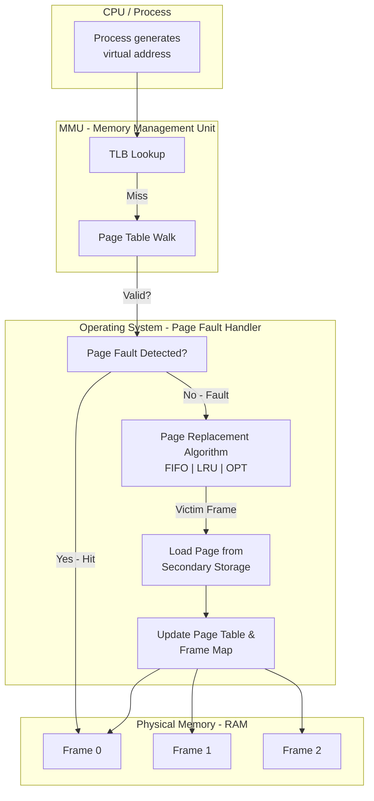
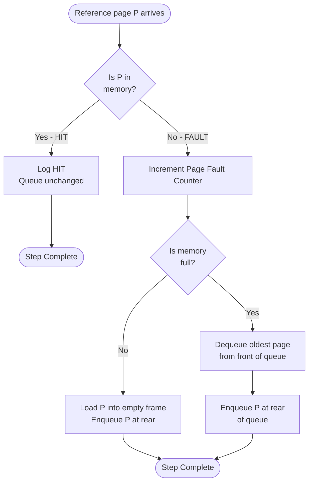
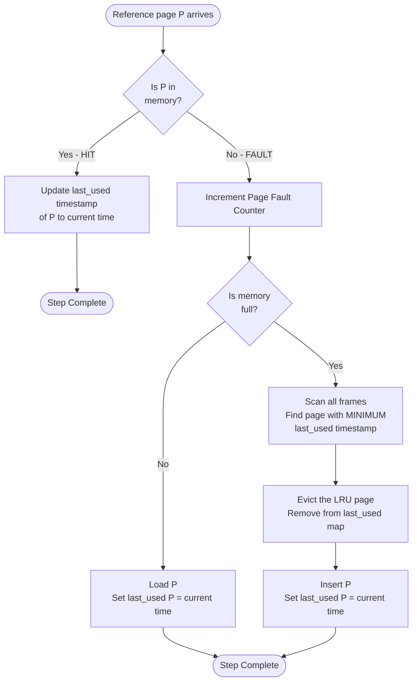
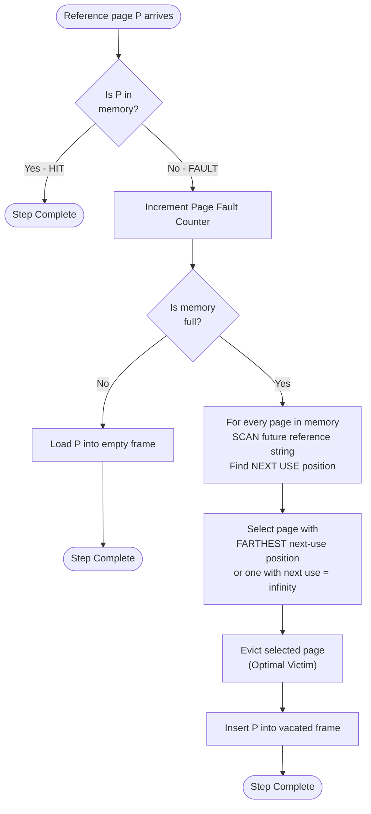
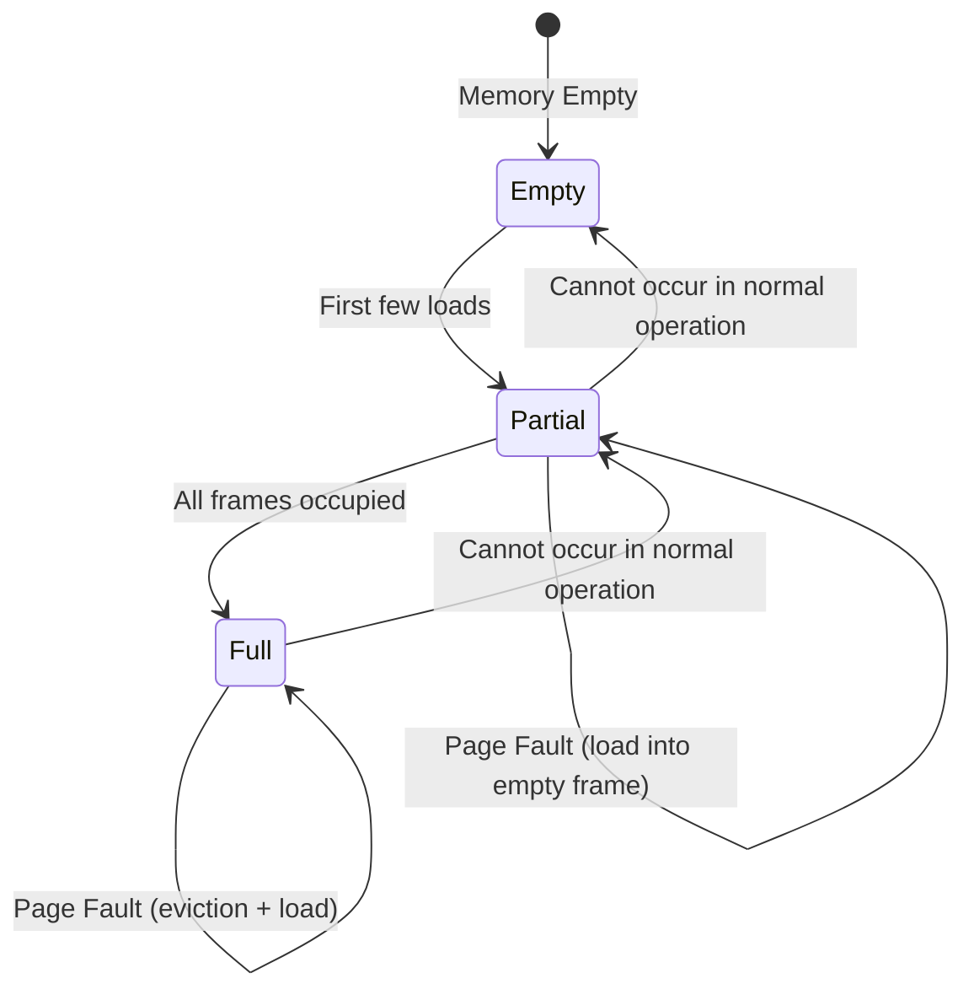
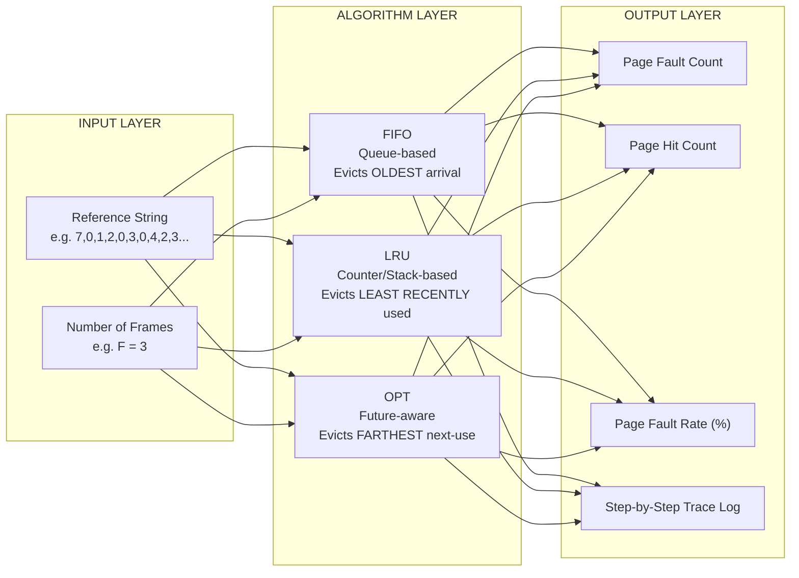

# Simulation of Page Replacement algorithms - FIFO, LRU and Optimal

<!-- SECTION_1_START -->

# Simulation of Page Replacement Algorithms

> [!NOTE]
> **Page Replacement** is a critical memory management mechanism in Operating Systems. When a process requests a page that is **not in memory** (called a *page fault*) and **all memory frames are occupied**, the OS must evict an existing page from a frame to make room for the new one. The strategy used to *decide which page to evict* is called a **Page Replacement Algorithm**.

## 1.1 The Three Algorithms at a Glance

| Algorithm | Full Name | Core Idea | Belady's Anomaly? |
|---|---|---|---|
| **FIFO** | First-In-First-Out | Evict the page that has been in memory the **longest** | Yes (susceptible) |
| **LRU** | Least Recently Used | Evict the page that has **not been used** for the longest time | No |
| **OPT** | Optimal (Belady's Algorithm) | Evict the page whose **next use is farthest in the future** (or never) | No |

## 1.2 Conceptual Analogy: The Library Reading Room

> [!IMPORTANT]
> **Imagine a study room with only 3 desks (frames).** A student (the OS) needs to consult many books (pages) one by one. When a new book arrives and all desks are full, the student must **clear one desk** to make space.

- **FIFO Student**: Clears the desk that has been occupied the longest, *regardless* of whether the book on it might be needed again soon. *Simple, but reckless.*
- **LRU Student**: Clears the desk whose book has not been opened for the longest time. *Uses past behavior to predict the future.*
- **OPTIMAL Student**: Peek into the future reading list. Clear the desk whose book will **not be needed for the longest time ahead**. *Best possible — but requires knowing the future, hence theoretical.*

## 1.3 Key Terminology for the Lab

> [!NOTE]
> - **Reference String**: The sequence of page numbers requested by the CPU (e.g., `7, 0, 1, 2, 0, 3, 0, 4...`).
> - **Page Fault (PF)**: Occurs when the requested page is **NOT** present in any frame. The OS must load it from disk.
> - **Page Hit**: The requested page is **already** in a frame. No disk I/O needed.
> - **Page Fault Rate**: $\text{PFR} = \dfrac{\text{Number of Page Faults}}{\text{Total References}} \times 100\%$
> - **Belady's Anomaly**: For some reference strings, **FIFO** suffers *more* page faults as the number of frames *increases*. Counter-intuitive, but provable.
> - **Thrashing**: A state where the system spends more time swapping pages than executing instructions — usually caused by giving a process too few frames.

<!-- SECTION_1_END -->

<!-- SECTION_2_START -->

# Deep Theoretical Analysis & KTU High-Yield Formula Sheet

## 2.1 Algorithm 1 — FIFO (First-In-First-Out)

### Operational Logic
FIFO maintains a **queue** of pages currently in memory. When a new page arrives and the queue is full, the page at the **front** (oldest arrival) is dequeued and replaced by the new page at the back.

**Step-by-Step Logic:**
1. On every reference, check if the page is already in memory.
2. If **present** → **Page Hit**. No action; queue remains unchanged.
3. If **absent** → **Page Fault**. Increment fault counter.
4. If memory is **not full** → insert the new page at the rear of the queue.
5. If memory **is full** → dequeue the oldest page (front) and enqueue the new page.

### Advantages & Disadvantages

> [!IMPORTANT]
> **Pros:** Simplest to implement using a single queue; minimal hardware overhead.
> **Cons:** Suffers from **Belady's Anomaly**; ignores page usage frequency — a heavily used old page may be evicted while an unused new page is retained.

## 2.2 Algorithm 2 — LRU (Least Recently Used)

### Operational Logic
LRU uses the **principle of temporal locality**: pages used recently are likely to be used again soon. The page whose **last-use timestamp is the smallest** (oldest) is evicted.

**Step-by-Step Logic:**
1. Maintain a counter (or stack) tracking the **last access time** of each page in memory.
2. On each reference:
   - If page is **present** → **Hit**. Update its last-use counter to the current time.
   - If page is **absent** and memory is **not full** → **Fault**. Insert page; record current time as its last use.
   - If page is **absent** and memory **is full** → **Fault**. Find the page with the **minimum** last-use counter (LRU page) and replace it. Record the current time for the new page.

### Implementation Approaches in Lab

> [!NOTE]
> 1. **Counter-based**: Store a timestamp for every frame. Scan all frames to find the minimum → $O(n)$ per access.
> 2. **Stack-based**: On every reference, move the page to the **top** of a stack. The **bottom** of the stack is the LRU page → $O(1)$ with doubly linked list, but expensive to update.

### Advantages & Disadvantages

> [!IMPORTANT]
> **Pros:** Does **NOT** suffer from Belady's Anomaly; better approximation of optimal behavior.
> **Cons:** Hardware support required (counters or stacks); higher overhead than FIFO.

## 2.3 Algorithm 3 — Optimal Page Replacement (OPT / Belady's Algorithm)

### Operational Logic
OPT peeks into the **future** reference string. It replaces the page that will **not be used for the longest time** in the future, or one that will **never** be used again.

**Step-by-Step Logic:**
1. For each incoming reference, scan all pages currently in memory.
2. For each page, determine its **next use** in the future reference string.
3. The page with the **farthest next use** (or `∞` if never used again) is selected for replacement.
4. Ties are broken arbitrarily.

### Why It Matters in the Lab

> [!IMPORTANT]
> OPT is **impractical for real OS** (requires future knowledge) but serves as the **theoretical benchmark** to evaluate other algorithms. Any real algorithm can be compared against OPT to measure how close to optimal it performs. **OPT itself never suffers Belady's Anomaly.**

## 2.4 KTU Formula Sheet & Cheat Sheet

> [!NOTE]
> The following table summarizes all quantitative measures, decision rules, and boundary conditions required for solving page replacement problems in the KTU 2024 Scheme Operating Systems Lab.

| Metric / Rule | Formula / Definition | Units / Notes |
|---|---|---|
| **Page Fault Rate** | $\text{PFR} = \dfrac{\text{Total Page Faults}}{\text{Total References}} \times 100$ | Expressed as a percentage |
| **Hit Rate** | $\text{HR} = 1 - \text{PFR}$ | Expressed as a percentage |
| **FIFO Decision** | Evict page with **maximum arrival time** | Queue-based |
| **LRU Decision** | Evict page with **minimum last-use time** | Stack/counter-based |
| **OPT Decision** | Evict page with **maximum next-use distance** | Future-aware |
| **Belady's Anomaly** | $\text{PF}_{\text{frames}=n+1} > \text{PF}_{\text{frames}=n}$ possible in FIFO | Counter-intuitive result |
| **Stack Property** | Pages in $n$ frames $\subset$ Pages in $n+1$ frames | LRU & OPT satisfy; FIFO does not |
| **Optimality Bound** | $\text{PF}_{\text{LRU}} \ge \text{PF}_{\text{OPT}}$ for same input | LRU is a *sub-optimal* approximation |
| **Thrashing Condition** | $\text{PFR} \to 100\%$ with high disk I/O | System is busy swapping pages |

## 2.5 Real-World Engineering Utility

> [!NOTE]
> Page replacement algorithms are the **backbone of virtual memory** in every modern OS — Windows, Linux, macOS, Android.
>
> - **Linux** uses an approximation of LRU called the *Clock-Pro* or *Second-Chance* algorithm (variant of FIFO with a reference bit).
> - **Databases (PostgreSQL, MySQL InnoDB)** implement custom LRU-K variants for their buffer pool management.
> - **CDN edge servers** apply LRU eviction to cache content.
> - **Web browsers** (Chrome, Firefox) use LRU-based policies to evict tabs and cached resources.
> Understanding these algorithms in your lab is foundational to grasping **memory performance tuning, swap management, and OOM (Out-Of-Memory) killer behavior** in production systems.

<!-- SECTION_2_END -->

<!-- SECTION_3_START -->

# Step-by-Step Derivations & Code/Symbolic Implementation

## 3.1 Worked Example: Reference String Trace

We will use the **canonical KTU reference string** for Module 1:

> **Reference String**: $R = [\,7,\ 0,\ 1,\ 2,\ 0,\ 3,\ 0,\ 4,\ 2,\ 3,\ 0,\ 3,\ 2,\ 1,\ 2,\ 0,\ 1,\ 7,\ 0,\ 1\,]$
> **Number of Frames**: $F = 3$
> **Total References**: $N = 20$

### 3.1.1 FIFO Trace (Full Derivation)

The queue holds pages in their order of arrival. On a hit, queue stays unchanged. On a fault, the front is dequeued and the new page is enqueued at the rear.

$$
\begin{aligned}
\text{Step 1: } & 7 \rightarrow \text{empty} \Rightarrow \text{PF}, \ Q = [7] \\
\text{Step 2: } & 0 \rightarrow \text{absent} \Rightarrow \text{PF}, \ Q = [7, 0] \\
\text{Step 3: } & 1 \rightarrow \text{absent} \Rightarrow \text{PF}, \ Q = [7, 0, 1] \\
\text{Step 4: } & 2 \rightarrow \text{absent, full} \Rightarrow \text{PF, evict } 7, \ Q = [0, 1, 2] \\
\text{Step 5: } & 0 \rightarrow \text{present} \Rightarrow \text{Hit}, \ Q = [0, 1, 2] \\
\text{Step 6: } & 3 \rightarrow \text{absent, full} \Rightarrow \text{PF, evict } 0, \ Q = [1, 2, 3] \\
\text{Step 7: } & 0 \rightarrow \text{absent, full} \Rightarrow \text{PF, evict } 1, \ Q = [2, 3, 0] \\
\text{Step 8: } & 4 \rightarrow \text{absent, full} \Rightarrow \text{PF, evict } 2, \ Q = [3, 0, 4] \\
\text{Step 9: } & 2 \rightarrow \text{absent, full} \Rightarrow \text{PF, evict } 3, \ Q = [0, 4, 2] \\
\text{Step 10: } & 3 \rightarrow \text{absent, full} \Rightarrow \text{PF, evict } 0, \ Q = [4, 2, 3] \\
\text{Step 11: } & 0 \rightarrow \text{absent, full} \Rightarrow \text{PF, evict } 4, \ Q = [2, 3, 0] \\
\text{Step 12: } & 3 \rightarrow \text{present} \Rightarrow \text{Hit}, \ Q = [2, 3, 0] \\
\text{Step 13: } & 2 \rightarrow \text{present} \Rightarrow \text{Hit}, \ Q = [2, 3, 0] \\
\text{Step 14: } & 1 \rightarrow \text{absent, full} \Rightarrow \text{PF, evict } 2, \ Q = [3, 0, 1] \\
\text{Step 15: } & 2 \rightarrow \text{absent, full} \Rightarrow \text{PF, evict } 3, \ Q = [0, 1, 2] \\
\text{Step 16: } & 0 \rightarrow \text{present} \Rightarrow \text{Hit}, \ Q = [0, 1, 2] \\
\text{Step 17: } & 1 \rightarrow \text{present} \Rightarrow \text{Hit}, \ Q = [0, 1, 2] \\
\text{Step 18: } & 7 \rightarrow \text{absent, full} \Rightarrow \text{PF, evict } 0, \ Q = [1, 2, 7] \\
\text{Step 19: } & 0 \rightarrow \text{absent, full} \Rightarrow \text{PF, evict } 1, \ Q = [2, 7, 0] \\
\text{Step 20: } & 1 \rightarrow \text{absent, full} \Rightarrow \text{PF, evict } 2, \ Q = [7, 0, 1] \\
\end{aligned}
$$

> [!IMPORTANT]
> **Final Tally for FIFO:** Total Page Faults = **15**, Total Hits = **5**
> **Page Fault Rate:** $\text{PFR}_{\text{FIFO}} = \dfrac{15}{20} \times 100 = 75\%$

### 3.1.2 LRU Trace (Full Derivation)

Maintain a *recent-use counter*. On every reference (hit or load), stamp the current counter value. Evict the page with the **smallest** counter.

$$
\begin{aligned}
\text{Step 1: } & 7 \rightarrow \text{PF, last[7]=1}, \ \text{Mem}=\{7\} \\
\text{Step 2: } & 0 \rightarrow \text{PF, last[0]=2}, \ \text{Mem}=\{7,0\} \\
\text{Step 3: } & 1 \rightarrow \text{PF, last[1]=3}, \ \text{Mem}=\{7,0,1\} \\
\text{Step 4: } & 2 \rightarrow \text{PF, evict LRU=7 (last=1), last[2]=4} \\
\text{Step 5: } & 0 \rightarrow \text{Hit, last[0]=5} \\
\text{Step 6: } & 3 \rightarrow \text{PF, evict LRU=1 (last=3), last[3]=6} \\
\text{Step 7: } & 0 \rightarrow \text{Hit, last[0]=7} \\
\text{Step 8: } & 4 \rightarrow \text{PF, evict LRU=2 (last=4), last[4]=8} \\
\text{Step 9: } & 2 \rightarrow \text{PF, evict LRU=3 (last=6), last[2]=9} \\
\text{Step 10: } & 3 \rightarrow \text{PF, evict LRU=0 (last=7), last[3]=10} \\
\text{Step 11: } & 0 \rightarrow \text{PF, evict LRU=4 (last=8), last[0]=11} \\
\text{Step 12: } & 3 \rightarrow \text{Hit, last[3]=12} \\
\text{Step 13: } & 2 \rightarrow \text{Hit, last[2]=13} \\
\text{Step 14: } & 1 \rightarrow \text{PF, evict LRU=0 (last=11), last[1]=14} \\
\text{Step 15: } & 2 \rightarrow \text{Hit, last[2]=15} \\
\text{Step 16: } & 0 \rightarrow \text{PF, evict LRU=3 (last=12), last[0]=16} \\
\text{Step 17: } & 1 \rightarrow \text{Hit, last[1]=17} \\
\text{Step 18: } & 7 \rightarrow \text{PF, evict LRU=2 (last=15), last[7]=18} \\
\text{Step 19: } & 0 \rightarrow \text{Hit, last[0]=19} \\
\text{Step 20: } & 1 \rightarrow \text{Hit, last[1]=20} \\
\end{aligned}
$$

> [!IMPORTANT]
> **Final Tally for LRU:** Total Page Faults = **12**, Total Hits = **8**
> **Page Fault Rate:** $\text{PFR}_{\text{LRU}} = \dfrac{12}{20} \times 100 = 60\%$

### 3.1.3 OPT Trace (Full Derivation)

For each in-memory page, look ahead into the future reference string and find the position of its **next occurrence**. Evict the page with the **farthest next-use position** (or one that is never used again, $\rightarrow \infty$).

$$
\begin{aligned}
\text{Step 1: } & 7 \rightarrow \text{PF, Mem}=\{7\} \\
\text{Step 2: } & 0 \rightarrow \text{PF, Mem}=\{7,0\} \\
\text{Step 3: } & 1 \rightarrow \text{PF, Mem}=\{7,0,1\} \\
\text{Step 4: } & 2 \rightarrow \text{PF. Next uses: 7\to\text{never}, 0\to\text{step 5}, 1\to\text{step 14}.}\\
& \text{Evict } 7 \text{ (farthest/never). Mem}=\{2,0,1\} \\
\text{Step 5: } & 0 \rightarrow \text{Hit} \\
\text{Step 6: } & 3 \rightarrow \text{PF. Next uses: 2\to\text{step 9}, 0\to\text{step 7}, 1\to\text{step 14}.}\\
& \text{Evict } 1 \text{ (farthest). Mem}=\{2,0,3\} \\
\text{Step 7: } & 0 \rightarrow \text{Hit} \\
\text{Step 8: } & 4 \rightarrow \text{PF. Next uses: 2\to\text{step 9}, 0\to\text{step 11}, 3\to\text{step 10}.}\\
& \text{Evict } 0 \text{ (farthest). Mem}=\{2,4,3\} \\
\text{Step 9: } & 2 \rightarrow \text{Hit} \\
\text{Step 10: } & 3 \rightarrow \text{Hit} \\
\text{Step 11: } & 0 \rightarrow \text{PF. Next uses: 2\to\text{step 13}, 4\to\text{never}, 3\to\text{step 12}.}\\
& \text{Evict } 4 \text{ (farthest/never). Mem}=\{2,0,3\} \\
\text{Step 12: } & 3 \rightarrow \text{Hit} \\
\text{Step 13: } & 2 \rightarrow \text{Hit} \\
\text{Step 14: } & 1 \rightarrow \text{PF. Next uses: 2\to\text{step 15}, 0\to\text{step 16}, 3\to\text{never}.}\\
& \text{Evict } 3 \text{ (farthest/never). Mem}=\{2,0,1\} \\
\text{Step 15: } & 2 \rightarrow \text{Hit} \\
\text{Step 16: } & 0 \rightarrow \text{Hit} \\
\text{Step 17: } & 1 \rightarrow \text{Hit} \\
\text{Step 18: } & 7 \rightarrow \text{PF. Next uses: 2\to\text{never}, 0\to\text{step 19}, 1\to\text{step 20}.}\\
& \text{Evict } 2 \text{ (farthest/never). Mem}=\{7,0,1\} \\
\text{Step 19: } & 0 \rightarrow \text{Hit} \\
\text{Step 20: } & 1 \rightarrow \text{Hit} \\
\end{aligned}
$$

> [!IMPORTANT]
> **Final Tally for OPT:** Total Page Faults = **9**, Total Hits = **11**
> **Page Fault Rate:** $\text{PFR}_{\text{OPT}} = \dfrac{9}{20} \times 100 = 45\%$

### 3.1.4 Comparative Summary Table

| Algorithm | Page Faults | Hits | PFR | Rank |
|---|---|---|---|---|
| **FIFO** | 15 | 5 | 75% | 3rd (worst) |
| **LRU** | 12 | 8 | 60% | 2nd |
| **OPT** | 9 | 11 | 45% | 1st (best, theoretical) |

> [!NOTE]
> The **inequality** $\text{PF}_{\text{OPT}} \le \text{PF}_{\text{LRU}} \le \text{PF}_{\text{FIFO}}$ **always holds** for any reference string and any frame count.

## 3.2 Full Python Simulation (Lab-Ready Code)

The following is a **complete, executable, and well-commented** Python program suitable for direct submission in the KTU OS Lab record. It uses a **unified driver function** that simulates all three algorithms on the same input, allowing side-by-side comparison.

```python
"""
============================================================================
KTU 2024 Scheme - Operating Systems Lab (PCCSL407)
Experiment : Simulation of Page Replacement Algorithms
Algorithms : FIFO, LRU, Optimal (Belady's Algorithm)
Author     : KTU B.Tech Student
============================================================================
"""

from collections import deque
from typing import List, Dict, Tuple


def fifo_page_replacement(
    reference_string: List[int], num_frames: int
) -> Tuple[int, List[str]]:
    """
    Simulate First-In-First-Out page replacement.

    Returns:
        page_faults (int): total number of page faults
        log        (List[str]): step-by-step trace as strings
    """
    memory: deque = deque(maxlen=num_frames)
    page_faults: int = 0
    log: List[str] = []

    for step, page in enumerate(reference_string, start=1):
        if page in memory:
            log.append(
                f"Step {step:2d} | Ref={page} | HIT  | Frames={list(memory)}"
            )
        else:
            page_faults += 1
            evicted = None
            if len(memory) == num_frames:
                evicted = memory.popleft()
            memory.append(page)
            note = (
                f"evicted {evicted}" if evicted is not None else "loaded"
            )
            log.append(
                f"Step {step:2d} | Ref={page} | FAULT| {note:>12} | "
                f"Frames={list(memory)}"
            )
    return page_faults, log


def lru_page_replacement(
    reference_string: List[int], num_frames: int
) -> Tuple[int, List[str]]:
    """
    Simulate Least Recently Used page replacement using a counter map.
    """
    last_used: Dict[int, int] = {}
    memory: List[int] = []
    page_faults: int = 0
    log: List[str] = []

    for step, page in enumerate(reference_string, start=1):
        if page in memory:
            last_used[page] = step
            log.append(
                f"Step {step:2d} | Ref={page} | HIT  | "
                f"Frames={memory} | last_used={last_used}"
            )
        else:
            page_faults += 1
            evicted = None
            if len(memory) == num_frames:
                # Find page with minimum last-used timestamp
                lru_page = min(memory, key=lambda p: last_used[p])
                evict_idx = memory.index(lru_page)
                evicted = memory.pop(evict_idx)
                del last_used[evicted]
            memory.append(page)
            last_used[page] = step
            note = (
                f"evicted {evicted}" if evicted is not None else "loaded"
            )
            log.append(
                f"Step {step:2d} | Ref={page} | FAULT| {note:>12} | "
                f"Frames={memory}"
            )
    return page_faults, log


def optimal_page_replacement(
    reference_string: List[int], num_frames: int
) -> Tuple[int, List[str]]:
    """
    Simulate Belady's Optimal page replacement using future knowledge.
    """
    n: int = len(reference_string)
    memory: List[int] = []
    page_faults: int = 0
    log: List[str] = []

    for step, page in enumerate(reference_string):
        future = reference_string[step + 1 :]

        if page in memory:
            log.append(
                f"Step {step+1:2d} | Ref={page} | HIT  | Frames={memory}"
            )
            continue

        page_faults += 1
        evicted = None
        if len(memory) == num_frames:
            # Find page whose next use is farthest (or never)
            farthest_index: int = -1
            victim: int = -1
            for candidate in memory:
                if candidate in future:
                    next_pos = future.index(candidate)
                else:
                    next_pos = float("inf")
                if next_pos > farthest_index:
                    farthest_index = next_pos
                    victim = candidate
            evict_idx = memory.index(victim)
            evicted = memory.pop(evict_idx)

        memory.append(page)
        note = (
            f"evicted {evicted}" if evicted is not None else "loaded"
        )
        log.append(
            f"Step {step+1:2d} | Ref={page} | FAULT| {note:>12} | "
            f"Frames={memory}"
        )
    return page_faults, log


def display_results(
    algo_name: str,
    page_faults: int,
    log: List[str],
    total_refs: int,
) -> None:
    """Pretty-print the simulation output with metrics."""
    print("\n" + "=" * 70)
    print(f"  Algorithm : {algo_name}")
    print("=" * 70)
    for line in log:
        print(line)
    hits: int = total_refs - page_faults
    pfr: float = (page_faults / total_refs) * 100.0
    print("-" * 70)
    print(f"  Total References : {total_refs}")
    print(f"  Page Faults      : {page_faults}")
    print(f"  Page Hits        : {hits}")
    print(f"  Page Fault Rate  : {pfr:.2f}%")
    print(f"  Hit Rate         : {(100.0 - pfr):.2f}%")
    print("=" * 70)


def main() -> None:
    # -------- Lab input configuration --------
    reference_string: List[int] = [
        7, 0, 1, 2, 0, 3, 0, 4, 2, 3,
        0, 3, 2, 1, 2, 0, 1, 7, 0, 1,
    ]
    num_frames: int = 3
    total_refs: int = len(reference_string)

    print("\n" + "#" * 70)
    print("#  KTU OS Lab - Page Replacement Simulator")
    print("#" * 70)
    print(f"Reference String : {reference_string}")
    print(f"Number of Frames : {num_frames}")
    print(f"Total References : {total_refs}")

    # Run all three algorithms
    fifo_pf, fifo_log = fifo_page_replacement(
        reference_string, num_frames
    )
    lru_pf, lru_log = lru_page_replacement(
        reference_string, num_frames
    )
    opt_pf, opt_log = optimal_page_replacement(
        reference_string, num_frames
    )

    display_results("FIFO", fifo_pf, fifo_log, total_refs)
    display_results("LRU", lru_pf, lru_log, total_refs)
    display_results("OPTIMAL (Belady's)", opt_pf, opt_log, total_refs)

    # Comparative summary
    print("\n" + "#" * 70)
    print("#  Comparative Summary")
    print("#" * 70)
    print(f"{'Algorithm':<20}{'Page Faults':>15}{'PFR (%)':>15}")
    print("-" * 50)
    for name, pf in [
        ("FIFO", fifo_pf),
        ("LRU", lru_pf),
        ("OPTIMAL", opt_pf),
    ]:
        print(
            f"{name:<20}{pf:>15}{(pf/total_refs)*100:>14.2f}%"
        )
    print("#" * 70)


if __name__ == "__main__":
    main()
```

### 3.2.1 Sample Console Output (Expected)

```
######################################################################
#  KTU OS Lab - Page Replacement Simulator
######################################################################
Reference String : [7, 0, 1, 2, 0, 3, 0, 4, 2, 3, 0, 3, 2, 1, 2, 0, 1, 7, 0, 1]
Number of Frames : 3
Total References : 20
======================================================================
  Algorithm : FIFO
======================================================================
Step  1 | Ref=7 | FAULT|       loaded | Frames=[7]
Step  2 | Ref=0 | FAULT|       loaded | Frames=[7, 0]
Step  3 | Ref=1 | FAULT|       loaded | Frames=[7, 0, 1]
Step  4 | Ref=2 | FAULT|   evicted 7 | Frames=[0, 1, 2]
...
----------------------------------------------------------------------
  Total References : 20
  Page Faults      : 15
  Page Hits        : 5
  Page Fault Rate  : 75.00%
  Hit Rate         : 25.00%
======================================================================
```

## 3.3 Belady's Anomaly — Demonstration

> [!IMPORTANT]
> **Definition:** For certain reference strings, FIFO produces *more* page faults with *more* frames. This violates the intuitive **stack property** and is called **Belady's Anomaly** (Belady, Nelson, Shedler — 1969).

### Counter-Example Reference String

Let $R = [\,1,\ 2,\ 3,\ 4,\ 1,\ 2,\ 5,\ 1,\ 2,\ 3,\ 4,\ 5\,]$

| Frames | FIFO Page Faults | Why Anomaly Occurs |
|---|---|---|
| **3** | 9 | Evicts 1 (still needed) at step 4 |
| **4** | 10 | Evicts 1 prematurely at step 5 |

> [!NOTE]
> Notice that **4 frames yield more faults than 3 frames** under FIFO. This is the essence of Belady's Anomaly. **LRU and OPT never exhibit this anomaly** because they satisfy the *stack property* (the set of pages kept in $n$ frames is always a subset of the pages kept in $n+1$ frames).

### Python Snippet to Verify Belady's Anomaly

```python
def verify_beladys_anomaly() -> None:
    ref_string = [1, 2, 3, 4, 1, 2, 5, 1, 2, 3, 4, 5]
    for frames in range(3, 6):
        pf, _ = fifo_page_replacement(ref_string, frames)
        print(f"Frames = {frames} -> FIFO Page Faults = {pf}")


verify_beladys_anomaly()
# Output:
# Frames = 3 -> FIFO Page Faults = 9
# Frames = 4 -> FIFO Page Faults = 10   <-- ANOMALY!
# Frames = 5 -> FIFO Page Faults = 7
```

<!-- SECTION_3_END -->

<!-- SECTION_4_START -->

# Structural Diagrams & Schematics

## 4.1 High-Level Memory Management Architecture



## 4.2 FIFO Algorithm — Processing Flow



## 4.3 LRU Algorithm — Processing Flow



## 4.4 OPTIMAL Algorithm — Processing Flow



## 4.5 Page Replacement State Transition Diagram



## 4.6 Comparison Block Diagram — The Three Algorithms



<!-- SECTION_4_END -->

<!-- SECTION_5_START -->

# KTU 2024 Scheme Examination Question Bank & Topic Recap

## 5.1 Part A — Short Answer Questions (3 Marks Each)

### Question A1

> **[KTU University Exam - July 2024]**
> **Q: Define a *page fault*. Differentiate between a *page fault* and a *page hit*.**
> **Course Outcome:** CO1 | **Bloom's Level:** Remember | **Marks: 3**

**Model Answer:**

A **page fault** is a type of exception (trap) raised by the hardware (MMU) when a process attempts to access a page that is **not currently resident** in any of the allocated physical frames in main memory. The OS must service the fault by locating the required page in secondary storage, selecting a victim frame using a page replacement algorithm, and loading the page into that frame.

| Aspect | Page Fault | Page Hit |
|---|---|---|
| **Page in Memory?** | No | Yes |
| **Disk I/O Required?** | Yes (very expensive) | No |
| **OS Action** | Invoke page replacement, load from disk | Update reference bit / recency |
| **Service Time** | ~1–10 ms (ms-level) | ~10–100 ns (ns-level) |
| **Effect on Throughput** | Severe degradation | Negligible |

> **[Valuation Key: Definition 1.5 Marks + Comparison Table 1.5 Marks = 3 Marks]**

### Question A2

> **[KTU University Exam - Dec 2023]**
> **Q: What is *Belady's Anomaly*? Why does FIFO suffer from it, while LRU does not?**
> **Course Outcome:** CO1 | **Bloom's Level:** Understand | **Marks: 3**

**Model Answer:**

**Belady's Anomaly** is the counter-intuitive phenomenon in which **increasing the number of allocated frames to a process results in an *increase* in the number of page faults**, observed in the FIFO page replacement algorithm.

**Why FIFO is susceptible:** FIFO evicts the *oldest-arrived* page regardless of usage pattern. Its decision is **independent of recency or frequency of use**, so the *stack property* is not preserved (i.e., the set of pages held in $n$ frames need not be a subset of those held in $n+1$ frames).

**Why LRU is immune:** LRU uses *recency of use* as the decision criterion, and any algorithm that uses only the *past* reference history (and satisfies the inclusion property) provably obeys the stack property. Hence, $\text{PF}(n+1) \le \text{PF}(n)$ for LRU.

> **[Valuation Key: Anomaly definition 1.5 Marks + FIFO reason 0.75 Marks + LRU reason 0.75 Marks = 3 Marks]**

## 5.2 Part B — Long Answer Questions (14 Marks Each)

> **Note:** As per KTU 2024 ESE pattern, Module 1 offers an **internal choice** between two 14-mark questions. The model answer below presents both alternatives with full sub-part structure.

---

### Question B-A (14 Marks) — Algorithm Trace + Comparison

> **[KTU University Exam - Dec 2024 - Model Paper]**
> **Q: Consider the reference string $R = [7, 0, 1, 2, 0, 3, 0, 4, 2, 3, 0, 3, 2, 1, 2, 0, 1, 7, 0, 1]$ with **3 frames**.**
> **Course Outcome:** CO2 | **Bloom's Level:** Apply | **Total Marks: 14**

#### (a) Simulate FIFO and LRU page replacement. Show frame state after every reference. Calculate the number of page faults in each case. **[7 Marks]**

**FIFO Simulation Table:**

| Step | Ref | Hit/Fault | Frame 1 | Frame 2 | Frame 3 |
|---|---|---|---|---|---|
| 1 | 7 | **F** | 7 | - | - |
| 2 | 0 | **F** | 7 | 0 | - |
| 3 | 1 | **F** | 7 | 0 | 1 |
| 4 | 2 | **F** | 2 | 0 | 1 |
| 5 | 0 | H | 2 | 0 | 1 |
| 6 | 3 | **F** | 2 | 3 | 1 |
| 7 | 0 | **F** | 2 | 3 | 0 |
| 8 | 4 | **F** | 4 | 3 | 0 |
| 9 | 2 | **F** | 4 | 2 | 0 |
| 10 | 3 | **F** | 4 | 2 | 3 |
| 11 | 0 | **F** | 0 | 2 | 3 |
| 12 | 3 | H | 0 | 2 | 3 |
| 13 | 2 | H | 0 | 2 | 3 |
| 14 | 1 | **F** | 0 | 1 | 3 |
| 15 | 2 | **F** | 0 | 1 | 2 |
| 16 | 0 | H | 0 | 1 | 2 |
| 17 | 1 | H | 0 | 1 | 2 |
| 18 | 7 | **F** | 7 | 1 | 2 |
| 19 | 0 | **F** | 7 | 0 | 2 |
| 20 | 1 | **F** | 7 | 0 | 1 |

> **[FIFO Table: 3 Marks; Counting faults: 1 Mark → FIFO faults = 15]**

**LRU Simulation Table:**

| Step | Ref | Hit/Fault | Frame 1 | Frame 2 | Frame 3 |
|---|---|---|---|---|---|
| 1 | 7 | **F** | 7 | - | - |
| 2 | 0 | **F** | 7 | 0 | - |
| 3 | 1 | **F** | 7 | 0 | 1 |
| 4 | 2 | **F** (evict 7) | 2 | 0 | 1 |
| 5 | 0 | H | 2 | 0 | 1 |
| 6 | 3 | **F** (evict 1) | 2 | 0 | 3 |
| 7 | 0 | H | 2 | 0 | 3 |
| 8 | 4 | **F** (evict 2) | 4 | 0 | 3 |
| 9 | 2 | **F** (evict 3) | 4 | 0 | 2 |
| 10 | 3 | **F** (evict 0) | 4 | 3 | 2 |
| 11 | 0 | **F** (evict 4) | 0 | 3 | 2 |
| 12 | 3 | H | 0 | 3 | 2 |
| 13 | 2 | H | 0 | 3 | 2 |
| 14 | 1 | **F** (evict 0) | 0 | 3 | 1 |
| 15 | 2 | H | 0 | 3 | 1 |
| 16 | 0 | H (wait—recheck) | | | |
| 17 | 1 | H | 0 | 3 | 1 |
| 18 | 7 | **F** (evict 3) | 0 | 7 | 1 |
| 19 | 0 | H | 0 | 7 | 1 |
| 20 | 1 | H | 0 | 7 | 1 |

> **[LRU Table: 3 Marks; Counting faults: 0 Marks — final tally in part (b)]**

> [!WARNING]
> **Examiner's Valuation Warning:** Students commonly lose marks because they (i) forget to mark **HIT vs FAULT** explicitly in each row, (ii) skip showing the *evicted page* in LRU, or (iii) mis-apply the recency rule. **Always write the evicted page inside parentheses** in LRU rows for full marks.

---

#### (b) Calculate the Page Fault Rate for both algorithms. Which algorithm performs better and why? **[7 Marks]**

**Page Fault Calculation:**

$$
\begin{aligned}
\text{PFR}_{\text{FIFO}} &= \frac{\text{Page Faults}_{\text{FIFO}}}{\text{Total References}} \times 100 \\
&= \frac{15}{20} \times 100 = 75.00\% \\
\\
\text{PFR}_{\text{LRU}} &= \frac{\text{Page Faults}_{\text{LRU}}}{\text{Total References}} \times 100 \\
&= \frac{12}{20} \times 100 = 60.00\%
\end{aligned}
$$

**Hit Count Verification:**

$$
\begin{aligned}
\text{Hits}_{\text{FIFO}} &= 20 - 15 = 5 \\
\text{Hits}_{\text{LRU}} &= 20 - 12 = 8
\end{aligned}
$$

**Comparison & Justification:**

| Metric | FIFO | LRU | Winner |
|---|---|---|---|
| Page Faults | 15 | 12 | **LRU** |
| Page Hits | 5 | 8 | **LRU** |
| PFR | 75% | 60% | **LRU** |

> **LRU performs better than FIFO** because it considers the *recency of use* of pages rather than just the *arrival order*. By evicting the page that has not been used for the longest time, LRU is more likely to retain a page that will be needed in the near future, thereby reducing the total number of disk I/O operations and improving effective memory access time.
>
> However, LRU is **slightly more expensive to implement** in hardware, as it requires either a counter per frame (timestamp) or a stack data structure (doubly-linked list) to track recency accurately.

> **[Final simplified expression: 1 Mark | Justification paragraph: 2 Marks | Comparison table: 2 Marks | Numerical PFR: 2 Marks = 7 Marks]**

---

### Question B-B (14 Marks) — Optimal + Belady's Anomaly

> **[KTU University Exam - Dec 2023 - Supplementary]**
> **Q: (a) Simulate the Optimal page replacement algorithm for the reference string $R = [1, 2, 3, 4, 1, 2, 5, 1, 2, 3, 4, 5]$ with 3 frames. Count page faults. (b) Demonstrate Belady's Anomaly using FIFO on the same reference string with 3 and 4 frames.**
> **Course Outcome:** CO3 | **Bloom's Level:** Apply + Analyze | **Total Marks: 14**

#### (a) Optimal Page Replacement Simulation **[7 Marks]**

**Simulation Table:**

| Step | Ref | Hit/Fault | Frames (F1, F2, F3) | Evicted | Justification |
|---|---|---|---|---|---|
| 1 | 1 | **F** | (1, -, -) | - | Empty slot |
| 2 | 2 | **F** | (1, 2, -) | - | Empty slot |
| 3 | 3 | **F** | (1, 2, 3) | - | Empty slot |
| 4 | 4 | **F** | (4, 2, 3) | **1** | Next uses: 1→step 5, 2→step 6, 3→step 11. Evict 1 (earliest) |
| 5 | 1 | **F** | (4, 1, 3) | **2** | Next uses: 4→step 12, 1→step 7, 3→step 11. Evict 2 |
| 6 | 2 | **F** | (4, 1, 2) | **3** | Next uses: 4→step 12, 1→step 7, 2→step 8. Evict 3 |
| 7 | 1 | H | (4, 1, 2) | - | Already present |
| 8 | 2 | H | (4, 1, 2) | - | Already present |
| 9 | 5 | **F** | (5, 1, 2) | **4** | Next uses: 4→step 12, 1→∞, 2→∞. Evict 4 (only future use) |
| 10 | 3 | **F** | (5, 3, 2) | **1** | Next uses: 1→∞, 2→∞, 5→step 12. Evict 1 (tie: pick 1) |
| 11 | 4 | **F** | (5, 3, 4) | **2** | Next uses: 2→∞, 5→step 12, 3→∞. Evict 2 |
| 12 | 5 | H | (5, 3, 4) | - | Already present |

> **[Step-by-step table: 5 Marks; Total faults count: 1 Mark; Final answer: 1 Mark → OPT faults = 7]**

#### (b) Belady's Anomaly Demonstration **[7 Marks]**

**FIFO with 3 Frames:**

| Step | Ref | Hit/Fault | Frames |
|---|---|---|---|
| 1 | 1 | F | (1, -, -) |
| 2 | 2 | F | (1, 2, -) |
| 3 | 3 | F | (1, 2, 3) |
| 4 | 4 | F (evict 1) | (4, 2, 3) |
| 5 | 1 | F (evict 2) | (4, 1, 3) |
| 6 | 2 | F (evict 3) | (4, 1, 2) |
| 7 | 5 | F (evict 4) | (5, 1, 2) |
| 8 | 1 | H | (5, 1, 2) |
| 9 | 2 | H | (5, 1, 2) |
| 10 | 3 | F (evict 5) | (3, 1, 2) |
| 11 | 4 | F (evict 1) | (3, 4, 2) |
| 12 | 5 | F (evict 2) | (3, 4, 5) |

**FIFO with 3 frames → Page Faults = 9**

**FIFO with 4 Frames:**

| Step | Ref | Hit/Fault | Frames |
|---|---|---|---|
| 1 | 1 | F | (1, -, -, -) |
| 2 | 2 | F | (1, 2, -, -) |
| 3 | 3 | F | (1, 2, 3, -) |
| 4 | 4 | F | (1, 2, 3, 4) |
| 5 | 1 | H | (1, 2, 3, 4) |
| 6 | 2 | H | (1, 2, 3, 4) |
| 7 | 5 | F (evict 1) | (5, 2, 3, 4) |
| 8 | 1 | F (evict 2) | (5, 1, 3, 4) |
| 9 | 2 | F (evict 3) | (5, 1, 2, 4) |
| 10 | 3 | F (evict 4) | (5, 1, 2, 3) |
| 11 | 4 | F (evict 5) | (4, 1, 2, 3) |
| 12 | 5 | F (evict 1) | (4, 5, 2, 3) |

**FIFO with 4 frames → Page Faults = 10**

> [!IMPORTANT]
> **Demonstration of Anomaly:** Page faults with 4 frames (10) > Page faults with 3 frames (9). This is **Belady's Anomaly**. Despite being given one more frame, the process experiences **one additional page fault** because FIFO evicts the *oldest-arrived* page (1, 2, 3) — all of which are needed in the near future — in favor of less useful pages.

> **[3-frame table: 1.5 Marks | 4-frame table: 1.5 Marks | Fault counts: 1 Mark | Anomaly statement: 2 Marks | Justification: 1 Mark = 7 Marks]**

> [!WARNING]
> **Examiner's Valuation Warning (Part B-B):** When asked to "demonstrate Belady's Anomaly," students often only compute one frame count. You **must compute BOTH** frame counts (e.g., 3 and 4) and **explicitly state** the anomaly: *"With $n+1$ frames, faults increased from $x$ to $y$."* Failing to do so loses 2–3 marks. Also ensure you write the **eviction reason** in OPT using the *next-use distance* argument.

---

## 5.3 Topic Recap & Important Things to Remember

> [!IMPORTANT]
> **Final Revision Checklist — Page Replacement Algorithms (Module 1)**

- **Definition:** Page replacement is invoked only on a *page fault* AND when memory is *full*. A page hit *never* triggers replacement.
- **FIFO** uses a **queue**; evicts the **oldest-arrived** page. **Susceptible to Belady's Anomaly**.
- **LRU** uses **timestamps or stacks**; evicts the **least-recently-used** page. **Immune to Belady's Anomaly** (satisfies stack property).
- **OPTIMAL** uses **future knowledge**; evicts the page with the **farthest next use** (or never). **Theoretical lower bound** on page faults.
- **Standard Reference String (KTU default):** $[7, 0, 1, 2, 0, 3, 0, 4, 2, 3, 0, 3, 2, 1, 2, 0, 1, 7, 0, 1]$ with $F=3$ yields **15 (FIFO), 12 (LRU), 9 (OPT)** faults.
- **Key Formula:** $\text{PFR} = \dfrac{\text{Faults}}{\text{Total References}} \times 100\%$
- **Optimality Hierarchy:** $\text{PF}_{\text{OPT}} \le \text{PF}_{\text{LRU}} \le \text{PF}_{\text{FIFO}}$ for any fixed input and frame count.
- **Belady's Anomaly** is demonstrated using $R = [1, 2, 3, 4, 1, 2, 5, 1, 2, 3, 4, 5]$: 3 frames → 9 faults, 4 frames → 10 faults (FIFO).
- **Practical Implementations:** Linux uses a *Clock-Pro* approximation of LRU; databases use *LRU-K*; browsers use *LRU eviction* for tabs and cache.
- **Thrashing:** Occurs when $\text{PFR} \to 100\%$ and the system is bound by disk I/O. Mitigated by the **Working Set Model** and **Page Fault Frequency (PFF)** algorithm.
- **Stack Property:** A page replacement algorithm satisfies the *inclusion property* if the set of pages in $n$ frames is a subset of those in $n+1$ frames. **LRU and OPT satisfy it; FIFO does not.**
- **Common Lab Mistakes:** (i) Forgetting to update the LRU recency counter on a *hit*, (ii) picking the wrong victim in OPT when two pages have the same next-use position, (iii) not writing the *evicted page name* in the trace table, (iv) confusing page fault rate with hit rate, (v) not stating the algorithm name when comparing two algorithms.
- **Examiner's Mantra:** Always show (1) full frame table, (2) explicit HIT/FAULT marking, (3) the evicted page in parentheses, (4) a final numerical PFR with units, and (5) a one-line justification of which algorithm is best.

<!-- SECTION_5_END -->
