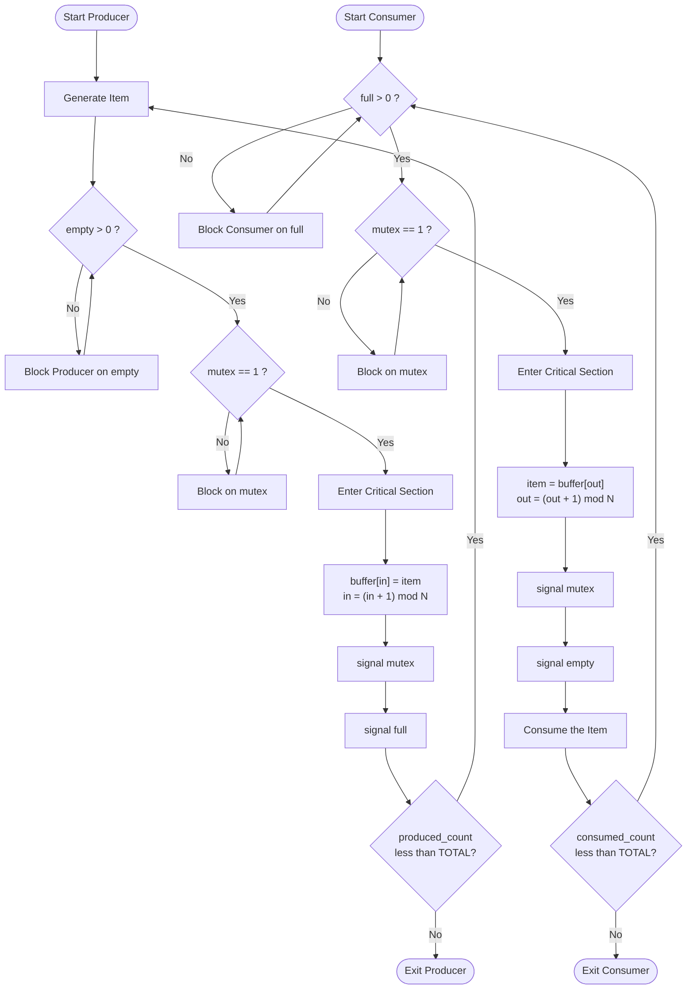

# Simulation of Process Synchronization using Semaphores - Producer-Consumer problem

<!-- SECTION_1_START -->
# Simulation of Process Synchronization using Semaphores — The Producer–Consumer Problem

## 1.1 Formal Academic Definition (KTU 2024 Syllabus Terminology)

> [!IMPORTANT]
> **Producer–Consumer Problem (Bounded Buffer Problem):** A classical process synchronization problem in which two concurrent processes — the *Producer* process, which generates data items and places them into a shared bounded buffer, and the *Consumer* process, which removes and consumes items from the same buffer — must coordinate their execution so that the producer does not attempt to insert into a full buffer and the consumer does not attempt to remove from an empty buffer. The problem is solved using **semaphores**, which are integer variables accessed only through two atomic (indivisible) operations commonly denoted as **P() / wait()** (proberen / test) and **V() / signal()** (verhogen / increment).

The KTU 2024 Scheme Operating Systems Lab (PCCSL407) treats this as the foundational synchronization experiment. The objective is to demonstrate **mutual exclusion** (only one process accesses the buffer at a time) and **condition synchronization** (producer waits when buffer is full, consumer waits when buffer is empty).

### 1.2 Conceptual Analogy / Intuition

> [!NOTE]
> **Real-world analogy — The Restaurant Kitchen:**
> Imagine a small restaurant with a **window shelf (bounded buffer)** that can hold only **N = 5 plates**. A **chef (producer)** cooks food and places it on the shelf. A **waiter (consumer)** picks up plates from the shelf and serves customers. The shelf has only one access window — only one person (chef OR waiter) can place/remove a plate at a time.
>
> - If the shelf is **full** (5 plates), the chef **must wait** until the waiter removes at least one plate.
> - If the shelf is **empty** (0 plates), the waiter **must wait** until the chef places at least one plate.
> - Only **one person** can touch the shelf at a time (no two people grabbing the same plate).
>
> The three rules governing this are:
> 1. The chef **counts empty slots** before placing a plate.
> 2. The waiter **counts filled slots** before taking a plate.
> 3. Both use a **shared lock** to ensure mutual access to the shelf.

This analogy directly maps to the three semaphores used in the algorithm:

| Real-world element | Operating System concept |
|---|---|
| Shelf access window | **Mutex** (binary semaphore, value = 1) |
| Number of empty slots on shelf | **`empty`** (counting semaphore, initial value = N) |
| Number of filled slots on shelf | **`full`** (counting semaphore, initial value = 0) |

### 1.3 Key Terminology

- **Race Condition:** A situation where multiple processes access and manipulate shared data concurrently, and the outcome depends on the non-deterministic order of execution.
- **Critical Section:** The portion of code that accesses the shared buffer (insert/remove operations) where race conditions could occur.
- **Semaphore:** A non-negative integer variable on which only two operations — `wait()` (decrement) and `signal()` (increment) — are allowed. The operations are **atomic**, meaning they cannot be interrupted once started.
- **Bounded Buffer:** A fixed-size circular or linear memory region shared between producer and consumer.
- **Deadlock:** A state where two or more processes are blocked forever, each waiting for the other to release a resource.

> [!VISUALIZATION CONTROL]
> **Concept:** Circular bounded buffer with `in` and `out` pointers
> **GeoGebra / Desmos Input Equations (manual sketch by student):**
> * Draw a circle, divide into N = 5 cells labeled $B[0], B[1], B[2], B[3], B[4]$.
> * Mark pointer $in$ showing where the producer will next insert.
> * Mark pointer $out$ showing where the consumer will next remove.
> **Visual Description:** The student should observe that `in` and `out` traverse the buffer in a circular fashion: $(in + 1) \mod N$ and $(out + 1) \mod N$. When the buffer is empty: $in == out$. When the buffer is full: $(in + 1) \mod N == out$.

<!-- SECTION_1_END -->

<!-- SECTION_2_START -->
# 2. Deep Theoretical Analysis & KTU High-Yield Formula Sheet

## 2.1 Why Do We Need Three Semaphores?

A single mutex cannot solve the problem because mutex only enforces **mutual exclusion** (one process in critical section) — it does not enforce **ordering conditions** (producer must wait for empty slots, consumer must wait for full slots). Therefore, we need three semaphores:

1. **`mutex`** — binary semaphore (initial value = 1) → protects the critical section (the buffer itself).
2. **`empty`** — counting semaphore (initial value = N) → counts the number of empty slots available for the producer.
3. **`full`** — counting semaphore (initial value = 0) → counts the number of filled slots available for the consumer.

> [!NOTE]
> **Why initial value of `full` is 0?** Because at the start, the buffer is completely empty, so there are zero items available for the consumer to consume. **Why initial value of `empty` is N?** Because all N slots are empty at the start, so the producer can produce N items before being forced to wait.

## 2.2 The Semaphore `wait()` and `signal()` Primitives

These are the only two operations permitted on a semaphore `S`:

$$
\text{wait}(S): \quad
\begin{cases}
S \leftarrow S - 1 \\
\text{if } S < 0, \text{ then block the calling process}
\end{cases}
$$

$$
\text{signal}(S): \quad
\begin{cases}
S \leftarrow S + 1 \\
\text{if } S \le 0, \text{ then wake up one waiting process}
\end{cases}
$$

The atomicity of these operations is what makes semaphores safe for synchronization.

## 2.3 The Producer Algorithm (Step-by-step Logic)

1. **Produce an item** — generate the data (outside the critical section, as this does not touch shared memory).
2. **`wait(empty)`** — decrement the count of empty slots. If the buffer is full, `empty` becomes $-1$ and the producer blocks.
3. **`wait(mutex)`** — acquire the lock on the buffer (enters critical section).
4. **Place the item in the buffer** at position `in`, then update `in = (in + 1) % N`.
5. **`signal(mutex)`** — release the lock (exits critical section).
6. **`signal(full)`** — increment the count of filled slots. If a consumer was waiting, wake it up.

## 2.4 The Consumer Algorithm (Step-by-step Logic)

1. **`wait(full)`** — decrement the count of filled slots. If the buffer is empty, `full` becomes $-1$ and the consumer blocks.
2. **`wait(mutex)`** — acquire the lock on the buffer (enters critical section).
3. **Remove an item from the buffer** at position `out`, then update `out = (out + 1) % N`.
4. **`signal(mutex)`** — release the lock (exits critical section).
5. **`signal(empty)`** — increment the count of empty slots. If a producer was waiting, wake it up.
6. **Consume the item** — process/use the data (outside the critical section).

## 2.5 KTU Formula Sheet / Cheat Sheet

| Parameter / Formula | Description | Initial / Boundary Value |
|---|---|---|
| $N$ | Buffer size (number of slots) | User-defined, e.g., $N = 5$ |
| $\text{empty}_{\text{init}}$ | Initial value of `empty` semaphore | $N$ |
| $\text{full}_{\text{init}}$ | Initial value of `full` semaphore | $0$ |
| $\text{mutex}_{\text{init}}$ | Initial value of `mutex` semaphore | $1$ |
| $\text{in}_{\text{next}} = (in + 1) \bmod N$ | Producer pointer advancement | $0 \le in < N$ |
| $\text{out}_{\text{next}} = (out + 1) \bmod N$ | Consumer pointer advancement | $0 \le out < N$ |
| Buffer empty condition | $in == out$ | True at start |
| Buffer full condition | $(in + 1) \bmod N == out$ | True when $N$ items produced |
| Critical Section length | Only the buffer access lines | Producer: step 4; Consumer: step 3 |

> [!IMPORTANT]
> **Real-world engineering utility:** The Producer–Consumer pattern is the backbone of nearly every modern pipeline:
> - **Logging frameworks** (producer = application thread, consumer = disk writer).
> - **Message queues** like Kafka, RabbitMQ, and AWS SQS.
> - **Operating system pipes, sockets, and kernel I/O buffers.**
> - **Real-time streaming systems** where decoupling data generation from data processing is essential for throughput.

## 2.6 Correctness Properties (What KTU Expects You to State)

- **Mutual Exclusion:** At any instant, at most **one** process (producer OR consumer) is inside the critical section. Guaranteed because both processes execute `wait(mutex)` and `signal(mutex)` around the critical section.
- **No Deadlock:** If the producer and consumer both run, the system never freezes permanently. If `empty = 0`, producer blocks on `wait(empty)`; if `full = 0`, consumer blocks on `wait(full)`. When the other process eventually runs, it will `signal` and unblock the waiting one.
- **Progress:** A process not in the critical section cannot prevent other processes from entering. Once a process leaves the critical section, the next waiting process (if any) is unblocked by the `signal` call.
- **Bounded Waiting:** A process waiting to enter the critical section will eventually enter. Because semaphores use FIFO waiting queues, starvation is bounded.

## 2.7 Order of `wait()` Calls — A Subtle but Critical Point

> [!WARNING]
> **Always call `wait(empty)` (or `wait(full)`) BEFORE `wait(mutex)`.** If you reverse the order, a classic **deadlock** occurs:
> - Suppose the buffer is full. Producer acquires `mutex` first, then blocks on `wait(empty)`. But the consumer cannot acquire `mutex` (it is held by the producer), so it cannot run `signal(empty)`. **System freezes.**
> 
> KTU examiners frequently test this nuance. The condition semaphore must always be checked **outside** the mutex.

<!-- SECTION_2_END -->

<!-- SECTION_3_START -->
# 3. Step-by-Step Code Implementation (C using POSIX Semaphores + Threads)

## 3.1 Complete C Program (Lab-Ready, POSIX-Compliant)

Below is a fully operational, KTU-evaluator-friendly C program that simulates the Producer–Consumer problem using **POSIX semaphores** (`sem_t`) and **POSIX threads** (`pthread`). Every line is written out; no truncation.

```c
/*---------------------------------------------------------------
 * Experiment : Producer-Consumer Problem using Semaphores
 * Course     : Operating Systems Lab (PCCSL407) - KTU 2024 Scheme
 * File       : producer_consumer.c
 * Compile    : gcc producer_consumer.c -o pc -lpthread
 * Run        : ./pc
 *---------------------------------------------------------------*/

#include <stdio.h>      // Standard I/O : printf, fprintf
#include <stdlib.h>     // Standard library : exit
#include <pthread.h>    // POSIX threads  : pthread_create, pthread_join
#include <semaphore.h>  // POSIX semaphores: sem_init, sem_wait, sem_post
#include <unistd.h>     // POSIX OS API   : sleep, usleep

/* ---------- Shared Buffer Definition ---------- */
#define BUFFER_SIZE 5                   // N = 5 bounded buffer slots
int buffer[BUFFER_SIZE];                // Shared circular buffer
int in  = 0;                            // Producer's next insertion index
int out = 0;                            // Consumer's next removal index

/* ---------- Semaphore Declarations ---------- */
sem_t mutex;                            // Binary semaphore for critical section
sem_t empty_slots;                      // Counting semaphore for empty slots
sem_t full_slots;                       // Counting semaphore for filled slots

/* ---------- Global Item Counter ---------- */
int produced_count = 0;                 // Total items produced so far
int consumed_count = 0;                 // Total items consumed so far
const int TOTAL_ITEMS = 10;             // Stop after producing 10 items

/*---------------------------------------------------------------
 * Producer Thread
 *---------------------------------------------------------------*/
void *producer(void *arg) {
    int item;
    int producer_id = *((int *)arg);    // Producer thread id (cast back)

    while (produced_count < TOTAL_ITEMS) {
        item = produced_count + 1;      // Generate a new item (1, 2, 3, ...)

        sem_wait(&empty_slots);         // Step 1: Wait for an empty slot
        sem_wait(&mutex);               // Step 2: Acquire buffer lock

        /* ---- Critical Section Start ---- */
        buffer[in] = item;              // Place item into buffer
        printf("[Producer P%d] Inserted item %d at buffer[%d]\n",
               producer_id, item, in);
        in = (in + 1) % BUFFER_SIZE;    // Advance 'in' pointer circularly
        produced_count++;               // Increment global counter
        /* ---- Critical Section End ---- */

        sem_post(&mutex);               // Step 3: Release buffer lock
        sem_post(&full_slots);          // Step 4: Signal one filled slot

        usleep(150000);                 // Sleep ~150 ms (simulation delay)
    }
    pthread_exit(NULL);                 // Exit producer thread
}

/*---------------------------------------------------------------
 * Consumer Thread
 *---------------------------------------------------------------*/
void *consumer(void *arg) {
    int item;
    int consumer_id = *((int *)arg);    // Consumer thread id (cast back)

    while (consumed_count < TOTAL_ITEMS) {
        sem_wait(&full_slots);          // Step 1: Wait for a filled slot
        sem_wait(&mutex);               // Step 2: Acquire buffer lock

        /* ---- Critical Section Start ---- */
        item = buffer[out];             // Remove item from buffer
        printf("  [Consumer C%d] Removed item %d from buffer[%d]\n",
               consumer_id, item, out);
        out = (out + 1) % BUFFER_SIZE;  // Advance 'out' pointer circularly
        consumed_count++;               // Increment global counter
        /* ---- Critical Section End ---- */

        sem_post(&mutex);               // Step 3: Release buffer lock
        sem_post(&empty_slots);         // Step 4: Signal one empty slot

        usleep(200000);                 // Sleep ~200 ms (consumer is slower)
    }
    pthread_exit(NULL);                 // Exit consumer thread
}

/*---------------------------------------------------------------
 * main() : Driver Function
 *---------------------------------------------------------------*/
int main(void) {
    pthread_t prod_thread, cons_thread; // Thread identifiers
    int prod_id = 1, cons_id = 1;       // IDs for printing

    /* Initialise semaphores */
    sem_init(&mutex, 0, 1);             // mutex  = 1 (binary lock)
    sem_init(&empty_slots, 0, BUFFER_SIZE); // empty = N = 5
    sem_init(&full_slots, 0, 0);        // full  = 0 (no items yet)

    printf("=== Producer-Consumer Simulation Start ===\n");
    printf("Buffer Size N = %d, Total Items to Produce = %d\n\n",
           BUFFER_SIZE, TOTAL_ITEMS);

    /* Create producer and consumer threads */
    pthread_create(&prod_thread, NULL, producer, &prod_id);
    pthread_create(&cons_thread, NULL, consumer, &cons_id);

    /* Wait for both threads to finish */
    pthread_join(prod_thread, NULL);
    pthread_join(cons_thread, NULL);

    /* Destroy semaphores to free kernel resources */
    sem_destroy(&mutex);
    sem_destroy(&empty_slots);
    sem_destroy(&full_slots);

    printf("\n=== Simulation Complete. Items Produced = %d, Consumed = %d ===\n",
           produced_count, consumed_count);

    return 0;                           // Successful termination
}
```

## 3.2 Step-by-Step Trace (Dry Run for N = 3, Items 1..3)

To make the logic crystal clear, we trace the first few iterations for a small buffer $N = 3$:

| Step | Producer Action | `empty` | `full` | `mutex` | Buffer State (in, out) |
|---|---|---|---|---|---|
| 0 (init) | — | **3** | **0** | 1 | empty, in=0, out=0 |
| 1 | P produces item 1, waits empty (3→2), waits mutex (1→0), inserts at B[0] | 2 | 0 | 0 | in=1, out=0 |
| 2 | P signals mutex (0→1), signals full (0→1) | 2 | 1 | 1 | in=1, out=0 |
| 3 | C waits full (1→0), waits mutex (1→0), removes B[0]=1 | 2 | 0 | 0 | in=1, out=1 |
| 4 | C signals mutex (0→1), signals empty (2→3) | 3 | 0 | 1 | in=1, out=1 |
| 5 | P produces item 2, waits empty (3→2), inserts at B[1] | 2 | 0 | 0 | in=2, out=1 |
| ... | ... | ... | ... | ... | ... |
| Final | Buffer full: (in+1)%3 == out == 0 | 0 | 3 | 1 | in=0, out=0 |

The student should observe that **at every step** the invariant `empty + full == N` holds, which is a standard KTU verification question.

## 3.3 Sample Output (What the Lab Record Should Show)

```
=== Producer-Consumer Simulation Start ===
Buffer Size N = 5, Total Items to Produce = 10

[Producer P1] Inserted item 1 at buffer[0]
[Producer P1] Inserted item 2 at buffer[1]
  [Consumer C1] Removed item 1 from buffer[0]
[Producer P1] Inserted item 3 at buffer[2]
  [Consumer C1] Removed item 2 from buffer[1]
[Producer P1] Inserted item 4 at buffer[3]
  [Consumer C1] Removed item 3 from buffer[2]
...
=== Simulation Complete. Items Produced = 10, Consumed = 10 ===
```

> [!IMPORTANT]
> **For the KTU lab record**, also include:
> 1. The **algorithm** in pseudocode (using `wait()` and `signal()`).
> 2. The **complete code listing** with comments.
> 3. **Sample output** for at least $N = 5$ items.
> 4. **Viva questions** answered: What happens if the order of `wait()` calls is reversed? What is a race condition? Why is the initial value of `full` zero?

<!-- SECTION_3_END -->

<!-- SECTION_4_START -->
# 4. Structural Diagrams & Schematics

## 4.1 Process Flow Diagram (Mermaid Flowchart)



## 4.2 System Architecture (Mermaid Block Diagram)

```mermaid
flowchart LR
    subgraph SHARED[Shared Resources in Kernel Space]
        BUF[("Circular Buffer<br/>size N = 5<br/>B[0] ... B[4]")]
        SEM1["sem_t mutex<br/>value = 1"]
        SEM2["sem_t empty_slots<br/>value = N"]
        SEM3["sem_t full_slots<br/>value = 0"]
    end

    subgraph PRODUCER[Producer Thread]
        P1[Generate Item]
        P2[wait empty_slots]
        P3[wait mutex]
        P4[buffer[in] = item]
        P5[signal mutex]
        P6[signal full_slots]
    end

    subgraph CONSUMER[Consumer Thread]
        C1[wait full_slots]
        C2[wait mutex]
        C3[item = buffer[out]]
        C4[signal mutex]
        C5[signal empty_slots]
        C6[Consume Item]
    end

    P4 --> BUF
    C3 --> BUF
    P2 --> SEM2
    P6 --> SEM3
    C1 --> SEM3
    C5 --> SEM2
    P3 --> SEM1
    P5 --> SEM1
    C2 --> SEM1
    C4 --> SEM1
```

## 4.3 Sequential Processing Topology Matrix (Buffer State Table)

This table shows how the three semaphores and the two pointers evolve over a run with $N = 3$ producing 3 items (left side) then consuming them (right side):

| Phase | Action | `empty` | `full` | `mutex` | `in` | `out` |
|---|---|---|---|---|---|---|
| T0 | Initialization | 3 | 0 | 1 | 0 | 0 |
| T1 | P produces item 1 → enters CS | 2 | 0 | 0 | 1 | 0 |
| T2 | P exits CS, signals full | 2 | 1 | 1 | 1 | 0 |
| T3 | P produces item 2 → enters CS | 1 | 1 | 0 | 2 | 0 |
| T4 | P exits CS, signals full | 1 | 2 | 1 | 2 | 0 |
| T5 | P produces item 3 → enters CS | 0 | 2 | 0 | 0 | 0 |
| T6 | Buffer FULL: `(in+1)%3 == out` (1==0) ❌, P blocks on `empty` | 0 | 2 | 1 | 0 | 0 |
| T7 | C consumes item 1 → enters CS | 0 | 1 | 0 | 0 | 1 |
| T8 | C exits CS, signals empty | 1 | 1 | 1 | 0 | 1 |
| T9 | P unblocks, enters CS, produces | 0 | 1 | 0 | 1 | 1 |
| ... | (continues until all items consumed) | 3 | 0 | 1 | 1 | 1 |

<!-- SECTION_4_END -->

<!-- SECTION_5_START -->
# 5. KTU 2024 Scheme Examination Question Bank & Topic Recap

## 5.1 Part A — Short Answer Questions (3 Marks Each)

### Q1. `[KTU University Exam - July 2024]` Define a semaphore. Why are two operations `wait()` and `signal()` considered atomic?
**Course Outcome:** CO2 — **RBT Level:** Remember (L1)

**Model Answer (3 Marks):**
A **semaphore** is a non-negative integer synchronization variable that is accessed only through two standard atomic operations, namely `wait()` (also called `P() / down()`) and `signal()` (also called `V() / up()`). The `wait()` operation decrements the semaphore value by 1, and if the value becomes negative, the calling process is blocked. The `signal()` operation increments the semaphore value by 1 and, if there is at least one process blocked on it, wakes one up. The atomicity of these operations is essential because the entire decrement-and-test (or increment-and-wakeup) sequence must execute as a single, uninterruptible step. If it were not atomic, two processes could simultaneously read the same value and both decrement it, leading to a race condition. The kernel guarantees atomicity by either disabling interrupts during the operation or using special hardware-supported atomic instructions like `test-and-set` or `compare-and-swap`. **[3 Marks]**

### Q2. `[KTU University Exam - Dec 2023]` What is the Producer–Consumer problem? Why can it not be solved using a single semaphore?
**Course Outcome:** CO2 — **RBT Level:** Understand (L2)

**Model Answer (3 Marks):**
The **Producer–Consumer problem** is a classical synchronization problem in which a producer process generates data items and places them into a fixed-size shared buffer, while a consumer process simultaneously removes and consumes items from the same buffer. The challenge is to coordinate access such that the producer never overwrites an unread item and the consumer never reads an already-consumed or non-existent item. A single binary semaphore (mutex) cannot solve this problem because mutex enforces only **mutual exclusion** (only one process in the critical section) but cannot enforce the **conditional synchronization** required — namely, the producer must wait when the buffer is full, and the consumer must wait when the buffer is empty. Therefore, the problem requires at least three semaphores: a mutex for critical-section protection, a counting semaphore `empty` to track free slots, and a counting semaphore `full` to track occupied slots. **[3 Marks]**

---

## 5.2 Part B — Long Answer Questions (14 Marks Each, Internal Choice)

### Question A (14 Marks) `[KTU University Exam - July 2024]`

**(a)** Explain the Producer–Consumer problem in detail. State the assumptions made. Show the solution using semaphores, including the initial values of all semaphores. **(7 Marks)**
**(b)** Trace the execution for a bounded buffer of size $N = 3$ when the producer produces 4 items and the consumer consumes 4 items. Show the values of `in`, `out`, `empty`, `full`, and `mutex` at each step. Also explain what happens when the buffer is full. **(7 Marks)**

**Course Outcomes:** CO2, CO3 — **RBT Levels:** Understand (L2) for (a), Apply (L3) for (b)

---

#### (a) Model Solution — Explanation with Algorithm (7 Marks)

**Assumptions:** **[1 Mark]**
1. The shared buffer is a bounded circular buffer of size $N$.
2. The producer and consumer run as concurrent processes/threads.
3. Item production and consumption are atomic at the buffer level.
4. Semaphores are initialized atomically before either process starts.

**Semaphores and Initial Values:** **[1 Mark]**

| Semaphore | Type | Initial Value | Purpose |
|---|---|---|---|
| `mutex` | Binary | 1 | Ensures mutual exclusion on the buffer |
| `empty` | Counting | $N$ | Counts available empty slots |
| `full` | Counting | 0 | Counts available filled slots |

**Producer Algorithm:** **[2 Marks]**
```
do {
    // produce an item in nextp
    wait(empty);              // decrement empty slot count
    wait(mutex);              // enter critical section
    // ---- Critical Section Start ----
    buffer[in] = nextp;
    in = (in + 1) % N;
    // ---- Critical Section End ----
    signal(mutex);            // exit critical section
    signal(full);             // increment filled slot count
} while (TRUE);
```

**Consumer Algorithm:** **[2 Marks]**
```
do {
    wait(full);               // decrement filled slot count
    wait(mutex);              // enter critical section
    // ---- Critical Section Start ----
    nextc = buffer[out];
    out = (out + 1) % N;
    // ---- Critical Section End ----
    signal(mutex);            // exit critical section
    signal(empty);            // increment empty slot count
    // consume the item in nextc
} while (TRUE);
```

**Key Points:** **[1 Mark]**
- `wait(empty)` / `wait(full)` is called **before** `wait(mutex)` to avoid deadlock.
- The critical section is kept minimal to reduce contention.
- The invariant $\text{empty} + \text{full} = N$ always holds.

---

#### (b) Model Solution — Trace Table and Buffer-Full Analysis (7 Marks)

**Trace Table for N = 3 (producing 4 items, consuming 4 items):** **[5 Marks]**

| Step | Operation | `empty` | `full` | `mutex` | `in` | `out` | Buffer State |
|---|---|---|---|---|---|---|---|
| 0 | Initialization | **3** | **0** | 1 | 0 | 0 | [ _ , _ , _ ] |
| 1 | P produces 1, enters CS | 2 | 0 | 0 | 1 | 0 | [ 1 , _ , _ ] |
| 2 | P exits CS, signals full | 2 | 1 | 1 | 1 | 0 | [ 1 , _ , _ ] |
| 3 | P produces 2, enters CS | 1 | 1 | 0 | 2 | 0 | [ 1 , 2 , _ ] |
| 4 | P exits CS, signals full | 1 | 2 | 1 | 2 | 0 | [ 1 , 2 , _ ] |
| 5 | P produces 3, enters CS | 0 | 2 | 0 | 0 | 0 | [ 1 , 2 , 3 ] |
| 6 | P tries to produce 4, blocks on `empty` | 0 | 2 | 1 | 0 | 0 | [ 1 , 2 , 3 ] FULL |
| 7 | C consumes 1, enters CS | 0 | 1 | 0 | 0 | 1 | [ _ , 2 , 3 ] |
| 8 | C exits CS, signals empty | 1 | 1 | 1 | 0 | 1 | [ _ , 2 , 3 ] |
| 9 | P unblocks, produces 4, enters CS | 0 | 1 | 0 | 1 | 1 | [ _ , 4 , 3 ] |
| 10 | P exits CS, signals full | 0 | 2 | 1 | 1 | 1 | [ _ , 4 , 3 ] |
| 11 | C consumes 2, enters CS | 0 | 1 | 0 | 1 | 2 | [ _ , _ , 3 ] |
| 12 | C exits CS, signals empty | 1 | 1 | 1 | 1 | 2 | [ _ , _ , 3 ] |
| 13 | C consumes 3, enters CS | 1 | 0 | 0 | 1 | 0 | [ _ , _ , _ ] |
| 14 | C exits CS, signals empty | 2 | 0 | 1 | 1 | 0 | [ _ , _ , _ ] |
| 15 | C consumes 4, enters CS | 2 | 0 | 0 | 1 | 1 | [ _ , _ , _ ] |
| 16 | C exits CS, signals empty | 3 | 0 | 1 | 1 | 1 | [ _ , _ , _ ] |

**What happens when the buffer is full:** **[2 Marks]**
At Step 6, after producing 3 items, the condition $(in + 1) \bmod N = (0 + 1) \bmod 3 = 1$ equals $out = 0$, indicating the buffer is full. The producer executes `wait(empty)`, which decrements `empty` from $0$ to $-1$. Because the value is now negative, the producer process is **blocked** and added to the waiting queue of the `empty` semaphore. The producer remains blocked until a consumer eventually executes `signal(empty)` (e.g., at Step 8), which increments `empty` from $-1$ to $0$ and wakes the producer. The producer then resumes from `wait(empty)`, acquires `mutex`, and inserts the next item. This is the **bounded-wait** guarantee of semaphores — the producer never waits indefinitely.

---

### Question B (14 Marks) `[KTU University Exam - Dec 2023]` *(Internal Choice)*

**(a)** With a neat diagram, explain how a circular bounded buffer of size $N$ is shared between a producer and a consumer. Show how the pointers `in` and `out` are updated using modular arithmetic. **(7 Marks)**
**(b)** Write the complete C program (using POSIX threads and POSIX semaphores) to simulate the Producer–Consumer problem. Explain what happens if the order of `wait(empty)` and `wait(mutex)` is interchanged in the producer. **(7 Marks)**

**Course Outcomes:** CO2, CO5 — **RBT Levels:** Understand (L2) for (a), Apply (L3) for (b)

---

#### (a) Model Solution — Circular Buffer Diagram and Pointer Logic (7 Marks)

**Diagram of Circular Bounded Buffer (N = 5):** **[3 Marks]**

```
              in
               |
               v
          +---------+
          | B[0]    |  <--+
          +---------+     |
          | B[1]    |     |
          +---------+     |
          | B[2]    |     |  wrap-around
          +---------+     |  (mod N)
          | B[3]    |     |
          +---------+     |
       +->| B[4]    |     |
       |  +---------+     |
       |                 |
       +-----------------+
              ^
              |
             out
```

The buffer is visualized as a circle of $N$ slots. The **producer** inserts at position `in` and then advances using `in = (in + 1) % N`. The **consumer** removes from position `out` and then advances using `out = (out + 1) % N`. Because of the modulo operation, the pointers wrap around from `B[N-1]` back to `B[0]` automatically.

**Buffer State Conditions:** **[2 Marks]**

$$
\text{Buffer Empty} : \quad in == out
$$

$$
\text{Buffer Full} : \quad (in + 1) \bmod N == out
$$

> The "full" condition checks whether the *next* slot the producer would write to equals the slot the consumer will read from. This is a one-slot-sacrifice design (it can hold at most $N - 1$ items) used to distinguish empty from full using only two pointers.

**Modular Pointer Update:** **[2 Marks]**

$$
in_{\text{next}} = (in_{\text{current}} + 1) \bmod N
$$

$$
out_{\text{next}} = (out_{\text{current}} + 1) \bmod N
$$

**Example trace for N = 5:** `in` sequence: $0 \rightarrow 1 \rightarrow 2 \rightarrow 3 \rightarrow 4 \rightarrow 0 \rightarrow 1 \ldots$ — confirming circular traversal.

---

#### (b) Model Solution — Complete C Code and Interchanged-Wait Analysis (7 Marks)

**Complete C Program:** **[4 Marks]** — *(The full program from Section 3.1 should be reproduced here in the lab record. Use the version above.)*

**Key code excerpts to highlight:**

```c
sem_init(&mutex, 0, 1);                  // mutex = 1
sem_init(&empty_slots, 0, BUFFER_SIZE);  // empty = N
sem_init(&full_slots, 0, 0);             // full  = 0
```

```c
/* Producer */
sem_wait(&empty_slots);    // First: check condition
sem_wait(&mutex);          // Second: acquire lock
/* ... critical section ... */
sem_post(&mutex);
sem_post(&full_slots);
```

**What happens if `wait(empty)` and `wait(mutex)` are interchanged in the producer:** **[3 Marks]**

Consider the interchanged order in the producer:

```c
/* WRONG ORDER - causes deadlock */
sem_wait(&mutex);          // Acquire lock FIRST
sem_wait(&empty_slots);    // Check condition SECOND
```

**Deadlock scenario walkthrough:**

1. Suppose the buffer is **full** (`empty = 0`, `full = N`).
2. Producer P1 executes `wait(&mutex)` — succeeds, `mutex` becomes 0. P1 is now inside the critical section (still holding the lock).
3. Producer P1 executes `wait(&empty_slots)` — `empty` decrements from $0$ to $-1$. Since the value is negative, **P1 blocks** on `empty`.
4. **Crucially, P1 is still holding `mutex` (value = 0).**
5. Consumer C1 wants to consume an item. It executes `wait(&full_slots)` — succeeds, `full` decrements.
6. Consumer C1 then executes `wait(&mutex)` — but `mutex = 0`, so **C1 blocks on `mutex`.**
7. Now P1 is waiting for the consumer to call `signal(empty)`, but the consumer is waiting for P1 to release `mutex`. **Neither can proceed. DEADLOCK.**

> **Conclusion:** The condition semaphores (`empty`, `full`) must always be decremented **before** the mutex is acquired. This ensures that if a process must block on the condition, it does so *without* holding the lock, allowing the other process to enter the critical section, modify the buffer state, and call `signal` to unblock the first process.

---

## 5.3 KTU Examiner's Valuation Warning / Pitfall Callout

> [!WARNING]
> **Common places KTU students lose marks on this question:**
> 1. **Swapping `wait` order** — Reversing `wait(empty)` and `wait(mutex)` causes deadlock. Always state and explain this in your answer. **[Lose 2 Marks if missed]**
> 2. **Wrong initial values** — `empty = N` and `full = 0`, NOT the other way around. Students frequently write `empty = 0` and `full = N`. **[Lose 1 Mark]**
> 3. **Forgetting the modulo operation** — `in = (in + 1) % N` is essential. Writing `in = in + 1` causes out-of-bounds access. **[Lose 1 Mark]**
> 4. **Not stating the invariant** — Mentioning that $\text{empty} + \text{full} = N$ holds at all times is a favourite KTU examiner's checklist item. **[Lose 1 Mark]**
> 5. **Putting `consume` inside the critical section** — Item consumption should be OUTSIDE the critical section so the consumer does not hold the lock while doing (potentially) long work. **[Lose 1 Mark]**
> 6. **Missing `#include` or `-lpthread` flag** — In the lab exam, the program must compile cleanly. Always include `<semaphore.h>`, `<pthread.h>`, and link with `-lpthread -lrt` (if needed).

---

## 5.4 Topic Recap & Important Things to Remember

> [!IMPORTANT]
> **Rapid-Revision Checklist — Producer–Consumer using Semaphores (PCCSL407)**
> 
> - **Problem name:** Producer–Consumer / Bounded Buffer Problem.
> - **Three semaphores required:** `mutex` (binary, init = 1), `empty` (counting, init = N), `full` (counting, init = 0).
> - **Critical section:** Only the lines that touch the shared buffer. Keep it MINIMAL.
> - **Order of `wait` calls (CRITICAL):** Condition semaphore FIRST, mutex SECOND. Reverse order = deadlock.
> - **Order of `signal` calls:** Mutex FIRST, then condition semaphore (recommended for fast wakeup).
> - **Pointer arithmetic:** `in = (in + 1) % N` and `out = (out + 1) % N` — circular buffer.
> - **Empty condition:** `in == out`.
> - **Full condition:** `(in + 1) % N == out` (one-slot-sacrifice design).
> - **Invariant:** $\text{empty} + \text{full} = N$ — always true.
> - **Correctness properties guaranteed:** Mutual exclusion, no deadlock, progress, bounded waiting.
> - **Item generation (producer) and item consumption (consumer) happen OUTSIDE the critical section.**
> - **POSIX API:** `sem_init`, `sem_wait`, `sem_post`, `sem_destroy`; `pthread_create`, `pthread_join`.
> - **Compile flag:** `gcc file.c -o output -lpthread`.
> - **Real-world uses:** OS pipes, message queues (Kafka, RabbitMQ), logging systems, kernel I/O buffers, streaming pipelines.
> - **KTP tip:** In the lab record, always include the **algorithm**, the **complete code**, **sample output**, and the **trace table** for at least $N = 5$.

<!-- SECTION_5_END -->
