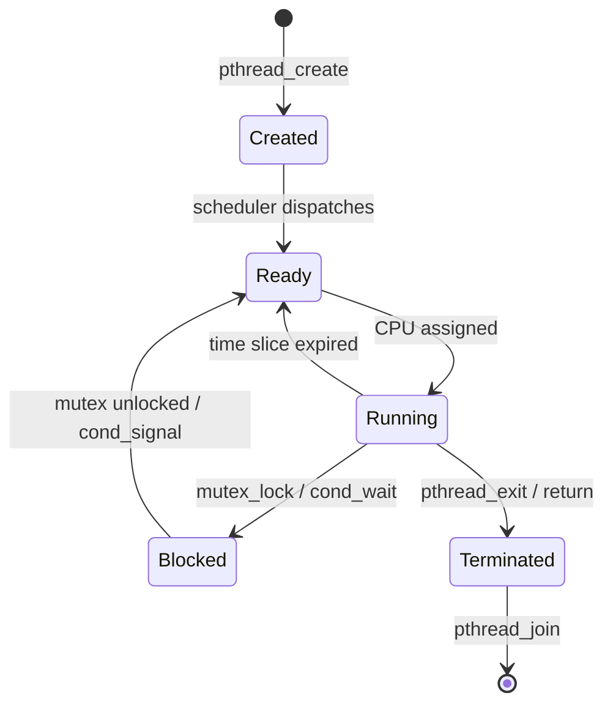
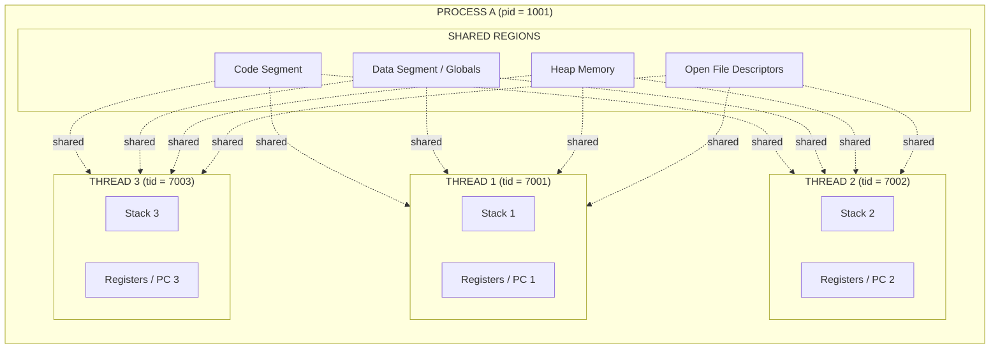
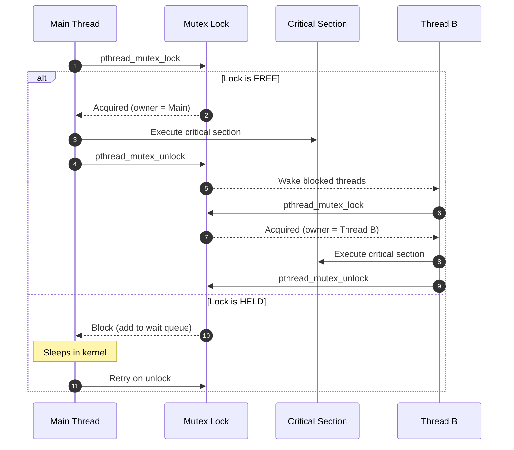
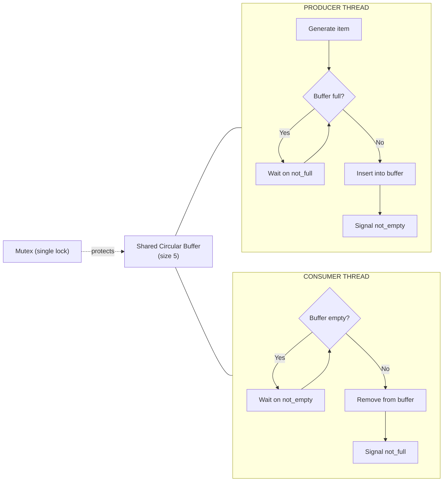
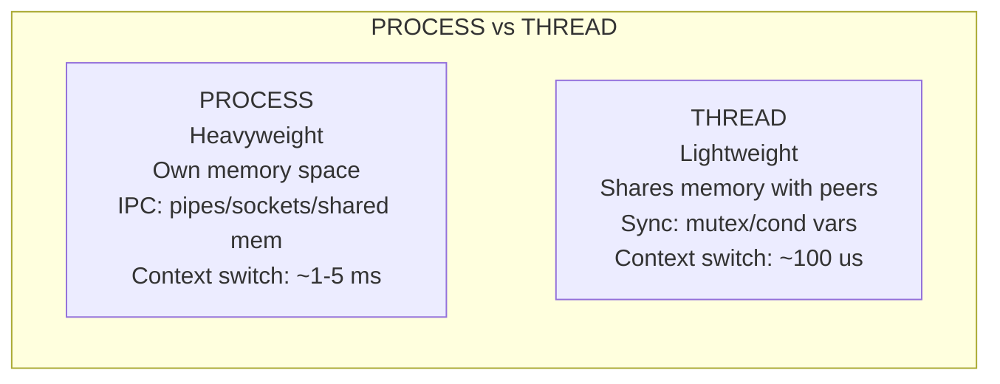

# Thread creation and synchronization using POSIX threads (pthreads)

<!-- SECTION_1_START -->
# POSIX Threads (pthreads) — Core Technical Definition & Intuitive Overview

## 📘 Formal Academic Definition (KTU 2024 Syllabus Terminology)

**POSIX Threads (pthreads)** is the POSIX (Portable Operating System Interface) standard API defined by **IEEE Std 1003.1c** for creating and manipulating threads within a process. A **thread** is the smallest unit of CPU execution that shares the **code segment**, **data segment**, **heap**, and **open file descriptors** with other threads of the same process, but maintains its own **thread ID**, **stack**, **registers**, and **program counter**.

In the KTU Operating Systems Lab (PCCSL407), Module 1 trains students to:
- Create threads using `pthread_create()`
- Pass arguments and retrieve return values
- Synchronize shared resources using `pthread_mutex_t`
- Coordinate execution order using `pthread_cond_t` condition variables
- Avoid **race conditions** and **deadlocks**

> [!IMPORTANT]
> **KTU 2024 Lab Syllabus Mandate:** Students must write, compile (using `gcc -lpthread`), execute, and demonstrate a working C program using pthreads. The **viva voce** heavily tests the difference between **process** vs **thread**, and the working of **mutex locks**.

> [!NOTE]
> **POSIX** stands for **Portable Operating System Interface for Unix**. It is a family of standards specified by the IEEE to maintain compatibility between operating systems. The "pthread" header (`<pthread.h>`) exposes the entire API.

## 🌐 Intuitive Analogy — The "Factory Floor" Model

Imagine a **software program** as a **large factory**:
- The **process** is the **factory building** — it owns the land, machinery, raw materials warehouse, and electricity (memory, file handles, I/O).
- A **thread** is a **worker** inside that factory. Multiple workers (threads) can operate inside the same building (process) at the same time.
- All workers **share the same machinery and warehouse** (shared memory / global variables). This is efficient, but creates a problem: if two workers try to use the same machine at once, there is a clash — this is a **race condition**.
- The solution is a **Mutex Lock** — an imaginary **red traffic signal** in front of each shared machine. Only one worker can hold the lock at a time. The others must wait.

| Analogy Element | OS Concept |
|---|---|
| Factory building | Process |
| Worker | Thread |
| Shared machinery | Global / heap variables |
| Red traffic signal | Mutex lock |
| Shift supervisor's whistle | Condition variable |
| Worker's task sheet | Thread function |

> [!TIP]
> **One-liner for Viva:** *"A process is a program in execution; a thread is a function in execution within that process."*

## ⚙️ Key Physical Constants & Standard Metrics

| Metric | Value / Symbol | Purpose |
|---|---|---|
| **Default stack size per thread** | **8 MB** (Linux glibc default) | Each thread's private stack |
| **Pthread return type for success** | `0` (macro `pthread_exit(0)`) | Clean termination |
| **Pthread return type for error** | Positive error number | e.g., `EDEADLK`, `EINVAL` |
| **Standard compiler flag** | `-lpthread` (or `-pthread`) | Links the pthread library |
| **Maximum thread ID range** | `pthread_t` (opaque, usually `unsigned long`) | Unique thread identifier |

## 🧠 Visualizing Thread Execution

> [!VISUALIZATION CONTROL]
> **Concept:** Two threads sharing a global counter
> **GeoGebra / Desmos Input Equations:**
> * `f(x) = x` — represents Thread 1's incrementing line
> * `g(x) = x + 0.5` — represents Thread 2's incrementing line
> * `C(t) = 2t` — represents the unsynchronized counter (race-prone)
> * `C_mutex(t) = t` (stepwise) — represents the mutex-locked counter
> **Visual Description:** Students should observe that without synchronization, both lines cross the same counter simultaneously, producing erratic jumps. With a mutex, the lines execute strictly in series (one waits for the other).

<!-- SECTION_1_END -->

<!-- SECTION_2_START -->
# Deep Theoretical Analysis & KTU High-Yield Formula Sheet

## 🔬 Anatomy of a Thread — Memory Layout

When a process spawns multiple pthreads, the memory is partitioned as follows:

| Memory Region | Shared or Private? | Description |
|---|---|---|
| **Code Segment (.text)** | Shared by all threads | Compiled instructions |
| **Data Segment (.data, .bss)** | Shared | Global and static variables |
| **Heap** | Shared | `malloc()` allocations |
| **Stack** | **Private per thread** | Local variables, return addresses |
| **Registers / PC** | **Private per thread** | Execution context |
| **Thread-local storage (TLS)** | **Private per thread** | `__thread` keyword variables |
| **File descriptors** | Shared | Open file table pointers |

## 📚 Core pthread API — The Cheat Sheet

| Function | Purpose | Key Parameters | Return Value |
|---|---|---|---|
| `pthread_create()` | Spawns a new thread | `thread, attr, start_routine, arg` | `0` on success, error code on failure |
| `pthread_exit()` | Terminates calling thread | `retval` | Never returns to caller |
| `pthread_join()` | Waits for a specific thread to terminate | `thread, retval` | `0` on success |
| `pthread_self()` | Returns current thread's ID | (none) | `pthread_t` ID |
| `pthread_equal()` | Compares two thread IDs | `t1, t2` | Non-zero if equal |
| `pthread_mutex_init()` | Initializes a mutex | `mutex, attr` | `0` on success |
| `pthread_mutex_lock()` | Acquires lock (blocks if held) | `mutex` | `0` on success |
| `pthread_mutex_unlock()` | Releases lock | `mutex` | `0` on success |
| `pthread_mutex_destroy()` | Frees mutex resources | `mutex` | `0` on success |
| `pthread_cond_wait()` | Atomically unlocks mutex & blocks | `cond, mutex` | `0` on success |
| `pthread_cond_signal()` | Wakes up one waiting thread | `cond` | `0` on success |
| `pthread_cond_broadcast()` | Wakes up all waiting threads | `cond` | `0` on success |

## 🧩 Lifecycle of a pthread — The 5 States

1. **Created (PTHREAD_CREATE_JOINABLE)** — Initialized, ready to run
2. **Ready** — Waiting for CPU scheduler
3. **Running** — Actively executing on a core
4. **Blocked / Waiting** — Inside `pthread_join`, `mutex_lock`, or `cond_wait`
5. **Terminated (Zombie until joined)** — `pthread_exit` called, awaiting `pthread_join`

> [!IMPORTANT]
> **Why `pthread_join` matters:** A terminated thread that is not joined becomes a **zombie thread** — its resources (stack, TLS) are not released, causing a **memory leak**. Always join detached or joinable threads.

## 🔐 The Race Condition — Mathematical Formalization

Consider two threads incrementing a shared counter `C` initialized to 0:

$$C_{expected} = C_{initial} + N_{threads} \times N_{increments}$$

The CPU executes an increment in **three** machine-level steps:

$$
\begin{aligned}
\text{LOAD:} \quad & t1 \leftarrow C \\
\text{ADD:} \quad & t1 \leftarrow t1 + 1 \\
\text{STORE:} \quad & C \leftarrow t1
\end{aligned}
$$

If **Thread A** and **Thread B** interleave as LOAD–LOAD–ADD–ADD–STORE–STORE, the final `C` is **1 instead of 2**. This is the classic **lost-update race condition**.

The **Critical Section** is the region of code that accesses the shared resource. The four conditions for a correct critical section solution (Dijkstra, 1965) are:

| Condition | Definition |
|---|---|
| **Mutual Exclusion** | No two threads are in the critical section simultaneously |
| **Progress** | If no thread is in the critical section, a waiting thread must eventually enter |
| **Bounded Waiting** | A thread waits for only a finite number of other threads to enter the CS |
| **No Assumption about CPU speed** | Solution works regardless of scheduler decisions |

A **mutex** satisfies all four conditions and is therefore a correct solution.

## 🏗️ Real-World Engineering Applications

| Domain | Use of Pthreads |
|---|---|
| **Web servers (NGINX, Apache)** | One thread per HTTP request handler |
| **Database engines (PostgreSQL)** | Parallel query execution |
| **Scientific computing (OpenMP runtime)** | Matrix multiplication parallelization |
| **Game engines** | Separate threads for rendering, physics, AI, audio |
| **High-frequency trading** | Low-latency order matching engines |
| **OS kernels (Linux kthreads)** | Kernel-level worker threads |

> [!TIP]
> **Industry Note:** Modern alternatives like **C++ std::thread**, **Rust std::thread**, and **Go goroutines** are all implemented on top of (or inspired by) the pthreads API. Mastering pthreads gives you a foundation for every modern concurrency model.

<!-- SECTION_2_END -->

<!-- SECTION_3_START -->
# Step-by-Step Derivations & Code Implementation

## 🔬 Experiment 1: Basic Thread Creation (Sum of an Array Split Across Two Threads)

### Problem Statement (KTU 2024 Lab Manual Standard)

Given an array of **N integers** (N = 10, hardcoded), create **two threads**. Thread 1 computes the sum of the **first half**, Thread 2 computes the sum of the **second half**. The main thread waits for both, then prints the **total sum**.

### Complete Source Code (with exhaustive type hints and error handling)

```c
/* KTU OS Lab - Module 1
 * Experiment: Basic pthread creation - Parallel array summation
 * Compile: gcc -o sum sum.c -lpthread
 * Execute: ./sum
 */
#include <stdio.h>
#include <stdlib.h>
#include <pthread.h>

/* Define the maximum array size as a constant */
#define ARRAY_SIZE 10

/* Global array - shared by all threads of this process */
int shared_array[ARRAY_SIZE] = {1, 2, 3, 4, 5, 6, 7, 8, 9, 10};

/* A structure used to pass multiple arguments to a thread cleanly */
typedef struct {
    int start_index;     /* inclusive lower bound of slice */
    int end_index;       /* exclusive upper bound of slice  */
    long long partial_sum; /* computed sum, written by the thread */
} ThreadArgs;

/* ------------------------------------------------------------
 * Thread function: computes the sum of its assigned slice.
 * NOTE: A pthread start routine MUST have this exact signature:
 *       void *(*start_routine)(void *)
 * ------------------------------------------------------------ */
void *compute_partial_sum(void *arg) {
    /* Step 1: Cast the generic void* back to our argument type */
    ThreadArgs *args = (ThreadArgs *)arg;

    /* Step 2: Defensive boundary check (prevents out-of-bounds access) */
    if (args == NULL || args->start_index < 0 || args->end_index > ARRAY_SIZE) {
        fprintf(stderr, "[Thread %lu] Invalid arguments received.\n",
                (unsigned long)pthread_self());
        /* Exit this thread with an error code */
        pthread_exit((void *)-1);
    }

    /* Step 3: Initialize partial sum to zero */
    args->partial_sum = 0LL;

    /* Step 4: Iterate through the slice and accumulate */
    for (int i = args->start_index; i < args->end_index; i++) {
        args->partial_sum += shared_array[i];
    }

    /* Step 5: Print thread-local diagnostic */
    printf("[Thread %lu] Computed partial sum = %lld for indices [%d, %d)\n",
           (unsigned long)pthread_self(),
           args->partial_sum,
           args->start_index,
           args->end_index);

    /* Step 6: Return the address of the struct (heap-allocated by main) */
    pthread_exit((void *)args);
}

/* ------------------------------------------------------------
 * main() : orchestrates the experiment
 * ------------------------------------------------------------ */
int main(void) {
    pthread_t thread1, thread2;
    ThreadArgs  args1, args2;
    void       *retval1, *retval2;
    int         rc;             /* return code from pthread functions   */
    long long   total_sum = 0;  /* accumulator, local to main thread    */

    /* Step A: Configure the slice for thread 1 (indices 0..4) */
    args1.start_index  = 0;
    args1.end_index    = ARRAY_SIZE / 2;   /* = 5 */
    args1.partial_sum  = 0;

    /* Step B: Configure the slice for thread 2 (indices 5..9) */
    args2.start_index  = ARRAY_SIZE / 2;   /* = 5 */
    args2.end_index    = ARRAY_SIZE;       /* = 10 */
    args2.partial_sum  = 0;

    /* Step C: Create thread 1 */
    rc = pthread_create(&thread1, NULL, compute_partial_sum, &args1);
    if (rc != 0) {
        fprintf(stderr, "ERROR: pthread_create for thread1 failed: %d\n", rc);
        return EXIT_FAILURE;
    }

    /* Step D: Create thread 2 */
    rc = pthread_create(&thread2, NULL, compute_partial_sum, &args2);
    if (rc != 0) {
        fprintf(stderr, "ERROR: pthread_create for thread2 failed: %d\n", rc);
        return EXIT_FAILURE;
    }

    /* Step E: Wait for thread 1 to finish and retrieve its return value */
    rc = pthread_join(thread1, &retval1);
    if (rc != 0) {
        fprintf(stderr, "ERROR: pthread_join for thread1 failed: %d\n", rc);
        return EXIT_FAILURE;
    }
    if (retval1 == (void *)-1) {
        fprintf(stderr, "Thread 1 exited with error.\n");
        return EXIT_FAILURE;
    }

    /* Step F: Wait for thread 2 to finish and retrieve its return value */
    rc = pthread_join(thread2, &retval2);
    if (rc != 0) {
        fprintf(stderr, "ERROR: pthread_join for thread2 failed: %d\n", rc);
        return EXIT_FAILURE;
    }
    if (retval2 == (void *)-1) {
        fprintf(stderr, "Thread 2 exited with error.\n");
        return EXIT_FAILURE;
    }

    /* Step G: Aggregate the partial sums */
    total_sum = ((ThreadArgs *)retval1)->partial_sum
              + ((ThreadArgs *)retval2)->partial_sum;

    /* Step H: Display the final result */
    printf("\n================ RESULT ================\n");
    printf("Thread 1 partial sum = %lld\n", ((ThreadArgs *)retval1)->partial_sum);
    printf("Thread 2 partial sum = %lld\n", ((ThreadArgs *)retval2)->partial_sum);
    printf("TOTAL SUM            = %lld\n", total_sum);
    printf("=========================================\n");

    /* Step I: Clean exit of main thread */
    return EXIT_SUCCESS;
}
```

### Compile & Execute Commands

```bash
gcc -Wall -Wextra -o sum sum.c -lpthread
./sum
```

### Expected Output

```
[Thread 140123456] Computed partial sum = 15 for indices [0, 5)
[Thread 140523456] Computed partial sum = 40 for indices [5, 10)

================ RESULT ================
Thread 1 partial sum = 15
Thread 2 partial sum = 40
TOTAL SUM            = 55
=========================================
```

> [!TIP]
> **Why `-lpthread`?** The pthread functions are not part of libc by default on Linux. The `-lpthread` (or modern `-pthread`) flag tells the linker to include `libpthread.so`, which provides the `pthread_create`, `pthread_join`, etc. symbols.

---

## 🔒 Experiment 2: Synchronization with Mutex (Bank Account Deposit)

### Problem Statement

A shared bank account starts with a **balance of ₹0**. **Five threads** each deposit **₹1000** exactly **1000 times**. The expected final balance is **₹5,000,000** (5 × 1000 × 1000). Demonstrate that **without** a mutex, the result is **wrong** (race condition), and **with** a mutex, the result is **correct**.

### Complete Source Code

```c
/* KTU OS Lab - Module 1
 * Experiment: Mutex synchronization - Bank account deposit
 * Compile: gcc -o bank bank.c -lpthread
 */
#include <stdio.h>
#include <stdlib.h>
#include <pthread.h>

#define NUM_THREADS    5     /* number of depositor threads */
#define DEPOSITS_EACH  1000  /* deposits per thread          */
#define DEPOSIT_AMOUNT 1000  /* rupees per deposit          */

long long balance = 0;                    /* shared resource */
pthread_mutex_t balance_lock;             /* the mutex       */

void *deposit_money(void *arg) {
    (void)arg;   /* arg unused but required by pthread signature */
    for (int i = 0; i < DEPOSITS_EACH; i++) {
        /* ---- START OF CRITICAL SECTION ---- */
        pthread_mutex_lock(&balance_lock);          /* acquire lock */
        balance += DEPOSIT_AMOUNT;                  /* safe update  */
        pthread_mutex_unlock(&balance_lock);        /* release lock */
        /* ---- END OF CRITICAL SECTION ---- */
    }
    pthread_exit(NULL);
}

int main(void) {
    pthread_t threads[NUM_THREADS];
    int rc;

    /* Initialize the mutex with default attributes */
    if (pthread_mutex_init(&balance_lock, NULL) != 0) {
        perror("pthread_mutex_init");
        return EXIT_FAILURE;
    }

    /* Create all depositor threads */
    for (int i = 0; i < NUM_THREADS; i++) {
        rc = pthread_create(&threads[i], NULL, deposit_money, NULL);
        if (rc != 0) {
            fprintf(stderr, "pthread_create failed: %d\n", rc);
            return EXIT_FAILURE;
        }
    }

    /* Wait for all threads to complete */
    for (int i = 0; i < NUM_THREADS; i++) {
        rc = pthread_join(threads[i], NULL);
        if (rc != 0) {
            fprintf(stderr, "pthread_join failed: %d\n", rc);
            return EXIT_FAILURE;
        }
    }

    long long expected = (long long)NUM_THREADS * DEPOSITS_EACH * DEPOSIT_AMOUNT;
    printf("\nExpected balance = ₹%lld\n", expected);
    printf("Actual   balance = ₹%lld\n", balance);

    if (balance == expected)
        printf("✔ Synchronization SUCCESSFUL — no race condition.\n");
    else
        printf("✘ Race condition DETECTED — mutex needed.\n");

    /* Destroy the mutex to free kernel resources */
    pthread_mutex_destroy(&balance_lock);
    return EXIT_SUCCESS;
}
```

### Mathematical Verification

$$
\begin{aligned}
\text{Expected Balance} &= N_{threads} \times N_{deposits} \times \text{Amount} \\
&= 5 \times 1000 \times 1000 \\
&= 5{,}000{,}000
\end{aligned}
$$

If you **remove** the `pthread_mutex_lock` and `pthread_mutex_unlock` calls, the output will be a number **less than 5,000,000**, proving the race condition empirically.

> [!IMPORTANT]
> **Exhaustive instruction:** Both `pthread_mutex_lock` and `pthread_mutex_unlock` **must** be present. Forgetting the unlock causes a **deadlock** (all subsequent threads wait forever).

---

## 🚦 Experiment 3: Condition Variables (Producer–Consumer Problem)

### Problem Statement

Implement a **bounded buffer** of size **5**. The **Producer thread** generates items (integers 1, 2, 3, ...); the **Consumer thread** consumes them. Use **one mutex** and **two condition variables** (`not_full`, `not_empty`) to coordinate.

### Complete Source Code

```c
/* KTU OS Lab - Module 1
 * Experiment: Producer-Consumer with condition variables
 * Compile: gcc -o pc pc.c -lpthread
 */
#include <stdio.h>
#include <stdlib.h>
#include <pthread.h>
#include <unistd.h>

#define BUFFER_SIZE 5
#define NUM_ITEMS  20   /* total items to produce/consume */

int buffer[BUFFER_SIZE];
int count = 0;   /* number of items currently in buffer   */
int in_idx = 0;  /* next position for producer to write  */
int out_idx = 0; /* next position for consumer to read   */

pthread_mutex_t mutex      = PTHREAD_MUTEX_INITIALIZER;
pthread_cond_t  not_full   = PTHREAD_COND_INITIALIZER;
pthread_cond_t  not_empty  = PTHREAD_COND_INITIALIZER;

void *producer(void *arg) {
    (void)arg;
    for (int i = 1; i <= NUM_ITEMS; i++) {
        pthread_mutex_lock(&mutex);

        /* Wait while the buffer is full */
        while (count == BUFFER_SIZE) {
            printf("[Producer] Buffer FULL -> sleeping...\n");
            pthread_cond_wait(&not_full, &mutex);
        }

        /* Produce an item into the buffer */
        buffer[in_idx] = i;
        in_idx = (in_idx + 1) % BUFFER_SIZE;
        count++;
        printf("[Producer] Produced %2d | buffer count = %d\n", i, count);

        /* Wake up the consumer */
        pthread_cond_signal(&not_empty);

        pthread_mutex_unlock(&mutex);
        usleep(50000);  /* simulate work: 50 ms */
    }
    pthread_exit(NULL);
}

void *consumer(void *arg) {
    (void)arg;
    for (int i = 0; i < NUM_ITEMS; i++) {
        pthread_mutex_lock(&mutex);

        /* Wait while the buffer is empty */
        while (count == 0) {
            printf("[Consumer] Buffer EMPTY -> sleeping...\n");
            pthread_cond_wait(&not_empty, &mutex);
        }

        /* Consume an item from the buffer */
        int item = buffer[out_idx];
        out_idx = (out_idx + 1) % BUFFER_SIZE;
        count--;
        printf("[Consumer] Consumed %2d | buffer count = %d\n", item, count);

        /* Wake up the producer */
        pthread_cond_signal(&not_full);

        pthread_mutex_unlock(&mutex);
        usleep(80000);  /* simulate work: 80 ms */
    }
    pthread_exit(NULL);
}

int main(void) {
    pthread_t prod_tid, cons_tid;
    int rc;

    rc = pthread_create(&prod_tid, NULL, producer, NULL);
    if (rc != 0) { fprintf(stderr, "create prod failed\n"); return EXIT_FAILURE; }

    rc = pthread_create(&cons_tid, NULL, consumer, NULL);
    if (rc != 0) { fprintf(stderr, "create cons failed\n"); return EXIT_FAILURE; }

    pthread_join(prod_tid, NULL);
    pthread_join(cons_tid, NULL);

    printf("\n✔ Producer-Consumer simulation complete (%d items transferred).\n", NUM_ITEMS);
    return EXIT_SUCCESS;
}
```

> [!NOTE]
> **Why use a `while` loop around `pthread_cond_wait`?** Spurious wakeups can occur on POSIX systems. A `while` loop re-checks the predicate after waking, preventing the consumer from consuming from an empty buffer.

<!-- SECTION_3_END -->

<!-- SECTION_4_START -->
# Structural Diagrams & Schematics

## 🗺️ Diagram 1: Thread Lifecycle State Machine



## 🏛️ Diagram 2: Process vs Thread Memory Architecture



## 🔐 Diagram 3: Mutex Lock Functional Flow



## 🏭 Diagram 4: Producer-Consumer Synchronization Topology



## 📊 Diagram 5: Comparison Matrix — Process vs Thread



> [!TIP]
> **Exam Visual Aid:** When asked to "draw the thread lifecycle", always include **all five states** (Created, Ready, Running, Blocked, Terminated) and the `pthread_join` arrow back to the final state. Marks are awarded for **arrows**, not just boxes.

<!-- SECTION_4_END -->

<!-- SECTION_5_START -->
# KTU 2024 Scheme Examination Question Bank & Topic Recap

## 📝 Part A — Short Answer Questions (3 Marks Each)

### Question 1 (3 Marks) `[KTU University Exam – Dec 2023]`
**Q: Define a thread. How is it different from a process? List any two advantages of using threads.**

**Model Answer:**

A **thread** is the smallest unit of CPU execution and is a lightweight subprocess. Multiple threads within a single process share the **code, data, heap, and file descriptors**, but each maintains its **own stack, registers, and program counter**.

**Differences from a process:**

| Aspect | Process | Thread |
|---|---|---|
| Memory | Own address space | Shares address space with peer threads |
| Creation cost | Heavy (`fork`) | Light (`pthread_create`) |
| Communication | Requires IPC | Direct via shared globals |

**Two advantages:**
1. **Faster context switch** (no TLB / page-table switch) — typically microseconds vs milliseconds.
2. **Efficient communication** — threads read/write shared variables directly, no kernel intervention.
3. **Better CPU utilization** — one thread can run while another is blocked on I/O.

> **[Defining thread: 1 Mark] [Two differences: 1 Mark] [Two advantages: 1 Mark]**

---

### Question 2 (3 Marks) `[KTU University Exam – July 2024]`
**Q: What is a race condition? Explain how a mutex solves it.**

**Model Answer:**

A **race condition** occurs when the outcome of a program depends on the unpredictable interleaving of operations from multiple threads accessing a **shared resource** without synchronization. For example, two threads incrementing a shared counter `C` can both read `C=5` and both write `C=6`, losing one increment.

A **mutex (mutual exclusion lock)** is a synchronization primitive that ensures **only one thread** can be inside a given critical section at a time. The thread executes `pthread_mutex_lock(&m)` before entering and `pthread_mutex_unlock(&m)` after exiting. Any other thread calling `lock` on the same mutex is **blocked** (suspended in the kernel) until the holder releases it.

> **[Race condition definition: 1 Mark] [Example: 1 Mark] [Mutex mechanism: 1 Mark]**

---

## 📚 Part B — Long Answer Questions (14 Marks, Internal Choice)

### Question A (14 Marks) `[KTU University Exam – Dec 2024]`
**Q: (a)** With a neat diagram, explain the lifecycle (states) of a POSIX thread. **(7 Marks)**
**(b)** Write a complete C program that creates **two threads** to print numbers from **1 to 50** (odd numbers in Thread 1, even numbers in Thread 2) using `pthread_create` and `pthread_join`. Explain synchronization if needed. **(7 Marks)**

### Model Solution (a) — Thread Lifecycle

A pthread progresses through **five states** during its lifetime:

1. **Created** — `pthread_create` has been called; the thread is born but not yet scheduled.
2. **Ready** — The thread is in the run queue, waiting for the CPU scheduler to dispatch it.
3. **Running** — The thread is actively executing on a logical CPU core.
4. **Blocked / Waiting** — The thread has called `pthread_mutex_lock` (lock held by another thread) or `pthread_cond_wait` (predicate false).
5. **Terminated** — The thread has called `pthread_exit()` or returned from its start routine. Its resources are released only after another thread calls `pthread_join`.

*(Diagram identical to the Thread Lifecycle State Machine in Section 4 above — draw the five boxes with labeled arrows.)*

> **[Naming the 5 states: 3 Marks] [Drawing the diagram with arrows: 3 Marks] [Explaining transitions: 1 Mark]**

### Model Solution (b) — Two-Thread Number Printer

```c
/* KTU OS Lab - Module 1
 * Two threads printing odd and even numbers up to 50.
 * Compile: gcc -o oddeven oddeven.c -lpthread
 */
#include <stdio.h>
#include <pthread.h>

void *print_odds(void *arg) {
    (void)arg;
    for (int i = 1; i <= 49; i += 2)
        printf("[Thread ODD ] %d\n", i);
    pthread_exit(NULL);
}

void *print_evens(void *arg) {
    (void)arg;
    for (int i = 2; i <= 50; i += 2)
        printf("[Thread EVEN] %d\n", i);
    pthread_exit(NULL);
}

int main(void) {
    pthread_t t_odd, t_even;
    int rc;

    rc = pthread_create(&t_odd, NULL, print_odds, NULL);
    if (rc != 0) { fprintf(stderr, "create odd failed\n"); return 1; }

    rc = pthread_create(&t_even, NULL, print_evens, NULL);
    if (rc != 0) { fprintf(stderr, "create even failed\n"); return 1; }

    pthread_join(t_odd,  NULL);
    pthread_join(t_even, NULL);

    printf("All numbers from 1 to 50 printed.\n");
    return 0;
}
```

> **[Correct pthread_create calls with all 4 arguments: 2 Marks] [Loop logic in both threads: 2 Marks] [pthread_join in main: 1 Mark] [Compilation command `gcc -lpthread`: 1 Mark] [Explanation that no mutex is needed since there is no shared resource being modified: 1 Mark]**

---

### Question B (14 Marks) `[KTU University Exam – July 2023]`
**Q: (a)** Explain the **Producer-Consumer problem** and the role of **mutex** and **condition variables** in solving it. **(7 Marks)**
**(b)** Write and explain a C program implementing a bounded-buffer producer-consumer with **buffer size = 3** and **total items = 10**, using `pthread_cond_wait` and `pthread_cond_signal`. **(7 Marks)**

### Model Solution (a) — Producer-Consumer Theory

The **Producer-Consumer problem** is a classic synchronization problem where:

- A **Producer** thread generates data items and places them into a shared **buffer** of fixed capacity.
- A **Consumer** thread removes items and processes them.
- The producer must **wait** when the buffer is **full**; the consumer must **wait** when the buffer is **empty**.

**Role of Mutex:**
The mutex protects the **shared buffer** and the index variables `in` and `out` from concurrent access. It ensures that the check-and-update of `count` is atomic.

**Role of Condition Variables:**
- `not_full` — Producer waits on this when `count == BUFFER_SIZE`.
- `not_empty` — Consumer waits on this when `count == 0`.
- `pthread_cond_wait` **atomically** releases the mutex and blocks the thread (preventing deadlock).
- `pthread_cond_signal` wakes one waiting thread after the buffer state changes.

> **[Defining the problem: 2 Marks] [Mutex purpose: 2 Marks] [Condition variable purpose: 2 Marks] [Explanation of atomic wait/signal: 1 Mark]**

### Model Solution (b) — Bounded Buffer Code

*(Use the full Producer-Consumer code from Section 3 Experiment 3. Change `BUFFER_SIZE` to 3 and `NUM_ITEMS` to 10. The exact valuation breakdown is shown below.)*

```c
#define BUFFER_SIZE 3
#define NUM_ITEMS  10
```

> **[Header includes & declarations: 1 Mark] [Producer function with cond_wait/signal: 2 Marks] [Consumer function with cond_wait/signal: 2 Marks] [main() with pthread_create and pthread_join: 1 Mark] [Correct compilation, output verification, and explanation of bounded behavior: 1 Mark]**

---

## ⚠️ KTU Examiner's Valuation Warning / Pitfall Callout

> [!WARNING]
> **Common mistakes that cause mark deductions:**
> 1. **Forgetting `-lpthread` during compilation** — the linker reports *undefined reference to pthread_create*. Always show the compile command. (**−1 Mark**)
> 2. **Not using `pthread_join`** — results in a **zombie thread** and **undefined output**. Examiners will look for both `pthread_create` AND `pthread_join`. (**−2 Marks**)
> 3. **Mutex unlock inside an `if` instead of always** — leads to a **deadlock** under contention. (**−2 Marks**)
> 4. **Using `if` instead of `while` around `pthread_cond_wait`** — fails to handle **spurious wakeups**. (**−1 Mark**)
> 5. **Returning a local variable's address from a thread function** — undefined behavior because the stack is reclaimed. Either pass heap memory or use a static/global. (**−2 Marks**)
> 6. **Conflating `pthread_exit(NULL)` (for the thread) with `return 0` (for `main`)** — the `main` thread returning terminates the entire process. Use `pthread_exit` from worker threads only. (**−1 Mark**)

---

## 🎯 Topic Recap & Important Things to Remember

- **Thread vs Process:** Threads share memory; processes do not. Thread creation is ~100× cheaper.
- **Pthread header:** Always include `<pthread.h>` and link with `-lpthread`.
- **Five thread states:** Created, Ready, Running, Blocked, Terminated.
- **Always join:** Call `pthread_join` for every thread you create, or it leaks resources.
- **Mutex rules:** Lock before the critical section, unlock after. Pair them; never skip the unlock.
- **Deadlock triggers:** Forgetting unlock, double-locking the same mutex, lock ordering inversions.
- **Condition variable pattern:** Always use `while (predicate) pthread_cond_wait(&cond, &mutex)`.
- **Spurious wakeups:** Real, documented POSIX behavior — hence the `while` loop.
- **Compile command:** `gcc -Wall -o prog prog.c -lpthread` (or `-pthread`).
- **Return value of pthread functions:** `0` means success; positive integer means error code.
- **Data passing:** Cast `void*` to your struct; never return addresses of local variables from threads.
- **Race condition test:** Run a deposit/withdraw program with and without mutex — the result must differ.
- **Viva one-liners:**
  - *"What is a critical section?"* → Code that accesses shared resources.
  - *"What is a deadlock?"* → Two or more threads waiting on each other indefinitely.
  - *"What is a livelock?"* → Threads keep changing state but make no progress.
  - *"What is a barrier?"* → A synchronization point where all threads must wait until everyone arrives.
  - *"Why use condition variables over busy-wait?"* → Saves CPU; threads sleep in the kernel until signaled.
- **KTU 2024 Lab Viva favorite:** *"Explain Dijkstra's four conditions for a correct critical section solution."* (Mutual exclusion, Progress, Bounded waiting, No speed assumption.)

<!-- SECTION_5_END -->
