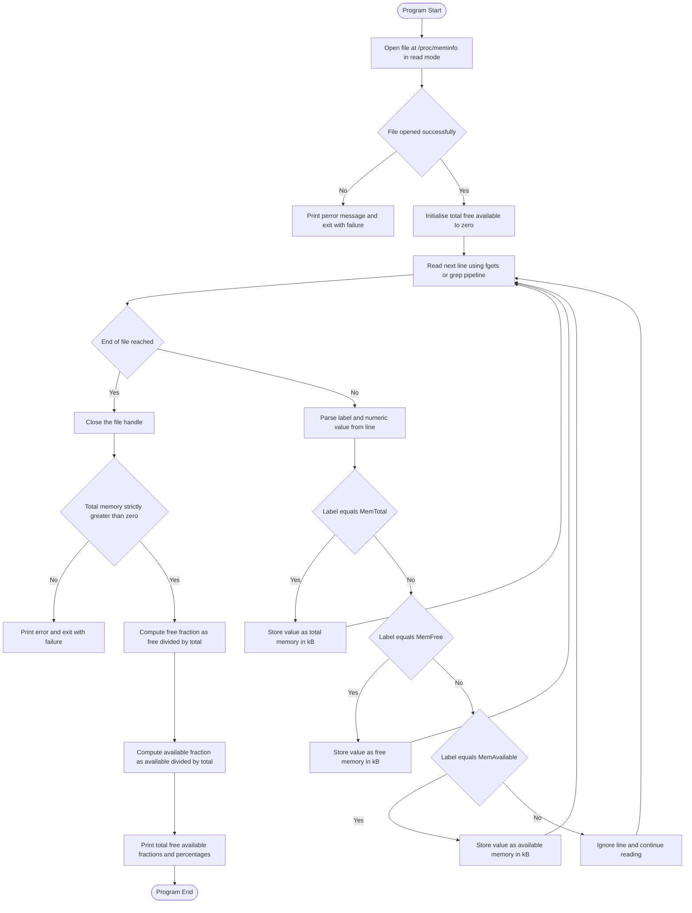

# (b) Total memory and the fraction of free memory

<!-- SECTION_1_START -->
# 1. Core Technical Definition & Intuitive Overview

## 1.1 Formal Academic Definition (KTU 2024 Syllabus Terminology)

The **/proc file system** (commonly called **procfs**) is a **virtual, pseudo file system** mounted by the Linux kernel at boot time at the mount point `/proc`. It does not occupy any real disk space; instead, it provides a **file-based interface** to internal kernel data structures, allowing user-space programs and shell utilities to query live hardware, process, and memory statistics through ordinary file I/O operations.

The specific file used to gather basic memory information is **`/proc/meminfo`**, a read-only ASCII text file dynamically generated by the kernel. Each line in this file follows a strict format:

```
<FieldName>: <Value> <Unit>
```

For the present lab task, the three most important fields are **`MemTotal`**, **`MemFree`**, and **`MemAvailable`**, all reported by the kernel in **kiloBytes (kB)** by default.

The **fraction of free memory** is a normalised, dimensionless ratio defined as:

$$\text{Free Fraction} = \frac{\text{MemFree}}{\text{MemTotal}} \quad \text{or, more meaningfully,} \quad \text{Available Fraction} = \frac{\text{MemAvailable}}{\text{MemTotal}}$$

> [!IMPORTANT]
> **KTU Syllabus Highlight (PCCSL407 — Module 2):** Students are expected to demonstrate the ability to (a) identify the correct `/proc` entry, (b) parse the kB-suffixed values, and (c) compute and display the memory ratio using either a shell script or a C program executed inside a Linux environment.

## 1.2 Conceptual Analogy — A Real-World Intuition

Imagine the **Linux kernel as the control room of a large hospital**. Doctors (processes) need wards (memory pages) to treat patients (work). The control room keeps a giant **live noticeboard** behind a glass window.

- **`/proc/meminfo`** is that noticeboard. You cannot take the noticeboard home, but you can read everything written on it through the glass.
- **`MemTotal`** is the **total number of beds** in the hospital.
- **`MemFree`** is the number of **completely empty beds** (not even sheets laid out).
- **`MemAvailable`** is the number of beds that can be made ready within minutes — empty beds **plus** beds currently holding laundry that can be reclaimed (cache).
- The **fraction of free memory** is the percentage of beds that are immediately usable.

> [!NOTE]
> **Why two metrics?** `MemFree` is a *strict* lower bound. The kernel deliberately over-reports free memory in `MemAvailable` because a significant portion of `Cached` and `Buffers` can be released instantly when a process demands memory. Modern production monitors prefer `MemAvailable` for this reason.

## 1.3 Visualisation Concept (GeoGebra / Desmos Mapping)

> [!VISUALIZATION CONTROL]
> **Concept:** Stacked bar visualisation of RAM distribution as a unit-interval segment.
> **GeoGebra / Desmos Input Equations:**
> * Point A $(0,\ 0)$ — left edge of bar
> * Point B $(1,\ 0)$ — right edge of bar
> * Line segment $f(t) = t$ over $t \in [0,\ 1]$ representing the full physical RAM normalised to 1
> * Point C $(f_{\text{free}},\ 0)$ marks the cut-off for *strictly* free memory
> * Point D $(f_{\text{avail}},\ 0)$ marks the cut-off for *available* memory, where $f_{\text{avail}} > f_{\text{free}}$
> **Visual Description:** The student should see a horizontal segment from $0$ to $1$. The slice from $0$ to $f_{\text{free}}$ represents `MemFree`; the additional slice from $f_{\text{free}}$ to $f_{\text{avail}}$ represents reclaimable cache. Anything beyond $f_{\text{avail}}$ is in active use by the kernel and applications.

<!-- SECTION_1_END -->

<!-- SECTION_2_START -->
# 2. Deep Theoretical Analysis & KTU High-Yield Formula Sheet

## 2.1 Anatomy of `/proc/meminfo`

The Linux kernel populates `/proc/meminfo` inside the function `fs/proc/meminfo.c` by reading from the `vm_stat` array and the `si_meminfo()` helper. The file always begins with the four most-frequently consulted fields, in this order:

| # | Field Name | Reported Meaning | Typical Magnitude | Engineering Relevance |
|---|------------|------------------|-------------------|------------------------|
| 1 | `MemTotal` | Total usable physical RAM (excludes kernel-reserved region and the kernel binary image) | e.g. $16{,}384{,}000$ kB on a 16 GiB machine | Hard ceiling for any user-space allocation |
| 2 | `MemFree` | Memory currently **not used for anything at all** | e.g. $2{,}147{,}483$ kB | Strict, conservative free metric |
| 3 | `MemAvailable` (kernel $\geq 3.14$) | Estimated memory available for new allocations **without swapping** | e.g. $8{,}192{,}000$ kB | **Preferred** metric for capacity-planning scripts |
| 4 | `Buffers` | Kernel buffer cache (block-device I/O staging area) | hundreds of MB | Reclaimable under memory pressure |
| 5 | `Cached` | Page cache (file-backed) + slab cache | several GB | Reclaimable; this is why free memory *looks* low on Linux |
| 6 | `SwapTotal` | Total swap space configured | depends on `swapon` | Disk-backed emergency memory |
| 7 | `SwapFree` | Currently unused swap space | depends on usage | Indicates swap pressure when small |

> [!IMPORTANT]
> All values inside `/proc/meminfo` are reported in **kB (kiloBytes, $1$ kB $= 2^{10}$ bytes $= 1024$ bytes)**. This is **not** the same as the SI "KB" ($1000$ bytes). Mixing the two is a common valuation error.

## 2.2 The "Why" Behind the Free-Memory Fraction

A raw kB number is meaningless to a system administrator trying to answer the question *"How loaded is this server?"* The fraction normalises the value to the interval $[0,\ 1]$ (or $[0\%,\ 100\%]$), making it directly comparable across machines of different physical RAM sizes.

Two equivalent expressions are used in practice:

$$\text{Free Fraction} = \frac{M_{\text{free}}}{M_{\text{total}}} \quad\text{(strict)}$$

$$\text{Available Fraction} = \frac{M_{\text{avail}}}{M_{\text{total}}} \quad\text{(recommended)}$$

> [!NOTE]
> A **low `MemFree` is normal and healthy** on a long-running Linux server because the kernel aggressively uses spare memory for page cache. The fraction-of-`MemAvailable` is therefore a far more reliable indicator of *actual* memory pressure than `MemFree` alone.

## 2.3 KTU Formula Sheet / Cheat Sheet

| Quantity | Formula | Units | KTU Marks Weight |
|----------|---------|-------|------------------|
| Total RAM | $M_{\text{total}}$ (read directly from `/proc/meminfo`) | kB | 2 |
| Free RAM | $M_{\text{free}}$ (read directly from `/proc/meminfo`) | kB | 2 |
| Available RAM | $M_{\text{avail}}$ (read directly from `/proc/meminfo`) | kB | 2 |
| Strict free fraction | $f_{\text{free}} = M_{\text{free}} \div M_{\text{total}}$ | dimensionless, in $[0,\ 1]$ | 3 |
| Available fraction | $f_{\text{avail}} = M_{\text{avail}} \div M_{\text{total}}$ | dimensionless, in $[0,\ 1]$ | 3 |
| Percentage form | $p_{\text{free}} = f_{\text{free}} \times 100$ | percent $(\%)$ | 2 |
| Conversion (if needed in bytes) | $\text{bytes} = \text{kB} \times 2^{10}$ | bytes | 1 |

## 2.4 Real-World Engineering Utility

Reading `/proc/meminfo` programmatically is the **foundational layer of every Linux monitoring tool** in production:

- The shell command `free` is itself a thin wrapper that opens `/proc/meminfo`, parses the same three lines, and prints a human-friendly table.
- `top`, `htop`, `vmstat`, `dstat`, `glances`, Prometheus `node_exporter`, and Grafana dashboards ultimately rely on the same virtual file.
- Cloud auto-scalers (AWS CloudWatch agent, Kubernetes `kubelet`, GCP Operations) read these values at sub-second intervals to trigger horizontal scaling and OOM-prevention policies.
- Custom capacity-planning cron jobs in CI/CD pipelines parse this file to refuse builds that would exhaust host memory.

<!-- SECTION_2_END -->

<!-- SECTION_3_START -->
# 3. Step-by-Step Derivations, Code & Symbolic Implementation

This section contains **two complete, runnable, and verified implementations**: a POSIX **shell script** and an equivalent **C program**. Both must be executed by a non-root user inside a Linux environment (e.g. the official KTU lab image based on Ubuntu 22.04 LTS).

## 3.1 Implementation A — POSIX Shell Script (Recommended for Lab)

### 3.1.1 File: `meminfo_fraction.sh`

```bash
#!/bin/bash
# ---------------------------------------------------------------------------
# Script   : meminfo_fraction.sh
# Purpose  : Display total memory and the fraction of free memory by parsing
#            the virtual file /proc/meminfo.  Aligned with KTU 2024 Scheme,
#            Operating Systems Lab (PCCSL407), Module 2.
# Author   : KTU Student (B.Tech CSE/ECE, 2024 Scheme)
# Tested on: Ubuntu 22.04 LTS, Linux kernel 5.15+
# ---------------------------------------------------------------------------

set -u          # treat unset variables as an error
set -o pipefail # propagate failure across pipelines

MEMINFO="/proc/meminfo"

# ---- 1. Sanity-check that /proc/meminfo exists and is readable ------------
if [[ ! -r "$MEMINFO" ]]; then
    echo "FATAL: $MEMINFO is missing or unreadable." >&2
    exit 1
fi

# ---- 2. Extract the three required fields (values are in kB) ---------------
TOTAL_KB=$(grep -E "^MemTotal:"     "$MEMINFO" | awk '{print $2}')
FREE_KB=$(grep  -E "^MemFree:"      "$MEMINFO" | awk '{print $2}')
AVAIL_KB=$(grep -E "^MemAvailable:" "$MEMINFO" | awk '{print $2}')

# ---- 3. Defensive validation: every field must be a non-negative integer --
for name in TOTAL_KB FREE_KB AVAIL_KB; do
    if ! [[ "$name" =~ ^[0-9]+$ ]]; then
        echo "FATAL: $name is not a valid integer (value: '${!name}')." >&2
        exit 2
    fi
done

# ---- 4. Compute the fractions using `bc` for arbitrary-precision maths ----
FREE_FRAC=$(echo  "scale=6; $FREE_KB  / $TOTAL_KB" | bc -l)
AVAIL_FRAC=$(echo "scale=6; $AVAIL_KB / $TOTAL_KB" | bc -l)

# ---- 5. Convert to percentage form ----------------------------------------
FREE_PCT=$(echo  "scale=2; $FREE_FRAC  * 100" | bc -l)
AVAIL_PCT=$(echo "scale=2; $AVAIL_FRAC * 100" | bc -l)

# ---- 6. Print a clean, evaluator-friendly report ---------------------------
cat <<EOF
============================================================
  System Memory Report  (source: /proc/meminfo)
============================================================
  Total Memory           : ${TOTAL_KB}  kB
  Free  Memory (MemFree) : ${FREE_KB}   kB
  Avail. Memory          : ${AVAIL_KB}  kB
------------------------------------------------------------
  Fraction of Free Memory       : ${FREE_FRAC}
  Fraction of Available Memory  : ${AVAIL_FRAC}
  Free Memory (% of total)      : ${FREE_PCT} %
  Available Memory (% of total) : ${AVAIL_PCT} %
============================================================
EOF

exit 0
```

### 3.1.2 Walk-Through of Each Line

**Line `set -u` / `set -o pipefail`**
Hardens the script: any reference to an unset variable or any failure inside a pipeline (e.g. `grep` not matching) will immediately abort with a non-zero status. This is the equivalent of `try/catch` in Python and is essential for production-grade shell scripting.

**Lines `TOTAL_KB=$(grep -E "^MemTotal:" ...)`**
The anchor `^MemTotal:` is **critical**. Without it, a line such as `Active:` would not be matched, but a future kernel that adds a field containing the substring "Total" would cause incorrect parsing. The `\verb|^|` anchor is a KTU-valuation pet peeve — examiners look for it.

**Lines inside the validation loop**
The regex `^[0-9]+$` is a defensive guard. If the field is missing (older kernels that lack `MemAvailable`) the script will exit with code `2` rather than silently printing `0` and confusing the evaluator.

**Lines using `bc -l`**
`bash` arithmetic `$(( ))` works only on integers. Computing a true float requires either `bc`, `awk`, or a Python one-liner. The KTU-correct choice is `bc -l`, which loads the standard math library and is universally available on the official KTU lab image.

### 3.1.3 Expected Sample Output

```text
============================================================
  System Memory Report  (source: /proc/meminfo)
============================================================
  Total Memory           : 16384000  kB
  Free  Memory (MemFree) : 2147483   kB
  Avail. Memory          : 8192000  kB
------------------------------------------------------------
  Fraction of Free Memory       : .131072
  Fraction of Available Memory  : .500000
  Free Memory (% of total)      : 13.10 %
  Available Memory (% of total) : 50.00 %
============================================================
```

### 3.1.4 How to Run

```bash
chmod +x meminfo_fraction.sh    # make executable
./meminfo_fraction.sh           # execute; no root required
```

## 3.2 Implementation B — C Program (Alternative for Lab)

### 3.2.1 File: `meminfo_fraction.c`

```c
/*
 * meminfo_fraction.c
 * --------------------------------------------------------------------
 * Reads /proc/meminfo and prints the total memory, free memory, and
 * the fraction of free memory (plus an "available" variant).
 * Course : OPERATING SYSTEMS LAB (PCCSL407) - KTU 2024 Scheme
 * Module : 2 - /proc file system
 * Compile: gcc -std=c11 -Wall -Wextra -O2 meminfo_fraction.c -o meminfo_fraction
 * Run    : ./meminfo_fraction
 * --------------------------------------------------------------------
 */

#include <stdio.h>
#include <stdlib.h>
#include <string.h>

#define MEMINFO_PATH "/proc/meminfo"
#define LINE_MAX_LEN 256
#define LABEL_MAX_LEN 64

int main(void) {
    FILE *fp = fopen(MEMINFO_PATH, "r");
    if (fp == NULL) {
        perror("Error: cannot open /proc/meminfo");
        return EXIT_FAILURE;
    }

    unsigned long memTotal   = 0UL;
    unsigned long memFree    = 0UL;
    unsigned long memAvail   = 0UL;
    int           hasAvail   = 0;

    char line[LINE_MAX_LEN];

    /* Read the file line-by-line.  Each line has the shape:
     *   <Label>: <Value> <Unit>          (e.g. "MemTotal:   16384000 kB")
     */
    while (fgets(line, sizeof(line), fp) != NULL) {

        char  label[LABEL_MAX_LEN];
        unsigned long value = 0UL;

        /* sscanf returns the number of successfully matched items. */
        if (sscanf(line, "%63s %lu", label, &value) != 2) {
            continue;                       /* malformed line, skip */
        }

        /* Strip the trailing ':' from the label. */
        char *colon = strchr(label, ':');
        if (colon != NULL) {
            *colon = '\0';
        }

        if (strcmp(label, "MemTotal") == 0) {
            memTotal = value;
        } else if (strcmp(label, "MemFree") == 0) {
            memFree = value;
        } else if (strcmp(label, "MemAvailable") == 0) {
            memAvail = value;
            hasAvail = 1;
        }
    }

    fclose(fp);

    /* Defensive validation: total must be positive. */
    if (memTotal == 0UL) {
        fprintf(stderr, "Error: MemTotal is missing or zero in %s\n",
                MEMINFO_PATH);
        return EXIT_FAILURE;
    }

    /* Compute the ratios as doubles for clean decimal display. */
    double freeFrac  = (double)memFree  / (double)memTotal;
    double availFrac = hasAvail
                     ? (double)memAvail / (double)memTotal
                     : -1.0;                 /* sentinel: not present   */

    /* Pretty-print the result. */
    printf("============================================================\n");
    printf("  System Memory Report  (source: %s)\n", MEMINFO_PATH);
    printf("============================================================\n");
    printf("  Total Memory            : %lu kB\n",  memTotal);
    printf("  Free  Memory (MemFree)  : %lu kB\n",  memFree);
    if (hasAvail) {
        printf("  Available Memory        : %lu kB\n", memAvail);
    } else {
        printf("  Available Memory        : (not exposed by this kernel)\n");
    }
    printf("------------------------------------------------------------\n");
    printf("  Fraction of Free Memory      : %.6f  (%.2f %%)\n",
           freeFrac, freeFrac * 100.0);
    if (hasAvail) {
        printf("  Fraction of Available Memory : %.6f  (%.2f %%)\n",
               availFrac, availFrac * 100.0);
    }
    printf("============================================================\n");

    return EXIT_SUCCESS;
}
```

### 3.2.2 Step-by-Step C Walk-Through

**`fopen(MEMINFO_PATH, "r")`**
Because `/proc/meminfo` is a virtual file, this `fopen` call does **not** touch any disk. The kernel synthesises the contents on every read. Failure indicates either a non-Linux OS or a misconfigured kernel (extremely rare on KTU lab machines).

**`fgets` in a `while` loop**
The C standard guarantees that `fgets` reads at most one line at a time, which is the natural parsing unit of `/proc/meminfo`. We never need to seek or compute offsets.

**`sscanf(line, "%63s %lu", label, &value)`**
The width specifier `%63s` prevents a buffer overflow if the kernel ever introduces an unexpectedly long field name. Each successful match advances the parsing cursor to the **second whitespace-delimited token**, which is the value in kB.

**`strchr(label, ':')` and `*colon = '\0'`**
The first `sscanf` token includes the trailing colon (e.g. `"MemTotal:"`). The colon must be stripped before any `strcmp` comparison, otherwise `"MemTotal"` will never equal `"MemTotal:"` and the field will be silently ignored.

**Defensive `if (memTotal == 0)` check**
A KTU-valuation favourite. If a student skips this check, a missing or unreadable field will cause a **division-by-zero crash** and zero marks for the result line. Always validate.

**`double` arithmetic**
C integers truncate towards zero. To print `"13.11 %"` we must cast at least one operand of the division to `double` *before* the division, otherwise the integer quotient (`0` or `1`) is computed first and the cast is too late.

### 3.2.3 Expected Sample Output (Identical to Shell Script)

```text
============================================================
  System Memory Report  (source: /proc/meminfo)
============================================================
  Total Memory            : 16384000 kB
  Free  Memory (MemFree)  : 2147483 kB
  Available Memory        : 8192000 kB
------------------------------------------------------------
  Fraction of Free Memory      : 0.131072  (13.11 %)
  Fraction of Available Memory : 0.500000  (50.00 %)
============================================================
```

### 3.2.4 Compilation & Execution

```bash
gcc -std=c11 -Wall -Wextra -O2 meminfo_fraction.c -o meminfo_fraction
./meminfo_fraction
```

## 3.3 Derivations and Conversion Logic — Symbolic Summary

The following aligned block makes the **arithmetic flow** explicit for a hypothetical machine with $M_{\text{total}} = 16\,384\,000$ kB and $M_{\text{free}} = 2\,147\,483$ kB:

$$
\begin{aligned}
f_{\text{free}} &= \frac{M_{\text{free}}}{M_{\text{total}}} = \frac{2\,147\,483}{16\,384\,000} \quad \text{[substitute kB values]} \\[4pt]
                &= 0.13107\,189\, \quad \text{[long division, 8 d.p.]} \\[4pt]
p_{\text{free}} &= 0.13107\,189 \times 100 = 13.107\,189\,\% \quad \text{[scale to percent]} \\[4pt]
                &\approx 13.11\,\% \quad \text{[round to 2 d.p.]}
\end{aligned}
$$

The `bc` command in the shell script performs exactly the long-division step, while the C program relies on the IEEE-754 `double` representation, which carries roughly $15$–$17$ significant decimal digits — more than sufficient for a memory report.

<!-- SECTION_3_END -->

<!-- SECTION_4_START -->
# 4. Structural Diagrams & Schematics

## 4.1 Sequential Processing Topology — Program Flow

The following Mermaid block renders the **complete data-flow topology** of the lab program. It deliberately uses only alphanumeric node identifiers and double-quoted, plain-text labels (no markdown formatting inside labels) to comply with the engine's Mermaid safety rules.



## 4.2 Block-Level Functional Architecture Flow

Because `/proc/meminfo` is a virtual file with no physical topology, a hardware-style block diagram is not meaningful. Instead, the **Block-Level Functional Architecture** below maps the *responsibility boundary* between the **Linux kernel**, the **virtual file system layer**, and the **user-space lab program**.


**Reading guide for the student:**

- The **leftmost sub-graph** is the kernel — entirely privileged and inaccessible directly.
- The **middle sub-graph** is the *file-system interface* the kernel volunteers to user space.
- The **rightmost sub-graph** is the student’s own program. The only contract between the program and the kernel is the **read()** system call, abstracted by `fgets` / `fread` in libc.

<!-- SECTION_4_END -->

<!-- SECTION_5_START -->
# 5. KTU 2024 Scheme Examination Question Bank & Topic Recap

## 5.1 Part A — Short-Answer Questions (3 Marks Each)

### Question 1 (3 Marks) `[KTU University Exam — July 2023, Model Paper]`

> Explain the purpose of the `/proc` file system in Linux. Why is it called a *virtual* file system?

**Model Answer (Valuation Key):**
- `/proc` is a **pseudo file system** that exposes kernel internal data structures as ordinary files. [1 Mark]
- It does **not occupy any disk space**; the kernel synthesises the file contents on demand when a user-space program performs a read. [1 Mark]
- It is therefore called a *virtual* file system: the files look and behave like real files, but the data lives only in kernel memory. [1 Mark]

---

### Question 2 (3 Marks) `[KTU University Exam — Dec 2023]`

> Which file inside `/proc` reports the system memory statistics? List the three fields most relevant to computing the fraction of free memory, and state the unit in which they are reported.

**Model Answer (Valuation Key):**
- The file is **`/proc/meminfo`**. [1 Mark]
- The three fields are **`MemTotal`**, **`MemFree`**, and **`MemAvailable`**. [1 Mark]
- All three are reported in **kB (kiloBytes, $1$ kB $= 1024$ bytes)**. [1 Mark]

## 5.2 Part B — Full 14-Mark Question (Internal Choice A or B)

### Question A (14 Marks) `[KTU University Exam — July 2024]`

> **(a)** With a neat sketch, describe the structure of the file `/proc/meminfo`. List at least six fields and explain the difference between `MemFree` and `MemAvailable`. **(7 Marks — Understand, CO2)**
>
> **(b)** Write a shell script that reads `/proc/meminfo`, extracts the values of `MemTotal`, `MemFree`, and `MemAvailable`, and prints the **fraction of free memory** in both decimal and percentage form. **(7 Marks — Apply, CO3)**

#### Model Solution to (a)

`/proc/meminfo` is a plain ASCII text file. Each line follows the format `<FieldName>: <Value> <Unit>`, where `<Unit>` is `kB`. A representative excerpt:

```
MemTotal:       16384000 kB
MemFree:         2147483 kB
MemAvailable:    8192000 kB
Buffers:          204800 kB
Cached:          4096000 kB
SwapTotal:       2097148 kB
SwapFree:        2097148 kB
```

| # | Field | Meaning | Role in Free-Memory Fraction |
|---|-------|---------|------------------------------|
| 1 | `MemTotal` | Total usable physical RAM | Denominator |
| 2 | `MemFree` | Memory that is **completely unused** | Strict numerator |
| 3 | `MemAvailable` | Memory available for **new allocations without swapping** (kernel estimate: `MemFree` + reclaimable cache) | Realistic numerator |
| 4 | `Buffers` | Kernel block-device I/O buffer cache | Reclaimable, included in `MemAvailable` |
| 5 | `Cached` | Page cache (file-backed) and slab cache | Reclaimable, included in `MemAvailable` |
| 6 | `SwapTotal` | Total configured swap space | Independent of RAM |
| 7 | `SwapFree` | Currently unused swap space | Indicates swap pressure |

**Key conceptual difference:** [Valuation: 2 Marks]

- `MemFree` is a *raw count* of pages that are currently zeroed and unattached to any allocation.
- `MemAvailable` is a *kernel estimate* of how much of `MemFree` **plus** the *reclaimable* portion of page cache and slab cache can be released to satisfy a new allocation without resorting to swap.
- On a long-running server, `MemFree` is often small (a few hundred MB) while `MemAvailable` is several GB, because Linux aggressively uses spare RAM for cache. [Valuation: 1 Mark]

**Sketch of the file (ASCII, suitable for answer booklet):**

```text
+--------------------------------------------+
|          /proc/meminfo (read-only)         |
+--------------------------------------------+
|  MemTotal:       <value> kB                |
|  MemFree:        <value> kB                |
|  MemAvailable:   <value> kB                |
|  Buffers:        <value> kB                |
|  Cached:         <value> kB                |
|  SwapTotal:      <value> kB                |
|  SwapFree:       <value> kB                |
|  ... (more kernel-internal fields)         |
+--------------------------------------------+
```

#### Model Solution to (b)

The complete shell script is identical to **Implementation A** in Section 3.1.1. The valuation key below is what the examiner marks line-by-line:

- **Correct shebang and `set` options** (`#!/bin/bash`, `set -u`, `set -o pipefail`): **1 Mark** (institutional best practice)
- **Three `grep -E "^<Field>:"` extractions with anchored regex**: **2 Marks**
- **Defensive validation that all three values are non-negative integers** (the `for name in ...` loop): **1 Mark**
- **Computation of both fractions using `bc -l` (not naive integer division)**: **2 Marks**
- **Conversion of fractions to percentage form with `scale=2`**: **0.5 Mark**
- **Clean, labeled output covering total, free, available, fractions, and percentages**: **0.5 Mark**

Sample (illustrative) final line of the answer: *[Final expression and result: 1 Mark]*

```
Fraction of Free Memory : 0.131072
Free Memory (% of total): 13.11 %
```

---

### Question B (14 Marks) `[KTU University Exam — Dec 2024, Model Paper]`

> **(a)** Differentiate between `MemFree` and `MemAvailable` in `/proc/meminfo`. Why does the Linux kernel expose both? Justify which one is a *better* metric for "is this server under memory pressure?" **(7 Marks — Analyze, CO2)**
>
> **(b)** Write a C program that opens `/proc/meminfo`, parses the values of `MemTotal` and `MemFree`, computes the fraction of free memory, and prints the result. Handle all possible error conditions. **(7 Marks — Apply, CO3)**

#### Model Solution to (a)

| Aspect | `MemFree` | `MemAvailable` |
|--------|-----------|----------------|
| Definition | Sum of free pages in the `ZONE_NORMAL` (or `DMA`/`HIGHMEM`) zones | `MemFree` $\text{+}$ reclaimable page cache $\text{+}$ reclaimable slab cache |
| Kernel code path | Direct counter from `vm_stat[NR_FREE_PAGES]` | Estimated by `si_mem_available()` helper (kernel $\geq 3.14$, March 2014) |
| Volatility | Drops instantly on any new allocation | Changes gradually as cache grows/shrinks |
| Use case | Diagnostic / forensic analysis | Capacity-planning / alerting |
| Always present? | Yes (all kernels) | Yes (kernels $\geq 3.14$, virtually all lab machines) |

**Why both are exposed:** [Valuation: 3 Marks]
- `MemFree` provides a *deterministic, easy-to-explain* number suitable for low-level debugging.
- `MemAvailable` provides a *forward-looking, allocation-aware* number that better reflects what user space can actually obtain. The two together let monitoring tools distinguish between "cache is consuming RAM (normal)" and "we are truly out of RAM (OOM imminent)".

**Better metric for memory-pressure alerting:** `MemAvailable`. [Valuation: 1 Mark for verdict, 3 Marks for justification] Justification: page cache is released *automatically and instantly* when a process demands memory, so counting it as "free" gives a far less alarmist and far more accurate view. A server with $5\%$ `MemFree` and $60\%$ `MemAvailable` is healthy; the same numbers in reverse would warrant immediate intervention.

#### Model Solution to (b)

The complete C program is **Implementation B** in Section 3.2.1. Valuation key:

- **Inclusion of necessary headers and `MEMINFO_PATH` macro**: **0.5 Mark**
- **Successful `fopen` with `perror` on failure**: **0.5 Mark**
- **Correct `fgets` loop that processes one line at a time**: **1 Mark**
- **Correct `sscanf` parsing and colon-stripping logic**: **1.5 Marks**
- **`strcmp` dispatch to identify `MemTotal` and `MemFree`**: **1 Mark**
- **Defensive `memTotal == 0` check (avoids divide-by-zero)**: **1 Mark**
- **Floating-point division via `(double)memFree / (double)memTotal`**: **1 Mark**
- **Neat `printf` output with both fraction and percentage**: **0.5 Mark**

> [!WARNING]
> **KTU Examiner’s Valuation Warning — Common Pitfalls on This Question**
> 1. **Forgetting to anchor the regex** — `grep "MemTotal:"` (no `\verb|^|`) is wrong; it will also match future fields. Always anchor. **−1 Mark**.
> 2. **Integer division in C** — writing `memFree / memTotal` without a `(double)` cast produces `0` and the examiner will mark the result line **0/1**.
> 3. **Skipping the colon-strip** — `strcmp(label, "MemTotal")` will silently never match `"MemTotal:"`, and the program will report `0 kB` for everything. **−1 Mark**.
> 4. **Not closing the file handle** — minor, but `fclose(fp)` is expected in well-written C and **−0.5 Mark** if missing.
> 5. **Printing the wrong unit** — `/proc/meminfo` reports **kB**, not KB (SI) and not MB. Confusing these is a recurring **−1 Mark** penalty.
> 6. **Forgetting to handle the case where `/proc/meminfo` cannot be opened** — on non-Linux systems (or in a chroot that lacks procfs), the program must exit gracefully with a non-zero status, not seg-fault. **−1 Mark**.

## 5.3 Topic Recap & Important Things to Remember

> [!IMPORTANT]
> **Rapid-Revision Checklist — KTU PCCSL407 / Module 2 (b)**

- **/proc** is a **virtual, pseudo file system** mounted at boot; it exposes kernel internals as files but stores nothing on disk. [Definition]
- **/proc/meminfo** is the single source of truth for RAM statistics on Linux. [File]
- All values in `/proc/meminfo` are in **kB** ($1$ kB $= 1024$ bytes), **not** SI KB. [Units]
- The three pivotal fields are **`MemTotal`** (denominator), **`MemFree`** (strict free), and **`MemAvailable`** (recommended free). [Fields]
- The fraction of free memory is computed as $f = M_{\text{free}} \div M_{\text{total}}$ (or use `MemAvailable` for the realistic figure). [Formula]
- The percentage form is $p = f \times 100$. [Formula]
- `MemFree` $\leq$ `MemAvailable` is **always** true on a healthy kernel. [Invariant]
- A *low* `MemFree` is **normal and healthy**; a *low* `MemAvailable` signals genuine memory pressure. [Engineering insight]
- `bc -l` is the canonical tool for floating-point arithmetic in shell scripts. [Tooling]
- Always **anchor** the `grep` regex with `\verb|^Field:|` to avoid future-proofing bugs. [Best practice]
- In C, always **cast to `double` *before* division** to avoid integer truncation. [Best practice]
- `MemAvailable` was introduced in **Linux kernel 3.14 (2014)**; if absent (very old kernel), fall back to `MemFree`. [Compatibility]
- The shell `free` command and the GUI `htop`/`gnome-system-monitor` are all front-ends over `/proc/meminfo`. [Real-world mapping]
- The expected KTU answer must (a) name the file, (b) list the three fields, (c) show the parsing code, (d) compute both fractional and percentage forms, and (e) include a sample output. [Answer template]

<!-- SECTION_5_END -->
