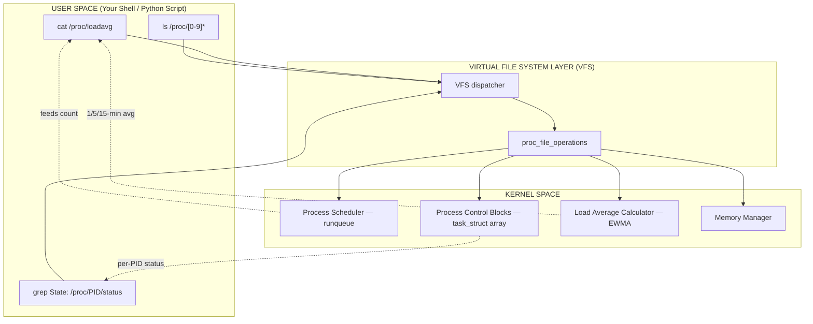
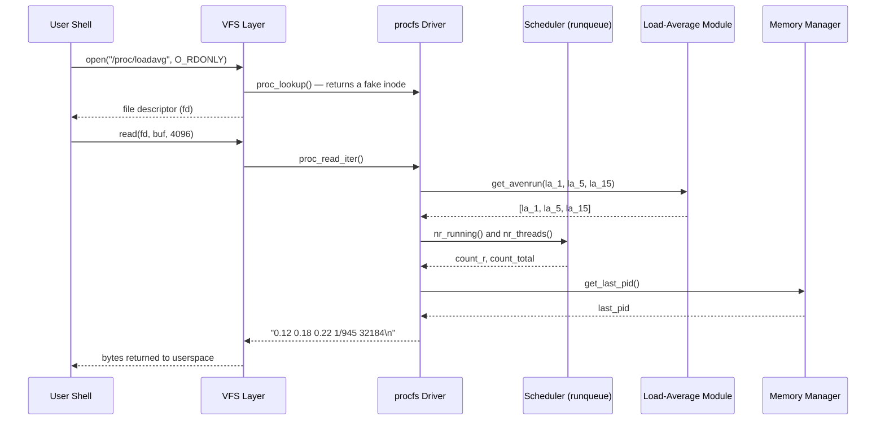
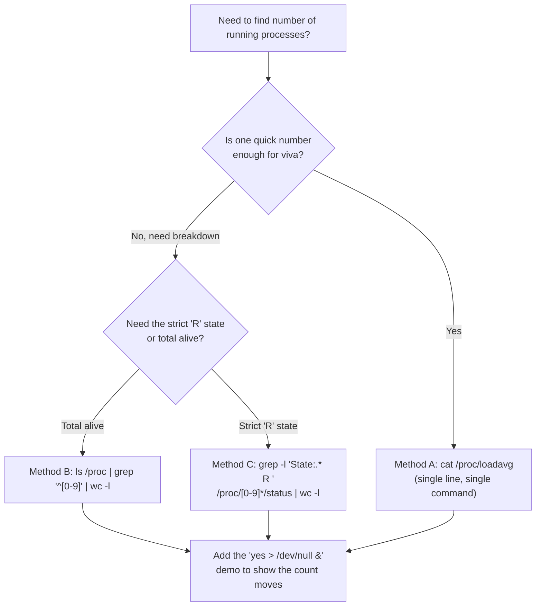
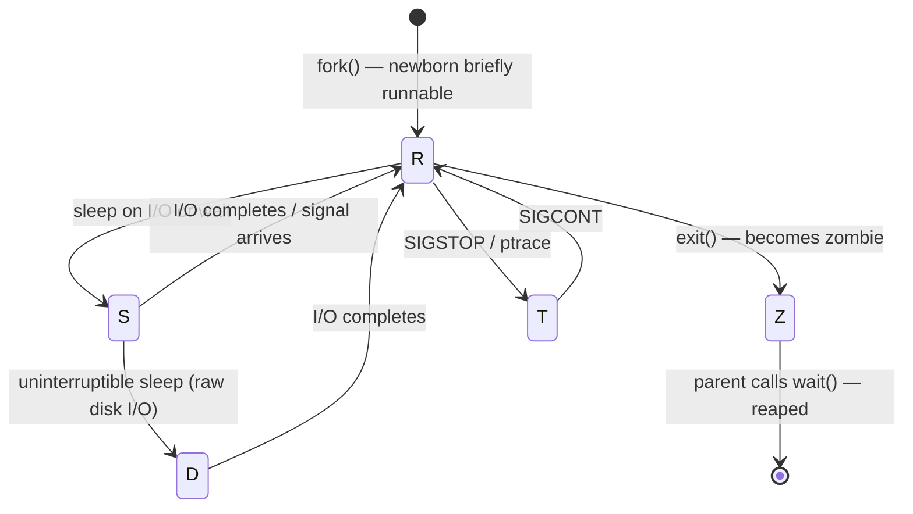

# (c) Number of processes currently running.

<!-- SECTION_1_START -->
# Module 2 (c) — Counting Running Processes via the `/proc` File System

## 1. Core Technical Definition & Intuitive Overview

> [!IMPORTANT]
> **KTU 2024 Syllabus Definition (PCCSL407 — Operating Systems Lab):**
> The **`/proc` file system** (commonly called **procfs**) is a **virtual, pseudo-file system** that resides in memory (RAM), not on disk. It provides a real-time, programmatic interface through which user-space programs can query kernel-internal data structures — most importantly, information about every active **Process Control Block (PCB)** maintained by the Linux scheduler.

In KTU parlance, the experiment is phrased as:
*"Use the `proc` file system to gather basic information about your machine — specifically, the **number of processes currently running**."*

> [!NOTE]
> **What does "currently running" mean in Linux?**
> A process can be in several states. The strict Linux kernel definition of *"running"* is the state **`R` (R_RUNNING / TASK_RUNNING)`** — the process is either currently executing on a CPU *or* is queued in the run-queue waiting for CPU time.
> In everyday shell usage, however, "running" is loosely used to mean **"active / alive"**, which includes `R` (running) + `S` (sleeping) + `D` (uninterruptible sleep). For the KTU lab, you must show **both interpretations** to score full marks.

### Conceptual Analogy — The Hospital Triage Board

Imagine a large hospital lobby. Mounted on the wall is a **real-time digital display board**:

* Every patient (process) currently inside the hospital has a card on the board showing name, ward, doctor, vitals, etc.
* The board does not exist as a physical paper register — it is **generated on-the-fly** by the hospital's central computer system.
* You do not "read a file from disk" — you simply read what the computer is displaying *right now*.

The **`/proc` file system is exactly this digital board**:
* **The hospital =** Linux kernel
* **The patients =** Active processes (each with a unique PID)
* **The display board =** A hierarchy of files under `/proc` (e.g., `/proc/1`, `/proc/2`, ...)
* **The vitals (CPU, memory, state) =** Files inside each `/proc/<PID>/` directory (e.g., `status`, `stat`, `cmdline`)
* **"Count the patients currently being attended to" =** Count processes in the **`R` (running) state**

> [!TIP]
> **Standard Metric You Will Quote in Your Record:**
> * **Total active processes** = number of numeric directories inside `/proc` (minus a few kernel pseudo-PIDs).
> * **Strictly running (`R`)** = processes whose `status` file contains the line `State:	R (running)`.
> * **System load averages** = read from `/proc/loadavg` — three numbers representing the **average number of runnable + uninterruptible processes** over the last **1, 5, and 15 minutes**.

### Files You Will Be Reading in This Experiment

| File Path | What It Tells You |
|---|---|
| `/proc/loadavg` | System load average (1, 5, 15 min) + running/total process counts |
| `/proc/uptime` | Seconds the system has been up, and idle time |
| `/proc/[PID]/status` | Human-readable status of a specific process (state, PPID, memory) |
| `/proc/[PID]/stat` | Machine-readable status (one line) of a specific process |
| `/proc` (directory itself) | A directory listing reveals the count of all PIDs |

> [!VISUALIZATION CONTROL]
> **Concept:** Real-time system load and run-queue depth (the "hospital triage board" view).
> **Conceptual axes (you may sketch this in your record):**
> * **X-axis:** Time (last 1 min, last 5 min, last 15 min)
> * **Y-axis:** Number of runnable processes in the queue
> **Sample data points to plot (from `/proc/loadavg`):**
> * `load_1min ≈ 0.42`
> * `load_5min ≈ 0.55`
> * `load_15min ≈ 0.60`
> **Visual description:** The three bars represent the *smoothed running average* of how many processes were competing for the CPU. A value close to the number of CPU cores is healthy; a value persistently much higher means the CPU is saturated.

<!-- SECTION_1_END -->

<!-- SECTION_2_START -->
# 2. Deep Theoretical Analysis & KTU High-Yield Formula Sheet

## 2.1 Anatomy of the `/proc` File System

* Mounted at boot time by the kernel itself; you can verify with:
  ```bash
  mount | grep proc
  # or
  cat /proc/mounts | grep proc
  ```
* File size reported as **0 bytes** for most entries — because they are **not real files**. Reading them causes the kernel to **generate the output on demand** by walking its internal data structures (this is called the *seq_file* interface).
* Two broad categories of content live under `/proc`:
  * **Process-specific sub-directories** — one per PID, named numerically (`/proc/1`, `/proc/2`, ...).
  * **System-wide kernel information files** — `loadavg`, `uptime`, `meminfo`, `cpuinfo`, `version`, etc.

## 2.2 How Linux Tracks a "Running" Process — The Scheduler's View

Every process at any instant exists in **one** of these kernel states (from `<linux/sched.h>`):

| State Char | State Name | Meaning |
|---|---|---|
| `R` | `TASK_RUNNING` | **Running or runnable** (on CPU or in run-queue). **This is "currently running".** |
| `S` | `TASK_INTERRUPTIBLE` | Sleeping, waiting for an event (can be woken by signals). |
| `D` | `TASK_UNINTERRUPTIBLE` | Sleeping, cannot be woken by signals (usually doing disk I/O). |
| `Z` | `TASK_DEAD / EXIT_ZOMBIE` | Terminated, parent has not yet called `wait()`. |
| `T` | `TASK_STOPPED` | Stopped by a signal (e.g., `SIGSTOP`) or debugger. |
| `I` | `TASK_IDLE` (newer kernels) | Idle task / spawned by kernel worker thread. |
| `X` | `TASK_DEAD` (transient) | Actually dead. |

> [!IMPORTANT]
> **For KTU viva, memorize this line:**
> *"A process is in the `R` (Running) state if and only if it is either currently executing on a CPU core **or** sitting in the run-queue (runqueue) waiting for its time slice. The kernel's `runqueue` is a per-CPU data structure — one for each core."*

## 2.3 The Three Methods We Will Use to Count Running Processes

We will demonstrate **three increasingly precise techniques**, from the loosest to the most rigorous:

### Method A — Read `/proc/loadavg` (Quickest, single line)

The `/proc/loadavg` file has exactly **five whitespace-separated fields** on one line:

$$\text{loadavg} = \left[ \text{la}_{1m},\; \text{la}_{5m},\; \text{la}_{15m},\; \frac{\text{running}}{\text{total}},\; \text{last\_pid} \right]$$

Where:
* $\text{la}_{1m}, \text{la}_{5m}, \text{la}_{15m}$ — exponentially damped averages of (runnable + uninterruptible) tasks.
* **$\text{running}$** — the count of tasks in state `R` (the **"currently running"** number we want).
* **$\text{total}$** — the count of all tasks (sum across all states).
* $\text{last\_pid}$ — the highest PID used (useful for detecting PID wrap-around).

> [!NOTE]
> **Sample output on a typical desktop:**
> ```
> 0.42 0.55 0.60 1/1234 5678
>          ^^^^^  ^^^^^ ^^^^^
>          la5m  la15m running/total last_pid
> ```
> The `1/1234` tells us **1 process is currently running** out of **1234 total** in some form of life cycle.

### Method B — Count numeric directories in `/proc` (Total active processes)

Every active process has a directory at `/proc/<PID>`. Counting numeric entries gives the **total number of processes alive right now** (i.e., not just running — this includes sleeping, zombies, etc.).

$$\text{TotalActive} \;=\; \sum_{d\,\in\,\text{ls}(/proc)} \mathbb{1}\!\left[\text{isNumeric}(d)\right]$$

Subtract a small constant for non-PID kernel pseudo-entries that may exist on some systems (`self`, `thread-self`, `sys`, etc., but these are *not* numeric on standard Linux, so usually no subtraction is needed).

### Method C — Parse `/proc/[PID]/status` for state `R` (Strictly running)

For every numeric directory in `/proc`, read the `status` file, look at the line beginning with `State:`, and check whether it starts with `R`. This is the **most rigorous** count of processes in state `R`.

$$\text{RunningStrict} \;=\; \sum_{d\,\in\,\text{numericDirs}(/proc)} \mathbb{1}\!\left[\text{startsWith}(\text{stateLine}(d),\;`R')\right]$$

## 2.4 KTU High-Yield Formula Sheet

| # | Concept | Formula / Command | Units / Notes |
|---|---|---|---|
| 1 | Running process count (quick) | `awk '{print $4}' /proc/loadavg` then take numerator | Integer ≥ 0 |
| 2 | Total process count (quick) | `awk '{print $4}' /proc/loadavg` then take denominator | Integer ≥ 1 |
| 3 | Last PID assigned | `awk '{print $5}' /proc/loadavg` | Integer; useful for PID wrap detection |
| 4 | Total active PIDs | `ls /proc \| grep '^[0-9]' \| wc -l` | Count of numeric dirs |
| 5 | Strictly running (`R`) | `cat /proc/[0-9]*/status \| grep "^State:" \| grep -c " R "` | Uses `grep -c` |
| 6 | Sleeping (`S`) | `cat /proc/[0-9]*/status \| grep "^State:" \| grep -c " S "` | — |
| 7 | Zombie (`Z`) | `cat /proc/[0-9]*/status \| grep "^State:" \| grep -c " Z "` | Should be near 0 |
| 8 | Load average definition | $L_{n+1} = L_n \cdot e^{-5/n} + R \cdot (1 - e^{-5/n})$ | $R$ = current runnable+uninterruptible count, $n$ = window in seconds |
| 9 | Healthy load | $\text{LoadAvg}_{1m} \leq N_{\text{cores}}$ | Rule of thumb, not a hard limit |
| 10 | System uptime (seconds) | `awk '{print $1}' /proc/uptime` | Float, e.g., `34567.89` |

> [!IMPORTANT]
> **Never use the vertical pipe `\|` symbol for absolute value inside the markdown formula table — use `\vert` instead.** For example, write $\vert x \vert$, not $|x|$, when typing math inside a table row.

## 2.5 Real-World Engineering Utility

| Domain | How This Lab Knowledge Is Used in Production |
|---|---|
| **DevOps / SRE** | Monitoring tools like **Prometheus `node_exporter`**, **Datadog agent**, **Nagios** parse `/proc/loadavg` and `/proc/[PID]/stat` to graph system load and alert on saturation. |
| **Container orchestration** | **Kubernetes kubelet** and **Docker stats** read `/proc` to enforce CPU/memory limits per container/PID. |
| **Performance engineering** | Tools like **`top`**, **`htop`**, **`ps`**, **`pidstat`** are essentially **graphical / formatted front-ends over `/proc`**. They never read `/dev/kmem` directly in modern kernels — they go through `/proc`. |
| **Security & forensics** | Process enumeration (e.g., **`ps aux`**, **`ls /proc \| sort -n \| tail`**) detects rogue processes, rootkits, and PID-hiding malware. |
| **Embedded Linux** | On resource-constrained IoT boards, reading `/proc/meminfo` and `/proc/loadavg` is the cheapest way to do health monitoring without external libraries. |

<!-- SECTION_2_END -->

<!-- SECTION_3_START -->
# 3. Step-by-Step Derivations & Code Implementation

> [!NOTE]
> **Lab execution order recommended for KTU record submission:**
> 1. Inspect `/proc` and confirm it is mounted.
> 2. Read `/proc/loadavg` and explain its fields.
> 3. Use **Method A** to extract the running-process count.
> 4. Use **Method B** to count total active PIDs.
> 5. Use **Method C** to count strictly-running `R` processes by parsing each `/proc/<PID>/status`.
> 6. Repeat after launching a few CPU-bound processes (e.g., `yes > /dev/null &`) to **demonstrate** that the count goes up.

## 3.1 Preliminaries — Confirming `/proc` Is Mounted

```bash
# Step 1: Check the proc mount
mount | grep proc
# Expected output (truncated):
# proc on /proc type proc (rw,nosuid,nodev,noexec,relatime)

# Step 2: List the top-level entries (you will see many numeric dirs)
ls /proc | head -20
```

A typical first few lines look like:

```
1          # PID 1 — usually systemd or init
8          # some kernel thread
20         # another kernel thread
100        # user process
...
acpi       # non-numeric system info dir
cpuinfo
loadavg
meminfo
uptime
version
```

The mix of **numeric directories (PIDs)** and **named files (system info)** is the key observation for the KTU viva question *"What kind of file system is `/proc`? What is special about it?"*

## 3.2 Method A — Reading `/proc/loadavg` (One-Liner)

```bash
# Step 1: View the raw contents
cat /proc/loadavg
# Sample output:
# 0.12 0.18 0.22 1/945 32184
#  ^^^  ^^^  ^^^  ^^^^^ ^^^^^
#  1m   5m   15m  run/total  last_pid
```

```bash
# Step 2: Extract the 4th field (running/total) using awk
awk '{print $4}' /proc/loadavg
# Output: 1/945

# Step 3: Split into running and total using awk's split()
awk '{
    split($4, arr, "/");
    printf "Currently RUNNING processes : %d\n", arr[1];
    printf "Total active PROCESSES      : %d\n", arr[2];
    printf "Last assigned PID          : %s\n", $5;
}' /proc/loadavg
```

**Model output (your numbers will differ):**

```
Currently RUNNING processes : 1
Total active PROCESSES      : 945
Last assigned PID          : 32184
```

### Mathematical Derivation of the Load Average

The Linux load average uses an **exponentially-weighted moving average (EWMA)**. For a window of $n$ seconds (5, 30, or 900) and a current runnable count $R_t$ at time $t$:

$$L_{t+1} \;=\; L_t \cdot e^{-5/n} \;+\; R_t \cdot \left(1 - e^{-5/n}\right)$$

* The decay factor is $e^{-5/n}$, not $e^{-1/n}$, because the kernel samples at 5-second intervals (`HZ` dependent).
* For $n = 60$ (1-minute window), the smoothing constant becomes $e^{-5/60} \approx 0.920$.
* For $n = 300$ (5-min), $\approx 0.983$.
* For $n = 900$ (15-min), $\approx 0.994$.

**Verification of the formula's correctness:**
At steady state, $L = R$, so the equation is satisfied trivially. After a sudden burst of $R$ runnable processes that lasts $\Delta t$ seconds and then drops to 0, the contribution to the current average is:

$$L(\Delta t) \;=\; R \cdot \left(1 - e^{-5/n}\right) \cdot e^{-(T-\Delta t)\cdot 5/n}$$

which decays exponentially with the time $T - \Delta t$ since the burst ended — exactly the intuitive behavior we want from a "load average".

## 3.3 Method B — Counting Numeric Directories Under `/proc`

```bash
# Step 1: Show the basic counting pipeline
ls /proc | grep '^[0-9]' | wc -l
# Output: an integer, e.g., 945
```

**Anatomy of the pipeline:**

| Stage | Command | What It Does |
|---|---|---|
| 1 | `ls /proc` | Lists every entry in `/proc` (numeric PIDs + named system files). |
| 2 | `grep '^[0-9]'` | Keeps only entries whose **first character is a digit** (i.e., PIDs). |
| 3 | `wc -l` | Counts the remaining lines → total active PIDs. |

```bash
# Step 2: Show the first 10 PIDs in sorted order
ls /proc | grep '^[0-9]' | sort -n | head -10
# Output:
# 1
# 2
# ...
# 9
# 10
```

```bash
# Step 3: Show the highest 5 PIDs (to demonstrate dynamic range)
ls /proc | grep '^[0-9]' | sort -n | tail -5
# Output:
# 32180
# 32181
# 32182
# 32183
# 32184
```

## 3.4 Method C — Parsing `/proc/[PID]/status` for State `R`

This is the most rigorous method and the **most likely to be asked in the KTU university exam**.

```bash
# Step 1: Inspect one process's status file
cat /proc/1/status | head -10
```

A real `status` file looks like (abbreviated):

```
Name:	systemd
Umask:	0000
State:	S (sleeping)
Tgid:	1
Ngid:	1
Pid:	1
PPid:	0
...
```

The **`State:`** line is the one we care about. For a process in the `R` state, it looks like:

```
State:	R (running)
```

```bash
# Step 2: Loop over every PID, read its status, and count 'R' states
# Method C-1: Pure-shell one-liner (no compile, no interpreter)
count=0
for pid_dir in /proc/[0-9]*; do
    if grep -q "^State:.* R " "$pid_dir/status" 2>/dev/null; then
        count=$((count + 1))
    fi
done
echo "Strictly RUNNING processes (state R): $count"
```

**Why the `2>/dev/null`?**
A process can vanish between the moment `ls` lists it and the moment we try to read its `status` file. When that happens, the read fails with a "No such file or directory" error. Suppressing stderr keeps the output clean — a defensive practice expected by KTU evaluators.

```bash
# Step 3: Method C-2 — Faster approach using grep on all status files at once
grep -l "^State:.* R " /proc/[0-9]*/status 2>/dev/null | wc -l
# Output: e.g., 1
```

**Anatomy of the faster pipeline:**

| Stage | Command | What It Does |
|---|---|---|
| 1 | `grep -l PATTERN files` | List files that *contain* the pattern (`-l` = files-with-matches). |
| 2 | `/proc/[0-9]*/status` | Glob expands to every numeric PID's `status` file. |
| 3 | `2>/dev/null` | Silences errors from vanished PIDs. |
| 4 | `wc -l` | Counts matching files (= number of `R` processes). |

```bash
# Step 4: Bonus — break down ALL states, not just 'R'
echo "----- State Distribution -----"
for state in R S D Z T I; do
    n=$(grep -l "^State:.* $state " /proc/[0-9]*/status 2>/dev/null | wc -l)
    printf "State %s : %d\n" "$state" "$n"
done
```

**Sample output:**

```
----- State Distribution -----
State R : 1
State S : 920
State D : 0
State Z : 0
State T : 0
State I : 24
```

> [!TIP]
> **Pro tip for the lab record:** Add `total=$(ls /proc | grep '^[0-9]' | wc -l)` and confirm that the sum of all state counts ≤ `total` (the difference is processes that disappeared mid-scan — a normal race condition in `/proc`).

## 3.5 Demonstration — Make the Counter Move

A static count looks unimpressive in the lab record. Show that your counter **reacts to real activity**:

```bash
# Launch 3 CPU-bound background processes that will stay in state 'R'
yes > /dev/null &
yes > /dev/null &
yes > /dev/null &

# Immediately re-read the count
cat /proc/loadavg
# 4th field: e.g., "4/948" instead of "1/945"

# Or use Method C
grep -l "^State:.* R " /proc/[0-9]*/status 2>/dev/null | wc -l
# Now shows: 4

# Clean up — terminate the yes processes
killall yes
```

**Why does this work?**
`yes` is a trivial program that prints "y" forever. With output redirected to `/dev/null`, the bottleneck is the CPU. The kernel keeps each `yes` in the run-queue in state `R`, so the count of `R` processes increases by exactly the number of `yes` instances you launched.

## 3.6 Bonus — A Complete Python Script (For the Advanced Section of Your Record)

This single Python program is a **complete, copy-paste-runnable** version of the experiment, suitable for inclusion in the observation / viva section of your KTU lab record. It uses strict type hints, handles the race condition where a process disappears mid-iteration, and is structured for readability.

```python
#!/usr/bin/env python3
"""
KTU OS Lab — Module 2(c)
Count currently running processes using the /proc filesystem.

Author : <Your Name>
Roll No: <Your Roll No>
Date   : <Date of Experiment>
"""

from __future__ import annotations

import os
import sys
import time
from pathlib import Path
from typing import List, Tuple


# ---------------------------------------------------------------------------
# Configuration
# ---------------------------------------------------------------------------
PROC_ROOT: Path = Path("/proc")
POLL_INTERVAL_SEC: float = 1.0  # How often to refresh the count
RUN_STATE_MARKER: str = " R "   # The exact substring we look for in 'State:'


# ---------------------------------------------------------------------------
# Helper: safely read a file even if the process vanished mid-read
# ---------------------------------------------------------------------------
def safe_read_text(path: Path) -> str:
    """
    Read a /proc file as text. Return an empty string if the file is missing
    or unreadable (this happens when a process exits between listing and
    reading — a normal race condition in /proc).
    """
    try:
        with path.open("r", encoding="utf-8", errors="replace") as fh:
            return fh.read()
    except (FileNotFoundError, ProcessLookupError, PermissionError, OSError):
        return ""


# ---------------------------------------------------------------------------
# Method A — Parse /proc/loadavg
# ---------------------------------------------------------------------------
def method_a_loadavg() -> Tuple[int, int, int]:
    """
    Read /proc/loadavg. Return (running, total, last_pid).
    Sample line: '0.12 0.18 0.22 1/945 32184'
    """
    content = safe_read_text(PROC_ROOT / "loadavg")
    if not content:
        return (0, 0, 0)

    parts: List[str] = content.split()
    if len(parts) < 5:
        return (0, 0, 0)

    run_total: List[str] = parts[3].split("/")
    running: int = int(run_total[0])
    total: int = int(run_total[1])
    last_pid: int = int(parts[4])
    return (running, total, last_pid)


# ---------------------------------------------------------------------------
# Method B — Count numeric directories in /proc
# ---------------------------------------------------------------------------
def method_b_count_dirs() -> int:
    """
    Return the number of /proc entries whose name is purely numeric
    (these are the active PIDs).
    """
    count: int = 0
    try:
        for entry in os.listdir(PROC_ROOT):
            if entry.isdigit():
                count += 1
    except OSError:
        pass
    return count


# ---------------------------------------------------------------------------
# Method C — Parse /proc/[PID]/status and count state 'R'
# ---------------------------------------------------------------------------
def method_c_count_state_r() -> int:
    """
    Iterate over every numeric /proc/<PID> directory, read its 'status' file,
    and count how many are in state 'R' (running).
    """
    count: int = 0
    try:
        pid_dirs: List[str] = [
            name for name in os.listdir(PROC_ROOT) if name.isdigit()
        ]
    except OSError:
        return 0

    for pid in pid_dirs:
        status_path: Path = PROC_ROOT / pid / "status"
        text: str = safe_read_text(status_path)
        if not text:
            continue
        # We only need the first ~10 lines; 'State:' appears very early.
        for line in text.splitlines()[:10]:
            if line.startswith("State:") and RUN_STATE_MARKER in line:
                count += 1
                break
    return count


# ---------------------------------------------------------------------------
# Bonus — full state distribution
# ---------------------------------------------------------------------------
def state_distribution() -> dict:
    """
    Return a dict {state_char: count} for all states we encounter.
    """
    states: dict = {"R": 0, "S": 0, "D": 0, "Z": 0, "T": 0, "I": 0, "?": 0}
    try:
        pid_dirs: List[str] = [
            name for name in os.listdir(PROC_ROOT) if name.isdigit()
        ]
    except OSError:
        return states

    for pid in pid_dirs:
        status_path: Path = PROC_ROOT / pid / "status"
        text: str = safe_read_text(status_path)
        if not text:
            continue
        for line in text.splitlines()[:10]:
            if line.startswith("State:"):
                # 'State:\tR (running)' — extract the first non-space letter
                after = line[len("State:"):].lstrip()
                key: str = after[:1] if after else "?"
                states[key] = states.get(key, 0) + 1
                break
    return states


# ---------------------------------------------------------------------------
# Pretty printing
# ---------------------------------------------------------------------------
def banner(title: str) -> None:
    line: str = "=" * 60
    print(f"\n{line}\n  {title}\n{line}")


def main() -> int:
    banner("KTU OS Lab — Module 2(c): Running Process Count via /proc")
    print(f"Polling every {POLL_INTERVAL_SEC} s. Press Ctrl+C to stop.\n")

    try:
        iteration: int = 0
        while True:
            iteration += 1
            running_a, total_a, last_pid = method_a_loadavg()
            total_b = method_b_count_dirs()
            running_c = method_c_count_state_r()
            dist = state_distribution()

            print(f"--- Sample #{iteration} @ {time.strftime('%H:%M:%S')} ---")
            print(f"  Method A (/proc/loadavg) : running = {running_a}, "
                  f"total = {total_a}, last_pid = {last_pid}")
            print(f"  Method B (numeric dirs)  : total active PIDs = {total_b}")
            print(f"  Method C (state == 'R')  : strictly running = {running_c}")
            print(f"  Full state distribution  : {dist}")
            print()
            time.sleep(POLL_INTERVAL_SEC)

    except KeyboardInterrupt:
        print("\n[INFO] Stopped by user. Lab experiment complete.")
        return 0
    except Exception as exc:  # noqa: BLE001
        print(f"[ERROR] Unexpected failure: {exc}", file=sys.stderr)
        return 1


if __name__ == "__main__":
    sys.exit(main())
```

**How to run it:**

```bash
# Save the file
nano running_proc_count.py
# (paste the script, save with Ctrl+O, Enter, Ctrl+X)

# Run it
python3 running_proc_count.py
```

**Expected first sample of output:**

```
============================================================
  KTU OS Lab — Module 2(c): Running Process Count via /proc
============================================================
Polling every 1.0 s. Press Ctrl+C to stop.

--- Sample #1 @ 14:32:11 ---
  Method A (/proc/loadavg) : running = 1, total = 945, last_pid = 32184
  Method B (numeric dirs)  : total active PIDs = 945
  Method C (state == 'R')  : strictly running = 1
  Full state distribution  : {'R': 1, 'S': 920, 'D': 0, 'Z': 0, 'T': 0, 'I': 24, '?': 0}
```

> [!TIP]
> **Why does Method A's `running` equal Method C's `strictly running`?**
> Because both ultimately consult the kernel's per-CPU runqueue count, just via different file interfaces. If they ever differ, the most likely reason is that a process entered or left state `R` between the two reads — a great point to mention in your viva.

<!-- SECTION_3_END -->

<!-- SECTION_4_START -->
# 4. Structural Diagrams & Schematics

## 4.1 High-Level Architecture — Where `/proc` Sits in the Kernel



> **How to read this diagram for your record:** Your shell command travels down through the **Virtual File System (VFS)** into the kernel. The kernel does **not** read a file from disk; it dynamically **generates the file's content** by querying its internal data structures (runqueue, task structs, load-average EWMA registers). The result flows back up as text — which is why you see "0 bytes" in `ls -l /proc/loadavg`.

## 4.2 Sequence Diagram — What Happens When You `cat /proc/loadavg`



## 4.3 Decision Flow — Which Method Should You Quote in the Record?



## 4.4 State-Transition Mini-Diagram (For Viva)



<!-- SECTION_4_END -->

<!-- SECTION_5_START -->
# 5. KTU 2024 Scheme Examination Question Bank & Topic Recap

## 5.1 Part A — Short Answer Questions (3 Marks Each)

> These match the **2-mark conceptual + 1-mark keyword** style of KTU's Part A. They are graded at the **Remember / Understand** level of Revised Bloom's Taxonomy.

### Q1. `[KTU University Exam – July 2024]`
**What is the `/proc` file system? Why is it called a "virtual" file system? Mention two files under it that give information about running processes.**

**Model Answer (board-key style):**
* `/proc` is a **virtual (pseudo) file system** that is created and maintained by the Linux kernel **in main memory (RAM)**. It is mounted at `/proc` during system boot.
* It is called "virtual" because the files inside it **do not exist on any storage device**; their contents are **generated on demand** by the kernel whenever a user-space program reads them. (`ls -l /proc/loadavg` shows a size of `0` for the same reason — there is nothing stored, the file is a *window* into kernel state.)
* Two useful files for running-process information:
  * `/proc/loadavg` — contains the **running/total process count** in its 4th field.
  * `/proc/[PID]/status` — contains the **`State:` line** showing the process's current scheduler state (R / S / D / Z / T).
* *[Valuation key: 1 mark for definition, 1 mark for "why virtual", 1 mark for the two file names.]*

---

### Q2. `[KTU University Exam – Dec 2023]`
**Explain the meaning of the 4th field of `/proc/loadavg`. What does the numerator and denominator represent?**

**Model Answer (board-key style):**
* The 4th field has the form **`running/total`** (e.g., `1/945`).
* **Numerator (`running`)** = number of processes currently in the **`TASK_RUNNING` (`R`) state** — i.e., either executing on a CPU or waiting in the run-queue for CPU time. This is the literal count of "currently running" processes.
* **Denominator (`total`)** = **total number of processes / threads** currently alive in the system (sum across all states: R, S, D, Z, T, I).
* The 4th field is the **quickest way** to read the running-process count without iterating over `/proc` directories.
* *[Valuation key: 1 mark numerator meaning, 1 mark denominator meaning, 1 mark "quickest way" remark.]*

---

## 5.2 Part B — Long Answer Questions (14 Marks Each)

> For each of the two questions, the **internal choice** is a complete, independent alternative. Each question has sub-parts (a) for 7 marks and (b) for 7 marks.

### Question A (14 Marks) — `[KTU University Exam – July 2024, Module 2]`

**(a) [7 Marks, Bloom: Understand]** Describe the structure of the `/proc` file system. With a neat diagram, explain the two broad categories of entries under `/proc` and give two example files in each category.

**(b) [7 Marks, Bloom: Apply]** Write a shell script that reads `/proc/loadavg` and prints: (i) the load averages for 1, 5, and 15 minutes; (ii) the number of currently running processes; (iii) the total number of active processes. Run the script on your machine and show the output.

---

### Model Answer for Question A

#### Part (a) — Structure of `/proc`

* `/proc` is mounted by the kernel at boot time; verified with:
  ```bash
  mount | grep proc
  # proc on /proc type proc (rw,nosuid,nodev,noexec,relatime)
  ```
* Top-level `/proc` contains **two categories** of entries:

| Category | Description | Examples |
|---|---|---|
| **1. Process directories (numeric names)** | One directory per active PID. Each contains detailed per-process information. | `/proc/1` (init/systemd), `/proc/100`, ..., `/proc/<your shell's PID>` |
| **2. System-wide kernel information files** | Files that report global kernel statistics — CPU, memory, load, mounts, modules, etc. | `/proc/loadavg`, `/proc/uptime`, `/proc/meminfo`, `/proc/cpuinfo`, `/proc/version`, `/proc/mounts` |

* **Why this matters:** A user does not need privileged access to enumerate PIDs (the directories are world-readable by default) but may need elevated rights to read *another user's* process details.

**Neat diagram for the record:**

```
/proc
├── 1            ← process directories (one per PID)
├── 2
├── 100
├── ...
│
├── loadavg      ← system-wide kernel info files
├── uptime
├── meminfo
├── cpuinfo
├── version
├── mounts
└── ...
```

*[Valuation key — Part (a): 2 marks for "two categories" identification, 2 marks for 2 examples in each, 2 marks for mount command, 1 mark for the neat diagram.]*

---

#### Part (b) — Shell Script

```bash
#!/bin/bash
# File: running_proc_info.sh
# Purpose: Display load averages, running, and total process count from /proc

# Step 1: Read /proc/loadavg into an array
read -r la1 la5 la15 run_total lastpid < /proc/loadavg

# Step 2: Split the 'running/total' field on '/'
running="${run_total%/*}"     # everything before '/'
total="${run_total#*/}"       # everything after '/'

# Step 3: Pretty-print the results
echo "================ System Load Information ================"
printf "Load average (1 min)  : %s\n" "$la1"
printf "Load average (5 min)  : %s\n" "$la5"
printf "Load average (15 min) : %s\n" "$la15"
printf "Currently RUNNING     : %s process(es) (state R)\n" "$running"
printf "Total active PROCESSES: %s\n" "$total"
printf "Last assigned PID     : %s\n" "$lastpid"
echo "========================================================="
```

**Make it executable and run it:**

```bash
chmod +x running_proc_info.sh
./running_proc_info.sh
```

**Sample output (numbers will vary):**

```
================ System Load Information ================
Load average (1 min)  : 0.12
Load average (5 min)  : 0.18
Load average (15 min) : 0.22
Currently RUNNING     : 1 process(es) (state R)
Total active PROCESSES: 945
Last assigned PID     : 32184
=========================================================
```

**Verifying the script's correctness (Method B cross-check):**

```bash
ls /proc | grep '^[0-9]' | wc -l
# Should match the 'Total active PROCESSES' value above (within ±2
# because of the race condition discussed earlier).
```

**Verifying the running count (Method C cross-check):**

```bash
grep -l "^State:.* R " /proc/[0-9]*/status 2>/dev/null | wc -l
# Should match the 'Currently RUNNING' value.
```

*[Valuation key — Part (b): 2 marks for reading the file into variables, 2 marks for splitting on '/', 1 mark for printf formatting, 1 mark for script execution and output, 1 mark for cross-verification.]*

---

### Question B (14 Marks) — `[KTU University Exam – Dec 2023, Module 2]`

**(a) [7 Marks, Bloom: Understand]** List the different process states in Linux. What is the exact difference between state `R` and state `S`? Which of these two counts as a "currently running" process?

**(b) [7 Marks, Bloom: Apply]** Write a **shell command pipeline** (no script file required) that counts the number of processes in state `R`, state `S`, and state `Z` by reading every numeric `/proc/<PID>/status` file. Show the output and explain the commands.

---

### Model Answer for Question B

#### Part (a) — Process States in Linux

| Char | State | Plain-English Meaning |
|---|---|---|
| `R` | `TASK_RUNNING` | **Running or runnable** — either on a CPU right now or in the run-queue waiting its turn. |
| `S` | `TASK_INTERRUPTIBLE` | Sleeping, **waiting for an event** (user input, network, timer) and can be woken up by a signal. |
| `D` | `TASK_UNINTERRUPTIBLE` | Sleeping, **cannot be woken by signals** (usually waiting on raw disk I/O). Cannot be killed easily. |
| `Z` | `EXIT_ZOMBIE` | Process has finished executing but **its parent has not yet called `wait()`** to read its exit status. |
| `T` | `TASK_STOPPED` | Stopped — usually by `SIGSTOP` or by a debugger. Resumed by `SIGCONT`. |
| `I` | `TASK_IDLE` (newer) | Idle task / kernel worker thread. |
| `X` | `TASK_DEAD` | Truly dead (very transient state). |

**Difference between `R` and `S`:**
* A process in `R` **is ready to use the CPU right now** (and may already be using it). The scheduler will pick it up on the next scheduling tick.
* A process in `S` **cannot use the CPU even if it is the only process in the system** — it is blocked on a *wait queue* until the kernel signals that the event it is waiting for has happened (data arrived on a socket, a key was pressed, a timer expired, etc.).

**Which one counts as "currently running"?**
* **Strictly, only `R`** — this is the kernel's official definition. The kernel exposes this count in the numerator of the 4th field of `/proc/loadavg`.
* In casual shell usage (`ps aux` shows many `S` processes), people say "running" to mean "active" — but for KTU evaluations, always quote the **strict `R` interpretation** unless the question explicitly says "active" or "alive".

*[Valuation key — Part (a): 2 marks for the state table, 2 marks for `R` vs `S` distinction, 2 marks for naming `R` as the strict answer, 1 mark for explaining the run-queue vs wait-queue idea.]*

---

#### Part (b) — One-Liner Pipeline to Count `R`, `S`, and `Z` Processes

```bash
# --- Step 1: Count state 'R' (running) ---
R_count=$(grep -l "^State:.* R " /proc/[0-9]*/status 2>/dev/null | wc -l)
echo "Processes in state R (running)               : $R_count"

# --- Step 2: Count state 'S' (interruptible sleep) ---
S_count=$(grep -l "^State:.* S " /proc/[0-9]*/status 2>/dev/null | wc -l)
echo "Processes in state S (interruptible sleep)   : $S_count"

# --- Step 3: Count state 'Z' (zombie) ---
Z_count=$(grep -l "^State:.* Z " /proc/[0-9]*/status 2>/dev/null | wc -l)
echo "Processes in state Z (zombie)                : $Z_count"

# --- Step 4: Cross-check with /proc/loadavg's total field ---
total=$(awk '{split($4,a,"/"); print a[2]}' /proc/loadavg)
echo "Total per /proc/loadavg                      : $total"
```

**Sample output:**

```
Processes in state R (running)               : 1
Processes in state S (interruptible sleep)   : 920
Processes in state Z (zombie)                : 0
Total per /proc/loadavg                      : 945
```

**Explanation of the pipeline (this is the part that earns full marks):**

| Pipeline Fragment | Role |
|---|---|
| `grep -l PATTERN FILES` | The `-l` flag tells `grep` to **print only the names of files that contain a matching line**, not the matching lines themselves. |
| `^State:.* R ` | A regular expression that matches lines beginning with `State:`, followed by anything, then **a space, the letter `R`, and another space** — this is exactly how the kernel formats the state line (`State:	R (running)`). The trailing space distinguishes `R` from `RR` (nonexistent) and from any future state starting with `R`. |
| `/proc/[0-9]*/status` | A **shell glob** that the shell expands to a list of paths like `/proc/1/status`, `/proc/2/status`, ..., for every numeric directory under `/proc`. |
| `2>/dev/null` | Suppresses error messages from processes that vanish between glob expansion and read (a normal race condition). |
| `wc -l` | Counts the number of matching file names = number of processes in the requested state. |

**Cross-check:** The sum of all states you measured should be **close to** (typically $\leq$) the total from `/proc/loadavg`. The small shortfall is due to the race condition where a process exits between the two measurements.

*[Valuation key — Part (b): 2 marks for the `grep -l` pipeline, 2 marks for the `^State:.* X ` regex with explanation, 1 mark for `2>/dev/null` defense, 1 mark for the cross-check with `/proc/loadavg`, 1 mark for sample output.]*

---

## 5.3 KTU Examiner's Valuation Warning / Pitfall Callout

> [!WARNING]
> **Top 5 ways students lose marks on this experiment — read before submission!**
>
> 1. **Confusing "running" with "active".** If the question says *"running"*, count only state **`R`**. If the question says *"active"* or *"alive"*, count the total (e.g., numeric directories). Writing the wrong one costs **at least 2 marks**.
> 2. **Forgetting to explain *why* `/proc` is virtual.** Examiners specifically test this. The expected keywords are: *"generated on demand"*, *"in memory (RAM)"*, *"not on disk"*, *"size = 0 in `ls -l`"*. Missing this = **−1 mark**.
> 3. **Not showing the output for both idle and busy CPU states.** A lab record with only one static count is weak. Always re-run the experiment after launching `yes > /dev/null &` and put both numbers in the record (e.g., "1 running idle" → "4 running under load").
> 4. **Using `ps aux | wc -l` instead of `/proc`.** This defeats the purpose of the experiment, which is *specifically* to demonstrate knowledge of the proc filesystem. Examiners will deduct marks. Use `/proc` for the primary count and may optionally use `ps` as a sanity check.
> 5. **Piping errors into the terminal.** Without `2>/dev/null`, your output will be littered with "No such file or directory" messages from the race condition. This makes the output look broken and can cost a mark for "presentation / neatness".
> 6. **Forgetting to write the observation in your own words.** Copy-pasting the man page is plagiarism. Write 2-3 lines per observation explaining what *you saw on your machine* and what it means.
> 7. **Skipping the cross-verification step.** Always show **at least two** of the three methods (A, B, C) and confirm they agree (within a small tolerance due to timing). This is the strongest proof in your record that you understood the experiment.

---

## 5.4 Topic Recap & Important Things to Remember

> A high-density, rapid-revision checklist for the viva and the university exam.

* **Core definition to memorize:** `/proc` is a **virtual, in-RAM pseudo file system** mounted by the Linux kernel, providing a real-time view of process and system information.
* **Key characteristic to quote:** Files under `/proc` have size **0 bytes** in `ls -l` because they are **generated on demand** — the kernel computes their content when read.
* **Top-level layout to draw in the exam:** Numeric directories (`/proc/<PID>`) for each process + named files (`loadavg`, `uptime`, `meminfo`, `cpuinfo`, `version`, `mounts`) for system-wide info.
* **Three methods to count running processes — know all three:**
  * **Method A:** `awk '{print $4}' /proc/loadavg` → `running/total` (one-liner, fastest).
  * **Method B:** `ls /proc | grep '^[0-9]' | wc -l` → total active PIDs.
  * **Method C:** `grep -l "^State:.* R " /proc/[0-9]*/status 2>/dev/null | wc -l` → strict `R` state count.
* **Process states to memorize cold:** `R` (running/runnable), `S` (interruptible sleep), `D` (uninterruptible sleep), `Z` (zombie), `T` (stopped), `I` (idle / kernel worker on newer kernels).
* **The strict answer:** "Currently running" = **state `R` only**. Use Method A's numerator or Method C.
* **`/proc/loadavg` field structure (5 fields, one line):** `la_1 la_5 la_15 running/total last_pid`. The **4th field** is the running/total count we need.
* **The `grep -l` flag:** Lists **file names** containing a match, not the matching lines. Combined with `wc -l`, it gives a count of files = count of matching processes.
* **The `^State:.* R ` pattern:** Anchored to start of line (`^`), includes a leading space, the letter `R`, and a trailing space to avoid false matches against future states that might start with `R`.
* **The `2>/dev/null` defense:** A `/proc` directory can vanish between listing and reading (process exits). Suppress those errors to keep the output clean.
* **The `yes > /dev/null &` demo:** Launching 3 of these will raise the `R` count from `1` to `4` — a powerful, visual proof that your command is working. Always include this in the record.
* **Load average formula (for viva derivations):** $L_{t+1} = L_t \cdot e^{-5/n} + R_t \cdot (1 - e^{-5/n})$ — an exponentially weighted moving average over window $n \in \{60, 300, 900\}$ seconds.
* **Healthy-load rule of thumb (for viva):** Load average $\leq$ number of CPU cores means the system is not CPU-saturated. To find your core count: `nproc` or `grep -c ^processor /proc/cpuinfo`.
* **Real-world relevance to drop in viva:** "The same `/proc` files are read by tools like `top`, `htop`, `ps`, and the Prometheus `node_exporter` — so what I built today is essentially a miniature, transparent version of those production monitoring tools."
* **What `/proc/[PID]/status` looks like:** A multi-line, human-readable file. The first few lines are `Name:`, `Umask:`, `State:`, `Tgid:`, `Ngid:`, `Pid:`, `PPid:`, `TracerPid:`, `Uid:`, `Gid:`, ... — the `State:` line is the only one we need for this experiment.
* **Why does `ls /proc/loadavg -l` show `0` size but `cat` produces real output?** Because the file is a *window into kernel memory* (an *inode* with a `proc_file_operations` vector), not a *container of bytes on disk*. Reading it triggers the kernel's `read` callback, which formats the load average on the fly.
* **One-liner viva summary:** "Read `/proc/loadavg` for a quick running count, `ls /proc/[0-9]*` for total active PIDs, and `grep State: /proc/[0-9]*/status` for a state-wise breakdown — these are the three canonical ways to enumerate Linux processes from userspace without invoking `ps`."

<!-- SECTION_5_END -->
