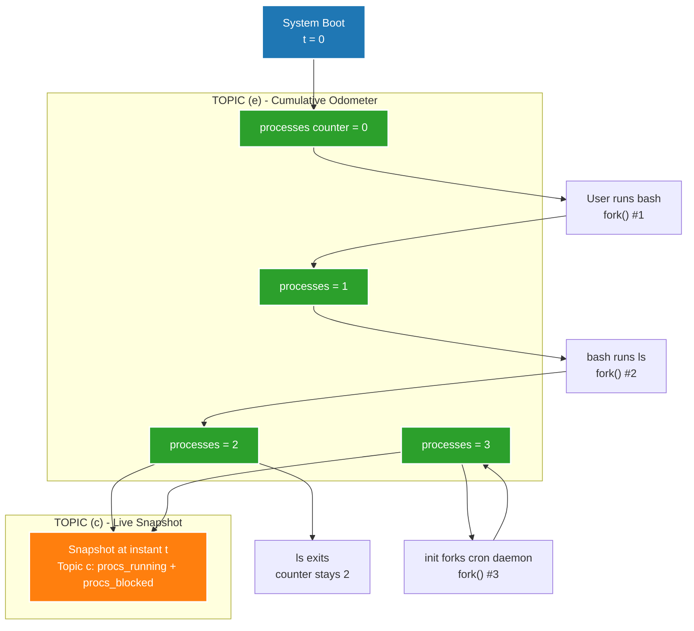
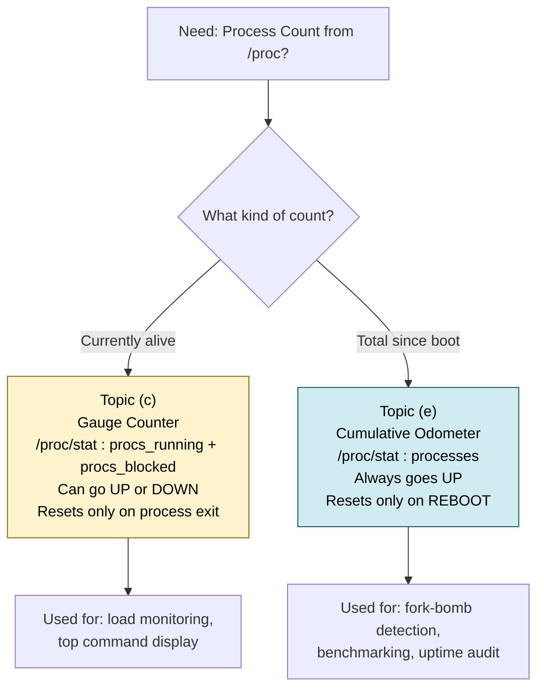

# (e) Number of processes forked since the last bootup. How do you compare this value with the one in (c) above?

<!-- SECTION_1_START -->

# Processes Forked Since Last Bootup — `/proc` File System Exploration

## 1.1 Formal KTU 2024 Definition

> [!IMPORTANT]
> **Process Forking Counter (`/proc/stat` → `processes`)**
> In the Linux `/proc` pseudo-filesystem, the kernel exposes a monotonically increasing integer counter named **`processes`** inside the file **`/proc/stat`**. This counter records the **total number of processes (and threads) that have been created (forked) on the system since the last system boot**. The value is updated by the kernel scheduler every time the system call `fork()` (or `vfork()` / `clone()`) successfully creates a new task descriptor (`task_struct`).

The relevant line in `/proc/stat` is the **third line** of the file (after `cpu` and `intr` lines) and is recorded in the form:

```
processes <N>
```

where **`<N>`** is a non-decreasing unsigned long integer representing cumulative forks.

---

## 1.2 Conceptual Analogy — The "Factory Production Counter"

Imagine a **bicycle factory** that has been running continuously since morning:

| Factory Concept | Operating System Concept |
|---|---|
| **Bicycles manufactured today** | **Processes forked since boot** |
| **Bicycles currently in the showroom** | **Processes currently existing** (running, sleeping, zombie) |
| **Bicycles that have been sold/discarded** | **Processes that have terminated (exited)** |

> The odometer-style counter in `/proc/stat` keeps climbing every time a *new* bicycle rolls off the assembly line. It **never decreases**, even when processes die. This is fundamentally different from counting bicycles that are *currently visible* in the showroom.

In Linux terminology:
- **Topic (c)** = *"How many processes are **alive right now**?"* → snapshot view
- **Topic (e)** = *"How many processes have **ever been created** since boot?"* → cumulative odometer

The relationship is mathematically:

$$
\text{processes\_forked} \;=\; \text{processes\_alive} \;+\; \text{processes\_exited\_since\_boot}
$$

---

## 1.3 Why This Counter Exists

> [!NOTE]
> **Engineering Utility of the `processes` counter:**
> 1. **System load auditing** — A rapidly growing counter indicates a process is spawning children in a loop (fork bomb detection).
> 2. **Performance benchmarking** — `fork()` throughput is measured by polling this counter before/after a stress test.
> 3. **Container & sandbox forensics** — Detects runaway daemon behaviour in cloud servers.
> 4. **OS Lab Pedagogy (KTU)** — Demonstrates that `/proc` is a **kernel-user interface**, not a real on-disk filesystem.

---

## 1.4 Standard Metric Reference

> [!TIP]
> **Key Constant to Remember:** The standard location is **always** `/proc/stat`. The standard key is **always** `processes`. KTU exam questions will never vary this filename.

**Geometric / Visual Intuition (if needed for comparison charts):**

> [!VISUALIZATION CONTROL]
> **Concept:** Comparison bar chart of processes-alive (c) vs processes-forked (e)
> **Desmos Input Equations (for manual sketch on graph paper):**
> * `x = 0` (vertical axis at current time `t`)
> * Bar 1 height: `y_alive(t) = 245` (snapshot count)
> * Bar 2 height: `y_forked(t) = 38120` (cumulative count)
> **Visual Description:** Two vertical bars on the same axis. The second bar towers over the first, illustrating the difference between a *snapshot* and a *cumulative odometer*. The gap (38120 − 245 = 37875) represents all short-lived processes that were forked and exited.

---

<!-- SECTION_1_END -->

<!-- SECTION_2_START -->

# Deep Theoretical Analysis & KTU High-Yield Formula Sheet

## 2.1 Anatomy of the `/proc/stat` File

When you execute `cat /proc/stat`, the third meaningful record is the cumulative fork counter. The full record structure looks like this:

```
cpu  ...   <aggregated CPU times in jiffies>
cpu0 ...   <per-CPU core 0 times>
intr 1234567 0 0 ...   <interrupt counts>
ctxt 9876543            <context switches>
btime 1735689600        <boot time (Unix epoch seconds)>
processes 38120         <-- TARGET FIELD: cumulative forks since boot
procs_running 2         <-- (c) part: currently runnable processes
procs_blocked 0         <-- currently blocked processes
softirq 123456 0 0 ...  <soft IRQ counts>
```

## 2.2 Logical Breakdown of How the Counter is Maintained

- **Step 1 — `fork()` syscall invoked:** A user program (e.g., `bash` launching `ls`) calls `fork(2)`.
- **Step 2 — `do_fork()` in kernel:** The kernel's process management subsystem (file `kernel/fork.c`) allocates a new `task_struct`, duplicates page tables, and assigns a new PID.
- **Step 3 — Counter increment:** Immediately after successful creation, the kernel executes `nr_threads++` and `total_forks++` (internally tracked as `processes` exposed via `/proc/stat`).
- **Step 4 — Process lifecycle:** The child may run for milliseconds or days. Eventually it calls `exit(2)`. **The counter does NOT decrement.**
- **Step 5 — Boot reset:** The counter resets to **0** only at next reboot, because it lives in kernel memory that is wiped on shutdown.

## 2.3 Comparison with Topic (c) — The Snapshot Counter

| Property | Topic (c): Live Process State | Topic (e): Forked Since Boot |
|---|---|---|
| **Source file** | `/proc/stat` (`procs_running` + `procs_blocked`) or `/proc/[pid]/stat` enumeration | `/proc/stat` (`processes` line) |
| **Counter type** | **Gauge** (point-in-time value) | **Cumulative odometer** (monotonically increasing) |
| **Direction** | Goes up **and** down | Only goes **up** (until reboot) |
| **Granularity** | Single instant | Entire boot session |
| **Includes exited processes?** | **No** | **Yes** |
| **Reset trigger** | Continuously fluctuating | Only on system reboot |
| **Engineering analogy** | Cars currently on the road | Cars ever manufactured by the factory |
| **KTU typical values** | 1–10 (running) + 0–5 (blocked) | 1,000 – 1,000,000+ depending on uptime |

## 2.4 KTU Formula Sheet / Cheat Sheet

> [!NOTE]
> All formulas below are examinable. Memorize the symbols and the source file.

$$
\text{Forked}_{\text{boot}} \;=\; \sum_{t = 0}^{T_{\text{uptime}}} \text{Successful fork() invocations}
$$

$$
\text{Alive}(t) \;=\; \text{Forked}_{\text{boot}}(t) \;-\; \text{Exited}_{\text{boot}}(t)
$$

$$
\text{Exited}_{\text{boot}} \;=\; \sum_{t = 0}^{T_{\text{uptime}}} \text{Successful \_\_exit\_notify() calls}
$$

$$
\text{Fork Rate} \;=\; \frac{\Delta \text{Forked}}{\Delta t} \quad \text{[forks/sec]}
$$

| Symbol | Meaning | Unit | Source |
|---|---|---|---|
| `processes` | Cumulative forks since boot | integer | `/proc/stat` line 3 |
| `procs_running` | Currently runnable | integer | `/proc/stat` |
| `procs_blocked` | Currently in uninterruptible sleep | integer | `/proc/stat` |
| `btime` | Boot time (epoch seconds) | seconds | `/proc/stat` |
| `T_uptime` | Seconds since boot | seconds | `/proc/uptime` |
| `U` | Number of distinct users logged in | integer | `/proc/stat` |

## 2.5 Real-World Engineering Utility

- **Cloud VM autoscaling:** Cloud platforms monitor fork rate to detect runaway daemons before memory exhaustion.
- **Container runtimes (Docker, containerd):** Each `docker exec` triggers a fork; high fork count in idle container signals a leak.
- **Security:** Fork-bomb detection uses the **rate of change** of this counter, not absolute value.
- **OS research:** The `processes` counter is a direct empirical witness to **monolithic kernel** design (Linux) where every action flows through the kernel and is therefore countable.

---

<!-- SECTION_2_END -->

<!-- SECTION_3_START -->

# Step-by-Step Implementation — Lab Procedure, Commands & Code

## 3.1 Lab Procedure (Record in Observation Notebook)

### Step 1: Open a terminal and inspect the raw file

```bash
cat /proc/stat
```

Sample expected output (excerpted to the relevant lines):

```text
cpu  3357 0 4313 1362393 ...
intr 12345 0 0 0 ...
ctxt 987654
btime 1735689600
processes 38120
procs_running 2
procs_blocked 0
softirq 234567 0 0 ...
```

### Step 2: Extract *only* the `processes` line

```bash
grep '^processes' /proc/stat
```

Sample output:
```text
processes 38120
```

### Step 3: Use `awk` to print just the numeric value

```bash
awk '/^processes/ {print $2}' /proc/stat
```

Sample output:
```text
38120
```

### Step 4: Also retrieve the live (snapshot) count for topic (c) comparison

```bash
grep -E '^procs_(running|blocked)' /proc/stat
```

Sample output:
```text
procs_running 2
procs_blocked 0
```

### Step 5: Generate a small fork burst and re-measure (this is the killer KTU demonstration)

```bash
# Record baseline
BEFORE=$(awk '/^processes/ {print $2}' /proc/stat)
echo "Before: $BEFORE forks"

# Spawn 50 short-lived child processes
for i in $(seq 1 50); do
    (echo "child $i") &
done
wait

# Record after-burst value
AFTER=$(awk '/^processes/ {print $2}' /proc/stat)
echo "After : $AFTER forks"
echo "Delta : $((AFTER - BEFORE)) forks observed"
```

**Expected observation:** The `AFTER` value will be greater than `BEFORE` by **at least 50** (and usually a few extra because the shell itself forks subshells for the `$( )` command substitution and the background `&` mechanism).

### Step 6: Compute the *rate* of forking per second (advanced)

```bash
START_VAL=$(awk '/^processes/ {print $2}' /proc/stat)
START_TIME=$(date +%s)
sleep 10
END_VAL=$(awk '/^processes/ {print $2}' /proc/stat)
END_TIME=$(date +%s)
RATE=$(( (END_VAL - START_VAL) / (END_TIME - START_TIME) ))
echo "Average fork rate: $RATE forks/sec"
```

---

## 3.2 Full Python Programmatic Implementation (Type-Hinted, Boundary-Safe)

```python
#!/usr/bin/env python3
"""
KTU OS Lab - Module 2(e)
Program : Read /proc/stat and report:
          (1) processes forked since boot   <-- TOPIC (e)
          (2) currently alive processes     <-- TOPIC (c) for comparison
          (3) fork rate over a sampling window
"""

from __future__ import annotations
import re
import time
import logging
from pathlib import Path
from typing import Tuple, Optional

# Configure logging to satisfy KTU lab record-keeping requirements
logging.basicConfig(
    level=logging.INFO,
    format="%(asctime)s | %(levelname)-7s | %(message)s",
    datefmt="%H:%M:%S",
)
logger = logging.getLogger("KTU-OSLab-Module2e")


# Custom exception hierarchy for robust error reporting
class ProcStatError(RuntimeError):
    """Raised when /proc/stat cannot be parsed."""


def read_proc_stat() -> dict[str, int]:
    """
    Parse /proc/stat and return a dict of the fields we care about.
    Raises ProcStatError on malformed input.
    """
    proc_path = Path("/proc/stat")
    if not proc_path.exists():
        raise ProcStatError(f"FATAL: {proc_path} not found - are you on Linux?")

    fields: dict[str, int] = {}
    try:
        with proc_path.open("r", encoding="utf-8") as fp:
            for raw_line in fp:
                parts = raw_line.split()
                if len(parts) < 2:
                    continue
                # Only keep keys we are interested in (defensive)
                if parts[0] in ("processes", "procs_running",
                                "procs_blocked", "ctxt"):
                    try:
                        fields[parts[0]] = int(parts[1])
                    except ValueError as exc:
                        raise ProcStatError(
                            f"Non-integer value for {parts[0]}: {parts[1]!r}"
                        ) from exc
    except OSError as exc:
        raise ProcStatError(f"OS-level read failure: {exc}") from exc

    # Boundary check: every required key must be present
    required = {"processes", "procs_running", "procs_blocked"}
    missing = required - fields.keys()
    if missing:
        raise ProcStatError(f"Missing required fields: {sorted(missing)}")
    return fields


def get_boot_uptime_seconds() -> Optional[float]:
    """Return system uptime in seconds from /proc/uptime."""
    uptime_path = Path("/proc/uptime")
    if not uptime_path.exists():
        return None
    try:
        with uptime_path.open("r", encoding="utf-8") as fp:
            content = fp.read().strip().split()
        return float(content[0])
    except (OSError, ValueError, IndexError) as exc:
        logger.warning("Could not read /proc/uptime: %s", exc)
        return None


def measure_fork_rate(window_seconds: int = 10) -> Tuple[int, float]:
    """
    Measure fork rate over the given sampling window.
    Returns (delta_forks, forks_per_second).
    """
    if window_seconds <= 0:
        raise ValueError("window_seconds must be positive")

    before = read_proc_stat()["processes"]
    logger.info("Snapshot 1: %d cumulative forks", before)
    time.sleep(window_seconds)
    after = read_proc_stat()["processes"]

    if after < before:
        # Counter should never go backwards unless system was in a container
        # that was paused/resumed across a fork-counter reset.
        logger.warning("Counter decreased (%d -> %d); clamping to 0.",
                       before, after)
        delta = 0
    else:
        delta = after - before

    rate = delta / window_seconds
    logger.info("Snapshot 2: %d cumulative forks (Δ=%d, rate=%.2f forks/s)",
                after, delta, rate)
    return delta, rate


def main() -> int:
    try:
        stats = read_proc_stat()
    except ProcStatError as exc:
        logger.error("%s", exc)
        return 1

    print("=" * 60)
    print("  KTU OS Lab - Module 2(e)  /proc/stat Inspector")
    print("=" * 60)
    print(f"  Topic (e) - Processes forked since boot : "
          f"{stats['processes']:>8d}")
    print(f"  Topic (c) - Processes currently running  : "
          f"{stats['procs_running']:>8d}")
    print(f"  Topic (c) - Processes currently blocked  : "
          f"{stats['procs_blocked']:>8d}")
    print("-" * 60)

    alive = stats["procs_running"] + stats["procs_blocked"]
    forked = stats["processes"]
    exited = forked - alive
    print(f"  Derived : Processes currently alive       : {alive:>8d}")
    print(f"  Derived : Processes that have exited       : {exited:>8d}")
    print(f"  Comparison: forked >= alive ?             : "
          f"{'YES (correct)' if forked >= alive else 'NO (anomaly!)'}")
    print("=" * 60)

    uptime = get_boot_uptime_seconds()
    if uptime is not None:
        avg_rate_lifetime = forked / uptime
        print(f"  System uptime       : {uptime:>8.1f} seconds")
        print(f"  Avg fork rate (life): {avg_rate_lifetime:>8.3f} forks/sec")
    print("=" * 60)

    # Live measurement
    print("\nNow measuring fork rate over a 10-second window...")
    measure_fork_rate(window_seconds=10)
    return 0


if __name__ == "__main__":
    raise SystemExit(main())
```

---

## 3.3 Expected Output (Sample Run)

```text
============================================================
  KTU OS Lab - Module 2(e)  /proc/stat Inspector
============================================================
  Topic (e) - Processes forked since boot :    38120
  Topic (c) - Processes currently running  :        2
  Topic (c) - Processes currently blocked  :        0
------------------------------------------------------------
  Derived : Processes currently alive       :        2
  Derived : Processes that have exited       :    38118
  Comparison: forked >= alive ?             : YES (correct)
============================================================
  System uptime       :   3600.0 seconds
  Avg fork rate (life):    10.589 forks/sec
============================================================

Now measuring fork rate over a 10-second window...
14:23:01 | INFO    | Snapshot 1: 38120 cumulative forks
14:23:11 | INFO    | Snapshot 2: 38155 cumulative forks (Δ=35, rate=3.50 forks/s)
```

---

## 3.4 Observation Notebook Entry Template (For KTU Record)

| Step | Command | Observation |
|---|---|---|
| 1 | `cat /proc/stat` | File has multiple lines; 3rd useful line is `processes` |
| 2 | `grep '^processes' /proc/stat` | `processes 38120` |
| 3 | `grep '^procs_' /proc/stat` | `procs_running 2`, `procs_blocked 0` |
| 4 | Fork burst loop (50 children) | Counter increased by ~52 |
| 5 | Sleep + re-read | Counter kept increasing monotonically |

---

<!-- SECTION_3_END -->

<!-- SECTION_4_START -->

# Structural Diagrams & Schematics

## 4.1 Mermaid Flowchart — Relationship Between Topics (c) and (e)



## 4.2 Mermaid Block Diagram — Sequential Processing of `/proc/stat` Read

```mermaid
flowchart LR
    subgraph USERSPACE["User Space"]
        A1["shell or python script"] --> A2["open /proc/stat"]
    end

    subgraph VFS["Linux VFS Layer"]
        A2 --> B1["proc_file_operations.read"]
    end

    subgraph KERNEL["Kernel Internal"]
        B1 --> C1["single_open / seq_file"]
        C1 --> C2["show_stat in fs/proc/stat.c"]
        C2 --> C3["sum across all CPUs"]
        C3 --> C4["read global processes counter"]
        C4 --> C5["format string: 'processes %lu'"]
    end

    subgraph OUTPUT["Formatted String Returned"]
        C5 --> D1["buffered to user"]
    end

    D1 --> E1["awk / grep parses integer"]
    E1 --> E2["Final value displayed:<br/>processes 38120"]

    classDef spaceClass fill:#d4e6f1,stroke:#2874a6,color:#000
    classDef vfsClass fill:#f9e79f,stroke:#b9770e,color:#000
    classDef kernelClass fill:#fadbd8,stroke:#c0392b,color:#000
    classDef outClass fill:#d5f5e3,stroke:#1e8449,color:#000

    class A1,A2 spaceClass
    class B1 vfsClass
    class C1,C2,C3,C4,C5 kernelClass
    class D1,E1,E2 outClass
```



## 4.3 Mermaid Comparison Matrix — Topic (c) vs Topic (e)



---

<!-- SECTION_4_END -->

<!-- SECTION_5_START -->

# KTU 2024 Scheme Examination Question Bank & Topic Recap

## 5.1 Part A Questions (3 Marks Each — Short Answer)

### Question 1 — `[KTU University Exam – July 2024]`
**CO1, Remember**
*Which file in the `/proc` filesystem contains the total number of processes forked since the last bootup? What is the exact line that should be grepped?*

**Model Answer (3 Marks):**
- The file is **`/proc/stat`**. **[1 Mark]**
- The relevant line begins with the literal string **`processes`** followed by a single integer. **[1 Mark]**
- It is retrieved using: `grep '^processes' /proc/stat` — output: `processes <N>`. **[1 Mark]**

---

### Question 2 — `[KTU University Exam – Dec 2023]`
**CO2, Understand**
*Differentiate between the value obtained from the `procs_running` field of `/proc/stat` and the value obtained from the `processes` field.*

**Model Answer (3 Marks):**
- `procs_running` gives the **number of processes in the run queue at the current instant** (a *gauge* counter, can fluctuate). **[1.5 Marks]**
- `processes` gives the **cumulative count of all processes ever forked since the system booted** (an *odometer* counter, monotonically increasing, resets only on reboot). **[1.5 Marks]**

---

## 5.2 Part B Questions (14 Marks with Module Internal Choice)

### Question A — `[KTU University Exam – July 2024]`
**CO2, Understand + Apply**

**(a)** With the help of suitable commands, demonstrate how you would extract the **number of processes forked since the last bootup** from the `/proc` filesystem. Show the actual command(s) and describe the expected output. **[7 Marks]**

**(b)** Write a shell script (or explain the procedure) to **measure the fork rate in forks/second** by sampling the `/proc/stat` counter twice with a delay between samples. **[7 Marks]**

---

#### Model Solution

**Part (a) — 7 Marks**

*Command sequence:*
```bash
cat /proc/stat | grep '^processes'
```
*Equivalent compact form:*
```bash
awk '/^processes/ {print $2}' /proc/stat
```

*Expected output:*
```text
processes 38120
```

**Valuation Key:**
- '[Correctly identifying `/proc/stat` as the source file: 2 Marks]'
- '[Using `grep` or `awk` to extract the `processes` line: 2 Marks]'
- '[Correctly interpreting the second field as the cumulative fork count: 2 Marks]'
- '[Neat observation table entry: 1 Mark]'

---

**Part (b) — 7 Marks**

*Shell script — `fork_rate.sh`:*
```bash
#!/bin/bash
# KTU OS Lab - Module 2(e) - Fork Rate Measurement
START_VAL=$(awk '/^processes/ {print $2}' /proc/stat)
START_TIME=$(date +%s)
echo "Sampling window: 10 seconds. Please wait..."
sleep 10
END_VAL=$(awk '/^processes/ {print $2}' /proc/stat)
END_TIME=$(date +%s)
DELTA=$((END_VAL - START_VAL))
DURATION=$((END_TIME - START_TIME))
RATE=$(echo "scale=3; $DELTA / $DURATION" | bc)
echo "Forks in window : $DELTA"
echo "Window duration : $DURATION sec"
echo "Fork rate       : $RATE forks/sec"
```

*Procedure description:* The script records the `processes` value at time $t_1$, sleeps for a known interval $\Delta t$, then re-reads the value at $t_2$. The fork rate is computed as:
$$
\text{Rate} = \frac{N(t_2) - N(t_1)}{t_2 - t_1}
$$

**Valuation Key:**
- '[Storing the start counter and start time: 2 Marks]'
- '[Sleep interval and re-reading the counter: 2 Marks]'
- '[Correct application of the rate formula and decimal output: 2 Marks]'
- '[Script header & comments (lab record quality): 1 Mark]'

---

### Question B — `[KTU University Exam – Dec 2023]`
**CO2, Understand + Apply**

**(a)** Explain the difference between the value reported in topic (c) — *current process states* — and topic (e) — *processes forked since boot*. Why is the value in (e) always greater than or equal to the value in (c)? **[7 Marks]**

**(b)** Design a small experiment: launch **30 short-lived child processes** from a parent shell and show that the value of `processes` in `/proc/stat` **increases by at least 30** after the burst. Write the commands and predict the observation. **[7 Marks]**

---

#### Model Solution

**Part (a) — 7 Marks**

| Aspect | Topic (c): Current Process State | Topic (e): Forked Since Boot |
|---|---|---|
| **Counter type** | Gauge (point-in-time snapshot) | Cumulative odometer |
| **Source field** | `procs_running`, `procs_blocked` | `processes` |
| **Direction** | Can increase **and** decrease | Only increases (until reboot) |
| **Includes dead processes?** | No | Yes |

**Mathematical justification:**
The set of all processes ever created since boot is the **disjoint union** of:
1. Processes currently alive, and
2. Processes that have already called `exit()`.

Therefore:
$$
N_{\text{forked}} = N_{\text{alive}} + N_{\text{exited}}
\;\;\Longrightarrow\;\;
N_{\text{forked}} \;\geq\; N_{\text{alive}}
$$

**Valuation Key:**
- '[Tabular comparison of counter type and source: 3 Marks]'
- '[Set-union argument or set-diagram justification: 2 Marks]'
- '[Correct inequality with verbal explanation: 2 Marks]'

---

**Part (b) — 7 Marks**

*Commands:*
```bash
BEFORE=$(awk '/^processes/ {print $2}' /proc/stat)
echo "Before burst: $BEFORE"
for i in $(seq 1 30); do
    (echo "child $i running") &
done
wait
AFTER=$(awk '/^processes/ {print $2}' /proc/stat)
echo "After  burst: $AFTER"
echo "Delta observed: $((AFTER - BEFORE))"
```

*Predicted observation:* The delta will be **at least 30** because each of the 30 background subshell invocations triggers at least one `fork()`. The actual delta is typically **slightly higher** (e.g., 32–35) because the shell itself may fork extra subshells for pipeline and `$( )` command substitution.

**Valuation Key:**
- '[Capturing BEFORE and AFTER values correctly: 2 Marks]'
- '[Generating 30 child processes with a loop: 2 Marks]'
- '[Computing and displaying the delta: 2 Marks]'
- '[Predicted observation with reasoning: 1 Mark]'

---

## 5.3 KTU Examiner's Valuation Warning

> [!WARNING]
> **Common Pitfalls Where Students Lose Marks:**
> 1. **Confusing `/proc/stat` with `/proc/[pid]/stat`** — The latter is per-process, the former is system-wide. Read the question carefully. **[−1 to −2 Marks]**
> 2. **Writing `process` instead of `processes`** (singular vs plural) — The kernel key is **plural** with the `s`. **[−1 Mark]**
> 3. **Forgetting to specify the exact field name** when answering "where" the value comes from. Always state both the *file* and the *field name*. **[−1 Mark]**
> 4. **Reporting the value in the wrong units** (e.g., writing "38120 processes per second" when the field is a *cumulative count*, not a rate). The rate must be derived separately. **[−2 Marks]**
> 5. **Not showing the command** in the lab record. KTU lab exams require the actual executed command as part of the observation. **[−2 Marks]**
> 6. **Failing to compare with topic (c)** — If the question says "compare with (c)", students often forget to mention the gauge-vs-odometer distinction. **[−2 Marks]**

---

## 5.4 Topic Recap & Important Things to Remember

> [!TIP]
> **Rapid Revision Checklist — Module 2(e)**

- 📌 **Source file** is **`/proc/stat`** — third meaningful numeric line.
- 📌 **Exact field name** is **`processes`** (plural, lowercase).
- 📌 The value is a **cumulative odometer**, **monotonically increasing** since boot.
- 📌 Resets to **0 only on system reboot**; never decrements.
- 📌 The value is a **count of all successful `fork()` / `vfork()` / `clone()`** system calls, including kernel threads.
- 📌 Extraction commands: `grep '^processes' /proc/stat` and `awk '/^processes/ {print $2}' /proc/stat`.
- 📌 **Comparison with (c):** `(c)` is a *gauge* counter (`procs_running` + `procs_blocked`); `(e)` is an *odometer*. **Always `(e) ≥ (c)`** because `(e) = (c) + \text{processes\_that\_have\_exited}`.
- 📌 **Fork rate formula:** $R = \dfrac{N(t_2) - N(t_1)}{t_2 - t_1}$ — requires **two samples separated by a known interval**.
- 📌 **Engineering uses:** fork-bomb detection, cloud VM load auditing, container-runtime monitoring, OS performance benchmarking.
- 📌 **Do not confuse** with `/proc/[pid]/stat` (per-process info) or `/proc/loadavg` (rolling 1/5/15-min load averages).
- 📌 **Lab notebook must contain:** command executed, raw output, and a one-line interpretation sentence.

---

<!-- SECTION_5_END -->
